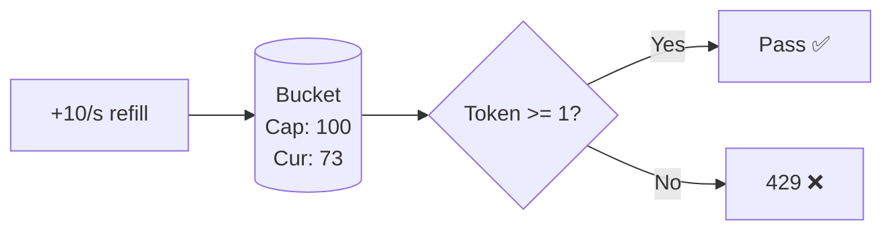
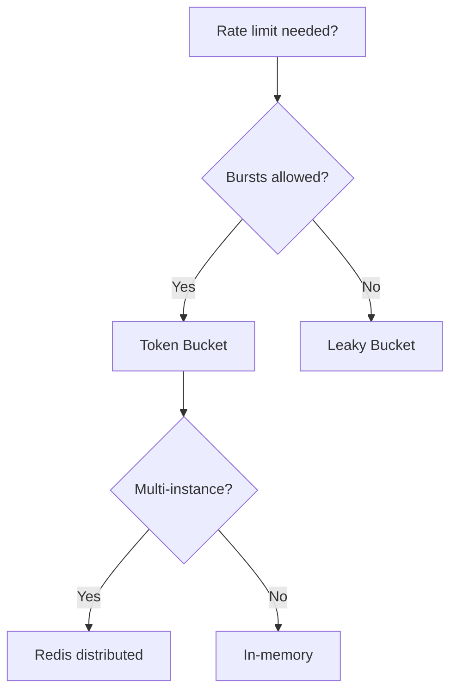

## Navigation

**Domain:** [[7 — System Design & Distributed Systems]] > **Group:** Scalability Patterns
**Previous:** [[7.240 — Competing Consumers — Scaling Workers]] | **Next:** [[7.242 — Rate Limiting — Leaky Bucket Algorithm]]

Token bucket allows short bursts up to capacity while enforcing a steady long-term rate. Each request consumes one token. Tokens replenish at a fixed rate. The critical property: capacity limits burst size, preventing the "boundary spike" problem of fixed window counters. Used in ASP.NET Core `TokenBucketRateLimiter`, Polly, and Redis distributed rate limiting.

---

## Core Mental Model

```
Bucket capacity = 100 tokens
Refill rate = 10 tokens/second
Idle 10s → bucket fills to 100
Burst: 100 requests in 1 second all pass
Steady state: 10 req/s, bucket stays near empty
```



---

## Deep Mechanics

### How It Works

Lazy refill: on each request, `elapsed = now - lastRefill`, add `elapsed × rate`, cap at capacity. Decrement by 1 if available.

```csharp
public sealed class TokenBucket
{
    private readonly double _capacity, _refillRate;
    private double _tokens;
    private long _lastRefillTicks;

    public TokenBucket(double capacity, double refillRatePerSecond)
    {
        _capacity = capacity; _refillRate = refillRatePerSecond;
        _tokens = capacity; _lastRefillTicks = Stopwatch.GetTimestamp();
    }

    public bool TryConsume(int count = 1)
    {
        Refill();
        if (_tokens < count) return false;
        _tokens -= count;
        return true;
    }

    private void Refill()
    {
        var now = Stopwatch.GetTimestamp();
        var elapsed = Math.Min(
            (double)(now - _lastRefillTicks) / Stopwatch.Frequency,
            _capacity / _refillRate * 2);  // Overflow protection
        _lastRefillTicks = now;
        _tokens = Math.Min(_capacity, _tokens + elapsed * _refillRate);
    }
}
```

### Failure Modes

- **No capacity cap** → infinite burst after idle. Always cap at `_capacity`.
- **Clock skew** with `DateTime.UtcNow` → erratic limiting. Use `Stopwatch.GetTimestamp()`.
- **Per-instance without coordination** → aggregate = instance_count × per_instance_limit. Use Redis.
- **QueueLimit > 0 hides latency** → P99 increases unexpectedly. Monitor queue depth.

### .NET and Azure Integration

- **ASP.NET Core:** `TokenBucketRateLimiter` in `Microsoft.AspNetCore.RateLimiting`
- **Polly v8:** `TokenBucketRateLimiter` as resilience strategy
- **Azure API Management:** `<rate-limit>` policy with renewal period
- **Nginx:** `limit_req zone=api rate=100r/s burst=50`
- **Redis:** Lua script for distributed token bucket

```csharp
// ASP.NET Core built-in
builder.Services.AddRateLimiter(options =>
{
    options.AddTokenBucketLimiter("Api", opt =>
    {
        opt.TokenLimit = 100;         // capacity (burst)
        opt.TokensPerPeriod = 10;     // refill rate
        opt.ReplenishmentPeriod = TimeSpan.FromSeconds(1);
        opt.QueueLimit = 0;           // fail fast
    });
});
app.UseRateLimiter();
```

---

## Production Patterns

### Per-Client Rate Limiter Middleware

```csharp
public sealed class RateLimitingMiddleware
{
    private readonly RequestDelegate _next;
    private readonly ClientRateLimiter _limiter;

    public async Task InvokeAsync(HttpContext context)
    {
        var clientId = context.Request.Headers["X-Api-Key"]
            .FirstOrDefault() ?? context.Connection.RemoteIpAddress?.ToString();

        var (allowed, remaining, retryAfter) = _limiter.TryConsume(clientId);

        context.Response.Headers["X-RateLimit-Limit"] = "100";
        context.Response.Headers["X-RateLimit-Remaining"] = remaining.ToString();

        if (!allowed)
        {
            context.Response.StatusCode = 429;
            context.Response.Headers["Retry-After"] = Math.Ceiling(retryAfter).ToString();
            await context.Response.WriteAsJsonAsync(new ProblemDetails
            {
                Status = 429, Title = "Too Many Requests"
            });
            return;
        }
        await _next(context);
    }
}
```

### Distributed Token Bucket (Redis Lua)

```csharp
private const string Script = @"
    local tokens = tonumber(redis.call('HGET', KEYS[1], 'tokens') or ARGV[1])
    local lastRefill = tonumber(redis.call('HGET', KEYS[1], 'lastRefill') or ARGV[3])
    local elapsed = math.max(0, tonumber(ARGV[3]) - lastRefill)
    tokens = math.min(tonumber(ARGV[1]), tokens + elapsed * tonumber(ARGV[2]))
    if tokens >= 1 then
        redis.call('HMSET', KEYS[1], 'tokens', tokens - 1, 'lastRefill', ARGV[3])
        return {1, tokens - 1}
    else
        redis.call('HMSET', KEYS[1], 'tokens', tokens, 'lastRefill', lastRefill)
        return {0, tokens}
    end
";
```

### Tiered Rate Limits

```csharp
builder.Services.AddRateLimiter(options =>
{
    options.AddTokenBucketLimiter("Free", o => { o.TokenLimit = 5; o.TokensPerPeriod = 10; });
    options.AddTokenBucketLimiter("Pro", o => { o.TokenLimit = 20; o.TokensPerPeriod = 100; });
    options.AddTokenBucketLimiter("Enterprise", o => { o.TokenLimit = 100; o.TokensPerPeriod = 1000; o.QueueLimit = 5; });
});
```

---

## Gotchas

- **No capacity cap** → infinite burst after idle. Always cap at `Math.Min`.
- **Clock-dependent refill** → erratic behavior after NTP. Use `Stopwatch`.
- **Per-instance bucket** → actual limit = instance_count × per_instance. Use Redis.
- **QueueLimit > 0** → hidden P99 latency. Monitor queue depth.
- **Rate limiting after expensive work** → resource wasted on rejected requests. Check before deserialization.
- **No Retry-After header** → client retries immediately. Always include on 429.

---

## Tradeoffs

| Dimension | Token Bucket | Leaky Bucket | Fixed Window |
|---|---|---|---|
| Burst tolerance | Yes (capacity) | No | Partial |
| Boundary spike | None | None | Yes |
| Memory | 2 ints per bucket | 1 int + queue | 1 counter + start |
| Distributed | Easy (Redis Lua) | Harder | Easy (INCR + TTL) |



---

## Architecture Decision Record

**Context:** Public API, 50k clients, Free/Pro/Enterprise tiers, mobile clients need burst support. 20 App Service instances.

**Decision:** Token bucket via Redis. Lua script for atomicity. Capacity = burst, refill = steady rate.

**Consequences:** ✅ Accurate cross-instance limits; ✅ Burst support; ✅ Tiered config; ⚠️ Redis dependency (+1ms); ❌ Lua on Redis Cluster requires script load to all nodes.

---

## Self-Check

1. Lazy refill: compute elapsed → add rate-scaled tokens → cap at capacity → consume.
2. `capacity` parameter allows burst after idle.
3. Token bucket replenishes continuously; fixed window resets, creating boundary spikes.
4. Redis Lua: atomically refill + consume in one `EVALSHA` call.
5. Cap elapsed at `capacity / refillRate * 2` to prevent overflow.
6. Headers: `X-RateLimit-Limit`, `X-RateLimit-Remaining`, `Retry-After`.
7. Token bucket: continuous refill + burst. Fixed window: hard reset per window.
8. Leaky bucket for constant output rate (streaming). Token bucket for burstable workloads (API).
9. Clock jump = erratic tokens. Use monotonic clock.
10. `QueueLimit = 0` → 429 immediately. `QueueLimit > 0` → queued, adds latency but reduces rejections.
