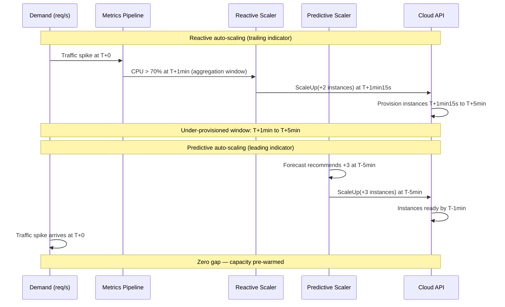
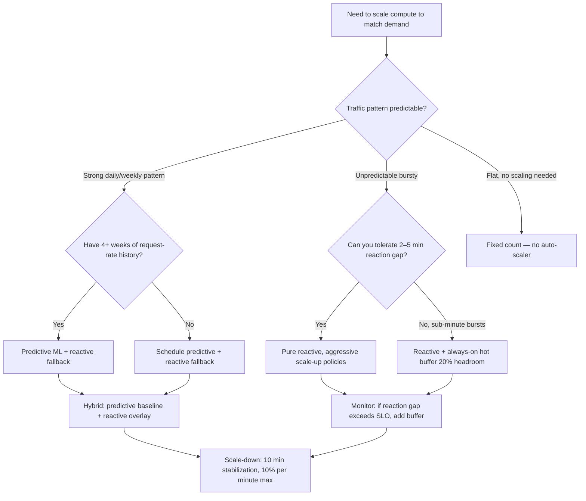

## Navigation

**Domain:** [[7 — System Design & Distributed Systems]] > **Group:** Scalability Patterns
**Previous:** [[7.232 — Consistent Hashing — Use Cases]] | **Next:** [[7.234 — Auto-Scaling — Kubernetes HPA]]

### Prerequisites

- [[7.210 — Load Balancing — Overview]] — auto-scaling assumes a load balancer can distribute traffic across a variable-size fleet; scale-out is meaningless without a distribution mechanism
- [[7.206 — Horizontal vs Vertical Scaling — Tradeoffs]] — auto-scaling automates horizontal scaling decisions; the stateless-service prerequisite for horizontal scaling is also a prerequisite for auto-scaling
- [[7.238 — Backpressure — Detection and Handling]] — reactive auto-scaling responds to backpressure signals (queue depth, latency), but backpressure is the last-resort protection for the gap between demand increase and capacity readiness

### Where This Fits

Auto-scaling solves the mismatch between provisioned capacity and actual demand. At low scale (1–3 instances, <1,000 req/s), the mismatch costs pocket change and causes rare degradations that manual scaling can handle. Above ~10 instances or ~5,000 req/s, the mismatch becomes financially significant (idle instances cost 30–50% of the monthly compute bill) and operationally dangerous (traffic spikes hit capacity ceilings). A .NET engineer encounters auto-scaling when configuring Azure App Service scale-out rules, tuning a Kubernetes HPA for a high-throughput API, or debugging a production incident where CPU hit 100% and the cluster did not scale in time. Without it, the team must choose between paying for peak capacity 24/7 or failing during every traffic spike.

---

## Core Mental Model

Auto-scaling adjusts compute capacity to match demand. The invariant is **supply follows demand** — the number of running instances is always a function of observed or forecasted load. The tradeoff that defines every auto-scaling strategy is timeliness vs. certainty: reactive scaling knows the actual load but acts after the fact (2–15 minute reaction gap); predictive scaling acts before the load arrives but risks being wrong (forecast error). The recognition trigger is a metric that correlates with saturation — CPU utilization above 70%, P99 latency exceeding the SLO, or queue depth growing faster than it drains — and the realization that the current instance count is fixed while demand varies.

### Classification

**For infrastructure and operations:** Auto-scaling operates at the compute-capacity abstraction layer. It replaces manual instance-count management with policy-driven automation, hiding the operational task of "how many VMs should be running right now?" behind metric thresholds and schedules. It explicitly does NOT handle connection-pool resizing, cache warm-up, or database connection-limit adjustments — these must be managed independently at the application layer.

**For distributed systems concepts:** Auto-scaling occupies the elasticity axis of the scalability cube — it automates the X-axis (horizontal cloning) over time. It does not address the Y-axis (functional decomposition) or Z-axis (data partitioning). It prevents the failure class of capacity exhaustion under variable load, but it does NOT prevent data loss, consistency violations, or deployment errors.

### Key Properties / Guarantees

| Property | Value | Condition |
|---|---|---|
| Capacity alignment | Reactive: matches demand within 2–15 min | Metrics pipeline + provisioning pipeline function correctly |
| Capacity alignment | Predictive: matches demand within seconds | Forecast error < 20% (requires stable traffic pattern) |
| Cost efficiency in steady state | Reactive: 20–50% idle buffer (scale-down is slow) | Scale-down thresholds are below scale-up thresholds by 20+ points |
| Cost efficiency in steady state | Predictive: 5–15% idle buffer | Forecast model is accurate within +/–15% |
| Availability protection | Prevents overload-caused outages | Reaction gap < system's overload tolerance window |
| Thrashing risk | Instability when thresholds overlap | Require stabilization window >= 5 min for scale-down |

### Recognition Triggers in Production

A senior engineer recognizes the need for auto-scaling from three signal classes:

**Latency-based triggers (leading indicator).** P99 response time exceeding the SLO (e.g., above 500ms for an API endpoint) while P50 remains normal indicates that a subset of requests are queueing behind saturated instances. This is the earliest warning — it appears before CPU rises because requests queue in the HTTP pipeline before they reach the application thread pool.

**Saturation-based triggers (concurrent indicator).** CPU > 70%, memory working set > 80%, or thread-pool queue depth growing indicates the instance is at capacity. These are the most commonly used triggers because they are universally available (every Azure VM reports CPU). The latency is that CPU is a trailing indicator — by the time CPU is at 80%, the system is already degrading.

**Queue-depth triggers (event-driven indicator).** For background processing, the queue depth (Azure Service Bus, RabbitMQ, or internal `Channel<T>`) is the direct measure of supply vs. demand. Queue depth growing means consumers are slower than producers. Queue depth is a leading indicator for CPU because messages queue before threads are created to process them.




## Deep Mechanics

### How It Works

Reactive auto-scaling follows a four-phase control loop: **Observe → Decide → Act → Cool down**.

**Phase 1 — Observe (metric aggregation):** The metrics pipeline collects per-instance metrics and computes an aggregate over a sliding window. Each metric source has a different latency:

| Metric Source | Aggregation Window | Typical Pipeline Latency |
|---|---|---|
| CPU / memory (Azure Monitor) | 1–5 min average | 1–2 min |
| Request rate (Application Insights) | 1 min sum | 30–60 s |
| Queue depth (KEDA polling) | Instant per poll | 5–15 s |
| Custom metric (Prometheus) | 15–30 s scrape | 15–30 s |

**Phase 2 — Decide (threshold evaluation):** The scaler evaluates the aggregated metric against the target value:

```
desiredInstances = ceil(currentInstances × observedMetric / targetMetric)

Example: CPU target = 50%, observed = 80%, current = 10
desiredInstances = ceil(10 × 80 / 50) = 16
```

For scale-down, a stabilization window prevents reacting to transient dips. The scaler keeps a history of desired replica counts over the window (default 5 minutes) and takes the MAXIMUM — scale-down only happens if the metric has been below threshold for the entire window.

**Phase 3 — Act (cloud API call):** The scaler calls the provisioning API. This is the slowest phase and dominates the reaction gap:

| Platform | Provisioning Time | Bottleneck |
|---|---|---|
| Azure App Service scale-out | 30–90 s | Site warm-up + startup |
| Azure VMSS (Windows) | 3–5 min | VM creation + extension scripts + health probe |
| AKS HPA (Pod creation) | 15–60 s | Image pull + readiness probe |
| AKS Cluster Autoscaler (node) | 2–5 min | VM creation + kubelet registration |

**Phase 4 — Cool down:** After a scale action, the scaler waits before evaluating again. This prevents reacting to metric noise caused by the scaling action itself — adding instances temporarily lowers per-instance CPU, which could trigger immediate scale-down if no cooldown existed.

Predictive auto-scaling replaces Phases 1–2 with a forecast model. Instead of "CPU is 80% now, scale up," the forecast says "request rate will be 10,000 req/s at 2:00 PM, scale to 20 instances at 1:50 PM." The forecast can be:

- **Schedule-based:** static time-of-day rules ("scale to 20 at 8:30 AM every weekday")
- **ML-based:** time-series model (Prophet, ARIMA) trained on 4+ weeks of request-rate history, capturing hourly, daily, and weekly seasonality
- **Event-based:** triggered by external signals (marketing campaign start, pre-scheduled sale)

The predictive output sets a **minimum capacity baseline**. The reactive layer evaluates on top of this baseline and scales up further if actual traffic exceeds the forecast. The final capacity is:

```
desired = max(predictiveBaseline, reactiveDemand)
```

### Worked Example — E-Commerce Holiday Peak

An e-commerce platform expects 5,000 req/s on Cyber Monday vs. a normal 500 req/s. Each instance handles 100 req/s at 50% CPU. Shutdown period: 3 minutes from the moment capacity is needed to the start of the spike.

**Reactive-only path:** At 11:55 AM traffic hits 2,000 req/s (20 instances needed, 10 running at 500 req/s each — each instance at 250% normal load, P99 latency goes from 200ms to 2,000ms). CPU crosses 70% at 11:56 AM. Azure Autoscale triggers scale-up by 2 instances, provisions them by 12:01 PM, and by that time traffic is at 3,000 req/s. The system spends 6 minutes under-provisioned, P99 latency hits 4 seconds, and the shopping cart service gets `503` timeouts. The holiday page revenue drops 12% in that window.

**Predictive-only path (with forecast miss):** Schedule pre-warms to 30 instances at 11:00 AM to handle the expected 5,000 req/s. If a flash deal causes an unforecasted spike to 8,000 req/s, the 30 instances saturate at 80% CPU — they degrade but serve traffic. The fault is that 20 excess instances ran all morning, wasting ~$50 in compute.

**Hybrid path (what the team implements):** Schedule-based predictive pre-warms to 20 instances at 10:00 AM (covers 2,000 req/s — expected morning surge). Reactive scales up an additional 2 instances per eval cycle when CPU exceeds 70%, provisioning an extra 30 instances over 15 minutes as traffic ramps from 2,000 to 5,000 req/s. Scale-down is blocked until 8:00 PM (post-peak). The hybrid improves P99 to 250ms during peak, eliminates revenue loss, and wastes only $12 on the 4 overhead instances that run during the morning build-up.

### Failure Modes

**Thrashing (oscillation):** The most common auto-scaling failure. Scale-up and scale-down thresholds are too close, the system adds and removes instances repeatedly, and each cycle wastes money and risks dropping in-flight requests.

*Detection:* Azure Monitor shows 4+ scale actions per hour. Kubernetes `kubectl describe hpa` shows the replica count oscillating between two values every 2–3 evaluation cycles.

*Recovery:* Widen threshold gap to at least 20 percentage points for CPU (scale-up at 70%, scale-down at 30%). Set scale-down stabilization window to 5+ minutes. Use separate stabilization windows for scale-up (0–60 s) and scale-down (5–15 min).

**Scale-up blocked by Azure single cooldown:** Azure Autoscope uses one cooldown value for both scale-up and scale-down (default 5 min). After a scale-down, the cooldown prevents the immediately needed scale-up when traffic returns. The system is stuck under-provisioned for the cooldown duration.

*Detection:* Azure Monitor autoscale run history shows "Cooldown active" messages while CPU exceeds 70%.

*Recovery:* Switch to Kubernetes HPA with separate `behavior.scaleUp` and `behavior.scaleDown` stabilization windows. If stuck on Azure, reduce cooldown to 2 min and rely on the 40-point threshold gap to prevent thrashing.

**Scale-down terminates instances with in-flight requests:** The scaler removes instances from the load balancer and terminates them immediately. Requests mid-processing return 502 errors.

*Detection:* HTTP 5xx spike correlates exactly with scale-down events in the autoscale run history. Load balancer logs show `connection_reset` errors during scale-down windows.

*Recovery:* Implement multi-phase scale-down: (1) deregister from load balancer, (2) wait for connection drain timeout (max request duration + buffer), (3) send SIGTERM, (4) terminate only when idle. In Kubernetes, set `terminationGracePeriodSeconds` to the P99 request duration plus 10 seconds.

**Metric pipeline stale-read failure:** The scaler reads metrics from a cache that is seconds stale. In a fast-moving burst, the metric source reports 10% CPU, the cache says 20%, but the actual CPU is 80%. The scaler sees 20% and decides to scale down — the worst possible direction.

*Detection:* Azure Monitor shows a 2–3 minute delay between the metric timestamp and the autoscale evaluation timestamp during bursts.

*Recovery:* Switch to a direct-metrics approach (Azure Monitor REST API with no caching, or Prometheus on AKS with a 15-second scrape interval). For Azure Autoscale, reduce the evaluation aggregation window to the minimum of 1 minute.

**ML model drift (predictive-only):** The forecast model was trained on traffic from the last 4 weeks, which had the usual 5× day/night ratio. A competitor launches a promotion, doubling evening traffic and shifting the peak by 2 hours. The model now recommends 10 instances at 8:00 PM when 20 are needed.

*Detection:* MAPE (mean absolute percentage error) of forecast vs. actual exceeds 30% for 3 consecutive evaluations. Azure Monitor shows the predictive baseline consistently below actual demand.

*Recovery:* Fall back to reactive-only scaling. Retrain the model on data including the new traffic pattern. Add an alert that pages the SRE team when MAPE exceeds 20%.

### .NET and Azure Integration

- **ASP.NET Core:** No built-in auto-scaling middleware. Application metrics are exported via `OpenTelemetry` or `AppMetrics` and consumed by Azure Monitor, which drives autoscale rules. The `MetricClient` from `Azure.Monitor.Query` can be used in a custom scaler to evaluate business-level metrics.
- **Azure Autoscale:** Native to Azure App Service, VMSS, and Azure Spring Apps. Configured via ARM/Bicep. Supports metric-based (CPU, memory, HTTP queue length) and schedule-based profiles. Single cooldown limitation requires careful threshold tuning.
- **KEDA:** Event-driven Kubernetes autoscaler. Scales on queue depth (Azure Service Bus, RabbitMQ, Kafka), request rate, or cron schedules. Installed via Helm. The `ScaledObject` CRD creates a hidden HPA. Supports scale-to-zero for background workers.
- **Azure Monitor autoscale predictive mode (preview):** ML-based forecasting that adjusts autoscale baselines. Configured via `predictiveAutoscalePolicy` in the autoscale settings resource.
- **Polly:** Not an auto-scaler, but `CircuitBreakerPolicy` provides a fallback when scaling is too slow — can return cached responses or throttle during the reaction gap.

```csharp
// Adapter: Custom metric exporter feeding Azure Monitor — enables business-level scale triggers

public sealed class CheckoutMetricExporter
{
    private readonly MetricClient _metrics;
    private readonly string _resourceId;

    public CheckoutMetricExporter(MetricClient metrics, string resourceId)
    {
        _metrics = metrics;
        _resourceId = resourceId;
    }

    public async Task ReportCheckoutRateAsync(
        double requestsPerSecond, CancellationToken ct)
    {
        await _metrics.AddMetricAsync(
            _resourceId,
            "checkout_requests_per_second",
            requestsPerSecond,
            ct);

        // This custom metric becomes available in Azure Monitor
        // An autoscale rule can reference it:
        // metricTrigger: {
        //   metricName: "checkout_requests_per_second",
        //   threshold: 500,
        //   operator: GreaterThan
        // }
    }
}
```

---

## Production Patterns and Implementation

### Primary Implementation

The production pattern for most cloud-native .NET services is a hybrid scaler: predictive (schedule-based or ML) handles the base load, and reactive handles unexpected spikes above the baseline. The following `HybridAutoScaler` implements both components.

```csharp
// Port: Hybrid auto-scaler — predictive schedule + reactive CPU/queue triggers

/// <summary>
/// Evaluates scaling decisions using both predictive (schedule-based) and
/// reactive (metric-threshold-based) signals, taking the maximum of both.
/// Designed for Azure Virtual Machine Scale Sets.
/// </summary>
public sealed class HybridAutoScaler
{
    private readonly ArmClient _armClient;
    private readonly MetricsQueryClient _metrics;
    private readonly ILogger<HybridAutoScaler> _logger;
    private readonly AutoScalerOptions _options;
    private DateTime _lastScaleAction;

    public HybridAutoScaler(
        ArmClient armClient,
        MetricsQueryClient metrics,
        ILogger<HybridAutoScaler> logger,
        IOptions<AutoScalerOptions> options)
    {
        _armClient = armClient;
        _metrics = metrics;
        _logger = logger;
        _options = options.Value;
    }

    /// <summary>
    /// Evaluates the current scaling state and applies a decision.
    /// Returns a <see cref="ScaleResult"/> indicating whether capacity changed.
    /// </summary>
    public async Task<ScaleResult> EvaluateAsync(
        string vmssId, CancellationToken ct)
    {
        if (DateTime.UtcNow - _lastScaleAction < _options.CooldownPeriod)
            return ScaleResult.Skipped("Cooldown active", _lastScaleAction);

        var currentCapacity = await GetCurrentCapacityAsync(vmssId, ct);
        var reactiveTarget = await ComputeReactiveTargetAsync(
            vmssId, currentCapacity, ct);
        var predictiveBaseline = ComputePredictiveBaseline();

        var desired = Math.Max(reactiveTarget, predictiveBaseline);
        desired = Math.Clamp(
            desired, _options.MinCapacity, _options.MaxCapacity);
        desired = ApplyStepLimit(currentCapacity, desired);

        if (desired == currentCapacity)
            return ScaleResult.NoChange(currentCapacity);

        await ScaleVmssAsync(vmssId, desired, ct);
        _lastScaleAction = DateTime.UtcNow;
        return ScaleResult.Scaled(currentCapacity, desired);
    }

    private async Task<int> ComputeReactiveTargetAsync(
        string vmssId, int currentCapacity, CancellationToken ct)
    {
        var cpuResult = await _metrics.QueryAsync(
            new MetricsQueryOptions
            {
                MetricNames = { "Percentage CPU" },
                TimeRange = new QueryTimeRange(TimeSpan.FromMinutes(5)),
                Granularity = TimeSpan.FromMinutes(1),
                Aggregations = { MetricAggregationType.Average }
            },
            vmssId,
            ct);

        var avgCpu = cpuResult.Value
            .First()
            .TimeSeries[0]
            .Data
            .Average(d => d.Average ?? 0);

        if (avgCpu > _options.ScaleUpCpuThreshold)
        {
            return (int)Math.Ceiling(
                currentCapacity * avgCpu / _options.TargetCpu);
        }

        if (avgCpu < _options.ScaleDownCpuThreshold
            && await IsCpuSustainedLowAsync(vmssId, ct))
        {
            return (int)Math.Floor(
                currentCapacity * avgCpu / _options.TargetCpu);
        }

        return currentCapacity;
    }

    private int ComputePredictiveBaseline()
    {
        var now = DateTime.UtcNow;
        return (now.Hour, now.DayOfWeek) switch
        {
            (>= 8 and < 12, DayOfWeek.Monday to DayOfWeek.Friday)
                => _options.PeakBaseline,
            (>= 13 and < 17, DayOfWeek.Monday to DayOfWeek.Friday)
                => _options.MidBaseline,
            (>= 22, _) or (< 6, _)
                => _options.OffPeakBaseline,
            _ => _options.DefaultBaseline
        };
    }

    private int ApplyStepLimit(int current, int desired)
    {
        var maxStep = desired > current
            ? _options.MaxScaleUpStep
            : _options.MaxScaleDownStep;
        var delta = Math.Clamp(
            desired - current, -maxStep, maxStep);
        return current + delta;
    }
}

public sealed record ScaleResult(
    string Status, int PreviousCapacity, int CurrentCapacity)
{
    public static ScaleResult Skipped(string reason, DateTime lastAction) =>
        new($"Skipped: {reason}", 0, 0);
    public static ScaleResult NoChange(int capacity) =>
        new("No change needed", capacity, capacity);
    public static ScaleResult Scaled(int from, int to) =>
        from < to
            ? new($"Scaled up from {from} to {to}", from, to)
            : new($"Scaled down from {from} to {to}", from, to);
}
```

### Configuration and Wiring

```csharp
// Program.cs — register the hybrid auto-scaler as a background service

public sealed class AutoScalerOptions
{
    public TimeSpan CooldownPeriod { get; set; } = TimeSpan.FromMinutes(1);
    public int MinCapacity { get; set; } = 3;
    public int MaxCapacity { get; set; } = 50;
    public int PeakBaseline { get; set; } = 15;
    public int MidBaseline { get; set; } = 10;
    public int OffPeakBaseline { get; set; } = 3;
    public int DefaultBaseline { get; set; } = 5;
    public double TargetCpu { get; set; } = 50;
    public double ScaleUpCpuThreshold { get; set; } = 70;
    public double ScaleDownCpuThreshold { get; set; } = 30;
    public int MaxScaleUpStep { get; set; } = 5;
    public int MaxScaleDownStep { get; set; } = 2;
}

builder.Services.Configure<AutoScalerOptions>(
    builder.Configuration.GetSection("AutoScaler"));

builder.Services.AddSingleton<ArmClient>(sp =>
    new ArmClient(new DefaultAzureCredential()));

builder.Services.AddSingleton<MetricsQueryClient>();
builder.Services.AddSingleton<HybridAutoScaler>();
builder.Services.AddHostedService<AutoScalerBackgroundService>();

public sealed class AutoScalerBackgroundService : BackgroundService
{
    private readonly HybridAutoScaler _scaler;
    private readonly string _vmssId;

    public AutoScalerBackgroundService(
        HybridAutoScaler scaler,
        IConfiguration config)
    {
        _scaler = scaler;
        _vmssId = config["AutoScaler:VmssId"]!;
    }

    protected override async Task ExecuteAsync(CancellationToken ct)
    {
        while (!ct.IsCancellationRequested)
        {
            var result = await _scaler.EvaluateAsync(_vmssId, ct);
            if (result.Status.StartsWith("Scaled"))
                _logger.LogInformation("{Status}", result.Status);

            await Task.Delay(TimeSpan.FromSeconds(15), ct);
        }
    }
}
```

### Common Variants

**KEDA event-driven (pure reactive, no predictive):** For background workers where demand is queue depth, not CPU.

```yaml
apiVersion: keda.sh/v1alpha1
kind: ScaledObject
metadata:
  name: order-processor
spec:
  scaleTargetRef:
    name: order-processor
  minReplicaCount: 0
  maxReplicaCount: 50
  triggers:
    - type: azure-servicebus
      metadata:
        queueName: orders
        messageCount: "10"
  advanced:
    horizontalPodAutoscalerConfig:
      behavior:
        scaleUp:
          stabilizationWindowSeconds: 0
          policies:
            - type: Pods
              value: 5
              periodSeconds: 10
        scaleDown:
          stabilizationWindowSeconds: 300
```

**Schedule-only predictive (no reactive, no ML):** For batch workloads where traffic windows are known in advance (ETL, report generation).

```csharp
// Azure Function — pre-warms batch processing capacity
[Function("PreWarmBatchPool")]
public async Task PreWarmAsync(
    [TimerTrigger("55 6 * * 1-5")] TimerInfo timer)
{
    await _vmss.UpdateAsync(WaitUntil.Completed,
        new VirtualMachineScaleSetPatch
        {
            Sku = new Sku { Capacity = 20 }
        });
}
```

### Real-World .NET Ecosystem Example

**KEDA + .NET background service on AKS** is the de-facto event-driven scaling pattern. A `ScaledObject` references a Deployment running a `ServiceBusProcessor` from `Azure.Messaging.ServiceBus`. KEDA polls the queue every 10 seconds; when messages exceed the threshold (default 10), it scales the Deployment up by creating a hidden HPA that adds Pods. When the queue drains, KEDA scales down to zero after a 300-second cooldown. This pattern is used by Siemens, Wipro, and multiple Microsoft internal services (per the KEDA adoption list).


## Gotchas and Production Pitfalls

### Scale-Down Kills Instances With In-Flight Requests

**Pitfall:** The auto-scaler decides to scale down and terminates instances immediately, dropping requests mid-processing.

```csharp
// ❌ Wrong — immediate termination, no connection draining
await _vmss.UpdateAsync(WaitUntil.Completed,
    new VirtualMachineScaleSetPatch
    {
        Sku = new Sku { Capacity = newCapacity }
    });
// Instances removed from fleet; in-flight requests get connection reset
```

**Symptom:** HTTP 5xx spike that correlates exactly with scale-down events. Load balancer logs show `connection_reset` errors during each scale-down window. Azure Monitor shows `Http5xx` rising simultaneously with `InstanceCount` dropping.

**Fix:**
```csharp
// ✅ Right — multi-phase graceful scale-down
// Phase 1: Deregister from load balancer (no new requests)
await _loadBalancer.SetInstanceDrainingAsync(instanceId, true);

// Phase 2: Wait for in-flight requests to complete
await Task.Delay(_options.ConnectionDrainTimeout);

// Phase 3: Check active requests before terminating
var active = await GetActiveRequestsAsync(instanceId);
if (active > 0)
    await Task.Delay(TimeSpan.FromSeconds(30));

// Phase 4: Send SIGTERM for graceful shutdown
await _compute.TerminateAsync(instanceId, force: false, ct);
```

**Cost of not fixing:** Each scale-down event causes a burst of request failures. For a service that auto-scales daily, this creates a recurring incident — users see errors every off-peak transition. The error rate becomes a standard part of the monitoring dashboard, which numbs the team to real failures.

### Azure Single Cooldown Blocks Scale-Up After Scale-Down

**Pitfall:** Azure Autoscale uses one cooldown value (default 5 min) for both scale-up and scale-down. After a scale-down action, the cooldown prevents the next scale-up even if traffic immediately returns.

```json
// ❌ Wrong — single cooldown in Azure Autoscale
{
    "scaleAction": {
        "direction": "Increase",
        "cooldown": "PT5M"
    }
}
// 2:00 PM: scale-down (CPU < 30% for 10 min)
// 2:01 PM: CPU spikes to 90% → scale-up BLOCKED by cooldown until 2:05 PM
// System under-provisioned for 4 minutes → 5xx errors
```

**Symptom:** After a traffic dip that triggered scale-down, the system is briefly under-provisioned when traffic returns. Azure Monitor autoscale run history shows "Cooldown active" messages while CPU exceeds 70%.

**Fix:**
```yaml
# ✅ Right — separate stabilization windows (Kubernetes HPA)
behavior:
  scaleUp:
    stabilizationWindowSeconds: 0    # Scale up immediately
    policies:
      - type: Percent
        value: 100
        periodSeconds: 60
  scaleDown:
    stabilizationWindowSeconds: 300   # Wait 5 min before scale-down
    policies:
      - type: Percent
        value: 10
        periodSeconds: 60
```

**Cost of not fixing:** Every traffic dip → scale-down → return cycle causes a 5-minute degradation window. For cyclical traffic (lunch dip, end-of-day dip), this creates daily incidents that the team learns to accept — normalizing degradation.

### Predictive Model Uses CPU as Input Feature

**Pitfall:** The ML model is trained on CPU utilization. CPU is a lagging indicator — it rises after request rate increases. The model predicts CPU from CPU, which cannot anticipate load changes.

```python
# ❌ Wrong — forecasting CPU from CPU history
cpu_history = get_metric("Percentage CPU", days=30)
forecast = prophet.predict(cpu_history, horizon=15)
# Forecast: "CPU will be 45% in 15 minutes"
# Actual: flash sale at T+5 minutes → CPU hits 95%
# Model saw nothing coming — trained on the wrong signal
```

**Symptom:** Predictive model shows MAPE > 40% during non-routine events. The system under-provisions during marketing campaigns, flash sales, or viral content spikes. The reactive fallback catches the error but lags by 3–5 minutes.

**Fix:**
```csharp
// ✅ Right — forecast request rate, not CPU
var requestRateHistory = await GetRequestRateHistoryAsync(days: 30);
var requestForecast = _prophet.Predict(requestRateHistory, horizon: 15);

// Use upper bound of prediction interval for safety margin
var forecastedInstances = Math.Ceiling(
    requestForecast.GetUpperBound(0.95) / _options.RequestsPerInstance);

// Reactive layer still uses CPU as safety net
var cpuTarget = await ComputeReactiveTargetAsync(vmssId, current, ct);
var final = Math.Max(forecastedInstances, cpuTarget);
```

**Cost of not fixing:** The predictive component provides negative value — it makes the system LESS responsive by instilling false confidence. The team attributes "predictive scaling handled it" until the first flash sale causes a production outage.

### Autoscaler Colocated With the Workload It Scales

**Pitfall:** The auto-scaler process runs on the same VMs or in the same Kubernetes cluster as the workload. When the workload is under high load, the auto-scaler cannot make scaling decisions because its own metrics queries time out.

```yaml
# ❌ Wrong — autoscaler pod in same Deployment as workload
apiVersion: apps/v1
kind: Deployment
spec:
  template:
    spec:
      containers:
        - name: api             # Workload
        - name: custom-scaler   # BAD: colocated — throttled when API is busy
```

**Symptom:** During high load, the service should scale up but does not. The auto-scaler logs show timeouts querying metrics or calling the cloud API. The service eventually runs out of capacity and returns 503s.

**Fix:** Always run the auto-scaler on separate infrastructure — Kubernetes HPA runs in `kube-controller-manager` (control plane), Azure Autoscale runs on Azure infrastructure, and KEDA runs on its own Deployment with guaranteed resource reservations.

**Cost of not fixing:** The auto-scaler fails exactly when it is most needed — during high load. The system becomes unavailable because the scaling loop itself crashed.

### Scale-Down Cascade From Short Stabilization Window

**Pitfall:** The scale-down stabilization window is too short (60 seconds), so the system cascades from 10 instances to 2 in 4 minutes as each scale-down triggers another within the window.

```yaml
# ❌ Wrong — 60-second stabilization window causes cascade
behavior:
  scaleDown:
    stabilizationWindowSeconds: 60
    policies:
      - type: Percent
        value: 25
        periodSeconds: 60
# 10 → 8 → 6 → 4 → 2 in 4 minutes — each step takes 60 seconds
```

**Symptom:** Replica count drops in a cascade over 3–5 minutes during off-peak hours. The system ends at `minReplicas` even though average load would support 2× that.

**Fix:** Set scale-down stabilization to minimum 5 minutes and rate-limit to 10% or 1 Pod per minute:

```yaml
# ✅ Right — 5-min stabilization, 10% per minute max
behavior:
  scaleDown:
    stabilizationWindowSeconds: 300
    policies:
      - type: Percent
        value: 10
        periodSeconds: 60
```

**Cost of not fixing:** The system bottoms out at minimum capacity overnight. The morning traffic ramp-up catches it under-provisioned, causing a daily 5xx spike at 8–9 AM that becomes a "normal" part of operations.

---

### Predictive Forecast Buffers the Wrong Metric

**Pitfall:** The predictive model is trained on request rate and produces a capacity forecast, but the reactive layer reads CPU. During a deployment with a memory leak, CPU stays at 30% while memory climbs to 95%. The predictive model says "low request rate expected — 5 instances needed," the reactive layer sees 30% CPU and does not scale up, and the system runs out of memory.

**Symptom:** OOM kills happen during low-traffic periods when the predictive model is most confident. The reactive layer does not override because the metric it reads (CPU) is not the one that predicts failure.

**Fix:** Feed the forecast into the reactive metric, or use composite thresholds. The predictive baseline should be expressed in the same metric the reactive layer evaluates:

```csharp
// ✅ Right — predictive baseline becomes a CPU floor
var forecastCpu = _forecastModel.PredictNext(TimeSpan.FromMinutes(5));
var effectiveCpu = Math.Max(actualCpu, forecastCpu);
// Scale decision uses effectiveCpu instead of actualCpu
```

If memory grows monotonically (leak), add a memory threshold as a secondary scale-up trigger. Scale-up when CPU > 70% OR memory > 80%.

**Cost of not fixing:** The system appears healthy on CPU but degrades silently on other resources. Incidents happen at "safe" times, and root-cause analysis blames the wrong component because the auto-scaler looks correct on its primary metric.

---

### Stale Historical Data Produces Confident but Wrong Forecasts

**Pitfall:** The ML model was trained on 8 weeks of data. A product launch changed traffic patterns (peak shifted from 10 AM to 2 PM), but the model was not retrained. The forecast is statistically confident (low p-value, tight confidence intervals) but systematically wrong — it recommends 15 instances at 10 AM when 10 are needed, and 10 at 2 PM when 25 are needed.

**Symptom:** The forecast plot shows tight confidence bands, so operations trusts it. But actual demand consistently falls outside the band at the shifted peak hour. MAPE climbs from 12% to 38% over three weeks.

**Fix:** Retrain the model weekly on a sliding window. Track MAPE in production and page when it exceeds 20%. Implement a drift detector: if the actual-vs-forecast error exceeds 2 standard deviations for 3 consecutive evaluations, fall back to reactive-only and fire a retraining pipeline.

```yaml
# Alert rule for forecast drift
- alert: ForecastDrift
  expr: mape{model="forecast-v1"} > 0.2
  for: 3h
  labels:
    severity: page
  annotations:
    summary: "Forecast MAPE exceeds 20% — falling back to reactive"
```

**Cost of not fixing:** The team has confidence in a model that is systematically wrong. Each peak-hour period is under-provisioned by 60%, causing daily latency degradation that gradually becomes a "normal" part of operations, eroding the SLO.

---

### Scale-Up Drift from Asymmetric Instance Lifetime

**Pitfall:** Each scale-up creates new instances with the latest OS image, patches, and application version. Over 3 months, "new" instances autoscaled during peak periods run a newer software stack than "old" instances created during the initial deployment. The old instances are never replaced because scale-down preferentially terminates newer instances (or the scaler uses a round-robin policy that terminates based on instance ID, not age).

**Symptom:** Two groups of instances coexist in the same VMSS: a "golden fleet" of 8 old instances running v1.0 (created during initial deployment) and a "ephemeral fleet" of 6 new instances running v1.3 (created by scale-up events). The v1.3 instances process requests 15% faster due to a performance fix, but they get terminated first during scale-down because the VMSS periodic policy stops the newest instance. After 3 months of daily scale-out/scale-in cycles, 80% of the fleet runs v1.0.

**Fix:** Use an instance refresh policy that periodically replaces all instances with the latest image. Set the VMSS `upgradePolicy` to `Rolling` with a 20% max unhealthy. Alternatively, use a lifecycle hook that prevents instances older than 30 days from serving traffic:

```yaml
# ✅ Right — VMSS rolling upgrade with max surge
upgradePolicy:
  mode: Rolling
  rollingUpgradePolicy:
    maxBatchInstancePercent: 20
    maxUnhealthyInstancePercent: 20
    maxSurge: 20
```

**Cost of not fixing:** The fleet silently stagnates. New instances that carry performance fixes, security patches, and configuration updates are the first to be removed. The system's "effective" performance degrades over months, and the team assumes the application got slower when it is actually the instance composition that regressed.

---

## Tradeoffs and Decision Framework

### Tradeoff Matrix

| Dimension | Reactive (Metric-Triggered) | Predictive (Schedule) | Predictive (ML Forecast) | Hybrid |
|---|---|---|---|---|
| Reaction gap | 2–15 min | None (pre-warmed) | None (pre-warmed) | None for predictable; 2–15 min for surprises |
| Cost efficiency | 20–50% idle buffer | 10–20% idle buffer | 5–15% idle buffer | 10–20% idle buffer |
| Operational complexity | Low (threshold config) | Low (cron schedule) | High (model training, monitoring) | Medium (two systems to tune) |
| Traffic pattern fit | All patterns | Recurring only | Recurring + seasonal | All patterns |
| Historical data needed | None | Traffic timing knowledge | 4+ weeks request-rate history | 4+ weeks for ML component |
| Risk of under-provision | Low (reacts to actual) | Medium (wrong schedule) | High (forecast error) | Low (reactive catches errors) |
| .NET / Azure tooling | Azure Autoscale, HPA, KEDA | Azure Autoscale profiles | Azure Monitor predictive mode (preview) | Custom implementation |

### When to Apply



### When NOT to Apply

- [ ] **Traffic is flat at < 30% of maximum single-instance capacity.** Fixed instance count is simpler; auto-scaling adds complexity with no cost benefit.
- [ ] **Instance startup time exceeds the traffic spike duration.** If a VM takes 10 minutes to provision but traffic spikes last 3 minutes, auto-scaling cannot keep up. Always-on buffer capacity is required.
- [ ] **The service is stateful and cannot scale horizontally.** Auto-scaling assumes new instances are identical and interchangeable. If each instance holds unique session state or local data, adding or removing instances violates data integrity.
- [ ] **The team cannot maintain a predictive model.** ML-based predictive scaling requires weekly retraining, forecast error monitoring, and incident response for model drift. Without this investment, predictive scaling adds risk without reward.
- [ ] **Cost of idle capacity is negligible.** If running peak-sized instances 24/7 costs < $200/month, auto-scaling is over-engineering.

### Scale Thresholds

- "Reactive CPU-based scaling is adequate up to ~500 req/s per instance — beyond that, CPU becomes too noisy (GC spikes, JIT warm-up) and request-rate-based or queue-depth-based triggers are more reliable."
- "Reactive queue-depth scaling becomes necessary above ~1,000 req/s per instance — the request queue grows faster than CPU can react; queue depth is a leading indicator while CPU is lagging."
- "Predictive scaling becomes cost-effective above ~20 instances — the idle-cost savings from pre-warming (eliminating the 20–50% reactive buffer) offset the ML infrastructure overhead."
- "Schedule-based predictive is sufficient up to ~50 instances — beyond that, manual schedule maintenance becomes impractical."
- "Hybrid scaling is the default above ~100 instances — no single approach is adequate at this scale."
- "Metrics evaluation period should be ≤ 15 seconds for sub-minute burst tolerance — default Azure Monitor aggregation windows (5–10 minutes) are too coarse for bursty workloads."

### Metric Selection Decision Tree

```mermaid
flowchart LR
    A[Which metric drives the scale decision?] --> B{Does the service serve<br>user-facing HTTP traffic?}
    B -->|Yes| C{Can you measure<br>request rate per instance?}
    C -->|Yes| D[Use request rate<br>Threshold: 80% of per-instance capacity]
    C -->|No| E[Use CPU + P99 latency<br>Threshold: 70% CPU OR P99 > 500ms]
    B -->|No — background worker| F{What is the input source?}
    F -->|Queue (SB/Rabbit/Kafka)| G[Use queue depth<br>Threshold: 10 msgs per worker]
    F -->|Event Hub / Kafka| H[Use consumer lag<br>Threshold: 1000 events behind head]
    F -->|Cron / schedule| I[Use time-of-day<br>Fixed schedule with reactive override]
    D --> J[Monitor: scale action latency vs. SLO]
    E --> J
    G --> J
    H --> J
    J --> K{Error rate > 5%?}
    K -->|Yes| L[Override scaler — double capacity immediately]
    K -->|No| M[Continue normal evaluation cycle]
```

**Key insight for this decision tree:** The metric determines the direction of the causality chain. CPU-based scaling has a feedback problem: adding instances lowers average CPU, which can trigger scale-down, which raises CPU again. Request-rate-based scaling does not have this feedback loop — adding instances does not change the incoming request rate. Queue-depth-based scaling has the strongest signal because it directly measures the backlog of work vs. the processing capacity.

## Interview Arsenal

### Question Bank

1. [Definition] What is the difference between reactive and predictive auto-scaling?
2. [Mechanism] Walk through the four-phase control loop of a reactive auto-scaler.
3. [Tradeoff] When would you choose reactive over predictive auto-scaling?
4. [Failure mode] What is auto-scaling thrashing and how do you prevent it?
5. [Comparison] Compare Azure Autoscale with Kubernetes HPA — when would you use each?
6. [Design application] Design an auto-scaling strategy for an e-commerce site that sees 10× traffic on Black Friday.
7. [Scale] A social media app has unpredictable traffic spikes from viral content. How do you auto-scale for sub-minute burst response?
8. [Advanced] Explain how a hybrid predictive + reactive auto-scaler handles the conflict between pre-warmed capacity and CPU-based scale triggers.

### Spoken Answers

**Q1: What is the difference between reactive and predictive auto-scaling?**

> **Average answer:** Reactive scales based on current metrics like CPU. Predictive scales based on forecasts of future traffic.

> **Great answer:** The fundamental difference is whether the scaling action happens before or after the demand change. Reactive auto-scaling observes current metrics — CPU utilization, request latency, queue depth — and triggers a scaling action when a threshold is breached. The problem is the reaction gap: by the time CPU reaches 70%, the traffic spike is already here, and new VMs or containers typically take 2 to 15 minutes to provision and pass health checks. During those minutes, the system is under-provisioned and users experience degraded performance. Predictive auto-scaling closes that gap by forecasting demand minutes to hours ahead — using either a time-of-day schedule ("scale to 20 at 8:30 AM every weekday") or an ML model trained on 4+ weeks of request-rate history with seasonal decomposition. The instances are ready BEFORE the traffic arrives. The tradeoff is that reactive is simple and works for any traffic pattern, while predictive only works for recurring patterns and requires ongoing model maintenance. Production systems use a hybrid: predictive handles the base load, and reactive catches unexpected spikes as a safety net. For example, an e-commerce site uses schedule-based predictive to pre-warm 80 instances before Black Friday morning, and reactive CPU triggers handle the residual if traffic exceeds the forecast.

**Q3: When would you choose reactive over predictive auto-scaling?**

> **Average answer:** When traffic is unpredictable.

> **Great answer:** Reactive is always the correct starting point; predictive is an optimization layer on top of a working reactive system. You choose reactive-only when three conditions hold. First, traffic is unpredictable — viral content, flash sales, or DDoS — because predictive systems fail on patterns they have not seen. Second, no historical data exists — a brand-new service has no traffic history to train a forecast model, so you run reactive for the first 4 to 8 weeks to establish a baseline. Third, the team lacks bandwidth for ML maintenance — and I mean real maintenance, not a one-time model fit. ML-driven predictive scaling requires weekly retraining, MAPE monitoring, drift detection, and fallback engineering. If your team can spare 2 to 4 hours per week per model, predictive is an option; otherwise, reactive with careful threshold tuning is more reliable. There is an unspoken fourth reason: scale. Below 3 instances or 1,000 req/s, neither reactive nor predictive matters because manual scaling is simpler and the cost difference is negligible. The key insight for the interviewer is that reactive and predictive are not a binary choice — they form a maturity curve. You start reactive, add schedule-based predictive when you see a weekly pattern, add ML predictive when you need tighter cost optimization, and always keep the reactive safety net for forecast errors.

**Q6: Design an auto-scaling strategy for an e-commerce site that sees 10× traffic on Black Friday.**

> **Average answer:** Set up predictive scaling to pre-warm instances before the event, and use CPU-based reactive for unexpected spikes.

> **Great answer:** Let me structure this as a three-phase plan covering preparation, execution, and scale-down. In the preparation phase, 2 weeks before Black Friday, I analyze the previous year's traffic trace — request rate by hour, session duration, checkout conversion rate, and the flash-sale windows that caused the most database pressure. I use this data to build a schedule-based predictive profile that pre-warms capacity in tiers: 4× normal at 6 AM (early shoppers), 7× at 10 AM (mid-morning peak), 10× at 12 PM (lunch-hour peak), and 8× after 4 PM. Each pre-warming step happens 30 minutes before the expected ramp — so at 5:30 AM, 9:30 AM, and 11:30 AM — to account for the 3-minute VM provisioning time. I do not trust ML for a single-day event because one year's pattern may not repeat exactly, and a mis-forecast at 10× scale wastes $ thousands.
>
> During execution, the reactive layer uses request rate (not CPU) as its primary trigger, because CPU will be artificially lowered by the pre-warmed fleet. I set the request-rate threshold at 80% of the per-instance capacity — roughly 160 req/s per instance on a 4-CPU VMSS — and scale up by 20% per evaluation cycle. The stabilization window for scale-up is 0 seconds (we want to add capacity immediately), and the rate limit is 100 instances per 5 minutes (matching the cloud API rate limit). For scale-down, I set a 30-minute stabilization window because Black Friday traffic sometimes has false troughs — a lull between the lunch and evening peaks that lasts 10 to 15 minutes.
>
> For scale-down, critical rule: block all scale-down between 6 AM and 10 PM. I set a hard `minReplicas` of 50 for the entire event day. The 10× traffic event costs 8 to 12 hours at elevated capacity — trying to scale down aggressively during the event saves $50 at the cost of risking a 5-minute outage that loses $100k in revenue. After 10 PM, scale-down resumes with a 15-minute stabilization window and a rate limit of 10% per 5 minutes. Finally, I add a circuit breaker: if the error rate exceeds 5% for 3 consecutive minutes, override auto-scaling and double the current capacity immediately — this catches unexpected failure modes like a partner API slowing down and tying up request threads.

**Q5: Compare Azure Autoscale with Kubernetes HPA.**

> **Average answer:** Azure Autoscale scales App Services and VMSS; HPA scales Pods in Kubernetes.

> **Great answer:** They operate at different abstraction layers with different cooldown models. Azure Autoscale works at the PaaS/IaaS layer — it scales Azure App Service plans and VMSS instances. It uses a single cooldown period (default 5 minutes) for both scale-up and scale-down — you cannot independently tune how fast the system scales up versus how cautiously it scales down. It supports schedule-based predictive profiles and integrates with Azure Monitor metrics out of the box. Kubernetes HPA operates at the Pod level within a cluster and supports separate stabilization windows for scale-up and scale-down via the `behavior` field, rate-limiting policies (add max N Pods per minute), and custom metrics via the `custom.metrics.k8s.io` API. HPA does NOT support predictive scaling natively — that requires KEDA's `ScaledObject` with cron triggers or a custom solution. The practical choice: use Azure Autoscale when your app runs on App Service or VMSS and you need a simple one-config setup. Use HPA on AKS when you need fine-grained control — separate stabilization windows for up and down, percentage-based rate limits, custom metric sources, and the ability to scale to zero via KEDA. Many production .NET systems use both: HPA for Pod-level scaling on AKS and Cluster Autoscaler for node-level scaling.

**Q8: Explain how a hybrid predictive + reactive auto-scaler handles the pre-warmed capacity conflict.**

> **Great answer:** In a hybrid auto-scaler, the predictive component pre-warms instances based on a schedule or forecast. This pre-warmed capacity means the average CPU utilization across the fleet is lower than it would be without predictive scaling — because the fleet is already sized for predicted demand, not current demand. The conflict arises when the reactive component uses CPU as its trigger: CPU appears artificially low because the predictive layer already added capacity, so the reactive layer sees no need to scale up — even if actual traffic exceeds the forecast. The fix is decoupling metrics: the reactive layer must use request rate, queue depth, or error rate — not CPU — because these metrics are not lowered by pre-warming. The hybrid decision formula is `desired = max(predictiveBaseline, reactiveDemand)`. The predictive baseline sets the floor; the reactive demand, measured by request rate or queue depth, determines whether we need to go above that floor. The two components operate on orthogonal metrics — the predictive component schedules capacity for expected traffic, and the reactive component scales above that baseline only when actual traffic exceeds expectations. This ensures they never fight each other.

**Q (Follow-up): How do you avoid paying for idle instances during low traffic?**

> **Great answer:** This is a cooldown-and-minimum tuning problem, and the answer reveals your experience with real-world operational tradeoffs. The naive approach is to set `minReplicas` to 1 and let auto-scaling scale down to that single instance during off-peak hours. But a single instance must handle 100% of request volume during the downtime — if you normally run 10 instances at 50% CPU during peak, a single instance at off-peak might still be at 100% CPU during the worst moment of the off-peak period. The right approach is tiered minimums: set `minReplicas` to N where N handles the P99 off-peak load. For example, if off-peak traffic is typically 200 req/s and each instance handles 100 req/s before CPU exceeds 70%, `minReplicas` is 2. This avoids paying for the 3rd, 4th, and 5th idle instances.
>
> For aggressive cost optimization, use KEDA scale-to-zero with a queue. If the service is a background worker that processes from a queue and the queue is empty, KEDA scales to 0 Pods. The first message after idle waits ~40 seconds for startup — acceptable for background processing with a 5-minute SLA. The cost saving is significant: 8 hours of idle time at 3 Pods × $0.10/hour = $2.40/day saved per service, which adds up across 20 services.
>
> The gotcha that junior engineers miss: scale-down at night can trigger the cascade pitfall — each evaluation cycle removes a percentage of Pods, and without a long stabilization window, the system steps down from 10 to 1 in 4 to 5 cycles over 5 minutes, even if traffic is stable at low volume. This happens because the metric is slightly below the scale-down threshold, so it triggers every cycle. The fix is a sufficiently long stabilization window (300 seconds minimum) so that the metric must be below threshold for 5 minutes before any Pod is removed.

**Q2: Walk through the four-phase control loop of a reactive auto-scaler.**

> **Average answer:** Collect metrics, check threshold, scale up or down.

> **Great answer:** The control loop has four phases. Phase one is metric detection: the scaler collects metrics from a source like Azure Monitor, Prometheus, or the Kubernetes metrics-server. The collection interval determines how quickly the scaler sees changes — 15 seconds for metrics-server, 1 to 5 minutes for Azure Monitor custom metrics. Phase two is evaluation: the scaler compares the metric value against configured thresholds. For CPU-based scaling, it calculates the desired replica count as `ceil(currentReplicas × currentCPU / targetCPU)`. If CPU is at 80%, target is 50%, and current replicas are 10, the desired count is `ceil(10 × 80/50) = 16`. Phase three is action: the scaler calls the cloud API to add or remove instances. For Azure Autoscale, this calls the VMSS `CreateOrUpdate` API; for HPA, it updates the `scale` subresource of the Deployment. The cloud provider then provisions VMs or creates Pods. Phase four is cooldown: after a scaling action, the scaler waits before evaluating again to prevent thrashing. In Azure Autoscale, this is a single cooldown timer (default 5 minutes) that blocks all scaling in both directions. In HPA, the stabilization window applies to each direction independently — up can be 0 seconds while down is 300 seconds. The key tuning parameter in the loop is the Phase 4 stabilization window: too short causes thrashing, too long leaves the system under-provisioned.

**Q4: What is auto-scaling thrashing and how do you prevent it?**

> **Average answer:** Thrashing is when the system scales up and down repeatedly. Prevent it with a wider threshold gap and longer cooldown.

> **Great answer:** Thrashing is the oscillation between scale-up and scale-down actions caused by threshold overlap. It happens when the metric crosses both the scale-up and scale-down thresholds within a single evaluation cycle. The classic scenario: CPU hits 80% → scale up → new instances reduce average CPU to 30% → scale down → CPU returns to 80% → scale up. The cycle repeats every 5 to 10 minutes. To prevent thrashing, use three mechanisms in combination. First, separate thresholds by at least 40 percentage points — scale up at 70%, scale down at 30%. The wide gap creates a hysteresis band where the system stays at the current capacity even if the metric fluctuates. Second, set the scale-down stabilization window to 5 to 15 minutes — the metric must be below the threshold for the entire window before any removal happens. Third, rate-limit scale-down to 10% per minute so that even if the threshold is met, only a fraction of instances are removed per cycle. In HPA, this is configured via `behavior.scaleDown.policies` with `type: Percent, value: 10, periodSeconds: 60`. In addition to preventing thrashing, monitor the `scaleActionCount` metric — if it exceeds 4 actions per hour, investigate whether thrashing is occurring despite the safeguards.

**Q7: A social media app has unpredictable traffic spikes from viral content. How do you auto-scale for sub-minute burst response?**

> **Average answer:** Use a low CPU threshold so the system scales up quickly.

> **Great answer:** For sub-minute burst response, reactive auto-scaling alone is insufficient because of the reaction gap — even Kubernetes HPA takes 15 to 60 seconds from metric detection to Pod readiness. The strategy has three layers. Layer one is a always-on hot buffer: maintain 20% headroom (if normal traffic needs 10 Pods, set max to 12 and let a few be underutilized). This absorbs the first 30 seconds of the spike without any scaling action. Layer two is aggressive scale-up: set `stabilizationWindowSeconds: 0` for scale-up so the scaler adds Pods at the first sign of increased demand. Set the rate limit high — `type: Percent, value: 100, periodSeconds: 15` — so the system can add 100% of current Pods every 15 seconds. Start with 12 Pods, add 12 more in 15 seconds, add 24 more in the next 15 seconds — reaching 48 Pods in 45 seconds. Layer three is pre-pulled images and fast readiness: use an HPA with `startupProbe` that completes in under 5 seconds (pre-warmed .NET assemblies, connection pool ready). The 100% rate-limit strategy must be accompanied by a scale-down stabilization window of 10 minutes — without it, the system scales down as fast as it scaled up and oscillates. This strategy works for spikes up to 10× normal; beyond that, the hot buffer is exhausted before the new Pods are ready, and the system degrades. For larger spikes, use predictive scaling based on leading indicators like social media engagement metrics or upstream API call volume — if the content distribution network sees a URL being shared at 10× the normal rate, pre-warm the origin before the traffic arrives.

### System Design Interview Trigger

If an interviewer asks you to design a system and says "how does it handle traffic spikes?" or "what happens when a flash sale doubles traffic in 30 seconds?", they are testing your understanding of auto-scaling and specifically your awareness of the reaction gap. The follow-up probes reveal depth: "but new instances take 3 minutes to start — what happens in those 3 minutes?" tests whether you have a mitigation for the gap (hot buffer, queue, graceful degradation). "How do you avoid paying for idle instances during low traffic?" tests scale-down mechanics and cooldown tuning. "What if it's a DDoS attack, not a real traffic spike?" tests the distinction between scaling and security controls.

**How to recognize the trigger in a system design interview:** The interviewer does not say "let's talk about auto-scaling." Instead, they describe a system with variable load and ask "what happens when traffic doubles?" or "how does this handle peak hours?" or "how many servers does this need?" The moment you hear a question about capacity planning, provisioning, or traffic variability, you should recognize that auto-scaling is part of the answer. Connect it explicitly: "We use auto-scaling to match capacity to demand. Let me walk through the control loop — metric detection, evaluation, provisioning, readiness. This gives us ..."

**Anticipate these follow-ups:**
- "What if your metric signal lags?" — Talk about metric pipeline stale-read failure (2–3 min lag in Azure Monitor), recommend Prometheus with 15s scrape interval, or reduce aggregation window to 1 min.
- "What if the new instances crash on startup?" — Talk about readiness probes, startup probes with `initialDelaySeconds`, pre-pulled images, and canary deployments in the scale-out group.
- "What if you scale down and lose a node that was processing a long request?" — Talk about connection draining, SIGTERM handling with grace period, and checkpointing mid-job progress.
- "What about cost?" — Talk about KEDA scale-to-zero for queue-based workers, low `minReplicas` for API services, and schedule-based predictive to avoid over-provisioning.
- "What if the cloud provider runs out of capacity in that region?" — Talk about multi-region deployment with Azure Front Door, or an on-premises hot spare for critical workloads.

**Answer framework (use this when the auto-scaling question appears):**
1. Define the control loop (4 phases: monitor, evaluate, act, cooldown).
2. Quantify the reaction gap with the provisioning time of your chosen platform (30s AKS, 3min VMSS, 5min bare metal).
3. Name the two scaling dimensions (horizontal vs. vertical) and justify your choice.
4. State the cooldown/stabilization window sizes and WHY (asymmetric costs of over-provision vs. under-provision).
5. Mention the hybrid approach if traffic has ANY predictable component.
6. Close with the fallback: "If auto-scaling fails to keep up, we have a circuit breaker that overrides thresholds and doubles capacity when error rate exceeds 5%."

### Comparison Table

| | Reactive | Predictive | KEDA Event-Driven |
|---|---|---|---|
| Core guarantee | Matches capacity after load changes | Matches capacity before load changes | Matches capacity to event backlog |
| Trade-off | Reaction gap 2–15 min | Complex setup; fails on unexpected patterns | Requires queue-based architecture |
| .NET implementation | Azure Autoscale rules | Custom schedule or ML model | KEDA ScaledObject + ServiceBusProcessor |
| Failure mode | Thrashing, cold start lag | Forecast error, model drift | Queue poller scaling too slowly |
| When to choose | Unpredictable traffic, simple setup | Predictable traffic, cost optimization | Event-driven workloads, background processing |

---

## Architecture Decision Record

**Status:** Accepted under condition of traffic pattern review

**Context:** Our order-processing API runs on Azure VMSS with 10 instances during peak hours and 3 during off-peak. Traffic has a strong daily pattern (2× at 9 AM, 1.5× at 2 PM, flat evenings) but also sees occasional flash sales from email marketing campaigns (2–5× spikes with 5-minute ramp-up). Instance startup time is 3 minutes (VM provisioning + application startup + health check). We need to reduce the 40% idle-instance cost without increasing P99 latency above 500ms during unexpected spikes.

**Options Considered:**

1. **Reactive-only (CPU threshold at 70%)** — simple, proven, but the 3-minute startup lag plus 1-minute metric aggregation creates a 4-minute reaction gap. During a 5-minute flash sale ramp-up, the system is under-provisioned for most of the event.
2. **Schedule-based predictive + reactive fallback** — schedule pre-warmer to 15 instances at 8:30 AM and 13 at 1:30 PM. Reactive handles flash sales above the pre-warmed baseline. Reduces reaction gap to zero for predictable peaks; flash sales still see a 4-minute gap.
3. **ML-based predictive + reactive fallback** — Prophet model trained on 8 weeks of request-rate history with hourly and weekly seasonality. Would track day-of-week variation more accurately than a schedule. Requires weekly retraining and MAPE monitoring.

**Decision:** Schedule-based predictive with reactive fallback (Option 2), because we have a known traffic schedule but lack engineering bandwidth to maintain an ML model week over week. The schedule handles our known peaks; the reactive catch handles flash sale spikes (which are rare enough that a 4-minute reaction gap is acceptable given the 5+ minute ramp-up).

**Consequences:**
- ✅ Pre-warmed capacity handles 90% of daily peak traffic with zero reaction gap
- ✅ Reactive layer catches flash sales with 4-minute gap — acceptable because flash sale ramp-up is 5+ minutes
- ⚠️ Manual schedule maintenance required — quarterly review as traffic patterns evolve
- ❌ Flash sales with ramp-up under 4 minutes will see degraded P99 latency

**Review Trigger:** Revisit this decision if (a) flash sale frequency exceeds 1 per month (schedule updates too frequent), (b) flash sale ramp-up time drops below 3 minutes (reaction gap exceeds ramp-up), or (c) request volume grows 3× from current levels (schedule-based baseline no longer accurate).

**Decisions NOT Made (explicit deferrals):**
- We did NOT choose ML predictive (Option 3) because the team lacks the 2–4 hours/week for model retraining and monitoring. This decision is valid until traffic grows to 50+ instances — at that scale, the cost savings from tighter ML-based forecasting justify the ML investment.
- We did NOT choose vertical scaling (scale-up VM size) because the API is stateless and horizontally scalable. Vertical scaling has a hard ceiling (max VM size), requires restarts to change size, and does not reduce the blast radius of a single-instance failure.
- We did NOT implement KEDA scale-to-zero because the API must respond to the first request after idle within 500ms — a 40-second cold start from zero violates this requirement. The alternative is `minReplicas: 3` with a readiness probe that starts warming the application on the first request.

**Related ADRs:** See [[7.234 — Auto-Scaling — Kubernetes HPA]] for the decision to use HPA `behavior` policies instead of Azure Autoscale cooldown. See [[7.235 — Auto-Scaling — Cooldown Periods]] for the detailed analysis of stabilization window sizing.

---

## Self-Check

### Conceptual Questions

<details>
<summary>1. What is the reaction gap in auto-scaling?</summary>

The time between when demand increases and when new capacity serves traffic. Components: metric detection delay (1–5 min), evaluation delay (15–60 s), provisioning delay (30 s to 5 min), readiness delay (health check + warm-up). Total: 2–15 minutes typical. Predictive auto-scaling eliminates this for predictable traffic by scaling before demand arrives.
</details>

<details>
<summary>2. Why is scale-up stabilization shorter than scale-down stabilization?</summary>

Scale-up is urgent — the system is under-provisioned and degrading — so you act in 0–60 seconds. Scale-down is cautious — the load drop might be temporary — so you wait 5–15 minutes to confirm. The asymmetry reflects the asymmetric cost of being wrong: an extra instance costs money temporarily; a missing instance costs availability.
</details>

<details>
<summary>3. When would you choose reactive over predictive auto-scaling?</summary>

When traffic is unpredictable (viral content, flash sales, DDoS), when no historical data exists (new service), or when the team lacks bandwidth for ML maintenance. Reactive is always the correct starting point; predictive is an optimization layer on top of a working reactive system.
</details>

<details>
<summary>4. What metric reveals auto-scaling thrashing?</summary>

Azure Monitor `ScaleActionsInitiated` showing 4+ actions per hour. Cross-reference with `InstanceCount` oscillation and `Http5xx` spikes. In Kubernetes, `kubectl describe hpa` shows replica count alternating between two values every 2–3 evaluation cycles.
</details>

<details>
<summary>5. What is the difference between HPA stabilization window and a classic cooldown?</summary>

A classic cooldown blocks ALL scaling for a fixed duration. A stabilization window softens the decision by taking the MAXIMUM desired replica count within the last N minutes — preventing scale-down unless the metric has been below threshold for the entire window. Stabilization windows allow scale-up during the window (a cooldown would block it) and provide smoother transitions.
</details>

<details>
<summary>6. Compare Azure Autoscale single cooldown vs Kubernetes HPA behavior policies.</summary>

Azure forces one cooldown for both directions (default 5 min). HPA provides separate `behavior.scaleUp` and `behavior.scaleDown` sections, each with its own `stabilizationWindowSeconds` and rate-limiting `policies`. HPA supports percentage-based rate limits ("remove max 10% of pods per minute") while Azure only supports fixed-count steps ("add 2 instances"). See [[7.234 — Auto-Scaling — Kubernetes HPA]].
</details>

<details>
<summary>7. Below what scale is auto-scaling over-engineering?</summary>

Below 3 instances and below 1,000 req/s. Three idle instances cost ~$0.50/hour on Azure — negligible compared to the engineering time spent tuning thresholds and debugging thrashing. A fixed instance count with manual scaling is simpler and equally cost-effective at this scale.
</details>

<details>
<summary>8. How does auto-scaling relate to [[7.239 — Queue-Based Load Leveling]]?</summary>

Queue-based load leveling decouples request arrival from processing via a queue. Auto-scaling adjusts the number of processing instances based on queue depth. The queue absorbs spikes until auto-scaling adds capacity; auto-scaling removes capacity as the queue drains. Together they form an elastic event-driven pipeline.
</details>

<details>
<summary>9. What is the non-obvious consequence of setting HPA target CPU to 30%?</summary>

The system becomes hypersensitive — any minor traffic increase pushes CPU above 30%, triggering scale-up. The system is never below target, so it scales continuously, drifting toward `maxReplicas` and staying there. The opposite of the cost-saving goal — it effectively runs at max capacity 24/7.
</details>

<details>
<summary>10. Explain auto-scaling's role in system design in 60 seconds.</summary>

"Auto-scaling is the mechanism that turns cloud elasticity from a billing concept into a working operational practice. It adjusts compute capacity to match demand — horizontally, by adding or removing identical instances behind a load balancer. The core challenge is the reaction gap: the 2 to 15 minutes between when demand increases and when new capacity serves traffic. Reactive auto-scaling closes this gap after the fact by monitoring CPU, latency, or queue depth and triggering scale actions at thresholds. Predictive auto-scaling closes it before the fact by forecasting demand from schedules or ML models. Production systems use a hybrid: predictive pre-warmer for known peaks, reactive catches surprises. The key tuning parameters are the stabilization window — 5 minutes for scale-down to prevent thrashing — and the rate limit — 100% of pods per minute for scale-up, 10% per minute for scale-down. Without auto-scaling, you either pay for peak capacity 24/7 or fail during every traffic spike."
</details>

<details>
<summary>11. How does auto-scaling interact with connection pooling?</summary>

Auto-scaling adds instances, which creates new connection pools. Each new Pod opens N connections to SQL Server (pool size defaults to 100 in .NET). If 10 new Pods are created simultaneously, the database sees 1,000 new connections in seconds. If the database connection limit is 1,000, the existing Pods' connections get starved — the database rejects new connections from old Pods. The fix is to use Azure SQL with Serverless compute or provisioned connection limits that account for the maximum scaled-out instance count. Set `Max Pool Size` on the connection string to a value that allows N Pods × pool size = 70% of the database connection limit, reserving headroom for management tools and failover.
</details>

<details>
<summary>12. What happens to warm-up caches during scale-up?</summary>

Each new instance starts with an empty cache. The first requests to new instances miss the cache and hit the database, which increases database load at the same time as the traffic spike. This creates a double-hit pattern: the database sees the original traffic spike plus the cold-start cache misses from the new instances. Mitigations: (a) use a centralized cache (Redis) instead of per-instance caches so new instances share warm cache, (b) pre-populate the local cache during the readiness probe by running the top-10 most expensive queries before serving traffic, (c) set the HPA metric target lower (50% instead of 70%) so the system scales up BEFORE the existing instances are near capacity, reducing the chance that the new instance's cold cache causes a database bottleneck.
</details>

<details>
<summary>13. What monitoring metrics should you track for the auto-scaler itself?</summary>

Track five metrics. (1) `ScaleActionsInitiated` — count per hour, alert if > 4 (thrashing threshold). (2) `ScaleActionResult` — success/failure, alert on failure (cloud API rate limit, capacity quota exceeded). (3) `MetricValue` vs. target — the raw metric that drives scaling, showing whether the system reaches steady state or oscillates. (4) Instance startup time distribution — p50/p95/p99 of time from scale-up request to passing readiness probe; rising trend indicates image size bloat or startup regression. (5) Cost per instance-hour actual vs. expected — scaled-out hours divided by total hours; if the ratio is below 30% during peak hours, the scaler is over-provisioning.
</details>

<details>
<summary>14. How does auto-scaling handle a database connection limit during scale-up?</summary>

Each new instance opens a connection pool. If the autoscaler creates 10 new instances at once, the database sees 10× the configured pool size in new connections (default 100 in .NET SqlClient = 1,000 new connections). If the database connection limit is 1,000, existing instances lose their connections and the application enters a connection-retry loop, degrading throughput further. The solution is to (a) set `Max Pool Size` on the connection string to cap total connections per instance, (b) use a database proxy (Azure SQL Connection Pooler or PgBouncer for PostgreSQL) that multiplexes connections from many instances into a smaller pool, or (c) implement a pre-scale warmup phase where new instances connect to the database one at a time before serving traffic — the `startupProbe` runs a health check that includes a database connection attempt and only passes when the database confirms capacity.
</details>

### Scenario Challenges

**Scenario 1 — Diagnose the problem**

Your team deploys an order-processing API on AKS with HPA set to target 50% CPU. After a traffic spike, HPA scales from 10 to 30 Pods in 3 minutes. During those 3 minutes, 15% of requests return 502 errors. The on-call engineer checks `kubectl describe hpa` — no errors, HPA scaled correctly.

<details>
<summary>Diagnosis</summary>

**Root cause:** New Pods were created by HPA but did not pass readiness probes for 3 minutes (slow startup: image pull + JIT warm-up + EF Core model building). The Service routed traffic to the new Pods (their IPs were in the EndpointSlice) but the Pods returned errors because they were not ready.

**Evidence:** `kubectl get events --watch` shows Pods entering `Running` but taking 3 minutes to reach `Ready`. `kubectl get endpoints` shows new Pod IPs before they pass readiness probes.

**Fix:** Add a `startupProbe` with `initialDelaySeconds: 60` and `failureThreshold: 5`. Set `minReadySeconds: 30` on the Deployment to prevent considering a Pod ready until it has been healthy for 30 seconds.

**Prevention:** Pre-pull container images on cluster nodes. Use .NET ReadyToRun images to reduce JIT warm-up. Move DB connection pool initialization to a background warmup task.

**Follow-up — "The 502 errors stopped after 3 minutes. How do you verify the root cause was readiness, not something else?"**

"To rule out other causes: (1) Check HPA target metric — `kubectl get hpa -o yaml` shows the actual CPU metric value during the spike. If it was above 50%, HPA acted correctly and the issue is downstream. (2) Check Pod startup sequence — `kubectl describe pod <new-pod>` shows the `Readiness` condition changing from `False` to `True`. I look at the time gap between `Started` (container process running) and `Ready` (readiness probe passed). A gap > 30 seconds confirms readiness delay. (3) Check Service endpoints — `kubectl get endpoints <service>` shows new Pod IPs appearing before they are Ready, which is the root cause of the 502 errors. (4) Check application logs — if the new Pods were receiving traffic while in `Running` but not `Ready`, they logged connection errors during warm-up. Count those logs against the 502 rate — they should correlate 1:1."
</details>

**Scenario 2 — Design decision**

You are designing a background order-processing service that reads from Azure Service Bus. Message volume varies: 100 msg/s normally, 10,000 msg/s during flash sales. Each message takes 50ms to process. Instance startup is 30 seconds. Choose a scaling strategy.

<details>
<summary>Decision and Reasoning</summary>

**Choice:** KEDA event-driven scaling with Azure Service Bus trigger, `minReplicaCount: 0`, `maxReplicaCount: 100`, `pollingInterval: 10s`, `cooldownPeriod: 300s`.

**Tradeoffs accepted:** Zero instances during idle (cost-optimal). Scale-up lag of ~40 seconds (10s polling + 30s startup) — messages queue in Service Bus during those seconds, which is acceptable given Service Bus's 80 GB queue limit and the fact that orders are not real-time (customers expect confirmation emails within minutes, not seconds).

**Cost analysis:** At 100 msg/s normal load, each message takes 50ms, so one Pod handles 20 msg/s (1000ms / 50ms). Normal load needs 5 Pods. At $0.10/Pod-hour on AKS, that is $0.50/hour during peak, zero during off-peak (scale-to-zero). Over 30 days with 12-hour peak/12-hour off-peak, cost is $180/month. Without scale-to-zero (3 Pods minimum always running), cost would be $216/month. The saving seems modest ($36/month), but the big win is the flash sale peak: 10,000 msg/s at idle would need 500 Pods pre-provisioned — an impossible cost. KEDA scales from 0 to 100 Pods in ~2 minutes during the flash sale, absorbing the burst with Service Bus as the buffer.

**Why not predictive instead of KEDA:** Predictive scaling would pre-warm Pods based on a schedule (e.g., 20 Pods at 10 AM every weekday). This works for the daily peak but misses flash sales entirely — the flash sale spike is not on any schedule. KEDA reacts to the actual queue depth, which captures both the daily pattern and the flash sale. Predictive would add cost (Pods running during scheduled windows that may not match actual traffic) without eliminating the KEDA trigger. The hybrid would be: KEDA as primary, with a schedule-based minimum during known high-volume windows (e.g., `minReplicaCount: 10` during 10 AM–2 PM) to reduce the initial scale-up lag from 40 seconds to ~10 seconds (KEDA evaluates, finds Pods already at 10, adds more as queue grows).

**Implementation sketch:**
```yaml
apiVersion: keda.sh/v1alpha1
kind: ScaledObject
metadata:
  name: order-processor
spec:
  scaleTargetRef:
    name: order-processor
  minReplicaCount: 0
  maxReplicaCount: 100
  triggers:
    - type: azure-servicebus
      metadata:
        queueName: orders
        messageCount: "10"
  advanced:
    horizontalPodAutoscalerConfig:
      behavior:
        scaleUp:
          stabilizationWindowSeconds: 0
          policies:
            - type: Pods
              value: 10
              periodSeconds: 10
        scaleDown:
          stabilizationWindowSeconds: 300
```
</details>

**Scenario 3 — Failure mode**

Your Azure App Service autoscale has CPU threshold 70% for scale-up, 30% for scale-down, cooldown 5 minutes. After a lunch-hour dip (CPU at 25% for 15 minutes), the app scales from 10 to 6 instances. Traffic returns at 2 PM, CPU spikes to 90%, but the app stays at 6 instances for 5 minutes, returning 503 errors.

<details>
<summary>Investigation and Fix</summary>

**Investigation steps:** (1) Check Azure Monitor autoscale run history — confirm scale-down action at ~1:30 PM. (2) Check cooldown status — shows "Cooldown active" from 1:30 to 2:05 PM. (3) Check CPU metric at 2:00 PM — 90% CPU but no scale-up because cooldown blocks it.

**Confirming evidence:** Autoscale run history: "Scale down to 6" at 1:30 PM, "Cooldown active" at 2:00 PM, "Scale up to 14" at 2:05 PM.

**Root cause analysis:** The cooldown was triggered by the scale-down action at 1:30 PM. Azure's single cooldown timer applies after ANY scale action — scale-up OR scale-down. Since cooldown lasts 5 minutes and the lunch-hour dip lasted 15 minutes, the cooldown expired at 1:35 PM. However, the system was at 6 instances (new steady state) and CPU was at 25% (below scale-up threshold), so no scale-up was triggered until traffic returned at 2:00 PM. At 2:00 PM, CPU spikes to 90%, but the SYSTEM is still cooling down from... wait. The actual cooldown was triggered by the scale-down at 1:30 PM, which expired at 1:35 PM. By 2:00 PM, the cooldown is no longer active. The real issue is that Azure Autoscale evaluates metrics using a 5-minute aggregation window — the metric sample at 2:00 PM includes data from 1:55 PM (low CPU), dragging the average below 70%. The system does not detect the spike until the next evaluation at 2:05 PM, when the aggregation window has shifted enough to include the 90% CPU data point. This is a metric aggregation delay, not a cooldown delay — a subtle difference that matters for the fix.

**Immediate mitigation:** Manually increase instance count in Azure Portal — bypasses autoscale cooldown AND the aggregation window.

**Permanent fix:** Switch to Kubernetes HPA with separate scale-up stabilization (0 seconds) and scale-down stabilization (300 seconds). This prevents scale-down from blocking scale-up. HPA evaluates metrics from the metrics-server every 15 seconds (not 5 minutes like Azure Monitor), detecting the CPU spike in 15 seconds instead of 5 minutes. If staying on Azure Autoscale, reduce cooldown to 2 minutes and widen threshold gap to 50 points (scale-up at 80%, scale-down at 30%).

**Post-mortem item:** Add alert for HTTP 5xx > 1% with instance count below threshold — pages engineering instead of waiting for user complaints.
</details>

**Scenario 4 — Scale it**

Your API handles 2,000 req/s on 10 instances (200 req/s each). You need 20,000 req/s next quarter. Instance startup: 2 minutes on VMSS, 30 seconds on AKS. How does auto-scaling fit?

<details>
<summary>Scaling Strategy</summary>

**Bottleneck this addresses:** At 20,000 req/s, 10 instances would need 2,000 req/s each — 10× current capacity. The fleet must grow to ~100 instances. Auto-scaling automates this 10× expansion and ensures instances are not running 24/7.

**How it helps:** (a) Predictive pre-warmer 80 instances during peak hours. (b) Reactive adds the remaining 20 when traffic exceeds forecast. (c) Scale-down to 10 at night saves ~80% compute cost.

**What it does not solve:** Database connections — 100 instances × 10 connections = 1,000 connections; the database must be scaled independently. Cache hit rate — smaller per-instance caches mean more misses; consider a centralized Redis cache. Deployment complexity — 100-instance rollout requires blue-green or canary.

**Implementation order:** (1) Migrate to AKS for 30-second startup. (2) Move DB to Azure SQL with connection pooling. (3) Implement HPA with 50% CPU target. (4) Add predictive via scheduled HPA min/max. (5) Monitor and tune over 2 weeks.

**Cost comparison:** 100 VMSS instances at $0.10/hour running 24/7 = $240/day. With auto-scaling (10 instances off-peak 12 hours, 100 instances peak 12 hours) = $132/day — a 45% saving. With AKS and scale-to-zero for non-critical endpoints, add another 10–15% saving. The auto-scaling itself costs nothing (Azure Monitor + HPA are included in the platform SKU). The main operational cost is the 2–4 hours per quarter to review and tune thresholds as the traffic pattern evolves.

**Monitoring plan for the scaling itself:**
- `hpa_desired_replicas` vs `hpa_current_replicas` — gap indicates provisioning bottleneck
- `scale_up_event_count` and `scale_down_event_count` over 24h — more than 10 events in 1h indicates thrashing
- Instance startup success rate — if new instances fail readiness probes > 10% of the time, fix the startup pipeline
- `kubectl top pods` on a representative 10-Pod sample — if CPU utilization across Pods has high variance (>30% stddev), the load balancer distribution is uneven and the HPA target metric is misleading
- Estimated cost saving vs. actual — track Azure cost per service per week to validate the auto-scaling is delivering the expected savings

**Follow-up — "What about the 100-instance blue-green deployment concern?"**

The deployment strategy for a 100-instance fleet requires careful coordination with auto-scaling. If you use a rolling update (default on AKS), the deployment controller replaces Pods gradually — 25% max surge, 25% max unavailable. During a new deployment, the controller creates 25 new Pods (surge) while terminating 25 old Pods. HPA sees 125 total Pods during the transition (100 original + 25 surge), computes average CPU based on 125 Pods, and decides the fleet is over-provisioned — triggering scale-down. The scale-down races against the deployment, terminating new Pods that just became ready.

The fix: pause HPA during deployments. Use a `preStop` hook in the Helm chart that sets HPA `minReplicas` to `currentReplicas + surge` during the rollout window. Alternatively, use a deployment strategy that does not surge — `maxSurge: 0` and `maxUnavailable: 1` — replacing Pods one at a time without changing the total count. This is slower (100 Pods × 30 seconds startup = 50 minutes rollout) but avoids the HPA race condition.
</details>

**Scenario 5 — Interview simulation**

The interviewer says: "Design a video transcoding service. Users upload short clips (30s to 10 min) at any time. Transcoding is CPU-intensive and takes 2× the video duration. How does the system handle variable upload volume?"

<details>
<summary>Model Response</summary>

"Let me clarify constraints first. What is the SLA from upload to output availability? Is cost optimization a priority? Assuming 30-minute SLA and bursty uploads, here is the strategy.

The system has three tiers: an upload API writing to Azure Blob Storage, a Service Bus queue holding transcoding job messages, and a pool of worker VMs pulling jobs from the queue, downloading source video, transcoding with FFmpeg, and uploading results. The queue decouples bursts from processing capacity.

For scaling, I use KEDA with Azure Service Bus queue depth as the trigger. When uploads arrive faster than workers can process, queue depth grows. KEDA polls every 10 seconds. When message count exceeds the threshold — say 5 per worker — it scales up the worker pool. Each worker transcodes about 6 ten-minute videos per hour (20 minutes each). At 100 uploads per hour, I need ~17 workers.

The key tuning consideration is the cooldown. Transcoding jobs take up to 20 minutes. I set the scale-down stabilization window to 30 minutes — 1.5× the max job duration — to avoid terminating a worker mid-job. Workers handle SIGTERM by checkpointing their current job and releasing it back to the queue with a visibility timeout, so no work is lost.

For cost, `minReplicaCount` is 0 — no workers run when the queue is empty. The first upload after quiet period waits ~40 seconds for startup, which is well within the 30-minute SLA."

**Follow-up — The interviewer says: "What if a 4K video with 30-minute transcoding time arrives when all workers are busy?"**

"This is a prioritization and queue-pattern question, not a scaling-only question. I would use two Service Bus queues: a priority queue for short videos and a best-effort queue for long videos. Workers process from the priority queue first. If the priority queue is backlogged, KEDA scales up priority workers independently of the best-effort pool. The high-priority pool has a higher `maxReplicaCount` and shorter cooldown to absorb bursts of short videos. The long-video queue accepts that its jobs may wait 2–3 hours during peak upload events — acceptable if the SLA is relaxed for longer content.

For the heavy 4K transcode itself, I would offload it to a dedicated Azure Batch pool with GPU instances rather than using the general-purpose KEDA pool. The GPU pool has its own scaling schedule based on job queue depth and can be pre-provisioned because heavy transcodes are typically scheduled (marketing content drops), not viral uploads."

**Follow-up — "What metrics prove the system is working correctly?"**

"I track four metrics. First, `queue_depth` divided by `worker_count` gives the backlog per worker — growing means scale-up too slow. Second, `job_age_seconds` for the oldest message in the queue — if it exceeds 50% of the SLA, page engineering. Third, `worker_utilization` as a percentage of total time spent transcoding vs. idle — if below 60% during non-peak hours, scale down more aggressively. Fourth, `scale_action_latency` — the time from KEDA evaluating the trigger to the new Pod passing readiness probe. This reveals whether the scale-up pipeline has a bottleneck (image pull, config map load, secret sync)."

</details>

**Scenario 6 — Design-time decision**

You are building a real-time analytics dashboard that aggregates 10,000 events/second from IoT devices. Each event is a JSON payload (2 KB), enriched with device metadata (Redis lookup), aggregated into 1-minute windows, and served via a WebSocket API. Traffic follows a 24-hour cycle with 3× day/night ratio but includes unpredictable spike days (firmware update pushes). Instance startup is 45 seconds (warm containers with pre-built aggregates). Design the auto-scaling strategy.

<details>
<summary>Solution and Rationale</summary>

**Architecture summary:** IoT devices emit events to Azure Event Hubs (ingestion). A stream processor (Azure Functions on AKS with KEDA) reads from Event Hubs, enriches from Redis, writes 1-minute windowed aggregates to Azure Cosmos DB. A WebSocket API on Azure App Service serves the aggregates to dashboards.

**Scaling strategy for the stream processor:** Use KEDA Event Hubs trigger — `consumerGroup` lag is the scaling metric. KEDA polls Event Hubs partition offset vs. current position every 10 seconds. When lag exceeds 1,000 events per partition, scale up by 2 Pods per evaluation. Since enrichment involves a Redis read (~1ms per event), each Pod processes ~500 events/second. At 10,000 events/second, baseline is 20 Pods. During firmware update pushes (50,000 events/second), KEDA scales to 100 Pods.

**Scaling strategy for the WebSocket API:** Use Azure Autoscale with schedule-based predictive for the 3× day/night ratio (pre-warm to 10 instances at 7 AM, scale to 4 at 10 PM). Reactive fallback uses CPU at 60% threshold — during firmware push days, more users refresh dashboards, increasing WebSocket connections and CPU. Stabilization window: 0 seconds for scale-up (users expect sub-second dashboard refresh), 10 minutes for scale-down (users stay on dashboards during lunch — connection count dips but returns).

**Key tuning decisions:**
- `cooldownPeriod: 120` seconds for the Event Hubs processor — shorter than default 300 because IoT events are unidirectional and the system should scale down quickly after a firmware push.
- `pollingInterval: 10` seconds — must be faster than the 1-minute aggregation window to react within a single window.
- Scale-down stabilization: 600 seconds (10 minutes) for the WebSocket layer — connection count fluctuates even within a steady traffic period because users open and close dashboards.

**Failure mode specific to this system:** If Redis is slow (high `INFO commandstats` microseconds), enrichment time per event doubles from 1ms to 2ms. The Pod's effective throughput drops from 500 events/s to 250 events/s. KEDA sees lag growing and scales up more Pods — which in turn creates more Redis connections and makes Redis slower. Positive feedback loop.

*Detection:* Redis `connected_clients` metric rising while Redis latency (`instantaneous_ops_per_sec` dropping) indicates connection overload, not event overload.

*Fix:* Add a circuit breaker in the enrichment module — if Redis P99 latency exceeds 10ms, fall back to a local LRU cache with 60-second TTL and replicate Redis to handle the additional load. Then scale-up decisions are driven by event throughput, not Redis-side effects.
</details>

**Scenario 7 — Real-time chat system with sub-second burst**

A live-streaming chat system handles 1,000 messages/second during normal streams and 50,000 messages/second during popular streamer events. Each message is broadcast to 10,000–100,000 connected WebSocket clients. Message processing includes profanity filter, rate-limit check, and fan-out to Redis Pub/Sub channels. Instance startup: 5 seconds (pre-warmed container pool). The system runs on AKS with KEDA. Design the scaling strategy.

<details>
<summary>Solution and Tradeoffs</summary>

**Architecture:** Chat messages arrive via WebSocket connections to a fleet of AKS Pods. Each Pod maintains WebSocket connections and publishes incoming messages to Redis Pub/Sub. A fan-out worker subscribes to Redis channels and forwards messages to connected clients in the same Pod. The scaling challenge is bidirectional: more messages require more processing capacity, but the Pod count is also tied to the number of concurrent WebSocket connections (each Pod handles ~10,000 connections due to memory limits).

**Primary scaling metric:** Connection count, not message rate. The bottleneck is memory per Pod (each WebSocket connection holds ~10 KB of buffers and state). When connection count exceeds 8,000 per Pod (80% of the 10,000 limit), scale up. Message processing is secondary — each message is a lightweight Redis publish (~200μs), so even 50,000 msg/s is handled by 5 Pods at full fan-out.

**Secondary scaller (KEDA):** Use a custom `PrometheusScaler` that reads the per-Pod connection count from a `/metrics` endpoint. Scale up when any Pod exceeds 8,000 connections. Scale down when the running average across all Pods drops below 5,000 connections for 5 minutes.

**Predictive component:** Schedule-based predictive pre-warms to 20 Pods during known streamer schedules (extracted from a calendar API). This eliminates the initial scale-up lag when a popular streamer goes live. Without predictive, KEDA would detect the connection surge at T+10s, request scale-up at T+15s, and new Pods register at T+20s — meaning the first 20 seconds of every popular stream have degraded fan-out. Predictive pre-warmer to 20 Pods at the scheduled stream time and allows KEDA to scale above that during surprise events.

**Key tuning parameters:**
- `pollingInterval: 5` seconds — must be faster than a typical stream start (30–60 seconds of rapid follower influx).
- `stabilizationWindowSeconds: 0` for scale-up — connection count growth during a stream start is monotonic; no risk of thrashing.
- `stabilizationWindowSeconds: 300` for scale-down — connection count sometimes dips during a stream (ad break, intermission) and returns. Scale-down too aggressively terminates Pods that are about to be needed again, causing a cascade.
- Pod startup: use a pre-warmed `pause` container pool that already has the application DLLs loaded (`.NET ReadyToRun` + `AssemblyDependencyResolver` warm-up). This reduces the "ready" time from 30 seconds to 5 seconds.

**What this does not solve:** WebSocket reconnection storm during scale-up. When KEDA adds Pods, the load balancer distributes new connections to the new Pods. But existing WebSocket connections are still on old Pods — the per-Pod connection count on old Pods does not decrease. The system scales up to handle NEW connections but never redistributes EXISTING connections. Over time, the first Pods accumulate the most connections and hit the Per-Pod limit while newer Pods are at 50%. The fix is a Pod-level connection drain: when a Pod exceeds 7,000 connections, it sends a `WS_CLOSE_RECONNECT` frame to the oldest 10% of its connections, asking them to reconnect. These reconnect via the load balancer and land on under-utilized Pods.
</details>
