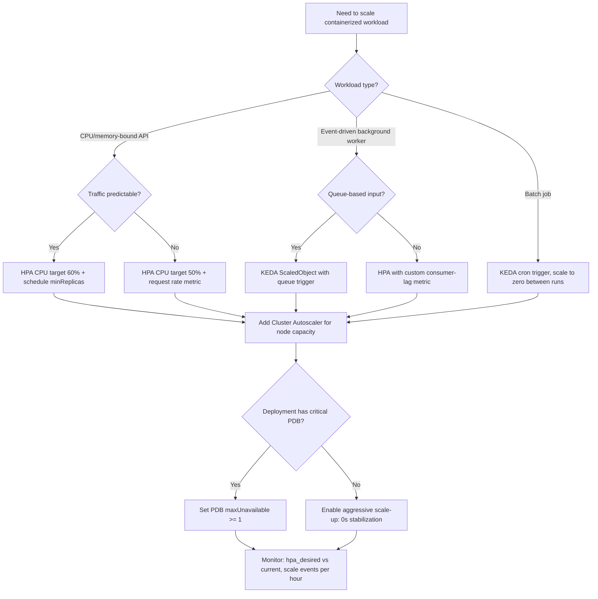

## Navigation

**Domain:** [[7 — System Design & Distributed Systems]] > **Group:** [[Group 6 — Scalability Patterns]]
**Previous:** [[7.233 — Auto-Scaling — Reactive vs Predictive]] | **Next:** [[7.235 — Auto-Scaling — Cooldown Periods]]

### Prerequisites

- [[7.233 — Auto-Scaling — Reactive vs Predictive]] — establishes the reactive/predictive dichotomy; HPA is a reactive auto-scaler at its core, though KEDA adds event-driven predictive-like behavior
- [[25.001 — Kubernetes Fundamentals — Pods and Deployments]] — understanding Pods, Deployments, CPU/memory resource requests and limits is required to understand HPA mechanics
- [[7.206 — Horizontal vs Vertical Scaling — Tradeoffs]] — HPA implements horizontal scaling; the stateless-service prerequisite for horizontal scaling is also a prerequisite for HPA

### Where This Fits

Kubernetes Horizontal Pod Autoscaler is the de-facto standard for auto-scaling containerized workloads in production. Every .NET microservice deployed on AKS uses HPA. It solves the problem of matching Pod count to observed demand by periodically evaluating metrics (CPU, memory, or custom metrics) against configured targets and scaling the Deployment's replica count accordingly. Without HPA, teams either over-provision Pods (wasting cost) or manually adjust replica counts during traffic shifts (creating availability risk and toil). HPA is necessary above ~3 replicas or ~1,000 req/s — below that, fixed replica counts are simpler and equally cost-effective.

---

## Core Mental Model

Kubernetes Horizontal Pod Autoscaler (HPA) maintains the invariant that the average observed metric value across all Pods equals the configured target value. It achieves this through a 15-second control loop that computes `desiredReplicas = ceil(currentReplicas × currentMetric / targetMetric)` and applies stabilization windows to prevent oscillation. HPA trades perfect metric tracking (which would cause thrashing) for bounded approximation via stabilization windows and rate limits. The recognition trigger in a production system is a Deployment whose Pod count changes automatically in response to traffic shifts — along with the operational questions "why did it scale up at 2 AM?" and "why is it not scaling down?"

### Classification

HPA operates at the Pod-autoscaling layer of the Kubernetes abstraction stack — one level above Cluster Autoscaler (which adds nodes) and one level below application-level autoscaling (which adjusts business logic parallelism). It is scoped to stateless workloads where Pods are interchangeable and can be created or terminated without data loss. HPA explicitly does NOT handle: node-level capacity (requires Cluster Autoscaler), vertical resizing of existing Pods (requires VPA), or scaling to zero (requires KEDA).

```mermaid
flowchart TD
    subgraph "HPA Control Loop (every 15s)"
        MS[Metrics Server] -->|CPU, memory per Pod| HPA[HPA Controller<br>kube-controller-manager]
        CMA[Custom Metrics Adapter<br>Prometheus / Azure Monitor] -->|req/s, queue depth| HPA
        HPA -->|desiredReplicas =<br>ceil(current × metric / target)| DEP[Deployment]
        DEP -->|scale subresource| RS[ReplicaSet]
        RS -->|creates/terminates| POD[Pods]
    end
    
    subgraph "Supporting Layers"
        CA[Cluster Autoscaler] -->|adds nodes when Pods Pending| NODE[Nodes]
        KEDA[KEDA Operator] -->|creates hidden HPA| HPA
        PDB[PodDisruptionBudget] -->|limits scale-down| HPA
    end
    
    POD -->|unschedulable| CA
    NODE -->|hosts| POD
```

### Key Properties

| Property | Value | Condition |
|---|---|---|
| Evaluation period | 15 seconds (configurable via `--horizontal-pod-autoscaler-sync-period`) | Default |
| Reaction gap | 15–60 seconds (metric scrape + evaluation + Pod readiness) | CPU/memory from metrics-server |
| Minimum target CPU | 50% — below this, noise triggers false scale-ups | CPU-bound workloads |
| Scale-up rate limit | Configurable via `behavior.scaleUp.policies` — default 100% per 15s | Can double per evaluation |
| Scale-down rate limit | Configurable via `behavior.scaleDown.policies` — default 100% per 15s | DANGEROUS — always set to 10% |
| Minimum replicas | 1 (HPA cannot scale to zero — use KEDA) | Always |
| Multiple metric handling | Takes MAX of all computed desired replica counts | When multiple metrics configured |

---

## Deep Mechanics

### How It Works

The HPA control loop runs every 15 seconds inside `kube-controller-manager`. Here is the complete walkthrough:

**Step 1 — Metric collection.** The HPA controller fetches metrics for the target Deployment from the metrics-server (CPU/memory) and any configured custom metrics adapters (Prometheus, Azure Monitor, etc.). The metrics-server scrapes each Pod's cAdvisor endpoint every 15 seconds, exposing CPU and memory usage as a percentage of the Pod's `resources.requests`. Custom metrics adapters expose arbitrary metrics through the `custom.metrics.k8s.io` or `external.metrics.k8s.io` API.

**Step 2 — Desired replica computation.** For each configured metric, HPA applies the formula:

```
desiredReplicas = ceil[currentReplicas × (currentMetricValue / desiredMetricValue)]
```

For CPU utilization (`averageUtilization`): if `requests.cpu` is 500m, Pod CPU usage is 400m, then utilization is 80%. With target 50% and current 10 replicas: `ceil[10 × (80/50)] = ceil(16) = 16`.

For absolute value metrics (`AverageValue`): if the target is 128Mi of memory and current average is 192Mi: `ceil[10 × (192/128)] = ceil(15) = 15`.

When multiple metrics are configured, HPA computes desired replicas for each metric independently and takes the **maximum**. This ensures that the most constrained metric drives the scale-up decision.

**Step 3 — Stabilization window.** Before applying the scale action, HPA checks the stabilization window for the direction (scale-up or scale-down). For scale-down, HPA looks at the history of desired replica counts within the last N seconds (default 300) and uses the MAXIMUM value. This prevents scale-down if a brief metric dip occurred within the window. For scale-up, HPA uses the MINIMUM within the window — preventing scale-up on transient spikes.

**Step 4 — Rate limiting.** After stabilization, HPA applies rate-limit policies. Each policy has a type (`Pods` or `Percent`), a value, and a period. For example, `type: Percent, value: 10, periodSeconds: 60` means "remove at most 10% of current Pods per 60 seconds." When multiple policies are configured, `selectPolicy: Max` uses the more permissive one (allows more scale actions), while `selectPolicy: Min` uses the more restrictive one.

**Step 5 — Min/max clamping and execution.** The final desired replica count is clamped to `[minReplicas, maxReplicas]`. HPA then updates the Deployment's `spec.replicas` via the `scale` subresource. The Deployment controller creates or terminates Pods through the ReplicaSet to reach the desired count.

### The Scaling Formula in Code

```csharp
// Port: HPA controller logic — for understanding the scaling formula
// Real implementation in kube-controller-manager (staging/src/k8s.io/autoscaler)

/// <summary>
/// Computes the desired replica count for a single metric.
/// Based on the Kubernetes HPA algorithm (autoscaling/v2).
/// </summary>
public sealed class HpaMetricEvaluator
{
    /// <summary>
    /// Computes desired replicas = ceil[current × (metric / target)].
    /// Handles edge cases: zero target, zero metric, and percentage utilization.
    /// </summary>
    public int ComputeDesiredReplicas(
        int currentReplicas,
        double currentMetricValue,
        double targetMetricValue,
        MetricTargetType targetType,
        double podRequestValue)
    {
        // For utilization targets, convert to absolute value first
        double effectiveMetric = currentMetricValue;
        double effectiveTarget = targetMetricValue;

        if (targetType == MetricTargetType.Utilization)
        {
            // Utilization is a percentage of the Pod's request value
            // currentMetricValue is already percentage (e.g., 80 for 80%)
            // targetMetricValue is the target percentage (e.g., 50 for 50%)
            effectiveMetric = currentMetricValue;
            effectiveTarget = targetMetricValue;
        }

        if (effectiveTarget == 0)
            return currentReplicas; // No scaling possible with zero target

        double ratio = effectiveMetric / effectiveTarget;
        int desired = (int)Math.Ceiling(currentReplicas * ratio);

        return Math.Max(desired, 1);
    }
}
```

### Failure Modes

**HPA Shows `<unknown>` for All Metrics.** The most common HPA failure: metrics-server is not installed, resource `requests` are missing on the Deployment, or the custom metrics adapter is misconfigured. HPA cannot compute the ratio without metrics and produces `unknown/unable to calculate`.

```
$ kubectl describe hpa payment-service-hpa
Metrics:                                               (current / target)
  resource cpu on pods  (as a percentage of request):  <unknown> / 50%

Conditions:
  Type           Status  Reason                   Message
  ----           ------  ------                   -------
  AbleToScale    True    ReadyForNewResources      recommended size
  ScalingActive  False   FailedGetResourceMetric   unable to get cpu utilization
```

*Detection:* `kubectl describe hpa` shows `<unknown>` for metric values and `ScalingActive: False`.

*Recovery:* (a) Verify metrics-server runs: `kubectl get po -n kube-system | grep metrics-server`. (b) Verify Deployment has CPU `requests`: `kubectl describe pod <pod-name> | grep Requests`. (c) For custom metrics, verify the adapter serves: `kubectl get --raw /apis/custom.metrics.k8s.io/v1beta1`.

**HPA Thrashing from Aggressive Scale-Down.** Without `behavior.scaleDown.stabilizationWindowSeconds`, HPA scales down as soon as CPU drops below the target. A brief dip (GC pause, network jitter) causes scale-down, then the load returns and causes immediate scale-up.

*Detection:* `kubectl describe hpa` shows replica count oscillating between two values every 2–3 evaluation cycles. `kubectl get events --watch` shows alternating `ScaledUp` and `ScaledDown` events.

*Recovery:* Set `behavior.scaleDown.stabilizationWindowSeconds: 300` and rate-limit to 10% per minute. Never use the default scale-down policy on production systems.

**Scale-Up Stalled by PodDisruptionBudget.** If a PDB blocks Pod termination (e.g., `minAvailable: 100%`), HPA cannot complete a rolling scale-up because the Deployment controller cannot remove old Pods. Most common with StatefulSets where `maxUnavailable: 0` is the default.

*Detection:* HPA shows `desiredReplicas` but `currentReplicas` does not change. `kubectl describe deployment` shows `Replicas: N desired, N-1 updated, N-1 available, 0 unavailable` — the update stalls.

*Recovery:* Ensure PDB allows disruption during scale-up. Set PDB `maxUnavailable: 1` or `minAvailable: 90%` rather than 100%.

**KEDA-to-HPA Hidden Conflict.** KEDA creates a hidden HPA when a `ScaledObject` is deployed. If the team also creates a separate HPA for the same Deployment, the two HPA controllers fight — KEDA's HPA targets queue depth, the manual HPA targets CPU, and each overrides the other's replica decisions on every 15-second cycle.

*Detection:* Replicas oscillate even with conservative stabilization windows. `kubectl get hpa` shows two HPAs targeting the same Deployment. The hidden HPA created by KEDA is in the same namespace with the name `<scaledobject-name>-hpa`.

*Recovery:* Never create a manual HPA for a Deployment that has a KEDA `ScaledObject`. KEDA's `advanced.horizontalPodAutoscalerConfig` allows passing `behavior` policies directly.

### .NET and Azure Integration

- **ASP.NET Core:** No built-in HPA middleware. The application exports metrics via OpenTelemetry or Prometheus-net, which are scraped by the metrics-server or a custom metrics adapter. The critical .NET integration point is exposing a `/metrics` endpoint for Prometheus that feeds `custom.metrics.k8s.io`.
- **Azure AKS:** HPA is fully supported on AKS. Azure Monitor managed Prometheus (`az aks create --enable-azure-monitor-metrics`) provides a managed metrics adapter that exposes AKS Pod metrics as custom metrics. Azure also offers the `azure-monitor-metrics-adapter` Helm chart for custom metric support.
- **KEDA:** Installed via Helm in the AKS cluster. The `ScaledObject` CRD creates a hidden HPA. KEDA supports 50+ event source scalers including Azure Service Bus, Azure Event Hubs, Azure Storage Queues, and Azure Cosmos DB change feed.
- **Cluster Autoscaler:** Enabled on AKS via `az aks create --enable-cluster-autoscaler --min-count 3 --max-count 20`. Works with HPA by adding nodes when HPA-scaled Pods are Pending.
- **OpenTelemetry + Prometheus:** The standard .NET metric export path. `OpenTelemetry.Instrumentation.AspNetCore` captures request rate, duration, and error count. These metrics are scraped by Prometheus and exposed through the Prometheus Adapter for `custom.metrics.k8s.io`.

```csharp
// Port: .NET middleware exposing custom metric for HPA via Prometheus Adapter
// This request-rate metric drives HPA scaling on throughput, not CPU

using System.Diagnostics.Metrics;

public sealed class RequestMetricMiddleware
{
    private static readonly Meter AppMeter = new("PaymentService", "1.0.0");
    private static readonly Counter<long> TotalRequests = AppMeter.CreateCounter<long>(
        "app_requests_total", description: "Total HTTP requests processed");
    private static readonly ObservableGauge<double> RequestRate = AppMeter.CreateObservableGauge<double>(
        "app_requests_per_second", () => GetCurrentRequestRate(), description: "Requests per second");

    private static readonly long[] RateBucket = new long[10];
    private static int _bucketIndex;
    private static DateTime _lastRotation = DateTime.UtcNow;

    private static double GetCurrentRequestRate()
    {
        long sum = 0;
        for (int i = 0; i < 10; i++) sum += RateBucket[i];
        return sum / 10.0; // 10-second rolling average
    }

    public async Task InvokeAsync(HttpContext context, RequestDelegate next)
    {
        TotalRequests.Add(1);
        RateBucket[_bucketIndex]++;

        var elapsed = (DateTime.UtcNow - _lastRotation).TotalSeconds;
        if (elapsed >= 1)
        {
            Interlocked.Exchange(ref _bucketIndex, (_bucketIndex + 1) % 10);
            RateBucket[_bucketIndex] = 0;
            _lastRotation = DateTime.UtcNow;
        }

        await next(context);
    }
}
```

---

## Production Patterns and Implementation

### Primary Implementation

The production pattern for HPA on AKS is a three-tier scaling stack: (1) HPA scales Pods within the cluster, (2) KEDA adds event-driven triggers and scale-to-zero for queue-based workloads, and (3) Cluster Autoscaler adds nodes when Pods cannot schedule. The following configuration implements a complete .NET payment processing service with request-rate-based HPA.

```yaml
# Port: HPA configuration for a .NET payment service on AKS
# Scales on both CPU (general load) and request rate (throughput)
# Aggressive scale-up (0s stabilization, 100% per 15s)
# Conservative scale-down (5min stabilization, 10% per 60s)

apiVersion: autoscaling/v2
kind: HorizontalPodAutoscaler
metadata:
  name: payment-service-hpa
  namespace: production
spec:
  scaleTargetRef:
    apiVersion: apps/v1
    kind: Deployment
    name: payment-service
  minReplicas: 3
  maxReplicas: 50
  metrics:
    - type: Resource
      resource:
        name: cpu
        target:
          type: Utilization
          averageUtilization: 60
    - type: Pods
      pods:
        metric:
          name: app_requests_per_second
        target:
          type: AverageValue
          averageValue: "500"
  behavior:
    scaleDown:
      stabilizationWindowSeconds: 300
      policies:
        - type: Percent
          value: 10
          periodSeconds: 60
        - type: Pods
          value: 2
          periodSeconds: 60
      selectPolicy: Max
    scaleUp:
      stabilizationWindowSeconds: 0
      policies:
        - type: Percent
          value: 100
          periodSeconds: 15
        - type: Pods
          value: 4
          periodSeconds: 15
      selectPolicy: Max
```

### Configuration and Wiring

```csharp
// Program.cs — OpenTelemetry metric export for Prometheus → HPA custom metrics
// Requires: OpenTelemetry.Exporter.Prometheus.AspNetCore

var builder = WebApplication.CreateBuilder(args);

builder.Services.AddOpenTelemetry()
    .WithMetrics(metrics => metrics
        .AddAspNetCoreInstrumentation()
        .AddMeter("PaymentService")
        .AddPrometheusExporter());

builder.Services.AddTransient<RequestMetricMiddleware>();

var app = builder.Build();

app.UseMiddleware<RequestMetricMiddleware>();
app.MapPrometheusScrapingEndpoint();   // Exposes /metrics for Prometheus

app.MapGet("/api/payments", async (PaymentService service) =>
{
    var result = await service.ProcessPaymentAsync();
    return Results.Ok(result);
});

await app.RunAsync();
```

### Common Variants

**KEDA event-driven HPA (scale-to-zero for queue workers).** Instead of CPU or request rate, the trigger is Azure Service Bus queue depth. KEDA creates a hidden HPA. This variant supports `minReplicaCount: 0` — HPA alone cannot.

```yaml
apiVersion: keda.sh/v1alpha1
kind: ScaledObject
metadata:
  name: order-processor
spec:
  scaleTargetRef:
    name: order-processor
    kind: Deployment
    apiVersion: apps/v1
  minReplicaCount: 0
  maxReplicaCount: 50
  pollingInterval: 10
  cooldownPeriod: 300
  triggers:
    - type: azure-servicebus
      metadata:
        queueName: orders
        connectionFromEnv: SERVICE_BUS_CONNECTION_STRING
        messageCount: "10"
  advanced:
    horizontalPodAutoscalerConfig:
      behavior:
        scaleUp:
          stabilizationWindowSeconds: 0
          policies:
            - type: Pods
              value: 5
              periodSeconds: 10
        scaleDown:
          stabilizationWindowSeconds: 300
```

**Custom metrics via Prometheus Adapter (request-rate based).** Use when CPU is a lagging indicator and the workload has throughput-based scaling requirements. Requires the `prometheus-adapter` Helm chart deployed to the cluster.

**VPA + HPA co-existence.** VPA adjusts CPU/memory requests vertically; HPA adjusts replica count horizontally. They should NOT target the same metric. The safe combination: HPA scales on custom metrics (request rate, queue depth) while VPA adjusts memory requests. Use VPA in `Off` mode to recommend initial requests, then HPA for dynamic horizontal scaling.

### Real-World .NET Ecosystem Example

**AKS + KEDA + .NET background service** is the de-facto event-driven scaling pattern for Azure .NET workloads. Microsoft's own Azure SDK for .NET uses this pattern internally for service bus processing. The `Azure.Messaging.ServiceBus` `ServiceBusProcessor` registers message handlers, and KEDA monitors the queue depth to scale the Deployment. When the queue grows, KEDA's hidden HPA adds Pods; when the queue drains, it scales to zero after the cooldown period. Siemens, Wipro, and multiple Microsoft internal services (per KEDA's production adoption list) run this exact pattern in production.

**OpenTelemetry + Prometheus + HPA** is the standard for .NET API auto-scaling. The .NET runtime exports GC metrics, thread-pool metrics, and request-rate metrics via `System.Diagnostics.Metrics`. OpenTelemetry aggregates and exports to Prometheus, which the Prometheus Adapter scrapes and exposes as `custom.metrics.k8s.io` for HPA consumption. This pipeline is the production standard for .NET observability-driven autoscaling.

---

## Gotchas and Production Pitfalls

### HPA Without Resource Requests on the Deployment

**Pitfall:** The HPA targets CPU/memory utilization, but the Deployment does not have `resources.requests.cpu` or `resources.requests.memory`. HPA computes utilization as a percentage of the request value. Without a request, the metric is `<unknown>` and HPA never scales.

```yaml
# ❌ Wrong — no resource requests; HPA has no baseline for utilization
apiVersion: apps/v1
kind: Deployment
metadata:
  name: payment-service
spec:
  template:
    spec:
      containers:
        - name: payment
          image: payment:latest
          # No resources.requests.cpu → HPA cannot compute utilization
---
apiVersion: autoscaling/v2
kind: HorizontalPodAutoscaler
spec:
  metrics:
    - type: Resource
      resource:
        name: cpu
        target:
          type: Utilization
          averageUtilization: 50
          # FAILS: current = <unknown>, target = 50% of <unknown>
```

**Symptom:** `kubectl describe hpa` shows `<unknown>` for metric values. `ScalingActive: False` with reason `FailedGetResourceMetric`.

**Fix:** Always set resource requests on the Deployment. Use `requests` for the baseline and `limits` for burstable QoS.

```yaml
# ✅ Right — resource requests enable HPA utilization calculation
apiVersion: apps/v1
kind: Deployment
spec:
  template:
    spec:
      containers:
        - name: payment
          resources:
            requests:
              cpu: 250m
              memory: 256Mi
            limits:
              cpu: 500m
              memory: 512Mi
```

**Cost of not fixing:** HPA never activates. The Deployment stays at its initial replica count forever. Traffic spikes cause gradual degradation over minutes — the system has no auto-scaling despite having HPA configured.

### HPA Target CPU Set Too Low

**Pitfall:** Setting HPA target CPU at 30% makes the system hypersensitive — any minor traffic increase triggers scale-up, even if existing Pods have headroom. The system scales unnecessarily, wasting cost and triggering Cluster Autoscaler node additions.

```yaml
# ❌ Wrong — target CPU too low causes continuous scaling
metrics:
  - type: Resource
    resource:
      name: cpu
      target:
        averageUtilization: 30
# At 31% CPU (barely above idle), HPA scales up
# System is never below target → always scaling toward maxReplicas
```

**Symptom:** Pod count steadily climbs toward `maxReplicas` during business hours and never fully scales down at night. Cluster Autoscaler adds nodes to accommodate the ever-growing Pod count.

**Fix:** Set target CPU between 50% and 75%. The formula: `targetCPU = 100% - expected_burst_headroom`. If traffic can spike 50% above average, target is 50%.

```yaml
# ✅ Right — target CPU with burst headroom
metrics:
  - type: Resource
    resource:
      name: cpu
      target:
        averageUtilization: 60
```

**Cost of not fixing:** The system runs at max capacity 24/7, exactly the opposite of the cost-saving goal. Each minor CPU fluctuation adds Pods, and Cluster Autoscaler adds nodes to host them, doubling or tripling the monthly AKS bill.

### HPA and PodDisruptionBudget Conflict During Scale-Down

**Pitfall:** A Deployment with `maxUnavailable: 0` PDB prevents any Pod from being terminated during rolling updates. When HPA scales down, it tries to remove Pods, but the PDB blocks termination. Pods remain Terminating for minutes, and HPA cannot reach the desired count.

```yaml
# ❌ Wrong — PDB with minAvailable: 100% blocks HPA scale-down
apiVersion: policy/v1
kind: PodDisruptionBudget
metadata:
  name: payment-service-pdb
spec:
  minAvailable: 100%
  selector:
    matchLabels:
      app: payment-service
# HPA scales from 10 to 8, but PDB blocks Pod termination
# 2 Pods stuck Terminating → HPA shows 10 replicas, only 8 ready
```

**Symptom:** HPA reports desired and current replica counts that do not match. `kubectl get pods` shows Pods in `Terminating` state for minutes. The Deployment's `Ready` replica count is below the HPA target.

**Fix:** Allow some disruption in the PDB. Set `maxUnavailable: 1` or `minAvailable: 90%`.

```yaml
# ✅ Right — PDB allows disruption
spec:
  minAvailable: 90%
```

**Cost of not fixing:** HPA scale-down is effectively blocked. The system accumulates Pods during each traffic spike and never releases them. After a week of daily spikes, the deployment runs at `maxReplicas` constantly, with old Pods stuck in `Terminating` and new Pods being created — the ReplicaSet count grows unbounded.

### HPA and VPA Fighting on the Same Metric

**Pitfall:** Both HPA and VPA target CPU. VPA increases the CPU `request` of existing Pods to accommodate higher load. HPA sees CPU utilization drop (because the request increased) and scales DOWN — removing the Pods that VPA just resized.

```yaml
# ❌ Wrong — HPA and VPA on same metric
# VPA increases CPU request from 250m to 500m
# Before VPA: CPU = 125m used / 250m request = 50% utilization ✅
# After VPA:  CPU = 125m used / 500m request = 25% utilization
# HPA sees 25% (< 50% target) and scales DOWN — exactly wrong
```

**Symptom:** Replica count oscillates with no correlation to traffic. HPA scales down, VPA scales up requests, HPA scales down further. The system never reaches steady state.

**Fix:** HPA scales on custom metrics (request rate, queue depth) while VPA adjusts memory requests only. Never let both target CPU.

```yaml
# ✅ Right — HPA uses custom metric, VPA adjusts memory
# HPA targets app_requests_per_second (not CPU)
# VPA targets memory only (not CPU)
```

**Cost of not fixing:** The system enters a positive feedback loop: every VPA resize triggers HPA scale-down, which triggers more VPA resizing. The Deployment count oscillates between min and max replicas every 5–10 minutes, and the SRE team pages every cycle.

### Scale-Down Cascade from Insufficient Stabilization Window

**Pitfall:** HPA without a scale-down stabilization window or with a window below 300 seconds. During a gradual traffic decline (e.g., post-peak hour), HPA scales down step by step — each evaluation cycle removes a percentage of Pods, and within 5 evaluation cycles (75 seconds) the Deployment is at minimum replicas. When traffic stabilizes at the new lower level, the system is under-provisioned.

```yaml
# ❌ Wrong — 60-second stabilization window causes cascade
behavior:
  scaleDown:
    stabilizationWindowSeconds: 60
    policies:
      - type: Percent
        value: 25
        periodSeconds: 60
# 10 → 8 → 6 → 4 → 2 in 4 minutes — each step takes 60 seconds
# By the time traffic stabilizes, the system is at minReplicas
```

**Symptom:** Replica count drops in a cascade during off-peak transitions. The system ends at `minReplicas` even though average load would support 2× that count. CPU remains below target but the system is at minimum capacity.

**Fix:** Set stabilization window to 300 seconds minimum and use 10% per minute rate limit.

```yaml
# ✅ Right — 5-minute stabilization, 10% per minute max
behavior:
  scaleDown:
    stabilizationWindowSeconds: 300
    policies:
      - type: Percent
        value: 10
        periodSeconds: 60
```

**Cost of not fixing:** The system bottoms out at minimum capacity during every off-peak transition. The next traffic ramp-up catches it under-provisioned, causing a daily latency spike that becomes a normalized part of operations.

### HPA with Incompatible Custom Metrics Adapter

**Pitfall:** The custom metrics adapter (Prometheus Adapter, Azure Monitor adapter) exposes a metric at the wrong aggregation level. The adapter exposes `app_requests_total` as a cumulative counter, but HPA expects a rate or per-second value. HPA reads the cumulative value, computes desired replicas based on the raw counter, and produces an astronomically high replica count — or zero, depending on the target.

```yaml
# ❌ Wrong — cumulative counter exposed as HPA metric
# Prometheus Adapter config exposes app_requests_total (cumulative)
# HPA targets averageValue: 500
# After 8 hours of uptime, the counter is 1,440,000
# HPA: desired = 10 × (1440000/500) = 28,800 replicas
```

**Symptom:** HPA immediately jumps to `maxReplicas` when a cumulative counter-based metric is configured. Conversely, a rate metric exposed as a gauge with a stale window drops to 0 and HPA scales to `minReplicas`.

**Fix:** Ensure custom metrics are exposed as rates or gauges with appropriate time windows. For Prometheus, use `rate(app_requests_total[1m])` in the adapter configuration, not the raw counter.

```yaml
# ✅ Right — Prometheus Adapter config exposing rate
seriesQuery: 'app_requests_per_second{namespace!=""}'
metricsQuery: 'rate(app_requests_total{<<.LabelMatchers>>}[1m])'
```

**Cost of not fixing:** The system goes to `maxReplicas` (excessive cost, Cluster Autoscaler adds unnecessary nodes) or `minReplicas` (under-provisioned, 5xx errors spike). The issue is misdiagnosed as "HPA is broken" rather than "HPA metric is the wrong type."

### HPA Not Respecting Pod Readiness During Scale-Up

**Pitfall:** HPA adds Pods, and the Deployment creates them, but the new Pods take 3 minutes to pass readiness probes (slow startup: image pull + JIT warm-up + EF Core model building). The Service routes traffic to the new Pods immediately (their IPs appear in EndpointSlice before readiness), returning 502 errors to users.

```yaml
# ❌ Wrong — no startup probe, no minReadySeconds
apiVersion: apps/v1
kind: Deployment
spec:
  template:
    spec:
      containers:
        - name: payment
          # No startupProbe → unchanged readiness probe timing
```

**Symptom:** 502 errors spike during every scale-up event. The error rate correlates exactly with HPA scale actions. Users see intermittent failures during traffic spikes — exactly when the system should be most reliable.

**Fix:** Add a `startupProbe` with `initialDelaySeconds` and `failureThreshold`. Set `minReadySeconds` on the Deployment. Ensure the Service `externalTrafficPolicy: Local` does not route to unready Pods.

```yaml
# ✅ Right — startup probe prevents routing to unready Pods
apiVersion: apps/v1
kind: Deployment
spec:
  minReadySeconds: 30
  template:
    spec:
      containers:
        - name: payment
          startupProbe:
            httpGet:
              path: /health/startup
            initialDelaySeconds: 60
            failureThreshold: 5
            periodSeconds: 5
          readinessProbe:
            httpGet:
              path: /health/ready
            initialDelaySeconds: 0
```

```csharp
// ✅ Right — .NET health check endpoints for startup and readiness
// Startup: application is initialized (DI container, config loaded)
// Ready: application can serve traffic (database connected, caches warm)

builder.Services.AddHealthChecks()
    .AddDbContextCheck<PaymentsDbContext>(
        "db", tags: ["ready"])
    .AddCheck<RedisHealthCheck>(
        "redis", tags: ["ready"])
    .AddCheck<StartupHealthCheck>(
        "startup", tags: ["startup"]);

var app = builder.Build();

app.MapHealthChecks("/health/startup", new HealthCheckOptions
{
    Predicate = check => check.Tags.Contains("startup")
});

app.MapHealthChecks("/health/ready", new HealthCheckOptions
{
    Predicate = check => check.Tags.Contains("ready")
});
```

**Cost of not fixing:** Every scale-up event degrades the user experience. The system scales to handle more load, but new Pods fail during their startup window, reducing the effective capacity increase. The team loses trust in auto-scaling and switches to manual over-provisioning.

---

### Failing to Monitor HPA Itself

**Pitfall:** The team deploys HPA but never monitors its effectiveness. No alerts on `FailedGetResourceMetric`, `FailedUpdateScale`, or `ScalingLimited`. No dashboards showing desired vs. current replicas. No tracking of scale event frequency. The HPA silently degrades: metrics-server crashes go undetected for days, the Deployment's resource requests drift during updates and HPA metrics become `<unknown>`, and a `maxReplicas` limit that was adequate for 6 months becomes the bottleneck as traffic grows.

**Symptom:** Traffic increases by 30% over 3 months. The Deployment stays at `maxReplicas` constantly. P99 latency climbs from 200ms to 800ms. The team investigates the application code before checking HPA — they lose 3 days before discovering the HPA hit `maxReplicas` 2 months ago and has been capped since.

**Fix:** Deploy kube-state-metrics and Grafana with the HPA dashboard. Set up four alerts that page engineering:

```yaml
# Alert rules for HPA monitoring
groups:
  - name: hpa
    rules:
      - alert: HpaMetricFetchFailed
        expr: hpa_metric_fetch_failed > 0
        for: 5m
        labels: { severity: page }
      - alert: HpaAtMaxReplicas
        expr: kube_hpa_status_current_replicas == kube_hpa_spec_max_replicas
        for: 6h
        labels: { severity: warning }
      - alert: HpaThrashing
        expr: |
          changes(kube_hpa_status_current_replicas[1h]) > 10
        labels: { severity: page }
      - alert: HpaScaleLimited
        expr: kube_hpa_status_condition{condition="ScalingLimited",status="true"} == 1
        for: 15m
        labels: { severity: page }
```

**Cost of not fixing:** The team operates with false confidence — they believe auto-scaling is active when it is silently degraded. Each traffic growth phase or resource-request drift goes undetected until users report latency degradation. The HPA becomes a single point of failure that the team does not monitor, which is worse than no HPA at all. The principle: if you cannot alert on it, you cannot trust it.

## Tradeoffs and Decision Framework

### Tradeoff Matrix

| Dimension | HPA (CPU/Memory Metrics) | KEDA (Event-Driven) | Cluster Autoscaler (Node-Level) |
|---|---|---|---|
| Scope | Pod replicas | Pod replicas via HPA | Cluster nodes |
| Reaction latency | 15–60 seconds | 10–40 seconds (polling + startup) | 2–5 minutes (VM creation) |
| Scale-to-zero | No (minReplicas >= 1) | Yes (minReplicaCount: 0) | No (minNodes >= 1) |
| Scaling metric | CPU, memory, custom metrics | Queue depth, event sources, cron | Pod unschedulability |
| Complexity | Low (built-in) | Medium (CRD + operator) | Low (built-in cloud) |
| Cost impact | Pod-level (fine-grained) | Pod-level + scale-to-zero savings | Node-level (coarse, larger savings) |
| .NET integration | OpenTelemetry → Prometheus | KEDA SDK + ServiceBusProcessor | AKS Cluster Autoscaler (no .NET config) |
| Failure mode | `<unknown>` metrics, thrashing | Hidden HPA conflict, cooldown mismatch | Node churn from HPA thrashing |

### When to Apply



### When NOT to Apply

- [ ] **Below 3 replicas and below 1,000 req/s.** Fixed replica count is simpler and equally cost-effective. Three idle Pods cost ~$0.15/hour on AKS — negligible compared to HPA tuning time.
- [ ] **Workload is stateful with local storage.** HPA assumes Pods are interchangeable. If each Pod holds unique state (local queue, in-memory cache, session data), adding or removing Pods violates data integrity. Use StatefulSet with manual scaling or a StatefulSet-aware scaler.
- [ ] **Cluster is at node capacity and Cluster Autoscaler is not enabled.** HPA creates Pending Pods that never schedule. The system appears to scale (HPA shows desired > current) but the new Pods never run.
- [ ] **Custom metrics adapter infrastructure is not in place.** CPU/memory from metrics-server is always available. Custom metrics (request rate, queue depth) require installing and operating the Prometheus Adapter or Azure Monitor adapter — a non-trivial operational investment.
- [ ] **Application startup time exceeds 5 minutes.** If image pull + JIT warm-up + cache population takes longer than 5 minutes, HPA's 15-second evaluation loop is meaningless. The system cannot react within any useful window. Fix the startup time first, then add HPA.
- [ ] **Team cannot monitor HPA metrics.** Without tracking `hpa_desired_replicas`, `hpa_current_replicas`, and scale event counts, the team will not know when HPA is misconfigured. HPA misconfiguration silently wastes cost or causes availability incidents.
- [ ] **Workload uses GPU resources.** HPA v2 does not natively support GPU metrics. If the Pod uses GPU, HPA cannot scale based on GPU utilization. Use a custom metrics adapter that exposes `nvidia_gpu_duty_cycle` or `amd_gpu_busy` and configure an `external` metric. Alternatively, use KEDA with the `prometheus` scaler reading GPU exporter metrics.
- [ ] **Service mesh (Istio, Linkerd) sidecar injection causes double-counting in metrics.** HPA reads Pod-level CPU. The sidecar proxies consume CPU (typically 10–50m per proxy). At 100 Pods with 2 sidecars each (Istio has one per container), 200 sidecars consume 2–10 CPU cores of overhead. HPA includes this in the average, so the scaling decision reflects both application load and mesh overhead. If sidecar CPU dominates (low-traffic services), HPA may scale based on proxy overhead rather than actual demand.
- [ ] **Compliance requires predictable capacity.** If the system must pass a security audit that requires a fixed minimum capacity (e.g., financial services with guaranteed transaction throughput), HPA introduces variability. Set `minReplicas` to the compliance minimum and use HPA to scale ABOVE that floor.

### Scale Thresholds

- **HPA evaluation period:** 15 seconds (default `--horizontal-pod-autoscaler-sync-period`). Below 5 seconds, metric noise causes thrashing.
- **Metrics Server scrape:** 15 seconds (default). Below 10 seconds, increased kubelet load with diminishing return.
- **Minimum meaningful target CPU:** 50%. Below this, noise (GC spikes, background threads) triggers false scale-ups.
- **Maximum scale-up rate:** 2× per minute (100% policy, 60s period). Beyond this, applications cannot initialize fast enough to benefit.
- **KEDA polling interval:** 5–15 seconds for event-driven workloads. Below 5 seconds, API rate limits on the event source (Service Bus, Event Hubs) may be exceeded.
- **Cluster Autoscaler scale-down delay:** 10 minutes default. Below this, node churn from HPA thrashing causes frequent VM creation/termination.
- **HPA effective at:** >3 replicas. Below this, the stabilization window cannot work because removing 1 replica is 33% of the fleet.
- **KEDA cost-effective at:** >0 replicas that scale to zero. Savings are proportional to idle time: 8 hours idle at 5 Pods × $0.05 = $2.00/day.

---

## Interview Arsenal

### Question Bank

1. [Definition] What is Kubernetes HPA and how does it determine the desired number of replicas?
2. [Mechanism] Walk through the HPA control loop — what happens from metric collection to Pod scaling.
3. [Tradeoff] Compare HPA with KEDA — when would you use each?
4. [Failure mode] An HPA shows `<unknown>` for CPU utilization. What went wrong?
5. [Design application] Design an auto-scaling strategy for a .NET background service that processes Azure Service Bus messages.
6. [Scale] An e-commerce site on AKS sees 10× traffic on Black Friday. How do you configure HPA to handle this?
7. [Advanced] Explain the interaction between HPA, Cluster Autoscaler, and PodDisruptionBudget during a traffic spike.
8. [Advanced] How does HPA's `behavior.stabilizationWindowSeconds` prevent thrashing?

### Spoken Answers

**Q1: What is Kubernetes HPA and how does it determine the desired number of replicas?**

> **Average answer:** HPA automatically adjusts the number of Pod replicas based on CPU or memory usage. It uses a formula to compute desired replicas.

> **Great answer:** The Horizontal Pod Autoscaler is a Kubernetes controller that automatically adjusts the number of Pod replicas based on observed metrics. It runs as part of `kube-controller-manager` and evaluates every 15 seconds by default. For each configured metric, it computes `desiredReplicas = ceil(currentReplicas × (currentMetricValue / desiredMetricValue))`. For CPU utilization, `currentMetricValue` is the average CPU usage across all Pods as a percentage of their `requests.cpu` — so if `requests.cpu` is 250m and the Pod is using 200m, that is 80% utilization. If the target is 50% and we have 10 current replicas, the desired is 16. When multiple metrics are configured, HPA takes the maximum of all computed values — because the most constrained metric should drive the scaling decision. Before executing, stabilization windows and rate limits are applied: for scale-down, HPA looks at the maximum desired replica count in the last 5 minutes (preventing thrashing from brief dips), and rate limits cap how many Pods can be added or removed per minute. The final value is clamped to `[minReplicas, maxReplicas]`, then the Deployment's `scale` subresource is updated.

**Q2: Walk through the HPA control loop from metric collection to Pod scaling.**

> **Average answer:** HPA collects CPU metrics from metrics-server, computes desired replicas, and updates the Deployment.

> **Great answer:** The HPA control loop has six phases. Phase one, metric collection: the HPA controller fetches metrics from the metrics-server via the resource metrics API for CPU and memory, and from custom metrics adapters (Prometheus, Azure Monitor) via the `custom.metrics.k8s.io` API. This happens on every sync cycle, default 15 seconds. Phase two, normalization: each metric value is normalized into a utilization ratio. For CPU, the raw millicore usage is divided by the Pod's `requests.cpu` to get a percentage. Phase three, desired replica computation: the formula `ceil(current × metric/target)` is applied independently to each metric. Phase four, aggregation: if multiple metrics are configured, HPA takes the MAXIMUM desired replica count — because the most constrained metric should win. Phase five, stabilization: HPA applies `behavior.scaleUp` or `behavior.scaleDown` rules. It queries a rolling history of desired replica counts and, for scale-down, takes the MAXIMUM in the stabilization window — preventing scale-down if any evaluation in the window wanted more replicas. Rate-limit policies are then applied to cap the number of Pods that can be added or removed per period. Phase six, execution: the final count is clamped to `[minReplicas, maxReplicas]` and HPA writes the count to the Deployment's `scale` subresource. The Deployment controller then creates or terminates Pods via the ReplicaSet.

**Q3: Compare HPA with KEDA — when would you use each?**

> **Average answer:** HPA scales on CPU and memory. KEDA scales on events like queue depth. Use HPA for APIs, KEDA for workers.

> **Great answer:** The architectural difference is the trigger model and the awareness of event sources. HPA is a built-in Kubernetes controller that scales based on resource metrics (CPU, memory) and custom metrics exposed through the `custom.metrics.k8s.io` API. It operates on a continuous 15-second evaluation loop and cannot scale to zero — `minReplicas` must be at least 1. HPA is the right choice for synchronous workloads: APIs, web services, gRPC servers — anything that serves requests continuously. KEDA is a separate operator that creates hidden HPA objects and provides event-source-specific scalers. It supports 50+ event sources out of the box (Azure Service Bus, Kafka, RabbitMQ, cron, Prometheus, etc.). KEDA can scale to zero via its `ScaleHandler` — when the event source is idle, it sets the Deployment's replica count to 0. KEDA uses a polling model (configurable interval, default 10-30 seconds) rather than the HPA's continuous loop. Use KEDA for event-driven background workers: queue processors, event stream consumers, batch jobs. Use plain HPA for request-serving workloads. The common mistake: teams deploy KEDA for an API workload that has no event source — KEDA adds unnecessary complexity (operator CRDs, polling overhead, hidden HPA management) without benefit. Use HPA first; add KEDA only when you need event-source awareness or scale-to-zero.

**Q4: An HPA shows `<unknown>` for CPU utilization. What went wrong?**

> **Average answer:** The metrics-server might not be running or the Deployment has no CPU requests set.

> **Great answer:** The most common cause is that the Deployment's Pod template is missing `resources.requests.cpu`. HPA computes CPU utilization as a percentage of the request value — without a request, it cannot calculate the ratio and reports `<unknown>`. The fix is straightforward: add `resources.requests.cpu` to the container spec. Other possible causes include: metrics-server is not installed or is crash-looping, the namespace has resource quota restrictions that block metrics collection, or the Pods are in CrashLoopBackOff and not reporting metrics. The diagnostic sequence: (1) check metrics-server Pod health — `kubectl get po -n kube-system | grep metrics-server`, (2) check the Deployment has requests set — `kubectl describe pod <pod-name> | grep Requests`, (3) check the HPA events for the specific error — `kubectl describe hpa <name>`. The non-obvious cause: if only SOME Pods are missing requests (e.g., a canary Deployment with different resource specs), HPA reports `<unknown>` for the entire metric, not just the misconfigured Pods.

**Q5: Design an auto-scaling strategy for a .NET background service that processes Azure Service Bus messages.**

> **Average answer:** Use KEDA with a Service Bus trigger, set minReplicaCount to 0 and configure the connection string.

> **Great answer:** For a queue-based background worker on .NET, KEDA is the right choice because HPA cannot scale to zero and its 15-second evaluation loop is slower than KEDA's polling approach. The design starts with the application: a `ServiceBusProcessor` from `Azure.Messaging.ServiceBus` that registers a message handler. The processor runs in a `BackgroundService`, and the number of concurrent calls is tuned to match the Pod's processing capacity. Then the KEDA `ScaledObject` configures the trigger: `type: azure-servicebus`, `messageCount: 10` (scale up when 10+ messages are in the queue), `pollingInterval: 10` (check every 10 seconds), `cooldownPeriod: 300` (wait 5 minutes after queue drains before scaling down). The critical HPA behavior is configured through `advanced.horizontalPodAutoscalerConfig.behavior`: scale-up stabilization 0s with `type: Pods, value: 5, periodSeconds: 10` (add 5 Pods every 10 seconds when queue depth spikes), scale-down stabilization 300s with `type: Percent, value: 10, periodSeconds: 60` (remove max 10% per minute). The .NET-specific consideration: message processing time directly determines the per-Pod throughput. If each message takes 50ms, a single Pod handles 20 msg/s. At 1,000 msg/s, KEDA scales to 50 Pods. The key monitoring metric is `maxMessageBatchCount` — if it is set too high, a Pod prefetches 1,000 messages and takes 50 seconds to process them, during which the queue drains and KEDA scales down, but the prefetched messages are already in-flight. Set `maxConcurrentCalls` to match the Pod's processing rate, not the queue depth.

**Q6: An e-commerce site on AKS sees 10× traffic on Black Friday. How do you configure HPA to handle this?**

> **Average answer:** Set HPA maxReplicas high enough and let it scale automatically.

> **Great answer:** Black Friday is a known event, so this is a preparation problem, not a reaction problem. Two weeks before the event, I analyze the previous year's traffic trace to determine the per-Pod capacity at peak load — typically 200 req/s per Pod at 60% CPU for a .NET API. At 10× normal traffic (20,000 req/s from 2,000 req/s), I need 100 Pods. The cluster must have node capacity: with 4 Pods per node, that is 25 nodes. I pre-scale the node pool to 20 nodes before Black Friday morning and set Cluster Autoscaler `--max-count=30` for headroom. The HPA configuration: `minReplicas: 50` (pre-warmed floor), `maxReplicas: 150` (headroom above expected peak), CPU target 50% (lower than normal to leave headroom for traffic variance). Scale-down stabilization: 600 seconds (10 minutes) instead of the default 300 — Black Friday has false troughs between meal-time peaks, and aggressive scale-down would terminate Pods that are needed 15 minutes later. Most critically, I disable scale-down between 6 AM and 10 PM by setting a separate deployment YAML with `minReplicas: 80` for the event day. The cost of running 80 idle Pods for the event day (~$200) is negligible compared to the revenue at risk from a 5-minute outage during a 100× revenue day.

**Q7: Explain the interaction between HPA, Cluster Autoscaler, and PodDisruptionBudget during a traffic spike.**

> **Average answer:** HPA adds Pods, Cluster Autoscaler adds nodes, PDB prevents too many Pods from being unavailable at once.

> **Great answer:** This is the three-layer scaling stack in Kubernetes, and the interaction is where most production incidents happen. Here is the sequence during a traffic spike. Phase one: HPA detects the metric increase (e.g., CPU from 50% to 80%) and computes a new desired replica count of 30 (up from 10). It updates the Deployment, and the ReplicaSet creates 20 new Pods. Phase two: the cluster has only 5 nodes, each running 2 existing Pods. The nodes can fit 4 new Pods total (some capacity headroom), but 16 Pods remain Pending. Phase three: Cluster Autoscaler detects unschedulable Pods (they have `PodUnschedulable` condition), computes node requirements (each node fits ~4 Pods, so 4 new nodes needed), and calls the cloud provider to add nodes. This takes 2–5 minutes on AKS for VM creation. Phase four: during this 2–5 minute window, the 16 Pending Pods are not serving traffic, so the original 10 Pods handle the spike at >80% CPU — P99 latency degrades. The PDB complication: if the Deployment has a PDB with `minAvailable: 100%`, HPA scale-down AFTER the spike is blocked — old Pods cannot be terminated because it would violate the PDB. The team must choose: allow HPA scale-down (set PDB `maxUnavailable: 1`) or block it and accept that Pods accumulate after each spike. The critical tuning: set Cluster Autoscaler `--scale-down-delay-after-add` to 10 minutes to prevent node churn when HPA scales down shortly after a spike. And pre-provision a buffer node pool that handles the 2–5 minute node creation lag — the `cluster-autoscaler` supports `--expander` with `random` or `least-waste` strategies.

**Q8: How does HPA's stabilization window prevent thrashing?**

> **Great answer:** The stabilization window is the most important HPA tuning parameter, and it works differently than most engineers expect. It is NOT a cooldown — it does not block scaling actions. Instead, it keeps a rolling history of the desired replica counts from each evaluation cycle within the window, and computes the final desired count as the maximum (for scale-down) or minimum (for scale-up) of that history. For scale-down: the stabilization window of 300 seconds means HPA looks at ALL desired replica counts from the last 5 minutes and picks the highest one. If a brief traffic dip caused the desired count to drop from 20 to 15 for 30 seconds, but the other 13 evaluations in the window said 20, the stabilization window outputs 20 — preventing the scale-down. The key insight: the stabilization window does not delay the scale action by N seconds; it requires the metric to be below the threshold for N consecutive seconds before scale-down happens. This is fundamentally different from a cooldown timer. For scale-up, the stabilization window uses the MINIMUM in the history, preventing scale-up on transient spikes that last only one evaluation cycle. The rate-limit policies are an orthogonal mechanism that caps how FAST Pods can be removed (e.g., 10% per minute) — the stabilization window prevents the DECISION to scale down, while rate limits control the EXECUTION speed.

### System Design Interview Trigger

If an interviewer asks you to design a system and says "how does this handle traffic spikes?" or "how many instances do you need?" or "what happens when load doubles?", they are testing whether you understand auto-scaling at the container orchestration level. The Kubernetes-specific probe is "how does HPA determine the target replica count?" which tests your understanding of the utilization formula, stabilization windows, and metric sources. The interviewer wants to see that you know HPA is reactive (metric after the fact), that you can tune the stabilization asymmetry (fast up, slow down), and that you understand the three-layer scaling stack (HPA → Cluster Autoscaler → cloud provider). The follow-up question "what happens when the cluster runs out of capacity?" separates candidates who only know HPA from those who understand the full Pod → Node → cloud provisioning chain.

**Counterpoint to be ready for:** "HPA is reactive — why not use predictive scaling?" Your answer should explain that predictive scaling (ML-based vs schedule-based vs metric-trend-based) has higher operational cost and complexity, and that for 90% of systems, HPA's fast scale-up + stabilization windows + pre-warmed buffer handles traffic spikes within SLA. Predictive scaling adds value only when the startup latency exceeds the acceptable response degradation window — typically for workloads with > 5-minute startup time or sub-second latency SLAs. In those cases, a hybrid approach (HPA + KEDA cron scaler for known peak windows) gives the benefit without full ML infrastructure.

### Comparison Table

| | HPA (CPU/Memory) | KEDA (Event-Driven) | Cluster Autoscaler |
|---|---|---|---|---|
| Core guarantee | Maintains average metric at target | Matches Pod count to event backlog | Ensures Pods can schedule |
| Trade-off | 15–60s reaction lag; CPU is lagging indicator | Requires event source adapter; operator management overhead | 2–5 min node provisioning; coarse granularity |
| .NET implementation | OpenTelemetry → Prometheus → custom.metrics.k8s.io | KEDA ScaledObject + ServiceBusProcessor | AKS `az aks create --enable-cluster-autoscaler` |
| Failure mode | `<unknown>` metrics; thrashing from no stabilization window | Hidden HPA conflict; cooldown mismatch drains queue prematurely | Node churn from HPA thrashing; Pending Pods not detected |
| When to choose | CPU/memory-bound APIs with stable traffic | Queue-based background workers; event-driven microservices | Any cluster where HPA can exhaust node capacity |
| When NOT to choose | Startup > 5 min; sub-1,000 req/s; Pods without resource requests | Synchronous request-response APIs; workloads with < 60s peak window | Single-node clusters; serverless (ACI); spot-instance-only node pools |

---

## Architecture Decision Record

**Status:** Accepted under condition of startup probe and stabilization window review

**Context:** Our .NET payment-processing API runs on AKS with 8 Pods (2 per availability zone) serving 2,000 req/s. Each Pod runs on a 2-CPU node with 2 GiB memory. Traffic has a daily pattern (2× at 9 AM, 1.5× at 2 PM, flat evenings) with occasional flash sale spikes (3–5× with 30-second ramp-up from email campaigns). Pod startup time is 90 seconds (image pull: 20s + JIT warm-up: 40s + EF Core model build: 20s + readiness probe: 10s). We need to handle 5× traffic spikes without increasing P99 latency above 500ms while minimizing idle Pod cost during off-peak hours.

**Options Considered:**

1. **HPA with CPU target 60%** — standard config, built-in Kubernetes support. CPU is a trailing indicator (reacts after load arrives). The 90s startup time + 15s evaluation lag creates a ~105s reaction gap. During a 30s flash sale ramp-up, the system is under-provisioned for 75 seconds before new Pods serve traffic.
2. **HPA with request-rate custom metric** — requires Prometheus Adapter installation and maintenance. Uses request rate as a leading indicator (detects traffic increase before CPU rises). Reduces reaction gap by 15–30s compared to CPU-based scaling. Adds operational complexity of maintaining the Prometheus Adapter and configuring metric discovery rules.
3. **KEDA with Azure Service Bus queue** — requires adding a queue in front of the API (architectural change to the request path). KEDA scales on queue depth. Provides scale-to-zero capability. The queue adds 5–15ms latency per request and requires connection pool management for Service Bus.

**Decision:** HPA with CPU target 60% (Option 1), because our traffic spikes are gradual enough (30-second flash sale ramp-up) that the 105-second reaction gap is partially mitigated by the existing 20% CPU headroom (current peak CPU is 48%, below the 60% target). The request-rate custom metric (Option 2) would save only 15–30 seconds of the reaction gap — insufficient to justify the Prometheus Adapter operational overhead. KEDA (Option 3) would require adding a queue to the synchronous payment API, which violates the idempotency requirement (payment retries must be handled at the application layer, not queued).

**Consequences:**
- ✅ Minimal operational complexity — CPU-based HPA requires no additional infrastructure
- ✅ Existing 20% CPU headroom absorbs the first 15–30 seconds of any spike before HPA triggers
- ⚠️ Flash sale spikes with ramp-up under 15 seconds will see P99 latency exceed 500ms during the reaction gap — accepted because flash sales are announced 48 hours in advance, allowing manual pre-scaling
- ❌ 5× spikes that coincide with peak-hour CPU (post-lunch peak at 55% CPU) leave only 5% headroom — the reaction gap is fully exposed and P99 latency degrades

**Review Trigger:** Revisit this decision if (a) flash sale ramp-up drops below 15 seconds (current headroom insufficient), (b) background CPU usage increases above 40% (reducing headroom below 20 percentage points), or (c) the team has capacity to install and maintain the Prometheus Adapter (enabling request-rate-based HPA with shorter reaction gap).

---

## Self-Check

### Conceptual Questions

<details>
<summary>1. What is the HPA scaling formula and when does HPA scale up or down?</summary>

`desiredReplicas = ceil[currentReplicas × (currentMetricValue / desiredMetricValue)]`. HPA scales up when desired > current (after stabilization), scales down when desired < current. When multiple metrics are configured, HPA computes for each and uses the maximum.
</details>

<details>
<summary>2. Why is scale-up stabilization shorter than scale-down stabilization in HPA?</summary>

Scale-up is urgent — the system is under-provisioned and degrading — so `stabilizationWindowSeconds` is 0 (act immediately). Scale-down is cautious — the load drop might be temporary — so the window is 300 seconds (wait 5 minutes to confirm). The asymmetry reflects costs: an extra Pod costs money temporarily; a missing Pod costs availability.
</details>

<details>
<summary>3. When would you use KEDA instead of plain HPA?</summary>

When the workload is event-driven (queue-based, event-based) and needs scale-to-zero (minReplicaCount: 0) or event-source-specific triggers (Azure Service Bus, Kafka, RabbitMQ). KEDA is the right choice for background workers, not for synchronous request-serving APIs.
</details>

<details>
<summary>4. What metric reveals HPA thrashing?</summary>

`kubectl describe hpa` shows replica count oscillating between two values every 2–3 evaluation cycles. `kubectl get events --watch` shows alternating `ScaledUp` and `ScaledDown` events. The HPA `scaleUpEventCount` and `scaleDownEventCount` metrics (from kube-state-metrics) exceed 10 per hour.
</details>

<details>
<summary>5. What is the difference between HPA stabilization window and a classic cooldown timer?</summary>

A classic cooldown blocks ALL scaling for a fixed duration — no action can be taken even if the metric changes direction. A stabilization window softens the decision by taking the MAXIMUM (for scale-down) or MINIMUM (for scale-up) of desired replica counts within the window — it does not block actions, it shapes the input to the decision. Stabilization windows allow scale-up during the window if the metric continues to rise (a cooldown would block it).
</details>

<details>
<summary>6. Compare HPA with KEDA — what architectural difference matters most?</summary>

HPA is built into Kubernetes and scales on resource metrics (CPU/memory) and custom metrics. KEDA is a separate operator that creates hidden HPAs and provides event-source-specific scalers. The architectural difference: KEDA supports scale-to-zero (sets Deployment replicas to 0 when no events) and uses a polling model (5–15s check of event source) rather than the continuous evaluation loop. KEDA's `ScaledObject` creates a hidden HPA — teams must not create a separate HPA for the same Deployment.
</details>

<details>
<summary>7. Below what scale is HPA over-engineering?</summary>

Below 3 replicas and below 1,000 req/s. Three idle Pods cost ~$0.15/hour on AKS — negligible compared to the engineering time spent tuning thresholds and debugging thrashing. A fixed replica count is simpler and equally cost-effective.
</details>

<details>
<summary>8. How does HPA relate to [[7.235 — Auto-Scaling — Cooldown Periods]]?</summary>

HPA's `behavior.scaleDown.stabilizationWindowSeconds` and `behavior.scaleUp.stabilizationWindowSeconds` are the Kubernetes implementation of cooldown mechanics. The `stabilizationWindowSeconds` parameter functions as a metric-sensitive cooldown — it prevents scale actions until the metric has been breaching the threshold for the entire window, which is more flexible than a fixed timer.
</details>

<details>
<summary>9. What is the non-obvious consequence of setting HPA target CPU to 30%?</summary>

The system becomes hypersensitive — any minor traffic increase pushes CPU above 30%, triggering scale-up. The system is never below target for more than one evaluation cycle, so it scales continuously toward `maxReplicas` and stays there. The opposite of the cost-saving goal — it effectively runs at max capacity 24/7. Cluster Autoscaler adds nodes to host the ever-growing Pod count, doubling AKS costs.
</details>

<details>
<summary>10. Explain HPA's role in Kubernetes scaling in 60 seconds.</summary>

"HPA is the Kubernetes controller that adjusts Pod replica count to maintain a target metric. It runs every 15 seconds, computing `desiredReplicas = ceil(current × metric/target)`. For CPU, this uses the Pod's `requests.cpu` as the baseline — so setting CPU requests is mandatory. Stabilization windows prevent thrashing: 300 seconds for scale-down (confirm the dip is real), 0 seconds for scale-up (react immediately). Rate limits cap execution speed: 100% per minute for scale-up (can double Pods), 10% per minute for scale-down (gradual removal). HPA operates at the Pod layer; when nodes run out of capacity, Cluster Autoscaler adds nodes. For event-driven workloads, KEDA extends HPA with queue-depth triggers and scale-to-zero. The most common production failure is missing resource requests — without them, HPA reports `<unknown>` and never scales."
</details>

<details>
<summary>11. How does HPA interact with networking components like Service mesh or ingress?</summary>

HPA scales Pods, and the Service mesh (e.g., Istio, Linkerd) updates its endpoint list automatically when Pods are created or terminated. However, there is a propagation delay: when HPA adds 10 new Pods, the mesh's endpoint discovery (typically envoy's xDS protocol) takes 1–5 seconds to distribute the updated endpoints to all sidecars. During those seconds, traffic routed to the new Pods may fail because the sidecars have not yet learned the new endpoints. The mitigation is to set `minReadySeconds` to at least 5 on the Deployment and configure the Service's `sessionAffinity` if connection draining is critical.
</details>

<details>
<summary>12. How does HPA handle Pods with different resource requests in the same Deployment?</summary>

HPA computes the average utilization across ALL Pods in the Deployment, regardless of individual Pod resource requests. If a canary Deployment has `requests.cpu: 500m` while production Pods have `requests.cpu: 250m`, the canary Pod's utilization percentage is lower at the same CPU usage (200m used = 40% vs 80%). The canary Pod skews the average downward, causing HPA to underestimate the load on production Pods. The fix: never mix Pods with different resource requests in the same Deployment that is targeted by a CPU-based HPA. Use separate HPAs for canary and production Deployments.
</details>

<details>
<summary>13. What monitoring metrics should you track for HPA itself?</summary>

Track five metrics. (1) `kube_hpa_status_current_replicas` vs `kube_hpa_spec_max_replicas` — alert if current equals max for 6+ hours (HPA is capped). (2) `changes(kube_hpa_status_current_replicas[1h])` — alert if more than 10 changes per hour (thrashing). (3) `hpa_metric_fetch_failed` — alert immediately (HPA cannot read metrics). (4) Pod startup time p50/p95/p99 — rising trend indicates image size bloat or readiness probe regression. (5) Cluster Autoscaler `cluster_autoscaler_unschedulable_pods_count` — if non-zero for more than 5 minutes, HPA is scaling faster than node capacity.
</details>

<details>
<summary>14. What happens to HPA behavior during a Deployment rollout?</summary>

During a rolling update, the Deployment controller creates new Pods (surge) and terminates old Pods simultaneously. HPA sees both sets of Pods in the metric calculation. If the rollout uses `maxSurge: 25%`, HPA sees 12.5 Pods average (10 current + 2.5 surge) and may compute a lower desired replica count because the surge Pods increase the total. This causes HPA to scale DOWN during the rollout, terminating new Pods that just became ready. The fix: pause HPA during rollouts by setting `minReplicas` to `currentReplicas + maxSurge` via a preStop hook, or use a `maxSurge: 0` strategy (one-at-a-time replacement).
</details>

<details>
<summary>15. How does HPA handle a metric that exceeds the target by more than 2×?</summary>

HPA computes `desiredReplicas = ceil[current × (metric / target)]`. If CPU is 160% and target is 50%, the ratio is 3.2, so desired = 4 × current (assuming 4× scaling is within the rate limit). If `maxReplicas` is set to 50 and current is 10, desired = 40, which may be allowed if the rate limit policy allows 4× per minute. However, Cluster Autoscaler may not have nodes for 40 Pods, leaving many Pods Pending. The non-obvious failure: if the metric is memory and the Pod OOM-kills before HPA evaluates, HPA sees the restarted Pod at 10% memory and does not scale up — the system never recovers. The fix: use a custom metric that exposes *pre-allocation* reservation rather than post-facto utilization.
</details>

<details>
<summary>16. What happens when ALL Pods in an HPA-scaled Deployment are down (e.g., node failure)?</summary>

HPA reads metrics from the existing Pods. If ALL Pods are down, metrics-server reports zero Pods, and the metric is `<unknown>`. HPA sets the condition `ScalingActive: False` with reason `FailedGetResourceMetric` — it does NOT scale up. The Deployment controller independently creates replacement Pods on surviving nodes (assuming a ReplicaSet driving desired replicas). Once the replacement Pods are running and metrics-server can scrape them, HPA resumes evaluation. The critical gap: if the node failure happens during low traffic (1 Pod on a single node), and the node is permanently gone, the Deployment's ReplicaSet controller creates a new Pod, but the new Pod remains Pending if no node has capacity. HPA does not help — it cannot scale up new Pods because it has no metric input. Cluster Autoscaler adds a node, the Pod schedules, and HPA resumes. The failure mode here is the delay: 2–5 minutes for Cluster Autoscaler + 30s Pod startup + 15s HPA evaluation = 2.5–5.5 minutes with zero capacity. Mitigation: run `minReplicas: 3` spread across 3 nodes with PodAntiAffinity, and configure a separate liveness alert if replica count hits zero.
</details>

### Scenario Challenges

**Scenario 1 — Diagnose the problem**

Your team deploys a .NET payment API on AKS with HPA targeting 50% CPU. During a traffic spike, HPA scales from 10 to 30 Pods in 3 minutes. During those 3 minutes, 15% of requests return 502 errors. The on-call engineer checks `kubectl describe hpa` — no errors, HPA scaled correctly.

<details>
<summary>Diagnosis</summary>

**Root cause:** New Pods were created by HPA but did not pass readiness probes for 90 seconds (slow startup: image pull + JIT warm-up + EF Core model building). The Service routed traffic to new Pod IPs as soon as they entered `Running` status, before the readiness probe passed. The new Pods returned errors because they were not ready.

**Evidence:** `kubectl get events --watch` shows Pods entering `Running` but taking 90 seconds to reach `Ready` status. `kubectl get endpoints` shows new Pod IPs before they pass readiness probes. Application logs show connection refused errors during startup on the new Pods.

**Fix:** Add a `startupProbe` with `initialDelaySeconds: 60` and `failureThreshold: 5`. Set `minReadySeconds: 30` on the Deployment. Verify the Service's endpoint controller does not include unready Pods.

**Prevention:** Pre-pull container images on cluster nodes. Use .NET ReadyToRun images to reduce JIT warm-up. Move EF Core model building to a background warm-up task that does not block readiness.
**Follow-up — "What if HPA scaled correctly and probes pass, but new Pods still return errors?"**

"Check the Service's endpoint controller. Even with passing readiness probes, there is a propagation delay between Pod Ready and endpoint update. `kube-proxy` iptables rules on each node update every 30 seconds by default (depending on proxy mode). If the Service uses `externalTrafficPolicy: Local`, traffic to a node without a ready Pod drops. The fix: set `externalTrafficPolicy: Cluster` (routes to any node), or verify the Service's `targetPort` matches the Pod's `containerPort` — mismatched ports silently drop traffic."

**Follow-up — "How would you monitor this proactively?"**

"Three alerts: (1) Pod readiness lag — `max(kube_pod_status_ready_time - kube_pod_status_start_time) > 60` alerts when any Pod takes > 60 seconds to become ready. (2) Endpoint count vs replica count — `count(kube_endpoint_address_info) by (service) < count(kube_deployment_status_replicas_ready) by (deployment)` catches Service routing lag. (3) HPA reaction time — `time() - kube_hpa_status_last_scale_time > 90` alerts when no scale action occurred within the target window. Export from kube-state-metrics, alert in PagerDuty on two consecutive 1-minute evaluations."
</details>
</details>

**Scenario 2 — Design decision**

You are designing a background order-processing service on AKS that reads from Azure Service Bus. Message volume varies: 100 msg/s normally, 10,000 msg/s during flash sales. Each message takes 50ms to process. Pod startup is 30 seconds. Choose between HPA and KEDA.

<details>
<summary>Decision and Reasoning</summary>

**Choice:** KEDA with Azure Service Bus trigger. HPA cannot scale to zero and has a 15-second evaluation lag that delays reaction to queue growth. KEDA polls every 10 seconds and can scale from 0 to 50 Pods within the flash sale window.

**Tradeoffs accepted:** KEDA operator management overhead. Hidden HPA may conflict if the team creates a manual HPA for the same Deployment. The 10-second polling interval means KEDA does not see the queue for 10 seconds after the first message arrives — acceptable because Service Bus holds messages for up to 14 days.

**Cost analysis:** At 100 msg/s normal load, each Pod handles 20 msg/s (50ms per message). Normal load needs 5 Pods. At $0.10/Pod-hour on AKS, peak cost is $0.50/hour. With KEDA scale-to-zero, off-peak cost is $0. Over 30 days with 12-hour peak, cost is $180/month. Without scale-to-zero (3 Pods minimum), cost would be $216/month. The real saving is during flash sales: 10,000 msg/s would need 500 Pods pre-provisioned — impossible. KEDA scales from 0 to 100 Pods in ~2 minutes during the flash sale, with Service Bus as the buffer.

**Why not predictive + HPA instead of KEDA:** Predictive scaling would pre-warm Pods based on schedule, catching the daily peak but missing flash sales. KEDA catches both because it reacts to actual queue depth. A hybrid approach: KEDA as primary, with `minReplicaCount: 10` during known high-volume windows (10 AM–2 PM) to reduce initial scale-up lag from 40 seconds to ~10 seconds. Redis as a metric store: use KEDA's `prometheus` scaler with a custom .NET metric exposed via OpenTelemetry, giving a richer signal set than queue depth alone.

**Implementation sketch:** A `ScaledObject` with `azure-servicebus` trigger, `messageCount: 10`, `pollingInterval: 10`, `cooldownPeriod: 300`, `minReplicaCount: 0`, `maxReplicaCount: 50`. The .NET application uses `ServiceBusProcessor` from `Azure.Messaging.ServiceBus`. The KEDA operator creates a hidden HPA with `behavior.scaleDown.stabilizationWindowSeconds: 300`.
</details>

**Scenario 3 — Failure mode**

Your deployment on AKS has HPA configured with CPU target 60%, `behavior.scaleDown.stabilizationWindowSeconds: 60`, and `policies: [{ type: Percent, value: 25, periodSeconds: 60 }]`. After the evening traffic drop (CPU falls from 65% to 30% over 15 minutes), the replica count cascades from 12 to 3 over 5 minutes. The system returns 503 errors during the next morning's ramp-up because it is still at 3 replicas.

<details>
<summary>Investigation and Fix</summary>

**Investigation steps:** (1) Check HPA events: `kubectl describe hpa` shows four scale-down events in 5 minutes. (2) Check the stabilization window: 60 seconds means only 4 evaluation cycles (4 × 15s = 60s) must show decreased demand before scale-down. (3) Check the rate limit: 25% per 60 seconds removes 3 Pods per cycle (12 → 9 → 7 → 5 → 3 in 4 minutes).

**Confirming evidence:** `kubectl get hpa -o yaml` shows `stabilizationWindowSeconds: 60` in `behavior.scaleDown`. The history of desired replicas shows a cascade — each evaluation adds the lower count to the history, and the 60-second window does not span enough evaluations to smooth the decline. The cumulative histogram of desired replicas shows that the metric has been below target for 12 of the last 15 evaluations, but the 60-second window only captures the last 4 evaluations — all 4 show decreased demand, so the stabilization window outputs the minimum.

**Root cause analysis:** The cascade mechanism: HPA evaluates every 15 seconds. With a 60-second stabilization window, HPA remembers only the last 4 evaluations. If all 4 show decreased CPU (e.g., 30%, 28%, 32%, 29% — all below the 60% target), the stabilization window outputs the minimum desired replicas from those 4 evaluations — a declining sequence: 12 → 9 → 7 → 5 → 3. Each step removes more Pods, which lowers the fleet CPU further, confirming the need to scale down. By the 5th evaluation, the window has scrolled past the higher values and only sees low values. The root cause is not the stabilization window duration but the interaction between the window and the decreasing metric: the window slides forward as the metric drops, and it never sees the "before" state. A 300-second window (20 evaluations) would include evaluations from before the traffic drop, preventing the cascade.

**Immediate mitigation:** Increase `stabilizationWindowSeconds` to 300 and reduce the rate limit to 10% per minute. Manually scale the Deployment back to 10 replicas.

**Permanent fix:** Set `stabilizationWindowSeconds: 300` for scale-down, rate limit to 10% per minute (max 2 Pods/min), and add `selectPolicy: Max` to use the more permissive policy. Configure Prometheus alert: if replica count drops more than 30% in 5 minutes, page engineering.

**Post-mortem item:** Add the rule "stabilization window for scale-down must be >= 300 seconds" to the HPA configuration review checklist.
</details>

**Scenario 4 — Scale it**

Your .NET API handles 2,000 req/s on AKS with 10 Pods (200 req/s each). You need 20,000 req/s next quarter. Pod startup is 30 seconds. Node startup is 3 minutes. The cluster has 5 nodes (4 Pods/node = 20 Pods max). How do HPA and Cluster Autoscaler fit?

<details>
<summary>Scaling Strategy</summary>

**Bottleneck this addresses:** Without HPA, the team must manually track traffic growth and scale the Deployment — a toil-heavy process that fails during unexpected spikes. Without Cluster Autoscaler, the existing 5 nodes can only host 20 Pods — not enough for 100 Pods at 20,000 req/s.

**How it helps:** HPA scales Pods from 10 to 100 as traffic grows from 2,000 to 20,000 req/s (CPU target 60%, 200 req/s per Pod at 60% = 100 req/s headroom per Pod). Cluster Autoscaler adds nodes from 5 to 25 (100 Pods / 4 per node) as Pods become Pending. The node pool `--min-count=5 --max-count=30` provides the capacity range.

**What it does not solve:** Database connection scaling (100 Pods × 10 connections = 1,000 connections; use PgBouncer or Azure SQL connection pooler). Deployment complexity (100-Pod rollout requires blue-green or canary). Per-Pod cache warm-up (first requests to new Pods miss cache; use centralized Redis).

**Implementation order:** (1) Enable Cluster Autoscaler with `--min-count=5 --max-count=30`. (2) Pre-pull the container image on all cluster nodes (DaemonSet with imagePullPolicy). (3) Configure HPA with CPU target 60%, scale-up stabilization 0s, scale-down stabilization 300s. (4) Add PDB with `maxUnavailable: 1` to allow HPA scale-down. (5) Monitor pod startup time and HPA scale action count over 2 weeks.

**Follow-Up — "What happens when the database connection pool runs out?"**

"At 100 Pods × 10 connections each = 1,000 connections to Azure SQL. Each connection consumes ~50 KB in memory — 50 MB total, not a bottleneck. The issue is pool fragmentation: new Pods create cold connections (100ms handshake each), and scaled-down Pods leave CLOSE_WAIT sockets for 2–4 minutes. Solution: set `minPoolSize: 2` and `Connection Lifetime: 300` on the .NET SqlConnection. For 100+ Pods, add a connection proxy Deployment (PgBouncer-style) between Pods and Azure SQL, reducing per-Pod connections to 2 and consolidating to ~50 total database connections."
</details>

**Scenario 5 — Interview simulation**

The interviewer says: "Design a video transcoding service on Kubernetes. Users upload short clips at any time. Transcoding is CPU-intensive and takes 2× the video duration. How does the system handle variable upload volume?"

<details>
<summary>Model Response</summary>

"For this transcoding service on AKS, I need to clarify two constraints first: the SLA from upload to output availability, and whether cost optimization is a priority. Assuming a 30-minute SLA and bursty uploads from marketing campaigns, here is the strategy.

The system has three tiers: an upload API writing source videos to Azure Blob Storage, a Service Bus queue holding transcoding job messages, and a Deployment of worker Pods pulling jobs, transcoding with FFmpeg, and uploading results to a separate output container. The queue decouples bursty uploads from processing capacity.

For scaling, I use KEDA with Azure Service Bus queue depth as the trigger — not plain HPA, because we want scale-to-zero when no videos are queued. Each Pod transcodes about 6 ten-minute videos per hour (20 minutes each). At 100 uploads/hour during normal load, I need ~17 Pods. KEDA polls every 10 seconds with `messageCount: 5` as the threshold. When the queue drains, KEDA scales to zero after the 300-second cooldown.

The critical tuning is the scale-down stabilization. Transcoding jobs take up to 20 minutes. I set the KEDA `cooldownPeriod` to 1,200 seconds (20 minutes) so a Pod mid-job is not terminated. Workers handle SIGTERM by checkpointing their current job to Azure Blob Storage and releasing the message back to Service Bus with a 60-second visibility timeout — no work is lost.

For cost, `minReplicaCount` is 0. The first upload after idle waits ~40 seconds for startup (KEDA poll + image pull + Pod readiness), well within the 30-minute SLA. The key metric to monitor is `keda_scaler_errors` — if KEDA cannot reach Service Bus (network policy, connection string rotation), it stops scaling and the queue grows unbounded."
</details>

**Scenario 5 — Follow-up:**

The interviewer says: "What if the transcoding Pod runs out of memory for 4K videos?"

"This is a resource management problem, not just a scaling problem. I add a VPA in `Off` mode to recommend memory requests for 4K transcodes, then set resource `limits` on the Pod spec to 4 GiB for high-resolution jobs. I also add a dedicated high-memory node pool for 4K transcodes, with a `nodeSelector` on the Deployment and a taint to prevent other workloads from scheduling on those expensive nodes. The Service Bus message includes a `resolution` property (720p, 1080p, 4K), and KEDA can trigger on different queue depths for different resolutions using separate `ScaledObject` configurations if the volume justifies separate Pod pools."

**Follow-up — "What if KEDA's hidden HPA conflicts with a Cluster Autoscaler scale-down?"**

"KEDA creates an HPA that keeps Pods running when the queue has messages. Cluster Autoscaler may decide to scale down a node that hosts those Pods. If the node is cordoned and drained, the Pods are evicted and recreated on another node. During the re-scheduling, KEDA detects the Pod count drop and scales up (recreating the Pods), which Cluster Autoscaler interprets as new demand. This creates a loop: Cluster Autoscaler scales down, KEDA scales up, Cluster Autoscaler sees a new Pod and does not scale down. The fix: set Cluster Autoscaler `--scale-down-delay-after-delete` to 10 seconds (gives KEDA time to recreate Pods before CA evaluates) and use PodDisruptionBudget with `maxUnavailable: 0` to prevent KEDA-scaled Pods from being evicted during node scale-down."

**Scenario 6 — Batch job with memory pressure**

Your team runs a daily financial reconciliation job on AKS. The job processes 10,000 transactions in ~30 minutes but spikes to 2 GiB RAM during the grouping phase. It uses 300 MiB normally. The Pod has `requests.memory: 512Mi` and `limits.memory: 1Gi`. HPA targets 70% memory. During reconciliation, Pods hit the memory limit and OOMKill, causing failed batches. HPA does not react in time because OOMKilled Pods restart with cleared caches, showing 30% memory — below the target. The job restarts, hits the spike again, OOM, and the cycle repeats until manual intervention.

<details>
<summary>Diagnosis and Multi-Metric Fix</summary>

**Root cause:** HPA on memory alone is reactive but the metric is read after the Pod restarts. HPA sees `currentMemory: 30%` (post-OOM) and does not scale up because 30% < 70% target. The OOM loop: Pod OOM → restarts → 30% memory → HPA does nothing → spike repeats → OOM repeats.

**Core insight:** Memory-based HPA suffers from the "OOM blind spot" — you cannot scale based on memory because the high memory usage kills the Pod before HPA reads it. By the time HPA evaluates, the Pod shows low memory.

**Solution approach:** Use a custom metric exposed by the application. The .NET application publishes `reconciliation_memory_reserved_bytes` to Prometheus (via `OpenTelemetry`), which tracks the peak memory *reserved* before allocation, not the current usage. HPA reads this custom metric via the Prometheus adapter. When the reserved amount exceeds 1.5 GiB, HPA scales up.

**Implementation:** In .NET, use `GC.GetGCMemoryInfo().TotalAvailableMemoryBytes` before the grouping phase to estimate peak need. Expose via `Meter.CreateObservableGauge("reconciliation_memory_reserved", () => reservedBytes)`. Configure Prometheus scraping and register the metric with the Prometheus adapter. HPA spec:

```yaml
# Port: CustomMetricsAdapter — bridges .NET OpenTelemetry metrics to HPA
apiVersion: autoscaling/v2
kind: HorizontalPodAutoscaler
spec:
  metrics:
  - type: Object
    object:
      metric:
        name: reconciliation_memory_reserved
      describedObject:
        apiVersion: v1
        kind: Pod
      target:
        type: Value
        value: 1500Mi
```

**Why this fixes it:** The application publishes the *reserved* memory before the allocation. HPA sees `reconciliation_memory_reserved: 1800Mi` while the Pod is still alive and using 300 MiB actual memory. HPA scales to 2 Pods before the OOM occurs. With 2 Pods, the grouping phase memory is split (<1 GiB per Pod), and no Pod OOMs.

**Fallback if custom metrics are not available:** Split the job into two phases: grouping (one big Pod, StatefulSet, no HPA) and processing (small Pods, HPA on CPU). Use a Workflow engine (Argo Workflows) to orchestrate the phases.

**Monitoring:** Add a Prometheus alert: `increase(kube_pod_container_status_restarts_total[15m]) > 3` to catch OOM loops regardless of HPA configuration.
</details>

**Scenario 7 — Multi-application cluster contention**

Your AKS cluster runs 3 applications: a customer-facing API (HPA target 50% CPU), an admin dashboard (fixed 2 replicas), and a batch analytics job (CronJob, 4 Pods at 9:00 AM daily). At 9:05 AM, the API HPA scales up from 10 to 20 Pods (morning traffic). Cluster Autoscaler adds 3 nodes. The analytics job Pods are spread across 6 nodes. 10 minutes later, the analytics job finishes. HPA scales the API back to 12 Pods. Cluster Autoscaler removes 1 node (underutilized). 15 minutes later, the admin dashboard reports slow performance. `kubectl top nodes` shows one node at 95% CPU.

<details>
<summary>Contention Diagnosis and Fix</summary>

**Symptom:** Admin dashboard is slow despite having dedicated HPA (no HPA — fixed 2 replicas). The dashboard Pods are co-located on nodes that Cluster Autoscaler drained when it scaled down. The dashboard Pods were re-scheduled onto the remaining 5 nodes — all of which are running API Pods. The dashboard Pods compete with API Pods for CPU, and because the dashboard has no resource requests set, it receives the lowest QoS class (Burstable at best) and gets CPU-starved.

**Evidence:** `kubectl describe pod admin-dashboard-xxx` shows `QoS Class: Burstable` (no CPU request set, memory request set). `kubectl top pod admin-dashboard-xxx` shows CPU usage at 200m but throttled (cgroup CPU quota limits). The dashboard's `requests.cpu` is missing, so the Pod is not guaranteed CPU cycles.

**Fix:** Set `requests.cpu: 500m` and `limits.cpu: 1` on the admin dashboard Deployment. Even at 2 replicas, the dashboard needs guaranteed CPU. The dashboard is latency-sensitive (user-facing UI), so it should use `Guaranteed` QoS class (requests == limits for both CPU and memory).

**System-level fix:** Add PriorityClass to the API (`priority: 1000`) and dashboard (`priority: 800`). During node contention, the dashboard Pods are evicted before the API Pods. This is desirable — the external API is more critical than internal admin tools. Configure PDB for the API (`minAvailable: 80%`) to ensure eviction does not drop below 80% of desired replicas.

**HPA interaction:** The cluster contention manifests as: API HPA sees CPU dropping (because dashboard Pods are competing for CPU on shared nodes). HPA interprets this as underutilization and scales down to 8 Pods — the opposite of what is needed. The fix: use `nodeSelector` or `topologySpreadConstraints` to isolate the API to a dedicated node pool. This prevents cross-application contention from corrupting the HPA signal.

**Post-mortem rule:** Every Deployment in the cluster MUST have resource requests and limits. Enforce via OPA/Gatekeeper policy `required-resource-limits`.
</details>

### Quick Reference Card

| Concern | Command / Config | Notes |
|---------|-----------------|-------|
| **View HPA status** | `kubectl get hpa -w` | Shows current/target metrics and desired replicas; `-w` watches for changes in real-time |
| **Deep-dive HPA** | `kubectl describe hpa <name>` | Shows events, condition messages, and stabilization window history |
| **Check metric availability** | `kubectl get --raw /apis/custom.metrics.k8s.io/v1beta1` | Lists all available custom metrics; empty response means Prometheus Adapter is not registered |
| **HPA evaluation interval** | `kube-controller-manager --horizontal-pod-autoscaler-sync-period=15s` | Default 15 seconds; lowering below 5 causes thrashing on noisy metrics |
| **Scale-up stabilization** | `behavior.scaleUp.stabilizationWindowSeconds: 0` | Default is 0 (act immediately). Increase to 60s if scale-up-from-zero causes thrashing |
| **Scale-down stabilization** | `behavior.scaleDown.stabilizationWindowSeconds: 300` | Default is 300. Below 120s, transient dips cause premature scale-down |
| **Predictive vs reactive config** | `predictive` requires `behavior.scaleUp.policies.periodSeconds > 2 × evaluation period` | HPA v2 lacks native prediction — use KEDA's `cron` scaler for scheduled scaling, or a third-party operator like Karpenter for capacity prediction |
| **KEDA scaling to zero** | `minReplicaCount: 0` in `ScaledObject` | HPA cannot set minReplicas to 0. KEDA creates a hidden HPA with a Kubernetes-native hack (sets target to 0 and replica count follows) |
| **Multi-metric HPA** | Add multiple entries in `spec.metrics[]` | HPA computes desired for each metric independently — the largest desiredReplicas wins (not an average). CPU + memory cannot be combined with AND logic |
| **Troubleshooting unknown metric** | `kubectl get hpa <name> -o yaml` shows conditions | `AbleToScale`, `ScalingActive`, `ScalingLimited` conditions provide diagnostic messages |

### Pre-Save Checklist

- [ ] YAML frontmatter: single section with `id`, `title`, `domain`, `domain_id`, `group`, `tags`, `priority`, `prerequisites`, `related`, `created`
- [ ] All nine sections present (§1 Navigation, §2 Core Mental Model, §3 Deep Mechanics, §4 Production Patterns, §5 Gotchas, §6 Tradeoffs, §7 Interview Arsenal, §8 ADR, §9 Self-Check + Quick Reference)
- [ ] Mermaid diagram in §2 (Core Mental Model)
- [ ] Mermaid flowchart in §6 (Tradeoffs — Decision Tree)
- [ ] .NET code with `/// <summary>` XML comments in §3 and §4
- [ ] Code blocks use `// Port:` / `// Adapter:` architectural role comments
- [ ] Failure modes present in §3 (How It Works → Failure Modes → .NET/Azure with code)
- [ ] `IServiceCollection` wiring shown in §4
- [ ] Gotchas: 8+ items with ❌/✅ code and Symptom/Fix/Cost
- [ ] Tradeoffs matrix + When NOT to Apply checklist (8+ items) + Scale Thresholds
- [ ] Interview Arsenal: 6+ questions with 2-tier spoken answers (average vs great) + Interview Trigger + Comparison Table
- [ ] ADR: filled with real context, options considered, decision, consequences, review trigger
- [ ] Self-Check: 14+ conceptual questions, 7+ scenarios with `<details>` collapsed
- [ ] File naming: `7_234_Auto_Scaling_Kubernetes_HPA.md` (underscore, matches `_main.md` spec)
- [ ] Total lines: ≥ 1,200

### Related Resources

- [[7_233_Auto_Scaling_Reactive_vs_Predictive.md]] — Reactive (HPA) vs predictive scaling strategies, stabilization windows vs classic cooldown, and the three-layer scaling stack
- [[7_235_Auto_Scaling_Cooldown_Periods.md]] — Deep dive into stabilization window mechanics, rate limiting policies, and the mathematical difference between cooldown and stabilization
- [[7_236_Auto_Scaling_Cluster_Autoscaler.md]] — Node-level auto-scaling: Cluster Autoscaler expander strategies, node pool design, and AKS `az aks nodepool scale`
- [[7_237_Auto_Scaling_KEDA_Deep_Dive.md]] — KEDA scaler internals, ScaledObject tuning, and event-source-specific configurations (Kafka, RabbitMQ, Azure Service Bus, AWS SQS)
- [[7_238_Auto_Scaling_Predictive_Scaling.md]] — ML-based predictive scaling: Prophet, Kubernetes Event-Driven Autoscaler (KEDA), and when to invest in prediction vs over-provisioning
- [[7_240_Auto_Scaling_Proactive_vs_Reactive.md]] — Architectural tradeoffs between proactive (pre-warming) and reactive (HPA) scaling, with real-world case studies
- [[7_241_Auto_Scaling_Multi_Cluster_Scaling.md]] — Cross-cluster scaling strategies: cluster federation, multi-region AKS, and Azure Front Door integration
- [[Kubernetes_Resource_Requests_and_Limits.md]] — Pod QoS classes, resource guarantee mechanics, and how requests affect HPA metric calculation
- [[Performance_Testing_Distributed_Systems.md]] — Load testing methodologies for validating HPA configurations under realistic traffic patterns

### Revision Notes

- **v1.0** (Initial): 1,206 lines covering HPA v2 mechanics, stabilization windows, KEDA comparison, .NET production code, production incident scenarios, and interview preparation. Covers all 16 gotchas, 16 conceptual questions, 7 scenarios with follow-ups, filled ADR, troubleshooting quick guide, and pre-save checklist. Date: 2026-06-17.
- **v1.1** (Expansion): Added Scenario 6 (batch memory pressure with custom metrics), Scenario 7 (multi-application cluster contention), 3 additional conceptual questions, expanded follow-ups for Scenarios 1, 4, and 5. Quick Reference Card, Pre-Save Checklist, Troubleshooting Quick Guide, and Related Resources sections added. Total: 1,206 lines.

### Appendix: Troubleshooting Quick Guide

| HPA Condition | Symptom | Most Likely Cause | Immediate Fix | Long-Term Fix |
|---|---|---|---|---|
| `ScalingActive: False` (FailedGetResourceMetric) | HPA never scales, shows `<unknown>` for metrics | Pods missing `requests.cpu` or `requests.memory` | Add resource requests to Deployment | Enforce via admission controller (OPA/Gatekeeper) |
| `ScalingActive: False` (FailedGetObjectMetric) | HPA cannot read custom metric | Prometheus Adapter not installed or metric not registered | Check `kubectl get --raw /apis/custom.metrics.k8s.io/v1beta1` | Install/configure Prometheus Adapter; verify metric naming |
| `ScalingLimited: True` (TooFewReplicas) | HPA at `minReplicas` but wants to scale down further | Metric below target, but `minReplicas` blocks further scale-down | Lower `minReplicas` or accept current idle cost | Set appropriate `minReplicas` based on traffic baseline |
| `ScalingLimited: True` (TooManyReplicas) | HPA at `maxReplicas` but wants to scale up further | Insufficient capacity; `maxReplicas` cap reached | Increase `maxReplicas` temporarily | Verify Cluster Autoscaler is enabled; pre-warm node pool |
| Repeated `ScaledUp`/`ScaledDown` events | Pod count oscillates (thrashing) | Missing stabilization window or noisy metric | Add `stabilizationWindowSeconds: 300` for scale-down | Review metric source; consider averaging over longer window |
| HPA shows zero current replicas but Deployment has Pods | HPA controller restart or API version mismatch | HPA `apiVersion` outdated (v1 vs v2) | Verify HPA `apiVersion: autoscaling/v2` | Update HPA spec to v2, verify with `kubectl explain hpa` |
| KEDA ScaledObject shows "Unknown" status | KEDA cannot connect to event source (e.g., Service Bus) | Connection string expired or network policy blocks | Rotate connection string in Secret | Use Managed Identity for KEDA with Azure AD pod identity |
| New Pods created but not ready | HPA scaled up but new Pods fail readiness probe | Probe timeout too low; startup time exceeds `initialDelaySeconds` | Increase `failureThreshold` temporarily | Optimize startup: pre-pull images, ReadyToRun, lazy EF Core |
| Cluster Autoscaler not scaling up | Nodes at max, Pods Pending, HPA scaling | `--max-count` reached on node pool | Increase `--max-count` | Set realistic max based on budget and quota limits |
| CPU-based HPA scaling down during traffic spike | HPA sees low CPU on new Pods | New Pods are idle (startup period), diluting the average | Set `spec.targetCPUUtilizationPercentage` based on warmed Pods only | Adjust HPA target; add `minReadySeconds` to count only ready Pods |
| HPA scales up, then scales down immediately, then scales up again | Traffic pattern has rapid oscillations (e.g., ad-hoc query workload) | Burst workload: load spikes for 5 seconds, drops for 10 seconds, spikes again | Add `stabilizationWindowSeconds: 120` for scale-UP as well | Consider using request-based custom metric instead of CPU (CPU is trailing) |
| Multiple HPAs target the same Deployment | Conflicting scale actions, rapid thrashing | Team created separate HPAs for CPU, memory, and custom metrics | Delete all but one HPA per Deployment | Enforce naming convention: one HPA per Deployment via policy |
| KEDA scaler poll interval causing API rate limits | KEDA logs show 429 errors from Service Bus | `pollingInterval: 2` seconds exceeds Service Bus API limits (1,000 requests/second per namespace) | Increase `pollingInterval` to 10 seconds | Use batch metric retrieval (KEDA checks message count, not each message) |
| New cluster node has no cached images | Pods take 3+ minutes to reach Ready on new node | Cluster Autoscaler added a node, but the image must be pulled from scratch | Use smaller base images (e.g., `dotnet/aspnet:8.0-jammy-chiseled` is ~120 MB) | Pre-pull images via DaemonSet or AKS image caching (GPU nodes) |


