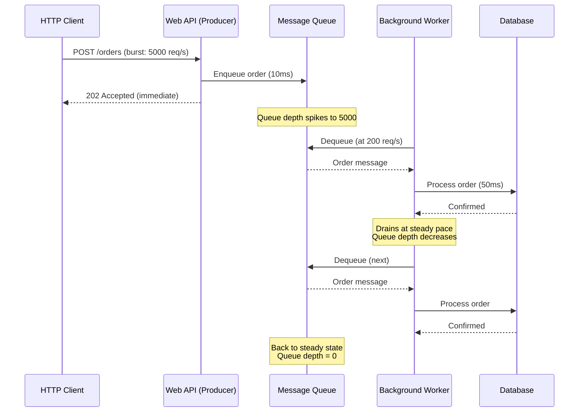
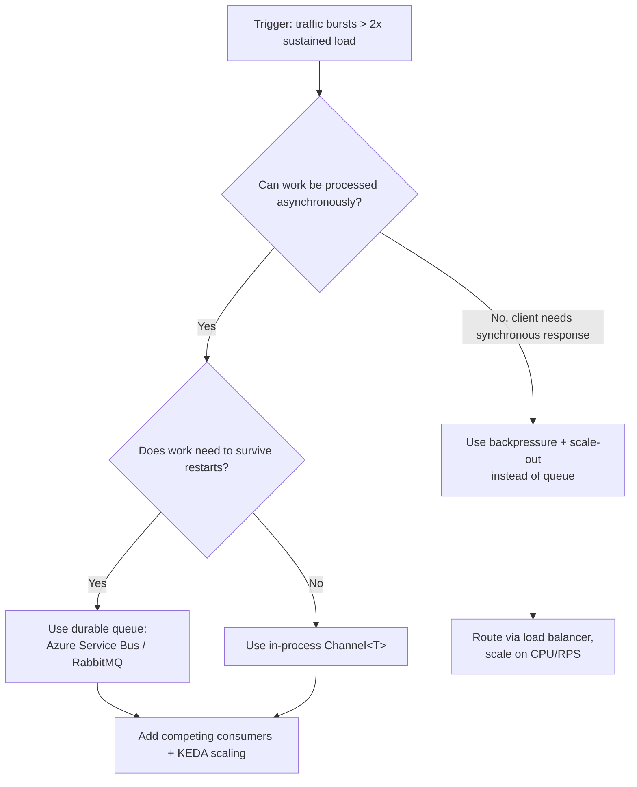

## Navigation

**Domain:** [[7 — System Design & Distributed Systems]] > **Group:** Scalability Patterns
**Previous:** [[7.238 — Backpressure — Detection and Handling]] | **Next:** [[7.240 — Competing Consumers — Scaling Workers]]

### Prerequisites

- [[7.238 — Backpressure — Detection and Handling]] — backpressure signals when a consumer is overwhelmed; queue-based load leveling is the structural solution that absorbs the bursts before backpressure is needed
- [[7.206 — Horizontal vs Vertical Scaling — Tradeoffs]] — load leveling via queues enables consumers to scale independently of producers, which is the primary scalability benefit of horizontal scaling
- [[7.240 — Competing Consumers — Scaling Workers]] — the competing consumers pattern is the receiving side of a load-leveling queue; multiple consumers read from the same queue to process work in parallel

### Where This Fits

Queue-based load leveling inserts a buffer — a message queue — between a producer and a consumer so that the producer can enqueue work at its own rate and the consumer can dequeue and process at its own rate. The queue absorbs traffic bursts, preventing the consumer from being overwhelmed during spikes and preventing the producer from being blocked during slowdowns. Without load leveling, every traffic spike either propagates directly to the consumer (causing overload), or must be rejected at the producer (causing data loss). A .NET engineer encounters load leveling when choosing between direct HTTP calls and message brokers for inter-service communication, configuring Azure Service Bus queues or RabbitMQ for background job processing, or designing an API that accepts work via HTTP 202 Accepted and processes it asynchronously. It becomes necessary above ~100 req/s when the consumer's processing time has higher variance than the producer's arrival rate, or when the consumer must be unavailable for maintenance without losing requests.

---

## Core Mental Model

Queue-based load leveling decouples the arrival rate of work from the processing rate of work by introducing a durable buffer between them. The invariant is that the producer never waits for the consumer — it writes to the queue at its own pace and immediately proceeds. The consumer reads from the queue at its own pace, constrained only by its processing capacity. What this trades is end-to-end latency: instead of synchronous processing (request → response in 200ms), the work sits in a queue for milliseconds to hours before processing, and the producer must poll or receive a callback for the result. The recognition trigger is the HTTP 202 Accepted pattern — "I've saved your request, I'll process it later" — or the need to survive a consumer deployment without losing in-flight requests.



### Key Properties / Guarantees

|Property|Value|Condition|
|---|---|---|
|Availability|Producer always succeeds (queue accepts)|When queue is not saturated (has capacity)|
|Durability|Message survives broker restart|Persistent queue, replicated storage|
|Latency|Adds queuing delay (producer→consumer)|Proportional to queue depth / consumption rate|
|Ordering|FIFO per partition/session|When configured (Azure Service Bus sessions, RabbitMQ single consumer)|
|Throughput|Producer rate independent of consumer rate|Always — this is the defining property|

---

## Deep Mechanics

### How It Works

1. **Producer enqueues work.** The producer creates a message describing the work and writes it to a queue. The write is typically a network call to a message broker (Azure Service Bus, RabbitMQ) or a local write to a persistent store (Azure Storage Queue, SQL Server table as queue). The producer either waits for acknowledgment (at-least-once delivery) or fires and forgets (at-most-once).

2. **Broker stores the message.** The broker persists the message to disk (or memory for transient queues) and acknowledges the write. Replicated brokers (Azure Service Bus Premium, RabbitMQ quorum queues) replicate the message across nodes before acknowledging, ensuring durability through node failure.

3. **Consumer dequeues and processes.** The consumer requests the next message from the queue. The broker locks the message (prevents other consumers from seeing it), delivers it, and waits for the consumer to acknowledge completion. On acknowledgment, the broker deletes the message. On failure (consumer crashes or explicit reject), the broker either redelivers or dead-letters the message.

4. **Leveling effect.** During traffic bursts, the queue depth increases — messages accumulate faster than consumers drain them. During lulls, consumers drain the accumulated depth. The consumer never sees the burst; it processes at a steady rate equal to its maximum capacity. The queue acts as a shock absorber.

5. **Scaling signal.** Queue depth becomes a scaling metric. When depth exceeds a threshold, the orchestrator adds consumer instances (KEDA, HPA). When depth is zero for a sustained period, it removes instances. This closes the loop: the queue levels the load, and the depth signal adjusts capacity.

```csharp
// Producer: enqueue work via Azure Service Bus
public class OrderIngestionService
{
    private readonly ServiceBusSender _sender;

    public OrderIngestionService(ServiceBusClient client)
    {
        _sender = client.CreateSender("orders");
    }

    public async Task<AcceptedResult> SubmitOrderAsync(
        Order order, CancellationToken ct)
    {
        var message = new ServiceBusMessage(
            BinaryData.FromObjectAsJson(order))
        {
            MessageId = order.Id.ToString(),
            PartitionKey = order.CustomerId.ToString() // ordering per customer
        };

        await _sender.SendMessageAsync(message, ct);

        return new AcceptedResult(
            $"/orders/{order.Id}/status",
            new { OrderId = order.Id });
    }
}

// Consumer: process orders from the queue
public class OrderProcessingWorker : BackgroundService
{
    private readonly ServiceBusProcessor _processor;

    public OrderProcessingWorker(ServiceBusClient client)
    {
        _processor = client.CreateProcessor("orders", new ServiceBusProcessorOptions
        {
            MaxConcurrentCalls = 10,    // process up to 10 in parallel
            AutoCompleteMessages = false,
            MaxAutoLockRenewalDuration = TimeSpan.FromMinutes(5)
        });
    }

    protected override async Task ExecuteAsync(CancellationToken ct)
    {
        _processor.ProcessMessageAsync += async args =>
        {
            try
            {
                var order = args.Message.Body.ToObjectFromJson<Order>();
                await ProcessOrderAsync(order, args.CancellationToken);
                await args.CompleteMessageAsync(args.Message);
            }
            catch (Exception ex) when (ex is not OperationCanceledException)
            {
                // Transient failure? Abandon for retry.
                // Permanent failure? Dead-letter.
                await args.AbandonMessageAsync(args.Message);
            }
        };

        _processor.ProcessErrorAsync += args =>
        {
            _logger.LogError(args.Exception,
                "Service Bus processor error: {Source}", args.ErrorSource);
            return Task.CompletedTask;
        };

        await _processor.StartProcessingAsync(ct);

        // Wait for shutdown
        try { await Task.Delay(Timeout.Infinite, ct); }
        catch (OperationCanceledException) { }

        await _processor.StopProcessingAsync();
    }
}
```

### Failure Modes

**Queue saturation (broker throttling).** When the producer rate exceeds the broker's write capacity, the broker starts throttling — typically returning 429 (Azure Service Bus) or 503. This pushes backpressure onto the producer, which defeats the purpose of load leveling. Detection: producer sees `ServiceBusException` with `Reason = ServiceBusFailureReason.ServiceBusy`. Prevention: monitor queue write throughput vs broker SKU limits. Azure Service Bus Premium has 1 MB/s per messaging unit; at 10 MB/s, you need 10 MUs.

**Poison messages (processing always fails).** A message that consistently fails processing stays in the queue, blocking (if FIFO) or consuming retry attempts. Without a dead-letter policy, poison messages loop indefinitely, consuming consumer capacity and reducing throughput. Detection: `DeliveryCount` counter increases for specific messages; consumer logs show repeated failures for the same `MessageId`. Prevention: configure max delivery count (e.g., 10) and a dead-letter queue. After 10 failed attempts, the message moves to DLQ for manual inspection.

**Unbounded queue growth.** If the consumer is down for an extended period (deployment, crash, scaling lag), the queue grows without bound. The broker has finite storage — Azure Service Bus Premium has 80 GB per messaging unit, RabbitMQ has disk limits. When the queue fills the broker's storage, the broker rejects new messages. Detection: monitor queue depth and broker storage metrics. Prevention: configure queue TTL (time-to-live) so messages expire if not processed within a window. Use max queue size policies.

**At-least-once duplicates.** Most brokers guarantee at-least-once delivery — a consumer crash after processing but before acknowledgment causes redelivery. Without idempotent consumers, this creates duplicate processing. Detection: downstream records show duplicate order IDs. Prevention: make consumers idempotent (check `MessageId` + deduplication store before processing) or use exactly-once semantics (Azure Service Bus sessions with duplicate detection).

### .NET and Azure Integration

- **Azure Service Bus:** `ServiceBusSender.SendMessageAsync` for production, `ServiceBusProcessor` with `MaxConcurrentCalls` for consumption. Sessions provide FIFO ordering per partition key. Duplicate detection prevents accidental double-enqueue.
- **Azure Storage Queue:** Simpler, cheaper, lower throughput (~2,000 messages/second per queue). `QueueClient.SendMessageAsync` for production, `QueueClient.ReceiveMessageAsync` for consumption. No ordering guarantee. Max message TTL is 7 days.
- **RabbitMQ:** `IBasicPublisher` for production, `IBasicConsumer` for consumption. `basicQoS` with prefetch count limits consumer buffering. Quorum queues provide replication.
- **MassTransit:** Abstraction over Service Bus, RabbitMQ, and Kafka. `IBus.Publish<T>` for production, `IConsumer<T>` for consumption. Handles redelivery, retry, and fault queues.
- **KEDA (Kubernetes Event-Driven Autoscaling):** Scales consumer pods based on queue depth. Supports Azure Service Bus, RabbitMQ, Storage Queue, and others. Scales from 0 to N based on pending message count.
- **Polly:** Wrap producer enqueue calls with retry (for transient broker failures). Wrap consumer processing with circuit breaker (to stop consuming from a queue when all processing fails).

```csharp
// MassTransit producer and consumer with load leveling
// Program.cs — producer side
builder.Services.AddMassTransit(x =>
{
    x.UsingAzureServiceBus((context, cfg) =>
    {
        cfg.Host(builder.Configuration["Azure:ServiceBus:ConnectionString"]);
    });
});

// Producer — publish order
public async Task SubmitOrderAsync(Order order)
{
    await _bus.Publish(new OrderSubmitted
    {
        OrderId = order.Id,
        CustomerId = order.CustomerId,
        Items = order.Items
    });
}

// Consumer — process order
public class OrderSubmittedConsumer : IConsumer<OrderSubmitted>
{
    public async Task Consume(ConsumeContext<OrderSubmitted> context)
    {
        await ProcessOrderAsync(context.Message);
        // MassTransit auto-acks on success
    }
}
```

---

## Production Patterns and Implementation

### Primary Implementation

A load-leveled order processing pipeline using Azure Service Bus with a background consumer, configuration-driven throughput control, and KEDA scaling.

```csharp
// Configuration
public sealed record QueueLoadLevelingOptions
{
    public string ConnectionString { get; init; }
    public string QueueName { get; init; } = "orders";
    public int MaxConcurrentCalls { get; init; } = 10;
    public int MaxDeliveryCount { get; init; } = 5;
    public TimeSpan MessageTimeToLive { get; init; } = TimeSpan.FromHours(4);
}

// Producer — ASP.NET Core controller
[ApiController]
[Route("api/orders")]
public sealed class OrderController : ControllerBase
{
    private readonly ServiceBusSender _sender;

    public OrderController(ServiceBusClient client)
    {
        _sender = client.CreateSender("orders");
    }

    [HttpPost]
    public async Task<IActionResult> Submit(
        [FromBody] OrderRequest request,
        CancellationToken ct)
    {
        var orderId = Guid.NewGuid();
        var message = new ServiceBusMessage(
            BinaryData.FromObjectAsJson(new Order
            {
                Id = orderId,
                CustomerId = request.CustomerId,
                Items = request.Items,
                SubmittedAt = DateTimeOffset.UtcNow
            }))
        {
            MessageId = orderId.ToString(),
            PartitionKey = request.CustomerId.ToString(),
            TimeToLive = TimeSpan.FromHours(4)
        };

        await _sender.SendMessageAsync(message, ct);

        return Accepted(
            $"/api/orders/{orderId}/status",
            new { OrderId = orderId, Status = "pending" });
    }
}

// Consumer — background worker with graceful shutdown
public sealed class OrderProcessingBackgroundService : BackgroundService
{
    private readonly ServiceBusProcessor _processor;
    private readonly IOrderProcessor _orderProcessor;
    private readonly ILogger<OrderProcessingBackgroundService> _logger;
    private readonly MetricsRecorder _metrics;

    public OrderProcessingBackgroundService(
        ServiceBusClient client,
        IOrderProcessor orderProcessor,
        IOptions<QueueLoadLevelingOptions> options,
        ILogger<OrderProcessingBackgroundService> logger,
        MetricsRecorder metrics)
    {
        _orderProcessor = orderProcessor;
        _logger = logger;
        _metrics = metrics;
        var opts = options.Value;

        _processor = client.CreateProcessor(
            opts.QueueName, new ServiceBusProcessorOptions
            {
                MaxConcurrentCalls = opts.MaxConcurrentCalls,
                AutoCompleteMessages = false,
                MaxAutoLockRenewalDuration = TimeSpan.FromMinutes(5),
                MaxDeliveryCount = opts.MaxDeliveryCount
            });
    }

    protected override async Task ExecuteAsync(CancellationToken ct)
    {
        _processor.ProcessMessageAsync += HandleMessageAsync;
        _processor.ProcessErrorAsync += HandleErrorAsync;

        await _processor.StartProcessingAsync(ct);
        _logger.LogInformation("Order processing worker started");

        try { await Task.Delay(Timeout.Infinite, ct); }
        catch (OperationCanceledException) { }

        await _processor.StopProcessingAsync();
        _logger.LogInformation("Order processing worker stopped gracefully");
    }

    private async Task HandleMessageAsync(
        ProcessMessageEventArgs args)
    {
        Order? order = null;
        try
        {
            order = args.Message.Body.ToObjectFromJson<Order>();
            _metrics.RecordMessageReceived();

            await _orderProcessor.ProcessAsync(order, args.CancellationToken);

            await args.CompleteMessageAsync(args.Message);
            _metrics.RecordMessageCompleted();
        }
        catch (OperationCanceledException) when (
            args.CancellationToken.IsCancellationRequested)
        {
            // Shutdown — abandon for another consumer to pick up
            await args.AbandonMessageAsync(args.Message);
        }
        catch (Exception ex)
        {
            _logger.LogError(ex,
                "Failed to process order {OrderId}", order?.Id);

            if (args.Message.DeliveryCount >= _processor.EntityPath.Length)
            {
                // Max retries exhausted — dead-letter
                await args.DeadLetterMessageAsync(
                    args.Message,
                    deadLetterReason: "ProcessingFailure",
                    deadLetterErrorDescription: ex.Message);
            }
            else
            {
                // Let the broker redeliver after lock expires
                await args.AbandonMessageAsync(args.Message);
            }
        }
    }

    private Task HandleErrorAsync(ProcessErrorEventArgs args)
    {
        _logger.LogError(args.Exception,
            "Service Bus error: {Source} - {Description}",
            args.ErrorSource, args.EntityPath);
        return Task.CompletedTask;
    }

    public override async Task StopAsync(CancellationToken ct)
    {
        _logger.LogInformation("Stopping order processing worker...");
        await base.StopAsync(ct);
    }
}
```

### Configuration and Wiring

```csharp
// Program.cs
builder.Services.Configure<QueueLoadLevelingOptions>(
    builder.Configuration.GetSection("QueueLoadLeveling"));

builder.Services.AddSingleton(sp =>
{
    var opts = sp.GetRequiredService<IOptions<QueueLoadLevelingOptions>>().Value;
    var client = new ServiceBusClient(
        opts.ConnectionString,
        new ServiceBusClientOptions { TransportType = ServiceBusTransportType.AmqpTcp });
    return client;
});

builder.Services.AddSingleton<MetricsRecorder>();
builder.Services.AddScoped<IOrderProcessor, OrderProcessor>();
builder.Services.AddHostedService<OrderProcessingBackgroundService>();

// appsettings.json
{
    "QueueLoadLeveling": {
        "ConnectionString": "<connection-string>",
        "QueueName": "orders",
        "MaxConcurrentCalls": 10,
        "MaxDeliveryCount": 5,
        "MessageTimeToLive": "04:00:00"
    }
}
```

### Common Variants

**Storage Queue (low-throughput, simple).** Azure Storage Queue is suitable for <2,000 msg/s with no ordering requirement:

```csharp
var queueClient = new QueueClient(connectionString, "orders");
await queueClient.SendMessageAsync(
    BinaryData.FromObjectAsJson(order));

// Consumer
var message = await queueClient.ReceiveMessageAsync();
var order = message.Value.Body.ToObjectFromJson<Order>();
await ProcessAsync(order);
await queueClient.DeleteMessageAsync(
    message.Value.MessageId, message.Value.PopReceipt);
```

**RabbitMQ (low-latency, high-throughput).** RabbitMQ is suitable for <50,000 msg/s with sub-millisecond latency:

```csharp
// Producer
var factory = new ConnectionFactory { HostName = "rabbit.internal" };
await using var connection = await factory.CreateConnectionAsync();
await using var channel = await connection.CreateChannelAsync();
await channel.QueueDeclareAsync("orders", durable: true);
await channel.BasicPublishAsync(
    exchange: "", routingKey: "orders",
    body: BinaryData.FromObjectAsJson(order).ToMemory());

// Consumer
await channel.BasicConsumeAsync("orders", autoAck: false,
    consumer: new AsyncEventingBasicConsumer(channel)
    {
        ReceivedAsync = async (_, args) =>
        {
            var order = args.Body.ToArray();
            await ProcessAsync(order);
            await channel.BasicAckAsync(args.DeliveryTag, false);
        }
    });
```

**In-memory Channel<T> (single-process, no durability).** Use `Channel<T>` when the queue does not need to survive process restart:

```csharp
var channel = Channel.CreateBounded<Order>(
    new BoundedChannelOptions(1000)
    {
        FullMode = BoundedChannelFullMode.Wait
    });

// Producer
await channel.Writer.WriteAsync(order);

// Consumer
await foreach (var order in channel.Reader.ReadAllAsync(ct))
{
    await ProcessAsync(order);
}
```

### Real-World .NET Ecosystem Example

**MassTransit** is the most used .NET abstraction for queue-based load leveling. It provides transport-agnostic message production and consumption with retry, redelivery, saga support, and fault handling:

```csharp
// MassTransit — transport-agnostic load leveling
builder.Services.AddMassTransit(x =>
{
    x.AddConsumer<OrderSubmittedConsumer>();

    x.UsingRabbitMq((context, cfg) =>
    {
        cfg.Host("rabbit.internal", "/", h =>
        {
            h.Username("guest");
            h.Password("guest");
        });

        cfg.ReceiveEndpoint("orders", e =>
        {
            // Backpressure: process 20 messages at a time
            e.PrefetchCount = 20;
            e.ConcurrentMessageLimit = 20;

            // Retry on failure
            e.UseMessageRetry(r => r.Exponential(
                retryLimit: 3,
                minInterval: TimeSpan.FromSeconds(1),
                maxInterval: TimeSpan.FromSeconds(30),
                intervalDelta: TimeSpan.FromSeconds(5)));

            e.ConfigureConsumer<OrderSubmittedConsumer>(context);
        });
    });
});
```

---

## Gotchas and Production Pitfalls

### Unbounded Queue Growth During Consumer Outage

**Pitfall:** The consumer goes down (deployment, crash) and the producer keeps enqueuing. The queue grows to millions of messages, exhausting broker storage.

**Symptom:** Producer starts getting `ServiceBusException: ServiceBusy` or `QuotaExceeded`. Broker emits storage alerts. Recovery takes hours because millions of backlogged messages must be drained.

**Fix:** Configure message TTL and max queue size. Monitor queue depth with alerts.

```csharp
// ✅ Message TTL prevents infinite backlog
var message = new ServiceBusMessage(body)
{
    TimeToLive = TimeSpan.FromHours(4)  // expires if not processed in 4h
};
```

**Cost of not fixing:** Eventually broker rejects all new messages. Producer fails completely. After consumer recovers, it takes hours to drain the backlog, delaying legitimate messages behind stale ones.

### Poison Messages Retrying Forever

**Pitfall:** A message that always fails (malformed data, missing reference) is retried infinitely, consuming consumer capacity and slowing legitimate messages.

**Symptom:** Consumer throughput drops. Logs show the same `MessageId` failing repeatedly. `DeliveryCount` metric climbs for a subset of messages.

**Fix:** Configure max delivery count and dead-letter queue:

```csharp
// ✅ Dead-letter after max delivery attempts
if (args.Message.DeliveryCount > maxDeliveryCount)
{
    await args.DeadLetterMessageAsync(
        args.Message,
        deadLetterReason: "MaxDeliveryCountExceeded",
        deadLetterErrorDescription: "Message failed after " +
            $"{maxDeliveryCount} delivery attempts.");
}
```

**Cost of not fixing:** Poison messages reduce effective throughput by occupying consumer slots. If FIFO is used, a single poison message blocks all processing for that partition.

### Incorrect Prefetch / MaxConcurrentCalls Sizing

**Pitfall:** Setting `MaxConcurrentCalls` or prefetch count equal to expected throughput × processing time, without accounting for message lock duration. If processing takes longer than the lock duration, the message lock expires and the message reappears in the queue (duplicate processing).

```csharp
// ❌ Wrong: lock expires before processing completes
var processor = client.CreateProcessor("orders", new ServiceBusProcessorOptions
{
    MaxConcurrentCalls = 50,     // 50 in-flight
    MaxAutoLockRenewalDuration = TimeSpan.FromSeconds(30)  // too short!
});
```

**Symptom:** Duplicate processing. Same order processed 2–3 times. `DeliveryCount` increases even on success. The system appears to have 2x the actual traffic.

**Fix:** Set `MaxAutoLockRenewalDuration` to `processing_time_p99 × 2`:

```csharp
// ✅ Correct: lock covers processing time
// Processing P99 = 45 seconds → lock renewal at least 90 seconds
var processor = client.CreateProcessor("orders", new ServiceBusProcessorOptions
{
    MaxConcurrentCalls = 10,
    MaxAutoLockRenewalDuration = TimeSpan.FromSeconds(90)
});
```

**Cost of not fixing:** Duplicate processing causes side effects (double-charge, double-email). Debugging is confusing because errors appear intermittent and non-reproducible.

### At-Least-Once Delivery Without Idempotent Consumers

**Pitfall:** The consumer processes a message, acknowledges it, but the acknowledgment fails to reach the broker (network blip). The broker redelivers the message. The consumer processes it a second time.

**Symptom:** Occasional duplicate processing. 1–5 duplicates per 10,000 messages under normal conditions. During network issues, duplicates spike to 10%+.

**Fix:** Idempotent consumers — deduplicate by `MessageId`:

```csharp
// ✅ Idempotent consumer — deduplicate by MessageId
public async Task ConsumeAsync(ProcessMessageEventArgs args)
{
    var messageId = args.Message.MessageId;

    // Check deduplication store (Redis, DB)
    if (await _deduplicationStore.ExistsAsync(messageId))
    {
        await args.CompleteMessageAsync(args.Message);
        return;  // Already processed
    }

    await ProcessAsync(args.Message.Body.ToObjectFromJson<Order>());

    // Record completion atomically with processing
    await _deduplicationStore.RecordAsync(messageId);
    await args.CompleteMessageAsync(args.Message);
}
```

**Cost of not fixing:** Payment systems double-charge customers. Email systems send duplicate notifications. Inventory systems decrement stock twice. Each occurrence erodes trust and requires manual compensation.

### Queue Depth Alert Thresholds Too High

**Pitfall:** Alerting only when queue depth reaches 100,000 messages. At 200 msg/s processing, that's 500 seconds (8 minutes) of backlog — enough to violate SLA for time-sensitive orders.

**Symptom:** SLAs are breached before the alert fires. Customers complain about late deliveries before on-call is aware.

**Fix:** Alert on `queue_depth > processing_rate × acceptable_backlog_seconds`:

```csharp
// Production: 200 msg/s, acceptable backlog = 30 seconds
// Alert threshold: 200 × 30 = 6,000
// Warning threshold: 200 × 15 = 3,000
var alertThreshold = processingRate * acceptableBacklogSeconds;
```

**Cost of not fixing:** Repeated SLA breaches. Team is reactive instead of proactive. Customer trust degrades.

### Not Configuring MaxConcurrentCalls Per Machine

**Pitfall:** Setting `MaxConcurrentCalls = 100` when running 5 replicas. Each replica pulls 100 messages into memory at once, for 500 total in-memory messages. At 50 KB each, that's 25 MB per replica, 125 MB total — manageable. But if a message processing failure causes a retry storm, all 500 messages are in retry simultaneously.

**Symptom:** Consumer instances run at 100% CPU processing retries. Actual throughput (distinct messages completed) drops. Queue depth stays flat or increases.

**Fix:** Size `MaxConcurrentCalls` per instance based on CPU and memory budget. Scale via replicas, not per-instance concurrency:

```csharp
// ✅ Per-instance: conservative concurrency, scale via replicas
var processor = client.CreateProcessor("orders", new ServiceBusProcessorOptions
{
    MaxConcurrentCalls = 10,     // per instance
    // With 5 replicas: 50 concurrent calls total
    // With 10 replicas (during peak): 100 concurrent calls total
});
```

**Cost of not fixing:** Oversized per-instance concurrency wastes CPU on retry storms. Cross-instance coordination is impossible — each instance independently retries. Scaling out makes the retry storm worse.

---

## Tradeoffs and Decision Framework

### Tradeoff Matrix

| Dimension | Queue-Based Load Leveling | Direct HTTP (Sync) | In-Process Channel |
|---|---|---|---|
| Decoupling | Full — producers never wait for consumers | None — caller blocks on callee | Partial — same process, survives restart? No |
| Durability | Survives process and machine restart | No — in-flight request lost on restart | No — lost on process restart |
| Latency | Adds queuing delay (ms to hours) | Lowest possible (RTT + processing) | Sub-millisecond queuing delay |
| Operational complexity | High — broker setup, monitoring, DLQ | Low — standard HTTP with load balancer | Low — in-process, no broker |
| Throughput | Limited by broker throughput | Limited by connection pool + network | Limited by CPU/memory |
| Ordering | FIFO per partition (configurable) | N/A (synchronous) | FIFO guaranteed per channel |

### When to Apply



### When NOT to Apply

- [ ] **Client needs synchronous response.** If the caller blocks waiting for a result, queue-based load leveling adds latency without benefit. Use backpressure + scaling instead.
- [ ] **Throughput below 50 req/s with predictable load.** The operational overhead of a message broker exceeds any benefit. A simple in-process Channel<T> suffices.
- [ ] **At-most-once delivery is acceptable.** If losing occasional messages is acceptable, the durability guarantees of a queue add cost without value.
- [ ] **Message ordering is strictly required across the entire queue.** Most brokers only guarantee FIFO within a partition/session, not across the whole queue. If global ordering is required, a single consumer reading a single queue (defeating load leveling) is necessary — or use Kafka with a single partition.
- [ ] **Data must never be lost but team lacks operational capacity for a broker.** Running RabbitMQ or managing Service Bus requires operational knowledge. If the team cannot manage it, use a managed service (Azure Service Bus) or consider Azure Storage Queue (simpler).

### Scale Thresholds

- Worth considering above ~100 req/s with burst factor > 2x sustained load
- Required when consumer must be unavailable for maintenance without losing requests
- Justified when processing time P99 / P50 ratio > 10x (high latency variance)
- Azure Service Bus Premium: up to 10,000 msg/s per messaging unit (scale to 100 MUs)
- RabbitMQ: up to 50,000 msg/s on a single node with persistent queues
- Azure Storage Queue: up to 2,000 msg/s per queue (20,000 with premium)

---

## Interview Arsenal

### Question Bank

1. What is queue-based load leveling and what problem does it solve?
2. How does queue depth affect end-to-end latency?
3. What happens to messages when the consumer crashes mid-processing?
4. Compare queue-based load leveling with backpressure — when would you use each?
5. How do you size `MaxConcurrentCalls` in Azure Service Bus?
6. Design a system that accepts 10,000 orders/second but processes them at 200/second.
7. How does queue-based load leveling interact with competing consumers?
8. How do you handle poison messages?

### Spoken Answers

**Q: What is queue-based load leveling and what problem does it solve?**

> **Average answer:** It's a queue between a producer and consumer so the producer doesn't overwhelm the consumer. The queue acts as a buffer.

> **Great answer:** Queue-based load leveling inserts a durable buffer between producers and consumers so that each operates at its own pace, decoupled from the other's rate. The problem it solves is that producer arrival rates and consumer processing rates are rarely equal — traffic spikes, batch jobs, and retry storms all cause the producer rate to exceed the consumer's capacity for periods ranging from seconds to hours. Without a queue, every spike either overwhelms the consumer (cascading failure) or must be rejected at the producer (data loss). The queue absorbs these spikes, building depth during bursts and draining during lulls. In .NET, the canonical implementation is Azure Service Bus with a `BackgroundService` consumer using `ServiceBusProcessor` with `MaxConcurrentCalls`, combined with KEDA for scaling. The tradeoff is latency — instead of synchronous 200ms processing, work may sit in the queue for seconds or minutes before processing — and the operational cost of running a message broker.

**Q: Compare queue-based load leveling with backpressure — when would you use each?**

> **Average answer:** A queue buffers data, backpressure rejects it. Use a queue when you can wait, use backpressure when you can't.

> **Great answer:** Queue-based load leveling and backpressure are complementary. A queue absorbs bursts by storing excess work — it trades memory/disk for burst tolerance. Backpressure rejects excess work by signaling the producer to stop — it preserves memory/disk at the cost of data loss. You use a queue when the work must be preserved and can tolerate delay (e.g., order processing, email delivery). You use backpressure when the work is real-time and cannot tolerate queuing delay (e.g., live video stream, stock ticker). In practice, you use both together: the queue absorbs short bursts, and when the queue fills beyond a threshold, backpressure starts rejecting new work at the producer (returning 503 to the HTTP client). This gives your system two layers of defense — first the queue buffers, then backpressure refuses. The queue depth signal also drives auto-scaling: when depth exceeds a threshold, KEDA adds more consumers, reducing the need for backpressure rejection.

### System Design Interview Trigger

If an interviewer asks you to design an order processing or notification delivery system and asks "how do you handle a traffic spike" or "what happens when the database is down," they are testing whether you know queue-based load leveling. The probing question is "how do you size the queue capacity" and "what happens if the queue fills up." The senior candidate answers with concrete numbers — "we size the queue for 10 minutes of peak traffic, which at 1,000 req/s with 2 KB per message gives us 10,000 × 2 KB = 20 MB of storage, well within the 80 GB Service Bus Premium partition" — and has a plan for the queue-full scenario: "if depth exceeds 50,000, we start returning 503 with Retry-After at the HTTP API, which shifts from queue-based load leveling to backpressure."

---

## Architecture Decision Record

**Status:** Accepted

**Context:** The notification delivery service receives 2,000 email requests/second during peak hours but the email API (SendGrid) accepts at most 200 requests/second. The email API occasionally slows to 50 req/s during carrier batch cycles. Without buffering, SendGrid rejects connections and emails are lost. The team needs to: never lose an email (SLA), process at the email API's pace, and scale consumers independently.

**Options Considered:**

1. **Azure Service Bus Queue** — Durable queue with `MaxConcurrentCalls = 50` per consumer. Messages survive restarts. Consumer scales via KEDA on queue depth.
2. **In-memory Channel<T>** — Fast and simple, but messages lost on restart. Requires consumer to catch up after restart.
3. **Direct HTTP with retry** — Send immediately and retry on failure. Highest latency variance and risk of connection pool exhaustion under SendGrid slowdown.

**Decision:** Azure Service Bus Queue, because email delivery SLA requires at-least-once delivery (surviving restarts), the throughput (2,000 enqueue/s, 200 dequeue/s) is within Service Bus Premium performance (10,000 msg/s per MU), and KEDA integration provides automatic consumer scaling. The in-memory option was rejected due to data loss on restart. Direct HTTP was rejected because SendGrid throttles at 200 req/s and retries would exhaust the connection pool.

**Consequences:**
- ✅ Zero data loss — messages survive broker and consumer restarts
- ✅ SendGrid always receives at exactly its capacity (200 req/s), never more
- ✅ KEDA scales consumers from 2 to 20 based on queue depth
- ⚠️ Operational cost: Service Bus Premium with 2 MUs
- ⚠️ Monitoring required: queue depth, dead-letter count, processing latency
- ❌ End-to-end latency increases: P50 from 2s (direct) to 30s (queued) during peak

**Review Trigger:** Revisit if peak throughput exceeds 10,000 enqueue/s (single partition limit) or if end-to-end P99 latency exceeds 5 minutes and SLA demands faster delivery.

---

## Self-Check

### Conceptual Questions

1. Define queue-based load leveling in one sentence.
2. What is the relationship between queue depth, consumer processing rate, and end-to-end latency?
3. How does queue-based load leveling differ from backpressure?
4. What metric drives auto-scaling in a load-leveled system?
5. Name the Azure Service Bus configuration that controls in-flight message processing per consumer.
6. What happens to a message when a consumer fails to process it after 10 delivery attempts?
7. Compare Azure Service Bus Queue and Azure Storage Queue for load leveling.
8. How do you ensure ordered processing with queue-based load leveling?
9. What is the tradeoff between prefetch count and message lock duration?
10. How does queue-based load leveling interact with the outbox pattern?

<details>
<summary>Answers</summary>

1. Queue-based load leveling decouples work production from work consumption by inserting a durable buffer that absorbs traffic bursts and allows each side to operate at its own rate.
2. `End-to-end latency ≈ queue_depth / consumption_rate + processing_time`. A queue depth of 10,000 at 200 msg/s adds 50 seconds of queuing delay before processing begins.
3. Backpressure rejects work at the producer when the consumer is overloaded (data loss possible). Queue-based load leveling accepts all work and buffers it (data preserved, latency added). They are complementary: the queue buffers bursts, then backpressure rejects when the queue is full.
4. Queue depth is the primary scaling metric. KEDA scales consumers up when depth exceeds a threshold (e.g., 1,000 pending messages) and scales down when depth is near zero.
5. `ServiceBusProcessorOptions.MaxConcurrentCalls` — the number of messages processed concurrently per consumer instance.
6. The message is moved to the dead-letter queue (DLQ) with reason "MaxDeliveryCountExceeded." It must be manually inspected and re-queued or discarded.
7. Service Bus Queue: higher throughput (10,000 msg/s per MU), FIFO with sessions, at-least-once delivery, max 80 GB per MU. Storage Queue: <2,000 msg/s, no ordering guarantee, at-least-once, max 500 TB, simpler and cheaper.
8. Use Azure Service Bus sessions with `PartitionKey = CustomerId`. All messages for the same customer are delivered to the same consumer in FIFO order. RabbitMQ single-active-consumer provides per-queue ordering.
9. Higher prefetch count = more messages in memory = higher throughput but longer lock duration needed and more memory used per consumer. If lock expires before processing, messages are redelivered (duplicates). Rule: prefetch × P99_processing_time < lock_renewal_duration / 2.
10. The outbox pattern ensures reliable publishing from the database to the queue. The producer writes to a database outbox table in the same transaction as the business operation, and a background publisher reads from the outbox and enqueues. This ensures exactly-once production into the queue even if the producer crashes.
</details>

---

### Scenario Challenges

**Scenario 1 — Diagnose:** A notification service uses Azure Service Bus with `MaxConcurrentCalls = 100`. During peak hours, `DeliveryCount` for all messages is 2–3, and customers receive duplicate notifications. Processing time per notification averages 2 seconds.

<details>
<summary>Diagnosis</summary>

**Root cause:** Processing time (2s) × `MaxConcurrentCalls` (100) = 200s total time to complete all in-flight messages. Default lock duration is 60s (Standard) or 5min (Premium). With Standard tier, locks expire after 60s, and messages are redelivered while still being processed. Duplicates occur.

**Evidence:** `DeliveryCount` > 1 on completed messages. Consumer logs show lock renewal failures.

**Fix:** Increase `MaxAutoLockRenewalDuration` to > 200s, or reduce `MaxConcurrentCalls` to 25 (25 × 2s = 50s < 60s lock).
</details>

**Scenario 2 — Design decision:** An analytics pipeline must ingest 50,000 events/s. Consumers process at 5,000 events/s. Events are time-sensitive — must be processed within 5 minutes or they lose value. Compare Azure Service Bus, Event Hubs, and in-memory Channel<T>.

<details>
<summary>Decision</summary>

**Choice:** Azure Event Hubs with 10 throughput units (10 MB/s ingress, 20 MB/s egress).

**Reasoning:** Event Hubs handles 50,000 events/s (assuming 1 KB per event = ~50 MB/s) with its native throughput model (1 MB/s per TU). Retention is 7 days by default, covering the 5-minute SLA. In-memory Channel<T> cannot survive restarts and would lose events during a deployment. Service Bus Premium maxes out at 10,000 msg/s per MU — would need 5 MUs at higher cost.
</details>

**Scenario 3 — Failure mode:** Queue depth is increasing despite consumers running. Consumers show 0% CPU. Processing time per message is 100ms. `MaxConcurrentCalls = 50`. No errors in logs.

<details>
<summary>Investigation</summary>

**Evidence:** Check if consumers are successfully calling `CompleteMessageAsync`. If a consumer throws before completing but after processing, the message stays in the queue and is retried. Check dead-letter queue count. Check if `autoCompleteMessages = false` but `CompleteMessageAsync` is never called.

**Fix:** Ensure `CompleteMessageAsync` is called in a finally block, or use `AutoCompleteMessages = true` if no manual completion logic exists.
</details>

**Scenario 4 — Scale:** Current: 1 consumer, 200 msg/s. Need: 2,000 msg/s. Queue depth grows unbounded. Consumers are CPU-bound at 100 msg/s each.

<details>
<summary>Strategy</summary>

Add KEDA auto-scaling: scale on queue depth with threshold 1,000, max 30 replicas. At 2,000 msg/s with 100 msg/s per consumer, need 20 replicas. Prefetch = 10 per consumer. Each replica adds <2% CPU overhead for dequeue operations. Test with 5 replicas first, then enable HPA with target 70% CPU.
</details>

**Scenario 5 — Interview:** "Design a photo upload service that accepts 1,000 uploads/second but processes thumbnails at 50/second. Users must get back an immediate upload ID."

<details>
<summary>Response</summary>

"Each upload is accepted via HTTP POST, stored in Azure Blob Storage, and a message is enqueued to Azure Service Bus with the blob reference. The API returns 202 Accepted with the upload ID. Background workers read from the queue at 50 msg/s using `MaxConcurrentCalls = 10`, generate thumbnails, and write them back to blob storage. KEDA scales workers from 1 to 20 based on queue depth — at 1,000 uploads/s and 50 processing/s, depth reaches ~950/s during steady state, triggering scale-up. Queue capacity is sized for 30 minutes: at 1 KB per message, 1,000 msg/s × 1,800s = 1.8 GB, within Service Bus Premium limits. If queue depth exceeds 100,000, the API returns 503 with Retry-After — graceful degradation."
</details>
