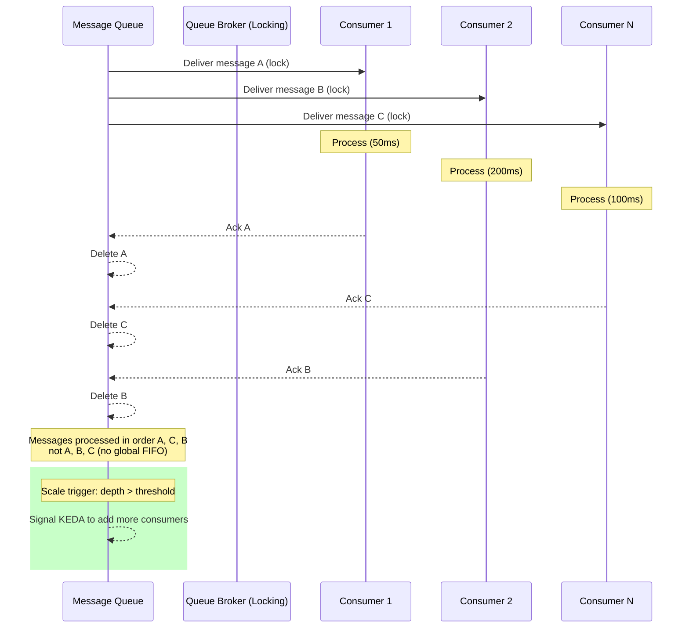
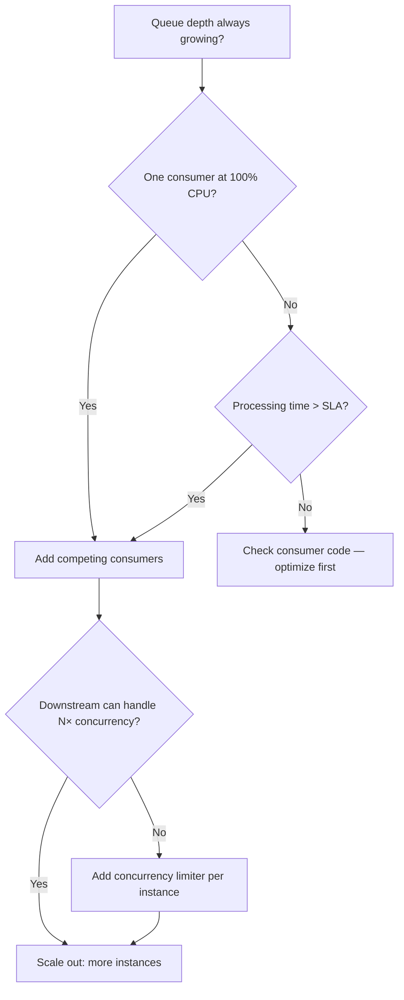

## Navigation

**Domain:** [[7 — System Design & Distributed Systems]] > **Group:** Scalability Patterns
**Previous:** [[7.239 — Queue-Based Load Leveling]] | **Next:** [[7.241 — Rate Limiting — Token Bucket Algorithm]]

### Prerequisites

- [[7.239 — Queue-Based Load Leveling]] — competing consumers read from the same load-leveling queue; the queue provides the work and the competing consumers provide the parallelism
- [[7.237 — Connection Pooling — HTTP Connection Reuse]] — each competing consumer instance has its own connection pool; scaling consumers increases aggregate connection pool size to the downstream
- [[7.206 — Horizontal vs Vertical Scaling — Tradeoffs]] — competing consumers are the horizontal scaling pattern for message processing

### Where This Fits

Competing consumers is the pattern where multiple independent worker instances read from the same message queue, each processing messages at its own pace, with the broker ensuring each message is delivered to exactly one consumer. This is how you scale message processing horizontally: you add more consumers, and the throughput increases linearly until the queue or downstream dependency becomes the bottleneck. Without competing consumers, a single consumer limits throughput to the capacity of one process — at 200ms per message, that's 5 msg/s per consumer. With 20 competing consumers, throughput reaches 100 msg/s. A .NET engineer encounters this pattern when configuring `MaxConcurrentCalls` on `ServiceBusProcessor`, setting up KEDA to scale a deployment based on queue depth, or designing a background worker that processes orders, emails, or notifications. It becomes necessary above ~10 msg/s per consumer or when processing time exceeds 100ms and the total required throughput exceeds a single process's capacity.

---

## Core Mental Model

Competing consumers distribute work across multiple parallel workers by having each worker independently pull from the same queue, with the broker ensuring exclusive delivery (each message goes to exactly one consumer). The invariant is that throughput scales linearly with consumer count until a shared bottleneck (queue read capacity, downstream API rate limit, database write throughput) is hit. What this trades is ordering: with multiple consumers, messages are processed in arrival order only within a partition, not globally — a message enqueued first may be processed last if it lands on a slow consumer. The recognition trigger is a queue that is always deep despite a single consumer running at 100% CPU — you need more consumers, not faster code.



### Key Properties / Guarantees

|Property|Value|Condition|
|---|---|---|
|Throughput scaling|Linear with consumer count|Until queue or downstream bottleneck|
|Message delivery|Each message to exactly one consumer|Broker atomic locking|
|Processing order|FIFO per partition, not global|Partition-key-based ordering|
|Fault isolation|One slow consumer doesn't block others|Broker releases lock on timeout|
|Resource utilization|Even across consumers|Random broker distribution|

---

## Deep Mechanics

### How It Works

1. **Broker holds the queue.** Messages sit in a broker-managed queue. Each message has a state: `Active` (waiting for delivery), `Locked` (being processed), `Scheduled` (future delivery), or `DeadLetter` (failed permanently).

2. **Consumer requests work.** Each consumer calls `Receive` or uses a push-based processor (`ServiceBusProcessor`, `IBasicConsumer`). The broker selects an `Active` message, transitions it to `Locked`, and delivers it to the consumer.

3. **Exclusive lock.** The broker sets a lock on the message with a duration (e.g., 60s default for Service Bus Standard). No other consumer sees this message while locked. If the consumer completes and acks, the broker deletes the message. If the lock expires without ack, the broker returns the message to `Active` state for redelivery.

4. **Competition.** With N consumers, each independently requests work. The broker distributes messages across consumers — typically round-robin or random. High-throughput consumers get more messages; slow consumers get fewer. The system self-balances.

5. **Scaling.** When queue depth grows (backlog), additional consumer instances are added (KEDA, manual scale). Each new consumer immediately starts pulling messages. Throughput increases proportionally until a shared bottleneck is reached.

```csharp
// Each consumer instance runs this identical code.
// The broker distributes work among them.
public class OrderProcessingConsumer : BackgroundService
{
    private readonly ServiceBusProcessor _processor;

    // MaxConcurrentCalls controls how many messages
    // THIS INSTANCE processes in parallel (intra-instance concurrency).
    // The TOTAL concurrency across all instances is:
    //   MaxConcurrentCalls × instance_count

    protected override async Task ExecuteAsync(CancellationToken ct)
    {
        _processor.ProcessMessageAsync += async args =>
        {
            // Lock acquired — other consumers can't see this message
            var order = args.Message.Body.ToObjectFromJson<Order>();
            try
            {
                await ProcessOrderAsync(order, args.CancellationToken);
                await args.CompleteMessageAsync(args.Message);  // Release lock, delete
            }
            catch
            {
                await args.AbandonMessageAsync(args.Message);  // Release lock, requeue
            }
        };

        await _processor.StartProcessingAsync(ct);
        await Task.Delay(Timeout.Infinite, ct);  // Run until shutdown
    }
}
```

### Failure Modes

**Consumer crash mid-processing.** A consumer receives a message, starts processing, and crashes (process kill, OOM, machine failure). The broker's lock eventually expires (default 60s for Service Bus Standard, 5min Premium). The message returns to Active state and is delivered to another consumer. Detection: `DeliveryCount` metric increases for messages without corresponding completions. Impact: processing delay equal to lock duration. Mitigation: shorten lock duration to match P99 processing time + buffer.

**Runaway consumer (slow consumer holds lock).** A consumer takes too long to process a message, holding the lock for longer than expected. Other consumers cannot process this message, and the consumer's `MaxConcurrentCalls` slots are occupied by slow messages. Detection: monitoring shows `LockLostException` in consumer logs; consumer throughput drops. Mitigation: increase `MaxAutoLockRenewalDuration` to cover P99 processing time.

**Stampeding herd on restart.** All consumers are restarted simultaneously (deployment). They all reconnect to the queue and pull messages at once. The queue's throughput drops during the reconnection storm, and messages accumulate. Detection: queue depth spikes during deployments. Mitigation: use rolling updates (Kubernetes `maxSurge: 1, maxUnavailable: 0`) to keep some consumers running during deployment.

**Thundering herd on downstream.** N competing consumers all process messages that call the same downstream API. At N=20 with `MaxConcurrentCalls=10`, the downstream sees 200 concurrent calls. If the downstream can only handle 50, it gets overwhelmed. Detection: downstream latency increases, error rate spikes. Mitigation: use per-consumer concurrency limiting (SemaphoreSlim) or a circuit breaker on the downstream call.

```csharp
// Protecting downstream from competing consumer stampede
builder.Services.AddHttpClient("ShippingApi", client =>
{
    client.BaseAddress = new Uri("https://shipping.internal/");
})
.AddResilienceHandler("DownstreamProtection", builder =>
{
    // Max 5 concurrent calls to shipping API per consumer
    builder.AddConcurrencyLimiter(5);

    // Circuit breaker: if 50% fail in 30s, stop calling
    builder.AddCircuitBreaker(new CircuitBreakerStrategyOptions
    {
        SamplingDuration = TimeSpan.FromSeconds(30),
        FailureRatio = 0.5,
        MinimumThroughput = 20
    });
});
```

**Rebalancing overhead (Kafka consumer groups).** In Kafka, adding or removing a consumer triggers a rebalance where all consumers stop reading and partition ownership is reassigned. During rebalance (seconds to minutes), no messages are consumed. Detection: consumer lag spikes during deployments. Mitigation: use cooperative rebalancing (`CooperativeStickyAssignor`), limit rebalance frequency, use static group membership.

### .NET and Azure Integration

- **Azure Service Bus:** `ServiceBusProcessor` with `MaxConcurrentCalls` = intra-instance parallelism. Multiple instances of the same processor (same queue and subscription) automatically act as competing consumers via message locking.
- **Azure Service Bus Sessions:** When FIFO ordering is required, use sessions. Sessions deliver all messages with the same `SessionId` to the same consumer. This enables competing consumers with per-partition ordering, but reduces parallelism — one partition's messages are tied to one consumer.
- **RabbitMQ:** Multiple consumers on the same queue compete via `basicQoS` (prefetch count). RabbitMQ distributes messages round-robin by default. Combined with `BasicQos(prefetchCount: 1)`, each consumer gets one message at a time.
- **Kafka:** Consumer groups implement competing consumers via partition assignment. Each partition is assigned to exactly one consumer in a group. Parallelism is bounded by partition count — you cannot have more consumers than partitions.
- **KEDA:** Kubernetes Event-Driven Autoscaler. Scales consumer deployments based on queue depth. For Service Bus: scales on `queueLength` metric. For Kafka: scales on `lag` metric. Scales from 0 to max replicas.
- **SignalR:** For real-time competing consumers, SignalR can distribute work to connected clients via groups, but this is not a message queue pattern — prefer Service Bus/RabbitMQ for competing consumers.

```csharp
// KEDA ScaledObject for Azure Service Bus
apiVersion: keda.sh/v1alpha1
kind: ScaledObject
metadata:
  name: order-processor-scaler
spec:
  scaleTargetRef:
    name: order-processor
  minReplicaCount: 1
  maxReplicaCount: 20
  triggers:
    - type: azure-servicebus
      metadata:
        queueName: orders
        connectionFromEnv: SERVICE_BUS_CONNECTION_STRING
        queueLength: "100"  # Scale up when 100+ messages pending
```

---

## Production Patterns and Implementation

### Primary Implementation

A competing-consumers order processor with intra-instance parallelism (`MaxConcurrentCalls`) and instance-level scaling (KEDA).

```csharp
// Configuration per consumer instance
public sealed record CompetingConsumerOptions
{
    public int MaxConcurrentCalls { get; init; } = 10;
    public int MaxDeliveryCount { get; init; } = 5;
    public TimeSpan LockDuration { get; init; } = TimeSpan.FromMinutes(1);
    public TimeSpan AutoLockRenewal { get; init; } = TimeSpan.FromMinutes(5);
    public bool AutoComplete { get; init; } = false;
}

// Shared processor setup — each instance runs this
public sealed class CompetingOrderConsumer : BackgroundService
{
    private readonly ServiceBusProcessor _processor;
    private readonly IOrderHandler _handler;
    private readonly ILogger<CompetingOrderConsumer> _logger;
    private readonly ConcurrentDictionary<string, Order> _inFlight;

    public CompetingOrderConsumer(
        ServiceBusClient client,
        IOrderHandler handler,
        IOptions<CompetingConsumerOptions> options,
        ILogger<CompetingOrderConsumer> logger)
    {
        _handler = handler;
        _logger = logger;
        _inFlight = new ConcurrentDictionary<string, Order>();
        var opts = options.Value;

        _processor = client.CreateProcessor("orders", new ServiceBusProcessorOptions
        {
            MaxConcurrentCalls = opts.MaxConcurrentCalls,
            AutoCompleteMessages = opts.AutoComplete,
            MaxAutoLockRenewalDuration = opts.AutoLockRenewal,
            MaxDeliveryCount = opts.MaxDeliveryCount
        });
    }

    protected override async Task ExecuteAsync(CancellationToken ct)
    {
        _processor.ProcessMessageAsync += OnMessageAsync;
        _processor.ProcessErrorAsync += OnErrorAsync;

        await _processor.StartProcessingAsync(ct);
        _logger.LogInformation("Consumer started on instance {Instance}",
            Environment.MachineName);

        try { await Task.Delay(Timeout.Infinite, ct); }
        catch (OperationCanceledException) { }

        // Graceful shutdown: wait for in-flight messages
        _logger.LogInformation("Draining {Count} in-flight messages...", _inFlight.Count);
        await _processor.StopProcessingAsync();

        // Wait for in-flight processing to complete
        while (!_inFlight.IsEmpty)
        {
            await Task.Delay(100, ct);
        }
        _logger.LogInformation("Drain complete");
    }

    private async Task OnMessageAsync(ProcessMessageEventArgs args)
    {
        var messageId = args.Message.MessageId;
        var order = args.Message.Body.ToObjectFromJson<Order>();
        _inFlight.TryAdd(messageId, order);

        try
        {
            using var linkedCts = CancellationTokenSource.CreateLinkedTokenSource(
                args.CancellationToken);
            linkedCts.CancelAfter(TimeSpan.FromSeconds(30));

            await _handler.HandleAsync(order, linkedCts.Token);

            await args.CompleteMessageAsync(args.Message);
            _logger.LogDebug("Completed order {OrderId}", order.Id);
        }
        catch (OperationCanceledException) when (!args.CancellationToken.IsCancellationRequested)
        {
            // Timeout — abandon for retry by another consumer
            await args.AbandonMessageAsync(args.Message);
        }
        catch (Exception ex)
        {
            _logger.LogError(ex, "Failed to process order {OrderId}", order.Id);

            if (args.Message.DeliveryCount >= _processor.EntityPath.Length)
            {
                await args.DeadLetterMessageAsync(args.Message,
                    "ProcessingFailure", ex.Message);
            }
            else
            {
                await args.AbandonMessageAsync(args.Message);
            }
        }
        finally
        {
            _inFlight.TryRemove(messageId, out _);
        }
    }

    private Task OnErrorAsync(ProcessErrorEventArgs args)
    {
        _logger.LogError(args.Exception,
            "Consumer error: {Source} on {Path}", args.ErrorSource, args.EntityPath);
        return Task.CompletedTask;
    }
}
```

### Configuration and Wiring

```csharp
// Program.cs — each consumer instance
builder.Services.Configure<CompetingConsumerOptions>(
    builder.Configuration.GetSection("CompetingConsumer"));

builder.Services.AddSingleton(sp =>
{
    var connStr = builder.Configuration["Azure:ServiceBus:ConnectionString"];
    return new ServiceBusClient(connStr,
        new ServiceBusClientOptions { TransportType = ServiceBusTransportType.AmqpTcp });
});

builder.Services.AddScoped<IOrderHandler, OrderHandler>();
builder.Services.AddHostedService<CompetingOrderConsumer>();

// appsettings.json — per-instance config
{
    "CompetingConsumer": {
        "MaxConcurrentCalls": 10,
        "MaxDeliveryCount": 5,
        "LockDuration": "00:01:00",
        "AutoLockRenewal": "00:05:00"
    }
}
```

### Common Variants

**RabbitMQ with prefetch:**

```csharp
await channel.BasicQosAsync(prefetchSize: 0, prefetchCount: 5, global: false);

var consumer = new AsyncEventingBasicConsumer(channel);
consumer.ReceivedAsync += async (_, args) =>
{
    var order = args.Body.ToArray();
    await ProcessOrderAsync(order);
    await channel.BasicAckAsync(args.DeliveryTag, multiple: false);
};

await channel.BasicConsumeAsync("orders", autoAck: false, consumer: consumer);
```

**Kafka consumer group:**

```csharp
var config = new ConsumerConfig
{
    GroupId = "order-processor",
    BootstrapServers = "kafka.internal:9092",
    AutoOffsetReset = AutoOffsetReset.Latest,
    PartitionAssignmentStrategy = PartitionAssignmentStrategy.CooperativeSticky
};

using var consumer = new ConsumerBuilder<string, Order>(config).Build();
consumer.Subscribe("orders");

while (!ct.IsCancellationRequested)
{
    var result = consumer.Consume(ct);
    await ProcessOrderAsync(result.Message.Value);
    consumer.Commit(result);  // Manual commit for at-least-once
}
```

**MassTransit competing consumer:**

```csharp
builder.Services.AddMassTransit(x =>
{
    x.AddConsumer<OrderConsumer>();

    x.UsingRabbitMq((context, cfg) =>
    {
        cfg.ReceiveEndpoint("orders", e =>
        {
            // Competing consumers: each instance processes up to 5 concurrently
            e.PrefetchCount = 5;
            e.ConcurrentMessageLimit = 5;

            // Retry policy
            e.UseMessageRetry(r => r.Interval(3, TimeSpan.FromSeconds(5)));

            e.ConfigureConsumer<OrderConsumer>(context);
        });
    });
});
```

### Real-World .NET Ecosystem Example

**KEDA + Service Bus competing consumers with HPA fallback.** The production setup for .NET microservices on AKS:

```yaml
# deployment.yaml
apiVersion: apps/v1
kind: Deployment
metadata:
  name: order-processor
spec:
  replicas: 3
  selector:
    matchLabels:
      app: order-processor
  template:
    spec:
      containers:
      - name: processor
        image: myregistry.azurecr.io/order-processor:latest
        env:
        - name: SERVICE_BUS_CONNECTION_STRING
          valueFrom:
            secretKeyRef:
              name: service-bus
              key: connection-string
        resources:
          requests:
            cpu: 500m
            memory: 512Mi
---
# scaled-object.yaml
apiVersion: keda.sh/v1alpha1
kind: ScaledObject
metadata:
  name: order-processor-scaledobject
spec:
  scaleTargetRef:
    name: order-processor
  pollingInterval: 10
  cooldownPeriod: 60
  minReplicaCount: 2
  maxReplicaCount: 20
  triggers:
    - type: azure-servicebus
      metadata:
        queueName: orders
        queueLength: "50"
        connectionFromEnv: SERVICE_BUS_CONNECTION_STRING
```

---

## Gotchas and Production Pitfalls

### Global FIFO Assumption

**Pitfall:** Assuming messages are processed in FIFO order across all competing consumers. With N consumers, message A (enqueued first) may be delayed because consumer 1 is slow, while message B (enqueued second) is processed immediately by consumer 2.

**Symptom:** Orders appear out of order downstream. Customers receive confirmation for order #1002 before #1001. Downstream systems that expect monotonic ordering break.

**Fix:** Use sessions (Service Bus) or partition-key-based delivery to enforce FIFO per partition:

```csharp
// ✅ Per-customer FIFO via sessions
// Producer sets partition key
var message = new ServiceBusMessage(body) { SessionId = customerId.ToString() };

// Consumer uses session processor
var processor = client.CreateSessionProcessor("orders", new ServiceBusSessionProcessorOptions
{
    MaxConcurrentSessions = 10,   // 10 partitions at a time
    MaxConcurrentCallsPerSession = 1  // FIFO within each partition
});
```

**Cost of not fixing:** Business logic errors (double-credit, lost updates). Debugging is confusing because the problem is intermittent — it only manifests when a consumer is slower than others.

### MaxConcurrentCalls × Instances Overwhelms Downstream

**Pitfall:** 10 instances × `MaxConcurrentCalls = 20` = 200 concurrent downstream calls. The downstream database or API can only handle 50.

**Symptom:** Downstream latency spikes, connection pool exhaustion on the downstream, timeouts. Competing consumers slow down because their downstream calls time out and retry.

**Fix:** Add per-instance concurrency limiting on the downstream call, and use a circuit breaker:

```csharp
// ✅ Per-instance throttle protects downstream
builder.Services.AddHttpClient("ShippingApi", client => { ... })
    .AddResilienceHandler("Throttle", builder =>
    {
        builder.AddConcurrencyLimiter(5);  // Max 5 concurrent calls per instance
    });
```

**Cost of not fixing:** Downstream cascading failure. Database CPU hits 100%. All competing consumers experience timeouts, and queue depth grows instead of shrinking.

### Rebalance Storm (Kafka)

**Pitfall:** Frequent consumer group rebalances in Kafka when consumers join/leave. Each rebalance pauses all consumption for seconds to minutes.

**Symptom:** Consumer lag spikes during deployments. Lag does not decrease during rebalance. Metrics show `rebalance-latency-avg` > 1s.

**Fix:** Use cooperative rebalancing + static group membership:

```csharp
// ✅ Cooperative rebalancing minimizes pause time
var config = new ConsumerConfig
{
    PartitionAssignmentStrategy = PartitionAssignmentStrategy.CooperativeSticky,
    GroupInstanceId = $"processor-{Environment.MachineName}"  // Static membership
};
```

**Cost of not fixing:** Repeated rebalancing causes consumer lag to grow. Lag triggers more scaling, which causes more rebalances. This oscillation can make the consumer group unstable.

### Lock Duration Too Short

**Pitfall:** Processing time exceeds message lock duration (60s default for Service Bus Standard). The lock expires, the message is released back to the queue, and another consumer picks it up — while the original consumer is still processing it.

**Symptom:** Duplicate processing (both consumers complete the same order). `DeliveryCount` incremented on success. Intermittent "order already processed" errors.

**Fix:** Increase `MaxAutoLockRenewalDuration` to cover P99 processing time:

```csharp
// ✅ Lock renewal covers processing time
// If P99 processing = 45 seconds, set renewal to 90 seconds
var processor = client.CreateProcessor("orders", new ServiceBusProcessorOptions
{
    MaxAutoLockRenewalDuration = TimeSpan.FromSeconds(90)
});
```

**Cost of not fixing:** Duplicate order fulfillment, duplicate email sending, duplicate payments. Each occurrence requires manual compensation.

### Poison Message Blocks Partition

**Pitfall:** With sessions, a poison message in a session blocks all subsequent messages for that session. The consumer keeps retrying the poison message, and no other messages with the same `SessionId` are processed.

**Symptom:** A subset of customers experiences indefinite processing delays. Other customers (different sessions) work fine. The poison session's `DeliveryCount` keeps climbing.

**Fix:** Move the poison message to a dead-letter queue after max delivery attempts, allowing the session to continue:

```csharp
// ✅ Dead-letter poison message to unblock session
if (args.Message.DeliveryCount > maxDeliveryCount)
{
    await args.DeadLetterMessageAsync(args.Message,
        deadLetterReason: "PoisonMessage",
        deadLetterErrorDescription: $"Failed after {maxDeliveryCount} attempts");
    // Session now continues with next message
}
```

**Cost of not fixing:** An entire customer segment's orders are delayed indefinitely. The team has to manually find and remove the poison message from the queue.

### Scale-Down During Drain

**Pitfall:** KEDA scales down consumers when queue depth decreases, but some consumers are still processing in-flight messages. The pod is terminated mid-processing.

**Symptom:** Messages are processed but never acknowledged (consumer killed before ack). Broker redelivers after lock expires. Duplicates. `DeliveryCount` increases.

**Fix:** Configure graceful shutdown with drain timeout. Use `preStop` hook in Kubernetes:

```yaml
# ✅ Graceful shutdown for competing consumer
lifecycle:
  preStop:
    exec:
      command: ["sh", "-c", "sleep 30"]
      # Give the consumer time to stop processing and release locks
```

Also set KEDA `cooldownPeriod` to match drain time:

```yaml
spec:
  cooldownPeriod: 60  # Wait 60s before scaling down
```

**Cost of not fixing:** Duplicate processing during every scale-down event. In auto-scaling environments, this is constant.

### Partition Count Limits Kafka Parallelism

**Pitfall:** Running 20 Kafka consumers in a group with only 5 partitions. Only 5 consumers are active; 15 sit idle.

**Symptom:** Consumer lag shows active consumers + idle consumers. Throughput is capped at `partition_count × consumer_throughput_per_partition`.

**Fix:** Pre-partition to the maximum expected consumer count. Monitor partition count and add more if needed:

```bash
# Increase partitions (tricky — may reorder keys)
kafka-topics --alter --topic orders --partitions 20 --bootstrap-server kafka:9092
```

**Cost of not fixing:** Idle consumers waste resources. Throughput is artificially capped regardless of how many consumers you add.

---

## Tradeoffs and Decision Framework

### Tradeoff Matrix

| Dimension | Competing Consumers (Service Bus) | Competing Consumers (Kafka) | Single Consumer |
|---|---|---|---|
| Throughput scaling | Linear to partitionless queue | Linear to partition count | Capped at 1 process |
| Ordering | Per-session FIFO | Per-partition FIFO | Global FIFO (single consumer) |
| Rebalance impact | None (no partitions) | High (stop-the-world) | N/A |
| Complexity | Low (auto-locking) | Medium (offsets, rebalance) | Lowest |
| Max parallelism | Unlimited (broker manages) | Partition count | 1 |
| At-least-once | Built-in | Manual commit | Built-in |

### When to Apply



### When NOT to Apply

- [ ] **Strict global FIFO ordering required.** Competing consumers cannot guarantee global ordering. Use a single consumer or Azure Service Bus sessions with a single active session.
- [ ] **Processing time is <10ms and throughput under 50 msg/s.** A single consumer suffices. The overhead of multiple consumers + queue management exceeds the benefit.
- [ ] **Downstream cannot handle more concurrency.** Adding more consumers amplifies downstream load. Fix the downstream first (scale it, add read replicas, cache results).
- [ ] **Idempotency is impossible.** Competing consumers guarantee at-least-once delivery. If duplicates are unacceptable and idempotency cannot be implemented, consider exactly-once semantics (Kafka transactional producer, idempotent consumer) or find another approach.
- [ ] **Team has no operational capacity to monitor consumer lag, delivery count, and dead-letter queues.** Competing consumers require operational maturity — dead-letter queues must be monitored, consumer lag alerts must be configured, and poison message handling must be in place.

### Scale Thresholds

- Worth considering above ~10 msg/s per consumer or processing time > 100ms
- Required when single consumer runs at >80% CPU or >70% memory
- Kafka partition count rule: `partitions = max(expected_consumer_count) × 2` (allows headroom)
- Service Bus Premium: up to 10,000 concurrent deliveries per namespace
- Max 20 competing consumers per Service Bus queue recommended (more causes lock management overhead)

---

## Interview Arsenal

### Question Bank

1. What is the competing consumers pattern?
2. How does the broker ensure each message is processed by only one consumer?
3. What happens to ordering when you add competing consumers?
4. How do you size the number of competing consumers?
5. Compare competing consumers on Service Bus vs Kafka.
6. Design a payment processing system that must handle 500 payments/second with at-least-once delivery.
7. What happens when one competing consumer is significantly slower than the others?
8. How does KEDA interact with competing consumers?

### Spoken Answers

**Q: What is the competing consumers pattern?**

> **Average answer:** Multiple consumers read from the same queue to process messages in parallel. It increases throughput.

> **Great answer:** Competing consumers is a pattern where multiple independent worker instances read from the same message queue, with the broker ensuring each message is delivered to exactly one consumer through message locking. The throughput scales linearly with consumer count until a shared bottleneck is hit — usually the downstream database or API. The key tradeoff is ordering: with multiple consumers, global FIFO is lost, so messages may be processed out of order. In .NET, the canonical implementation is `ServiceBusProcessor` with `MaxConcurrentCalls` running in multiple pod instances, scaled by KEDA based on queue depth. Each instance calls `CompleteMessageAsync` on success and `AbandonMessageAsync` on failure — the broker manages the distributed lock automatically. The system self-balances because faster consumers pull more messages, so you don't need a load balancer for the consumers.

**Q: How do you size the number of competing consumers?**

> **Great answer:** The minimum is `required_throughput / throughput_per_consumer`. If each consumer processes 5 msg/s and you need 100 msg/s, you need at least 20 consumers. But you must also account for downstream capacity: if the downstream API supports 50 concurrent calls, and each consumer has `MaxConcurrentCalls = 10`, you cannot run more than 5 consumers before the downstream becomes the bottleneck. The practical approach is: start with 3 consumers, monitor queue depth and consumer CPU, and auto-scale with KEDA based on queue depth. Set `minReplicas` to 2 for HA and `maxReplicas` to the count at which the downstream breaks — verified by load testing. For Kafka, the max is the partition count; with Service Bus, the max is practically limited by broker throughput.

### System Design Interview Trigger

If an interviewer asks you to design a background job processing system and then asks "how do you scale it when the queue backs up" or "what happens when one worker is slow," they are testing competing consumers. The senior answer describes the message locking mechanism, the tradeoff with ordering, the downstream concurrency protection (circuit breaker + concurrency limiter), and the KEDA scaling configuration with concrete numbers.

---

## Architecture Decision Record

**Status:** Accepted

**Context:** Order processing system must handle 200 payments/second during peak. Each payment takes 200ms to process (authorization + ledger update). A single consumer processes 5 payments/second — 40x too slow. The downstream payment gateway supports at most 100 concurrent connections.

**Options Considered:**

1. **Competing consumers on Service Bus** — Multiple consumer instances, each with `MaxConcurrentCalls = 10`. Scale via KEDA. Protect gateway with `ConcurrencyLimiter(5)` per instance.
2. **Single consumer with intra-instance parallelism** — One instance with `MaxConcurrentCalls = 200`. No inter-instance coordination needed.
3. **Kafka consumer group** — Partition-based parallelism with manual offset management.

**Decision:** Competing consumers on Azure Service Bus (option 1), because it provides the best balance of throughput (200 msg/s requires 20 consumers × 10 concurrent calls = 200 — within Service Bus Premium limits), operational simplicity (auto-locking, auto-renewal, dead-letter), and downstream protection (per-instance concurrency limiter). Single consumer option 2 was rejected because the downstream payment gateway would see 200 concurrent calls from one instance, exceeding its limit. Kafka option 3 was rejected because the operational complexity of managing offsets and rebalance handling is not justified for this throughput level.

**Consequences:**
- ✅ Processing throughput meets 200 payments/second target
- ✅ Payment gateway sees at most 100 concurrent calls (20 instances × 5 concurrency limit)
- ✅ System self-balances — fast consumers process more, slow consumers less
- ⚠️ Ordering lost globally (per-customer ordering maintained via Service Bus sessions)
- ⚠️ Poison messages require DLQ monitoring and alerting
- ❌ Operational overhead: 5+ consumer instances to manage, monitor, and deploy

**Review Trigger:** Revisit if payment throughput exceeds 2,000 msg/s (Service Bus Premium scale limit) or if payment gateway reduces its concurrency limit below 50.

---

## Self-Check

### Conceptual Questions

1. What is the competing consumers pattern?
2. How does a broker ensure exclusive message delivery?
3. What throughput formula applies?
4. How does ordering change with competing consumers?
5. What happens on consumer crash mid-processing?
6. How do you protect the downstream from N consumers?
7. What is the max parallelism with Kafka consumer groups?
8. How does KEDA determine when to add consumers?
9. What is the tradeoff between `MaxConcurrentCalls` and instance count?
10. How do you handle poison messages in a session-based queue?

<details>
<summary>Answers</summary>

1. Multiple independent workers read from the same queue, each processing messages at its own pace, with the broker ensuring each message goes to exactly one consumer.
2. Message locking: broker transitions message to `Locked` state, sets a lock duration, and delivers. Other consumers cannot see locked messages. On ack, broker deletes. On lock expiry, message returns to `Active`.
3. `Total throughput = consumer_count × MaxConcurrentCalls × (1 / processing_time)`.
4. Global FIFO is lost. Messages are processed in arrival order only within a partition (Service Bus session, Kafka partition).
5. Lock expires after lock duration, message becomes active again, another consumer picks it up. Processing delay = lock duration.
6. Add a `ConcurrencyLimiter` per-instance (SemaphoreSlim or Polly) on the downstream call. Add a circuit breaker.
7. Bounded by partition count. More consumers than partitions = idle consumers.
8. KEDA monitors queue depth (or consumer lag). When depth exceeds `queueLength` threshold (e.g., 50), KEDA scales up. When below threshold for `cooldownPeriod`, scales down.
9. Higher `MaxConcurrentCalls` = more intra-instance parallelism but longer lock renewal needed. More instances = inter-instance scaling but more downstream connections. Optimal: moderate per-instance concurrency (10–20), scale via instances.
10. After max delivery count, dead-letter the message. For session-based queues, this unblocks the session for subsequent messages. DLQ must be monitored.
</details>

---

### Scenario Challenges

**Scenario 1 — Diagnose:** Queue depth stays at 10,000 despite 5 consumer instances. Each consumer has `MaxConcurrentCalls = 50`. CPU is at 30%. No errors in logs. Processing time per message is 50ms.

<details>
<summary>Diagnosis</summary>

**Root cause:** Theoretical throughput = 5 × 50 × (1/0.05) = 5,000 msg/s. Actual throughput is lower. Check if the downstream is throttling. Check if messages are locking but not completing (lock duration exceeded?). Check if `CompleteMessageAsync` is being called.

**Evidence:** Downstream logs show 429 responses. Consumer logs show retries.

**Fix:** Add circuit breaker + concurrency limiter to downstream calls. Reduce `MaxConcurrentCalls` to match downstream capacity.
</details>

**Scenario 2 — Design decision:** 500 msg/s, 100ms processing per message. Kafka with 5 partitions vs Service Bus with 10 competing consumers.

<details>
<summary>Decision</summary>

Service Bus competing consumers: need 500 msg/s / (10 concurrent per consumer) = 50 consumers at 1 msg/s each. But 100ms processing = 10 msg/s per concurrent slot. With `MaxConcurrentCalls = 10`, each consumer does 100 msg/s. Need 5 consumers. Kafka with 5 partitions = 5 consumers max. Service Bus simpler to operate at this scale.
</details>

**Scenario 3 — Failure mode:** Consumer health checks fail intermittently. The pod restarts. Queue depth spikes during restarts.

<details>
<summary>Investigation</summary>

**Evidence:** Health check calls downstream API. When downstream is slow (P99 > health check timeout), the health check fails, Kubernetes restarts the pod, and the consumer group loses capacity. Queue depth grows.

**Fix:** Make health checks local (not dependent on downstream). Use `StartupCheck` for downstream dependency, not `LivenessCheck`. Add rolling update strategy.
</details>

**Scenario 4 — Scale it:** Currently 2 consumers, 20 msg/s. Need 500 msg/s. Downstream handles 60 concurrent calls.

<details>
<summary>Strategy</summary>

With 60 concurrent downstream capacity and `MaxConcurrentCalls = 10` per consumer, maximum 6 consumers can fully saturate the downstream. Each consumer at 20 msg/s → 6 × 10 concurrent × (1/0.05 processing) = not right. Calculate: 500 msg/s at 50ms processing = 25 concurrent slots needed. With `MaxConcurrentCalls = 10`, need 3 consumers. Add KEDA scaled on queue depth with min 2, max 6. Add concurrency limiter at consumer level to stay within 60 total downstream calls.
</details>

**Scenario 5 — Interview:** "Design a notification delivery system that sends 10,000 emails/minute. Each email takes 500ms to send. How do you scale?"

<details>
<summary>Response</summary>

"10,000 emails/minute = 167 msg/s. At 500ms per email, each concurrent slot handles 2 emails/second. Need 84 concurrent slots. Using Service Bus competing consumers with `MaxConcurrentCalls = 10`, I need 9 consumer instances. I'd configure KEDA with min 3, max 15, scaling on queue depth threshold of 500. Each consumer throttles its SendGrid calls with `ConcurrencyLimiter(10)` and adds a circuit breaker for when SendGrid is slow."
</details>
