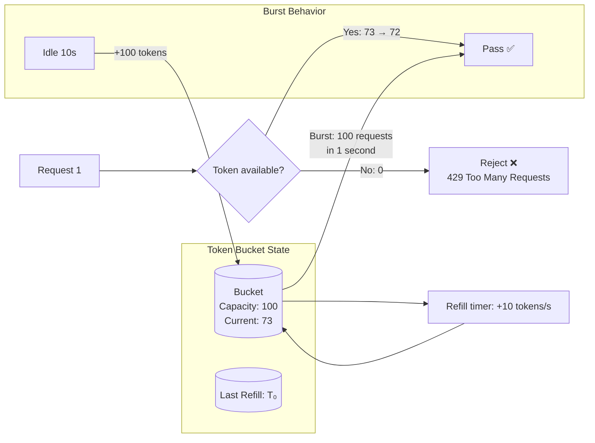
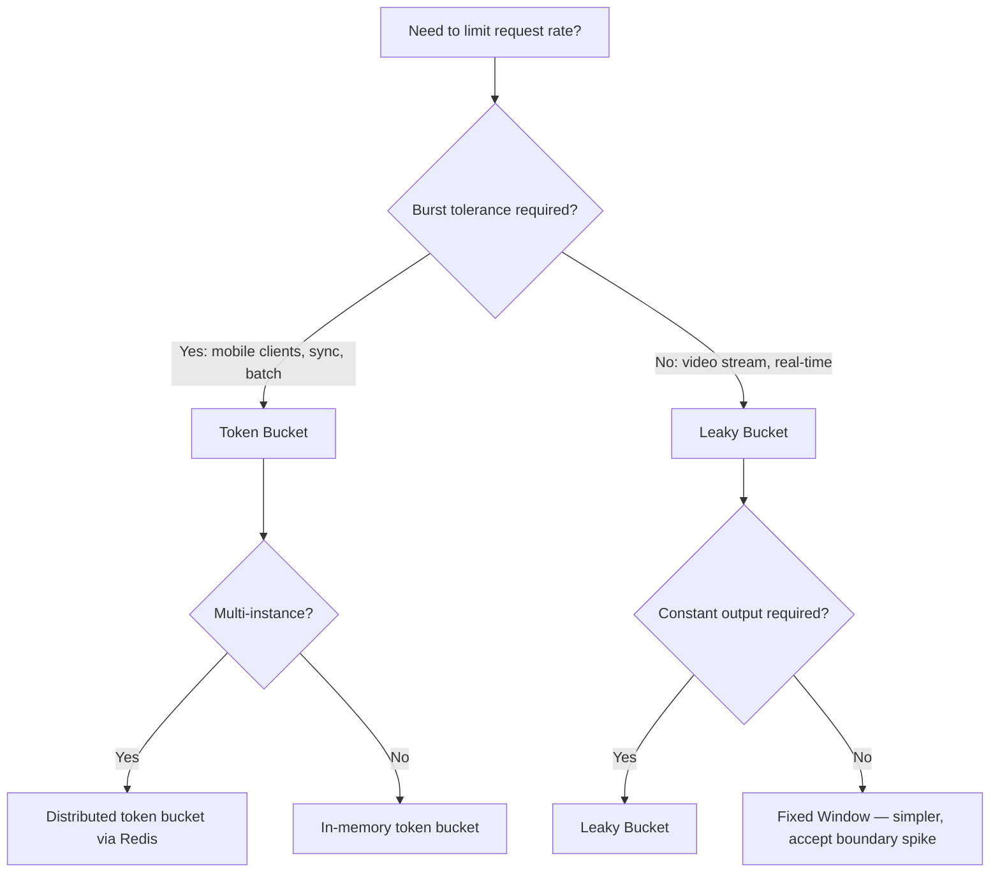

## Navigation

**Domain:** [[7 — System Design & Distributed Systems]] > **Group:** Scalability Patterns
**Previous:** [[7.240 — Competing Consumers — Scaling Workers]] | **Next:** [[7.242 — Rate Limiting — Leaky Bucket Algorithm]]

### Prerequisites

- [[7.238 — Backpressure — Detection and Handling]] — rate limiting is a proactive form of backpressure; it rejects excess requests before they enter the processing pipeline, preventing overload rather than responding to it
- [[7.240 — Competing Consumers — Scaling Workers]] — rate limiting protects downstream services from competing consumers by capping the request rate each consumer can generate
- [[7.206 — Horizontal vs Vertical Scaling — Tradeoffs]] — rate limits must account for the number of instances; a per-instance token bucket aggregates to N× capacity across the fleet

### Where This Fits

Rate limiting controls the rate at which requests are accepted by a service, rejecting excess requests with a clear signal (HTTP 429 Too Many Requests). The token bucket algorithm is the most widely used rate limiting algorithm because it allows short bursts (accumulated idle tokens) while enforcing a steady long-term rate. A .NET engineer encounters token bucket rate limiting when configuring `RateLimiterMiddleware` in ASP.NET Core, protecting a downstream API from client overuse, implementing API key-based rate plans, or preventing a misconfigured client from overwhelming a service. It becomes necessary above ~1,000 req/s per client when a single client can consume all available resources, or whenever API monetization (tiered plans) is required.

---

## Core Mental Model

The token bucket maintains a bucket of tokens that replenish at a fixed rate (e.g., 100 tokens per second). Each request consumes one token. If the bucket has tokens, the request passes. If empty, the request is rejected (or queued). The bucket has a maximum capacity (burst size) — tokens do not accumulate beyond this limit. The invariant is that the long-term average rate never exceeds the replenishment rate, but short-term bursts up to the bucket capacity are allowed. What this trades is memory (a single integer counter + timestamp per bucket) against accuracy: unlike fixed window counters, the token bucket prevents boundary spikes because tokens replenish continuously. The recognition trigger is the need to allow bursts (a mobile client syncing after being offline) while still enforcing a daily or per-second average rate.



### Key Properties / Guarantees

|Property|Value|Condition|
|---|---|---|
|Long-term rate|Exactly replenishment rate|Over any window ≥ 1 minute|
|Burst size|Up to bucket capacity|After idle period ≥ capacity / rate|
|Memory per bucket|2 integers (tokens, timestamp)|Single-process or Redis|
|Fairness|Proportional to token consumption|Per-client bucket isolation|
|Accuracy|Continuous — no boundary spikes|Unlike fixed window counters|

---

## Deep Mechanics

### How It Works

1. **Initialize.** Create a bucket with `capacity` (max burst) and `refillRate` (tokens per second). Set current token count to `capacity` and last refill time to `now`.

2. **Refill calculation.** On each request, calculate elapsed time since last refill: `elapsed = now - lastRefillTime`. Add `elapsed × refillRate` tokens to the bucket, capping at `capacity`. Update `lastRefillTime = now`. This is the "lazy refill" pattern — tokens are calculated on demand, not via a background timer.

3. **Consume.** If `tokens >= 1`, decrement by 1 and allow the request. If `tokens < 1`, reject the request (return 429).

4. **Burst absorption.** After 10 seconds of idle with `refillRate = 10/s` and `capacity = 100`, the bucket holds 100 tokens. A burst of 100 requests in 1 second all pass. The 101st request is rejected.

5. **Steady state.** Under continuous load at exactly the refill rate, the bucket stays near empty (tokens consumed as fast as they are added). No requests are rejected.

```csharp
// Token bucket implementation — production-grade
public sealed class TokenBucket
{
    private readonly double _capacity;
    private readonly double _refillRatePerSecond;
    private double _tokens;
    private long _lastRefillTicks;

    public TokenBucket(double capacity, double refillRatePerSecond)
    {
        _capacity = capacity;
        _refillRatePerSecond = refillRatePerSecond;
        _tokens = capacity;
        _lastRefillTicks = Stopwatch.GetTimestamp();
    }

    public bool TryConsume(int count = 1)
    {
        ArgumentOutOfRangeException.ThrowIfNegativeOrZero(count);

        Refill();

        if (_tokens < count)
            return false;

        _tokens -= count;
        return true;
    }

    private void Refill()
    {
        var now = Stopwatch.GetTimestamp();
        var elapsed = (double)(now - _lastRefillTicks) / Stopwatch.Frequency;
        _lastRefillTicks = now;

        var newTokens = elapsed * _refillRatePerSecond;
        _tokens = Math.Min(_capacity, _tokens + newTokens);
    }
}

// Usage
var bucket = new TokenBucket(capacity: 100, refillRatePerSecond: 10);

if (bucket.TryConsume())
{
    // Process request
}
else
{
    return StatusCode(429, "Rate limit exceeded. Retry in " +
        $"{(1.0 / 10.0):F1}s");
}
```

### Failure Modes

**Clock skew (distributed token bucket).** Token bucket relies on elapsed time. If the system clock jumps (NTP adjustment, VM pause), the refill calculation produces an incorrect token count. A clock jump forward adds excessive tokens (burst allowed when it should not be). A clock jump backward subtracts tokens (requests rejected when they should be allowed). Detection: rate limit violations correlate with clock sync events. Mitigation: use `Stopwatch.GetTimestamp()` (monotonic) instead of `DateTime.UtcNow` for intervals. For distributed buckets (Redis), the Redis server's clock is the authority — mitigate by using Redis `TIME` command.

**Integer overflow in refill calculation.** At very high refill rates (>1M tokens/s) and long idle periods (>1 hour), the computed `elapsed × refillRate` can overflow a 32-bit integer or lose precision in floating-point. Detection: after idle periods, `TryConsume` always returns `true` (tokens incorrectly computed as infinite). Mitigation: use `double` for token count, cap elapsed at a maximum (e.g., capacity / refillRate seconds worth of tokens).

```csharp
// Safe refill with overflow protection
private void Refill()
{
    var now = Stopwatch.GetTimestamp();
    var elapsed = Math.Min(
        (double)(now - _lastRefillTicks) / Stopwatch.Frequency,
        _capacity / _refillRatePerSecond * 2);  // Cap at 2× capacity worth
    _lastRefillTicks = now;

    _tokens = Math.Min(_capacity, _tokens + elapsed * _refillRatePerSecond);
}
```

**Per-instance vs global rate limiting.** A token bucket on each instance allows N× the intended rate across the fleet. With 10 instances and per-instance refill rate of 100 req/s, the fleet can handle 1,000 req/s — but each instance independently decides. A client that hits instance 1 gets 100 req/s; a client that distributes across 10 instances gets 1,000 req/s. Detection: the aggregate rate limit is violated during deployments (load balancer redistributes traffic). Mitigation: use a distributed token bucket (Redis) for cross-instance coordination, OR acknowledge the aggregate rate and design clients accordingly (sticky routing).

**Leaky token bucket (forgot burst capping).** An implementation that refills tokens without capping at `capacity`. Over a long idle period, tokens accumulate to millions, allowing a massive burst. Detection: after a weekend of no traffic, Monday morning sees a 500k request spike that all pass the rate limiter. Fix: always cap at `_capacity`.

```csharp
// ❌ Wrong: no capacity cap — infinite burst after idle
_tokens += elapsed * _refillRatePerSecond;

// ✅ Correct: cap at capacity
_tokens = Math.Min(_capacity, _tokens + elapsed * _refillRatePerSecond);
```

### .NET and Azure Integration

- **ASP.NET Core `System.Threading.RateLimiting`:** Built-in `TokenBucketRateLimiter` class. Use via `RateLimiterMiddleware` or directly. Configured with `TokenBucketRateLimiterOptions`:

```csharp
// ASP.NET Core built-in token bucket rate limiter
builder.Services.AddRateLimiter(options =>
{
    options.AddFixedWindowLimiter("Default", config =>
    {
        config.PermitLimit = 100;
        config.Window = TimeSpan.FromSeconds(1);
        config.QueueProcessingOrder = QueueProcessingOrder.OldestFirst;
        config.QueueLimit = 0;
    });

    // Token bucket variant
    options.AddTokenBucketLimiter("Api", tokenOptions =>
    {
        tokenOptions.TokenLimit = 100;        // capacity
        tokenOptions.TokensPerPeriod = 10;     // refill rate
        tokenOptions.ReplenishmentPeriod = TimeSpan.FromSeconds(1);
        tokenOptions.QueueProcessingOrder = QueueProcessingOrder.OldestFirst;
        tokenOptions.QueueLimit = 5;           // allow queuing, not just rejection
    });
});

app.UseRateLimiter();

[EnableRateLimiting("Api")]
[ApiController]
public class OrdersController : ControllerBase { ... }
```

- **Polly v8 `RateLimiterStrategy`:** Token bucket rate limiting as a resilience strategy:

```csharp
builder.Services.AddResiliencePipeline("ThrottledClient", builder =>
{
    builder.AddRateLimiter(new SlidingWindowRateLimiter(
        new SlidingWindowRateLimiterOptions
        {
            PermitLimit = 100,
            SegmentsPerWindow = 10,  // ← token-bucket-equivalent behavior
            Window = TimeSpan.FromSeconds(1)
        }));
});
```

- **Azure API Management:** Built-in rate limit policies per subscription, per product, or per API:

```xml
<policies>
    <inbound>
        <rate-limit calls="100" renewal-period="60" />
        <rate-limit-by-key calls="20" renewal-period="60"
            counter-key="@(context.Subscription.Id)" />
    </inbound>
</policies>
```

- **Azure Application Gateway (WAF):** Rate limiting rules at the network edge — block IPs exceeding a threshold before requests reach the application.
- **Nginx:** `limit_req_zone` + `limit_req` directives implement token bucket rate limiting at the reverse proxy layer.

```nginx
# Nginx token bucket rate limiting
limit_req_zone $binary_remote_addr zone=api:10m rate=100r/s;

server {
    location /api/ {
        limit_req zone=api burst=50 nodelay;
        proxy_pass http://backend;
    }
}
```

---

## Production Patterns and Implementation

### Primary Implementation

A token bucket rate limiter for an ASP.NET Core API with per-client isolation (each API key gets its own bucket) and response headers.

```csharp
// Per-client token bucket rate limiter
public sealed class ClientRateLimiter
{
    private readonly ConcurrentDictionary<string, TokenBucket> _buckets;
    private readonly double _defaultRate;
    private readonly double _defaultBurst;

    public ClientRateLimiter(
        double defaultRate = 100, double defaultBurst = 20)
    {
        _defaultRate = defaultRate;
        _defaultBurst = defaultBurst;
        _buckets = new ConcurrentDictionary<string, TokenBucket>();
    }

    public (bool Allowed, int Remaining, double RetryAfterSeconds)
        TryConsume(string clientId)
    {
        var bucket = _buckets.GetOrAdd(
            clientId,
            _ => new TokenBucket(_defaultBurst, _defaultRate));

        var allowed = bucket.TryConsume();

        // Estimate remaining tokens and retry delay
        var remaining = (int)bucket.GetEstimatedTokens();
        var retryAfter = allowed ? 0.0 : 1.0 / _defaultRate;

        return (allowed, remaining, retryAfter);
    }
}

// Middleware that enforces rate limits per API key
public sealed class RateLimitingMiddleware
{
    private readonly RequestDelegate _next;
    private readonly ClientRateLimiter _limiter;
    private readonly ILogger<RateLimitingMiddleware> _logger;

    public RateLimitingMiddleware(
        RequestDelegate next,
        ClientRateLimiter limiter,
        ILogger<RateLimitingMiddleware> logger)
    {
        _next = next;
        _limiter = limiter;
        _logger = logger;
    }

    public async Task InvokeAsync(HttpContext context)
    {
        var clientId = context.Request.Headers["X-Api-Key"]
            .FirstOrDefault() ?? context.Connection.RemoteIpAddress?.ToString() ?? "unknown";

        var (allowed, remaining, retryAfter) = _limiter.TryConsume(clientId);

        // Set response headers (always, even on rejection)
        context.Response.Headers["X-RateLimit-Limit"] = "100";
        context.Response.Headers["X-RateLimit-Remaining"] = remaining.ToString();

        if (!allowed)
        {
            context.Response.StatusCode = StatusCodes.Status429TooManyRequests;
            context.Response.Headers["Retry-After"] =
                Math.Ceiling(retryAfter).ToString("F0");

            _logger.LogWarning(
                "Rate limit exceeded for client {ClientId}. " +
                "Retry after {RetryAfter}s",
                clientId, retryAfter);

            await context.Response.WriteAsJsonAsync(
                new ProblemDetails
                {
                    Status = 429,
                    Title = "Too Many Requests",
                    Detail = $"Rate limit exceeded. Retry after {retryAfter:F0} seconds.",
                    Extensions = { ["retryAfterSeconds"] = retryAfter }
                });

            return;
        }

        await _next(context);
    }
}
```

### Configuration and Wiring

```csharp
// Program.cs
builder.Services.AddSingleton(new ClientRateLimiter(
    defaultRate: 100, defaultBurst: 20));
builder.Services.AddSingleton<RateLimitingMiddleware>();

var app = builder.Build();
app.UseMiddleware<RateLimitingMiddleware>();
app.MapControllers();
app.Run();
```

### Common Variants

**ASP.NET Core built-in token bucket limiter:**

```csharp
builder.Services.AddRateLimiter(options =>
{
    options.AddTokenBucketLimiter("Standard", opt =>
    {
        opt.TokenLimit = 100;
        opt.TokensPerPeriod = 10;
        opt.ReplenishmentPeriod = TimeSpan.FromSeconds(1);
        opt.AutoReplenishment = true;
        opt.QueueLimit = 0;  // No queuing — fail fast
    });
});

app.UseRateLimiter();

[EnableRateLimiting("Standard")]
public class ApiController : ControllerBase { }
```

**Distributed token bucket with Redis (cross-instance coordination):**

```csharp
// Redis token bucket using Lua script (atomic)
public class RedisTokenBucket
{
    private readonly IDatabase _redis;
    private readonly string _key;
    private readonly int _capacity;
    private readonly double _refillRate;

    // Lua script: atomic refill + consume
    private const string Script = @"
        local key = KEYS[1]
        local capacity = tonumber(ARGV[1])
        local refillRate = tonumber(ARGV[2])
        local now = tonumber(ARGV[3])

        local bucket = redis.call('HMGET', key, 'tokens', 'lastRefill')
        local tokens = tonumber(bucket[1]) or capacity
        local lastRefill = tonumber(bucket[2]) or now

        local elapsed = math.max(0, now - lastRefill)
        tokens = math.min(capacity, tokens + elapsed * refillRate)

        if tokens >= 1 then
            tokens = tokens - 1
            redis.call('HMSET', key, 'tokens', tokens, 'lastRefill', now)
            return {1, tokens}
        else
            redis.call('HMSET', key, 'tokens', tokens, 'lastRefill', lastRefill)
            return {0, tokens}
        end
    ";

    public async Task<(bool Allowed, double TokensRemaining)> TryConsumeAsync()
    {
        var result = (int[])await _redis.ScriptEvaluateAsync(
            Script, new RedisKey[] { _key },
            new RedisValue[] { _capacity, _refillRate, DateTimeOffset.UtcNow.ToUnixTimeSeconds() });

        return (result[0] == 1, result[1]);
    }
}
```

**Polly v8 rate limiter strategy:**

```csharp
builder.Services.AddResiliencePipeline("Throttled", builder =>
{
    builder.AddRateLimiter(new TokenBucketRateLimiter(
        new TokenBucketRateLimiterOptions
        {
            TokenLimit = 100,
            TokensPerPeriod = 10,
            ReplenishmentPeriod = TimeSpan.FromSeconds(1),
            QueueLimit = 0
        }));
});

// Usage
var pipeline = serviceProvider
    .GetRequiredService<ResiliencePipelineProvider<string>>()
    .GetPipeline("Throttled");

await pipeline.ExecuteAsync(async ct =>
    await httpClient.GetAsync("/api/data", ct), ct);
```

### Real-World .NET Ecosystem Example

The ASP.NET Core `TokenBucketRateLimiter` is the most used implementation. It's part of `Microsoft.AspNetCore.RateLimiting` and uses `System.Threading.RateLimiting` under the hood:

```csharp
// Real-world: API with tiered rate limits per plan
builder.Services.AddRateLimiter(options =>
{
    // Free tier: 10 req/s, burst 5
    options.AddTokenBucketLimiter("Free", o =>
    {
        o.TokenLimit = 5;
        o.TokensPerPeriod = 10;
        o.ReplenishmentPeriod = TimeSpan.FromSeconds(1);
        o.AutoReplenishment = true;
        o.QueueLimit = 0;
    });

    // Pro tier: 100 req/s, burst 20
    options.AddTokenBucketLimiter("Pro", o =>
    {
        o.TokenLimit = 20;
        o.TokensPerPeriod = 100;
        o.ReplenishmentPeriod = TimeSpan.FromSeconds(1);
        o.AutoReplenishment = true;
        o.QueueLimit = 0;
    });

    // Enterprise: 1000 req/s, burst 100
    options.AddTokenBucketLimiter("Enterprise", o =>
    {
        o.TokenLimit = 100;
        o.TokensPerPeriod = 1000;
        o.ReplenishmentPeriod = TimeSpan.FromSeconds(1);
        o.AutoReplenishment = true;
        o.QueueLimit = 5;  // Allow brief queuing before rejection
    });
});

// Select policy per request
app.Use(async (context, next) =>
{
    var plan = context.Request.Headers["X-Plan"].FirstOrDefault() ?? "Free";
    var policy = plan switch
    {
        "Pro" => "Pro",
        "Enterprise" => "Enterprise",
        _ => "Free"
    };

    var limiter = context.RequestServices
        .GetRequiredService<RateLimiterManager>();
    var result = await limiter.AcquireAsync(context, policy);

    if (!result.IsAcquired)
    {
        context.Response.StatusCode = 429;
        return;
    }

    await next(context);
});
```

---

## Gotchas and Production Pitfalls

### No Burst Capping

**Pitfall:** Token count is refilled without a capacity cap. After a weekend of idle time, the bucket accumulates millions of tokens, allowing a massive burst.

```csharp
// ❌ No capacity cap
_tokens += elapsed * _refillRate;
```

**Symptom:** After low-traffic periods, first requests are all accepted even at 100× normal rate. The downstream is overwhelmed. Rate limiting is invisible.

**Fix:** Always cap at `_capacity`.

```csharp
// ✅ Capacity cap
_tokens = Math.Min(_capacity, _tokens + elapsed * _refillRate);
```

**Cost of not fixing:** Downstream overload after idle periods. The rate limiter provides no protection — exactly what it was meant to do.

### Clock Dependency for Refill

**Pitfall:** Using `DateTime.UtcNow` for elapsed time calculation. An NTP clock adjustment (or VM pause/resume) causes incorrect refill.

```csharp
// ❌ Clock-dependent
var elapsed = (DateTime.UtcNow - _lastRefill).TotalSeconds;
```

**Symptom:** After NTP sync, token counts jump. Rate limiting becomes erratic — sometimes too strict, sometimes too permissive.

**Fix:** Use `Stopwatch.GetTimestamp()` (monotonic, not affected by clock changes).

```csharp
// ✅ Monotonic timestamp
var now = Stopwatch.GetTimestamp();
var elapsed = (double)(now - _lastRefillTicks) / Stopwatch.Frequency;
```

**Cost of not fixing:** Erratic rate limiting. During VM migration (clock pause + jump), the rate limiter allows a massive burst. Or it rejects all requests for minutes.

### Per-Instance Buckets Without Coordination

**Pitfall:** Each service instance has its own token bucket. A client can send 100 req/s to instance 1 AND 100 req/s to instance 2, achieving 200 req/s total — double the intended limit.

**Symptom:** The unintended aggregate rate limit is `per_instance_limit × instance_count`. Traffic spikes during deployments (when traffic redistributes) exceed expectations.

**Fix:** Use distributed token bucket (Redis) OR use sticky sessions (affinity) to pin clients to instances OR document the aggregate rate and design clients for it:

```csharp
// Option: sticky rate limit key — include instance affinity
var rateLimitKey = $"{clientId}:{context.Request.Headers["X-Instance-Id"]}";
```

**Cost of not fixing:** Confusing rate limit behavior. QA tests pass (single instance). Production fails (multiple instances). Debugging takes hours.

### Queue Limit Creates Hidden Latency

**Pitfall:** Setting `QueueLimit > 0` without understanding that queued requests add latency. With `QueueLimit = 10` and 100 req/s refill rate, a burst of 110 requests causes 10 to queue. The queued requests wait up to `queue_size / refill_rate` seconds = 100ms. This appears as unexplained P99 latency.

**Symptom:** P99 latency increases during traffic spikes. Monitoring shows requests passing through the rate limiter (no 429s), but latency is higher. The queue is invisible in standard metrics.

**Fix:** Monitor queue depth. Set `QueueLimit = 0` if latency is more important than success rate. Or add metrics for queue wait time:

```csharp
// Track queue depth
var limiter = new TokenBucketRateLimiter(
    new TokenBucketRateLimiterOptions
    {
        TokenLimit = 100,
        TokensPerPeriod = 10,
        QueueLimit = 5
    });

// In the rate limiter middleware or handler
using var lease = await limiter.AcquireAsync(ct);
_metrics.RecordQueueWaitTime(
    limiter.GetStatistics().CurrentQueuedCount);
```

**Cost of not fixing:** Mysterious P99 latency spikes. Team may blame the downstream or the network, not the rate limiter.

### Rate Limiting After Resource-Intensive Work

**Pitfall:** The rate limiter checks after expensive work (deserialization, validation, logging) instead of at the very beginning of the request pipeline. Resources are consumed before the rate limit is enforced.

```csharp
// ❌ Rate limiting after resource-intensive work
[HttpPost]
public async Task<IActionResult> ProcessOrder(Order order)
{
    await DeserializeAndValidateAsync(order);  // Expensive!
    var bucket = _bucketProvider.GetBucket(clientId);

    if (!bucket.TryConsume())
        return StatusCode(429);

    await _processor.ProcessAsync(order);
}
```

**Symptom:** CPU and memory usage stay high during rate-limited periods. The service does work for requests it eventually rejects. Under DDoS, the service still burns CPU validating requests.

**Fix:** Enforce rate limiting as early as possible — middleware, before deserialization:

```csharp
// ✅ Rate limit BEFORE expensive work (middleware)
public async Task InvokeAsync(HttpContext context)
{
    if (!_bucket.TryConsume(GetClientId(context)))
    {
        context.Response.StatusCode = 429;
        return;  // No deserialization, no validation
    }

    await _next(context);
}
```

**Cost of not fixing:** Under DDoS, the service still does expensive work for every request. The rate limiter protects downstream only — the service itself is still vulnerable to CPU exhaustion.

### Missing Retry-After Header

**Pitfall:** Returning HTTP 429 without a `Retry-After` header. Clients have no guidance on when to retry and either retry immediately (defeating rate limiting) or give up forever.

**Symptom:** Clients retry every 100ms after receiving 429, generating 10× the original rate limit in retry traffic. The rate limiter rejects all of them repeatedly, but each rejection consumes response bandwidth.

**Fix:** Always include `Retry-After` header:

```csharp
// ✅ Include Retry-After header
context.Response.Headers["Retry-After"] =
    Math.Ceiling(retryAfterSeconds).ToString("F0");
// Client should wait at least this many seconds before retrying
```

**Cost of not fixing:** Retry storms. Each 429 response generates 5–10 immediate retries. Total traffic can increase 10×, overwhelming the network layer even if the application layer rate limits.

---

## Tradeoffs and Decision Framework

### Tradeoff Matrix

| Dimension | Token Bucket | Leaky Bucket | Fixed Window |
|---|---|---|---|
| Burst tolerance | Yes (capacity burst) | No (constant output) | Partial (boundary spike) |
| Boundary spike | None (continuous) | None (continuous) | Yes (window boundary) |
| Memory | 2 integers per bucket | 1 integer + queue | 1 counter + window start |
| Accuracy | High (continuous) | High (continuous) | Low (window boundary) |
| Implementation complexity | Low | Medium | Low |
| Distributed variant | Easy (Redis Lua) | Harder (needs queue) | Easy (Redis INCR + TTL) |

### When to Apply



### When NOT to Apply

- [ ] **Rate limit is per-day, not per-second.** A daily limit (e.g., 10,000 requests/day) is better implemented with a simple counter + TTL (Redis INCR with 86400s expiry). Token bucket provides sub-second granularity that is unnecessary.
- [ ] **Concurrency limiting, not rate limiting.** If you want to limit how many requests are in-flight (not per-second), use `SemaphoreSlim` or `ConcurrencyLimiter`, not token bucket.
- [ ] **Memory-constrained environment requires zero allocations.** Token bucket per-request needs 2 atomics. For extreme low-allocation scenarios (<1μs per request), use a simpler counter algorithm.
- [ ] **Rate limit is at the reverse proxy, not the application.** Nginx `limit_req` or Azure Application Gateway WAF policies are better placed here — offload rate limiting from the application.

### Scale Thresholds

- Worth considering above ~100 req/s when per-client fairness matters
- Required when API is monetized with tiered plans
- Token bucket capacity heuristic: `burst = (peak_client_qps - sustained_client_qps) × peak_duration_seconds`
- Redis distributed bucket: up to ~100,000 operations/second per Redis instance

---

## Interview Arsenal

### Question Bank

1. How does the token bucket algorithm work?
2. What problem does the token bucket solve that fixed window does not?
3. How do you implement a distributed token bucket across multiple service instances?
4. What happens when a token bucket is idle for a long period?
5. Compare token bucket with leaky bucket.
6. Design a rate limiter for a multi-tenant API with free/pro/enterprise tiers.
7. How do you handle clock skew in a distributed token bucket?
8. What headers should a rate-limited API return?

### Spoken Answers

**Q: How does the token bucket algorithm work?**

> **Average answer:** Tokens are added at a fixed rate. Each request takes a token. If no tokens, request is rejected.

> **Great answer:** The token bucket maintains a count of tokens that refill at a configured rate — for example, 10 tokens per second. Each request consumes one token. If the bucket is empty, the request is rejected with 429. The key property is that tokens are capped at a maximum capacity — say, 100 — which allows short bursts up to that capacity after idle periods. So a mobile client that has been offline for 10 seconds can send 100 requests immediately (the accumulated 100 tokens), then settle into the steady rate of 10 req/s. This is the critical difference from leaky bucket (which enforces constant output rate and does not allow bursts) and fixed window (which allows boundary spikes at window edges). In .NET, `TokenBucketRateLimiter` from `System.Threading.RateLimiting` implements this, and you configure it in ASP.NET Core via `options.AddTokenBucketLimiter(...)`.

**Q: How do you implement a distributed token bucket?**

> **Great answer:** A distributed token bucket uses Redis as the shared state. The bucket's token count and last refill timestamp are stored in a Redis hash. A Lua script atomically computes the refill, checks availability, and decrements — all in one `EVALSHA` call to avoid race conditions. The script takes `capacity`, `refillRate`, and `now` as arguments and returns `{allowed, remainingTokens}`. This ensures that 50 instances cannot all consume the same token simultaneously. The tradeoff is a 1–2ms latency penalty per request (Redis round trip) and the risk that a Redis failover during the script execution loses the token count (acceptable — the bucket resets to full capacity on the new primary). `StackExchange.Redis` with `ScriptEvaluateAsync` handles this efficiently.

### System Design Interview Trigger

If an interviewer asks about API rate limiting or designing a rate limiter, they almost always expect the token bucket algorithm. The probing questions are: "how do you handle bursts" (token bucket capacity), "how do you coordinate across instances" (distributed bucket via Redis Lua), and "what headers do you return" (X-RateLimit-Limit, X-RateLimit-Remaining, Retry-After). The candidate who mentions `TokenBucketRateLimiter` from `System.Threading.RateLimiting` and shows familiarity with the ASP.NET Core middleware demonstrates production experience.

---

## Architecture Decision Record

**Status:** Accepted

**Context:** The public API serves 50,000 clients with tiered pricing: Free (10 req/s), Pro (100 req/s), Enterprise (1,000 req/s). Clients must be able to burst briefly (mobile sync after offline). The API runs on 20 Azure App Service instances.

**Options Considered:**

1. **Token bucket per instance (in-memory)** — Simple, zero network calls, but aggregate rate = instance_count × per_instance_limit.
2. **Token bucket via Redis** — Accurate cross-instance coordination, 1-2ms latency per request, Redis operational cost.
3. **Fixed window counter (Redis INCR)** — Simpler, but allows boundary spikes and does not handle bursts naturally.

**Decision:** Token bucket via Redis (option 2), because:
- Burst handling is critical for mobile clients (sync after offline)
- Cross-instance coordination is required (20 instances, uniform rate regardless of which instance handles the request)
- The 1-2ms latency is acceptable (API processing is 50–200ms)
- Azure Redis Cache Standard tier handles 100,000 ops/s — enough for 50,000 clients at 10–1,000 req/s

**Consequences:**
- ✅ Accurate per-client rate limits regardless of which instance handles the request
- ✅ Natural burst handling (mobile clients accumulate tokens during offline periods)
- ✅ Tiered rate limits are configurable per client (stored in Redis hash)
- ⚠️ Redis is a dependency — rate limiting fails if Redis is down (mitigated: degrade to per-instance limiter on Redis failure)
- ⚠️ 1-2ms added to each API request
- ❌ Lua script deployment requires `SCRIPT LOAD` on Redis cluster (must load on all nodes)

**Review Trigger:** Revisit if API response time target is sub-10ms (Redis round trip dominates) or if Redis cluster topology changes require Lua script reloading.

---

## Self-Check

### Conceptual Questions

1. How does token bucket refill work?
2. What property allows burst behavior?
3. What is the key difference between token bucket and fixed window?
4. How do you implement a distributed token bucket without race conditions?
5. What is the overflow risk with token bucket refill calculation?
6. What headers should a rate-limited API return?
7. How does `TokenBucketRateLimiter` in ASP.NET Core differ from `FixedWindowRateLimiter`?
8. When would you choose token bucket over leaky bucket?
9. What happens to the token bucket during a clock jump?
10. How do you handle rate limit "queue" vs "reject"?

<details>
<summary>Answers</summary>

1. On each request, calculate `elapsed = now - lastRefill`, add `elapsed × refillRate` tokens, cap at `capacity`. This is the "lazy refill" pattern — computed on demand, not via a timer.
2. The `capacity` parameter. After idle time, tokens accumulate up to `capacity`. A burst of up to `capacity` requests can pass in a short window.
3. Token bucket replenishes continuously — no boundary spikes. Fixed window resets at a boundary, allowing a burst of `limit` requests at the start of each window.
4. Redis Lua script: store `{tokens, lastRefill}` in a hash. The script atomically refills, checks, and decrements. Run via `EVALSHA` (or `EVAL`).
5. At high refill rates and long idle periods, `elapsed × refillRate` can overflow. Cap elapsed at `capacity / refillRate` or use double precision with a safety clamp.
6. `X-RateLimit-Limit` (max requests per window), `X-RateLimit-Remaining` (remaining in window), `Retry-After` (seconds until next token available, required on 429).
7. Token bucket: continuous refill, allows bursts up to capacity, no boundary spike. Fixed window: hard reset per window, allows boundary spikes, simpler.
8. Token bucket when bursts must be allowed (mobile sync, batch API calls). Leaky bucket when output rate must be constant (video encoding, real-time data feed).
9. Clock jump forward → excessive tokens added ≈ false burst allowance. Clock jump backward → negative elapsed ≈ tokens not refilled ≈ false rejection. Use `Stopwatch.GetTimestamp()` (monotonic) instead of `DateTime.UtcNow`.
10. `QueueLimit = 0`: reject immediately (429). `QueueLimit > 0`: requests wait up to queue capacity. Queuing adds latency but reduces rejection rate. Monitor queue wait time to avoid hidden P99 latency.
</details>

---

### Scenario Challenges

**Scenario 1 — Diagnose:** After a deployment, some clients receive 429 responses despite being within their rate limit. The deployment added 5 more instances (from 5 to 10).

<details>
<summary>Diagnosis</summary>

**Root cause:** Token buckets are per-instance. Each instance has its own bucket with refill rate 100 req/s. Before deployment (5 instances), aggregate rate = 500 req/s. After (10 instances), aggregate is 1,000 req/s. But clients that were pinned to one instance (sticky sessions) now see a different instance on each request. A client that previously stayed on instance 1 and consumed 100 req/s now hits 10 different instances, each seeing a fresh bucket. The client is NOT rate-limited despite consuming the same rate. Conversely, if the limit is enforced globally, each instance independently rejects at 100 req/s, and a client that distributes equally across 10 instances gets only 10 req/s per instance = 100 req/s total — correct.

**Fix:** Use a distributed token bucket (Redis) to coordinate across instances. Or implement sticky rate limiting — hash the client ID to an instance and route consistently.
</details>

**Scenario 2 — Design decision:** Real-time video streaming API needs to limit bitrate output to 5 Mbps per client. Bursts are undesirable. Which algorithm?

<details>
<summary>Decision</summary>

Leaky bucket. Token bucket allows bursts (up to capacity), which would cause output bitrate spikes. Leaky bucket enforces a constant output rate — ideal for streaming. Use Azure API Management rate limit policy or Nginx `limit_rate` with a leaky-bucket-equivalent configuration.
</details>

**Scenario 3 — Failure mode:** At 2:00 AM, all API requests start returning 429. No deployment occurred. Redis is healthy.

<details>
<summary>Investigation</summary>

**Check:** Clock skew on the instance. If the instance clock jumped forward by 1 hour (NTP adjustment), the refill calculation adds `3600 × refillRate` tokens, but the `lastRefill` is also updated to the new time. Wait — that would allow MORE requests, not fewer. The opposite: if clock jumped BACKWARD, elapsed is negative, no tokens are added, and every request is rejected.

**Evidence:** `DateTime.UtcNow` shows time going backward. NTP log shows a 30-second adjustment. The token bucket used `DateTime.UtcNow` instead of `Stopwatch.GetTimestamp()`.

**Fix:** Replace with monotonic timestamps. In the short term, restart the instance to reset the token bucket.
</details>

**Scenario 4 — Scale it:** Current: 1 instance, 100 req/s token bucket. Need: 1,000 req/s across 10 instances.

<details>
<summary>Strategy</summary>

Switch to distributed token bucket via Redis. Each instance runs the same `TryConsume` Lua script against the same Redis key per client. The Redis instance handles 100,000 ops/s — well above 1,000 req/s. Each Redis call adds 1ms latency. Monitor Redis CPU; scale to Redis cluster if needed.
</details>

**Scenario 5 — Interview:** "Design a rate limiter for a public API that handles 10,000 req/s across 50 instances with per-client limits."

<details>
<summary>Response</summary>

"Token bucket via Redis Lua script is the standard approach. State: Redis hash per client with `tokens` and `lastRefill`. Script: compute elapsed → refill → cap at capacity → consume → return result. Lua guarantees atomicity — no race conditions across 50 instances. Set headers: `X-RateLimit-Limit`, `X-RateLimit-Remaining`, and `Retry-After` on 429. Handle Redis failure by degrading to per-instance limiter (less accurate but graceful). Capacity = burst allowance per client. Refill rate = steady-state rate. Sized based on plan tier. Redis Cluster for more throughput. Use `StackExchange.Redis` with `ScriptEvaluateAsync`. For extreme low-latency requirements, consider client-side token buckets synchronized periodically with Redis."
</details>
