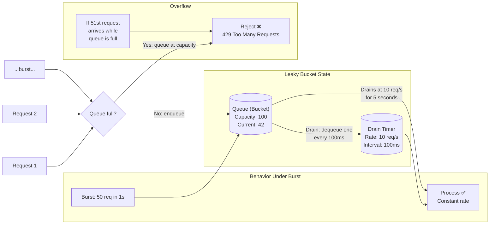
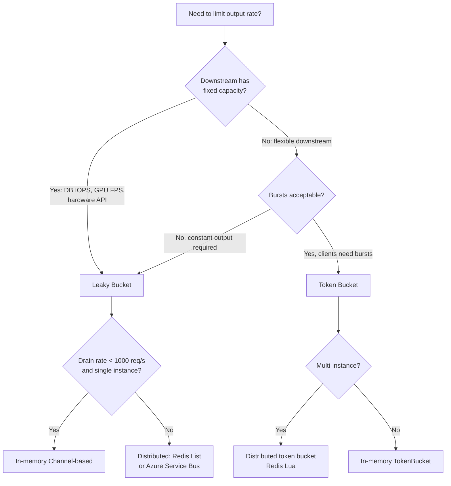

## Navigation

**Domain:** [[7 — System Design & Distributed Systems]] > **Group:** Scalability Patterns
**Previous:** [[7.241 — Rate Limiting — Token Bucket Algorithm]] | **Next:** [[7.243 — Rate Limiting — Fixed Window Counter]]

### Prerequisites

- [[7.241 — Rate Limiting — Token Bucket Algorithm]] — the counterpart algorithm that allows bursts; leaky bucket intentionally does not
- [[7.238 — Backpressure — Detection and Handling]] — leaky bucket provides backpressure by rejecting overflow requests when the queue is full
- [[7.220 — Queue-Based Load Leveling]] — leaky bucket is a specialized form of queue-based load leveling with a fixed drain rate

### Where This Fits

Leaky bucket smooths bursty input into a constant output stream by interposing a FIFO queue (the bucket) that drains at a fixed rate. It is the algorithm of choice when output rate must be constant regardless of input pattern — video encoding pipelines, database write throttling, hardware API rate limiting (GPUs, NICs), and real-time data feeds. A .NET engineer encounters leaky bucket when they need to protect a downstream service that cannot handle bursts (e.g., a legacy database with 100 IOPS limit, a third-party API with strict per-second caps) or when they must shape traffic to match a fixed-capacity resource. It becomes necessary above ~500 req/s when the downstream cannot absorb natural traffic bursts and the system requires predictable, even throughput. Without it, a burst of requests overwhelms the fixed-capacity downstream, causing cascading failures (connection pool exhaustion, timeout storms, retry amplification).

---

## Core Mental Model

The leaky bucket is a bounded FIFO queue that accepts requests at any rate (up to the queue capacity) and drains them at a fixed, constant rate. The invariant is that the output rate never exceeds the configured drain rate, regardless of input pattern. What this trades is burst tolerance: where token bucket allows bursts up to capacity, leaky bucket explicitly prevents them — every request is emitted at a constant interval. The recognition trigger is a downstream dependency that congestively fails under spikes: a database that throttles at exactly 200 writes/second, a GPU inference endpoint that processes exactly 10 frames/second, or a third-party API that returns 429 if more than 50 requests arrive in any second.



### Classification

**Algorithm family:** Rate limiting, traffic shaping, queue-based load leveling.
**Consistency/availability axis:** Sacrifices burst availability (rejects excess) to maintain downstream throughput stability.
**When applied:** Downstream is rate-limited by physical capacity (disk IOPS, GPU FPS, network bandwidth, write throughput).
**When not applied:** Downstream can absorb bursts (use token bucket); rate limit is per-day not per-second (use counter).

### Key Properties / Guarantees

|Property|Value|Condition|
|---|---|---|
|Output rate|Exactly drain rate|Always — invariant is strict|
|Input tolerance|Up to queue capacity|After that, overflow is rejected|
|Burst behavior|None — output is constant|Input burst → queued, drained slowly|
|Memory|Queue depth + drain timer + capacity|Per-instance or shared (Redis)|
|Latency added|queue_depth / drain_rate|For queued requests — proportional to queue depth|
|Fairness|FIFO ordering within queue|Equal chance per request, but no per-client isolation|

---

## Deep Mechanics

### How It Works

1. **Initialize.** Create a bounded FIFO queue of capacity `C`. Configure a fixed drain rate `R` (requests per second). Start a drain timer or signal that releases one request every `1000/R` milliseconds.

2. **Enqueue (write path).** On each incoming request:
   - Check if the queue is full (`count >= capacity`).
   - If full: reject the request (HTTP 429, drop, or backpressure signal).
   - If not full: enqueue the request metadata (or the work item itself) at the tail.

3. **Drain (read path).** A background drain loop or timer:
   - Dequeues one item from the head of the queue.
   - Sends it for processing.
   - Waits `1000 / R` milliseconds before dequeuing the next.
   - The wait is the "leak" — it is fixed, regardless of how many items are in the queue.

4. **Steady state.** At exactly the drain rate, the queue stays near empty. No overflow. Constant throughput.

5. **Burst handling.** A burst fills the queue. The drain rate stays constant. If the burst exceeds queue capacity, excess requests are rejected. The downstream sees a perfectly smooth stream at exactly the drain rate.

```csharp
// Leaky bucket — production-grade implementation
public sealed class LeakyBucket<T>
{
    private readonly Channel<T> _queue;
    private readonly int _capacity;
    private readonly TimeSpan _drainInterval;
    private readonly ILogger _logger;

    public LeakyBucket(
        int capacity,
        double drainRatePerSecond,
        ILogger logger)
    {
        _capacity = capacity;
        _drainInterval = TimeSpan.FromSeconds(1.0 / drainRatePerSecond);
        _logger = logger;

        _queue = Channel.CreateBounded<T>(new BoundedChannelOptions(capacity)
        {
            FullMode = BoundedChannelFullMode.DropWrite,
            SingleReader = true,
            SingleWriter = false
        });
    }

    public bool TryEnqueue(T item)
    {
        if (_queue.Writer.TryWrite(item))
            return true;

        _logger.LogWarning(
            "Leaky bucket overflow. Capacity: {Capacity}. Dropping item.",
            _capacity);
        return false;
    }

    public async Task RunDrainLoopAsync(
        Func<T, CancellationToken, Task> processor,
        CancellationToken ct)
    {
        await foreach (var item in _queue.Reader.ReadAllAsync(ct))
        {
            try
            {
                await processor(item, ct);
            }
            catch (Exception ex)
            {
                _logger.LogError(ex,
                    "Leaky bucket drain: processor failed for item");
            }

            // The "leak" — fixed interval drain
            await Task.Delay(_drainInterval, ct);
        }
    }

    public int CurrentDepth => _queue.Reader.Count;
}
```

### Failure Modes

**Overflow under sustained overload.** The queue fills and stays full. Every incoming request is rejected. The system has no mechanism to increase drain rate — it is fixed by design. If the sustained input rate exceeds the drain rate, 100% of excess requests are rejected. Detection: `CurrentDepth` is at `_capacity` continuously. `Logger.LogWarning` fires on every rejected request. Mitigation: add monitoring on queue depth with an alert when depth exceeds 80% for 30 seconds. The long-term fix is either increasing the drain rate (if downstream can handle it) or rejecting at the upstream (client throttling, circuit breaker) instead of at the bucket.

**Drain delay accumulation.** If the processor callback takes longer than the drain interval, the gap between dequeues widens. The actual output rate drops below the configured rate. A slow processor (e.g., database write that blocks for 500ms when the drain interval is 100ms) causes 5× throughput reduction. Detection: the actual completion rate is lower than the drain rate. P99 drain-to-completion latency grows. Mitigation: separate the drain dequeue from the processor — use a `SemaphoreSlim` to allow concurrent processing up to a limit while still controlling the dequeue rate.

```csharp
// Leaky bucket with concurrent processing — drain rate independent of processor speed
public sealed class ConcurrentLeakyBucket<T>
{
    private readonly Channel<T> _queue;
    private readonly TimeSpan _drainInterval;
    private readonly SemaphoreSlim _concurrencyLimit;

    public ConcurrentLeakyBucket(
        int capacity,
        double drainRatePerSecond,
        int maxConcurrency)
    {
        _drainInterval = TimeSpan.FromSeconds(1.0 / drainRatePerSecond);
        _concurrencyLimit = new SemaphoreSlim(maxConcurrency);
        _queue = Channel.CreateBounded<T>(new BoundedChannelOptions(capacity)
        {
            FullMode = BoundedChannelFullMode.DropWrite,
            SingleReader = true,
            SingleWriter = false
        });
    }

    public async Task RunDrainLoopAsync(
        Func<T, CancellationToken, Task> processor,
        CancellationToken ct)
    {
        await foreach (var item in _queue.Reader.ReadAllAsync(ct))
        {
            // Enforce drain rate at dequeue time
            await Task.Delay(_drainInterval, ct);

            // Process concurrently — the drain rate controls dequeue,
            // not the processor duration
            await _concurrencyLimit.WaitAsync(ct);
            _ = ProcessAsync(item, processor, ct);
        }
    }

    private async Task ProcessAsync(
        T item,
        Func<T, CancellationToken, Task> processor,
        CancellationToken ct)
    {
        try { await processor(item, ct); }
        finally { _concurrencyLimit.Release(); }
    }
}
```

**Queue capacity misconfiguration.** Setting capacity too low causes unnecessary rejection under normal burst patterns. Setting it too high allows a large backlog that takes minutes to drain, causing stale data processing. Detection: if the queue is always at capacity during normal traffic, capacity is too low. If items spend >60s in the queue before processing, capacity is too high. Fix: `capacity = (peak_burst_size - sustained_rate × burst_duration)` as a minimum. Monitor average queue dwell time.

**Single-instance bottleneck.** The drain loop is a single reader — one instance consumes the queue. In a multi-instance deployment, each instance has its own leaky bucket and its own drain loop. Without coordination, the aggregate output rate is `instance_count × drain_rate`. To enforce a global drain rate, the drain state must be shared (Redis list + distributed lock for dequeue).

```csharp
// Distributed leaky bucket via Redis
public sealed class RedisLeakyBucket
{
    private readonly IDatabase _redis;
    private readonly string _listKey;
    private readonly string _lockKey;
    private readonly int _capacity;
    private readonly TimeSpan _drainInterval;

    private const string EnqueueScript = @"
        local key = KEYS[1]
        local capacity = tonumber(ARGV[1])
        local item = ARGV[2]

        local length = redis.call('LLEN', key)
        if length >= capacity then
            return {0, length}
        end

        redis.call('RPUSH', key, item)
        return {1, length + 1}
    ";

    public async Task<(bool Accepted, int QueueDepth)> TryEnqueueAsync(string item)
    {
        var result = (int[])await _redis.ScriptEvaluateAsync(
            EnqueueScript,
            new RedisKey[] { _listKey },
            new RedisValue[] { _capacity, item });

        return (result[0] == 1, result[1]);
    }

    public async Task RunDrainLoopAsync(
        Func<string, CancellationToken, Task> processor,
        CancellationToken ct)
    {
        while (!ct.IsCancellationRequested)
        {
            // Distributed dequeue with lock to prevent concurrent drains
            var lockTaken = await _redis.LockTakeAsync(
                _lockKey, Environment.MachineName,
                _drainInterval);

            if (lockTaken)
            {
                try
                {
                    var item = await _redis.ListLeftPopAsync(_listKey);
                    if (item.HasValue)
                    {
                        await processor(item.ToString()!, ct);
                    }
                }
                finally
                {
                    await _redis.LockReleaseAsync(
                        _lockKey, Environment.MachineName);
                }
            }

            await Task.Delay(_drainInterval, ct);
        }
    }
}
```

### .NET and Azure Integration

- **`System.Threading.Channels`:** The idiomatic .NET bounded channel is the leaky bucket queue. `Channel.CreateBounded<T>(BoundedChannelOptions)` with `FullMode = DropWrite` and `SingleReader = true` is the core building block.

- **`System.Threading.RateLimiting`:** ASP.NET Core's built-in rate limiting does NOT include a leaky bucket limiter. The closest is `ConcurrencyLimiter` (limits in-flight, not rate) or a custom `RateLimiter` subclass that implements the leaky bucket behavior. You build it by wrapping a `Channel<T>` drain loop.

```csharp
// Custom leaky bucket RateLimiter for ASP.NET Core
public sealed class LeakyBucketRateLimiter : RateLimiter
{
    private readonly Channel<CancellationToken> _queue;
    private readonly int _capacity;
    private readonly TimeSpan _drainInterval;

    public LeakyBucketRateLimiter(int capacity, double drainRatePerSecond)
    {
        _capacity = capacity;
        _drainInterval = TimeSpan.FromSeconds(1.0 / drainRatePerSecond);
        _queue = Channel.CreateBounded<CancellationToken>(
            new BoundedChannelOptions(capacity)
            {
                FullMode = BoundedChannelFullMode.DropWrite,
                SingleReader = true
            });

        _ = DrainLoopAsync();
    }

    public override RateLimiterStatistics? GetStatistics() => null;

    protected override RateLimitLease AttemptAcquireCore(
        int permitCount)
    {
        if (permitCount != 1)
            return new LeakyBucketLease(false);

        if (_queue.Writer.TryWrite(CancellationToken.None))
            return new LeakyBucketLease(true);

        return new LeakyBucketLease(false);
    }

    protected override ValueTask<RateLimitLease> AcquireAsyncCore(
        int permitCount, CancellationToken ct)
    {
        // Leaky bucket is synchronous-enqueue — no async waiting
        return new ValueTask<RateLimitLease>(
            AttemptAcquireCore(permitCount));
    }

    private async Task DrainLoopAsync()
    {
        await foreach (var _ in _queue.Reader.ReadAllAsync())
        {
            await Task.Delay(_drainInterval);
        }
    }

    private sealed class LeakyBucketLease : RateLimitLease
    {
        public override bool IsAcquired { get; }
        public LeakyBucketLease(bool acquired) => IsAcquired = acquired;
        public override bool TryGetMetadata(
            string key, out object? metadata)
        {
            metadata = null;
            return false;
        }
    }
}
```

- **Azure Service Bus Queue:** When you need a durable, recoverable leaky bucket, Azure Service Bus acts as the queue. The session-based processing with `MaxConcurrentCalls = 1` and a `Task.Delay` in the message handler creates the leaky bucket behavior with persistence and dead-lettering. `SessionHandler` with `maxConcurrentSessions = 1` and `maxConcurrentCallsPerSession = 1` ensures FIFO drain.

```csharp
// Azure Service Bus as a durable leaky bucket
services.AddSingleton(provider =>
{
    var client = new ServiceBusClient(connectionString);
    var processor = client.CreateSessionProcessor("orders", "leaky-drain", new()
    {
        MaxConcurrentSessions = 1,
        MaxConcurrentCallsPerSession = 1,
        AutoCompleteMessages = false
    });

    processor.ProcessMessageAsync += async args =>
    {
        // The "leak": fixed-rate processing
        await Task.Delay(TimeSpan.FromMilliseconds(200), args.CancellationToken);

        var body = args.Message.Body.ToString();
        await _orderProcessor.ProcessAsync(body, args.CancellationToken);
        await args.CompleteMessageAsync(args.Message);
    };

    return processor;
});
```

- **Nginx `limit_req`:** Nginx implements leaky bucket behavior when `burst` is configured without `nodelay`. The queue fills (burst queue) and drains at `rate`. Excess beyond burst is rejected.

```nginx
# Nginx leaky bucket (burst queue, drain at rate)
limit_req_zone $binary_remote_addr zone=api:10m rate=10r/s;

server {
    location /api/ {
        limit_req zone=api burst=20;  # No nodelay = leaky bucket behavior
        proxy_pass http://backend;
    }
}
```

- **Azure API Management:** The `rate-limit` policy uses a counter, not a true leaky bucket. For leaky bucket behavior in Azure APIM, use the `limit-concurrency` policy with a fixed concurrency of 1 and combine with a wait policy, or use a custom policy expression backed by Redis.

- **Polly v8:** There is no built-in leaky bucket strategy. Use `AddRateLimiter` with the custom `LeakyBucketRateLimiter` shown above, or use a `RetryStrategy` with fixed delay as a poor substitute (not recommended — it retries instead of queuing).

---

## Production Patterns and Implementation

### Primary Implementation

A leaky bucket rate limiter for an ASP.NET Core API that smooths bursty traffic to a downstream legacy database with a 200 IOPS cap.

```csharp
// Leaky bucket service for throttling database writes
public interface IDatabaseWriteThrottle
{
    bool TrySubmit(OrderWrite command);
}

public sealed class DatabaseWriteThrottle : IDatabaseWriteThrottle, IDisposable
{
    private readonly Channel<OrderWrite> _queue;
    private readonly int _capacity;
    private readonly TimeSpan _drainInterval;
    private readonly ILogger<DatabaseWriteThrottle> _logger;
    private readonly Task _drainLoop;
    private readonly CancellationTokenSource _cts;

    public DatabaseWriteThrottle(
        IConfiguration config,
        ILogger<DatabaseWriteThrottle> logger)
    {
        _capacity = config.GetValue<int>("Throttle:QueueCapacity", 200);
        var drainRate = config.GetValue<double>("Throttle:DrainRatePerSecond", 200);
        _drainInterval = TimeSpan.FromSeconds(1.0 / drainRate);
        _logger = logger;
        _cts = new CancellationTokenSource();

        _queue = Channel.CreateBounded<OrderWrite>(
            new BoundedChannelOptions(_capacity)
            {
                FullMode = BoundedChannelFullMode.DropWrite,
                SingleReader = true,
                SingleWriter = false
            });

        _drainLoop = DrainLoopAsync(_cts.Token);
    }

    public bool TrySubmit(OrderWrite command)
    {
        if (_queue.Writer.TryWrite(command))
        {
            _logger.LogDebug(
                "Write enqueued. Queue depth: {Depth}",
                _queue.Reader.Count);
            return true;
        }

        _logger.LogWarning(
            "Write throttle queue full ({Capacity}). " +
            "Order {OrderId} rejected.",
            _capacity, command.OrderId);
        return false;
    }

    private async Task DrainLoopAsync(CancellationToken ct)
    {
        await foreach (var write in _queue.Reader.ReadAllAsync(ct))
        {
            try
            {
                using var scope = _logger.BeginScope(
                    "Draining order {OrderId}", write.OrderId);

                await ExecuteDatabaseWriteAsync(write, ct);

                _logger.LogDebug(
                    "Write completed. Queue remaining: {Depth}",
                    _queue.Reader.Count);
            }
            catch (OperationCanceledException)
            {
                break;
            }
            catch (Exception ex)
            {
                _logger.LogError(ex,
                    "Database write failed for order {OrderId}. " +
                    "Item is lost (leaky bucket does not retry).",
                    write.OrderId);
            }

            await Task.Delay(_drainInterval, ct);
        }
    }

    private async Task ExecuteDatabaseWriteAsync(
        OrderWrite write, CancellationToken ct)
    {
        // Simulate database write — 5ms typical, 50ms P99
        await using var connection = new SqlConnection(
            _connectionString);
        await connection.OpenAsync(ct);

        var command = new SqlCommand(
            "INSERT INTO Orders (Id, CustomerId, Total, CreatedAt) " +
            "VALUES (@Id, @CustomerId, @Total, @CreatedAt)", connection);
        command.Parameters.AddWithValue("@Id", write.OrderId);
        command.Parameters.AddWithValue("@CustomerId", write.CustomerId);
        command.Parameters.AddWithValue("@Total", write.Total);
        command.Parameters.AddWithValue("@CreatedAt", write.CreatedAt);

        await command.ExecuteNonQueryAsync(ct);
    }

    public void Dispose()
    {
        _cts.Cancel();
        _cts.Dispose();
    }
}

// Record for the write command
public sealed record OrderWrite(
    Guid OrderId,
    Guid CustomerId,
    decimal Total,
    DateTime CreatedAt);
```

### Configuration and Wiring

```csharp
// Program.cs
builder.Services.AddSingleton<DatabaseWriteThrottle>();
builder.Services.AddSingleton<IDatabaseWriteThrottle>(
    sp => sp.GetRequiredService<DatabaseWriteThrottle>());

// appsettings.json
// {
//   "Throttle": {
//     "QueueCapacity": 200,
//     "DrainRatePerSecond": 200
//   }
// }

// Usage in an API controller
[ApiController]
[Route("api/orders")]
public sealed class OrdersController : ControllerBase
{
    private readonly IDatabaseWriteThrottle _throttle;

    public OrdersController(IDatabaseWriteThrottle throttle)
    {
        _throttle = throttle;
    }

    [HttpPost]
    public IActionResult SubmitOrder(SubmitOrderRequest request)
    {
        var write = new OrderWrite(
            Guid.NewGuid(),
            request.CustomerId,
            request.Total,
            DateTime.UtcNow);

        if (!_throttle.TrySubmit(write))
        {
            return StatusCode(StatusCodes.Status503ServiceUnavailable,
                new ProblemDetails
                {
                    Status = 503,
                    Title = "Server busy",
                    Detail = "Order service is at capacity. Please retry.",
                    Extensions =
                    {
                        ["retryAfterMs"] =
                            (int)_drainInterval.TotalMilliseconds
                    }
                });
        }

        return Accepted();
    }
}
```

### Common Variants

**Simple drop (no processing).** For scenarios where you don't process queued items — just drop excess. Monitoring-only use case: you want to know how much traffic exceeds a threshold without processing any of it.

```csharp
// Drop-only leaky bucket — counts overflow, processes nothing
public sealed class TrafficMeter
{
    private int _overflowCount;

    public bool TryAccept(int capacity, double rate)
    {
        if (Interlocked.Increment(ref _counter) <= capacity)
            return true;

        Interlocked.Increment(ref _overflowCount);
        return false;
    }

    // Reset counter every 1/rate seconds (background timer)
    public int OverflowCount =>
        Interlocked.CompareExchange(ref _overflowCount, 0, 0);
}
```

**Prioritized leaky bucket.** Not strictly FIFO — uses a priority queue instead of a simple queue. Higher-priority items drain before lower-priority ones. Requires `PriorityQueue<T, int>` or a sorted data structure. The tradeoff is starvation of low-priority items under sustained load.

```csharp
// Prioritized leaky bucket — high-priority items drain first
public sealed class PrioritizedLeakyBucket<T>
{
    private readonly PriorityQueue<T, int> _queue;
    private readonly int _capacity;
    private readonly TimeSpan _drainInterval;
    private readonly object _lock = new();

    public bool TryEnqueue(T item, int priority)
    {
        lock (_lock)
        {
            if (_queue.Count >= _capacity)
                return false;

            _queue.Enqueue(item, priority);
            return true;
        }
    }

    public async Task RunDrainLoopAsync(
        Func<T, CancellationToken, Task> processor,
        CancellationToken ct)
    {
        while (!ct.IsCancellationRequested)
        {
            T item;
            lock (_lock)
            {
                if (_queue.Count == 0)
                {
                    Task.Delay(_drainInterval, ct).Wait(ct);
                    continue;
                }
                item = _queue.Dequeue();
            }

            await processor(item, ct);
            await Task.Delay(_drainInterval, ct);
        }
    }
}
```

**Distributed leaky bucket with Azure Redis.** The Redis list is the shared queue. A distributed lock prevents concurrent drains. Each instance competes for the drain lock — only one drains at a time, enforcing a global rate. The Redis `BRPOPLPUSH` (or `LMOVE`) with a backup list provides safe dequeue with dead-letter recovery.

### Real-World .NET Ecosystem Example

The ASP.NET Core `SignalR` backplane uses a form of leaky bucket for message broadcasting: messages are queued per connection and drained at the transport's framing rate. The `Channel<T>` used internally by `System.IO.Pipelines` for streaming data is another leaky-bucket-shaped construct — data is written to a pipe at any rate and read at the consumer's pace. The `SemaphoreSlim`-based throttling in Azure SDK clients (`MaxRetries`, `NetworkTimeout`) implements a crude leaky bucket at the connection level: requests queue up to a limit and are dispatched at the connection's available capacity.

---

## Gotchas and Production Pitfalls

### Drain Rate and Processor Duration Are Confused

**Pitfall:** The drain loop awaits the processor, so a slow processor reduces the effective drain rate. If the drain interval is 100ms (10 req/s) but the processor takes 500ms, the actual throughput is 2 req/s — not 10.

```csharp
// ❌ Processor duration adds to drain interval
await foreach (var item in _queue.Reader.ReadAllAsync(ct))
{
    await processor(item, ct);          // Takes 500ms
    await Task.Delay(100, ct);           // Drain interval 100ms
    // Effective interval: 600ms → 1.67 req/s, not 10
}
```

**Symptom:** Actual throughput is a fraction of the configured drain rate. The downstream is underutilized. Queue depth drops more slowly than expected.

**Fix:** Decouple dequeue from processing. Dequeue at the drain rate, dispatch processing concurrently:

```csharp
// ✅ Dequeue rate is independent of processing time
await foreach (var item in _queue.Reader.ReadAllAsync(ct))
{
    await Task.Delay(_drainInterval, ct);  // Always 100ms

    // Fire-and-forget processing (with concurrency limit)
    _ = ProcessAsync(item, processor, ct);
}

private SemaphoreSlim _concurrency = new(20);

private async Task ProcessAsync(
    T item, Func<T, CancellationToken, Task> processor, CancellationToken ct)
{
    await _concurrency.WaitAsync(ct);
    try { await processor(item, ct); }
    finally { _concurrency.Release(); }
}
```

**Cost of not fixing:** The leaky bucket silently fails its core contract (constant output rate). Debugging is confusing because the configured rate is 10 req/s but the measured rate is 2 req/s. Engineers adjust the wrong knob (increase drain rate) instead of fixing the processor.

### Queue Overflow Under Normal Burst

**Pitfall:** Capacity is set too tight based on average throughput rather than peak input burst size. A 30-second burst of 300 req/s fills a capacity-100 bucket in 333ms. Every subsequent request is rejected for the rest of the burst.

**Symptom:** Rate limit violations during normal traffic patterns. The rate limiter rejects requests during lunch-hour spikes, campaign launches, or after deployments.

**Fix:** Size queue capacity based on the worst acceptable burst: `capacity = (peak_input_rate - drain_rate) × max_burst_duration_seconds`.

```csharp
// Sizing calculation
var peakInputRate = 300;        // peak requests/second
var drainRate = 100;            // drain rate (req/s)
var maxBurstSeconds = 5;        // max acceptable burst delay
var capacity = (peakInputRate - drainRate) * maxBurstSeconds;
// = (300 - 100) * 5 = 1000 slots
```

**Cost of not fixing:** Production incidents during traffic spikes. The rate limiter becomes the bottleneck rather than the protector. On-call engineers increase capacity blindly without understanding the burst profile.

### Single Instance Assumption

**Pitfall:** The leaky bucket runs in-process — one instance, one drain loop. Deploying to 10 instances creates 10 independent drain loops, each running at the configured rate. Aggregate throughput is 10× the intended rate.

**Symptom:** Downstream sees 10× the expected throughput. The leaky bucket provides zero protection across a fleet. Only requests to a single instance are throttled.

**Fix:** For cross-instance rate limiting, use a distributed queue (Redis list, Azure Service Bus) with a distributed lock for the drain, or use sticky routing (hash client → instance) so each client is consistently handled by one bucket.

```csharp
// Sticky routing: hash client ID to instance
// In load balancer / ingress
var instanceIndex = Math.Abs(clientId.GetHashCode()) % instanceCount;
// Route to instance[instanceIndex]
```

**Cost of not fixing:** The leaky bucket works in development (single instance) and fails in production (multiple instances). The downstream sees no rate limiting. The team blames the algorithm, not the deployment topology.

### No Retry for Failed Drains

**Pitfall:** When the processor throws, the item is dequeued and lost. The leaky bucket has no dead-letter queue, no retry, no compensation.

```csharp
// ❌ Failed item is lost forever
await foreach (var item in _queue.Reader.ReadAllAsync(ct))
{
    await processor(item, ct);  // Exception → item gone
    await Task.Delay(_drainInterval, ct);
}
```

**Symptom:** Data loss under transient failures. Database deadlock causes one order to be lost. Network blip causes 50 messages to be lost. The leaky bucket "leaks" data, not just rate.

**Fix:** Use a two-stage dequeue: pop from the main queue, push to a processing queue (or mark as in-flight), process, then remove from the processing queue. On failure, the item remains in the processing queue for recovery.

```csharp
// ✅ Safe dequeue with in-flight tracking
private readonly Channel<T> _inflight = Channel.CreateUnbounded<T>();

await foreach (var item in _queue.Reader.ReadAllAsync(ct))
{
    await _inflight.Writer.WriteAsync(item, ct);
    await Task.Delay(_drainInterval, ct);

    _ = SafeProcessAsync(item, ct);
}

private async Task SafeProcessAsync(T item, CancellationToken ct)
{
    try
    {
        await processor(item, ct);
        // Success: consume from inflight
        await _inflight.Reader.ReadAsync(ct);
    }
    catch
    {
        // Failure: re-enqueue
        _queue.Writer.TryWrite(item);
    }
}
```

**Cost of not fixing:** Silent data loss in production. The system "processes" requests (by dropping them). Reconciliation is required. Customer trust erodes.

### No Backpressure Signal to Producers

**Pitfall:** The leaky bucket silently drops overflow. The upstream has no way to know it should slow down. It keeps sending at peak rate, burning bandwidth and CPU on requests that are immediately rejected.

**Symptom:** High CPU on the server under load — all from serializing and rejecting requests. Upstreams retry immediately after receiving 429 without waiting.

**Fix:** Return a meaningful `Retry-After` header computed from the queue drain delay: `retryAfterSeconds = currentQueueDepth / drainRate`. Add a response header `X-Queue-Depth` so upstreams can implement adaptive throttling.

```csharp
// ✅ Compute Retry-After from queue depth
public IActionResult TrySubmitWithFeedback(OrderWrite write)
{
    if (!_throttle.TrySubmit(write, out int queueDepth))
    {
        var retryAfterSeconds = queueDepth / _drainRatePerSecond;

        return StatusCode(StatusCodes.Status503ServiceUnavailable,
            new ProblemDetails
            {
                Status = 503,
                Title = "Server busy",
                Detail = $"Order service at capacity. " +
                    $"Queue depth: {queueDepth}. " +
                    $"Estimated wait: {retryAfterSeconds:F1}s",
                Extensions =
                {
                    ["queueDepth"] = queueDepth,
                    ["retryAfterSeconds"] = retryAfterSeconds
                }
            });
    }

    return Accepted();
}
```

**Cost of not fixing:** Retry storms amplify load. Each rejected request generates 2–5 retries from well-intentioned clients, amplifying the problem 2–5×. The system collapses under the retry traffic.

---

## Tradeoffs and Decision Framework

### Tradeoff Matrix

| Dimension | Leaky Bucket | Token Bucket | Fixed Window |
|---|---|---|---|
| Output rate | Exactly drain rate (constant) | Varies up to burst capacity | Resets at boundary |
| Burst tolerance | None (queued and smoothed) | Yes (up to capacity) | Partial (boundary spike) |
| Latency under load | Queued items wait `depth / rate` | Zero (reject or pass) | Zero (reject or pass) |
| Memory | Queue depth + drain timer | 2 integers per bucket | 1 counter + window start |
| Implementation complexity | Medium | Low | Low |
| Distributed variant | Hard (shared queue + lock) | Easy (Redis Lua) | Easy (Redis INCR + TTL) |
| Downstream protection | Best (constant output) | Good (limited bursts) | Poor (boundary spikes) |
| Data loss risk | Yes (overflow drops) | No (rejects cleanly) | No (rejects cleanly) |

### When to Apply



### When NOT to Apply

- [ ] **Downstream can handle bursts.** If the downstream can absorb spikes (most REST APIs, message brokers, elastic services), use token bucket instead — fewer rejections, simpler implementation.
- [ ] **Rate limit is per-day, not per-second.** A daily cap (10,000 requests/day) is better served by Redis INCR with 86400s TTL. Leaky bucket's constant output is unnecessary granularity.
- [ ] **Late arrivals are more damaging than burst losses.** If losing a request is unacceptable (payment processing, order placement), use a bounded queue with backpressure (circuit breaker) instead of drop — or use token bucket with queuing.
- [ ] **The downstream is elastic (auto-scaling).** Leaky bucket's constant output prevents auto-scaling from helping because the output never increases. Token bucket or adaptive rate limiting is better.
- [ ] **Multiple instances need a single global rate.** Distributed leaky bucket (Redis list + lock) adds complexity. Consider token bucket via Redis Lua instead — simpler, and coordination is atomic.

### Scale Thresholds

- Worth considering above ~200 req/s when the downstream is a fixed-capacity resource (database, GPU, legacy API)
- Queue capacity heuristic: `capacity = (peak_input_burst - sustained_drain) × max_tolerable_delay_seconds`
- In-memory Channel-based: up to ~10,000 req/s per instance (limited by drain loop throughput)
- Redis distributed: up to ~50,000 req/s (limited by Redis BLMOVE + lock overhead)
- Azure Service Bus variant: up to ~2,000 req/s per partition (limited by session lock duration and message pump)
- Drain rate should never exceed 80% of downstream capacity — leaves headroom for OS, GC, other traffic

---

## Interview Arsenal

### Question Bank

1. How does the leaky bucket algorithm work?
2. What problem does leaky bucket solve that token bucket does not?
3. What happens when the input rate exceeds the drain rate persistently?
4. How do you implement a leaky bucket in .NET without a built-in library?
5. Compare leaky bucket with token bucket. When would you choose each?
6. How do you implement a distributed leaky bucket across multiple service instances?
7. What happens to data in the queue if the processor throws an exception?
8. Design a rate limiter for a video transcoding pipeline that must output exactly 24 frames per second.

### Spoken Answers

**Q: How does the leaky bucket algorithm work?**

> **Average answer:** Requests go into a queue and come out at a fixed rate. If the queue is full, requests are dropped.

> **Great answer:** The leaky bucket maintains a bounded FIFO queue — the "bucket" — with a fixed drain rate. Every incoming request attempts to enqueue. If the queue has space, the request is accepted and placed at the tail. If the queue is full, the request is rejected with a 429 or dropped. A background drain loop dequeues items at a fixed interval — for example, one item every 100 milliseconds for a drain rate of 10 per second. The critical property is that the output rate is guaranteed constant regardless of the input pattern. A burst of 1,000 requests in one second with a capacity of 200 and a drain rate of 10/sec results in 200 queued, 800 rejected, and the 200 draining at exactly 10/sec over 20 seconds. This is the fundamental difference from token bucket: token bucket allows bursts up to capacity, while leaky bucket explicitly prevents them. In .NET, there is no built-in `LeakyBucketRateLimiter` in ASP.NET Core — you build it using `Channel.CreateBounded<T>` with `SingleReader = true` and a `Task.Delay` drain loop. The `BoundedChannelFullMode.DropWrite` option handles the overflow rejection.

**Q: Compare leaky bucket with token bucket.**

> **Great answer:** Both rate-limit by controlling how much work gets through, but they optimize for different constraints. Token bucket allows short bursts up to a capacity — perfect for mobile clients that sync after being offline. A client that was offline for 10 seconds accumulates 100 tokens (at 10 tokens/sec) and can send 100 requests immediately. Leaky bucket never allows bursts — output is exactly the drain rate at all times. A similar client that sends 100 requests immediately sees 100 queued, then drained at 10/sec over 10 seconds. Token bucket is a pass/reject system: either you have a token or you don't. Leaky bucket is a queue: you can wait but the output is smoothed. In .NET, token bucket is built-in (`TokenBucketRateLimiter` in ASP.NET Core), while leaky bucket requires a custom implementation using `Channel<T>`. The choice depends on the downstream: if it can handle bursts (most REST APIs, message queues), use token bucket. If it has a fixed physical capacity (100 IOPS database, 24 FPS GPU, 10 Mbps network link), use leaky bucket.

**Q: How do you implement a distributed leaky bucket?**

> **Great answer:** A distributed leaky bucket requires a shared queue across instances, unlike token bucket which only needs shared counters. The standard approach is a Redis list with `RPUSH` for enqueue and `BLMOVE` (or `BRPOPLPUSH`) for atomic dequeue with a backup list for in-flight tracking. A distributed lock prevents multiple instances from draining simultaneously — only one instance holds the drain lock at a time. The tradeoff is throughput: the lock limits global drain to a single instance at a time, and the Redis round trip adds 1–2ms per dequeue. Azure Service Bus is an alternative: sessions with `MaxConcurrentCallsPerSession = 1` and a `Task.Delay` in the handler create a durable, recoverable distributed leaky bucket with dead-lettering. For most production scenarios, a distributed token bucket is simpler and achieves the same goal unless the downstream genuinely requires constant output.

### System Design Interview Trigger

If an interviewer asks you to "design a rate limiter" and then probes with "what if the downstream can only handle a fixed rate — how do you smooth traffic?", they are testing whether you know the leaky bucket as distinct from token bucket. The follow-up questions reveal depth: "what happens to queued items if the service crashes?" (data loss without persistence), "how do you coordinate across instances?" (distributed queue + lock), and "how do you size the queue?" (burst analysis using `capacity = (peak - drain) × burst_duration`). The senior candidate immediately asks clarifying questions about the downstream's capacity profile rather than jumping to an algorithm choice.

### Comparison Table

| | Leaky Bucket | Token Bucket |
|---|---|---|
| Core guarantee | Constant output rate | Bounded burst, steady average |
| Trade-off | No bursts, data loss on overflow | Allows bursts, no overflow loss |
| .NET implementation | `Channel<T>` + custom drain loop | `TokenBucketRateLimiter` built-in |
| Failure mode | Slow processor reduces effective rate | Clock skew causes false rejection |
| When to choose | Fixed-capacity downstream, traffic shaping | Flexible downstream, burst-tolerant clients |

---

## Architecture Decision Record

**Status:** Accepted

**Context:** The inventory management system writes stock-level updates to a legacy mainframe database with a hard limit of 100 writes per second. Exceeding this causes the mainframe to queue internally and eventually reject with a connection reset — bringing down all inventory operations for 2–5 minutes. The upstream services (order API, warehouse scanners, vendor feeds) produce bursty write patterns: up to 500 writes/second during peak hours, with unpredictable spikes from batch vendor feeds. The system runs on 4 Azure App Service instances.

**Options Considered:**

1. **Leaky bucket per instance (in-memory Channel)** — Simple, no network dependency, but aggregate rate = 4 × 100 = 400 req/s, exceeding the database's 100 IOPS limit.
2. **Leaky bucket with Azure Redis (distributed queue + lock)** — Single global drain rate of 100 req/s. Redis list as the queue. Distributed lock for drain coordination. Adds 2ms per write operation.
3. **Token bucket with Redis** — Allows bursts up to 100 writes, but the mainframe cannot tolerate any burst — even 101 writes in a second causes connection reset. Token bucket's burst behavior is unacceptable.
4. **Azure Service Bus queue with session-based drain** — Durable, recoverable, dead-letter capability. 100% safe, but adds ~50ms per write (too slow for real-time scanner feeds).

**Decision:** Leaky bucket with Azure Redis (option 2), because:
- The mainframe cannot tolerate any burst — even a 101st write in a second causes catastrophic failure. Token bucket's burst behavior is ruled out.
- In-memory per-instance buckets allow 4 × 100 = 400 req/s aggregate, exceeding the mainframe limit by 4×.
- Redis list overhead (2ms) is acceptable — the database write itself takes 15–30ms.
- Azure Service Bus is too slow for the real-time scanner feeds (50ms vs 2ms overhead).

**Consequences:**
- ✅ Global drain rate is exactly 100 req/s — the mainframe never sees more than 100 writes/second
- ✅ Burst traffic is queued and smoothed — up to capacity (10,000 writes queue), then overflow is rejected with a clear 503 response
- ✅ Queue depth monitoring provides visibility into pending writes
- ⚠️ Redis is a new dependency for the team — must be provisioned, monitored, and backed up
- ⚠️ If Redis is down, writes are either blocked (safe) or bypassed to per-instance (risky — mainframe overload)
- ⚠️ Queue fills during sustained overload — if 300 writes/sec continues for 60 seconds, the queue grows to 12,000 and takes 120 seconds to drain
- ❌ If the leaking instance crashes mid-drain, the dequeued-but-unprocessed write is lost (mitigated by using `BRPOPLPUSH` to a backup list for recovery)

**Review Trigger:** Revisit if the mainframe is retired or upgraded to handle bursts (token bucket becomes simpler and more appropriate). Revisit if write latency requirements tighten below 5ms (Redis overhead dominates). Revisit if Redis cluster topology changes require Lua script reloading or list key re-sharding.

---

## Self-Check

### Conceptual Questions

1. What invariant does the leaky bucket guarantee about output rate?
2. How does the leaky bucket handle a burst that exceeds queue capacity?
3. What is the key difference between leaky bucket and token bucket in terms of burst behavior?
4. How do you prevent processor duration from affecting the effective drain rate?
5. What happens to items in the queue if the service crashes?
6. How do you implement a distributed leaky bucket across 10 instances?
7. How do you size the queue capacity for a given traffic pattern?
8. What headers should a leaky bucket rate-limited API return?
9. Why is there no built-in `LeakyBucketRateLimiter` in ASP.NET Core?
10. When would you choose Azure Service Bus over Redis for a distributed leaky bucket?

<details>
<summary>Answers</summary>

1. Output rate never exceeds the configured drain rate, regardless of input pattern. This is a strict invariant — not a statistical guarantee.
2. Excess requests are rejected (dropped). The `BoundedChannelFullMode.DropWrite` mode in `Channel<T>` achieves this. There is no queuing beyond capacity.
3. Leaky bucket allows zero bursts — output is constant. Token bucket allows bursts up to capacity after idle periods. Leaky bucket smooths; token bucket accumulates.
4. Decouple dequeue from processing: the drain loop controls dequeue rate, and processing is dispatched concurrently (with a `SemaphoreSlim` concurrency limit). The drain interval is always `1000 / drainRate` regardless of how long processing takes.
5. They are lost. In-memory `Channel<T>` has no persistence. For crash-safe draining, use Azure Service Bus, Redis with `BRPOPLPUSH` to a backup list, or a database-backed queue.
6. Use a shared Redis list as the queue (`RPUSH` for enqueue, `BLMOVE` for atomic dequeue). A distributed lock (`LockTake`/`LockRelease`) prevents concurrent drains. Each instance competes for the lock — only one drains at a time.
7. `capacity = (peak_input_rate - drain_rate) × max_acceptable_burst_duration_seconds`. Also consider: `max_recovery_time = capacity / drain_rate` — how long until the queue drains after the burst ends.
8. `Retry-After` (seconds until queue position allows processing), `X-RateLimit-Limit` (drain rate), `X-Queue-Depth` (current queue size). The `Retry-After` should be computed as `queue_depth / drain_rate`.
9. Because leaky bucket requires a background drain loop and persistent state — it is a fundamentally different shape from the pass/reject model of `RateLimiter`. The built-in rate limiters (`TokenBucketRateLimiter`, `FixedWindowRateLimiter`, `SlidingWindowRateLimiter`, `ConcurrencyLimiter`) are all synchronous-pass/reject or async-acquire models. Leaky bucket is an ongoing processing loop, not a per-request gate.
10. Choose Azure Service Bus when: (1) data loss is unacceptable (dead-letter queue + recovery), (2) the drain rate is low (<1,000 req/s), (3) you need message-level features (scheduling, deduplication, sessions). Choose Redis when: (1) latency must be <5ms, (2) the drain rate is high (>1,000 req/s), (3) operational simplicity matters (Redis is already in the stack).
</details>

---

### Scenario Challenges

**Scenario 1 — Diagnose the problem.** A video transcoding service outputs exactly 24 FPS — configured with a leaky bucket drain rate of 24 frames/second and capacity of 240. Under a batch upload of 1,000 files (each triggering 2 minutes of transcoding), the pipeline starts dropping frames after 3 minutes. The queue depth metric shows capacity at all times during the batch, and frames are being dropped. The team expected the batch to complete without dropping.

<details>
<summary>Diagnosis</summary>

**Root cause:** The input rate during batch upload exceeds the drain rate persistently. The leaky bucket is sized for normal traffic (interactive uploads, 5–10 concurrent) but not for batch operations (1,000 files × 2 min each = 2,000 minutes of transcoding input in minutes). The queue capacity of 240 absorbs only 10 seconds of overflow, not hours.

**Evidence:** Queue depth at `_capacity` (240) continuously. `Logger.LogWarning("Leaky bucket overflow")` firing for every frame beyond the first 240. Batch upload correlating with overflow events.

**Fix:** Two options: (1) Increase capacity for the batch — but the queue would grow unbounded (draining 24 FPS with 1,000 files × 2 min × 60 FPS = 2.88M frames would take 33 hours). (2) Implement an upstream admission control — the batch system should check queue depth before submitting and throttle itself. Add a circuit breaker in the batch submission path.

**Prevention:** Add a dedicated batch processing pipeline with its own rate limits. Never submit batch work through the same leaky bucket as interactive work. Always size the bucket for the worst-case input within the recovery time objective.
</details>

---

**Scenario 2 — Design decision.** You are designing a database write throttle for a 200 IOPS legacy database. The upstream services produce writes at 50–600 req/s with 5-second bursts up to 800 req/s. The database must never see more than 200 writes/second — exceeding by even 1 write causes a 2-minute connection reset. The system has 6 instances. What do you choose and why?

<details>
<summary>Decision and Reasoning</summary>

**Choice:** Distributed leaky bucket via Redis list with a distributed lock, configured with `drainRate = 200 req/s` and `capacity = (800 - 200) × 5 = 3,000`.

**Tradeoffs accepted:** Redis dependency (2ms per write), data loss on instance crash (accept — writes can be re-queried from upstream), operational complexity of Redis + distributed lock.

**Implementation sketch:**

```csharp
// Program.cs
builder.Services.AddSingleton<IDatabaseWriteThrottle>(
    sp => new RedisLeakyBucket(
        sp.GetRequiredService<IConnectionMultiplexer>()
            .GetDatabase(),
        listKey: "db-write-queue",
        lockKey: "db-write-drain-lock",
        capacity: 3000,
        drainRatePerSecond: 200));
```

**Why not alternatives:** Token bucket would allow 200+ bursts during idle accumulation, exceeding the 200 IOPS cap. In-memory per-instance would allow 6 × 200 = 1,200 aggregate IOPS. Service Bus would add 50ms latency unacceptable for the 10ms write SLO.
</details>

---

**Scenario 3 — Failure mode.** The inventory API returns 503 "Server busy" for all write requests for 15 minutes every day at 2:00 PM. The leaky bucket queue depth is at capacity. The drain rate is 100 req/s and capacity is 5,000. The processor is a database write that averages 8ms. The configured drain interval is 10ms (100 req/s). What is happening?

<details>
<summary>Investigation and Fix</summary>

**Investigation steps:** (1) Check processor duration — database write P99 latency during peak hours. (2) Check if the drain loop awaits the processor. (3) Check database CPU, IOPS, blocking queries.

**Confirming evidence:** The `Task.Delay(_drainInterval)` is 10ms. But the database write takes 50ms at P99. The effective drain rate is `1000 / (10 + 50) = 16.7 req/s`, not 100. The queue fills in `5000 / (50 - 16.7) ≈ 150 seconds`.

**Immediate mitigation:** Burst drain — temporarily bypass the leaky bucket for critical inventory writes (degraded mode). Or reduce the drain interval to compensate (unsafe — downstream may still be slow).

**Permanent fix:** Decouple the drain interval from the processor duration. Use the concurrent variant: dequeue at exactly 10ms intervals, dispatch processing concurrently with a `SemaphoreSlim(20)`. The actual database write rate becomes `min(drain_rate, concurrency × processor_rate)` — in this case `min(100, 20 × 20) = 100 req/s`.

**Post-mortem item:** Add monitoring for the ratio of `drainInterval / actualDequeueInterval`. Alert if it exceeds 1.2× — indicates processor is slowing the drain.
</details>

---

**Scenario 4 — Scale it.** Current: 1 instance, 200 req/s leaky bucket capacity 1,000 — handling 150 req/s average with 400 req/s peaks. Need: 5 instances, 2,000 req/s total throughput, same downstream 200 IOPS limit.

<details>
<summary>Scaling Strategy</summary>

**Bottleneck this addresses:** At 5 instances without coordination, aggregate throughput is 5 × 200 = 1,000 req/s — 5× the downstream's 200 IOPS limit. The database would be overwhelmed.

**How it helps:** A distributed leaky bucket (Redis list + drain lock) ensures exactly 200 req/s regardless of instance count. Adding instances improves reliability (failover of the drain loop) but does not increase throughput — the downstream is the bottleneck.

**What it does not solve:** The distributed lock means only one instance drains at a time. If the draining instance is slow, queue depth increases. Instance crash during drain loses the in-flight item.

**Implementation order:** (1) Migrate from in-memory `Channel<T>` to Redis list enqueue. (2) Implement distributed drain loop with `BLMOVE` + `LockTake`. (3) Add dead-letter list for crashed-drain recovery. (4) Monitor queue depth and drift — alert if any instance cannot acquire the drain lock for >5 seconds.
</details>

---

**Scenario 5 — Interview simulation.** The interviewer says: "Design a system that processes incoming sensor data from 10,000 IoT devices. Each device sends 1 reading per second. The downstream analytics database can only ingest 5,000 writes per second. Bursts must be smoothed — we need a constant 5,000 writes/second output rate."

<details>
<summary>Model Response</summary>

"I'd use a leaky bucket at the ingestion layer for a few specific reasons. First, clarifying question: can the database handle exactly 5,000/sec or is the 5,000/sec a soft limit? If it starts throttling above 5,000, then leaky bucket is the right choice — it guarantees constant output, unlike token bucket which allows bursts.

At 10,000 devices × 1 reading/sec, the input is 10,000 writes/sec. The drain rate is 5,000/sec. That means 5,000 writes/sec are either queued or rejected. With a queue capacity of, say, 50,000 (10 seconds of overflow), each burst of 10,000/sec gets smoothed: 5,000 drain immediately, 5,000 queued. The queue drains in 10 seconds after the peak.

Architecture: A distributed leaky bucket with Azure Redis. Devices POST sensor data to an ingress API running on Azure App Service (5 instances). Each instance enqueues the reading to a Redis list with `RPUSH`. A background drain loop runs on one instance at a time (distributed lock using Redis `LockTake`), dequeuing with `BLMOVE` at `200μs` intervals (5,000/sec). The dequeued item is inserted into the analytics database.

Tradeoffs: If Redis is unavailable, we fall back to a per-instance in-memory leaky bucket with reduced capacity — better to risk a small database burst than to lose all sensor data. Data loss on instance crash: mitigated by using `BRPOPLPUSH` to move items to an in-flight list before processing, with a recovery background job that checks the in-flight list for stale items.

The key metrics to monitor: queue depth (alert > 40,000 — 80% capacity), drain loop health (alert if last drain > 500ms ago — 2.5× the expected 200μs interval), and overflow count (sustained overflow → upstream needs admission control)."
</details>
