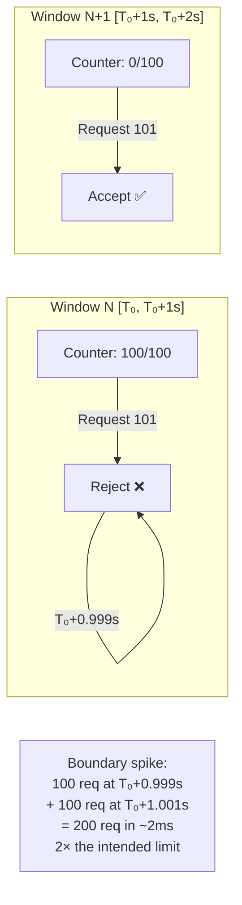
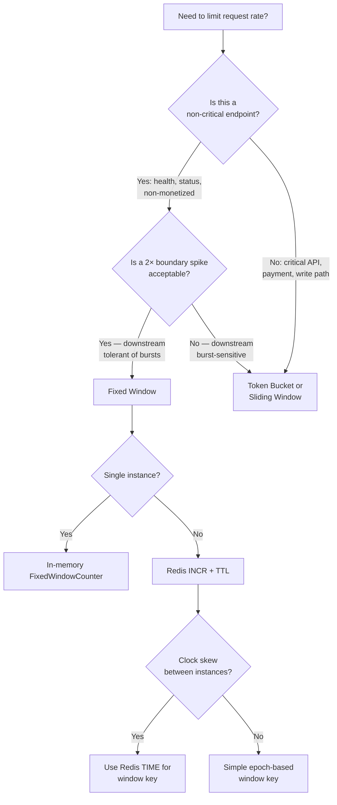

## Navigation

**Domain:** [[7 — System Design & Distributed Systems]] > **Group:** Scalability Patterns
**Previous:** [[7.242 — Rate Limiting — Leaky Bucket Algorithm]] | **Next:** [[7.244 — Rate Limiting — Sliding Window Log]]

### Prerequisites

- [[7.241 — Rate Limiting — Token Bucket Algorithm]] — token bucket eliminates the boundary spike problem that makes fixed window inaccurate
- [[7.242 — Rate Limiting — Leaky Bucket Algorithm]] — leaky bucket provides constant output; fixed window provides constant resets instead
- [[7.238 — Backpressure — Detection and Handling]] — fixed window is a simple backpressure mechanism but has blind spots at boundary resets

### Where This Fits

The fixed window counter is the simplest rate limiting algorithm: count requests in a discrete time window (e.g., 100 requests per calendar second), reset the counter to zero at the start of each window, and reject requests when the counter exceeds the limit. A .NET engineer encounters it as the `FixedWindowRateLimiter` in ASP.NET Core's `RateLimiterMiddleware`, when they need a quick rate limit on a non-critical endpoint, or when implementing a per-IP throttle in Azure App Service or Nginx. It becomes a reasonable choice below ~500 req/s per client when simplicity is valued over accuracy and the team is not yet ready for sliding window or token bucket. Without it, the team might over-engineer a token bucket for a health-check endpoint that genuinely does not need burst precision. The cost of using it is the boundary spike problem: a client can send `limit` requests at the end of window N and another `limit` at the start of window N+1, achieving 2× the intended rate in a sub-millisecond interval.

---

## Core Mental Model

A counter per time window. Increment on each request. If the counter exceeds the limit, reject until the window boundary. At the boundary, the counter resets to zero and the window starts fresh. The invariant is that no more than `limit` requests are allowed in any single calendar window, but the algorithm explicitly does not guarantee the rate across adjacent windows. The recognition trigger is a non-critical endpoint where a brief 2× spike is tolerable, and the team wants the simplest possible implementation — typically a health check, status endpoint, or non-monetized rate limit where the cost of a more accurate algorithm outweighs the benefit.



### Classification

**Algorithm family:** Rate limiting, window-based counting.
**Consistency/availability axis:** Simple pass/reject per window, no state carried across windows.
**When applied:** Non-critical endpoints, monitoring, per-IP throttles, free-tier limits where precision is not monetized.
**When not applied:** Any rate limit where 2× overshoot at boundary is unacceptable — payment APIs, write paths, any SLA-backed rate limit.

### Key Properties / Guarantees

|Property|Value|Condition|
|---|---|---|
|Memory|1 counter + 1 window-start timestamp|Per client per window|
|Boundary spike|Up to 2× limit|Inherent — at window reset boundary|
|Distributed cost|1 Redis call (INCR + EXPIRE)|Simplest of all algorithms|
|Accuracy|Low — window edge artifacts|Worst at low rates (small windows)|
|Implementation complexity|Trivial — 10 lines|In-memory or Redis|
|Fairness|None — one client can consume entire window|No per-client isolation without separate counters|

---

## Deep Mechanics

### How It Works

1. **Initialize.** Set a `_limit` (max requests per window) and `_window` duration (typically 1 second or 1 minute). Set `_counter = 0` and `_windowStart = DateTime.UtcNow`.

2. **On each request.** Check if the current time is still within the current window:
   - If `now - _windowStart >= _window`: the window has expired. Reset `_counter = 0` and set `_windowStart = now` (start a new window).
   - If still in the current window: check if `_counter < _limit`.

3. **Decision.** If `_counter < _limit`, increment `_counter` and allow the request. If `_counter >= _limit`, reject.

4. **Boundary spike scenario.** At `T₀ + 0.999s` during window N: counter is 99, 100th request arrives → allowed, counter becomes 100. At `T₀ + 1.000s`: a new request arrives, the window has expired, counter resets to 0, the request is the first in window N+1 → allowed. 101 requests in ~2ms, all through. Two clients can coordinate to achieve 200 requests in 2ms by each sending 100 at the boundary.

```csharp
// Fixed window counter — in-memory production implementation
public sealed class FixedWindowCounter
{
    private readonly int _limit;
    private readonly TimeSpan _window;
    private int _counter;
    private long _windowStartTicks;
    private readonly object _lock = new();

    public FixedWindowCounter(int limit, TimeSpan window)
    {
        ArgumentOutOfRangeException.ThrowIfNegativeOrZero(limit);
        ArgumentOutOfRangeException.ThrowIfNegativeOrZero(window.Ticks);

        _limit = limit;
        _window = window;
        _windowStartTicks = Stopwatch.GetTimestamp();
    }

    public bool TryConsume()
    {
        // Volatile read — the counter is modified atomically
        // but we need the latest window start
        var currentTicks = Stopwatch.GetTimestamp();

        lock (_lock)
        {
            var elapsed = (double)(currentTicks - _windowStartTicks)
                          / Stopwatch.Frequency;

            if (elapsed >= _window.TotalSeconds)
            {
                // Window expired — reset
                _counter = 0;
                _windowStartTicks = currentTicks;
            }

            if (_counter >= _limit)
                return false;

            _counter++;
            return true;
        }
    }

    public (int CurrentCount, int Limit, double SecondsUntilReset) GetStatus()
    {
        lock (_lock)
        {
            var elapsed = (double)(Stopwatch.GetTimestamp() - _windowStartTicks)
                          / Stopwatch.Frequency;
            var remaining = Math.Max(0, _window.TotalSeconds - elapsed);
            return (_counter, _limit, remaining);
        }
    }
}

// Distributed fixed window via Redis — production implementation
public sealed class RedisFixedWindowLimiter
{
    private readonly IDatabase _redis;
    private readonly int _limit;
    private readonly int _windowSeconds;
    private readonly ILogger<RedisFixedWindowLimiter> _logger;

    public RedisFixedWindowLimiter(
        IConnectionMultiplexer redis,
        IConfiguration config,
        ILogger<RedisFixedWindowLimiter> logger)
    {
        _redis = redis.GetDatabase();
        _limit = config.GetValue<int>("RateLimiting:DefaultLimit", 100);
        _windowSeconds = config.GetValue<int>("RateLimiting:WindowSeconds", 1);
        _logger = logger;
    }

    public async Task<(bool Allowed, int CurrentCount, int Limit)>
        TryConsumeAsync(string clientId)
    {
        // Use Redis TIME for authoritative timestamp — avoids clock skew
        var now = await _redis.TimeAsync();
        var windowKey = GetWindowKey(clientId, now);

        // INCR is atomic — safe under concurrent requests
        var count = await _redis.StringIncrementAsync(windowKey);

        // Set expiry on first increment in this window
        if (count == 1)
        {
            await _redis.KeyExpireAsync(
                windowKey, TimeSpan.FromSeconds(_windowSeconds * 2));
            // 2× window as safety margin for clock drift
        }

        if (count > _limit)
        {
            _logger.LogDebug(
                "Rate limit exceeded for {ClientId}. " +
                "Count: {Count}/{Limit}",
                clientId, count, _limit);
            return (false, (int)count, _limit);
        }

        return (true, (int)count, _limit);
    }

    private static string GetWindowKey(
        string clientId, DateTime now)
    {
        // Window key includes the time bucket:
        // e.g., "ratelimit:client123:2026-06-17T14:30:00"
        var bucket = new DateTime(
            now.Year, now.Month, now.Day,
            now.Hour, now.Minute, now.Second,
            DateTimeKind.Utc);
        return $"ratelimit:{clientId}:{bucket:O}";
    }
}
```

### Failure Modes

**Boundary spike attack — algorithm's inherent flaw.** A client can send `limit` requests at the very end of window N and another `limit` at the very start of window N+1, achieving 2× the intended limit in a sub-millisecond window. This is not a bug — it is a property of the algorithm. Detection: monitoring shows brief rate bursts that spike to 2× the limit at :00 second marks. Mitigation: if 2× burst is unacceptable, use sliding window log or token bucket. There is no fix within the fixed window algorithm.

**Clock skew across distributed instances (Redis variant).** The window key is derived from the current timestamp. If Instance A's clock reads T₀ and Instance B's clock reads T₀+2s, they write to different window keys. A client hitting both instances effectively gets 2× the limit during the skewed period. Detection: rate limit violations across instances correlate with clock skew events. Fix: use Redis `TIME` command as the authoritative time source (as shown above). Or use the sliding window counter variant which is less sensitive to precise window alignment.

```csharp
// ❌ Clock-dependent window key — each instance may use a different time
var key = $"ratelimit:{clientId}:{DateTime.UtcNow:yyyyMMddHHmm}";
// Instance A (clock: T₀):     ratelimit:alice:202606171430
// Instance B (clock: T₀+120s): ratelimit:alice:202606171432
// Alice sends 200 requests distributed across both → both windows accept 100

// ✅ Use Redis TIME as authoritative source
var redisTime = await redis.TimeAsync();
var key = $"ratelimit:{clientId}:{redisTime:yyyyMMddHHmm}";
```

**TTL race condition (Redis variant).** If the Redis key expires between the `INCR` and `EXPIRE` calls, the key is gone, the next `INCR` starts a new counter at 1, and the limit is effectively reset mid-window. This is a small window but exploitable. Detection: rate limit violations spike without a clear pattern. Fix: use a Lua script that combines INCR + EXPIRE atomically, or use `StringIncrementAsync` and check the returned value: if it's 1, set expiry.

```csharp
// ✅ Safe: set expiry on first increment (return value == 1)
var count = await _redis.StringIncrementAsync(key);
if (count == 1)
{
    await _redis.KeyExpireAsync(key, TimeSpan.FromSeconds(windowSeconds));
}
// If count > limit, reject. If the key expires between INCR and EXPIRE,
// the next request starts at count=1 — a single request always passes.
// This is a 1-request hole, not a burst hole.
```

**Per-instance counters without coordination.** Each service instance has its own fixed window counter. A client sending 100 req/s to instance 1 and 100 req/s to instance 2 achieves 200 req/s — 2× the intended limit. Detection: aggregate rate limit is `per_instance_limit × instance_count`. Fix: use a distributed counter (Redis) or sticky routing.

**Window reset causes a complete blind spot.** At exactly the window boundary, the counter resets to zero. If a client sends N requests in the same millisecond as the reset, all N pass before the counter reaches the limit. This is the boundary spike in its most extreme form — a coordinated client can send `limit + 1` requests exactly at the reset and get `limit` through in the first microsecond of the new window. Detection: the first request of each window is never rejected. Fix: use sliding window or token bucket, which do not have discrete reset points.

### .NET and Azure Integration

- **ASP.NET Core `System.Threading.RateLimiting`:** Built-in `FixedWindowRateLimiter` class. Configured with `FixedWindowRateLimiterOptions`:

```csharp
// ASP.NET Core built-in fixed window rate limiter
builder.Services.AddRateLimiter(options =>
{
    options.AddFixedWindowLimiter("StatusEndpoint", config =>
    {
        config.PermitLimit = 1000;
        config.Window = TimeSpan.FromMinutes(1);
        config.QueueProcessingOrder = QueueProcessingOrder.OldestFirst;
        config.QueueLimit = 0;  // No queuing — fail fast
    });
});

app.UseRateLimiter();

[EnableRateLimiting("StatusEndpoint")]
[ApiController]
public class HealthController : ControllerBase
{
    [HttpGet("health")]
    public IActionResult GetHealth() => Ok(new { status = "healthy" });
}
```

- **Azure API Management:** `rate-limit` policy uses a fixed window counter per subscription or per key:

```xml
<policies>
    <inbound>
        <rate-limit calls="1000" renewal-period="60" />
        <rate-limit-by-key calls="100" renewal-period="60"
            counter-key="@(context.Request.IpAddress)" />
    </inbound>
</policies>
```

- **Azure Redis Cache:** The `RedisFixedWindowLimiter` pattern above is the most common distributed implementation. Use `StackExchange.Redis` with `IDatabase.StringIncrementAsync`.

- **Nginx `limit_req_zone` with `limit_req`:** When configured without `burst`, Nginx implements a form of fixed window. With `burst=0 nodelay`, it behaves like a fixed window counter:

```nginx
# Nginx fixed-window-equivalent rate limiting
limit_req_zone $binary_remote_addr zone=api:10m rate=100r/s;

server {
    location /api/ {
        limit_req zone=api burst=0 nodelay;  # Fixed window behavior
        proxy_pass http://backend;
    }
}
```

- **Polly v8:** `SlidingWindowRateLimiter` with `SegmentsPerWindow = 1` behaves as a fixed window counter:

```csharp
builder.Services.AddResiliencePipeline("FixedWindowPipeline", builder =>
{
    builder.AddRateLimiter(new SlidingWindowRateLimiter(
        new SlidingWindowRateLimiterOptions
        {
            PermitLimit = 100,
            SegmentsPerWindow = 1,  // Single segment = fixed window
            Window = TimeSpan.FromSeconds(1)
        }));
});
```

- **Azure App Service IP Throttling (dynamic IP security):** Built-in per-IP rate limiting at the web server layer — essentially a fixed window counter per IP address. Configured in `web.config` or via Azure Portal.

---

## Production Patterns and Implementation

### Primary Implementation

A multi-tier fixed window rate limiter for a public API with per-endpoint and per-client rate limits, using Redis for cross-instance coordination.

```csharp
// Multi-tier fixed window rate limiter
public sealed class MultiTierRateLimiter
{
    private readonly IDatabase _redis;
    private readonly ILogger<MultiTierRateLimiter> _logger;

    // Tier configurations per endpoint
    private static readonly Dictionary<string, RateLimitTier> Tiers = new()
    {
        ["health"] = new(Limit: 1000, WindowSeconds: 60),     // 1K/min
        ["status"] = new(Limit: 100,  WindowSeconds: 60),     // 100/min
        ["orders"] = new(Limit: 50,   WindowSeconds: 60),     // 50/min
        ["admin"]  = new(Limit: 10,   WindowSeconds: 60),     // 10/min
    };

    public MultiTierRateLimiter(
        IConnectionMultiplexer redis,
        ILogger<MultiTierRateLimiter> logger)
    {
        _redis = redis.GetDatabase();
        _logger = logger;
    }

    public async Task<RateLimitResult> TryConsumeAsync(
        string clientId, string endpoint)
    {
        var tier = Tiers.GetValueOrDefault(
            endpoint, Tiers["status"]);

        var now = await _redis.TimeAsync();
        var windowKey = BuildKey(clientId, endpoint, tier, now);

        var count = await _redis.StringIncrementAsync(windowKey);

        if (count == 1)
        {
            await _redis.KeyExpireAsync(
                windowKey, TimeSpan.FromSeconds(tier.WindowSeconds * 2));
        }

        var allowed = count <= tier.Limit;
        var remaining = Math.Max(0, tier.Limit - (int)count);

        if (!allowed)
        {
            _logger.LogWarning(
                "Rate limit exceeded. Client: {ClientId}, " +
                "Endpoint: {Endpoint}, Count: {Count}/{Limit}",
                clientId, endpoint, count, tier.Limit);
        }

        return new RateLimitResult(
            allowed, remaining, tier.Limit, tier.WindowSeconds);
    }

    private static string BuildKey(
        string clientId, string endpoint,
        RateLimitTier tier, DateTime now)
    {
        var bucket = new DateTime(
            now.Year, now.Month, now.Day,
            now.Hour, now.Minute, now.Second,
            DateTimeKind.Utc);
        return $"rl:{clientId}:{endpoint}:{bucket:HHmmss}";
    }
}

public sealed record RateLimitTier(int Limit, int WindowSeconds);

public sealed record RateLimitResult(
    bool Allowed,
    int Remaining,
    int Limit,
    int WindowSeconds);

// Middleware that applies per-endpoint rate limits
public sealed class RateLimitingMiddleware
{
    private readonly RequestDelegate _next;
    private readonly MultiTierRateLimiter _limiter;
    private readonly ILogger<RateLimitingMiddleware> _logger;

    public RateLimitingMiddleware(
        RequestDelegate next,
        MultiTierRateLimiter limiter,
        ILogger<RateLimitingMiddleware> logger)
    {
        _next = next;
        _limiter = limiter;
        _logger = logger;
    }

    public async Task InvokeAsync(HttpContext context)
    {
        var clientId = context.Request.Headers["X-Api-Key"]
            .FirstOrDefault() ?? context.Connection.RemoteIpAddress?.ToString() ?? "unknown";
        var endpoint = context.Request.Path.Value?.Trim('/').Split('/').FirstOrDefault() ?? "status";

        var result = await _limiter.TryConsumeAsync(clientId, endpoint);

        // Rate limit headers — always set
        context.Response.Headers["X-RateLimit-Limit"] = result.Limit.ToString();
        context.Response.Headers["X-RateLimit-Remaining"] = result.Remaining.ToString();
        context.Response.Headers["X-RateLimit-Window"] = result.WindowSeconds.ToString();

        if (!result.Allowed)
        {
            context.Response.StatusCode = StatusCodes.Status429TooManyRequests;
            context.Response.Headers["Retry-After"] = result.WindowSeconds.ToString();

            await context.Response.WriteAsJsonAsync(
                new ProblemDetails
                {
                    Status = 429,
                    Title = "Too Many Requests",
                    Detail = $"Rate limit exceeded. " +
                        $"Limit: {result.Limit} per {result.WindowSeconds}s. " +
                        $"Resets in ~{result.WindowSeconds}s.",
                });

            return;
        }

        await _next(context);
    }
}
```

### Configuration and Wiring

```csharp
// Program.cs
builder.Services.AddSingleton<IConnectionMultiplexer>(
    _ => ConnectionMultiplexer.Connect(
        builder.Configuration.GetConnectionString("Redis")!));
builder.Services.AddSingleton<MultiTierRateLimiter>();
builder.Services.AddSingleton<RateLimitingMiddleware>();

var app = builder.Build();
app.UseMiddleware<RateLimitingMiddleware>();
app.MapControllers();
app.Run();
```

### Common Variants

**ASP.NET Core built-in fixed window limiter (single instance):**

```csharp
builder.Services.AddRateLimiter(options =>
{
    options.AddFixedWindowLimiter("Default", opt =>
    {
        opt.PermitLimit = 100;
        opt.Window = TimeSpan.FromSeconds(1);
        opt.AutoReplenishment = true;
        opt.QueueLimit = 0;
    });
});

app.UseRateLimiter();

[EnableRateLimiting("Default")]
public class ApiController : ControllerBase { }
```

**Per-IP throttle with connection middleware — no Redis dependency:**

```csharp
// In-memory per-IP fixed window limiter
public sealed class IpThrottleMiddleware
{
    private readonly RequestDelegate _next;
    private readonly ConcurrentDictionary<string, FixedWindowCounter> _counters;

    public IpThrottleMiddleware(RequestDelegate next)
    {
        _next = next;
        _counters = new ConcurrentDictionary<string, FixedWindowCounter>();
    }

    public async Task InvokeAsync(HttpContext context)
    {
        var ip = context.Connection.RemoteIpAddress?.ToString() ?? "unknown";
        var counter = _counters.GetOrAdd(ip, _ => new FixedWindowCounter(100, TimeSpan.FromSeconds(1)));

        if (!counter.TryConsume())
        {
            context.Response.StatusCode = 429;
            return;
        }

        await _next(context);
    }
}
```

**Redis fixed window with Lua script (atomic INCR + EXPIRE):**

```csharp
private const string LuaScript = @"
    local key = KEYS[1]
    local limit = tonumber(ARGV[1])
    local expiry = tonumber(ARGV[2])

    local count = redis.call('INCR', key)
    if count == 1 then
        redis.call('EXPIRE', key, expiry)
    end

    if count > limit then
        return {0, count}
    end

    return {1, count}
";

public async Task<(bool Allowed, long Count)> TryConsumeAsync(
    string clientId, DateTime now)
{
    var key = $"rl:{clientId}:{now:HHmmss}";
    var result = (int[])await _redis.ScriptEvaluateAsync(
        LuaScript,
        new RedisKey[] { key },
        new RedisValue[] { _limit, _windowSeconds });

    return (result[0] == 1, result[1]);
}
```

### Real-World .NET Ecosystem Example

The ASP.NET Core `FixedWindowRateLimiter` in `Microsoft.AspNetCore.RateLimiting` is the most common production implementation. It is used internally by Azure App Service's IP security throttling and by Azure API Management's `rate-limit` policy. GitHub's API uses a fixed window per token (5,000 requests per hour) with the boundary spike considered acceptable because the hourly window makes a 2× spike at the boundary irrelevant — 10,000 requests in a minute is still within the daily abuse threshold. Stack Exchange uses fixed window per-IP throttling for their non-critical endpoints.

---

## Gotchas and Production Pitfalls

### Boundary Spike at Window Reset

**Pitfall:** Assuming the rate limit is "100 req/s" means "no more than 100 requests in any 1-second interval." Fixed window allows 200 requests in <10ms at the window boundary.

```csharp
// ❌ Fixed window counter — allows boundary spike
if (now - _windowStart >= _window)
{
    _counter = 0;  // Reset — next 100 requests all pass
}
// Then at T₀+1.999s: counter resets again
// At T₀+1.999s and T₀+2.001s: 200 requests pass
```

**Symptom:** Downstream sees 2× the expected rate at each window boundary. Monitoring shows a sawtooth pattern: traffic drops at window start, then steadily climbs to the limit, with spikes at every boundary.

**Fix:** Use sliding window log, sliding window counter, or token bucket when the 2× spike matters. For fixed window itself, there is no structural fix — it is the algorithm's defining tradeoff.

**Cost of not fixing:** A misconfigured client can send 200 req/s to a 100 req/s limit by synchronizing with the window boundary. The downstream sees double the intended load every 1–2 seconds, causing intermittent degradation.

### Clock Skew Makes Distributed Fixed Window Non-Deterministic

**Pitfall:** Each instance derives the window key from its own system clock. If instances have clocks that differ by even 100ms, a client hitting multiple instances can exceed the intended rate.

**Symptom:** The rate limit works in single-instance testing but allows bursts in multi-instance production. Debugging is difficult because the rate depends on which instance handles each request.

**Fix:** Use Redis `TIME` command as the single source of truth for window boundaries, or use a deterministic window key based on Unix epoch time divided by window size:

```csharp
// ✅ Deterministic window key — same on all instances regardless of clock
var epochSeconds = DateTimeOffset.UtcNow.ToUnixTimeSeconds();
var windowNumber = epochSeconds / _windowSeconds;
var key = $"rl:{clientId}:{windowNumber}";

// Even better: use Redis TIME
var redisTime = await _redis.TimeAsync();
var redisEpoch = ((DateTimeOffset)redisTime).ToUnixTimeSeconds();
var redisWindow = redisEpoch / _windowSeconds;
var key = $"rl:{clientId}:{redisWindow}";
```

**Cost of not fixing:** Non-deterministic rate limiting. Some clients are over-limited (frustrated), some under-limited (abuse possible). Team trusts the rate limiter but it is unreliable.

### TTL Race Condition in Distributed Variant

**Pitfall:** `INCR` succeeds but `EXPIRE` fails or the key expires between the two calls. The counter resets early, allowing extra requests.

```csharp
// ❌ Race condition: INCR succeeds, then key expires before EXPIRE
var count = redis.StringIncrement(key);
redis.KeyExpire(key, TimeSpan.FromSeconds(60));  // May fail
```

**Symptom:** Intermittent bursts that cannot be explained by traffic patterns. Each burst allows only 1 extra request (the first after the key expires) but at scale this means thousands of extra requests.

**Fix:** Use a Lua script that atomically INCR and checks the return value: on first increment (return == 1), set expiry in the same script.

**Cost of not fixing:** The rate limiter leaks — gradually allows more traffic than intended. Over hours, the leak compounds.

### Window Duration Too Short for Meaningful Limits

**Pitfall:** Using a 1-second window for a low rate limit (e.g., 5 req/s). At 5 req/s, the boundary spike is 10 req in ~2ms — a 100% spike. The downstream sees 10 requests where it expected 5.

**Symptom:** The downstream (database, third-party API) experiences brief overload spikes at every window boundary. The rate limiter triggers alerts but the root cause is the algorithm, not the limit.

**Fix:** Use longer windows (1 minute instead of 1 second) to make boundary spikes proportionally smaller — 500 req/min with a 1-min window gives a boundary spike of 1,000 in 2ms, but that is 1,000/min vs 500/min (same 2× ratio). The perception changes — the downstream cares about sustained rate, not sub-millisecond bursts. Or switch to token bucket/leaky bucket.

**Cost of not fixing:** The downstream fails intermittently at each boundary. The fix is not obvious because monitoring shows the average rate is within limits. Only sub-second metrics reveal the spike.

### No Per-Client Fairness Within a Window

**Pitfall:** A single counter per window shared by all clients. One aggressive client can consume the entire window's budget, starving all other clients for the rest of the window.

```csharp
// ❌ Shared counter — one client can consume all 1000 permits
if (Interlocked.Increment(ref _sharedCounter) > 1000)
    return false;
```

**Symptom:** At the start of each window, the first client to arrive takes all available permits. Other clients are rejected for the entire window. The system is unfair by design.

**Fix:** Use per-client counters (one `FixedWindowCounter` per API key or per IP), or use `ConcurrentDictionary<string, FixedWindowCounter>`:

```csharp
// ✅ Per-client counters — each client gets its own window budget
var counter = _perClientCounters.GetOrAdd(
    clientId, _ => new FixedWindowCounter(100, TimeSpan.FromSeconds(1)));

if (!counter.TryConsume())
    return false;
```

**Cost of not fixing:** Unfair resource distribution. Free clients starve under a single shared counter. Premium clients get no better service than free clients.

---

## Tradeoffs and Decision Framework

### Tradeoff Matrix

| Dimension | Fixed Window | Token Bucket | Sliding Window Log | Sliding Window Counter |
|---|---|---|---|---|
| Boundary spike | Yes — 2× limit | None | None | Near-none (approximation) |
| Memory per client | 1 counter + 1 timestamp | 2 integers | O(window × rate) timestamps | 2 integers + segments |
| Distributed cost | 1 Redis call (INCR + TTL) | 1 Redis Lua call | O(rate) Redis sorted set ops | 2–3 Redis calls |
| Implementation complexity | Trivial | Low | Medium | Medium |
| Accuracy | Low | High | Highest | High (configurable) |
| Use case | Non-critical, simple | General purpose | Precise low-rate limits | Best balance for most |

### When to Apply



### When NOT to Apply

- [ ] **Rate limit is monetized (tiered plans).** Boundary spikes mean a Pro-tier client paying for 1,000 req/s can get 2,000 req/s at each boundary. This is a revenue leak. Use token bucket or sliding window counter.
- [ ] **Downstream has hard capacity limits.** If exceeding the rate by even 1 request causes failure (database 200 IOPS cap, GPU 24 FPS), the boundary spike guarantees a 2× burst. Use leaky bucket.
- [ ] **Rate limit is averaged over long windows (per hour/per day).** Fixed window works fine here (boundary spike at hourly boundaries is irrelevant), but a simple Redis INCR with 3600s TTL is even simpler — no window management needed.
- [ ] **Rate limit is global across instances** and clock synchronization is poor. Each instance derives the window key from its clock, causing non-deterministic behavior. Use a deterministic window key or switch to token bucket.
- [ ] **Fairness across clients matters.** A single shared fixed window counter can be exhausted by one client, starving others. Use per-client counters or token bucket with per-client isolation.

### Scale Thresholds

- Worth considering for endpoints below ~500 req/s where simplicity is valued over accuracy
- Above ~5,000 req/s per client, the boundary spike becomes proportionally larger and sliding window or token bucket should be used
- Redis fixed window: up to ~100,000 INCR operations/second per Redis instance (each request is one INCR call)
- In-memory fixed window: up to ~1,000,000 req/s per instance (limited by Interlocked.Increment throughput)
- Window duration heuristic: use window ≥ 1 second to avoid excessive resets. Use window = 60 seconds for per-minute limits, 3600 for per-hour limits.

---

## Interview Arsenal

### Question Bank

1. How does the fixed window counter algorithm work?
2. What is the boundary spike problem and why does it occur?
3. How do you implement a distributed fixed window counter?
4. Compare fixed window with token bucket. When would you choose each?
5. What happens in a distributed fixed window when 10 instances share the same client traffic?
6. Design a rate limiter for a free-tier API that returns 429 after 100 requests per minute.
7. How do you handle clock skew in a distributed fixed window counter?
8. What is the TTL race condition in Redis-based fixed window and how do you prevent it?

### Spoken Answers

**Q: How does the fixed window counter algorithm work?**

> **Average answer:** You count requests in a time window, like 100 requests per second. When the counter hits the limit, you reject. At the start of the next second, the counter resets.

> **Great answer:** Fixed window counter divides time into discrete, non-overlapping windows — for example, calendar seconds starting at each integer second boundary. Each window has a counter initialized to zero. On every request, the counter is incremented. If the counter is below the limit, the request passes. If it equals or exceeds the limit, the request is rejected with 429. At the window boundary — when the current time moves to a new second — the counter resets to zero and the new window begins. The critical flaw is the boundary spike: a client can send 100 requests at 999ms of window N and 100 requests at 1ms of window N+1, getting 200 requests through in about 2 milliseconds — twice the intended rate. This is not a bug; it is a structural property of discrete windows. In .NET, `FixedWindowRateLimiter` in `Microsoft.AspNetCore.RateLimiting` implements this, and you configure it with `PermitLimit` and `Window`. For distributed scenarios, Redis `INCR` with a window-based key (like `rate_limit:{clientId}:{epochSecond}`) with a TTL gives you a cross-instance fixed window in one atomic call.

**Q: Compare fixed window with token bucket.**

> **Great answer:** Both enforce a rate limit, but they differ in how they handle time continuity. Fixed window divides time into discrete buckets and resets at boundaries. Token bucket refills tokens continuously, so there are no boundaries and no boundary spikes. Concretely: with a fixed window of 100 req/s, a burst of 100 requests at 999ms followed by 100 at 1ms gives 200 through in 2ms. With token bucket at 100 tokens/s and capacity 100, the same burst gives only 100 through — the bucket was full at 999ms and has had only ~1ms to refill (~0.1 tokens), so only 100 pass. Token bucket is always at least as accurate as fixed window and never worse. The only reason to choose fixed window is simplicity: it is 10 lines of code, while token bucket needs a refill calculation, capacity capping, and monotonic timestamps. If you are building a quick health-check throttle with Redis, `INCR` + `EXPIRE` is the simplest code you can write. But if the rate limit matters — if it is monetized, if the downstream is sensitive — use token bucket or sliding window.

### System Design Interview Trigger

If an interviewer asks you to "design a rate limiter" and you start with fixed window, they will immediately probe the boundary spike problem. The test is whether you know the flaw and whether you can explain when fixed window is still acceptable. The candidate who says "fixed window is simple but has a boundary spike of up to 2× the limit — I'd use it for non-critical endpoints like /health but switch to token bucket for any rate limit with a hard requirement" demonstrates both knowledge of the algorithm and awareness of its practical limitations.

### Comparison Table

| | Fixed Window | Token Bucket |
|---|---|---|
| Core guarantee | No more than limit per calendar window | Long-term average = refill rate |
| Trade-off | Boundary spike (2× at reset) | More complex (refill math, monotonic clock) |
| .NET implementation | `FixedWindowRateLimiter` built-in | `TokenBucketRateLimiter` built-in |
| Distributed variant | Redis INCR + TTL (simplest) | Redis Lua script |
| Failure mode | Boundary spike attack, clock skew | Clock skew, overflow on refill |
| When to choose | Non-critical endpoints, simplicity priority | General purpose, burst tolerance needed |

---

## Architecture Decision Record

**Status:** Accepted

**Context:** The public status page (`GET /status` and `GET /health`) serves 500,000 DAU and is polled by monitoring systems every 5 seconds. The API gateway needs a per-IP rate limit of 1,000 requests per minute to prevent a single IP from overwhelming the status endpoint. The endpoint returns cached data (5-second stale from Redis), so the downstream cost of a boundary spike is minimal — a 2× spike means 2,000 requests in a second instead of 1,000, all served from Redis cache. The status page has no SLA, no monetization, and no hard capacity constraints. The system runs on 10 Azure App Service instances with no clock synchronization guarantee.

**Options Considered:**

1. **Fixed window via Redis INCR + TTL** — Simplest code path. Uses Redis TIME for window key to avoid clock skew. 1 Redis call per request.
2. **Token bucket via Redis Lua** — More accurate (no boundary spike), but requires Lua script deployment and two hash fields per bucket.
3. **Sliding window log via Redis sorted sets** — Most accurate, but uses O(number of requests per window) memory and O(log n) operations per request. Overkill for a cached status endpoint.
4. **Per-instance in-memory counter** — Zero network calls, but 10 instances × 1,000/min = 10,000/min aggregate. Unacceptable — a single IP hitting all instances gets 10× the limit.

**Decision:** Fixed window via Redis INCR + TTL (option 1), because:
- The status page is non-critical and non-monetized — a 2× boundary spike is acceptable
- Redis INCR is the simplest, most tested code path in StackExchange.Redis
- Using Redis `TIME` for window derivation eliminates clock skew
- The per-IP limit of 1,000/min means the boundary spike is at most 2,000 requests in ~2ms — all served from Redis cache, which handles 100,000+ ops/s

**Consequences:**
- ✅ 1 Redis call per request (INCR) — minimal latency overhead (~1ms)
- ✅ No Lua script deployment — just `StringIncrementAsync` + `KeyExpireAsync`
- ✅ Deterministic window across all 10 instances (Redis TIME as authority)
- ⚠️ 2× boundary spike at minute boundaries — acceptable for cached status data
- ⚠️ Rate limit is per-minute, not per-second — a client can send 1,000 requests in 1 second then wait 59 seconds
- ❌ Not suitable for monetized rate limits or downstream-sensitive APIs

**Review Trigger:** Revisit if the status endpoint becomes monetized (e.g., premium users get higher limits) — at that point, boundary spikes cause revenue leak and token bucket becomes necessary. Revisit if downstream changes from Redis cache to a database with hard capacity limits.

---

## Self-Check

### Conceptual Questions

1. How does the fixed window counter enforce a rate limit?
2. What causes the boundary spike and by what factor can the rate be exceeded?
3. What is the simplest distributed fixed window implementation?
4. What happens to the fixed window guarantee when 10 instances each run their own counter?
5. How do you prevent clock skew from affecting a distributed fixed window?
6. What is the TTL race condition in Redis fixed window and how do you mitigate it?
7. Compare fixed window with sliding window log on memory usage.
8. What headers should a fixed window rate-limited API return?
9. When would you choose fixed window over token bucket despite the boundary spike?
10. How does the ASP.NET Core `FixedWindowRateLimiter` differ from `TokenBucketRateLimiter`?

<details>
<summary>Answers</summary>

1. A counter per discrete time window (e.g., each calendar second). On each request, check if the counter < limit. If yes, increment and allow. If no, reject. At the window boundary (when current time moves to a new window), reset the counter to 0.
2. The boundary spike occurs because the counter resets at the window boundary. A client sends `limit` requests just before the reset (end of window N) and `limit` requests just after (start of window N+1). The rate exceeds the intended limit by up to 2× — 200 requests where 100 were intended — all in a sub-millisecond interval.
3. Redis `INCR` with a window-based key: `INCR rate_limit:{clientId}:{epochSecond}`. Set TTL to window duration × 2 on the first increment (when INCR returns 1). Return `count <= limit`.
4. Each instance has its own counter. A client distributing requests across 10 instances gets `10 × limit` aggregate throughput. Fixed window per-instance without coordination provides no cross-instance guarantee.
5. Use Redis `TIME` command as the single authoritative clock for window key derivation. All instances read the same Redis time, producing identical window keys for the same instant.
6. The key expires between `INCR` and `EXPIRE`. Mitigated by checking the return value of `INCR`: if it's 1 (first increment), set the expiry. This ensures the key always has a TTL. Alternatively, use a Lua script that atomically INCR + EXPIRE.
7. Fixed window: 1 counter + 1 timestamp per client (2 values). Sliding window log: O(requests per window) timestamps — for 1,000 req/s, storing 1,000 timestamps per client in a Redis sorted set. Memory difference is ~16 bytes vs ~8,000 bytes per client at 1,000 req/s.
8. `X-RateLimit-Limit` (max per window), `X-RateLimit-Remaining` (remaining in current window), `X-RateLimit-Window` (window duration in seconds), `Retry-After` (seconds until window reset — required on 429).
9. Fixed window is appropriate when: (a) the endpoint is non-critical (health, status, monitoring), (b) the 2× boundary spike is acceptable to the downstream, (c) simplicity and minimal code are priorities, (d) the rate limit is not monetized. It is the "good enough" algorithm for low-stakes rate limits.
10. `FixedWindowRateLimiter` resets a counter at the window boundary — allows the boundary spike. `TokenBucketRateLimiter` refills tokens continuously — no boundaries, no spike. Fixed window is simpler (no refill math, no monotonic clock requirement) but less accurate.
</details>

---

### Scenario Challenges

**Scenario 1 — Diagnose the problem.** A API gateway enforces a rate limit of 100 req/s per API key using a fixed window counter. The downstream payment service reports intermittent "overload" errors every few minutes, even though monitoring shows the average rate is only 80 req/s. The payment service can handle 120 req/s. The errors occur at :00 and :01 seconds of each minute.

<details>
<summary>Diagnosis</summary>

**Root cause:** The fixed window boundary spike. At each second boundary, clients that have been rate-limited in the previous second burst through. If 20 API keys each hit their limit at :59s and again at :00s, the payment service sees 20 × 100 = 2,000 requests in ~10ms — 16× its 120 req/s capacity.

**Evidence:** Payment service errors correlate with the top-of-second mark. Traffic logs show a spike at each :00 second. The fixed window counter shows each key within its 100 req/s limit individually, but the aggregate boundary spike overwhelms the downstream.

**Fix:** Two options: (1) Switch to token bucket or sliding window — eliminates the boundary spike. (2) Add a global fixed window at the payment service level — limits aggregate to 120 req/s regardless of per-key limits.

**Prevention:** When designing rate limits for shared downstream resources, account for aggregate boundary spikes. A per-key fixed window does not protect a shared downstream — you need either a global rate limiter or a spike-free algorithm.
</details>

---

**Scenario 2 — Design decision.** A notification service sends email via a third-party API that allows 10,000 requests per minute. Exceeding by even 1 request causes a 1-minute ban. The service runs on 5 instances. What do you choose and why?

<details>
<summary>Decision and Reasoning</summary>

**Choice:** Do NOT use fixed window. The 2× boundary spike (20,000 requests in a sub-second interval) would cause an immediate ban. Use token bucket via Redis with `capacity = 10,000` and `refillRate = 10,000/60 ≈ 167 req/s`. Token bucket's continuous refill ensures the rate never exceeds 10,000 per minute even at boundaries.

**Tradeoffs accepted:** Redis Lua script complexity (1-2ms per request), Lua script deployment on Redis cluster, monotonic clock requirement.

**Implementation sketch:**
```csharp
// Redis token bucket protecting third-party email API
var result = await _redisTokenBucket.TryConsumeAsync(
    "email-api-quota");
if (!result.Allowed)
{
    _logger.LogWarning(
        "Email API quota exhausted. " +
        "Retry after {RetryAfter}s",
        result.RetryAfterSeconds);
    return StatusCode(429);
}
```

**Why not alternatives:** Fixed window causes ban every minute. Sliding window log is accurate but memory-intensive (10,000 timestamps per minute). Leaky bucket prevents bursts but the email API can handle normal bursts within the 10,000/min envelope.
</details>

---

**Scenario 3 — Failure mode.** At 3:00 PM, the rate limiter starts rejecting requests aggressively — clients that normally send 50 req/s are getting 429 responses. No deployment occurred. The rate limit is configured as 100 req/s per client via Redis fixed window.

<details>
<summary>Investigation and Fix</summary>

**Investigation steps:** (1) Check Redis CPU and memory — any slowdown? (2) Check clock on each instance — any NTP skew? (3) Check the window key generation code — is it using `DateTime.UtcNow` or `Redis TIME`?

**Confirming evidence:** Instance clocks drifted by 30 seconds due to an NTP sync failure. Five instances were using `DateTime.UtcNow` to generate window keys. Instance A (clock: 15:00:00) and Instance B (clock: 15:00:30) generated different window keys for the same real-time second. A client hitting both instances consumed 50 req/s on Instance A and 50 req/s on Instance B — 100 req/s total, but each instance saw only its own 50, well within the limit. However, when the NTP sync corrected Instance B's clock backward by 30 seconds, the client's requests suddenly fell into the SAME window on both instances, doubling the counted rate and triggering rejection.

**Immediate mitigation:** Restart the instances to reset in-memory state. Disable the rate limiter temporarily.

**Permanent fix:** Use Redis `TIME` command for window key derivation. Add monitoring for clock skew between instances.

**Post-mortem item:** All distributed rate limiters must use a single authoritative time source (Redis TIME) or deterministic window keys based on Unix epoch divided by window size.
</details>

---

**Scenario 4 — Scale it.** Current: 1 instance, 100 req/s fixed window, in-memory counter. Need: 5 instances, 500 req/s total with a single global rate of 500 req/s across all 5.

<details>
<summary>Scaling Strategy</summary>

**Bottleneck this addresses:** The in-memory counter is per-instance. Five instances give 5 × 100 = 500 req/s aggregate, not globally limited. If we need a GLOBAL limit of 500 req/s (not per-instance), the in-memory approach fails.

**How it helps:** Switch to Redis fixed window with INCR + TTL. The window key includes the client ID and the current epoch-second. All 5 instances write to the same Redis key. The Redis `INCR` operation is atomic — regardless of which instance processes the request, the counter increments atomically. The global limit is enforced.

**What it does not solve:** Redis becomes a dependency — adds ~1ms per request. If Redis is down, rate limiting is unavailable. Mitigate with a local fallback (per-instance limiter with reduced capacity during Redis outage).

**Implementation order:** (1) Add Redis to the stack (Azure Redis Cache Standard tier). (2) Replace `ConcurrentDictionary<string, FixedWindowCounter>` with `RedisFixedWindowLimiter`. (3) Add fallback: if Redis call fails, use in-memory limiter at 50% capacity. (4) Add Redis latency monitoring.
</details>

---

**Scenario 5 — Interview simulation.** The interviewer says: "Design a rate limiter for the free tier of a public API. Free users get 100 requests per hour. Paid users get 10,000 requests per hour. The system runs on 20 instances."

<details>
<summary>Model Response</summary>

"For this specific requirement, fixed window counter via Redis is the right starting point. The key insight is that the window is 1 hour — a 2× boundary spike at the hour boundary means 200 requests allowed in a 1-minute interval instead of 100 over the hour. That's a 200/hour rate, which is still far below any abuse threshold and also below what the 10,000/hour paid tier allows. The boundary spike is irrelevant at hour granularity.

Implementation: Redis INCR with key `rate_limit:{userId}:{hourBucket}` where the bucket is the Unix epoch hour — `timestamp / 3600`. Set TTL to 7200 seconds (2 hours) on first increment. Check if `INCR` return value exceeds the tier limit. For the free tier, limit is 100; for paid, 10,000.

The per-request cost is one Redis round trip — about 1ms. With 20 instances and 10,000 paid users, that's about 55 Redis INCR calls per second at peak — well within a Standard tier Azure Redis instance's 100,000 ops/s capacity.

If the interviewer asks about the boundary spike, I'd acknowledge it: at the hour boundary, a free user can send up to 200 requests in a minute — 200/hour instead of 100/hour. For a free tier, this is acceptable. If the product requirement were stricter, I'd switch to token bucket with a refill rate of 100 tokens per hour. But the extra complexity isn't justified here.

The one thing I'd add is per-user key expiry cleanup: set TTL on the key so Redis doesn't accumulate keys for users who stop using the API. And rate limit headers: `X-RateLimit-Limit: 100`, `X-RateLimit-Remaining: <remaining>`, `X-RateLimit-Reset: <epoch seconds of next hour boundary>`."
</details>
