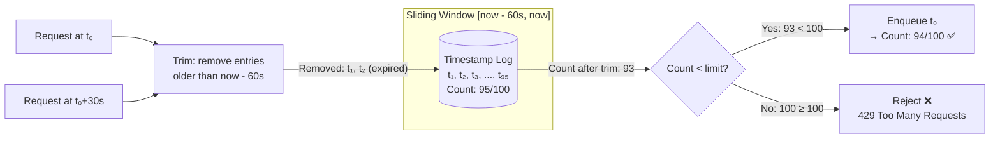

## Navigation

**Domain:** [[7 — System Design & Distributed Systems]] > **Group:** Scalability Patterns
**Previous:** [[7.243 — Rate Limiting — Fixed Window Counter]] | **Next:** [[7.245 — Rate Limiting — Sliding Window Counter]]

### Prerequisites

- [[7.243 — Rate Limiting — Fixed Window Counter]] — sliding window log fixes the boundary spike problem inherent to fixed window
- [[7.241 — Rate Limiting — Token Bucket Algorithm]] — token bucket is the O(1)-memory alternative for high-rate scenarios where sliding window log is too expensive
- [[7.245 — Rate Limiting — Sliding Window Counter]] — the sliding window counter approximates the log's accuracy at O(1) memory per client

### Where This Fits

The sliding window log is the most accurate rate limiting algorithm: it maintains a timestamp for every request and trims entries outside a sliding window, guaranteeing that no more than `limit` requests occur in any rolling window of duration `W`. A .NET engineer reaches for this when boundary spikes are unacceptable and the rate is low enough that storing every timestamp is feasible — login attempt limiting (5 attempts per minute), password reset throttling (1 per hour), or any security-sensitive endpoint where precision prevents bypass. It becomes necessary when fixed window's 2× boundary spike creates a security hole (a brute-force attack synchronized with window resets) and token bucket's burst behavior is also unacceptable (attackers accumulating tokens during idle periods). Without it, security rate limits have blind spots at window boundaries that attackers can exploit. The cost is O(N) memory per client where N = rate × window — rendering it impractical above ~100 req/s per client.

---

## Core Mental Model

A sliding window log is an ordered list of timestamps — one entry per request — that shifts forward continuously. When a request arrives, entries older than `now - window` are trimmed (they fell out of the window). If the remaining count is below the limit, the new timestamp is appended and the request passes. If at the limit, the request is rejected. The invariant is that at any instant, the number of timestamps in the log never exceeds the limit, and every timestamp is within the last `window` duration. What this trades is memory: where fixed window stores 2 integers per client, sliding window log stores `rate × window` integers per client — 6,000 timestamps for 100 req/s over 60 seconds. The recognition trigger is a security-sensitive rate limit (login, MFA, password reset) where a boundary spike would allow an extra 5 login attempts, and the low rate makes memory irrelevant.



### Classification

**Algorithm family:** Rate limiting, sliding window, precision-counting.
**Consistency/availability axis:** Perfect accuracy (no boundary artifacts) at the cost of linear memory per client.
**When applied:** Low-rate, high-accuracy limits — security endpoints (login, MFA, password reset), token issuance, any rate limit where a single extra request is a security concern.
**When not applied:** High-rate APIs (>100 req/s per client), memory-constrained environments, or when token bucket's O(1) accuracy is sufficient.

### Key Properties / Guarantees

|Property|Value|Condition|
|---|---|---|
|Accuracy|Perfect — no boundary spikes|Always — every window of duration W has ≤ limit requests|
|Memory per client|O(rate × window)|Grows linearly with rate and window duration|
|Distributed cost|O(rate × window) Redis sorted set entries|Memory in Redis, not application|
|Implementation complexity|Medium (trim + count + add)|Atomic in Lua; racy without it|
|Burst behavior|No bursts allowed|Limit applies to any rolling window instant|
|Fairness|Strict FIFO per log|Oldest requests fall out first|

---

## Deep Mechanics

### How It Works

1. **Initialize.** Create a sorted collection (or queue) that will hold timestamps. Set `_limit` and `_window` duration.

2. **On each request.** Compute `cutoff = now - window`.

3. **Trim.** Remove all timestamps earlier than `cutoff`. In memory: dequeue from a `ConcurrentQueue<DateTime>` while the oldest entry is before cutoff. In Redis: `ZREMRANGEBYSCORE key 0 {cutoff}`.

4. **Count.** Check the number of remaining timestamps. If `count >= limit`, reject.

5. **Enqueue.** If under limit, add the current timestamp and allow. In Redis: `ZADD key {now} {now}` (score = member = timestamp). Set TTL on the key for cleanup.

6. **Shifting window.** Unlike fixed window which waits for a boundary, the sliding window log trims continuously — the effective window is always `[now - W, now]`. No request falls on a boundary because there are no boundaries.

```csharp
// Sliding window log — in-memory production implementation
public sealed class SlidingWindowLog
{
    private readonly int _limit;
    private readonly TimeSpan _window;
    private readonly ConcurrentQueue<long> _timestamps;
    private readonly object _trimLock = new();

    public SlidingWindowLog(int limit, TimeSpan window)
    {
        ArgumentOutOfRangeException.ThrowIfNegativeOrZero(limit);
        ArgumentOutOfRangeException.ThrowIfNegativeOrZero(window.Ticks);

        _limit = limit;
        _window = window;
        _timestamps = new ConcurrentQueue<long>();
    }

    public bool TryConsume()
    {
        var now = Stopwatch.GetTimestamp();
        var cutoffTicks = now - (long)(_window.TotalSeconds * Stopwatch.Frequency);

        // Trim expired entries (lock-free peek/dequeue — best effort)
        while (_timestamps.TryPeek(out var oldest) && oldest < cutoffTicks)
        {
            _timestamps.TryDequeue(out _);
        }

        // Check limit
        if (_timestamps.Count >= _limit)
            return false;

        // Add current timestamp
        _timestamps.Enqueue(now);
        return true;
    }

    public int GetCurrentCount()
    {
        var now = Stopwatch.GetTimestamp();
        var cutoffTicks = now - (long)(_window.TotalSeconds * Stopwatch.Frequency);

        // Trim expired before counting
        while (_timestamps.TryPeek(out var oldest) && oldest < cutoffTicks)
        {
            _timestamps.TryDequeue(out _);
        }

        return _timestamps.Count;
    }
}

// Distributed sliding window log via Redis sorted set — production implementation
public sealed class RedisSlidingWindowLog
{
    private readonly IDatabase _redis;
    private readonly int _limit;
    private readonly int _windowSeconds;
    private readonly ILogger<RedisSlidingWindowLog> _logger;

    // Lua script for atomic trim + count + add
    private const string TryConsumeScript = @"
        local key = KEYS[1]
        local now = tonumber(ARGV[1])
        local window = tonumber(ARGV[2])
        local limit = tonumber(ARGV[3])

        -- 1. Trim expired entries
        local cutoff = now - window
        redis.call('ZREMRANGEBYSCORE', key, 0, cutoff)

        -- 2. Count remaining
        local count = redis.call('ZCARD', key)

        -- 3. Check limit
        if count >= limit then
            return {0, count}
        end

        -- 4. Add current timestamp (score = member = timestamp)
        redis.call('ZADD', key, now, now)

        -- 5. Set TTL for cleanup (2× window as safety margin)
        redis.call('EXPIRE', key, window * 2)

        return {1, count + 1}
    ";

    // Lua script for read-only status (no modification)
    private const string GetStatusScript = @"
        local key = KEYS[1]
        local now = tonumber(ARGV[1])
        local window = tonumber(ARGV[2])
        local cutoff = now - window

        redis.call('ZREMRANGEBYSCORE', key, 0, cutoff)
        local count = redis.call('ZCARD', key)

        local oldest = redis.call('ZRANGE', key, 0, 0, 'WITHSCORES')
        local oldestScore = 0
        if #oldest > 0 then
            oldestScore = tonumber(oldest[2])
        end

        return {count, oldestScore}
    ";

    public RedisSlidingWindowLog(
        IConnectionMultiplexer redis,
        IConfiguration config,
        ILogger<RedisSlidingWindowLog> logger)
    {
        _redis = redis.GetDatabase();
        _limit = config.GetValue<int>("RateLimiting:Limit", 5);
        _windowSeconds = config.GetValue<int>("RateLimiting:WindowSeconds", 60);
        _logger = logger;
    }

    public async Task<(bool Allowed, int CurrentCount, double RetryAfterSeconds)>
        TryConsumeAsync(string clientId)
    {
        var now = await _redis.TimeAsync();
        var nowUnix = ((DateTimeOffset)now).ToUnixTimeSeconds();

        var result = (int[])await _redis.ScriptEvaluateAsync(
            TryConsumeScript,
            new RedisKey[] { $"rl:log:{clientId}" },
            new RedisValue[] { nowUnix, _windowSeconds, _limit });

        var allowed = result[0] == 1;
        var count = result[1];

        // Retry-After: time until the oldest entry in the window expires
        var retryAfter = 0.0;
        if (!allowed)
        {
            // Use status script to find the oldest timestamp
            var status = (int[])await _redis.ScriptEvaluateAsync(
                GetStatusScript,
                new RedisKey[] { $"rl:log:{clientId}" },
                new RedisValue[] { nowUnix, _windowSeconds });

            var oldestEntry = status[1];
            retryAfter = Math.Max(0, oldestEntry + _windowSeconds - nowUnix);
        }

        if (!allowed)
        {
            _logger.LogWarning(
                "Sliding window limit exceeded for {ClientId}. " +
                "Count: {Count}/{Limit}. Retry after {RetryAfter}s",
                clientId, count, _limit, retryAfter);
        }

        return (allowed, count, retryAfter);
    }
}
```

### Failure Modes

**Memory exhaustion at high rates.** At 10,000 req/s and a 60-second window, each client stores 600,000 timestamps. A single client at 10,000 req/s consumes ~19 MB in Redis (assuming ~32 bytes per sorted set entry). With 1,000 active clients, that is 19 GB — enough to crash a Redis instance. Detection: Redis memory usage grows linearly with traffic. `INFO MEMORY` shows `used_memory` climbing. The `maxmemory-policy` may evict the sorted set keys, resetting all rate limits. Mitigation: never use sliding window log above ~100 req/s per client. Use token bucket or sliding window counter instead.

**Redis sorted set overhead under high cardinality.** Redis sorted sets use a skip list internally. At 600,000 members, `ZADD` is O(log N) and `ZREMRANGEBYSCORE` is O(log N + M) where M is the number of removed entries. At scale, a single request can take 10–50ms just for the Redis operation. Detection: Redis slow log shows `ZADD` and `ZREMRANGEBYSCORE` entries > 10ms. Mitigation: limit per-client rate to keep per-client log size small (< 10,000 entries), or switch to the sliding window counter variant.

**Clock skew across instances (distributed variant).** Each instance derives `now` from its own clock. Different clocks mean different trim cutoffs and different "now" timestamps in the log. A client hitting instance A (clock skewed forward) may have its timestamps prematurely trimmed; hitting instance B (clock skewed backward) may find the log artificially full. Detection: rate limit behavior differs depending on which instance handles the request. Mitigation: always use Redis `TIME` command as the authoritative clock for distributed sliding window log (as shown above).

```csharp
// ❌ Clock-dependent sliding window — each instance uses local time
var now = DateTimeOffset.UtcNow.ToUnixTimeSeconds();  // May differ per instance

// ✅ Redis TIME as authoritative clock
var redisNow = await _redis.TimeAsync();  // Single source of truth
var nowUnix = ((DateTimeOffset)redisNow).ToUnixTimeSeconds();
```

**Concurrent trim-and-count race (in-memory variant).** Without locking, one thread may trim and count while another thread concurrently enqueues. The count is stale by the time the decision is made. The window is a close approximation but not perfectly accurate under high concurrency. Detection: under load, actual rate may exceed the configured limit by a small margin (1–2 requests). Mitigation: use a lock for exact accuracy, or accept the statistical approximation. The Redis Lua script eliminates this race entirely.

**TTL-based key deletion resets the log.** If the Redis key expires (TTL exceeded or evicted), the sorted set is gone, and the next request starts a fresh log. This allows a burst of `limit` requests immediately after key deletion. Mitigation: set TTL to `window × 3` on every request to keep the key alive as long as there is activity. Monitor Redis `evicted_keys` metric.

### .NET and Azure Integration

- **ASP.NET Core `System.Threading.RateLimiting`:** There is NO built-in sliding window log rate limiter. The `SlidingWindowRateLimiter` in ASP.NET Core is the **sliding window counter** variant, not the log. To use the log variant, you must build a custom `RateLimiter` subclass:

```csharp
// Custom sliding window log RateLimiter for ASP.NET Core
public sealed class SlidingWindowLogRateLimiter : RateLimiter
{
    private readonly SlidingWindowLog _log;
    private readonly ILogger _logger;

    public SlidingWindowLogRateLimiter(
        int limit, TimeSpan window,
        ILogger logger)
    {
        _log = new SlidingWindowLog(limit, window);
        _logger = logger;
    }

    public override RateLimiterStatistics? GetStatistics() => null;

    protected override RateLimitLease AttemptAcquireCore(
        int permitCount)
    {
        if (permitCount != 1)
            return new LogLease(false);

        var allowed = _log.TryConsume();
        var count = _log.GetCurrentCount();

        if (!allowed)
        {
            _logger.LogWarning(
                "Rate limited. Current count: {Count}", count);
        }

        return new LogLease(allowed);
    }

    protected override ValueTask<RateLimitLease> AcquireAsyncCore(
        int permitCount, CancellationToken cancellationToken)
    {
        return new ValueTask<RateLimitLease>(
            AttemptAcquireCore(permitCount));
    }

    private sealed class LogLease : RateLimitLease
    {
        public override bool IsAcquired { get; }
        public LogLease(bool acquired) => IsAcquired = acquired;
        public override bool TryGetMetadata(
            string key, out object? metadata)
        {
            metadata = null;
            return false;
        }
    }
}
```

- **Azure Redis Cache:** The primary distributed implementation target. Use `StackExchange.Redis` with `ScriptEvaluateAsync` for atomic trim + count + add. Redis sorted sets (`ZADD`, `ZREMRANGEBYSCORE`, `ZCARD`) are the data structure. Azure Redis Cache Basic tier is sufficient for low-rate scenarios (< 100 req/s per client); Standard or Premium tier for higher throughput.

- **Azure API Management:** There is no built-in sliding window log policy. The `rate-limit` and `rate-limit-by-key` policies use fixed window counters. For sliding window log in Azure APIM, use a custom policy expression that calls a Redis-backed sliding window log via a backend API.

- **Nginx:** Does not support sliding window log natively. `limit_req` with `burst` and no `nodelay` approximates it (the burst queue acts like a log) but is closer to leaky bucket behavior.

- **Azure Functions:** Sliding window log is useful for per-function throttling in consumption-plan functions where high accuracy is needed. Implement via Redis sorted set with the Lua script above, invoked from the function's `Run` method.

---

## Production Patterns and Implementation

### Primary Implementation

A sliding window log rate limiter for a login endpoint — 5 attempts per minute per IP. High accuracy required to prevent brute-force enumeration; low rate makes memory cost negligible.

```csharp
// Login rate limiter — sliding window log
public interface ILoginRateLimiter
{
    Task<LoginRateLimitResult> CheckAsync(string ipAddress);
}

public sealed class LoginRateLimiter : ILoginRateLimiter
{
    private readonly IDatabase _redis;
    private readonly int _limit;
    private readonly int _windowSeconds;
    private readonly ILogger<LoginRateLimiter> _logger;

    private const string CheckScript = @"
        local key = KEYS[1]
        local now = tonumber(ARGV[1])
        local window = tonumber(ARGV[2])
        local limit = tonumber(ARGV[3])

        redis.call('ZREMRANGEBYSCORE', key, 0, now - window)
        local count = redis.call('ZCARD', key)

        if count >= limit then
            local oldest = redis.call('ZRANGE', key, 0, 0, 'WITHSCORES')
            local retryAfter = 0
            if #oldest > 0 then
                retryAfter = tonumber(oldest[2]) + window - now
            end
            return {0, count, retryAfter}
        end

        redis.call('ZADD', key, now, now .. ':' .. ARGV[4])
        redis.call('EXPIRE', key, window * 3)
        return {1, count + 1, 0}
    ";

    public LoginRateLimiter(
        IConnectionMultiplexer redis,
        IConfiguration config,
        ILogger<LoginRateLimiter> logger)
    {
        _redis = redis.GetDatabase();
        _limit = config.GetValue<int>("LoginRateLimit:MaxAttempts", 5);
        _windowSeconds = config.GetValue<int>("LoginRateLimit:WindowSeconds", 60);
        _logger = logger;
    }

    public async Task<LoginRateLimitResult> CheckAsync(string ipAddress)
    {
        var redisTime = await _redis.TimeAsync();
        var now = ((DateTimeOffset)redisTime).ToUnixTimeSeconds();
        var requestId = Guid.NewGuid().ToString("N")[..8];

        var result = (int[])await _redis.ScriptEvaluateAsync(
            CheckScript,
            new RedisKey[] { $"login:ratelimit:{ipAddress}" },
            new RedisValue[] { now, _windowSeconds, _limit, requestId });

        var allowed = result[0] == 1;
        var currentCount = result[1];
        var retryAfterSeconds = result[2];

        if (!allowed)
        {
            _logger.LogWarning(
                "Login rate limit exceeded for IP {IpAddress}. " +
                "{CurrentCount}/{Limit} attempts in {Window}s. " +
                "Retry after {RetryAfter}s",
                ipAddress, currentCount, _limit,
                _windowSeconds, retryAfterSeconds);
        }

        return new LoginRateLimitResult(
            allowed, currentCount, _limit, retryAfterSeconds);
    }
}

public sealed record LoginRateLimitResult(
    bool Allowed,
    int CurrentCount,
    int Limit,
    int RetryAfterSeconds);

// Middleware that applies login rate limiting
public sealed class LoginRateLimitMiddleware
{
    private readonly RequestDelegate _next;
    private readonly ILoginRateLimiter _limiter;
    private readonly ILogger<LoginRateLimitMiddleware> _logger;

    public LoginRateLimitMiddleware(
        RequestDelegate next,
        ILoginRateLimiter limiter,
        ILogger<LoginRateLimitMiddleware> logger)
    {
        _next = next;
        _limiter = limiter;
        _logger = logger;
    }

    public async Task InvokeAsync(HttpContext context)
    {
        if (!context.Request.Path.StartsWithSegments("/api/login"))
        {
            await _next(context);
            return;
        }

        var ipAddress = context.Connection.RemoteIpAddress?.ToString()
            ?? "unknown";

        var result = await _limiter.CheckAsync(ipAddress);

        // Rate limit headers
        context.Response.Headers["X-RateLimit-Limit"] =
            result.Limit.ToString();
        context.Response.Headers["X-RateLimit-Remaining"] =
            Math.Max(0, result.Limit - result.CurrentCount).ToString();

        if (!result.Allowed)
        {
            context.Response.StatusCode =
                StatusCodes.Status429TooManyRequests;
            context.Response.Headers["Retry-After"] =
                result.RetryAfterSeconds.ToString();

            _logger.LogWarning(
                "Login blocked for IP {IpAddress}. " +
                "Retry after {RetryAfter}s",
                ipAddress, result.RetryAfterSeconds);

            await context.Response.WriteAsJsonAsync(
                new ProblemDetails
                {
                    Status = 429,
                    Title = "Too Many Login Attempts",
                    Detail =
                        $"Too many login attempts. " +
                        $"Please wait {result.RetryAfterSeconds} seconds " +
                        $"before trying again.",
                });

            return;
        }

        await _next(context);
    }
}
```

### Configuration and Wiring

```csharp
// Program.cs
builder.Services.AddSingleton<IConnectionMultiplexer>(
    _ => ConnectionMultiplexer.Connect(
        builder.Configuration.GetConnectionString("Redis")!));
builder.Services.AddSingleton<ILoginRateLimiter, LoginRateLimiter>();
builder.Services.AddSingleton<LoginRateLimitMiddleware>();

var app = builder.Build();
app.UseMiddleware<LoginRateLimitMiddleware>();
app.MapControllers();
app.Run();

// appsettings.json
// {
//   "LoginRateLimit": {
//     "MaxAttempts": 5,
//     "WindowSeconds": 60
//   }
// }
```

### Common Variants

**In-memory sliding window log — no external dependencies:**

```csharp
// In-memory per-IP sliding window log for login rate limiting
public sealed class InMemoryLoginRateLimiter : ILoginRateLimiter
{
    private readonly ConcurrentDictionary<string, SlidingWindowLog> _logs;
    private readonly int _limit;
    private readonly int _windowSeconds;

    public InMemoryLoginRateLimiter(
        IConfiguration config)
    {
        _limit = config.GetValue<int>("LoginRateLimit:MaxAttempts", 5);
        _windowSeconds = config.GetValue<int>("LoginRateLimit:WindowSeconds", 60);
        _logs = new ConcurrentDictionary<string, SlidingWindowLog>();
    }

    public Task<LoginRateLimitResult> CheckAsync(string ipAddress)
    {
        var log = _logs.GetOrAdd(ipAddress,
            _ => new SlidingWindowLog(_limit, TimeSpan.FromSeconds(_windowSeconds)));

        var allowed = log.TryConsume();
        var count = log.GetCurrentCount();
        var retryAfter = allowed ? 0 : _windowSeconds;  // Approximate

        return Task.FromResult(
            new LoginRateLimitResult(allowed, count, _limit, retryAfter));
    }
}
```

**Sliding window log with unique member IDs (anti-replay).** Instead of using the timestamp as both score and member, use `timestamp:uniqueId` as the member. This prevents duplicate entries if two requests arrive at the same microsecond:

```csharp
// Lua script with unique member IDs
local member = now .. ':' .. ARGV[4]  // ARGV[4] = unique ID
redis.call('ZADD', key, now, member)
```

**ASP.NET Core `AuthorizationHandler` variant — attribute-based login limiting:**

```csharp
[AttributeUsage(AttributeTargets.Method | AttributeTargets.Class)]
public sealed class LoginRateLimitAttribute : Attribute
{
    public int MaxAttempts { get; }
    public int WindowSeconds { get; }
    public LoginRateLimitAttribute(
        int maxAttempts = 5, int windowSeconds = 60)
    {
        MaxAttempts = maxAttempts;
        WindowSeconds = windowSeconds;
    }
}

// Used as:
[HttpPost("login")]
[LoginRateLimit(5, 60)]
public async Task<IActionResult> Login(LoginRequest request)
{
    // ...
}
```

### Real-World .NET Ecosystem Example

The sliding window log is not widely used in production .NET libraries because its memory cost makes it unsuitable for general-purpose rate limiting. The most common production use is login rate limiting in Azure AD B2C custom policies and IdentityServer: both store per-IP attempt logs in a sliding window. ASP.NET Core Identity's `UserLockout` feature is conceptually a sliding window log — it records failed login timestamps and locks the account when the count exceeds the threshold within the lockout window. GitHub's API uses a form of sliding window for token-based authentication rate limiting, with secondary rate limits enforced via retry-after headers computed from the oldest request in the window. Stack Exchange uses sliding window log for post rate limiting (1 post per 30 seconds for new users) because the low rate makes memory irrelevant and the accuracy requirement is high (spam prevention).

---

## Gotchas and Production Pitfalls

### Memory Bloat at High Request Rates

**Pitfall:** Using sliding window log for a high-traffic API endpoint. At 10,000 req/s per client with a 60-second window, each client stores 600,000 Redis sorted set entries. With 1,000 clients, Redis needs ~19 GB just for rate limit data.

```csharp
// ❌ Sliding window log on a high-rate endpoint
var limiter = new SlidingWindowLog(
    limit: 10000, window: TimeSpan.FromSeconds(60));
// 10,000 entries per second → 600,000 entries per client
```

**Symptom:** Redis memory usage grows linearly with traffic. `INFO MEMORY` shows `used_memory` climbing. Redis may evict keys under `allkeys-lru` or `volatile-lru` policy, causing rate limits to reset unexpectedly.

**Fix:** Use sliding window counter (approximate, O(1) memory) or token bucket (exact, O(1) memory) for any rate limit above ~100 req/s per client.

**Cost of not fixing:** Redis OOM kills the rate limiter. All rate limits reset. Downstream sees a burst of unfettered traffic. Redis failover during the OOM event compounds the outage.

### In-Memory ConcurrentQueue Is Not Thread-Safe for Trim + Count + Enqueue

**Pitfall:** The in-memory implementation using `ConcurrentQueue` performs three separate operations: peek/dequeue (trim), count, enqueue. Between the count check and the enqueue, another thread may enqueue, causing the actual count to exceed the limit.

```csharp
// ❌ Race: count check and enqueue are not atomic
if (_timestamps.Count >= _limit)  // Thread A: count = 99
    return false;
                                   // Thread B: enqueues → count = 100
_timestamps.Enqueue(now);          // Thread A: enqueues → count = 101
return true;                       // Both threads pass — 101 requests
```

**Symptom:** Under concurrent load (>100 req/s), the effective rate exceeds the configured limit by 1–5%. The error grows with concurrency.

**Fix:** Use a lock around the trim-count-enqueue sequence, or use `Interlocked` with a secondary tracking mechanism. For production, prefer the Redis Lua variant which is atomically correct.

```csharp
// ✅ Lock-protected trim-count-enqueue
private readonly object _lock = new();

public bool TryConsume()
{
    var now = Stopwatch.GetTimestamp();
    var cutoff = now - (long)(_window.TotalSeconds * Stopwatch.Frequency);

    lock (_lock)
    {
        // Trim
        while (_timestamps.TryPeek(out var oldest) && oldest < cutoff)
            _timestamps.TryDequeue(out _);

        // Count + check
        if (_timestamps.Count >= _limit)
            return false;

        // Enqueue
        _timestamps.Enqueue(now);
        return true;
    }
}
```

**Cost of not fixing:** Silent rate limit violation under load. The rate limiter says "5 req/min" but allows 6–7. For a login endpoint, this is a security gap — an attacker gets 20% more attempts than intended.

### Retrieving the Oldest Timestamp for Accurate Retry-After

**Pitfall:** When the limit is exceeded, a naive implementation returns a fixed `Retry-After: window` seconds. But the actual wait time is `oldest_timestamp + window - now` — the time until the oldest entry in the log expires. The fixed value is always an overestimate.

```csharp
// ❌ Imprecise Retry-After — always returns full window
return new LoginRateLimitResult(
    allowed: false,
    currentCount: 5,
    limit: 5,
    retryAfterSeconds: 60);  // May be 40s overestimated
```

**Symptom:** Clients wait longer than necessary before retrying. UX degrades — users see "try again in 60s" when they could retry in 22s.

**Fix:** Retrieve the oldest entry in the sorted set and compute the actual wait time:

```csharp
// ✅ Precise Retry-After from oldest entry
local oldest = redis.call('ZRANGE', key, 0, 0, 'WITHSCORES')
if #oldest > 0 then
    local oldestTimestamp = tonumber(oldest[2])
    retryAfter = math.max(0, oldestTimestamp + window - now)
end
```

**Cost of not fixing:** Users wait longer than necessary, creating unnecessary friction. For login endpoints, this compounds user frustration and increases support tickets.

### Redis Key Accumulation for Inactive Clients

**Pitfall:** Each unique client ID creates a Redis sorted set key. If clients have dynamic IPs or use unique tokens, the number of keys grows unboundedly. Even with TTL, a burst of unique clients during a DDoS creates millions of keys that consume memory until their TTL expires.

**Symptom:** Redis key count grows rapidly during traffic spikes. `INFO KEYSPACE` shows millions of keys. Memory usage climbs even though each individual key is small.

**Fix:** Set aggressive TTLs (window × 2, not window × 10). Use a Redis `maxmemory-policy` of `allkeys-lru` as a safety net. Consider using a hash-based approach: hash the client ID into a shard (e.g., `clientId % 1000`) to limit key cardinality.

```csharp
// ✅ Set TTL to window × 2 (not × 10) to limit memory
redis.call('EXPIRE', key, window * 2)  // Not window * 10
```

**Cost of not fixing:** Redis runs out of memory. Least-recently-used keys are evicted, rate limits reset, and a DDoS that triggers key creation becomes amplified rather than mitigated.

### Using Sliding Window Log When Token Bucket Is Sufficient

**Pitfall:** The sliding window log is the "most accurate" algorithm, so engineers reach for it whenever accuracy is mentioned. In practice, token bucket provides equivalent accuracy for most scenarios: no boundary spikes, O(1) memory, and burst behavior that is desirable for most APIs.

**Symptom:** Redis memory is consumed by sorted set entries when a token bucket would use 2 integers per client. The team spends time tuning TTLs and monitoring Redis memory instead of building features.

**Fix:** Before choosing sliding window log, ask: "Does this rate limit truly require perfect per-request timestamp tracking, or is a token bucket's continuous refill sufficient?" For most APIs, token bucket is sufficient. The exceptions are security endpoints where every single request must be accounted for within an exact rolling window.

**Cost of not fixing:** Operational overhead (Redis memory monitoring, Lua script maintenance, TTL tuning) for no benefit over the simpler token bucket alternative.

---

## Tradeoffs and Decision Framework

### Tradeoff Matrix

| Dimension | Sliding Window Log | Sliding Window Counter | Token Bucket | Fixed Window |
|---|---|---|---|---|
| Accuracy | Perfect — no boundary artifacts | ~95% (configurable via segments) | High — continuous refill | Low — 2× boundary spike |
| Memory per client | O(rate × window) timestamps | O(segments) integers | 2 integers | 2 integers |
| Distributed cost | Redis sorted set (ZADD + ZREMRANGEBYSCORE + ZCARD) | 2–3 Redis calls per request | 1 Redis Lua call (hash) | 1 Redis INCR |
| Implementation complexity | Medium (Lua sorted set) | Medium (sliding sum) | Low | Trivial |
| Precise Retry-After | Yes — from oldest timestamp | Approximate — from current segment weight | Yes — from refill rate | Fixed — next window reset |
| Use case | Low-rate, high-accuracy (login, security) | General purpose, best balance | General purpose, burst-tolerant | Non-critical, simple |

### When to Apply

```mermaid
flowchart TD
    A[Need a rate limit?] --> B{Is this a<br/>security-sensitive endpoint?}
    B -->|Yes: login, MFA,<br/>password reset, token issue| C{Is the rate<br/>low (<100 req/s per client)?}
    C -->|Yes| D[Sliding Window Log —<br/>perfect accuracy]
    C -->|No: high-rate security?<br/>~unusual~| E[Token Bucket —<br/>O(1) memory, still accurate]

    B -->|No: general API| F{Is a 2× boundary<br/>spike acceptable?}
    F -->|Yes| G[Fixed Window —<br/>simplest]
    F -->|No| H{Is memory a concern?}
    H -->|Yes — high rate,<br/>many clients| I[Token Bucket or<br/>Sliding Window Counter]
    H -->|No — low rate|<fetched> D

    I --> J{Do you need<br/>precise per-request accuracy?}
    J -->|Yes| K[Sliding Window Counter]
    J -->|No| L[Token Bucket]
```

### When NOT to Apply

- [ ] **Rate exceeds ~100 req/s per client.** At 1,000 req/s with a 60s window, each client stores 60,000 timestamps — ~2 MB per client in Redis. At 100 clients, that is 200 MB. Use token bucket or sliding window counter instead.
- [ ] **Memory budget is constrained.** If Redis runs with < 256 MB, or the application is in-process with limited heap, the log's O(N) memory will cause OOM. Use O(1) algorithms.
- [ ] **Token bucket's continuous refill is acceptable.** Token bucket also has no boundary spikes, uses O(1) memory, and handles bursts naturally. Do not use sliding window log unless you specifically need per-request timestamp tracking (e.g., for audit or for computing precise Retry-After).
- [ ] **Rate limit is a soft throttle (not a hard security limit).** If exceeding the limit by 1 request is acceptable, the sliding window counter's ~95% accuracy is sufficient and costs ~100× less memory.
- [ ] **Distributed implementation cannot tolerate Redis dependency.** Sliding window log without Redis means in-memory logs that do not coordinate across instances. Token bucket with a local fallback is more robust.

### Scale Thresholds

- Ideal for rates below ~10 req/s per client (login attempts, password resets, account recovery)
- Workable up to ~100 req/s per client (monitor Redis memory; ~6 MB per client per minute)
- Above ~100 req/s: switch to sliding window counter or token bucket
- Redis sorted set with <10,000 entries per key: ZADD and ZREMRANGEBYSCORE in <1ms
- Redis sorted set >100,000 entries per key: operations take 5–20ms
- Maximum recommended per-client log size: 10,000 entries (configures to rate × window ≤ 10,000)

---

## Interview Arsenal

### Question Bank

1. How does the sliding window log algorithm work?
2. What problem does it solve that fixed window does not?
3. What is its memory complexity and why does it matter?
4. How do you implement a distributed sliding window log in Redis?
5. Compare sliding window log with sliding window counter.
6. Compare sliding window log with token bucket — when would you choose each?
7. How do you compute an accurate Retry-After header with sliding window log?
8. Design a rate limiter for a login endpoint that must not allow more than 5 attempts in any rolling 60-second window.

### Spoken Answers

**Q: How does the sliding window log algorithm work?**

> **Average answer:** It stores timestamps of requests in a list. When a new request comes, it removes old timestamps and checks if the count is under the limit.

> **Great answer:** The sliding window log maintains a sorted list — typically a Redis sorted set or a concurrent queue — of timestamps, one per request. On every request, three operations happen atomically: first, trim all entries older than `now - window`, so only timestamps within the current sliding window remain. Second, count the remaining entries. If the count is at or above the limit, reject the request. Third, if under the limit, insert the current timestamp and allow the request. The key property is that there are no window boundaries — the window slides continuously — so the boundary spike problem of fixed window is impossible. A client cannot exploit timing because the window is always `[now - W, now]` and there is no reset point. The cost is that memory grows linearly with the rate: at 100 req/s with a 60-second window, you store 6,000 timestamps per client. This makes it feasible for low-rate security limits like 5 login attempts per minute — that is only 5 timestamps — but impractical for high-rate API rate limits. In .NET, there is no built-in implementation; you build it using a `ConcurrentQueue<DateTime>` for single-instance or a Redis sorted set with a Lua script for distributed deployments.

**Q: Compare sliding window log with sliding window counter.**

> **Great answer:** Both fix the boundary spike of fixed window, but they take different approaches. Sliding window log stores every single timestamp — it is perfectly accurate, but memory is O(rate × window). Sliding window counter divides the window into segments (e.g., 10 segments per window) and maintains a counter per segment — it is approximate (~95% accuracy with 10 segments) but memory is O(segments) per client, which is constant and small. The sliding window counter estimates the current window count by weighting the expired portion of the current segment, which introduces a minor estimation error. In practice, I use sliding window log for security endpoints where a single extra request matters — login rate limiting at 5 attempts per minute, where the memory cost is trivial. I use sliding window counter for general API rate limiting — 1,000 req/s per client with 10 segments needs only 10 counters, not 60,000 timestamps. The .NET ecosystem follows this pattern too: ASP.NET Core ships `SlidingWindowRateLimiter` (the counter, not the log), and you build the log yourself only when you need perfect accuracy at low rates.

### System Design Interview Trigger

If an interviewer asks you to "design a rate limiter for a login endpoint" and later says "how do you prevent an attacker from exploiting window boundaries?", they are testing whether you know the boundary spike problem and whether you know that sliding window log is the correct fix. The deeper test is whether you can articulate the memory tradeoff — most candidates suggest sliding window log without realizing it is O(N) memory. The senior candidate says "sliding window log for login endpoints — the rate is 5 attempts per minute, so memory is 5 timestamps per IP, which is negligible. For general API rate limiting I would use token bucket or sliding window counter because the timestamp storage becomes prohibitive at 1,000 req/s."

### Comparison Table

| | Sliding Window Log | Sliding Window Counter | Token Bucket |
|---|---|---|---|
| Core guarantee | Exact count in any rolling window | Approximate count, ~95% accurate | Long-term average = refill rate |
| Memory per client | O(rate × window) timestamps | O(segments) integers | 2 integers |
| Boundary spike | None | None (practically) | None |
| Distributed implementation | Redis sorted set + Lua | Redis multi-key INCR or Lua | Redis hash + Lua |
| Failure mode | Memory exhaustion at high rates | Segment boundary estimation error | Clock skew, overflow |
| When to choose | Low-rate, high-accuracy (security) | General purpose, best balance | General purpose, burst-tolerant |

---

## Architecture Decision Record

**Status:** Accepted

**Context:** The authentication service handles 5,000 login attempts per minute across 200,000 registered users. Brute-force protection requires no more than 5 failed login attempts per IP address in any rolling 60-second window. A boundary spike at window reset would allow an attacker to attempt 10 passwords in a 2ms window — doubling the brute-force rate. The rate is low (5 attempts per minute per IP) so memory per client is trivial. The service runs on 8 Azure App Service instances behind a load balancer that does not guarantee sticky sessions.

**Options Considered:**

1. **Sliding window log via Redis sorted set + Lua** — Perfect accuracy. Redis memory per IP: ~200 bytes (5 sorted set entries + key overhead). At 5,000 unique IPs per minute: ~1 MB in Redis.
2. **Sliding window counter via Redis** — ~95% accuracy. Slightly simpler, but the 5% estimation error means an attacker might get 6 attempts instead of 5 in some windows — unacceptable for a security limit.
3. **Fixed window counter via Redis INCR** — 2× boundary spike allows 10 attempts at any minute boundary. Security team explicitly rejected this — too easy to exploit.
4. **Token bucket via Redis Lua** — No boundary spikes, O(1) memory, but token bucket allows bursts of up to capacity after idle periods. For login rate limiting, an attacker who waits 60 seconds between bursts accumulates tokens and gets multiple attempts in quick succession. This defeats the purpose of per-minute rate limiting.

**Decision:** Sliding window log via Redis sorted set + Lua (option 1), because:
- Perfect accuracy is a security requirement — no boundary spikes, no burst accumulation, exactly 5 attempts per rolling 60-second window per IP
- Memory cost is negligible (~200 bytes per IP at 5 entries)
- The Lua script provides atomic trim + count + add, eliminating race conditions
- Redis `TIME` command provides a single authoritative clock across all 8 instances

**Consequences:**
- ✅ Perfect accuracy — exactly 5 attempts per rolling 60-second window. No window boundary exploitation possible.
- ✅ Low memory cost (~1 MB for peak traffic). Redis sorted set at 5 entries per key is efficient.
- ✅ Precise `Retry-After` header — computed from the oldest timestamp in the log
- ⚠️ Redis is a dependency on the login path — if Redis is down, authentication is blocked (mitigated: fallback to in-memory limiter with reduced capacity)
- ⚠️ Sorted set overhead at scale: each request does ZADD + ZREMRANGEBYSCORE + ZCARD + EXPIRE — 4 Redis operations in one Lua call (acceptable at 5 req/s per IP)
- ❌ Would not scale to high-rate endpoints — but this is a login endpoint, and 5 req/s per IP is the design

**Review Trigger:** Revisit if login traffic exceeds 10,000 unique IPs per minute (Redis memory grows to ~2 MB — still acceptable, but trend matters). Revisit if the product decides to allow "remember this device" (bypasses rate limiting for known devices — requires a different key strategy). Revisit if the security team changes the requirement from "5 per rolling minute" to "5 per rolling minute, per user, not per IP" (changes the key from IP to user ID).

---

## Self-Check

### Conceptual Questions

1. How does the sliding window log maintain perfect accuracy?
2. What is the memory complexity of sliding window log and why?
3. How does sliding window log eliminate the boundary spike of fixed window?
4. What Redis data structure implements a sliding window log and which commands are used?
5. Why is there no built-in `SlidingWindowLogRateLimiter` in ASP.NET Core?
6. How do you compute an accurate Retry-After value when the limit is exceeded?
7. What race condition exists in the in-memory `ConcurrentQueue` implementation and how do you fix it?
8. Compare sliding window log with sliding window counter on accuracy, memory, and use case.
9. When would you choose sliding window log over token bucket for a security endpoint?
10. What happens to memory if an attacker uses 1,000 different IPs to bypass login rate limiting?

<details>
<summary>Answers</summary>

1. It stores a timestamp per request and trims entries outside the current `[now - W, now]` window on every request. The window slides continuously with no discrete boundaries, so there is no reset to exploit.
2. O(rate × window) per client. Each request adds one timestamp. Timestamps older than the window are trimmed. The collection holds at most `rate × window` entries at steady state.
3. Fixed window has hard reset boundaries where the counter goes to zero. Sliding window log has no reset — the window shifts forward continuously. A request at `T` and a request at `T + 0.001` are both in the same windows with the same cutoff of `T - W` and `T + 0.001 - W` respectively — no gap.
4. Redis sorted set (ZSET). Commands: `ZADD` (add timestamp as both score and member), `ZREMRANGEBYSCORE` (trim entries below cutoff), `ZCARD` (count remaining), `EXPIRE` (set TTL for cleanup). Wrapped in a Lua script for atomicity.
5. Because sliding window log has O(rate × window) memory per client, making it unsuitable as a general-purpose built-in. ASP.NET Core ships `SlidingWindowRateLimiter` which is the sliding window *counter* variant (O(segments) memory). The log variant must be custom-built for low-rate scenarios.
6. After trimming and finding the count ≥ limit, retrieve the oldest entry in the sorted set (`ZRANGE key 0 0 WITHSCORES`). `retryAfter = oldestTimestamp + window - now`. This is the time until the oldest entry falls out of the window.
7. The race: between the count check and the enqueue, another thread may enqueue, causing the actual count to exceed the limit. Fix: use a `lock` around the trim-count-enqueue sequence, or use a `SpinLock` for high-throughput scenarios. The Redis Lua variant eliminates this race entirely.
8. Sliding window log: perfect accuracy, O(rate × window) memory. Sliding window counter: ~95% accuracy, O(segments) memory. Use log for low-rate security limits (login, MFA). Use counter for general-purpose rate limits where memory matters.
9. Sliding window log when: (a) the rate is low (< 100 req/s per client), (b) perfect accuracy is required (no burst accumulation, no boundary spikes), (c) token bucket's burst behavior is a security concern (attacker accumulates tokens during idle). Token bucket when: the rate is high, or the security team accepts burst behavior.
10. Each unique IP creates a new Redis sorted set key. At 1,000 IPs with 5 entries each: ~200 KB — negligible. At 1,000,000 IPs: ~200 MB — a concern. Mitigation: use IP subnet prefix (/24) as the key to limit cardinality, or use a probabilistic data structure (Bloom filter) for first-pass filtering.
</details>

---

### Scenario Challenges

**Scenario 1 — Diagnose the problem.** A login endpoint uses an in-memory sliding window log with `ConcurrentQueue<DateTime>` and a limit of 5 attempts per 60 seconds per IP. Under normal traffic (< 10 req/s globally), the rate limit works correctly. After a marketing campaign drives 500 concurrent users, some users report being locked out after only 2 failed attempts, while others make 7 failed attempts without being locked out.

<details>
<summary>Diagnosis</summary>

**Root cause:** The `ConcurrentQueue` implementation has a race condition between the count check and the enqueue. Under high concurrency (500 concurrent requests), multiple threads pass the count check simultaneously and all enqueue, causing the actual count to exceed 5. The log is not atomically consistent. Additionally, the `ConcurrentQueue.TryPeek` + `TryDequeue` trim loop is not synchronized with the count check — two threads may both see count = 4, both enqueue, and the actual count becomes 6.

**Evidence:** Server-side logs show the rate limiter allowed sequences like [t₁=0s, t₂=1s, t₃=1.1s, t₄=1.2s, t₅=1.3s, t₆=1.4s] from the same IP in a 2-second window — 6 attempts where 5 should be the max. The `ConcurrentQueue.Count` at decision time was 4 for multiple requests.

**Fix:** Add a `lock` around the trim-count-enqueue sequence, or switch to the Redis-backed Lua implementation. The lock serializes access, ensuring atomicity.

**Prevention:** Always stress-test in-memory rate limiters at 10× expected concurrency before production. The race condition only manifests under load.
</details>

---

**Scenario 2 — Design decision.** A password reset endpoint needs to limit requests to 1 per 60 seconds per email address. Perfect accuracy is required — even 2 resets in 61 seconds is a security concern (enumeration attack). The system has 5 instances and no Redis.

<details>
<summary>Decision and Reasoning</summary>

**Choice:** In-memory sliding window log per instance with sticky sessions (client-affinity load balancing). Each instance maintains a `ConcurrentDictionary<string, SlidingWindowLog>`. The load balancer routes requests from the same email to the same instance using a hash of the email address.

**Tradeoffs accepted:** If the sticky session fails (instance restart, load balancer rebalancing), the rate limit resets for that email on the new instance. This is acceptable for password reset — the worst case is one extra reset during the rebalancing event.

**Implementation sketch:**
```csharp
// Instance-affinity routing via email hash
// In load balancer or ingress:
var instanceIndex = Math.Abs(
    email.GetHashCode()) % instanceCount;
// Route to instance[instanceIndex]
```

**Why not alternatives:** Redis is not available — cannot use distributed sorted sets. Token bucket allows burst (1 request, then 1 after 60s — but the "burst" of 1 would still be 1, which defeats the purpose). Fixed window allows 2 at boundary.
</details>

---

**Scenario 3 — Failure mode.** The login rate limiter starts returning 429 for all users, even those who have not made any attempts. The Redis `INFO` shows `used_memory` is at 95% of `maxmemory`. The rate limiter uses a sliding window log with `EXPIRE` set to `window × 10` (600 seconds).

<details>
<summary>Investigation and Fix</summary>

**Investigation steps:** (1) Check Redis `INFO keyspace` — how many rate limit keys exist? (2) Check the TTL on rate limit keys — `redis-cli --scan --pattern 'login:ratelimit:*' | head -10 | xargs redis-cli TTL`. (3) Check Redis `evicted_keys` — is Redis evicting keys under memory pressure?

**Confirming evidence:** Redis has 2 million rate limit keys. TTL is 600 seconds for each (window × 10). Redis is at 95% memory. `evicted_keys` is high. Redis evicts the oldest keys (allkeys-lru policy), including active users' rate limit logs. When an active user's key is evicted, the next request creates a fresh key with count = 1. But the Lua script's `ZCARD` returns 0 (key gone), count < limit, and the request is allowed. Wait — that would allow MORE requests, not fewer. The actual scenario: Redis is so memory-constrained that the Lua script times out (Redis `busy` state during eviction), or StackExchange.Redis throws because of OOM. All subsequent requests fail open — or fail closed depending on exception handling.

**Immediate mitigation:** Set `EXPIRE` to `window × 2` (120 seconds) instead of `window × 10`. This immediately frees 80% of the rate limit key memory.

**Permanent fix:** (1) Reduce TTL to `window × 2`. (2) Add a `maxmemory-policy` of `allkeys-lru` as safety net. (3) Monitor `used_memory` and alert at 70%. (4) Consider switching to token bucket for the login endpoint (O(1) memory per key) if key count continues to grow.

**Post-mortem item:** The `window × 10` TTL was a misconfiguration. No one reviewed the memory impact of 2M keys × 200 bytes × 600s TTL.
</details>

---

**Scenario 4 — Scale it.** Current: 1 instance, in-memory sliding window log for login rate limiting — 5 attempts/60s. Traffic: 100 login attempts per minute (20 unique IPs). Need: 8 instances, 10,000 login attempts per minute (2,000 unique IPs).

<details>
<summary>Scaling Strategy</summary>

**Bottleneck this addresses:** In-memory logs do not coordinate across instances. With 8 instances and no sticky sessions, a user hitting different instances gets 5 attempts per instance — 40 attempts total instead of 5.

**How it helps:** Switch to Redis-backed sliding window log with Redis `TIME` as the authoritative clock. The Redis sorted set per IP is shared across all instances. The Lua script provides atomic trim + count + add. Memory cost at 2,000 unique IPs × 5 entries × ~40 bytes per entry = ~400 KB — negligible.

**What it does not solve:** Redis latency (1–2ms per request) — acceptable for a login endpoint where the password hashing takes 100–500ms. Redis becomes a single point of failure (mitigated: fallback to in-memory limiter with half the limit if Redis is unreachable).

**Implementation order:** (1) Provision Azure Redis Cache (Standard C1 — 1 GB). (2) Deploy the `RedisSlidingWindowLog` with the Lua script. (3) Add health check: if Redis call fails → fallback to in-memory sliding window log with `limit / 2`. (4) Add monitoring: Redis latency P50/P99, rate limit hit rate, fallback activation count.
</details>

---

**Scenario 5 — Interview simulation.** The interviewer says: "Design a rate limiter for a social media posting API. Authenticated users can post at most 1 message per 30 seconds. Unauthenticated users can post at most 1 message per 60 seconds. The system serves 10 million DAU and must handle 10,000 posts per second at peak."

<details>
<summary>Model Response</summary>

"I would not use sliding window log here. At 10,000 posts per second globally, even with per-user rate limiting, storing a timestamp per post in a sorted set would be prohibitive — each active user posting every 30 seconds keeps 2 entries in the log, which is fine per user, but with 10 million DAU, the number of active posting users at any moment might be 100,000. Each of those has 1–2 entries in Redis sorted sets. That is 100,000–200,000 sorted set entries — manageable. But the problem is the peak throughput: 10,000 ZADD + ZREMRANGEBYSCORE + ZCARD operations per second against Redis. That is 30,000 Redis operations per second on a single database, which exceeds a Standard tier Redis instance's comfortable capacity.

Instead, I would use token bucket with a refill rate of 1 token per 30 seconds for authenticated users and 1 per 60 seconds for unauthenticated. Capacity = 1 (no burst — if you miss your window, you wait). Token bucket's continuous refill eliminates boundary spikes, and it uses O(1) memory — just 2 integers per user. The Redis Lua script does one hash update per request, not a sorted set operation. With 10,000 req/s, that is 10,000 Lua calls per second — well within Redis Standard tier capacity.

The sliding window log would be my choice for the rate limit on the *delete* endpoint, where the rate is 1 per hour and perfect accuracy prevents abuse. But for the post endpoint, token bucket is the right tool."
</details>
