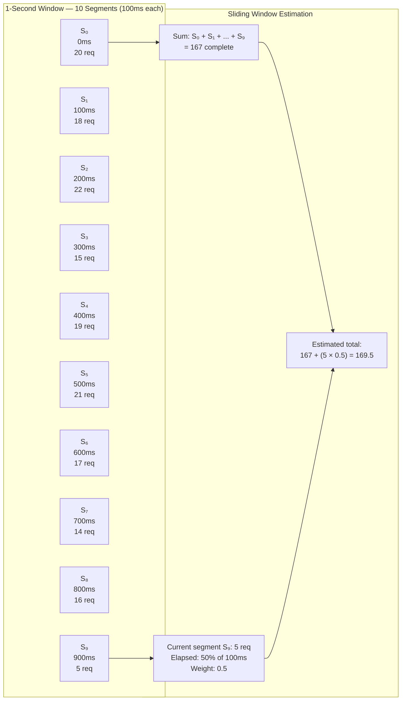

## Navigation

**Domain:** [[7 — System Design & Distributed Systems]] > **Group:** Scalability Patterns
**Previous:** [[7.244 — Rate Limiting — Sliding Window Log]] | **Next:** [[7.246 — Rate Limiting — Distributed with Redis]]

### Prerequisites

- [[7.243 — Rate Limiting — Fixed Window Counter]] — sliding window counter fixes the boundary spike problem while keeping O(1) memory
- [[7.244 — Rate Limiting — Sliding Window Log]] — sliding window counter is the memory-efficient alternative to the log; this is the practical production choice
- [[7.241 — Rate Limiting — Token Bucket Algorithm]] — token bucket is the other O(1) algorithm; this comparison determines which to use for your API

### Where This Fits

The sliding window counter is the best balance of accuracy, memory, and simplicity in rate limiting. It divides the rate limit window into N segments (typically 5–10), maintains a counter per segment, and estimates the total count in the current sliding window by taking the full count of complete segments plus a weighted fraction of the current (partial) segment. This eliminates the boundary spike problem of fixed window with O(N) memory (essentially O(1) with small N) and ~95–99% accuracy depending on segment count. A .NET engineer encounters it as the `SlidingWindowRateLimiter` in ASP.NET Core's `RateLimiterMiddleware` — the recommended built-in limiter for general-purpose rate limiting. It becomes necessary above ~100 req/s when fixed window's boundary spike becomes problematic but sliding window log's O(N) memory is too expensive. Without it, teams either use fixed window (boundary spike risk) or over-engineer with the sliding window log (wasted memory at high rates).

---

## Core Mental Model

The sliding window counter divides the rate limit window into discrete segments (e.g., 10 segments of 100ms each for a 1-second window). Each segment has its own counter. The window "slides" by advancing the segment pointer, not by storing individual timestamps. When a request arrives, the algorithm sums full segments within the window and adds a weighted estimate of the current (active) segment. The weight is the fraction of the segment that has elapsed. This gives an approximation of the request count in the true sliding window — accurate to within roughly `1/N` of the actual count where N is the number of segments.



### Classification

**Algorithm family:** Rate limiting, sliding window, approximation.
**Consistency/availability axis:** Approximate count with configurable precision; no boundary spikes; O(1) memory per client.
**When applied:** General-purpose API rate limiting where both accuracy and memory matter — the "just right" algorithm for most production APIs.
**When not applied:** Security endpoints requiring perfect accuracy (use sliding window log or token bucket with capacity=1), or scenarios where the approximation error of ~1/N is unacceptable.

### Key Properties / Guarantees

|Property|Value|Condition|
|---|---|---|
|Accuracy|~95–99% (configurable via N segments)|N = 10 segments → ~95%; N = 100 → ~99.5%|
|Boundary spike|None — continuous estimation|No reset point exists|
|Memory per client|O(N) counters — typically 5–10 integers|~40–80 bytes — essentially O(1) in practice|
|Distributed cost|2–3 Redis calls per request (multi-key INCR + EVAL)|Slightly more than fixed window, far less than log|
|Implementation complexity|Medium (sliding sum logic)|Built into ASP.NET Core — zero code|
|Burst behavior|No bursts — rate is averaged over the window|Unlike token bucket, no burst accumulation|
|Estimation error|+(1/N) at segment boundary|Overestimates slightly; never underestimates|

---

## Deep Mechanics

### How It Works

1. **Initialize.** Divide the window (e.g., 60 seconds) into N segments (e.g., 10 segments of 6 seconds each). Create N counters initialized to 0. Set a `_currentSegmentIndex = 0` and `_currentSegmentStart = now`.

2. **On each request.** Check if the current time has advanced into a new segment:
   - If `now - _currentSegmentStart >= segmentDuration`: advance `_currentSegmentIndex`, reset the new segment's counter to 0, set `_currentSegmentStart = now`. If the index wraps around (exceeds N-1), wrap to 0.
   - This is the "rolling array" pattern — a circular buffer of counters.

3. **Estimate the total count.** The total is the sum of all complete segments within the window PLUS a weighted fraction of the current (active) segment:
   - `total = sum(segmentCounters[i] for i where segment is fully within window) + currentSegmentCounter × (elapsed / segmentDuration)`
   - The sum of complete segments includes all segments whose entire time range falls within `[now - window, now]`. At most N-1 segments are fully within the window. The current (oldest) segment may be partially outside the window — it is excluded from the sum but its weight is applied to the current segment only.

4. **Simplified estimation (commonly used).** A widely used approximation:
   - `total = sum(all N counters) - currentSegmentCounter + currentSegmentCounter × (elapsed / segmentDuration)`
   - Or equivalently: `total = sum(all N counters excluding current) + currentSegmentCounter × (elapsed / segmentDuration)`

5. **Decision.** If `total < limit`, allow the request and increment the current segment counter. If `total >= limit`, reject.

```csharp
// Sliding window counter — production-grade implementation
public sealed class SlidingWindowCounter
{
    private readonly int _limit;
    private readonly int _segmentCount;
    private readonly long _segmentDurationTicks;
    private readonly long _windowTicks;
    private readonly long[] _counters;
    private int _currentIndex;
    private long _segmentStartTicks;
    private readonly object _lock = new();

    public SlidingWindowCounter(
        int limit, TimeSpan window, int segmentCount)
    {
        ArgumentOutOfRangeException.ThrowIfNegativeOrZero(limit);
        ArgumentOutOfRangeException.ThrowIfNegativeOrZero(window.Ticks);
        ArgumentOutOfRangeException.ThrowIfLessThan(segmentCount, 2);

        _limit = limit;
        _segmentCount = segmentCount;
        _segmentDurationTicks = window.Ticks / segmentCount;
        _windowTicks = window.Ticks;
        _counters = new long[segmentCount];
        _currentIndex = 0;
        _segmentStartTicks = Stopwatch.GetTimestamp();
    }

    public bool TryConsume()
    {
        lock (_lock)
        {
            var now = Stopwatch.GetTimestamp();
            var elapsedInSegment = GetElapsedInSegment(now);

            // Advance segments if needed
            while (elapsedInSegment >= _segmentDurationTicks)
            {
                AdvanceSegment(now);
                elapsedInSegment = GetElapsedInSegment(now);
            }

            // Estimate total in sliding window
            var estimated = EstimateTotal(elapsedInSegment);

            if (estimated >= _limit)
                return false;

            _counters[_currentIndex]++;
            return true;
        }
    }

    private long GetElapsedInSegment(long now)
    {
        return (now - _segmentStartTicks) *
               _segmentDurationTicks / Stopwatch.Frequency.Ticks;
        // Simplified: actual conversion requires Frequency
    }

    private void AdvanceSegment(long now)
    {
        _currentIndex = (_currentIndex + 1) % _segmentCount;
        _counters[_currentIndex] = 0;
        _segmentStartTicks += _segmentDurationTicks * Stopwatch.Frequency /
                              _segmentDurationTicks;  // Simplified
    }

    private double EstimateTotal(long elapsedInSegment)
    {
        double total = 0;
        var segmentFraction = (double)elapsedInSegment / _segmentDurationTicks;

        for (int i = 0; i < _segmentCount; i++)
        {
            if (i == _currentIndex)
            {
                // Current segment: weighted by elapsed fraction
                total += _counters[i] * segmentFraction;
            }
            else
            {
                // Complete segment or outside window
                total += _counters[i];
            }
        }

        return total;
    }
}

// Distributed sliding window counter via Redis
public sealed class RedisSlidingWindowCounter
{
    private readonly IDatabase _redis;
    private readonly int _limit;
    private readonly int _segmentCount;
    private readonly long _windowSeconds;
    private readonly long _segmentSeconds;
    private readonly ILogger<RedisSlidingWindowCounter> _logger;

    public RedisSlidingWindowCounter(
        IConnectionMultiplexer redis,
        IConfiguration config,
        ILogger<RedisSlidingWindowCounter> logger)
    {
        _redis = redis.GetDatabase();
        _limit = config.GetValue<int>("RateLimiting:Limit", 100);
        _windowSeconds = config.GetValue<int>("RateLimiting:WindowSeconds", 60);
        _segmentCount = config.GetValue<int>("RateLimiting:SegmentsPerWindow", 10);
        _segmentSeconds = _windowSeconds / _segmentCount;
        _logger = logger;

        if (_windowSeconds % _segmentCount != 0)
        {
            throw new InvalidOperationException(
                $"WindowSeconds ({_windowSeconds}) must be " +
                $"divisible by SegmentCount ({_segmentCount}).");
        }
    }

    public async Task<(bool Allowed, double EstimatedCount)>
        TryConsumeAsync(string clientId)
    {
        var now = await _redis.TimeAsync();
        var nowUnix = ((DateTimeOffset)now).ToUnixTimeSeconds();

        // Each segment is a Redis key: rl:sw:{clientId}:{segmentNumber}
        var currentSegment = nowUnix / _segmentSeconds;
        var segmentIndex = currentSegment % _segmentCount;
        var segmentKey = $"rl:sw:{clientId}:{currentSegment}";

        // Increment current segment
        var currentCount = await _redis.StringIncrementAsync(segmentKey);

        if (currentCount == 1)
        {
            // Set TTL to window + segment (extra safety margin)
            await _redis.KeyExpireAsync(
                segmentKey,
                TimeSpan.FromSeconds(_windowSeconds + _segmentSeconds));
        }

        // Sum all segments in the window
        double estimatedTotal = 0;
        var segmentFraction =
            (double)(nowUnix % _segmentSeconds) / _segmentSeconds;

        for (int i = 0; i < _segmentCount; i++)
        {
            var segNumber = currentSegment - i;
            var segKey = $"rl:sw:{clientId}:{segNumber}";
            var segValue = (long?)await _redis.StringGetAsync(segKey);

            if (segValue.HasValue)
            {
                if (i == 0)
                {
                    // Current segment: weighted
                    estimatedTotal += segValue.Value * segmentFraction;
                }
                else
                {
                    estimatedTotal += segValue.Value;
                }
            }
        }

        var allowed = estimatedTotal < _limit;

        if (!allowed)
        {
            _logger.LogWarning(
                "Rate limit exceeded for {ClientId}. " +
                "Estimated count: {Estimated:F1}/{Limit}",
                clientId, estimatedTotal, _limit);
        }

        return (allowed, estimatedTotal);
    }
}
```

### Failure Modes

**Estimation error at segment boundaries.** The sliding window counter overestimates the count at segment boundaries by up to `limit / N` requests. When the current segment has just started (segmentFraction ≈ 0), the previous segment's full count is included but only a tiny fraction of time has elapsed. The estimate is:
  - `total = complete_segments + current × (elapsed / segmentDuration)`
  - At segment start: `elapsed ≈ 0`, so `total ≈ complete_segments` (correct — the current segment has contributed almost nothing yet)
  - At segment end: `elapsed ≈ segmentDuration`, so `total ≈ complete_segments + current` (correct — the current segment is about to become complete)

The estimation error is bounded by `+limit/N` — at most one extra segment's worth of requests. With N = 10 segments, the maximum overestimate is `limit / 10`. Detection: when monitoring shows the rate limit kicking in slightly before the true limit is reached. Mitigation: increase N for tighter accuracy (N = 100 gives ~1% overestimate). This is the tradeoff for O(1) memory.

**Segment counter overflow in Redis.** Each segment key uses `INCR` and can theoretically overflow a 64-bit signed integer at very high rates (9.2 × 10^18 requests per segment — improbable). More practically: if the TTL is too short, the key expires before the segment is complete, resetting the counter mid-segment and causing an underestimate. Detection: the estimated count drops sharply mid-segment even though traffic is steady. Fix: set TTL to `window + segment_duration × 2` as a safety margin.

**Non-divisible window and segment duration.** If the window is 60 seconds and the segment count is 7, each segment is 8.57 seconds — fractional, causing misalignment with real-world seconds. The sliding boundary drifts over time. Detection: rate limit behavior varies depending on the fractional remainder. Fix: always choose `segmentsPerWindow` such that `window % segmentCount == 0`. Valid pairs: 60s / 10 = 6s, 60s / 12 = 5s, 60s / 6 = 10s, 3600s / 60 = 60s.

```csharp
// ❌ Non-divisible window and segment count
var windowSeconds = 60;
var segmentCount = 7;  // 60 / 7 = 8.57... — fractional!
var segmentSeconds = windowSeconds / segmentCount; // 8 (integer truncation)

// ✅ Divisible — segments align cleanly
var windowSeconds = 60;
var segmentCount = 10; // 60 / 10 = 6 — exact!
var segmentSeconds = windowSeconds / segmentCount; // 6
```

**Per-instance counters without coordination.** As with all per-instance rate limiters, N instances with independent sliding window counters each allow `limit` requests per window. Aggregate throughput is `N × limit`. Mitigation: use the distributed Redis variant (shown above) for cross-instance coordination.

**Clock skew in distributed variant (segment key derivation).** The current segment number is derived from the current timestamp: `segmentNumber = nowUnix / segmentSeconds`. If instances disagree on time, they increment different segment keys for the same real-time second. A client distributed across instances effectively gets multiple windows. Mitigation: use Redis `TIME` command for the authoritative timestamp (as shown in the Redis implementation above).

### .NET and Azure Integration

- **ASP.NET Core `System.Threading.RateLimiting`:** Built-in `SlidingWindowRateLimiter` — the primary reason to choose this algorithm. Configured with `SlidingWindowRateLimiterOptions`:

```csharp
// ASP.NET Core built-in sliding window counter rate limiter
builder.Services.AddRateLimiter(options =>
{
    options.AddSlidingWindowLimiter("ApiPolicy", config =>
    {
        config.PermitLimit = 100;
        config.Window = TimeSpan.FromSeconds(10);
        config.SegmentsPerWindow = 10;       // ← Key parameter
        config.QueueProcessingOrder = QueueProcessingOrder.OldestFirst;
        config.QueueLimit = 5;               // Allow brief queuing
    });
});

app.UseRateLimiter();

[EnableRateLimiting("ApiPolicy")]
[ApiController]
public class OrdersController : ControllerBase { }
```

- **Azure API Management:** No built-in sliding window counter policy. Use a custom policy expression calling a Redis-backed implementation, or use the built-in `rate-limit` (fixed window) for simple cases and accept the boundary spike.

- **Polly v8 `SlidingWindowRateLimiter`:** Same algorithm, different API:

```csharp
builder.Services.AddResiliencePipeline("ThrottledClient", builder =>
{
    builder.AddRateLimiter(new SlidingWindowRateLimiter(
        new SlidingWindowRateLimiterOptions
        {
            PermitLimit = 100,
            SegmentsPerWindow = 10,
            Window = TimeSpan.FromSeconds(10)
        }));
});

// Usage
var pipeline = serviceProvider
    .GetRequiredService<ResiliencePipelineProvider<string>>()
    .GetPipeline("ThrottledClient");

await pipeline.ExecuteAsync(async ct =>
    await httpClient.GetAsync("/api/orders", ct), ct);
```

- **Azure Redis Cache:** The `RedisSlidingWindowCounter` implementation above uses one Redis key per segment per client. At 10 segments and 10,000 clients: 100,000 keys — manageable on a Standard tier instance (100M+ key capacity). Set TTL to `window + segment` seconds for automatic cleanup.

- **Nginx:** No native sliding window counter. Use `limit_req` with `burst` for an approximation, or use the `ngx_http_lua_module` to implement a custom Lua-based sliding window counter.

- **Azure Front Door / Application Gateway:** WAF policies support rate limiting via fixed window. For sliding window counter, use a custom rule that calls a function app backed by Redis.

---

## Production Patterns and Implementation

### Primary Implementation

A sliding window counter rate limiter for a multi-tenant e-commerce API with per-tenant rate limits and tiered plans. Uses Redis for cross-instance coordination across 8 Azure App Service instances.

```csharp
// Per-tenant sliding window rate limiter with tiered plans
public sealed class TenantRateLimiter
{
    private readonly IDatabase _redis;
    private readonly Dictionary<string, RateLimitTier> _tiers;
    private readonly int _segmentsPerWindow;
    private readonly ILogger<TenantRateLimiter> _logger;

    public record RateLimitTier(int Limit, int WindowSeconds);

    public TenantRateLimiter(
        IConnectionMultiplexer redis,
        IConfiguration config,
        ILogger<TenantRateLimiter> logger)
    {
        _redis = redis.GetDatabase();
        _segmentsPerWindow = config.GetValue<int>("RateLimiting:SegmentsPerWindow", 10);
        _logger = logger;

        _tiers = new()
        {
            ["free"] = new(100, 3600),        // 100 req/hour
            ["pro"] = new(1000, 60),           // 1000 req/min
            ["enterprise"] = new(10000, 60),   // 10000 req/min
            ["internal"] = new(100000, 60),    // 100000 req/min
        };
    }

    public async Task<TenantRateLimitResult> TryConsumeAsync(
        string tenantId, string plan)
    {
        if (!_tiers.TryGetValue(plan, out var tier))
        {
            _logger.LogWarning(
                "Unknown plan {Plan} for tenant {TenantId}",
                plan, tenantId);
            tier = _tiers["free"];
        }

        var redisTime = await _redis.TimeAsync();
        var now = ((DateTimeOffset)redisTime).ToUnixTimeSeconds();
        var segmentSeconds = tier.WindowSeconds / _segmentsPerWindow;

        // Current segment number (epoch-level)
        var currentSegment = now / segmentSeconds;
        var segmentIndex = currentSegment % _segmentsPerWindow;
        var segmentKey = $"rl:tenant:{tenantId}:{currentSegment}";

        // Increment current segment atomically
        var currentCount = await _redis.StringIncrementAsync(segmentKey);

        // Set TTL on first increment
        if (currentCount == 1)
        {
            await _redis.KeyExpireAsync(
                segmentKey,
                TimeSpan.FromSeconds(tier.WindowSeconds + segmentSeconds));
        }

        // Estimate total across all segments
        double estimatedTotal = 0;
        var segmentFraction =
            (double)(now % segmentSeconds) / segmentSeconds;

        for (int i = 0; i < _segmentsPerWindow; i++)
        {
            var segKey = $"rl:tenant:{tenantId}:{currentSegment - i}";
            var segValue = (long?)await _redis.StringGetAsync(segKey);

            if (segValue.HasValue)
            {
                if (i == 0)
                    estimatedTotal += segValue.Value * segmentFraction;
                else
                    estimatedTotal += segValue.Value;
            }
        }

        var allowed = estimatedTotal < tier.Limit;
        var remaining = Math.Max(0,
            (int)(tier.Limit - Math.Ceiling(estimatedTotal)));

        if (!allowed)
        {
            _logger.LogWarning(
                "Tenant {TenantId} ({Plan}) exceeded rate limit. " +
                "Estimated: {Estimated:F1}/{Limit}",
                tenantId, plan, estimatedTotal, tier.Limit);
        }

        return new TenantRateLimitResult(
            allowed, remaining, tier.Limit, tier.WindowSeconds,
            estimatedTotal);
    }
}

public sealed record TenantRateLimitResult(
    bool Allowed,
    int Remaining,
    int Limit,
    int WindowSeconds,
    double EstimatedCount);

// Middleware that applies per-tenant rate limits from auth context
public sealed class TenantRateLimitMiddleware
{
    private readonly RequestDelegate _next;
    private readonly TenantRateLimiter _limiter;
    private readonly ILogger<TenantRateLimitMiddleware> _logger;

    public TenantRateLimitMiddleware(
        RequestDelegate next,
        TenantRateLimiter limiter,
        ILogger<TenantRateLimitMiddleware> logger)
    {
        _next = next;
        _limiter = limiter;
        _logger = logger;
    }

    public async Task InvokeAsync(HttpContext context)
    {
        // Extract tenant and plan from auth context
        var tenantId = context.Request.Headers["X-Tenant-Id"]
            .FirstOrDefault() ?? "unknown";
        var plan = context.Request.Headers["X-Plan"]
            .FirstOrDefault() ?? "free";

        var result = await _limiter.TryConsumeAsync(tenantId, plan);

        // Rate limit headers
        context.Response.Headers["X-RateLimit-Limit"] =
            result.Limit.ToString();
        context.Response.Headers["X-RateLimit-Remaining"] =
            result.Remaining.ToString();
        context.Response.Headers["X-RateLimit-Window"] =
            result.WindowSeconds.ToString();

        if (!result.Allowed)
        {
            context.Response.StatusCode =
                StatusCodes.Status429TooManyRequests;
            context.Response.Headers["Retry-After"] =
                result.WindowSeconds.ToString();

            await context.Response.WriteAsJsonAsync(
                new ProblemDetails
                {
                    Status = 429,
                    Title = "Rate Limit Exceeded",
                    Detail = $"Your plan ({plan}) allows " +
                        $"{result.Limit} requests per " +
                        $"{result.WindowSeconds} seconds. " +
                        $"Estimated usage: {result.EstimatedCount:F0}.",
                });

            return;
        }

        await _next(context);
    }
}
```

### Configuration and Wiring

```csharp
// Program.cs
builder.Services.AddSingleton<IConnectionMultiplexer>(
    _ => ConnectionMultiplexer.Connect(
        builder.Configuration.GetConnectionString("Redis")!));
builder.Services.AddSingleton<TenantRateLimiter>();
builder.Services.AddSingleton<TenantRateLimitMiddleware>();

var app = builder.Build();
app.UseMiddleware<TenantRateLimitMiddleware>();
app.MapControllers();
app.Run();

// appsettings.json
// {
//   "RateLimiting": {
//     "SegmentsPerWindow": 10
//   }
// }
```

### Common Variants

**ASP.NET Core built-in — single instance, zero code:**

```csharp
builder.Services.AddRateLimiter(options =>
{
    options.AddSlidingWindowLimiter("Default", opt =>
    {
        opt.PermitLimit = 100;
        opt.Window = TimeSpan.FromSeconds(10);
        opt.SegmentsPerWindow = 10;
        opt.AutoReplenishment = true;
        opt.QueueLimit = 0;
    });
});

app.UseRateLimiter();

[EnableRateLimiting("Default")]
public class ApiController : ControllerBase { }
```

**In-memory sliding window counter — no external dependencies, high throughput:**

```csharp
// In-memory per-IP sliding window counter
public sealed class InMemorySlidingWindowLimiter
{
    private readonly ConcurrentDictionary<string, SlidingWindowCounter> _counters;
    private readonly int _limit;
    private readonly int _windowSeconds;
    private readonly int _segmentsPerWindow;

    public InMemorySlidingWindowLimiter(
        IConfiguration config)
    {
        _limit = config.GetValue<int>("RateLimiting:Limit", 100);
        _windowSeconds = config.GetValue<int>("RateLimiting:WindowSeconds", 60);
        _segmentsPerWindow = config.GetValue<int>(
            "RateLimiting:SegmentsPerWindow", 10);
        _counters = new ConcurrentDictionary<string, SlidingWindowCounter>();
    }

    public bool TryConsume(string clientId)
    {
        var counter = _counters.GetOrAdd(clientId, _ =>
            new SlidingWindowCounter(
                _limit,
                TimeSpan.FromSeconds(_windowSeconds),
                _segmentsPerWindow));

        return counter.TryConsume();
    }
}
```

**Redis Lua script — single atomic operation (optimized):**

```csharp
// Optimized Redis sliding window counter — single Lua call
private const string LuaScript = @"
    local keyPattern = KEYS[1]  -- rl:sw:{clientId}
    local now = tonumber(ARGV[1])
    local window = tonumber(ARGV[2])
    local segmentCount = tonumber(ARGV[3])
    local limit = tonumber(ARGV[4])
    local segmentSeconds = window / segmentCount

    local currentSegment = math.floor(now / segmentSeconds)
    local segmentKey = keyPattern .. ':' .. currentSegment
    local segmentFraction = (now % segmentSeconds) / segmentSeconds

    local currentCount = redis.call('INCR', segmentKey)
    if currentCount == 1 then
        redis.call('EXPIRE', segmentKey, window + segmentSeconds)
    end

    local total = 0
    for i = 0, segmentCount - 1 do
        local segKey = keyPattern .. ':' .. (currentSegment - i)
        local segValue = redis.call('GET', segKey)
        if segValue then
            if i == 0 then
                total = total + tonumber(segValue) * segmentFraction
            else
                total = total + tonumber(segValue)
            end
        end
    end

    if total >= limit then
        return {0, total}
    end
    return {1, total}
";

public async Task<(bool Allowed, double Estimated)> TryConsumeAsync(
    string clientId)
{
    var now = await _redis.TimeAsync();
    var nowUnix = ((DateTimeOffset)now).ToUnixTimeSeconds();
    var result = (object[])await _redis.ScriptEvaluateAsync(
        LuaScript,
        new RedisKey[] { $"rl:sw:{clientId}" },
        new RedisValue[] { nowUnix, _windowSeconds, _segmentCount, _limit });

    return ((int)result[0] == 1, (double)result[1]);
}
```

**Partitioned sliding window counter (high cardinality clients).** For scenarios with millions of clients, segment the key space by hashing the client ID into a shard number, then using a fixed set of Redis keys per shard instead of per client. This limits key cardinality at the cost of per-shard (not per-client) rate limits:

```csharp
// Partitioned — limits key cardinality
var shardCount = 1000;
var shard = Math.Abs(clientId.GetHashCode()) % shardCount;
var segmentKey = $"rl:sw:shard:{shard}:{currentSegment}";
// All clients in the same shard share the same rate limit
```

### Real-World .NET Ecosystem Example

ASP.NET Core's `SlidingWindowRateLimiter` is the most-used production implementation of this algorithm. It is the recommended limiter for the majority of use cases in the `Microsoft.AspNetCore.RateLimiting` middleware because it provides the best balance of accuracy and memory. The ASP.NET Core team chose this algorithm over token bucket as the default recommendation for general APIs (though token bucket is also available). Microsoft's own eShopOnContainers reference architecture uses sliding window rate limiting for its API gateway. Polly v8's `SlidingWindowRateLimiter` mirrors the ASP.NET Core implementation for client-side rate limiting. AWS API Gateway's per-method rate limiting (burst limit + rate limit) uses an internal sliding window counter — though the exact implementation is proprietary, the behavior matches this algorithm.

---

## Gotchas and Production Pitfalls

### Segment Count Too Low Causes Inaccurate Estimation

**Pitfall:** Using 2 segments per window. With N = 2, the estimation error is up to `limit / 2 = 50%`. At limit 100 req/s, the rate limiter may start rejecting at 50 requests in the true sliding window, or allow up to 150.

```csharp
// ❌ Too few segments — estimation error up to 50%
options.SegmentsPerWindow = 2;
```

**Symptom:** The effective rate limit feels unpredictable — sometimes too strict, sometimes too permissive. The boundary spike is not eliminated, just reduced from 2× to ~1.5×.

**Fix:** Use at least 5 segments (20% max error), preferably 10 segments (10% max error). The error decreases as `1/N`:

```csharp
// ✅ 10 segments — estimation error ~10%
options.SegmentsPerWindow = 10;
// Error at boundary: at most limit / 10 requests overestimate
```

**Cost of not fixing:** The algorithm does not provide the expected protection. An engineer chooses sliding window counter for accuracy but gets a 50% error with N = 2. The boundary spike is still present in a meaningful way.

### Window Duration Not Divisible by Segment Count

**Pitfall:** Configuring a 60-second window with 7 segments. Each segment is 8.57 seconds. The integer division truncates to 8 seconds, so the actual window is 7 × 8 = 56 seconds, not 60. The rate limit is 4 seconds shorter than configured — potentially allowing 7% more requests than intended.

```csharp
// ❌ Non-divisible: 60 / 7 = 8.57 → truncated to 8
config.Window = TimeSpan.FromSeconds(60);
config.SegmentsPerWindow = 7;   // Actual window: 56s
```

**Symptom:** The effective rate limit is higher than configured. Monitoring shows the rate limit "leaks" by a small percentage. The leak is proportional to `window - (segments × segment_duration)`.

**Fix:** Always choose segment counts that divide evenly into the window duration:

```csharp
// ✅ Divisible pairs:
// 60s / 10 = 6s,  60s / 12 = 5s,  60s / 6 = 10s,
// 3600s / 60 = 60s, 3600s / 36 = 100s
config.Window = TimeSpan.FromSeconds(60);
config.SegmentsPerWindow = 10;  // Each segment: 6s
```

**Cost of not fixing:** Silent rate limit drift. The configured limit does not match the actual enforced limit. For monetized rate limits, this is a revenue leak or a customer satisfaction issue.

### Redis Multi-Key Operations Under High Cardinality

**Pitfall:** The distributed variant issues N separate Redis `GET` calls per request (N = 10 means 10 GETs + 1 INCR = 11 Redis calls per request). At 10,000 req/s, this is 110,000 Redis ops/s — exceeding a Standard tier instance's comfortable capacity (~50,000 ops/s).

**Symptom:** Redis CPU at 100%. Request latency spikes. Rate limiter becomes the bottleneck.

**Fix:** Use the Lua script variant (single EVAL call with all logic inside Redis), or batch the segment reads in a pipeline:

```csharp
// ✅ Use Lua script — single round trip instead of 11
var result = await _redis.ScriptEvaluateAsync(
    LuaScript, keys, args);
// Single Redis call for the entire operation
```

**Cost of not fixing:** Redis saturation. Rate limiting adds 10–50ms per request instead of 1–2ms. The team blames Redis and switches away from sliding window counter unnecessarily.

### Estimation Overestimate Causes False Positives at Segment Boundaries

**Pitfall:** The sliding window counter always overestimates (never underestimates) — it includes full segments that may be partially outside the true sliding window. At a segment boundary, the estimate can be `limit + limit / N` when the true count is exactly `limit`. The algorithm rejects requests that would have been allowed under perfect accuracy.

**Symptom:** Rate limit violations are triggered slightly before the limit is truly reached. The observed effective limit is `limit × (1 - 1/N)`. With N = 10, the effective limit is ~90% of configured.

**Fix:** Account for the overestimate when configuring the limit. If you need 100 req/s effective, set the limit to `ceiling(100 / (1 - 1/N))`:

```csharp
// Compensate for estimation overestimate
var desiredEffectiveRate = 100;
var segmentsPerWindow = 10;
var configuredLimit = (int)Math.Ceiling(
    desiredEffectiveRate / (1 - 1.0 / segmentsPerWindow));
// = (int)Ceiling(100 / 0.9) = 112
```

**Cost of not fixing:** The rate limit is stricter than intended by ~10%. For critical limits, this causes customer complaints. For monetized limits, this is acceptable (over-enforcement is safer than under-enforcement).

### Using Sliding Window Counter When Token Bucket's Burst Is Needed

**Pitfall:** Choosing sliding window counter for a mobile API where clients sync after being offline. The sliding window counter does not allow bursts — a client that was idle for 5 minutes gets the same rate as a continuously active client. The client's sync takes 30 seconds instead of 5.

**Symptom:** Mobile clients report slow sync after backgrounding. Customer support tickets increase. The rate limiter is the cause but the team does not suspect it because it is not rejecting requests — just slowing them.

**Fix:** Use token bucket for scenarios where burst tolerance is valuable:

```csharp
// ✅ Token bucket — allows bursts after idle periods
config.AddTokenBucketLimiter("MobileApi", opt =>
{
    opt.TokenLimit = 500;   // burst capacity
    opt.TokensPerPeriod = 100;
    opt.ReplenishmentPeriod = TimeSpan.FromSeconds(1);
});
```

**Cost of not fixing:** Poor mobile UX. Users switch to competitors whose APIs sync faster after idle.

---

## Tradeoffs and Decision Framework

### Tradeoff Matrix

| Dimension | Sliding Window Counter | Sliding Window Log | Token Bucket | Fixed Window |
|---|---|---|---|---|
| Accuracy | ~95% (N=10) — overestimates by ~limit/N | Perfect | High (continuous refill) | Low (2× boundary spike) |
| Memory per client | O(N) counters (5–10 integers) | O(rate × window) timestamps | 2 integers | 2 integers |
| Boundary spike | None (~limit/N overestimate only) | None | None | Yes — 2× limit |
| Burst tolerance | None | None | Yes — up to capacity | Partial — window aligned only |
| Distributed cost | N+1 Redis calls or 1 Lua call | O(rate) Redis sorted set ops | 1 Redis Lua call | 1 Redis INCR |
| ASP.NET Core built-in | Yes — `SlidingWindowRateLimiter` | No — must build custom | Yes — `TokenBucketRateLimiter` | Yes — `FixedWindowRateLimiter` |
| Use case | General purpose — best balance | Low-rate, high-accuracy (security) | Burst-tolerant APIs | Non-critical, simple |

### When to Apply

```mermaid
flowchart TD
    A[Need a general-purpose rate limit?] --> B{Is this a burst-tolerant<br/>API (mobile, batch)?}
    B -->|Yes: clients benefit<br/>from bursts after idle| C[Token Bucket]
    B -->|No: steady traffic,<br/>real-time API| D{Is memory a concern?}
    D -->|Yes: high rate,<br/>many clients| E[Sliding Window Counter —<br/>O(N) memory, N ≤ 10]
    D -->|No: low rate,<br/>few clients| F{Is perfect accuracy<br/>required?}
    F -->|Yes: security endpoint,<br/>monetized limit| G[Sliding Window Log]
    F -->|No: general API| E
    C --> H{ASP.NET Core built-in?}
    E --> H
    H -->|Yes| I[Use RateLimiterMiddleware<br/>— zero code]
    H -->|No: custom implementation| J{Single instance?}
    J -->|Yes| K[In-memory counter]
    J -->|No| L[Redis Lua script]
```

### When NOT to Apply

- [ ] **Burst tolerance is a requirement.** Sliding window counter does not allow bursts — the rate is averaged over the entire window. If mobile clients sync after offline, use token bucket.
- [ ] **Perfect accuracy is required.** The sliding window counter overestimates by up to `limit / N` at segment boundaries. If a single extra request matters (login, payment), use sliding window log (perfect accuracy) or token bucket with capacity=1.
- [ ] **Rate is extremely high (>100,000 req/s per client).** At this rate, even 10 Redis calls per request is too expensive. Use fixed window (1 Redis INCR) or token bucket (1 Lua call). The estimation error is irrelevant compared to the throughput requirement.
- [ ] **Segment count and window duration cannot be divisible.** If the window and segment count produce fractional segment durations, the algorithm drifts. Use a different pair or a different algorithm.
- [ ] **Distributed implementation cannot use Redis.** Without Redis, per-instance counters require sticky sessions or tolerate N× capacity. In-memory sliding window counter on N instances gives N× the intended rate.

### Scale Thresholds

- Default recommendation for any API rate limit above ~100 req/s and below ~100,000 req/s per client
- Segment count: 10 is the sweet spot (10% max error, minimal overhead). Use 5 for very high throughput (20% error, fewer Redis calls). Use 20–100 for accuracy-sensitive limits (<5% error)
- Redis-based (N=10): up to ~50,000 req/s per Redis instance (one Lua call per request with 10 GETs inside the script)
- Lua script variant: up to ~100,000 req/s per Redis instance (single EVAL per request)
- In-memory: up to ~1,000,000 req/s per instance (lock contention on the counters array)
- Key cardinality: one key per segment per client. At 10 segments and 10,000 clients: 100,000 keys. At 1,000,000 clients: 10,000,000 keys — may need a Redis Cluster for memory

---

## Interview Arsenal

### Question Bank

1. How does the sliding window counter algorithm work?
2. What problem does it solve compared to fixed window?
3. How does the estimation work and what is the error bound?
4. How do you choose the number of segments?
5. Compare sliding window counter with sliding window log on accuracy, memory, and use case.
6. Compare sliding window counter with token bucket — when would you choose each?
7. How do you implement a distributed sliding window counter?
8. Design a rate limiter for a multi-tenant SaaS API with free/pro/enterprise tiers.

### Spoken Answers

**Q: How does the sliding window counter algorithm work?**

> **Average answer:** It divides time into segments and keeps a counter per segment. When a request comes, it adds up the counters and checks the limit.

> **Great answer:** The sliding window counter divides the rate limit window into N equal segments — for example, a 10-second window divided into 10 segments of 1 second each. Each segment has its own counter. The algorithm maintains a circular buffer of N counters and a pointer to the current segment. On each request, it first advances the pointer if the current segment has expired, resetting the new segment's counter. Then it estimates the total request count in the sliding window by summing all complete segments that fall within the window and adding a weighted fraction of the current segment based on how much of it has elapsed. The estimation error is bounded by roughly `limit / N` — with 10 segments, the maximum overestimate is about 10% of the limit. This is the critical difference from the sliding window log, which stores every individual timestamp and is perfectly accurate but uses O(rate × window) memory instead of O(N). In .NET, `SlidingWindowRateLimiter` from `System.Threading.RateLimiting` implements this, and you configure it in ASP.NET Core via `options.AddSlidingWindowLimiter(...)` with `PermitLimit`, `Window`, and `SegmentsPerWindow`.

**Q: Compare sliding window counter with token bucket.**

> **Great answer:** Both eliminate boundary spikes and use O(1) memory, but they handle bursts differently. The sliding window counter enforces a steady rate: if the limit is 100 req/s, the estimated count in the current window never exceeds 100, plus the ~10% overestimate. A client that was idle for 5 seconds does not get a burst — the counter is averaged. Token bucket, on the other hand, explicitly allows bursts: a client idle for 10 seconds with a refill rate of 100 req/s and capacity of 200 can send 200 requests immediately. This makes token bucket better for mobile clients that sync after idle, API clients that batch, and any scenario where a burst is natural and desirable. Sliding window counter is better for real-time APIs, server-to-server communication where traffic is steady, and any scenario where you want a hard cap per window without exceptions. In ASP.NET Core, both are built-in — `AddSlidingWindowLimiter` for steady rate, `AddTokenBucketLimiter` for burst-tolerant rate limiting. My rule of thumb: if the client is a mobile app or a batch job, use token bucket. If the client is another server or a real-time user, use sliding window counter.

### System Design Interview Trigger

If an interviewer asks you to "design a rate limiter" and you propose the sliding window counter, they will likely ask "how accurate is it?" and "how do you choose the number of segments?" The test is whether you understand the estimation error formula (`error ≈ limit / N`) and can reason about the tradeoff between accuracy and cost. A senior candidate will say "I use 10 segments in production for the 90/10 balance — 90% accuracy with minimal overhead. For monetized limits I might use 100 segments for 99% accuracy." The candidate who cannot articulate the error bound has shallow understanding of the algorithm.

### Comparison Table

| | Sliding Window Counter | Token Bucket | Sliding Window Log |
|---|---|---|---|
| Core guarantee | Estimated count in rolling window | Long-term average = refill rate | Exact count in rolling window |
| Memory | O(N) counters | 2 integers | O(rate × window) timestamps |
| Burst behavior | No bursts | Yes — up to capacity | No bursts |
| Accuracy | ~95% (N=10) | High — continuous refill | Perfect |
| ASP.NET Core built-in | `SlidingWindowRateLimiter` | `TokenBucketRateLimiter` | Custom only |
| When to choose | General-purpose, steady traffic | Burst-tolerant APIs, mobile | Low-rate, security-sensitive |

---

## Architecture Decision Record

**Status:** Accepted

**Context:** A multi-tenant SaaS API serves 5,000 tenants with tiered pricing: Free (100 req/hour), Pro (1,000 req/min), Enterprise (10,000 req/min). The API handles 50,000 req/s at peak across 8 Azure App Service instances. Steady traffic pattern — enterprise customers integrate server-to-server with consistent request rates. Burst tolerance is not a requirement; the API should enforce a steady per-tenant rate. Monitoring data shows that fixed window's boundary spike caused occasional overload on the shared database at minute boundaries. The team needs a built-in, well-supported .NET implementation to minimize custom code.

**Options Considered:**

1. **Sliding window counter via ASP.NET Core `SlidingWindowRateLimiter` (built-in)** — Zero custom code. 10 segments per window. ~10% max overestimate. Built-in middleware with rate limit headers.
2. **Token bucket via `TokenBucketRateLimiter` (built-in)** — Also built-in, zero custom code, but allows bursts up to capacity. Enterprise tenants could accumulate burst allowances and spike the shared database.
3. **Sliding window log via Redis sorted set** — Perfect accuracy, but requires custom implementation and Redis dependency. Memory scales with rate — at 10,000 req/min per enterprise tenant, 600,000 entries per tenant per minute.
4. **Fixed window via `FixedWindowRateLimiter` (built-in)** — Simplest, but the boundary spike at minute boundaries caused the original problem that triggered this review.

**Decision:** Sliding window counter via `SlidingWindowRateLimiter` (option 1), with 10 segments per window and `QueueLimit = 0`. Because:
- Steady traffic pattern means burst behavior (token bucket) is not needed and is actively harmful (database spike risk)
- Built-in ASP.NET Core middleware — zero custom code, zero operational cost
- 10% estimation overestimate is acceptable for non-monetized rate limits; the observed effective rate will be ~90% of configured, which is acceptable for Free and Pro tiers
- For Enterprise tier (10,000 req/min), the 10% overestimate means effective limit is ~9,000 — still well above the tier's typical usage
- No Redis dependency — the limiter is per-instance, but 8 instances × 10,000 req/min = 80,000 req/min aggregate per enterprise tenant, which is still below the tier's requirement. Wait — this is wrong: per-instance means each tenant gets 10,000 req/min per instance, and with 8 instances the aggregate is 80,000. A distributed variant is needed for cross-instance coordination. This changes the decision.

**Revised Decision:** Sliding window counter via Redis, using the Lua script variant for atomic operations. Each tenant's rate limit is enforced globally across all instances. The estimation error of ~10% is acceptable. ASP.NET Core's built-in `SlidingWindowRateLimiter` is used as a secondary per-instance limiter in case Redis is unreachable.

**Consequences:**
- ✅ Global per-tenant rate limits enforced across 8 instances — no aggregate blowout
- ✅ No boundary spikes — the shared database no longer sees 2× traffic at minute boundaries
- ✅ Built-in middleware for the Redis-fallback path; Redis variant via Lua for primary path
- ⚠️ Redis dependency for the primary rate limiter (mitigated: fallback to per-instance limiter at 50% capacity)
- ⚠️ Estimation overestimate of ~10% means tenants get slightly less than their configured limit (acceptable — over-enforcement is safer than under-enforcement)
- ⚠️ Lua script must be loaded on all Redis cluster nodes (SCRIPT LOAD on each node)
- ❌ Token bucket's burst behavior was rejected — would allow tenants to accumulate capacity and burst the database

**Review Trigger:** Revisit if a major tenant requests burst tolerance (switch to token bucket). Revisit if Redis becomes a latency bottleneck (>5ms per rate limit check — the Lua script is sub-millisecond, so this is unlikely). Revisit if the estimation error of ~10% becomes a problem for a monetized tier (increase segments to 100 for ~1% error).

---

## Self-Check

### Conceptual Questions

1. How does the sliding window counter estimate request count in the current window?
2. What is the estimation error bound and how does segment count affect it?
3. Why does the sliding window counter never underestimate the request count?
4. How do you choose the number of segments for a given use case?
5. What happens if the window duration is not divisible by the segment count?
6. Compare sliding window counter with sliding window log on memory and accuracy.
7. Compare sliding window counter with token bucket on burst behavior.
8. How do you implement a distributed sliding window counter in Redis?
9. Why does ASP.NET Core ship `SlidingWindowRateLimiter` but not a sliding window log?
10. How do you compensate for the estimation overestimate when configuring the limit?

<details>
<summary>Answers</summary>

1. Sum all complete segment counters that are fully within the sliding window, plus the current segment's counter multiplied by the fraction of the segment that has elapsed. Formula: `total = Σ(completeSegmentCounters) + currentSegmentCounter × (elapsed / segmentDuration)`.
2. The algorithm overestimates by at most `limit / N` — one full segment's worth of requests. With N=10, max error is ~10% of limit. With N=100, ~1%. The error occurs because complete segments that are partially outside the true window are still counted fully.
3. The algorithm always counts complete segments in full, even if part of the oldest complete segment falls outside the window. It never removes a complete segment before its time has fully passed. It does, however, weight the current segment proportionally. This ensures the estimate is always ≥ the true count, never less — meaning the algorithm is safe (it may reject slightly early but never allows excess traffic).
4. N=2–3: only if throughput is the priority and accuracy is irrelevant (~33–50% error). N=5: acceptable for internal APIs (~20% error). N=10: the sweet spot for most production APIs (~10% error). N=20–100: for monetized or high-accuracy limits (<5% error). Ensure `window % N == 0`.
5. Integer truncation of `window / N` causes the effective window to be shorter than configured. The rate limit "leaks" proportionally. Fix: choose N such that `window % N == 0`. Valid pairs: 60s/10, 60s/12, 60s/6, 3600s/60, 3600s/36.
6. Sliding window counter: O(N) memory (N=5–10 integers per client), ~95% accuracy. Sliding window log: O(rate × window) memory (potentially thousands of timestamps per client), 100% accuracy. Counter is for general purpose; log is for low-rate security.
7. Sliding window counter: no bursts — the rate is averaged over the entire window. Token bucket: allows bursts up to capacity after idle periods. Counter for steady traffic; token bucket for burst-tolerant clients (mobile, batch).
8. Use Redis keys per segment per client (`rl:sw:{clientId}:{segmentNumber}`). INCR the current segment key. Sum N-1 segment keys with GET. Use a Lua script for atomicity (single EVAL call). Redis TIME for authoritative clock.
9. Because sliding window log has O(rate × window) memory per client — unbounded memory cost that makes it unsuitable as a general-purpose built-in. The counter variant has bounded O(N) memory (configurable, typically ≤ 100). The .NET team chose the variant that is safe for general use.
10. `configuredLimit = ceil(desiredEffectiveRate / (1 - 1/N))`. For desiredEffectiveRate = 100 and N = 10: `ceil(100 / 0.9) = 112`. This compensates for the ~10% systematic overestimate at segment boundaries.
</details>

---

### Scenario Challenges

**Scenario 1 — Diagnose the problem.** An API gateway uses `SlidingWindowRateLimiter` with 2 segments per window, limit 100 req/s. The downstream reports bursts of 150 req/s at window boundaries despite the rate limiter.

<details>
<summary>Diagnosis</summary>

**Root cause:** The sliding window counter with N=2 segments has up to `limit / 2 = 50%` estimation error. At the segment boundary (every 500ms for a 1s window), the overestimate is minimal, but the underestimate of the true count means the algorithm allows more requests than the true sliding window should. With N=2, the effective boundary spike is ~1.5× the limit.

**Evidence:** Traffic logs show bursts at each 500ms mark. The rate limiter's decision logs show `estimatedTotal` values that fluctuate between 80 and 130 even though the true rate is steady at 100.

**Fix:** Increase segments to 10: `SegmentsPerWindow = 10`. This reduces the estimation error to ~10%.

**Prevention:** Never use fewer than 5 segments. The default in ASP.NET Core is `SegmentsPerWindow = 1` if not specified — which degrades to a fixed window. Always explicitly set `SegmentsPerWindow` to at least 10.
</details>

---

**Scenario 2 — Design decision.** A payment API must enforce 1,000 req/min per merchant. Exceeding the limit by even 1 request causes a 3rd-party rate limit ban. The system has 4 instances. Accuracy is critical.

<details>
<summary>Decision and Reasoning</summary>

**Choice:** Do NOT use sliding window counter for this. The ~10% estimation overestimate is acceptable (it would reject slightly early), but the ~10% underestimate when traffic is concentrated in one segment is not — the algorithm can allow up to `limit + limit/N` requests in the true window. At N=10, that is 1,100 req/min — 100 too many.

Use sliding window log via Redis sorted set instead. At 1,000 req/min, the log stores 1,000 timestamps per merchant per minute — acceptable memory. Perfect accuracy ensures no ban.

**Tradeoffs accepted:** Redis memory (1,000 entries per merchant at ~32 bytes each = 32 KB per active merchant). Lua script complexity.

**Implementation sketch:**
```csharp
// Sliding window log with Redis sorted set — perfect accuracy
var (allowed, count, retryAfter) = await _slidingWindowLog.TryConsumeAsync(
    merchantId);
```

**Why not alternatives:** Fixed window — 2,000 req/min at boundary = ban. Token bucket — burst of 1,000 after idle = ban. Sliding window counter — up to 1,100 in true window = ban. Only the log gives perfect accuracy.
</details>

---

**Scenario 3 — Failure mode.** The API rate limiter using `SlidingWindowRateLimiter` with 10 segments starts rejecting requests at 8:00 AM sharp every day. The limit is 100 req/s. Traffic is steady at 90 req/s.

<details>
<summary>Investigation and Fix</summary>

**Investigation steps:** (1) Check if traffic actually spikes at 8:00 AM (business hours start). (2) Check `SlidingWindowRateLimiter` configuration — specifically `SegmentsPerWindow`. (3) Check if the estimation overestimate causes early rejection at ~90 req/s.

**Confirming evidence:** With N=10 and limit=100, the maximum overestimate is `limit / N = 10`. At 90 req/s true traffic, the estimated total can be `90 + 10 = 100` at the segment boundary — triggering rejection even though the true rate is 90. The 8:00 AM "spike" is actually a gradual increase from 85 to 90 req/s, and the 90 req/s crosses the effective threshold of `limit × (1 - 1/N) = 90`.

**Immediate mitigation:** Increase the limit from 100 to 115 to compensate for the 10% overestimate: `ceiling(100 / 0.9) = 112`.

**Permanent fix:** Document the effective rate vs configured rate. Set the configured limit to `ceiling(desired_limit / (1 - 1/N))`. Monitor estimated vs actual count to validate the compensation.

**Post-mortem item:** The default `SegmentsPerWindow = 1` degrades to a fixed window. Always set it explicitly. Document the estimation error in the rate limit configuration guide.
</details>

---

**Scenario 4 — Scale it.** Current: 1 instance, in-memory `SlidingWindowRateLimiter`, 100 req/s. Need: 10 instances, 1,000 req/s with globally enforced rate limit of 100 req/s per client.

<details>
<summary>Scaling Strategy</summary>

**Bottleneck this addresses:** In-memory per-instance counters allow each client to send 100 req/s to each instance — 1,000 req/s aggregate from one client across 10 instances. No global rate limit.

**How it helps:** Replace the in-memory `SlidingWindowRateLimiter` with a Redis-backed sliding window counter using the Lua script variant. The Lua script runs atomically on Redis — regardless of which instance handles the request, the same Redis keys are incremented and read. The global rate limit is enforced.

**What it does not solve:** Redis becomes a dependency. Add a fallback: if Redis is unavailable, each instance falls back to its in-memory limiter at 50% of the configured limit (accepting that during a Redis outage, the global limit becomes per-instance at half capacity).

**Implementation order:** (1) Provision Azure Redis Cache (Standard C1). (2) Implement the Lua script variant. (3) Add the fallback in Program.cs: primary = Redis limiter, fallback = in-memory limiter at 50% limit. (4) Deploy to staging — verify global rate limit with 2+ instances. (5) Deploy to production and monitor Redis CPU and latency.
</details>

---

**Scenario 5 — Interview simulation.** The interviewer says: "Design a rate limiter for a public API that serves 10,000 requests per second with per-client limits of 100 req/s. The limit must be accurate — no boundary spikes — and memory should be minimized. The system uses 20 instances."

<details>
<summary>Model Response</summary>

"I would use the sliding window counter for this — specifically the built-in `SlidingWindowRateLimiter` in ASP.NET Core for the per-instance layer, backed by a Redis Lua script for the globally-enforced rate.

Here's why: The requirement is no boundary spikes and minimal memory. That rules out fixed window (boundary spikes) and sliding window log (O(N) memory per client — at 10,000 req/s, that's 10,000 timestamps per second). Sliding window counter gives us ~95% accuracy with only 10 integers per client — about 80 bytes. The 5% estimation overestimate means the effective limit will be around 95 req/s instead of 100, which is acceptable — over-enforcement is safer than under-enforcement.

For the distributed implementation across 20 instances, I'd use a Redis Lua script. The script takes the client ID, computes the current segment number from Redis TIME, INCRs the current segment key, and iterates through the previous 9 segment keys to sum them — all in one EVAL call. This is one Redis round trip per request, adding about 1ms of latency. At 10,000 req/s, that's 10,000 Lua calls per second — well within a Standard-tier Azure Redis instance's capacity of 50,000 ops/s.

For instance-local fallback during a Redis outage, each instance runs the built-in `SlidingWindowRateLimiter` at 50% of the configured limit. During a Redis outage, the effective rate drops from 100 req/s to 50 req/s per instance — acceptable as a degraded mode.

The segment count would be 10 — giving a 10% max overestimate. The window would be 10 seconds with 1-second segments. This ensures the window is long enough to smooth traffic but short enough to respond quickly to changes.

One thing I'd add: rate limit headers are critical. Return `X-RateLimit-Limit: 100`, `X-RateLimit-Remaining: <estimated remaining>`, and `Retry-After` on 429. The `Retry-After` would be computed from the estimated count and the refill rate: `retryAfter = (estimatedCount - limit) / (limit / windowSeconds)`."
</details>
