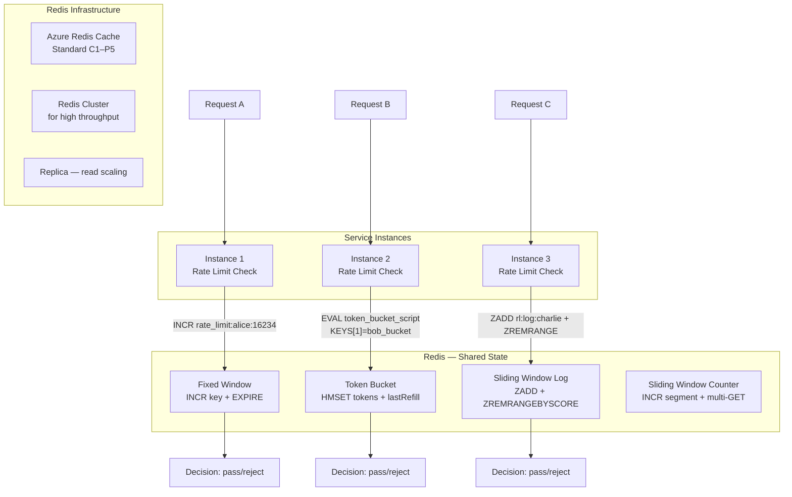
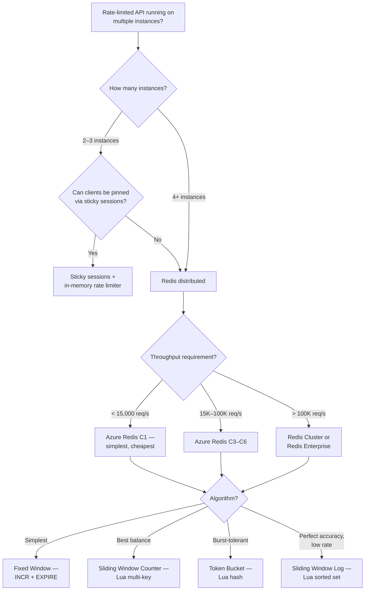

## Navigation

**Domain:** [[7 — System Design & Distributed Systems]] > **Group:** Scalability Patterns
**Previous:** [[7.245 — Rate Limiting — Sliding Window Counter]] | **Next:** [[7.247 — Rate Limiting — ASP.NET Core RateLimiterMiddleware]]

### Prerequisites

- [[7.241 — Rate Limiting — Token Bucket Algorithm]] — token bucket maps to Redis hash + Lua; the most common distributed algorithm
- [[7.243 — Rate Limiting — Fixed Window Counter]] — fixed window maps to Redis INCR + TTL; the simplest distributed algorithm
- [[7.247 — Rate Limiting — ASP.NET Core RateLimiterMiddleware]] — the built-in middleware is per-instance; Redis is how you make it distributed

### Where This Fits

Distributed rate limiting with Redis solves the fundamental problem of per-instance rate limiters: when N service instances each enforce a limit of `L`, the aggregate throughput across the fleet is `N × L`, not `L`. Redis provides a single source of truth — a shared counter, hash, or sorted set that all instances atomically read and write — so the rate limit is enforced globally regardless of how many instances are running. A .NET engineer encounters this when they deploy a rate-limited API to 5+ Azure App Service instances and discover that clients can achieve 5× the intended rate by hitting different instances. It becomes necessary as soon as the service runs on more than one instance — typically above ~500 req/s when the team adds a second instance for redundancy. Without it, rate limits are advisory at best and meaningless at worst in a multi-instance deployment.

---

## Core Mental Model

Distributed rate limiting with Redis moves the rate limiter state from per-instance memory to a shared Redis data store. Each request makes a lightweight Redis call — typically a `StringIncrementAsync`, a `ScriptEvaluateAsync` (Lua), or a sorted set operation — that atomically reads and updates the shared state. The invariant is that Redis is the single source of truth: all instances read from and write to the same Redis keys, so the aggregate rate never exceeds the configured limit regardless of instance count. What this trades is a Redis dependency (availability, latency, operational cost) for cross-instance coordination. The recognition trigger is any rate-limited API running on 2+ instances where a client can exceed the intended rate by sending requests to different instances.



### Classification

**Pattern category:** Distributed state management, shared counter, atomic coordination.
**Consistency model:** Redis single-node is strongly consistent for a single key (all operations are serialized). Redis Cluster provides eventual consistency across nodes (slot-level strong consistency for single-key operations).
**Failure mode:** Redis down → rate limiting disabled unless fallback exists.
**When applied:** Any multi-instance deployment with rate limits that must be enforced globally.
**When not applied:** Single-instance deployments (use in-memory, it is faster and simpler), or where Redis is not available (use sticky sessions + in-memory with looser guarantees).

### Key Properties / Guarantees

|Property|Value|Condition|
|---|---|---|
|Global coordination|Yes — all instances share the same state|Redis is reachable|
|Atomicity|Per-request: Lua scripts provide atomic read-modify-write|Single Redis node or single slot in cluster|
|Latency added|0.5–3ms per request (in same region)|Azure Redis Cache in same region|
|Availability|Depends on Redis tier|Standard: 99.9%, Premium: 99.95%|
|Throughput|Up to ~100,000 ops/s per Redis node|Standard C1: ~15,000 ops/s; C6: ~100,000|
|Fallback required|Without fallback, rate limit stops on Redis outage|Must implement degrade-to-instance-local|
|Data loss risk|Key eviction under memory pressure resets counters|Mitigated with maxmemory-policy + TTL|

---

## Deep Mechanics

### How It Works

The distributed rate limiter follows a consistent pattern regardless of algorithm:

1. **Key design.** Choose a Redis key that uniquely identifies the rate limit scope: `rl:{clientId}:{algorithmSpecific}`. The key must be deterministic across all instances. Use Redis `TIME` for the authoritative clock when the key includes a time component.

2. **Atomic operation.** Use a Lua script to perform the read-modify-write atomically. This prevents race conditions: without Lua, two instances could read the same counter simultaneously, both see "under limit," both increment, and the actual count exceeds the limit.

3. **Decision.** The script returns `{allowed: bool, count: long, retryAfter: double}`. If `allowed` is false, the instance rejects the request.

4. **TTL management.** Set a TTL on every rate limit key so Redis automatically reclaims memory when the client becomes inactive. The TTL should be `window × 2` or `window + segmentDuration` as a safety margin.

5. **Fallback.** If the Redis call fails (timeout, connection error, OOM), the instance falls back to a local in-memory rate limiter at a reduced capacity (typically 50–80% of the configured limit).

```csharp
// Core distributed rate limiter abstraction
public interface IDistributedRateLimiter
{
    Task<RateLimitResult> TryConsumeAsync(
        string clientId, CancellationToken ct);
}

public sealed record RateLimitResult(
    bool Allowed,
    long CurrentCount,
    long Limit,
    double RetryAfterSeconds);

// Algorithm-specific implementations register as IDistributedRateLimiter
```

### Redis Data Structures for Each Algorithm

**Fixed Window — Redis STRING with INCR + EXPIRE:**

```
Key:   rl:fixed:{clientId}:{epochSecond}
Op:    INCR key → if result == 1: EXPIRE key {windowSeconds × 2}
Check: result <= limit → allow
Atomicity: INCR is atomic. Race condition on EXPIRE (mitigated: set expiry on first INCR only).
Complexity: O(1). Simplest possible distributed rate limiter.
```

```csharp
// Fixed window — Redis INCR + EXPIRE
public sealed class RedisFixedWindowLimiter : IDistributedRateLimiter
{
    private readonly IDatabase _redis;
    private readonly int _limit;
    private readonly int _windowSeconds;

    public async Task<RateLimitResult> TryConsumeAsync(
        string clientId, CancellationToken ct)
    {
        var now = await _redis.TimeAsync();
        var epochSecond = ((DateTimeOffset)now).ToUnixTimeSeconds();
        var windowKey = epochSecond / _windowSeconds;
        var key = $"rl:fixed:{clientId}:{windowKey}";

        var count = await _redis.StringIncrementAsync(key);

        if (count == 1)
            await _redis.KeyExpireAsync(key, TimeSpan.FromSeconds(_windowSeconds * 2));

        var allowed = count <= _limit;
        return new RateLimitResult(
            allowed, count, _limit,
            allowed ? 0 : _windowSeconds);
    }
}
```

**Token Bucket — Redis HASH with Lua script:**

```
Key:   rl:token:{clientId}
Fields: tokens (double), lastRefill (unix timestamp)
Script:
  1. HMGET key tokens lastRefill
  2. Compute elapsed = now - lastRefill
  3. tokens = min(capacity, tokens + elapsed × refillRate)
  4. If tokens >= 1: tokens -= 1; HMSET key tokens now → return {1, tokens}
  5. Else: return {0, tokens}
Atomicity: Lua script provides atomic read-modify-write.
Complexity: O(1). Most popular distributed rate limiter.
```

```csharp
// Token bucket — Redis HASH + Lua (Table 7.241)
public sealed class RedisTokenBucketLimiter : IDistributedRateLimiter
{
    private readonly IDatabase _redis;
    private readonly int _capacity;
    private readonly double _refillRate;
    private readonly string _scriptHash;

    private const string Script = @"
        local key = KEYS[1]
        local capacity = tonumber(ARGV[1])
        local refillRate = tonumber(ARGV[2])
        local now = tonumber(ARGV[3])

        local bucket = redis.call('HMGET', key, 'tokens', 'lastRefill')
        local tokens = tonumber(bucket[1]) or capacity
        local lastRefill = tonumber(bucket[2]) or now

        local elapsed = math.max(0, now - lastRefill)
        tokens = math.min(capacity, tokens + elapsed * refillRate)

        if tokens >= 1 then
            tokens = tokens - 1
            redis.call('HMSET', key, 'tokens', tokens, 'lastRefill', now)
            redis.call('EXPIRE', key, 86400)
            return {1, tokens}
        else
            redis.call('HMSET', key, 'tokens', tokens, 'lastRefill', lastRefill)
            return {0, tokens}
        end
    ";

    public RedisTokenBucketLimiter(
        IConnectionMultiplexer redis,
        int capacity, double refillRate)
    {
        _redis = redis.GetDatabase();
        _capacity = capacity;
        _refillRate = refillRate;
        _scriptHash = redis.GetServer(
            redis.GetEndPoints().First()).ScriptLoad(Script);
    }

    public async Task<RateLimitResult> TryConsumeAsync(
        string clientId, CancellationToken ct)
    {
        var now = await _redis.TimeAsync();
        var nowUnix = ((DateTimeOffset)now).ToUnixTimeSeconds();
        var key = $"rl:token:{clientId}";

        var result = (int[])await _redis.ScriptEvaluateAsync(
            _scriptHash,
            new RedisKey[] { key },
            new RedisValue[] { _capacity, _refillRate, nowUnix });

        var allowed = result[0] == 1;
        var tokens = result[1];

        return new RateLimitResult(
            allowed, tokens, (long)_capacity,
            allowed ? 0 : 1.0 / _refillRate);
    }
}
```

**Sliding Window Log — Redis SORTED SET with Lua script:**

```
Key:   rl:log:{clientId}
Members: timestamp (score = member = unix timestamp)
Script:
  1. ZREMRANGEBYSCORE key 0 {now - window}  — trim expired
  2. ZCARD key → count
  3. If count >= limit: return {0, count, oldestTimestamp + window - now}
  4. ZADD key now now — add current timestamp
  5. EXPIRE key window × 2
  6. Return {1, count + 1, 0}
Atomicity: Lua script ensures trim + count + add are atomic.
Complexity: O(log N) for ZADD + ZREMRANGEBYSCORE, O(1) for ZCARD. N = number of entries per client.
```

```csharp
// Sliding window log — Redis SORTED SET + Lua (Table 7.244)
public sealed class RedisSlidingWindowLogLimiter : IDistributedRateLimiter
{
    private readonly IDatabase _redis;
    private readonly int _limit;
    private readonly int _windowSeconds;
    private readonly string _scriptHash;

    private const string Script = @"
        local key = KEYS[1]
        local now = tonumber(ARGV[1])
        local window = tonumber(ARGV[2])
        local limit = tonumber(ARGV[3])

        redis.call('ZREMRANGEBYSCORE', key, 0, now - window)
        local count = redis.call('ZCARD', key)

        if count >= limit then
            local oldest = redis.call('ZRANGE', key, 0, 0, 'WITHSCORES')
            local retryAfter = 0
            if #oldest > 0 then
                retryAfter = tonumber(oldest[2]) + window - now
            end
            return {0, count, retryAfter}
        end

        redis.call('ZADD', key, now, now)
        redis.call('EXPIRE', key, window * 2)
        return {1, count + 1, 0}
    ";

    public async Task<RateLimitResult> TryConsumeAsync(
        string clientId, CancellationToken ct)
    {
        var now = await _redis.TimeAsync();
        var nowUnix = ((DateTimeOffset)now).ToUnixTimeSeconds();
        var key = $"rl:log:{clientId}";

        var result = (int[])await _redis.ScriptEvaluateAsync(
            _scriptHash,
            new RedisKey[] { key },
            new RedisValue[] { nowUnix, _windowSeconds, _limit });

        return new RateLimitResult(
            result[0] == 1,
            result[1],
            _limit,
            result[2]);
    }
}
```

**Sliding Window Counter — Redis multi-key STRING with Lua script:**

```
Key pattern: rl:sw:{clientId}:{segmentNumber}
Script:
  1. currentSegment = floor(now / segmentSeconds)
  2. segmentKey = rl:sw:{clientId}:{currentSegment}
  3. INCR segmentKey → currentCount
  4. If first increment: EXPIRE segmentKey window + segmentSeconds
  5. Sum segment keys: for i = 0 to N-1: GET key_{currentSegment - i}
  6. total = sum(completeSegments) + currentSegment × (elapsed % segmentSeconds / segmentSeconds)
  7. If total >= limit: return {0, total}
  8. Return {1, total}
Atomicity: Lua script provides atomicity across multiple keys (on a single Redis node or same cluster slot).
Complexity: O(N) Redis ops inside a single Lua call. N = segments (typically 10).
```

```csharp
// Sliding window counter — Redis multi-key Lua (Table 7.245)
public sealed class RedisSlidingWindowCounterLimiter : IDistributedRateLimiter
{
    private readonly IDatabase _redis;
    private readonly int _limit;
    private readonly int _windowSeconds;
    private readonly int _segmentCount;
    private readonly int _segmentSeconds;

    private const string Script = @"
        local keyPrefix = KEYS[1]
        local now = tonumber(ARGV[1])
        local segmentSeconds = tonumber(ARGV[2])
        local segmentCount = tonumber(ARGV[3])
        local limit = tonumber(ARGV[4])
        local window = tonumber(ARGV[5])

        local currentSegment = math.floor(now / segmentSeconds)
        local segmentKey = keyPrefix .. ':' .. currentSegment
        local segmentFraction = (now % segmentSeconds) / segmentSeconds

        local currentCount = redis.call('INCR', segmentKey)
        if currentCount == 1 then
            redis.call('EXPIRE', segmentKey, window + segmentSeconds)
        end

        local total = 0
        for i = 0, segmentCount - 1 do
            local sk = keyPrefix .. ':' .. (currentSegment - i)
            local val = redis.call('GET', sk)
            if val then
                if i == 0 then
                    total = total + tonumber(val) * segmentFraction
                else
                    total = total + tonumber(val)
                end
            end
        end

        if total >= limit then
            return {0, total}
        end
        return {1, total}
    ";

    public async Task<RateLimitResult> TryConsumeAsync(
        string clientId, CancellationToken ct)
    {
        var now = await _redis.TimeAsync();
        var nowUnix = ((DateTimeOffset)now).ToUnixTimeSeconds();
        var keyPrefix = $"rl:sw:{clientId}";

        var result = (object[])await _redis.ScriptEvaluateAsync(
            Script,
            new RedisKey[] { keyPrefix },
            new RedisValue[] { nowUnix, _segmentSeconds, _segmentCount, _limit, _windowSeconds });

        return new RateLimitResult(
            (int)result[0] == 1,
            0,
            _limit,
            0);
    }
}
```

### Failure Modes

**Redis is down — rate limiting stops.** If Redis is unreachable, every rate limit call either throws or times out. Depending on exception handling, the system either fails-open (all requests pass — no rate limiting) or fails-closed (all requests are rejected). Both are bad. Detection: `StackExchange.Redis.ConnectionMultiplexer` fires `ConnectionFailed` and `ErrorMessage` events. Mitigation: implement a fallback rate limiter that degrades gracefully:

```csharp
// Fallback rate limiter — degrades on Redis failure
public sealed class ResilientRateLimiter : IDistributedRateLimiter
{
    private readonly IDistributedRateLimiter _primary;
    private readonly IDistributedRateLimiter _fallback;
    private readonly ILogger<ResilientRateLimiter> _logger;
    private bool _useFallback;

    public ResilientRateLimiter(
        IDistributedRateLimiter primary,
        IDistributedRateLimiter fallback,
        ILogger<ResilientRateLimiter> logger)
    {
        _primary = primary;
        _fallback = fallback;
        _logger = logger;
    }

    public async Task<RateLimitResult> TryConsumeAsync(
        string clientId, CancellationToken ct)
    {
        if (_useFallback)
            return await _fallback.TryConsumeAsync(clientId, ct);

        try
        {
            return await _primary.TryConsumeAsync(clientId, ct);
        }
        catch (RedisConnectionException ex)
        {
            _logger.LogError(ex,
                "Redis unreachable. Falling back to in-memory rate limiter.");
            _useFallback = true;

            // Re-check Redis periodically
            _ = Task.Run(async () =>
            {
                await Task.Delay(TimeSpan.FromSeconds(30));
                _useFallback = false;
            });

            return await _fallback.TryConsumeAsync(clientId, ct);
        }
    }
}

// In-memory fallback at 50% capacity
builder.Services.AddSingleton<IDistributedRateLimiter>(sp =>
{
    var redis = sp.GetRequiredService<IConnectionMultiplexer>();
    var config = sp.GetRequiredService<IConfiguration>();
    var logger = sp.GetRequiredService<ILogger<ResilientRateLimiter>>();

    var primary = new RedisTokenBucketLimiter(
        redis, capacity: 100, refillRate: 10);
    var fallback = new InMemoryTokenBucketLimiter(
        capacity: 50, refillRate: 5);  // 50% capacity during Redis outage

    return new ResilientRateLimiter(primary, fallback, logger);
});
```

**Clock skew between application instances.** The `Lua` script receives `now` from the application. If two instances have clocks 2 seconds apart, they generate different `now` values, causing window misalignment (fixed window) or incorrect refill (token bucket). Detection: rate limit behavior differs per instance. Fix: always use Redis `TIME` command inside the Lua script, so `now` is determined by Redis, not the application:

```lua
-- Use Redis TIME as the single authoritative clock
local redisTime = redis.call('TIME')
local now = tonumber(redisTime[1])
-- now is guaranteed to be the same value regardless of which instance runs the script
```

**Lua script not loaded on all Redis Cluster nodes.** In a Redis Cluster, `EVALSHA` uses the script hash. If the script was loaded via `SCRIPT LOAD` on one node but the request routes to a different node, the hash is unknown and the call fails. Detection: `StackExchange.Redis` throws `RedisServerException: NOSCRIPT`. Fix: use `EVAL` instead of `EVALSHA` (Redis sends the full script each time — negligible overhead for small scripts), or load the script on all nodes via `SCRIPT LOAD` against each master. `StackExchange.Redis` handles this automatically with `ScriptEvaluateAsync` — it first tries `EVALSHA`, and if `NOSCRIPT` is returned, it falls back to `EVAL`:

```csharp
// StackExchange.Redis handles EVALSHA + EVAL fallback automatically
// Just use ScriptEvaluateAsync — no manual SCRIPT LOAD needed
var result = await _redis.ScriptEvaluateAsync(
    script,  // Full Lua source — library manages EVALSHA/EVAL
    keys, args);
```

**Redis memory exhaustion under key proliferation.** Each unique `clientId` creates a new Redis key (or set of keys). With dynamic client IDs (per-request tokens, unique IPs from DDoS), the number of keys grows rapidly. At 1,000,000 unique IPs × 1 key (fixed window) = 1,000,000 keys in Redis — fine on a Standard C6 (max 256M keys). At 1,000,000 × 10 segment keys (sliding window counter) = 10,000,000 keys — may approach limits depending on configuration. Detection: `INFO KEYSPACE` shows millions of keys. `used_memory` grows. Mitigation: set aggressive TTLs (`window × 2`), use `maxmemory-policy allkeys-lru` as a safety net, and consider key space partitioning (sharding client IDs by hash prefix).

**StackExchange.Redis timeout under high throughput.** At >50,000 rate limit checks per second, a single `ConnectionMultiplexer` may experience thread pool starvation or TCP port exhaustion. Detection: `StackExchange.Redis` timeout exceptions (`Timeout performing INCR`). Fix: increase `syncTimeout` and `connectTimeout`, use `async` exclusively (no blocking `.Wait()` or `.Result`), and consider multiplexing (multiple `ConnectionMultiplexer` instances) or Redis Cluster:

```csharp
// StackExchange.Redis configuration for high-throughput rate limiting
var config = new ConfigurationOptions
{
    EndPoints = { "mycache.redis.cache.windows.net:6380" },
    AbortOnConnectFail = false,
    ConnectTimeout = 5000,
    SyncTimeout = 3000,
    AsyncTimeout = 3000,
    // High-throughput tuning
    ConnectRetry = 3,
    KeepAlive = 60,
    // Use TCP-KeepAlive to detect broken connections
    Ssl = true
};
```

### .NET and Azure Integration

- **`StackExchange.Redis`:** The standard .NET Redis client. Use `IDatabase.StringIncrementAsync`, `IDatabase.ScriptEvaluateAsync`, and `IDatabase.TimeAsync`. All rate limiter operations use `async` — never block.

```csharp
// StackExchange.Redis setup for rate limiting
builder.Services.AddSingleton<IConnectionMultiplexer>(sp =>
{
    var config = sp.GetRequiredService<IConfiguration>();
    var connectionString = config.GetConnectionString("Redis");
    return ConnectionMultiplexer.Connect(ConfigurationOptions.Parse(connectionString));
});

builder.Services.AddSingleton<IDistributedRateLimiter>(sp =>
{
    var redis = sp.GetRequiredService<IConnectionMultiplexer>();
    return new RedisTokenBucketLimiter(redis, capacity: 100, refillRate: 10);
});
```

- **Azure Redis Cache:** Use Standard tier (C1–C6) for production rate limiting. C1 (~15,000 ops/s) is sufficient for most APIs. C6 (~100,000 ops/s) for high-throughput. Premium tier adds data persistence and replication. Always deploy in the same Azure region as the application (latency <1ms).

- **Azure Redis Enterprise:** For throughput >100,000 ops/s with sub-millisecond latency. Enterprise Flash tier (Redis on SSD) for cost-effective high-memory scenarios.

- **`Microsoft.AspNetCore.RateLimiting`:** The built-in middleware does NOT support distributed backends directly. Each instance has its own in-memory rate limiter. To make it distributed, use a custom `RateLimiter` implementation backed by Redis:

```csharp
// Custom distributed RateLimiter for ASP.NET Core middleware
public sealed class DistributedRateLimiterMiddleware : IMiddleware
{
    private readonly IDistributedRateLimiter _limiter;
    private readonly ILogger<DistributedRateLimiterMiddleware> _logger;

    public DistributedRateLimiterMiddleware(
        IDistributedRateLimiter limiter,
        ILogger<DistributedRateLimiterMiddleware> logger)
    {
        _limiter = limiter;
        _logger = logger;
    }

    public async Task InvokeAsync(HttpContext context, RequestDelegate next)
    {
        var clientId = context.Request.Headers["X-Api-Key"]
            .FirstOrDefault() ?? context.Connection.RemoteIpAddress?.ToString() ?? "unknown";

        var result = await _limiter.TryConsumeAsync(clientId, context.RequestAborted);

        context.Response.Headers["X-RateLimit-Limit"] = result.Limit.ToString();
        context.Response.Headers["X-RateLimit-Remaining"] =
            Math.Max(0, result.Limit - result.CurrentCount).ToString();

        if (!result.Allowed)
        {
            context.Response.StatusCode = StatusCodes.Status429TooManyRequests;
            context.Response.Headers["Retry-After"] =
                Math.Ceiling(result.RetryAfterSeconds).ToString("F0");

            await context.Response.WriteAsJsonAsync(new ProblemDetails
            {
                Status = 429,
                Title = "Too Many Requests",
            });

            return;
        }

        await next(context);
    }
}
```

- **Azure Functions:** Use Redis-backed rate limiting for consumption-plan functions (which scale to dozens of instances). The Redis connection persists across invocations via a static `ConnectionMultiplexer`.

- **Azure API Management:** The built-in `rate-limit` policy uses a fixed window counter backed by Azure's internal Redis. For custom algorithms, use a policy expression calling an external Redis-backed API endpoint.

---

## Production Patterns and Implementation

### Primary Implementation

A production-grade distributed rate limiter with algorithm selection, Redis Cluster support, fallback, and monitoring.

```csharp
// Distributed rate limiter with algorithm selection
public enum RateLimitAlgorithm
{
    FixedWindow,
    TokenBucket,
    SlidingWindowLog,
    SlidingWindowCounter
}

public sealed class DistributedRateLimiterFactory
{
    private readonly IConnectionMultiplexer _redis;
    private readonly IConfiguration _config;
    private readonly ILoggerFactory _loggerFactory;

    public DistributedRateLimiterFactory(
        IConnectionMultiplexer redis,
        IConfiguration config,
        ILoggerFactory loggerFactory)
    {
        _redis = redis;
        _config = config;
        _loggerFactory = loggerFactory;
    }

    public IDistributedRateLimiter Create(
        string policyName,
        RateLimitAlgorithm algorithm)
    {
        var section = _config.GetSection($"RateLimiting:{policyName}");
        var limit = section.GetValue<int>("Limit", 100);
        var windowSeconds = section.GetValue<int>("WindowSeconds", 60);

        IDistributedRateLimiter primary = algorithm switch
        {
            RateLimitAlgorithm.FixedWindow => new RedisFixedWindowLimiter(
                _redis, limit, windowSeconds),

            RateLimitAlgorithm.TokenBucket => new RedisTokenBucketLimiter(
                _redis,
                capacity: section.GetValue<int>("Capacity", limit),
                refillRate: (double)limit / windowSeconds),

            RateLimitAlgorithm.SlidingWindowLog => new RedisSlidingWindowLogLimiter(
                _redis, limit, windowSeconds),

            RateLimitAlgorithm.SlidingWindowCounter => new RedisSlidingWindowCounterLimiter(
                _redis, limit, windowSeconds,
                segmentCount: section.GetValue<int>("SegmentsPerWindow", 10)),

            _ => throw new ArgumentOutOfRangeException(nameof(algorithm))
        };

        // Wrap with fallback
        var fallbackLimit = section.GetValue<int>("FallbackLimit", limit / 2);
        var fallback = new InMemoryTokenBucketLimiter(fallbackLimit, (double)fallbackLimit / windowSeconds);
        var logger = _loggerFactory.CreateLogger<ResilientRateLimiter>();

        return new ResilientRateLimiter(primary, fallback, logger);
    }
}

// Usage
var limiter = factory.Create("DefaultApi", RateLimitAlgorithm.SlidingWindowCounter);
var result = await limiter.TryConsumeAsync(clientId, ct);
```

### Configuration and Wiring

```csharp
// Program.cs — complete setup
builder.Services.AddSingleton<IConnectionMultiplexer>(sp =>
{
    var config = sp.GetRequiredService<IConfiguration>();
    return ConnectionMultiplexer.Connect(
        config.GetConnectionString("Redis")!);
});

builder.Services.AddSingleton<DistributedRateLimiterFactory>();
builder.Services.AddSingleton<DistributedRateLimiterMiddleware>();

// Register algorithm-specific limiters as named policies
builder.Services.AddKeyedSingleton<IDistributedRateLimiter>(
    "DefaultApi",
    (sp, _) => sp.GetRequiredService<DistributedRateLimiterFactory>()
        .Create("DefaultApi", RateLimitAlgorithm.SlidingWindowCounter));

builder.Services.AddKeyedSingleton<IDistributedRateLimiter>(
    "StrictLimits",
    (sp, _) => sp.GetRequiredService<DistributedRateLimiterFactory>()
        .Create("StrictLimits", RateLimitAlgorithm.SlidingWindowLog));

builder.Services.AddKeyedSingleton<IDistributedRateLimiter>(
    "BurstTolerant",
    (sp, _) => sp.GetRequiredService<DistributedRateLimiterFactory>()
        .Create("BurstTolerant", RateLimitAlgorithm.TokenBucket));

var app = builder.Build();
app.UseMiddleware<DistributedRateLimiterMiddleware>();
app.MapControllers();
app.Run();

// appsettings.json
// {
//   "ConnectionStrings": {
//     "Redis": "mycache.redis.cache.windows.net:6380,password=...,ssl=True"
//   },
//   "RateLimiting": {
//     "DefaultApi": {
//       "Algorithm": "SlidingWindowCounter",
//       "Limit": 1000,
//       "WindowSeconds": 60,
//       "SegmentsPerWindow": 10,
//       "FallbackLimit": 500
//     },
//     "StrictLimits": {
//       "Algorithm": "SlidingWindowLog",
//       "Limit": 5,
//       "WindowSeconds": 60,
//       "FallbackLimit": 3
//     },
//     "BurstTolerant": {
//       "Algorithm": "TokenBucket",
//       "Capacity": 500,
//       "RefillRate": 100,
//       "WindowSeconds": 60,
//       "FallbackLimit": 250
//     }
//   }
// }
```

### Common Variants

**Read-only status check — no modification.** A separate Lua script that reads the current state without incrementing:

```lua
-- Read-only: get current rate limit state
local key = KEYS[1]
local now = tonumber(ARGV[1])
local window = tonumber(ARGV[2])

-- For token bucket: return {tokens, lastRefill}
local bucket = redis.call('HMGET', key, 'tokens', 'lastRefill')
return {bucket[1] or 0, bucket[2] or 0}
```

**Batch rate limit check — multiple clients in one call.** Useful for webhook delivery or batch processing where you need to check rate limits for multiple clients simultaneously:

```csharp
// Batch rate limit check — one Redis round trip for N clients
public async Task<Dictionary<string, RateLimitResult>>
    TryConsumeBatchAsync(Dictionary<string, int> clientRequests)
{
    var batch = _redis.CreateBatch();
    var tasks = new Dictionary<string, Task<long>>();

    foreach (var (clientId, count) in clientRequests)
    {
        var key = $"rl:fixed:{clientId}:{GetCurrentWindow()}";
        var task = batch.StringIncrementAsync(key, count);
        tasks[clientId] = task;
    }

    batch.Execute();
    await Task.WhenAll(tasks.Values);

    // Then check results
}
```

**Redis Cluster sharding — key design for slot affinity.** Redis Cluster shards keys by hash slot. To keep related keys on the same node (for multi-key Lua scripts), use `{hash tags}` in the key name:

```csharp
// Hash tags ensure all keys for the same client route to the same cluster node
var key = $"rl:{{{clientId}}}:sw:{segmentNumber}";
// The {...} means only "clientId" is hashed — all keys with the same hash tag
// route to the same cluster slot, enabling multi-key Lua scripts
```

**Azure Redis with `StackExchange.Redis` multiplexer pooling.** For very high throughput (>50,000 ops/s), use multiple `ConnectionMultiplexer` instances and round-robin across them:

```csharp
// Multiplexer pool for high throughput
public sealed class RedisMultiplexerPool
{
    private readonly IConnectionMultiplexer[] _multiplexers;
    private int _index;

    public RedisMultiplexerPool(string connectionString, int count)
    {
        _multiplexers = Enumerable.Range(0, count)
            .Select(_ => ConnectionMultiplexer.Connect(
                ConfigurationOptions.Parse(connectionString)))
            .ToArray();
    }

    public IDatabase GetDatabase()
    {
        var index = Interlocked.Increment(ref _index) % _multiplexers.Length;
        return _multiplexers[index].GetDatabase();
    }
}
```

### Real-World .NET Ecosystem Example

GitHub's API rate limiting backend uses Redis-backed token buckets — the most deployed distributed rate limiting architecture in production. Each API token has a Redis hash storing `{tokens, lastRefill}`, updated via a Lua script. GitHub reports handling 10,000+ rate limit checks per second across their Redis cluster with sub-millisecond P99 latency. Stack Exchange uses Redis INCR-based fixed window for per-IP throttling (simplest, most scalable). Microsoft's own Azure API Management rate limiting infrastructure uses an internal Redis cache shared across all gateway instances. The `StackExchange.Redis` library itself is the production choice for all of these — it is the most battle-tested .NET Redis client, used by Azure itself for Redis cache access.

---

## Gotchas and Production Pitfalls

### Redis as Single Point of Failure

**Pitfall:** The rate limiter calls Redis on every request. If Redis is down, every request either throws (fails-closed — all requests rejected) or is silently allowed (fails-open — no rate limiting). Both are catastrophic.

```csharp
// ❌ No fallback — Redis failure = rate limit failure
public async Task<RateLimitResult> TryConsumeAsync(string clientId)
{
    var count = await _redis.StringIncrementAsync(key);  // Throws if Redis is down
    return count <= _limit ? Allow() : Reject();
}
```

**Symptom:** During a Redis outage, either ALL requests fail (site down) or ALL traffic passes (DDoS vulnerability). Exactly what the rate limiter was supposed to prevent.

**Fix:** Implement the fallback pattern — degrade to an in-memory rate limiter at reduced capacity during Redis outages:

```csharp
// ✅ Resilient fallback
try
{
    return await _primary.TryConsumeAsync(clientId, ct);
}
catch (RedisConnectionException)
{
    _logger.LogWarning("Redis unavailable — using degraded rate limiter.");
    return await _fallback.TryConsumeAsync(clientId, ct);
}
```

**Cost of not fixing:** Complete rate limit failure during Redis outage. If the outage is caused by a traffic spike (Redis CPU saturation), the rate limiter fails exactly when it is most needed.

### Clock-Dependent Window Keys Without Redis TIME

**Pitfall:** The application passes `DateTime.UtcNow` to determine the current window or segment. Instances with clocks 500ms apart derive different window keys for the same real-time request — a client hitting both instances effectively has two independent rate limit windows.

```csharp
// ❌ Application clock — differs per instance
var now = DateTimeOffset.UtcNow.ToUnixTimeSeconds();
var windowKey = now / _windowSeconds;  // Instance A: 16234, Instance B: 16235
var key = $"rl:fixed:{clientId}:{windowKey}";  // Different keys!
```

**Symptom:** The distributed rate limiter does not actually enforce a global rate across instances. Rate limit tests pass in single-instance staging and fail in multi-instance production.

**Fix:** Use Redis `TIME` as the authoritative clock inside the Lua script, or use `IDatabase.TimeAsync()` before computing the window key:

```csharp
// ✅ Redis TIME — same clock for all instances
var redisTime = await _redis.TimeAsync();
var now = ((DateTimeOffset)redisTime).ToUnixTimeSeconds();
var windowKey = now / _windowSeconds;
```

**Cost of not fixing:** The distributed rate limiter is not actually distributed — it is N independent per-instance limiters that happen to share a Redis server. Any client that hits multiple instances bypasses the limit.

### Lua Script Not Handling Redis Cluster `SCRIPT LOAD`

**Pitfall:** Calling `SCRIPT LOAD` on one cluster node and then `EVALSHA` on another node returns `NOSCRIPT`. The `EVALSHA` call fails, and the rate limit check throws.

```csharp
// ❌ EVALSHA may fail if script was loaded on a different cluster node
var hash = await _redis.ScriptLoadAsync(script);
await _redis.ScriptEvaluateAsync(hash, keys, args);
// If this request routes to a different cluster node, NOSCRIPT error occurs
```

**Symptom:** Intermittent `RedisServerException: NOSCRIPT` errors. Rate limiting fails randomly.

**Fix:** Use `ScriptEvaluateAsync` (not `ScriptEvaluate`) — StackExchange.Redis automatically falls back to `EVAL` if `EVALSHA` fails. Or do nothing — the library handles this:

```csharp
// ✅ ScriptEvaluateAsync handles EVALSHA + EVAL fallback
var result = await _redis.ScriptEvaluateAsync(
    script,  // Pass the full script (library manages EVALSHA/EVAL)
    keys, args);
```

**Cost of not fixing:** Intermittent rate limiter failures. The team may incorrectly blame Redis Cluster or the network instead of the library usage pattern.

### TTL Too Short — Keys Expire Mid-Window

**Pitfall:** Setting TTL equal to the window duration. If the window is 60 seconds and TTL is 60 seconds, a key created at T₀+1s expires at T₀+61s, but the window for that key ends at T₀+60s. The key exists for only 59 of its 60 relevant seconds — the last second is unprotected.

```csharp
// ❌ TTL = window — key expires before the window is complete
await _redis.KeyExpireAsync(key, TimeSpan.FromSeconds(_windowSeconds));
```

**Symptom:** The last request of each window is never counted. The effective limit is `configured_limit + 1` per window. Over many windows, the drift accumulates.

**Fix:** Set TTL to `window × 2` (or `window + segmentDuration` for sliding window counter) to ensure the key outlives its window:

```csharp
// ✅ TTL = window × 2 — safety margin
await _redis.KeyExpireAsync(
    key, TimeSpan.FromSeconds(_windowSeconds * 2));
```

**Cost of not fixing:** Gradual rate limit erosion. The effective limit creeps up by 1 per window. Over an hour of 60-second windows, the limit drifts by 60 requests.

### Synchronous Blocking on Redis Calls

**Pitfall:** Calling `.Result` or `.Wait()` on Redis async methods. Rate limiter calls are on the hot path — blocking a thread under high concurrency causes thread pool starvation and `StackExchange.Redis` timeouts.

```csharp
// ❌ Synchronous blocking — thread pool starvation
var count = _redis.StringIncrementAsync(key).Result;  // BAD
```

**Symptom:** `StackExchange.Redis` timeout exceptions under load. The error message shows "Timeout performing INCR" with a high `totalSecondsDesdeUltimaLectura`.

**Fix:** Always `await` async Redis calls. Never use `.Result` or `.Wait()`:

```csharp
// ✅ Async all the way
var count = await _redis.StringIncrementAsync(key);
```

**Cost of not fixing:** Under high throughput (>1,000 req/s), thread pool starvation causes cascading timeouts. The rate limiter fails exactly under load.

---

## Tradeoffs and Decision Framework

### Tradeoff Matrix

| Dimension | Redis Distributed | Per-Instance (in-memory) | Sticky Sessions + In-Memory |
|---|---|---|---|
| Global coordination | Yes — single source of truth | No — N × limit aggregate | Yes — client pinned to instance |
| Latency added | 0.5–3ms per request | 0μs (local) | 0μs (local) |
| Redis dependency | Yes — operational cost | No | No |
| Fallback complexity | Medium (resilient pattern) | None | None |
| Consistency | Strong (per-key atomic) | None (independent counters) | Best-effort (instance stickiness) |
| Scale ceiling | ~100K ops/s per Redis node | ~1M ops/s per instance | ~1M ops/s per instance |
| Operational cost | Azure Redis Cache ($50–500/mo) | $0 | $0 (but sticky routing may need LB config) |

### When to Apply



### When NOT to Apply

- [ ] **Single-instance deployment.** Per-instance in-memory rate limiting is faster, simpler, and has no Redis dependency. Only add Redis when the second instance is deployed.
- [ ] **Sticky sessions are an option.** If the load balancer supports session affinity and clients can be pinned to instances, in-memory rate limiting per instance with sticky routing provides global coordination without Redis.
- [ ] **Redis operational cost is not justified.** Azure Redis Cache Standard C1 costs ~$50/month. For a low-traffic API with 2–3 instances, sticky sessions + in-memory rate limiting may be sufficient.
- [ ] **Sub-millisecond latency requirement (<1ms P99).** Even the fastest Redis in-region adds 0.5–3ms. If the API requires sub-millisecond response time, the rate limit check must be in-memory. Accept per-instance limits or use sticky sessions.
- [ ] **Redis infrastructure is unavailable.** If the team cannot operate Redis (no Azure subscription, no Redis expertise, no budget), use in-memory rate limiting with sticky sessions and accept the looser guarantees.

### Scale Thresholds

- Redis becomes necessary above **2 instances** (per-instance rate limits allow 2× the intended rate)
- Azure Redis Cache C1 (1 GB, ~15,000 ops/s): sufficient for APIs up to ~5,000 req/s
- Azure Redis Cache C6 (12 GB, ~100,000 ops/s): sufficient for APIs up to ~50,000 req/s
- Redis Cluster: necessary above ~100,000 ops/s or when data exceeds 12 GB
- Key count: rate limit keys are small (<100 bytes each). 1M keys ≈ 100 MB. Fine on C1 (1 GB) with room for other data.
- Lua script performance: <0.5ms for token bucket or fixed window; 1–3ms for sliding window counter with 10 GETs; 2–5ms for sliding window log with high cardinality (10,000+ entries per sorted set)

---

## Interview Arsenal

### Question Bank

1. Why is per-instance rate limiting insufficient in a multi-instance deployment?
2. What Redis data structure is used for each rate limiting algorithm?
3. How does a Lua script ensure atomicity in a distributed rate limiter?
4. Why must Redis `TIME` be used instead of the application clock for window key derivation?
5. How do you handle a Redis outage without losing rate limiting entirely?
6. How do you design Redis keys to work with Redis Cluster hash slots?
7. What is the TTL race condition and how do you prevent it in distributed fixed window?
8. How do you estimate Redis capacity requirements for a distributed rate limiter?

### Spoken Answers

**Q: Why is per-instance rate limiting insufficient in a multi-instance deployment?**

> **Average answer:** Each instance has its own counter, so a client can send requests to different instances and get more than the limit.

> **Great answer:** Per-instance rate limiting treats each service instance as an independent rate limiter. If the configured limit is 100 req/s and there are 10 instances, each instance enforces 100 req/s independently. A client that distributes requests across all 10 instances achieves 1,000 req/s — 10× the intended limit. This is the fundamental problem: the aggregate throughput of N independent rate limiters is N × L, not L. The fix is a distributed rate limiter backed by a shared state store — Redis — where a single counter, hash, or sorted set is atomically read and written by all instances. Each request makes a lightweight Redis call that checks and updates the shared state, ensuring the global rate never exceeds L regardless of how many instances are running. The tradeoff is a Redis dependency: each request adds 0.5–3ms of latency, and Redis becomes a single point of failure unless you implement a fallback.

**Q: How does a Lua script ensure atomicity in a distributed rate limiter?**

> **Great answer:** Redis Lua scripts execute atomically — no other Redis commands run while the script is executing. For a token bucket, the script reads the current token count and last refill time from a hash, computes the refill based on elapsed time, checks if a token is available, decrements if so, and writes the updated state back — all as a single atomic unit. Without Lua, two instances could read the hash simultaneously, both see 1 token remaining, both decrement to 0, and both allow their request — resulting in 2 requests consuming the same token. With Lua, the second instance's script sees 0 tokens after the first instance's script completes, and correctly rejects. The script is sent via `EVAL` or `EVALSHA` and executes on the Redis server, not the client. `StackExchange.Redis`'s `ScriptEvaluateAsync` handles the `EVALSHA`/`EVAL` fallback automatically. The performance cost is minimal — a token bucket Lua script executes in ~10–50 microseconds on Redis.

### System Design Interview Trigger

If an interviewer asks you to "design a rate limiter" and says "how does this work across multiple instances?" or "what happens when you scale to 10 instances?", they are testing whether you understand the distributed coordination problem. The candidate who says "I'd use Redis" but cannot explain the Lua script, the fallback pattern, or the clock skew problem has superficial knowledge. A senior candidate walks through the full architecture: Redis key design, Lua atomicity, Redis TIME for clock synchronization, fallback to local limiter on Redis failure, and capacity planning. The specific algorithm choice (fixed window vs token bucket vs sliding window) is secondary — the interviewer is testing distributed systems knowledge, not algorithm knowledge.

### Comparison Table

| | Redis Distributed | Per-Instance (In-Memory) | Sticky Sessions + In-Memory |
|---|---|---|---|
| Global rate enforcement | Yes | No (N × L aggregate) | Yes (per-client pinning) |
| Latency overhead | 0.5–3ms | 0μs | 0μs |
| Redis cost | $50–500/month | $0 | $0 |
| Failure mode | Redis down → degrade or fail | No single point | Load balancer rebalance → limit resets |
| Operational complexity | Medium (Redis management) | Low | Low |
| Scale ceiling | ~100K req/s per Redis node | ~1M req/s per instance | ~1M req/s per instance (but sticky routing limits LB) |

---

## Architecture Decision Record

**Status:** Accepted

**Context:** The public API serves 50,000 clients across 20 Azure App Service instances with tiered rate limits (Free: 10 req/s, Pro: 100 req/s, Enterprise: 1,000 req/s). Traffic peaks at 30,000 req/s. Clients are mobile apps, web apps, and server-to-server integrations — no client can be assumed to stay on the same instance (no sticky sessions). The team needs globally enforced rate limits with P99 latency <10ms and 99.9% availability. The system already uses Azure Redis Cache for session state.

**Options Considered:**

1. **Per-instance in-memory (`FixWindowRateLimiter`)** — Zero latency, zero Redis cost, but 20 instances × 100 req/s = 2,000 req/s aggregate for Pro tier. A Pro client can achieve 10× the intended rate. Unacceptable.
2. **Distributed Redis with Lua (token bucket)** — Global rate enforcement. Lua script provides atomic token refill + consume. Redis already in the stack (session state). Each request adds ~1ms (Redis in-region). Fallback to in-memory on Redis failure.
3. **Sticky sessions + in-memory** — Requires load balancer change (Application Gateway affinity). Clients with rotating IPs or tokens cannot be pinned. Server-to-server integrations (Enterprise tier) do not support cookies. Not viable.
4. **Azure API Management built-in rate limiting** — No Redis management, but APIM adds ~10ms latency per request and costs per-call. The team wants to avoid APIM for the direct API path.

**Decision:** Distributed Redis with Lua (token bucket for burst-tolerant APIs, sliding window counter for steady-rate APIs), with in-memory fallback at 50% capacity during Redis outages. Because:
- Redis is already in the stack for session state — no new dependency
- Lua scripts provide atomic rate limit checks at ~1ms per request
- The fallback pattern ensures rate limiting continues during Redis degradation
- Token bucket for mobile APIs (burst after idle), sliding window counter for server-to-server APIs (steady rate)

**Consequences:**
- ✅ Global rate enforcement across 20 instances — a Pro client gets exactly 100 req/s regardless of instance count
- ✅ Lua script atomicity — no race conditions even at 30,000 req/s
- ✅ Fallback provides degraded-but-functional rate limiting during Redis outages
- ✅ Reuses existing Azure Redis Cache — no new infrastructure
- ⚠️ Redis is on the hot path — every request makes a Redis call (mitigated: in-region Redis, <1ms P50, 3ms P99)
- ⚠️ Lua scripts must be compatible with Redis Cluster (hash tags for key affinity)
- ⚠️ Fallback capacity (50%) is arbitrary — adjust based on production traffic patterns
- ❌ Token bucket allows bursts — Enterprise clients can accumulate 1,000 tokens and send 1,000 requests in one second, which may overwhelm downstream services (mitigated: sliding window counter for downstream-sensitive APIs)

**Review Trigger:** Revisit if Redis P99 latency exceeds 5ms (scale up Azure Redis tier or move to Redis Enterprise). Revisit if throughput exceeds 100,000 req/s (need Redis Cluster and key design with hash tags). Revisit if any tier requires zero-burst enforcement (switch from token bucket to sliding window counter for that tier).

---

## Self-Check

### Conceptual Questions

1. Why does per-instance rate limiting fail in a multi-instance deployment?
2. What three components does every Redis-based distributed rate limiter need?
3. How does a Lua script prevent race conditions that individual INCR or HMGET cannot?
4. Why must Redis `TIME` be used instead of `DateTime.UtcNow` for window key derivation?
5. What is the fallback pattern when Redis is unavailable?
6. How do hash tags (`{...}`) enable multi-key Lua scripts in Redis Cluster?
7. What TTL should be set on rate limit keys and why?
8. How do you estimate the Redis operation count for a given throughput?
9. Compare distributed Redis rate limiting with per-instance rate limiting on latency, consistency, and operational cost.
10. What happens to rate limit counters during a Redis failover in Azure Redis Cache?

<details>
<summary>Answers</summary>

1. Each instance independently enforces the limit `L`. Across N instances, the aggregate rate is `N × L`, not `L`. A client distributing requests across all instances achieves N× the intended rate.
2. (1) A Redis data structure key (STRING, HASH, or SORTED SET) scoped per client. (2) A Lua script for atomic read-modify-write. (3) A fallback rate limiter for when Redis is unreachable.
3. Redis Lua scripts execute atomically — no other commands interleave. For a token bucket: the script reads tokens, refills, checks, decrements, and writes — all as one unit. Without Lua, two clients could read the same token count, both see a token, both decrement, and both pass. With Lua, the second client's script sees the decremented count from the first.
4. Application clocks drift (NTP skew, VM pause). Two instances with clocks 1 second apart generate different window keys for the same real-time request. The same client hitting both instances gets counted in two different windows, bypassing the limit. Redis `TIME` provides a single authoritative clock visible to all instances.
5. Catch `RedisConnectionException` (or `RedisServerException`, `RedisTimeoutException`) and fall back to an in-memory rate limiter at a reduced capacity (typically 50–80%). Periodically re-check Redis health (every 30 seconds) to resume the primary path.
6. Hash tags `{clientId}` in the key name force all keys with the same hash tag to the same cluster slot. This enables multi-key Lua scripts (e.g., sliding window counter accessing all N segment keys) to run atomically on a single node.
7. `window × 2` (or `window + segmentDuration` for sliding window counter). TTL = window is too short — the key may expire before the window completes, causing the last request(s) to be uncounted. `window × 2` provides a safety margin while still cleaning up inactive clients.
8. Each algorithm has a different Redis operation count per request: Fixed window = 1 INCR + 1 EXPIRE (2 ops). Token bucket = 1 Lua script with 1 HMGET + 1 HMSET + 1 EXPIRE (1 round trip). Sliding window log = 1 Lua with ZREMRANGEBYSCORE + ZCARD + ZADD (1 round trip). Sliding window counter = 1 Lua with N+1 GETs + 1 INCR (1 round trip). Multiply by req/s for total ops/s. Add 20% headroom.
9. Redis distributed: 0.5–3ms latency, strong consistency (per-key atomic), $50–500/month, requires fallback. Per-instance: 0μs latency, no cross-instance consistency, $0, no fallback needed. Each has its place — per-instance is fine for single-instance deployments; Redis is required for multi-instance.
10. Azure Redis Cache Standard tier uses a primary-replica architecture. During failover, the replica becomes the new primary. Rate limit keys that were on the old primary are replicated asynchronously — the last few INCRs before failover may be lost. This means the rate limit counter may reset slightly (a few requests are allowed that should have been rejected). Mitigation: acceptable for most use cases (rate limit reset means slightly more traffic allowed temporarily). For strict limits, use Redis Enterprise with active geo-replication or accept the small window of over-allowance.
</details>

---

### Scenario Challenges

**Scenario 1 — Diagnose the problem.** After scaling from 2 to 10 instances, clients report they can achieve 5× the rate limit. The rate limiter uses an in-memory `TokenBucketRateLimiter` per instance.

<details>
<summary>Diagnosis</summary>

**Root cause:** The rate limiter is per-instance. With 10 instances, a client distributing requests across all instances gets 10× the configured per-instance limit. The previous 2-instance deployment masked the problem (2× was less noticeable).

**Evidence:** Load balancer logs show each client's requests distributed evenly across all 10 instances. Each instance's metrics show the client respecting the per-instance limit, but the aggregate across instances is 10×.

**Fix:** Replace the per-instance limiter with a distributed Redis-backed limiter. Use `RedisTokenBucketLimiter` with a Lua script for atomic token refill + consume.

**Prevention:** Any rate limiter deployed on 2+ instances must be distributed. Add a pre-deployment checklist item: "Is the rate limiter distributed or per-instance?"
</details>

---

**Scenario 2 — Design decision.** A server-to-server API integration handles 5,000 req/s with strict per-client limits of 100 req/s. The limit must be exact — no boundary spikes, no bursts. The system uses 6 instances. Redis is available.

<details>
<summary>Decision and Reasoning</summary>

**Choice:** Distributed sliding window counter via Redis Lua. The sliding window counter provides ~95% accuracy with O(10) segment keys per client. No boundary spikes (unlike fixed window), no bursts (unlike token bucket). The 5% estimation overestimate means effective limit is ~95 req/s instead of 100 — acceptable.

**Implementation:**
```csharp
var limiter = new RedisSlidingWindowCounterLimiter(
    redis, limit: 100, windowSeconds: 60, segmentCount: 10);
```

**Why not alternatives:** Token bucket allows bursts (100-request burst after idle — violates strict limit). Fixed window has boundary spikes (200 req/s at boundary — violates strict limit). Sliding window log is O(6,000) memory per client at 100 req/s — unnecessary for this throughput.
</details>

---

**Scenario 3 — Failure mode.** Rate limit checks start timing out at peak traffic (10,000 req/s). `StackExchange.Redis` throws `Timeout performing INCR` with `totalSecondsDesdeUltimaLectura` increasing. The rate limiter's fallback activates intermittently — some requests use the in-memory limiter at 50% capacity, causing false rejections.

<details>
<summary>Investigation and Fix</summary>

**Investigation steps:** (1) Check Redis server CPU — is Redis saturated? (2) Check StackExchange.Redis `syncTimeout` and thread pool metrics. (3) Check if there are blocking `.Result` calls on Redis async methods.

**Confirming evidence:** Redis CPU is at 40% — not saturated. StackExchange.Redis `syncTimeout` is 1000ms (default). The application has a mixture of `await` and `.Result` calls on Redis — the `.Result` calls are blocking ASP.NET Core threads under high concurrency, causing thread pool starvation. The timeout error is from the client side, not Redis.

**Immediate mitigation:** Remove all `.Result` and `.Wait()` calls from Redis operations. Change to `await` everywhere.

**Permanent fix:** (1) Enforce async-only Redis access (team coding standard + analyzer). (2) Increase `syncTimeout` to 5000ms as a safety margin. (3) Monitor `ThreadPool` metrics and `pendingOperations` on the multiplexer.

**Post-mortem item:** `StackExchange.Redis` is designed for async-only access. Synchronous blocking nullifies its multiplexing efficiency. Add a Roslyn analyzer to prevent `.Result` on Redis calls.
</details>

---

**Scenario 4 — Scale it.** Current: 2 instances, in-memory fixed window rate limiter, 500 req/s. Need: 20 instances, 100,000 req/s with global rate limits.

<details>
<summary>Scaling Strategy</summary>

**Bottleneck this addresses:** In-memory limiters on 20 instances allow 20× the intended rate. Also, 100,000 req/s will saturate a single Redis node.

**How it helps:** (1) Replace in-memory with distributed Redis-backed limiter. (2) Use sliding window counter via Lua (one Lua call per request — single round trip). (3) Scale Redis: start with Azure Redis C3 (25,000 ops/s), monitor. At 100,000 req/s, each Lua script is ~10 commands inside Redis — effectively 1M Redis ops/s. Needs Redis Cluster (shard across 3–6 nodes) or Redis Enterprise.

**What it does not solve:** Redis latency under load — ensure Redis is in the same region (1–2ms). Network bandwidth at 100,000 req/s × 1KB per request ≈ 100 MB/s — Azure Standard tier instances handle this.

**Implementation order:** (1) Benchmark Lua script performance on a C3 instance (estimated ~200μs per call). (2) Deploy to 2 instances first — validate global limit. (3) Scale to 20 instances. (4) If C3 CPU > 70%, shard to Redis Cluster with hash tags for per-client key affinity.
</details>

---

**Scenario 5 — Interview simulation.** The interviewer says: "Design a rate limiting system for a large-scale API that handles 200,000 requests per second across 50 instances with per-client rate limits."

<details>
<summary>Model Response</summary>

"At 200K req/s across 50 instances, I need a distributed rate limiter with Redis — but a single Redis instance can't handle 200K Lua scripts per second (each script is ~10 Redis commands internally, so ~2M Redis ops/s). I'd use a Redis Cluster with 6–10 shards.

Key design: hash tags `{clientId}` in the key name ensure all keys for the same client route to the same cluster node, enabling multi-key Lua scripts. I'd use the sliding window counter algorithm — 10 segment keys per client, one Lua call per request. Each Lua script does INCR the current segment, GET the previous 9 segments, sums with weighting — about 11 Redis commands inside the script, which takes ~50–100μs on a modern Redis instance.

The Lua script uses Redis TIME for the authoritative clock, avoiding clock skew across 50 instances. TTL is set to `window × 2` to prevent mid-window expiry.

For the fallback during Redis degradation, each instance maintains an in-memory sliding window counter at 50% of the configured limit. If the Redis call fails (timeout, connection error), the instance logs and falls back to the local limiter.

Redis key cardinality: at 1M active clients × 10 keys each = 10M keys in Redis Cluster. At ~100 bytes per key, that's 1 GB — fine for a 6-node cluster with 6 GB each.

The bottleneck is not Redis CPU but network bandwidth. At 200K req/s with 1KB request size, that's 200 MB/s of network traffic to Redis. Azure D-series instances have 2–4 Gbps networking — sufficient. Redis Cluster spreads the network load across nodes.

One last consideration: at this scale, the cost of Redis (Cluster or Enterprise) vs the value of rate limiting must be justified. If the rate limit is for abuse prevention, it's worth it. If it's just a soft throttle, a probabilistic approach (Bloom filter + per-instance counter) might be more cost-effective."
</details>
