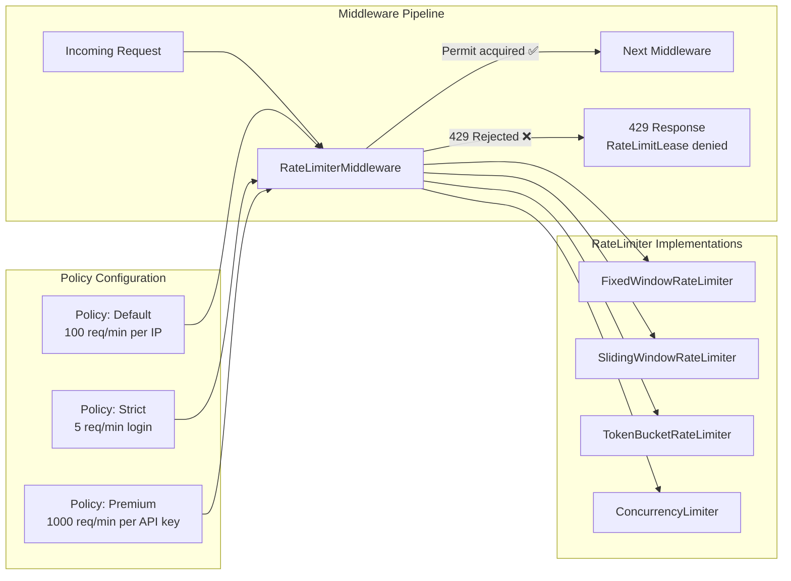
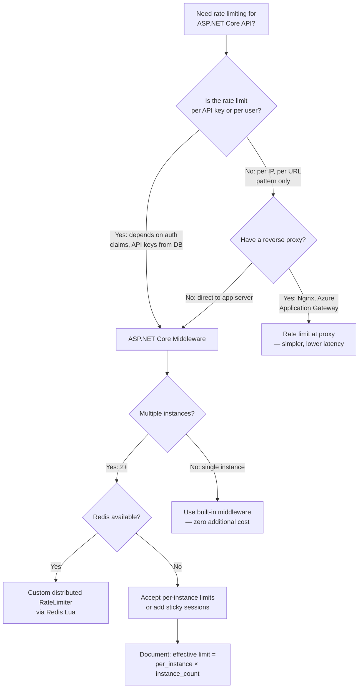

## Navigation

**Domain:** [[7 — System Design & Distributed Systems]] > **Group:** Scalability Patterns
**Previous:** [[7.246 — Rate Limiting — Distributed with Redis]] | **Next:** [[7.248 — Throttling vs Rate Limiting — Differences]]

### Prerequisites

- [[7.241 — Rate Limiting — Token Bucket Algorithm]] — the middleware provides a built-in `TokenBucketRateLimiter` implementation
- [[7.245 — Rate Limiting — Sliding Window Counter]] — the middleware provides a built-in `SlidingWindowRateLimiter` implementation (counter variant)
- [[7.246 — Rate Limiting — Distributed with Redis]] — the built-in middleware is per-instance; Redis + custom `RateLimiter` makes it distributed

### Where This Fits

The `RateLimiterMiddleware` in ASP.NET Core (.NET 7+) is the built-in infrastructure for rate limiting HTTP APIs. It sits in the ASP.NET Core middleware pipeline, intercepts requests before they reach controllers or endpoints, and uses configurable `RateLimiter` implementations to accept or reject requests. A .NET engineer encounters it when they need to add rate limiting to an ASP.NET Core API — it is the primary integration point for all rate limiting algorithms in the .NET ecosystem. It becomes necessary as soon as the API serves external clients and there is any concern about abuse, fair usage, or downstream protection. Without it, the team must build custom middleware, implement their own rate limiter state management, and handle the 429 response format themselves — duplicate effort that the built-in middleware standardizes.

---

## Core Mental Model

The `RateLimiterMiddleware` is a piece of ASP.NET Core middleware that, for each request, acquires a permit from a configured `RateLimiter` implementation. If the permit is acquired, the request proceeds to the next middleware or endpoint. If not, the middleware short-circuits the pipeline and returns HTTP 429 Too Many Requests. The invariant is that every request either passes through to the application or is rejected with a standard 429 response, with no application code needing to check rate limits. What this trades is per-instance-only enforcement (the built-in limiters are in-memory) — cross-instance coordination requires replacing the default in-memory `RateLimiter` with a distributed implementation backed by Redis. The recognition trigger is the need to protect any ASP.NET Core API endpoint from excessive traffic.



### Classification

**Pattern category:** ASP.NET Core middleware, cross-cutting concern, request pipeline.
**Abstraction layer:** Application layer — sits between the transport (Kestrel/IIS) and the application logic (controllers/minimal APIs).
**Scope:** Per-instance rate limiting. Each ASP.NET Core process has its own in-memory `RateLimiter` instances.
**When applied:** Any ASP.NET Core API that needs per-instance rate limiting.
**When not applied:** Single-instance APIs that are not exposed externally, or where a reverse proxy (Nginx, Azure Application Gateway, API Management) handles rate limiting.

### Key Properties / Guarantees

|Property|Value|Condition|
|---|---|---|
|Scope|Per-instance (in-memory)|Built-in limiters — cannot coordinate across instances|
|Latency added|0–10μs (in-memory: Interlocked increment)|No I/O in the hot path for built-in limiters|
|Decision point|Before the endpoint — in the middleware pipeline|Configured via `app.UseRateLimiter()` position|
|Status code on rejection|429 Too Many Requests|Configurable via custom middleware or `OnRejected` callback|
|Response headers|X-RateLimit-Limit, X-RateLimit-Remaining, Retry-After|Set by the middleware (configurable via `OnRejected`)|
|Queue support|Yes — `QueueLimit` in options|Requests can wait in a queue instead of being rejected|
|Partitioning|Yes — by URL, IP, API key, custom policy|Via `RateLimitPartitioner` abstractions|
|Distributed out of the box|No — must implement custom `RateLimiter`|Replace in-memory with Redis-backed implementation|

---

## Deep Mechanics

### How It Works

1. **Registration.** In `Program.cs`, `builder.Services.AddRateLimiter(options => ...)` registers the `RateLimiterMiddleware` and configures rate limit policies. Each policy has a name and a factory that creates a `RateLimiter` instance.

2. **Policy resolution.** When a request arrives, the middleware determines which policy to apply. The policy can be global (applied to all requests), per-endpoint (via `[EnableRateLimiting]` attribute), or dynamic (via a partitioner that extracts the client identity from the request).

3. **Permit acquisition.** The middleware calls `RateLimiter.AttemptAcquire()` synchronously or `RateLimiter.AcquireAsync()` asynchronously. The `RateLimiter` checks the current state (counter, tokens, segments, or queue depth) and returns a `RateLimitLease`. If `lease.IsAcquired` is true, the request proceeds. If false, the middleware returns 429.

4. **Queuing.** If the policy has `QueueLimit > 0`, the middleware can wait for a permit instead of immediately rejecting. Queued requests are processed in FIFO order as permits become available. This adds latency but reduces rejection rate.

5. **Response headers.** On every response (including 429), the middleware sets `X-RateLimit-Limit`, `X-RateLimit-Remaining`, and `Retry-After` headers from the `RateLimitLease.Metadata`.

```csharp
// Program.cs — minimal rate limiting setup
using System.Threading.RateLimiting;

var builder = WebApplication.CreateBuilder(args);

builder.Services.AddControllers();
builder.Services.AddRateLimiter(options =>
{
    // Global policy — applies to all endpoints unless overridden
    options.AddFixedWindowLimiter("Global", config =>
    {
        config.PermitLimit = 100;
        config.Window = TimeSpan.FromSeconds(10);
        config.QueueProcessingOrder = QueueProcessingOrder.OldestFirst;
        config.QueueLimit = 0;  // No queuing — fail fast
    });

    // Rejection callback — customize the 429 response
    options.OnRejected = async (context, cancellationToken) =>
    {
        context.HttpContext.Response.StatusCode =
            StatusCodes.Status429TooManyRequests;
        context.HttpContext.Response.Headers["Retry-After"] = "10";

        if (context.Lease.TryGetMetadata(
            MetadataName.RetryAfter, out var retryAfter))
        {
            context.HttpContext.Response.Headers["Retry-After"] =
                ((int)retryAfter.TotalSeconds).ToString();
        }

        context.HttpContext.Response.ContentType =
            "application/problem+json";

        await context.HttpContext.Response.WriteAsJsonAsync(
            new ProblemDetails
            {
                Status = 429,
                Title = "Too Many Requests",
                Detail = "Rate limit exceeded. Please retry after " +
                    context.HttpContext.Response.Headers["Retry-After"],
            }, cancellationToken);
    };
});

var app = builder.Build();
app.UseRateLimiter();  // Must be called after UseRouting and before MapControllers
app.MapControllers();
app.Run();

// Controller with named policy
[ApiController]
[Route("api/[controller]")]
public class WeatherController : ControllerBase
{
    [HttpGet]
    [EnableRateLimiting("Global")]  // Applies the "Global" policy
    public IActionResult Get() => Ok(new { temperature = 22 });
}

// Minimal API with policy
app.MapGet("/api/status", () => Results.Ok(new { status = "healthy" }))
   .RequireRateLimiting("Global");
```

### Built-in Rate Limiter Implementations

**1. `FixedWindowRateLimiter`** — Simplest. Counter per window, resets at boundary. Allows 2× boundary spike.

```csharp
options.AddFixedWindowLimiter("Fixed", opt =>
{
    opt.PermitLimit = 100;
    opt.Window = TimeSpan.FromSeconds(1);
    opt.QueueProcessingOrder = QueueProcessingOrder.OldestFirst;
    opt.QueueLimit = 0;
});
```

**2. `SlidingWindowRateLimiter`** — Counter variant. Divides window into segments. Best balance.

```csharp
options.AddSlidingWindowLimiter("Sliding", opt =>
{
    opt.PermitLimit = 100;
    opt.Window = TimeSpan.FromSeconds(10);
    opt.SegmentsPerWindow = 10;
    opt.QueueProcessingOrder = QueueProcessingOrder.OldestFirst;
    opt.QueueLimit = 5;  // Allow brief queuing
});
```

**3. `TokenBucketRateLimiter`** — Continuous refill. Allows bursts up to capacity.

```csharp
options.AddTokenBucketLimiter("TokenBucket", opt =>
{
    opt.TokenLimit = 200;
    opt.TokensPerPeriod = 100;
    opt.ReplenishmentPeriod = TimeSpan.FromSeconds(1);
    opt.AutoReplenishment = true;
    opt.QueueProcessingOrder = QueueProcessingOrder.OldestFirst;
    opt.QueueLimit = 0;
});
```

**4. `ConcurrencyLimiter`** — Limits in-flight requests, not rate. Equivalent to `SemaphoreSlim`.

```csharp
options.AddConcurrencyLimiter("Concurrency", opt =>
{
    opt.PermitLimit = 10;  // Max 10 concurrent requests
    opt.QueueProcessingOrder = QueueProcessingOrder.OldestFirst;
    opt.QueueLimit = 5;
});
```

### Partitioning — Per-Client Rate Limits

The `RateLimitPartitioner` extracts a client identity from each request, creating a separate `RateLimiter` instance per client:

```csharp
// Per-IP rate limiting using partitioner
builder.Services.AddRateLimiter(options =>
{
    options.AddFixedWindowLimiter("PerIp", config =>
    {
        config.PermitLimit = 100;
        config.Window = TimeSpan.FromSeconds(1);
        config.QueueLimit = 0;
    });

    // In .NET 8+, use PartitionedRateLimiter for per-client policies
});

// Custom partitioner — per API key
builder.Services.AddSingleton<PartitionedRateLimiter<HttpContext>>(sp =>
{
    return PartitionedRateLimiter.Create<HttpContext, string>(context =>
    {
        var apiKey = context.Request.Headers["X-Api-Key"]
            .FirstOrDefault() ?? "anonymous";

        return RateLimitPartition.GetFixedWindowLimiter(
            partitionKey: apiKey,
            factory: _ => new FixedWindowRateLimiterOptions
            {
                PermitLimit = 100,
                Window = TimeSpan.FromSeconds(1),
                QueueLimit = 0
            });
    });
});
```

### Response Headers and Retry-After

The middleware sets rate limit headers on every response. The headers are extracted from the `RateLimitLease` returned by the `RateLimiter`:

```csharp
options.OnRejected = async (context, ct) =>
{
    // Default headers set by the middleware:
    // X-RateLimit-Limit: 100
    // X-RateLimit-Remaining: 0
    // Retry-After: 10 (seconds)

    // Customize the response body
    context.HttpContext.Response.StatusCode = 429;
    await context.HttpContext.Response.WriteAsJsonAsync(
        new
        {
            code = 429,
            message = "Rate limit exceeded",
            retryAfterSeconds = context.HttpContext.Response.Headers["Retry-After"].FirstOrDefault()
        }, ct);
};
```

### Failure Modes

**Per-instance enforcement in a multi-instance deployment.** The biggest pitfall: all built-in `RateLimiter` implementations are in-memory. On 10 instances, each enforces 100 req/s independently — a client can achieve 1,000 req/s across the fleet. Detection: rate limit violations are reported but the aggregate rate at the downstream is N× the limit. Fix: replace the in-memory `RateLimiter` with a custom implementation backed by Redis:

```csharp
// Custom distributed RateLimiter — wraps Redis token bucket
public sealed class DistributedTokenBucketRateLimiter : RateLimiter
{
    private readonly IDatabase _redis;
    private readonly int _limit;
    private readonly string _scriptHash;

    public override RateLimiterStatistics? GetStatistics() => null;

    protected override RateLimitLease AttemptAcquireCore(int permitCount)
    {
        // Synchronous fallback to in-memory if needed
        throw new NotSupportedException("Use AcquireAsync for distributed limiter");
    }

    protected override async ValueTask<RateLimitLease> AcquireAsyncCore(
        int permitCount, CancellationToken cancellationToken)
    {
        // Redis Lua call — see 7.246 for full implementation
        var result = await _redis.ScriptEvaluateAsync(...);
        return new DistributedLease(result.IsAllowed);
    }
}

// Usage in middleware
builder.Services.AddRateLimiter(options =>
{
    options.AddPolicy("Distributed", context =>
    {
        return new DistributedTokenBucketRateLimiter(redis, 100, 10);
    });
});
```

**Middleware position in the pipeline.** `UseRateLimiter()` must be called after `UseRouting()` and before `MapControllers()`. If placed before routing, the middleware cannot access endpoint metadata (including `[EnableRateLimiting]` attributes). If placed after `MapControllers()`, requests reach controllers before rate limiting is applied — wasting resources:

```csharp
// ❌ Wrong: rate limiting after controllers — resources wasted on rejected requests
app.MapControllers();
app.UseRateLimiter();  // Too late — request already processed

// ✅ Correct: after routing, before controllers
app.UseRouting();
app.UseRateLimiter();
app.MapControllers();
```

**Queue limit masking latency problems.** Setting `QueueLimit > 0` without monitoring causes hidden P99 latency. At 100 req/s with `QueueLimit = 10`, a burst of 110 req causes 10 requests to wait up to 100ms in the queue. The P99 latency increases without any 429 responses — the rate limiter looks healthy, but users experience slow responses. Detection: P99 latency increases without 4xx/5xx errors. Fix: monitor queue depth via `RateLimiterStatistics`:

```csharp
// Monitor queue depth
var limiter = new TokenBucketRateLimiter(
    new TokenBucketRateLimiterOptions
    {
        TokenLimit = 100,
        TokensPerPeriod = 10,
        ReplenishmentPeriod = TimeSpan.FromSeconds(1),
        QueueLimit = 5
    });

// In middleware or health check
var stats = limiter.GetStatistics();
_logger.LogInformation(
    "Queue depth: {CurrentQueuedCount}/{QueueLimit}",
    stats.CurrentQueuedCount, stats.TotalQueuedCount);
```

**`EnableRateLimiting` attribute mismatch with endpoint routing.** If the policy name in `[EnableRateLimiting("Policy")]` does not match a registered policy, the middleware throws at runtime — not at startup. Detection: 500 error when accessing the endpoint, with a message like "No rate limit policy named 'Nonexistent' found." Fix: add a test that exercises every rate-limited endpoint:

```csharp
// ❌ Runtime error — policy name mismatch
[EnableRateLimiting("StrictPolicy")]  // No "StrictPolicy" registered
public IActionResult Login() => Ok();

// ✅ Ensure policy is registered
options.AddFixedWindowLimiter("StrictPolicy", ...);
```

**ConcurrencyLimiter misunderstanding.** The `ConcurrencyLimiter` limits in-flight requests, not rate. If you configure `PermitLimit = 10`, you allow 10 concurrent requests — but with 100ms average response time, that is 100 req/s. Engineers expecting a rate limit of 10 req/s are surprised when the endpoint handles 100 req/s. Detection: traffic is much higher than expected given the configured limit. Fix: use `FixedWindowLimiter` or `TokenBucketLimiter` for rate (req/s), use `ConcurrencyLimiter` only for limiting concurrent connections (e.g., database connection pool protection).

### .NET and Azure Integration

- **`Microsoft.AspNetCore.RateLimiting`:** NuGet package that provides the middleware and built-in limiters. Included in the ASP.NET Core shared framework.

- **`System.Threading.RateLimiting`:** The base library (namespace) that defines `RateLimiter`, `RateLimitLease`, `MetadataName`, and the limiter implementations. This is the abstraction layer — the middleware is built on top of it.

- **`RateLimiterManager`** (.NET 8+): Service that manages named rate limiter policies. Can be injected into controllers or middleware for programmatic access.

- **`PartitionedRateLimiter<HttpContext>`** (.NET 8+): Generic partitioner that creates per-client rate limiter instances automatically. Eliminates the need for manual `ConcurrentDictionary` management.

- **Azure App Service / IIS:** The rate limiter middleware runs in-process. If the app pool recycles, all in-memory rate limiter state is lost. For persistent limits, use the Redis-backed distributed variant.

- **Azure API Management vs middleware:** APIM provides rate limiting at the gateway level (before requests reach the app). The ASP.NET Core middleware provides rate limiting at the application level. Use APIM for global, cross-service rate limits; use middleware for application-specific logic (e.g., per-API-key limits from the application's database).

- **Azure Load Balancer / Application Gateway:** These do NOT provide application-level rate limiting. Use WAF policies for IP-based throttling at the edge, but API-key-based or user-based limits require the ASP.NET Core middleware.

---

## Production Patterns and Implementation

### Primary Implementation

A production-grade rate limiting setup for a multi-tenant ASP.NET Core API with:
- Per-API-key rate limits via partitioner
- Distributed enforcement via Redis token bucket
- Custom 429 response with ProblemDetails
- Monitoring via rate limiter statistics
- Graceful fallback during Redis outages

```csharp
// Program.cs — production rate limiting setup
using System.Threading.RateLimiting;
using Microsoft.AspNetCore.RateLimiting;

var builder = WebApplication.CreateBuilder(args);

// Redis for distributed rate limiting
builder.Services.AddSingleton<IConnectionMultiplexer>(sp =>
    ConnectionMultiplexer.Connect(
        builder.Configuration.GetConnectionString("Redis")!));
builder.Services.AddSingleton<DistributedTokenBucketRateLimiter>();

builder.Services.AddControllers();
builder.Services.AddRateLimiter(options =>
{
    // Global fallback policy — fixed window, per-instance
    options.AddFixedWindowLimiter("Fallback", opt =>
    {
        opt.PermitLimit = 50;
        opt.Window = TimeSpan.FromSeconds(1);
        opt.QueueLimit = 0;
    });

    // Rejected request handler
    options.OnRejected = async (context, ct) =>
    {
        context.HttpContext.Response.StatusCode =
            StatusCodes.Status429TooManyRequests;

        var retryAfter = "1";
        if (context.Lease.TryGetMetadata(
            MetadataName.RetryAfter, out var retryAfterDuration))
        {
            retryAfter = ((int)retryAfterDuration.TotalSeconds).ToString();
        }

        context.HttpContext.Response.Headers["Retry-After"] = retryAfter;
        context.HttpContext.Response.Headers["X-RateLimit-Limit"] =
            context.Lease.TryGetMetadata(
                MetadataName.Limit, out long limit) ? limit.ToString() : "?";
        context.HttpContext.Response.Headers["X-RateLimit-Remaining"] =
            context.Lease.TryGetMetadata(
                MetadataName.Remaining, out long remaining)
                    ? remaining.ToString() : "0";

        await context.HttpContext.Response.WriteAsJsonAsync(
            new ProblemDetails
            {
                Status = 429,
                Title = "Too Many Requests",
                Detail = $"Rate limit exceeded. Try again in {retryAfter} second(s).",
                Extensions = { ["retryAfterSeconds"] = retryAfter }
            }, ct);
    };
});

var app = builder.Build();

app.UseRouting();
app.UseRateLimiter();  // After routing, before endpoints

// Minimal API with custom rate limit policy
app.MapPost("/api/orders", async (Order order, HttpContext context) =>
{
    // Process order
    return Results.Created($"/api/orders/{order.Id}", order);
}).RequireRateLimiting("Fallback");  // Uses the registered fallback policy

app.MapControllers();
app.Run();
```

### Configuration and Wiring

```csharp
// appsettings.json — rate limit configuration
// {
//   "RateLimiting": {
//     "Default": {
//       "Algorithm": "SlidingWindow",
//       "PermitLimit": 100,
//       "WindowSeconds": 10,
//       "SegmentsPerWindow": 10
//     },
//     "Login": {
//       "Algorithm": "FixedWindow",
//       "PermitLimit": 5,
//       "WindowSeconds": 60
//     },
//     "PremiumApi": {
//       "Algorithm": "TokenBucket",
//       "TokenLimit": 1000,
//       "TokensPerPeriod": 100,
//       "ReplenishmentPeriodSeconds": 1
//     }
//   }
// }

// Reading from configuration — conditional policy registration
var rateLimitConfig = builder.Configuration.GetSection("RateLimiting");
var defaultSection = rateLimitConfig.GetSection("Default");

builder.Services.AddRateLimiter(options =>
{
    options.AddSlidingWindowLimiter("Default", opt =>
    {
        opt.PermitLimit = defaultSection.GetValue("PermitLimit", 100);
        opt.Window = TimeSpan.FromSeconds(
            defaultSection.GetValue("WindowSeconds", 10));
        opt.SegmentsPerWindow = defaultSection.GetValue("SegmentsPerWindow", 10);
        opt.QueueLimit = 0;
    });
});
```

### Common Variants

**Rate limiting by endpoint group — different policies per route:**

```csharp
[ApiController]
public class OrdersController : ControllerBase
{
    [HttpGet]
    [EnableRateLimiting("ReadPolicy")]     // 1000 req/min per key
    public IActionResult GetOrders() { ... }

    [HttpPost]
    [EnableRateLimiting("WritePolicy")]    // 100 req/min per key
    public IActionResult CreateOrder() { ... }

    [HttpPost("batch")]
    [DisableRateLimiting]                   // No rate limit — internal
    public IActionResult BatchImport() { ... }
}
```

**Programmatic rate limit check — not via middleware:**

```csharp
// Inject RateLimiterManager for manual rate limit checks
public class OrderProcessingService
{
    private readonly RateLimiterManager _limiterManager;

    public OrderProcessingService(RateLimiterManager limiterManager)
    {
        _limiterManager = limiterManager;
    }

    public async Task<bool> TryProcessOrderAsync(
        string apiKey, Order order)
    {
        var limiter = _limiterManager.GetRateLimiter("WritePolicy");

        using var lease = await limiter.AcquireAsync(
            permitCount: 1, CancellationToken.None);

        if (!lease.IsAcquired)
            return false;  // Rate limited — caller handles retry

        await _orderProcessor.ProcessAsync(order);
        return true;
    }
}
```

**Custom `RateLimiter` — wrapping the ASP.NET Core middleware with distributed state:**

```csharp
// Custom RateLimiter that delegates to a Redis token bucket
public sealed class RedisTokenBucketRateLimiter : RateLimiter
{
    private readonly IDatabase _redis;
    private readonly int _tokenLimit;
    private readonly double _refillRate;
    private readonly RateLimiterStatistics _statistics;

    // Lua script (see 7.246 for full script)

    public RedisTokenBucketRateLimiter(
        IDatabase redis, int tokenLimit, double refillRate)
    {
        _redis = redis;
        _tokenLimit = tokenLimit;
        _refillRate = refillRate;
        _statistics = new RateLimiterStatistics();
    }

    public override RateLimiterStatistics? GetStatistics() => _statistics;

    protected override RateLimitLease AttemptAcquireCore(int permitCount)
    {
        return new RedisLease(false);  // Always async for Redis
    }

    protected override async ValueTask<RateLimitLease> AcquireAsyncCore(
        int permitCount, CancellationToken ct)
    {
        var now = DateTimeOffset.UtcNow.ToUnixTimeSeconds();
        // Redis Lua call — simplified
        var allowed = await CallRedisLuaAsync(permitCount, now);

        if (allowed)
        {
            Interlocked.Increment(ref _statistics.TotalSuccessfulLeases);
            return new RedisLease(true);
        }

        Interlocked.Increment(ref _statistics.TotalFailedLeases);
        return new RedisLease(false);
    }

    private sealed class RedisLease : RateLimitLease
    {
        public override bool IsAcquired { get; }
        public RedisLease(bool acquired) => IsAcquired = acquired;
        public override bool TryGetMetadata(
            string key, out object? metadata)
        {
            metadata = null;
            return false;
        }
    }
}

// Register as a policy
builder.Services.AddRateLimiter(options =>
{
    options.AddPolicy("RedisTokenBucket", context =>
    {
        var redis = context.RequestServices
            .GetRequiredService<IConnectionMultiplexer>()
            .GetDatabase();
        return new RedisTokenBucketRateLimiter(redis, 100, 10);
    });
});
```

**Testing rate limited endpoints — integration tests:**

```csharp
public class RateLimitingTests : IClassFixture<WebApplicationFactory<Program>>
{
    private readonly WebApplicationFactory<Program> _factory;

    [Fact]
    public async Task Get_WhenUnderLimit_Returns200()
    {
        var client = _factory.CreateClient();

        for (int i = 0; i < 100; i++)
        {
            var response = await client.GetAsync("/api/weather");
            Assert.Equal(HttpStatusCode.OK, response.StatusCode);
        }
    }

    [Fact]
    public async Task Get_WhenOverLimit_Returns429()
    {
        var client = _factory.CreateClient();

        // Exhaust the 100 req/s limit
        for (int i = 0; i < 100; i++)
            await client.GetAsync("/api/weather");

        // The 101st request should be rejected
        var response = await client.GetAsync("/api/weather");
        Assert.Equal(HttpStatusCode.TooManyRequests, response.StatusCode);
        Assert.NotNull(response.Headers.RetryAfter);
    }
}
```

### Real-World .NET Ecosystem Example

The ASP.NET Core `RateLimiterMiddleware` was introduced in .NET 7 and is the standard rate limiting infrastructure for all modern ASP.NET Core APIs. Microsoft's reference architecture eShopOnContainers uses it for per-API-key rate limiting in the API gateway. Azure's own Identity platform uses the underlying `System.Threading.RateLimiting` primitives internally. The middleware is designed to be extensible — companies like Stack Overflow and Reddit have built custom `RateLimiter` implementations that plug into it. The `ConcurrencyLimiter` variant is used by SignalR hubs to limit concurrent connections to a hub.

---

## Gotchas and Production Pitfalls

### Per-Instance Enforcement on Multi-Instance Deployments

**Pitfall:** Deploying the middleware to 10 instances without replacing the in-memory `RateLimiter` with a distributed implementation. Each instance independently enforces the limit — a client gets 10× the intended rate.

```csharp
// ❌ Built-in — per-instance only
builder.Services.AddRateLimiter(options =>
{
    options.AddFixedWindowLimiter("Default", opt =>
    {
        opt.PermitLimit = 100;  // 100 req/s per instance
        opt.Window = TimeSpan.FromSeconds(1);
    });
});
// 10 instances → client can achieve 1,000 req/s
```

**Symptom:** Rate limiting passes QA (single instance), fails in production (multiple instances). Clients report inconsistent rate limit behavior.

**Fix:** Use a custom `RateLimiter` backed by Redis, or accept the per-instance behavior and document that the effective limit is `per_instance_limit × instance_count`.

**Cost of not fixing:** Global rate limit is N× the configured value. The downstream sees N× the expected traffic.

### Middleware Position Before Routing

**Pitfall:** `UseRateLimiter()` placed before `UseRouting()`. The middleware cannot access the endpoint metadata (route, `[EnableRateLimiting]` attributes), so no policy is applied — all requests pass through.

```csharp
// ❌ Rate limiting before routing — can't read endpoint metadata
app.UseRateLimiter();     // No endpoint data available
app.UseRouting();
app.MapControllers();    // Rate limiter already passed
```

**Symptom:** Rate limiting is configured but not enforced. All requests pass through. No errors logged.

**Fix:** Place `UseRateLimiter()` after `UseRouting()` and before endpoint mapping:

```csharp
// ✅ Correct order
app.UseRouting();
app.UseRateLimiter();
app.MapControllers();
```

**Cost of not fixing:** Silent failure — the rate limiter is registered but never activates. The API has no protection.

### Queue Limit Creates Hidden Latency

**Pitfall:** Setting `QueueLimit = 100` without understanding that queued requests add latency. At 100 req/s limit with a 100-request queue depth, a burst of 200 requests causes 100 requests to wait up to 1 second in the queue — 1,000ms of added latency.

```csharp
// ❌ Queue limit too high — hides the rate limit signal
config.QueueLimit = 100;  // Requests wait instead of being rejected
```

**Symptom:** P99 latency spikes under load, but no 429 responses. The rate limiter looks healthy (no rejections), but users experience slow responses. The real bottleneck is invisible.

**Fix:** Monitor queue depth. Set `QueueLimit = 0` to fail fast, or add a metric for queue wait time:

```csharp
// ✅ Monitor queue statistics
var stats = limiter.GetStatistics();
_metrics.Gauge("ratelimiter.queue_depth", stats.CurrentQueuedCount);
_metrics.Gauge("ratelimiter.queue_available", stats.TotalQueuedCount - stats.CurrentQueuedCount);
```

**Cost of not fixing:** Mysterious P99 latency. Engineering time spent investigating the database and network when the rate limiter's queue is the cause.

### Policy Name Mismatch at Runtime

**Pitfall:** Typo in the `[EnableRateLimiting]` attribute — the policy name does not match any registered policy. The middleware throws a runtime exception when the endpoint is accessed.

```csharp
// ❌ Typo — "Defualt" instead of "Default"
[EnableRateLimiting("Defualt")]  // Runtime error: no policy named "Defualt"
public IActionResult Get() => Ok();
```

**Symptom:** 500 Internal Server Error when accessing the endpoint. The error message: "No rate limit policy named 'Defualt' found."

**Fix:** Add a startup validation that checks all `[EnableRateLimiting]` attributes against registered policies. Or use a constant for policy names:

```csharp
// ✅ Use constants for policy names
public static class RateLimitPolicies
{
    public const string Default = "Default";
    public const string Login = "Login";
}

[EnableRateLimiting(RateLimitPolicies.Default)]
public IActionResult Get() => Ok();
```

**Cost of not fixing:** 500 errors in production on a previously working endpoint after a deployment with a renamed policy.

### ConcurrencyLimiter Used for Rate Limiting

**Pitfall:** Using `ConcurrencyLimiter` with `PermitLimit = 10` expecting 10 req/s. The actual throughput is `10 / average_response_time_seconds`. At 50ms average response time, throughput is 200 req/s — 20× the expected rate.

```csharp
// ❌ ConcurrencyLimiter does NOT limit rate — it limits in-flight
options.AddConcurrencyLimiter("RateLimit", opt =>
{
    opt.PermitLimit = 10;  // "I want 10 req/s" — WRONG assumption
});
```

**Symptom:** The rate limiter allows 200 req/s instead of 10. The downstream is overwhelmed. The engineer says "I set the limit to 10, why am I seeing 200 req/s?"

**Fix:** Use `FixedWindowLimiter` or `TokenBucketLimiter` for rate limiting by time window:

```csharp
// ✅ FixedWindowLimiter for rate (req/s)
options.AddFixedWindowLimiter("RateLimit", opt =>
{
    opt.PermitLimit = 10;
    opt.Window = TimeSpan.FromSeconds(1);
});

// Use ConcurrencyLimiter ONLY for in-flight limits (connection pool, DB)
options.AddConcurrencyLimiter("Concurrency", opt =>
{
    opt.PermitLimit = 10;  // Max 10 concurrent database queries
});
```

**Cost of not fixing:** The rate limiter does not provide the expected protection. The downstream is at risk.

### OnRejected Callback Not Setting Headers

**Pitfall:** The `OnRejected` callback replaces the response body but does not set `Retry-After` or `X-RateLimit-*` headers. Clients have no information about when to retry.

```csharp
// ❌ Missing headers in OnRejected
options.OnRejected = async (context, ct) =>
{
    await context.HttpContext.Response.WriteAsJsonAsync(
        new { error = "Too many requests" });
    // No Retry-After header — clients retry immediately
};
```

**Symptom:** Retry storms. Clients receive 429 without `Retry-After` and retry immediately, generating 10× the original traffic.

**Fix:** Always set `Retry-After` and rate limit headers in the callback:

```csharp
// ✅ Set headers in OnRejected
options.OnRejected = async (context, ct) =>
{
    context.HttpContext.Response.StatusCode = 429;

    if (context.Lease.TryGetMetadata(
        MetadataName.RetryAfter, out var retryAfter))
    {
        context.HttpContext.Response.Headers["Retry-After"] =
            ((int)retryAfter.TotalSeconds).ToString();
    }
    // ... write response body
};
```

**Cost of not fixing:** Retry storms amplify traffic. The rate limiter's rejection rate increases, but so does the retry traffic — defeating the purpose.

---

## Tradeoffs and Decision Framework

### Tradeoff Matrix

| Dimension | ASP.NET Core Middleware | Azure API Management | Nginx Reverse Proxy |
|---|---|---|---|
| Scope | Application-level (per API key, user) | Gateway-level (per subscription, IP) | Network-level (per IP, URL) |
| Latency added | 0–10μs (in-memory) | ~5–15ms (gateway hop) | <1ms (kernel-level) |
| Policy complexity | Full .NET — any logic | XML/custom policies — limited | Config directives — simple only |
| State management | In-memory or custom Redis | Built-in Azure Redis | Nginx shared memory |
| Distributed coordination | Custom Redis implementation | Built-in for all gateway instances | Per-Nginx-worker (no cross-instance) |
| Integration with .NET auth | Direct — access User, claims, API key | Limited — headers only | Limited — IP + headers only |
| Operational cost | $0 (in-process) | Per-call pricing + gateway cost | $0 (reverse proxy) |

### When to Apply



### When NOT to Apply

- [ ] **Rate limiting at the proxy level is sufficient.** If per-IP or per-URL limiting is all that is needed, Nginx `limit_req` or Azure Application Gateway WAF is simpler and has better performance. The middleware is only needed when the rate limit depends on application-level context (API key from database, user claims, tenant from JWT).
- [ ] **Single instance, no application-level context.** Use the built-in middleware — it is standard, well-tested, and requires no infrastructure. But if the rate limit is purely per-IP and there is a reverse proxy, offload it.
- [ ] **Existing API Management investment.** If the organization already uses Azure API Management for all API traffic, APIM's rate limiting policies are sufficient for most scenarios. Only use the middleware when you need per-endpoint logic tied to application state.
- [ ] **Absolute P99 latency requirement below 1ms.** Even the in-memory middleware adds a small overhead (Interlocked increment, lease allocation). For sub-millisecond API endpoints that must not be impacted, consider offloading rate limiting to the network layer.
- [ ] **Distributed enforcement required, but Redis is not an option.** Without Redis, the built-in middleware cannot coordinate across instances. Use sticky sessions + in-memory middleware (best-effort) or proxy-level rate limiting.

### Scale Thresholds

- Built-in middleware (in-memory): up to ~1,000,000 req/s per instance (Interlocked.Increment + lease allocation)
- Per-API-key partitioner: up to ~100,000 unique keys per instance (each key creates a `RateLimiter` instance)
- Distributed Redis variant: up to ~50,000 req/s per Azure Redis C1 instance (each request = one Redis call)
- Queue limit > 0: adds `queueDepth / refillRate` latency. At 100 req/s with queue limit 10, max queued wait = 100ms
- Policy count: practical limit of ~1,000 registered policies (each is a `RateLimiter` factory)

---

## Interview Arsenal

### Question Bank

1. How do you configure rate limiting in an ASP.NET Core application?
2. What built-in `RateLimiter` implementations does ASP.NET Core provide?
3. What is the difference between `RateLimiterMiddleware` and `[EnableRateLimiting]`?
4. How does the middleware integrate with the ASP.NET Core pipeline — where should it be placed?
5. How do you implement per-API-key rate limiting with the middleware?
6. What headers should the middleware return on a rate-limited response?
7. How do you make the middleware enforce global rate limits across multiple instances?
8. What happens when `QueueLimit > 0` and how do you monitor it?

### Spoken Answers

**Q: How do you configure rate limiting in an ASP.NET Core application?**

> **Average answer:** You call `AddRateLimiter` in Program.cs and `UseRateLimiter` in the pipeline.

> **Great answer:** Configuration happens in two places. First, in `Program.cs` or a startup filter, you call `builder.Services.AddRateLimiter(options => ...)` to register rate limit policies. Each policy has a name and a configuration — for example, `options.AddSlidingWindowLimiter("Default", opt => { opt.PermitLimit = 100; opt.Window = TimeSpan.FromSeconds(10); opt.SegmentsPerWindow = 10; })`. The second part is applying the policy: either globally via `app.UseRateLimiter()` (placed after `UseRouting()` and before `MapControllers()`), or per-endpoint via the `[EnableRateLimiting("PolicyName")]` attribute on controllers or the `.RequireRateLimiting("PolicyName")` extension on minimal API endpoints. The built-in implementations are `FixedWindowRateLimiter`, `SlidingWindowRateLimiter`, `TokenBucketRateLimiter`, and `ConcurrencyLimiter`. Each is in-memory — they enforce the limit within the single process. For multi-instance deployments, I replace them with a custom `RateLimiter` backed by Redis, which I register as a policy using `options.AddPolicy("Distributed", context => new RedisTokenBucketRateLimiter(...))`.

**Q: How do you make the middleware enforce global rate limits across multiple instances?**

> **Great answer:** The built-in `RateLimiter` implementations are in-memory — each instance has its own counter. To enforce a global limit across N instances, you replace the default `RateLimiter` with a custom implementation that uses Redis as the shared state. Create a class that extends `RateLimiter` and overrides `AcquireAsyncCore`. Inside, call a Redis Lua script that atomically checks and updates the rate limit state in a shared Redis hash or sorted set. Register this custom limiter as a policy via `options.AddPolicy(...)`. You also need a fallback: if Redis is unreachable, the `AcquireAsyncCore` should fall back to an in-memory limiter at a reduced capacity. The middleware itself stays the same — only the backing `RateLimiter` changes. The key tradeoff is latency: in-memory is 0–10μs, Redis adds 1–3ms per request. But it guarantees that a client cannot exceed the limit by hitting different instances.

### System Design Interview Trigger

If an interviewer asks you about "rate limiting in an ASP.NET Core application," they are typically testing two things: first, whether you know the built-in middleware exists (many candidates propose custom middleware they would write, unaware of the built-in infrastructure); second, whether you understand the per-instance limitation and can articulate how to extend it for distributed deployments. A strong candidate says "I'd use the built-in `RateLimiterMiddleware` with `AddSlidingWindowLimiter` for single-instance, and replace the backing `RateLimiter` with a Redis-backed implementation for multi-instance — using `AddPolicy` to register the custom limiter." The interviewer may then probe the Redis Lua script details (see 7.246) or the middleware pipeline order.

### Comparison Table

| | Built-in Middleware | Custom Middleware | Reverse Proxy (Nginx/APIM) |
|---|---|---|---|
| Setup effort | 5-line config in Program.cs | Full implementation | Config file changes |
| Application context | Full access (User, claims, DB) | Full access | IP/headers only |
| Latency | 0–10μs | Variable | <1ms (Nginx), 5–15ms (APIM) |
| Distributed | Custom Redis backup needed | Full control | Built-in (APIM), per-worker (Nginx) |
| Maintainability | Microsoft-supported | Team-owned | Ops-owned |

---

## Architecture Decision Record

**Status:** Accepted

**Context:** A .NET 8 e-commerce API runs on 8 Azure App Service instances. The API enforces tenant-specific rate limits (Free: 100 req/min, Pro: 1,000 req/min, Enterprise: 10,000 req/min) using tenant IDs from JWT tokens. Traffic peaks at 20,000 req/s. The team needs a rate limiting solution that integrates with ASP.NET Core's middleware pipeline, supports per-tenant policies derived from authentication claims, and coordinates across all 8 instances. Azure API Management is not in the architecture — the API is accessed directly through Azure Front Door.

**Options Considered:**

1. **ASP.NET Core middleware with Redis-backed custom `RateLimiter`** — Full integration with auth pipeline. Per-tenant policies via `PartitionedRateLimiter`. Redis ensures cross-instance coordination. Familiar to the .NET team.
2. **Azure API Management** — Built-in rate limiting, but adds ~10ms latency per request, costs per-call, and requires inserting APIM into the architecture. The team has no APIM expertise.
3. **Nginx reverse proxy** — Per-IP rate limiting only. Cannot extract tenant ID from JWT. Not viable for per-tenant limits.
4. **Custom middleware (no built-in)** — Duplicates existing infrastructure. Higher maintenance burden.

**Decision:** ASP.NET Core middleware with Redis-backed custom `RateLimiter` (option 1), because:
- Per-tenant limits derived from JWT claims are straightforward with `PartitionedRateLimiter<HttpContext>`
- The team already uses .NET and Azure Redis — no new technology
- The built-in middleware provides standard 429 responses, headers, and queue management — zero code for those features
- Custom `RateLimiter` backed by Redis Lua provides cross-instance coordination with ~1ms added latency

**Specific setup:**
- `AddSlidingWindowLimiter` for the in-memory fallback policy
- `AddPolicy` to register a custom `RedisTokenBucketRateLimiter` as the primary distributed policy
- `PartitionedRateLimiter.Create<HttpContext, string>` to extract tenant ID from the JWT
- Fallback: if Redis is unreachable, degrade to the in-memory fallback at 50% capacity

**Consequences:**
- ✅ Per-tenant limits enforced globally across 8 instances — tenant cannot exceed limit by hitting different instances
- ✅ Full access to JWT claims for tenant identification — no header parsing needed
- ✅ Built-in standard 429 responses with proper headers
- ✅ The .NET team can maintain and extend the custom `RateLimiter` — no dependency on other teams
- ⚠️ Redis is on the hot path — ~1ms per request (mitigated: in-region Azure Redis, P99 <3ms)
- ⚠️ Custom `RateLimiter` must be tested thoroughly — edge cases in lease disposal, concurrency, and Redis failures
- ⚠️ Fallback at 50% capacity during Redis outage may cause false rate limit hits for Enterprise tenants

**Review Trigger:** Revisit if Redis P99 latency exceeds 5ms (upgrade Azure Redis tier or evaluate Redis Enterprise). Revisit if the API adopts Azure API Management (standardize on APIM policies, remove custom `RateLimiter`). Revisit if the team grows and the custom `RateLimiter` maintenance becomes a burden.

---

## Self-Check

### Conceptual Questions

1. What four built-in `RateLimiter` implementations does ASP.NET Core provide?
2. Where in the middleware pipeline must `UseRateLimiter()` be placed?
3. How do you apply different rate limit policies to different endpoints?
4. What is the difference between `AddFixedWindowLimiter` and `AddSlidingWindowLimiter`?
5. How do the `X-RateLimit-*` headers get set by the middleware?
6. How do you implement a per-API-key rate limit using the middleware?
7. How do you extend the middleware to coordinate across multiple instances?
8. What is the `PartitionedRateLimiter<HttpContext>` and when would you use it?
9. What happens if `QueueLimit > 0` and the queue is full?
10. How do you test a rate-limited endpoint in an integration test?

<details>
<summary>Answers</summary>

1. `FixedWindowRateLimiter` (counter per window, resets at boundary), `SlidingWindowRateLimiter` (counter variant, divides window into segments), `TokenBucketRateLimiter` (continuous refill, allows bursts), `ConcurrencyLimiter` (limits in-flight requests, not rate).
2. After `UseRouting()` and before endpoint middleware (`MapControllers()`, `MapGet()`, etc.). If placed before routing, the middleware cannot access endpoint metadata for per-policy application. If placed after endpoints, requests reach controllers before rate limiting.
3. Three ways: (1) `[EnableRateLimiting("PolicyName")]` attribute on controllers or actions. (2) `.RequireRateLimiting("PolicyName")` on minimal API routes. (3) `[DisableRateLimiting]` to exclude specific endpoints from a global policy.
4. `AddFixedWindowLimiter`: N counters per window (N = segments). Counter resets at window boundary — 2× boundary spike. `AddSlidingWindowLimiter`: divides window into segments, estimates sliding window count by weighting the current segment. No boundary spike. Memory: fixed = 2 ints, sliding = N ints.
5. The middleware reads metadata from the `RateLimitLease` returned by the limiter. The lease exposes `TryGetMetadata(MetadataName.Limit, out ...)`, `TryGetMetadata(MetadataName.Remaining, out ...)`, and `TryGetMetadata(MetadataName.RetryAfter, out ...)`. The middleware maps these to headers on the response.
6. Use `PartitionedRateLimiter.Create<HttpContext, string>()` with a partition key extracted from `X-Api-Key` header. Each unique API key gets its own `RateLimiter` instance. Example: `RateLimitPartition.GetTokenBucketLimiter(apiKey, _ => new TokenBucketRateLimiterOptions { ... })`.
7. Create a custom class that extends `RateLimiter` and overrides `AcquireAsyncCore`. Inside, call a Redis Lua script that atomically checks and updates shared rate limit state (token bucket hash, sliding window keys, etc.). Register the custom limiter via `options.AddPolicy("Distributed", context => new MyRedisLimiter(...))`.
8. A factory that creates a `RateLimiter` instance per partition key. It allows the middleware to have per-client rate limiters without managing a `ConcurrentDictionary` manually. Introduced in .NET 8. Use when you need separate rate limiters per API key, IP, user ID, or tenant.
9. If the queue is full, `AcquireAsync` returns a rejected lease immediately (429). While the queue has space, the request waits for a permit. The wait time is unbounded — depends on how quickly permits are released. Monitor `QueueStatistics.CurrentQueuedCount` to detect queue buildup.
10. Use `WebApplicationFactory<Program>` to create a test server. Send requests to the endpoint. Verify that requests under the limit return 200, and requests over the limit return 429 with `Retry-After` header. Test with a single instance first (built-in middleware is per-instance). For distributed tests, mock the Redis layer or use a test Redis container.
</details>

---

### Scenario Challenges

**Scenario 1 — Diagnose the problem.** A team deploys an ASP.NET Core API with `AddFixedWindowLimiter` configured at 100 req/s to 5 Azure App Service instances. They discover that during peak traffic, the downstream database receives 500 req/s — 5× the configured limit.

<details>
<summary>Diagnosis</summary>

**Root cause:** The built-in `FixedWindowRateLimiter` is per-instance. Each of the 5 instances independently allows 100 req/s. The aggregate rate is 5 × 100 = 500 req/s. The middleware provides no cross-instance coordination.

**Evidence:** Each instance's metrics show exactly 100 req/s being processed — the middleware is working correctly per instance. But the database logs show 500 req/s aggregate.

**Fix:** Replace the built-in `FixedWindowRateLimiter` with a custom `RateLimiter` backed by Redis. Use a Redis Lua script for atomic fixed window counter across all instances. Register it via `options.AddPolicy("Distributed", context => new RedisFixedWindowLimiter(...))`.

**Prevention:** Before deploying to multiple instances, always ask: "Is this rate limiter per-instance or distributed?" Document the per-instance limitation in the team's runbook.
</details>

---

**Scenario 2 — Design decision.** A team needs to rate limit a login endpoint to 5 attempts per minute per IP. They plan to use `AddFixedWindowLimiter` with `PermitLimit = 5` and `Window = 60 seconds`. Is this the right choice?

<details>
<summary>Decision and Reasoning</summary>

**Choice:** Do NOT use `FixedWindowLimiter`. The boundary spike allows 10 attempts at the minute boundary (5 at :59s, 5 at :00s). For a login endpoint, this is a security gap.

Use `SlidingWindowLimiter` with `PermitLimit = 5`, `Window = 60 s`, and `SegmentsPerWindow = 12` (5-second segments). The estimation error is `5/12 ≈ 0.4` — at worst, the limiter allows 5.4 requests, which rounds to 5. No boundary spike.

**Implementation:**
```csharp
options.AddSlidingWindowLimiter("Login", opt =>
{
    opt.PermitLimit = 5;
    opt.Window = TimeSpan.FromSeconds(60);
    opt.SegmentsPerWindow = 12;
    opt.QueueLimit = 0;
});
```

**Why not alternatives:** Token bucket allows bursts — after 60s idle, 5 tokens accumulate, and an attacker can send 5 attempts immediately. Fixed window allows 10 at boundary. Only sliding window or sliding window log provide the required behavior.
</details>

---

**Scenario 3 — Failure mode.** After a deployment, all API requests return 429 immediately. The `AddRateLimiter` configuration was not changed. The middleware is configured with `AddFixedWindowLimiter("Default", opt => { PermitLimit = 100; Window = TimeSpan.FromSeconds(1); QueueLimit = 0; })`.

<details>
<summary>Investigation and Fix</summary>

**Investigation steps:** (1) Check if `UseRateLimiter` is placed correctly in the pipeline. (2) Check if a global `[EnableRateLimiting]` attribute was added to a base controller or startup. (3) Check the `OnRejected` callback — does it accidentally reject all requests? (4) Check for middleware order issues — is rate limiting applied before auth?

**Confirming evidence:** A new base controller class was added with `[EnableRateLimiting("Default")]`, but it was applied to ALL controllers. All endpoints are rate-limited, and the limit (100 req/s) is exhausted by the first 100 requests globally. The team added the attribute to the wrong controller — they intended it for one endpoint, not the entire API.

**Immediate mitigation:** Remove the `[EnableRateLimiting]` attribute from the base controller.

**Permanent fix:** Use per-action `[EnableRateLimiting]` instead of per-controller. Rate limit only the specific endpoints that need protection. Add a startup test that verifies only intended endpoints have rate limits.

**Post-mortem item:** `[EnableRateLimiting]` at the controller level applies to ALL actions in that controller and inherited controllers. This is easy to miss. Document this behavior in the team's coding standards.
</details>

---

**Scenario 4 — Scale it.** Current: 1 instance, built-in `SlidingWindowRateLimiter` with `PermitLimit = 100`, P99 latency = 5ms. Need: 10 instances, 1,000 req/s with global rate limit of 100 req/s.

<details>
<summary>Scaling Strategy</summary>

**Bottleneck this addresses:** 10 instances with built-in middleware allow 1,000 req/s aggregate. The downstream (database, third-party API) expects at most 100 req/s.

**How it helps:** Replace the built-in `SlidingWindowRateLimiter` with a custom Redis-backed `SlidingWindowRateLimiter`. The Redis Lua script uses a shared sorted set to track timestamps across all instances — the same algorithm but with Redis as the state store. The middleware configuration stays the same; only the backing limiter changes.

**What it does not solve:** Redis latency adds 1–2ms per request — the P99 goes from 5ms to ~7ms. For APIs with sub-10ms SLO, this is acceptable. For sub-5ms SLO, consider Redis Enterprise or accept per-instance limits.

**Implementation order:** (1) Implement `RedisTokenBucketRateLimiter` (simpler than sliding window counter for distributed). (2) Register via `options.AddPolicy("GlobalDistributed", ...)`. (3) Apply `[EnableRateLimiting("GlobalDistributed")]` to the controller. (4) Keep the in-memory `SlidingWindowRateLimiter` as fallback at 50% capacity.
</details>

---

**Scenario 5 — Interview simulation.** The interviewer says: "Walk me through how you would set up rate limiting for a new ASP.NET Core API that will run on 20 instances and needs per-API-key limits."

<details>
<summary>Model Response</summary>

"I'd start with the built-in `RateLimiterMiddleware` for the middleware pipeline — no need to reinvent the 429 response handling, header management, and policy infrastructure. The middleware gives us `X-RateLimit-Limit`, `X-RateLimit-Remaining`, and `Retry-After` headers on every response for free.

For the algorithm, I'd choose the sliding window counter (`AddSlidingWindowLimiter`) as the base — it eliminates boundary spikes and uses O(segments) memory per client. At 10 segments, the estimation error is ~10%, which is acceptable for most API rate limits.

Since we have 20 instances, the built-in in-memory limiter won't work — each instance would independently enforce the limit, giving clients 20× the intended rate. So I'd create a custom `RateLimiter` subclass backed by Redis. The Redis implementation uses a Lua script with a hash storing the sliding window segment counters. The script atomically increments the current segment and reads the previous N-1 segments — all in one round trip.

I'd register this custom limiter as a policy using `options.AddPolicy("PerApiKey", context => new RedisSlidingWindowLimiter(...))`. Then apply it to controllers using `[EnableRateLimiting("PerApiKey")]`.

For per-API-key partitioning, I'd use `PartitionedRateLimiter.Create<HttpContext, string>()` with the partition key extracted from the `X-Api-Key` header. Each API key gets its own Redis-backed limiter instance.

The fallback strategy: if Redis is unreachable, the custom limiter degrades to an in-memory `SlidingWindowRateLimiter` at 50% of the configured capacity. The middleware wraps the custom limiter with try/catch — on Redis failure, it logs a warning and uses the fallback.

One detail: I use `ConnectionMultiplexer.GetDatabase()` as a singleton — never create a new connection per request. And all Redis calls are async — never `.Result` or `.Wait()`.

For testing, I'd use `WebApplicationFactory<Program>` and verify that the same API key hitting multiple simulated instances is correctly limited globally."
</details>
