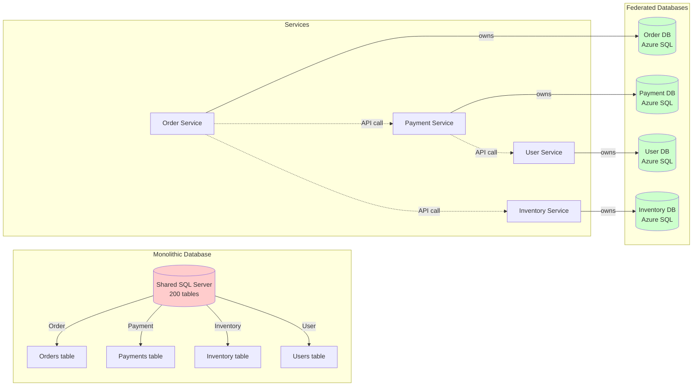
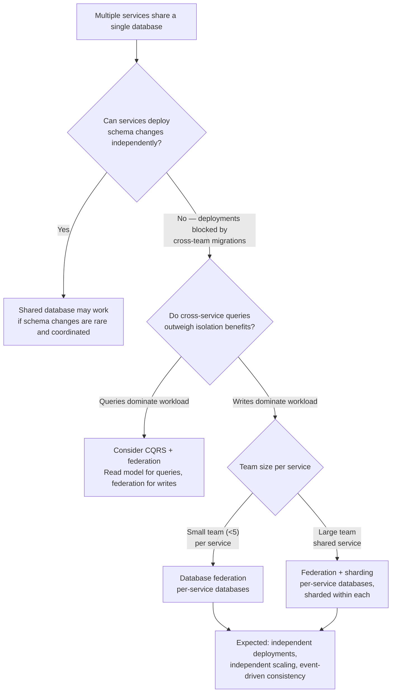

## Navigation

**Domain:** [[7 — System Design & Distributed Systems]] > **Group:** Scalability Patterns
**Previous:** [[7.249 — Bulkhead Pattern — Resource Isolation]] | **Next:** [[7.251 — CQRS for Scalability — Read-Write Split]]

### Prerequisites

- [[7.222 — Database Sharding — Overview]] — federation and sharding are both partitioning strategies; sharding splits rows horizontally, federation splits by business function
- [[7.207 — Stateless Services — Design Principles]] — federation enables stateless services by giving each service its own data store, eliminating shared-database contention
- [[7.238 — Backpressure — Detection and Handling]] — federated databases introduce async communication between services; backpressure prevents downstream service overload when consuming cross-service events

### Where This Fits

Database federation (functional partitioning, database-per-service) splits a single monolithic database into multiple databases, each owned by one bounded context or service. Instead of one shared SQL Server with 200 tables for the entire application, the Order service has its own order database, the Payment service has its own payment database, and the Inventory service has its own inventory database. A .NET engineer encounters it when a shared database becomes a deployment coupling point (any schema change requires coordinated releases across teams), a performance bottleneck (a query in one domain's table locks rows needed by another), or a scale constraint (one database cannot be scaled independently per workload). It becomes necessary above ~5 services sharing a single database, or when any team's deployment requires a coordinated database migration with another team.

---

---

## Core Mental Model

Database federation partitions a system's data by business domain so that each domain's data is stored, accessed, and evolved independently. The invariant is that one bounded context never accesses another context's database directly — it goes through the owning service's API. What this trades is data consistency: a join across two federated databases is impossible (no cross-database FK constraint), so the system must accept eventual consistency or implement distributed transactions (sagas). The recognition trigger is the point where a shared database causes deployment coupling — team A cannot deploy because team B's migration has a lock on a table both teams use.



### Classification

**Pattern category:** Data architecture pattern, decomposition strategy, microservices enabler.
**Abstraction layer:** Data layer — operates at the database and service boundary level.
**Scope:** Whole-organization data architecture. Federation determines which service owns which data and how data flows between services.
**When applied:** Shared database causes coupling (teams cannot deploy independently), performance contention (one query type blocks another), or scale asymmetry (one domain needs 10x the throughput of another).
**When not applied:** Small teams (< 5 engineers) working on a single-domain application, or any system where strong consistency across domains is a hard requirement (finance reconciliation, inventory atomicity).

### Key Properties / Guarantees

|Property|Value|Condition|
|---|---|---|
|Data isolation |Each service owns its database; no direct cross-service queries |All cross-service data access goes through the owning service&#x27;s API|
|Deployment independence |Any service can deploy its schema without coordinating with other teams |No shared tables, no shared migrations, no foreign keys across databases|
|Consistency model |Eventual consistency across services |No distributed transactions; data synchronization via events or sagas|
|Join capability |None across databases — joins are pushed to application layer |Application must call multiple services (N+1) or use denormalized/cached views|
|Storage autonomy |Each database can be independently scaled, backed up, and provisioned |Separate Azure SQL databases, potentially different tiers or regions per service|
|Technology choice |Each service can use a different database technology |One service may use SQL Server, another Cosmos DB, another PostgreSQL|
|Query latency |Higher for cross-service reads (HTTP call instead of SQL JOIN) |Depends on service API latency vs database query latency; typically 2–10x slower|

---

---

## Deep Mechanics

### How It Works

Database federation is a decomposition process followed by a runtime coordination pattern. The decomposition happens once; the coordination repeats for every cross-service data flow.

**Decomposition steps:**

1. **Identify bounded contexts:** Analyze the existing monolith schema and group tables by business domain — Orders, Payments, Inventory, Users, Notifications. Each group corresponds to a DDD bounded context.

2. **Assign ownership per service:** Each bounded context becomes a service with exclusive ownership of its tables. The Order Service owns the Orders, OrderItems, OrderHistory tables. The Payment Service owns Payments, Refunds, PaymentMethods.

3. **Split the schema:** For each context, create a new database containing only its tables. Remove foreign key references that cross bounded contexts — replace with service IDs (logical references, not FK constraints). Each database gets its own connection string, migration history, and deployment pipeline.

4. **Establish data flow contracts:** For every cross-context data relationship (an order needs payment status), define how the data flows: the Payment Service emits a `PaymentCompletedEvent` on Azure Service Bus; the Order Service subscribes and updates a local denormalized `PaymentStatus` column.

**Runtime walkthrough — order placement with cross-service data:**

1. Order Service receives `PlaceOrder` command. Validates locally (products exist in local inventory cache).
2. Order Service inserts order into Order DB (local transaction).
3. Order Service publishes `OrderCreatedEvent` to Azure Service Bus (outbox pattern in same local transaction).
4. Inventory Service consumes `OrderCreatedEvent`. Reserves inventory in its own database. Publishes `InventoryReservedEvent`.
5. Payment Service consumes `OrderCreatedEvent` (if payment is part of the flow). Charges the payment method in Payment DB. Publishes `PaymentProcessedEvent`.
6. Order Service consumes both `InventoryReservedEvent` and `PaymentProcessedEvent`. Updates order status to Confirmed in Order DB.

The critical property: no single transaction spans Order DB, Inventory DB, and Payment DB. Each service commits independently. The saga (Step 4–6) handles failures by publishing compensating events (e.g., `PaymentFailedEvent` triggers inventory release).

### Failure Modes

**Failure mode 1 — Cross-service data inconsistency:** Service A writes data, then publishes an event. Service B consumes the event and writes derived data. If Service B's write fails after processing, Service A's data exists without the expected derived data. Detection: reconciliation queries that compare data across services show orphaned records. Fix: implement the outbox pattern with a dead-letter queue for failed event processing; add idempotency keys on the consumer side. Cost of not fixing: silent data corruption — orders marked confirmed with no inventory reservation.

**Failure mode 2 — N+1 cross-service queries:** A read path that would require one SQL JOIN in a monolith now requires N HTTP calls (get order, then call Payment to get payment status, then call Inventory to get shipment status). Detection: page load latency spikes; application-side traces show sequential HTTP calls. Fix: introduce a read-optimized view (denormalized read model or API Gateway aggregation). Cost of not fixing: every page load takes 200–800ms, making the application feel slow; scaling requires caching at multiple levels.

**Failure mode 3 — Orphaned cross-service foreign keys:** After federation, an Order references a UserId that exists in the User DB. A user is deleted from User DB (GDPR compliance). The Order Service still has orders referencing that user. Detection: reporting queries that join across services show missing user data. Fix: soft-delete users or use retention policies that notify downstream services to anonymize. Cost of not fixing: GDPR compliance violations, broken user history pages.

**Failure mode 4 — Migration coordination during decomposition:** The team decides which tables go in which database, but some tables have bi-directional foreign keys or shared reference data (countries, currencies). Detection: the decomposition produces a graph with cycles (Country table referenced by every service). Fix: replicate reference data (each service gets a local copy of Country, Currency, etc.) or promote it to its own service. Cost of not fixing: the federation decomposition stalls, and the team reverts to a shared database.

### .NET and Azure Integration

- **EF Core:** Use one `DbContext` per bounded context. Each DbContext registers a different connection string. Migrations are scoped per DbContext — each service runs its own migrations.
- **Azure SQL Database:** Each federated service gets its own Azure SQL Database (potentially different tiers). `Elastic Database Client Library` manages shard maps if a service's database is also sharded.
- **Azure Service Bus:** The primary mechanism for cross-service data synchronization. Each service publishes domain events; other services subscribe. Use sessions for ordered processing, dead-letter queues for failed messages.
- **Azure Functions:** Function triggers on Service Bus topics for event processing. Each subscription corresponds to a consumer service's interest in another service's events.
- **Polly + HttpClientFactory:** Cross-service HTTP calls use typed clients with retry and circuit breaker. The API calls replace the SQL JOINs that are no longer possible.
- **Configuration:**

```csharp
// Registering per-service DbContexts pointing to different databases
builder.Services.AddDbContext<OrderDbContext>(options =>
    options.UseSqlServer(builder.Configuration.GetConnectionString("OrderDb")));

builder.Services.AddDbContext<PaymentDbContext>(options =>
    options.UseSqlServer(builder.Configuration.GetConnectionString("PaymentDb")));

builder.Services.AddDbContext<InventoryDbContext>(options =>
    options.UseSqlServer(builder.Configuration.GetConnectionString("InventoryDb")));
```

---

## Production Patterns and Implementation

### Primary Implementation

The primary .NET implementation of database federation involves three patterns together: per-service DbContext (EF Core), outbox pattern for reliable event publishing, and HttpClient-based cross-service queries.

```csharp
// Infrastructure/Persistence/OrderDbContext.cs
using Microsoft.EntityFrameworkCore;

public sealed class OrderDbContext : DbContext
{
    public OrderDbContext(DbContextOptions<OrderDbContext> options) : base(options) { }

    public DbSet<Order> Orders => Set<Order>();
    public DbSet<OrderItem> OrderItems => Set<OrderItem>();
    public DbSet<OutboxMessage> OutboxMessages => Set<OutboxMessage>();

    protected override void OnModelCreating(ModelBuilder modelBuilder)
    {
        modelBuilder.Entity<Order>(entity =>
        {
            entity.HasKey(o => o.Id);
            entity.Property(o => o.Status).HasMaxLength(50);
            entity.Property(o => o.CustomerId).IsRequired();
            entity.Property(o => o.TotalAmount).HasColumnType("decimal(18,2)");
        });

        modelBuilder.Entity<OrderItem>(entity =>
        {
            entity.HasKey(oi => oi.Id);
            entity.Property(oi => oi.UnitPrice).HasColumnType("decimal(18,2)");
        });

        modelBuilder.Entity<OutboxMessage>(entity =>
        {
            entity.HasKey(om => om.Id);
            entity.Property(om => om.Type).HasMaxLength(200);
            entity.Property(om => om.Payload).HasColumnType("nvarchar(max)");
            entity.HasIndex(om => new { om.ProcessedAt, om.CreatedAt });
        });
    }
}

// Domain/Orders/Order.cs
public sealed class Order
{
    public Guid Id { get; private set; }
    public Guid CustomerId { get; private set; }
    public decimal TotalAmount { get; private set; }
    public string Status { get; private set; } = "Pending";
    public List<OrderItem> Items { get; private set; } = [];
    public DateTime CreatedAt { get; private set; }

    private Order() { } // EF Core constructor

    public Order(Guid customerId, List<OrderItem> items)
    {
        Id = Guid.NewGuid();
        CustomerId = customerId;
        Items = items;
        TotalAmount = items.Sum(i => i.UnitPrice * i.Quantity);
        CreatedAt = DateTime.UtcNow;
    }
}

// Infrastructure/Outbox/OutboxMessage.cs
public sealed class OutboxMessage
{
    public Guid Id { get; private set; } = Guid.NewGuid();
    public string Type { get; private set; }
    public string Payload { get; private set; }
    public DateTime CreatedAt { get; private set; } = DateTime.UtcNow;
    public DateTime? ProcessedAt { get; private set; }

    public OutboxMessage(string type, string payload)
    {
        Type = type;
        Payload = payload;
    }
}

// Infrastructure/Outbox/OutboxPublisher.cs
using System.Text.Json;
using Azure.Messaging.ServiceBus;

public sealed class OutboxPublisher : BackgroundService
{
    private readonly IServiceScopeFactory _scopeFactory;
    private readonly ServiceBusClient _serviceBusClient;
    private readonly ILogger<OutboxPublisher> _logger;

    public OutboxPublisher(IServiceScopeFactory scopeFactory, ServiceBusClient serviceBusClient,
        ILogger<OutboxPublisher> logger)
    {
        _scopeFactory = scopeFactory;
        _serviceBusClient = serviceBusClient;
        _logger = logger;
    }

    protected override async Task ExecuteAsync(CancellationToken stoppingToken)
    {
        while (!stoppingToken.IsCancellationRequested)
        {
            try
            {
                using var scope = _scopeFactory.CreateScope();
                var db = scope.ServiceProvider.GetRequiredService<OrderDbContext>();

                var unprocessed = await db.OutboxMessages
                    .Where(m => m.ProcessedAt == null)
                    .OrderBy(m => m.CreatedAt)
                    .Take(100)
                    .ToListAsync(stoppingToken);

                if (unprocessed.Count == 0)
                {
                    await Task.Delay(1000, stoppingToken);
                    continue;
                }

                var sender = _serviceBusClient.CreateSender("order-events");

                foreach (var message in unprocessed)
                {
                    var serviceBusMessage = new ServiceBusMessage(message.Payload)
                    {
                        Subject = message.Type,
                        MessageId = message.Id.ToString()
                    };
                    await sender.SendMessageAsync(serviceBusMessage, stoppingToken);
                    message.ProcessedAt = DateTime.UtcNow;
                }

                await db.SaveChangesAsync(stoppingToken);
            }
            catch (Exception ex)
            {
                _logger.LogError(ex, "OutboxPublisher failed to process messages");
                await Task.Delay(5000, stoppingToken);
            }
        }
    }
}
```

### Configuration and Wiring

```csharp
// Program.cs
var builder = WebApplication.CreateBuilder(args);

// Per-service DbContexts
builder.Services.AddDbContext<OrderDbContext>(options =>
    options.UseSqlServer(builder.Configuration.GetConnectionString("OrderDb")));

builder.Services.AddDbContext<PaymentDbContext>(options =>
    options.UseSqlServer(builder.Configuration.GetConnectionString("PaymentDb")));

// Azure Service Bus for cross-service events
builder.Services.AddSingleton(new ServiceBusClient(
    builder.Configuration["Azure:ServiceBus:ConnectionString"]));

// Outbox publisher background service
builder.Services.AddHostedService<OutboxPublisher>();

// Cross-service HTTP clients
builder.Services.AddHttpClient("PaymentService", client =>
{
    client.BaseAddress = new Uri(builder.Configuration["Services:Payment:BaseUrl"]);
});
builder.Services.AddHttpClient("InventoryService", client =>
{
    client.BaseAddress = new Uri(builder.Configuration["Services:Inventory:BaseUrl"]);
});

var app = builder.Build();
app.MapControllers();
app.Run();
```

### Common Variants

**Variant 1 — Schema-per-service on shared server (Azure SQL Elastic Pool):** Instead of separate database servers, use separate databases within the same Azure SQL Server or Elastic Pool. Reduces operational overhead (one server) while still providing schema isolation. Good for teams that need federation but are not ready for per-service server management.

```csharp
// Same server, different databases
builder.Services.AddDbContext<OrderDbContext>(options =>
    options.UseSqlServer("Server=tcp:shared-server.database.windows.net;Database=OrdersDb;..."));

builder.Services.AddDbContext<PaymentDbContext>(options =>
    options.UseSqlServer("Server=tcp:shared-server.database.windows.net;Database=PaymentsDb;..."));
```

**Variant 2 — Shared reference data service:** Reference data (Country codes, Currency rates, Tax rules) that every service needs is promoted to its own service with a read-optimized API and aggressive caching. Each service caches reference data locally and refreshes on invalidation events.

**Variant 3 — CQRS + Federation:** The write side uses federation (each service owns its database). The read side uses a denormalized read store (Azure Cosmos DB) that aggregates data from multiple services via change feed / CDC. Query-heavy pages hit the read store, not individual services. This is the production standard for high-scale federated systems.

### Real-World .NET Ecosystem Example

**eShopOnContainers (Microsoft reference architecture):** The canonical .NET example of database federation. The eShop reference application has separate databases for Identity, Catalog, Ordering, Basket, and Payment — each owned by a separate service. Cross-service data flows through integration events via RabbitMQ (or Azure Service Bus in the cloud variant). The ordering service's `OrderingDbContext` does not reference the catalog database; it stores only the product IDs and prices captured at order time. The reference shows both the decomposition (how schemas are split) and the runtime coordination (event-driven consistency between services). It is the production-realistic starting point for any .NET team adopting database federation.

---

## Gotchas and Production Pitfalls

### N+1 Cross-Service Query on Every Page Load

**Pitfall:** After federation, a page that shows an order detail view needs data from 3 services: Order Service (order), Payment Service (payment status), and Inventory Service (shipment status). The frontend calls the gateway, which sequentially calls all 3 services.

```csharp
// ❌ Sequential N+1 — each page load makes 3 HTTP calls
public async Task<OrderDetailDto> GetOrderDetailAsync(Guid orderId)
{
    var order = await _orderClient.GetOrderAsync(orderId);
    var payment = await _paymentClient.GetPaymentAsync(order.OrderPaymentId);
    var shipment = await _inventoryClient.GetShipmentAsync(order.OrderShipmentId);
    return new OrderDetailDto(order, payment, shipment);
}
```

**Symptom:** Page load latency = sum of P99 of all 3 services (typically 300ms–1.5s). API Gateway thread pool exhausted because each request occupies a thread for the duration.

**Fix:** Introduce a denormalized read model (CQRS read side) that aggregates data from all 3 services. The read model is populated by subscribing to events from each service. The detail page queries one read model.

**Cost of not fixing:** Application feels slow. Engineering effort goes to optimizing individual service latency instead of fixing the architectural problem.

### The Distributed Transaction That Leaks Through

**Pitfall:** A business operation (place order + charge payment + reserve inventory) requires all-or-nothing semantics. The team uses `System.Transactions.TransactionScope` with the distributed transaction coordinator (MSDTC) to span databases — which works until a network partition or database timeout occurs.

```csharp
// ❌ Distributed transaction across databases
using var scope = new TransactionScope(TransactionScopeAsyncFlowOption.Enabled);
await _orderDbContext.SaveChangesAsync();
await _paymentDbContext.SaveChangesAsync(); // Throws — but order is committed
scope.Complete();
```

**Symptom:** Intermittent `TransactionAbortedException`. Some databases commit before the abort propagates. Orphaned orders with no payment, or payments with no order.

**Fix:** Replace distributed transactions with a saga pattern. Use Azure Service Bus + outbox to orchestrate the workflow. Each step publishes an event; compensating events undo partial progress.

```csharp
// ✅ Saga: each step is independent; compensation on failure
public sealed class PlaceOrderSaga
{
    public async Task ExecuteAsync(PlaceOrderCommand command)
    {
        var order = new Order(command.CustomerId, command.Items);
        _orderDbContext.Orders.Add(order);
        _orderDbContext.OutboxMessages.Add(new OutboxMessage(
            "OrderCreated", JsonSerializer.Serialize(
                new OrderCreatedEvent(order.Id, order.TotalAmount, order.CustomerId))));
        await _orderDbContext.SaveChangesAsync(); // Local tx only
    }
}
```

**Cost of not fixing:** Data corruption requiring manual reconciliation. Eventual consistency violations that the business cannot accept.

### The Hidden Shared Schema (Shared Reference Data)

**Pitfall:** During decomposition, each service gets its own database, but they all reference a shared `Countries` or `Currencies` table. The team creates a copy in each database. When a new country is added, it must be deployed to all databases — which recreates the deployment coupling federation was supposed to solve.

**Symptom:** Country data drifts between databases. Some services show "Country not found" for recently added countries.

**Fix:** Promote reference data to its own service with an API, and have each service cache it locally with a refresh interval or invalidation event.

**Cost of not fixing:** Country data inconsistency. Team creates manual sync scripts that run on deploy.

### Report Queries That Span All Databases

**Pitfall:** The business intelligence team needs a daily report showing "orders by region with payment method and shipment status." This requires joining data from Order DB, Payment DB, and Inventory DB. The team gives BI direct SQL access to all databases.

```sql
-- ❌ Cross-database query (cannot exist in federation)
SELECT o.Region, p.Method, s.Status
FROM OrderDB.dbo.Orders o
JOIN PaymentDB.dbo.Payments p ON o.PaymentId = p.Id
JOIN InventoryDB.dbo.Shipments s ON o.ShipmentId = s.Id
```

**Symptom:** Report runs slow (3 separate connections, no view definition). BI accidentally runs a heavy query that impacts Order DB production traffic. Security boundaries violated (team A's data exposed to team B's analysts).

**Fix:** Use a dedicated reporting database (data warehouse or read replica) populated via the same event stream. BI queries the reporting database, not the individual service databases. Use Azure Synapse or SQL Server Integration Services for ETL.

**Cost of not fixing:** Production database performance degradation. Security audit failure. BI team distrusts the data.

### The Denormalization That Gets Forgotten

**Pitfall:** A federated service caches/denormalizes data from other services (e.g., Order Service stores `CustomerName` locally for display). The Customer Service updates the customer's name. The Order Service's cached name is never refreshed.

**Symptom:** Customer name on order history pages shows old name. Customer support team sees inconsistent data.

**Fix:** Subscribe to `CustomerUpdatedEvent` from Customer Service. Update the denormalized field in Order DB when the event arrives.

**Cost of not fixing:** Customer-facing data inconsistency. Support team loses confidence in the system.

---

## Tradeoffs and Decision Framework

### Tradeoff Matrix

| Dimension | Database Federation (Functional) | Shared Monolithic Database | Database Sharding (Horizontal) | CQRS (Read-Write Split) |
|---|---|---|---|---|
| Data isolation | Full — each service owns its data independently | None — all tables in one database | Partial — rows distributed but schema shared | Write side isolated; read side may aggregate |
| Deployment coupling | None — each service deploys its schema independently | High — any schema change requires system-wide coordination | Medium — shard key changes affect all shards | Low — read/write schemas evolve independently |
| Consistency model | Eventual across services; strong within service | Strong (ACID) within single database | Strong within a shard; eventual across shards | Strong on write side; eventual on read side |
| Query complexity | No cross-service joins; use denormalization or event-driven aggregation | Full SQL JOIN capability | Cross-shard queries are expensive and limited | Read model is optimized for specific queries |
| Operational complexity | High — N databases to manage, monitor, back up | Low — one database to manage | High — shard management, rebalancing | Medium — two systems instead of one |
| Scale independence | Full — each database scales independently | None — one database is the bottleneck | Partial — shards share schema, but scale asymmetrically | Read side scales independently of write side |
| Team autonomy | High — each team owns its database | Low — teams coordinate on schema | Medium — teams coordinate on shard key | Medium — read model may require coordination |
| .NET ecosystem fit | EF Core multi-DbContext, Azure SQL, Azure Service Bus | EF Core single-DbContext | EF Core Sharding, Azure Elastic Scale | MediatR, EF Core, Azure Cosmos DB change feed |

### When to Apply



### When NOT to Apply

- [ ] The application has fewer than 5 engineers total — the operational overhead of managing N databases exceeds the benefit of isolation.
- [ ] Strong consistency across all data is a hard business requirement and cannot be compromised — federation forces eventual consistency across domains.
- [ ] The application performs complex analytical queries that join most tables — these are the primary use case; federation would force a separate reporting system.
- [ ] The team has no experience with async messaging or event-driven architecture — federation requires reliable event publishing and subscription infrastructure.
- [ ] The database is already sharded and the sharding strategy is working — adding federation on top of sharding doubles the operational complexity.

### Scale Thresholds

- "Worth considering above ~5 services sharing a single database, or when any 2 teams' migrations conflict more than once per quarter."
- "Required when a single database connection pool becomes the bottleneck (connection limit reached, typically ~1000–4000 concurrent connections on Azure SQL)."
- "Required when schema change deployment requires coordinated downtime across teams — federation eliminates the need for coordinated schema migrations."
- "Justified when one domain's data volume (e.g., IoT sensor readings) would dominate database resources and slow down another domain (e.g., user authentication)."

---

## Interview Arsenal

### Question Bank

1. What is database federation and what problem does it solve?
2. How does federation differ from sharding? When would you use each?
3. How do you handle a query that needs data from two federated services (e.g., order details with customer name)?
4. What happens to consistency when a federated service writes data and a second service needs to read it — how do you ensure the second service sees the data?
5. Compare database federation with a shared monolithic database — what do you gain and what do you lose?
6. Design a system where an order processing service and an inventory service must stay in sync. The order service creates orders, the inventory service reserves stock. Both have their own databases. Walk through the architecture.
7. How does database federation affect the .NET development experience — EF Core migrations, DI registration, transaction management?
8. What is the outbox pattern and why is it critical for database federation?

### Spoken Answers

**Q: What is database federation and what problem does it solve?**

> **Average answer:** It means splitting a database into multiple databases based on business function. It solves the problem of having a single large database that is hard to manage.

> **Great answer:** Database federation, also called functional partitioning or database-per-service, means each bounded context in the system owns its own database exclusively. The invariant is that Service A never queries Service B's database directly — it calls Service B's API or consumes its events. The problem it solves is deployment coupling: in a shared-database architecture, any schema change requires coordinated migrations across teams. With federation, each team deploys its database migrations independently. It also solves resource contention — the Order service's heavy write load doesn't slow down the User service's reads because they're on different databases. The cost is eventual consistency: a single business transaction now spans multiple databases, so you need sagas and event-driven coordination. In a .NET system, I would implement this with per-service DbContexts in EF Core, each pointing to a different Azure SQL database, and use Azure Service Bus with the outbox pattern for cross-service data synchronization.

**Q: How does federation differ from sharding? When would you use each?**

> **Average answer:** Sharding splits by row, federation splits by function. Use sharding for scale, federation for separation of concerns.

> **Great answer:** The fundamental difference is the partitioning dimension. Sharding splits a single table's rows across multiple databases — every shard has the same schema, same tables, just different rows. Federation splits the schema itself — different databases have different tables, different schemas, potentially different database technologies. You use sharding when a single table is too large (over 500 GB) or has too many write operations (over 10K Writes per second) for one database instance. You use federation when the coupling between business domains is the problem — teams cannot deploy independently, or one domain's query load slows another. They are complementary: you can have a federated architecture where each service's database is itself sharded. For example, an e-commerce system might federate into Order DB, Inventory DB, and User DB, and then shard the Order DB by region. The key interview distinction: sharding is about data volume scalability; federation is about organizational scalability and deployment independence.

**Q: What is the outbox pattern and why is it critical for database federation?**

> **Great answer:** The outbox pattern ensures reliable event publishing when writing to a federated database. When the Order Service creates an order, it writes the order row AND an OutboxMessage row in the same database transaction. A background process (the OutboxPublisher) reads unprocessed OutboxMessages and publishes them to Azure Service Bus. The critical guarantee is that the event is published if and only if the database write succeeded, because they share the same transaction. Without the outbox pattern, you have a dual-write problem: the database write succeeds but the message publish fails (network hiccup, broker restart), and the system loses the event. Other services that need to consume this event (Inventory Service to reserve stock) never learn about the order. The outbox pattern eliminates this by making event publishing a second-phase operation read from the same transactional store. In production, you also need idempotency on the consumer side: the OutboxPublisher might publish the same message twice, so each consumer checks a deduplication table before processing.

### System Design Interview Trigger

If an interviewer asks you to design a system where multiple teams work on different features (e.g., "design an e-commerce platform") and then asks "how do different services get access to data they need" or "how do you handle the fact that orders need customer information but the customer service team owns that data," they are testing whether you understand data ownership boundaries and cross-service data flow. The interviewer is looking for the federation decision — you should identify bounded contexts, assign data ownership per service, and describe the event mechanism for cross-service data synchronization. Follow-up questions will probe the consistency tradeoff (what if the inventory service has not consumed the order event when the customer checks order status?).

### Comparison Table

| | Database Federation (Functional) | Database Sharding (Horizontal) |
|---|---|---|
| Partition dimension | Business domain / bounded context | Row range or hash key |
| Schema | Different per database | Identical per shard |
| Motivation | Deployment independence, team autonomy, resource isolation | Data volume, write throughput, storage capacity |
| Cross-partition joins | No direct SQL joins — use API calls or event-driven aggregation | Possible with scatter-gather queries (expensive) |
| Consistency model | Eventual across services; strong within service | Strong within shard; eventual across shards (without distributed tx) |
| Technology choice | Each service may use different database technology | All shards use the same database technology |
| .NET implementation | EF Core per-DbContext, Azure SQL per service, Service Bus events | EF Core sharding provider, Azure Elastic Scale, ShardMapManager |
| Operational complexity | N databases to manage (per service) | M shards to manage + shard map + rebalancing |

---

## Architecture Decision Record

**Status:** Accepted

**Context:** The ticketing platform has a monolith with a single SQL Server database shared by 7 teams (Orders, Payments, Users, Events, Inventory, Notifications, Analytics). Deployments that involve schema changes require multi-team coordination. The Orders team's heavy write load (50K inserts/min during on-sale events) causes lock contention on the events table, degrading Event search latency from 50ms to 2 seconds. The database server is at 80% CPU during peak hours and cannot be scaled up further (max tier on current VM). The company plans to grow to 15 teams within 18 months.

**Options Considered:**

1. **Database federation** — split into 7 databases, one per bounded context, with event-driven synchronization via Azure Service Bus
2. **Read replica offloading** — keep one database but add read replicas for the Events search workload, leaving the write bottleneck unresolved and deployment coupling intact
3. **Sharding the existing database** — shard by event ID, but this only solves the volume problem, not the organizational coupling or lock contention between unrelated tables
4. **Single database with connection pool partitioning** — allocate separate connection pools per service on the same database; does not solve deployment coupling or CPU contention

**Decision:** Database federation, because it solves both the performance problem (separate databases isolate the Orders write workload from Events reads) and the organizational problem (each team deploys schema changes independently). Sharding would solve the volume problem but not the coupling problem. Read replicas do not address write-side lock contention. Connection pool partitioning does not prevent schema migration collisions.

**Consequences:**
- ✅ Orders team can deploy schema changes without coordinating with Events team
- ✅ Order write load no longer impacts Event search latency
- ✅ Each database can be independently scaled (Order DB gets a higher tier, Events DB stays standard)
- ⚠️ Reporting and analytics now require a dedicated warehouse populated via the event stream (6 months engineering effort)
- ⚠️ Cross-service queries (order detail with customer name) now require event-driven denormalization or API aggregation calls
- ⚠️ Team must learn and operate Azure Service Bus, outbox pattern, and saga orchestration
- ❌ Legacy reports that join across all databases must be rewritten

**Review Trigger:** Revisit if (a) the number of services exceeds 30, requiring a data mesh or data platform layer, (b) the outbox pattern introduces > 5 seconds of latency for cross-service reads (business may require stronger consistency), or (c) if an acquisition introduces a pre-existing different federation strategy that must be unified.

---

## Self-Check

### Conceptual Questions

1. What is database federation and what architectural problem does it solve?
2. What consistency cost is inherent to federation, and why is it unavoidable?
3. Under what conditions is database federation over-engineered or harmful?
4. What metric or operational signal indicates that a shared database has become a bottleneck worth fixing with federation?
5. Which Azure service is typically used for cross-service event-driven synchronization in a federated .NET system?
6. Compare federation with sharding: what is the structural distinction in partitioning dimension?
7. At what scale (service count, team count) does federation become worth considering?
8. How does the outbox pattern relate to database federation?
9. What is the non-obvious production consequence of not handling shared reference data (countries, currencies) during federation?
10. Can you explain database federation in 60 seconds to a non-expert using an analogy?

<details>
<summary>Answers</summary>

1. Database federation splits a monolithic database into multiple databases, each owned by one bounded context (service). It solves deployment coupling (teams can deploy schema changes independently) and resource contention (one domain's query load does not impact another's).

2. The consistency cost is eventual consistency across services. A write to Service A's database is immediately consistent within that database. Service B sees the data only after Service A publishes an event and Service B consumes and processes it. The latency of this event-driven propagation is typically 100ms to 5 seconds. This is unavoidable because there is no distributed transaction coordinator across independent databases.

3. It is harmful when the team has fewer than 5 engineers (operational overhead outweighs benefit), when strong cross-domain consistency is a hard requirement, when the application does complex analytical queries joining most tables, or when the team has no async messaging experience.

4. Signals include: (a) deployment coordination required for more than 50% of schema changes, (b) database CPU consistently above 70% with one service's query pattern dominating, (c) connection pool exhaustion (100% of available connections in use), (d) lock contention between unrelated tables from different services.

5. Azure Service Bus is the typical choice. Each service publishes domain events to a topic; other services subscribe via queues or subscriptions. The outbox pattern ensures reliable publishing.

6. Federation splits by business domain (different schemas per database, different tables). Sharding splits by row range or hash (same schema across all shards, different rows). Federation is about organizational scalability and deployment independence; sharding is about data volume scalability.

7. Worth considering above ~5 services sharing a single database, or when any 2 teams' migrations conflict more than once per quarter. Required when a single Azure SQL database connection limit (typically ~4000) is approached.

8. The outbox pattern ensures that events are reliably published when a federated service writes data. It writes the event to an outbox table in the same database transaction as the business data, then a background publisher sends the event to the message broker. Without it, the dual-write problem (DB write succeeds but message publish fails) causes data loss.

9. The non-obvious consequence is that shared reference data becomes a hidden coupling point. Every service copies the Countries or Currencies table, but data drifts between copies, and adding a new country requires updating all services — recreating the deployment coupling federation was supposed to solve. The fix is to promote reference data to its own service.

10. Think of a shared office kitchen used by multiple teams. One team spills coffee on the counter. Now no one can use the counter until it's cleaned. Federation is like giving each team its own kitchen — one team's mess doesn't affect another's ability to work. The cost is that sharing ingredients (data) now requires walking to another team's kitchen (API call) or sending a message (event). You can't just reach into their fridge anymore.

</details>

---

### Scenario Challenges

**Scenario 1 — Diagnose the problem**

A SaaS platform has a single PostgreSQL database shared by the Billing service and the Dashboard service. Every month-end, the Billing service runs batch invoice generation that takes 45 minutes. During this period, Dashboard queries for customers spike to 10-second response times. The database CPU is at 60% during batch runs. Connection count peaks at 200 of 500 available. The Dashboard service is on a different server with no CPU issues.

<details>
<summary>Diagnosis</summary>

**Root cause:** No database federation between Billing and Dashboard. The Billing batch generates heavy write transactions that create database-level lock contention on shared tables. Even though CPU is adequate, row-level locks held by the Billing batch block Dashboard read queries. The connection pool is shared.

**Evidence:** Dashboard query latency spikes correlate with Billing batch start times. Database lock wait statistics show high `wait_type = LCK_M_S` (shared lock wait) during batch. Billing queries show `wait_type = LCK_M_X` (exclusive lock) on the invoice tables. CPU alone does not explain the latency — the bottleneck is lock contention, not compute.

**Fix:** Split into Billing DB and Dashboard DB (database federation). Dashboard queries hit only Dashboard DB, which contains denormalized/replicated data populated via events from Billing. The Dashboard read queries never compete with Billing write locks.

**Prevention:** Add monitoring for lock wait times as a first-class alert. Any sustained lock wait above 500ms requires investigation and potentially a database split.

</details>

---

**Scenario 2 — Design decision**

You are designing the data architecture for a new microservice-based ride-sharing platform. The platform has 6 services: Rider (profiles), Driver (profiles and availability), Trip (ride history and tracking), Payment (fares and payouts), Rating (reviews), and Notification (push/email). The platform is expected to handle 10,000 trips/day initially, growing to 500,000 trips/day within 2 years. The team has 12 engineers. What data architecture do you recommend?

<details>
<summary>Decision and Reasoning</summary>

**Choice:** Database federation with per-service databases, using schema-per-service on shared Azure SQL Elastic Pool for the first 6 months, then migrate to separate Azure SQL databases when traffic exceeds 100K trips/day.

**Tradeoffs accepted:** Eventual consistency between services is acceptable because the ride-sharing domain has natural tolerance: a driver's availability can be a few seconds stale (the driver refreshes on app open), a trip's payment status can be eventually consistent (the driver sees payment confirmed within 5 seconds). The 12-engineer team can manage 6 databases on an Elastic Pool (lower ops burden). The shared pool provides the isolation benefits of federation (each service's schema evolves independently) while keeping cost low.

**Implementation sketch:**
```csharp
// Year 1: Shared Elastic Pool, separate databases
builder.Services.AddDbContext<TripDbContext>(options =>
    options.UseSqlServer("Server=tcp:rideshare-pool.database.windows.net;Database=TripDb;..."));
builder.Services.AddDbContext<PaymentDbContext>(options =>
    options.UseSqlServer("Server=tcp:rideshare-pool.database.windows.net;Database=PaymentDb;..."));

// Year 2+: Separate Azure SQL servers when scale demands
// Each service gets its own connection string from per-service config
```

**Cross-service data flow:** Trip Service publishes `TripCompletedEvent` to Azure Service Bus. Payment Service subscribes and initiates fare calculation in Payment DB. Rating Service subscribes and sends rating prompt in its own DB.

</details>

---

**Scenario 3 — Failure mode**

Your order processing system uses database federation. The Order Service and Inventory Service each have their own Azure SQL databases. Cross-service synchronization uses Azure Service Bus with the outbox pattern. A production incident: a customer placed an order, the order was created in Order DB, but the Inventory Service never reserved the stock. The order is in "Confirmed" status in Order DB but Inventory shows stock not reserved. The customer receives a "ready for shipment" email but the stock is available to other customers.

<details>
<summary>Investigation and Fix</summary>

**Investigation steps:**
1. Check Order DB's OutboxMessages table: is the `OrderCreatedEvent` marked as processed (`ProcessedAt` is not null)?
2. If processed, check the Service Bus queue/topic dead-letter queue: is the message there?
3. If not in dead-letter, check Inventory Service's event processing logs: did `InventoryReservationHandler` execute?
4. Check Inventory Service's idempotency store: was this `OrderId` already processed (duplicate prevention)?

**Confirming evidence:** OutboxMessages shows `OrderCreatedEvent` for this order has `ProcessedAt = NULL` — the outbox publisher never sent it. The publisher's log shows `Object reference not set to an instance of an object` at the time of the order — the `OutboxPublisher` crashed due to a null exception. The background service restarted but took 30 seconds to catch up; in that window, another outbox message search query found no unprocessed messages.

**Immediate mitigation:** Force-publish the `OrderCreatedEvent` manually via a database script that inserts the message directly to Service Bus. Run the Inventory reservation manually.

**Permanent fix:** Add error handling in `OutboxPublisher` to catch individual message failures without aborting the batch. Add a health check endpoint that reports outbox lag (highest unprocessed message age). Add a monitoring alert: `OutboxLagSeconds > 10`.

**Post-mortem item:** Add a self-healing mechanism: if the outbox publisher crashes, the next execution picks up from the last unprocessed message (no at-least-once gap). The monitoring team adds `OutboxLagSeconds` to the critical dashboard.

</details>

---

**Scenario 4 — Scale it**

Your e-commerce platform currently has a single Azure SQL database shared by 8 services. Traffic is 2,000 req/s during peak with 500 concurrent database connections. The business plans to launch in 5 new countries and grow to 20 services within 12 months. How does database federation fit into the scaling strategy?

<details>
<summary>Scaling Strategy</summary>

**Bottleneck this addresses:** The single database connection limit (Azure SQL Standard S7: 2000 connections, Premium P15: 4000 connections). With 20 services, even at 10 connections each, the connection overhead is manageable, but the real bottleneck is deployment coordination: 20 teams cannot coordinate schema migrations on one database. The second bottleneck is query isolation: a heavy BI query in the Analytics service can lock tables needed by the Checkout service.

**How it helps:** Federation splits the database into per-service databases, each with its own connection pool, migration pipeline, and performance tier. The Checkout service (needs P2 for high throughput) can be on a higher tier than the Blog service (needs S0). Each team deploys independently.

**What it does not solve:** Cross-region latency and disaster recovery. Federation is per-service isolation within a region. For the 5-country expansion, each region gets its own set of federated databases (regional sharding on top of federation). The analytics/reporting workload still needs a separate data warehouse.

**Implementation order:**
1. First: identify bounded contexts and assign table ownership per service.
2. Second: split reference data (countries, currencies) into a shared service with caching.
3. Third: implement the outbox pattern + Service Bus topics for cross-service events.
4. Fourth: migrate each service's database one at a time, starting with the most independent (Notification, Blog) and ending with the most coupled (Order, Checkout).
5. Fifth: add per-service database monitoring (connection count, DTU/eDTU usage, deadlocks).
6. Sixth: implement the analytics warehouse populated via the event stream.

</details>

---

**Scenario 5 — Interview simulation**

The interviewer says: "Design the data architecture for an airline reservation system. There are multiple domains: flight scheduling, booking, passenger check-in, baggage tracking, and loyalty points. How do you design the databases?"

<details>
<summary>Model Response</summary>

"Let me clarify the scope first: how many queries per second does each domain handle, and what is the consistency requirement between domains? Assuming a large airline: 50,000 bookings/day, 200,000 flight searches/day, and the key operational requirement is that a booking confirmation must be immediately visible to the check-in system within 5 seconds.

I would use database federation: each domain gets its own database. The flight scheduling database owns schedules, aircraft assignments, and crew rosters. The booking database owns reservations, ticket inventory, and pricing. The check-in database owns boarding passes and seat assignments. The baggage database owns bag tags and tracking. The loyalty database owns points and tiers.

The critical consistency flow is booking to check-in: when a passenger books a ticket, the Booking Service writes to the Booking DB and publishes a `BookingConfirmedEvent`. The Check-in Service consumes this event and creates a provisional check-in record — the passenger can check in immediately because the data is pre-created on the check-in side. The baggage service also consumes the event and associates the passenger with any pre-tagged bags.

For the hard consistency problem — seat allocation — I'd use a saga: the Booking Service allocates a seat in a reservation-hold state, the Check-in Service confirms the hold when check-in opens. If the saga fails (passenger doesn't check in), a compensating event releases the seat. I'd avoid distributed transactions across databases — that's a known anti-pattern in federated architectures.

For the flight search workload (200K searches/day), I'd add a dedicated read model: a denormalized Elasticsearch index populated via change data capture from the Flight Scheduling DB. Searches hit Elasticsearch, not the federated SQL databases, so heavy search traffic never impacts scheduling operations.

The non-obvious challenge is the baggage tracking write throughput during irregular operations (flight cancellations, rerouting). Each bag reroute generates 3–5 write events in the Baggage DB. The check-in service needs to update bag routing in real-time. I'd shard the Baggage DB by airport code to handle the write volume at hub airports like Heathrow or JFK, each getting its own shard."

</details>
