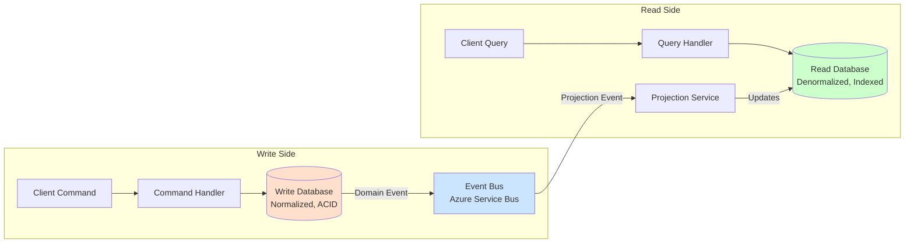
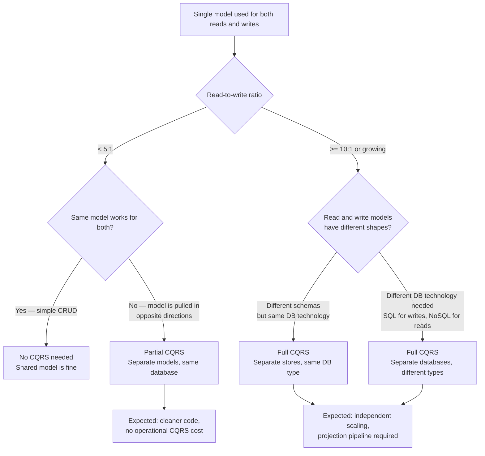

## Navigation

**Domain:** [[7 — System Design & Distributed Systems]] > **Group:** Scalability Patterns
**Previous:** [[7.250 — Database Federation — Functional Partitioning]] | **Next:** [[7.252 — Denormalization for Read Performance]]

### Prerequisites

- [[7.250 — Database Federation — Functional Partitioning]] — CQRS is often applied within a federated database architecture: each service has its own read and write stores
- [[7.252 — Denormalization for Read Performance]] — the read side of CQRS denormalizes data for query efficiency; without denormalization, the read model provides no benefit over the write model
- [[7.253 — Caching as a Scalability Tool]] — a CQRS read model is a cache over the write model; cache invalidation strategies apply to read model refresh

### Where This Fits

CQRS (Command Query Responsibility Segregation) separates the data model used for writes (commands) from the data model used for reads (queries). Instead of one DbContext handling both SaveChanges and ToList, the command side uses a normalized, write-optimized schema and the query side uses a denormalized, read-optimized schema — potentially on different databases. A .NET engineer encounters it when a single EF Core model cannot serve both a complex write path (invoicing with validation rules, aggregates, domain events) and a fast read path (dashboard with aggregated, flattened, projected data). It becomes necessary when read and write workloads have asymmetric scale (10:1 read-to-write ratio and growing), or when the write model's normalization forces reads into N+1 or multi-join queries that cannot meet latency SLOs.

---

---

## Core Mental Model

CQRS decouples the read model from the write model so that each can be optimized independently for its workload. The invariant is that a command never returns query data and a query never mutates state. What this trades is read-after-write consistency: a write commits to the write store, but the read model may not reflect it for milliseconds to seconds (the staleness window). The recognition trigger is detecting that one EF Core entity model is being pulled in two directions — write-side validation logic and aggregate constraints fighting with read-side denormalization and projection concerns.



### Classification

**Pattern category:** Architectural pattern, data access pattern, command-query separation.
**Abstraction layer:** Application layer — CQRS affects how the service layer dispatches operations and how the data access layer models reads vs writes.
**Scope:** Service-level or domain-level. CQRS can be applied to the entire service (full CQRS) or to specific high-read-load aggregates (partial CQRS).
**When applied:** Read and write workloads have asymmetric scale, latency requirements, or data shapes. Write side has complex domain logic (aggregates, invariants, domain events). Read side needs denormalized views for fast queries.
**When not applied:** Simple CRUD with equal read/write load and no meaningful domain logic — CQRS adds complexity without benefit.

### Key Properties / Guarantees

|Property|Value|Condition|
|---|---|---|
|Write consistency |ACID — strong consistency on the write model |Single write database with transactions|
|Read consistency |Eventual — read model reflects committed writes after projection delay |Typical staleness: 100ms–5s depending on projection mechanism|
|Read scalability |Independent — read store can be scaled (read replicas, caching, NoSQL) separately from write store |Read bias > 5:1 before independent read scaling provides meaningful benefit|
|Write scalability |Independent — command handlers can be queued and processed with backpressure |Writes can be buffered independently of read traffic|
|Schema flexibility |Write schema is normalized (3NF for relational); read schema is denormalized (per-query views) |Schema divergence requires synchronization logic (projections)|
|Operational complexity |High — two data stores, projection pipeline, staleness monitoring, event schema versioning |Partial CQRS (separate models, same database) reduces this cost|

---

---

## Deep Mechanics

### How It Works

CQRS operates through three distinct flows: the write flow, the projection flow, and the read flow. Each is independent; the write and read flows are connected only by the projection pipeline.

**Write flow (command execution):**

1. Client sends a command (HTTP POST /orders with `CreateOrder` payload).
2. The command handler is a MediatR `IRequestHandler<CreateOrderCommand, OrderId>`.
3. The handler loads the domain aggregate (e.g., `Order` entity from `OrderDbContext`).
4. The aggregate validates the command against the current state (e.g., "customer has not exceeded credit limit").
5. The aggregate applies the state change (e.g., `order.AddItem(productId, quantity, price)`) and records a domain event (e.g., `OrderItemAddedEvent`).
6. The handler saves the aggregate to the write database (`orderDbContext.SaveChangesAsync`). The domain event is saved to the outbox table in the same transaction.
7. The handler returns the result (`OrderId`). The command side does NOT return the order detail view model — the client must query the read side to see the result.

**Projection flow (write-to-read synchronization):**

1. A background process reads unprocessed outbox messages.
2. For each domain event (e.g., `OrderItemAddedEvent`), the projector maps it to one or more read-model updates.
3. For `OrderItemAddedEvent`, the projector might update an `OrderSummaryReadModel` (denormalized row in the read database) or append to a `RecentOrdersList` in a Redis cache.
4. The projector commits the read-model update. The read model is now consistent with the write — as of the projection latency (typically 100ms–5s).

**Read flow (query execution):**

1. Client sends a query (HTTP GET /orders/summary?customerId=X).
2. The query handler is a MediatR `IRequestHandler<GetOrderSummaryQuery, OrderSummaryDto>`.
3. The handler queries the read database directly — no aggregate loading, no domain logic. The query is a simple `SELECT` against a denormalized view or a key-value lookup.
4. The handler returns the DTO. The entire read path takes 1–5ms for a well-indexed read model.

The critical property: the write flow and query flow use entirely different data access code. The write side uses `OrderDbContext` with full aggregate loading; the read side uses `OrderReadDbContext` with a `DbSet<OrderSummaryReadModel>`. They can be backed by different databases (write: Azure SQL; read: Azure Cosmos DB) or the same database with different schemas.

### Failure Modes

**Failure mode 1 — Stale read model (projection lag):** A client writes data (creates an order) and immediately reads the order summary. The read model has not yet been updated by the projection pipeline. The client sees stale data. Detection: application metrics show `ReadModelStaleness > 1s` for a significant percentage of requests. Fix: implement read-after-write consistency for critical paths (e.g., the command returns the `OrderId`, and the client polls the read side with exponential backoff, or the projection pipeline has a `WaitForRefresh` endpoint for the specific entity). Cost of not fixing: users refresh the page multiple times, support tickets increase.

**Failure mode 2 — Projection failure/divergence:** The projection pipeline crashes midway through processing an event. The write model has data that the read model does not. The two models diverge. Detection: reconciliation queries that compare write and read models for a sample of records show differences. Fix: implement the outbox pattern with exactly-once-at-least semantics. The projector processes events in order with idempotency keys. A health check reports projection lag per event type. Cost of not fixing: reads silently return incomplete data. Financial reports are wrong.

**Failure mode 3 — Schema drift between write and read models:** The write model evolves (a new field `DiscountCode` is added to `Order`). The projection pipeline is not updated to include `DiscountCode` in the read model. The field is written but never visible in queries. Detection: zero values for the new field in read models. Fix: schema evolution discipline: any write-model schema change that affects read visibility MUST be paired with a projection update. Automated tests assert that projection handlers map all fields. Cost of not fixing: silent data loss — data exists in the write model but is invisible to users and reports.

**Failure mode 4 — Read amplification from projections:** A single write (one order with 10 items) generates 10 `OrderItemAddedEvent`s + 1 `OrderCreatedEvent`. The projection pipeline executes 11 separate read-model updates. At write-heavy scale (100K orders/hour), the projection pipeline becomes the bottleneck. Detection: projection queue depth grows. Write-side latency unaffected but read staleness increases. Fix: batch projections (process 100 events at once), use change feed / CDC instead of individual events, or use a materialized view that reclocks the read model on a schedule. Cost of not fixing: read model staleness grows unbounded during peak write periods. Queries return data from hours ago.

### .NET and Azure Integration

- **MediatR:** The standard .NET library for CQRS dispatch. `IRequest<T>` for commands, `IRequestHandler<T, R>` for handlers. Query and command handlers are separate classes in separate namespaces. Pipeline behaviors (logging, validation, transaction) apply to both sides.
- **EF Core:** Two DbContexts — `OrderDbContext` (write, normalized, aggregate-focused) and `OrderReadDbContext` (read, denormalized, query-focused). They may connect to different databases. The write DbContext uses full change tracking; the read DbContext uses `AsNoTracking` for all queries.
- **Azure SQL Database:** Typical write store. Normalized schema with FK constraints, indexes for write patterns (lookup by aggregate ID). ACID transactions for command handlers.
- **Azure Cosmos DB:** Typical read store. Denormalized documents per query pattern. Change feed from Cosmos DB can drive projections into another read model or cache. Container per read model type.
- **Azure Service Bus:** Event bus between write and projection pipelines. Write side publishes domain events. Projection service subscribes and updates read models.
- **Projection background service:** `BackgroundService` or `IHostedService` that reads from the outbox or event bus and updates the read store.

```csharp
// Configuration — two DbContexts targeting different databases
builder.Services.AddDbContext<OrderWriteDbContext>(options =>
    options.UseSqlServer(builder.Configuration.GetConnectionString("OrderWriteDb")));

builder.Services.AddDbContext<OrderReadDbContext>(options =>
    options.UseCosmos(builder.Configuration.GetConnectionString("OrderReadCosmos"),
        databaseName: "order-read"));
```

---

## Production Patterns and Implementation

### Primary Implementation

A complete CQRS implementation with MediatR for command/query dispatch, EF Core for the write model, and Cosmos DB for the read model.

```csharp
// Application/Orders/Commands/CreateOrderCommand.cs
using MediatR;

public sealed record CreateOrderCommand(
    Guid CustomerId,
    List<OrderItemDto> Items) : IRequest<Guid>;

public sealed record OrderItemDto(Guid ProductId, int Quantity, decimal UnitPrice);

// Application/Orders/Commands/CreateOrderCommandHandler.cs
public sealed class CreateOrderCommandHandler : IRequestHandler<CreateOrderCommand, Guid>
{
    private readonly OrderWriteDbContext _db;
    private readonly ILogger<CreateOrderCommandHandler> _logger;

    public CreateOrderCommandHandler(OrderWriteDbContext db, ILogger<CreateOrderCommandHandler> logger)
    {
        _db = db;
        _logger = logger;
    }

    public async Task<Guid> Handle(CreateOrderCommand command, CancellationToken cancellationToken)
    {
        var order = new Order(command.CustomerId);
        foreach (var item in command.Items)
        {
            order.AddItem(item.ProductId, item.Quantity, item.UnitPrice);
        }

        _db.Orders.Add(order);
        await _db.SaveChangesAsync(cancellationToken);

        _logger.LogInformation("Order {OrderId} created for customer {CustomerId}",
            order.Id, command.CustomerId);
        return order.Id;
    }
}

// Application/Orders/Queries/GetOrderSummaryQuery.cs
public sealed record GetOrderSummaryQuery(Guid OrderId) : IRequest<OrderSummaryDto?>;

// Application/Orders/Queries/GetOrderSummaryQueryHandler.cs
public sealed class GetOrderSummaryQueryHandler : IRequestHandler<GetOrderSummaryQuery, OrderSummaryDto?>
{
    private readonly OrderReadDbContext _db;

    public GetOrderSummaryQueryHandler(OrderReadDbContext db)
    {
        _db = db;
    }

    public async Task<OrderSummaryDto?> Handle(GetOrderSummaryQuery query, CancellationToken cancellationToken)
    {
        var order = await _db.OrderSummaries
            .FirstOrDefaultAsync(o => o.Id == query.OrderId, cancellationToken);

        if (order is null) return null;

        return new OrderSummaryDto(
            order.Id,
            order.CustomerName,
            order.ItemCount,
            order.TotalAmount,
            order.Status,
            order.CreatedAt);
    }
}

// Infrastructure/Projections/OrderProjectionService.cs
using System.Text.Json;
using Azure.Messaging.ServiceBus;

public sealed class OrderProjectionService : BackgroundService
{
    private readonly IServiceScopeFactory _scopeFactory;
    private readonly ServiceBusReceiver _receiver;
    private readonly ILogger<OrderProjectionService> _logger;

    public OrderProjectionService(IServiceScopeFactory scopeFactory,
        ServiceBusClient serviceBusClient, ILogger<OrderProjectionService> logger)
    {
        _scopeFactory = scopeFactory;
        _receiver = serviceBusClient.CreateReceiver("order-events", "order-read-projection");
        _logger = logger;
    }

    protected override async Task ExecuteAsync(CancellationToken stoppingToken)
    {
        while (!stoppingToken.IsCancellationRequested)
        {
            try
            {
                var message = await _receiver.ReceiveMessageAsync(maxWaitTime: TimeSpan.FromSeconds(5), cancellationToken: stoppingToken);
                if (message is null) continue;

                using var scope = _scopeFactory.CreateScope();
                var readDb = scope.ServiceProvider.GetRequiredService<OrderReadDbContext>();

                await message.Subject switch
                {
                    "OrderCreated" => await HandleOrderCreatedAsync(message.Body, readDb, stoppingToken),
                    "OrderItemAdded" => await HandleOrderItemAddedAsync(message.Body, readDb, stoppingToken),
                    "OrderStatusChanged" => await HandleOrderStatusChangedAsync(message.Body, readDb, stoppingToken),
                    _ => _logger.LogWarning("Unknown event type: {EventType}", message.Subject)
                };

                await _receiver.CompleteMessageAsync(message, stoppingToken);
            }
            catch (Exception ex)
            {
                _logger.LogError(ex, "Projection processing failed");
                await Task.Delay(1000, stoppingToken);
            }
        }
    }

    private async Task HandleOrderCreatedAsync(BinaryData body, OrderReadDbContext db, CancellationToken ct)
    {
        var @event = body.ToObjectFromJson<OrderCreatedEvent>();
        db.OrderSummaries.Add(new OrderSummaryReadModel
        {
            Id = @event.OrderId,
            CustomerName = @event.CustomerName,
            ItemCount = 0,
            TotalAmount = 0,
            Status = "Pending",
            CreatedAt = @event.CreatedAt
        });
        await db.SaveChangesAsync(ct);
    }

    private async Task HandleOrderItemAddedAsync(BinaryData body, OrderReadDbContext db, CancellationToken ct)
    {
        var @event = body.ToObjectFromJson<OrderItemAddedEvent>();
        var summary = await db.OrderSummaries.FindAsync(new object[] { @event.OrderId }, ct);
        if (summary is null) return;
        summary.ItemCount++;
        summary.TotalAmount += @event.UnitPrice * @event.Quantity;
        await db.SaveChangesAsync(ct);
    }

    private async Task HandleOrderStatusChangedAsync(BinaryData body, OrderReadDbContext db, CancellationToken ct)
    {
        var @event = body.ToObjectFromJson<OrderStatusChangedEvent>();
        var summary = await db.OrderSummaries.FindAsync(new object[] { @event.OrderId }, ct);
        if (summary is null) return;
        summary.Status = @event.NewStatus;
        await db.SaveChangesAsync(ct);
    }
}
```

### Configuration and Wiring

```csharp
// Program.cs
var builder = WebApplication.CreateBuilder(args);

// MediatR — registers all command and query handlers
builder.Services.AddMediatR(config =>
    config.RegisterServicesFromAssemblyContaining<CreateOrderCommandHandler>());

// Write DbContext
builder.Services.AddDbContext<OrderWriteDbContext>(options =>
    options.UseSqlServer(builder.Configuration.GetConnectionString("OrderWriteDb")));

// Read DbContext
builder.Services.AddDbContext<OrderReadDbContext>(options =>
    options.UseCosmos(builder.Configuration.GetConnectionString("OrderReadCosmos"),
        databaseName: "order-read"));

// Azure Service Bus for projections
builder.Services.AddSingleton(new ServiceBusClient(
    builder.Configuration["Azure:ServiceBus:ConnectionString"]));

// Projection background service
builder.Services.AddHostedService<OrderProjectionService>();

// Pipeline behaviors (validation, logging, transaction)
builder.Services.AddTransient(typeof(IPipelineBehavior<,>), typeof(ValidationBehavior<,>));
builder.Services.AddTransient(typeof(IPipelineBehavior<,>), typeof(LoggingBehavior<,>));

var app = builder.Build();
app.MapControllers();
app.Run();
```

### Common Variants

**Variant 1 — Partial CQRS (same database, different models):** The most common .NET entry point to CQRS. Same database, but separate `DbContext` classes for reads vs writes. The write DbContext uses aggregates and change tracking; the read DbContext uses raw SQL or DTO-mapped queries. No projection pipeline — the read and write models share the same underlying tables. Simpler than full CQRS but provides less read/write isolation.

```csharp
// Same database, different models
public class OrderWriteDbContext : DbContext
{
    public DbSet<Order> Orders => Set<Order>();
    public DbSet<OrderItem> OrderItems => Set<OrderItem>();
}

public class OrderReadDbContext : DbContext
{
    // Mapped to a view or raw SQL query
    public DbSet<OrderSummary> OrderSummaries => Set<OrderSummary>();
}
```

**Variant 2 — Materialized view CQRS:** The write and read databases are the same SQL Server, but the read model is implemented as a materialized view or indexed view that is refreshed by a scheduled job or trigger. Simpler than event-driven projection, but introduces refresh latency on a schedule rather than per-event.

**Variant 3 — Event-sourced CQRS:** The write side stores events rather than current state. The read model is projected from the event stream. Provides full audit trail and temporal queries. Requires event store infrastructure (EventStoreDB, Azure Cosmos DB as event store). Significantly more complex than traditional CQRS, used only when audit/history is a hard requirement.

### Real-World .NET Ecosystem Example

**Microsoft eShopOnContainers:** The reference architecture uses CQRS with MediatR. The Ordering service has separate `IRequestHandler` implementations for commands (`CreateOrderCommandHandler`) and queries (`GetOrdersQueryHandler`). The write model uses EF Core with domain aggregates; the read model uses Dapper with denormalized SQL queries against the same database. This is the canonical example of partial CQRS — it provides the code organization benefits of CQRS without the operational complexity of a separate read store. The key takeaway: eShop does NOT use separate databases for reads and writes (they use partial CQRS on the same SQL Server database), which is the right call for their scale. Full CQRS with separate stores is reserved for systems where the read workload genuinely requires a different database technology.

---

## Gotchas and Production Pitfalls

### The Read Model That Is Never Updated

**Pitfall:** The team adds a new field to the write model (e.g., `Order.DiscountCode`). The projection handler is not updated. The field exists in the write database but is never projected into the read model. No one notices for weeks.

```csharp
// ❌ Write model updated but projection handler not updated
public class Order
{
    public string DiscountCode { get; set; } // New field — no corresponding projection
}
```

**Symptom:** Discount data is stored in the write database but never appears in any query response. Discount reporting shows zero values. Customer support cannot see applied discounts.

**Fix:** Add a compile-time or test-time assertion that every write-model property has a corresponding projection handler that maps it. Use mapping tests that validate the projection covers all public properties of the write model.

**Cost of not fixing:** Silent data loss. Data exists but is invisible. Engineering time wasted debugging why "the data is there but I can't see it."

### The Command That Returns Data (CQRS Violation)

**Pitfall:** A command handler loads data, validates, saves — and then returns the full view model to the client. This violates CQRS because the command path now depends on the read model shape. The client stops calling the read side because the command returns everything.

```csharp
// ❌ Command returns read data — violates CQRS
public async Task<OrderDetailDto> Handle(CreateOrderCommand command, CancellationToken ct)
{
    var order = new Order(command.CustomerId);
    // ... validate, save
    await _db.SaveChangesAsync(ct);
    return new OrderDetailDto(order.Id, order.Items, order.Total); // Should not return read data
}
```

**Symptom:** Client never queries the read side. The command API gets slower as the view model grows. The team starts adding query logic to command handlers.

**Fix:** Commands return only an identifier. The client reads from the read side.

```csharp
// ✅ Command returns only the ID
public async Task<Guid> Handle(CreateOrderCommand command, CancellationToken ct)
{
    var order = new Order(command.CustomerId);
    // ... validate, save
    await _db.SaveChangesAsync(ct);
    return order.Id; // Client calls GET /orders/{id} to get the detail
}
```

**Cost of not fixing:** The read side becomes dead code. The team maintains two code paths but only uses one. The CQRS architecture provides no benefit, just complexity.

### The Unbounded Staleness Window

**Pitfall:** The projection pipeline is a single-threaded `BackgroundService` processing one event at a time. During a flash sale (10K orders/minute), the projection queue grows faster than the projector can process. The staleness window goes from 500ms to 5 minutes.

**Symptom:** Dashboard shows zero orders for 5 minutes during a flash sale. Management panics. Engineering investigates the "down" service.

**Fix:** Scale the projection pipeline: use `Parallel.ForEach` with a concurrency limit, partition by event type (order events go to projector instance A, payment events to instance B), or use Azure Functions with batch processing for projections.

```csharp
// ✅ Parallel projection with bounded concurrency
var parallelOptions = new ParallelOptions { MaxDegreeOfParallelism = 4 };
Parallel.ForEach(messages, parallelOptions, message =>
{
    // Process message
});
```

**Cost of not fixing:** Read-side staleness violates SLOs. The system is effectively down for reads during peak traffic. Users see stale data and refresh frantically, adding load to the read side.

### The Read Model That Is Too Denormalized

**Pitfall:** The read model stores every piece of data needed by every query in a single monolithic document. A 5-field query reads a 200-field document. The projection costs are high (write 200 fields) and the read side is not actually faster than the write side.

```csharp
// ❌ Over-denormalized read model — stores everything
public class OrderFullDetailReadModel
{
    public Guid Id;
    public string CustomerName, CustomerEmail, CustomerPhone, CustomerAddress;
    public List<OrderItemDetail> Items; // Each with ProductName, Category, ImageUrl...
    public string PaymentMethod, PaymentStatus, PaymentTransactionId;
    public string ShipmentStatus, ShipmentTrackingNumber, ShipmentCarrier;
    // ... 40 more fields
}
```

**Symptom:** Write model is small and fast. Read model writes are slow (projection updates 200 fields). Read model reads are still slow (200-field documents for a 5-field query).

**Fix:** Design read models per query pattern, not per entity. An `OrderSummaryReadModel` (10 fields for list views) and an `OrderDetailReadModel` (30 fields for detail views) are better than one monolithic model with 200 fields.

**Cost of not fixing:** CQRS adds complexity without performance benefit. The team questions why they adopted CQRS.

### The Missing Idempotency in Projections

**Pitfall:** The projection service processes events from a Service Bus queue. If the projector crashes after updating the read model but before completing the Service Bus message, the event is reprocessed on restart. The read model is updated twice (duplicate projection).

**Symptom:** Order item counts are double the actual value. Total amount is multiplied by the number of times the event was reprocessed.

**Fix:** Add idempotency to projection handlers: each read model row stores the last processed event sequence number. Before processing an event, check if the sequence number is already >= the event's sequence number.

```csharp
// ✅ Idempotent projection
if (summary.LastProcessedEventSequence >= @event.SequenceNumber)
    return; // Already processed this event
summary.ItemCount++;
summary.LastProcessedEventSequence = @event.SequenceNumber;
```

**Cost of not fixing:** Silent data corruption in the read model. Reconciliation queries eventually detect the drift, but the window of incorrect data is large.

---

## Tradeoffs and Decision Framework

### Tradeoff Matrix

| Dimension | CQRS (Separate Read/Write) | CRUD (Single Model) | CQRS + Event Sourcing | Read Replicas (Database-Level) |
|---|---|---|---|---|
| Isolation | Full — write model changes never impact read model shape | None — same model, same schema | Full — events are the source of truth; read model is a projection | Read replica has same schema as write — no model isolation |
| Read latency | Low (1–5ms for denormalized read) | Medium (5–50ms for normalized queries with joins) | Low (projection-optimized) | Low (same query as write, no lock contention) |
| Write latency | Low (write model is normalized, no read-denormalization cost) | Medium (write also updates read-oriented columns) | High (event storage + projection) | Low (write to primary only) |
| Schema evolution | Independent read/write schemas — can diverge | Single schema — any change affects both | Event schema is immutable; read model evolves independently | Same schema — read replica has same columns |
| Operational complexity | High — two models, projection pipeline, staleness monitoring | Low — one DbContext, one database | Very high — event store, projection versioning, snapshotting | Medium — replication setup, lag monitoring |
| Staleness | Explicit staleness window (projection delay) | No staleness (same model) | Explicit staleness (projection delay) | Replication lag (typically < 1s) |
| Audit/history | Manual if needed | No built-in history | Full audit trail from events | No |

### When to Apply



### When NOT to Apply

- [ ] The read-to-write ratio is below 5:1 and the single model works well for both — CQRS adds complexity without clear benefit.
- [ ] The team has no experience with message brokers or background processing — the projection pipeline will be unreliable.
- [ ] The application requires immediate read-after-write consistency for all operations — CQRS with separate stores cannot guarantee this.
- [ ] The schema is stable and the same queries work for both reads and writes — CQRS's schema flexibility benefit is not realized.
- [ ] The team is not willing to manage two data stores — full CQRS with separate databases doubles the operational surface area.

### Scale Thresholds

- "Partial CQRS (separate models, same database) is worth considering above ~10,000 reads/day or when a single DbContext has more than 50 entity types."
- "Full CQRS with separate databases is worth considering when the read workload P99 latency cannot be met with the write store's indexes — typically above 1M reads/day or 100:1 read-to-write ratio."
- "CQRS + Event Sourcing is justified when audit/history is a compliance requirement, typically above 100K events/day or when regulatory retention policies apply."
- "Projection parallelism becomes necessary when the projection lag exceeds 5 seconds for more than 1% of events — at this point, single-threaded projection cannot keep up with write volume."

---

## Interview Arsenal

### Question Bank

1. What is CQRS and what problem does it solve?
2. What is the difference between partial CQRS and full CQRS, and when would you use each?
3. How do you handle read-after-write consistency in CQRS when the client needs to see the data immediately?
4. What happens to the read model when the projection pipeline fails — how do you detect and recover?
5. Compare CQRS with database read replicas — they both provide read scaling, but what does CQRS give you that read replicas do not?
6. Design an order management system where the order write model has complex validation rules and the order dashboard needs sub-100ms response times. How does CQRS apply?
7. How does MediatR implement CQRS in .NET, and how do pipeline behaviors interact with command and query handlers?
8. What is the dual-write problem in CQRS and how does the outbox pattern solve it?

### Spoken Answers

**Q: What is CQRS and what problem does it solve?**

> **Average answer:** It separates read and write operations into different models. It solves the problem of having one model that doesn't work well for both.

> **Great answer:** CQRS means the data model for writing (commands) is structurally different from the data model for reading (queries). They use different classes, different database schemas, and potentially different databases. The problem it solves is the tension between write-optimized and read-optimized schemas: writes benefit from normalized schemas with aggregates, invariants, and domain logic; reads benefit from denormalized, flattened schemas with precomputed aggregates and targeted indexes. A single EF Core model cannot serve both well — if you optimize for writes, reads pay the cost of joins and lazy loading; if you optimize for reads, writes pay the cost of maintaining denormalized columns. CQRS allows each to be independently optimized. In a .NET system, I'd implement it with MediatR for dispatch, two separate DbContexts, and a projection background service that keeps the read model in sync. The tradeoff is consistency: the read model is eventually consistent with the write model, with a staleness window that the application must tolerate.

**Q: Compare CQRS with database read replicas — they both provide read scaling, but what does CQRS give you that read replicas do not?**

> **Great answer:** Database read replicas replicate the same schema — the same tables, same columns, same indexes — to a read-only copy. The read replica solves read traffic scaling by offloading queries from the primary, but it does NOT solve the schema tension problem. Your read queries still use the same normalized schema with the same join complexity. CQRS gives you schema independence: the read model can be denormalized, have different indexes, use a different database technology (Cosmos DB for document queries, Elasticsearch for full-text search), and store precomputed aggregates. A concrete .NET example: in a ticket-sales system, the write model has Order, OrderItem, and Payment entities normalized across 6 tables. The read model — an OrderSummary — is a single Cosmos DB document with 15 fields that the dashboard query returns in 2ms. A read replica would still require the 6-table join. The cost CQRS pays for this schema independence is the projection pipeline: you now have code that keeps the read model in sync, with associated staleness, monitoring, and failure modes. Read replicas are simpler but give you less flexibility.

**Q: How does MediatR implement CQRS in .NET, and how do pipeline behaviors interact with command and query handlers?**

> **Great answer:** MediatR implements the mediator pattern, which is the standard dispatch mechanism for CQRS in .NET. Each command is a record implementing `IRequest<TResponse>` (e.g., `CreateOrderCommand : IRequest<Guid>`). Each query is also an `IRequest<TResponse>` (e.g., `GetOrderSummaryQuery : IRequest<OrderSummaryDto>`). The handlers are separate classes: `CreateOrderCommandHandler : IRequestHandler<CreateOrderCommand, Guid>` and `GetOrderSummaryQueryHandler : IRequestHandler<GetOrderSummaryQuery, OrderSummaryDto>`. MediatR dispatches each request to its registered handler. Pipeline behaviors (`IPipelineBehavior<TRequest, TResponse>`) wrap around handler execution. A validation behavior checks the command before the handler runs; if validation fails, the behavior short-circuits and returns the validation error — the handler never executes. A transaction behavior wraps command handlers in a database transaction. A logging behavior logs request start and end. The key insight: pipeline behaviors apply to both commands and queries, but you typically want different behaviors for each — commands get validation + transaction + outbox, queries get caching + timing. MediatR allows you to filter behaviors by request type using open generics or marker interfaces (e.g., `ICommand<T>` vs `IQuery<T>`).

### System Design Interview Trigger

If an interviewer asks you to design a system that involves a dashboard, reporting, or high-read-load API (e.g., "design a real-time analytics dashboard for an e-commerce platform"), they are testing whether you recognize that the read workload requires a different data model than the write workload. CQRS is the answer. Follow-up questions will probe the staleness tradeoff ("how fresh does the dashboard data need to be?") and the projection mechanism ("how does data flow from the write model to the read model?"). The interviewer is looking for you to identify that the same entities used for order processing (normalized, aggregate-bound) should not be used for the dashboard query (denormalized, aggregated, pre-joined).

### Comparison Table

| | CQRS | Database Read Replicas | CRUD (Single Model) |
|---|---|---|---|
| Model separation | Full — different schemas, potentially different databases | None — same schema | None |
| Read scaling | Independent read store can be scaled separately | Read replica offloads queries from primary | No read scaling |
| Schema flexibility | High — read model can be denormalized, different indexes, different DB technology | None — read replica has same schema | None |
| Consistency | Eventual (projection delay) | Near-immediate (replication lag) | Strong (same database) |
| Operational cost | High — projection pipeline, staleness monitoring, two models | Medium — replication setup, failover management | Low |
| .NET tooling | MediatR, EF Core (two DbContexts), Dapper (read side), BackgroundService projections | EF Core (same DbContext, different connection string) | EF Core (single DbContext) |

---

## Architecture Decision Record

**Status:** Accepted

**Context:** The ticket sales platform has an order processing API that handles 500 writes/minute and 10,000 reads/minute during on-sale events. The read workload is a dashboard showing aggregated order data (total revenue, tickets sold by category, fulfillment status). The single `OrderDbContext` with normalized entities (Order, OrderItem, Payment, Allocation) causes dashboard queries to join 6 tables with aggregates on 20K+ rows — P99 dashboard latency is 4 seconds during peak. Write performance is acceptable (P99 200ms). The team needs the dashboard to load in under 500ms.

**Options Considered:**

1. **Full CQRS with separate stores** — write side uses Azure SQL (normalized), read side uses Azure Cosmos DB (denormalized documents), projection via Azure Service Bus
2. **Partial CQRS (same database)** — separate EF Core models (write: aggregates, read: Dapper raw SQL queries) on the same Azure SQL database with read-optimized indexes and materialized views
3. **Read replicas** — Azure SQL read replica offloads dashboard queries to a replica; same schema, same join complexity
4. **Query optimization only** — add indexes, rewrite queries, add Redis caching for dashboard responses

**Decision:** Partial CQRS with same-database separation (Option 2), because the read-to-write ratio (20:1) warrants read optimization but the data volume (20K rows per query) does not justify the operational cost of a separate database. Read replicas do not solve the join complexity problem. Query optimization alone cannot reduce the 6-table join to meet the 500ms SLO — the read model must be denormalized. Partial CQRS provides the denormalized read model on the same database with a simpler projection mechanism (EF Core value conversion + computed columns) than event-driven projections.

**Consequences:**
- ✅ Dashboard queries now hit a denormalized `OrderSummary` table (2 joins, indexed) — P99 drops from 4s to 80ms
- ✅ Write model remains normalized — no denormalized columns on Order entities
- ✅ Single database to manage — no separate Cosmos DB procurement or projection pipeline
- ⚠️ Read model refresh uses SQL Server triggers and a scheduled job — staleness window of 1–5 minutes
- ⚠️ If the read-to-write ratio grows beyond 100:1, a separate read store will become necessary
- ❌ Full CQRS benefits (different DB technology per read/write) are deferred until needed

**Review Trigger:** Revisit if dashboard queries consistently hit stale data (staleness > 5 minutes) or if read volume exceeds the single Azure SQL database's DTU capacity (above 10,000 reads/minute sustained).

---

## Self-Check

### Conceptual Questions

1. What is CQRS and what architectural problem does it solve?
2. What is the difference between partial CQRS and full CQRS?
3. Under what conditions is CQRS over-engineered or harmful?
4. What metric or operational signal reveals that the projection pipeline is falling behind?
5. Which .NET library provides the standard dispatch mechanism for CQRS, and how do pipeline behaviors interact with it?
6. Compare CQRS with database read replicas — what does CQRS give you that read replicas do not?
7. At what read-to-write ratio does CQRS become worth considering?
8. How does the outbox pattern relate to CQRS projections?
9. What is the non-obvious production consequence of returning read data from a command handler?
10. Can you explain CQRS in 60 seconds to a non-expert using an analogy?

<details>
<summary>Answers</summary>

1. CQRS separates the read model from the write model so each can be optimized independently. It solves the problem of a single model being pulled in opposite directions by read and write requirements.

2. Partial CQRS uses separate models (classes, DbContexts) but the same underlying database. Full CQRS uses separate databases (potentially different technologies). Partial CQRS is simpler (no projection pipeline) but does not provide independent read/write scaling or different database technology per operation type.

3. It is harmful when the read-to-write ratio is below 5:1, when the same model serves both well, when the team has no async messaging experience, or when immediate read-after-write consistency is required.

4. Projection lag (time between event creation in the write model and its reflection in the read model) is the key metric. Monitor `ProjectionQueueDepth` (number of unprocessed events) and `MaxStalenessSeconds` per event type. An alert fires when staleness exceeds 5 seconds for more than 1% of events.

5. MediatR provides `IRequest<T>` / `IRequestHandler<T, R>` for command/query dispatch. Pipeline behaviors (`IPipelineBehavior<TRequest, TResponse>`) wrap around handler execution and can apply different behaviors to commands vs queries via marker interfaces.

6. CQRS provides schema independence (denormalized read model, different indexes, different database technology). Read replicas provide the same schema with no model-level optimization — they solve traffic scaling but not the read-model tension problem.

7. Partial CQRS: worth considering above 10K reads/day or when a single DbContext exceeds 50 entity types. Full CQRS: worth considering above 1M reads/day or when read P99 cannot be met with the write store's indexes.

8. The outbox pattern ensures reliable event delivery from the write side to the projection pipeline. The write side writes the event to an outbox table in the same transaction as the business data. The projector reads from the outbox and updates the read model. Without the outbox, the dual-write problem (write succeeds, event publish fails) causes read model data loss.

9. The non-obvious consequence is that the read side becomes dead code. Clients stop calling the read API because the command returns everything they need. The team maintains two code paths but only uses one. CQRS provides no benefit over CRUD — just added complexity.

10. Think of a library. Writing is like a librarian shelving books (precise, follows strict rules, every book in the right place). Reading is like a patron searching for books (wants fast results, doesn't care about shelving rules). A single librarian doing both works for a small library. For a large one, you need a catalog (read model) that is separate from the actual shelves (write model). The catalog is denormalized — it lists books by title, author, subject, not by shelf position. When a new book is added (write), a librarian adds it to the catalog (projection). The patron doesn't wait for the catalog update — they accept that the catalog might be a few minutes behind.

</details>

---

### Scenario Challenges

**Scenario 1 — Diagnose the problem**

An e-commerce platform uses a single EF Core DbContext for both order processing and the admin dashboard. During Black Friday, the dashboard shows 500 errors when rendering the revenue chart. The order processing API continues working. The DbContext has 80 entity types. The dashboard query joins 8 tables with aggregations over 500K rows. CPU on the database server is at 30%. Memory is normal.

<details>
<summary>Diagnosis</summary>

**Root cause:** The dashboard query's 8-table join with aggregations causes SQL Server to compile a huge execution plan that exceeds the query timeout (30 seconds). The query times out. The 500 errors are from the dashboard controller catching the timeout. The database CPU is low because the query is I/O-bound (reading all rows for aggregation, not CPU-bound). The order processing API works because it targets indexed columns and small row counts (single order lookup by PK).

**Evidence:** Dashboard controller logs show `SqlException: Timeout expired`. Query store shows the dashboard query with high `avg_duration` (>30s) and high `avg_logical_io_reads`. The query plan shows table scans on the OrderItems table (no covering index for the aggregation).

**Fix:** Implement partial CQRS. Create a denormalized `OrderSummary` table and a separate `DashboardReadDbContext`. The dashboard query hits the denormalized table (2 joins, 10K rows). An Azure SQL scheduled job refreshes the `OrderSummary` table every 5 minutes.

**Prevention:** Add a pre-release performance checklist: any query joining more than 4 tables must have a denormalized read model or materialized view.

</details>

---

**Scenario 2 — Design decision**

You are designing the API for a food delivery platform. The write side handles order placement (create order, assign driver, process payment). The read side handles restaurant dashboard (orders in progress, revenue today, average prep time) and customer app (order status, estimated delivery time). The system handles 1,000 orders/hour during peak. The team has 8 engineers with MediatR experience but no Cosmos DB or event-sourcing experience. What CQRS approach do you recommend?

<details>
<summary>Decision and Reasoning</summary>

**Choice:** Partial CQRS with same-database separation. Separate `OrderWriteDbContext` (normalized aggregates) and `OrderReadDbContext` (denormalized, Dapper queries or raw SQL). Same Azure SQL database.

**Tradeoffs accepted:** The single database becomes a shared scalability boundary (cannot scale writes independently of reads). This is acceptable because 1,000 orders/hour (0.3 TPS) does not require independent scaling. The team's MediatR experience makes the dispatch pattern straightforward. The lack of Cosmos DB experience means full CQRS would introduce unacceptable operational risk from an unfamiliar read store.

**Implementation sketch:**
```csharp
// Write side — MediatR command with normalized model
public record PlaceOrderCommand(CustomerInfo Customer, List<OrderItem> Items) : IRequest<Guid>;

// Read side — Dapper for fast denormalized queries
public class DashboardQueries
{
    public async Task<DashboardDto> GetDashboardAsync(DateTime date)
    {
        using var connection = new SqlConnection(_connectionString);
        return await connection.QuerySingleAsync<DashboardDto>(@"
            SELECT COUNT(*) AS TotalOrders,
                   SUM(TotalAmount) AS Revenue,
                   AVG(DATEDIFF(SECOND, CreatedAt, CompletedAt)) AS AvgPrepTime
            FROM OrderSummaries WHERE CreatedAt >= @date", new { date });
    }
}
```

</details>

---

**Scenario 3 — Failure mode**

Your service uses CQRS with Azure SQL for writes and Azure Cosmos DB for reads. The projection service runs as a single-instance `BackgroundService` that reads from Azure Service Bus and writes to Cosmos DB. The team notices that order summary queries sometimes show ""TotalAmount: $0.00"" for orders that have items. The write model has the correct total.

<details>
<summary>Investigation and Fix</summary>

**Investigation steps:**
1. Check the Write DB's OutboxMessages table: is the `OrderCreatedEvent` with the correct `TotalAmount` processed?
2. Check the projection service logs: did it process the `OrderCreatedEvent` before the `OrderItemAddedEvent` events?
3. Check the projection handler for `OrderCreated`: does it set `TotalAmount` to the initial total, or does it leave it as 0 and expect `OrderItemAddedEvent` to accumulate?
4. Check for duplicate event processing (idempotency): has the same event been applied multiple times?

**Confirming evidence:** The projection handler for `OrderCreatedEvent` sets `TotalAmount = 0` in the read model. The `OrderItemAddedEvent` handler adds `item.UnitPrice * item.Quantity`. However, the order creation flow creates `Order` with items in the SAME transaction — the command handler creates the order and adds items before calling `SaveChangesAsync`. The domain events from this flow might emit `OrderCreatedEvent` first (with 0 items because items haven't been saved yet in the event emission order) followed by `OrderItemAddedEvent` events. The projector processes `OrderCreatedEvent` — sets total to 0 — then processes each `OrderItemAddedEvent` to add amounts. But if the `OrderCreatedEvent` contains the final total (which it should), the projector should NOT set total to 0.

**Immediate mitigation:** Correct the `OrderCreatedEvent` projection to use the total from the event payload, not a zero default.

**Permanent fix:** Ensure domain events for creation include the final state, not incremental changes. The `OrderCreatedEvent` should carry the full order snapshot (including all items and total). The projection handler should overwrite — not accumulate — the read model for create events.

**Post-mortem item:** Add a reconciliation query: for a sample of orders, compare write-side `TotalAmount` with read-side `TotalAmount` and alert on mismatch.

</details>

---

**Scenario 4 — Scale it**

Your startup's system uses partial CQRS on a single Azure SQL database. Current volume: 50,000 reads/day, 5,000 writes/day. The database is at 20% DTU. The company expects 10x growth within 12 months (500K reads/day, 50K writes/day). How does your CQRS strategy need to change?

<details>
<summary>Scaling Strategy</summary>

**Bottleneck this addresses:** The single database will become the bottleneck for both reads and writes, even with partial CQRS. At 500K reads/day and 50K writes/day (~5 reads/second, ~0.6 writes/second sustained — higher during peaks), the database is still manageable on a single Azure SQL S4, but the projection mechanism (scheduled job refreshing materialized views) will not keep up during peak write bursts.

**How it helps:** Transition from partial CQRS (same database) to full CQRS with separate read store. The write database (Azure SQL) handles commands and stores the normalized model. The read store (Azure SQL read replica or Azure Cosmos DB) handles all dashboard and customer-facing queries. Projection shifts from scheduled job to event-driven (Azure Service Bus + background service).

**What it does not solve:** The sharing of the write database across multiple services. At 10x, federation (database-per-service) may also become necessary — CQRS + federation are complementary.

**Implementation order:**
1. First: add Azure SQL read replica for the current partial-CQRS read model (quick win, same code).
2. Second: implement the outbox pattern on the write side (prerequisite for event-driven projection).
3. Third: introduce event-driven projection with Azure Service Bus — replace the scheduled job.
4. Fourth: when read traffic exceeds the read replica's capacity, move the read model to Cosmos DB for independent read scaling.
5. Fifth: monitor projection lag as a critical SLO — alert if > 5 seconds.

</details>

---

**Scenario 5 — Interview simulation**

The interviewer says: "Design a system for a social media analytics platform. Users write posts and view a dashboard showing likes, shares, comments, and follower growth over time. The write path needs to validate content, moderate spam, and enforce rate limits. The read path needs sub-second dashboard loads. How do you design the data model?"

<details>
<summary>Model Response</summary>

"Let me clarify the scale: how many posts per second and how many dashboard views per second? Assuming a mid-size platform: 100 posts/second writes, 5,000 dashboard views/second reads — a 50:1 read-to-write ratio. This is a textbook CQRS scenario.

I would use full CQRS with separate read and write stores. The write side uses Azure SQL with a normalized schema: `Post` (content, author, timestamp, moderation status), `Engagement` (likes, shares, comments as separate aggregate rows). Each post write goes through a MediatR command handler that validates content and applies moderation rules before saving.

The read side uses Azure Cosmos DB. Each dashboard view maps to a single document: `UserDashboardDocument` containing pre-aggregated data — total posts, likes received, follower count, engagement rate over time. This document is updated asynchronously via a projection pipeline.

The projection pipeline works like this: when a post is created, the write side publishes a `PostCreatedEvent` via the outbox pattern to Azure Service Bus. A projection function (Azure Function triggered by Service Bus) reads the event and updates the user's dashboard document in Cosmos DB. For engagement events (likes, shares), I'd batch them — accumulate 100 events or wait 5 seconds, then bulk-update the document. This avoids writing to Cosmos DB on every single like.

The key tradeoff: the dashboard is eventually consistent. A user who posts and immediately checks their dashboard may see the post reflected with 1–5 seconds of delay. I'd communicate this explicitly in the UI with a 'updating' indicator. For the moderation use case, I'd add a 'pending' state that appears immediately on the write side (the moderation status is returned from the command handler) — the dashboard reads the write store directly for this single field, using a fast indexed query.

The non-obvious challenge is the 'like storm' — a popular post gets 10K likes in 1 minute. The batching mechanism prevents Cosmos DB write throttling, but the dashboard document's engagement rate calculation needs to handle the burst gracefully by using a sliding window aggregate rather than a cumulative counter."

</details>
