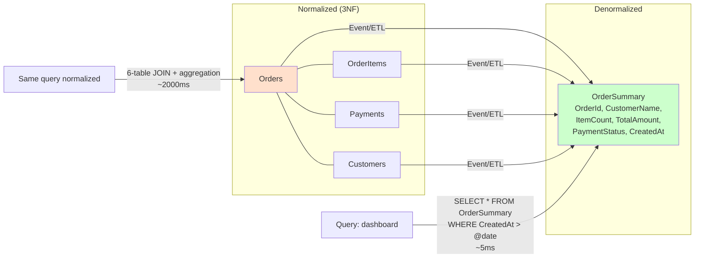
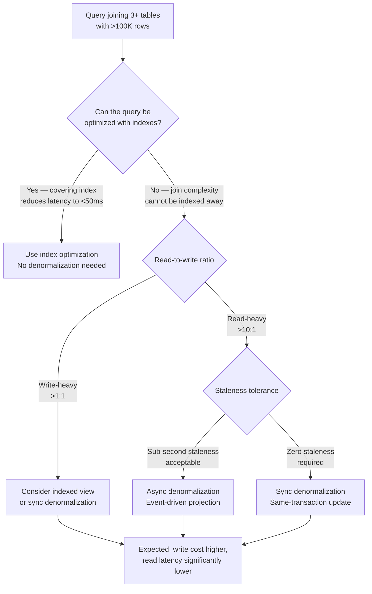

## Navigation

**Domain:** [[7 — System Design & Distributed Systems]] > **Group:** Scalability Patterns
**Previous:** [[7.251 — CQRS for Scalability — Read-Write Split]] | **Next:** [[7.253 — Caching as a Scalability Tool]]

### Prerequisites

- [[7.251 — CQRS for Scalability — Read-Write Split]] — CQRS read models are denormalized by design; this note covers the tradeoffs of denormalization itself
- [[7.250 — Database Federation — Functional Partitioning]] — federation forces denormalization because cross-database joins are impossible
- [[7.253 — Caching as a Scalability Tool]] — a denormalized read model is a form of cache; the invalidation strategies are the same

### Where This Fits

Denormalization is the practice of storing redundant, pre-joined, or pre-aggregated data in a read-optimized schema to avoid expensive JOINs and aggregations at query time. A .NET engineer encounters it when an EF Core LINQ query joining 5 tables takes 2 seconds and the team realizes the same data, flattened into one table, loads in 20ms. It becomes necessary when normalized queries cannot meet latency SLOs (typically above 3 joins on tables with > 100K rows) or when the query volume makes the join cost unsustainable (above 1,000 reads/second with the same join pattern).

---

---

## Core Mental Model

Denormalization trades write-time cost for read-time speed by storing precomputed results alongside or instead of normalized source data. The invariant is that every denormalized read model is a derivative of a normalized source — the source is the authoritative truth, the denormalized copy is a query optimization. What this trades is consistency: the denormalized copy must be kept in sync with the source, introducing a staleness window and a synchronization mechanism. The recognition trigger is a query that the database optimizer cannot satisfy without scanning more rows than the latency budget allows — typically any query joining more than 3 tables with WHERE clauses on non-indexed columns in joined tables.



### Classification

**Pattern category:** Data modeling pattern, query optimization technique.
**Abstraction layer:** Data layer — affects both schema design and application code (projection pipelines, ETL jobs, caching layers).
**Scope:** Per-query-pattern. Each denormalized model targets one or a few query patterns.
**When applied:** Read-heavy workloads where normalized query latency exceeds SLO. Reporting, dashboards, API response models with precomputed aggregates. CQRS read models.
**When not applied:** Write-heavy workloads where every write triggers expensive denormalization. Simple CRUD where single-table queries suffice. Systems where storage cost is a primary concern.

### Key Properties / Guarantees

|Property|Value|Condition|
|---|---|---|
|Read latency |1–10ms (single-table SELECT with index seek) |Denormalized table has covering index for the query pattern|
|Write cost |2x–10x write amplification (write normalized + update denormalized) |Depends on number of denormalized models and update mechanism (sync vs async)|
|Consistency |Eventual (if async) or immediate (if sync in same transaction) |Sync: higher write cost, no staleness. Async: lower write cost, staleness window|
|Storage cost |Higher — redundant data per denormalized model |Depends on column count and row count; typically 1.5x–3x normalized storage|
|Query flexibility |Fixed per denormalized model — supports specific query patterns |Adding a new query pattern may require a new denormalized model or adding columns|
|Maintenance cost |Medium — each denormalized model has a refresh mechanism |More models = more pipeline code to maintain and monitor|

---

---

## Deep Mechanics

### How It Works

Denormalization operates through three mechanisms: column embedding, pre-joined tables, and precomputed aggregates. They differ in how much write cost they incur and what read patterns they enable.

**Mechanism 1 — Column embedding:** Copy a frequently-queried column from a related table into the main table. The `Orders` table stores `CustomerName` directly instead of joining `Customers` on `CustomerId`. The write side updates both `Orders.CustomerName` and `Customers.Name` when the customer changes their name. The tradeoff: saves one JOIN per query at the cost of updating two tables on name changes.

**Mechanism 2 — Pre-joined table:** Create a table that is the result of the JOIN already materialized. An `OrderSummary` table with columns from `Orders`, `OrderItems` (aggregated), `Payments`, and `Customers`. The write side fills this table via an event-driven projection or scheduled refresh. Queries against `OrderSummary` are single-table SELECTs.

**Mechanism 3 — Precomputed aggregate:** Store the result of an aggregation (COUNT, SUM, AVG) that would otherwise require scanning many rows. A `ProductSalesDaily` table stores `ProductId`, `Date`, `TotalUnitsSold`, `TotalRevenue` — the result of a nightly batch that aggregates the `OrderItems` table. Queries for daily sales by product are single-row lookups.

**Runtime walkthrough — order dashboard with denormalized read model:**

1. A user places an order. The `CreateOrderCommandHandler` writes to `Orders`, `OrderItems`, and `OutboxMessages` in one transaction (normalized write).
2. The outbox publisher reads the `OrderCreatedEvent` and publishes it to Azure Service Bus.
3. The `OrderSummaryProjector` receives the event and updates the denormalized `OrderSummary` table: increments `ItemCount`, adds `TotalAmount`, sets `CustomerName` (from the event payload), sets `PaymentStatus` to "Pending".
4. A dashboard query executes `SELECT * FROM OrderSummary WHERE CreatedAt >= @date`. This is a single-table scan with an index on `CreatedAt`. Latency: 5–50ms depending on row count.
5. The equivalent normalized query would join `Orders` → `OrderItems` (GROUP BY OrderId) → `Payments` (MAX CreatedAt) → `Customers`. Latency: 500–5000ms.

### Failure Modes

**Failure mode 1 — Stale denormalized data (async refresh not caught up):** A customer updates their name. The `Customers` table is updated. The `OrderSummary` table still has the old name. Detection: customer support sees old name on order history pages. Fix: subscribe to `CustomerUpdatedEvent` and update all denormalized models that store customer name. For high consistency, do synchronous denormalization within the same transaction. Cost of not fixing: consistent customer-facing data inconsistency.

**Failure mode 2 — Denormalization pipeline cascade failure:** The projection pipeline that refreshes `OrderSummary` fails. The `OrderSummary` table freezes at the last successful refresh. All dashboard queries return the same data regardless of new orders. Detection: dashboard shows stale order counts; projection lag metric > 5 minutes triggers alert. Fix: add dead-letter queue for failed projections, with automatic retry. Implement reporting that compares write-side order count with read-side order count. Cost of not fixing: business decisions are made on stale data. Revenue reporting is wrong.

**Failure mode 3 — Write amplification from too many denormalized models:** Every order write triggers updates to 5 denormalized models: `OrderSummary`, `ProductSalesDaily`, `CustomerRecentOrders`, `DashboardMetrics`, `BIExport`. Each model adds latency to the write path (if synchronous) or queue pressure (if asynchronous). Detection: write latency increases as more denormalized models are added. Fix: consolidate denormalized models (fewer, broader models) or shift all denormalization to async batch processing. Cost of not fixing: the write path becomes slower than the normalized-only baseline, defeating the purpose.

**Failure mode 4 — Schema drift between normalized and denormalized:** A new column `DiscountCode` is added to `Orders`. The `OrderSummary` table and its projection pipeline are not updated. The discount code is stored in the source but never visible in the denormalized read model. Detection: zero values for `DiscountCode` in all read model rows, even when the source has non-null values. Fix: automated schema comparison between normalized source and denormalized targets; deploy projection updates as part of any schema change. Cost of not fixing: silent data loss — the data exists but is invisible.

### .NET and Azure Integration

- **EF Core:** Denormalized read models are typically EF Core entities mapped to views or tables in a separate `ReadDbContext`. Use `AsNoTracking()` for all queries. Map computed columns for simple denormalization (e.g., `[TotalAmount] AS (SELECT SUM(UnitPrice * Quantity) FROM OrderItems WHERE OrderId = Orders.Id) PERSISTED`).
- **Azure SQL Materialized Views (indexed views):** SQL Server can maintain denormalized views automatically with `CREATE VIEW ... WITH SCHEMABINDING` and a unique clustered index. The database engine maintains the view data synchronously. Useful for simple joins and aggregations.
- **SQL Server computed columns:** `PERSISTED` computed columns store precomputed values in the table. Good for simple denormalization (e.g., `FullName = FirstName + ' ' + LastName`).
- **Azure Cosmos DB:** Denormalized document model is the default — each document contains all data for a query. The change feed enables denormalized container updates from a normalized container.
- **Azure SQL Elastic Pool + scheduled job:** For batch denormalization (reports, nightly aggregates), use Azure SQL Elastic Job or Azure Data Factory to refresh denormalized tables on a schedule.
- **BackgroundService + Service Bus:** For event-driven denormalization (CQRS projection), use `BackgroundService` reading from Azure Service Bus to update denormalized tables.

```csharp
// Read DbContext with denormalized models
public class OrderReadDbContext : DbContext
{
    public DbSet<OrderSummary> OrderSummaries => Set<OrderSummary>();

    protected override void OnModelCreating(ModelBuilder modelBuilder)
    {
        modelBuilder.Entity<OrderSummary>(entity =>
        {
            entity.HasKey(o => o.Id);
            entity.Property(o => o.CustomerName).HasMaxLength(200);
            entity.Property(o => o.TotalAmount).HasColumnType("decimal(18,2)");
            entity.HasIndex(o => o.CreatedAt);
            entity.HasIndex(o => o.Status);
        });
    }
}

// Denormalized read model
public class OrderSummary
{
    public Guid Id { get; set; }
    public string CustomerName { get; set; }
    public int ItemCount { get; set; }
    public decimal TotalAmount { get; set; }
    public string Status { get; set; }
    public string PaymentStatus { get; set; }
    public DateTime CreatedAt { get; set; }
}
```

---

## Production Patterns and Implementation

### Primary Implementation

Three-tier denormalization: column embedding for hot-path fields, pre-joined table for dashboard queries, precomputed aggregates for reporting.

```csharp
// Infrastructure/Persistence/OrderWriteDbContext.cs
public sealed class OrderWriteDbContext : DbContext
{
    public DbSet<Order> Orders => Set<Order>();
    public DbSet<OrderItem> OrderItems => Set<OrderItem>();
    public DbSet<OutboxMessage> OutboxMessages => Set<OutboxMessage>();

    protected override void OnModelCreating(ModelBuilder modelBuilder)
    {
        modelBuilder.Entity<Order>(entity =>
        {
            entity.HasKey(o => o.Id);
            entity.Property(o => o.CustomerId).IsRequired();
            entity.Property(o => o.TotalAmount).HasColumnType("decimal(18,2)");
        });

        modelBuilder.Entity<OrderItem>(entity =>
        {
            entity.HasKey(oi => oi.Id);
            entity.Property(oi => oi.UnitPrice).HasColumnType("decimal(18,2)");
        });
    }
}

// Domain/Orders/Order.cs
public sealed class Order
{
    public Guid Id { get; private set; }
    public Guid CustomerId { get; private set; }
    public decimal TotalAmount { get; private set; }
    public string Status { get; private set; } = "Pending";
    public List<OrderItem> Items { get; private set; } = [];
    public DateTime CreatedAt { get; private set; }

    private Order() { }

    public Order(Guid customerId, List<OrderItem> items)
    {
        Id = Guid.NewGuid();
        CustomerId = customerId;
        Items = items;
        TotalAmount = items.Sum(i => i.UnitPrice * i.Quantity);
        CreatedAt = DateTime.UtcNow;
    }
}

// Infrastructure/Projections/OrderDenormalizationService.cs
using System.Text.Json;
using Azure.Messaging.ServiceBus;
using Microsoft.EntityFrameworkCore;

public sealed class OrderDenormalizationService : BackgroundService
{
    private readonly IServiceScopeFactory _scopeFactory;
    private readonly ServiceBusReceiver _receiver;
    private readonly ILogger<OrderDenormalizationService> _logger;

    public OrderDenormalizationService(IServiceScopeFactory scopeFactory,
        ServiceBusClient client, ILogger<OrderDenormalizationService> logger)
    {
        _scopeFactory = scopeFactory;
        _receiver = client.CreateReceiver("order-events", "denormalization");
        _logger = logger;
    }

    protected override async Task ExecuteAsync(CancellationToken stoppingToken)
    {
        while (!stoppingToken.IsCancellationRequested)
        {
            try
            {
                var message = await _receiver.ReceiveMessageAsync(
                    maxWaitTime: TimeSpan.FromSeconds(5), cancellationToken: stoppingToken);
                if (message is null) continue;

                using var scope = _scopeFactory.CreateScope();
                var readDb = scope.ServiceProvider.GetRequiredService<OrderReadDbContext>();

                switch (message.Subject)
                {
                    case "OrderCreated":
                        await HandleOrderCreated(message.Body, readDb, stoppingToken);
                        break;
                    case "OrderStatusChanged":
                        await HandleOrderStatusChanged(message.Body, readDb, stoppingToken);
                        break;
                }

                await _receiver.CompleteMessageAsync(message, stoppingToken);
            }
            catch (Exception ex)
            {
                _logger.LogError(ex, "Denormalization failed");
                await Task.Delay(1000, stoppingToken);
            }
        }
    }

    private async Task HandleOrderCreated(BinaryData body, OrderReadDbContext db, CancellationToken ct)
    {
        var @event = body.ToObjectFromJson<OrderCreatedEvent>();
        db.OrderSummaries.Add(new OrderSummary
        {
            Id = @event.OrderId,
            CustomerName = @event.CustomerName,
            ItemCount = @event.Items.Count,
            TotalAmount = @event.TotalAmount,
            Status = @event.Status,
            PaymentStatus = "Pending",
            CreatedAt = @event.CreatedAt,
            // Embed customer name for fast lookup without JOIN
            CustomerEmail = @event.CustomerEmail,
            CustomerTier = @event.CustomerTier
        });
        await db.SaveChangesAsync(ct);
    }

    private async Task HandleOrderStatusChanged(BinaryData body, OrderReadDbContext db, CancellationToken ct)
    {
        var @event = body.ToObjectFromJson<OrderStatusChangedEvent>();
        var summary = await db.OrderSummaries.FindAsync(new object[] { @event.OrderId }, ct);
        if (summary is null) return;
        summary.Status = @event.NewStatus;
        summary.PaymentStatus = @event.NewPaymentStatus;
        await db.SaveChangesAsync(ct);
    }
}
```

### Configuration and Wiring

```csharp
// Program.cs
var builder = WebApplication.CreateBuilder(args);

// Write DbContext (normalized)
builder.Services.AddDbContext<OrderWriteDbContext>(options =>
    options.UseSqlServer(builder.Configuration.GetConnectionString("OrderWriteDb")));

// Read DbContext (denormalized — separate database or same with separate schema)
builder.Services.AddDbContext<OrderReadDbContext>(options =>
    options.UseSqlServer(builder.Configuration.GetConnectionString("OrderReadDb")));

// Azure Service Bus for denormalization pipeline
builder.Services.AddSingleton(new ServiceBusClient(
    builder.Configuration["Azure:ServiceBus:ConnectionString"]));

// Denormalization background service
builder.Services.AddHostedService<OrderDenormalizationService>();

// MediatR for commands
builder.Services.AddMediatR(cfg =>
    cfg.RegisterServicesFromAssemblyContaining<CreateOrderCommandHandler>());

var app = builder.Build();
app.MapControllers();
app.Run();
```

### Common Variants

**Variant 1 — SQL Server indexed view (automatic denormalization):** The database maintains the denormalized data without application code. Suitable for simple joins and aggregations. Limited to certain T-SQL constructs (no `OUTER JOIN`, no `DISTINCT`, no subqueries in most cases).

```sql
CREATE VIEW OrderSummary WITH SCHEMABINDING AS
SELECT o.Id, o.CustomerId, c.Name AS CustomerName,
       COUNT_BIG(*) AS ItemCount, SUM(oi.UnitPrice * oi.Quantity) AS TotalAmount,
       o.Status, o.CreatedAt
FROM dbo.Orders o
JOIN dbo.OrderItems oi ON o.Id = oi.OrderId
JOIN dbo.Customers c ON o.CustomerId = c.Id
GROUP BY o.Id, o.CustomerId, c.Name, o.Status, o.CreatedAt;
GO
CREATE UNIQUE CLUSTERED INDEX IX_OrderSummary ON OrderSummary(Id);
```

**Variant 2 — Cosmos DB change feed denormalization:** Write to a normalized Cosmos DB container. Use Azure Functions with Change Feed trigger to project into a denormalized container. Good for document-heavy workloads where the normalized schema doesn't match the query pattern.

```csharp
[FunctionName("DenormalizeOrder")]
public async Task Run([CosmosDBTrigger(
    databaseName: "orders",
    containerName: "orders-raw",
    Connection = "CosmosDbConnection",
    LeaseContainerName = "leases")] IReadOnlyList<OrderRaw> rawOrders,
    [CosmosDB(databaseName: "orders", containerName: "orders-denormalized")]
    IAsyncCollector<OrderDenormalized> denormalizedOut)
{
    foreach (var order in rawOrders)
    {
        await denormalizedOut.AddAsync(new OrderDenormalized
        {
            Id = order.Id,
            CustomerName = order.Customer.Name,
            ItemSummary = string.Join(", ", order.Items.Select(i => $"{i.ProductName} x{i.Quantity}")),
            TotalFormatted = $"${order.TotalAmount:F2}",
            StatusLabel = order.Status switch
            {
                "Pending" => "Processing",
                "Confirmed" => "On its way",
                "Delivered" => "Delivered",
                _ => order.Status
            }
        });
    }
}
```

**Variant 3 — Scheduled batch denormalization (nightly ETL):** For reporting and analytics, a nightly Azure Data Factory pipeline or SQL Agent job refreshes denormalized aggregate tables. High staleness (24 hours), low operational complexity.

### Real-World .NET Ecosystem Example

**Stack Overflow's denormalized schema:** Stack Overflow uses a highly denormalized schema for its question listing pages. The `Posts` table stores `Title`, `Body`, `Score`, `ViewCount`, `AnswerCount`, `FavoriteCount`, `LastActivityDate`, and `OwnerDisplayName` — all in one row. The normalized source would separate Posts, Votes, Favorites, Users, and Comments. The denormalized columns are updated via triggers and application-level events. This is why a question listing page with 50 results loads in under 50ms despite the site serving hundreds of millions of requests per month — each listing row requires zero joins.

---

## Gotchas and Production Pitfalls

### The Denormalization That Doubles Write Latency

**Pitfall:** The team adds a denormalized column to a write-heavy table. Every INSERT and UPDATE now updates the denormalized column in the same transaction. The write path, which was fast because of simple normalized writes, now runs write triggers or application-level updates that make it 3x slower.

```csharp
// ❌ Sync denormalization in the same transaction
public async Task<Guid> Handle(CreateOrderCommand command, CancellationToken ct)
{
    var order = new Order(command.CustomerId, command.Items);
    _writeDb.Orders.Add(order);
    // Sync denormalized update in same transaction
    _writeDb.DenormalizedOrderSummaries.Add(new OrderSummary { ... });
    await _writeDb.SaveChangesAsync(ct); // Now 3x slower
}
```

**Symptom:** Write latency spikes. The command API that was 200ms P99 is now 600ms P99.

**Fix:** Move denormalization out of the write transaction. Use the outbox pattern with async projection.

```csharp
// ✅ Async denormalization via outbox — write latency stays at 200ms
public async Task<Guid> Handle(CreateOrderCommand command, CancellationToken ct)
{
    var order = new Order(command.CustomerId, command.Items);
    _writeDb.Orders.Add(order);
    _writeDb.OutboxMessages.Add(new OutboxMessage("OrderCreated", serialize(order)));
    await _writeDb.SaveChangesAsync(ct); // 200ms — only normalized write
}
```

**Cost of not fixing:** The team blames denormalization for the slow API and reverts to normalized queries, losing the read performance benefit.

### The Materialized View That Locks on Refresh

**Pitfall:** A SQL Server indexed view (materialized view) that aggregates millions of rows is refreshed. SQL Server takes a schema modification lock (SCH-M) during the refresh, blocking all queries against the underlying tables for the duration of the refresh.

**Symptom:** Every 5 minutes, the dashboard queries time out for 10–30 seconds during the indexed view refresh. The application appears to "stutter."

**Fix:** Use application-level denormalization (event-driven projection) instead of SQL Server indexed views for tables with high write volume. For indexed views, use `WITH NOEXPAND` hints and ensure the refresh operation runs during low-traffic periods.

**Cost of not fixing:** Periodic timeouts for all read queries. The team adds query retries, which amplify load during the refresh window.

### The Too-Many-Models Sprawl

**Pitfall:** Every team creates its own denormalized read model for its specific query. Over 18 months, the system accumulates 12 different denormalized models, all derived from the same 3 source tables. Each model has its own projection pipeline, its own staleness properties, and its own schema.

**Symptom:** A schema change to the source `Orders` table requires updating 12 projection pipelines. Three of the 12 have been abandoned — no one knows what queries they serve. Storage cost is 5x the normalized baseline.

**Fix:** Consolidate denormalized models. A single `OrderSummary` read model with 30 columns can serve 80% of query patterns. Reserve separate models only for fundamentally different query shapes (aggregated vs detail, time-series vs point-in-time).

**Cost of not fixing:** Schema changes are slow and risky. New team members cannot understand the data flow. Storage and compute costs grow linearly with models.

### The Denormalized Column That Drifts

**Pitfall:** `OrderSummary.CustomerName` is populated from the `CustomerUpdatedEvent`. The customer service publishes the event, but the projection handler has a bug: it updates `CustomerName` only when the event is received, but the event is published only when the customer explicitly changes their name in the UI, not when the name is set via the admin API (which bypasses the event publishing).

**Symptom:** Some customers have the correct name in OrderSummary, others have old names. The inconsistency is intermittent and hard to reproduce because it depends on which API modified the customer record.

**Fix:** All write paths that modify customer data MUST publish the same domain event. Use a single command handler for customer updates — the event is published in the command handler, not in the controller action. Alternatively, use change data capture (CDC) from the Customers table to detect all changes.

**Cost of not fixing:** Intermittent data inconsistency that erodes trust in the denormalized model. The team eventually adds a scheduled full refresh "just to be safe," adding operational overhead.

### The Reporting Query That Ignores the Denormalized Model

**Pitfall:** The BI team writes a new report that needs 3 new fields. Instead of extending the existing denormalized `OrderSummary` model, they write a raw SQL query that joins the normalized tables directly. The query runs for 5 minutes during business hours.

**Symptom:** Database CPU spikes. Other queries slow down. The BI query locks the OrderItems table for the duration.

**Fix:** BI queries MUST use the denormalized model. If the model doesn't have the needed fields, extend the model (add columns to `OrderSummary`) and update the projection pipeline. Never let point-to-point queries bypass the denormalization layer.

**Cost of not fixing:** Production incidents caused by BI queries. Every new report requires a DBA review.

---

## Tradeoffs and Decision Framework

### Tradeoff Matrix

| Dimension | Denormalized Read Model | Normalized (3NF) | Materialized View (Indexed) | Cache Layer (Redis) |
|---|---|---|---|---|
| Read latency | 1–10ms | 10–500ms (depends on join count) | 1–10ms (pre-materialized) | < 1ms (in-memory) |
| Write amplification | Medium — async projection adds queue depth | None | Low — DB maintains view | None |
| Consistency | Eventual (async) or immediate (sync) | Strong ACID | Schema-modification-lock during refresh | TTL-based staleness |
| Query flexibility | Per-model — supports specific query patterns | Full SQL JOIN flexibility | Supports limited JOIN patterns | Key-value lookups only |
| Operational complexity | Medium — projection pipelines per model | Low | Low (DB-managed) but lock risk | Low |
| Storage cost | Higher (redundant data) | Lowest (no redundancy) | Higher (clustered index + view data) | Memory (monetary cost per GB) |
| Schema change cost | High — must update source + all denormalized models | Low — update source only | Low — update view definition | Low — update cache key format |

### When to Apply



### When NOT to Apply

- [ ] The query can be optimized with a covering index to meet the latency SLO — denormalization adds unnecessary complexity.
- [ ] The write-to-read ratio is above 1:5 (more writes than reads) — the write amplification cost exceeds the read benefit.
- [ ] The denormalized model would be used by fewer than 3 query patterns — the maintenance cost exceeds the benefit of a specialized model.
- [ ] The team cannot commit to maintaining projection pipelines — denormalized models that are not refreshed become stale and untrusted.
- [ ] The storage cost of redundant data is a constraint (disk or budget) — denormalization typically adds 50–200% storage overhead.

### Scale Thresholds

- "Consider column embedding when a single JOIN column is needed in > 80% of queries on the main table."
- "Consider a pre-joined denormalized table when queries joining 3+ tables have P99 latency > 200ms and read volume > 100 queries/second."
- "Consider precomputed aggregates when aggregation queries scan > 100K rows per execution and run more than once per minute."
- "Scheduled batch denormalization (nightly) is acceptable up to ~10M rows; above that, batch windows exceed available maintenance time."
- "Event-driven denormalization becomes necessary when the write volume exceeds 100 writes/minute and the staleness target is < 5 seconds."

---

## Interview Arsenal

### Question Bank

1. What is denormalization and why is it used for read performance?
2. What are the three mechanisms of denormalization (column embedding, pre-joined tables, precomputed aggregates)?
3. What consistency cost does denormalization introduce and why?
4. Compare denormalization with database indexing — how are they similar and different?
5. What is write amplification in the context of denormalization, and how do you manage it?
6. Design an order dashboard that needs to show order count, total revenue, and top products for today — all within 100ms. The normalized schema has 5 tables. How do you achieve this?
7. How do you detect that a denormalized read model has drifted from its normalized source?
8. When would you choose an indexed view (SQL Server materialized view) over application-level denormalization?

### Spoken Answers

**Q: What is denormalization and why is it used for read performance?**

> **Average answer:** Denormalization means storing redundant data to avoid joins. It makes reads faster.

> **Great answer:** Denormalization means storing data in a read-optimized schema that duplicates or precomputes data from a normalized source. The mechanism is to trade write-time cost for read-time speed: instead of joining 5 tables at query time, you JOIN them once at write time and store the result. There are three levels: column embedding (copying `CustomerName` into the `Orders` table), pre-joined tables (a denormalized `OrderSummary` table with all needed columns from all related tables), and precomputed aggregates (storing `TotalRevenue` for a date range instead of scanning all order items and summing them at query time). The cost is eventual consistency: the denormalized model is a derivative of the source, and there is a delay between the source changing and the denormalized model reflecting the change. In a .NET system, I'd implement denormalization via event-driven projections with Azure Service Bus and a background service, using the outbox pattern to ensure the denormalization event is reliably published.

**Q: Compare denormalization with database indexing — how are they similar and different?**

> **Great answer:** Both denormalization and indexing are read-optimization techniques that trade write cost for read speed. An index stores a sorted copy of selected columns — this is denormalization at the database engine level. The key difference is control: indexes are managed entirely by the database engine (which columns to include, when to rebuild, how to store) with no application code. Denormalization is managed by application code — you decide which columns to embed, when to refresh the denormalized table, how to handle failures. Indexes are transparent to queries (the optimizer chooses whether to use them); denormalized models require the application to explicitly query the right table. In practice, I start with indexes: a covering index that includes all columns needed by a query can often eliminate table scans and join lookups. When the join complexity exceeds what a covering index can handle (3+ tables with non-trivial WHERE clauses), I move to a denormalized read model. The threshold is typically when a query still requires 3+ table joins even with covering indexes — at that point, the index is effectively trying to store the join result, which is what a denormalized table does explicitly.

**Q: What is write amplification in the context of denormalization, and how do you manage it?**

> **Great answer:** Write amplification in denormalization means that a single write to the normalized source results in writes to multiple denormalized models. An order creation that writes to `Orders` and `OrderItems` might also need to update `OrderSummary`, `ProductSalesDaily`, `CustomerRecentOrders`, and `DashboardMetrics`. That's a 3x to 5x amplification. The key management strategy is to make denormalization asynchronous via the outbox pattern: the write commits only the normalized data in one transaction, and a background projection service propagates changes to each denormalized model. This decouples write latency from denormalization count — the API response time stays at the normalized write cost regardless of how many denormalized models exist. The tradeoff is eventual consistency. For denormalized models that must be synchronous (read-after-write consistency required), I minimize write amplification by limiting sync denormalization to one or two critical models and routing everything else through async projections. I also monitor projection lag per model to detect when amplification becomes a bottleneck — if a single model's projection lag is consistently high, I either batch its updates or consolidate it with another model.

### System Design Interview Trigger

If an interviewer asks you to design a reporting dashboard, analytics system, or any read-heavy API (e.g., "design a system that shows real-time sales metrics to store managers"), they are testing whether you understand that the read model must be different from the write model. Denormalization is the core technique for achieving sub-second read latency on aggregated data. The interviewer's follow-up will probe the refresh mechanism: "how fresh does the data need to be?" — your answer determines whether you use synchronous denormalization (same-transaction, zero staleness), event-driven async (sub-second staleness), or batch (hours of staleness for complex reports).

### Comparison Table

| | Denormalized Read Model | Covering Index | Indexed View | Cache (Redis) |
|---|---|---|---|---|
| Mechanism | Pre-joined storage at application layer | Pre-sorted column copy at DB engine | Pre-materialized aggregation at DB engine | In-memory key-value store |
| Read latency | 1–10ms | 1–10ms | 1–10ms | < 1ms |
| Write amplification | High (projection pipeline) | Medium (index maintenance on write) | High (view maintenance on write) | None (cache-aside invalidation) |
| Consistency control | Full application control | DB engine manages | DB engine manages | TTL-based |
| Query flexibility | Fixed per model | Flexible (any query using indexed columns) | Limited (must match view definition) | Key-based lookups only |
| Operational complexity | High | Low | Low | Low |
| .NET approach | EF Core ReadDbContext + projection service | EF Core `HasIndex()` fluent API | SQL migration `CREATE VIEW ... WITH SCHEMABINDING` | `IDistributedCache` + Redis |

---

## Architecture Decision Record

**Status:** Accepted

**Context:** The ticket sales dashboard loads a summary page showing total tickets sold, revenue by category, and upcoming event counts. The normalized query joins 6 tables (Events, Venues, Orders, OrderItems, Payments, Categories) with aggregations on 2M+ rows. The query takes 3–8 seconds. The dashboard is the most-frequently loaded page (10,000 views/day) and the latency SLO is 500ms.

**Options Considered:**

1. **Denormalized `EventSalesSummary` table** — event-driven projection from the normalized write model to a denormalized read table, refreshed via Azure Service Bus on each order write
2. **SQL Server indexed view** — materialized view maintained by the database engine, refreshed automatically on write
3. **Redis cache with 5-minute TTL** — cache the results of the normalized query with a 5-minute expiration. Simple but high staleness
4. **Query optimization only** — add covering indexes, rewrite aggregation queries, use `WITH (NOLOCK)` hints

**Decision:** Denormalized `EventSalesSummary` table with event-driven refresh (Option 1), because the indexed view would acquire SCH-M locks during refresh on a high-write-volume table (Orders — 500 writes/minute during on-sale events), causing read timeouts. Redis caching with 5-minute TTL provides only 5-minute freshness, which is insufficient for the operations team monitoring live sales. Query optimization cannot reduce the 6-table join to meet the 500ms SLO because the aggregation cost is proportional to row count.

**Consequences:**
- ✅ Dashboard loads in 50–150ms — single-table SELECT against 50K rows
- ✅ No lock contention on write tables — denormalization is async via event-driven projection
- ✅ Staleness window is 500ms–2s, acceptable for the operations dashboard
- ⚠️ New order writes now trigger an outbox message and a projection handler — adds queue depth but not latency to the write path
- ⚠️ Schema changes to Events or Categories require updating the denormalized table definition and projection handler
- ❌ BI team's ad-hoc queries still hit normalized tables (BI uses a separate warehouse)

**Review Trigger:** Revisit if (a) the denormalized table exceeds 10M rows and query latency exceeds 500ms again (may need partitioning by date or sharding by venue), (b) write volume exceeds 1,000 writes/minute and projection lag exceeds 5 seconds (may need parallel projection or batch updates), or (c) a new dashboard query pattern emerges that cannot be served by the existing denormalized schema.

---

## Self-Check

### Conceptual Questions

1. What is denormalization and what architectural problem does it solve?
2. What are the three mechanisms of denormalization and when would you use each?
3. Under what conditions is denormalization harmful or unnecessary?
4. What metric or signal reveals that a denormalized model has drifted from its source?
5. How does the outbox pattern facilitate denormalization in a .NET system?
6. Compare denormalization with indexing — what is the structural distinction in who manages the optimization?
7. At what query latency threshold does denormalization become worth considering?
8. How does denormalization relate to [[7.251 — CQRS for Scalability — Read-Write Split]]?
9. What is the non-obvious production consequence of using SQL Server indexed views on write-heavy tables?
10. Can you explain denormalization in 60 seconds to a non-expert using a library analogy?

<details>
<summary>Answers</summary>

1. Denormalization stores redundant, pre-joined data in a read-optimized schema to avoid expensive JOINs and aggregations at query time. It solves the problem of normalized query latency exceeding the SLO for read-heavy workloads.

2. Column embedding (copy a column from a related table — use when one JOIN is eliminated). Pre-joined table (materialize the full JOIN result — use when queries join 3+ tables). Precomputed aggregate (store COUNT/SUM/AVG results — use when aggregation scans many rows per query).

3. It is harmful when the query can be optimized with an index to meet the SLO (denormalization adds unnecessary complexity), when the write-to-read ratio is > 1:5 (write amplification exceeds read benefit), or when the team cannot maintain projection pipelines.

4. Reconciliation queries that compare counts or sums between the normalized source and the denormalized model reveal drift. A scheduled reconciliation job that samples rows and flags mismatches is the standard approach.

5. The outbox pattern writes the normalized data and a denormalization event in the same transaction. A background service reads the outbox and updates the denormalized model. This ensures the denormalization event is published if and only if the normalized write succeeded.

6. Indexing is managed entirely by the database engine (which columns, when to rebuild). Denormalization is managed by application code (which model to update, when to refresh, how to handle failures). Indexing is transparent to queries; denormalization requires the application to explicitly query the denormalized model.

7. Consider denormalization when a query joining 3+ tables has P99 latency > 200ms and read volume > 100 queries/second. Consider precomputed aggregates when aggregation queries scan > 100K rows and run more than once per minute.

8. [[7.251 — CQRS for Scalability — Read-Write Split]]: the read side of CQRS uses denormalized models by definition. CQRS is the architectural pattern; denormalization is the implementation technique for the read model.

9. Indexed views on write-heavy tables acquire SCH-M (schema modification) locks during view maintenance, blocking all queries against the underlying tables for the duration. This causes periodic read timeouts (stuttering) that are hard to diagnose because they correlate with write activity, not read activity.

10. A library catalog has two sections: the processing section (normalized) where books are received, cataloged, and shelved — each book in one place, nothing duplicated. The reading room section (denormalized) has copies of popular books, reading lists, and quick-reference cards — everything the reader needs in one place without running between stacks. When a new book arrives, a librarian processes it (write) and then updates the reading room displays (denormalization). The reader doesn't wait for the display update.

</details>

---

### Scenario Challenges

**Scenario 1 — Diagnose the problem**

An e-commerce site's product listing page shows product name, price, average rating, and stock count. The query joins Products, Reviews (AVG rating), and Inventory. The page used to load in 200ms. After 6 months of growth (500K products, 2M reviews), the page now loads in 2 seconds. CPU on the database server is at 40%. Memory is normal. The query plan shows index seeks on all tables but a sort operation after the join that spills to tempdb.

<details>
<summary>Diagnosis</summary>

**Root cause:** The query joins 3 tables and sorts by a combination of `AverageRating DESC, Price ASC`. The sort operator cannot use an index because the sort key spans multiple tables. The sort spills to tempdb because the intermediate result set is larger than the allocated memory grant (estimation error). The 2-second latency is from the tempdb spill, not from the joins themselves.

**Evidence:** Query plan shows `Sort` operator with a warning icon: `Operator involved tempdb spill`. `sys.dm_db_index_operational_stats` shows high write activity on tempdb during the query. Memory grant was estimated at 50MB but actual need is 200MB.

**Fix:** Implement a denormalized `ProductListing` table that stores `ProductId, Name, Price, AverageRating, StockCount, ComputedSortKey`. Populate via event-driven projection: product updates, new reviews, and inventory changes each trigger a refresh of the affected product's row in `ProductListing`. The listing query is `SELECT * FROM ProductListing ORDER BY ComputedSortKey` — single table, no joins, no sorts.

**Prevention:** Add a pre-deployment performance gate: any query joining 3+ tables on tables with > 100K rows must have an alternative denormalized query plan reviewed.

</details>

---

**Scenario 2 — Design decision**

You are designing the data layer for a real-time sports scores app. The app shows live scores, player stats, and team standings. Writes come from scorekeepers at 100 events/second during games. Reads come from 100,000 concurrent users refreshing every 30 seconds. The normalized schema has 8 tables (Games, Teams, Players, Stats, Scores, Venues, Leagues, Standings). What denormalization strategy do you recommend?

<details>
<summary>Decision and Reasoning</summary>

**Choice:** Event-driven denormalization with two denormalized models: a `LiveGameSummary` document (updated on every score change) and a `TeamStandings` aggregate (updated on game completion). Write the denormalized models to Azure Redis Cache with a 1-hour TTL.

**Tradeoffs accepted:** Redis cache provides sub-millisecond reads for the 100K concurrent users. The 1-hour TTL means if the projection pipeline fails, the cached data is served (stale by up to 1 hour) while the pipeline recovers. The write amplification is acceptable (100 writes/second update Redis for live scores; game completions update standings).

**Implementation sketch:**
```csharp
// Write path — update cache on every score change
public class ScoreCommandHandler : IRequestHandler<UpdateScoreCommand>
{
    public async Task Handle(UpdateScoreCommand command, CancellationToken ct)
    {
        // ... validate, save to normalized DB
        _db.Scores.Add(new Score { GameId = command.GameId, ... });
        await _db.SaveChangesAsync(ct);

        // Update denormalized cache entry
        var cacheKey = $"live-game:{command.GameId}";
        var gameSummary = await _cache.GetAsync<LiveGameSummary>(cacheKey);
        gameSummary.HomeScore = command.HomeScore;
        gameSummary.AwayScore = command.AwayScore;
        await _cache.SetAsync(cacheKey, gameSummary, TimeSpan.FromHours(1));
    }
}

// Read path — always from cache
public class LiveScoreQueryHandler : IRequestHandler<GetLiveScoreQuery, LiveGameSummary>
{
    public async Task<LiveGameSummary> Handle(GetLiveScoreQuery query, CancellationToken ct)
    {
        return await _cache.GetAsync<LiveGameSummary>($"live-game:{query.GameId}");
    }
}
```

</details>

---

**Scenario 3 — Failure mode**

Your ticketing platform uses event-driven denormalization to populate an `EventInventorySummary` table. The pipeline processes order events and updates the `TicketsSold` and `RemainingCapacity` fields. During a high-traffic on-sale event (10K orders/minute), the projection lag grows to 15 minutes. The front-end shows incorrect remaining ticket counts.

<details>
<summary>Investigation and Fix</summary>

**Investigation steps:**
1. Check the projection service's processing rate (events/second). Is it matching the write rate?
2. Check the Service Bus queue depth: are messages accumulating faster than they are consumed?
3. Check the projection handler's per-event latency: is the `EventInventorySummary` update slow (UPDATE with locking) or fast (single-row UPDATE on indexed PK)?
4. Check if the projection is single-threaded. Is there a concurrency bottleneck?

**Confirming evidence:** Service Bus queue depth is 50,000 and growing. The projection service processes 200 events/second; the write side produces 300 events/second (net negative). The projection handler does an `UPDATE EventInventorySummary SET TicketsSold = TicketsSold + @count` — this is a row-level update that does not lock, but the handler also reads the current value from the `Event` table (a separate read), adding a round trip per event.

**Immediate mitigation:** Increase the projection service's concurrency from 1 to 4 (parallel processing with `MaxDegreeOfParallelism = 4`).

**Permanent fix:** Batch denormalization: instead of processing 1 event at a time, batch 100 events per minute and apply them atomically. Use `UPDATE EventInventorySummary SET TicketsSold = TicketsSold + (SELECT SUM(...) FROM batch)` — one UPDATE per event per batch window.

**Post-mortem item:** Add auto-scaling for the projection service based on queue depth. Alert when queue depth > 5,000.

</details>

---

**Scenario 4 — Scale it**

Your system uses nightly batch denormalization (SSIS job at 2 AM) to refresh a 50GB `CustomerSalesSummary` table. The batch runs for 4 hours and completes before business hours. The company is expanding globally and the data is expected to grow to 200GB within 12 months. The batch window cannot exceed 4 hours.

<details>
<summary>Scaling Strategy</summary>

**Bottleneck this addresses:** The nightly batch refresh is a full rebuild (TRUNCATE + INSERT SELECT). At 200GB, the rebuild will exceed the 4-hour window because the INSERT SELECT scans the entire normalized database.

**How it helps:** Shift from scheduled batch denormalization to event-driven incremental denormalization. Instead of rebuilding the entire table nightly, apply changes incrementally as they happen during the day. The nightly job becomes a reconciliation (verify + fix any drift) rather than a full rebuild, which runs in minutes instead of hours.

**What it does not solve:** The event-driven pipeline must handle the existing 50GB (and soon 200GB) historical data for initial load. The first incremental run needs a one-time full build, which can be done with a scaled-up Azure SQL tier on a weekend.

**Implementation order:**
1. First: implement the outbox pattern on all normalized write paths (prerequisite for event-driven denormalization).
2. Second: build the event-driven projection pipeline (Azure Service Bus + background service) that applies incremental changes.
3. Third: run a one-time full build of `CustomerSalesSummary` from the normalized source (scaled-up tier, weekend window).
4. Fourth: switch the nightly batch from full rebuild to reconciliation-only (compare row counts and checksums, fix drift).
5. Fifth: when 200GB is exceeded, partition `CustomerSalesSummary` by month — the reconciliation runs only on the current month partition.

</details>

---

**Scenario 5 — Interview simulation**

The interviewer says: "Design the data model for a hotel booking system. The system shows available rooms for a given date range with pricing and amenities. Bookings are made by customers and the inventory must be accurate to within a few seconds. The system has 10,000 hotels with 1M rooms total. How do you design the read model for the search page and the write model for bookings?"

<details>
<summary>Model Response</summary>

"Let me clarify the scale: how many searches per day and how many bookings? Assuming 500K searches/day for 10K hotels and 50K bookings/day — a 10:1 read-to-write ratio. The availability query needs to show, for a given date range, which rooms are available — this normally requires joining Rooms, Bookings (WHERE date in range and status != cancelled), RoomTypes, Amenities, and Pricing. That's a 5-table join with a subquery for date overlap — a classic candidate for denormalization.

For the read model, I'd use a denormalized `RoomAvailability` table keyed by `(HotelId, RoomId, Date)`. Each row stores `IsAvailable, Price, RoomTypeName, AmenitiesList`. The table has 1M rooms x 365 days = 365M rows — manageable with partitioning by month and a clustered columnstore index for the date-range scans. The search query becomes `SELECT * FROM RoomAvailability WHERE HotelId = @id AND Date BETWEEN @start AND @end AND IsAvailable = 1` — a single-table clustered index seek, under 50ms.

The write model is normalized: `Bookings`, `BookingRooms`, `Payments`, `Cancellations`. When a booking is made, the write side inserts into `Bookings` and `BookingRooms` in one transaction, and publishes `RoomBookedEvent` via the outbox pattern.

The denormalization works incrementally: a projection service consumes `RoomBookedEvent` and marks the specific `(RoomId, Date)` row as `IsAvailable = false` in the `RoomAvailability` table. For cancellations, the projection marks it back to `IsAvailable = true`. This is an update-in-place on a single row, not a full rebuild — it takes 1–5ms per event, well within the 50 bookings/second budget.

The critical non-obvious issue is overbooking prevention. The denormalized read model is eventually consistent — between the booking write and the projection update, another user might see the room as available and try to book it. I'd handle this with optimistic locking on the normalized write side: the booking command checks actual availability in the normalized `BookingRooms` table (not the denormalized model) before committing. If the room was booked in the interim, the command fails with a conflict. The denormalized model is the search-and-display layer; the write model is the source of truth for availability decisions. This separation is the key architectural insight that most candidates miss."

</details>
