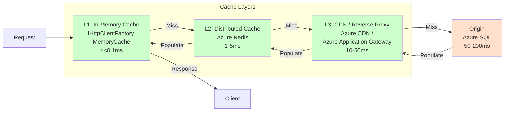
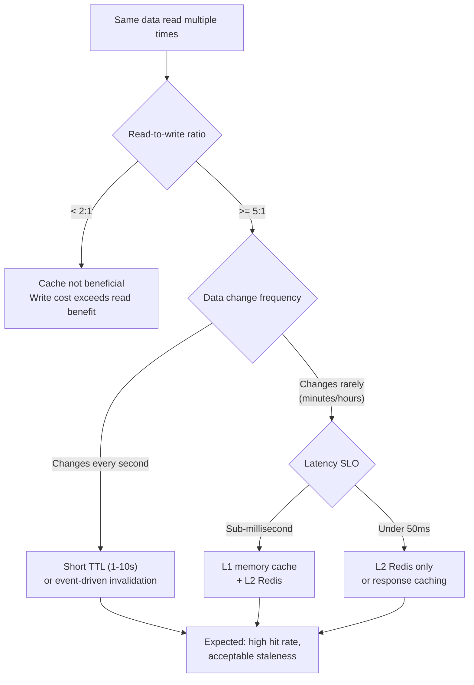

## Navigation

**Domain:** [[7 — System Design & Distributed Systems]] > **Group:** Scalability Patterns
**Previous:** [[7.252 — Denormalization for Read Performance]] | **Next:** [[7.254 — Eventual Consistency Trade-Off for Scale]]

### Prerequisites

- [[7.252 — Denormalization for Read Performance]] — caching is denormalization in memory; the same consistency and staleness tradeoffs apply
- [[7.251 — CQRS for Scalability — Read-Write Split]] — a CQRS read model is a cache over the write model; cache invalidation IS projection refresh
- [[7.219 — Database Read Replicas — Setup and Tradeoffs]] — read replicas are a database-level cache; application-level caching is more flexible but has different failure modes

### Where This Fits

Caching stores frequently accessed data in a faster storage layer (memory, Redis, CDN) so that subsequent requests for the same data avoid the cost of recomputing or reading from the primary data store. A .NET engineer encounters it when a database query or API call takes 200ms and serves the same response to thousands of users per second — the first user pays 200ms, the next 999 get it in 1ms from cache. It becomes necessary at any scale where the read workload exceeds the primary data store's capacity (typically above 1,000 reads/second on a single Azure SQL instance) or when consistent sub-millisecond response times are required.

---

---

## Core Mental Model

Caching stores the result of a computation or data fetch so that identical future requests can be served from a faster store without repeating the original operation. The invariant is that the cache always serves the data that was correct at the time it was cached — the staleness window is bounded by the invalidation mechanism (TTL, event-driven eviction, or explicit removal). What this trades is consistency for latency: a cached value may be stale, but it returns in microseconds instead of milliseconds. The recognition trigger is the observation that the same data is fetched or computed identically more than once — at that point, caching the first result and serving the cached copy eliminates the redundant work.



### Classification

**Pattern category:** Performance optimization pattern, cross-cutting concern.
**Abstraction layer:** Multiple layers — application (in-memory cache), infrastructure (distributed cache, CDN), database (buffer pool, read replicas).
**Scope:** Per-query-pattern or per-resource. Each cached item has its own invalidation strategy.
**When applied:** Read-heavy workloads with repeatable queries. Computationally expensive operations with deterministic results. Data that changes infrequently relative to read frequency.
**When not applied:** Write-heavy workloads with low read amplification. Data with strict consistency requirements (financial transactions). Data that changes too frequently for caching to provide a hit-rate benefit.

### Key Properties / Guarantees

|Property|Value|Condition|
|---|---|---|
|Read latency reduction |10x–1000x vs origin (1ms vs 200ms) |Cache hit — depends on cache layer (in-memory vs Redis vs CDN)|
|Throughput scaling |10x–100x origin capacity |Cache absorbs read traffic; origin handles only cache misses (5–20% of total)|
|Consistency |Eventual — bounded by TTL or invalidation latency |Staleness window = TTL for TTL-based; = invalidation delay for event-driven|
|Cache hit ratio |80–99% for stable workloads |Depends on working set size vs cache capacity and access pattern|
|Cold start penalty |First request after cache flush pays full origin latency |Warmup strategies (preloading, lazy loading) mitigate this|
|Staleness on write |Write may not invalidate cache immediately |Event-driven invalidation adds 10ms–5s staleness; TTL adds up to TTL duration|

---

---

## Deep Mechanics

### How It Works

Caching operates through a sequence of decisions per request: check cache, return if hit; compute/fetch if miss; store result for next request.

**Cache read flow (every request):**

1. Request arrives for data identified by a cache key (e.g., `product-details:123`).
2. Application checks L1 cache (in-process `IMemoryCache`). If found, return immediately (sub-millisecond).
3. If L1 miss, check L2 cache (distributed `IDistributedCache` backed by Redis). If found, populate L1 and return (1–5ms).
4. If L2 miss, execute the origin query (database call, external API, computation). This is the cache miss penalty (50–500ms).
5. Store the result in L2 (and optionally L1), set TTL, return to caller.

**Cache write flow (invalidating stale data):**

Two primary strategies:

**TTL-based (time-to-live):** Each cached entry has a TTL (60 seconds, 5 minutes, 1 hour). After TTL expires, the entry is evicted. The next read triggers a cache miss and refreshes from origin. Simple, no invalidation logic. Staleness window = TTL.

**Event-driven invalidation:** When data changes (write to source), publish an invalidation event. The caching layer removes or updates the affected cache keys on receiving the event. Staleness window = event delivery latency (typically 10ms–5s). More complex but provides fresher data.

**Write-around (cache-aside):** The most common pattern. On a write, update the origin database directly. The cache is NOT updated — instead, the cached entry is deleted or invalidated. The next read triggers a cache miss and refreshes the cache from the updated origin. This avoids the "write to cache, write to DB" dual-write problem.

### Failure Modes

**Failure mode 1 — Cache stampede (thundering herd):** A popular cache key expires. 1,000 concurrent requests all see a cache miss simultaneously and all hit the origin database. The origin is overwhelmed, queries time out, and all 1,000 requests fail or are severely delayed. Detection: immediate spike in origin query latency and error rate when a key expires. Fix: use a mutex/lock around cache refresh — only one request refreshes the cache; others wait for the result. In .NET, use `SemaphoreSlim` per key or `GetOrCreateAsync` with a distributed lock. Cost of not fixing: cascade failure — origin overload causes downstream services to fail.

**Failure mode 2 — Cache-aside write inconsistency (stale read after write):** A user updates their profile (write to DB, cache entry deleted). A read request arrives before the cache entry is deleted (race condition). The cache serves the old data. Detection: intermittent stale data that correlates with write/read concurrency. Fix: use a write-through pattern (update cache AND DB in the same transaction) or delay cache deletion by a short TTL to ensure consistency. For most systems, cache-aside with a short TTL (60s) is acceptable. Cost of not fixing: intermittent but reproducible data inconsistency.

**Failure mode 3 — Redis outage (cache unavailable):** The Redis cluster is unreachable. All requests bypass the cache and hit the origin. The origin receives the full read volume, potentially exceeding its capacity. Detection: Redis connection errors in logs; origin database CPU/DTU spikes. Fix: implement a circuit breaker for Redis — if Redis is down, either serve stale data from L1 cache or fail open (hit origin but add backpressure). Never fail the request because the cache is unavailable. Cost of not fixing: cache outage cascades to a database outage.

**Failure mode 4 — Cache poisoning (serving stale data forever):** An entry is cached with a TTL of 24 hours. The underlying data changes (e.g., product price updated). The cache serves the old price for up to 24 hours. Detection: customer complaints about incorrect pricing. Fix: use shorter TTLs for mutable data (product pricing: 60s TTL), longer TTLs for immutable data (product description: 1 hour TTL). Use event-driven invalidation for data that must reflect changes quickly. Add a "force refresh" admin endpoint for manual invalidation. Cost of not fixing: incorrect data served for the full TTL duration.

### .NET and Azure Integration

- **`IMemoryCache`:** In-process cache in `Microsoft.Extensions.Caching.Memory`. Fastest option (sub-microsecond reads). Limited to single-instance; cache is lost on process restart. Use for data that is expensive to compute and shared across requests within one process.
- **`IDistributedCache`:** Abstraction over distributed cache backends in `Microsoft.Extensions.Caching.StackExchangeRedis`. Backed by Azure Cache for Redis (or SQL Server, NCache). Shared across instances. 1–5ms read latency.
- **Azure Cache for Redis:** Managed Redis service. Supports `IDistributedCache`, Redis data structures, pub/sub for invalidation, and cluster mode for large working sets. Tiers: Basic (single node), Standard (replicated), Premium (cluster, persistence, VNet).
- **ASP.NET Core Response Caching Middleware:** `app.UseResponseCaching()` caches HTTP responses at the middleware layer. Respects `Cache-Control` headers from controllers. Good for public, cacheable GET endpoints.
- **Azure CDN (Front Door / CDN):** CDN caches responses at edge locations close to users. For globally distributed APIs, CDN caching reduces origin load by 90%+ for static or quasi-static responses.
- **HybridCache (.NET 9+):** New unified cache abstraction that combines L1 (memory) and L2 (distributed) caching with stampede protection built in. `builder.Services.AddHybridCache()`.

```csharp
// Registration in Program.cs
builder.Services.AddMemoryCache(); // L1: in-process
builder.Services.AddStackExchangeRedisCache(options => // L2: distributed
{
    options.Configuration = builder.Configuration["Redis:ConnectionString"];
    options.InstanceName = "ticket-sales";
});

// Direct IDistributedCache usage with GetOrCreateAsync pattern
public sealed class ProductCache
{
    private readonly IDistributedCache _cache;
    private readonly ILogger<ProductCache> _logger;

    public ProductCache(IDistributedCache cache, ILogger<ProductCache> logger)
    {
        _cache = cache;
        _logger = logger;
    }

    public async Task<ProductDto?> GetProductAsync(Guid productId, CancellationToken ct)
    {
        var cacheKey = $"product:{productId}";
        var cached = await _cache.GetStringAsync(cacheKey, ct);
        if (cached is not null)
            return JsonSerializer.Deserialize<ProductDto>(cached);

        // Cache miss — fetch from origin (not shown — this would call a service/repo)
        _logger.LogWarning("Cache miss for {CacheKey}", cacheKey);
        return null;
    }

    public async Task SetProductAsync(Guid productId, ProductDto product, CancellationToken ct)
    {
        var cacheKey = $"product:{productId}";
        var serialized = JsonSerializer.Serialize(product);
        await _cache.SetStringAsync(cacheKey, serialized, new DistributedCacheEntryOptions
        {
            AbsoluteExpirationRelativeToNow = TimeSpan.FromMinutes(5)
        }, ct);
    }

    public async Task InvalidateProductAsync(Guid productId, CancellationToken ct)
    {
        await _cache.RemoveAsync($"product:{productId}", ct);
    }
}
```

---

## Production Patterns and Implementation

### Primary Implementation

The `GetOrCreateAsync` pattern with cache stampede protection is the production standard. It ensures only one request refreshes a given cache key, preventing thundering herd.

```csharp
// Infrastructure/Caching/CacheService.cs
using System.Collections.Concurrent;
using System.Text.Json;
using Microsoft.Extensions.Caching.Distributed;
using Microsoft.Extensions.Caching.Memory;

public sealed class CacheService
{
    private readonly IMemoryCache _memoryCache;
    private readonly IDistributedCache _distributedCache;
    private readonly ConcurrentDictionary<string, SemaphoreSlim> _locks = new();

    // Shared settings across the service (inject from IConfiguration in production)
    private static readonly TimeSpan DefaultMemoryTtl = TimeSpan.FromSeconds(30);
    private static readonly TimeSpan DefaultDistributedTtl = TimeSpan.FromMinutes(5);
    private static readonly TimeSpan StampedeLockTimeout = TimeSpan.FromSeconds(10);

    public CacheService(IMemoryCache memoryCache, IDistributedCache distributedCache)
    {
        _memoryCache = memoryCache;
        _distributedCache = distributedCache;
    }

    public async Task<T> GetOrCreateAsync<T>(
        string key,
        Func<CancellationToken, Task<T>> factory,
        CancellationToken cancellationToken) where T : class
    {
        // 1. Check L1 (in-memory) cache
        if (_memoryCache.TryGetValue(key, out T? cached))
            return cached!;

        // 2. Check L2 (distributed) cache
        var distributed = await _distributedCache.GetStringAsync(key, cancellationToken);
        if (distributed is not null)
        {
            var result = JsonSerializer.Deserialize<T>(distributed)!;
            // Populate L1 for subsequent requests
            _memoryCache.Set(key, result, DefaultMemoryTtl);
            return result;
        }

        // 3. Cache miss — use stampede protection
        var lockObj = _locks.GetOrAdd(key, _ => new SemaphoreSlim(1, 1));

        if (!await lockObj.WaitAsync(StampedeLockTimeout, cancellationToken))
        {
            // Timeout waiting for lock — another request is refreshing; return stale
            if (_memoryCache.TryGetValue(key, out cached))
                return cached!;
            // Fallback: execute factory without cache (rare)
            return await factory(cancellationToken);
        }

        try
        {
            // Double-check after acquiring lock
            if (_memoryCache.TryGetValue(key, out cached))
                return cached!;

            distributed = await _distributedCache.GetStringAsync(key, cancellationToken);
            if (distributed is not null)
            {
                var result = JsonSerializer.Deserialize<T>(distributed)!;
                _memoryCache.Set(key, result, DefaultMemoryTtl);
                return result;
            }

            // Actually fetch from origin
            var value = await factory(cancellationToken);
            var serialized = JsonSerializer.Serialize(value);

            await _distributedCache.SetStringAsync(key, serialized,
                new DistributedCacheEntryOptions
                {
                    AbsoluteExpirationRelativeToNow = DefaultDistributedTtl
                }, cancellationToken);

            _memoryCache.Set(key, value, DefaultMemoryTtl);
            return value;
        }
        finally
        {
            lockObj.Release();
        }
    }

    public async Task InvalidateAsync(string key, CancellationToken cancellationToken)
    {
        _memoryCache.Remove(key);
        await _distributedCache.RemoveAsync(key, cancellationToken);
    }
}

// Application/Products/ProductService.cs
public sealed class ProductService
{
    private readonly CacheService _cache;
    private readonly ProductRepository _repository;

    public ProductService(CacheService cache, ProductRepository repository)
    {
        _cache = cache;
        _repository = repository;
    }

    public async Task<ProductDto> GetProductAsync(Guid productId, CancellationToken ct)
    {
        return await _cache.GetOrCreateAsync(
            $"product:{productId}",
            async innerCt =>
            {
                var product = await _repository.GetByIdAsync(productId, innerCt);
                return product is null ? null : ProductDto.FromEntity(product);
            },
            ct) ?? throw new NotFoundException($"Product {productId} not found");
    }
}
```

### Configuration and Wiring

```csharp
// Program.cs
var builder = WebApplication.CreateBuilder(args);

// L1: In-memory cache
builder.Services.AddMemoryCache(options =>
{
    options.SizeLimit = 100 * 1024 * 1024; // 100 MB max
});

// L2: Distributed Redis cache
builder.Services.AddStackExchangeRedisCache(options =>
{
    options.Configuration = builder.Configuration["Redis:ConnectionString"];
    options.InstanceName = "ticket-sales:";
});

// Cache service with stampede protection
builder.Services.AddSingleton<CacheService>();

// Response caching middleware (optional — for HTTP-level caching)
builder.Services.AddResponseCaching();

var app = builder.Build();
app.UseResponseCaching();
app.MapControllers();
app.Run();
```

### Common Variants

**Variant 1 — Response caching middleware (HTTP-level):** For GET endpoints that return cacheable data, the `[ResponseCache]` attribute instructs both the middleware and downstream proxies/CDNs to cache the response. No application code changes needed.

```csharp
[ApiController]
public class ProductsController : ControllerBase
{
    [HttpGet("{id}")]
    [ResponseCache(Duration = 60, Location = ResponseCacheLocation.Any)]
    public async Task<IActionResult> GetProduct(Guid id, CancellationToken ct)
    {
        var product = await _productService.GetProductAsync(id, ct);
        return Ok(product);
    }
}
```

**Variant 2 — Redis pub/sub for cross-instance invalidation:** When a product is updated, the write API publishes an invalidation message to a Redis pub/sub channel. All running instances receive the message and evict the local cache entry. Prevents stale data on instances that did not handle the write request.

```csharp
// Write side — publish invalidation
var publisher = connection.GetSubscriber();
await publisher.PublishAsync("cache-invalidation", $"product:{productId}");

// Read side — subscribe to invalidations
var subscriber = connection.GetSubscriber();
await subscriber.SubscribeAsync("cache-invalidation", (channel, message) =>
{
    var key = (string)message;
    _memoryCache.Remove(key);
});
```

**Variant 3 — HybridCache (.NET 9+):** The built-in hybrid cache handles L1/L2 layering and stampede protection automatically.

```csharp
builder.Services.AddHybridCache(options =>
{
    options.MaximumPayloadBytes = 1024 * 1024; // 1 MB
    options.MaximumKeyLength = 512;
    options.DefaultEntryOptions = new HybridCacheEntryOptions
    {
        Expiration = TimeSpan.FromMinutes(5),
        LocalCacheExpiration = TimeSpan.FromSeconds(30)
    };
});

public class ProductService
{
    private readonly HybridCache _cache;
    public async Task<ProductDto> GetProductAsync(Guid id)
    {
        return await _cache.GetOrCreateAsync(
            $"product:{id}",
            async cancel => await _repository.GetByIdAsync(id, cancel));
    }
}
```

### Real-World .NET Ecosystem Example

**Stack Overflow's two-tier cache:** Stack Overflow uses a two-tier cache with in-process memory (L1) and Redis (L2). The L1 cache stores frequently accessed data (tags, user badges, question metadata) with a 30-second TTL. The L2 Redis cache stores less frequently accessed data with a 5-minute TTL. When a cache miss occurs, a distributed lock ensures only one instance refreshes the cache (stampede protection). This architecture allows Stack Overflow to serve 1.5B page views/month on a modest number of SQL Server instances — the database handles only 5% of read traffic; the cache handles 95%. The key insight: the L1 cache makes repeated requests for the same data within 30 seconds sub-millisecond, and the L2 cache makes cross-instance sharing of cache entries possible without every instance hitting the database independently.

---

## Gotchas and Production Pitfalls

### The Cache Stampede That Takes Down the Database

**Pitfall:** 100 concurrent requests all miss cache simultaneously for the same key. All 100 hit the database. At 1,000 req/s with 5% cache miss rate, this is 50 concurrent database calls per key per second — enough to saturate a modest Azure SQL instance.

```csharp
// ❌ No stampede protection — every miss hits the database
public async Task<ProductDto> GetProductAsync(Guid id)
{
    var cached = await _cache.GetStringAsync($"product:{id}");
    if (cached is not null) return Deserialize(cached);
    var product = await _repository.GetByIdAsync(id); // 100 concurrent calls
    await _cache.SetStringAsync($"product:{id}", Serialize(product));
    return product;
}
```

**Symptom:** Periodic database CPU spikes matching cache expiry times. Query timeouts during the spike.

**Fix:** Use `GetOrCreateAsync` with a per-key semaphore lock. Only one request executes the factory; others wait for it to complete.

**Cost of not fixing:** Database overload during cache expiry cycles. Cascade failure as database connection pool saturates.

### The Memory Cache That Grows Without Bound

**Pitfall:** The in-process memory cache is used for all query results without a size limit. Over hours of operation, the cache grows to consume all available memory. The process is OOM-killed by the container runtime.

```csharp
// ❌ No size limit — unbounded memory growth
builder.Services.AddMemoryCache(); // defaults: no size limit, no expiration scan
```

**Symptom:** Memory consumption grows linearly with uptime. Process restarts after OOM. Cache is lost on restart, causing a cold-start spike.

**Fix:** Set `SizeLimit` and use `Size` on cached entries. Set `CompactionPercentage` to evict old entries when approaching the limit.

```csharp
// ✅ Bounded memory cache
builder.Services.AddMemoryCache(options =>
{
    options.SizeLimit = 200 * 1024 * 1024; // 200 MB
    options.CompactionPercentage = 0.1;     // Evict 10% when limit reached
});
```

**Cost of not fixing:** Unpredictable process restarts under load. Cold-start penalty after every restart.

### The Redis Timeout Under Heavy Concurrent Access

**Pitfall:** A single Redis instance handling 10,000+ requests/second with synchronous `Wait` calls (blocking on Redis async operations) causes thread pool starvation. Redis responses pile up; the .NET thread pool cannot service them fast enough.

**Symptom:** `RedisTimeoutException: Timeout awaiting response (outbound=0KiB, inbound=0KiB, 5000ms elapsed)`. ThreadPool queue depth grows. Application throughput drops.

**Fix:** Use async Redis calls exclusively (`await` not `.Result` or `.Wait()`). Use multiplexed connections (StackExchange.Redis does this by default — one TCP connection shared across all callers). If throughput exceeds a single Redis instance (~25K ops/sec on Standard C1), use Redis cluster mode to shard across multiple nodes.

**Cost of not fixing:** Cascading timeouts — Redis is slow, so HTTP requests are slow, so TCP connections back up, eventually exhausting the connection pool.

### The Stale Cache After Write (Cache-aside Hole)

**Pitfall:** Product price is updated. The write operation updates the database. The cache entry is deleted (cache-aside). A read request arrives between the DB update and the cache deletion — the old cached entry is still alive.

```csharp
// ❌ Race condition: read may see stale cache after write
public async Task UpdatePriceAsync(Guid productId, decimal newPrice)
{
    await _repository.UpdatePriceAsync(productId, newPrice);
    await _cache.RemoveAsync($"product:{productId}"); // Happens AFTER DB update — window exists
}
```

**Symptom:** Intermittent stale price display after price change. Hard to reproduce because it depends on precise timing.

**Fix:** Use eventual deletion with a short post-write delay, or update the cache entry directly (write-through) instead of deleting it (cache-aside). For most systems, accepting a 1-second staleness window is fine — use a 1-second delayed deletion.

```csharp
// ✅ Write-through: update cache directly
public async Task UpdatePriceAsync(Guid productId, decimal newPrice)
{
    await using var tx = await _repository.BeginTransactionAsync();
    await _repository.UpdatePriceAsync(productId, newPrice);
    var product = await _repository.GetByIdAsync(productId);
    await _cache.SetStringAsync($"product:{productId}", Serialize(product));
    await tx.CommitAsync();
}
```

**Cost of not fixing:** Intermittent data inconsistency that the team cannot reproduce or fix.

### The Serialization Overhead That Kills the Benefit

**Pitfall:** A large object (50KB JSON per product, 10,000 products) is serialized and deserialized on every cache operation. Serialization takes 5ms, deserialization takes 5ms — the total cache read latency is 10ms, only marginally faster than the 20ms database query.

**Symptom:** Cache read latency is similar to database query latency. The cache provides little benefit.

**Fix:** Cache smaller objects (only the fields needed by the API response, not the full entity). Use `System.Text.Json` source generators for faster serialization. For very large datasets, consider compression.

```csharp
// ❌ Cache full entity (50KB)
await _cache.SetStringAsync(key, JsonSerializer.Serialize(fullEntity));

// ✅ Cache only response DTO (2KB)
await _cache.SetStringAsync(key, JsonSerializer.Serialize(new { product.Id, product.Name, product.Price }));
```

**Cost of not fixing:** Cache infrastructure cost with no meaningful latency reduction.

---

## Tradeoffs and Decision Framework

### Tradeoff Matrix

| Dimension | In-Memory Cache (L1) | Distributed Cache (Redis) | CDN | No Cache |
|---|---|---|---|---|
| Read latency | < 0.1ms | 1–5ms | 10–50ms (edge location) | 50–500ms (origin) |
| Consistency | Per-instance (may differ across instances) | Shared across instances (consistent read) | TTL-based (per edge location) | Strong (origin read) |
| Capacity | RAM-bound (GB per instance) | RAM-bound (GB–TB per cluster) | Bandwidth-bound (TB/month) | Storage-bound (DB capacity) |
| Cache miss penalty | Low (next tier checked) | Medium (origin query) | Low (origin fetch, cached at edge) | N/A |
| Staleness mechanism | TTL + event invalidation | TTL + pub/sub invalidation | TTL only | No staleness |
| Operational complexity | Low (built-in, no infra) | Medium (Redis cluster management, persistence) | Low (managed Azure service) | None |
| Cost | Free (within process RAM) | $50–$500/month (Redis tier) | $0–$100/month (CDN egress) | $0 (no extra infra) |

### When to Apply



### When NOT to Apply

- [ ] The data changes on every write with no repeated reads — caching every unique result wastes resources.
- [ ] The read latency SLO can be met without caching (sub-50ms from the database after index optimization).
- [ ] The cache would introduce a consistency requirement that the system cannot tolerate (e.g., financial reconciliation).
- [ ] The working set is larger than the available cache capacity (cannot fit even the frequently accessed data in memory).
- [ ] The team cannot monitor cache hit ratio and invalidation health — operating a cache without metrics is flying blind.

### Scale Thresholds

- "In-memory cache (L1) is worth considering above ~100 reads/second on the same data within a 60-second window."
- "Distributed cache (Redis) becomes necessary above ~2 instances (L1 caches diverge) or when cache data must survive process restarts."
- "CDN caching becomes cost-effective above ~1M requests/month for cacheable GET responses with global user distribution."
- "Cache stampede protection (per-key locking) becomes necessary when a single cache key receives > 10 concurrent misses (typical at > 100 req/s per key)."
- "Redis cluster mode becomes necessary when a single Redis instance exceeds ~25K operations/second or when the dataset exceeds ~50 GB."

---

## Interview Arsenal

### Question Bank

1. What is caching and what problem does it solve?
2. What is the difference between L1 (in-memory) and L2 (distributed) cache, and when would you use each?
3. What is a cache stampede and how do you prevent it?
4. Compare cache-aside, write-through, and write-around caching strategies.
5. What happens when Redis goes down — how does your application behave?
6. Design a caching strategy for a social media feed that shows the latest 20 posts for each user. The feed changes every time a new post is made or a user follows/unfollows someone.
7. How do you measure whether your cache is effective (what metrics)?
8. What is the serialization overhead in caching and how do you minimize it?

### Spoken Answers

**Q: What is caching and what problem does it solve?**

> **Average answer:** Caching stores data temporarily to make future requests faster. It solves the problem of slow database queries.

> **Great answer:** Caching stores the result of a computation or data fetch so that identical future requests can be served from a faster store — in-memory, Redis, or CDN — without repeating the original operation. The problem it solves is that the primary data store (database, external API) has limited throughput: a single Azure SQL database can handle roughly 5,000–10,000 reads/second before hitting DTU limits. Caching absorbs the read traffic so the database handles only the cache misses — typically 5–20% of total read volume. In a .NET production system, I layer caches: in-process memory (sub-millisecond, per-instance), Redis (1–5ms, cross-instance), and CDN for globally distributed users. The key decision is the invalidation strategy: TTL-based (simple, staleness = TTL duration) vs event-driven (complex, staleness = event delivery latency). The most common mistake is not implementing stampede protection — when a popular key expires, 1,000 concurrent requests all hit the database simultaneously. I always wrap cache read-through with a per-key semaphore lock to ensure only one caller refreshes the cache.

**Q: Compare cache-aside, write-through, and write-around caching strategies.**

> **Great answer:** Cache-aside: the application reads from cache first; on a miss, it reads from the database and populates the cache (lazy population). On writes, the application writes to the database and removes the cache entry — the next read repopulates it. This is the most common pattern because the cache doesn't need to agree with the database during writes, avoiding the dual-write problem. The downside is a read-after-write inconsistency window: a read can happen between the DB write and the cache deletion, seeing stale data. Write-through: the application writes to both the cache and the database in the same operation. The cache is always up to date, but you now have a dual-write problem — if one write succeeds and the other fails, they desynchronize. Write-around: similar to cache-aside, but the cache is never updated or deleted on writes — instead, it relies on TTL expiration. Simple, but the staleness window is the full TTL duration. In .NET, I use cache-aside as the default: `IDistributedCache` with explicit `RemoveAsync` on writes. I switch to write-through only when read-after-write consistency is critical (e.g., user profile updates) and I accept the dual-write risk by using a transaction that spans both operations with a compensating action on failure.

**Q: What happens when Redis goes down — how does your application behave?**

> **Great answer:** When Redis becomes unavailable, every read is a cache miss. The application falls through to the origin database for every request. This is a fail-open behavior — the application continues working but at reduced throughput. The risk is that the origin database receives the full read volume, potentially exceeding its capacity and causing a secondary outage. I design for this: the origin database should be able to handle the full read volume at degraded latency for at least the duration of a Redis recovery (usually 5–15 minutes for a failover). I set connection timeouts low (500ms) so the application doesn't hang waiting for Redis. I add a circuit breaker: if Redis is down for more than 30 seconds, I disable all Redis calls and log a critical alert. On the L1 cache, I keep the in-memory cache running normally — it still serves frequently accessed data, reducing the origin load even when Redis is down. After Redis recovers, I gradually re-enable it (warmup phase) to avoid a stampede of cache misses repopulating simultaneously. In .NET, the `StackExchange.Redis` library has built-in reconnect logic — I configure `abortConnect: false` so the application doesn't crash if Redis is unavailable at startup.

### System Design Interview Trigger

If an interviewer asks you to design any read-heavy system — a social media feed, a product catalog, a news website, a real-time dashboard — they expect you to propose a caching strategy as a core architectural component. The interviewer is testing whether you know (a) that caching is necessary for read scalability, (b) which cache layer to use for which data, (c) the invalidation strategy, and (d) what happens when the cache fails. The classic system design problems that require caching: "design Twitter" (feed caching), "design Amazon" (product page caching), "design YouTube" (video CDN caching), "design a URL shortener" (redirect caching).

### Comparison Table

| | Cache-Aside | Write-Through | Write-Behind | Read-Through |
|---|---|---|---|---|
| Read behavior | Check cache → miss → read DB → populate cache | Check cache → miss → read DB via cache | Same as read-through | Cache handles all reads; fetches from DB on miss |
| Write behavior | Write to DB → delete from cache | Write to cache AND DB synchronously | Write to cache → async write to DB | N/A (reads only) |
| Consistency | Read-after-write staleness window | Strong (dual-write risk) | Eventual (async DB write may fail) | Eventual (cache refresh delay) |
| Complexity | Low | Medium (dual-write handling) | High (async queue, conflict resolution) | Low |
| .NET implementation | `IDistributedCache` + manual RemoveAsync | Custom: write to both stores in transaction | Custom: write to queue, background processor | Custom: `GetOrCreateAsync` pattern |
| Use case | General purpose | Profile data, config | Write-heavy + non-critical writes | Read-heavy, rare updates |

---

## Architecture Decision Record

**Status:** Accepted

**Context:** The event listing API returns the same JSON payload (events by city with dates, venues, ticket counts) to 50,000 users/day. The origin query joins 4 tables (Events, Venues, Categories, TicketInventory) and takes 200–800ms. The API runs on 4 instances behind Azure Load Balancer. During on-sale events, traffic spikes to 500 req/s on the listing endpoint, causing database DTU to reach 95% and response times to exceed 3 seconds.

**Options Considered:**

1. **Two-tier cache (L1 memory + L2 Redis, cache-aside)** — in-process memory on each instance (10s TTL) + Redis (5min TTL) with stampede protection
2. **Redis-only cache** — no in-process cache, all reads from Redis. Simpler but higher latency per read (1–5ms vs < 0.1ms)
3. **Response caching middleware only** — HTTP-level caching with `[ResponseCache]` attribute. No stampede protection, no per-key control
4. **CDN caching** — Azure Front Door caches responses at edge locations. Best for global distribution but cannot handle per-user or dynamic data

**Decision:** Two-tier cache (L1 memory + L2 Redis) with cache-aside and stampede protection (Option 1), because the listing data is read-heavy (500 req/s) with moderate update frequency (events change hourly). The L1 cache eliminates repeated Redis calls within 10 seconds on the same instance. The L2 cache provides cross-instance sharing so all 4 instances benefit from a single database query per key. Response caching middleware is added as a supplementary layer for anonymous, cache-control-respecting clients.

**Consequences:**
- ✅ Database DTU drops from 95% to 15% — origin handles only 5% of read traffic
- ✅ P95 response time drops from 3s to 15ms (L1 hit) / 50ms (L2 hit)
- ✅ Stampede protection prevents thundering herd on key expiry
- ⚠️ Cache invalidation on event updates requires explicit `InvalidateAsync` call — must not be forgotten in the write path
- ⚠️ L1 memory usage increases by ~50MB per instance (event listing data for 10,000 events)
- ❌ If Redis goes down, all 4 instances fall back to origin — database must handle 500 req/s (degraded but functional)

**Review Trigger:** Revisit if (a) event listing data becomes per-user personalized (caching at the HTTP/CDN level becomes ineffective; shift to user-specific Redis keys), (b) the number of instances exceeds 20 (L1 cache miss rate increases because instances don't share locality), or (c) the working set exceeds 5 GB (Redis cluster mode required).

---

## Self-Check

### Conceptual Questions

1. What is caching and what architectural problem does it solve?
2. What is the difference between L1 (in-memory) and L2 (distributed) caching?
3. Under what conditions is caching harmful or unnecessary?
4. What metric tells you your cache is effective? What metric tells you it's not?
5. Which .NET abstractions provide L1 and L2 caching, and how do you register them?
6. Compare cache-aside with write-through — when would you use each?
7. At what read-to-write ratio does caching become worth considering?
8. How does caching relate to [[7.252 — Denormalization for Read Performance]]?
9. What is the non-obvious production consequence of not implementing stampede protection?
10. Can you explain caching in 60 seconds to a non-expert using a kitchen analogy?

<details>
<summary>Answers</summary>

1. Caching stores frequently accessed data in a faster storage layer so that subsequent requests for identical data can be served without repeating the original fetch or computation. It solves the throughput and latency limitations of the primary data store.

2. L1 (in-memory) cache lives in the application process — sub-microsecond reads, lost on process restart, per-instance. L2 (distributed) cache lives in a shared service (Redis) — 1–5ms reads, survives restarts, shared across all instances. L1 is faster but limited; L2 is slower but shared and persistent.

3. It is harmful when the data changes on every write (no repeated reads), when the origin latency is already acceptable (sub-50ms), when the working set exceeds cache capacity, or when the system cannot tolerate eventual consistency.

4. Cache hit ratio (target: > 80%) tells you the cache is effective. Cache miss latency (should be close to origin latency) and cache miss rate (should be < 20% of reads) tell you it's not. Staleness metrics (max staleness seconds, staleness violations) are also critical.

5. L1: `IMemoryCache` (registered via `AddMemoryCache()`). L2: `IDistributedCache` backed by `AddStackExchangeRedisCache()`. In .NET 9+, `HybridCache` combines both.

6. Cache-aside (read from cache, miss → read DB → populate cache; write to DB → delete cache) is simpler and avoids the dual-write problem. Write-through (write to cache AND DB) provides stronger read-after-write consistency but introduces dual-write risk. Use cache-aside by default; write-through when read-after-write consistency is critical.

7. Worth considering when read-to-write ratio >= 5:1. Required when reads/second exceed the origin database's capacity (typically above 1,000 reads/second on a single Azure SQL instance).

8. [[7.252 — Denormalization for Read Performance]]: caching is in-memory denormalization. Both trade write cost (or cache update cost) for read speed. A denormalized database table is a cache on disk; a Redis key is a cache in memory. The same consistency tradeoffs apply.

9. The non-obvious consequence is a cascade failure: a popular cache key expires, 1,000 concurrent requests all hit the database simultaneously, the database connection pool saturates, queries time out, the application becomes unavailable, and clients retry — amplifying the load until the database is overwhelmed.

10. Think of a kitchen with a refrigerator and a pantry. The pantry (database) holds all ingredients but is in the garage — it takes 2 minutes to walk there and back. The refrigerator (cache) holds frequently used ingredients right next to the counter. If you run out of eggs, you check the fridge first (cache hit, 2 seconds). If no eggs, you go to the pantry (cache miss, 2 minutes) and bring back a dozen, keeping a few in the fridge for next time. If someone uses the last egg, you remove it from the fridge (invalidation) so next time you know to go to the pantry.

</details>

---

### Scenario Challenges

**Scenario 1 — Diagnose the problem**

A media streaming service caches movie metadata (title, description, poster URL, ratings) in Redis with a 24-hour TTL. Every morning at 9 AM, the database CPU spikes to 100% for 15 minutes. The spike correlates with new movie releases (studio adds metadata at 9 AM). The API response time during the spike degrades from 50ms to 5 seconds.

<details>
<summary>Diagnosis</summary>

**Root cause:** The 24-hour TTL means all movie metadata keys expire at approximately the same time they were created (a key created at 9 AM yesterday expires at 9 AM today). At 9 AM, when new movies are added, the users query the catalog — hitting expired keys for existing movies. All queries miss cache simultaneously (thundering herd) and hit the database. The 15-minute window is the time needed for the cache to repopulate as users query movies they were watching yesterday.

**Evidence:** Redis `INFO keyspace` shows a spike in `expired_keys` at 9 AM. Database `sys.dm_exec_query_stats` shows the metadata query executing 10x more frequently during the spike. Cache hit ratio drops from 95% to 20% during the window.

**Fix:** Add jitter to TTL values: `TTL = base_TTL + random(0, TTL/10)`. Keys expire at different times, spreading the cache miss load. Also implement stampede protection with per-key locks.

```csharp
var ttl = TimeSpan.FromHours(24) + TimeSpan.FromMinutes(Random.Shared.Next(0, 144)); // 0–2.4h jitter
```

**Prevention:** Monitor per-key expiry time distribution. Alert if more than 10% of keys expire within the same 1-minute window.

</details>

---

**Scenario 2 — Design decision**

You are designing the API for a news website. The homepage shows the top 50 articles by recency and popularity. The article list changes every time a new article is published or an article's popularity score changes (every few minutes). The homepage gets 10,000 views/minute. The team uses Azure SQL with 4 replicas. What caching strategy do you recommend?

<details>
<summary>Decision and Reasoning</summary>

**Choice:** Two-tier cache: L1 in-memory cache (30-second TTL) on each API instance, L2 Redis cache (2-minute TTL) shared across instances. Event-driven invalidation: when a new article is published, the CMS publishes an invalidation event to Redis pub/sub. All instances evict their L1 cache and refresh from Redis.

**Tradeoffs accepted:** The homepage may be up to 30 seconds stale (L1 TTL) if an article is published but the invalidation event is delayed. This is acceptable for a news site — breaking news is published on the article page, not the homepage. The 2-minute Redis TTL ensures that even if the invalidation mechanism fails, the cache self-heals within 2 minutes.

**Implementation sketch:**
```csharp
public class HomepageService
{
    private readonly CacheService _cache;
    private readonly ArticleRepository _repository;

    public async Task<List<ArticleSummary>> GetHomepageAsync()
    {
        return await _cache.GetOrCreateAsync("homepage:top50",
            async ct => await _repository.GetTopArticlesAsync(50, ct),
            memoryTtl: TimeSpan.FromSeconds(30),
            distributedTtl: TimeSpan.FromMinutes(2));
    }

    // Called by CMS when article is published
    public async Task InvalidateHomepageAsync()
    {
        await _cache.InvalidateAsync("homepage:top50");
    }
}
```

</details>

---

**Scenario 3 — Failure mode**

Your e-commerce platform uses Redis for session state and product catalog caching. Users report being logged out randomly. The logout happens most frequently during peak shopping hours. The session TTL is 30 minutes. The Redis instance is a Standard C1 (1 GB, 250 connections).

<details>
<summary>Investigation and Fix</summary>

**Investigation steps:**
1. Check Redis `INFO memory`: is eviction happening? Is `evicted_keys` > 0?
2. Check Redis `INFO clients`: is the connection count near the limit (250 for C1)?
3. Check the session key pattern: are sessions being evicted because the catalog cache is consuming all available memory?
4. Check Redis `INFO stats` for `expired_keys` vs `evicted_keys` ratio.

**Confirming evidence:** `evicted_keys` is high during peak hours. `used_memory` is at 980 MB (98% of 1 GB). The catalog cache (product data for 50K products) consumes 800 MB. Sessions (100K active sessions at 2 KB each = 200 MB) exceed the remaining memory. Redis evicts the least recently used keys — which are idle user sessions. Users whose sessions are evicted are logged out.

**Immediate mitigation:** Increase Redis tier to C2 (2.5 GB) or C3 (5 GB) to fit both session and catalog data.

**Permanent fix:** Separate session cache and catalog cache into different Redis instances (or different logical databases). Sessions get a dedicated Redis instance with `noeviction` policy (never evict sessions — if memory is full, new session writes fail audibly).

```csharp
// Separate Redis connections for different data types
builder.Services.AddStackExchangeRedisCache(options => // Catalog cache
{
    options.Configuration = builder.Configuration["Redis:Catalog"];
    options.InstanceName = "catalog:";
});
builder.Services.AddStackExchangeRedisCache(options => // Session cache
{
    options.Configuration = builder.Configuration["Redis:Session"];
    options.InstanceName = "session:";
});
```

**Post-mortem item:** Add Redis memory monitoring alerts at 75%, 85%, and 95% utilization. Separate caches by eviction policy: `allkeys-lru` for catalog, `noeviction` for sessions.

</details>

---

**Scenario 4 — Scale it**

Your API uses a single Redis instance for caching all query results. Current traffic: 5,000 req/s, 80% cache hit ratio. The Redis instance is at 60% CPU and 70% memory. You expect traffic to double to 10,000 req/s within 6 months. How does your caching strategy scale?

<details>
<summary>Scaling Strategy</summary>

**Bottleneck this addresses:** A single Redis instance has finite CPU (single-threaded event loop — max ~25K ops/sec on Standard C3, ~100K on Premium P1) and finite memory. At 10,000 req/s with 80% hit ratio = 8,000 Redis ops/read + 2,000 Redis ops/write = ~10K ops/sec — manageable on a Premium P1. Memory may become the bottleneck if the working set grows beyond the Redis instance's capacity.

**How it helps:** Add L1 in-memory cache (30-second TTL) to reduce Redis load by 50%. Every instance serves 30 seconds of reads from local memory, reducing Redis ops from 10K/sec to 5K/sec. This extends the life of the single Redis instance.

**What it does not solve:** If the working set doubles beyond Redis memory capacity, a single Redis instance cannot hold all frequently accessed data regardless of CPU. At that point, Redis cluster mode splits data across multiple nodes using consistent hashing.

**Implementation order:**
1. First: add L1 in-memory cache with stampede protection (quick win, reduces Redis load).
2. Second: monitor Redis CPU and memory at the new traffic level.
3. Third: if memory exceeds 70% on the current tier, scale up Azure Cache for Redis to the next tier.
4. Fourth: if CPU exceeds 80% or scaling up is no longer cost-effective, enable Redis clustering (shard across multiple nodes).
5. Fifth: add read replicas for Redis (Azure Cache for Redis Standard/Premium) for read scaling if reads dominate.

</details>

---

**Scenario 5 — Interview simulation**

The interviewer says: "Design Twitter's timeline API. When a user opens the app, they see the latest 100 tweets from people they follow. The system has 500M active users, 1B tweets/day, and the timeline loads in under 500ms. How do you design the caching strategy?"

<details>
<summary>Model Response</summary>

"Let me clarify: is this the home timeline (tweets from followed users) or the user timeline (user's own tweets)? Assuming the home timeline — the hard problem is that each user's timeline is a personalized aggregation: a user following 200 people might need to merge 200 timelines ranked by recency.

The fundamental constraint is that precomputing every user's timeline for every write is impossible (500M timelines x 1B tweets = 500M writes). The strategy is to combine precomputed fanout-on-write for active users with fanout-on-read for inactive users.

For caching: the home timeline for each user is cached in Redis. The cache key is `timeline:{userId}` — the value is the list of latest 100 tweet IDs. The cache TTL is 5 seconds (because timelines change every time someone the user follows tweets). When a celebrity tweets, we use fanout-on-write: push the tweet ID to the timeline cache of all active followers (a background job updates the Redis list for each follower). Redis lists are efficient for this — `LPUSH` to prepend, `LTRIM` to keep only the latest 100.

For users who are not actively scrolling (detected by last access time > 30 minutes), we skip the fanout-on-write. When they open the app (fanout-on-read), we compute their timeline on demand by querying the last 100 tweets from each followed user (from Redis or database), merging, and caching the result.

The L1 cache in the API server stores the timeline JSON for the currently active user — when the user scrolls, subsequent page-load requests hit the L1 cache (sub-millisecond). The L1 TTL is 1 second (long enough to skip Redis for rapid scroll, short enough that a new tweet appears quickly).

The non-obvious challenge is the cache stampede when a user with 10M followers tweets. The fanout-on-write for 10M followers cannot happen in real-time — we queue it as a background job and deliver the tweet to followers' timelines within 30 seconds. During those 30 seconds, followers see the timeline without the new tweet — which is acceptable for the home timeline because the user can still refresh and see it. If immediate delivery is required (celebrity live event), we use a separate push notification channel, not the timeline cache."

</details>
