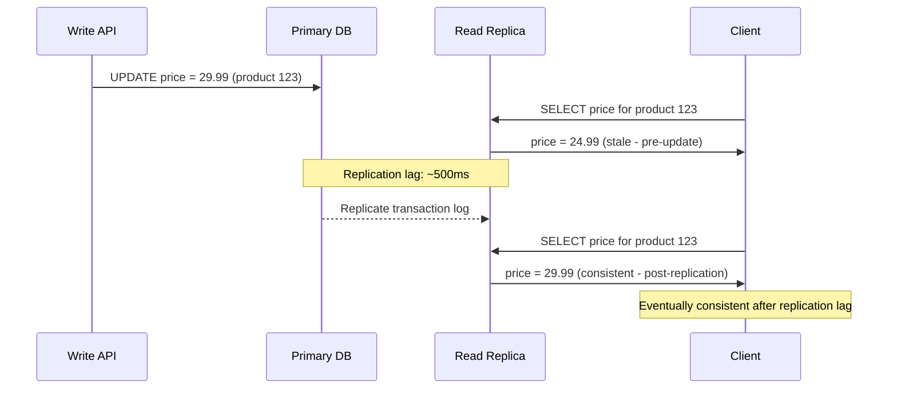
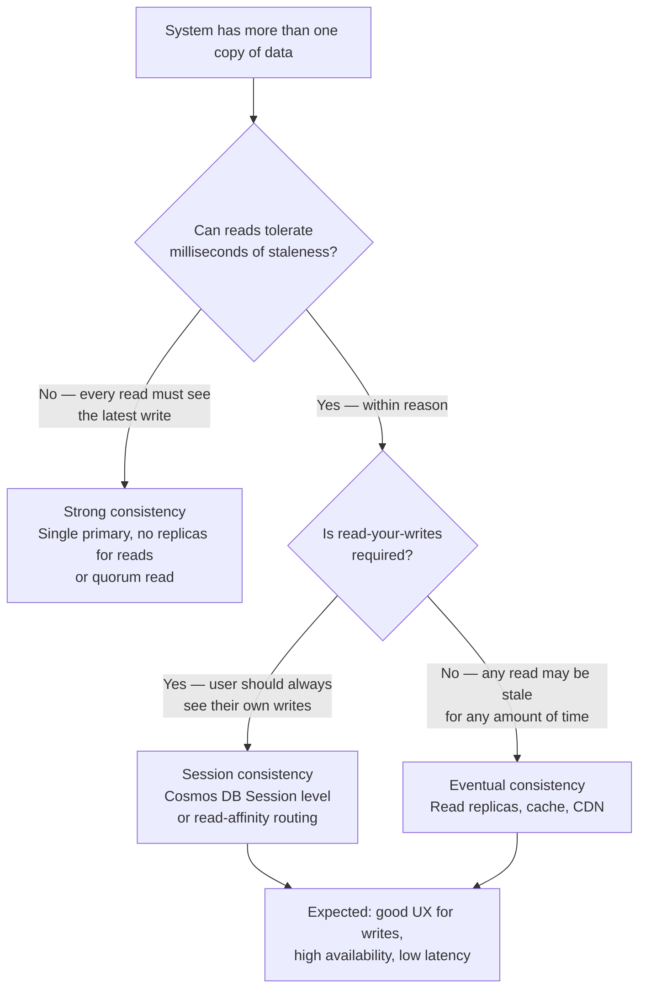

## Navigation

**Domain:** [[7 — System Design & Distributed Systems]] > **Group:** Scalability Patterns
**Previous:** [[7.253 — Caching as a Scalability Tool]] | **Next:** [[7.255 — Scale Cube — X, Y, Z Axes]]

### Prerequisites

- [[7.250 — Database Federation — Functional Partitioning]] — federation forces eventual consistency across services because cross-database writes cannot be atomic
- [[7.251 — CQRS for Scalability — Read-Write Split]] — CQRS with separate read/write stores introduces eventual consistency between the write model and read model
- [[7.253 — Caching as a Scalability Tool]] — caching forces eventual consistency between the cache and the source of truth

### Where This Fits

Eventual consistency is the guarantee that if no new writes are made to a piece of data, all reads will eventually return the last written value. It is not a bug or a fallback — it is an architectural choice that enables horizontal scale, high availability, and low latency by relaxing the strong consistency that single-node databases provide. A .NET engineer encounters it in every distributed system: the cache is stale, the read replica lags behind the primary, the CQRS read model shows old data, the federated service has not yet processed the event. The recognition trigger is the moment a stakeholder says "the data is wrong" — and it's not wrong, it's merely not yet consistent.

---

---

## Core Mental Model

Eventual consistency means the system guarantees that, in the absence of new writes, all replicas will converge to the same value. The core tradeoff is that between the moment a write is accepted and the moment it is visible to all readers, a reader may see stale data. What this trades is read correctness within the staleness window for write availability and system throughput: a strongly consistent system must coordinate across replicas before accepting a write, which adds latency and reduces availability during partitions (CAP theorem). The recognition trigger is the discovery that scaling a read-heavy system requires replicas or caches that can serve reads without waiting for the primary — and those replicas will lag.



### Classification

**Pattern category:** Distributed systems consistency model, scalability enabler.
**Abstraction layer:** Data layer — affects database replication, caching, event-driven architectures, and distributed transactions.
**Scope:** Cross-node data synchronization. Applies to any system with more than one copy of data (read replicas, caches, CQRS read models, federated services).
**When applied:** At any scale beyond a single database node. Read replicas, caching, CQRS, and federation all trade consistency for scale. Eventual consistency is the default for distributed systems.
**When not applied:** When the business requirement demands strong consistency: financial reconciliation, inventory allocation with oversell prevention, seat selection with double-booking prevention, any system where stale data causes financial or safety harm.

### Key Properties / Guarantees

|Property|Value|Condition|
|---|---|---|
|Staleness window |Varies by mechanism: 1ms–5s (read replicas), 100ms–5s (CQRS projections), TTL (cache) |Determined by replication mechanism, queue depth, and processing throughput|
|Write availability |High — write accepted immediately on primary without waiting for replica confirmation |Primary is available; no quorum required|
|Read availability |High — read from any replica without waiting for primary |At least one replica is available|
|Read correctness |Stale reads possible within staleness window |Reader hits a replica that has not yet received the latest write|
|Convergence guarantee |All replicas will eventually reflect the latest write |No new writes to the same key; replication path is healthy|
|Anomalies |Read skew, monotonic read violation, causal violation |Depend on consistency level (eventual, consistent prefix, bounded staleness, etc.)|

---

---

## Deep Mechanics

### How It Works

Eventual consistency emerges from any architecture where data flows from a write-accepting node to read-serving nodes through an asynchronous channel. The specific mechanisms differ by architecture type:

**Mechanism 1 — Transaction log replication (database read replicas):** The primary database writes to a transaction log. The read replica reads the log and applies changes. The lag is determined by the log apply rate minus the write rate. Typical lag: 100ms–5s on Azure SQL geo-replicated secondaries. If writes exceed the replica's apply capacity, lag grows unbounded.

**Mechanism 2 — Event-driven projection (CQRS read model):** The write side publishes an event to a message broker. The projection service consumes the event and updates the read model. The lag is the sum of: event publishing time (outbox poll interval: 100ms–1s), broker delivery latency (10–100ms), projection processing time (1–50ms per event, depends on queue depth). Total: 200ms–5s.

**Mechanism 3 — Cache-aside with TTL:** The cache entry has a TTL. After TTL expires, the next read fetches fresh data from the origin. The staleness window = remaining TTL when the data changed. If data changes 1 second after the cache was populated with a 60s TTL, the staleness window is 59 seconds.

**Mechanism 4 — Eventually consistent DNS / CDN:** DNS records have a TTL. CDN edge nodes cache content until TTL expires. Staleness window = remaining TTL (typically 60–3600 seconds for DNS, 0–86400 seconds for CDN).

**Runtime walkthrough — federated order processing with eventual consistency:**

1. User places order. Order Service writes to Order DB and publishes `OrderCreatedEvent` (write accepted, 50ms).
2. User immediately opens the order status page. Order Service queries its local Order DB — the order exists (strong consistency within the Order DB).
3. The page also shows "payment status" which is stored in Payment DB (federated service). Order Service calls Payment Service API or queries a local denormalized cache. The payment status is "pending" — the event has not reached Payment Service yet (staleness).
4. After 800ms, Payment Service consumes `OrderCreatedEvent`. It creates a payment record and updates its Payment DB. It publishes `PaymentProcessedEvent`.
5. After another 500ms, Order Service consumes `PaymentProcessedEvent`. It updates the order's payment status in Order DB.
6. User refreshes the page 3 seconds after placing the order. Payment status shows "completed" (eventually consistent after ~1.3 seconds of staleness).

The critical design property: the application must handle the intermediate state ("payment is being processed") gracefully — show a spinner, disable the "retry payment" button, or inform the user "your payment is being confirmed."

### Failure Modes

**Failure mode 1 — Read-your-write inconsistency:** A user updates their profile name and immediately views their profile. The read replica has not received the update. The user sees their old name. This is the most common eventual consistency complaint. Detection: user reports "I changed my name but it still shows the old one." Fix: use read-your-writes consistency by routing reads for recently written data to the primary (session-based read affinity). In Cosmos DB, use "Session" consistency level which provides read-your-writes within a session token. Cost of not fixing: users lose confidence in the system.

**Failure mode 2 — Monotonic read violation:** User refreshes a page and sees the new name. Refreshes again and sees the old name (reads from a replica that has not yet received the update). Detection: user reports "the name keeps changing back and forth." Fix: use monotonic reads by pinning a user session to a specific replica (session affinity or sticky reads). In Cosmos DB, session consistency prevents monotonic read violations within a session. Cost of not fixing: user confusion; the system appears buggy even though it works correctly from the database perspective.

**Failure mode 3 — Replica lag growing unbounded:** Write volume exceeds the replica's log application throughput. The replica falls further behind with every write. At peak traffic, lag grows to minutes. Detection: replication lag monitoring shows an upward trend. Fix: scale the replica (higher tier) or reduce write volume (batch writes, reduce replication targets). Cost of not fixing: reads become increasingly stale — users see data from minutes ago, not seconds.

**Failure mode 4 — Conflicting writes without conflict resolution:** Two services write to the same data concurrently (last-writer-wins, but the "last" write depends on clock skew). The system converges to the wrong value. Detection: reconciliation queries show unexpected final values. Fix: use version vectors, CRDTs, or a write-ordering service. For most systems, last-writer-wins with well-synchronized clocks (NTP) is sufficient. Cost of not fixing: silent data corruption when concurrent writes collide.

### .NET and Azure Integration

- **Azure SQL Read Replicas:** `ApplicationIntent=ReadOnly` in connection string routes queries to readable secondaries. Replication lag visible via `sys.dm_geo_replication_link_status`. Use `ReadOnly` context for reporting queries that can tolerate 1–5s staleness.
- **Azure Cosmos DB:** Tunable consistency levels: Strong (linearizability, 2x write latency), Bounded Staleness (configurable staleness window), Session (read-your-writes, monotonic reads), Consistent Prefix (no ordering violations), Eventual (lowest latency, any anomaly possible). Choose Session as default; use Strong for critical financial data.
- **Azure Service Bus:** Session-enabled queues/subscriptions provide ordered message delivery within a session key. Use sessions to ensure events for the same entity (e.g., order ID) are processed in order, preventing causal consistency violations in projections.
- **.NET EF Core + read replicas:** `DbContext` configured with `ReadOnly` connection string for query handlers. Write commands use the primary connection string. This is partial CQRS with eventual consistency on the read side.
- **Outbox pattern:** Ensures at-least-once event delivery from write side to projection pipelines. The gap between outbox write and event consumption IS the staleness window.

```csharp
// Read-only connection for stale-tolerant queries
builder.Services.AddDbContext<OrderReadDbContext>(options =>
    options.UseSqlServer(
        builder.Configuration.GetConnectionString("OrderDbReplica"),
        sqlOptions => sqlOptions.UseApplicationIntent(ApplicationIntent.ReadOnly)));

// Write connection for commands (strong consistency)
builder.Services.AddDbContext<OrderWriteDbContext>(options =>
    options.UseSqlServer(
        builder.Configuration.GetConnectionString("OrderDbPrimary")));
```

---

## Production Patterns and Implementation

### Primary Implementation

Handling eventual consistency requires three patterns: staleness detection, read-your-writes session management, and convergence monitoring.

```csharp
// Infrastructure/Consistency/StalenessMonitor.cs
using System.Diagnostics;
using Microsoft.EntityFrameworkCore;

public sealed class StalenessMonitor : BackgroundService
{
    private readonly IServiceScopeFactory _scopeFactory;
    private readonly ILogger<StalenessMonitor> _logger;

    public StalenessMonitor(IServiceScopeFactory scopeFactory, ILogger<StalenessMonitor> logger)
    {
        _scopeFactory = scopeFactory;
        _logger = logger;
    }

    protected override async Task ExecuteAsync(CancellationToken stoppingToken)
    {
        while (!stoppingToken.IsCancellationRequested)
        {
            try
            {
                using var scope = _scopeFactory.CreateScope();
                var readDb = scope.ServiceProvider.GetRequiredService<OrderReadDbContext>();
                var writeDb = scope.ServiceProvider.GetRequiredService<OrderWriteDbContext>();

                var staleThreshold = DateTime.UtcNow.AddSeconds(-10);

                var staleCount = await readDb.OrderSummaries
                    .Where(o => o.LastSyncAt < staleThreshold)
                    .CountAsync(stoppingToken);

                if (staleCount > 100)
                {
                    _logger.LogWarning("Stale read model entries: {Count} (threshold: 100)", staleCount);
                }

                // Check max staleness
                var maxStaleness = await readDb.OrderSummaries
                    .MaxAsync(o => (DateTime?)o.LastSyncAt, stoppingToken) ?? DateTime.MinValue;
                var maxLagSeconds = (DateTime.UtcNow - maxStaleness).TotalSeconds;

                if (maxLagSeconds > 30)
                {
                    _logger.LogError("Max replication lag: {Lag:F1}s — exceeds 30s threshold", maxLagSeconds);
                }
            }
            catch (Exception ex)
            {
                _logger.LogError(ex, "Staleness monitor failed");
            }

            await Task.Delay(5000, stoppingToken);
        }
    }
}

// Infrastructure/Consistency/SessionConsistencyMiddleware.cs
// Provides session-level read-your-writes consistency via Cosmos DB session tokens
public sealed class SessionConsistencyMiddleware
{
    private readonly RequestDelegate _next;

    public SessionConsistencyMiddleware(RequestDelegate next) => _next = next;

    public async Task InvokeAsync(HttpContext context)
    {
        // Capture session token from request if present
        var sessionToken = context.Request.Headers["Cosmos-Session-Token"].FirstOrDefault();
        if (sessionToken is not null)
        {
            // Store in Items for downstream Cosmos DB clients to use
            context.Items["SessionToken"] = sessionToken;
        }

        await _next(context);

        // Emit session token in response for client to send back
        if (context.Items["NewSessionToken"] is string newToken)
        {
            context.Response.Headers["Cosmos-Session-Token"] = newToken;
        }
    }
}

// Application/Consistency/ConsistentReadService.cs
public sealed class ConsistentReadService
{
    private readonly OrderWriteDbContext _writeDb;
    private readonly OrderReadDbContext _readDb;
    private readonly ILogger<ConsistentReadService> _logger;

    public ConsistentReadService(OrderWriteDbContext writeDb, OrderReadDbContext readDb,
        ILogger<ConsistentReadService> logger)
    {
        _writeDb = writeDb;
        _readDb = readDb;
        _logger = logger;
    }

    public async Task<OrderDetailDto?> GetOrderWithReadYourWritesAsync(
        Guid orderId, Guid? lastWriteId, CancellationToken ct)
    {
        // If the client provides the ID of their last write, check if the read model
        // has caught up. If not, read from the write store (strong consistency).
        if (lastWriteId.HasValue)
        {
            var projected = await _readDb.OrderSummaries
                .AnyAsync(o => o.Id == orderId && o.LastAppliedEventId == lastWriteId.Value, ct);
            if (!projected)
            {
                _logger.LogInformation("Read-your-writes: reading order {OrderId} from write store", orderId);
                var order = await _writeDb.Orders
                    .Include(o => o.Items)
                    .FirstOrDefaultAsync(o => o.Id == orderId, ct);
                if (order is null) return null;
                return OrderDetailDto.FromEntity(order);
            }
        }

        var summary = await _readDb.OrderSummaries
            .FirstOrDefaultAsync(o => o.Id == orderId, ct);
        return summary is null ? null : OrderDetailDto.FromReadModel(summary);
    }
}
```

### Configuration and Wiring

```csharp
// Program.cs
var builder = WebApplication.CreateBuilder(args);

// Write store (strong consistency)
builder.Services.AddDbContext<OrderWriteDbContext>(options =>
    options.UseSqlServer(builder.Configuration.GetConnectionString("OrderDbPrimary")));

// Read store (eventual consistency — read replica)
builder.Services.AddDbContext<OrderReadDbContext>(options =>
    options.UseSqlServer(
        builder.Configuration.GetConnectionString("OrderDbReplica"),
        sqlOptions => sqlOptions.UseApplicationIntent(ApplicationIntent.ReadOnly)));

// Consistency services
builder.Services.AddHostedService<StalenessMonitor>();
builder.Services.AddSingleton<ConsistentReadService>();
builder.Services.AddTransient<SessionConsistencyMiddleware>();

var app = builder.Build();
app.UseMiddleware<SessionConsistencyMiddleware>();
app.MapControllers();
app.Run();
```

### Common Variants

**Variant 1 — Conditional read routing:** Route reads to the primary (strong consistency) or replica (eventual consistency) based on the caller's staleness tolerance. Public API → replica. Admin refresh → primary.

```csharp
[ApiController]
public class OrdersController : ControllerBase
{
    [HttpGet("public/{id}")]
    public async Task<IActionResult> GetPublicOrder(Guid id) // Eventual — uses replica
    {
        var order = await _readStore.GetOrderAsync(id);
        return Ok(order);
    }

    [HttpGet("admin/{id}")]
    public async Task<IActionResult> GetAdminOrder(Guid id) // Strong — uses primary
    {
        var order = await _writeStore.GetOrderAsync(id);
        return Ok(order);
    }
}
```

**Variant 2 — Cosmos DB session consistency:** The simplest way to provide read-your-writes consistency without managing read replicas. Each Cosmos DB client session has a session token. The SDK automatically sends the session token with requests; the server guarantees that the read reflects all writes within that session token's scope.

**Variant 3 — NDCG (Nearest, Data Center, Global) latency optimization:** Use Azure Traffic Manager or Cosmos DB multi-region writes with eventual consistency. Writes are accepted in the nearest region. Reads from other regions see the write after cross-region replication (typically < 1s for Cosmos DB multi-master). The staleness window is the cross-region replication latency.

### Real-World .NET Ecosystem Example

**Azure Cosmos DB consistency model:** Cosmos DB is the canonical example of tunable eventual consistency. At the Eventual level, writes are accepted in 10–15ms (single-region) and replicated across regions within 100ms–1s. At the Strong level, writes require quorum acknowledgment (2x write latency, ~30ms) but reads are guaranteed to see the latest write. The default Session level provides read-your-writes and monotonic reads within a session (defined by the Cosmos DB session token) with write latency close to Eventual. .NET applications using the Cosmos DB SDK automatically handle session tokens transparently — the developer needs only to choose the consistency level in the portal or via `CosmosClientOptions`. The production recommendation: use Session as the default, Eventual for bulk read-only workloads, Strong for financial ledgers.

---

## Gotchas and Production Pitfalls

### The "I Just Wrote It, Where Is It?" Problem

**Pitfall:** User saves a setting, gets a success response, refreshes the page, and the old setting is still displayed. The API writes to the primary (strong consistency) but the GET request hits a read replica that hasn't received the replication.

```csharp
// ❌ User writes to primary, reads from replica
[HttpPost("profile")]
public async Task<IActionResult> UpdateProfile(ProfileUpdate command)
{
    await _primaryRepo.UpdateAsync(command); // Writes to primary
    return Ok();
}

[HttpGet("profile")]
public async Task<IActionResult> GetProfile()
{
    var profile = await _replicaRepo.GetAsync(); // Reads from replica (may be stale)
    return Ok(profile);
}
```

**Symptom:** User reports "the save doesn't work." Support team confirms the write succeeded (logs show 200 OK). The user must refresh 2–5 times before seeing the change.

**Fix:** Use read-your-writes consistency: after a write, read from the primary for that user's session. Route via a session cookie or session token that the middleware inspects to choose the read source.

**Cost of not fixing:** Users lose trust in the system. Support volume increases. Engineering investigates "save bugs" that don't exist.

### The Replica That Cannot Catch Up

**Pitfall:** A heavy ETL job runs against the primary database during business hours. The job generates millions of log writes. The read replica cannot apply the log fast enough. Replication lag grows to 30 minutes.

**Symptom:** Dashboard queries return data from 30 minutes ago. The operations team makes decisions on stale data.

**Fix:** Schedule ETL jobs during low-traffic periods. Use Azure SQL Business Critical tier which has faster log apply rates on replicas. Monitor `replication_lag_seconds` and alert if it exceeds your consistency SLO.

**Cost of not fixing:** Business decisions made on stale data. Regulatory compliance violations if data freshness is required.

### The Causal Consistency Violation

**Pitfall:** Two writes happen in order: (1) create order, (2) update order status to "confirmed." A read replica sees write #2 before write #1 (replication order not guaranteed). The application shows a confirmed order that doesn't exist.

**Symptom:** Application shows "Order #123 confirmed" but clicking the order shows "not found."

**Fix:** Use a session token or consistent prefix read guarantee. Cosmos DB's "Consistent Prefix" level guarantees reads never see writes out of order. For SQL Server replicas, use `APPLOCK` or sequence numbers to serialize related writes. In event-driven systems, use session-enabled queues to ensure events for the same entity are processed in order.

**Cost of not fixing:** Data display errors that are hard to reproduce. Application logic that assumes causal ordering may break.

### The Last-Writer-Wins Collision

**Pitfall:** Two services both update the same entity concurrently. Service A sets `status = "cancelled"`. Service B sets `status = "confirmed"` (processing a delayed payment event). The write that arrives last wins — but "last" is determined by clock skew, not application logic.

**Symptom:** An order is confirmed after being cancelled. The customer is charged. The order ships.

**Fix:** Use version vectors or optimistic concurrency. EF Core's concurrency token (`[Timestamp]` byte array) throws `DbUpdateConcurrencyException` when a write conflicts. The application retries after reading the latest version. In Cosmos DB, use conditional writes with ETags.

```csharp
// ✅ Optimistic concurrency prevents lost updates
public async Task CancelOrderAsync(Guid orderId, byte[] expectedVersion)
{
    var order = await _db.Orders.FindAsync(orderId);
    if (!order.Version.SequenceEqual(expectedVersion))
        throw new ConcurrencyException("Order was modified by another operation");
    order.Status = "Cancelled";
    await _db.SaveChangesAsync(); // Throws DbUpdateConcurrencyException if version changed
}
```

**Cost of not fixing:** Data corruption — the final state depends on timing, not business logic.

### The Monitoring Gap

**Pitfall:** The team sets up replication lag monitoring for Azure SQL replicas but forgets to set up staleness monitoring for the CQRS read model projection. The SQL replica is healthy (100ms lag), but the CQRS projection has been failing silently for 3 hours.

**Symptom:** No alerts fire. The read model is 3 hours stale. Users see old data. The team doesn't know until a support escalation.

**Fix:** Every eventually consistent read model needs its own staleness monitoring. The monitor compares a sample of data between the source (write model) and the target (read model) and reports the staleness. Alert when staleness exceeds the SLO (typically 5 seconds for CQRS projections).

**Cost of not fixing:** Silent data divergence. The team discovers the problem hours after it starts, when the cost of recovery is highest.

---

## Tradeoffs and Decision Framework

### Tradeoff Matrix

| Dimension | Eventual Consistency | Strong Consistency | Read-Your-Writes (Session) | Bounded Staleness |
|---|---|---|---|---|
| Write latency | Low (10–15ms Cosmos DB single-region) | High (30–50ms, quorum required) | Low (same as eventual) | Medium (20–30ms, bounded staleness check) |
| Read latency | Low (any replica) | Low (primary only) | Low (session affinity) | Low (bounded by staleness window) |
| Write availability | High (accepts write on any node) | Lower (must have quorum available) | High (same as eventual) | High (same as eventual) |
| Read-your-writes | No | Yes | Yes | Yes (within staleness bound) |
| Monotonic reads | No | Yes | Yes | Yes (within staleness bound) |
| Causal consistency | No | Yes | Yes | Yes (within staleness bound) |
| Operational complexity | Low | High (quorum management, failover) | Low | Medium (staleness bound configuration) |
| Anomalies possible | Read skew, monotonic violation, causal violation | None | Read-your-writes guaranteed, monotonic guaranteed | Read skew within staleness window |

### When to Apply



### When NOT to Apply

- [ ] The system has a single database with no replicas, no caches, and no federated services — all reads hit the primary. There is no eventual consistency because there is no second copy of data.
- [ ] The business requirement demands linearizability (every read sees the latest write): financial settlement, seat inventory, allocation of limited resources where oversell is unacceptable.
- [ ] The application code cannot handle intermediate states — if every page load fetches data from a potentially stale source and the UI shows a loading spinner indefinitely, the application is not designed for eventual consistency.
- [ ] The team cannot monitor staleness — running an eventually consistent system without staleness monitoring is like running a cache without a hit ratio metric.

### Scale Thresholds

- "Eventual consistency (via read replicas) becomes necessary above ~1,000 reads/second on a single Azure SQL database — the primary cannot serve both writes and reads at this volume."
- "Session consistency becomes necessary when users interact with the system in a read-after-write pattern (profile update → view profile, create order → view order) and the delay causes confusion."
- "Bounded staleness becomes necessary when regulatory or business requirements specify a maximum data age (e.g., "risk dashboard must show data no older than 5 seconds")."
- "Cross-region eventual consistency (Cosmos DB multi-master) becomes necessary when users are globally distributed and write latency from Australia to US East exceeds 200ms."

---

## Interview Arsenal

### Question Bank

1. What is eventual consistency and why is it necessary for distributed systems at scale?
2. What are the four common anomalies that eventual consistency permits?
3. How do you provide read-your-writes consistency on top of an eventually consistent read replica?
4. Compare eventual consistency with strong consistency — what do you gain and what do you lose?
5. What is the CAP theorem and how does it relate to eventual consistency?
6. Design an e-commerce order system where inventory counts must be accurate to within a few seconds, but users accept that the "orders in progress" dashboard can be a few seconds behind. What consistency model do you use for each?
7. How does Cosmos DB implement tunable consistency, and which levels correspond to which consistency guarantees?
8. What monitoring would you put in place for an eventually consistent system to detect staleness violations?

### Spoken Answers

**Q: What is eventual consistency and why is it necessary for distributed systems at scale?**

> **Average answer:** It means data will eventually be consistent across all copies. It's necessary for scaling because strong consistency is slow.

> **Great answer:** Eventual consistency guarantees that if no new writes are made to a piece of data, all replicas will eventually return the same value. It is necessary because strong consistency (linearizability) requires a coordination round-trip between replicas before every read or write, which limits throughput to the slowest replica and reduces availability during network partitions. In the CAP theorem, a system that remains available during a partition must choose between consistency and availability — eventual consistency chooses availability. Concretely, an eventually consistent system can accept writes at any node (high write throughput) and serve reads from any replica (high read throughput), with the understanding that a reader may not see the latest write for some bounded time. In .NET, eventual consistency appears in every system with a cache, a read replica, a CQRS projection, or a federated service. The design question is not "should we be eventually consistent?" but "how do we bound and monitor the staleness window?"

**Q: What are the four common anomalies that eventual consistency permits?**

> **Great answer:** The four anomalies are: (1) Read skew — a read at time T1 sees state before a write, and a read at T2 sees state after, but both reads are from different replicas. (2) Monotonic read violation — a user reads value A, then later reads value B (the new value), then reads value A again (from a different replica that hasn't received the update). This is the "data is flipping back and forth" problem. (3) Write skew — two concurrent writes both read the same initial state and make decisions based on it, leading to an invariant violation (e.g., two nurses both check "patient is not on medication" simultaneously and both administer a drug that cannot be given together). (4) Causal violation — writes are seen out of causal order: a user sees "order confirmed" before seeing "order created" because the replication path for the second event was faster. Cosmos DB's Consistent Prefix level prevents causal violations. Session consistency prevents monotonic read violations and read-your-writes violations. Bounded staleness prevents reads from seeing data older than a time window. Only Strong consistency prevents all four.

**Q: How does the CAP theorem relate to eventual consistency?**

> **Great answer:** The CAP theorem states that a distributed system can provide at most two of three properties: Consistency (every read sees the most recent write), Availability (every request receives a response), and Partition Tolerance (the system continues during network partitions). Eventual consistency is the consistency model chosen when a system prioritizes Availability and Partition Tolerance over Consistency. When a network partition splits replicas into two groups, an eventually consistent system allows both groups to continue accepting writes (Availability). After the partition heals, the replica groups must reconcile their divergent writes using a convergence strategy (last-writer-wins, vector clocks, CRDTs). A strongly consistent system would refuse writes on the minority side (losing availability) to prevent divergence. The PACELC extension adds that even when there is no partition (the "else" in PAC-ELC), the system must choose between Latency and Consistency — eventually consistent systems optimize for low latency during normal operation by not waiting for replica coordination. Azure Cosmos DB implements this directly: choose Strong consistency and accept higher write latency, or choose Eventual and accept lower write latency but tolerate staleness.

### System Design Interview Trigger

When an interviewer asks you to design a system that spans multiple data centers, uses caching, has read replicas, or involves asynchronous processing between services (nearly every system design problem), eventual consistency is a required topic. The interviewer tests whether you (a) recognize that strong consistency is impossible at global scale, (b) can articulate the tradeoff, (c) know which consistency model is appropriate for which operation, and (d) can design around the anomalies that eventual consistency permits. The classic trigger question: "what happens when a user creates a post and immediately refreshes the page, but the post doesn't appear?" — they are testing whether you understand read-your-writes consistency and how to implement it.

### Comparison Table

| | Eventual | Session | Bounded Staleness | Strong |
|---|---|---|---|---|
| Read-your-writes | No | Yes | Yes (within bound) | Yes |
| Monotonic reads | No | Yes | Yes (within bound) | Yes |
| Causal consistency | No | Yes (within session) | Yes | Yes |
| Write latency | Low | Low | Medium | High |
| Read availability | Any replica | Session-pinned replica | Any replica within bound | Primary or quorum |
| Use case | CDN, caching, global DNS | User-facing apps after profile update | Real-time dashboards, risk monitoring | Financial settlement, inventory |
| Cosmos DB level | Eventual | Session | Bounded Staleness | Strong |
| .NET implementation | Read replica, cache-aside, CDN | Cosmos DB session token, read-affinity routing | Bounded staleness in Cosmos DB connection policy | Single primary database, quorum reads |

---

## Architecture Decision Record

**Status:** Accepted

**Context:** The global ticketing platform serves users in 8 regions. The order placement flow requires that a ticket cannot be oversold — inventory must be accurate at the moment of purchase. However, the "my orders" page (showing past purchases) and the event listing page (showing available tickets) can tolerate seconds of staleness. The current architecture uses a single Azure SQL database in US East for all writes. Users in Australia experience 250ms write latency. The platform needs to scale to serve 50M users globally.

**Options Considered:**

1. **Cosmos DB multi-master with Session consistency** — writes accepted in the user's nearest region (strong consistency within a session via session tokens). Inventory writes use conditional writes with ETags to prevent oversell. Order history reads use Eventual consistency with session tokens.
2. **Azure SQL with geo-replication and read scale-out** — primary in US East for all writes. Read replicas in each region for reads. Write latency for non-US users remains high (250ms). Strong consistency for inventory via primary reads.
3. **CockroachDB / Spanner-style strong consistency** — globally distributed strongly consistent database. Low write latency in all regions but significantly higher complexity and cost.
4. **Eventual consistency for everything** — oversell is tolerated and corrected via post-purchase reconciliation.

**Decision:** Cosmos DB multi-master with Session consistency (Option 1), because Option 2's write latency for non-US users is unacceptable at global scale (250ms per write). Option 3 is too operationally complex for the team. Option 4's oversell risk is unacceptable — the business cannot accept "refund if oversold." Session consistency provides read-your-writes within each user's session (acceptable UX for order history). Inventory writes use conditional ETags to prevent oversell without requiring Strong consistency for all data.

**Consequences:**
- ✅ Write latency drops from 250ms to 20ms for users outside US East
- ✅ Inventory writes are strongly consistent at the item level via conditional ETags
- ✅ Order history reads are eventually consistent but session tokens ensure read-your-writes
- ⚠️ Cross-region conflict resolution: if two users buy the last ticket simultaneously in different regions, Cosmos DB's last-writer-wins may create a temporary oversell — the application must detect and compensate (cancel one order, refund)
- ⚠️ Increased cost: Cosmos DB multi-master is more expensive than single-region SQL
- ❌ Complex conflict resolution logic required for the inventory edge case

**Review Trigger:** Revisit if (a) cross-region write conflicts exceed 0.1% of orders (may need custom conflict resolution or switch to Strong consistency for inventory), (b) read-your-writes violations are reported by more than 1% of users (may need to increase session token TTL or switch to Bounded Staleness), or (c) the team cannot maintain the conflict resolution logic (may need to accept higher write latency with Option 3).

---

## Self-Check

### Conceptual Questions

1. What is eventual consistency and what architectural tradeoff does it represent?
2. What are the four anomalies that eventual consistency permits?
3. Under what conditions is eventual consistency NOT acceptable?
4. How do you measure the staleness window in an eventually consistent system?
5. Which Azure Cosmos DB consistency level provides read-your-writes without strong consistency overhead?
6. Compare eventual consistency with strong consistency in terms of write latency and write availability.
7. What is the CAP theorem and how does it relate to the decision to use eventual consistency?
8. How does eventual consistency relate to [[7.253 — Caching as a Scalability Tool]]?
9. What is the non-obvious production consequence of not implementing read-your-writes consistency in a system with read replicas?
10. Can you explain eventual consistency in 60 seconds to a non-expert using a library analogy?

<details>
<summary>Answers</summary>

1. Eventual consistency guarantees that if no new writes are made, all replicas will converge to the same value. It trades read correctness within a staleness window for write availability and system throughput. It is the default consistency model for distributed systems because strong consistency requires coordination that reduces availability during partitions.

2. (1) Read skew — seeing a mix of old and new data. (2) Monotonic read violation — seeing data flip back to an older state. (3) Write skew — two concurrent writes based on the same initial state violate an invariant. (4) Causal violation — seeing writes out of their cause-effect order.

3. It is not acceptable when the business requirement demands linearizability (every read must see the latest write): financial settlement, seat inventory for airlines, limited-edition ticket sales where oversell is unacceptable, medical safety systems where stale data could cause harm.

4. Measure the time between a write being committed on the primary and the write being visible on the read replica or read model. For SQL replicas: `sys.dm_geo_replication_link_status`. For CQRS projections: compare the last-updated timestamp on the read model with the current time. For caching: the TTL defines the maximum staleness.

5. Cosmos DB Session consistency. It provides read-your-writes, monotonic reads, and consistent prefix reads within a session token scope, with write latency close to Eventual (10–20ms) rather than Strong (30–50ms).

6. Eventual consistency: low write latency (write accepted immediately on one node), high write availability (any node accepts writes). Strong consistency: higher write latency (must coordinate across quorum), lower write availability (if quorum is unavailable, writes are rejected).

7. The CAP theorem states a distributed system can provide at most two of Consistency, Availability, and Partition Tolerance. Eventual consistency is the choice of Availability + Partition Tolerance over Consistency. During a network partition, an eventually consistent system continues accepting writes on both sides; a strongly consistent system rejects writes on the minority side.

8. [[7.253 — Caching as a Scalability Tool]]: caching is a form of eventual consistency — the cache is eventually consistent with the source of truth. The TTL defines the staleness bound. The same read-your-writes and invalidation concerns apply: a user who writes and then reads from cache may see stale data.

9. The non-obvious consequence is users reporting "the save doesn't work" — they write data, get a success response, read the data, and see the old value. Support teams investigate "save bugs" that don't exist. The issue is not the write but the read path routing to a stale replica.

10. Think of a message board in an office building. Someone posts a notice (write). People in different parts of the building see it at different times — those near the board see it immediately, those on another floor see it when they walk past during their coffee break. Eventually, everyone has seen the notice. If someone posts a correction, the correction spreads the same way. For a few minutes, some people have the old information and some have the new. This is eventual consistency — the building doesn't halt all work while a messenger runs to every floor with the updated notice.

</details>

---

### Scenario Challenges

**Scenario 1 — Diagnose the problem**

A social media app allows users to post comments and like posts. Users report that after liking a post, the like count sometimes decreases by 1 when they refresh. The count goes up and down for several refreshes before stabilizing. The app uses Cosmos DB with Eventual consistency.

<details>
<summary>Diagnosis</summary>

**Root cause:** The like operation writes to one Cosmos DB replica. The GET request that reads the like count hits a different replica that has not yet received the write (read skew). When the user refreshes, they bounce between replicas in different states of replication. The "decrease" happens when they read from a replica that hasn't received their own like yet, then read from one that has, then back to one that hasn't.

**Evidence:** The anomaly only happens on the first few refreshes after a like. After 1–2 seconds, the count stabilizes. The application never provides monotonic read guarantees.

**Fix:** Switch the likes API to Session consistency. The session token from the write operation is sent with the read request, ensuring the read replica has applied the write before returning the count. Within a session, the user always sees their own like.

```csharp
var client = new CosmosClient(connectionString, new CosmosClientOptions
{
    ConsistencyLevel = ConsistencyLevel.Session
});
```

**Prevention:** Use Session consistency as the default for all user-facing operations. Reserve Eventual consistency for background processing and analytics where monotonic reads are not required.

</details>

---

**Scenario 2 — Design decision**

You are designing the data architecture for a flight booking system. The inventory (available seats on a specific flight) must be 100% accurate when a booking is made — overselling a seat is not acceptable. However, the "recent bookings" dashboard for the operations team can show data that is up to 30 seconds stale. What consistency model do you use for each?

<details>
<details>
<summary>Decision and Reasoning</summary>

**Choice:** Strong consistency for seat inventory writes and reads. Bounded staleness (5 seconds) for the operations dashboard reads. Session consistency for the user's "my bookings" page.

**Tradeoffs accepted:** Seat inventory writes will be slower (must coordinate across replicas) but this is acceptable because flight booking volume is low relative to inventory checks. The operations dashboard accepts 5-second staleness — the team makes decisions on near-real-time data, not absolutely real-time.

**Implementation sketch:**
```csharp
// Inventory — strong consistency via Cosmos DB Strong or primary SQL with quorum reads
var inventoryClient = new CosmosClient(connectionString, new CosmosClientOptions
{
    ConsistencyLevel = ConsistencyLevel.Strong
});

// Conditional write prevents oversell
var response = await container.PatchItemAsync<SeatInventory>(
    flightId.ToString(), partitionKey,
    new[] { PatchOperation.Increment("/availableSeats", -1) },
    requestOptions: new PatchItemRequestOptions
    {
        FilterPredicate = "FROM c WHERE c.availableSeats > 0"
    });
if (response.StatusCode == HttpStatusCode.OK)
{
    // Seat reserved
}

// Operations dashboard — eventual with bounded staleness
var dashboardClient = new CosmosClient(connectionString, new CosmosClientOptions
{
    ConsistencyLevel = ConsistencyLevel.BoundedStaleness,
    ConsistencyLevelConfiguration = new ConsistencyLevelConfiguration
    {
        MaxStalenessInterval = TimeSpan.FromSeconds(5)
    }
});
```

</details>

---

**Scenario 3 — Failure mode**

Your microservice platform uses the outbox pattern for cross-service events. The Order Service publishes `OrderCreatedEvent`. The Inventory Service consumes it and reserves inventory. During a traffic spike, the Order Service's outbox publisher falls behind — events are published 30 seconds after the order is created. The Inventory Service processes them immediately but there is a 30-second window where the order exists but inventory is not reserved.

<details>
<summary>Investigation and Fix</summary>

**Investigation steps:**
1. Check the OutboxMessages table: are there unprocessed messages older than 5 seconds? How many?
2. Check the outbox publisher's processing rate: is it matching the write rate?
3. Check the Service Bus queue depth: are messages accumulating?
4. Check the outbox publisher's error logs: is it crashing, or is it simply too slow?

**Confirming evidence:** OutboxMessages has 15,000 unprocessed messages. The outbox publisher processes 200 events/second. The write rate is 400 orders/second during the spike. The net negative rate means queue depth grows by 200 messages/second. The backlog of 15,000 messages = 75 seconds of staleness.

**Immediate mitigation:** Scale the outbox publisher from 1 to 4 parallel consumers. This addresses the immediate throughput deficit.

**Permanent fix:** Add backpressure to the outbox: if the outbox table grows beyond 10,000 unprocessed messages, the write API should start rejecting requests with HTTP 503 until the outbox catches up. This prevents unbounded staleness.

**Post-mortem item:** The outbox publisher's concurrency is now configurable and auto-scales based on queue depth.

</details>

---

**Scenario 4 — Scale it**

Your startup uses a single Azure SQL database for both reads and writes. Current traffic: 500 writes/second, 2,000 reads/second. The database is at 70% DTU. You expect 10x growth in 12 months (5,000 writes/second, 20,000 reads/second). How does eventual consistency help you scale?

<details>
<summary>Scaling Strategy</summary>

**Bottleneck this addresses:** A single Azure SQL database has finite DTU. At 5,000 writes + 20,000 reads/second, the database will exceed DTU capacity regardless of tier. The read workload (80% of total) must be offloaded.

**How it helps:** Eventual consistency enables read replicas. Add 2–4 Azure SQL read replicas. Route all read queries to the replicas. The primary handles only writes. The database DTU drops because reads are distributed. Reads are eventually consistent (sub-second replication lag).

**What it does not solve:** Write DTU — the primary still handles 5,000 writes/second. If the primary is the bottleneck, federation (split writes across databases) or sharding becomes necessary.

**Implementation order:**
1. First: add one read replica and test query routing with `ApplicationIntent=ReadOnly`.
2. Second: add read-your-writes consistency: after a write, pin subsequent reads from that user to the primary for 5 seconds.
3. Third: add more replicas as read traffic grows (scale out replicas, not up).
4. Fourth: add caching (Redis) for the most popular read queries to reduce replica load.
5. Fifth: if write capacity becomes the bottleneck, consider federation or sharding.

</details>

---

**Scenario 5 — Interview simulation**

The interviewer says: "Design a global social media platform where users post updates, follow other users, and see a timeline. The system must be available globally with sub-second write latency. Posts must be visible on the timeline within a few seconds. How do you handle consistency?"

<details>
<summary>Model Response</summary>

"The fundamental insight is that social media has asymmetric consistency requirements. The write path — creating a post — must be fast (sub-second). The read path — the timeline — can tolerate seconds of staleness. We optimize for write availability and read freshness, not strong consistency.

For writes: use Cosmos DB multi-master with Eventual consistency. The user's post is written to the nearest regional Cosmos DB replica. Write latency is 10–20ms regardless of the user's location. Each post gets a globally unique ID and a timestamp.

For the timeline read: use a fanout-on-read approach with caching. When a user opens the app, the timeline service retrieves the user's followed-user list from a Redis cache, queries the last 50 posts from each followed user's Cosmos DB partition (using point reads — fast at Eventual consistency), merges by timestamp, and returns the top 100. The result is cached in Redis with a 5-second TTL. If two reads hit different Cosmos DB replicas, the timeline might miss a very recent post from a followed user — acceptable because the next refresh (within 30 seconds) will include it.

For the read-your-writes case: when a user posts and immediately refreshes their timeline, they expect to see their own post. We implement session consistency: the user's last post ID is stored in the session (Redis, keyed by user session). The timeline read checks Redis for the user's own last post ID. If it's not in the Cosmos DB query results, the timeline service fetches the post directly from Cosmos DB with a point read using the session token (ensuring read-your-writes within the session). This adds 10ms but only for the user's own post.

The hard case is the global fanout: a celebrity with 10M followers posts. Pushing 10M timeline entries is too expensive. We use hybrid fanout: for the celebrity, we don't push — we add a special handling in the timeline merge: the timeline service always includes the last 3 posts from a set of 'high-priority followees' (followers > 100K) regardless of when they were fetched. This ensures celebrity posts appear quickly without fanout-on-write.

The non-obvious tradeoff is that we accept causal violations: a user might see a reply to a post before they see the original post, because the reply writes to a different partition. We address this on the client side: if the timeline contains replies whose parent post is not present, the client makes a background fetch for the parent post. This is a product decision — showing the content slightly out of order is better than delaying the reply for strong consistency."

</details>
