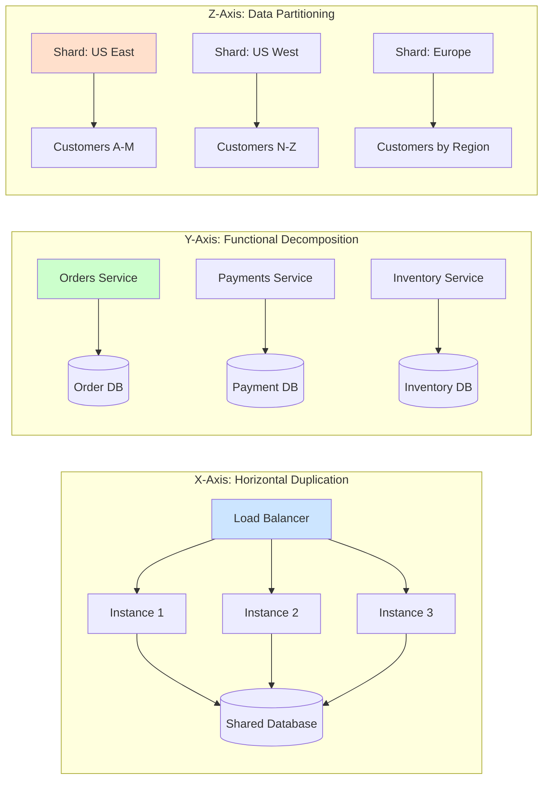
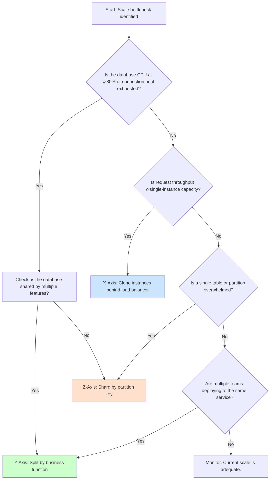
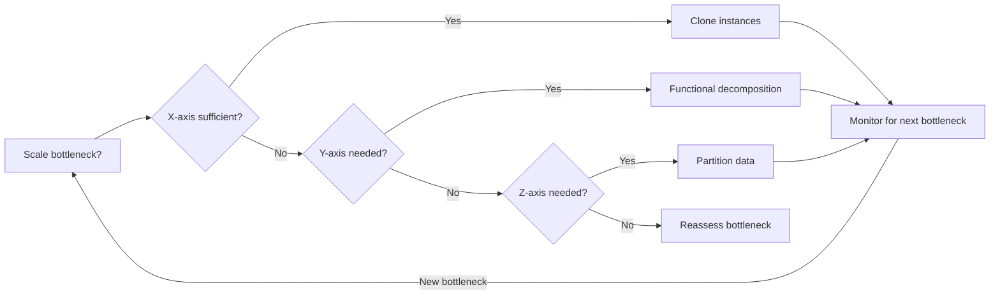

## Navigation

**Domain:** [[7 — System Design & Distributed Systems]] > **Group:** Scalability Patterns
**Previous:** [[7.254 — Eventual Consistency Trade-Off for Scale]] | **Next:** — (last in Scalability Patterns group)

### Prerequisites

- [[7.250 — Database Federation — Functional Partitioning]] — the Y-axis of the scale cube is federation: splitting by business function
- [[7.222 — Database Sharding — Overview]] — the Z-axis of the scale cube is sharding: splitting by row key or hash
- [[7.207 — Stateless Services — Design Principles]] — the X-axis requires stateless services; state must be externalized for horizontal duplication to work

### Where This Fits

The Scale Cube (AKF Scale Cube) is a conceptual framework that defines three dimensions of scalability: X-axis (horizontal duplication — clone and load balance), Y-axis (functional decomposition — split by business capability), and Z-axis (data partitioning — split by data key). A .NET engineer encounters it when deciding how to scale a system that has outgrown a single instance: the X-axis buys time (clone the API), the Y-axis buys independence (split into microservices), and the Z-axis buys throughput (shard the database). The framework prevents the common mistake of applying only one axis — for example, cloning an API (X-axis) without addressing the database bottleneck that limits all instances (Z-axis needed), or splitting into microservices (Y-axis) without sharding the data that each service owns (Z-axis still needed).

---

---

## Core Mental Model

The Scale Cube defines three independent scaling dimensions: X (clone and load balance), Y (split by function), Z (split by data key). The invariant is that these three dimensions are orthogonal — you can apply any combination of the three to reach the required scale. What this trades is simplicity for capacity: each axis adds operational complexity (X needs load balancers and session externalization, Y needs inter-service communication, Z needs a sharding strategy and cross-shard query handling). The recognition trigger is the inability to scale further along the current axis — the monolith is cloned to 10 instances but the database is still the bottleneck (need Z-axis), or the team coordination overhead on a cloned monolith exceeds the benefit (need Y-axis).



### Classification

**Pattern category:** Scalability framework, architectural taxonomy.
**Abstraction layer:** All layers — the X-axis affects deployment (instances, load balancers), the Y-axis affects application architecture (service boundaries, team structure), the Z-axis affects data architecture (partition key, shard map, routing).
**Scope:** System-wide scalability planning. The cube framework guides which scaling strategy to apply at which stage of growth.
**When applied:** Any system that needs to scale beyond a single instance. The framework helps choose which axis to invest in first.
**When not applied:** A prototype or MVP that has not yet reached the scale where a single instance is a bottleneck. Premature application of all three axes adds unnecessary complexity.

### Key Properties / Guarantees

|Property|X-Axis (Clone)|Y-Axis (Function)|Z-Axis (Shard)|
|---|---|---|---|
|Primary benefit |Handles more concurrent requests |Handles more independent features/teams |Handles more data volume and write throughput|
|Operational impact |More instances to manage, monitor, deploy |More services to build, deploy, connect |More databases to manage, monitor, rebalance|
|Database bottleneck |Not solved — all instances share one DB |Partially solved — each service has its own DB |Solved — each shard handles a subset of data|
|Team autonomy |None — all teams work on the same monolith |High — each team owns one or more services |Medium — team owns shard key and routing logic|
|Implementation cost |Low (add instances, load balancer) |High (service boundaries, inter-service communication, eventual consistency) |High (shard key selection, cross-shard queries, rebalancing)|
|Scaling limit |Database |Number of bounded contexts |Shard key cardinality and rebalancing complexity|

---

## Deep Mechanics

### How Each Axis Changes the Architecture

**X-Axis (Horizontal Duplication).** The system is cloned N times behind a load balancer. Each instance is identical — it handles any request. The load balancer distributes requests using round-robin, least connections, or IP-hash (if session affinity is needed). The key constraint is that instances must be stateless — any state (session, cache, file upload) must live in a shared external store (Redis, Azure Cache for Redis, Blob Storage). The database is shared, so the database bottleneck remains. Azure Load Balancer or Application Gateway distributes traffic; App Service auto-scale adds instances (N = 3, 10, 100) based on CPU or request count. The limit is the database connection pool size, the database CPU, and the IOPS of the shared storage.

**Y-Axis (Functional Decomposition).** The monolith is split into services by business capability (Orders, Payments, Inventory, Shipping). Each service owns its data store — no two services share a database. Services communicate via synchronous APIs (HTTP/gRPC), asynchronous events (Azure Service Bus, Event Grid), or both. The split enables independent deployability, independent scaling (Orders may need 10 instances, Inventory needs 2), and independent team ownership. The cost is distributed transaction complexity: a single user action (PlaceOrder) now spans Orders, Payments, Inventory, and Shipping across at least three services, requiring eventual consistency, sagas, or compensating transactions.

**Z-Axis (Data Partitioning).** Data is split by a partition key (customer_id, region, tenant_id) across multiple database shards. Each shard stores a disjoint subset of the data. A routing layer (shard map, consistent hash ring, gateway) directs each request to the correct shard. The benefit is that database throughput scales linearly with the number of shards — write throughput is N × single-shard throughput. The cost is that queries that span multiple shards (cross-shard queries) require scatter-gather — send the query to all shards and merge results — which adds latency and complexity. Cross-shard transactions are not supported by most databases; use the saga pattern or two-phase commit only for critical operations.

### Detailed Walkthrough

Consider a tier-3 .NET application — Order API, Payment API, Notification API, each with a dedicated SQL Server database — deployed to Azure Kubernetes Service. Start with a single replica of each service and a single database. Traffic is 1,000 requests/second.

- **Stage 1: Single instance (no scale cube applied).** The Order API runs on one container. CPU at 80%. Requests queue. 99th percentile latency is 800 ms. The database CPU is at 60%. The system handles the load, barely.

- **Stage 2: X-axis scaling — clone the Order API.** The DevOps engineer adds 2 more replicas of the Order API (3 total). A Kubernetes Service with round-robin distributes traffic. Each instance now handles ~333 req/s. CPU drops to 30%. Latency falls to 200 ms (requests no longer queue). But the database CPU climbs from 60% to 90% — three instances now send three times the queries against the same database. The database connection pool (default 100) is exhausted under peak. Connection timeouts appear. Solution: increase pool size, add read replicas. The database becomes the bottleneck — X-axis alone cannot solve this.

- **Stage 3: Y-axis scaling — split into bounded contexts.** The team identifies that Orders references Payment status and Notification templates in the same database. Split: Orders service owns orders; Payment service owns payment transactions; Notification service owns templates and sends. Each has its own database. Now the Order API database handles only order queries — a smaller subset of the original workload. Each service scales independently. Payment may need 2 replicas (high I/O from fraud checks), Orders needs 5 (high request volume), Notification needs 1 (fire-and-forget). The database bottleneck is partially alleviated because load is distributed across three separate databases. But within Orders, the database is still a single point of contention.

- **Stage 4: Z-axis scaling — shard the Orders database.** The Orders database has 10 million orders. Write throughput is limited by SQL Server's write-ahead log (single thread). The team shards by customer_id mod 16 using Azure Elastic Database Shards. The customer data is distributed across 16 shards. Write throughput is now 16× the single-shard throughput. Cross-shard queries (reporting, admin) use a scatter-gather pattern: query all 16 shards and merge in the application. The scale bottleneck moves to the shard rebalancing operation: when a shard outgrows its allocated storage (hot shard), splitting the shard requires a migration window and careful routing updates.

### Key Algorithms

**X-axis: Load Balancer Distribution.** Round-robin (simplest, works for homogeneous requests) vs. least-connections (works when request duration varies) vs. IP hash (works when session affinity is needed, but causes uneven distribution when a handful of IPs dominate). In .NET, YARP (Yet Another Reverse Proxy) acts as a load balancer within the cluster: `app.MapReverseProxy(proxy => proxy.LoadBalancingPolicy = "RoundRobin")`. For external load balancing, Azure Load Balancer (Layer 4) and Azure Application Gateway (Layer 7) both support these policies.

**Y-axis: Service Discovery and Routing.** When a monolith splits into services, callers must discover service endpoints. Two patterns: client-side discovery (caller queries the registry, e.g., Consul, Eureka) or server-side discovery (caller hits a load balancer that forwards to the right service). In AKS, Kubernetes DNS + `kube-proxy` provides server-side discovery: service name `orders-service` resolves to a ClusterIP that load-balances across pods. In .NET, `Microsoft.Extensions.ServiceDiscovery` integrates with YARP and `HttpClientFactory` for client-side discovery using DNS SRV records.

**Z-axis: Shard Key Selection and Consistent Hashing.** The shard key determines data distribution. The ideal shard key has high cardinality (many unique values), even distribution (no hot keys), and stable mapping (keys rarely change). For customer-based systems, `customer_id` (using consistent hashing) is the standard choice. Consistent hashing minimizes data movement when shards are added or removed — only K/N keys reshuffle (K = total keys, N = shards). Azure SQL Database Elastic Scale (Azure SQL Shard Map) provides shard key routing and shard map management in .NET via the `ShardMapManager` class.

### Failure Mode Analysis

|Failure|How It Manifests|Detection|Mitigation|
|---|---|---|---|
|X-axis: Session affinity broken |A request goes to Instance 2, but the session was established on Instance 1. User sees a blank cart. |Cart state inconsistency reports, logged 401 or missing session errors. |Externalize session state to Redis (`AddDistributedRedisCache`). Use sticky sessions (IP hash or Application Gateway affinity cookie) as a fallback but not a solution.|
|Y-axis: Inter-service call failure |Orders calls Payments. Payments is slow or down. Orders threads block waiting for the HTTP response. Cascading failure. |Elevated HTTP 503s, thread pool starvation, downstream timeouts. |Implement circuit breaker (Polly `CircuitBreakerAsync`) and timeout policies on all outbound calls. Use async messaging for non-critical flows (Service Bus).|
|Z-axis: Hot shard |Customers in the A–C shard generate 80% of traffic. That shard's CPU is at 95%. The M–Z shard is at 10%. |Per-shard CPU and IOPS monitoring shows skew. Query latency on the hot shard is 5× other shards. |Reshard: split the hot shard into two (A–Ai, Aj–C). Use hierarchical sharding: region → customer_id. Use application-level caching to absorb reads on the hot shard.|
|Cross-cutting: Scaling the wrong axis |Team clones instances (X-axis) but the bottleneck is the database (needs Z-axis). Database CPU hits 100%. Connection pool exhausted. |Database CPU near 100%, connection timeouts in application logs, no improvement from adding instances. |Diagnose the bottleneck with Azure SQL Insights: check DTU/CPU, wait stats (PAGEIOLATCH, WRITELOG). Apply Z-axis (shard) or Y-axis (split the database by function) based on which resource is saturated.|

### .NET / Azure Integration

**X-axis in .NET + Azure.** Use Azure App Service Plan auto-scale: define rules based on CPU (>70% add instance, <30% remove instance). Use Azure Load Balancer (Standard SKU) with backend pool pointing to App Service instances. In .NET, ensure `AddDistributedMemoryCache` is replaced with `AddStackExchangeRedisCache` in `Program.cs`. Set `ASPNETCORE_ENVIRONMENT` to Production; ensure `appsettings.Production.json` has the Redis connection string. Do not use `InMemoryCache` or `ConcurrentDictionary` for cross-instance state.

**Y-axis in .NET + Azure.** Use YARP for API Gateway routing. Define route-to-service mapping in `appsettings.json`. Each service registers in Azure Service Bus: `services.AddAzureServiceBus(builder.Configuration.GetConnectionString("ServiceBus"))`. Use MassTransit or NServiceBus with `UseAzureServiceBus` for message-driven communication between services. Each service has its own Azure SQL Database — deploy via ARM/Bicep in separate resource groups per service to enforce the data ownership boundary. Use Azure API Management to expose service endpoints externally.

**Z-axis in .NET + Azure.** Use Azure SQL Elastic Scale: install `Microsoft.Azure.SqlDatabase.ElasticScale.Client`. Initialize a `ShardMapManager` and register shard maps in the `__ShardManagement` database. The application uses the `ShardMapManager` to resolve which shard to query: `shardMap.GetShard(shardKey)` returns the shard location; the application then opens a connection to that shard's SQL Server. Use `TransactionScope` with `DependentTransaction` only for same-shard transactions. For cross-shard transactions, use the Outbox pattern (Entity Framework `EnsureCreated` with a local outbox table) + `SqlTransaction` per shard.

---

## Production Patterns and Implementation

### 1. Axis Assessment and Decision — The Scale Cube Diagnostic



Implementation in the application startup: a `StartupHealthCheck` logs the current scale axis and suggests the next bottleneck to watch. For example, if the application has 5 instances (X-axis scaled) but the database DTU is at 95%, the health check logs: `"Scale Cube assessment: X-axis exhausted. Apply Z-axis sharding or Y-axis service split. Database DTU at 95%."`

### 2. Triple-Axis Architecture Template

The production-grade architecture that applies all three axes simultaneously:

```csharp
// Program.cs — X-axis readiness: stateless service registration
var builder = WebApplication.CreateBuilder(args);

// X-axis: externalized state (required for horizontal duplication)
builder.Services.AddStackExchangeRedisCache(options =>
{
    options.Configuration = builder.Configuration.GetConnectionString("Redis");
});

// Y-axis: service-to-service communication via message bus
builder.Services.AddMassTransit(x =>
{
    x.AddConsumer<OrderSubmittedConsumer>();
    x.AddConsumer<PaymentCompletedConsumer>();
    x.UsingAzureServiceBus((context, cfg) =>
    {
        cfg.Host(builder.Configuration.GetConnectionString("ServiceBus"));
        cfg.ConfigureEndpoints(context);
    });
});

// Z-axis: shard map manager for data partitioning
builder.Services.AddSingleton(sp =>
{
    var config = sp.GetRequiredService<IConfiguration>();
    var shardMapManager = ShardMapManager.LoadSqlShardMapManager(
        config.GetConnectionString("ShardMapManager"),
        ShardMapManagerLoadPolicy.Eager);
    var shardMap = shardMapManager.GetListShardMap<int>("CustomerIdShardMap");
    return shardMap;
});

builder.Services.AddScoped<IShardRoutingService, ShardRoutingService>();
```

The `ShardRoutingService` resolves the correct shard for a given customer:

```csharp
public class ShardRoutingService : IShardRoutingService
{
    private readonly ListShardMap<int> _shardMap;

    public ShardRoutingService(ListShardMap<int> shardMap)
    {
        _shardMap = shardMap;
    }

    public async Task<SqlConnection> OpenConnectionForKeyAsync(int customerId)
    {
        // Consistent hashing resolves customerId to a shard
        var shard = await _shardMap.GetShardForKeyAsync(customerId);
        var connString = shard.Location.DataSource;
        var connection = new SqlConnection(connString);
        await connection.OpenAsync();
        return connection;
    }
}
```

### 3. X-Axis Auto-Scale Implementation

```csharp
// Azure App Service auto-scale via ARM/Bicep (deployment script)
resource autoScaleSettings 'Microsoft.Insights/autoscaleSettings@2022-10-01' = {
  name: 'order-api-autoscale'
  properties: {
    profiles: [
      {
        name: 'Scale out based on CPU'
        capacity: { minimum: '2', maximum: '10', default: '2' }
        rules: [
          {
            metricTrigger: {
              metricName: 'CpuPercentage'
              metricResourceUri: appService.id
              timeGrain: 'PT1M'
              statistic: 'Average'
              timeWindow: 'PT5M'
              timeAggregation: 'Average'
              operator: 'GreaterThan'
              threshold: 70
            }
            scaleAction: {
              direction: 'Increase'
              type: 'ChangeCount'
              value: '1'
              cooldown: 'PT5M'
            }
          }
        ]
      }
    ]
  }
}
```

### 4. Y-Axis Service Boundary Enforcement

Each service must own its database. Enforce this at the CI/CD level: the `main.bicep` deploys each service into its own resource group. Service A cannot reference Service B's database connection string — connection strings are scoped per resource group and injected only into the corresponding service. The service boundary is also enforced at the code level: do not reference EF Core `DbContext` from another service's project. Share only DTOs (NuGet package) and event contracts.

### 5. Z-Axis Shard Rebalancing Strategy

When a hot shard exceeds threshold (CPU > 80% or size > 80% of allocated storage):

1. Create a new empty shard in the shard map.
2. Mark the hot shard as `ReadOnly` (accept reads, reject writes).
3. Run a background migration service that reads from the hot shard, applies the row-splitting logic (e.g., rehash by customer_id), and writes to the new shard.
4. Once migration completes, split: register the two new shards (A–M, N–Z) in the shard map.
5. Remove the original hot shard mapping.
6. Update routing to use the new shard map version (versioned shard map with `ShardMapManager.GetShardMapAsync(version)`).

```csharp
public class ShardRebalancer
{
    private readonly ListShardMap<int> _shardMap;
    private readonly ILogger<ShardRebalancer> _logger;

    public async Task RebalanceHotShardAsync(int hotShardKeyPrefix)
    {
        // Step 1: Identify hot shard
        var hotShard = await _shardMap.GetShardForKeyAsync(hotShardKeyPrefix);
        _logger.LogWarning("Rebalancing shard {Shard}. Current size exceeds threshold.", hotShard.Location.DataSource);

        // Step 2: Split point — rehash to find new boundaries
        var newBoundaries = CalculateShardBoundaries(hotShard.KeyRange);
        foreach (var boundary in newBoundaries)
        {
            var newShard = _shardMap.CreateShard(new ShardLocation(boundary.ConnectionString));
            _shardMap.CreateRangeMapping(new Range<int>(boundary.Low, boundary.High), newShard);
        }

        // Step 3: Remove old shard mapping
        _shardMap.DeleteShard(hotShard);
        _logger.LogInformation("Shard rebalance complete. Hot shard {OldShard} replaced by {Count} shards.",
            hotShard.Location.DataSource, newBoundaries.Length);
    }
}
```

### Variants

|Variant|Description|When to Use|
|---|---|---|
|X-axis: active-passive|One active instance handles requests; a passive standby instance takes over only on failure.|Regulatory environments that require data locality constraints prevent active-active distribution.|
|Y-axis: Layered Microservices|Split by architectural layer (API → Business → Data) rather than business function. Each layer can scale independently.|The team is organized by layer (frontend team, backend team, data team) rather than by feature. Less common; layers still need to be split by business function to avoid monolith-in-microservices.|
|Z-axis: Directory-based Partitioning|Instead of computing shard from key, use a lookup directory (Azure SQL Shard Map) that maps each key directly to a shard.|Keys are sparse, non-uniform, or change over time. The directory becomes a potential bottleneck and SPOF, so cache it (Redis) with TTL.|
|Combined Y+Z: Federated Shards|Each microservice (Y-axis) owns a set of shards (Z-axis). In the Orders service, data is sharded by customer_id; in the Payments service, data is sharded by transaction_id.|Full-blown enterprise SaaS with multi-tenant and high throughput needs. Each axis compounds complexity: each service now has shard routing, rebalancing, and cross-shard query handling.|

---

## Gotchas and Production Pitfalls

### Gotcha 1: The X-Axis Mirage — Cloning Without Statelessness

The most common failure. A team adds a load balancer and two more instances, but the application stores session data in `IMemoryCache` (in-process). Requests with session affinity go to Instance 1, but the next request hits Instance 2 — the session is empty. The user is logged out. The fix: replace `IMemoryCache` with `IDistributedCache` backed by Redis. The gotcha is that this feels like extra work that delays the "quick win" of adding instances, so teams skip it and blame the load balancer for "not working." Detection: non-deterministic state loss across requests. Prevention: make session externalization a checkbox in the deployment checklist.

### Gotcha 2: Y-Axis — Slicing the Monolith but Keeping a Shared Database

A team splits the codebase into three projects (Orders, Payments, Inventory) but keeps a single SQL Server database with three schemas (dbo.Orders, dbo.Payments, dbo.Inventory). This is NOT Y-axis scaling — the database is still a shared bottleneck. The Y-axis requires that each service owns its data; a shared database means any service can query any table, creating hidden coupling. The symptom: "We split the codebase but the database CPU didn't decrease." The fix: extract each schema into a separate database. Use `CREATE DATABASE OrdersDb`, `CREATE DATABASE PaymentsDb` and route each service to its own database. Detection: any `.Include()` across schema boundaries in EF Core queries reveals the coupling.

### Gotcha 3: Z-Axis — Hot Shard from the Wrong Partition Key

Choosing `created_date` as the shard key is the classic mistake. Today's shard gets all writes; yesterday's shard gets zero. The hot shard (today) saturates. The rest are idle. The fix: use a high-cardinality, uniformly distributed key like `customer_id` or `order_id` (hash). If time-based queries are needed, use a composite key: `customer_id` for sharding, `created_date` as a clustering key within the shard. Detection: per-shard write throughput monitoring shows a single shard at 100% while others are at 10%. Prevention: simulate the shard key distribution on the production dataset before choosing.

### Gotcha 4: Cross-Shard Transactions Are a Distributed Transaction Problem

A common Z-axis mistake: the application needs to write to two shards in a single logical operation (e.g., transfer money from Shard A to Shard B). The developer wraps both connections in a `TransactionScope` with `DependentTransaction`. This uses Microsoft Distributed Transaction Coordinator (MSDTC), which is not available in Azure SQL Database (it requires Windows Server with MSDTC configured). The fix: use the Saga pattern (choreography or orchestration) with compensating transactions. Money transfer: deduct from Shard A, publish a `TransferInitiated` event, and have a saga orchestrator credit Shard B. If the credit fails, the orchestrator initiates a compensating debit to Shard A. Detection: `TransactionScope` throws on the second connection: `MSDTC is not available`. Prevention: adopt the saga pattern from the start if the workload requires cross-shard consistency.

### Gotcha 5: Y-Axis — Synchronous Call Chains That Kill Latency

After splitting the monolith, Service A calls B, B calls C, C calls D — all synchronously over HTTP. The p99 latency is the sum of all four timeouts. If each service adds 100 ms, the total is 400 ms. Worse: if any service is slow, all upstream threads block. The fix: use async messaging (Azure Service Bus, MassTransit) for non-critical paths. For critical paths that need a response, use request-response pattern over a message bus with a correlation ID and a reply queue. Set per-service timeout policies with Polly: `Policy.TimeoutAsync(TimeSpan.FromMilliseconds(500))`. Detection: elevated thread pool starvation, latency proportional to call depth, HTTP timeouts. Prevention: enforce a two-service rule — synchronous calls can traverse at most two services; anything deeper must be async.

### Gotcha 6: All Three Axes Applied Without Observability

Scaling on all three axes simultaneously creates a system with N instances (X), M services (Y), and K shards (Z) = N × M × K possible failure points. Without centralized logging (Azure Log Analytics), distributed tracing (Azure Application Insights with W3C Trace-Context), and per-shard metrics, diagnosing any failure is impossible. A transaction may fail on Shard 3 of the Orders service on Instance 7 — without a trace ID, the team has no way to correlate the failure. Detection: incidents where the team says "we need to add more logging" to debug a production issue. Prevention: implement OpenTelemetry in every service before the first axis is scaled beyond 1.

---
## Tradeoffs and Decision Framework

### Tradeoff Matrix: X vs Y vs Z as First Axis

|Scenario|Recommended First Axis|Reason|
|---|---|---|
|Team of 3, monolith, database at 60%, request throughput growing 10%/month|X-axis (clone)|Lowest effort. Add 2 instances, load balancer. Database is not yet the bottleneck.|
|Team of 3, monolith, database at 95%, connection pool exhausted|Z-axis (shard)|The bottleneck is data, not compute. Cloning (X) would make it worse. Y-axis needs a team reorg — too slow.|
|Team of 20, monolith, deployment coordination takes 3 days, frequent merge conflicts|Y-axis (split by function)|The problem is organizational, not technical. Each team needs independent deployability.|
|Single-tenant SaaS, 10 customers, all data in one database|X-axis first, then Z-axis|10 customers do not justify service boundaries (Y). Clone the API, then shard the database by tenant.|
|Multi-tenant SaaS, 10,000 customers, growing 20%/month|Z-axis (shard by tenant), then Y-axis|Data isolation and per-tenant scale require sharding. Split by function (Y) only after the tenant count justifies specialized services.|

### When NOT to Apply the Scale Cube

- **Prototypes and MVPs.** The first axis adds a load balancer and two instances — that is configuration overhead. The second and third axes add architecture complexity that slows feature velocity. Applied prematurely, the Scale Cube framework adds cost without proportional benefit.
- **Read-heavy workloads with no write scaling.** If the database can handle reads via read replicas (X-axis for the database), sharding may be unnecessary. Read replicas are cheaper and simpler than a sharded write topology.
- **Systems where the bottleneck is a specific query.** The Scale Cube does not solve query optimization. If a single query takes 10 seconds, adding instances, splitting services, or sharding does not make it faster — the query itself needs indexing, materialized views, or denormalization.
- **Organizations that lack devops capability.** Each axis increases operational surface area. X needs load balancer and auto-scale config. Y needs service discovery, CI/CD per service, and inter-service auth. Z needs shard map management, rebalancing tooling, and cross-shard monitoring. Without a platform team or sufficient devops maturity, the team will spend more time on operations than on features.

### Scale Thresholds (At What Numbers Each Axis Becomes Necessary)

|Axis|Rough Threshold|Signs|
|---|---|---|
|X-axis|>1 instance needed (any throughput beyond single-instance capacity)|CPU > 80% on production instance, queuing under peak load|
|Y-axis|>2 teams contributing to the same deployable unit|Merges take >1 day, deployment cadence is feature-constrained, tests take >30 minutes|
|Z-axis|Database >500 GB or write throughput >1,000 writes/second|Database DTU consistently >80%, write latency spikes, backup window too long|
|Combined X+Y+Z|>50 instances across >5 services with >10 shards|Incident resolution takes >2 hours because the team cannot trace transactions across the topology|

### Decision Flowchart



---

## Interview Arsenal

### Foundational Questions

1. **Q:** What is the AKF Scale Cube? **A:** A framework that defines three dimensions of scalability: X (horizontal duplication — clone behind a load balancer), Y (functional decomposition — split by business capability), and Z (data partitioning — shard by data key). Each axis addresses a different bottleneck: compute (X), team coordination/feature coupling (Y), and data volume/write throughput (Z). Recognized by interviewers because it shows architectural maturity — the candidate does not just think about "add more servers" but considers which bottleneck to fix.

2. **Q:** When would you apply the X-axis vs the Z-axis first? **A:** Apply X-axis first when the bottleneck is compute (CPU, request throughput) and the database can still handle the load. Apply Z-axis first when the bottleneck is the database (DTU, write throughput, storage). Applying X-axis when the database is the bottleneck makes it worse — more instances = more database connections = more contention. This demonstrates that the candidate understands that scaling is not always about adding servers.

3. **Q:** Does Y-axis scaling (microservices) solve the database bottleneck? **A:** Partially. Each service owns its own database, so write load from a single service's features is distributed across multiple databases. But within a single service, the database is still a single point of contention — that service may need Z-axis (sharding) if its data volume or write throughput is high enough. This answer shows the candidate understands that Y and Z are complementary, not substitutes.

4. **Q:** How would you handle a transaction that spans two shards (Z-axis)? **A:** Avoid distributed transactions (MSDTC) — they are not available in cloud databases and are slow. Use the Saga pattern: an orchestrator (or choreography via events) coordinates the operation across shards, with compensating transactions for rollback. For example, TransferMoney: debit from Shard A; if successful, publish a `DebitCompleted` event; the orchestrator credits Shard B; if the credit fails, publish a `CreditFailed` event, and the orchestrator initiates the compensating credit-back to Shard A. This shows the candidate knows practical cloud-native patterns.

### System Design Questions

5. **Q:** Design a ride-hailing system (Uber/Lyft). Walk through how you would apply all three axes of the Scale Cube. **A:** X-axis: clone the API gateways and rider/driver service instances behind load balancers. Ensure no in-memory state — use Redis for session and geospatial data. Y-axis: split by business function — Ride Matching Service, Pricing Service, Payment Service, Notification Service, Driver Management Service. Each has its own database. Z-axis: shard the Ride Matching Service's trip data by `city_id` or `region_id` — each city's data is on a separate shard. Cross-shard queries (driver ratings across cities) use scatter-gather. The key insight: ride matching is location-bound, so city-based sharding naturally aligns with the workload.

6. **Q:** Your team split the monolith into 10 microservices (Y-axis), but performance did not improve. Why? **A:** Several possible reasons: (1) the services still share a database (not a true Y-axis split); (2) synchronous call chains cause cascading latency; (3) the bottleneck was the database, not the monolith structure — they needed Z-axis (sharding), not Y-axis; (4) the 10 services are deployed on the same limited infrastructure — each service has 1 replica, so total capacity is the same as before. The fix: identify the actual bottleneck (profiling, metrics), then apply the correct axis. If the database is the bottleneck, shard (Z-axis) on the largest service's data.

7. **Q:** When should you NOT apply the Scale Cube? **A:** (1) When the bottleneck is a single slow query — optimize the query (index, materialized view, caching) rather than restructuring the system. (2) When the system is a prototype or MVP — the overhead of multi-axis scaling slows feature velocity. (3) When the team lacks operational maturity for managing the additional complexity. (4) When the database is a read-only data warehouse — read replicas (X-axis for the DB) are simpler than sharding. The candidate should demonstrate that the framework is a tool, not a blind rule.

### Spoken Answers

**Q: "Walk me through how you would scale a system from one instance to 10 million users."**

The winning answer structure:

**Phase 1 (Single instance, MVP stage, 0–1,000 users):** Single monolith, single database. No scale cube needed. Deploy to a single Azure App Service instance. Focus on feature velocity.

**Phase 2 (Growth, 1,000–100,000 users, database at 60%, compute at 80%):** Apply X-axis first. Add a second App Service instance, put an Azure Load Balancer in front. Externalize session state to Redis. The application is now stateless — any instance can handle any request. Database is still the single database. This handles the growth for a few months.

**Phase 3 (Scale, 100,000–1 million users, database at 90%):** Apply Z-axis. Deterministic sharding by `tenant_id` (multi-tenant SaaS) or `customer_id` (single-tenant) using Azure SQL Elastic Scale. Writes are now distributed across N shards. Cross-shard queries are routed via scatter-gather in a reporting service. Monitoring per-shard CPU and storage to detect hot shards.

**Phase 4 (Hyper-scale, 1 million–10 million users, team has grown to 5+ squads):** Apply Y-axis. Split by business capability — split the monolith into Billing, User Management, Data Processing, and Analytics services. Each owns its database shards. Teams are aligned to services. Inter-service communication via Azure Service Bus (async). Use API Gateway (YARP) for routing. Each service has its own shard map and rebalancing strategy.

**Key selling points:** Each phase is justified by a specific bottleneck (not theoretical). The order matters (X→Z→Y, not X→Y→Z, because database is the harder bottleneck). The candidate acknowledges that the organization (team size, team structure) drives Y-axis timing.

### Comparison Table: Scale Cube vs Other Scaling Frameworks

|Framework|Focus|How It Differs from Scale Cube|
|---|---|---|
|Clean Architecture (Robert Martin)|Code organization by dependency rule|Scale Cube is about deployment topology and data architecture, not code structure. They complement: a Clean Architecture module maps to a Y-axis service boundary.|
|CQRS|Read-write separation within a service|CQRS is a Y-axis pattern within a single service. The Scale Cube would classify CQRS as a Y-axis decomposition of the query vs command responsibility.|
|Event-Driven Architecture|Communication pattern between components|EDA is the glue that enables Y-axis services to communicate without synchronous coupling. The Scale Cube does not prescribe inter-service communication; EDA fills that gap.|
|12-Factor App|Statelessness, config, logging, disposability|12-Factor covers the X-axis readiness explicitly (stateless processes, backing services as attached resources). The Scale Cube adds the Y and Z dimensions.|
|Gateway (API Gateway, BFF)|Entry-point routing and cross-cutting concerns|The API Gateway pattern is the infrastructure for Y-axis (routing to the right service) and X-axis (load balancing across instances). Gateway is a tool, not a framework.|

---

## Architecture Decision Record

### Title: Apply Scale Cube Axes for Platform Scalability

**Context:** The platform is a multi-tenant B2B SaaS for supply chain management. Current architecture: monolith deployed on 2 Azure App Service instances (X-axis), single Azure SQL Database (S2: 50 DTU). 500 tenants, 50,000 daily active users, 10 million monthly API calls. Growth: 5% month-over-month. Recent incident: database DTU at 100% during peak hours (10 AM–noon EST), causing page load times of 8–12 seconds. The response: manually scale to S3 (100 DTU), which is only a temporary fix.

**Decision:** Apply the Scale Cube framework to determine the order and timing of scaling axes to reach the target: 5,000 tenants, 500,000 DAU, 100 million monthly API calls within 18 months without a database DTU crisis.

**Options Considered:**

|Option|Description|Cost|Risk|
|---|---|---|---|
|Option A: Z-axis first (immediate sharding by tenant_id, 4 shards)|Partition tenants into 4 Azure SQL Databases (4 × 100 DTU). Tenant routing via Azure SQL Elastic Scale ShardMapManager. Requires tenant-level routing (tenant_id in URL or header).|4–6 weeks engineering (shard map, migration, rebalancing tooling), $1,200/month database spend (4 × S3).|Migration of 500 tenants without downtime — requires blue-green shard setup. Hot tenant risk: if one tenant drives 40% of traffic, that shard becomes hot.|
|Option B: X-axis first (scale out monolith to 5 instances + read replicas)|5 App Service instances, add 2 read replicas with read-intent routing in the application. Use Azure SQL Read Scale-Out.|1–2 weeks (config, app changes for read routing). $900/month incremental.|Database is still the write bottleneck. Read replicas help reads only; the DTU spike is from writes. This only buys 3–6 months.|
|Option C: Y-axis first (split into Billing, Orders, Inventory, Tenancy services)|Each service gets its own database and deployment pipeline. Inter-service communication via Azure Service Bus. Requires team reorganization (3 teams → 5 teams).|12–16 weeks (architecture, service boundaries, data migration, CI/CD). $3,000/month incremental.|Highest risk of delay due to team reorganization. The database bottleneck is immediate — this is too slow for the current DTU crisis.|
|Option D: Combined Z (immediate) → Y (3-month timeline)|Shard immediately by tenant_id (4 shards). Then, over 3 months, extract Billing service as a Y-axis split. This frees Orders from Billing's reporting load — the reporting queries no longer add DTU pressure to the order shards.|6 weeks Z + 12 weeks Y = 18 weeks total. $1,200 + $3,000/month.|Highest implementation complexity. The team must manage both shard rebalancing and service extraction concurrently. Risk of cognitive overload.|

**Selected Option:** Option D — combined Z-first, Y-second.

**Rationale:**

1. The immediate bottleneck is database write throughput. Z-axis directly addresses this at the lowest cost. X-axis (more instances) does not help; Y-axis takes too long. The database DTU crisis is happening now — Option A alone is insufficient because Billing's heavy reporting load continues to affect the Order shards.
2. Option D splits the Z-migration into two weeks for the first four shards (tenant redistribution), then asynchronous extraction of Billing to a separate service. The Billing extraction is purely additive on top of the sharded order data — the existing shard map is unaffected.
3. The hot tenant risk is mitigated by using consistent hashing with virtual nodes (4 replicas per tenant) so that large tenants are spread across multiple physical shards, avoiding a single hot shard.

**Consequences:**

- *Positive:* Database DTU drops from 100% to ~30–40% immediately after sharding. The Billing extraction reduces DTU further (reporting queries removed). Total system throughput potential is 4× the current limit from sharding alone.
- *Negative:* Cross-shard queries for tenant-wide analytics require scatter-gather. The Billing service extraction introduces eventual consistency between Orders and Billing (Saga pattern needed for order completion → invoice generation). The team must build shard rebalancing tooling before shards reach 80% capacity.
- *Neutral:* The tenant routing logic (tenant_id → shard) must be built. The team must update all API consumers to include `X-Tenant-Id` header. This is a breaking change that requires a migration window.

**Review Trigger:** Reassess after 6 months: if the Orders database (now sharded 4 ways) reaches 60% DTU on any shard, increase to 8 shards. If the Billing service extraction is complete and the system is stable for 3 months, consider extracting Inventory (third Y-axis service).

---

## Self-Check

### Questions (10)

1. What are the three axes of the Scale Cube, and what bottleneck does each address?
2. Your team clones the monolith to 10 instances but the database CPU goes from 60% to 95%. Which axis is missing?
3. What is the key prerequisite for X-axis scaling, and why?
4. How does Y-axis scaling affect team autonomy, and what operational cost does it introduce?
5. You choose `created_at` as the shard key for Z-axis partitioning. What problem will you encounter?
6. How do you handle a write operation that needs to update two different shards atomically?
7. When would you apply Z-axis scaling before X-axis scaling?
8. What is the difference between Y-axis scaling and splitting a monolith with a shared database?
9. Your system has 5 instances (X-axis), 3 services (Y-axis), and 8 shards (Z-axis). A user reports an order that appears on Shard 2 but the payment is on Shard 5 — the order shows as "pending payment" but the payment was completed. How do you debug this?
10. A startup has 10 customers and a single database. The CTO wants to apply all three axes of the Scale Cube. Why is this a bad idea?

### Scenario-Based Exercises (5)

**Scenario 1: E-Commerce Platform — Black Friday Traffic Spike.** Your e-commerce platform runs on 3 Azure App Service instances and a single Azure SQL Database (S4: 200 DTU). Black Friday traffic is projected at 10× normal. The database is currently averaging 70% DTU. Applying the Scale Cube: which axis(es) should you apply first and why?

**Scenario 2: Microservices with No Performance Gain.** Your team split a monolith into 6 microservices (Y-axis), each with its own SQL Database. After deployment, the API latency is worse (p95 went from 200 ms to 800 ms). Cross-service traces show each user request touches 4 services synchronously. What went wrong? How would you fix it?

**Scenario 3: The Hot Shard.** You sharded the Orders database by `order_id` (hash). After 6 months, you notice one shard is receiving 70% of write traffic. Investigation reveals 30% of orders belong to a single large retailer. How do you resolve this?

**Scenario 4: The Monolith That Needs to Scale — Team of 15.** A team of 15 developers maintains a monolith that handles 5,000 req/s against a single database. The database is at 85% DTU. The monolith deploys weekly and the release process takes 2 days of regression testing. Applying the Scale Cube framework, which axis should the team invest in first, and why?

**Scenario 5: The Saga That Spans Shards and Services.** A user creates an order on Service A (Orders, Shard 3). Service A must update inventory on Service B (Inventory, Shard 1) and charge the payment on Service C (Payments, Shard 5). Design the saga flow. What happens if the inventory decrement succeeds but the payment fails? What happens if the order creation succeeds but neither inventory nor payment responds within the timeout?

### Answer Key

**Q1:** X (compute — clone and load balance), Y (team/feature coupling — split by business function), Z (data volume/write throughput — partition by data key).

**Q2:** Z-axis. The database is the bottleneck — cloning (X-axis) adds more database connections, making it worse. Shard the database (Z-axis) to distribute write load. If the database schema can be split by business function, Y-axis (service split with per-service database) also helps.

**Q3:** Statelessness. If instances store state in-memory (session, cache), requests must be routed to the same instance (sticky sessions), which breaks the X-axis assumption that any instance can handle any request. State must be externalized to Redis or a distributed cache.

**Q4:** Team autonomy increases (each team owns a service), but operational cost increases: each service needs CI/CD, deployment infrastructure, monitoring, inter-service communication (APIs/messaging), and its own database. The cost grows linearly with the number of services.

**Q5:** Hot shard. Today's shard gets all writes; yesterday's shard gets none. The distribution is not uniform. Use a high-cardinality, uniformly distributed key (`customer_id`, `order_id`, tenant_id hash). Use `created_at` as a clustering key within the shard for time-range queries.

**Q6:** Do NOT use distributed transactions (MSDTC — not supported in Azure SQL Database). Use the Saga pattern: orchestrated or choreographed. The orchestrator coordinates operations across shards, with compensating transactions for rollback. This ensures eventual consistency without blocking locks.

**Q7:** When the database is the bottleneck (DTU > 80%, write throughput saturated, storage growing faster than compute). Adding more instances (X-axis) increases database load. Sharding distributes write throughput, reducing per-shard pressure.

**Q8:** Y-axis scaling requires each service to own its data store. Splitting the codebase while keeping a single shared database does not reduce database contention — it only splits the code. The database is still a shared bottleneck and a coupling point. True Y-axis scaling requires database-per-service.

**Q9:** Enable distributed tracing (W3C Trace-Context via Application Insights). Find the trace ID for the order. Trace the order creation: was the payment service called? Did the payment succeed? Is the saga compensating transaction triggered? Check Shard 2 (Order) and Shard 5 (Payment). If the payment was completed but the order did not receive the event, check the message bus (Azure Service Bus dead-letter queue).

**Q10:** Premature scaling. 10 customers and a single database do not justify the operational complexity of all three axes. The overhead of shard management (Z), microservice deployment (Y), and multi-instance infrastructure (X) will slow feature development. Apply the simplest viable axis when a bottleneck actually emerges.

**Scenario 1 (Black Friday):** Apply Z-axis first (shard the database by tenant or customer_id hash). The database is already at 70% DTU at normal traffic. 10× traffic would saturate it. X-axis (more instances) would add more database connections and make it worse. Y-axis is too slow for the immediate traffic spike. After sharding, increase X-axis instance count for the added request throughput.

**Scenario 2 (No Performance Gain):** The synchronous call chain (each request hits 4 services) causes cascading latency. Fix: (1) replace synchronous HTTP calls with async messaging for non-critical paths; (2) use a BFF or aggregation service that parallelizes the 4 calls; (3) set strict timeout policies (Polly Timeout per service). The deeper issue: the team split by function without considering the request flow — a single user action now requires 4 network hops.

**Scenario 3 (Hot Shard):** The hash of `order_id` distributes evenly, but the variance is high — one retailer generates 30% of traffic. Solution: use hierarchical sharding: first shard by retailer_id (or tenant_id), then by order_id within each tenant shard. This keeps one retailer's data on a single shard (no cross-shard queries per retailer) but distributes retailers across shards. The large retailer may need its own dedicated shard.

**Scenario 4 (Monolith, 15 devs):** Y-axis first. The database is at 85%, but the primary bottleneck is organizational: 15 developers deploying a monolith weekly with 2-day regression testing. Splitting into 3–4 services (by business domain) enables independent deployability, reducing release cycle from 1 week to 1 day per service. After splitting, each service's database will have lower DTU (load is distributed across databases). If a service still has high DTU, apply Z-axis to that service.

**Scenario 5 (Saga across shards and services):** Orchestrated Saga: an OrderSagaOrchestrator (in the Orders service) sends a `DeductInventory` command to Inventory (Shard 1) and a `ChargePayment` command to Payments (Shard 5). If inventory deduct succeeds but payment fails, the orchestrator sends a `CompensateInventory` command (reverses the deduct). If neither inventory nor payment responds within the timeout, the orchestrator (1) marks the order as "failed — timed out", (2) stores the saga state in a durable store (Azure SQL saga table, or the orchestrator's database), (3) runs a recovery loop that retries with exponential backoff. After 5 retries, the saga moves to the dead-letter queue for manual intervention.

---
