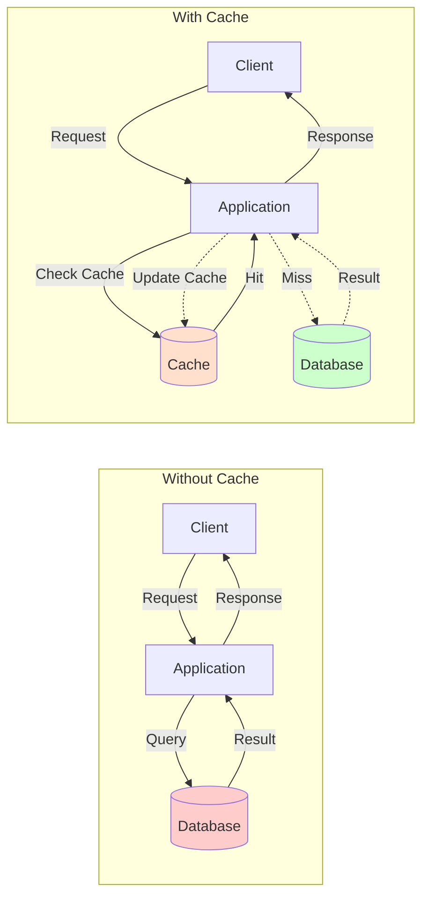

## Navigation

**Domain:** [[7 — System Design & Distributed Systems]] > **Group:** Caching
**Previous:** [[7.255 — Scale Cube — X, Y, Z Axes]] | **Next:** [[7.257 — Cache-Aside Pattern]]

### Prerequisites

- [[7.255 — Scale Cube — X, Y, Z Axes]] — caching is the primary X-axis and Z-axis optimization: it reduces database load so cloned instances (X) do not saturate the shared store, and it absorbs read traffic on hot shards (Z)
- [[7.207 — Stateless Services — Design Principles]] — caching externalizes state that would otherwise be held in-process, enabling stateless service design
- [[7.253 — Caching as a Scalability Tool]] — introduces caching as a scalability pattern; this note covers the fundamental why/when decision

### Where This Fits

Caching is the single most cost-effective performance optimization in a production .NET system. It trades a bounded amount of memory for a dramatic reduction in latency (single-digit ms for a cache hit vs 10–100 ms for a database query) and a proportional reduction in downstream load. A .NET engineer encounters the caching decision on day one of a production incident: the database DTU is at 100%, the P99 latency is red, and the on-call engineer says "can we cache this?" The answer is almost always yes for read-heavy, slowly-changing data — but wrong for stale-sensitive or write-dominated data. Without a caching strategy, the team burns infrastructure budget scaling the database long after caching would have solved the problem.

---

## Core Mental Model

Caching is the principle of storing a copy of a computation result or data lookup closer to the consumer so that subsequent requests for the same data can be served without repeating the expensive operation. The invariant: the cached value is a time-delayed snapshot of the underlying truth; the cache is never perfectly consistent with the source of truth. What caching trades is memory (and a bounded staleness window) for latency and throughput. The recognition trigger: the same data is fetched multiple times within a short window (seconds to minutes) from a slow or overloaded downstream system (database, API, computation), and the consumer can tolerate a slightly-stale response for the majority of requests.



### Classification

**Pattern category:** Performance optimization, load reduction strategy.
**Abstraction layer:** Any layer — in-process cache (application layer), distributed cache (middleware/infrastructure layer), CDN (edge/network layer), HTTP cache (transport layer).
**Scope:** Data access within a single service (in-process or distributed cache), across services (distributed cache), or at the network edge (CDN, HTTP cache).
**When applied:** The same data is read N times per minute. The cost of recomputing or re-fetching the data exceeds the cost of storing it. The consumer accepts slightly stale data (seconds to minutes).
**When not applied:** The data changes on every write and the consumer needs the latest value. The data is unique per request (cannot be reused). The data is too large to fit in the available cache memory. The cache miss cost exceeds the direct-fetch cost (cache is slower than the origin).

### Key Properties / Guarantees

|Property|Value|Condition|
|---|---|---|
|Latency on hit |0.1–5 ms (in-process), 1–10 ms (Redis), 10–100 ms (CDN) |Cache is warm and key exists |
|Latency on miss |Same as origin + overhead |Cache is cold, key expired, or evicted |
|Read throughput |10–100× origin throughput (limited by cache network/storage IOPS) |On hit; misses degrade to origin capacity |
|Consistency |Eventually consistent — staleness bounded by TTL |Default; write-through can reduce but not eliminate |
|Storage cost |RAM or SSD — $/GB higher than database storage |Must be sized: 1–5% of working data set is typical |
|Operational complexity |Low (in-process) to medium (Redis cluster, CDN) |Depends on cache topology |

---

## Deep Mechanics

### How Caching Works — The Read Path

When an application requests data (e.g., `GetProductById(productId)`), the caching layer performs the following steps:

1. **Key construction.** The caller constructs a cache key: `"product:{productId}"` for a single entity, `"product:category:{categoryId}:page:{pageNumber}"` for a list. The key must be deterministic — same input always produces the same key. In .NET, the key is a `string` (Redis) or `object` key (IMemoryCache — uses `object.GetHashCode` internally).
2. **Cache lookup.** The cache store checks whether the key exists. For in-process cache (`IMemoryCache`), this is a dictionary lookup (O(1)) on the current process's heap. For distributed cache (`IDistributedCache`, Redis), this is a network round trip to the Redis server: `GET product:123`.
3. **Hit.** The key exists. The cache returns the value. The application deserializes and uses it. Total time: 0.1–5 ms.
4. **Miss.** The key does not exist (first request, expired, evicted). The application falls through to the origin (database, API, computation): `SELECT * FROM Products WHERE Id = @productId`. This takes 10–100 ms.
5. **Cache population.** The application serializes the fetched value and writes it to the cache with a TTL: `SET product:123 <value> EX 300`. Subsequent requests hit the cache until the TTL expires.
6. **Return.** The application returns the value to the caller.

The critical invariant: the cache is populated on read (cache-aside, the default pattern), not on write. This means the first request after a deployment or TTL expiration always pays the miss penalty — this is the "cold start" problem.

### Cache Hierarchies

A production system rarely uses a single cache. The typical .NET stack has three cache layers:

|Layer|Store|Latency|Size|Scope|
|---|---|---|---|---|
|L1 — In-process |`IMemoryCache`, `ConcurrentDictionary` |< 0.1 ms |Tens to hundreds of MB |Per-process, per-instance|
|L2 — Distributed |Azure Cache for Redis, SQL Server cache |1–10 ms |GB to tens of GB |Shared across instances of a service|
|L3 — CDN / HTTP |Azure CDN, Cloudflare, browser cache |10–100 ms |Distributed, geographically |Global, across all users|

The multi-level cache is searched in order: L1 → L2 → L3 → origin. Each level has a larger capacity but higher latency. The trick: if L2 (distributed cache) has the value, L1 stores it locally for the next request — this is the "cache-aside with local cache" or "two-tier caching" pattern. The risk: L1 can become stale within a single TTL if another instance updates the data. The solution: use a small TTL for L1 (seconds) and a longer TTL for L2 (minutes).

### Caching Patterns Overview (What They Trade)

|Pattern|Read Path|Write Path|Staleness Window|Complexity|
|---|---|---|---|---|
|Cache-Aside |Load on miss, cache, return |Write-through to DB, optionally evict cache key |Up to TTL |Low|
|Read-Through |Cache is authoritative: cache loads on miss from DB |Write-through to DB, cache updates synchronously |Up to TTL (shorter with TTL) |Medium|
|Write-Through |Same as Read-Through |Write to cache first, cache writes to DB synchronously |Near-zero (cache is always fresh) |Medium|
|Write-Behind |Same as Read-Through |Write to cache first, cache writes to DB asynchronously |Write-back lag (milliseconds to seconds) |High (data loss risk)|
|Refresh-Ahead |Cache proactively refreshes before TTL expires |N/A (read-only or write-through) |Near-zero (refresh before expiry) |High (background refresh logic)|

### Consistency Model in Caching

Caching provides **eventual consistency** by default. The cache is a read-optimized replica of the source of truth with a bounded staleness window (the TTL). The anomalies:

- **Stale read:** The cache returns a value that was updated in the database but not yet reflected in the cache. Duration: up to the TTL. Mitigation: short TTL or write-through.
- **Cache miss storm:** A key that was popular expires. N concurrent requests all miss and hit the database simultaneously. The database saturates. Mitigation: TTL jitter, probabilistic early expiration, or a lock around cache population (thundering herd prevention).
- **Cache-aside write gap:** Service A updates the database. Service B reads from cache — still the old value. The cache is stale until the TTL expires or the key is evicted. Mitigation: after updating the database, evict the cache key (not update it — evict, and let the next read populate fresh).

### .NET and Azure Integration

**ASP.NET Core — `IMemoryCache`.** The simplest cache: in-process, no serialization, no network. Used for computed data, session state (single instance), or frequently-accessed reference data. Registered by default in `AddMvc()`. Configure size limit: `builder.Services.AddMemoryCache(options => options.SizeLimit = 50 * 1024 * 1024)`.

**ASP.NET Core — `IDistributedCache`.** The abstraction for shared caches. Implementations: `AddStackExchangeRedisCache` (Azure Redis), `AddSqlServerDistributedCache` (SQL Server), `AddDistributedMemoryCache` (in-process, for testing). Always use the distributed abstraction — swapping from Redis to SQL Server requires changing only the registration line.

```csharp
builder.Services.AddStackExchangeRedisCache(options =>
{
    options.Configuration = builder.Configuration.GetConnectionString("Redis");
    options.InstanceName = "OrdersApi";
});
```

**Output Caching (`[OutputCache]`).** Caches the entire HTTP response by key (route + query string + headers). Configured in middleware: `app.UseOutputCache()`. Policy defines the cache key, duration, and vary-by rules. Used for public GET endpoints that return the same response for all users.

**Response Caching (`[ResponseCache]`).** Sets HTTP `Cache-Control` headers on the response for downstream caches (browser, CDN, proxy). Not a server-side cache — the server still processes the request. The attribute sets `Duration`, `Location` (Client, Any, None), and `VaryByHeader`.

**Azure Cache for Redis.** Managed Redis instance. Tiers: Basic (single node, no SLA), Standard (replicated, 99.9%), Premium (cluster, persistence, VNet, 99.95%). For production, use Standard or Premium with TLS, access keys via Azure Identity (`DefaultAzureCredential`) or connection strings. The .NET client: `StackExchange.Redis`. Use `ConnectionMultiplexer` as a singleton — creating one per request exhausts ports.

```csharp
var multiplexer = await ConnectionMultiplexer.ConnectAsync(
    builder.Configuration.GetConnectionString("Redis"));
builder.Services.AddSingleton(multiplexer);

// Usage in a service
public class ProductService
{
    private readonly IDatabase _cache;
    public ProductService(ConnectionMultiplexer mux) => _cache = mux.GetDatabase();

    public async Task<Product> GetProductAsync(int id)
    {
        var key = $"product:{id}";
        var cached = await _cache.StringGetAsync(key);
        if (cached.HasValue) return JsonSerializer.Deserialize<Product>(cached!);

        var product = await _db.Products.FindAsync(id);
        await _cache.StringSetAsync(key, JsonSerializer.Serialize(product), TimeSpan.FromMinutes(5));
        return product;
    }
}
```

**Failure Modes in .NET Caching**

|Failure|Symptom|Detection|Mitigation|
|---|---|---|---|
|Redis down |All cache lookups throw `RedisConnectionException`. Application degrades to database-only. |Exception telemetry, Redis health check |Use `ITwowayCachePolicy` — on connection failure, skip cache and fall through to database. Set `abortConnect=false` in connection string.|
|Cache key collision |Two different data sets map to the same key. Wrong data returned. |Inconsistent data, invalid orders or prices |Use structured keys with namespace: `"orders:summary:{orderId}"` not `"{orderId}"`.|
|Serialization mismatch |Cache stores old schema version; new code deserializes differently. |`JsonException` on deserialization |Use versioned keys: `"product:v2:{id}"`. When schema changes, deploy with new key prefix; old keys expire naturally.|
|Memory pressure (L1) |In-process cache grows unbounded. App pool recycles due to OOM. |Private bytes spike, frequent GC, AppPool recycle events |Set `SizeLimit` on `MemoryCacheOptions`. Evict least recently used items (LRU) to stay under limit.|

---

## Production Patterns and Implementation

### 1. The Cache Decision Service — When to Cache?

Before writing any cache code, run the data through this decision service:

```csharp
public enum CacheRecommendation { Cache, DoNotCache, CacheWithShortTtl }

public static CacheRecommendation Evaluate(DataAccessPattern pattern)
{
    var reasons = new List<string>();
    var recommend = CacheRecommendation.Cache;

    // Read frequency
    if (pattern.ReadsPerMinute < 1)
    {
        reasons.Add("Data is read less than once per minute — cache overhead exceeds benefit.");
        recommend = CacheRecommendation.DoNotCache;
    }

    // Write frequency — data that changes every write is a poor cache target
    if (pattern.WritesPerMinute > pattern.ReadsPerMinute * 0.5)
    {
        reasons.Add("Write-to-read ratio is high — most cached values would be invalidated before reuse.");
        recommend = CacheRecommendation.DoNotCache;
    }

    // Staleness tolerance
    if (pattern.MaxAcceptableStaleness < TimeSpan.FromSeconds(5))
    {
        if (recommend == CacheRecommendation.Cache)
            recommend = CacheRecommendation.CacheWithShortTtl;
        else
            recommend = CacheRecommendation.DoNotCache;
    }

    // Size of cached object
    if (pattern.DataSizePerKey > 1_000_000) // 1 MB
    {
        reasons.Add("Single cached value exceeds 1 MB — memory pressure risk.");
        recommend = CacheRecommendation.DoNotCache;
    }

    return recommend;
}

public record DataAccessPattern(
    string Name,
    int ReadsPerMinute,
    int WritesPerMinute,
    TimeSpan MaxAcceptableStaleness,
    int DataSizePerKey,
    double OriginLatencyMs);
```

### 2. Two-Tier Cache Implementation (L1 + L2)

The production pattern: a fast in-process cache backed by a distributed Redis cache. This combines the sub-millisecond latency of L1 with the shared visibility of L2.

```csharp
public class TwoTierCache<T> where T : class
{
    private readonly IMemoryCache _l1;
    private readonly IDistributedCache _l2;
    private readonly ILogger<TwoTierCache<T>> _logger;
    private readonly TimeSpan _l1Ttl;
    private readonly TimeSpan _l2Ttl;

    public TwoTierCache(
        IMemoryCache l1,
        IDistributedCache l2,
        IOptions<TwoTierCacheOptions> options,
        ILogger<TwoTierCache<T>> logger)
    {
        _l1 = l1;
        _l2 = l2;
        _logger = logger;
        _l1Ttl = options.Value.L1Ttl;
        _l2Ttl = options.Value.L2Ttl;
    }

    public async Task<T?> GetOrCreateAsync(
        string key,
        Func<CancellationToken, Task<T?>> factory,
        CancellationToken ct)
    {
        // L1 hit — fastest path
        if (_l1.TryGetValue(key, out T? cached))
        {
            _logger.LogDebug("L1 hit for {Key}", key);
            return cached;
        }

        // L2 hit — populate L1, return
        var l2Bytes = await _l2.GetAsync(key, ct);
        if (l2Bytes is not null)
        {
            var value = Deserialize(l2Bytes);
            _l1.Set(key, value, _l1Ttl);
            _logger.LogDebug("L2 hit for {Key}", key);
            return value;
        }

        // Miss — fall through to factory
        _logger.LogInformation("Cache miss for {Key}; invoking factory", key);
        var result = await factory(ct);
        if (result is null) return null;

        // Populate both tiers
        _l1.Set(key, result, _l1Ttl);
        var serialized = Serialize(result);
        await _l2.SetAsync(key, serialized, _l2Ttl, ct);
        return result;
    }

    public async Task InvalidateAsync(string key, CancellationToken ct)
    {
        _l1.Remove(key);
        await _l2.RemoveAsync(key, ct);
        _logger.LogInformation("Invalidated cache key {Key}", key);
    }

    private static byte[] Serialize(T value) =>
        Encoding.UTF8.GetBytes(JsonSerializer.Serialize(value));

    private static T? Deserialize(byte[] bytes) =>
        JsonSerializer.Deserialize<T>(Encoding.UTF8.GetString(bytes));
}

public class TwoTierCacheOptions
{
    public TimeSpan L1Ttl { get; set; } = TimeSpan.FromSeconds(30);
    public TimeSpan L2Ttl { get; set; } = TimeSpan.FromMinutes(5);
}
```

### Configuration and Wiring

```csharp
// Program.cs
builder.Services.AddMemoryCache();
builder.Services.AddStackExchangeRedisCache(options =>
{
    options.Configuration = builder.Configuration.GetConnectionString("Redis");
    options.InstanceName = "Orders:";
});

builder.Services.Configure<TwoTierCacheOptions>(builder.Configuration.GetSection("Caching"));
builder.Services.AddSingleton(typeof(TwoTierCache<>));
```

### Common Variants

**Variant: Cache-Aside with Stampede Protection (SemaphoreSlim per key).** Prevents N concurrent requests from all hitting the origin on a cold cache. Use a `ConcurrentDictionary<string, SemaphoreSlim>` to serialize cache population per key. Only one request hits the database; the rest wait on the semaphore.

```csharp
private readonly ConcurrentDictionary<string, SemaphoreSlim> _locks = new();

public async Task<T?> GetWithLockAsync(string key, Func<CancellationToken, Task<T?>> factory, CancellationToken ct)
{
    if (_l1.TryGetValue(key, out T? cached)) return cached;

    var semaphore = _locks.GetOrAdd(key, _ => new SemaphoreSlim(1, 1));
    await semaphore.WaitAsync(ct);
    try
    {
        // Double-check after acquiring lock
        if (_l1.TryGetValue(key, out cached)) return cached;
        return await GetOrCreateAsync(key, factory, ct);
    }
    finally
    {
        semaphore.Release();
        _locks.TryRemove(key, out _);
    }
}
```

**Variant: Write-Through (Update Cache on Write).** When the application updates data, it writes to both the database and the cache synchronously. This keeps the cache fresh but makes writes slower (wait for both DB and cache). Use when the read-to-write ratio is moderate (5:1–10:1) and stale reads are not acceptable.

```csharp
public async Task UpdateProductAsync(Product product, CancellationToken ct)
{
    // DB write
    _db.Products.Update(product);
    await _db.SaveChangesAsync(ct);

    // Cache write (not evict) — synchronous
    var key = $"product:{product.Id}";
    var serialized = JsonSerializer.SerializeToUtf8Bytes(product);
    await _cache.SetAsync(key, serialized, new DistributedCacheEntryOptions
    {
        AbsoluteExpirationRelativeToNow = TimeSpan.FromMinutes(5)
    }, ct);
}
```

### Real-World .NET Ecosystem Example

- **ASP.NET Core Output Cache middleware** — caches full HTTP responses server-side. Configured with `[OutputCache]` policy: `app.UseOutputCache()`. Uses a cache key composed of scheme, host, port, path, and query string. Built on `IDistributedCache` — provides a single-line migration from in-memory to Redis.
- **EF Core Second-Level Cache (EFCache2 / EF Core Plus)** — caches query results. The query string + parameter hash is the cache key. On `SaveChanges`, the cache for affected tables is invalidated. Not part of EF Core itself — third-party library.
- **FusionCache** — open-source .NET cache library with built-in multi-tier (L1+L2), stampede protection (probabilistic early expiration), fail-safe (stale-while-revalidate), and backplane (cache synchronization across instances via Redis pub/sub). Production-ready alternative to building the two-tier pattern manually.

---

## Gotchas and Production Pitfalls

### Gotcha 1: Caching the Wrong Thing — Unique-Per-Request Data

**Pitfall:** The engineer caches the response of a user-specific query that has no reuse across requests. Cache miss rate is 100% — every request misses, pays the penalty of serialization and cache write, and also pays the origin query cost. The cache is slower than not caching.

```csharp
// ❌ Cache key includes user ID for data that is never shared across users
var key = $"user:{userId}:dashboard:{DateTime.UtcNow:yyyyMMddHHmm}";
```

**Symptom:** Cache hit rate is < 5%. Application is slower WITH caching than without. The cache CPU and memory are consumed with data that is read once and never used again.

**Fix:** Analyze the data access pattern before adding cache. Use the `CacheRecommendation.Evaluate()` decision service. Only cache data that is read more than once within the TTL:

```csharp
// ✅ Cache only data that is shared across requests — product catalog, configuration, reference data
var key = $"product:{productId}";
```

**Cost of not fixing:** The cache consumes memory and CPU for zero benefit. Redis OOM kills the cache. The application degrades to origin queries, and the team blames "caching" rather than "caching the wrong data."

### Gotcha 2: No TTL on Cached Data

**Pitfall:** The engineer sets `SET key value` without `EX` (expiry). The cache grows unbounded. Redis evicts keys under the `maxmemory-policy` (default `noeviction` in some configurations, `allkeys-lru` in others). Old keys are evicted unpredictably.

```csharp
// ❌ No TTL — cache entry lives forever
await _cache.StringSetAsync("product:1", serialized);
```

**Symptom:** Memory usage grows linearly with unique key count. Redis reaches `maxmemory` threshold. Keys are evicted based on the eviction policy — including keys that are still valuable. Cache hit rate drops suddenly and unpredictably.

**Fix:** Always set a TTL. The TTL should be based on the data's acceptable staleness. Even for data that should rarely change, set a long TTL (1 hour, 1 day) rather than no TTL:

```csharp
// ✅ Always set TTL — even 24 hours is safer than no expiry
await _cache.StringSetAsync("product:1", serialized, TimeSpan.FromHours(6));
```

**Cost of not fixing:** Redis eviction cascade. Important product catalog keys evicted because a batch job wrote 10,000 one-off keys. Cache hit rate drops from 90% to 40% during a critical sales window.

### Gotcha 3: Cache-Aside Update Instead of Evict

**Pitfall:** After updating the database, the engineer writes the new value to the cache (UPDATE, not EVICT). The write to the cache succeeds, but a concurrent request may read the old database value and overwrite the cache with stale data (read-and-update race).

```csharp
// ❌ After database update: update the cache directly
public async Task UpdatePrice(int productId, decimal newPrice)
{
    await _db.Products.Where(p => p.Id == productId)
        .ExecuteUpdateAsync(setters => setters.SetProperty(p => p.Price, newPrice));
    // Race: another request reads OLD price from DB, writes it to cache
    await _cache.StringSetAsync($"product:{productId}", JsonSerializer.Serialize(newPrice));
}
```

**Symptom:** Intermittent stale price — some users see the old price, some see the new. Hard to reproduce because it depends on timing.

**Fix:** Evict, don't update. The next read will populate the cache from the database. This avoids the race:

```csharp
// ✅ Evict cache key after write — next read fetches fresh data
public async Task UpdatePrice(int productId, decimal newPrice)
{
    await _db.Products.Where(p => p.Id == productId)
        .ExecuteUpdateAsync(setters => setters.SetProperty(p => p.Price, newPrice));
    await _cache.KeyDeleteAsync($"product:{productId}"); // Evict
}
```

**Cost of not fixing:** Pricing inconsistency that affects revenue. Customers who see the old price after a price increase cause margin loss. Customers who see the new price before the old price expires cause order volume changes that the finance team cannot explain.

### Gotcha 4: Thundering Herd on Cache Stampede

**Pitfall:** A popular cache key (`product:top_selling`) expires. 100 concurrent requests all miss and all hit the database simultaneously. The database CPU spikes to 100%. The TTL is set to midnight UTC — at midnight, all keys expire at once.

**Symptom:** A predictable CPU spike on the database every N minutes (the TTL duration) or at the top of the hour. P99 latency jumps from 5 ms to 2,000 ms during the spike.

**Fix:** Use TTL jitter (add random ±20% to the TTL so keys expire at different times) and stampede protection (lock the cache population so only one request hits the database):

```csharp
// ✅ TTL jitter — keys expire over a range, not simultaneously
var ttl = TimeSpan.FromSeconds(300);
var jitter = TimeSpan.FromSeconds(Random.Shared.Next(-60, 60));
await _cache.StringSetAsync(key, value, ttl + jitter);
```

**Cost of not fixing:** Database saturates during stampede windows. The database auto-scale kicks in, increasing Azure costs by 3× during peak hours. Or the database fails to scale fast enough and the application serves 503 errors.

### Gotcha 5: Cache and Database Are in Different Regions

**Pitfall:** The application is deployed in West Europe. The database is in West Europe. The Redis cache is in East US (provisioned by a different team or inherited from a legacy deployment). Every cache miss costs 80 ms of transatlantic latency before the database query even begins.

**Symptom:** P50 latency is normal (L1 hit), but P99 latency is terrible (cache miss + network latency + database latency + cache write). The cache adds 80 ms of overhead to every miss.

**Fix:** Deploy the cache in the same region as the application and database. Use Azure Cache for Redis in the same Azure region as the App Service and database. For multi-region deployments, use geo-replicated Redis (Azure Redis Enterprise with Active Geo-Replication):

```csharp
// ✅ Same region — connection string points to local Redis
"Redis": "orders-cache.westeurope.redis.azure.net:6380,password=...,ssl=True,abortConnect=false"
```

**Cost of not fixing:** The cache WORsENS latency on miss. The team disables caching, blaming Redis, when the real problem is the network distance.

### Gotcha 6: Serialization Cost on Large Objects

**Pitfall:** The engineer caches a 5 MB JSON blob (a product catalog with all variants, images as base64, descriptions, reviews). The cache serialization/deserialization cost (on both read and write) exceeds the cost of the database query.

**Symptom:** CPU on the application server is elevated. `JsonSerializer.Serialize` and `Deserialize` appear at the top of the CPU profile. The cache is slower than the database because the serialization overhead is higher than the query execution time.

**Fix:** Cache only the frequently-accessed subset of the data. Use a lighter serialization format (MessagePack, protobuf). Compress the cached value:

```csharp
// ✅ Use compression for large cached objects
public static byte[] CompressAndSerialize<T>(T value)
{
    using var ms = new MemoryStream();
    using (var gzip = new GZipStream(ms, CompressionLevel.Fastest))
        JsonSerializer.Serialize(gzip, value);
    return ms.ToArray();
}
```

**Cost of not fixing:** The cache degrades performance instead of improving it. The team concludes "caching doesn't work for us" when the real issue is cache payload size.

---

## Tradeoffs and Decision Framework

### Tradeoff Matrix: Cache vs No Cache

|Dimension|With Caching|Without Caching|Alternative: Read Replica|
|---|---|---|---|
|Read latency|0.1–10 ms (hit), 10–100 ms (miss)|10–100 ms (all reads)|10–50 ms (database read replica)|
|Write latency|Unaffected (cache-aside) or +5 ms (write-through)|Same|Same (write goes to primary)|
|Consistency|Eventual (staleness = TTL)|Strong (always latest)|Bounded staleness (replica lag)|
|Cost|Cache memory ($0.05–0.30/GB/hr) + origin|Origin only (database)|Read replica compute cost|
|Operational complexity|Cache deployment, monitoring, eviction policies|None|Read replica routing, failover|
|Cold start|All queries pay miss penalty until cache warms|None — always direct query|None — replicas are always warm|

### When to Cache

```mermaid
flowchart TD
    A[Data access pattern analysis] --> B{Read:Write ratio?}
    B -->|"< 2:1"| C[Do not cache — most writes invalidate cache before next read]
    B -->|"> 10:1"| D{Staleness tolerance?}
    D -->|"< 1 second"| E{Write path complexity?}
    D -->|"5 seconds - 5 minutes"| F[Cache with TTL = acceptable staleness]
    D -->|"> 5 minutes"| G[Cache with long TTL — lazy invalidation on write]
    E -->|Simple| H[Write-through cache]
    E -->|Complex| I[Command-query split (CQRS)]
    C --> J[Alternative: read replica]
```

### When NOT to Cache

- [ ] **Write-dominated data.** The data changes more than once per read. Every cache entry is written but never read. Example: write-only audit log, real-time sensor readings.
- [ ] **Strong consistency required.** The business requires the latest data on every read. Example: payment balance display, inventory count during checkout. Mitigation: write-through cache (reduces staleness but does not eliminate it — cache node failure still returns stale data).
- [ ] **Unique-per-request data.** Every request fetches data that is specific to that request and not reused. Example: a search query with unique parameters. Cache hit rate will be near zero. Mitigation: HTTP response caching with `Cache-Control: private` for authenticated responses that are per-user aggregated over a short window.
- [ ] **Data too large per key.** Single cached object > 1 MB. The serialization and memory cost exceed the fetch cost. Mitigation: split into smaller granular objects, or use a CDN for large static files.
- [ ] **Origin is already fast enough.** The database query takes < 5 ms at P99 and the load is within capacity. Caching adds complexity without measurable benefit. Mitigation: wait until the origin is the bottleneck (CPU > 60% on database or application server).
- [ ] **Cache infrastructure is in a different region.** Network latency on cache miss adds 50–200 ms, making cached requests slower than direct database queries.

### Scale Thresholds

- **Worth considering:** > 1,000 reads/second per data set, or database query takes > 20 ms, or database CPU > 60% on read-heavy workloads.
- **Required:** > 10,000 reads/second, or the database cannot be scaled further (single node max), or the P99 latency SLO cannot be met without absorbing reads in cache.
- **Justified for cost savings:** The database costs $X/month and a 50% cache hit rate would reduce it to $X/2. If cache cost < database cost savings, caching is financially justified.
- **L1-only (in-process) is sufficient:** Single instance, < 5,000 reads/second, no need for shared state across instances, data fits in process memory (< 100 MB).
- **L2 (distributed cache) becomes necessary:** Multiple instances need to share cache state, or L1 memory pressure is too high, or the data set exceeds available process memory.

---

## Interview Arsenal

### Question Bank

1. **Q:** Why cache? When would you introduce caching into a system? **A:** Caching reduces read latency (from 10–100 ms to < 5 ms) and reduces load on the downstream system (database, API). Introduce it when the same data is read more than once within a short window, the consumer can tolerate slight staleness, and the origin system is a bottleneck (CPU, connection pool, IOPS). Not before — premature caching adds complexity without measurable benefit.

2. **Q:** What is the difference between cache-aside, read-through, and write-through? **A:** Cache-aside: the application is responsible for loading and updating the cache (load on miss, store, evict on write). Read-through: the cache is authoritative and loads from the database on miss (application never touches the database directly). Write-through: the application writes to the cache first; the cache synchronously writes to the database. Cache-aside is the default in .NET (user-managed), read-through requires a cache library that supports it (FusionCache, NCache), write-through keeps the cache fresh but slows writes.

3. **Q:** How do you handle cache invalidation? **A:** The simplest approach is TTL-based expiration: the cache automatically evicts the key after a fixed duration (time-to-live). The application accepts bounded staleness (up to the TTL). For data that must be updated immediately after a write, the application evicts the cache key after writing to the database (cache-aside with eviction on write). For event-driven invalidation across services, use a message bus (Azure Service Bus) to broadcast cache invalidation events.

4. **Q:** What is a cache stampede and how do you prevent it? **A:** A cache stampede (thundering herd) occurs when a popular cache key expires and N concurrent requests all miss simultaneously, hitting the origin system and saturating it. Prevention: (1) TTL jitter — randomize TTL ±20% so keys expire at different times; (2) lock around cache population — `SemaphoreSlim` per key so only one request hits the database; (3) probabilistic early expiration — refresh the cache before the TTL expires based on a probability function; (4) stale-while-revalidate — serve the stale value while asynchronously refreshing.

5. **Q:** Compare in-process cache (`IMemoryCache`) vs distributed cache (`IDistributedCache`/Redis). When do you use each? **A:** In-process: sub-millisecond, no serialization cost, no network hop, but memory-limited (process heap), not shared across instances, lost on restart. Use for read-only reference data that fits in process memory and is not shared (e.g., configuration, local enum translations). Distributed: 1–10 ms, shared across instances, survives restarts, can be sized larger, but serialization and network overhead. Use when multiple instances need the same cached data, the dataset exceeds process memory, or the cache must survive instance restarts.

6. **Q:** A database is at 90% DTU from read queries. You add caching. What happens to the DTU? **A:** If the cache hit rate is 80%, database DTU drops to approximately 90% × (1 – hit rate) = 18% for the cached queries, plus any write queries. The actual reduction depends on which queries are cached (hot queries vs. cold queries). If you cache the top 10 queries (80% of read volume), the reduction is proportional. After caching, the DTU should stabilize at 20–30%. If it stays at 90%, the cache is not absorbing the expected traffic — check hit rate, cache keys, and TTL.

7. **Q:** How do you handle cache warm-up after deployment? **A:** After deployment, the in-process cache is cold. The first requests for every key pay the miss penalty. Mitigation: (1) application startup — a background service pre-fetches the top-K most-read keys before the first request arrives (`IHostedService` that runs `GetOrCreateAsync` for the top-N items); (2) deploy with a pre-warming step — the CI/CD pipeline runs a warm-up script that hits popular endpoints; (3) use a distributed cache (Redis) that survives deployments so the L2 cache is warm even if L1 is cold; (4) serve stale data during warm-up — accept slightly stale data from Redis while the new instances populate.

8. **Q:** What is the consistency model of caching, and what anomalies can occur? **A:** Eventually consistent. The cache is a replica of the source of truth with bounded staleness (the TTL). Anomalies: (1) stale read — the cache returns data that has been updated in the database but not yet reflected in the cache; (2) time-travel read — a key is evicted while stale, then re-created with older data because a concurrent read fetched the old database value; (3) cross-region staleness — a write in one region propagates to the cache in another region via WAN latency (Redis geo-replication lag).

### Spoken Answers

**Q: "Why cache and when would you introduce it?"**

> **Average answer:** "Caching makes the system faster by storing data in memory. You use it when you need better performance."
>
> **Great answer:** "Caching trades memory (and eventual consistency) for latency and throughput. I would introduce caching when three conditions are met: the data is read significantly more often than it is written — at least a 10:1 read-to-write ratio; the consumer can accept bounded staleness — typically seconds to minutes — without breaking the business logic; and the origin system, usually the database, is identified as a bottleneck — its CPU is above 60%, or its P99 query latency exceeds our SLO. In a .NET system, this means analyzing telemetry first. I look at Application Insights to find the most expensive and most-frequent queries. If the product detail query runs 5,000 times per second and takes 50 ms, a Redis cache with a 5-minute TTL and a cache-aside pattern would turn that into a 3 ms read for 99% of requests. I would NOT cache highly volatile data like real-time inventory counts during checkout — the TTL would cause overselling — or unique-per-request data like personalized search results — the cache hit rate would be near zero, so the overhead of serialization and cache writes would make the system slower."

**Q: "Compare in-process cache vs. distributed cache."**

> **Average answer:** "In-process cache is faster but limited to one server. Distributed cache is shared but slower."
>
> **Great answer:** "In-process cache (IMemoryCache in ASP.NET Core) provides sub-millisecond reads at zero serialization cost — the data lives on the GC heap of the current process. It is ideal for reference data: country codes, product categories, configuration settings — data that fits in tens of MB and does not need to be shared across instances. The limit: each instance has its own copy, so memory usage scales linearly with instance count, and data is lost on restart. Distributed cache (Azure Cache for Redis via IDistributedCache) adds 1–10 ms per operation due to serialization and network round-trips, but it is shared across all instances, survives deployments, and can hold GB-scale datasets. In a production deployment with 5 instances of an API, I use a two-tier pattern: L1 (IMemoryCache) with a 30-second TTL for the fastest path, backed by L2 (Redis) with a 5-minute TTL for shared cache. When one instance fetches data from Redis, the other instances also benefit because L1 is populated locally. The tradeoff: cache consistency — L1 can be stale within the 30-second TTL, but that is acceptable for product catalogs. For session state, Redis directly — no L1 — because session data must be consistent per user."

### System Design Interview Trigger

If an interviewer asks you to design any read-heavy system — a news feed, a product catalog, a content delivery system, a rate-limiting service — caching is the default solution they expect you to propose. The follow-up question is always: "What do you cache? What is your cache key? What TTL do you use? How do you handle cache misses under high load? How do you invalidate when data changes?" They are testing whether you reach for caching indiscriminately or you analyze the data access pattern, identify the read-to-write ratio, choose the right cache layer (in-process vs Redis vs CDN), design the key structure, handle the thundering herd, and name the staleness window. The senior answer always includes the tradeoff: "I accept up to X seconds of staleness on reads, and I ensure writes invalidate the cache key to minimize it."

### Comparison Table

| |Caching (this note)|Read Replica|Materialized View|
|---|---|---|---|
|Core guarantee|Fast reads from RAM|Fast reads from secondary DB|Pre-computed query result stored as table|
|Consistency|Eventually consistent (TTL-bound)|Bounded staleness (replication lag)|Snapshot-based — stale until refreshed|
|Cost|Low — memory (RAM $/GB)|Medium — compute + storage|Low — storage only|
|Complexity|Low (cache-aside) to medium (two-tier)|Low (Azure SQL read replica, connection string routing)|Medium (view maintenance, refresh schedule)|
|.NET integration|`IMemoryCache`, `IDistributedCache`, `OutputCache`|`SqlConnection` with `ApplicationIntent=ReadOnly`|Entity Framework → Materialized View as `DbSet` (read-only)|
|Failure mode|Cache miss storm, stale read|Replica lag on failover|Stale data until refresh completes|

---

## Architecture Decision Record

### Title: Introducing Caching to Reduce Database Load on Product Catalog

**Context:** The Product Catalog API (ASP.NET Core, single Azure App Service instance, Azure SQL Database S4: 200 DTU) serves 3,000 req/s at peak. The endpoint `GET /api/products/{id}` accounts for 60% of traffic. Average query time: 45 ms. Database DTU: 72% at peak. Growth projection: 20% month-over-month. Without intervention, the database will saturate within 3 months. The API returns product data (name, description, price, category, images metadata) that changes approximately 50 times per day (product manager updates). A 5-minute staleness is acceptable — the business accepts that recent edits may take up to 5 minutes to appear.

**Options Considered:**

1. **Cache-aside with Azure Redis (Standard C1, 1 GB)** — Load on miss, store with TTL, evict on write. Estimated hit rate: 85% (products are read repeatedly; the catalog has 50,000 active products, each read ~10 times/day). TTL: 5 minutes. Write path: after product update in DB, evict the cache key.
2. **Read replica (Azure SQL read replica)** — Route read queries to a read-only replica. No caching. DTU load split: writes to primary, reads to replica. Cost: primary + replica = 2× database compute cost.
3. **Output caching (ASP.NET Core OutputCache)** — Cache the HTTP response for `GET /api/products/{id}` server-side. Key: route + query string. No distributed cache needed. Response serialization happens only once per key per TTL.
4. **No caching — scale database to S6 (500 DTU)** — 2.5× the DTU capacity. Cost: 2.5× database spend. Does not solve the root cause (redundant reads).

**Selected Option:** Option 1 — cache-aside with Azure Redis, with the addition of a background eviction strategy: on product update, publish a `ProductUpdated` event to Azure Service Bus; a background service consumes the event and evicts the cache key. This decouples the write path from the cache path and ensures evictions survive deployment restarts.

**Rationale:** Caching addresses the root cause: the same product data is read hundreds of times between updates. Redis Standard C1 ($55/month) is cost-effective compared to scaling the database (S6 at ~$700/month). Output caching (Option 3) has lower complexity but is process-bound — lost on restart and does not survive instance scaling. Read replica (Option 2) doubles database cost without eliminating redundant reads — both replicas still serve the same read traffic.

**Consequences:**

- ✅ Read latency drops from 45 ms to ~3 ms for cached products (85% of requests).
- ✅ Database DTU drops from 72% to ~23% (cached reads no longer hit SQL).
- ✅ Cost: $55/month (Redis) vs $350/month incremental for S6 database scale.
- ⚠️ Cache is eventually consistent: product updates may take up to 5 minutes to appear (TTL). The product team is informed and accepts this.
- ⚠️ Cache stampede risk: if the top 20 products expire simultaneously, 20 × miss storm. Mitigation: TTL jitter (±60 seconds) and `SemaphoreSlim` per-key lock on cache population.
- ❌ Cache miss penalty: first read after TTL expiry pays 45 ms + 3 ms overhead (Redis write). Acceptable tradeoff.

**Review Trigger:** Revisit this decision if: (1) the product catalog grows beyond 500,000 active products (Redis C1 may need to scale to C2); (2) the business requirement changes to require sub-second write-to-read propagation (switch to write-through cache or event-driven cache invalidation); (3) cache hit rate drops below 60% (investigate: are products being read less, or is the cache key structure wrong?).

---

## Self-Check

### Questions (10)

1. What three conditions must be met before you introduce caching?
2. A database query takes 50 ms and runs 10,000 times/second. You introduce a Redis cache with 95% hit rate. What is the P99 read latency after caching? Show your calculation.
3. Why is evicting a cache key on write safer than updating the cache with the new value?
4. What is the difference between `IMemoryCache` and `IDistributedCache`? When would you use each?
5. A cache key expires and 50 concurrent requests all miss. What happens, and what three strategies prevent it?
6. Your cache hit rate is 2%. What is wrong and how do you diagnose it?
7. What TTL would you set for a product catalog that is updated 100 times per day, and a 30-second staleness is acceptable?
8. How does `[OutputCache]` differ from `[ResponseCache]` in ASP.NET Core?
9. Your Redis cache is in East US. Your application and database are in West Europe. What latency do you expect on a cache miss?
10. A product price update takes effect in the database at 10:00:00. The cache TTL is 300 seconds. Until what time could a user see the old price? What event would make the old price visible even after the TTL expires?

### Scenario-Based Exercises (5)

**Scenario 1 — Diagnose the problem.** The Product API serves 2,000 req/s. The team adds Redis caching to reduce database load. After deployment, the database DTU drops from 80% to 75% — barely any improvement. Cache hit rate: 8%. Investigation reveals the cache key is `"product:{userId}:{productId}"` — every user gets their own cache entry.

<details>
<summary>Diagnosis</summary>

**Root cause:** The cache key includes `userId`, but product data is the same for all users. Every user's first request is a cache miss. 2,000 users × unique userId = 2,000 unique keys for the same product. Cache hit rate is 8% because most products are requested once per user.

**Evidence:** Cache hit rate in Redis metrics: 8%. Cache memory grows linearly with unique user count. The top-10 cache keys (by memory usage) all differ by userId.

**Fix:** Change the cache key to exclude userId: `"product:{productId}"`. Product data is shared across all users. Cache hit rate jumps to 85%.

**Prevention:** Before choosing a cache key, ask: "Is the cached data the same for all consumers of this endpoint?" If yes, the key must NOT include user-specific identifiers.
</details>

---

**Scenario 2 — Design decision.** You are designing a real-time dashboard for an e-commerce admin panel. The dashboard shows order counts, revenue, and inventory levels. Data changes every few seconds (new orders arrive, inventory decrements). The admin user expects to see near-real-time data. Should you cache the dashboard data?

<details>
<summary>Decision and Reasoning</summary>

**Choice:** Do NOT cache the dashboard data in a traditional TTL-based cache. The write frequency is too high — every new order changes the order count and inventory level. A TTL of even 5 seconds would show stale data that misleads the operations team.

**Tradeoffs accepted:** The dashboard queries the database directly every N seconds (polling interval: 5 seconds). Higher database load, but the data is accurate within the polling interval.

**Alternative:** Use SignalR (WebSocket) to push real-time updates from the server to the dashboard. The server listens to database change tracking (Change Data Capture / Azure SQL change tracking) or subscribes to domain events (OrderPlaced, InventoryAdjusted) and broadcasts the aggregated dashboard state to connected clients. This reduces database load to the CDC reading and avoids cache staleness.

```csharp
public class DashboardHub : Hub
{
    public async Task SubscribeToDashboard()
    {
        await Groups.AddToGroupAsync(Context.ConnectionId, "Dashboard");
    }
}

// When an OrderPlaced event is received:
public async Task OnOrderPlaced(OrderPlacedEvent evt)
{
    var snapshot = await _dashboardService.GetSnapshotAsync();
    await _hubContext.Clients.Group("Dashboard")
        .SendAsync("DashboardUpdated", snapshot);
}
```
</details>

---

**Scenario 3 — Failure mode.** The Product API experiences a 30-second latency spike every 5 minutes at the top of the hour. Investigation shows Redis CPU at 10%, database CPU at 100% during the spike. The spike coincides with the cache TTL (5 minutes) for the top-100 product keys.

<details>
<summary>Investigation and Fix</summary>

**Investigation steps:** (1) Check Redis `TTL` for the top-100 product keys — all expire at the same second. (2) Check database query metrics during the spike — `SELECT * FROM Products WHERE Id IN (...)` spiking. (3) Check application logs: "Cache miss for product:1", "Cache miss for product:2"... all within the same second.

**Confirming evidence:** Application Insights — `DependencyTracking` shows 100 concurrent calls to SQL Server at :00 of every 5-minute window. Redis `TTL` shows all top-100 keys have the same expiry.

**Immediate mitigation:** Reduce database load during stampede by enabling `SemaphoreSlim` per-Key lock: only 1 request per key hits the database; the other 99 wait.

**Permanent fix:** (1) Add TTL jitter: `TimeSpan.FromMinutes(5) + Random.Shared.Next(-60, 60)`. Keys expire at different times. (2) Add probabilistic early expiration: refresh the cache at 80% of TTL with probability proportional to request load. (3) Verify deployment: ensure the jitter is not reset on every request (the TTL is computed once, at cache write time).

**Post-mortem item:** ADR update: all cache keys must include jitter. Add a CI check that rejects cache registration without jitter.
</details>

---

**Scenario 4 — Scale it.** Your system handles 500 req/s with a single App Service instance and a single database at 60% DTU. You need to handle 50,000 req/s within 12 months. How does caching fit into the scaling strategy?

<details>
<summary>Scaling Strategy</summary>

**Bottleneck this addresses:** The database. At 50,000 req/s, a single database would be at ~6,000% DTU — impossible. Caching absorbs reads so the database only handles a fraction of the traffic.

**How it helps:** Assuming 80% of requests are reads and the cache hit rate is 90%, the database handles 50,000 × 20% (writes) + 50,000 × 80% × 10% (reads missing cache) = 10,000 + 4,000 = 14,000 req/s. That is 28× current, which may still be too high — requiring database sharding (Z-axis).

**What it does not solve:** Write scaling. Writes still go to the database. If write volume also grows 100×, caching does not help — you need database federation (Y-axis) or sharding (Z-axis).

**Implementation order:** (1) Month 1: Add Redis cache (cache-aside) for the top-10 most-read queries. (2) Month 3: Two-tier caching (L1 in-process + L2 Redis) for sub-millisecond reads. (3) Month 6: Multi-level cache with CDN (Azure CDN for static product images, Redis for dynamic product data, L1 for session-hot data). (4) Month 9: Cache invalidation via Azure Service Bus — when a product is updated, all cache tiers (CDN, Redis, L1) are invalidated via an event.

**Target:** At 50,000 req/s, 90% cache hit rate, database handles 15,000 req/s (within a single S9 database's capacity), database read replicas for the remaining read miss traffic.
</details>

---

**Scenario 5 — Interview simulation.** The interviewer says: "Design a URL shortening service like TinyURL. Walk me through your approach to caching."

<details>
<summary>Model Response</summary>

"I would design the URL shortener with two endpoints: POST to create a short URL and GET to redirect. The read-to-write ratio is heavily skewed — for every URL created, it may be read millions of times. The critical cache target is the GET redirect: given a short code (base62 of ID), return the original URL (HTTP 302 redirect).

**Clarifying question:** 'What is the expected scale?' — 10,000 writes/day (100 million URLs total), 10,000 reads/second (peak). Short codes are 7 characters (base62: 62^7 ≈ 3.5 trillion combinations).

**Cache strategy:** Cache-aside with Azure Redis Standard C2 (2.5 GB). Cache key: `"url:{shortCode}"`. TTL: 24 hours. Hit rate target: 99% — popular URLs are read every few seconds. Staleness is acceptable: if a URL is updated (rare — TinyURL does not allow edits), the 24-hour TTL means old redirects persist for up to a day. Acceptable because URL shortening systems prioritize availability and speed over freshness.

**Cache stampede prevention:** If a short code for a viral URL expires, 10,000 requests/second could miss. Mitigation: (1) TTL jitter — ±2 hours; (2) probabilistic early expiration at 80% of TTL; (3) stale-while-revalidate — serve the stale redirect from cache while asynchronously refreshing from the database.

**What NOT to cache:** The POST endpoint — create URL — is a write. Caching it is pointless. The redirect count (analytics) is write-heavy; use a separate write-optimized store (Azure Table Storage or Cosmos DB) for analytics.

**Cost tradeoff:** At 10,000 reads/second, a 99% hit rate means the database handles 100 reads/second — easily within a single Azure SQL S2 database ($150/month). Without caching, the database would need to handle 10,000 reads/second, requiring S9+ ($5,000/month). Redis C2 costs $130/month. Savings: ~$4,700/month.

**Failure mode:** Redis node failure. Mitigation: Redis replication (Standard tier — 1 primary + 1 replica, automatic failover). If both nodes are down, all reads fall through to the database. The database auto-scale handles the temporary load. The cache warms up as requests come in (cache-aside populates on miss).

**Edge case:** What if a short code is not in the cache AND not in the database? Return 404. The cache should still store the negative result (with a short TTL, e.g., 60 seconds) to prevent a 404 storm on the database from bots probing random short codes."
</details>

---
