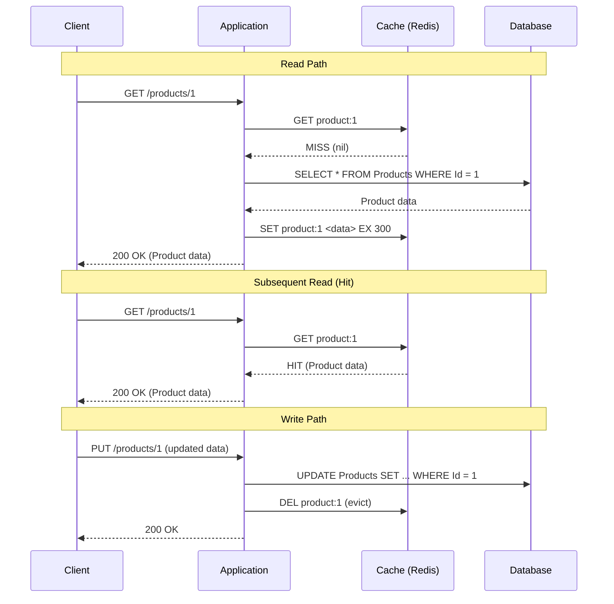
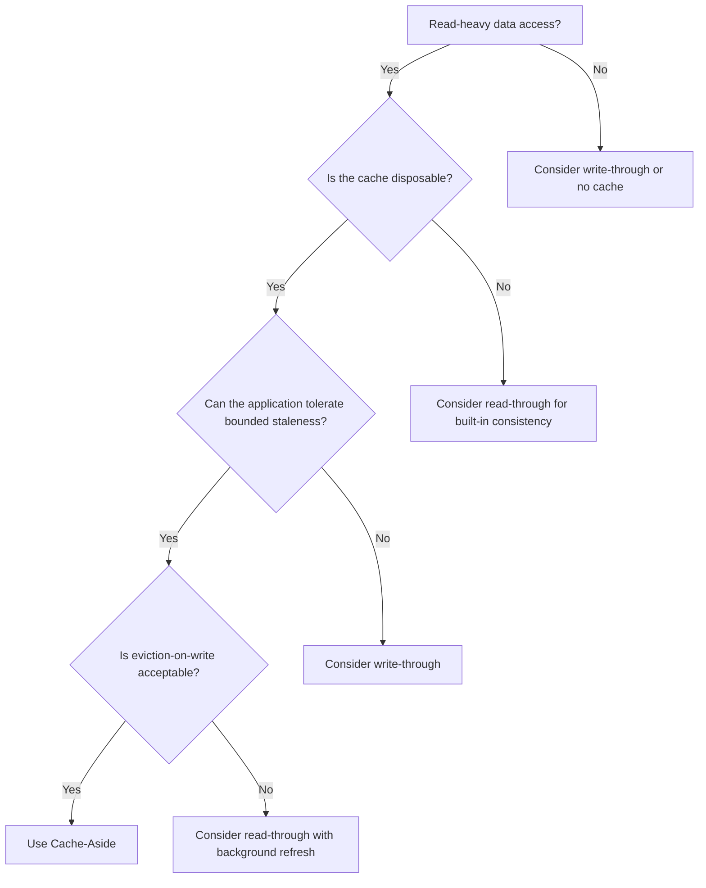

## Navigation

**Domain:** [[7 — System Design & Distributed Systems]] > **Group:** Caching
**Previous:** [[7.256 — Caching — Why Cache and When]] | **Next:** [[7.258 — Write-Through Caching]]

### Prerequisites

- [[7.256 — Caching — Why Cache and When]] — the foundational why/when decision; cache-aside is the default pattern for the read path
- [[7.207 — Stateless Services — Design Principles]] — cache-aside externalizes cache state; each instance independently manages its cache entries
- [[7.287 — Redis as Cache — Patterns in .NET]] — cache-aside is the pattern Redis implements with StringGet / StringSet

### Where This Fits

Cache-aside (lazy loading) is the default caching pattern in production .NET systems. The application is responsible for both the read path (load on cache miss, store in cache, return) and the write path (write to database, evict cache key). It is the pattern that IMemoryCache.GetOrCreate and IDistributedCache + manual fallback implement. A .NET engineer uses cache-aside by default because it is simple, the cache is never written with stale data (data is loaded from the database on demand), and the cache can be invalidated by simply removing the key. The tradeoff: the cache is eventually consistent — data can be stale by up to the TTL — and the first read after a cache miss pays the full database latency. Without cache-aside, the alternative (read-through or write-through) either requires a cache library that supports it or adds write latency.

---

## Core Mental Model

Cache-aside is a read strategy in which the application checks the cache before querying the database; on a cache miss, the application loads the data from the database, writes it to the cache with a TTL, and returns it. On a write, the application writes to the database and evicts the cache key (so the next read fetches fresh data). The invariant: the cache is always populated from the database on read — never from a write path — which avoids writing stale data to the cache. What cache-aside trades is read latency on the first read (cache miss penalty) for write simplicity (no synchronous cache update, no complexity on the write path). The recognition trigger: a read-heavy endpoint with data that changes infrequently; the default choice when starting with caching.



### Classification

**Pattern category:** Caching strategy, data access pattern.
**Abstraction layer:** Application layer — typically implemented in the repository, service, or data access layer. Not an infrastructure concern — the cache infrastructure (Redis, IMemoryCache) is independent of the pattern.
**Scope:** Data access within a single service. Cache-aside does not address cache consistency across services (use event-driven invalidation for that).
**When applied:** Default for read-heavy workloads where the read-to-write ratio is high (> 10:1) and the application can tolerate bounded staleness (TTL-bound).
**When not applied:** Write-heavy workloads (the cache is invalidated on every write, so cache hit rate is low), strong consistency requirements (cache-aside is eventually consistent), or when the cache miss penalty is unacceptable (cache stampede risk).

### Key Properties / Guarantees

|Property|Value|Condition|
|---|---|---|
|Read latency |0.1–5 ms (hit), 10–100 ms (miss) |Cache is warm on hit; miss pays origin + cache write|
|Write latency |Origin write only (no cache update) |Cache key eviction is < 1 ms|
|Consistency |Eventually consistent; staleness = TTL |Default; can be reduced by evicting on write|
|Cache staleness |TTL duration (e.g., 5 minutes) |Between write and next read + cache population|
|Cache miss cost |Origin query + cache serialization + cache write |First read per key per TTL period|
|Implementation complexity |Low — 3 steps (check, load, store) |No cache infrastructure dependency|

---

## Deep Mechanics

### How Cache-Aside Works — Detailed

The cache-aside pattern has two distinct paths with different mechanics:

**Read path (4 steps):**

1. **Cache lookup.** The application constructs a deterministic cache key (e.g., `"product:1"`) and queries the cache. For `IMemoryCache`, this is `_cache.TryGetValue(key, out object? value)`. For `IDistributedCache`/Redis, this is `_cache.StringGet(key)`.
2. **Hit path (fast).** The key exists. The application deserializes the value (Redis returns bytes; `IMemoryCache` returns the stored object directly). Return to caller. No database query. Total cost: 0.1–10 ms depending on cache layer.
3. **Miss path (slow).** The key does not exist. The application queries the database with the full SQL query. The query cost includes connection pool acquisition, query execution, data materialization, and network transfer.
4. **Cache population.** The serialized result is stored in the cache with a TTL. For Redis: `_cache.StringSet(key, serialized, TimeSpan.FromMinutes(5))`. For `IMemoryCache`: `_cache.Set(key, value, TimeSpan.FromMinutes(5))`.

**Write path (2 steps):**

1. **Database write.** The application performs the write operation on the database: `INSERT`, `UPDATE`, `DELETE`. This is the source-of-truth write. The application waits for the database to acknowledge the write.
2. **Cache eviction.** The application deletes the corresponding cache key(s). The application does NOT write the new value to the cache (evict, don't update — avoids race conditions where a concurrent read writes stale data to the cache between the DB write and the cache update).

### The Evict-vs-Update Decision

The central design choice in cache-aside is whether to evict or update the cache after a write.

**Evict (recommended):** `DEL product:1`. The next read will miss, fetch fresh data from the database, and populate the cache. Safe against race conditions. Downside: the next read pays the miss penalty.

**Update (risky but faster):** `SET product:1 <newValue>`. The next read hits the cache and gets the new value immediately. No miss penalty. But race condition: between the database write and the cache update, a concurrent read may fetch the old database value and overwrite the cache with stale data:

```text
Time  | Thread A (Write)          | Thread B (Read)
------|---------------------------|---------------------------
T1    | UPDATE DB                 | 
T2    |                           | SELECT * FROM DB -> old value
T3    | SET cache (new value)     | 
T4    |                           | SET cache (old value) <- STALE
```

The read in Thread B saw the old database value (T2) before the cache was updated (T3) and writes it to the cache (T4). Now the cache has the old value until TTL expires. **Always evict on write.**

### Cache Key Design

The cache key determines whether cache-aside works efficiently. Rules:

- **Deterministic:** Same input → same key. No random components, no timestamps in the key.
- **Namespaced:** Use a colon-delimited prefix: `"orders:{orderId}"`, `"products:category:{categoryId}:page:{page}"`.
- **Variant-safe:** If the data can be returned in different shapes (summary vs. detail), include the shape in the key.
- **No user identifiers:** If the data is the same for all users, do not include `userId` in the key. Exception: truly user-specific data (cart contents, saved preferences).

```csharp
// Good keys
"product:42"                              // Single entity
"products:category:5:page:2"              // Paginated list
"order:789:summary"                       // Specific projection

// Bad keys
"product:42:" + DateTime.UtcNow.Ticks     // Timestamp — never hits
"product:42:" + userId                    // User in key — unnecessary
"42"                                      // No namespace — collision risk
```

### Failure Modes

|Failure|How It Manifests|Detection|Mitigation|
|---|---|---|---|
|Cache eviction not called on write |Cache returns stale data after database update. User sees old product price. |Support tickets: "I just updated the price but it shows the old price." |Verify eviction in the write path. Add integration test: update DB → evict cache → read → verify new value.|
|Cache miss on every request |Every read path pays the database + cache write penalty. Effective throughput = database throughput. |Cache hit rate in Redis metrics: 0%. |Check cache key — is the key deterministic? Is the TTL set? Is the cache service available? Check for key generation bugs.|
|Race condition on concurrent writes |Two concurrent writes to the same key. Write A evicts the cache key. Write B writes to DB. Write B evicts the cache key. Between A's evict and B's evict, a stale read populates the cache. |Intermittent stale data that is hard to reproduce. |Use a short TTL (seconds) on top of eviction. The stale data lives at most for the TTL duration.|
|Cache connection failure |All cache lookups throw. The application must fall through to the database. If fallback is not implemented, the endpoint fails. |`RedisConnectionException` in logs. Redis health check fails. |Implement a try-catch in the cache-aside implementation: on cache error, skip cache and query database directly. Set `abortConnect=false` in the Redis connection string.|

### .NET and Azure Integration

**IMemoryCache — the simplest cache-aside.** Use `GetOrCreate<T>` for atomic check-load-store:

```csharp
public class ProductRepository
{
    private readonly IMemoryCache _cache;
    private readonly AppDbContext _db;

    public ProductRepository(IMemoryCache cache, AppDbContext db)
    {
        _cache = cache;
        _db = db;
    }

    public Task<Product?> GetByIdAsync(int id, CancellationToken ct)
    {
        return _cache.GetOrCreateAsync(
            $"product:{id}",
            async entry =>
            {
                entry.AbsoluteExpirationRelativeToNow = TimeSpan.FromMinutes(5);
                entry.Size = 1; // Required if SizeLimit is set
                return await _db.Products.FindAsync(new object[] { id }, ct);
            });
    }
}
```

**IDistributedCache + Redis — cache-aside with shared cache.** The `GetOrCreateAsync` pattern does not exist on `IDistributedCache` — you must implement it manually:

```csharp
public class CachedProductRepository
{
    private readonly IDistributedCache _cache;
    private readonly AppDbContext _db;
    private readonly ILogger<CachedProductRepository> _logger;

    public CachedProductRepository(IDistributedCache cache, AppDbContext db, ILogger<CachedProductRepository> logger)
    {
        _cache = cache;
        _db = db;
        _logger = logger;
    }

    public async Task<Product?> GetByIdAsync(int id, CancellationToken ct)
    {
        var key = $"product:{id}";

        byte[]? cached;
        try
        {
            cached = await _cache.GetAsync(key, ct);
        }
        catch (RedisConnectionException ex)
        {
            _logger.LogWarning(ex, "Cache unavailable for key {Key}; falling through to database", key);
            cached = null; // Fall through to database
        }

        if (cached is not null)
        {
            _logger.LogDebug("Cache hit for {Key}", key);
            return JsonSerializer.Deserialize<Product>(cached);
        }

        _logger.LogDebug("Cache miss for {Key}; querying database", key);
        var product = await _db.Products.FindAsync(new object[] { id }, ct);
        if (product is null) return null;

        var serialized = JsonSerializer.SerializeToUtf8Bytes(product);
        var options = new DistributedCacheEntryOptions
        {
            AbsoluteExpirationRelativeToNow = TimeSpan.FromMinutes(5)
        };

        try
        {
            await _cache.SetAsync(key, serialized, options, ct);
        }
        catch (RedisConnectionException ex)
        {
            _logger.LogWarning(ex, "Failed to write to cache for key {Key}; data is in database only", key);
        }

        return product;
    }

    public async Task UpdateAsync(Product product, CancellationToken ct)
    {
        _db.Products.Update(product);
        await _db.SaveChangesAsync(ct);

        // Evict, don't update
        try
        {
            await _cache.RemoveAsync($"product:{product.Id}", ct);
            _logger.LogInformation("Evicted cache key for product {Id}", product.Id);
        }
        catch (RedisConnectionException ex)
        {
            _logger.LogWarning(ex, "Failed to evict cache key for product {Id}", product.Id);
        }
    }
}
```

**Key decisions in this code:**

- The cache miss path has its own try-catch for both Get and Set. If Redis is down, the application degrades to database-only. This is production-safe.
- The write path evicts the cache key *after* the database write succeeds. If the database write fails, the cache is not evicted (the old value remains — acceptable because the write did not occur).
- `DistributedCacheEntryOptions` uses `AbsoluteExpirationRelativeToNow` (sliding expiration is also available but dangerous for cache-aside — it can keep stale data alive indefinitely if the key is accessed frequently).

**Azure-specific wiring:**

```csharp
// Program.cs
builder.Services.AddStackExchangeRedisCache(options =>
{
    options.Configuration = builder.Configuration.GetConnectionString("Redis");
    options.InstanceName = "Products:";
});

// Connection string in appsettings.Production.json:
// "Redis": "products-cache.redis.cache.windows.net:6380,password=...,ssl=True,abortConnect=false"
```

---

## Production Patterns and Implementation

### 1. Generic Cache-Aside Wrapper (Repository Decorator)

The production pattern is a generic cache-aside wrapper that decorates any repository interface. This separates caching concerns from data access logic and makes cache-aside reusable across all entities.

```csharp
public interface IRepository<T> where T : class
{
    Task<T?> GetByIdAsync(int id, CancellationToken ct);
    Task UpdateAsync(T entity, CancellationToken ct);
}

// The real repository — no caching logic
public class ProductRepository : IRepository<Product>
{
    private readonly AppDbContext _db;
    public ProductRepository(AppDbContext db) => _db = db;

    public async Task<Product?> GetByIdAsync(int id, CancellationToken ct) =>
        await _db.Products.FindAsync(new object[] { id }, ct);

    public async Task UpdateAsync(Product product, CancellationToken ct)
    {
        _db.Products.Update(product);
        await _db.SaveChangesAsync(ct);
    }
}

// The cache-aside decorator — wraps any IRepository<T>
public class CachedRepository<T> : IRepository<T> where T : class
{
    private readonly IRepository<T> _inner;
    private readonly IDistributedCache _cache;
    private readonly ILogger<CachedRepository<T>> _logger;
    private readonly string _keyPrefix;

    public CachedRepository(
        IRepository<T> inner,
        IDistributedCache cache,
        ILogger<CachedRepository<T>> logger)
    {
        _inner = inner;
        _cache = cache;
        _logger = logger;
        _keyPrefix = $"{typeof(T).Name.ToLowerInvariant()}";
    }

    public async Task<T?> GetByIdAsync(int id, CancellationToken ct)
    {
        var key = $"{_keyPrefix}:{id}";

        try
        {
            var cached = await _cache.GetAsync(key, ct);
            if (cached is not null)
            {
                _logger.LogDebug("Cache hit for {Key}", key);
                return JsonSerializer.Deserialize<T>(cached);
            }
        }
        catch (RedisConnectionException ex)
        {
            _logger.LogWarning(ex, "Cache unavailable; falling through");
        }

        _logger.LogDebug("Cache miss for {Key}", key);
        var entity = await _inner.GetByIdAsync(id, ct);
        if (entity is null) return null;

        try
        {
            var options = new DistributedCacheEntryOptions
            {
                AbsoluteExpirationRelativeToNow = TimeSpan.FromMinutes(10)
            };
            await _cache.SetAsync(key, JsonSerializer.SerializeToUtf8Bytes(entity), options, ct);
        }
        catch (RedisConnectionException ex)
        {
            _logger.LogWarning(ex, "Failed to write to cache");
        }

        return entity;
    }

    public async Task UpdateAsync(T entity, CancellationToken ct)
    {
        await _inner.UpdateAsync(entity, ct);

        var id = (int)typeof(T).GetProperty("Id")!.GetValue(entity)!;
        var key = $"{_keyPrefix}:{id}";

        try
        {
            await _cache.RemoveAsync(key, ct);
            _logger.LogInformation("Evicted {Key} after update", key);
        }
        catch (RedisConnectionException ex)
        {
            _logger.LogWarning(ex, "Failed to evict {Key}", key);
        }
    }
}
```

### Configuration and Wiring (Decorator Registration)

```csharp
// Program.cs — register the real repository, then decorate it
builder.Services.AddScoped<AppDbContext>();
builder.Services.AddScoped<IRepository<Product>, ProductRepository>();
builder.Services.Decorate<IRepository<Product>, CachedRepository<Product>>();

// Requires Scrutor NuGet package: dotnet add package Scrutor
// "Decorate" wraps ProductRepository with CachedRepository<Product>
```

### 2. Batch Cache-Aside for List Queries

Single-entity cache-aside is straightforward. List queries (e.g., `GetProductsByCategory(categoryId)`) require a composite cache key:

```csharp
public async Task<List<Product>> GetByCategoryAsync(int categoryId, int page, int pageSize, CancellationToken ct)
{
    var key = $"products:category:{categoryId}:page:{page}:size:{pageSize}";

    var cached = await _cache.GetAsync(key, ct);
    if (cached is not null)
        return JsonSerializer.Deserialize<List<Product>>(cached)!;

    var products = await _db.Products
        .Where(p => p.CategoryId == categoryId)
        .OrderBy(p => p.Name)
        .Skip((page - 1) * pageSize)
        .Take(pageSize)
        .ToListAsync(ct);

    await _cache.SetAsync(key, JsonSerializer.SerializeToUtf8Bytes(products), new DistributedCacheEntryOptions
    {
        AbsoluteExpirationRelativeToNow = TimeSpan.FromMinutes(5)
    }, ct);

    return products;
}
```

**Invalidation challenge for list caches:** When a single product is updated, all list caches that might include that product must be evicted. This is difficult because the cache key includes category, page, and page size — you do not know which list keys exist. Solutions: (1) use a category-level cache version — increment `category:{categoryId}:version` on any product update in that category; include the version in all list cache keys; (2) use a pattern cache that stores all product IDs in a set per category and reconstructs the list; (3) accept that list caches are stale until TTL expires — use a shorter TTL for lists (e.g., 60 seconds).

### 3. Cache-Aside with Stampede Protection (Per-Key Semaphore)

The production problem: when a cache key expires and 100 concurrent requests miss, they all hit the database. The fix: serialize cache population per key.

```csharp
public class CacheAsideWithLock<T> where T : class
{
    private readonly IDistributedCache _cache;
    private readonly ConcurrentDictionary<string, SemaphoreSlim> _locks = new();

    public async Task<T?> GetOrCreateAsync(
        string key,
        Func<CancellationToken, Task<T?>> factory,
        TimeSpan ttl,
        CancellationToken ct)
    {
        // Fast path — cached value exists
        var cached = await _cache.GetAsync(key, ct);
        if (cached is not null)
            return JsonSerializer.Deserialize<T>(cached);

        // Slow path — acquire per-key lock
        var semaphore = _locks.GetOrAdd(key, _ => new SemaphoreSlim(1, 1));
        await semaphore.WaitAsync(ct);
        try
        {
            // Double-check: another thread may have populated the cache while we waited
            cached = await _cache.GetAsync(key, ct);
            if (cached is not null)
                return JsonSerializer.Deserialize<T>(cached);

            // Factory call — only one thread executes this per key
            var value = await factory(ct);
            if (value is null) return null;

            await _cache.SetAsync(key, JsonSerializer.SerializeToUtf8Bytes(value),
                new DistributedCacheEntryOptions { AbsoluteExpirationRelativeToNow = ttl }, ct);
            return value;
        }
        finally
        {
            semaphore.Release();
            // Cleanup semaphore to avoid memory leak
            if (semaphore.CurrentCount == 1)
                _locks.TryRemove(key, out _);
        }
    }
}
```

### Common Variants

|Variant|Description|When to Use|
|---|---|---|
|Evict-on-write (standard)|Write to DB, delete cache key. Next read populates. |Default for cache-aside. Simple, race-safe.|
|Update-on-write with short TTL|Write to DB, update cache with new value, TTL = short (60s). |Read-after-write consistency is important; TTL bounds the stale window if race occurs.|
|Batch eviction|After writing to DB, evict a set of related keys (entity + lists) in a batch using `IDatabase.KeyDeleteAsync` with an array of keys. |When list caches must reflect the update. Use `batch` or `pipeline` in StackExchange.Redis to minimize round trips.|
|Cache-aside with background refresh|On cache hit, check remaining TTL. If TTL < threshold (30%), trigger a background task to refresh the cache. |High-traffic keys where even a single miss is expensive.|

### Real-World .NET Ecosystem Example

- **ASP.NET Core `IMemoryCache.GetOrCreate`** — the canonical cache-aside implementation. The method is atomic: it checks the cache, calls the factory on miss, stores the result, and returns it. Thread-safe within the process.
- **FusionCache** — open-source .NET cache library with cache-aside as a core pattern. Adds stampede protection (probabilistic early expiration), fail-safe (stale-while-revalidate), and a backplane for distributed invalidation. Layer on top of `IDistributedCache`.
- **EF Core Second-Level Cache (EFCache2 / EF Core Plus)** — cache-aside at the ORM level. The query result is cached; subsequent executions of the same query (with same parameters) return the cached result. Uses `IMemoryCache` or `IDistributedCache` as the backing store.

---

## Gotchas and Production Pitfalls

### Gotcha 1: Evicting Before the Database Write

**Pitfall:** The write path evicts the cache key BEFORE updating the database. If the database write fails, the cache key is gone — the next read misses the cache, hits the database, gets the old value, and repopulates the cache with the stale data. The write failed, but the cache now has the stale value again.

```csharp
// ❌ Evict before write — if DB write fails, cache is empty but data is unchanged
public async Task UpdatePrice(int productId, decimal price)
{
    await _cache.KeyDeleteAsync($"product:{productId}"); // Evict first
    await _db.Products.Where(p => p.Id == productId)
        .ExecuteUpdateAsync(s => s.SetProperty(p => p.Price, price)); // May fail
}
```

**Symptom:** Intermittent cache misses that do not correspond to actual data changes. The cache hit rate drops temporarily during write failures.

**Fix:** Evict AFTER the database write succeeds. If the write fails, the cache key is not evicted:

```csharp
// ✅ Evict after write — only if DB write succeeded
public async Task UpdatePrice(int productId, decimal price)
{
    await _db.Products.Where(p => p.Id == productId)
        .ExecuteUpdateAsync(s => s.SetProperty(p => p.Price, price));
    await _cache.KeyDeleteAsync($"product:{productId}"); // Evict after
}
```

**Cost of not fixing:** Cache hit rate drops from 90% to 70% during write failure windows. The database handles 3× the read load because the cache is cold on keys that had failed writes.

### Gotcha 2: Sliding Expiration in Cache-Aside Keeps Stale Data Alive

**Pitfall:** The engineer uses `SlidingExpiration` (the cache TTL resets on every read) instead of `AbsoluteExpiration`. A product price is updated. The cache key is evicted, but a concurrent read repopulates it with the old value (race). Every subsequent read resets the sliding TTL. The stale data lives indefinitely — the TTL never expires because reads keep resetting it.

```csharp
// ❌ Sliding expiration — frequently-read stale data never expires
options.SlidingExpiration = TimeSpan.FromMinutes(5);
```

**Symptom:** A product price was updated 3 hours ago but some users still see the old price. Investigation: the cache key still exists with the old value. It was evicted once (after the write) but a concurrent read repopulated it with stale data, and every subsequent read reset the sliding window.

**Fix:** Use `AbsoluteExpirationRelativeToNow` for cache-aside. The TTL is fixed — data is guaranteed to expire and be refreshed:

```csharp
// ✅ Absolute expiration — data expires after TTL regardless of reads
options.AbsoluteExpirationRelativeToNow = TimeSpan.FromMinutes(5);
```

**Cost of not fixing:** Stale data that persists indefinitely. Support tickets escalate to engineering multiple times per day for "data that should have been updated hours ago."

### Gotcha 3: List Cache Not Invalidated When a Single Item Changes

**Pitfall:** The application caches the result of `GetProductsByCategory(5, page=1)`. The key: `"products:category:5:page:1"`. When a product in category 5 is updated (price change, name change), the single-entity cache key (`"product:42"`) is evicted, but the list cache key is NOT evicted. The list still shows the old price.

**Symptom:** User navigates to the product list — sees old price. User clicks into the product detail — sees new price. The inconsistency is confusing and looks like a bug.

**Fix:** On product update, evict all list cache keys that could include that product. The brute-force approach: evict by pattern (not supported in Redis production — `KEYS` blocks). Better: use a version-based approach:

```csharp
// ✅ Version-based list cache invalidation
public async Task<List<Product>> GetByCategoryAsync(int categoryId, CancellationToken ct)
{
    var version = await _cache.StringGetAsync($"category:{categoryId}:version");
    var key = $"products:category:{categoryId}:v{version}";

    var cached = await _cache.StringGetAsync(key);
    if (cached.HasValue) return JsonSerializer.Deserialize<List<Product>>(cached!);

    var products = await _db.Products.Where(p => p.CategoryId == categoryId).ToListAsync(ct);
    await _cache.StringSetAsync(key, JsonSerializer.SerializeToUtf8Bytes(products), TimeSpan.FromMinutes(5));
    return products;
}

// On product update:
public async Task UpdateProduct(Product product, CancellationToken ct)
{
    await _db.SaveChangesAsync(ct);
    await _cache.KeyDeleteAsync($"product:{product.Id}"); // Single entity
    await _cache.StringIncrementAsync($"category:{product.CategoryId}:version"); // Bump version
}
```

**Cost of not fixing:** Users see inconsistent data between list views and detail views. The product team loses confidence in the system.

### Gotcha 4: Cache-Aside Without TTL — Memory Leak

**Pitfall:** The engineer stores data in `IMemoryCache` without setting a TTL or size limit. The cache grows unbounded. Memory pressure triggers aggressive GC. Eventually the process crashes with `OutOfMemoryException`.

**Symptom:** App service memory grows monotonically. GC pauses increase. Application latency degrades. The app pool recycles (IIS) or the pod is OOMKilled (K8s).

**Fix:** Always set a TTL on every cache entry. For `IMemoryCache`, also set `SizeLimit`:

```csharp
// ✅ TTL + size limit for in-process cache
builder.Services.AddMemoryCache(options =>
{
    options.SizeLimit = 50 * 1024 * 1024; // 50 MB
});

_cache.Set(key, value, new MemoryCacheEntryOptions
{
    AbsoluteExpirationRelativeToNow = TimeSpan.FromMinutes(10),
    Size = 1 // Track size; each entry = 1 unit
});
```

**Cost of not fixing:** Pod restart every 2–4 hours due to OOMKill. In-flight requests fail with 503 during restart. The team blames "memory leak in Redis" when the leak is in `IMemoryCache`.

### Gotcha 5: Negative Caching Missing — 404 Storm

**Pitfall:** A request for a nonexistent product (`GET /api/products/99999`) misses the cache, queries the database, returns 404. The next request for the same nonexistent product does the same thing. If a bot crawls 10,000 nonexistent IDs, every request hits the database.

**Symptom:** Database CPU spikes from bot traffic querying nonexistent rows. The cache is not helping because only "found" results are cached — "not found" results go uncached.

**Fix:** Cache negative results (null, empty, 404) with a SHORT TTL:

```csharp
public async Task<Product?> GetByIdAsync(int id, CancellationToken ct)
{
    var key = $"product:{id}";
    var cached = await _cache.GetAsync(key, ct);
    if (cached is not null)
    {
        // Check for negative cache sentinel
        if (cached.Length == 0) return null; // Negative cache hit
        return JsonSerializer.Deserialize<Product>(cached);
    }

    var product = await _db.Products.FindAsync(new object[] { id }, ct);
    if (product is null)
    {
        // Cache the negative result with a SHORT TTL
        await _cache.SetAsync(key, Array.Empty<byte>(), new DistributedCacheEntryOptions
        {
            AbsoluteExpirationRelativeToNow = TimeSpan.FromSeconds(30)
        });
        return null;
    }

    await _cache.SetAsync(key, JsonSerializer.SerializeToUtf8Bytes(product), new DistributedCacheEntryOptions
    {
        AbsoluteExpirationRelativeToNow = TimeSpan.FromMinutes(5)
    });
    return product;
}
```

**Cost of not fixing:** Bot traffic that queries nonexistent IDs bypasses the cache entirely. A 100 RPS bot attacking nonexistent IDs generates 100 DB queries/second. Combined with the existing ~1,000 RPS of real traffic, the database DTU hits 100%.

---

## Tradeoffs and Decision Framework

### Tradeoff Matrix: Cache-Aside vs Read-Through vs Write-Through

|Dimension|Cache-Aside|Read-Through|Write-Through|
|---|---|---|---|
|Read path logic |Application (load on miss) |Cache library (cache loads from DB) |Cache library (same as read-through)|
|Write path logic |Application: write DB, evict cache |Application: write DB, evict cache |Application: write cache; cache writes DB|
|Cache consistency |Eventual (TTL) — stale on miss + race |Eventual (TTL) — same as cache-aside |Strong — cache and DB are always in sync|
|Write latency |DB only |DB only |DB + cache (double latency)|
|Complexity |Low — manual in application code |Medium — requires cache library support |Medium — requires write-through cache library|
|Cache miss race |Safe (evict-only on write) |Safe (cache is authoritative) |Safe (cache writes through to DB)|
|Cache library support |All (IMemoryCache, IDistributedCache, every Redis client) |FusionCache, NCache, AppFabric |FusionCache, NCache, AppFabric|
|When to choose |Default — simplest, most control |When cache consistency logic should not be in the application |When read-after-write consistency must be near-instant|

### When to Use Cache-Aside

- **Default choice for any new caching implementation.** Start with cache-aside. It is the simplest to understand, implement, and debug.
- **The cache is an optimization, not the system of record.** The database is the source of truth. The cache is disposable — you can flush the entire cache and the system works correctly (just slower until it warms up).
- **Read-heavy workload.** Read-to-write ratio > 10:1. Each write evicts one key; the next read populates it. The eviction cost is negligible compared to the read savings.
- **Single service owns the data.** Cache-aside works best when one service reads and writes the data. Cross-service cache-aside requires event-driven invalidation (write in Service A → publish event → Service B evicts cache key).



### When NOT to Use Cache-Aside

- [ ] **Write-heavy workload (write > 10% of reads).** Every write evicts a cache key. The next read pays the miss penalty. The cache hit rate is low, and the cache adds overhead without benefit.
- [ ] **Strong consistency required.** Cache-aside is eventually consistent. The cache is stale by up to the TTL. If the business requires "every read sees the latest write" (read-after-write consistency), cache-aside is insufficient — use write-through or skip caching entirely.
- [ ] **Cache is the system of record.** If the system uses the cache as the primary store (e.g., session state, rate limiter counters), cache-aside does not apply — those are write-dominated patterns.
- [ ] **No control over the write path.** If the data is written by a system outside your control (e.g., a legacy system, a third-party API), you cannot evict the cache on write. Cache-aside still works for the read side, but the cache is only as fresh as the TTL allows.

### Scale Thresholds

- **Worth implementing:** > 1,000 reads/second for a data set, where each database query takes > 20 ms. At this scale, reducing 20 ms to 3 ms for 90% of requests is measurable user impact.
- **Stampede protection required:** > 100 reads/second per cache key. If a single key drives 100+ RPS and the TTL is minutes, the stampede on expiry is a real risk.
- **Negative caching required:** > 10 requests/second for nonexistent keys. Bot traffic or randomized ID access patterns will bypass the cache without negative caching.
- **Decorator pattern justified:** > 3 entity types need cache-aside. The generic `CachedRepository<T>` wrapper pays off once it is applied to multiple entities.

---

## Interview Arsenal

### Question Bank

1. **Q:** What is cache-aside and how does it work? **A:** Cache-aside (lazy loading) is a caching pattern where the application is responsible for both the read path (check cache, load from database on miss, store in cache with TTL, return) and the write path (write to database, evict cache key). The cache never holds data that was not loaded from the database — it is always populated from the source of truth on read.

2. **Q:** Why evict rather than update the cache after a write? **A:** Evicting avoids a race condition: if you update the cache after writing to the database, a concurrent read between the DB write and the cache update may read the old database value and overwrite the cache with stale data. Evicting ensures the next read fetches fresh data from the database. The first read after eviction pays a miss penalty, which is acceptable because the read is happening anyway (the user triggered it).

3. **Q:** What happens to the cache on a deployment? **A:** In-process cache (`IMemoryCache`) is lost when the process restarts. The first requests after deployment pay miss penalties for all keys. Distributed cache (Redis) survives deployments because it is a separate process. To avoid a cold-start storm, pre-warm the cache by running a warm-up script against popular endpoints after deployment, or use a two-tier cache where L2 (Redis) is already warm.

4. **Q:** How do you handle cache-aside for list queries? **A:** List queries (e.g., `GetProductsByCategory`) are cached with a composite key: `"products:category:{id}:page:{page}"`. The challenge is invalidation: when a single product in the category changes, all list cache keys that might include that product must be evicted. Use version-based invalidation: increment a category version on write, include the version in the list cache key. This way, any write to the category invalidates all list caches for that category in a single atomic operation.

5. **Q:** When does cache-aside NOT work? **A:** (1) Write-heavy workloads — every write evicts, so cache hit rate is low. (2) Strong consistency requirements — cache-aside is eventually consistent. (3) Data with unique keys per request — cache hit rate is zero. (4) No control over the write path — cannot evict when third-party writes occur.

6. **Q:** How does `IMemoryCache.GetOrCreate` implement cache-aside? **A:** It atomically checks the cache, executes the factory function on miss, stores the result with the specified expiry, and returns the value. The factory is only called if the key does not exist. The implementation uses a lock per key internally (within the process) to prevent concurrent factory execution for the same key — a built-in stampede mitigation for in-process cache.

7. **Q:** How does cache-aside interact with `CancellationToken` in async code? **A:** The cache miss path (database query) must accept and respect `CancellationToken`. If a request is cancelled after a cache miss but before the database query completes, the database query should be cancelled. The cache population (writing to cache) must also respect the token: if the operation is cancelled, the stale cache entry should not be written. However, writing to Redis after cancellation is technically safe — the cancelled request's data is still valid — but the pattern is to propagate the token to all I/O operations.

8. **Q:** What is the most expensive operation in cache-aside at high scale? **A:** The serialization cost on the miss path. On a cache miss, the application must: (1) deserialize the database result into domain objects; (2) serialize the domain objects into bytes for Redis; (3) write to Redis. At 10,000 misses/second (cold start or stampede), the serialization CPU cost can exceed the database query cost. Mitigation: use a faster serializer (MessagePack, protobuf, System.Text.Json with source generators), compress the cached bytes, or use a two-tier cache where L1 absorbs most reads and L2 handles the shared miss cost.

### Spoken Answers

**Q: "Describe cache-aside and when you would choose it over other caching patterns."**

> **Average answer:** "Cache-aside checks the cache first, and if it's not there, it gets the data from the database and puts it in the cache. I would use it for read-heavy data."
>
> **Great answer:** "Cache-aside places the application in full control of the caching lifecycle. On the read path: check cache; on miss, query the database, write the result to cache with a TTL, and return it. On the write path: update the database, then evict the cache key — never update, always evict, to avoid the read-write race where a concurrent read populates the cache with stale data. I choose cache-aside as the default pattern over read-through or write-through for two reasons. First, simplicity: the cache is disposable — if Redis goes down, the application degrades gracefully to database queries. Second, it separates concerns: the application controls when and how data enters the cache, which is important when the same data is accessed from multiple code paths with different caching needs. I would move to read-through only when the cache-aside logic becomes repetitive across many repositories and I want a library to manage it. I would move to write-through only when the business requires near-instant read-after-write consistency — for example, a configuration change that must be visible to all instances within milliseconds. In most systems — product catalogs, user profiles, reference data — cache-aside with a 5-minute TTL and eviction-on-write is the right default."

**Q: "How do you handle cache stampede in cache-aside?"**

> **Average answer:** "Use a lock so only one request hits the database."
>
> **Great answer:** "Cache stampede is the classic cache-aside failure mode: a popular key expires and all concurrent requests miss simultaneously. I use a combination of three mitigations. First, TTL jitter: I add a random offset of ±20% to the TTL at cache-write time so that keys expire at different times. Second, per-key locking: I use a `ConcurrentDictionary<string, SemaphoreSlim>` to ensure only one request per key hits the database; the rest wait on the semaphore and then read from cache. Third, for the top 1% of keys — the ones that drive 50% of traffic — I add probabilistic early expiration (also called 'XFetch'): at around 80% of the TTL, the request has a probability of refreshing the cache asynchronously, proportional to the request load. This eliminates the stampede entirely for the hottest keys. In the .NET ecosystem, FusionCache implements all three strategies out of the box, so for high-traffic services I use FusionCache rather than building it manually."

### System Design Interview Trigger

If you design a system with a read-heavy component — a social media feed, a product catalog, a news aggregator — and you mention caching, the interviewer will ask: "How do you keep the cache up to date when data changes?" That is the cache-aside eviction question. They are testing: (1) do you know the evict-vs-update race condition? (2) do you handle list caches differently from single-entity caches? (3) do you have a plan for cache stampede? (4) do you think about negative caching? The strong answer acknowledges the race condition and demonstrates the evict strategy, shows version-based list invalidation, and mentions stampede prevention before being asked.

### Comparison Table

| |Cache-Aside|Read-Through|No Cache|
|---|---|---|---|
|Read consistency|Eventually consistent (TTL)|Eventually consistent (TTL)|Strong (always latest DB)|
|Write path cost|DB write only|DB write only|DB write only|
|Cache miss penalty|DB query + cache write|DB query (cache handles write)|N/A|
|.NET implementation|`IMemoryCache.GetOrCreate`, manual IDistributedCache|FusionCache, NCache|Direct EF Core/Dapper|
|Failure mode|Stampede on key expiry|Stampede handled by library|DB overload|
|When to choose|Default — simplicity and control|Many entity types need caching|Data changes too frequently|

---

## Architecture Decision Record

### Title: Cache-Aside for Product Catalog Read Path

**Context:** The Product API (ASP.NET Core, Azure App Service, Azure SQL S4) serves `GET /api/products/{id}` at 3,000 req/s peak. Average DB query: 45 ms. Database DTU: 72%. The team has decided to introduce caching (ADR in [[7.256 — Caching — Why Cache and When]]). The decision now is: which cache pattern for the read path?

**Options Considered:**

1. **Cache-aside (lazy loading)** — Application checks Redis cache; on miss, queries DB, writes result to Redis with 5-minute TTL, returns. On write: update DB, evict cache key.
2. **Read-through (FusionCache)** — FusionCache (a .NET library) acts as the cache facade. Application calls `fusionCache.GetOrCreate`. FusionCache handles cache-aside internally, with built-in stampede protection, soft TTL, and fail-safe.
3. **Output caching (ASP.NET Core OutputCache)** — Cache the full HTTP response for `GET /api/products/{id}`. Key: route + query string. No application code changes. Cache eviction: none (TTL-based expiry only) — the cache is always stale up to the TTL because there is no eviction on write.

**Decision:** Option 1 — Cache-aside with manual `IDistributedCache` implementation, with a note to migrate to FusionCache (Option 2) if stampede protection becomes necessary.

**Rationale:** Cache-aside is the simplest to implement and reason about. The team can write the `CachedRepository<Product>` decorator in 2 hours and deploy it the same day. FusionCache adds value (stampede protection, fail-safe) but adds a library dependency that the team does not yet have experience with. Output caching (Option 3) is insufficient because it has no eviction mechanism — when a product price changes, the old response is served until the TTL expires (5 minutes of incorrect pricing). Cache-aside with eviction-on-write eliminates that window.

**Consequences:**

- ✅ 2-hour implementation. Cache-aside decorator with IDistributedCache + Redis.
- ✅ Eviction-on-write means price changes are reflected on the next read (within 3 ms + DB query time).
- ✅ Cache is disposable — if Redis is down, the application degrades to database queries with no data loss.
- ⚠️ Cache stampede on key expiry is not handled initially. The team will monitor cache hit rate and stampede metrics; if stampede is detected (DB CPU spikes on TTL boundaries), add `SemaphoreSlim` per-key locking or migrate to FusionCache.
- ⚠️ List caches (`GetProductsByCategory`) use version-based invalidation, which requires incrementing a Redis key on each write — an extra Redis round trip per write.

**Review Trigger:** Revisit this decision if: (1) cache stampede is observed in production (Redis metrics show > 10 concurrent misses per key per second on TTL expiry) — migrate to FusionCache; (2) the team grows to > 5 services that need caching — standardize on FusionCache or a shared cache-aside library; (3) the list cache invalidation version approach causes write-path complexity — consider removing list caching and relying on single-entity caching only.

---

## Self-Check

### Questions (10)

1. List the 4 steps of the cache-aside read path.
2. Why is evicting the cache key on write safer than updating the cache with the new value?
3. What is the race condition that makes "update on write" unsafe?
4. How would you handle cache invalidation for a list query like `GetProductsByCategory(categoryId)`?
5. A product price is updated. The cache key is evicted. A concurrent read between the eviction and the database query repopulates the cache with the old price (because the read saw the old database value before the write committed). How do you prevent this?
6. How do you implement negative caching in cache-aside? What TTL should you use for negative results?
7. What is the problem with using `SlidingExpiration` in cache-aside?
8. Your Redis cache connection string has `abortConnect=false`. What does this mean and why is it important for cache-aside?
9. A deployed application has 10 instances. The cache hit rate is 5%. What is wrong?
10. How does `IMemoryCache.GetOrCreateAsync` prevent concurrent factory execution?

### Scenario-Based Exercises (5)

**Scenario 1 — Diagnose the problem.** The Orders API caches order details. After a customer updates their shipping address, the order detail page still shows the old address for up to 5 minutes (the TTL). Investigation confirms: the write path calls `_cache.RemoveAsync("order:{id}")` after the database update. The eviction works in testing.

<details>
<summary>Diagnosis</summary>

**Root cause:** The cache key on the read path does not match the cache key on the write path. Likely mismatch: read uses `"order:{orderId}"`, write evicts `"ordr:{orderId}"` (typo). Or the read path includes a namespace prefix (`"orders:order:{id}"`) while the write path evicts `"order:{id}"`.

**Evidence:** Redis `MONITOR` or `SCAN 0 MATCH order:*` shows two sets of keys: `order:*` (set by read path) and `ordr:*` (evicted by write path — never populated). The write path evicts keys that never existed.

**Fix:** Extract the cache key generation into a shared method used by both read and write paths:

```csharp
private static string OrderCacheKey(int id) => $"order:{id}"; // Single source of truth
```

**Prevention:** Unit test: verify that the key generated by the read path equals the key evicted by the write path. Integration test: update an order, then read it — verify the cache is empty (miss).
</details>

---

**Scenario 2 — Design decision.** You are designing the caching strategy for a blog platform. Each blog post has a view count that increments on every page load. The view count must be accurate within 5 seconds. Should you cache the view count with cache-aside?

<details>
<summary>Decision and Reasoning</summary>

**Choice:** Do NOT cache the view count with standard cache-aside. A view count is a write-dominated counter — every read is also a write (increment). Cache-aside with TTL would evict on every increment, making the cache hit rate near zero.

**Tradeoffs accepted:** Write to the database (or a counter store) on every view. Use Redis `INCR` for the counter (write-optimized), and persist to the database every 60 seconds (write-behind). The blog post content (title, body, author) is cached with cache-aside — this is read-heavy.

```csharp
public async Task<BlogPost> GetPostAsync(int postId, CancellationToken ct)
{
    var key = $"blogpost:{postId}";
    var content = await _cache.GetAsync(key, ct);
    if (content is null)
    {
        content = await _db.BlogPosts.FindAsync(new object[] { postId }, ct);
        if (content is null) return null;
        await _cache.SetAsync(key, JsonSerializer.SerializeToUtf8Bytes(content), ...);
    }

    // View counter: Redis INCR (not cache-aside)
    await _cache.StringIncrementAsync($"blogpost:{postId}:views");

    return content;
}
```
</details>

---

**Scenario 3 — Failure mode.** The cache hit rate drops from 90% to 40% over 24 hours. No deployment occurred. The database DTU climbs from 20% to 60%. Investigation shows that `IMemoryCache` is used (not Redis), and the process memory is steady.

<details>
<summary>Investigation and Fix</summary>

**Investigation steps:** (1) Check `IMemoryCache.Count` — is the cache growing or shrinking? (2) Check `GC.GetTotalMemory` — is memory pressure triggering compaction? (3) Check `MemoryCache.Compact` logs — `IMemoryCache` evicts entries under memory pressure using LRU. (4) Check `MemoryCacheOptions.SizeLimit` — if not set, entries are never evicted. (5) If `SizeLimit` is set, check if the total entry size exceeds the limit — entries are evicted LRU to stay under limit.

**Confirming evidence:** `MemoryCache.Compact` logs show entries being evicted. The `MemoryCacheOptions.SizeLimit` is set to 50 MB, but the working dataset is 200 MB — only 25% of the cache fits, so 75% of entries are evicted.

**Immediate mitigation:** Increase `SizeLimit` to 200 MB (or remove it — if the memory is available, let the cache use it).

**Permanent fix:** (1) Switch to a distributed cache (Redis) so cache capacity is independent of process memory. (2) If in-process cache is preferred, set `SizeLimit` to a value that accommodates the working dataset. (3) Add monitoring on `MemoryCache.Size` and `MemoryCache.HitRate` with an alert when hit rate drops below 80%.
</details>

---

**Scenario 4 — Scale it.** The Product API handles 5,000 reads/second with an 85% cache hit rate. The cache hit rate is stable. The product catalog is updated 500 times/day (once per 3 minutes on average). The team must handle 50,000 reads/second within 6 months. Does cache-aside scale?

<details>
<summary>Scaling Strategy</summary>

**Bottleneck this addresses:** Cache-aside at 85% hit rate means 15% of reads (7,500 req/s at 50K) hit the database. The database must handle 7,500 reads/second. If the average query takes 45 ms, that is ~338 concurrent queries — within an S9's capacity (typically ~10,000 concurrent connections).

**How it helps:** Cache-aside continues to work. Scale the Redis cache to a larger SKU (C2 → C4 → C6) as the key count grows. Add TTL jitter to prevent stampede as traffic increases. Add stampede protection (`SemaphoreSlim` per key) at the 100 RPS/key threshold.

**What it does NOT solve:** Write path traffic. 500 writes/day is negligible. If writes grow to 5,000/hour, the eviction rate increases and the cache hit rate drops. At that point, consider write-through or CQRS (separate read model).

**Implementation order:** (1) Increase Redis SKU from C1 to C2 (already sized for current data). (2) Add stampede protection for the top 100 keys (SemaphoreSlim per key). (3) Add monitoring alert on cache hit rate < 80%. (4) If hit rate drops, investigate whether write volume has increased.
</details>

---

**Scenario 5 — Interview simulation.** The interviewer says: "Design a URL shortening service. How do you handle the redirect for a short URL? Walk me through the caching."

<details>
<summary>Model Response</summary>

"The redirect endpoint `GET /{shortCode}` returns HTTP 302 with the original URL. This is an ideal cache-aside target: it is read-heavy (every redirect is a read), the data is small (short code → URL mapping), and staleness is acceptable (if a URL is edited — rare — stale redirects for up to TTL minutes are acceptable).

**Cache key:** `"url:{shortCode}"` — namespaced by short code.

**TTL:** 24 hours. Short codes rarely change; a 24-hour staleness window is fine.

**Cache-aside implementation:**

```csharp
public async Task<IResult> Redirect(string shortCode, CancellationToken ct)
{
    var key = $"url:{shortCode}";
    var cached = await _cache.StringGetAsync(key);
    if (cached.HasValue)
        return Results.Redirect(cached!);

    var url = await _db.ShortUrls
        .Where(s => s.Code == shortCode)
        .Select(s => s.OriginalUrl)
        .FirstOrDefaultAsync(ct);

    if (url is null)
        return Results.NotFound();

    await _cache.StringSetAsync(key, url, TimeSpan.FromHours(24));
    return Results.Redirect(url);
}
```

**Stampede prevention:** Viral short codes may see 10,000+ hits/second. I add TTL jitter (±1 hour) and a per-key `SemaphoreSlim` lock so only one request per short code hits the database.

**Negative caching:** Random short code brute-force attacks query nonexistent codes. I cache negative results with a 60-second TTL: `SET url:abc123 "" EX 60`. This prevents the database from being hit by bots.

**Write path (creating a URL):** After inserting the new short URL into the database, I do NOT evict — there is no cache entry yet. When the first redirect occurs, cache-aside populates it automatically."
</details>

---
