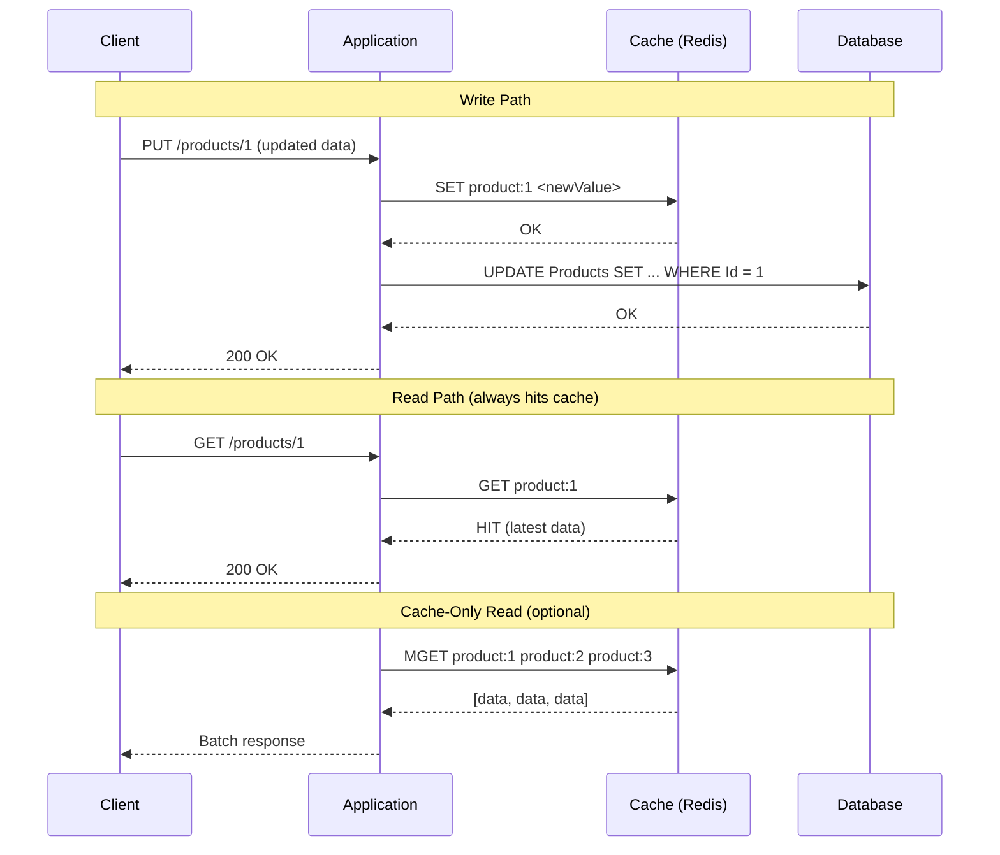

## Navigation

**Domain:** [[7 — System Design & Distributed Systems]] > **Group:** Caching
**Previous:** [[7.257 — Cache-Aside Pattern]] | **Next:** [[7.259 — Write-Behind Caching]]

### Prerequisites

- [[7.256 — Caching — Why Cache and When]] — the foundational why/when decision; write-through is an alternative write-path strategy
- [[7.257 — Cache-Aside Pattern]] — the default read/write pattern; write-through differs on the write path (write to cache first, cache writes DB synchronously)
- [[7.287 — Redis as Cache — Patterns in .NET]] — how Redis is used as the write-through cache layer

### Where This Fits

Write-through caching flips the write path: instead of writing to the database and evicting the cache (cache-aside), the application writes to the cache first, and the cache layer synchronously writes the data to the database. The invariant is that the cache always contains the latest data — every write updates both cache and database atomically (within a single transaction or retry loop). This eliminates the cache staleness window entirely: there is no TTL staleness, no eviction-then-read race, no stale data. The cost is write latency (every write pays cache + database round-trips) and write throughput (the cache is on the write path, so if the cache is slow, writes are slow). A .NET engineer reaches for write-through when the business requires "a read immediately after a write must see the new value" — for example, updating user profile settings, configuration values, or feature flags that must be consistent across all instances within milliseconds.

---

## Core Mental Model

Write-through caching is a write path strategy in which the application writes data to the cache, and the cache layer synchronously writes the same data to the database. The invariant: the cache is always authoritative — every write updates both stores before returning to the caller. What write-through trades is write latency (every write pays the round-trip to both cache and database) for read consistency (every subsequent read from cache returns the latest value — there is no staleness window). The recognition trigger: a read-after-write consistency requirement where the user must see their own changes immediately, the data changes infrequently (writes are not the bottleneck), and the read-to-write ratio is high enough that keeping the cache fresh is cheaper than accepting TTL-based staleness.



### Classification

**Pattern category:** Write path caching strategy, consistency-enforcing pattern.
**Abstraction layer:** Application layer (service/repository) — the application explicitly writes to cache first, then to database. The cache is not autonomous (unlike read-through); the application orchestrates the dual write.
**Scope:** Single-service data access. Write-through across services requires distributed coordination (distributed transactions, sagas, or an outbox).
**When applied:** Read-after-write consistency is required. The same data is updated infrequently (< 10 writes/second per key) and read frequently (> 100 reads/second). The write latency cost (cache + DB round-trips) is acceptable.
**When not applied:** Write-heavy workloads (every request is a write — the cache adds overhead to every operation), the cache is in-process (data loss on process crash), or the database is faster than the cache (unlikely but possible with low-latency local databases).

### Key Properties / Guarantees

|Property|Value|Condition|
|---|---|---|
|Write latency |Cache + DB round-trip (e.g., 5 ms + 45 ms = ~50 ms) |Cache and DB both available|
|Read latency |Cache only — 0.1–10 ms |Cache hit (guaranteed for data written through this pattern)|
|Consistency |Strong — cache and DB are always in sync |Synchronous write to both; failure in either rolls back or retries|
|Cache staleness |Zero — cache has the latest data after write completes |Write succeeded; no concurrent writes to other replicas|
|Write throughput |Limited by cache + DB combined throughput |Each write needs both; burst writes queue on cache layer|
|Data loss risk |Low — data is in both cache and DB |Cache failure before DB write is mitigated by retry|

---

## Deep Mechanics

### How Write-Through Works

The write-through pattern has two distinct flows depending on whether the write path includes the database synchronously or deferentially:

**Write path (dual-write):**

1. **Application serializes the data** into the cache format (typically JSON bytes for Redis).
2. **Cache write (first).** The application writes the serialized data to the cache: `SET product:1 <bytes> EX <TTL>`. The TTL is set even in write-through — it acts as a safety net in case the cache and database ever diverge (the TTL guarantees eventual eviction of orphaned data).
3. **Database write (second).** The application writes the data to the database: `UPDATE Products SET ... WHERE Id = 1`. This is the source-of-truth write.
4. **On success.** Both writes completed. Return success to the caller.
5. **On cache write failure (Redis down).** The application MUST NOT write to the database without the cache — if it does, the cache will be stale on the next read. Options: (a) abort the entire write and return error; (b) write to database only and EVICT the cache key (fall back to cache-aside for this write).
6. **On database write failure.** The cache now has data that the database does not. The application should either roll back the cache write (SET the old value or DELETE the key) or let the TTL expire the orphaned data.

**Read path:**

1. **Cache lookup.** The application checks the cache: `GET product:1`.
2. **Hit.** Return the cached value. It is guaranteed to be the latest because every write updates the cache first.
3. **Miss (cold cache, TTL expiry, eviction).** This should NOT happen if all writes go through write-through. But it can happen: cache restart, manual key deletion, TTL expiry (if the data was written before write-through was in place). Fall back to cache-aside: read from database, write to cache, return.
4. **Cache-only reads (optional optimization).** For batch reads, use `MGET` to fetch multiple keys in one round trip. This is only safe if all keys are managed by write-through.

### The Atomicity Problem

Write-through has an atomicity problem: writing to two different stores (cache and database) is not a distributed transaction (unless you use MSDTC, which is not available in Azure SQL). If the cache write succeeds but the database write fails, the cache has data that the database does not. The next read returns data that does not exist in the source of truth.

Solutions (ordered by preference):

1. **Write to DB first, then cache.** Reverse the order: write to DB, then write to cache. If DB fails, the cache is not touched. If DB succeeds but cache fails, the cache is stale — but the next read can fall through to DB (cache-aside fallback). This is actually a "write-to-DB-then-cache" pattern, not pure write-through. It provides better safety because the source of truth (DB) is always written first.
2. **Compensating delete.** Write to cache, then write to DB. If DB fails, delete the cache key. The next read is a miss, fetches from DB (which has the old value), and repopulates the cache with the correct data.
3. **All-or-nothing with retry.** Write to cache, then write to DB. If DB fails, retry the DB write with exponential backoff. If all retries fail, delete the cache key and return an error to the caller.
4. **Outbox pattern.** Write the data to the cache. Write an "outbox" record to a durable queue (Azure Service Bus, database outbox table). A background processor reads the outbox and writes to the database asynchronously. This is write-behind, not write-through — it sacrifices the synchronous guarantee.

### When DB-First Is Superior

For most production systems, the "write to DB first, then cache" variant is safer than pure write-through:

```text
Time  | Action                    | Result
------|---------------------------|---------------------------
T1    | UPDATE DB                 | DB has new data
T2    | SET cache                 | Cache has new data
T3    | (if T2 fails)             | Next read: cache miss → DB → correct
T4    | (if T1 fails)             | Abort. Cache not touched.
```

This is sometimes called "lazy write-through" or "write-around." It guarantees that the source of truth is always correct. The cache can be stale (write succeeded but cache SET failed), but the next cache-aside fallback on read fixes it.

### Failure Modes

|Failure|How It Manifests|Detection|Mitigation|
|---|---|---|---|
|Cache write succeeds, DB write fails |Cache has data that DB does not. Next read returns phantom data. |Read returns data that disappears on cache eviction. DB query returns no results. |Compensating delete: if DB write fails, delete the cache key. Or write DB first, then cache.|
|Cache is down |Write path must fall through to DB-only or fail. If it fails, all writes return 503. |Redis health check fails. `RedisConnectionException` in write path logs. |Implement fallback: if cache is down, write to DB and evict (cache-aside mode). Log a warning.|
|Cache key TTL expires |Data that was written through the cache becomes inaccessible from cache. Read misses, falls through to DB — correct but slower. |Cache hit rate drops for write-through-managed keys. |Set a long TTL (24+ hours) for write-through-managed keys. The TTL is a safety net, not the primary eviction mechanism.|
|Concurrent writes to the same key |Write A sets cache to value X, writes DB to X. Write B sets cache to value Y, writes DB to Y. If B's cache write completes before A's DB write, the DB ends up with X but the cache has Y. |Read returns Y, DB has X. Inconsistent. |Use optimistic concurrency: include a version in the cache value. On write, check that the cache version matches. Or use Redis transactions (`WATCH` + `MULTI` + `EXEC`) to detect concurrent modifications.|

### .NET and Azure Integration

**Write-Through Repository Implementation (DB-first variant):**

```csharp
public class WriteThroughProductRepository
{
    private readonly IDistributedCache _cache;
    private readonly AppDbContext _db;
    private readonly ILogger<WriteThroughProductRepository> _logger;

    public WriteThroughProductRepository(
        IDistributedCache cache,
        AppDbContext db,
        ILogger<WriteThroughProductRepository> logger)
    {
        _cache = cache;
        _db = db;
        _logger = logger;
    }

    public async Task<Product?> GetByIdAsync(int id, CancellationToken ct)
    {
        var key = $"product:{id}";
        var cached = await _cache.GetAsync(key, ct);
        if (cached is not null)
            return JsonSerializer.Deserialize<Product>(cached);

        // Fallback to DB (cold cache or TTL expiry)
        var product = await _db.Products.FindAsync(new object[] { id }, ct);
        if (product is null) return null;

        await _cache.SetAsync(key, JsonSerializer.SerializeToUtf8Bytes(product),
            new DistributedCacheEntryOptions
            {
                AbsoluteExpirationRelativeToNow = TimeSpan.FromHours(24)
            }, ct);
        return product;
    }

    public async Task UpdateAsync(Product product, CancellationToken ct)
    {
        var key = $"product:{product.Id}";

        // 1. Write to DB first (source of truth)
        _db.Products.Update(product);
        await _db.SaveChangesAsync(ct);

        // 2. Write to cache second (update, not evict)
        try
        {
            await _cache.SetAsync(key, JsonSerializer.SerializeToUtf8Bytes(product),
                new DistributedCacheEntryOptions
                {
                    AbsoluteExpirationRelativeToNow = TimeSpan.FromHours(24)
                }, ct);
            _logger.LogDebug("Write-through cache updated for {Key}", key);
        }
        catch (RedisConnectionException ex)
        {
            // Cache unavailable — next read will miss and fallback to DB
            _logger.LogWarning(ex, "Cache write failed for {Key}; next read will repopulate", key);
            // No compensating action needed — DB has the truth
        }
    }
}
```

**Pure Write-Through (Cache-first variant with compensating delete):**

```csharp
public async Task UpdateWithCompensationAsync(Product product, CancellationToken ct)
{
    var key = $"product:{product.Id}";
    var serialized = JsonSerializer.SerializeToUtf8Bytes(product);

    // 1. Write to cache first
    try
    {
        await _cache.SetAsync(key, serialized, new DistributedCacheEntryOptions
        {
            AbsoluteExpirationRelativeToNow = TimeSpan.FromHours(24)
        }, ct);
    }
    catch (RedisConnectionException ex)
    {
        _logger.LogWarning(ex, "Cache unavailable; writing to DB only");
        // Fall through — write to DB only; cache will be cold
    }

    // 2. Write to DB
    try
    {
        _db.Products.Update(product);
        await _db.SaveChangesAsync(ct);
    }
    catch (DbUpdateException ex)
    {
        // DB write failed — compensate: delete the cache key
        _logger.LogError(ex, "DB write failed for product {Id}; compensating cache delete", product.Id);
        try { await _cache.RemoveAsync(key, ct); } catch { /* best effort */ }
        throw;
    }
}
```

**Azure-Specific Wiring:**

```csharp
// Program.cs — Redis with long TTL for write-through-managed data
builder.Services.AddStackExchangeRedisCache(options =>
{
    options.Configuration = builder.Configuration.GetConnectionString("Redis");
    options.InstanceName = "WT:"; // Write-through namespace prefix
});

// appsettings.Production.json
// {
//   "Redis": "wt-cache.redis.cache.windows.net:6380,password=...,ssl=True,abortConnect=false"
// }
```

**Key differences from cache-aside wiring:**

- `InstanceName` is different (`"WT:"` vs `"Products:"`) — write-through-managed keys are in a separate logical namespace. This makes it easy to apply different eviction policies (e.g., Redis `maxmemory-policy allkeys-lru` for cache-aside keys, `noeviction` for write-through keys).
- TTL is long (24 hours) because write-through manages freshness — TTL is a safety net, not the primary staleness bound.

---

## Production Patterns and Implementation

### 1. Write-Through with Outbox for Atomicity

The dual-write atomicity problem (write to cache and DB is not atomic) is solved in practice by the Outbox pattern: write the data to the cache, enlist the DB write in an outbox table within the same DB transaction, and let a background processor apply the DB write. This gives you the read consistency of write-through (the cache has the new data immediately) with the durability of a database transaction.

```csharp
public class WriteThroughWithOutbox<T> where T : class
{
    private readonly IDistributedCache _cache;
    private readonly AppDbContext _db;
    private readonly ILogger _logger;
    private readonly string _keyPrefix;
    private readonly TimeSpan _ttl;

    public async Task UpdateAsync(int id, T entity, CancellationToken ct)
    {
        var key = $"{_keyPrefix}:{id}";

        // 1. Write to cache immediately (visible to readers)
        await _cache.SetAsync(key, JsonSerializer.SerializeToUtf8Bytes(entity),
            new DistributedCacheEntryOptions { AbsoluteExpirationRelativeToNow = _ttl }, ct);

        // 2. Enlist the DB write + outbox in a single transaction
        await using var transaction = await _db.Database.BeginTransactionAsync(ct);
        try
        {
            // Apply the update to the entity table
            _db.Set<T>().Update(entity);
            await _db.SaveChangesAsync(ct);

            // Write an outbox record for durability
            _db.Set<OutboxMessage>().Add(new OutboxMessage
            {
                Id = Guid.NewGuid(),
                CreatedAt = DateTime.UtcNow,
                Type = $"{typeof(T).Name}Updated",
                Payload = JsonSerializer.Serialize(entity),
                Processed = false
            });
            await _db.SaveChangesAsync(ct);

            await transaction.CommitAsync(ct);
        }
        catch
        {
            // Transaction failed. Compensate: delete the cache key.
            // The outbox processor will not process this write because the outbox record was rolled back.
            await _cache.RemoveAsync(key, ct);
            throw;
        }
    }
}
```

### 2. Versioned Write-Through for Optimistic Concurrency

When concurrent writes to the same entity are possible, use a version field to detect conflicts. The write-through operation becomes a compare-and-swap:

```csharp
public class VersionedProduct
{
    public int Id { get; set; }
    public string Name { get; set; } = string.Empty;
    public decimal Price { get; set; }
    public int Version { get; set; } // Incremented on each write
}

public class VersionedWriteThroughRepository
{
    private readonly IDistributedCache _cache;
    private readonly AppDbContext _db;

    public async Task<bool> TryUpdateAsync(VersionedProduct product, CancellationToken ct)
    {
        var key = $"product:{product.Id}";

        // Use Redis WATCH + MULTI + EXEC for atomic compare-and-swap
        var redis = ((RedisCache)_cache).GetDatabase();
        var oldValue = await redis.StringGetAsync(key);
        if (oldValue.HasValue)
        {
            var existing = JsonSerializer.Deserialize<VersionedProduct>(oldValue!);
            if (existing!.Version != product.Version - 1)
                return false; // Conflict — someone else updated first
        }

        var tran = redis.CreateTransaction();
        tran.StringSetAsync(key, JsonSerializer.SerializeToUtf8Bytes(product), TimeSpan.FromHours(24));
        var committed = await tran.ExecuteAsync(ct);
        if (!committed) return false; // WATCH detected a concurrent modification

        // DB write (optimistic concurrency via rowversion)
        _db.Products.Update(product);
        try
        {
            await _db.SaveChangesAsync(ct);
        }
        catch (DbUpdateConcurrencyException)
        {
            // DB conflict — roll back cache
            await _cache.RemoveAsync(key, ct);
            return false;
        }

        return true;
    }
}
```

### 3. Write-Through for Configuration / Feature Flags (The Sweet Spot)

Write-through shines for configuration data that is read on every request but updated rarely. Feature flags, pricing rules, and business configurations are the ideal use case:

```csharp
public class ConfigurationService
{
    private readonly IDistributedCache _cache;
    private readonly AppDbContext _db;
    private static readonly TimeSpan CacheTtl = TimeSpan.FromHours(24);

    public async Task<T> GetConfigAsync<T>(string key, CancellationToken ct) where T : class
    {
        var cacheKey = $"config:{key}";
        var cached = await _cache.GetAsync(cacheKey, ct);
        if (cached is not null)
            return JsonSerializer.Deserialize<T>(cached)!;

        var config = await _db.Configurations
            .Where(c => c.Key == key)
            .Select(c => c.Value)
            .FirstOrDefaultAsync(ct);

        if (config is null) throw new KeyNotFoundException($"Configuration key '{key}' not found.");

        await _cache.SetAsync(cacheKey, Encoding.UTF8.GetBytes(config), new DistributedCacheEntryOptions
        {
            AbsoluteExpirationRelativeToNow = CacheTtl
        }, ct);

        return JsonSerializer.Deserialize<T>(config)!;
    }

    public async Task SetConfigAsync<T>(string key, T value, CancellationToken ct)
    {
        var serialized = JsonSerializer.Serialize(value);
        var cacheKey = $"config:{key}";

        // DB first (source of truth)
        var existing = await _db.Configurations.FirstOrDefaultAsync(c => c.Key == key, ct);
        if (existing is not null)
        {
            existing.Value = serialized;
            existing.UpdatedAt = DateTime.UtcNow;
        }
        else
        {
            _db.Configurations.Add(new Configuration { Key = key, Value = serialized, UpdatedAt = DateTime.UtcNow });
        }
        await _db.SaveChangesAsync(ct);

        // Cache second
        await _cache.SetAsync(cacheKey, Encoding.UTF8.GetBytes(serialized), new DistributedCacheEntryOptions
        {
            AbsoluteExpirationRelativeToNow = CacheTtl
        }, ct);
    }
}
```

### Configuration and Wiring

```csharp
// Program.cs — dedicated Redis instance for write-through config data
builder.Services.AddStackExchangeRedisCache(options =>
{
    options.Configuration = builder.Configuration.GetConnectionString("ConfigRedis");
    options.InstanceName = "Config:";
});

builder.Services.AddScoped<ConfigurationService>();
```

### Common Variants

|Variant|Description|When to Use|
|---|---|---|
|DB-first (recommended)|Write to DB, then cache. DB is source of truth; cache update failure is acceptable. |Default — safest, minimal data loss risk.|
|Cache-first with compensating delete|Write to cache, then DB. If DB fails, delete cache key. |When read-after-write consistency MUST be instant. Cache update is not optional.|
|Outbox write-through|Write to cache, then DB + outbox in a transaction. Background processor confirms the DB write. |Maximum safety: cache is updated immediately, DB write is durable via transaction.|
|Versioned write-through|Use Redis WATCH + MULTI + EXEC for atomic compare-and-swap. |Concurrent updates to the same key must be detected and rejected.|
|Batch write-through|Write multiple cache keys in a single Redis pipeline, then write multiple DB rows in a single transaction. |Bulk import or batch update scenarios.|

### Real-World .NET Ecosystem Example

- **FusionCache** — open-source .NET cache library that supports write-through as `SetAsync` with `FailSafe` enabled. When fail-safe is on and the DB write fails, the cache retains the old value (stale-but-safe) rather than becoming empty.
- **Azure App Configuration + Redis** — Azure App Configuration is a managed feature-flag and configuration store. Many .NET applications use App Configuration as the source of truth, write-through to Redis for fast reads, with a TTL as a safety net. The `Microsoft.Extensions.Configuration.AzureAppConfiguration` provider caches configuration values with a configurable cache expiration.

---

## Gotchas and Production Pitfalls

### Gotcha 1: The Phantom Data Problem — Cache Has Data DB Doesn't

**Pitfall:** The application writes to the cache first, then writes to DB. The cache write succeeds. The DB write fails (constraint violation, deadlock, timeout). The cache now has data that the database has never seen. A subsequent read returns the phantom data.

```csharp
// ❌ Cache-first without compensation
await _cache.SetAsync(key, data, ttl);
await _db.SaveChangesAsync(ct); // May fail
```

**Symptom:** A product appears in the API response (from cache) but is not in the database. An admin searching the database cannot find the record. Support cannot reproduce the issue by querying SQL.

**Fix:** Use DB-first write order, or implement a compensating delete on DB failure:

```csharp
// ✅ DB-first — DB is always the truth
await _db.SaveChangesAsync(ct);
await _cache.SetAsync(key, data, ttl); // If this fails, no harm — next read falls through
```

**Cost of not fixing:** Phantom data that disappears on cache eviction. Customers who saw the product and added it to cart will see "product not found" on checkout. Lost revenue, confused users, impossible-to-reproduce bugs.

### Gotcha 2: Write-Through with In-Process Cache — Data Loss on Crash

**Pitfall:** The team implements write-through using `IMemoryCache`. The application writes to `IMemoryCache` and then to the database. The process crashes between the cache write and the database write. The data is lost because `IMemoryCache` is volatile.

**Symptom:** Writes that were confirmed to the user (HTTP 200) but the data is not in the database. Users complain about "missing saved data." The application CPU/memory logs show a crash around the same time.

**Fix:** Never use in-process cache for write-through. Use a distributed cache (Redis) that persists data. Even with Redis, use DB-first order to ensure the source of truth is always correct:

```csharp
// ✅ Distributed cache + DB-first order
await _db.SaveChangesAsync(ct);      // Durable
await _cache.SetAsync(key, data, ttl); // Redis — surviving process restart
```

**Cost of not fixing:** Silent data loss. Users lose their work (profile updates, orders, configuration changes). The team loses trust in the system.

### Gotcha 3: TTL Expiry on Write-Through-Managed Keys

**Pitfall:** The team sets a short TTL (5 minutes) on write-through cache keys, thinking "if something goes wrong, at least the TTL will fix it." But on TTL expiry, the next read pays a cache miss penalty — the cache-aside fallback populates it from the database, which is correct but slow. Worse: if the write-through key is supposed to absorb all reads, a TTL expiry on a high-traffic key causes a stampede.

**Symptom:** Every N minutes (the TTL), there is a latency spike as the cache-aside fallback kicks in for all keys that expire simultaneously.

**Fix:** Set a long TTL (24+ hours) for write-through keys. The TTL is a safety net — it should only trigger if the cache and database get out of sync or if the application deployment clears the cache:

```csharp
// ✅ Long TTL — TTL is not the primary freshness mechanism
new DistributedCacheEntryOptions
{
    AbsoluteExpirationRelativeToNow = TimeSpan.FromHours(24)
};
```

**Cost of not fixing:** Periodic latency spikes that are hard to diagnose. The team may disable write-through because "it causes latency spikes" when the actual cause is a short TTL.

### Gotcha 4: Read Path Bypasses the Cache

**Pitfall:** Some code paths read directly from the database (e.g., reporting queries, admin panels, batch jobs) instead of going through the write-through repository. These reads see stale data: the cache has the latest value (write-through), but the database may not have been updated yet (cache-first variant) or the read path uses a different cache key.

**Symptom:** The API (uses cache) shows the updated data. The admin panel (reads from DB directly) shows old data. The discrepancy looks like the cache is "wrong."

**Fix:** Ensure ALL reads for write-through-managed data go through the cache. If a direct DB read is necessary (e.g., for a reporting query), accept the staleness or bypass the cache explicitly with a log entry:

```csharp
// ❌ Direct DB read — bypasses cache
var product = await _db.Products.FindAsync(id);

// ✅ Consistent read — through cache
var product = await _productRepository.GetByIdAsync(id, ct);
```

**Cost of not fixing:** Persistent inconsistency between the main API and admin/reporting tools. The admin team loses confidence and demands the cache be removed.

### Gotcha 5: Concurrent Writes to the Same Key

**Pitfall:** Two concurrent requests update the same product. Write A sets cache to "price: $10" and writes DB to "price: $10". Write B sets cache to "price: $12" and writes DB to "price: $12". If B's cache write completes before A's DB write (due to network latency), the cache has $12 but the DB has $10. The read returns $12 (from cache), but the DB has $10.

**Symptom:** Intermittent read-after-write inconsistency under concurrent write load. The cache returns a value that the database does not have.

**Fix:** Use optimistic concurrency: include a `Version` field. The cache and DB both store the version. On write, use Redis `WATCH` to detect if the cache value changed since the read:

```csharp
// ✅ Use WATCH to detect concurrent modifications
var tran = redis.CreateTransaction();
tran.AddCondition(Condition.StringEqual(key, expectedVersion));
tran.StringSetAsync(key, newValue);
if (await tran.ExecuteAsync()) { /* success */ }
```

**Cost of not fixing:** Data races that result in lost updates. The last writer wins, potentially reverting another writer's change.

---

## Tradeoffs and Decision Framework

### Tradeoff Matrix: Write-Through vs Cache-Aside vs Write-Behind

|Dimension|Write-Through|Cache-Aside (evict on write)|Write-Behind|
|---|---|---|---|
|Read-after-write consistency |Strong — cache has latest immediately |Eventual — up to TTL |Eventual — write-back lag|
|Write latency |Cache + DB round-trip (~50 ms) |DB only (~45 ms) |Cache only (~5 ms)|
|Write throughput |Limited by DB + cache |Limited by DB only |Limited by cache only (DB is async)|
|Data loss risk |Low (data in both stores) |Low (data in DB only) |High (data in cache only until background flush)|
|Cache always fresh? |Yes (all writes update cache) |No (evicted on write, stale until next read) |Yes (cache is the only store until flush)|
|Complexity |Medium (dual-write atomicity) |Low |High (flush failure, data reconciliation)|
|When to choose |Read-after-write consistency, low write volume |Default — read-heavy, write-rarely |Write-heavy, throughput > consistency|

### When to Use Write-Through

- **Read-after-write consistency is required.** The user must see their own change immediately. Example: updating a feature flag: an admin toggles a flag and the system must use the new value on the next request.
- **Write volume is low.** Less than 10 writes/second per key. Each write pays cache + DB latency. At higher write volumes, the write path becomes a bottleneck.
- **The data is configuration or reference data.** Feature flags, pricing rules, business hours, shipping rates — data that is read on every request but updated infrequently.
- **The cache is a distributed cache (Redis).** Never use write-through with in-process cache — data loss on crash.

```mermaid
flowchart TD
    A[Need read-after-write consistency?] -->|Yes| B{Write volume per key?}
    A -->|No| C[Use cache-aside — simpler]
    B -->|"< 10 writes/sec"| D{Data loss acceptable?}
    B -->|"> 10 writes/sec"| E[Consider write-behind for throughput]
    D -->|No| F{DB order preference?}
    D -->|Yes| E
    F -->|DB first (safer)| G[DB-first write-through]
    F -->|Cache first (fresher)| H[Cache-first + compensating delete]
```

### When NOT to Use Write-Through

- [ ] **Write-heavy workload.** If the same key is written more than 10 times/second, the write path latency (cache + DB) will be a bottleneck. Use cache-aside with eviction (write to DB only, evict cache) or write-behind.
- [ ] **In-process cache (`IMemoryCache`).** The cache is volatile. A process crash between cache write and DB write loses data. Use distributed cache (Redis) or use cache-aside.
- [ ] **The cache is not required for reads.** If reads are not significantly faster with caching (e.g., the database is already fast enough), write-through adds write latency without read benefit.
- [ ] **Data is written by multiple services with the same cache instance.** If Service A writes through the cache and Service B also writes to the same table (bypassing the cache), Service B's writes are invisible to Service A's cache. The cache becomes stale. Use event-driven invalidation instead.
- [ ] **The same data is updated concurrently by multiple writers.** Without optimistic concurrency (version field, `WATCH`), concurrent writes cause lost updates. Use versioned write-through or cache-aside.

### Scale Thresholds

- **Worth implementing:** 1–10 writes/second per key, > 1,000 reads/second per key, read-after-write consistency is a hard requirement.
- **Too slow for:** > 100 writes/second per key (write latency of 50 ms + DB contention). At this scale, use cache-aside with eviction, or split into write-behind + read cache.
- **Justified for configuration data:** Even at 1 write/hour and 10,000 reads/second, write-through is worth it. The configuration update must be visible immediately; there is no more efficient way to get instant read-after-write consistency.
- **Not justified when:** The database query time is < 5 ms at P99 and the cache hit rate would save < 2 ms. The added write latency (5–50 ms) is not worth the read improvement.

---

## Interview Arsenal

### Question Bank

1. **Q:** What is write-through caching and how does it differ from cache-aside? **A:** Write-through caching writes data to the cache first (or to the cache and database in sequence), so the cache always contains the latest data. Cache-aside writes to the database and evicts the cache key — the cache is populated lazily on the next read. The key difference: write-through guarantees the cache is always fresh; cache-aside accepts bounded staleness (TTL). The cost: write-through adds write latency (cache + DB round-trip), while cache-aside has no write overhead.

2. **Q:** What is the atomicity problem in write-through? **A:** Writing to two stores (cache and database) is not an atomic operation. If the cache write succeeds and the database write fails, the cache has data the database does not (phantom data). Solutions: (1) write to DB first, then cache — if cache fails, the next read falls through to DB; (2) cache-first with compensating delete — if DB fails, delete the cache key; (3) use the outbox pattern — write to cache, write to DB + outbox in a transaction, and use a background processor for the DB write.

3. **Q:** When would you choose write-through over cache-aside? **A:** When read-after-write consistency is a hard requirement. For example: feature flags, configuration values, user profile settings. The user must see their own change on the next read. The tradeoff is write latency — each write pays cache + DB round-trip, so write-through is only suitable for low-write-volume data (< 10 writes/second per key).

4. **Q:** Can you use write-through with in-process cache (`IMemoryCache`)? **A:** Not safely. In-process cache is volatile — if the process crashes between the cache write and the database write, the data is lost. Write-through requires a durable distributed cache (Redis) that survives process restarts. Even with Redis, the DB-first order is safer: if the cache fails after the DB write, the next read falls through to the database.

5. **Q:** How does write-through handle concurrent writes to the same key? **A:** The last-writer-wins by default. If two concurrent writes interleave (A writes cache, B writes cache, A writes DB, B writes DB), the cache and DB can diverge. Use optimistic concurrency: include a `Version` field in the cached value; use Redis `WATCH` to detect concurrent modifications; use database row versioning (`SqlTimestamp` / `rowversion`) on the DB write.

6. **Q:** What happens to write-through-managed cache keys when Redis runs out of memory? **A:** Redis uses the configured `maxmemory-policy`. If the policy is `allkeys-lru` or `allkeys-ttl`, write-through keys may be evicted despite being valuable. The eviction causes a cache miss on the next read, which triggers the cache-aside fallback (read from DB, write to cache). The solution: use `allkeys-lfu` (least-frequently-used) so write-through keys, which are read frequently, are the last to be evicted. Or use a dedicated Redis instance for write-through keys.

7. **Q:** How do you handle the case where the cache is down and a write arrives? **A:** The write path should degrade: write to the database only, and log a warning that the cache was unavailable. On the next read, the cache-aside fallback will populate the cache. Do NOT fail the write because the cache is down — the database is the source of truth. This is the DB-first pattern in action: the cache is an optimization, not a requirement for correctness.

8. **Q:** How does the TTL work in write-through? **A:** The TTL is a safety net, not the primary freshness mechanism. In pure write-through, the cache is always updated on write, so the TTL should never expire under normal operation. Set a long TTL (24 hours). If the TTL expires, the next read pays a cache miss penalty. Short TTLs defeat the purpose of write-through.

### Spoken Answers

**Q: "Explain write-through caching and when you would use it."**

> **Average answer:** "Write-through means you write to the cache and database at the same time. It keeps the cache fresh for reads."
>
> **Great answer:** "Write-through caching is a write path strategy that ensures the cache is always consistent with the database. There are two variants: cache-first (write to cache, then to database) and DB-first (write to database, then to cache). I strongly prefer DB-first because it avoids the phantom data problem — if the cache write fails, the database still has the truth and the next read will repopulate the cache. I would use write-through for data that has three characteristics: the read-to-write ratio is very high — at least 100:1 — because every write pays the cost of updating both stores; read-after-write consistency is a hard business requirement — the user who changes a configuration value must see it reflected immediately; and the write volume is low — less than 10 writes per second per key, because write-through adds the latency of both a cache round-trip and a database round-trip to every write. The canonical example is feature flags: an admin toggles a flag, and every subsequent request from every instance must see the new value within milliseconds. For that use case, write-through with Redis and DB-first order is the right choice."

**Q: "How do you prevent data loss in write-through?"**

> **Average answer:** "Use a transaction to write to both at the same time."
>
> **Great answer:** "Write-through by definition writes to two stores, so atomicity is the central problem. There is no cross-store transaction between Redis and SQL Server in Azure — MSDTC is not available. I prevent data loss with three layers. First, I use DB-first order: the database write completes before the cache write begins. If the cache write fails, the next read falls through to the database with no data loss. Second, I use a compensating action: if the database write fails after the cache write (cache-first variant), I immediately delete the cache key so the cache does not hold phantom data. Third, for critical data, I use the outbox pattern: the cache update is immediate (so reads are fast), and the database write is enlisted in a local transaction with an outbox table. A background processor reads the outbox and confirms the database write. If the application crashes between the cache write and the outbox commit, the cache has the data, and the outbox processor will eventually write it to the database. This gives the performance of cache-first with the durability of an ACID transaction."

### System Design Interview Trigger

If an interviewer asks you to design a configuration service, a feature flag system, or a user preferences service, they are setting up a write-through caching question. The prompt will include a requirement like: "when an admin changes a configuration value, all users must see the change within 100 milliseconds." The interviewer is testing: (1) do you recognize this as a write-through candidate? (2) do you know the atomicity problem and how to mitigate it? (3) do you consider the write volume and whether write-through is sustainable at scale? (4) do you discuss the TTL as a safety net? The strong answer acknowledges the dual-write atomicity problem and offers the DB-first variant with an outbox safety net.

### Comparison Table

| |Write-Through|Cache-Aside (evict)|Write-Behind|
|---|---|---|---|
|Read consistency |Strong — always latest |Eventual — up to TTL |Eventual — write-back lag|
|Write latency |Cache + DB |DB only |Cache only|
|Data loss risk |Low (DB has truth) |Low (DB has truth) |High (until flushed)|
|Cache always fresh |Yes |No |Yes|
|Atomicity complexity |Medium (dual-write) |None |High (flush failure)|
|.NET implementation |Manual IDistributedCache + EF Core |`GetOrCreate` + evict |FusionCache, EF Core second-level cache|

---

## Architecture Decision Record

### Title: Write-Through Caching for Feature Flag Service

**Context:** The Feature Flag service provides `GET /flags/{name}` (read on every request — 10,000 req/s across all services) and `PUT /flags/{name}` (admin update — ~50 writes/day). The feature flag value must be visible to all services within 100 ms of an admin update. The current implementation reads flags from Azure SQL every time — 45 ms per read. The database DTU for flag reads is 30% of total. The read-to-write ratio is approximately 3 million:1.

**Options Considered:**

1. **DB-first write-through (Redis).** Admin updates a flag: write to DB, then write to Redis. All services read from Redis (sub-millisecond). TTL: 24 hours (safety net). Read fallback: if Redis is down, read from DB.
2. **Cache-aside (Redis).** Admin updates a flag: write to DB, evict Redis key. Next read misses, reads from DB, writes to Redis with 5-minute TTL. Read-after-update consistency: up to 5 minutes — violates the 100 ms requirement.
3. **No cache — scale database.** Increase Azure SQL DTU to handle 10,000 flag reads/second. Cost: $X/month (10× current). No staleness, no complexity.
4. **Push-based invalidation (SignalR + Redis).** Admin updates a flag: write to DB. Broadcast `FlagUpdated` event via Azure SignalR to all connected service instances. Each instance evicts its in-memory cache. Redis stores the flag value (cache-aside). Requires WebSocket connections from all services.

**Decision:** Option 1 — DB-first write-through with Redis, because read-after-write consistency must be < 100 ms, the write volume is negligible (50/day), and the read volume is high (10,000/s). Cache-aside (Option 2) cannot meet the consistency requirement. Scaling the database (Option 3) costs more than Redis. Push-based invalidation (Option 4) adds WebSocket infrastructure complexity for no benefit over write-through.

**Consequences:**

- ✅ Read latency drops from 45 ms to < 3 ms (Redis). Database DTU for flag reads drops from 30% to near zero.
- ✅ Admin flag updates are visible within ~50 ms (DB write + Redis write latency).
- ✅ DB-first order ensures no phantom data: if Redis write fails, the next read falls through to DB correctly.
- ⚠️ All services must point to the same Redis instance. If the instance is down, reads fall back to DB (functional but slow). Mitigation: Redis Standard tier with replica (automatic failover).
- ⚠️ Redis memory: 1,000 flags × 1 KB each = negligible. Redis C1 (1 GB) is more than sufficient.

**Review Trigger:** Revisit this decision if: (1) flag update volume exceeds 1,000 writes/day (write-through latency becomes a factor); (2) feature flags grow to 100,000+ (need to shard Redis or use a larger SKU); (3) a second region is added (need Redis Active Geo-Replication for cross-region consistency).

---

## Self-Check

### Questions (10)

1. Describe the write-through write path. What are the two variants and which is safer?
2. What is the phantom data problem? How does DB-first write order prevent it?
3. Why is write-through unsuitable for write-heavy workloads?
4. What happens if the cache is down and a write-through write arrives?
5. How does write-through handle concurrent writes to the same key? What is the risk?
6. What TTL should you use for write-through-managed cache keys? Why?
7. Why should you NOT use `IMemoryCache` for write-through?
8. What is the difference between write-through and write-behind?
9. A feature flag is updated via write-through. A reporting tool queries the database directly (not through the cache). What does the reporting tool see?
10. How does the outbox pattern solve the atomicity problem in write-through?

### Scenario-Based Exercises (5)

**Scenario 1 — Diagnose the problem.** A configuration value is updated via write-through. The API returns the new value from the cache. An admin checks the database and finds the old value. The cache has the new value, the database has the old value. What happened?

<details>
<summary>Diagnosis</summary>

**Root cause:** The write path used cache-first order, and the database write failed (constraint violation, timeout, deadlock). The cache was updated successfully (the new value is visible in API responses), but the database write did not commit. The compensating delete (if implemented) did not execute or failed silently.

**Evidence:** Application logs show a `DbUpdateException` or `SqlException` at the time of the update. The cache key exists with the new value. The database row has the old value.

**Fix:** Implement or verify the compensating delete. If the database write fails after the cache write, delete the cache key so the next read returns the old (correct) value from the database. Better: switch to DB-first order — write to DB first, then write to cache. If the DB write fails, the cache is never touched.

**Prevention:** Use DB-first write order as the default. Add a unit test that simulates a DB failure and verifies the cache key is either not written or deleted.
</details>

---

**Scenario 2 — Design decision.** You are designing the user preferences service for a SaaS platform. Each user has preferences (theme, language, notification settings) stored in a `UserPreferences` table. Users update their preferences infrequently (average 1 update/month). Preferences are read on every page load (10,000 reads/second). Users expect that when they save a preference, it takes effect immediately on the next page load. Should you use write-through?

<details>
<summary>Decision and Reasoning</summary>

**Choice:** Yes — DB-first write-through with Redis is the right choice.

**Read-after-write consistency requirement:** Users expect their preference change to be visible on the next page load. Cache-aside with a 5-minute TTL would violate this expectation (user changes theme to dark, reloads the page 5 seconds later, sees light theme — reports a bug).

**Write volume:** 1 update/user/month × 1 million users = ~33,000 writes/day = ~0.4 writes/second. Well below the 10 writes/second threshold. Write latency of ~50 ms is negligible.

**Implementation:** User ID is the cache key: `"prefs:{userId}"`. Read: `GET prefs:123`. Write: update DB, then `SET prefs:123 <newValue>`.

```csharp
public async Task<UserPreferences> GetPreferencesAsync(int userId, CancellationToken ct)
{
    var key = $"prefs:{userId}";
    var cached = await _cache.GetAsync(key, ct);
    if (cached is not null) return JsonSerializer.Deserialize<UserPreferences>(cached);

    var prefs = await _db.UserPreferences.FindAsync(new object[] { userId }, ct);
    if (prefs is null) return new UserPreferences(); // Defaults
    await _cache.SetAsync(key, JsonSerializer.SerializeToUtf8Bytes(prefs), ...);
    return prefs;
}

public async Task UpdatePreferencesAsync(int userId, UserPreferences prefs, CancellationToken ct)
{
    _db.UserPreferences.Update(prefs);
    await _db.SaveChangesAsync(ct); // DB first
    await _cache.SetAsync($"prefs:{userId}", JsonSerializer.SerializeToUtf8Bytes(prefs), ...);
}
```

**Cache size:** 1 million users × 1 KB = 1 GB. Redis C2 (2.5 GB) handles this comfortably.
</details>

---

**Scenario 3 — Failure mode.** The Feature Flag service uses write-through. After a deployment that clears the Redis cache (new Redis instance, new connection string), all flag reads are cache misses. 10,000 req/s hit the database. The database DTU spikes to 95%. What happened and how do you prevent it?

<details>
<summary>Investigation and Fix</summary>

**Investigation steps:** (1) Check Redis connection string — confirmed: new Redis instance, empty. (2) Check cache hit rate — 0%. (3) Check database DTU — 95%, up from 20%. (4) Check application logs — "Cache miss for flag:X" for every flag on every request.

**Confirming evidence:** Redis `DBSIZE` = 0 (empty). All reads fall through to the database because the cache has no data.

**Immediate mitigation:** (1) Scale database to higher DTU tier temporarily. (2) Run a cache warm-up script that reads all flag keys from the database and writes them to Redis:

```csharp
public async Task WarmUpCacheAsync(CancellationToken ct)
{
    var flags = await _db.FeatureFlags.ToListAsync(ct);
    foreach (var flag in flags)
    {
        await _cache.SetAsync($"flag:{flag.Name}", JsonSerializer.SerializeToUtf8Bytes(flag), ...);
    }
}
```

**Permanent fix:** (1) Always warm up the cache after deployment using an `IHostedService` that runs on startup. (2) Do NOT clear the cache on deployment if possible — use a rolling deployment strategy that keeps the existing Redis instance. (3) If the cache must be cleared, add a pre-warming step to the CI/CD pipeline.

**Post-mortem item:** Add a deployment checklist item: "If cache is cleared, run warm-up before routing traffic."
</details>

---

**Scenario 4 — Scale it.** The Config Service uses write-through with Redis. It handles 50 writes/day and 10,000 reads/second. The business grows 10×. Estimates in 2 years: 500 writes/day, 100,000 reads/second. Does write-through still work?

<details>
<summary>Scaling Strategy</summary>

**Bottleneck this addresses:** The read side at 100,000 req/s. Redis handles 100,000 GET operations/second easily (Redis can handle 100K+ ops/s on a Standard C2 instance). The write side at 500 writes/day is negligible.

**How it helps:** Write-through continues to work. At 100,000 reads/second, the database would need significant scaling. Offloading reads to Redis keeps the database load minimal.

**What it does not solve:** If the config data grows from 1,000 keys to 100,000 keys (each with a 10 KB payload = 1 GB total), Redis memory grows but stays within C2/C3 capacity. If reads grow to 1M/second, Redis may need to scale vertically (C4+ instance) or use Redis cluster (sharding).

**Implementation changes:**
- Scale Redis vertically: C2 → C4 → C6 as needed.
- Add connection multiplexing: the .NET `ConnectionMultiplexer` handles 1,000+ concurrent connections efficiently.
- If Redis becomes a bottleneck: add a local L1 cache (in-process) with a 5-second TTL for the most-read keys. This absorbs 99% of reads at sub-millisecond latency.

**Limitation:** Write-through write latency (50 ms per write) is irrelevant at 500 writes/day. No change needed.
</details>

---

**Scenario 5 — Interview simulation.** The interviewer says: "Design a rate-limiting system for a public API. How would you handle the rate limiter state (counters) using caching?"

<details>
<summary>Model Response</summary>

"Rate limiter counters are a write-dominated workload — every API request increments a counter. This is NOT a cache-aside or write-through use case. I would use Redis directly as a counter store with atomic increment operations.

**Write path (every request):** `INCR rate:user:{userId}:window:1704067200` — atomic increment. No dual-write to a database. The counter lives in Redis with a TTL equal to the rate limit window.

**Persistence:** The counters are ephemeral — they are only meaningful within the current time window. If Redis loses a counter, the worst case is that the user gets one extra request through. This is acceptable for rate limiting (it degrades on the safe side — more requests allowed, not fewer).

**If read-after-write consistency is required** (e.g., the rate limiter must immediately reflect the incremented count for the next request from the same user): Redis `INCR` is atomic and immediately visible. This is a form of write-through (write to Redis, and Redis is the source of truth). No database involved.

**Why not DB-first write-through?** Writing every rate-limited request to a database before incrementing the Redis counter would destroy write throughput. The database cannot handle 10,000 writes/second for rate limiter counters. Redis is the system of record for rate limiter state."
</details>

---
