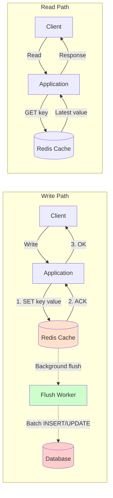
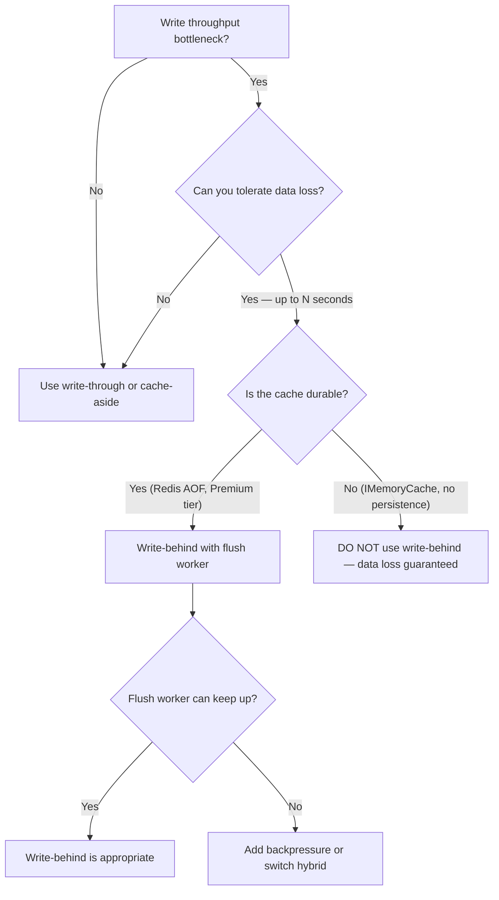

## Navigation

**Domain:** [[7 — System Design & Distributed Systems]] > **Group:** Caching
**Previous:** [[7.258 — Write-Through Caching]] | **Next:** [[7.260 — Read-Through Caching]]

### Prerequisites

- [[7.256 — Caching — Why Cache and When]] — the foundational why/when decision; write-behind is the highest-throughput write path strategy at the cost of durability
- [[7.258 — Write-Through Caching]] — write-behind is the asynchronous alternative to write-through; write-through waits for DB, write-behind does not
- [[7.287 — Redis as Cache — Patterns in .NET]] — Redis is commonly used as the write-behind buffer; data accumulates in Redis before the background flush to DB

### Where This Fits

Write-behind caching (write-back caching) is a write path strategy in which the application writes data to the cache and immediately returns, while a background process asynchronously flushes the data to the database. The invariant: the cache is the system of record for the latest writes; the database is eventually consistent with the cache. What write-behind trades is data durability (if the cache fails before the flush, recent writes are lost) for write latency and throughput (cache-only writes are 5–10× faster than cache + DB writes). A .NET engineer reaches for write-behind when write throughput is the bottleneck — for example, a high-volume analytics ingestion pipeline where losing a few seconds of data is acceptable, or a session store where session data is written to Redis and flushed to a persistent store periodically.

---

## Core Mental Model

Write-behind caching is a write path strategy where the application writes data only to the cache and returns immediately, while a background process (flush worker) asynchronously writes the buffered data to the database. The invariant: the cache holds the authoritative latest state; the database is a lagging replica that eventually catches up. What write-behind trades is durability (if the cache node fails before the flush, buffered writes are lost) for write latency (cache-only write = 1–5 ms vs cache+DB = 30–100 ms) and burst absorption (the cache buffers write spikes that would overwhelm the database). The recognition trigger: a write-heavy workload where the database is the bottleneck, the application can tolerate losing a bounded window of writes on cache failure, and the read path must see the latest writes immediately.



### Classification

**Pattern category:** Write path caching strategy, throughput-optimization pattern.
**Abstraction layer:** Application layer (write buffer) and infrastructure layer (flush worker as a background service or separate process).
**Scope:** Single-service or single-data-owner scope. Write-behind across services requires coordination (flush ordering, idempotency).
**When applied:** Write throughput exceeds database capacity, the application can tolerate seconds of data loss on cache failure, and the read path must see the latest writes immediately.
**When not applied:** The data is financial or transactional (data loss is unacceptable), the flush worker cannot keep up with the write rate (buffer grows unbounded), or strong read-after-write consistency across cache restarts is required.

### Key Properties / Guarantees

|Property|Value|Condition|
|---|---|---|
|Write latency |Cache only — 1–10 ms |Cache available|
|Write throughput |Cache throughput (10,000–100,000 writes/sec) |Limited by cache CPU/network, not DB|
|Read latency |Cache only — 1–10 ms |Cache hit|
|Consistency |Eventual — DB lags behind cache by flush interval |Flush interval (e.g., 1–60 seconds)|
|Data loss window |Flush interval — up to N seconds of writes |Cache node failure before flush completes|
|Durability |Low — cache is the sole copy until flush |Unless Redis persistence (AOF/RDB) is enabled|

---

## Deep Mechanics

### How Write-Behind Works

**Write path (3 steps):**

1. **Application writes to cache.** The application sets the cache key with the new value. For a distributed cache with persistence (Redis AOF or RDB), this write is durable within the cache node.
2. **Cache acknowledges.** The cache responds with OK. The application returns success to the caller. Total time: 1–10 ms.
3. **Background flush.** A flush worker (a separate process or background service) scans the cache for dirty keys — keys that have been written but not yet flushed to the database. It reads the key value, writes it to the database, and marks the key as clean.

**Read path:**

1. **Cache lookup.** The application checks the cache. Since the latest writes are always in the cache (the write path never skips the cache), the read always returns the latest data.
2. **Miss (cold cache, evicted).** If the cache key is missing (evicted under memory pressure, or the cache was restarted), fall back to the database. The data in the database may be stale (not yet flushed). This is the "read-repair" path: the application reads from DB, writes to cache, and the cache now has the value.

**Flush strategies:**

1. **Time-based flush.** Every N seconds (e.g., 5 seconds), the flush worker writes all dirty keys to the database in a batch. Simple, predictable. Data loss window = N seconds.
2. **Threshold-based flush.** When the number of dirty keys exceeds a threshold (e.g., 1,000 keys), the flush worker triggers immediately. Bounds the buffer size.
3. **Write-through fallback for critical keys.** If the flush worker detects that a key has been updated more than K times without a flush, it escalates to a synchronous write-through to prevent unbounded dirty-key accumulation.
4. **Commit log flush (Redis AOF).** Redis Append-Only File (AOF) logs every write operation to disk. In the event of a crash, Redis replays the AOF on restart. The flush worker reads the AOF to determine which keys need flushing. This reduces data loss to at most 1 second (AOF fsync policy: `everysec`).

### Dirty Key Tracking

The central mechanism in write-behind is tracking which keys are "dirty" (written but not flushed). Common approaches:

|Approach|How It Works|Pros|Cons|
|---|---|---|---|
|Separate dirty set|Maintain a Redis Set of dirty key names: `SADD dirty:orders order:123` on write, `SREM` on flush. |Explicit, queryable, supports prioritization. |Extra Redis I/O per write and flush.|
|Cache value flag|Include an `IsFlushed` field in the cached value. Flush worker updates the flag on flush completion. |No extra keys; atomic within the value. |Flush worker must deserialize every value to check the flag.|
|TTL-based identification|Dirty keys have a shorter TTL. Flush worker checks keys approaching expiry. |No explicit tracking. |Imprecise; keys may expire before flush.|
|Write-ahead log (Redis stream)|All writes go to a Redis Stream (`XADD`). Flush worker reads the stream (`XREAD`) and applies to DB. |Ordered, durable, exactly-once via consumer groups. |Higher complexity; stream management overhead.|

### Flush Worker Reliability

The flush worker is the most critical component in write-behind. It must handle:

- **Idempotency.** The same write may be flushed twice (flush worker crashes after DB write but before marking the key clean). The DB write must be idempotent: `UPSERT` (merge/on conflict do update) or include a `LastModified` timestamp.
- **Ordering.** Writes to the same key must be flushed in order. If the flush worker reads `order:123` twice (two concurrent writes), it must flush the final value, not the intermediate value. The flush worker should only flush the latest cache value.
- **Backpressure.** If the write rate exceeds the flush rate, the dirty set grows. The cache memory fills with unflushed keys. Mitigation: (1) alert when the dirty set size exceeds a threshold; (2) switch to write-through for the hottest keys; (3) scale the flush worker horizontally.
- **Partial failure.** The flush worker writes 100 keys in a batch, but key 50 fails (constraint violation). Options: (a) retry the entire batch; (b) skip the failed key and log it; (c) move the failed key to a dead-letter queue.

### Failure Modes

|Failure|How It Manifests|Detection|Mitigation|
|---|---|---|---|
|Cache node fails before flush |Unflushed writes are lost. Database is missing recent writes. |On cache restart, data that was confirmed as "written" to the client is gone. |Enable Redis persistence (AOF `everysec`). Use Redis Standard tier with replica. Accept that data loss up to N seconds is inherent to write-behind.|
|Flush worker crashes |Dirty keys accumulate in cache. Database is increasingly stale. |Dirty set size grows. Database lag increases. |Monitor dirty set size. Restart flush worker. Use a `CancellationToken` that triggers flush of remaining keys on shutdown.|
|Flush worker cannot keep up |Write rate > flush rate. Dirty keys pile up. Cache memory fills. |Dirty set grows linearly. Cache memory usage climbs. Redis evicts keys. |Scale flush worker (multiple partitions). Reduce flush interval. Switch hot keys to write-through.|
|Database slow on batch flush |Flush takes longer than the flush interval. Overlapping flushes cause DB contention. |DB CPU spike during flush. Second flush starts before first finishes. |Use incremental flush (flush in smaller batches, not all dirty keys at once). Throttle the flush rate.|
|Cache key eviction before flush |Redis evicts a dirty key under memory pressure (LRU). The key is lost. |Data in cache disappears. Database does not have the latest value. |Set `maxmemory-policy noeviction` on the Redis instance that holds write-behind data, or use a dedicated Redis instance.|

### .NET and Azure Integration

**Write-Behind Repository Implementation (time-based flush):**

```csharp
public class WriteBehindRepository<T> where T : class
{
    private readonly IDistributedCache _cache;
    private readonly IServiceScopeFactory _scopeFactory;
    private readonly string _keyPrefix;
    private readonly ILogger<WriteBehindRepository<T>> _logger;

    public WriteBehindRepository(
        IDistributedCache cache,
        IServiceScopeFactory scopeFactory,
        ILogger<WriteBehindRepository<T>> logger)
    {
        _cache = cache;
        _scopeFactory = scopeFactory;
        _keyPrefix = typeof(T).Name.ToLowerInvariant();
        _logger = logger;
    }

    public async Task SetAsync(int id, T entity, CancellationToken ct)
    {
        var key = $"{_keyPrefix}:{id}";
        var value = JsonSerializer.SerializeToUtf8Bytes(entity);

        // 1. Write to cache — fast path
        await _cache.SetAsync(key, value, new DistributedCacheEntryOptions
        {
            AbsoluteExpirationRelativeToNow = TimeSpan.FromHours(1)
        }, ct);

        // 2. Mark dirty in a separate Redis Set
        await _cache.SetAsync($"{key}:dirty", Array.Empty<byte>(),
            new DistributedCacheEntryOptions { AbsoluteExpirationRelativeToNow = TimeSpan.FromMinutes(5) }, ct);

        _logger.LogDebug("Write-behind: cached and marked dirty {Key}", key);
    }

    public async Task<T?> GetAsync(int id, CancellationToken ct)
    {
        var key = $"{_keyPrefix}:{id}";
        var cached = await _cache.GetAsync(key, ct);
        if (cached is not null)
            return JsonSerializer.Deserialize<T>(cached);

        return null; // caller falls through to DB
    }
}
```

**Flush Worker (Background Service):**

```csharp
public class FlushWorker<T> : BackgroundService where T : class
{
    private readonly IDistributedCache _cache;
    private readonly IServiceScopeFactory _scopeFactory;
    private readonly ILogger<FlushWorker<T>> _logger;
    private readonly string _keyPrefix;
    private readonly TimeSpan _flushInterval = TimeSpan.FromSeconds(5);
    private readonly int _batchSize = 100;

    protected override async Task ExecuteAsync(CancellationToken stoppingToken)
    {
        _logger.LogInformation("Flush worker started for {Type}", typeof(T).Name);

        while (!stoppingToken.IsCancellationRequested)
        {
            try
            {
                await FlushBatchAsync(stoppingToken);
            }
            catch (OperationCanceledException)
            {
                break;
            }
            catch (Exception ex)
            {
                _logger.LogError(ex, "Flush worker error; retrying in {Interval}", _flushInterval);
            }

            await Task.Delay(_flushInterval, stoppingToken);
        }

        // Graceful shutdown: flush remaining keys
        await FlushBatchAsync(CancellationToken.None);
    }

    private async Task FlushBatchAsync(CancellationToken ct)
    {
        // Scan for dirty keys using the dirty set pattern
        // In production, use Redis SCAN + pipeline for efficiency
        var dirtyKeys = await ScanDirtyKeysAsync(ct);
        if (dirtyKeys.Count == 0) return;

        _logger.LogInformation("Flushing {Count} dirty keys", dirtyKeys.Count);

        using var scope = _scopeFactory.CreateScope();
        var db = scope.ServiceProvider.GetRequiredService<AppDbContext>();

        foreach (var batch in dirtyKeys.Chunk(_batchSize))
        {
            var entities = new List<T>();
            foreach (var key in batch)
            {
                var cached = await _cache.GetAsync(key, ct);
                if (cached is null) continue;

                var entity = JsonSerializer.Deserialize<T>(cached);
                if (entity is null) continue;

                entities.Add(entity);
            }

            if (entities.Count == 0) continue;

            // Upsert — idempotent batch write
            foreach (var entity in entities)
            {
                db.Set<T>().Update(entity);
            }

            await db.SaveChangesAsync(ct);

            // Mark keys as clean
            foreach (var key in batch)
            {
                await _cache.RemoveAsync($"{key}:dirty", ct);
            }

            _logger.LogDebug("Flushed batch of {Count} keys", entities.Count);
        }
    }
}
```

**Registration:**

```csharp
// Program.cs
builder.Services.AddStackExchangeRedisCache(options =>
{
    options.Configuration = builder.Configuration.GetConnectionString("Redis");
    options.InstanceName = "WB:"; // Write-behind namespace
});

builder.Services.AddSingleton(typeof(WriteBehindRepository<>));
builder.Services.AddHostedService<FlushWorker<Product>>();
```

---

## Production Patterns and Implementation

### 1. Write-Behind with Redis Streams for Ordered, Durable Flush

The dirty-set pattern has ordering problems — if two writes to the same key interleave, the flush worker may flush the wrong value. Redis Streams solve this by maintaining an ordered log of all write events.

```csharp
public class StreamWriteBehind<T> where T : class
{
    private readonly ConnectionMultiplexer _redis;
    private readonly IServiceScopeFactory _scopeFactory;
    private readonly ILogger<StreamWriteBehind<T>> _logger;
    private readonly string _streamKey;
    private readonly string _consumerGroup;
    private readonly string _consumerName;

    public async Task SetAsync(int id, T entity)
    {
        var db = _redis.GetDatabase();
        var payload = new NameValueEntry[]
        {
            new("id", id.ToString()),
            new("data", JsonSerializer.Serialize(entity)),
            new("timestamp", DateTime.UtcNow.Ticks.ToString())
        };

        // Write to Redis stream — durable, ordered, persistent
        await db.StreamAddAsync(_streamKey, payload);
    }
}

public class StreamFlushWorker<T> : BackgroundService where T : class
{
    private readonly ConnectionMultiplexer _redis;
    private readonly IServiceScopeFactory _scopeFactory;
    private readonly string _streamKey;
    private readonly string _consumerGroup;
    private readonly string _consumerName;

    protected override async Task ExecuteAsync(CancellationToken stoppingToken)
    {
        var db = _redis.GetDatabase();

        // Create consumer group (idempotent)
        try { await db.StreamCreateConsumerGroupAsync(_streamKey, _consumerGroup, StreamPosition.NewMessages); }
        catch (RedisServerException ex) when (ex.Message.Contains("BUSYGROUP")) { }

        while (!stoppingToken.IsCancellationRequested)
        {
            // Read pending and new messages
            var messages = await db.StreamReadGroupAsync(
                _streamKey, _consumerGroup, _consumerName,
                count: 100, position: StreamPosition.NewMessages);

            foreach (var message in messages)
            {
                try
                {
                    var id = long.Parse(message.Values.First(v => v.Name == "id").Value!);
                    var data = message.Values.First(v => v.Name == "data").Value!;
                    var entity = JsonSerializer.Deserialize<T>(data);

                    using var scope = _scopeFactory.CreateScope();
                    var dbContext = scope.ServiceProvider.GetRequiredService<AppDbContext>();
                    dbContext.Set<T>().Update(entity!);
                    await dbContext.SaveChangesAsync(stoppingToken);

                    // Acknowledge — exactly-once processing
                    await db.StreamAcknowledgeAsync(_streamKey, _consumerGroup, message.Id);
                }
                catch (Exception ex)
                {
                    _logger.LogError(ex, "Failed to process stream message {MessageId}", message.Id);
                    // Move to dead-letter after N retries
                }
            }

            await Task.Delay(1000, stoppingToken);
        }
    }
}
```

### 2. Write-Behind with Redis Persistence (AOF) for Crash Recovery

Write-behind's biggest risk is data loss on cache crash. Enable Redis AOF persistence with `appendfsync everysec` to ensure at most 1 second of data loss:

```csharp
// When provisioning Azure Cache for Redis Premium tier:
// Enable "data persistence" (AOF) in the Azure portal.
// AOF is stored on a managed disk attached to the Redis node.

// For self-managed Redis, in redis.conf:
// appendonly yes
// appendfsync everysec
// auto-aof-rewrite-percentage 100
// auto-aof-rewrite-min-size 64mb

// When Redis restarts, it replays the AOF to recover the latest state.
// The flush worker must check for unflushed dirty keys on startup.
```

### 3. Write-Behind with Backpressure and Circuit Breaker

If the flush worker cannot keep up (write rate exceeds DB write throughput), the dirty set grows unbounded. The application must detect this and switch to write-through for new writes:

```csharp
public class AdaptiveWriteBehind<T> where T : class
{
    private readonly WriteBehindRepository<T> _writeBehind;
    private readonly WriteThroughRepository<T> _writeThrough;
    private readonly ILogger _logger;
    private long _dirtyCount;
    private bool _isWriteBehind = true;

    public async Task SetAsync(int id, T entity, CancellationToken ct)
    {
        if (_isWriteBehind)
        {
            var count = Interlocked.Read(ref _dirtyCount);
            if (count > 10_000) // Backpressure threshold
            {
                _logger.LogWarning("Dirty count {Count} exceeds threshold; switching to write-through", count);
                _isWriteBehind = false;
            }
        }

        if (_isWriteBehind)
        {
            await _writeBehind.SetAsync(id, entity, ct);
            Interlocked.Increment(ref _dirtyCount);
        }
        else
        {
            await _writeThrough.UpdateAsync(entity, ct);
        }
    }

    public void OnFlushCompleted(int flushedCount)
    {
        Interlocked.Add(ref _dirtyCount, -flushedCount);
        if (_dirtyCount < 1_000 && !_isWriteBehind)
        {
            _logger.LogInformation("Dirty count dropped below threshold; switching back to write-behind");
            _isWriteBehind = true;
        }
    }
}
```

### Configuration and Wiring

```csharp
// Program.cs — write-behind with Redis persistence
builder.Services.AddSingleton<ConnectionMultiplexer>(sp =>
{
    var config = sp.GetRequiredService<IConfiguration>();
    return ConnectionMultiplexer.Connect(new ConfigurationOptions
    {
        EndPoints = { config.GetConnectionString("Redis") },
        AbortOnConnectFail = false,
        Ssl = true,
        ConnectTimeout = 5000,
        SyncTimeout = 5000
    });
});

// Stream-based write-behind
builder.Services.AddSingleton(typeof(StreamWriteBehind<>));
builder.Services.AddHostedService<StreamFlushWorker<AnalyticsEvent>>();
builder.Services.AddHostedService<StreamFlushWorker<UserSession>>();
```

### Common Variants

|Variant|Description|When to Use|
|---|---|---|
|Time-based flush|Flush every N seconds. Simple and predictable. |Write volume is steady and the flush interval matches the acceptable data loss window (e.g., 5 seconds).|
|Batch threshold flush|Flush when the dirty set reaches N items. Bounds cache memory. |Write volume is bursty (e.g., Black Friday traffic spikes).|
|Commit-log flush|Use Redis AOF or a write-ahead log as the flush source. Ordered, durable, recoverable. |Data loss must be minimized (at most 1 second). Requires Redis Premium (persistence).|
|Partitioned flush|Multiple flush workers, each responsible for a key range (e.g., `key mod N`). |Write volume exceeds a single flush worker's capacity.|
|Hybrid write-behind/write-through|Hot keys are write-through, cold keys are write-behind. |Some keys have a much higher write frequency than others. Use a LRU-based classifier.|

### Real-World .NET Ecosystem Example

- **EF Core Second-Level Cache with Write-Behind (EFCache2 / EF Core Plus)** — When enabled, the second-level cache writes query results to the cache. On `SaveChanges`, it invalidates the affected cache entries. The invalidation is immediate (cache-aside-like), but the cache population can be write-behind: the next query populates the cache asynchronously.
- **Azure Redis Cache with AOF Persistence** — The production setup for write-behind in Azure: enable persistence on the Premium tier. Redis writes every command to an AOF log on a managed disk. On failover or restart, Redis replays the AOF. The flush worker reads dirty keys from Redis (which now has the recovered data) and flushes to SQL. Data loss: at most 1 second (the AOF fsync interval).
- **FusionCache with Backplane** — FusionCache supports a `FailSafe` mechanism that, when combined with a backplane (Redis pub/sub), can act as a write-behind cache: writes update the cache immediately, and a background processor handles the database write via the backplane notification.

---

## Gotchas and Production Pitfalls

### Gotcha 1: The Data Loss Window — Confirming a Write That Isn't Durable

**Pitfall:** The application returns HTTP 200 to the client after the cache write succeeds. The cache node crashes before the flush worker writes to the database. The client believes the data is saved, but it is gone.

```csharp
// ❌ Returning success after cache-only write
public async Task<IActionResult> UpdateProduct(Product product)
{
    await _cache.StringSetAsync($"product:{product.Id}", JsonSerializer.Serialize(product));
    return Ok(); // Client thinks data is saved, but it's only in cache
}
```

**Symptom:** Users report that their data "disappeared." Investigation: the data was written to Redis, Redis crashed, the data was never flushed to the database. The application logs show "200 OK" for the write request, contradicting the user's report.

**Fix:** Enable Redis persistence (AOF `everysec`) so that even in a crash, Redis recovers the writes from the AOF log. For critical data, use a two-phase approach: write to cache, write to a durable queue (Azure Service Bus), and let the consumer flush to DB:

```csharp
// ✅ Write to cache AND durable queue
public async Task<IActionResult> UpdateProduct(Product product)
{
    var key = $"product:{product.Id}";
    var serialized = JsonSerializer.Serialize(product);

    await _cache.StringSetAsync(key, serialized, TimeSpan.FromHours(1));
    await _serviceBusSender.SendMessageAsync(new ServiceBusMessage(serialized)); // Durable

    return Ok(); // Data is in cache (fast reads) AND Service Bus (durable until flushed)
}
```

**Cost of not fixing:** Silent data loss. The team loses user trust. The system is perceived as unreliable despite "200 OK" responses.

### Gotcha 2: Flush Worker Idempotency Failure

**Pitfall:** The flush worker reads a dirty key, writes to the database, crashes after the DB write but before marking the key clean, and on restart reads the same dirty key and writes it again. The database has duplicate or incorrectly-updated data.

**Symptom:** Data in the database shows "double counting" — analytics events are recorded twice, inventory decrements are doubled, user preferences are applied twice.

**Fix:** Make the flush operation idempotent. Use `UPSERT` (PostgreSQL `ON CONFLICT DO UPDATE`, SQL Server `MERGE` or `BEGIN TRAN ... UPDATE ... IF @@ROWCOUNT=0 INSERT`):

```sql
-- Idempotent upsert
MERGE Products AS target
USING (VALUES (@Id, @Name, @Price, @Version)) AS source (Id, Name, Price, Version)
ON target.Id = source.Id
WHEN MATCHED THEN UPDATE SET Name = source.Name, Price = source.Price, Version = source.Version
WHEN NOT MATCHED THEN INSERT (Id, Name, Price, Version) VALUES (source.Id, source.Name, source.Price, source.Version);
```

```csharp
// ✅ Idempotent write in flush worker
await db.Products
    .Upsert(product)
    .On(p => p.Id) // If exists, update
    .RunAsync(ct);
```

**Cost of not fixing:** Corrupted data in the database. The team must run reconciliation scripts to remove duplicates. Users see incorrect analytics, inventory, or orders.

### Gotcha 3: Flush Worker Cannot Keep Up — Dirty Set Grows Unbounded

**Pitfall:** Black Friday traffic writes 50,000 analytics events/second. The flush worker flushes 10,000 events/second. The dirty set grows at 40,000/second. After 5 minutes, the cache has 12 million dirty keys. Redis memory is exhausted. Redis evicts keys under LRU — including dirty keys that have not been flushed.

**Symptom:** Redis memory climbs to 100%. Redis starts evicting keys. The evicted keys include dirty (unflushed) data. Data is lost. The flush worker reports "key not found" for dirty keys it was about to flush.

**Fix:** Monitor the dirty set size. Alert when it exceeds a threshold (e.g., 100,000). Set `maxmemory-policy noeviction` so Redis does not evict dirty keys — instead, it rejects new writes, which pushes backpressure to the application:

```csharp
// ✅ Backpressure: if Redis is full, fail the write instead of evicting dirty keys
// (Redis config: maxmemory-policy noeviction)
// Application code:
try
{
    await _cache.StringSetAsync(key, value, ttl);
}
catch (RedisServerException ex) when (ex.Message.Contains("OOM"))
{
    _logger.LogError("Redis out of memory; cannot accept write-behind data");
    // Fall back to write-through or queue the write to Service Bus
}
```

**Cost of not fixing:** Unbounded dirty set growth → Redis OOM → arbitrary key eviction → silent data loss. The team discovers the data loss hours later during reconciliation.

### Gotcha 4: Stale Read After Cache Restart

**Pitfall:** The cache is restarted (deployment, failover, maintenance). All dirty keys are lost (Redis persistence not enabled). The database still has the old values. The application reads from the database (cold cache), returning stale data that was overwritten by the (now lost) write-behind writes.

**Symptom:** After a Redis restart, the application returns data that is older than the last write the user made. Users see their changes reverted.

**Fix:** Enable Redis persistence (AOF on Premium tier). On restart, Redis replays the AOF and recovers the dirty keys. Alternatively, maintain a secondary write-ahead log (Service Bus, database outbox) as the source of truth for the flush worker:

```csharp
// ✅ Redis persistence configuration
// Azure Portal: Redis Cache → Settings → Data Persistence → Enable AOF
// This ensures Redis writes survive restarts.
```

**Cost of not fixing:** Production data loss after every Redis maintenance window. The team schedules maintenance during off-hours, but the data loss still affects users who wrote data seconds before the maintenance.

### Gotcha 5: The Ordering Problem — Causal Consistency Violation

**Pitfall:** Event A: `UserCreated (id: 1, name: "Alice")`. Event B: `OrderCreated (userId: 1, orderId: 42)`. Both are write-behind. If the flush worker flushes OrderCreated before UserCreated, the database has a foreign key violation (`UserId 1` does not exist). Or worse: if the database has no FK constraint, the Order exists in the database but the User does not — an orphan record.

**Symptom:** Foreign key violations in the flush worker logs. Orphan records in the database. Referential integrity violations.

**Fix:** Use a Redis Stream (not a dirty set) to preserve write order. The flush worker reads the stream in order and processes events sequentially. If event A fails, event B is not processed until A succeeds:

```csharp
// ✅ Stream preserves order — flush worker reads in FIFO order
var messages = await db.StreamReadGroupAsync(streamKey, group, consumer, count: 100);
foreach (var msg in messages) // Ordered by stream entry ID
{
    await ProcessAndFlush(msg);
    await db.StreamAcknowledgeAsync(streamKey, group, msg.Id);
}
```

**Cost of not fixing:** Referential integrity violations. Orphan data. The database requires manual cleanup. Business logic that depends on order (e.g., "user must exist before order") is violated.

---

## Tradeoffs and Decision Framework

### Tradeoff Matrix: Write-Behind vs Write-Through vs Cache-Aside

|Dimension|Write-Behind|Write-Through|Cache-Aside (evict)|
|---|---|---|---|
|Write latency |1–10 ms (cache only) |30–100 ms (cache + DB) |30–100 ms (DB only)|
|Write throughput |10,000–100,000/s |1,000–10,000/s |1,000–10,000/s|
|Read consistency |Strong (cache has latest) |Strong |Eventual (up to TTL)|
|Data durability |Low (depends on cache persistence) |High (DB is written synchronously) |High (DB is the only store)|
|Data loss window |Flush interval (seconds) |Zero |Zero|
|Operational complexity |High (flush worker, monitoring) |Medium (dual-write atomicity) |Low|
|Cache persistence required|Yes (AOF/RDB) |No (can fall back to DB) |No (cache is disposable)|

### When to Use Write-Behind

- **Write throughput is the bottleneck.** The database cannot handle the write volume, but writes must be accepted as fast as possible. Write-behind buffers writes in the cache and batch-flushes to the database.
- **Data loss of up to N seconds is acceptable.** Analytics events, clickstream data, sensor readings, audit logs — data that is valuable in aggregate but losing a few seconds of individual events is acceptable.
- **The same data is written and read frequently.** The cache serves both the write path (fast accept) and the read path (fast read). After a write, the reader immediately sees the new value.
- **The cache is durable.** Redis with AOF persistence (Premium tier) is the minimum. If the cache is ephemeral (in-process, no persistence), do not use write-behind.



### When NOT to Use Write-Behind

- [ ] **Financial or transactional data.** Payments, orders, inventory decrements, user balances. Data loss is unacceptable. Use write-through or cache-aside.
- [ ] **The cache is not durable.** In-process cache, Redis without persistence, Redis on Basic tier (no SLA, no persistence). Data loss is guaranteed on restart.
- [ ] **Strong consistency required.** Write-behind is eventually consistent by definition. If the business requires "the database always reflects every confirmed write," use write-through.
- [ ] **The flush worker cannot keep up.** If peak write rate exceeds the flush worker's DB write throughput, the dirty set grows unbounded. Write-behind becomes a leaky buffer. Use backpressure or switch hybrid.
- [ ] **Causal ordering is required.** If writes have dependencies (User must be created before Order), write-behind without a stream-based buffer causes ordering violations.
- [ ] **Regulatory compliance requires immediate persistence.** PCI-DSS, HIPAA, or GDPR requirements that data must be durably stored before acknowledging the client.

### Scale Thresholds

- **Worth considering:** > 5,000 writes/second to a single database, where the database is at > 60% DTU and cannot be scaled further.
- **Required:** > 10,000 writes/second per data set, or the database connection pool is exhausted under write load.
- **Durability target:** Use Redis Premium tier with AOF `appendfsync everysec`. Data loss window: at most 1 second. This matches most "acceptable data loss" requirements.
- **Flush worker capacity planning:** Measure the DB write throughput per flush worker instance. If the flush rate is 10,000 writes/second and the peak write rate is 50,000 writes/second, you need 5+ flush worker partitions to keep up.
- **Dirty set monitoring alert:** PagerDuty/Pager alert when dirty set exceeds 100,000 keys — the flush worker is falling behind.

---

## Interview Arsenal

### Question Bank

1. **Q:** What is write-behind caching and how does it differ from write-through? **A:** Write-behind writes data to the cache only and returns immediately; a background flush worker asynchronously writes buffered data to the database. Write-through writes to both cache and database synchronously before returning. Write-behind gives lower latency and higher throughput but risks data loss if the cache fails before the flush. Write-through guarantees durability but adds write latency.

2. **Q:** How do you ensure the flush worker processes writes in the correct order? **A:** Use an ordered buffer — Redis Streams (not a Set). Stream entries are ordered by their auto-generated ID (timestamp + sequence). The flush worker reads the stream in FIFO order with XREADGROUP, processes entries sequentially per partition, and acknowledges each entry after the DB write succeeds. If an entry fails (DB error), the worker does not acknowledge it — it retries or moves to a dead-letter queue, blocking later entries from being processed.

3. **Q:** How do you prevent data loss in write-behind? **A:** Three layers: (1) Redis persistence (AOF `appendfsync everysec`) ensures that even if Redis crashes, the writes are recovered on restart. (2) Redis Standard/Premium tier with a replica — if the primary fails, the replica takes over with the same data. (3) For critical data, dual-write to both Redis and a durable message queue (Azure Service Bus). A separate consumer reads from Service Bus and flushes to DB — this acts as a backup flush path.

4. **Q:** What happens if the flush worker crashes? **A:** Dirty keys remain in the cache (or unacknowledged messages remain in the stream). On restart, the flush worker scans for dirty keys or reads pending stream messages (via `XREADGROUP` with the `> ` ID). It resumes flushing from where it left off. To avoid duplicate writes, the flush operation must be idempotent (UPSERT).

5. **Q:** When should you NOT use write-behind? **A:** (1) When data loss is unacceptable (financial transactions, order processing). (2) When the cache is not durable (in-process cache, Redis without persistence). (3) When strong consistency is required — write-behind is eventually consistent by definition. (4) When the flush worker cannot keep up with the write rate — the buffer grows unbounded and data is lost on eviction.

6. **Q:** How does write-behind handle cache eviction of dirty keys? **A:** If Redis runs out of memory and uses LRU/LFU eviction, dirty keys (cached but not flushed) may be evicted, causing data loss. Mitigation: (1) use `maxmemory-policy noeviction` so Redis rejects new writes instead of evicting dirty keys; (2) monitor dirty set size and alert if it exceeds a threshold; (3) use a dedicated Redis instance for write-behind so it does not compete with other cache data for memory.

7. **Q:** How do you scale the flush worker for high throughput? **A:** Partition by key — multiple flush workers, each responsible for a key range (e.g., `hash(key) mod N`). For Redis Streams, use consumer groups with multiple consumers per partition — Streams automatically load-balance across consumers within a group. Each consumer processes a subset of the stream partitions. Monitor the consumer group lag — if lag grows, add more consumers.

8. **Q:** Compare write-behind to the outbox pattern. **A:** Structurally similar: both buffer writes and flush asynchronously. The difference: write-behind uses the cache as the buffer (trades durability for speed), while the outbox pattern uses a database table as the buffer (durable by definition). Write-behind is faster (cache writes are 1–10 ms vs database writes are 30–100 ms). The outbox pattern is safer (data is in the database before the client is acknowledged). Use write-behind when throughput is the priority and data loss is acceptable. Use outbox when durability is the priority.

### Spoken Answers

**Q: "Describe write-behind caching and when you would use it."**

> **Average answer:** "Write-behind means you write to the cache and then asynchronously write to the database later. This makes writes faster but you can lose data if the cache crashes."
>
> **Great answer:** "Write-behind caching optimizes for write throughput by acknowledging the write after the cache write completes, deferring the database write to a background flush worker. The tradeoff is clear: write latency drops from 50 ms (write-through) to under 5 ms, at the cost of a bounded data loss window — typically the flush interval, which I set to 1–5 seconds. I use write-behind in three situations. First, high-volume analytics ingestion: a clickstream or event pipeline writing 50,000 events per second cannot write through to a single database — the database would saturate. Write-behind buffers in Redis and batch-flushes 1,000 rows per statement, achieving 50,000 writes/second with Redis and a fraction of that to SQL. Second, session state: ASP.NET Core session data is written to Redis on every request, but the session store does not need to be flushed to a durable database — Redis with AOF persistence is sufficient. Third, any system where the business accepts 'up to 5 seconds of data loss' in exchange for 10× write throughput — for example, IoT sensor readings, where losing a few data points from a brief Redis outage is acceptable. The production requirements for write-behind are non-negotiable: Redis must have AOF persistence (Premium tier), the flush worker must use idempotent upserts, and the dirty set size must be monitored with an alert threshold to detect when the flush worker is falling behind."

**Q: "How do you handle the flush worker in a production deployment?"**

> **Average answer:** "The flush worker runs as a background service and flushes data every few seconds."
>
> **Great answer:** "The flush worker is the most critical component in write-behind — it is the single point of durability. I deploy it as a singleton `BackgroundService` per data partition. On startup, it checks for unflushed data (dirty keys or unacknowledged stream messages) and resumes from where the previous run left off. I use Redis Streams with consumer groups for ordered processing. The flush worker reads 100 messages at a time, processes them in a database transaction (idempotent upserts), acknowledges the messages, and waits for the next batch. I monitor the consumer group lag — if lag exceeds 10,000 messages, I alert. On graceful shutdown, the flush worker processes all remaining pending messages before the process exits. This is handled by the `CancellationToken` in `ExecuteAsync`: when the token is signalled, the worker finishes the current batch before stopping. For deployments, I use a rolling update strategy: the old worker drains its pending messages while the new worker starts, ensuring zero unflushed data is lost during the transition."

### System Design Interview Trigger

If the interviewer describes a system with a high write volume — an analytics pipeline, a session store, a real-time leaderboard, an event ingestion system — and asks about the write path, they are probing for write-behind. The key moment is when they ask: "How do you handle 50,000 writes per second when the database can only handle 10,000?" The answer should mention write-behind with Redis, the data loss tradeoff, the flush worker architecture, and the conditions under which this is acceptable. The interviewer is testing: (1) do you know when to sacrifice durability for throughput? (2) can you design the flush worker reliably? (3) do you know the operational requirements (monitoring, idempotency, persistence)? (4) do you understand the consistency implications?

### Comparison Table

| |Write-Behind|Write-Through|Cache-Aside (evict)|
|---|---|---|---|
|Write throughput |Highest |Medium |Medium|
|Data durability |Low (cache failure = data loss) |High (DB always in sync) |High (DB is truth)|
|Read consistency |Strong (cache has latest) |Strong |Eventual (up to TTL)|
|Operational complexity |High (flush worker, monitoring, idempotency) |Medium (dual-write) |Low|
|.NET implementation |Redis Streams + BackgroundService + UPSERT |IDistributedCache + EF Core + DB-first |IMemoryCache.GetOrCreate + evict|
|Use case |Analytics, session, IoT sensor data |Feature flags, config, user prefs |Product catalog, reference data|

---

## Architecture Decision Record

### Title: Write-Behind Caching for Analytics Event Ingestion Pipeline

**Context:** The analytics team needs to ingest user interaction events (page views, clicks, searches) at a peak rate of 100,000 events/second. Events are JSON payloads (~1 KB each). The destination is Azure SQL Database (S9: 8,000 DTU). The database can handle approximately 15,000 INSERT statements/second. The business requirement: events must be available for query within 60 seconds of ingestion. Loss of up to 5 seconds of events during a cache failure is acceptable — the events are used for aggregate reporting, not individual transaction processing.

**Options Considered:**

1. **Write-behind with Redis Streams (AOF persistence).** Application writes events to a Redis Stream. A flush worker reads from the stream in batches of 1,000 and inserts into SQL using `SqlBulkCopy`. Redis Premium tier with AOF persistence (fsync every second). Data loss: at most 1 second.
2. **Write-through to Azure SQL.** Application inserts each event directly into SQL. Max throughput: ~15,000 events/second. Requires 7× the database capacity at 100,000 events/second. Cost: $X × 7 per month.
3. **Azure Event Hubs + Stream Analytics.** Events go to Event Hubs (fully managed, high throughput). Stream Analytics runs a continuous query and writes to SQL. Managed service, no flush worker to maintain.
4. **Cache-aside + database.** Not applicable — this is a write-only workload (events are never read from cache). Cache-aside only helps reads.

**Decision:** Option 1 — Write-behind with Redis Streams, because the throughput requirement (100,000 events/second) is 7× the database's write capacity, the data loss tolerance (5 seconds) is achievable with Redis AOF and a replica, and the team has existing Redis infrastructure and expertise.

**Consequences:**

- ✅ Writes are accepted at 100,000 events/second (Redis Stream throughput). Application response time for event ingestion: ~5 ms.
- ✅ Events are available in the database within 5 seconds on average (flush interval). Batch inserts via `SqlBulkCopy` achieve high DB throughput.
- ✅ Data loss window: at most 1 second (AOF fsync interval + flush interval). Within the 5-second acceptable window.
- ⚠️ Flush worker must be idempotent: the same event may be flushed twice (crash after DB write but before stream ACK). Use `MERGE` with a unique event ID to deduplicate.
- ⚠️ Redis Premium tier is ~$X/month. Event Hubs (Option 3) is ~$X/2 but adds a managed service dependency and limits query flexibility.
- ⚠️ The flush worker is a singleton — if it crashes, events accumulate in the stream. Mitigation: monitor stream length alert, restart the worker automatically.

**Review Trigger:** Revisit this decision if: (1) event volume exceeds 500,000/second (Redis single-node limit of ~1M ops/sec); (2) the acceptable data loss window decreases below 1 second (need Event Hubs with exactly-once semantics); (3) the team grows and requires a fully managed solution (migrate to Option 3 — Event Hubs + Stream Analytics).

---

## Self-Check

### Questions (10)

1. What is the fundamental tradeoff in write-behind caching?
2. Describe the flush worker's role. What happens if it crashes?
3. Why must the flush operation be idempotent?
4. How does Redis Streams solve the ordering problem in write-behind?
5. What happens if the write rate exceeds the flush rate?
6. Why is `maxmemory-policy noeviction` important for write-behind Redis instances?
7. What is the difference between write-behind and the outbox pattern?
8. How does Redis AOF persistence reduce the data loss window?
9. A write-behind system ingests 50,000 events/second. The flush worker flushes 10,000 events/second. What happens to the stream or dirty set after 10 minutes?
10. What three preconditions must be met before using write-behind?

### Scenario-Based Exercises (5)

**Scenario 1 — Diagnose the problem.** An e-commerce site uses write-behind for inventory updates (every purchase decrements inventory in Redis, flushed to SQL). After a Redis failover, some inventory counts in the database were not decremented, even though the application returned "200 OK" for those purchases. Customers who received "order confirmed" later received "out of stock" emails.

<details>
<summary>Diagnosis</summary>

**Root cause:** Redis failover occurred before the flush worker wrote the inventory decrements to SQL. Redis did not have AOF persistence enabled — the new primary (promoted replica) did not have the unflushed writes. The cache data was lost.

**Evidence:** Redis failover time in Azure logs. Flush worker logs show no activity during the failover window. The dirty set inventory keys that existed before the failover are missing after.

**Fix:** (1) Enable AOF persistence on Redis Premium tier — this ensures the stream/dirty keys survive failover. (2) Add a Service Bus backup: on every inventory write, also send a message to Service Bus. A second consumer reads from Service Bus and reconciles inventory counts. If Redis loses data, Service Bus has the backup.

**Prevention:** Never use write-behind for transactional data (inventory decrements) without AOF persistence. Even with AOF, the data loss window (1 second) may be too large for inventory — consider write-through for inventory.
</details>

---

**Scenario 2 — Design decision.** A social media platform displays a "trending topics" counter that shows how many times each topic was mentioned in the last hour. The counter is updated on every post (50,000 writes/second) and read on every page load (200,000 reads/second). The counter does not need to be perfectly accurate — being within 1% of the true count is acceptable. Should you use write-behind?

<details>
<summary>Decision and Reasoning</summary>

**Choice:** Yes — write-behind with Redis is ideal. Counters are naturally write-heavy, loss-tolerant, and read-frequently.

**Implementation:**

- **Write path:** `INCR trending:topic:{hash}:window:1704067200` — Redis atomic increment. No database write on every event.
- **Flush path:** Every 60 seconds, read the counter from Redis, calculate the delta from the last flushed value, and update the database with the cumulative count. This is a "batch write-behind" — only the final counter value is flushed, not every increment.
- **Read path:** Read from Redis directly — the cache always has the latest counter. If Redis is down, fall back to the database (which may be up to 60 seconds stale — acceptable).

**Why write-behind?** The write volume (50,000 writes/second) would overwhelm a database. Redis handles 50,000 `INCR` operations/second easily. The 60-second flush interval means the database only gets 1 write/topic/minute instead of 50,000 writes/second.

**Tradeoff accepted:** If Redis fails, up to 60 seconds of counter increments are lost. The counter will be undercounted by the write volume in that window. Acceptable for a trending topics feature.

```csharp
public async Task RecordTopicMentionAsync(string topic, CancellationToken ct)
{
    var key = $"trending:{TopicHash(topic)}:{CurrentWindow()}";
    await _db.StringIncrementAsync(key); // Redis INCR
    await _db.KeyExpireAsync(key, TimeSpan.FromHours(2));
}
```
</details>

---

**Scenario 3 — Failure mode.** The write-behind flush worker for analytics events has been running for 6 hours. The Redis stream length is 5 million messages. The flush worker is processing 10,000/second, but the write rate is 15,000/second. The stream is growing at 5,000 messages/second. The database DTU is at 70%.

<details>
<summary>Investigation and Fix</summary>

**Investigation steps:** (1) Check flush worker throughput — is it CPU-bound, network-bound, or DB-bound? (2) Check DB DTU — at 70%, the DB can handle more write throughput. (3) Check flush batch size — is the flush worker flushing one at a time instead of in batches? (4) Check for dead-letter messages — if some messages fail, the flush worker may be stuck retrying the same failed messages.

**Confirming evidence:** Flush worker logs show `Inserting 1 event at a time` — batch size is 1 instead of 1,000. Caused by a configuration regression (batch size was reset to default).

**Immediate mitigation:** Increase batch size to 1,000:

```csharp
// Fix the batch size in configuration
"FlushWorker": { "BatchSize": 1000, "FlushIntervalSeconds": 5 }
```

**Permanent fix:** (1) Add monitoring on flush worker batch size and throughput. (2) Alert when stream length exceeds 1 million messages. (3) If DB DTU reaches 90% at peak, scale the flush worker horizontally (multiple partitions).

**Post-mortem item:** Add a metric: `flush_worker_batch_size`. Alert if < 100.
</details>

---

**Scenario 4 — Scale it.** The analytics pipeline uses write-behind with a single Redis stream and a single flush worker. It handles 50,000 events/second. The business is acquired; the new parent company requires ingesting 1,000,000 events/second from 10 data centers globally. Does write-behind scale?

<details>
<summary>Scaling Strategy</summary>

**Bottleneck this addresses:** The single Redis stream is the bottleneck. A single Redis node handles ~100,000 ops/second. At 1,000,000 events/second, it saturates.

**How to scale:** (1) Partition by data center — each region writes to its own Redis stream. (2) Partition by event type — a stream per event type (clickstream, search, purchase). (3) Each stream has its own flush worker. (4) Use Redis Enterprise cluster (Active Geo-Replication) for cross-region aggregation.

**Scaling the flush worker:** Each stream has 1–5 flush workers (consumer group with multiple consumers). Each flush worker uses `SqlBulkCopy` to write to a staging table. A final aggregation query runs every 5 minutes to merge staging data into the analytics tables.

**Database scaling:** 1,000,000 events/second cannot be written to a single database. Use database sharding (Z-axis) by region or event type, or use Azure Data Explorer (ADX) / Snowflake for analytics storage instead of SQL Server.

**Implementation order:** (1) Month 1: Split into 5 streams (by event type). 5 flush workers. Total throughput: ~250,000 events/second. (2) Month 2: Add regional Redis instances (3 regions × 5 streams = 15 streams). Global throughput: ~750,000 events/second. (3) Month 3: Add additional consumers per stream. Target: 1,000,000 events/second.

**Limitation:** Write-behind with Redis streams has a practical limit of ~1,000,000 events/second with a single Redis Enterprise cluster. Beyond that, use Azure Event Hubs (fully managed, 20 MB/s per throughput unit, auto-scale).
</details>

---

**Scenario 5 — Interview simulation.** The interviewer says: "Design a real-time leaderboard for an online game. Millions of players, scores update on every game completion. The leaderboard must reflect the latest scores within 5 seconds. How do you handle the write path?"

<details>
<summary>Model Response</summary>

"The leaderboard has two operations: record a score (write) and read the top 100 (read). The write path is high-volume — millions of players submitting scores. The read path is also high-volume — every player checking the leaderboard.

**Write path:** Write-behind with Redis. Redis Sorted Sets (`ZADD leaderboard:game:{id} playerId score`) provide O(log N) insertion and O(1) rank query. A score submission is `ZADD` to Redis — 1–5 ms. The application returns immediately — the player sees their score recorded.

**Flush worker:** Every 5 seconds, the flush worker reads the top 10,000 scores from Redis (`ZREVRANGE leaderboard:game:{id} 0 9999 WITHSCORES`) and writes them to the database. This is a batch upsert: `MERGE Leaderboard SET Score = @Score WHERE PlayerId = @PlayerId AND GameId = @GameId AND Score < @Score`. Only the top 10,000 are persisted — lower scores are not worth the DB write.

**Why write-behind?** The write volume (millions of `ZADD` per second) would overwhelm any database. Redis Sorted Sets handle millions of writes per second on a single node. The 5-second flush interval is within the 5-second freshness requirement.

**Read path:** Read from Redis directly using `ZREVRANGE leaderboard:game:{id} 0 99 WITHSCORES` — 1–10 ms. The cache always has the latest scores. For the player's own rank: `ZREVRANK leaderboard:game:{id} playerId`.

**Data loss risk:** If Redis fails, up to 5 seconds of scores are lost. Mitigation: Redis AOF persistence and a replica (Standard/Premium tier). The leaderboard will be missing a small number of scores — acceptable because the feature is entertainment, not financial.

**Alternative considered:** Event Hubs + Stream Analytics. Fully managed, higher durability, but adds latency (Stream Analytics has a ~10-second processing window) and cost. Write-behind with Redis is simpler and meets the 5-second requirement."
</details>

---
