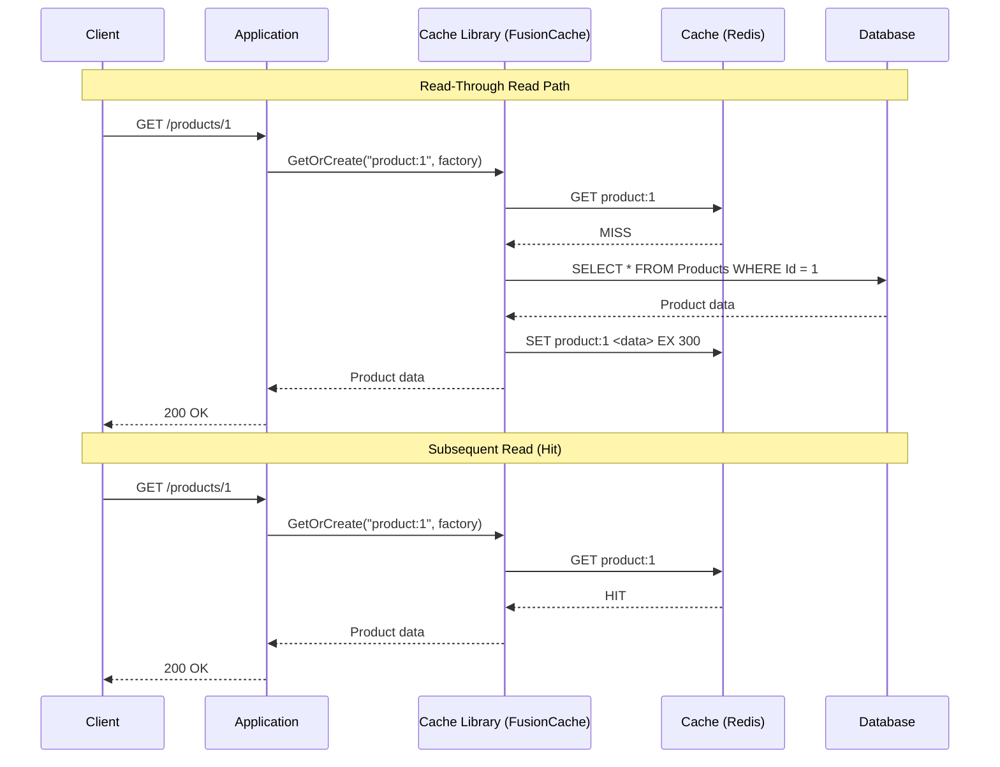
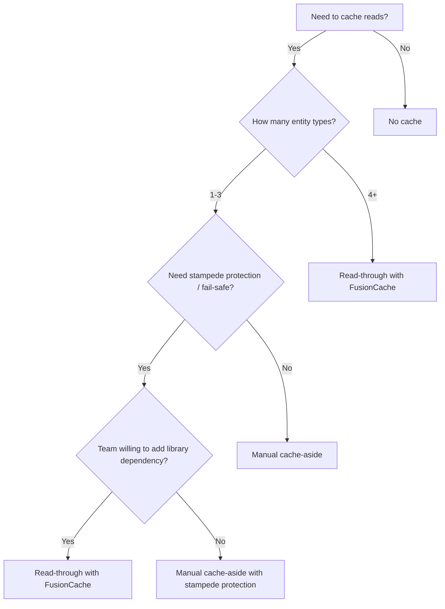

## Navigation

**Domain:** [[7 — System Design & Distributed Systems]] > **Group:** Caching
**Previous:** [[7.259 — Write-Behind Caching]] | **Next:** [[7.261 — Refresh-Ahead Caching]]

### Prerequisites

- [[7.256 — Caching — Why Cache and When]] — the foundational why/when decision; read-through is an alternative to cache-aside that shifts cache responsibility from the application to the cache library
- [[7.257 — Cache-Aside Pattern]] — the most common read path pattern; read-through automates the 'load on miss' step that cache-aside implements manually
- [[7.287 — Redis as Cache — Patterns in .NET]] — read-through is typically implemented by a cache library (FusionCache, NCache) that wraps Redis

### Where This Fits

Read-through caching is a read path strategy in which a cache library sits between the application and the database: on a cache miss, the library automatically loads the data from the database, stores it in the cache, and returns it — the application never directly queries the database. The invariant: the application only ever talks to the cache; the cache handles the database fallback transparently. What read-through trades is control over the cache population logic (the application cannot add metadata or transform data during cache population without involving the library) for abstraction (the application code is simpler and the database is hidden behind the cache layer). A .NET engineer reaches for read-through when many entity types need caching with the same pattern — the repetitive check-load-store of cache-aside becomes boilerplate — and a library like FusionCache can handle it uniformly with built-in stampede protection and fail-safe.

---

## Core Mental Model

Read-through caching is a read path strategy where a cache library intercepts every read request, checks the cache, and on a miss automatically loads the data from the database, populates the cache, and returns the result — all without the application calling the database directly. The invariant: the cache is the sole data access point for the application — the database is behind the cache, not beside it. What read-through trades is application-level control over cache population (you cannot easily inject different serialization, transformation, or auditing logic per entity type) for reduced boilerplate and built-in cross-cutting concerns (stampede protection, fail-safe mode, metrics). The recognition trigger: the cache-aside pattern (check, load, store) is repeated identically across 10+ repository methods, and you want a library to handle the repetition with production-grade stampede protection and failover.



### Classification

**Pattern category:** Read path caching strategy, data access abstraction.
**Abstraction layer:** Between application and data access — the cache library acts as a data access proxy. The application's data access code knows only the cache key; the database is abstracted away.
**Scope:** Single-service or single-data-owner scope. The cache library manages cache population for all entity types registered with it.
**When applied:** Many entity types need caching with the same pattern. The team wants stampede protection, fail-safe, and metrics built in. The application code should not contain explicit DB fallback logic.
**When not applied:** The application needs fine-grained control over cache population (e.g., transforming data before caching, auditing, conditional caching based on user role). The cache pattern varies significantly per entity type.

### Key Properties / Guarantees

|Property|Value|Condition|
|---|---|---|
|Read latency |0.1–10 ms (cache hit) / 10–100 ms (miss + DB load) |Cache warm; library overhead is minimal (< 0.5 ms)|
|Code simplicity |High — application never touches DB for reads |Cache library handles miss path uniformly|
|Stampede protection |Built-in (semaphore per key, probabilistic early expiration) |Depends on library (FusionCache: yes, NCache: yes)|
|Fail-safe mode |If DB fails, cache serves stale data with extended TTL |Library supports fail-safe (FusionCache: yes)|
|Consistency |Eventually consistent (same as cache-aside — TTL-bound) |Write path still needs eviction or write-through|
|Flexibility |Lower than cache-aside — factory function is the extension point |Cannot customize behavior per miss without modifying the factory|

---

## Deep Mechanics

### How Read-Through Works — Library Internals

Read-through is implemented by a cache library that wraps a cache store (Redis, IMemoryCache) and a data source (database). The library exposes a method like `GetOrCreateAsync(key, factory, options)` that handles the entire read path:

1. **Cache lookup.** The library checks the cache (L1 and/or L2). If the key exists, return the deserialized value.
2. **Miss — acquire stampede lock.** The library acquires a per-key lock (in-process `SemaphoreSlim` or, for distributed scenarios, a Redis lock using `SET NX EX`). This prevents N concurrent requests from all hitting the database.
3. **Double-check.** After acquiring the lock, the library checks the cache again — another thread may have populated it while waiting.
4. **Execute factory.** The library calls the application-provided factory function. The factory queries the database and returns the data.
5. **Store in cache.** The library serializes the factory result and stores it in the cache with the configured TTL (and potentially a fail-safe TTL for stale-while-revalidate).
6. **Release lock.** The per-key lock is released.
7. **Return.** The library returns the data to the caller.

**Key internal features that differentiate read-through from cache-aside:**

- **Stampede protection.** The library guarantees that only one factory call executes per key at a time. Additional callers wait on the lock and then read from cache. In cache-aside, this must be implemented manually.
- **Fail-safe.** If the factory throws (database down, timeout), the library can return the stale cached value (if available) with an extended TTL, rather than propagating the error. The stale value is better than a 503 response.
- **Soft/hard TTL.** The library supports two TTLs: a "soft" TTL after which a background refresh is triggered, and a "hard" TTL after which the entry is expired and a synchronous factory call is required. This is the basis for refresh-ahead ([[7.261 — Refresh-Ahead Caching]]).
- **Multi-tier.** The library can manage both an L1 (in-process) and L2 (Redis) cache. On a miss in L1, it checks L2; on a miss in L2, it calls the factory and populates both tiers.

### How Read-Through Differs from Cache-Aside

|Aspect|Cache-Aside|Read-Through|
|---|---|---|
|Who checks cache?|Application code|Cache library|
|Who calls DB on miss?|Application code|Cache library (via factory delegate)|
|Stampede protection|Manual (SemaphoreSlim per key)|Built-in|
|Fail-safe|Manual (try-catch, fallback to stale)|Built-in (stale-while-revalidate)|
|Code per entity|~15 lines (check, load, store, evict)|~3 lines (factory delegate)|
|Control over population|Full — application controls serialization, can transform data|Limited — factory is the only extension point|
|Write path|Separate: write DB, evict cache|Separate: same as cache-aside (write DB, evict cache key via library)|

### Write Path with Read-Through

Read-through only covers the read path. The write path is the same as cache-aside: write to the database, then evict the cache key. The cache library provides an eviction method (`RemoveAsync(key)`) or, for write-through integration, a `SetAsync(key, value)` that updates the cache and optionally writes through to the database.

```csharp
// Write path with read-through library
public async Task UpdateProductAsync(Product product, CancellationToken ct)
{
    _db.Products.Update(product);
    await _db.SaveChangesAsync(ct);
    await _cache.RemoveAsync($"product:{product.Id}", ct); // Evict — next read populates
}
```

### Failure Modes

|Failure|How It Manifests|Detection|Mitigation|
|---|---|---|---|
|Factory throws (DB down) |Library returns stale data from cache (fail-safe mode) or propagates the exception. |Logs show factory failure, but cache returns stale data. |Enable fail-safe mode: library returns the stale cached value with a short TTL while the DB recovers.|
|Stampede lock deadlock |A thread acquires the per-key lock and crashes. The lock is never released. Other threads wait indefinitely. |Per-key semaphore count > 0 for extended period. Thread pool exhaustion. |Use a timeout on the lock acquisition. If the lock is held longer than the timeout, assume the holder crashed and release. FusionCache uses `CancellationToken` with timeout on the factory.|
|Cache eviction of popular key |High-traffic key evicted under memory pressure. All requests miss and call the factory. |Cache hit rate drops. Factory execution count spikes. |Use LFU eviction policy or a dedicated Redis instance for hot keys. Enable fail-safe: if the factory is called too frequently, the library extends the TTL rather than evicting.|
|Factory returns null |The cache library may cache the null value (negative caching) or return null and not cache it. |Repeated cache misses for the same key that maps to a non-existent entity. |Configure negative caching in the library: cache null with a short TTL.|

### .NET and Azure Integration — FusionCache

FusionCache is the primary .NET library that implements read-through caching. It wraps `IDistributedCache` (Redis) and `IMemoryCache` (L1) and provides the read-through abstraction with built-in stampede protection, fail-safe, and metrics.

**Basic FusionCache Setup (Read-Through):**

```csharp
// Install: dotnet add package ZiggyCreatures.FusionCache

builder.Services.AddFusionCache()
    .WithDefaultEntryOptions(options =>
    {
        options.Duration = TimeSpan.FromMinutes(5);           // Normal TTL
        options.FailSafeMaxDuration = TimeSpan.FromHours(2);  // Max time to serve stale
        options.FailSafeThrottleDuration = TimeSpan.FromSeconds(30); // Throttle retry on fail-safe
        options.FactorySoftTimeout = TimeSpan.FromMilliseconds(100); // Timeout for factory
        options.FactoryHardTimeout = TimeSpan.FromMilliseconds(1500); // Hard timeout for factory
    })
    .WithHybridCache(
        cache => cache.AddRedisStackExchangeCache(options =>
        {
            options.Configuration = builder.Configuration.GetConnectionString("Redis");
            options.InstanceName = "FC:";
        }),
        cache => cache.AddMemoryCache()
    );
```

**Using Read-Through in a Service:**

```csharp
public class ProductService
{
    private readonly IFusionCache _cache;
    private readonly AppDbContext _db;

    public ProductService(IFusionCache cache, AppDbContext db)
    {
        _cache = cache;
        _db = db;
    }

    public async Task<Product?> GetByIdAsync(int id, CancellationToken ct)
    {
        return await _cache.GetOrCreateAsync(
            $"product:{id}",
            async (ctx, ct) =>
            {
                // This factory is called only on cache miss — the library handles:
                // - Stampede protection (only one thread calls this per key)
                // - Fail-safe (if this throws, return stale data)
                // - Multi-tier (L1 + L2)
                var product = await _db.Products.FindAsync(new object[] { id }, ct);

                // Negative caching: cache null with short TTL
                if (product is null)
                {
                    ctx.Options.Duration = TimeSpan.FromSeconds(30);
                }

                return product;
            },
            ct);
    }

    public async Task UpdateAsync(Product product, CancellationToken ct)
    {
        _db.Products.Update(product);
        await _db.SaveChangesAsync(ct);
        await _cache.RemoveAsync($"product:{product.Id}", ct);
    }
}
```

**What FusionCache gives you that cache-aside does not:**

- Fail-safe: if `_db.Products.FindAsync` throws, the library returns the stale cached value (if any) instead of throwing. The stale value is served for up to `FailSafeMaxDuration`.
- Stampede prevention: only one thread per key executes the factory. Other threads wait and then read from cache. This is the built-in `SemaphoreSlim` per key.
- Soft timeout: if the factory takes longer than `FactorySoftTimeout` (100 ms), the library logs a warning but waits for the hard timeout. If the factory exceeds the hard timeout, the library returns stale data (fail-safe) or throws.
- Metrics: hit rate, miss rate, factory duration, stampede counts — available via `FusionCacheMetrics`.

---

## Production Patterns and Implementation

### 1. Read-Through with FusionCache — Full Production Setup

The production pattern is a generic caching wrapper that uses FusionCache's read-through abstraction. The application never calls `IDistributedCache` or `IMemoryCache` directly — only FusionCache.

```csharp
public interface IReadThroughCache<T> where T : class
{
    Task<T?> GetByIdAsync(int id, CancellationToken ct);
    Task InvalidateAsync(int id, CancellationToken ct);
}

public class FusionCacheRepository<T> : IReadThroughCache<T> where T : class
{
    private readonly IFusionCache _cache;
    private readonly IServiceScopeFactory _scopeFactory;
    private readonly string _keyPrefix;
    private readonly ILogger<FusionCacheRepository<T>> _logger;

    public FusionCacheRepository(
        IFusionCache cache,
        IServiceScopeFactory scopeFactory,
        ILogger<FusionCacheRepository<T>> logger)
    {
        _cache = cache;
        _scopeFactory = scopeFactory;
        _keyPrefix = typeof(T).Name.ToLowerInvariant();
        _logger = logger;
    }

    public async Task<T?> GetByIdAsync(int id, CancellationToken ct)
    {
        var key = $"{_keyPrefix}:{id}";

        return await _cache.GetOrCreateAsync<T?>(
            key,
            async (ctx, token) =>
            {
                _logger.LogDebug("Cache miss for {Key}; loading from database", key);

                using var scope = _scopeFactory.CreateScope();
                var db = scope.ServiceProvider.GetRequiredService<AppDbContext>();

                var entity = await db.Set<T>().FindAsync(new object[] { id }, token);

                if (entity is null)
                {
                    // Negative caching — short TTL for nonexistent keys
                    ctx.Options.Duration = TimeSpan.FromSeconds(30);
                }

                return entity;
            },
            ct);
    }

    public async Task InvalidateAsync(int id, CancellationToken ct)
    {
        var key = $"{_keyPrefix}:{id}";
        await _cache.RemoveAsync(key, ct);
        _logger.LogInformation("Invalidated read-through cache key {Key}", key);
    }
}
```

### Configuration and Wiring

```csharp
// Program.cs
builder.Services.AddFusionCache()
    .WithDefaultEntryOptions(options =>
    {
        options.Duration = TimeSpan.FromMinutes(5);
        options.FailSafeMaxDuration = TimeSpan.FromHours(2);
        options.FailSafeThrottleDuration = TimeSpan.FromSeconds(30);
        options.FactorySoftTimeout = TimeSpan.FromMilliseconds(100);
        options.FactoryHardTimeout = TimeSpan.FromMilliseconds(2000);
        options.AllowTimedOutFactoryBackgroundCompletion = false;
    })
    .WithHybridCache(
        l2 => l2.AddRedisStackExchangeCache(opts =>
        {
            opts.Configuration = builder.Configuration.GetConnectionString("Redis");
            opts.InstanceName = "RT:";
        }),
        l1 => l1.AddMemoryCache()
    );

// Register the generic repository
builder.Services.AddScoped(typeof(IReadThroughCache<>), typeof(FusionCacheRepository<>));

// Usage in a controller:
public class ProductsController
{
    private readonly IReadThroughCache<Product> _cache;

    public ProductsController(IReadThroughCache<Product> cache) => _cache = cache;

    [HttpGet("{id}")]
    public async Task<IActionResult> Get(int id, CancellationToken ct)
    {
        var product = await _cache.GetByIdAsync(id, ct);
        if (product is null) return NotFound();
        return Ok(product);
    }
}
```

### 2. Read-Through with Manual IDistributedCache (No Library)

If you cannot use FusionCache (team decision, dependency constraints), you can implement read-through manually using the same factory-delegate pattern. This gives you the same application API but without the built-in stampede protection or fail-safe:

```csharp
public class ReadThroughCache<T> where T : class
{
    private readonly IDistributedCache _cache;
    private readonly ConcurrentDictionary<string, SemaphoreSlim> _locks = new();
    private readonly ILogger<ReadThroughCache<T>> _logger;

    public async Task<T?> GetOrCreateAsync(
        string key,
        Func<CancellationToken, Task<T?>> factory,
        TimeSpan ttl,
        CancellationToken ct)
    {
        // 1. Check cache (optimistic fast path)
        var cached = await _cache.GetAsync(key, ct);
        if (cached is not null)
            return JsonSerializer.Deserialize<T>(cached);

        // 2. Acquire per-key lock (stampede protection)
        var semaphore = _locks.GetOrAdd(key, _ => new SemaphoreSlim(1, 1));
        await semaphore.WaitAsync(ct);
        try
        {
            // 3. Double-check after lock
            cached = await _cache.GetAsync(key, ct);
            if (cached is not null)
                return JsonSerializer.Deserialize<T>(cached);

            // 4. Execute factory (caller queries DB)
            var result = await factory(ct);
            if (result is null)
            {
                // Negative caching
                await _cache.SetAsync(key, Array.Empty<byte>(),
                    new DistributedCacheEntryOptions
                    {
                        AbsoluteExpirationRelativeToNow = TimeSpan.FromSeconds(30)
                    }, ct);
                return null;
            }

            // 5. Store in cache
            await _cache.SetAsync(key, JsonSerializer.SerializeToUtf8Bytes(result),
                new DistributedCacheEntryOptions
                {
                    AbsoluteExpirationRelativeToNow = ttl
                }, ct);

            return result;
        }
        finally
        {
            semaphore.Release();
            if (semaphore.CurrentCount == 1)
                _locks.TryRemove(key, out _);
        }
    }
}
```

### 3. Two-Tier Read-Through (L1 + L2 Without FusionCache)

A manual two-tier implementation that mirrors what FusionCache does internally:

```csharp
public class TwoTierReadThrough<T> where T : class
{
    private readonly IMemoryCache _l1;
    private readonly IDistributedCache _l2;
    private readonly ConcurrentDictionary<string, SemaphoreSlim> _locks = new();

    public async Task<T?> GetOrCreateAsync(
        string key,
        Func<CancellationToken, Task<T?>> factory,
        TimeSpan l1Ttl,
        TimeSpan l2Ttl,
        CancellationToken ct)
    {
        // L1 hit
        if (_l1.TryGetValue(key, out T? cached)) return cached;

        // L2 hit — populate L1, return
        var l2Bytes = await _l2.GetAsync(key, ct);
        if (l2Bytes is not null && l2Bytes.Length > 0)
        {
            var value = JsonSerializer.Deserialize<T>(l2Bytes);
            _l1.Set(key, value, l1Ttl);
            return value;
        }

        // Miss — lock and populate
        var semaphore = _locks.GetOrAdd(key, _ => new SemaphoreSlim(1, 1));
        await semaphore.WaitAsync(ct);
        try
        {
            // Double-check L2
            l2Bytes = await _l2.GetAsync(key, ct);
            if (l2Bytes is not null && l2Bytes.Length > 0)
            {
                var value = JsonSerializer.Deserialize<T>(l2Bytes);
                _l1.Set(key, value, l1Ttl);
                return value;
            }

            var result = await factory(ct);
            if (result is null) return null;

            var serialized = JsonSerializer.SerializeToUtf8Bytes(result);
            _l1.Set(key, result, l1Ttl);
            await _l2.SetAsync(key, serialized,
                new DistributedCacheEntryOptions { AbsoluteExpirationRelativeToNow = l2Ttl }, ct);
            return result;
        }
        finally
        {
            semaphore.Release();
            if (semaphore.CurrentCount == 1)
                _locks.TryRemove(key, out _);
        }
    }
}
```

### Common Variants

|Variant|Description|When to Use|
|---|---|---|
|Pure read-through (cache only)|Application reads from cache; on miss, cache library loads from DB. No write-through. |Read-heavy workloads where the write path is separate (e.g., admin panel updates product, user reads).|
|Read-through + write-through|Same library handles both read-through (miss → load from DB) and write-through (write → cache updates DB). |Cache is the complete data proxy. Application only touches the cache.|
|Read-through with backplane|When cache is invalidated in one instance, the library broadcasts the invalidation to all instances via Redis pub/sub. |Cache consistency across multiple instances of the same service.|
|Read-through with fail-safe|On factory failure, return stale data. |High-availability requirement — serve stale data rather than 503.|

### Real-World .NET Ecosystem Example

- **FusionCache** — The production-grade read-through library. Used in production by .NET teams at scale. Features:
  - Read-through with `GetOrCreateAsync`
  - Multi-tier (L1 + L2) with adaptive cache
  - Stampede prevention (per-key semaphore)
  - Fail-safe (stale-while-revalidate)
  - Soft/hard timeout on factory
  - Backplane for distributed invalidation
  - Metrics via `FusionCacheMetrics`
- **NCache (Alachisoft)** — Commercial .NET distributed cache that supports read-through via `ReadThruProvider`. Configure the provider to load data from SQL Server on cache miss. More enterprise-oriented; less common in Azure-native stacks.
- **AppFabric Caching (legacy)** — Windows Server AppFabric had read-through provider support. No longer relevant for new .NET development.

---

## Gotchas and Production Pitfalls

### Gotcha 1: Factory Has Side Effects (Called Multiple Times Despite Stampede Protection)

**Pitfall:** The factory function writes to a log, sends an email, or increments a counter — expecting to be called once per cache miss. But if the stampede lock has a timeout, multiple threads may execute the factory concurrently.

```csharp
// ❌ Factory with side effect
await _cache.GetOrCreateAsync(key, async (ctx, ct) =>
{
    _logger.LogInformation("Cache miss for {Key}"); // Side effect — may fire multiple times
    await _auditService.LogAccessAsync(key);         // DANGER: multiple threads may call this
    return await _db.Products.FindAsync(new object[] { id }, ct);
}, ct);
```

**Symptom:** The audit log shows more entries than expected. The side effect fires more times than there are distinct cache misses.

**Fix:** The factory should be idempotent — no side effects beyond fetching data. If side effects are necessary, make them idempotent or handle them after the cache is populated:

```csharp
// ✅ Idempotent factory — no side effects
await _cache.GetOrCreateAsync(key, async (ctx, ct) =>
{
    return await _db.Products.FindAsync(new object[] { id }, ct);
}, ct);

// Side effect outside the factory (only runs once per application call, not per cache miss)
_logger.LogInformation("Product {Id} fetched", id);
```

**Cost of not fixing:** Duplicate audit entries, double billing, double email notifications. Hard to reproduce because it depends on timing.

### Gotcha 2: Fail-Safe Hides Real Failures

**Pitfall:** The fail-safe mode is enabled, and the database is down. The cache library returns stale data silently. The operations team is not alerted because the application still returns HTTP 200 with stale data.

**Symptom:** Users see stale product prices for hours after a database outage. The team discovers the issue from customer complaints — not from monitoring. The application health check shows "healthy" (because it returns 200) but the data is wrong.

**Fix:** When fail-safe serves stale data, log a warning with enough context to alert:

```csharp
// FusionCache logging: enable warning-level logging for fail-safe events
// Or implement a custom FusionCache middleware
builder.Services.AddFusionCache()
    .WithDefaultEntryOptions(options =>
    {
        options.FailSafeMaxDuration = TimeSpan.FromHours(2);
        options.FailSafeThrottleDuration = TimeSpan.FromSeconds(30);
    });

// Log a health metric when fail-safe is triggered
// FusionCache fires events that can be subscribed to:
var cache = builder.Services.BuildServiceProvider().GetRequiredService<IFusionCache>();
cache.Events.Miss += (sender, args) =>
{
    // Not a fail-safe hit — a real miss
};
cache.Events.FailSafeActivate += (sender, args) =>
{
    Log.Warning("Fail-safe activated for {Key}. Database may be unavailable.", args.Key);
};
```

**Cost of not fixing:** Silent data degradation. The SLO reads "99.9% availability" but the data quality is poor. The team only discovers the issue when users complain.

### Gotcha 3: Soft Timeout Causes Factory to Run on Every Request

**Pitfall:** The `FactorySoftTimeout` is set too low (e.g., 10 ms). The factory queries a database that takes 50 ms on average. Every request hits the soft timeout, logs a warning, and potentially also hits the hard timeout. The application is slower with read-through than without.

```csharp
// ❌ Soft timeout too low — factory cannot complete within time
options.FactorySoftTimeout = TimeSpan.FromMilliseconds(10); // Too low for a 50 ms DB query
```

**Symptom:** Logs show "Factory soft timeout" warnings on every cache miss. The factory completes but the thread blocked on the lock waits longer. Throughput drops.

**Fix:** Set the soft timeout based on the database P50 latency, not the P99. The soft timeout should be triggered only for outlier queries, not normal queries:

```csharp
// ✅ Soft timeout based on P50 DB latency (40 ms) + margin
options.FactorySoftTimeout = TimeSpan.FromMilliseconds(200); // Allow 4× P50
options.FactoryHardTimeout = TimeSpan.FromMilliseconds(2000); // Allow 40× P50 (outlier protection)
```

**Cost of not fixing:** Read-through adds latency on every cache miss instead of reducing it. The team disables caching because "it's slower." The real issue is the timeout configuration.

### Gotcha 4: Read-Through Library TTL Conflicts with Write-Through

**Pitfall:** The read-through library sets a 5-minute TTL. The write path uses write-through (writes to cache + DB). The write-through updates the cache with a new 5-minute TTL. But the read-through library has its own TTL tracking — if the write-through sets a new value, the read-through library may ignore it if it has a cached reference.

**Symptom:** Intermittent stale data after write-through updates. The cache has the new value (set by write-through), but the read-through library's L1 (in-process) cache still has the old value.

**Fix:** When using both read-through and write-through, ensure the library supports eviction. After a write-through update, call `_cache.RemoveAsync(key)` to invalidate the L1 cache. FusionCache's backplane can propagate this invalidation across all instances:

```csharp
// ✅ After write-through, invalidate to ensure L1 consistency
await _cache.SetAsync(key, newValue, ttl); // Write-through
await _cache.RemoveAsync(key); // Remove L1; next read repopulates from L2
```

**Cost of not fixing:** Intermittent inconsistency between instances. Debugging is difficult because the issue disappears when you check the cache directly (L2 has the correct value, L1 has the old value).

### Gotcha 5: FusionCache L1 + L2 — Stale L1 After L2 Update from Another Instance

**Pitfall:** Instance A writes to the database and invalidates the cache key in L2 (Redis). Instance B has the same key in its L1 (in-process) cache with a TTL of 30 seconds. Instance B continues to serve the stale value from L1 until the L1 TTL expires.

**Symptom:** After a write on Instance A, Instance B returns the old data for up to 30 seconds (L1 TTL). The inconsistency is visible to users whose requests are load-balanced to Instance B.

**Fix:** Use a backplane. FusionCache supports a Redis backplane: when Instance A invalidates a key, it publishes an invalidation event to Redis pub/sub. All other instances subscribe and evict the key from their L1 caches immediately:

```csharp
// ✅ Enable FusionCache backplane
builder.Services.AddFusionCache()
    .WithHybridCache(l2 => l2.AddRedisStackExchangeCache(...), l1 => l1.AddMemoryCache())
    .WithBackplane(backplane => backplane.AddRedisStackExchangeCache(options =>
    {
        options.Configuration = builder.Configuration.GetConnectionString("Redis");
    }));
```

**Cost of not fixing:** Users see inconsistent data for up to the L1 TTL (30 seconds). Product prices, feature flags, or configuration values appear different depending on which instance handles the request.

---

## Tradeoffs and Decision Framework

### Tradeoff Matrix: Read-Through vs Cache-Aside vs No Cache

|Dimension|Read-Through (FusionCache)|Cache-Aside (Manual)|No Cache|
|---|---|---|---|
|Read path code |~3 lines (factory delegate) |~15 lines per method |Direct DB query|
|Stampede protection |Built-in |Manual (SemaphoreSlim per key) |N/A|
|Fail-safe (stale on DB down)|Built-in |Manual (try-catch with stale fallback) |N/A|
|Cache tiers (L1+L2) |Built-in |Manual |N/A|
|Control over population |Limited (factory is the only extension) |Full |N/A|
|Library dependency |Yes (FusionCache package) |No |No|
|Learning curve |Low (GetOrCreateAsync is intuitive) |Low (simple pattern) |None|
|When to choose |Many entities need caching; want production features out of the box |Few entities need caching; want full control |Data changes too frequently for caching|

### When to Use Read-Through

- **Many entity types need caching.** If 10+ repository methods would follow the same cache-aside pattern, read-through with a library eliminates the repetition.
- **Stampede protection is critical.** If you serve > 100 req/s per key and cannot afford a database stampede on TTL expiry, the library's built-in protection is safer than a manual implementation.
- **Fail-safe is required.** If the service must serve data even when the database is down (degraded mode), the library's stale-while-revalidate is simpler than a manual implementation.
- **Multi-tier cache (L1 + L2).** If you need the speed of in-process cache with the capacity of distributed cache, the library handles the two-tier lookup transparently.



### When NOT to Use Read-Through

- [ ] **Few entity types need caching.** The boilerplate of cache-aside is acceptable for 1–3 entity types. A library dependency is unnecessary overhead.
- [ ] **Fine-grained control over cache population is needed.** If different entities need different serialization, transformation, or auditing during cache population, the factory delegate pattern is too restrictive.
- [ ] **The library does not support the required cache store.** FusionCache supports Redis, MemoryCache, and some third-party stores. If you use a less common cache (e.g., Memcached, Couchbase), read-through may not be available.
- [ ] **The team is not willing to add a library dependency.** FusionCache is a single package, but some teams prefer to minimize external dependencies. Manual cache-aside is fully controlled in the codebase.
- [ ] **The cached data is always small and the cache pattern is trivial.** A simple `GetOrCreate` on `IMemoryCache` is 3 lines. Adding FusionCache for this case is over-engineering.

### Scale Thresholds

- **Worth implementing (read-through library):** > 5 entity types need caching. The boilerplate savings and built-in stampede protection are worth the library dependency.
- **Stampede protection becomes necessary:** > 100 req/s per cache key. Without stampede protection, TTL expiry causes database spikes.
- **Fail-safe becomes necessary:** > 99.9% availability SLO. The database will eventually have an outage; fail-safe ensures the cache continues serving stale data.
- **L2 (Redis) becomes necessary:** > 5 application instances, or working dataset > 1 GB, or the cache must survive deployments.
- **Backplane becomes necessary:** > 2 application instances, data is updated by write path, and L1 cache consistency is required.

---

## Interview Arsenal

### Question Bank

1. **Q:** What is read-through caching and how does it differ from cache-aside? **A:** Read-through caching is a pattern where a cache library sits between the application and the database. On a cache miss, the library automatically loads the data from the database, stores it in the cache, and returns it. In cache-aside, the application manually checks the cache, queries the database on miss, and populates the cache. Read-through reduces boilerplate and adds built-in stampede protection, fail-safe, and multi-tier support — at the cost of reduced control over the cache population logic.

2. **Q:** What is the factory function in read-through, and what guarantees does the cache library provide around it? **A:** The factory is a delegate the application provides that the library calls on cache miss. The library guarantees: (1) the factory is called at most once per key concurrently (stampede protection); (2) if the factory throws and fail-safe is enabled, the library returns stale data instead of propagating the exception; (3) the factory result is serialized and stored in the cache transparently.

3. **Q:** What is fail-safe in the context of read-through caching? **A:** Fail-safe (stale-while-revalidate) means that if the database is unavailable when a cache miss occurs, the cache library returns the previous cached value (if it exists) instead of throwing an error. The stale value is served for up to a configurable maximum duration (e.g., 2 hours). This prevents a database outage from cascading into an application outage — the application serves slightly stale data rather than HTTP 503 errors.

4. **Q:** How does read-through handle a write? **A:** Read-through only covers the read path. The write path is the same as cache-aside: write to the database, then evict the cache key using the library's `RemoveAsync` method. Some libraries (FusionCache) also support write-through: after the database write, the library updates the cache explicitly.

5. **Q:** What is the problem with L1 (in-process) cache in a read-through pattern with multiple instances? **A:** When Instance A writes to the database and invalidates the cache key, Instance B's L1 cache may still have the stale value. The L1 TTL must expire before Instance B sees the new data. The solution is a backplane: the library publishes an invalidation event to Redis pub/sub, and all other instances subscribe and evict the key from their L1 cache immediately.

6. **Q:** How do you handle negative caching in read-through? **A:** The factory function returns `null` for nonexistent entities. The library should cache the null value with a short TTL (e.g., 30 seconds) to prevent repeated database queries for the same nonexistent key. In FusionCache, you set `ctx.Options.Duration` inside the factory based on whether the result is null.

7. **Q:** What metrics should you monitor for a read-through cache? **A:** (1) Hit rate — percentage of reads served from cache. (2) Factory execution count — how many misses are resulting in database calls. (3) Factory duration — how long the database query takes on miss. (4) Stampede count — how many times the per-key lock blocked additional callers. (5) Fail-safe activation count — how often stale data was served due to database failure. (6) L1 vs L2 hit ratio — in a multi-tier setup, what percentage of hits are served from in-process cache.

8. **Q:** When would you choose cache-aside over read-through? **A:** When the application needs fine-grained control over cache population — different serialization per entity type, conditional caching (cache some entities but not others based on user role), or when the library dependency is not acceptable for a small number of entity types. Cache-aside is also simpler to debug because the cache logic is explicit in the application code.

### Spoken Answers

**Q: "Explain read-through caching and when you would use FusionCache over manual cache-aside."**

> **Average answer:** "Read-through caching means the cache automatically loads data from the database on a miss. FusionCache is a library that does this for you."
>
> **Great answer:** "Read-through caching is a delegation pattern: instead of every repository method implementing the same check-load-store logic, a cache library like FusionCache handles it uniformly. The application registers a factory delegate per cache key, and the library guarantees three things: the factory runs at most once per key under concurrent load, preventing stampede; if the factory fails, the library can serve a stale cached value instead of throwing, enabling fail-safe degrade; and the library transparently manages a two-tier cache — L1 in-process memory for sub-millisecond hits, backed by L2 Redis for shared capacity. I use FusionCache when an API has 10 or more endpoints that follow the same caching pattern — product catalog, customer profiles, reference data — because the alternative is repeating the same 15 lines of cache-aside code in every repository method, and the stampede protection and fail-safe behavior are production features that a manual implementation gets wrong on the first attempt. The tradeoff is that FusionCache adds a dependency and the factory delegate is the only extension point — if I need to skip caching for admin users or transform the data during population, cache-aside gives me more flexibility."

**Q: "How does read-through handle a database outage? Walk me through the fail-safe mechanism."**

> **Average answer:** "If the database goes down, the cache returns stale data."
>
> **Great answer:** "The fail-safe mechanism works in three phases. Phase one — during normal operation: the cache stores two TTLs — a soft TTL (say 5 minutes) and a hard TTL (say 2 hours). Every entry has a creation timestamp. Phase two — on cache miss with soft expiry: if the soft TTL has passed but the hard TTL has not, the library returns the stale value immediately while triggering a background factory call to refresh the cache. The caller does not wait for the factory — they get instant stale data. Phase three — on factory failure: if the background factory throws because the database is down, the library extends the entry's soft TTL by the throttle duration (e.g., 30 seconds) and continues serving the stale value. Each subsequent request that triggers a miss extends the TTL again, so the stale value never expires as long as the database is down, up to the hard TTL (2 hours). After 2 hours, the library stops serving the stale value and starts throwing — this prevents the system from serving data that is known to be hours out of date. For monitoring, we log every fail-safe activation and alert if the fail-safe duration exceeds 5 minutes — this tells us the database has been down long enough that it is a real incident, not a transient blip."

### System Design Interview Trigger

If the interviewer asks about caching and follows up with "how do you handle a database outage?" or "what happens when 100 requests all miss the cache at the same time?" they are leading toward read-through with fail-safe and stampede protection. The answer should reference FusionCache or a similar library. The interviewer is testing: (1) do you know the difference between cache-aside and read-through? (2) do you think about failure modes beyond the happy path? (3) can you design a system that degrades gracefully under database failure? (4) do you understand multi-tier caching and the consistency challenges it introduces?

### Comparison Table

| |Read-Through (FusionCache)|Cache-Aside (Manual)|IMemoryCache.GetOrCreate|
|---|---|---|---|
|Abstraction level|Library manages cache + DB fallback|Application manages cache + DB|In-process cache only — no DB fallback|
|Stampede protection|Built-in (per-key semaphore)|Manual|Built-in (per-key, in-process only)|
|Distributed support|Yes (Redis, L1+L2)|Yes (manual)|No (in-process only)|
|Fail-safe|Yes (stale-while-revalidate)|Manual|No|
|Backplane|Yes (Redis pub/sub)|Manual|N/A|
|Write path|Same as cache-aside|Same as cache-aside|N/A|
|Learning curve|Low|Low|Lowest|

---

## Architecture Decision Record

### Title: Read-Through Caching with FusionCache for Product Catalog

**Context:** The Product Catalog API (ASP.NET Core, 10 instances behind Azure Load Balancer, Azure SQL S4) serves `GET /api/products/{id}`, `GET /api/products/search`, `GET /api/categories/{id}/products`, and `GET /api/brands/{id}` — 8 read endpoints, each needing caching. The API handles 5,000 req/s peak. Current implementation: each endpoint has manual cache-aside with `IDistributedCache`. The code has 320 lines of repetitive cache-aside boilerplate across 8 repositories. Stampede protection was added manually with `SemaphoreSlim` per key but has a bug (the semaphore is never released on factory exception — thread pool exhaustion observed in production). Fail-safe (if Redis or DB is down) is not implemented.

**Options Considered:**

1. **FusionCache (read-through).** Replace all manual cache-aside with FusionCache `GetOrCreateAsync`. Single factory delegate per endpoint. Built-in stampede protection, fail-safe, multi-tier (L1 + L2), and backplane.
2. **Fix manual cache-aside.** Fix the semaphore leak. Add fail-safe manually. Keep the 320 lines of boilerplate.
3. **Hybrid — FusionCache for complex queries, manual for simple.** Use FusionCache for search and list endpoints (complex, high stampede risk), keep manual for single-entity lookups (simple, low risk).

**Decision:** Option 1 — FusionCache (read-through) for all 8 endpoints.

**Rationale:** The semaphore leak bug demonstrates that manual stampede protection is fragile. FusionCache's built-in protection is tested at scale. Fail-safe (missing in the current implementation) is critical for the 99.9% uptime SLO — the API must serve data even when the database is briefly unavailable. The 320 lines of boilerplate are replaced by ~80 lines of registration + factory delegates. The backplane ensures L1 cache consistency across 10 instances.

**Consequences:**

- ✅ Semaphore leak eliminated — FusionCache uses `CancellationToken` + timeout for lock acquisition.
- ✅ Fail-safe added: if the database is down, the API returns stale data (up to 2 hours old) instead of HTTP 503.
- ✅ Multi-tier (L1 + L2): sub-millisecond hits for the hottest products, Redis-backed for shared capacity.
- ✅ Backplane: when a product is updated (write path), all 10 instances evict their L1 cache immediately.
- ⚠️ FusionCache dependency added. NuGet package: `ZiggyCreatures.FusionCache` + `ZiggyCreatures.FusionCache.Backplane.StackExchangeRedis`.
- ⚠️ Learning curve: the team must understand FusionCache's factory timeout, fail-safe throttle, and backplane configuration.
- ⚠️ Negative caching: must be configured explicitly per endpoint (set `ctx.Options.Duration` for null results).

**Review Trigger:** Revisit this decision if: (1) FusionCache's factory timeout configuration causes latency issues (adjust soft/hard timeouts); (2) the backplane introduces Redis pub/sub overhead that affects Redis performance (monitor Redis CPU at scale); (3) a repository needs fine-grained cache population control that the factory delegate cannot express (fall back to manual cache-aside for that specific endpoint).

---

## Self-Check

### Questions (10)

1. What is the difference between read-through and cache-aside in terms of who calls the database on a miss?
2. What three guarantees does a read-through library (FusionCache) provide around the factory function?
3. What is fail-safe mode? When would you enable it?
4. What is the backplane and why is it necessary in a multi-instance read-through setup?
5. A read-through cache has L1 (in-process) and L2 (Redis). Describe the read path step by step.
6. How does stampede protection work in FusionCache?
7. Why should the factory function be free of side effects?
8. What happens if the factory soft timeout is set to 10 ms and the database query takes 200 ms?
9. When would you choose cache-aside over read-through?
10. How does read-through handle negative caching (nonexistent entities)?

### Scenario-Based Exercises (5)

**Scenario 1 — Diagnose the problem.** After deploying FusionCache for the product catalog, the operations team notices that the database CPU runs at 80% for the first 30 minutes after deployment, then drops to 20%. This did not happen with the old cache-aside implementation.

<details>
<summary>Diagnosis</summary>

**Root cause:** L1 (in-process) cache is cold after deployment. All 10 instances have empty L1 caches. Every request misses L1, hits L2 (Redis). Redis is warm (L2 survived deployment), but the L1 → L2 lookup adds 1–3 ms. The old cache-aside was single-tier (Redis only), so there was no L1 cold-start cost.

**Evidence:** FusionCache metrics show L1 hit rate at 0% for the first 30 minutes, climbing to 60% after 30 minutes. Factory execution count (misses) is normal — the database CPU spike is from L1 cache misses, not from factory calls.

**Immediate mitigation:** This is expected behavior — L1 warms up naturally over 30 minutes. If the database CPU spike (80%) is acceptable, no action needed.

**Permanent fix:** (1) Pre-warm L1 by calling the popular endpoints after deployment (warm-up script). (2) Reduce L1 TTL so L1 reaches steady state faster (but this reduces L1 hit rate). (3) Accept the 30-minute warm-up — the old implementation had the same cold-start cost for Redis, just not visible as L1.
</details>

---

**Scenario 2 — Design decision.** The Customer Profile API needs caching. There are 3 endpoints: `GET /profiles/{id}`, `GET /profiles/{id}/addresses`, `GET /profiles/{id}/payment-methods`. Each has different cache patterns (profile caches for 5 minutes, addresses for 1 hour, payment methods should NOT be cached for security). Should you use read-through?

<details>
<summary>Decision and Reasoning</summary>

**Choice:** Hybrid — read-through for profile and addresses, manual cache-aside for payment methods.

**Reasoning:** 3 endpoints is not enough boilerplate savings to justify FusionCache alone. The deciding factor is the different cache policies: one endpoint (payment methods) must NOT be cached. FusionCache can handle this with a conditional factory, but it is cleaner to explicitly skip caching for payment methods in a simple `GetByIdAsync` without a cache library.

```csharp
// Profile — read-through (FusionCache)
public async Task<Profile> GetProfileAsync(int id, CancellationToken ct)
{
    return await _cache.GetOrCreateAsync($"profile:{id}",
        async (ctx, ct) => await _db.Profiles.FindAsync(new object[] { id }, ct), ct);
}

// Payment methods — NOT cached (security)
public async Task<List<PaymentMethod>> GetPaymentMethodsAsync(int userId, CancellationToken ct)
{
    return await _db.PaymentMethods
        .Where(p => p.UserId == userId && p.IsActive)
        .ToListAsync(ct);
}
```

**Tradeoffs accepted:** Mixing read-through and no-cache is acceptable. The small boilerplate cost for the manual (no-cache) endpoint is offset by the explicit security guarantee (no cached payment data).
</details>

---

**Scenario 3 — Failure mode.** The database has a 30-second outage. FusionCache serves stale data (fail-safe mode). After the database recovers, some API endpoints still return stale data for up to 2 hours. Investigation shows the fail-safe throttle duration is 30 seconds, but the stale data persists.

<details>
<summary>Investigation and Fix</summary>

**Root cause:** During the database outage, each request that triggered a cache miss extended the fail-safe TTL by the throttle duration (30 seconds). Over the 30-second outage, ~1,000 requests extended the TTL for different keys. After the database recovered, those keys had their fail-safe TTL extended far into the future — the background factory refresh that runs on fail-safe activation failed because the factory succeeded (DB was back up), but the fail-safe extension had already been applied.

**Evidence:** FusionCache logs show `FailSafeActivate` events for keys with extended durations. DB query logs show successful queries after the recovery, but the cache was not updated because the fail-safe extension was applied before the factory completed.

**Fix:** Reduce `FailSafeMaxDuration` from 2 hours to 5 minutes. This bounds the stale data window. For a 30-second database outage, 5 minutes of stale data is acceptable:

```csharp
options.FailSafeMaxDuration = TimeSpan.FromMinutes(5);
```

**Permanent fix:** Add a health check that disables fail-safe when the database has been healthy for > 2 consecutive minutes. This prevents fail-safe from extending indefinitely.

**Post-mortem item:** Fail-safe configuration should be tested with a chaos engineering experiment: kill the database, observe fail-safe behavior, restore the database, verify the cache returns fresh data within the expected window.
</details>

---

**Scenario 4 — Scale it.** The API handles 5,000 req/s with FusionCache (L1 + L2). Traffic is projected to grow to 50,000 req/s within 12 months. Does read-through with FusionCache scale?

<details>
<summary>Scaling Strategy</summary>

**Bottleneck this addresses:** Read throughput. At 50,000 req/s, the L1 (in-process) cache absorbs 60% of reads (sub-millisecond). L2 (Redis) handles the remaining 40% (20,000 req/s — well within a Redis C2's capacity of ~100,000 ops/sec). The database handles only the misses (factory executions).

**How it scales:** (1) Add more app instances — L1 scales with instance count. (2) Scale Redis vertically (C2 → C4) as L2 traffic grows. (3) Enable Redis cluster if a single node is insufficient (> 100,000 ops/sec).

**What it does not solve:** Write path. If traffic growth includes proportional write growth (not just reads), the database must handle the write volume. Read-through does not help with writes.

**Implementation changes:**
- L1 TTL optimization: at 50,000 req/s, a smaller L1 TTL (15 seconds vs 60) reduces stale data risk while still achieving 50%+ L1 hit rate.
- Backplane scaling: the Redis backplane handles pub/sub for invalidation events. At 50 writes/second, this is negligible. At 500 writes/second, monitor Redis CPU.
- Factory timeout tuning: reduce soft timeout as L1 absorbs more traffic — the factory should be the exception, not the rule.

**Verification:** Load test at 50,000 req/s with FusionCache metrics: L1 hit rate > 50%, L2 hit rate > 95%, factory execution rate < 2,500 req/s.
</details>

---

**Scenario 5 — Interview simulation.** The interviewer says: "Design a global configuration service for a SaaS platform. Configuration values are read on every request (1,000,000 reads/second). They are updated rarely (100 writes/day). The system runs in 3 Azure regions. How do you handle caching?"

<details>
<summary>Model Response</summary>

"This is the ideal use case for read-through with multi-tier caching and geo-replication.

**Read path:** Use FusionCache with read-through in each region. L1 (in-process cache) for sub-millisecond reads. L2 (Redis) in each region for shared regional cache. Cache key: `"config:{key}"`. TTL: 24 hours with fail-safe (if the regional Redis or the database is down, serve stale config for up to 24 hours).

**Write path:** Admin updates a config value. The write goes to the primary region's database. After the DB write, publish a `ConfigUpdated` event to Azure Service Bus (globally). Each region's config service consumes the event and evicts the cache key from the regional Redis.

**Geo-distribution:** Each region has its own Redis instance (read-through L2). The database is a single write-primary in one region, with readable secondaries in the other regions. The factory function reads from the nearest readable secondary.

**Why read-through?** The read-to-write ratio is 10 million:1. The cache must handle 1,000,000 reads/second. Manual cache-aside for every config key would require repetitive code across all services. FusionCache with L1 + L2 provides the throughput without per-service boilerplate.

**Fail-safe:** If a regional Redis fails, the library falls back to L1 only (still 500,000 reads/second). If the database is down, fail-safe returns stale config (config values change rarely, so 24-hour-old values are acceptable). If both Redis and DB fail in a region, the load balancer routes traffic to another region.

**Data loss tolerance:** Config updates that are not yet propagated to a region's cache are lost if the database fails before the Service Bus event is processed. Acceptable — the admin can re-save the config value."
</details>

---
