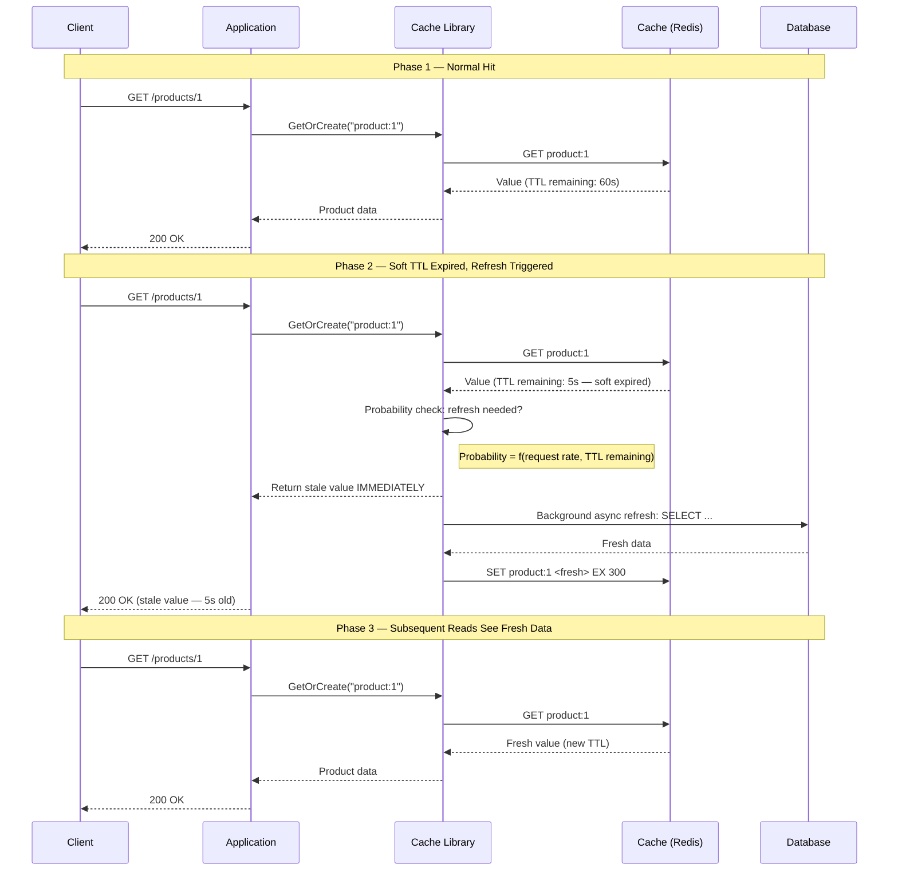
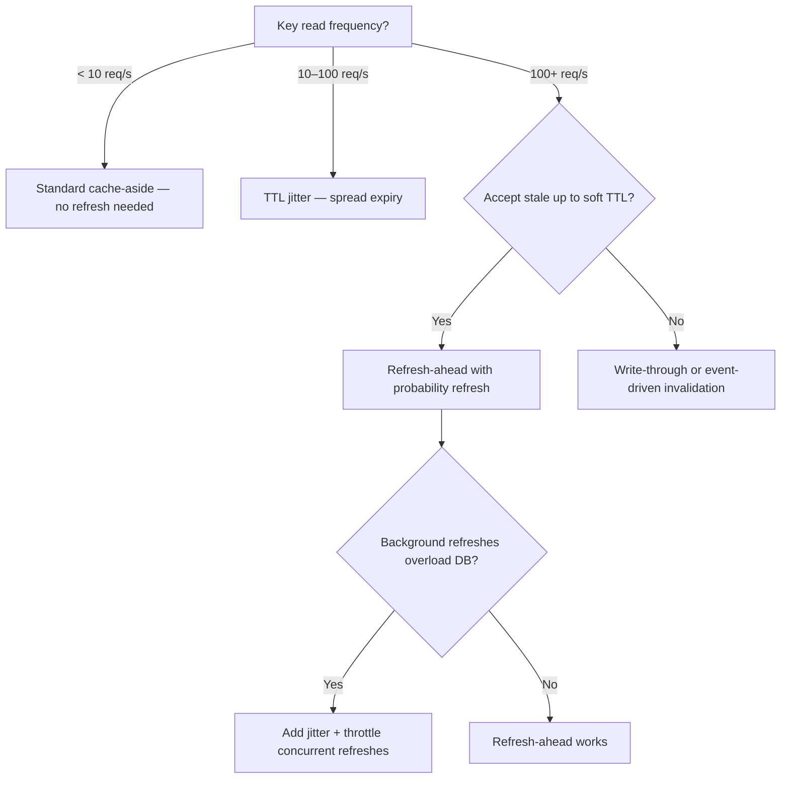

## Navigation

**Domain:** [[7 — System Design & Distributed Systems]] > **Group:** Caching
**Previous:** [[7.260 — Read-Through Caching]] | **Next:** [[7.262 — Cache TTL — Design and Selection]]

### Prerequisites

- [[7.256 — Caching — Why Cache and When]] — the foundational why/when decision; refresh-ahead is an optimization of the read path that reduces miss penalty
- [[7.260 — Read-Through Caching]] — refresh-ahead is an extension of read-through: the cache loads on miss (read-through) OR proactively refreshes before expiry (refresh-ahead)
- [[7.264 — Cache Stampede — Prevention Strategies]] — refresh-ahead is the most effective stampede prevention strategy; it eliminates the expiry entirely by refreshing before the herd can form

### Where This Fits

Refresh-ahead caching is a read path strategy where the cache proactively refreshes data before the TTL expires, so the data is always fresh when a read request arrives. The invariant: for frequently-accessed keys, the cache entry never expires — it is refreshed in the background before the soft TTL elapses, and the stale value continues to be served during the refresh. What refresh-ahead trades is background CPU and database load (the refresh runs even when no request is waiting — it pre-fetches data that may never be read again) for read-latency predictability (the cache miss penalty is eliminated for keys that are accessed frequently enough to trigger the refresh). The recognition trigger: a hot key with 1,000+ req/s and a TTL of 5 minutes — every 5 minutes there is a stampede or a single long cache miss; refresh-ahead eliminates both by keeping the cache perpetually fresh.

---

## Core Mental Model

Refresh-ahead caching is a read path strategy where the cache anticipates that a cached entry will be requested again before it expires, so it proactively reloads the data from the database in the background while still serving the current (slightly stale) value. The invariant: for keys that are accessed frequently enough to trigger the refresh, the cache is always fresh — there is no expiry event that forces a synchronous cache miss. What refresh-ahead trades is speculative database load (the refresh runs based on probability, not on actual misses — some refreshes are wasted) for elimination of cache miss latency for hot keys. The recognition trigger: a key with high read frequency (100+ req/s) and a TTL of minutes — every TTL boundary, a single request pays the full database latency (cache miss) while all others wait (stampede lock) or simultaneously hit the database (stampede).



### Classification

**Pattern category:** Read path optimization, predictive cache refresh, stampede prevention.
**Abstraction layer:** Cache library layer — typically implemented in the client library (FusionCache, AppFabric, NCache) rather than in the cache store itself.
**Scope:** Hot keys that are read frequently enough to justify speculative refresh. Not all keys — only those that exceed a read frequency threshold.
**When applied:** High-traffic keys (100+ req/s) with TTL-based expiry. The stampede or miss penalty on TTL expiry is observable and unacceptable.
**When not applied:** Keys with low read frequency (< 1 req/s) — speculative refresh wastes resources. Keys with no TTL or very long TTL (days). Data that changes frequently (the refresh runs before the data is stale).

### Key Properties / Guarantees

|Property|Value|Condition|
|---|---|---|
|Read latency |Always cache hit (0.1–10 ms) |Key is hot enough to trigger refresh|
|Stale data window |Up to soft TTL duration (e.g., 30 seconds) |Background refresh is in progress|
|Background DB load |Proportional to hot-key count × refresh interval |Each hot key refreshes once per TTL period|
|Refresh waste |Refreshes that run but the key is never read again |Depends on access pattern accuracy|
|Consistency |Eventually consistent (TTL-bound, same as cache-aside) |Background refresh may use slightly stale data|
|Implementation complexity|High — requires probability function, background task management|Library handles it (FusionCache, AppFabric)|

---

## Deep Mechanics

### How Refresh-Ahead Works

Refresh-ahead is built on two TTL values (soft and hard) and a probability function.

**Soft TTL and Hard TTL:**

- **Soft TTL** (duration): The normal cache duration. After this time, the entry is considered "soft expired" — the value can still be served to callers, but a background refresh may be triggered. Typical value: 5 minutes.
- **Hard TTL** (max duration): The absolute maximum time the entry is kept, regardless of reads. After this time, the entry is expired and a synchronous factory call is required. Typical value: 2 hours.

**Soft TTL area:** Between `now + soft TTL` and `now + hard TTL`. During this period, the cache serves the current value (which may be stale by up to `now - soft TTL`) while deciding whether to refresh.

**Three-phase read path:**

1. **Phase 1 — Hard TTL expired (synchronous miss).** The key is past the hard TTL. The library treats this as a full miss: the factory is called synchronously, the caller waits. This is the "no data at all" case.
2. **Phase 2 — Soft TTL expired but hard TTL not expired (stale hit + async refresh).** The key is in the soft-TTL area. The library returns the value immediately (stale, but available) and evaluates the probability function. If the function returns true, the library dispatches a background task to execute the factory and update the cache.
3. **Phase 3 — Soft TTL not expired (cache hit).** The key is fully fresh. Return the value immediately. No refresh logic runs.

**Probability function (XFetch / Probabilistic Early Expiration):**

The core innovation of refresh-ahead is that it does NOT refresh every key on soft TTL expiry — that would cause a stampede on the database as all keys refresh at TTL boundaries. Instead, it uses a probability function that increases as the remaining TTL approaches zero and as the request frequency increases.

```
P(refresh) = 1 - (remainingTTL / softTTL) ^ (requestRate / beta)
```

Where:
- `remainingTTL` is how much soft TTL is left (0 = just expired, softTTL = just started).
- `requestRate` is an estimate of how many requests this key receives per second.
- `beta` is a tuning parameter (typically 1.0–5.0). Higher beta = less aggressive refresh.

**Intuition:** A key with 10% of its TTL remaining and 1,000 req/s has a high refresh probability (~90%). A key with 90% TTL remaining and 1 req/s has a near-zero probability (~0.1%). The function spreads the refresh load across the soft TTL window — different requests (at different times) probabilistically trigger the refresh.

### Key Design Decisions

**Refresh granularity:** Refresh-ahead is applied per key, not per cache instance. Each key independently tracks its soft/hard TTL. The factory is the same for read-through and refresh-ahead — only the trigger timing differs.

**Background task execution:** The refresh runs in a background task (typically `Task.Run` or `Channel<T>`). It does not block the current request. The factory may use a separate database connection pool or semaphore to avoid interfering with synchronous requests. The background task respects a timeout — if the factory takes too long, the task is abandoned and the next request will trigger a new refresh.

**Consistency guarantee:** Refresh-ahead does not change the consistency model — it is still eventually consistent. The value served during the refresh window is the stale value from the previous TTL period. The fresh value is available only after the background factory completes and updates the cache.

### Failure Modes

|Failure|How It Manifests|Detection|Mitigation|
|---|---|---|---|
|Background refresh fails silently|The cache entry remains soft-expired but is never refreshed. Eventually the hard TTL expires and a synchronous miss is served. |Stale data persists for longer than the refresh interval. Logs show background refresh failures. |Log the background refresh failure. Allow the background refresh to be retried. Set a `RefreshOnHardExpiry` fallback.|
|Background refresh overwhelms database|100 hot keys all need refreshing at the same time. 100 background factories hit the database simultaneously. |DB CPU spike at the soft TTL boundary. |Add jitter to the soft TTL (randomize ±20%). Throttle background refreshes with a `SemaphoreSlim` that limits concurrent factory executions.|
|Background refresh returns stale data|The factory reads from a database replica that is lagging. The fresh value in the cache is actually older than the value it replaced. |Data "reverts" to an older version after a refresh. |Ensure the factory reads from the primary database (or a replica with zero lag). Add a `LastModified` check: if the factory returns data older than the cached data, skip the update.|
|Background refresh never completes (hangs)|The factory hangs due to a database deadlock or network issue. The background task holds a connection indefinitely. |Active database connections grow. Thread pool threads are blocked. |Set a hard timeout on the factory in the background task. Cancel the task if it exceeds the timeout. Use `CancellationToken` with `Task.Delay` as a watchdog.|

### .NET and Azure Integration — FusionCache Refresh-Ahead

FusionCache supports refresh-ahead natively via the `FailSafe` mechanism with soft/hard TTL. When fail-safe is enabled and the soft TTL expires, FusionCache returns the stale value and dispatches a background refresh.

```csharp
// FusionCache with refresh-ahead
builder.Services.AddFusionCache()
    .WithDefaultEntryOptions(options =>
    {
        // Soft TTL — normal cache duration
        options.Duration = TimeSpan.FromMinutes(5);

        // Hard TTL — data is ejected after this time regardless
        options.FailSafeMaxDuration = TimeSpan.FromHours(2);

        // Throttle duration — how long to wait before allowing another refresh attempt
        options.FailSafeThrottleDuration = TimeSpan.FromSeconds(30);

        // Enable fail-safe (required for refresh-ahead behavior)
        options.IsFailSafeEnabled = true;
    });
```

**What FusionCache does internally when `IsFailSafeEnabled = true`:**

1. On cache SET: store the value with the configured duration (5 min). Also store the creation timestamp.
2. On cache GET: if the entry exists and is within the duration, return it immediately.
3. On cache GET: if the entry exists but is past the duration (soft expired), return it immediately AND trigger a background refresh if no other background refresh is already running for that key (throttled by `FailSafeThrottleDuration`).
4. On cache GET: if the entry does not exist or is past `FailSafeMaxDuration`, call the factory synchronously.

**Manual refresh-ahead implementation (without FusionCache):**

```csharp
public class RefreshAheadCache<T> where T : class
{
    private readonly IDistributedCache _cache;
    private readonly ConcurrentDictionary<string, RefreshState> _refreshStates = new();
    private readonly SemaphoreSlim _refreshThrottle = new(5, 5); // Max 5 concurrent refreshes
    private readonly TimeSpan _softTtl = TimeSpan.FromMinutes(5);
    private readonly TimeSpan _hardTtl = TimeSpan.FromHours(2);
    private readonly TimeSpan _throttleDuration = TimeSpan.FromSeconds(30);

    public async Task<T?> GetAsync(string key, Func<CancellationToken, Task<T?>> factory, CancellationToken ct)
    {
        var cached = await _cache.GetAsync(key, ct);
        if (cached is null || cached.Length == 0)
        {
            // Hard miss — synchronous factory call
            var result = await factory(ct);
            if (result is null) return null;
            await StoreAsync(key, result, ct);
            return result;
        }

        var entry = DeserializeEntry(cached);
        var age = DateTime.UtcNow - entry.CreatedAt;

        if (age < _softTtl)
            return entry.Value; // Fresh — return immediately

        if (age >= _hardTtl)
        {
            // Hard expired — synchronous factory call
            var result = await factory(ct);
            if (result is null) return null;
            await StoreAsync(key, result, ct);
            return result;
        }

        // Soft expired — return stale value immediately, trigger background refresh
        _ = TryRefreshAsync(key, factory, ct);
        return entry.Value;
    }

    private async Task TryRefreshAsync(string key, Func<CancellationToken, Task<T?>> factory, CancellationToken ct)
    {
        var state = _refreshStates.GetOrAdd(key, _ => new RefreshState());
        if (state.LastRefresh.HasValue && DateTime.UtcNow - state.LastRefresh.Value < _throttleDuration)
            return; // Already refreshed recently — skip

        if (!await _refreshThrottle.WaitAsync(0, ct)) // Non-blocking
            return; // Too many concurrent refreshes — skip

        try
        {
            state.LastRefresh = DateTime.UtcNow;
            var result = await factory(ct);
            if (result is not null)
                await StoreAsync(key, result, ct);
        }
        catch (Exception ex)
        {
            Log.Error(ex, "Background refresh failed for {Key}", key);
        }
        finally
        {
            _refreshThrottle.Release();
        }
    }

    private async Task StoreAsync(string key, T value, CancellationToken ct)
    {
        var entry = new CacheEntry<T>(value, DateTime.UtcNow);
        await _cache.SetAsync(key, SerializeEntry(entry),
            new DistributedCacheEntryOptions { AbsoluteExpirationRelativeToNow = _hardTtl }, ct);
    }
}

internal class CacheEntry<T>
{
    public T Value { get; set; }
    public DateTime CreatedAt { get; set; }
}

internal class RefreshState
{
    public DateTime? LastRefresh { get; set; }
}
```

---

## Production Patterns and Implementation

### 1. FusionCache with Refresh-Ahead — Production Configuration

The production setup for refresh-ahead uses FusionCache's built-in fail-safe with tuned soft/hard TTLs and throttle duration.

```csharp
public static void ConfigureRefreshAhead(this IServiceCollection services, IConfiguration config)
{
    services.AddFusionCache()
        .WithDefaultEntryOptions(options =>
        {
            // Soft TTL — normal cache life
            options.Duration = TimeSpan.FromMinutes(5);

            // Hard TTL — absolute max data age
            options.FailSafeMaxDuration = TimeSpan.FromHours(2);

            // Throttle — prevent redundant refreshes within this window
            options.FailSafeThrottleDuration = TimeSpan.FromSeconds(30);

            // Enable the refresh-ahead behavior
            options.IsFailSafeEnabled = true;

            // Factory timeouts — prevent slow factories from blocking
            options.FactorySoftTimeout = TimeSpan.FromMilliseconds(200);
            options.FactoryHardTimeout = TimeSpan.FromSeconds(5);

            // Allow background completion of timed-out factories
            options.AllowTimedOutFactoryBackgroundCompletion = true;
        })
        .WithHybridCache(
            l2 => l2.AddRedisStackExchangeCache(opts =>
            {
                opts.Configuration = config.GetConnectionString("Redis");
                opts.InstanceName = "RA:";
            }),
            l1 => l1.AddMemoryCache()
        );
}
```

**Key settings for refresh-ahead:**

- `IsFailSafeEnabled = true` — enables the soft/hard TTL behavior. Without this, FusionCache behaves like standard cache-aside (expire → miss → factory).
- `FailSafeThrottleDuration = 30s` — after a background refresh is triggered, no other refresh is started for the same key for 30 seconds. This prevents redundant refreshes under high request volume.
- `AllowTimedOutFactoryBackgroundCompletion = true` — if the factory takes longer than `FactoryHardTimeout`, the stale value is returned to the caller, but the factory continues in the background and updates the cache when it completes. This ensures the NEXT request (not the current one) gets fresh data.

### 2. Hot-Key Detection and Dynamic Refresh-Ahead

Not all keys need refresh-ahead. For cold keys (1 req/hour), refresh-ahead wastes background resources. Implement a hot-key detector that dynamically enables refresh-ahead only for keys exceeding a request-rate threshold:

```csharp
public class AdaptiveRefreshAhead<T> where T : class
{
    private readonly ConcurrentDictionary<string, RequestCounter> _counters = new();
    private readonly int _hotKeyThreshold = 10; // req/s to be considered hot
    private readonly TimeSpan _window = TimeSpan.FromSeconds(10);

    public async Task<T?> GetAsync(string key, Func<CancellationToken, Task<T?>> factory, CancellationToken ct)
    {
        var counter = _counters.GetOrAdd(key, _ => new RequestCounter());
        Interlocked.Increment(ref counter.Count);

        var cached = await _cache.GetAsync(key, ct);
        if (cached is null)
            return await MissAsync(key, factory, ct);

        var age = DateTime.UtcNow - DeserializeTimestamp(cached);
        var rate = (double)counter.Count / _window.TotalSeconds;

        if (rate >= _hotKeyThreshold && age >= TimeSpan.FromMinutes(4))
        {
            // Hot key approaching soft TTL — trigger refresh-ahead
            _ = Task.Run(() => RefreshAsync(key, factory, ct));
        }

        return DeserializeValue(cached);
    }

    // Background loop to reset counters
    private async Task ResetCountersAsync(CancellationToken ct)
    {
        while (!ct.IsCancellationRequested)
        {
            await Task.Delay(_window, ct);
            foreach (var kvp in _counters)
            {
                var rate = (double)kvp.Value.Count / _window.TotalSeconds;
                if (rate < 1) _counters.TryRemove(kvp.Key, out _); // Cold — stop tracking
                else Interlocked.Exchange(ref kvp.Value.Count, 0);
            }
        }
    }
}
```

### 3. Refresh-Ahead with Write Notification (Immediate Refresh)

In some cases, the background refresh is wasteful because the data changes infrequently (e.g., configuration data). Instead of probabilistic refresh, trigger an immediate refresh when the data changes via a message:

```csharp
public class EventDrivenRefreshAhead
{
    private readonly IFusionCache _cache;

    // On a configuration update:
    public async Task UpdateConfigAsync(string key, string value, CancellationToken ct)
    {
        // 1. Write to DB
        await _db.Configurations.Upsert(new Configuration { Key = key, Value = value }).RunAsync(ct);

        // 2. Remove from cache (forces next read to call factory — the fresh value is loaded)
        await _cache.RemoveAsync($"config:{key}", ct);

        // 3. OR: proactively refresh the cache for hot keys
        // await _cache.SetAsync($"config:{key}", value, options);
    }
}
```

### Configuration and Wiring

```csharp
// Program.cs — Adaptive refresh-ahead with FusionCache
builder.Services.ConfigureRefreshAhead(builder.Configuration);

// Registration for a specific service
public class ProductRefreshAheadService
{
    private readonly IFusionCache _cache;
    private readonly AppDbContext _db;

    public ProductRefreshAheadService(IFusionCache cache, AppDbContext db)
    {
        _cache = cache;
        _db = db;
    }

    public async Task<Product?> GetByIdAsync(int id, CancellationToken ct)
    {
        return await _cache.GetOrCreateAsync(
            $"product:{id}",
            async (ctx, token) =>
            {
                // This factory runs on:
                // 1. Hard miss (key not in cache at all)
                // 2. Soft miss (key is past soft TTL, and this request triggered the refresh)
                // 3. Background refresh (triggered by refresh-ahead probability)
                return await _db.Products.FindAsync(new object[] { id }, token);
            },
            ct);
    }
}
```

### Common Variants

|Variant|Description|When to Use|
|---|---|---|
|Probabilistic refresh (XFetch)|Probability-based refresh triggered by request load. Spreads refresh uniformly across the soft TTL window. |High-traffic keys with predictable read frequency. Default for most refresh-ahead use cases.|
|Time-based refresh|Refresh all hot keys on a fixed schedule (every 30 seconds), independent of request load. |Predictable data freshness requirement (not load-based). Simpler to reason about.|
|Event-driven refresh|Refresh triggered by an external event (Service Bus message, webhook) when the data changes. |Data changes infrequently but must be propagated quickly. Avoids wasteful background refreshes.|
|No-refresh for cold keys|Only enable refresh-ahead for keys exceeding a read-frequency threshold. |Mixed workloads with both hot and cold keys. Saves background resources.|

### Real-World .NET Ecosystem Example

- **FusionCache** — The most prominent .NET implementation of refresh-ahead. The `FailSafe` mechanism with `Duration`, `FailSafeMaxDuration`, and `FailSafeThrottleDuration` implements the soft/hard TTL pattern. FusionCache also supports adaptive caching (when the factory takes longer than expected, it automatically extends the cache duration to reduce load on the database).
- **AppFabric Caching (legacy)** — Windows Server AppFabric had a "cache notifications" feature that could trigger refresh-ahead via SQL Server query notifications (`SqlCacheDependency`). When data changed in SQL, the cache invalidated and the next read triggered a factory call. Less relevant for modern .NET.

---

## Gotchas and Production Pitfalls

### Gotcha 1: Refresh-Ahead Confused with Write-Through

**Pitfall:** The team enables FusionCache fail-safe and assumes the cache is now always fresh — that write-through is unnecessary. But refresh-ahead only ensures the cache is refreshed on the read path. If a write updates the database, the cache still has the old value until the soft TTL triggers a refresh.

```csharp
// ❌ Writer updates DB but does not invalidate cache
public async Task UpdatePrice(int productId, decimal price)
{
    await _db.Products.Where(p => p.Id == productId)
        .ExecuteUpdateAsync(s => s.SetProperty(p => p.Price, price));
    // No cache invalidation — refresh-ahead will pick up the change only after soft TTL
}
```

**Symptom:** Updates take up to 5 minutes (soft TTL) to appear in the cache. Users see old prices even though the database was updated immediately.

**Fix:** Refresh-ahead does not replace write-path invalidation. After every write, evict or update the cache key:

```csharp
// ✅ Writer invalidates cache — refresh-ahead handles the subsequent read
public async Task UpdatePrice(int productId, decimal price)
{
    await _db.Products.Where(p => p.Id == productId)
        .ExecuteUpdateAsync(s => s.SetProperty(p => p.Price, price));
    await _cache.RemoveAsync($"product:{productId}");
}
```

**Cost of not fixing:** Stale data for up to the soft TTL duration. Users complain about "delayed updates." The team blames refresh-ahead when the issue is a missing eviction.

### Gotcha 2: Background Refresh Thundering Herd

**Pitfall:** 1,000 hot keys all have the same soft TTL (5 minutes). At the 5-minute mark, all 1,000 background refreshes fire simultaneously. The database receives 1,000 factory queries at the same time — a stampede.

**Symptom:** Every 5 minutes, the database CPU spikes from the batch refresh. The spike lasts until all 1,000 factories complete.

**Fix:** Add jitter to the soft TTL. Each key's soft TTL should be randomized ±20% so refreshes are spread across the window:

```csharp
// ✅ Add TTL jitter to spread refresh load
var jitter = TimeSpan.FromSeconds(Random.Shared.Next(-60, 60));
options.Duration = TimeSpan.FromMinutes(5) + jitter;
```

**Cost of not fixing:** Predictable database CPU spike every N minutes. The database auto-scale kicks in unnecessarily. The operations team wastes time investigating a "database performance issue" that is actually a refresh-ahead configuration problem.

### Gotcha 3: Stale Read After Factory Timeout

**Pitfall:** The factory has a hard timeout of 2 seconds. The database is under load and the factory takes 3 seconds. The factory times out. The background refresh fails. The stale value remains in the cache until the next refresh attempt (throttled to 30 seconds later). The stale value is now up to 5 minutes + 30 seconds old.

**Symptom:** Stale data persists longer than the configured soft TTL. The stale data accumulates with each failed refresh.

**Fix:** Allow timed-out factories to complete in the background (`AllowTimedOutFactoryBackgroundCompletion = true`). The factory continues executing after the timeout and updates the cache when it completes. The next request sees the fresh data:

```csharp
// ✅ Allow background completion
options.FactoryHardTimeout = TimeSpan.FromSeconds(2);
options.AllowTimedOutFactoryBackgroundCompletion = true; // Factory continues in background
```

**Cost of not fixing:** Accumulated staleness on hot keys. Each failed refresh extends the stale data age. Users see increasingly outdated data.

### Gotcha 4: Refresh-Ahead on Cache-Only Data (No Database)

**Pitfall:** The application uses the cache as a pure write-behind buffer (data is written to the cache and flushed asynchronously to the database). Refresh-ahead is enabled for this data. When the soft TTL expires, the background refresh reads from the database — but the database has old data because the flush worker hasn't flushed yet. The refresh overwrites the cache with stale database data.

**Symptom:** Data "reverts" to an older version after a refresh-ahead cycle. The cache has the current value, the database has a lagged value, and the refresh replaces the cache with the database's lagged value.

**Fix:** Do not use refresh-ahead for write-behind-managed data. The source of truth for such data is the cache, not the database. Alternatively, disable the background refresh for these keys: either use a long soft TTL (hours) or skip fail-safe entirely:

```csharp
// ✅ For write-behind data, use a long soft TTL so background refresh never triggers
options.Duration = TimeSpan.FromHours(24);
options.IsFailSafeEnabled = false; // No background refresh
```

**Cost of not fixing:** Silent data corruption — the cache's data is replaced by older database data. The bug is hard to detect because the data appears correct (it was correct in the database at some point) but is not the latest.

### Gotcha 5: Refresh-Ahead Memory Waste for Cold Keys

**Pitfall:** Refresh-ahead is enabled globally for all keys. There are 1 million keys, but only 100 are accessed more than once per minute. The background refresh system tracks all 1 million keys — checking their soft TTL, maintaining counters, and attempting refreshes. Memory and CPU are wasted on cold keys.

**Symptom:** Background CPU is elevated for no observable benefit. The `_refreshStates` dictionary has 1 million entries. Memory usage is higher than expected.

**Fix:** Only track keys that exceed a read-frequency threshold. Use an LRU or probabilistic counter to identify hot keys. Cold keys fall back to standard cache-aside behavior:

```csharp
// ✅ Only track keys with > 10 req/min
if (keyAccessCount.Get(key) > 10)
{
    _ = TryRefreshAsync(key, factory, ct); // Refresh-ahead for hot keys
}
// else: serve stale value without background refresh
```

**Cost of not fixing:** Wasted CPU and memory on cold keys. The cost is proportional to the total key count, not the hot key count. At 1M+ keys, this becomes a production issue.

---

## Tradeoffs and Decision Framework

### Tradeoff Matrix: Refresh-Ahead vs TTL Jitter vs Cache-Aside

|Dimension|Refresh-Ahead|TTL Jitter|Plain Cache-Aside|
|---|---|---|---|
|Miss penalty elimination |Yes — background refresh before expiry |No — still expires, but spread over time|No — synchronous miss on every expiry|
|Stampede prevention |Best — eliminates expiry entirely |Good — spreads expiry, but miss still happens |Poor — stampede on TTL expiry|
|Background DB load |Proportional to hot-key count |None |None|
|Implementation complexity|High (probability function, background tasks) |Low (randomize TTL) |Low|
|Freshness guarantee |Stale window = soft TTL |Exactly TTL (no stale extension) |Exactly TTL|
|Best for |Very hot keys (1,000+ req/s) |Moderate traffic (10–1,000 req/s) |Low traffic (< 10 req/s)|

### When to Use Refresh-Ahead

- **Hot keys with 100+ req/s.** The stampede or miss penalty is observable and the cost of background refresh is justified.
- **Predictable access patterns.** The same keys are read repeatedly at a steady rate. Probabilistic refresh works well because past request rate predicts future request rate.
- **Stale data is acceptable for the refresh window.** The soft TTL (e.g., 5 minutes) is the staleness window. If the business requires fresher data, use write-through or event-driven invalidation.
- **The cache library supports it.** FusionCache's fail-safe mechanism provides refresh-ahead with minimal configuration. Manual implementation is error-prone.



### When NOT to Use Refresh-Ahead

- [ ] **Low read frequency (< 1 req/s per key).** The probability function rarely triggers a refresh, so the overhead outweighs the benefit. Use cache-aside.
- [ ] **The cache is write-behind.** The cache is the source of truth; reading from the database for refresh would overwrite the cache with stale data.
- [ ] **Read-after-write consistency is required within seconds.** Refresh-ahead has a staleness window of the soft TTL. Use write-through or event-driven invalidation.
- [ ] **The database is the bottleneck.** Refresh-ahead adds speculative database load. If the database is already at 80%+ capacity, background refreshes will worsen the problem. Fix the database bottleneck first.
- [ ] **Unpredictable access patterns.** If keys are accessed in bursty, unpredictable patterns (one key gets 10,000 req in one minute, then zero for an hour), the probability function wastes refreshes during quiet periods and fails to refresh during bursts.

### Scale Thresholds

- **Worth implementing:** > 100 req/s per key. The cost of background refresh (1 extra DB query per TTL period per hot key) is negligible compared to the stampede damage.
- **Required:** > 1,000 req/s per key. Without refresh-ahead, TTL expiry causes a predictable database spike of 1,000+ concurrent queries. This saturates most databases.
- **Refresh throttle recommended:** > 10 hot keys. Concurrent background refreshes should be throttled to N (e.g., 5) to avoid overloading the database.
- **Probability refresh replaces locking:** > 10,000 req/s per key. At this scale, the per-key semaphore in standard stampede protection becomes a bottleneck (all threads wait for the one thread to complete the factory). Probabilistic refresh avoids the lock entirely — most threads get an immediate stale hit, and only one background thread executes the factory.

---

## Architecture Decision Record

### Title: Refresh-Ahead Caching for Product Detail Page (Hot Key)

**Context:** The Product Catalog API serves `GET /api/products/{id}` at 5,000 req/s peak. The top 50 products account for 60% of traffic. The top product (`id: 42`) receives 500 req/s. Current implementation: FusionCache with read-through and 5-minute TTL. Every 5 minutes, product 42's cache key expires, and the stampede protection (per-key semaphore) allows only one request through to the database. That one request pays a 50 ms factory latency. The 499 concurrent requests wait on the semaphore — average wait time 250 ms (99th percentile: 1,200 ms). The database CPU spikes by 5% at each TTL boundary. The product team reports "slow product page" every 5 minutes.

**Options Considered:**

1. **Enable refresh-ahead (FusionCache fail-safe).** Enable `IsFailSafeEnabled = true` with a 5-minute soft TTL, 2-hour hard TTL, and 30-second throttle. The cache is proactively refreshed before expiry. Miss penalty eliminated for hot keys.
2. **Increase TTL to 1 hour.** Reduce expiry frequency from every 5 minutes to every 60 minutes. The stampede still happens, but once per hour instead of 12 times per hour.
3. **Keep read-through with semaphore.** Current implementation. Accept the P99 latency spike of 1,200 ms every 5 minutes.
4. **Write-through + no TTL.** Write directly to Redis on product update (admins update products ~50 times/day). No TTL needed. Read is always from cache. Cache is always fresh.

**Decision:** Option 1 — Enable refresh-ahead (FusionCache fail-safe).

**Rationale:** Refresh-ahead eliminates the latency spike entirely for the top 50 products. The background refresh fires at most once per 5 minutes per product (when the soft TTL expires and a request triggers the refresh). The database load increase is negligible: 50 products × 1 refresh/5 min = 10 refreshes/minute, each taking 50 ms = 0.5 seconds of database time per minute. The P99 latency drops from 1,200 ms to < 10 ms (always a cache hit, never a miss). Option 4 (no TTL) would require tracking which products were updated (50/day) and evicting only those keys — feasible but adds write-path complexity for no meaningful gain over refresh-ahead.

**Consequences:**

- ✅ P99 read latency for top 50 products drops from 1,200 ms to < 10 ms. No more periodic "slow product page" complaints.
- ✅ Database CPU: 10 extra refreshes/minute, each 50 ms. Total: 0.5 seconds/minute — negligible.
- ⚠️ Stale data window: up to 5 minutes (soft TTL). Acceptable because product data changes infrequently (50 updates/day). If a product is updated by an admin, the cache eviction on the write path invalidates the key immediately — the background refresh will pick up the new value.
- ⚠️ Background refresh throttle: 30 seconds between refreshes for the same key. If a key's soft TTL expires and the background refresh fails (DB timeout), the next refresh attempt is 30 seconds later. During that 30 seconds, the stale value is served. Acceptable.

**Review Trigger:** Revisit this decision if: (1) the number of hot products grows to > 1,000 and the background refresh load causes database contention (increase throttle or switch to event-driven refresh); (2) the business requires sub-second write-to-read consistency for product data (switch to write-through + cache eviction); (3) the top-50 hot products change rapidly (need adaptive hot-key detection with a sliding window).

---

## Self-Check

### Questions (10)

1. What problem does refresh-ahead solve that standard read-through does not?
2. Explain the difference between soft TTL and hard TTL.
3. How does probabilistic early expiration (XFetch) decide whether to refresh a cache entry?
4. What is the stale data window in refresh-ahead? What determines its duration?
5. Does refresh-ahead eliminate the need for write-path cache invalidation? Why or why not?
6. What happens if the background refresh fails (database timeout)?
7. How do you prevent the background refresh itself from overloading the database?
8. When would you choose TTL jitter over refresh-ahead?
9. How does FusionCache implement refresh-ahead? What configuration settings are required?
10. Why is refresh-ahead unsuitable for write-behind-managed cache data?

### Scenario-Based Exercises (5)

**Scenario 1 — Diagnose the problem.** The team enables FusionCache refresh-ahead with a 5-minute soft TTL and a 2-hour hard TTL. After deployment, they notice that the most popular product (id: 42) has a P99 latency of 3 seconds during the first request after deployment, and then stays at 2 ms. After 5 minutes, the P99 spikes to 300 ms for 30 seconds, then returns to 2 ms. This pattern continues every 5 minutes.

<details>
<summary>Diagnosis</summary>

**Root cause:** The first request after deployment is a cold start — no cache entry exists, so it requires a synchronous factory call (3 seconds = cache miss + 50 ms DB query + L1 + L2 population). After that, the entry is cached. At the 5-minute soft TTL expiry, a background refresh is triggered. The P99 spike (300 ms) is caused by the `FailSafeThrottleDuration` (30 seconds) — the stale value is served while the background refresh runs. But 300 ms is too high for a cache hit; the issue is that the L1 cache (in-process) is not being used — the read is hitting L2 (Redis) because L1 is empty on some instances.

**Evidence:** FusionCache metrics show L1 hit rate at 0% for the first 5 minutes, then climbing. The 300 ms latency is the L2 (Redis) round-trip time from instances where L1 is cold.

**Fix:** Pre-warm the L1 cache after deployment. Run a warm-up script that loads the top 100 products:

```csharp
public async Task WarmUpAsync(CancellationToken ct)
{
    var topProductIds = await _db.Products.OrderByDescending(p => p.ViewCount)
        .Take(100).Select(p => p.Id).ToListAsync(ct);
    await Parallel.ForEachAsync(topProductIds, ct, async (id, token) =>
    {
        await _cache.GetOrCreateAsync($"product:{id}", ...);
    });
}
```

**Permanent fix:** The periodic P99 spike (every 5 minutes) is the background refresh. 300 ms is high because of L2 round-trip + factory. Acceptable for a background refresh. If it must be lower, add an L1 cache with a longer TTL (30 minutes) to absorb the refresh.
</details>

---

**Scenario 2 — Design decision.** A social media feed serves 100,000 req/s. Each feed is personalized (user-specific). Should you use refresh-ahead for feed entries?

<details>
<summary>Decision and Reasoning</summary>

**Choice:** No — refresh-ahead is not the right tool for personalized feeds.

**Reasoning:** Feed entries are user-specific: `"feed:{userId}"`. There are 1 million+ users, each with a unique key. No single key receives more than ~1 req/s (each user loads their own feed). Refresh-ahead is designed for hot keys with 100+ req/s — it would waste resources by tracking and probabilistically refreshing 1 million keys that are each read infrequently.

**Alternative:** Use cache-aside with a short TTL (30 seconds) for each user's feed. The miss penalty (up to 200 ms to generate the feed) is paid by the user who loads their feed, not by others. No stampede risk because each key is unique to a user (only one request per key at a time).

**Scalability:** 100,000 req/s across 1 million keys = ~0.1 req/s per key on average. Cache-aside with Redis handles this trivially (100,000 ops/s on a C2 instance).
</details>

---

**Scenario 3 — Failure mode.** After enabling refresh-ahead, the database DTU increases from 20% to 40%. Investigation shows the background refreshes are running 2× more frequently than expected. 1,000 hot keys × 5-minute soft TTL = 200 refreshes/minute expected. The actual rate is 400 refreshes/minute.

<details>
<summary>Investigation and Fix</summary>

**Root cause:** The `FailSafeThrottleDuration` is set to 5 seconds instead of 30 seconds. Multiple requests within the 5-second throttle window each trigger a background refresh because the throttle duration is too short — request A triggers refresh at T=0, request B arrives at T=4s and triggers another refresh (throttle expired). Expected: 1 refresh per 30 seconds. Actual: 1 refresh per 5 seconds = 6× the rate.

**Evidence:** FusionCache logs show `BackgroundRefreshStarted` for the same key at 4-second intervals. Throttle configuration: `FailSafeThrottleDuration = 5s`.

**Fix:** Increase throttle duration to 30 seconds:

```csharp
options.FailSafeThrottleDuration = TimeSpan.FromSeconds(30);
```

**Permanent fix:** Monitor the `BackgoundRefreshStarted` event count across all keys. Alert if it exceeds the expected rate (1 / FailSafeThrottleDuration × number of hot keys).

**Post-mortem item:** The throttle duration was set too low during initial configuration. Add a configuration review checklist for refresh-ahead settings.
</details>

---

**Scenario 4 — Scale it.** The e-commerce platform has grown from 5,000 req/s to 50,000 req/s. Refresh-ahead is enabled for the top 50 products. Now there are 500 hot products (each 100+ req/s). The background refresh system is running 500 × (1/5 min) = 100 refreshes/minute. The database handles them fine. But the `_refreshStates` dictionary has grown to 500 entries. The background refresh throttle (`SemaphoreSlim(5,5)`) is sometimes fully utilized, causing delays in refreshes for critical products.

<details>
<summary>Scaling Strategy</summary>

**Bottleneck this addresses:** The single-throttle semaphore (5 concurrent refreshes) is the bottleneck. With 500 hot keys, a refresh burst occurs when many keys' soft TTLs cluster. The throttle limits to 5 concurrent refreshes; the remaining 495 wait. Some keys may wait 30+ seconds for their refresh to start.

**How to scale:** (1) Increase the semaphore limit to 20 concurrent refreshes (monitor database impact). (2) Add TTL jitter (±30 seconds) to the soft TTL so refreshes are naturally spread. (3) Prioritize refreshes by request rate: the hottest keys refresh first; warm keys refresh when capacity is available.

```csharp
// Prioritized refresh queue
public class PrioritizedRefreshQueue
{
    private readonly PriorityQueue<string, long> _queue = new();
    private readonly SemaphoreSlim _throttle = new(20, 20);

    public void Enqueue(string key, long requestRate)
    {
        _queue.Enqueue(key, -requestRate); // Negative for max-heap behavior
        _ = ProcessQueueAsync();
    }

    private async Task ProcessQueueAsync()
    {
        await _throttle.WaitAsync();
        try
        {
            if (_queue.TryDequeue(out var key, out _))
                await RefreshKeyAsync(key);
        }
        finally
        {
            _throttle.Release();
        }
    }
}
```

**Limitation:** At 500+ hot keys, consider moving to event-driven refresh (invalidate on write via Service Bus) instead of probabilistic refresh. This eliminates the background load entirely — the cache is only refreshed when data actually changes.
</details>

---

**Scenario 5 — Interview simulation.** The interviewer says: "Design a leaderboard for a global gaming platform. Scores change every second. The leaderboard must be updated in real-time. How do you handle caching?"

<details>
<summary>Model Response</summary>

"This is a write-dominated workload — every game completion updates a score. Refresh-ahead on the read path is not appropriate because the data changes too frequently. Instead, I would use Redis Sorted Sets as both the cache and the source of truth.

**Write path:** `ZADD leaderboard:{gameId} {playerId} {newScore}` — atomic score update in Redis. This is 1–5 ms. No database write on every score update. A background flush worker persists the top 10,000 scores to the database every 60 seconds for durability (write-behind).

**Read path:** `ZREVRANGE leaderboard:{gameId} 0 99 WITHSCORES` — read the top 100 from Redis directly. This always returns the latest scores because the write path updates Redis immediately. No cache-aside, no read-through, no refresh-ahead — Redis IS the cache.

**Why not refresh-ahead?** Refresh-ahead refreshes from the database before TTL expiry. In this system, the database does NOT have the latest scores (the database is updated asynchronously every 60 seconds). Refreshing from the database would return stale data. The latest data is in Redis (the score was written there 1 ms ago).

**Leaderboard-specific optimization:** To reduce write load on Redis for the top players (who update scores frequently), batch score updates: buffer score updates in a local in-memory queue and flush to Redis every 1 second. This reduces Redis write load from 100,000 ops/s to 1,000 ops/s at the cost of 1 second of staleness.

**If the interviewer asks about cache stampede:** The leaderboard read path has no stampede because Redis Sorted Sets are always fresh. The write path has no TTL expiry because there is no TTL. Refresh-ahead is not needed."
</details>

---
