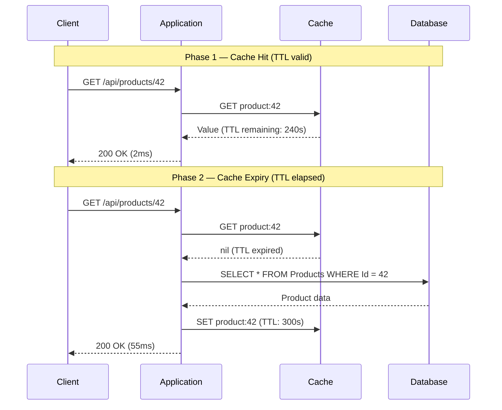

---
id: "7.262"
title: "Cache TTL — Design and Selection"
domain: "System Design & Distributed Systems"
domain_id: 7
group: "Caching"
tags: [system-design, distributed-systems, caching, dotnet, azure, ttl, time-to-live, cache-expiry, stale-data, cache-hit-ratio, bounded-staleness]
priority: 1
prerequisites:
  - "[[7.256 — Caching — Why Cache and When]] — the foundational why/when decision; TTL is the mechanism that bounds staleness and drives cache hit ratio"
  - "[[7.260 — Read-Through Caching]] — the read path pattern that relies on TTL to determine when to refresh from the database"
  - "[[7.261 — Refresh-Ahead Caching]] — uses soft/hard TTL as the core mechanism; without TTL, refresh-ahead cannot function"
related:
  - "[[7.263 — TTL Jitter — Preventing Thundering Herd]] — extends TTL with randomization to prevent expiry clustering"
  - "[[7.264 — Cache Stampede — Prevention Strategies]] — TTL expiry is the root cause of stampedes; choosing a shorter TTL increases stampede frequency"
  - "[[7.269 — Cache Invalidation — Time-Based Expiry]] — time-based invalidation via TTL is the simplest invalidation strategy"
  - "[[7.267 — Cache Invalidation — The Hard Problem]] — TTL is one of three invalidation mechanisms; understanding its limits is essential"
  - "[[7.257 — Cache-Aside Pattern]] — the pattern that uses TTL most directly: when TTL expires, the next read triggers a miss and reload"
  - "[[7.258 — Write-Through Caching]] — no TTL needed because the cache is always kept in sync with the database on writes"
  - "[[7.287 — Redis as Cache — Patterns in .NET]] — Redis uses TTL as its primary invalidation mechanism via EXPIRE"
  - "[[7.275 — Distributed Cache vs In-Process Cache]] — TTL strategy differs for L1 vs L2 caches (shorter L1 TTL, longer L2 TTL)"
  - "[[7.278 — Cache Sizing and Capacity Planning]] — TTL directly determines cache occupancy and sizing"
  - "[[6.010 — Proxy Pattern]] — cache with TTL is a proxy that returns a cached response within the TTL window and delegates on miss"
created: 2026-06-17
---

## Navigation

**Domain:** [[7 — System Design & Distributed Systems]] > **Group:** Caching
**Previous:** [[7.261 — Refresh-Ahead Caching]] | **Next:** [[7.263 — TTL Jitter — Preventing Thundering Herd]]

### Prerequisites

- [[7.256 — Caching — Why Cache and When]] — the foundational why/when decision; TTL is the mechanism that bounds staleness and drives cache hit ratio
- [[7.260 — Read-Through Caching]] — the read path pattern that relies on TTL to determine when to refresh from the database
- [[7.261 — Refresh-Ahead Caching]] — uses soft/hard TTL as the core mechanism; without TTL, refresh-ahead cannot function

### Where This Fits

TTL (Time-To-Live) is the expiry time assigned to a cache entry — the duration after which the entry is considered stale and must be reloaded from the origin. The architectural problem TTL solves is bounded staleness: it provides a time-based guarantee that the cached data is no older than the TTL value. Without TTL, cached data accumulates indefinitely and the cache becomes a source of truth that diverges from the database. TTL selection is the most consequential caching decision a system architect makes — too short, and the database pays the cost of constant reloads; too long, and users see stale data. At 10,000+ req/s, a 10-second TTL reduction on a hot key can increase database load by 500+ req/s. A .NET engineer encounters TTL decisions in every caching library: `IMemoryCache`, `IDistributedCache`, FusionCache, Azure Redis Cache.

---

## Core Mental Model

TTL is the primary mechanism that bounds cache entry staleness. The invariant: a cache entry returned with TTL remaining is guaranteed to be at most `TTL` old at the time of the read. A cache entry returned past its TTL is absent — the cache treats it as a miss, and the application must reload from the origin. What TTL trades is data freshness (shorter TTL = fresher data, lower hit rate) for database load (longer TTL = higher hit rate, staler data, fewer writes to the cache). The recognition trigger in a production system: the database CPU chart shows a sawtooth pattern — high load when caches across all nodes expire simultaneously, followed by quiet periods as the cache repopulates — which is a direct symptom of an aligned TTL.



### Classification

**Pattern category:** Cache invalidation mechanism, consistency bounding strategy.
**Abstraction layer:** Cache entry metadata — TTL is stored alongside the value in the cache store (Redis, in-memory dictionary). The cache library evaluates TTL on every read.
**Scope:** Every cache entry has a TTL (explicit or default). TTL design is required for every caching strategy except write-through (where the cache stays in sync with the database on every write).
**When designed:** At cache implementation time. TTL values are configured per cache key prefix, per data type, or per entry.
**When not designed:** Only in write-through caches where the cache is synchronously updated on every write and TTL is effectively infinite.

### Key Properties / Guarantees

|Property|Value|Condition|
|---|---|---|
|Bounded staleness |Data is at most `TTL` old |TTL is measured from the time the entry was last refreshed|
|Cache hit ratio |Increases with TTL duration |Given constant access frequency and no eviction pressure|
|Database load |Inversely proportional to TTL |All other factors equal (access rate, key count)|
|Staleness window |Fixed at TTL selection time |No early invalidation mechanism exists|
|Consistency |Eventually consistent within TTL bounds |No write-path invalidation is combined|
|Recovery time after failure |Equal to TTL |After a cache node restart, hit ratio climbs as entries are repopulated|

---

## Deep Mechanics

### How TTL Works

TTL is stored as metadata alongside the cached value. On each read, the cache library checks whether the entry's creation time + TTL is in the past. If yes, the entry is treated as a miss — the value is removed or tombstoned.

**Absolute TTL vs Sliding TTL:**

- **Absolute TTL:** Expires at a fixed time after the entry was created. A 5-minute absolute TTL set at 12:00 expires at 12:05 regardless of how many times the entry is read. Use case: data with a known refresh cycle (e.g., exchange rates updated every 15 minutes).
- **Sliding TTL:** Expires after a period of inactivity. A 5-minute sliding TTL read at 12:00, 12:02, and 12:04 extends the expiry to 12:09 (last read + 5 min). Use case: session data — keep the session alive as long as the user is active.

**TTL is checked on read, not proactively.** The cache does not run a background timer for each entry. On Redis, the `EXPIRE` command sets a TTL, and Redis evicts the key lazily (on access) and periodically (every 100ms, it samples keys with TTL and evicts expired ones). In `IMemoryCache`, the `CancellationTokenSource` for each entry fires when the TTL elapses.

**TTL is not eviction.** TTL is a guarantee of bounded staleness. Eviction is a space-management mechanism that removes entries when memory is full. An entry past TTL is removed because it is stale. An entry within TTL may be evicted because the cache is full. The two interact: with a very long TTL, eviction pressure increases because entries live longer.

**TTL interaction with cache-aside:**

```
READ product:42
  -> EXISTS in cache?
     YES -> CHECK TTL
              -> WITHIN TTL? Return value (hit)
              -> PAST TTL?  Remove entry, load from DB, store with new TTL (miss)
     NO  -> Load from DB, store with TTL (miss)

WRITE product:42
  -> Option A: Remove cache key (next read loads fresh data with new TTL)
  -> Option B: Update cache key (resets TTL)
  -> Option C: Do nothing (cache serves stale data until TTL expires)
```

### Factors That Drive TTL Selection

|Factor|Shorter TTL|Longer TTL|
|---|---|---|
|Data volatility |Data changes every second (stock prices) |Data changes weekly (product catalog)|
|Consistency SLO |Read-after-write consistency required within 1 second |Eventual consistency acceptable within 1 hour|
|Read/write ratio |1:1 (every read could see a recent write) |1000:1 (reads dominate writes)|
|Database capacity |Under-provisioned DB can't handle reload storms |Over-provisioned DB can absorb load|
|Cache stampede risk |Frequent TTL expiry = more stampede windows |Infrequent expiry = fewer stampede windows|
|User tolerance for staleness|Real-time dashboard users |Analytics report viewers|
|Cost of stale data |Incorrect price shown to user |Outdated article view count|

### TTL Selection Process

1. **Determine the data volatility.** How often does this data change in the database? If product prices change 50 times/day, the average time between changes is ~29 minutes. A TTL of 30 minutes means most users see stale prices within minutes of an update. A TTL of 5 minutes means data is at most 5 minutes stale, which is acceptable for most e-commerce sites.
2. **Determine the consistency SLO.** The business requirement: "After a price update, the new price must appear within N seconds." If N = 60, TTL must be ≤ 60 seconds, OR write-path invalidation must evict the cache key on every update. Write-path invalidation is preferred when the consistency SLO is tighter than the read frequency justifies.
3. **Compute the minimum acceptable hit ratio.** Hit ratio = TTL / (TTL + average time between requests for a key). If a key is read every 10 seconds and TTL = 300 seconds, hit ratio ≈ 300 / 310 = 96.7%. If TTL = 30 seconds, hit ratio ≈ 30 / 40 = 75%. Below ~80% hit ratio, caching provides no meaningful benefit — most reads still hit the database.
4. **Check the stampede risk.** If a key has 1,000+ req/s and TTL < 10 minutes, every TTL expiry triggers a stampede. Mitigate with TTL jitter ([[7.263]]) or refresh-ahead ([[7.261]]).
5. **Set TTL as a starting point and iterate.** No formula replaces production measurement. Start with a conservative TTL (e.g., 5 minutes), measure hit ratio and database load, and extend or shrink TTL based on data.

```csharp
// TTL configuration per data type in appsettings.json
{
  "CacheTtl": {
    "ProductCatalog": "00:30:00",   // Slow-changing — 30 min TTL
    "InventoryLevel": "00:00:30",   // Fast-changing — 30 sec TTL
    "UserSession": {                 // Sliding TTL for sessions
      "AbsoluteExpiration": "01:00:00",
      "SlidingExpiration": "00:05:00"
    },
    "ExchangeRate": "00:15:00",     // Known refresh cycle — 15 min absolute TTL
    "SearchIndex": "01:00:00"       // Expensive to compute — 1 hour TTL
  }
}
```

### Failure Modes

|Failure|How It Manifests|Detection|Mitigation|
|---|---|---|---|
|TTL too short for read frequency|Database load is high despite cache being enabled. Hit ratio is below 60%. |Hit ratio metric < 60% on the cache dashboard. Database DTU is at 60%+ during peak. |Increase TTL until hit ratio exceeds 90%. Or check whether the data is cacheable at all — if every read must see the latest write, TTL-based caching is the wrong strategy; use write-through instead.|
|TTL too long for data volatility|Users see stale data. Customer support tickets spike after every data update. |Cache hit ratio is 99%+ but users complain about outdated information. |Add write-path cache invalidation on data update. The TTL serves as a maximum staleness cap; invalidation handles the fast-path. Or reduce TTL to match the frequency of data changes.|
|Sliding TTL prevents eviction|Cache memory grows unbounded. A session with sliding TTL that is read every 5 minutes never expires. After 24 hours, the cache contains all sessions from the past 24 hours. |Memory usage grows linearly with active session count. Redis used_memory_human exceeds the allocated limit. |Combine sliding TTL with an absolute maximum TTL. Redis supports this: `SET key value EX 3600` (absolute) — for sliding, manage the expiry from the application.|
|TTL alignment causes cascading expiry|All cache keys for the same data type expire at the same time. The database receives a wave of reload queries. |Database CPU chart shows a sawtooth pattern with spikes at regular intervals matching the TTL duration. |Add TTL jitter (±20%) to spread expirations. Use `Random.Shared.Next(-ttl/5, ttl/5)` when setting the TTL.|

### .NET and Azure Integration — TTL in Production

```csharp
// IDistributedCache with per-key TTL in ASP.NET Core
public class ProductCacheService
{
    private readonly IDistributedCache _cache;
    private readonly AppDbContext _db;
    private readonly ILogger<ProductCacheService> _logger;

    // TTLs: 30 min for product catalog, 30 sec for inventory
    private static readonly TimeSpan ProductTtl = TimeSpan.FromMinutes(30);
    private static readonly TimeSpan InventoryTtl = TimeSpan.FromSeconds(30);

    public ProductCacheService(IDistributedCache cache, AppDbContext db, ILogger<ProductCacheService> logger)
    {
        _cache = cache;
        _db = db;
        _logger = logger;
    }

    public async Task<Product?> GetProductAsync(int id, CancellationToken ct)
    {
        var cacheKey = $"product:{id}";
        var cached = await _cache.GetStringAsync(cacheKey, ct);
        if (cached is not null)
            return JsonSerializer.Deserialize<Product>(cached);

        var product = await _db.Products.FindAsync(new object[] { id }, ct);
        if (product is null) return null;

        var ttl = product.IsInventorySensitive ? InventoryTtl : ProductTtl;
        await _cache.SetStringAsync(cacheKey, JsonSerializer.Serialize(product),
            new DistributedCacheEntryOptions { AbsoluteExpirationRelativeToNow = ttl }, ct);

        _logger.LogDebug("Cached product {Id} with TTL {Ttl}", id, ttl);
        return product;
    }
}
```

**FusionCache TTL configuration:**

```csharp
// FusionCache with per-entry TTL via factory options
services.AddFusionCache().WithDefaultEntryOptions(options =>
{
    options.Duration = TimeSpan.FromMinutes(5);  // Default TTL
    options.IsFailSafeEnabled = true;
    options.FailSafeMaxDuration = TimeSpan.FromHours(2);
});

// Per-entry TTL override in the factory:
public async Task<Product?> GetByIdAsync(int id, CancellationToken ct)
{
    return await _cache.GetOrCreateAsync($"product:{id}", async (ctx, token) =>
    {
        var product = await _db.Products.FindAsync(new object[] { id }, token);
        if (product is null)
        {
            ctx.Options.Duration = TimeSpan.FromSeconds(30); // Short TTL for nulls
            return null;
        }
        ctx.Options.Duration = product.IsInventorySensitive
            ? TimeSpan.FromSeconds(30)
            : TimeSpan.FromMinutes(30);
        return product;
    }, ct);
}
```

**Azure Redis TTL via `EXPIRE`:**

```redis
SET product:42 "{\"id\":42,\"name\":\"Widget\",\"price\":29.99}"
EXPIRE product:42 1800  # 30 minutes in seconds
```

---

## Production Patterns and Implementation

### 1. TTL by Data Classification

Classify cache entries by volatility and set TTL accordingly:

```csharp
public enum DataVolatility
{
    Static,       // Changes monthly or less — TTL: 24+ hours
    Slow,         // Changes daily — TTL: 1 hour
    Moderate,     // Changes hourly — TTL: 15 minutes
    Fast,         // Changes every few minutes — TTL: 30 seconds
    RealTime      // Changes every second — TTL: do not cache, or use write-through
}

public static class CacheTtlRegistry
{
    private static readonly Dictionary<string, (TimeSpan Ttl, DataVolatility Volatility)> _registry = new()
    {
        // Domain: Product Catalog
        ["product:*"] = (TimeSpan.FromMinutes(30), DataVolatility.Slow),
        ["product:price:*"] = (TimeSpan.FromMinutes(5), DataVolatility.Moderate),

        // Domain: User Management
        ["user:profile:*"] = (TimeSpan.FromHours(1), DataVolatility.Slow),
        ["user:session:*"] = (TimeSpan.FromMinutes(20), DataVolatility.Fast),

        // Domain: Analytics
        ["report:daily:*"] = (TimeSpan.FromHours(24), DataVolatility.Static),
        ["report:realtime:*"] = (TimeSpan.FromSeconds(10), DataVolatility.Fast),

        // Domain: Configuration
        ["config:*"] = (TimeSpan.FromHours(24), DataVolatility.Static),

        // Negative cache (nonexistent entities)
        ["neg:*"] = (TimeSpan.FromSeconds(30), DataVolatility.Fast),
    };

    public static TimeSpan GetTtl(string cacheKey)
    {
        foreach (var (pattern, (ttl, _)) in _registry)
            if (cacheKey.Like(pattern))
                return ttl;
        return TimeSpan.FromMinutes(5); // Default
    }
}
```

### 2. Graduated TTL for Cache Warm-Up

After a cache node restart, hit ratio starts at 0%. Gradually increase TTL to control reload rate:

```csharp
public static TimeSpan ComputeGraduatedTtl(string cacheKey, int hitCount)
{
    // First hit: short TTL to spread reload
    // After 10 hits: normal TTL
    return hitCount switch
    {
        < 3   => TimeSpan.FromSeconds(30),  // Bootstrap: short TTL
        < 10  => TimeSpan.FromMinutes(2),   // Ramp up: medium TTL
        _     => TimeSpan.FromMinutes(30)   // Normal: full TTL
    };
}
```

### 3. TTL-Based Cache Invalidation on Write

The most common production pattern: use TTL as the maximum staleness cap, and add write-path invalidation for the fast path:

```csharp
public class ProductService
{
    private readonly IDistributedCache _cache;
    private readonly AppDbContext _db;
    private static readonly TimeSpan Ttl = TimeSpan.FromMinutes(30);

    // Read path: TTL handles staleness cap
    public async Task<Product?> GetByIdAsync(int id, CancellationToken ct)
    {
        var key = $"product:{id}";
        var cached = await _cache.GetStringAsync(key, ct);
        if (cached is not null)
            return JsonSerializer.Deserialize<Product>(cached);

        var product = await _db.Products.FindAsync(new object[] { id }, ct);
        if (product is not null)
            await _cache.SetStringAsync(key, JsonSerializer.Serialize(product),
                new DistributedCacheEntryOptions { AbsoluteExpirationRelativeToNow = Ttl }, ct);
        return product;
    }

    // Write path: invalidate cache so next read gets fresh data
    public async Task UpdatePriceAsync(int id, decimal newPrice, CancellationToken ct)
    {
        await _db.Products.Where(p => p.Id == id)
            .ExecuteUpdateAsync(s => s.SetProperty(p => p.Price, newPrice), ct);

        await _cache.RemoveAsync($"product:{id}", ct);
    }
}
```

### Configuration and Wiring

```csharp
// Program.cs — centralized TTL configuration with per-category overrides
builder.Services.AddSingleton(new CacheTtlRegistry());

builder.Services.AddStackExchangeRedisCache(options =>
{
    options.Configuration = builder.Configuration.GetConnectionString("Redis");
    options.InstanceName = "ProductCatalog:";
});

builder.Services.AddScoped<ProductCacheService>();
builder.Services.AddScoped<ProductService>();
```

### Common Variants

|Variant|Description|When to Use|
|---|---|---|
|Absolute TTL|Expires at a fixed time after creation. All instances see the same expiry. |Data with a known refresh cycle (exchange rates, daily reports). Predictable expiry helps plan reload load.|
|Sliding TTL|Expires after a period of inactivity. Active entries survive. |Session data, user preferences. Keeps data alive for active users, evicts stale sessions. Always pair with an absolute maximum.|
|Per-entry TTL|Each cache entry has a TTL set dynamically by the factory. |Null entries (short TTL), hot entries (long TTL), entries from different data sources.|
|Graduated TTL|TTL increases with entry age or hit count. |Cache warm-up, new entries that need load distribution.|

### Real-World .NET Ecosystem Example

- **`IMemoryCache`** — ASP.NET Core's in-process cache. TTL is passed via `MemoryCacheEntryOptions` with `AbsoluteExpiration`, `SlidingExpiration`, and `AbsoluteExpirationRelativeToNow`.
- **`IDistributedCache` with Redis** — `DistributedCacheEntryOptions` supports both absolute and sliding TTL. Redis implements TTL via the `EXPIRE` command with second precision.
- **FusionCache** — Supports soft TTL (`Duration`) and hard TTL (`FailSafeMaxDuration`). The soft TTL triggers background refresh; the hard TTL forces a synchronous miss.
- **ASP.NET Core Output Caching** — `[OutputCache(Duration = 300)]` sets a TTL for the entire HTTP response. Middleware checks TTL before executing the action.

---

## Gotchas and Production Pitfalls

### Gotcha 1: Sliding TTL Without Absolute Maximum

**Pitfall:** The engineer configures a 20-minute sliding TTL for user sessions. A user reads their session every 5 minutes, so the session never expires. After 24 hours, the cache contains all sessions from the past 24 hours — the cache runs out of memory.

```csharp
// ❌ Sliding TTL without absolute cap
var options = new DistributedCacheEntryOptions
{
    SlidingExpiration = TimeSpan.FromMinutes(20)
    // No AbsoluteExpiration — entry lives forever if read frequently
};
```

**Symptom:** Cache memory grows linearly with the number of active sessions. Redis `used_memory_human` exceeds the allocated limit. Eviction kicks in and starts evicting hot keys (not just sessions).

**Fix:** Always pair sliding TTL with an absolute maximum:

```csharp
// ✅ Sliding TTL with absolute cap
var options = new DistributedCacheEntryOptions
{
    SlidingExpiration = TimeSpan.FromMinutes(20),
    AbsoluteExpirationRelativeToNow = TimeSpan.FromHours(8)
};
```

**Cost of not fixing:** Cache eviction removes hot product catalog entries to make room for old sessions. The product catalog hit ratio drops from 95% to 60%. Database load doubles. Incident pager fires at 3 AM.

### Gotcha 2: TTL Alignment Causes Cascading Stampede

**Pitfall:** All 10,000 products in the catalog are cached with a 30-minute absolute TTL, set when the application starts. At T+30 minutes, all 10,000 keys expire simultaneously. The database receives 10,000 concurrent reload queries.

**Symptom:** Every 30 minutes, the database CPU spikes to 100%. The spike lasts 45 seconds, then drops to 20%. The P99 latency of product API calls spikes during this window.

**Fix:** Add TTL jitter to spread expirations:

```csharp
// ✅ Randomized TTL to spread expiry
var jitter = Random.Shared.Next(-120, 120); // seconds
var ttl = TimeSpan.FromMinutes(30).Add(TimeSpan.FromSeconds(jitter));
```

**Cost of not fixing:** Predictable database overload every 30 minutes. The database auto-scales up to handle the spike and scales down after, costing 2× the baseline compute. The on-call engineer investigates "database performance issue" that is actually caused by cache design.

### Gotcha 3: TTL as the Only Invalidation Mechanism

**Pitfall:** The product catalog uses a 30-minute TTL. An admin updates a product's price. Users continue to see the old price for up to 30 minutes. Customer support receives 50 tickets before the cache expires.

```csharp
// ❌ No write-path invalidation
public async Task UpdatePrice(int id, decimal price)
{
    await _db.Products.Where(p => p.Id == id)
        .ExecuteUpdateAsync(s => s.SetProperty(p => p.Price, price));
    // Cache not touched — TTL will eventually expire, but 30 min of stale data
}
```

**Symptom:** Cache hit ratio is 95% but users complain about stale data. Business reports that "the cache is broken."

**Fix:** Evict the cache key on every write:

```csharp
// ✅ Write-path invalidation keeps cache fresh for updates
public async Task UpdatePrice(int id, decimal price)
{
    await _db.Products.Where(p => p.Id == id)
        .ExecuteUpdateAsync(s => s.SetProperty(p => p.Price, price));
    await _cache.RemoveAsync($"product:{id}");
}
```

**Cost of not fixing:** Business trust in the system erodes. The team adds "refresh cache" to the deployment runbook. An operator must manually purge the cache after every data update. The TTL is blamed (wrongly — the TTL is working as designed; it's the lack of write-path invalidation that causes the problem).

### Gotcha 4: TTL Mismatch Across Cache Layers

**Pitfall:** Two-tier caching (L1 in-process + L2 Redis). L1 has a 5-minute TTL. L2 has a 30-minute TTL. An update arrives: L2 is evicted, then the next read loads fresh data into L2 with a new 30-minute TTL. But L1 still has the stale value with 3 minutes remaining on its 5-minute TTL. For the next 3 minutes, the application reads stale data from L1.

**Symptom:** Even with write-path invalidation, stale data persists for up to the L1 TTL duration after an update.

**Fix:** L1 TTL must be shorter than L2 TTL so L1 entries expire first and cascade to L2:

```csharp
// ✅ L1 TTL < L2 TTL ensures L1 expires first
var l1Options = new MemoryCacheEntryOptions
{
    AbsoluteExpirationRelativeToNow = TimeSpan.FromMinutes(1), // Short
    Size = 1
};

var l2Options = new DistributedCacheEntryOptions
{
    AbsoluteExpirationRelativeToNow = TimeSpan.FromMinutes(30) // Long
};
```

**Cost of not fixing:** Users see stale data for up to the L1 TTL duration after every write. The team adds L1 invalidation on every write, which defeats the purpose of L1 caching (every node must be notified to evict).

### Gotcha 5: Null Entry TTL Too Long

**Pitfall:** A product lookup for a nonexistent ID results in a null cache entry with a 30-minute TTL. An attacker requests 1,000 nonexistent product IDs in rapid succession. All 1,000 null entries are cached for 30 minutes. The legitimate product IDs are evicted to make room.

**Symptom:** Product catalog hit ratio drops from 95% to 70%. The cache is filled with null entries for garbage product IDs.

**Fix:** Use a short TTL for negative cache entries:

```csharp
// ✅ Short TTL for negative cache
public async Task<Product?> GetByIdAsync(int id, CancellationToken ct)
{
    var key = $"product:{id}";
    var cached = await _cache.GetStringAsync(key, ct);
    if (cached is not null)
    {
        if (cached == "__NULL__") return null;
        return JsonSerializer.Deserialize<Product>(cached);
    }

    var product = await _db.Products.FindAsync(new object[] { id }, ct);
    var ttl = product is null
        ? TimeSpan.FromSeconds(30)  // Short TTL for nonexistent
        : TimeSpan.FromMinutes(30);  // Normal TTL
    await _cache.SetStringAsync(key, product is null ? "__NULL__" : JsonSerializer.Serialize(product),
        new DistributedCacheEntryOptions { AbsoluteExpirationRelativeToNow = ttl }, ct);
    return product;
}
```

**Cost of not fixing:** Cache pollution attack vector. An attacker can fill the cache with garbage entries and evict legitimate data, effectively disabling the cache for the affected key space.

---

## Tradeoffs and Decision Framework

### Tradeoff Matrix: Short TTL vs Long TTL vs No TTL (Write-Through)

|Dimension|Short TTL (30s–5m)|Long TTL (30m–24h)|No TTL (Write-Through)|
|---|---|---|---|
|Data freshness |≤ 5 minutes |≤ 24 hours |Real-time (synchronous write)|
|Cache hit ratio |60–85% |90–99% |99%+ (no expiry)|
|Database load |High (frequent reloads) |Low (infrequent reloads) |Depends on write frequency|
|Stampede risk |High (frequent expiry) |Low (infrequent expiry) |None (no expiry)|
|Implementation complexity|Low |Low |Medium (need write-through cache)|
|Consistency model |Bounded staleness (TTL) |Bounded staleness (TTL) |Strong (write-through)|
|Best for |Volatile data, session data |Stable reference data, catalogs |Data updated via the same service|

```mermaid
flowchart TD
    A[Select data set for caching] --> B{How often does data change?}
    B -->|"Every second"| C{Read-after-write consistency needed?}
    C -->|Yes| D[Write-through — no TTL, sync on write]
    C -->|No| E[Very short TTL (10–30s) or don't cache]
    B -->|"Every minute"| F{Read/write ratio?}
    F -->|"< 10:1"| G[Short TTL (30s–5m) + write invalidation]
    F -->|"> 10:1"| H[Short TTL (30s–5m) — writes are rare, invalidation overhead not worth it]
    B -->|"Every hour"| I{How long can data be stale?}
    I -->|"< 1 hour"| J[Write-path invalidation + medium TTL (5–15m) as cap]
    I -->|"> 1 hour"| K[Long TTL (30m–24h) — invalidation not needed]
    B -->|"Every day"| L[Very long TTL (24h+), use graduated TTL for warm-up]
```

### When to Apply

- **Data with bounded staleness tolerance.** The business can specify "data must be no older than N seconds." Set TTL = N (or less, accounting for clock skew).
- **High read/write ratio.** Reads dominate, so the cost of infrequent cache misses (one DB query per TTL) is negligible compared to the read traffic. TTL strategy does not affect write performance.
- **No write-path invalidation available.** If the cache cannot be notified on writes (e.g., multiple services write to the same database, and not all go through the cache), TTL-based expiry is the safest fallback.
- **Cache-aside and read-through patterns.** These patterns use TTL as the sole invalidation trigger. TTL design directly determines their effectiveness.

### When NOT to Apply

- [ ] **Write-behind caches.** The cache IS the source of truth. TTL should be infinite or very long. Reading from the database to refresh the cache would overwrite the cache with stale data.
- [ ] **Read-after-write consistency required within seconds.** TTL-based caching has a staleness window equal to the TTL. Use write-through or event-driven invalidation instead.
- [ ] **Sub-second consistency SLO.** Even a 5-second TTL means 5 seconds of staleness. Use a write-through cache (Redis with `SET` on every write).
- [ ] **Extremely low read frequency.** If a key is read once per hour with a 30-minute TTL, every read is a miss. The cache provides no benefit.
- [ ] **TTL as the sole correctness mechanism.** If stale data causes financial loss or safety violations, TTL is insufficient. Use a database query for every read, or implement write-through with atomic consistency.

### Scale Thresholds

- **TTL < 1 second:** Only feasible with in-process cache or local Redis. Network latency to a remote Redis (1–5 ms) is a significant fraction of the TTL.
- **TTL < 30 seconds:** Worth considering write-path invalidation instead. At 10,000+ req/s, a 30-second TTL means the reload rate (10,000 / 30 = 333 req/s per key) may saturate the database.
- **TTL > 1 hour:** Must account for eviction pressure. At 1-hour TTL, cache size grows to accommodate 1 hour's worth of unique keys. Calculate the worst-case occupancy and ensure the cache is sized accordingly.
- **TTL jitter recommended above 100 keys per TTL group:** Without jitter, all keys expire simultaneously, causing a load spike. Add ±20% randomization.
- **Sliding TTL should always have an absolute cap:** Set absolute cap at 2–4× the expected session duration. Without it, the cache becomes a memory leak for never-accessed entries that still have sliding TTL (e.g., a set-cookie that's read once and never touched again).

---

## Interview Arsenal

### Question Bank

1. What is cache TTL and what architectural problem does it solve?
2. What is the difference between absolute TTL and sliding TTL? When would you use each?
3. What is the relationship between TTL and cache hit ratio? How do you compute the minimum acceptable TTL?
4. How does TTL interact with cache stampede? What happens when 10,000 keys expire simultaneously?
5. What is the difference between TTL expiry and cache eviction?
6. How would you design a TTL strategy for a multi-tier cache (L1 in-process + L2 Redis)?
7. What is a graduated TTL and when would you use it?
8. How does TTL strategy differ for cache-aside vs write-through vs refresh-ahead?

### Spoken Answers

**Q: "What is cache TTL and what architectural problem does it solve?"**

> **Average answer:** "TTL is the time a cache entry lives. It prevents stale data from being served indefinitely."
>
> **Great answer:** "TTL, or Time-To-Live, is the mechanism that bounds cache entry staleness. It solves the problem of the cache diverging from the database over time — without TTL, a cache entry loaded at t=0 is served forever, even if the underlying data changes at t=1. TTL provides a guarantee: the data served from cache is at most `TTL` old. This is a bounded staleness model — not strong consistency, but a predictable, time-limited inconsistency window. In a .NET production system, TTL is configured in `DistributedCacheEntryOptions` or `MemoryCacheEntryOptions` and is the primary knob the architect turns to balance freshness against database load. The fundamental tradeoff is: shorter TTL means fresher data but more database reloads and lower hit ratio; longer TTL means higher hit ratio and lower database load but staler data. Choosing the right TTL requires knowing three things: (1) how frequently the data changes, (2) how long the business can tolerate stale data, and (3) what the read frequency is — because hit ratio = TTL / (TTL + average interval between reads)."

**Q: "What is the difference between TTL expiry and cache eviction?"**

> **Average answer:** "TTL removes entries when they get old. Eviction removes entries when the cache is full."
>
> **Great answer:** "TTL expiry and cache eviction serve different purposes and interact in ways that cause confusion in production. TTL is a data freshness mechanism — when an entry's TTL passes, the cache treats it as a miss, and the next read must reload from the origin. Eviction is a space management mechanism — when the cache runs out of memory, the eviction policy (LRU, LFU, random) chooses entries to remove, regardless of their TTL. The critical interaction: with a very long TTL, entries live longer, so the cache fills up faster and eviction fires more frequently. An entry with a valid TTL can be evicted before it expires. This means TTL alone does not guarantee data freshness — if the cache is undersized, even entries within TTL are evicted and reloaded, causing unnecessary database load. In Redis, expired keys (past TTL) are removed by two mechanisms: lazy eviction (checked on access) and the active expire cycle (a timer that samples keys every 100ms). Keys evicted due to memory pressure are different — they are removed by the `maxmemory-policy` configuration, typically `allkeys-lru`. A production Redis instance should have its memory limit set high enough that TTL-based expiry, not eviction, is the primary removal mechanism. I look at the `evicted_keys` metric: if it's more than 0, the cache is undersized for the given TTL."

### System Design Interview Trigger

If an interviewer asks you to design a caching layer and says "how do you handle stale data?" or "what happens when the database updates?", they are testing whether you use TTL as the sole invalidation mechanism or combine it with write-path invalidation. The senior answer acknowledges that TTL is a maximum-staleness safety net, not the primary invalidation mechanism for writes. The follow-up question is often: "What TTL would you choose and why?" — they expect a number with justification tied to the data volatility and consistency SLO.

### Comparison Table

| |TTL-Based Expiry |Write-Through (No TTL) |Event-Driven Invalidation|
|---|---|---|---|
|Staleness guarantee |Bounded by TTL |Zero (synchronous write) |Near-zero (message latency)|
|Database load |Depends on read frequency |Depends on write frequency |Depends on invalidation event rate|
|Implementation complexity|Low |Medium (write-through cache required) |High (message broker, event handlers)|
|Resilience to failures |High (cache works independently) |Low (write path failure blocks cache) |Medium (depends on broker availability)|
|Best for |Read-heavy, staleness-tolerant |Write-heavy, consistency-critical |Data that changes infrequently but must propagate quickly|

---

## Architecture Decision Record

### Title: TTL Strategy for Product Catalog Cache

**Context:** The Product Catalog API serves 5,000 req/s for product details. 50,000 products in the catalog. Product data (name, description, images) changes approximately 500 times/day (~20 updates/hour). Price changes are a separate concern (handled by a different service). The product team accepts up to 15 minutes of staleness for catalog data. The database is an Azure SQL Database with 100 DTU — currently at 40% DTU utilization during peak. The cache is an Azure Redis Cache Standard C1 (1 GB).

**Options Considered:**

1. **30-minute TTL, no write-path invalidation.** Simple implementation. A product update takes up to 30 minutes to appear. The team must communicate this delay to content editors.
2. **5-minute TTL, no write-path invalidation.** Fresher data (max 5 min stale). Database load increases by 6× (30 min → 5 min). DTU utilization would increase from 40% to ~70% during peak.
3. **30-minute TTL with write-path invalidation.** The update handler evicts the cache key for the updated product. Most users see the update immediately (next read after eviction). The 30-minute TTL serves as a safety net in case the invalidation fails.
4. **No caching (direct database reads).** Simplest. No staleness. Database DTU would be at 100%+ during peak. Requires scaling to 200 DTU.

**Decision:** Option 3 — 30-minute TTL with write-path invalidation.

**Rationale:** The 30-minute TTL provides a 95%+ hit ratio (product keys are read every 10–30 seconds on average). Write-path invalidation handles the 500 updates/day — each update triggers a cache key removal, and the next read loads fresh data. The 30-minute TTL is a safety cap: if the invalidation fails (e.g., the cache is down during the write), the stale data lives at most 30 minutes before being automatically refreshed. This gives the invalidation a 99.9%+ effective freshness rate while keeping the cache hit ratio at 95%+.

**Consequences:**
- ✅ Hit ratio: ~95% (30-min TTL for 50,000 products at 5,000 req/s).
- ✅ Staleness window: < 1 second for updated products (invalidation + next read), ≤ 30 minutes if invalidation fails.
- ✅ Database DTU: stays at ~40% (invalidation-triggered reloads: 500/day ≈ 0.006 req/s — negligible).
- ⚠️ Content editors: must wait for the next cache read (up to 30 seconds on average, assuming reads every 10–30s per product) to see their changes. If a specific product is read only once per hour, the editor may wait 30 minutes. Acceptable per product team.
- ⚠️ Cache size: 50,000 products × ~2 KB each = ~100 MB. Within the 1 GB Redis limit. The 30-minute TTL means the cache stores all products simultaneously.

**Review Trigger:** Revisit this decision if: (1) product update frequency exceeds 1,000/day and invalidation-triggered reloads become noticeable on the database (unlikely, but monitor DTU); (2) the product team requires sub-second write-to-read propagation for catalog data (switch to write-through with a dedicated cache update endpoint); (3) the product catalog grows to 500,000+ entries and cache size exceeds 1 GB (upgrade Redis to C2 or implement per-category TTL).

---

## Self-Check

### Conceptual Questions

1. What is the single invariant that TTL maintains?
2. What is the formula for cache hit ratio given TTL and request interval?
3. What failure mode occurs when all keys with the same TTL are created simultaneously?
4. When should you use sliding TTL instead of absolute TTL?
5. What happens if you set `SlidingExpiration` without `AbsoluteExpiration` in `IMemoryCache`?
6. How does TTL expiry differ from cache eviction in Redis?
7. What is the recommended TTL for negative cache entries (null results)?
8. How does TTL strategy change between L1 (in-process) and L2 (distributed) cache layers?
9. Why is TTL insufficient as the only invalidation mechanism for data that updates frequently?
10. How does TTL interact with cache stampede probability?

<details>
<summary>Answers</summary>

1. **Invariant:** A cache entry returned with valid TTL is guaranteed to be at most `TTL` old at the time of the read. This is a bounded staleness guarantee.
2. **Hit ratio formula:** `TTL / (TTL + average request interval)`. If TTL = 300s and requests arrive every 10s, hit ratio = 300 / 310 = 96.7%. If the request interval exceeds TTL, every read is a miss.
3. **Cascading stampede.** All keys expire at the same time, causing a synchronous wave of reload queries to the database. Add TTL jitter (±20%) to spread expirations.
4. **Session data, user preferences, or any workload where entry lifetime should extend on activity.** Sliding TTL keeps data alive for active users. Always pair with an absolute maximum.
5. **Memory leak.** An entry with only sliding TTL that is read frequently never expires. The cache grows unbounded. Always set `AbsoluteExpirationRelativeToNow` alongside `SlidingExpiration`.
6. **TTL expiry = staleness mechanism.** Redis removes expired keys lazily (on GET) and periodically (every 100ms). **Eviction = space mechanism.** Redis removes keys when `maxmemory` is exceeded, using the configured policy (LRU by default). TTL-expired keys are removed before eviction candidates.
7. **30 seconds maximum.** Any longer and a cache pollution attack can fill the cache with garbage null entries. Negative cache entries should never compete with valid entries for cache space.
8. **L1 TTL < L2 TTL.** L1 entries expire first. When L1 expires, the next read checks L2. If L2 has fresh data, it repopulates L1. If L2 has stale data or is also expired, it reloads from the database. This prevents reading stale L1 data when L2 has been invalidated.
9. **TTL provides bounded staleness but does not react to writes.** If data changes at T+1 and TTL = 30 minutes, users see stale data for 29 minutes 59 seconds. Write-path invalidation (cache key removal on update) collapses this window to milliseconds.
10. **Shorter TTL = higher stampede frequency.** Each TTL expiry creates a stampede window. At 1,000 req/s with a 5-minute TTL, a stampede of 1,000 concurrent database queries occurs every 5 minutes. Mitigate with TTL jitter ([[7.263]]), refresh-ahead ([[7.261]]), or stampede prevention ([[7.264]]).
</details>

---

### Scenario Challenges

**Scenario 1 — Diagnose the problem.** The e-commerce site uses Redis cache with a 1-hour TTL for the product catalog. Every hour, on the hour, the database CPU spikes to 95% for 3 minutes. The spike coincides with the product catalog API's P99 latency jumping from 5 ms to 2,000 ms. After 3 minutes, everything returns to normal.

<details>
<summary>Diagnosis</summary>

**Root cause:** TTL alignment. All product catalog cache entries were created at deployment time (same T=0). After 1 hour, all keys expire simultaneously. At that moment, 5,000 req/s all miss the cache and hit the database concurrently.

**Evidence:** Cache hit ratio drops from 95% to 0% at the exact top of each hour, then climbs back over 3 minutes. Redis `expired_keys` metric spikes at the same time. Database `dtu_consumption_percent` shows a 95% spike.

**Fix:** Add TTL jitter to spread expirations. Randomized TTL of 1 hour ± 10 minutes ensures keys expire at different times:

```csharp
var jitterSeconds = Random.Shared.Next(-600, 600);
var ttl = TimeSpan.FromHours(1).Add(TimeSpan.FromSeconds(jitterSeconds));
```

**Prevention:** Never use a fixed TTL for all keys created at the same time. Always add randomization. Use a configuration validation script that checks for bare `TimeSpan.FromMinutes(60)` in the codebase (no jitter).
</details>

---

**Scenario 2 — Design decision.** You are designing a caching layer for a social media feed. Each user's feed is personalized and generated by aggregating posts from followed accounts. Feed generation takes 200 ms. Users scroll through their feed 10 times per hour. You must decide how long to cache each user's feed. The business requires that a new post appears within 60 seconds.

<details>
<summary>Decision and Reasoning</summary>

**Choice:** 30-second TTL with write-path invalidation (when a user's followed account posts, that user's feed cache key is removed).

**Tradeoffs accepted:** 30-second TTL means a minimum hit ratio of 30 / (30 + 360) = 7.7% if the user opens their feed exactly every 360 seconds. But users typically open their feed in bursts (5 times in 2 minutes, then not for 30 minutes). During the burst, the cache works — hit ratio during the burst is ~100%. Between bursts, the cache expires. The 200 ms generation cost is paid once per burst, not once per view.

**Implementation sketch:**

```csharp
public async Task<List<Post>> GetFeedAsync(Guid userId, CancellationToken ct)
{
    var key = $"feed:{userId}";
    var cached = await _cache.GetStringAsync(key, ct);
    if (cached is not null)
        return JsonSerializer.Deserialize<List<Post>>(cached);

    var feed = await _feedGenerator.GenerateAsync(userId, ct);
    await _cache.SetStringAsync(key, JsonSerializer.Serialize(feed),
        new DistributedCacheEntryOptions
        {
            AbsoluteExpirationRelativeToNow = TimeSpan.FromSeconds(30)
        }, ct);
    return feed;
}

// On new post by a followed account:
public async Task OnNewPostAsync(Guid userId, Guid postId, CancellationToken ct)
{
    // Invalidate the feed cache for this user
    await _cache.RemoveAsync($"feed:{userId}", ct);
}
```

**Why not longer TTL:** A 5-minute TTL would violate the 60-second freshness SLO for new posts. A 5-minute TTL with write-path invalidation also works — but 30 seconds is a safer cap if invalidation fails.
</details>

---

**Scenario 3 — Failure mode.** Your team deploys a new version of the product service. After deployment, the cache hit ratio drops from 90% to 20%. The database load doubles. Investigation shows that the cache keys changed from `"product:{id}"` to `"catalog:{id}"` in the new version — the old keys remain in Redis with their TTL, but no code reads them.

<details>
<summary>Investigation and Fix</summary>

**Investigation steps:** (1) Check the cache key pattern used in the new code. (2) Check Redis for keys matching the old pattern — they still exist. (3) Confirm that the deployment did not include a cache flush step.

**Confirming evidence:** Redis `keys product:*` returns 50,000 entries. Redis `keys catalog:*` returns 0. The new code reads `catalog:*` but the old keys are `product:*`.

**Immediate mitigation:** Flush the old keys: `redis-cli KEYS "product:*" | xargs redis-cli DEL`. This frees 100 MB of Redis memory. Alternatively, add a read-through fallback that also checks the old key pattern.

**Permanent fix:** Add a cache key schema document to the deployment runbook. Every deployment that changes cache keys must include a migration step that either (a) reads from both old and new keys for one TTL period, or (b) explicitly invalidates old keys.

**Post-mortem item:** The cache key format should be versioned: `"product:v2:{id}"`. On key format change, the old format keys naturally expire when their TTL elapses. This eliminates the need for coordinated cache flushing.
</details>

---

**Scenario 4 — Scale it.** Your system handles 10,000 req/s with a single Redis cache (C2, 2.5 GB, 95% hit ratio). Traffic is projected to grow to 50,000 req/s in 6 months. The current TTL is 30 minutes. The cache size is 2 GB (80% of capacity). The database is at 60% DTU. With 5× traffic, the cache will need to scale.

<details>
<summary>Scaling Strategy</summary>

**Bottleneck this addresses:** Cache memory is hitting capacity. At 5× traffic, the cache needs 10 GB (5 × 2 GB) at current TTL — but Redis clustering or a larger tier can handle this.

**How it helps:** Adjusting TTL reduces per-entry memory pressure. Halving TTL from 30 minutes to 15 minutes reduces cache occupancy by ~50% (entries expire twice as fast). This keeps the C2 instance viable for longer.

**What it does not solve:** TTL reduction increases database reload frequency. At 10,000 req/s with 30-minute TTL, the reload rate is ~5.5 req/s (10,000 × 5% miss rate). At 15-minute TTL, miss rate doubles to ~10%, reload rate = 11 req/s. The database at 60% DTU can handle this.

**Implementation order:**
1. Reduce TTL from 30 to 15 minutes. Monitor database DTU.
2. If the database handles it, reduce further to 10 minutes.
3. If the database cannot handle the reload rate, scale Redis to P1 (6 GB) or enable clustering.
4. Add hot-key detection ([[7.261]]) to apply long TTL to the top 1% of keys and short TTL to the rest.

**Alternative:** Use write-path invalidation with a longer TTL. If 80% of cache entries are rarely updated, they can have a 1-hour TTL without freshness issues. The update handler evicts the specific key.
</details>

---

**Scenario 5 — Interview simulation.** The interviewer says: "Design the caching layer for a news website that serves 100,000 req/s. Articles are published by editors and updated infrequently (once a day on average). The home page aggregates the top 50 articles and changes every time an editor promotes a new article."

<details>
<summary>Model Response</summary>

"Let me start with the scale estimation. 100,000 req/s, read-heavy. Articles are read-only for users — they change once a day. The home page changes when an editor promotes an article, a few times per hour. The read/write ratio is approximately 1,000,000:1.

For the article detail pages, I would use a 1-hour TTL with write-path invalidation. An hour-long TTL gives a 99.9%+ hit ratio (each article is read thousands of times per hour, and the 1-hour staleness window is acceptable for editorial content). When an editor updates an article, the CMS evicts the Redis key for that article. The next read loads the fresh content.

For the home page, the TTL must be shorter — 30 seconds — because the content changes more frequently (editor promotions). A 30-second TTL means each user may see a home page that is up to 30 seconds stale, which is acceptable for a news site. Alternatively, I could use a pub/sub push: when the editor promotes an article, the CMS publishes a 'homepage:invalidate' message to Azure Service Bus, and all web server instances subscribe and evict their cached home page. This gives near-real-time updates with the hit ratio of a 1-hour TTL.

The caching infrastructure would be a two-tier system: L1 in-process cache (`IMemoryCache`) with a 30-second TTL for the absolute hottest articles (top 100 by view count), and L2 Redis with a 1-hour TTL for the full catalog. L1 handles the peak read traffic (100,000 req/s → each instance handles ~5,000 req/s → L1 absorbs 90%+ of reads within the instance). L2 handles cache misses and cross-instance consistency. The TTL mismatch between L1 (30s) and L2 (1h) is intentional: L1 expires before L2, so the next read from L1 cascades to L2 and finds fresh data.

The key failure mode to handle: if Redis goes down, L1 continues to serve stale data for up to 30 seconds. After 30 seconds, L1 entries expire, and requests hit the database directly. The database at 100,000 req/s would saturate in seconds. So I would rate-limit the fallback: if Redis is unavailable, serve stale L1 data for up to 5 minutes (extend L1 TTL) rather than hitting the database. The user sees slightly stale content instead of a 503 error."
</details>

---

<｜｜DSML｜｜parameter name="filePath" string="true">D:\PERSONAL\docs\obsidian\CAREER\7.SYSTEM DESIGN & DISTRUBUTE SYSTEMS\Group 7 — Caching\7_262_Cache_TTL_Design_and_Selection.md