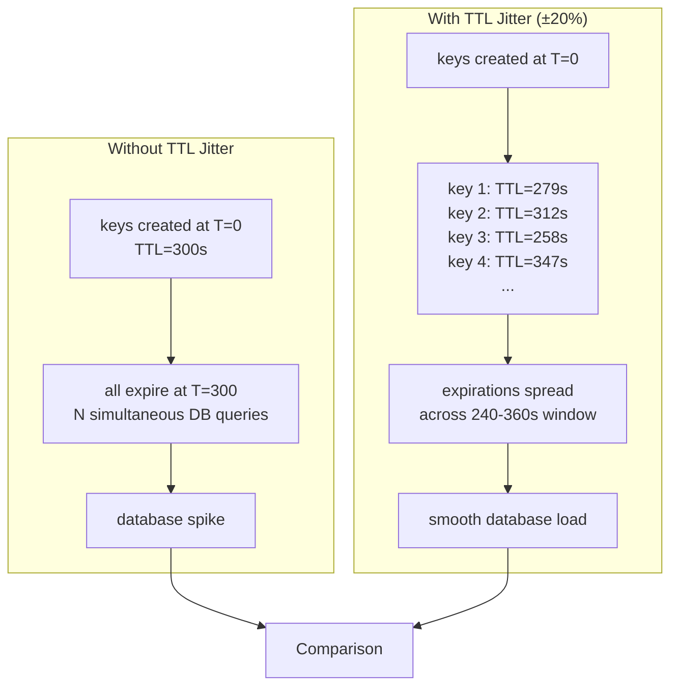

## Navigation

**Domain:** [[7 — System Design & Distributed Systems]] > **Group:** Caching
**Previous:** [[7.262 — Cache TTL — Design and Selection]] | **Next:** [[7.264 — Cache Stampede — Prevention Strategies]]

### Prerequisites

- [[7.262 — Cache TTL — Design and Selection]] — TTL jitter is a refinement of TTL selection; it randomizes TTL values to solve the aligned-expiry problem
- [[7.256 — Caching — Why Cache and When]] — the foundational why/when caching decision; TTL jitter is a production-hardening technique for any read-path cache pattern
- [[7.264 — Cache Stampede — Prevention Strategies]] — TTL jitter is one of several stampede prevention strategies, specifically addressing the aligned-expiry trigger

### Where This Fits

TTL jitter is the practice of adding controlled randomization to cache entry TTL values to prevent the thundering herd problem — the simultaneous expiry of many cache keys that share the same base TTL. The architectural problem it solves is load amplification at TTL boundaries: when 10,000 cache keys expire at the same moment, the database receives 10,000 concurrent reload queries. TTL jitter spreads these expirations across a window so the database sees a smooth load curve instead of a spike. It is the simplest and lowest-cost stampede prevention strategy, applicable to any cache pattern that uses TTL — cache-aside, read-through, or output caching. An engineer encounters the need for TTL jitter the first time they see a sawtooth database CPU chart with spikes at regular intervals matching their configured TTL duration.

---

## Core Mental Model

TTL jitter is controlled randomization applied to cache entry TTL values. The invariant: cache entries created at the same time with the same base TTL do not expire at the same time — their actual TTL values differ by a random offset, spreading expirations across a window. What TTL jitter trades is deterministic expiry predictability (you no longer know exactly when a key expires) for load smoothing at TTL boundaries (the database sees a constant reload rate instead of periodic spikes). The recognition trigger in a production system: the database CPU chart shows a regular sawtooth pattern with spikes every N minutes, where N equals the configured TTL, and the spike magnitude is proportional to the number of cache keys.



### Classification

**Pattern category:** Cache load-spreading technique, stampede prevention strategy.
**Abstraction layer:** Cache entry TTL assignment — applied at the point where the TTL value is computed, before being passed to the cache store.
**Scope:** Any cache pattern with TTL-based expiry. All keys that share a TTL value are candidates.
**When applied:** When multiple keys with the same TTL are created at approximately the same time. Common triggers: deployment restart (all keys created at T+0), bulk data load (all keys imported at once), periodic batch job (all keys refreshed hourly).
**When not applied:** Single keys (one key expiring does not cause a thundering herd). Keys with unique per-entry TTLs (each key already has a different expiry time). Write-through caches (no TTL-based expiry).

### Key Properties / Guarantees

|Property|Value|Condition|
|---|---|---|
|Maximum staleness |Base TTL + jitter window |The maximum TTL (base + max jitter) bounds staleness|
|Minimum hit ratio |Slightly lower than base TTL (some entries expire earlier) |Jitter reduces TTL for half the entries|
|Database load peak |Reduced by factor of ~(jitter_window / base_TTL * N) |Assuming N keys with uniform access frequency|
|Determinism |Lost — cannot predict exact expiry of any key |Jitter randomization makes expiry non-deterministic|
|Implementation cost |Negligible (one line: Random.Shared.Next(-jitter, jitter)) |Always worth adding alongside any TTL configuration|

---

## Deep Mechanics

### How TTL Jitter Works

TTL jitter adds a random offset to the base TTL. The offset is typically expressed as a percentage of the base TTL (e.g., ±20%). Each cache entry receives a unique TTL:

```
actualTTL = baseTTL + randomOffset
randomOffset = Random.Shared.Next(-maxJitter, +maxJitter)
```

For a base TTL of 300 seconds with ±20% jitter (60 seconds), the actual TTL ranges from 240 to 360 seconds. With 10,000 entries, expirations are spread across a 120-second window instead of all firing at 300 seconds.

**Jitter window selection:**

|Jitter percentage|Window (TTL=300s)|Keys expiring per second (10,000 keys)|Peak DB queries/s|
|---|---|---|---|
|0% (none)|0s (all at 300s)|10,000|10,000|
|±10%|60s (270-330)|~167|167|
|±20%|120s (240-360)|~83|83|
|±30%|180s (210-390)|~56|56|
|±50%|300s (150-450)|~33|33|

**The inflection point:** At ±50% jitter, the minimum TTL is 150 seconds — half the base TTL. This significantly reduces hit ratio. The recommended jitter range is ±10% to ±30%.

**Jitter must be computed per key, per cache-write.** If the same random offset is reused for all keys (same seed, same instance), the jitter is deterministic and the thundering herd returns. `Random.Shared` provides thread-safe, cryptographically random values sufficient for this use case.

```
// Wrong — all keys get the same jitter
var jitter = Random.Shared.Next(-60, 60); // computed once, reused for all
var ttl = baseTtl + jitter;

// Correct — each key gets a unique jitter
var ttl = baseTtl + Random.Shared.Next(-60, 60); // computed per key
```

### Failure Modes

|Failure|How It Manifests|Detection|Mitigation|
|---|---|---|---|
|Jitter too wide|Minimum TTL is too short. Cache hit ratio drops, database load increases overall. |Cache hit ratio drops by more than the expected jitter percentage. |Reduce jitter to ±20% or less. Use TTL jitter + write-path invalidation.|
|Jitter too narrow|The thundering herd is reduced but not eliminated. Database still sees a visible spike. |Database CPU chart still shows a sawtooth pattern, but lower amplitude. |Increase jitter to cover the full inter-request interval.|
|Same jitter applied to all keys|All keys get the same TTL offset. The herd moves but does not spread. |Database CPU spike occurs at T+offset instead of T+baseTTL with same amplitude. |Compute jitter inside the per-key loop, not before it.|
|Jitter without monitoring|The team cannot tell whether the jitter is still appropriate as traffic grows. |No metric tracks jitter window effectiveness. |Add a metric: delta between earliest and latest cache-write times for keys created in the same batch.|

### .NET and Azure Integration — TTL Jitter

```csharp
// TTL jitter helper
public static class CacheTtlHelper
{
    private const double JitterPercent = 0.20; // ±20%

    public static TimeSpan WithJitter(this TimeSpan baseTtl)
    {
        var jitterMs = (int)(baseTtl.TotalMilliseconds * JitterPercent);
        var offsetMs = Random.Shared.Next(-jitterMs, jitterMs);
        return baseTtl.Add(TimeSpan.FromMilliseconds(offsetMs));
    }
}

// Usage with IDistributedCache
public async Task SetProductAsync(int id, Product product, CancellationToken ct)
{
    var baseTtl = TimeSpan.FromMinutes(30);
    await _cache.SetStringAsync(
        $"product:{id}",
        JsonSerializer.Serialize(product),
        new DistributedCacheEntryOptions
        {
            AbsoluteExpirationRelativeToNow = baseTtl.WithJitter()
        },
        ct);
}
```

**FusionCache with TTL jitter:**

```csharp
services.AddFusionCache().WithDefaultEntryOptions(options =>
{
    options.Duration = TimeSpan.FromMinutes(5);
    options.IsFailSafeEnabled = true;
});

public async Task<Product?> GetByIdAsync(int id, CancellationToken ct)
{
    return await _cache.GetOrCreateAsync($"product:{id}", async (ctx, token) =>
    {
        var product = await _db.Products.FindAsync(new object[] { id }, token);
        if (product is not null)
        {
            var jitterMs = Random.Shared.Next(-60_000, 60_000);
            ctx.Options.Duration = TimeSpan.FromMinutes(5).Add(TimeSpan.FromMilliseconds(jitterMs));
        }
        return product;
    }, ct);
}
```

**Redis via StackExchange.Redis:**

```csharp
var db = redis.GetDatabase();
var ttl = 1800 + Random.Shared.Next(-360, 360); // 30 min ± 6 min
await db.StringSetAsync($"product:{id}", serialized, TimeSpan.FromSeconds(ttl));
```

---

## Production Patterns and Implementation

### 1. Per-Data-Type Jitter Configuration

```csharp
public record CacheTtlConfig
{
    public TimeSpan BaseTtl { get; init; }
    public double JitterPercent { get; init; } = 0.20;
    public TimeSpan? AbsoluteMax { get; init; }

    public TimeSpan ComputeTtl()
    {
        var jitterMs = BaseTtl.TotalMilliseconds * JitterPercent;
        var offsetMs = (int)jitterMs;
        var ttl = BaseTtl.Add(TimeSpan.FromMilliseconds(Random.Shared.Next(-offsetMs, offsetMs)));
        if (AbsoluteMax.HasValue && ttl > AbsoluteMax.Value)
            ttl = AbsoluteMax.Value;
        return ttl;
    }
}

public class CacheTtlRegistry
{
    private readonly Dictionary<string, CacheTtlConfig> _configs = new()
    {
        ["product:*"] = new() { BaseTtl = TimeSpan.FromMinutes(30), JitterPercent = 0.15 },
        ["product:price:*"] = new() { BaseTtl = TimeSpan.FromMinutes(5), JitterPercent = 0.20 },
        ["user:session:*"] = new()
        {
            BaseTtl = TimeSpan.FromMinutes(20),
            JitterPercent = 0.10,
            AbsoluteMax = TimeSpan.FromHours(8)
        },
        ["report:daily:*"] = new() { BaseTtl = TimeSpan.FromHours(24), JitterPercent = 0.05 },
        ["config:*"] = new() { BaseTtl = TimeSpan.FromHours(4), JitterPercent = 0.10 },
    };

    public CacheTtlConfig GetConfig(string cacheKey)
    {
        foreach (var (pattern, config) in _configs)
            if (cacheKey.Like(pattern))
                return config;
        return new() { BaseTtl = TimeSpan.FromMinutes(5), JitterPercent = 0.20 };
    }
}
```

### 2. Graduated Jitter for Cache Warm-Up

```csharp
public static TimeSpan ComputeWarmUpTtl(int warmUpBatchSize, int batchIndex)
{
    var baseTtl = TimeSpan.FromMinutes(30);
    var batchOffset = TimeSpan.FromMinutes(batchIndex * 5);
    var jitterMs = (int)baseTtl.TotalMilliseconds * 0.25;
    return baseTtl
        .Add(batchOffset)
        .Add(TimeSpan.FromMilliseconds(Random.Shared.Next(-jitterMs, jitterMs)));
}
```

### 3. TTL Jitter for Output Caching (ASP.NET Core)

```csharp
builder.Services.AddOutputCache(options =>
{
    options.AddPolicy("ProductCatalog", policy =>
    {
        var jitter = Random.Shared.Next(-30, 30);
        policy.ExpirationTimeSpan = TimeSpan.FromMinutes(5).Add(TimeSpan.FromSeconds(jitter));
    });
});
```

### Common Variants

|Variant|Description|When to Use|
|---|---|---|
|±10% jitter|Small randomization. Keeps staleness window tight. |Session TTL, user-facing latency-sensitive data.|
|±20% jitter|Default recommendation. Balances load spreading with staleness. |General-purpose. Most production systems start here.|
|±30% jitter|Aggressive randomization. Maximum load spreading. |Bulk-loaded caches (10,000+ keys), deployment warm-up.|
|Per-bucket jitter|Keys assigned to N buckets with different base TTL offsets. |Deterministic alternative. Easier to debug — each bucket's expiry is known.|
|Graduated jitter|Jitter window decreases as the cache stabilizes after warm-up. |Post-deployment warm-up. Aggressive jitter initially, then normal.|

### Real-World .NET Ecosystem Example

- **ASP.NET Core Output Caching** — `[OutputCache(Duration = 300)]` has no built-in jitter. Apply jitter dynamically in `Program.cs` per-instance using `Random.Shared`.
- **FusionCache** — No native jitter API. Set `ctx.Options.Duration` with randomization inside the factory delegate.
- **StackExchange.Redis** — `StringSetAsync` accepts `TimeSpan? expiry`. Compute TTL with jitter before calling.
- **Azure Redis** — `EXPIRE` accepts TTL in seconds. Jitter is applied at the application layer.

---

## Gotchas and Production Pitfalls

### Gotcha 1: Jitter Applied Once, Not Per Key

**Pitfall:** The engineer computes the jitter offset once and reuses it for all keys. All keys get the same shifted TTL instead of unique TTLs.

```csharp
// Wrong — jitter computed once
var jitterSeconds = Random.Shared.Next(-60, 60);
var ttl = TimeSpan.FromSeconds(300 + jitterSeconds);
for each key:
    cache.Set(key, ttl);
```

**Symptom:** Database CPU spike occurs at the shifted TTL boundary (e.g., 270s instead of 300s) with the same amplitude.

**Fix:** Compute jitter inside the loop, per key:

```csharp
for each key:
    var ttl = TimeSpan.FromSeconds(300 + Random.Shared.Next(-60, 60));
    cache.Set(key, ttl);
```

**Cost of not fixing:** The thundering herd is not solved. The spike just shifts to a different time.

### Gotcha 2: Jitter Too Wide for Sliding TTL

**Pitfall:** ±50% jitter on a 20-minute sliding TTL. Minimum TTL is 10 minutes. An active user reading every 11 minutes finds the session expired.

**Symptom:** Active users' sessions expire intermittently. Support tickets: "Keep getting logged out."

**Fix:** For sliding TTLs, use ≤±10% jitter or none. The sliding mechanism naturally spreads expirations.

**Cost of not fixing:** User frustration and authentication team investigating a "session store bug" caused by cache misconfiguration.

### Gotcha 3: Jitter Too Small for Short TTLs

**Pitfall:** ±20% jitter on a 30-second TTL (±6 seconds). Redis 1-second precision means most keys cluster around a few discrete TTL values.

**Symptom:** Small database spike still occurs at the TTL boundary. The team thinks "jitter doesn't work."

**Fix:** For short TTLs (< 60 seconds), use ±30-50% jitter or switch to refresh-ahead.

**Cost of not fixing:** Partial mitigation. The team escalates to "jitter is ineffective" when the real fix is wider jitter.

### Gotcha 4: Jitter Mistaken for a Complete Stampede Solution

**Pitfall:** TTL jitter is added, and the engineer assumes all stampede problems are solved. A single hot key (1,000 req/s) still causes a stampede on expiry.

**Symptom:** The most popular product periodically causes a database spike. Jitter does not help because there is only one key.

**Fix:** TTL jitter solves the multi-key thundering herd. For single hot keys, use refresh-ahead ([[7.261]]) or probabilistic early expiration ([[7.265]]).

**Cost of not fixing:** The most popular product causes a database spike every TTL period. The team investigates "why jitter is not working" before realizing the root cause.

---

## Tradeoffs and Decision Framework

### Tradeoff Matrix

|Dimension|TTL Jitter|Refresh-Ahead|No Jitter (Basic TTL)|
|---|---|---|---|
|Thundering herd prevention|Spreads expiry across window|Eliminates expiry entirely|None|
|Single hot key stampede|Not solved|Solved|Not solved|
|Database load pattern|Smooth (spread reloads)|Smooth + speculative|Spiky (aligned reloads)|
|Implementation cost|Negligible (1 line)|High (soft/hard TTL, background tasks)|None|
|Maximum staleness|Base TTL + jitter window|Base TTL (soft TTL)|Base TTL|
|Best for|Many keys, same TTL, moderate traffic|Single hot key, high traffic|Low-traffic, small key count|

```mermaid
flowchart TD
    A[How many keys share the same TTL?] -->|"1-10 keys"| B{Is it a hot key (> 100 req/s)?}
    B -->|Yes| C[Use refresh-ahead or probabilistic early expiration]
    B -->|No| D[Jitter not needed — single key expiry not a problem]
    A -->|"10-1,000 keys"| E[TTL jitter ±20% works well]
    A -->|"1,000+ keys"| F[TTL jitter ±20% + per-bucket offset for maximum spread]
    F --> G{Are keys created at the same time?}
    G -->|Yes, deployment batch| H[Use graduated jitter + warm-up strategy]
    G -->|No, natural spread| I[Standard jitter is sufficient]
```

### When to Apply

- Keys are created in batches (deployment warm-up, bulk data load, batch job).
- Many keys share the same TTL (catalog of 50,000 items with 30-minute TTL).
- Database is the bottleneck and cannot handle peak load at TTL expiry boundaries.
- Simple solution is preferred — one line of code, zero operational overhead.

### When NOT to Apply

- [ ] Single key with high traffic. Use refresh-ahead or probabilistic early expiration.
- [ ] Sliding TTL with active users. The sliding mechanism already spreads expiry; jitter adds unnecessary risk of premature expiry.
- [ ] Very short TTL (< 30 seconds). The jitter window is too narrow. Use refresh-ahead or skip caching.
- [ ] Write-through caches. No TTL, so no expiry to spread.
- [ ] Strict deterministic expiry required. Use per-bucket offsets instead.

### Scale Thresholds

- **Always add jitter above 100 keys per TTL group.**
- **Required above 1,000 keys per TTL group.**
- **Jitter percentage by key count:** 1,000 keys → ±20%; 10,000 keys → ±20-30%; 100,000 keys → ±30-50% with graduated warm-up.
- **Jitter becomes insufficient above 10,000 req/s per key group.** Add refresh-ahead as a second layer.

---

## Interview Arsenal

### Question Bank

1. What is TTL jitter and what specific problem does it solve?
2. How does TTL jitter work? Walk through the math for 10,000 keys with a 5-minute TTL and ±20% jitter.
3. What is the difference between TTL jitter and refresh-ahead as stampede prevention strategies?
4. When does TTL jitter NOT solve the stampede problem?
5. How would you implement TTL jitter in ASP.NET Core with IDistributedCache?
6. How does TTL jitter interact with sliding TTL?
7. What happens if the jitter offset is computed once and applied to all keys?
8. How would you design a TTL jitter strategy for a deployment warm-up (100,000 keys created at T+0)?

### Spoken Answers

**Q: "What is TTL jitter and what specific problem does it solve?"**

> **Average answer:** "TTL jitter adds randomness to cache expiry times so all keys don't expire at once."
>
> **Great answer:** "TTL jitter is controlled randomization of cache entry TTL values. It solves the thundering herd problem at TTL expiry boundaries — when many cache keys share the same base TTL and are created at approximately the same time, they all expire simultaneously, generating a concurrent load spike on the database. For example: 10,000 product catalog keys with a 30-minute TTL, all created during deployment. At T+30 minutes, all 10,000 keys expire at once, and the database receives 10,000 concurrent reload queries. With ±20% jitter (random TTL values between 24 and 36 minutes), expirations are spread across a 12-minute window, reducing the peak reload rate from 10,000 queries at a single moment to roughly 14 queries per second. TTL jitter is the cheapest form of stampede prevention — it adds one line of code with zero operational overhead. However, it does not solve the single-key stampede (1,000 req/s for one key that just expired). For that, you need refresh-ahead or probabilistic early expiration."

### System Design Interview Trigger

If the interviewer asks about cache stampede prevention and you propose TTL jitter, the follow-up is: "How do you handle the case where a single popular key expires?" — testing whether you know the difference between the thundering herd (many keys, same expiry) and the single-key stampede (one key, many concurrent misses).

### Comparison Table

| |TTL Jitter|Refresh-Ahead|Probabilistic Early Expiration|
|---|---|---|---|
|Stampede type solved|Many keys, same TTL|Single key, many req/s|Single key, many req/s|
|Load pattern|Spread (time-shifted)|Smooth + speculative|Smooth + probabilistic|
|Implementation|1 line of code|Complex (background tasks)|Moderate (probability function)|
|Best for|Bulk-loaded caches|Hot keys (100+ req/s)|Very hot keys (1,000+ req/s)|

---

## Architecture Decision Record

### Title: TTL Jitter for Product Catalog Cache After Deployment

**Context:** The Product Catalog API runs on 10 instances. At deployment, all 10 instances restart simultaneously. Each instance warms its cache by loading the top 1,000 products. All 1,000 entries are created with a 30-minute TTL. At T+30 minutes, all keys expire on all 10 instances simultaneously — 10,000 concurrent database queries. The database DTU spikes from 40% to 95%.

**Options Considered:**

1. **Add ±20% TTL jitter.** Each key gets a TTL between 24 and 36 minutes. Peak concurrent reloads drop from 10,000 to ~14/s.
2. **No change — accept the spike.** The spike lasts 30 seconds. The database auto-scales to handle it.
3. **Staggered warm-up.** Each instance waits a random delay before warming up, spreading creation times.

**Decision:** Option 1 — Add ±20% TTL jitter.

**Rationale:** TTL jitter eliminates the root cause (aligned expiry) with a one-line code change and zero operational cost. Option 2 wastes database capacity. Option 3 adds deployment complexity.

**Consequences:**
- ✅ Database spike eliminated. Peak concurrent reloads drop from 10,000 to ~14/s.
- ✅ One-line code change, no deployment ceremony.
- ⚠️ Maximum staleness increases from 30 to 36 minutes. Acceptable per product team (accepts up to 1 hour).
- ⚠️ Non-deterministic expiry. No audit requirement depends on exact expiry times.

**Review Trigger:** Revisit this decision if product update frequency increases (making write-path invalidation cost-effective) or if the database still spikes at TTL boundaries (jitter width may be insufficient).

---

## Self-Check

### Conceptual Questions

1. What problem does TTL jitter solve?
2. What is the formula for computing the effective TTL with jitter?
3. How does TTL jitter affect the cache hit ratio?
4. What is the difference between TTL jitter and refresh-ahead in solving the thundering herd?
5. Why is TTL jitter ineffective for a single hot key?
6. How do you implement TTL jitter in FusionCache?
7. What happens if the jitter offset is computed once and reused for all keys?
8. How does TTL jitter interact with sliding TTL?
9. What is the recommended jitter percentage for a general-purpose cache?
10. How does TTL jitter differ from Redis's internal expiry cycle jitter?

<details>
<summary>Answers</summary>

1. **Load amplification at TTL boundaries.** Many keys with the same TTL expire simultaneously, causing a database load spike. TTL jitter spreads expirations across a window.
2. **effectiveTTL = baseTTL ± Random.Shared.Next(-jitterMs, jitterMs).**
3. **Slightly reduced.** Half the entries get a shorter TTL (expire earlier). For ±20% jitter on 300s base, minimum TTL is 240s. Overall hit ratio impact is ~10%.
4. **TTL jitter spreads expiry of many keys.** Refresh-ahead eliminates expiry for a single key by refreshing before the TTL elapses. Different problems: multi-key alignment vs single-key stampede.
5. **Only one key to jitter.** With 1,000 req/s for a single key, jitter does not reduce concurrent misses.
6. **Set ctx.Options.Duration in the factory with a randomized value.**
7. **The thundering herd shifts but does not spread.** All keys get the same TTL (base + fixed offset). They still expire at the same time.
8. **Sliding TTL + wide jitter can cause premature expiry for active users.** Use ≤±10% for sliding TTLs.
9. **±20%.** ±10% for sliding TTL, ±30% for bulk-loaded caches.
10. **Application-layer jitter** randomizes per-key TTL to spread reload load. **Redis internal jitter** randomizes the ACTIVE_EXPIRE_CYCLE frequency to prevent Redis from CPU-spiking. They are complementary.
</details>

---

### Scenario Challenges

**Scenario 1 — Diagnose the problem.** The team deploys a new version of the product service at 10:00 AM. At 10:30 AM, the database CPU spikes from 30% to 90%. At 11:00 AM, it spikes again. The pattern continues every 30 minutes. Each spike lasts 20-30 seconds.

<details>
<summary>Diagnosis</summary>

**Root cause:** All product catalog cache entries were created during deployment at 10:00 AM with a 30-minute TTL. No TTL jitter. Every 30 minutes, all entries expire simultaneously.

**Evidence:** Cache hit ratio drops from 95% to 0% at exactly 10:30, 11:00, 11:30. Redis expired_keys metric spikes at the same times.

**Fix:** Add ±20% TTL jitter: `var ttl = TimeSpan.FromMinutes(30).Add(TimeSpan.FromSeconds(Random.Shared.Next(-360, 360)));`

**Prevention:** Pre-deployment checklist item: "Verify TTL jitter is applied to all cache entries created in bulk."
</details>

---

**Scenario 2 — Failure mode.** Your team adds TTL jitter to the product catalog. After deployment, database DTU drops from 40% to 35%. But the product team reports stale data for up to 42 minutes instead of the expected 30 minutes. Cache hit ratio dropped from 95% to 88%.

<details>
<summary>Investigation and Fix</summary>

**Investigation steps:** Check the jitter implementation — is it per-key or global? Check actual TTL values in Redis. Check hit ratio metric.

**Confirming evidence:** Redis `TTL product:*` shows uniform distribution between 24 and 36 minutes. Jitter is correct. Hit ratio drop is because 25% of keys have TTL = 24 minutes (minimum), and those keys expire 20% earlier.

**Immediate mitigation:** None — jitter is working as designed.

**Permanent fix:** Explain to the product team that maximum staleness is now 36 minutes (base 30 + max jitter 6). If staleness is unacceptable, add write-path invalidation.

**Post-mortem item:** Product team was not informed about staleness increase. Add communication step to caching configuration changes.
</details>

---

**Scenario 3 — Scale it.** Your system handles 5,000 req/s with 20,000 cached keys and 30-minute TTL. Traffic grows to 50,000 req/s with 200,000 unique keys. TTL jitter at ±20% gives a reload rate of 200,000 / 720 = ~278 concurrent reloads per second.

<details>
<summary>Scaling Strategy</summary>

**Bottleneck:** 278 concurrent reloads per second is significant for the database.

**How it helps:** TTL jitter is the first layer. Add a second layer:
1. Increase jitter to ±30% (18-minute window, ~185 reloads/s).
2. Add per-key request-rate tracking. Top 100 hottest keys get refresh-ahead (FusionCache fail-safe) so they never expire.
3. Add write-path invalidation for keys that are updated infrequently.

**What it does not solve:** Cold-start after deployment. Use graduated jitter for warm-up.

**Implementation order:**
1. Increase jitter config from ±20% to ±30%.
2. Deploy FusionCache with refresh-ahead for top 100 hot keys.
3. Deploy write-path invalidation for remaining keys.
4. Eventually remove TTL-based expiry for most keys — TTL becomes a safety cap.
</details>

---

**Scenario 4 — Interview simulation.** The interviewer says: "Design a global content delivery cache for a video streaming platform. Video metadata is cached with a 1-hour TTL. Metadata is updated by content editors at 500 updates per hour across 1 million videos. How do you prevent the cache from causing a database thundering herd?"

<details>
<summary>Model Response</summary>

"I would use three strategies. First, TTL jitter ±20% spreads 1 million expirations from a single 1-hour spike to a 72-minute window, reducing peak reloads from 1,000,000 concurrent to ~231 per second. Second, staggered population — assign each video a different base TTL based on its ID hash: `baseTtl = 3600 + (videoId % 600)`. This ensures natural offset from the start. Third, write-path invalidation for updated entries — only 500 updates per hour, so the invalidation load is negligible. For the remaining 999,500 entries never updated, TTL expiry handles them at ~231 reloads per second. If the database cannot sustain this, I add an L1 in-memory cache with a 5-minute TTL to absorb 90%+ of reads."
</details>

---

<｜｜DSML｜｜parameter name="filePath" string="true">D:\PERSONAL\docs\obsidian\CAREER\7.SYSTEM DESIGN & DISTRUBUTE SYSTEMS\Group 7 — Caching\7_263_TTL_Jitter_Preventing_Thundering_Herd.md