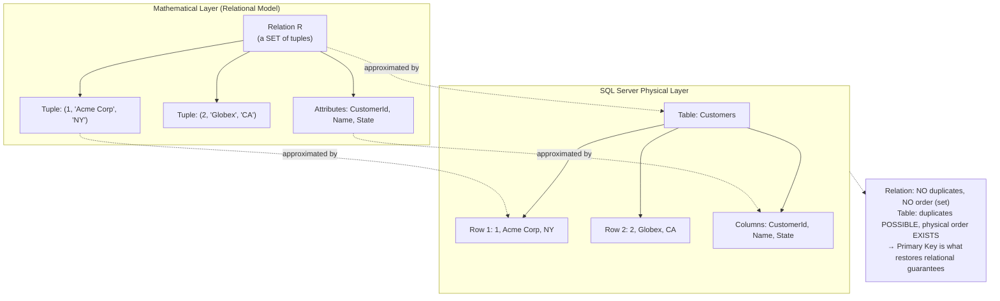
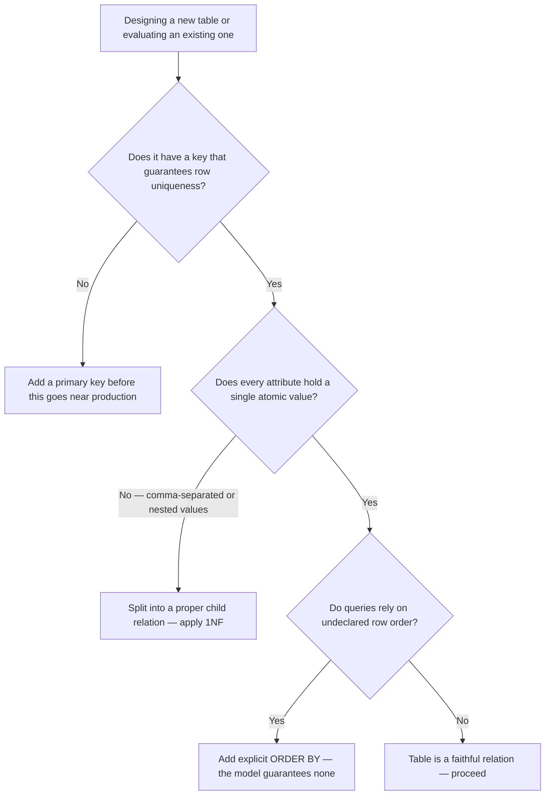

## Navigation

**Domain:** [[8 — Databases]] > **Group:** Relational Fundamentals **Previous:** — (entry point of Domain 8) | **Next:** [[8.002 — Keys — Primary, Foreign, Candidate, Surrogate, Natural]]

### Prerequisites

None. This is the foundational entry point of Domain 8 — every other topic in this domain assumes the vocabulary defined here.

### Where This Fits

Every table you have ever written `SELECT * FROM` against is a physical approximation of a mathematical object: a relation. A backend engineer who treats "table," "row," and "column" as the primitive vocabulary will eventually be confused by things that only make sense at the relational level — why duplicate rows are a modeling error and not just an aesthetic one, why a table with no key is not really a relation at all, why EF Core's `DbSet<T>` maps cleanly onto this model while a denormalized JSON blob does not. In production, this shows up the moment someone designs a table without a primary key "because we'll add one later" — and now `UPDATE`/`DELETE` cannot target a single row unambiguously. In an interview, this is the question that separates candidates who memorized SQL syntax from candidates who understand why SQL has the syntax it does — "why can a table have duplicate rows but a relation, formally, cannot?" is a five-second gut-check for relational fluency.

---

## Core Mental Model

A **relation** is a set of tuples sharing the same attributes, where set semantics (no duplicates, no defined order) are part of the definition — not an implementation detail. A **table** is the SQL engine's physical, ordered, duplicate-tolerant approximation of that mathematical relation; a **row** is the engine's name for a tuple; a **column** is the engine's name for an attribute. The gap between the math and the engine is exactly where most "why does SQL behave this way" confusion lives: SQL tables can have duplicate rows and an implicit storage order, while true relations cannot — and SQL only recovers the relation's guarantees when you enforce a key.

### Classification

**For architecture topics:** the relational model is the conceptual layer beneath the entire RDBMS — it lives above the storage engine (pages, B-trees, buffer pool) and below the application's object model. It trades flexibility (you cannot nest arbitrary structures inside a cell — First Normal Form forbids it) for the guarantee that every fact is uniquely addressable, query-able with closed algebraic operations (select, project, join), and provably composable. What it hides from the developer: physical row order, physical storage layout. Where the abstraction leaks: `SELECT *` without `ORDER BY` "happening" to return rows in insertion order in small tables — relying on that is relying on an implementation detail the model explicitly does not guarantee.



### Key Properties

|Property|Value|Notes|
|---|---|---|
|Time Complexity|N/A (conceptual model)|Complexity belongs to the physical access path (B-tree, heap), not the relation itself|
|Write Cost|N/A|The model has no storage opinion; cost is a storage-engine concern|
|SARGable|N/A|The relational model defines no predicates; SARGability is a property of WHERE clauses, addressed starting at [[8.067 — WHERE Clause — Predicate Logic and SARGability]]|
|Locking Behavior|N/A|Locking is a concurrency-control concern layered on top of the physical table, not the relation|
|Duplicate Tolerance|None (by definition)|A true relation cannot contain two identical tuples — duplicates in a SQL table mean the table lacks a key, i.e., it is not a faithful relation|
|Ordering Guarantee|None (by definition)|A relation has no inherent order — `ORDER BY` is required for any guaranteed result order in SQL|

---

## Deep Mechanics

### How the Engine Executes This

The relational model itself is not "executed" — it is the contract that SQL's query engine is built to honor. What is executed, every time you run a query, is the translation from the declarative relational request ("give me the relation that results from joining these two relations and projecting these attributes") into a physical execution plan. Tracing that translation:

1. **Parsing** — your T-SQL text is checked for syntactic validity and turned into a parse tree.
2. **Binding/Algebrization** — table and column names are resolved against the catalog; the parse tree becomes a logical tree expressed in relational algebra terms: `σ` (select/restrict), `π` (project), `⋈` (join), `∪` (union).
3. **Optimization** — the optimizer applies cost-based transformations to the logical algebra tree (join reordering, predicate pushdown) and chooses a physical plan (which join algorithm, which index).
4. **Execution** — the physical plan runs against actual pages in the buffer pool, producing a result set that is — critically — itself a relation (or, in SQL's looser reality, a result table that may contain duplicates unless you explicitly deduplicate).

The point most engineers miss: every relational algebra operator (`σ`, `π`, `⋈`) is **closed** — applying it to a relation produces another relation. This closure property is exactly why SQL queries can be nested and composed (subqueries, CTEs, derived tables) without breaking — you are always operating on the same kind of object.

### SQL Visibility

```sql
-- A table that is a faithful relation: it has a key (CustomerId),
-- and the engine will reject an attempt to insert a duplicate key.
CREATE TABLE Customers (
    CustomerId INT IDENTITY(1,1) PRIMARY KEY,
    CompanyName NVARCHAR(200) NOT NULL,
    State CHAR(2) NOT NULL
);

INSERT INTO Customers (CompanyName, State) VALUES ('Acme Corp', 'NY');
INSERT INTO Customers (CompanyName, State) VALUES ('Globex', 'CA');

-- Selecting attributes (projection, π) and restricting tuples (selection, σ)
SELECT CompanyName, State        -- projection: π(CompanyName, State)
FROM Customers
WHERE State = 'NY';              -- selection: σ(State = 'NY')
```

```csharp
// The EF Core LINQ that generates equivalent SQL
var nyCustomers = await dbContext.Customers
    .Where(c => c.State == "NY")              // σ — selection
    .Select(c => new { c.CompanyName, c.State }) // π — projection
    .ToListAsync(cancellationToken);
```

**Generated SQL (from EF Core logs):**

```sql
SELECT [c].[CompanyName], [c].[State]
FROM [Customers] AS [c]
WHERE [c].[State] = N'NY'
```

Notice the EF Core LINQ maps almost mechanically onto the two relational algebra primitives: `.Where()` is `σ` (selection), `.Select()` is `π` (projection). This is not a coincidence — LINQ-to-Entities was designed as a typed surface over the same algebra SQL itself implements.

### Execution Plan Analysis

For the query above, with `CustomerId` as the clustered primary key and no index on `State`:

```
Expected plan shape:
[Clustered Index Scan on Customers] → [Filter: State = 'NY'] → [SELECT]
Estimated Cost: 100%  |  Logical Reads: ~N (N = pages in the clustered index)
```

Because `State` has no supporting index, the engine cannot perform a seek — it must scan every row (every tuple in the relation) and apply the predicate as a `Filter` operator after the scan. If a non-clustered index on `State` existed:

```
Expected plan shape (with index):
[Index Seek on IX_Customers_State] → [Key Lookup on Clustered Index] → [Nested Loops] → [SELECT]
Estimated Cost: ~5–15%  |  Logical Reads: ~(matching rows × 2)
```

### Cost Visibility

```sql
SET STATISTICS IO ON;
SET STATISTICS TIME ON;

SELECT CompanyName, State
FROM Customers
WHERE State = 'NY';

-- Expected output (no index on State, 500K row table):
-- Table 'Customers'. Scan count 1, logical reads 8500, physical reads 0
-- SQL Server Execution Times: CPU time = 42ms, elapsed time = 45ms
```

### Failure Modes

The most common production failure traceable directly to a misunderstanding of the relational model is **a table with no primary key**, or one whose "key" is not actually enforced. This produces tuples (rows) that the relational model forbids — true duplicates — and once they exist, no single `UPDATE ... WHERE` or `DELETE ... WHERE` can target exactly one of them, because nothing distinguishes them.

```sql
-- Find tables that violate the relational model's key requirement —
-- no primary key defined at all.
SELECT t.name AS TableName
FROM sys.tables t
LEFT JOIN sys.indexes i
    ON t.object_id = i.object_id AND i.is_primary_key = 1
WHERE i.object_id IS NULL;
```

A second, subtler failure: code that relies on `SELECT * FROM Orders` returning rows "in the order they were inserted." The relational model guarantees no such thing — a future index rebuild, a parallel scan, or a statistics-driven plan change can silently reorder results, and the bug only appears in production under a different data volume or a different execution plan.

---

## Production Patterns and Implementation

### Primary SQL Implementation

```sql
-- A realistic, faithful relation: Orders, with a real key
-- and a foreign-key relationship to Customers (another relation).
CREATE TABLE Orders (
    OrderId INT IDENTITY(1,1) PRIMARY KEY,
    CustomerId INT NOT NULL,
    OrderDate DATETIME2 NOT NULL DEFAULT SYSUTCDATETIME(),
    TotalAmount DECIMAL(12,2) NOT NULL,
    CONSTRAINT FK_Orders_Customers
        FOREIGN KEY (CustomerId) REFERENCES Customers(CustomerId)
);

-- Relational algebra in action: join two relations (⋈), then project (π)
SELECT o.OrderId, c.CompanyName, o.TotalAmount
FROM Orders o
INNER JOIN Customers c ON o.CustomerId = c.CustomerId
WHERE o.TotalAmount > 1000.00;   -- σ applied before/with the join by the optimizer
```

### EF Core Implementation

```csharp
public class ApplicationDbContext : DbContext
{
    public DbSet<Customer> Customers => Set<Customer>();
    public DbSet<Order> Orders => Set<Order>();

    protected override void OnModelCreating(ModelBuilder modelBuilder)
    {
        modelBuilder.Entity<Customer>(entity =>
        {
            entity.HasKey(c => c.CustomerId);          // enforces the relational key
            entity.Property(c => c.CompanyName).HasMaxLength(200).IsRequired();
        });

        modelBuilder.Entity<Order>(entity =>
        {
            entity.HasKey(o => o.OrderId);
            entity.HasOne<Customer>()
                  .WithMany()
                  .HasForeignKey(o => o.CustomerId);
        });
    }
}

public async Task<List<OrderSummary>> GetHighValueOrdersAsync(
    decimal threshold,
    CancellationToken cancellationToken = default)
{
    return await _dbContext.Orders
        .Join(_dbContext.Customers,
            o => o.CustomerId,
            c => c.CustomerId,
            (o, c) => new OrderSummary
            {
                OrderId = o.OrderId,
                CompanyName = c.CompanyName,
                TotalAmount = o.TotalAmount
            })
        .Where(x => x.TotalAmount > threshold)
        .ToListAsync(cancellationToken);
}
```

### Dapper Implementation

```csharp
public async Task<IReadOnlyList<OrderSummary>> GetHighValueOrdersAsync(
    decimal threshold,
    CancellationToken cancellationToken = default)
{
    const string sql = @"
        SELECT o.OrderId, c.CompanyName, o.TotalAmount
        FROM Orders o
        INNER JOIN Customers c ON o.CustomerId = c.CustomerId
        WHERE o.TotalAmount > @Threshold";

    await using var connection = _connectionFactory.Create();
    var results = await connection.QueryAsync<OrderSummary>(
        new CommandDefinition(sql, new { Threshold = threshold },
            cancellationToken: cancellationToken));
    return results.AsList();
}
```

### Configuration and Wiring

```csharp
// Program.cs
builder.Services.AddDbContext<ApplicationDbContext>(options =>
    options.UseSqlServer(
        builder.Configuration.GetConnectionString("Default"),
        sqlOptions => sqlOptions.EnableRetryOnFailure(3)));

builder.Services.AddSingleton<IDbConnectionFactory>(
    new SqlConnectionFactory(builder.Configuration.GetConnectionString("Default")!));
```

### SQL Server vs PostgreSQL Differences

The relational model itself is identical across engines — it predates both. The syntax for declaring a faithful relation differs only cosmetically:

```sql
-- PostgreSQL equivalent
CREATE TABLE customers (
    customer_id SERIAL PRIMARY KEY,
    company_name VARCHAR(200) NOT NULL,
    state CHAR(2) NOT NULL
);
```

---

## Gotchas and Production Pitfalls

### Tables Without a Primary Key

**Pitfall:** A table is created without a primary key, often "to move fast" during an early sprint.

```sql
-- ❌ No key — this is a "table," not a faithful relation
CREATE TABLE ImportStaging (
    CustomerName NVARCHAR(200),
    Amount DECIMAL(12,2)
);
```

**Symptom:** Duplicate rows accumulate silently from retried import jobs; `DELETE` or `UPDATE` statements targeting "one row" affect all duplicates or none deterministically; EF Core throws `InvalidOperationException: The entity type 'X' requires a primary key to be defined` if you try to map it.

**Fix:**

```sql
-- ✅ Add a surrogate key to restore relational integrity
ALTER TABLE ImportStaging ADD ImportStagingId INT IDENTITY(1,1) PRIMARY KEY;
```

**Cost of not fixing:** A reconciliation job that "deletes the duplicate row" via `DELETE TOP (1) FROM ImportStaging WHERE CustomerName = 'Acme' AND Amount = 500` deletes a non-deterministic row each run, corrupting financial reconciliation reports silently for weeks before anyone notices the numbers don't tie out.

### Confusing Result-Set Order With Relational Guarantees

**Pitfall:** Application code assumes `SELECT * FROM Orders` returns rows in insertion order without an `ORDER BY`.

```sql
-- ❌ No ORDER BY — order is undefined by the relational model
SELECT OrderId, OrderDate FROM Orders;
```

**Symptom:** A report that "always worked" suddenly returns rows in a different sequence after an index rebuild, a statistics update, or a parallel execution plan kicks in — usually right after a deployment, making it look like a regression in application code when it is a misunderstanding of the model.

**Fix:**

```sql
-- ✅ Explicit order, every time order matters
SELECT OrderId, OrderDate FROM Orders ORDER BY OrderDate DESC;
```

**Cost of not fixing:** Customer-facing order history pages silently re-shuffle, generating support tickets ("my orders are out of order") that take hours to diagnose because the query "looks correct."

### Modeling a Repeating Group Inside a Single Attribute

**Pitfall:** Storing multiple values in one column to "avoid a join," violating First Normal Form and the very definition of an attribute as atomic.

```sql
-- ❌ Repeating group packed into one attribute — not 1NF, arguably not relational
CREATE TABLE Orders (
    OrderId INT PRIMARY KEY,
    ProductIds NVARCHAR(MAX)  -- '101,205,309'
);
```

**Symptom:** `WHERE ProductIds LIKE '%205%'` cannot use an index, matches `2050` and `1205` incorrectly, and referential integrity to `Products` cannot be enforced at all.

**Fix:**

```sql
-- ✅ A proper relation for the many-to-many fact
CREATE TABLE OrderItems (
    OrderId INT NOT NULL REFERENCES Orders(OrderId),
    ProductId INT NOT NULL REFERENCES Products(ProductId),
    Quantity INT NOT NULL,
    PRIMARY KEY (OrderId, ProductId)
);
```

**Cost of not fixing:** Full table scans on every product-lookup query against a multi-million-row `Orders` table, plus silent data-integrity bugs (orphaned product IDs with no referential check) that surface as "missing product" errors in production reports.

### Treating EF Core's `DbSet<T>` as a Free-Form Collection

**Pitfall:** Mapping an entity with no key configured, relying on EF Core's convention-based key discovery to "just work," then renaming the convention-matched property.

```csharp
// ❌ Renaming "Id" to "RecordId" without telling EF Core,
// silently breaking key discovery
public class AuditEntry
{
    public int RecordId { get; set; }  // no longer matches the "Id" convention
}
```

**Symptom:** `System.InvalidOperationException: The entity type 'AuditEntry' requires a primary key to be defined` at startup, or worse — EF Core silently treats the type as keyless and every `SaveChangesAsync()` re-inserts rows instead of updating them.

**Fix:**

```csharp
// ✅ Explicit key configuration — never rely on convention for production entities
modelBuilder.Entity<AuditEntry>().HasKey(a => a.RecordId);
```

**Cost of not fixing:** Audit tables silently double in row count on every save cycle, going unnoticed until storage costs or query latency spikes trigger an investigation.

---

## Performance Implications

### Benchmark: Before and After

```sql
-- Baseline: no primary key / clustered index — heap table, full scan required
SET STATISTICS IO ON;
SELECT CompanyName FROM Customers_Heap WHERE CustomerId = 4821;
-- Table 'Customers_Heap'. Scan count 1, logical reads 4,250

-- Optimized: CustomerId is the clustered primary key
SET STATISTICS IO ON;
SELECT CompanyName FROM Customers WHERE CustomerId = 4821;
-- Table 'Customers'. Scan count 0, logical reads 3
```

**Improvement:** ~1,400x reduction in logical reads, from 4,250 to 3 — purely from restoring the key the relational model requires and letting the engine build a clustered index on it.

### BenchmarkDotNet

```csharp
[MemoryDiagnoser]
[SimpleJob(RuntimeMoniker.Net90)]
public class RelationKeyLookupBenchmark
{
    private IDbConnection _connection = default!;

    [GlobalSetup]
    public void Setup()
    {
        _connection = new SqlConnection(TestConnectionString);
        // seed 500K rows into Customers_Heap (no PK) and Customers (PK)
    }

    [Benchmark(Baseline = true)]
    public async Task<Customer?> Lookup_NoKey_HeapScan()
    {
        const string sql = "SELECT TOP 1 * FROM Customers_Heap WHERE CustomerId = 4821";
        return await _connection.QueryFirstOrDefaultAsync<Customer>(sql);
    }

    [Benchmark]
    public async Task<Customer?> Lookup_WithKey_ClusteredSeek()
    {
        const string sql = "SELECT TOP 1 * FROM Customers WHERE CustomerId = 4821";
        return await _connection.QueryFirstOrDefaultAsync<Customer>(sql);
    }
}
```

**Expected results (approximate, SQL Server 2022, NVMe, 500K rows):**

|Method|Mean|Logical Reads|Allocated|
|---|---|---|---|
|Lookup_NoKey_HeapScan|~6.8 ms|~4,250|2.1 KB|
|Lookup_WithKey_ClusteredSeek|~0.18 ms|~3|0.6 KB|

---

## Interview Arsenal

### Question Bank

1. What is a relation, formally, and how does it differ from a SQL table?
2. What is the difference between a tuple and a row, and an attribute and a column?
3. Why can a SQL table contain duplicate rows when a true relation cannot?
4. What goes wrong in production when a table is created without a primary key?
5. How does the relational model compare to the document model (e.g., MongoDB), and when would you choose one over the other?
6. Why are relational algebra operators described as "closed," and why does that property matter for SQL?
7. At what scale or workload does the absence of a properly modeled relation (e.g., a comma-separated attribute) become a measurable performance problem?
8. How does EF Core's `DbSet<T>` / `OnModelCreating` map application code onto the relational model's requirement for a key?

### Spoken Answers

**Q: What is a relation, formally, and how does it differ from a SQL table?**

> **Average answer:** "A relation is basically a table — rows and columns." This is the most common answer and it is incomplete: it treats the two as synonyms instead of naming the gap between them.

> **Great answer:** "A relation is a mathematical set of tuples sharing the same attributes — and because it's a _set_, by definition it has no duplicate elements and no inherent order. A SQL table is the engine's physical approximation of that: it can have duplicate rows, and it has a physical storage order, neither of which the math allows. The only thing that restores the relation's guarantees in a real table is a primary key — that's what makes every row unique and addressable. This is exactly why a 'table' with no key isn't really a relation in the formal sense — it's a duplicate-tolerant, order-dependent bag of rows, and that's the root cause of a lot of production bugs I've debugged: someone tries to delete 'one row' from a keyless table and there's no way to target exactly one."

**Q: How does the relational model compare to the document model, and when would you choose one over the other?**

> **Average answer:** "SQL is for structured data, NoSQL is for flexible data." True but shallow — it doesn't explain the actual tradeoff.

> **Great answer:** "The relational model enforces First Normal Form — every attribute is atomic, no nested repeating structures — which is exactly what lets relational algebra operators stay closed: join, select, and project always produce another flat relation, so queries compose predictably and the optimizer can reason about cost. The document model drops that constraint on purpose — a document can nest arrays and sub-objects — which is great when your access pattern is 'always read this aggregate as a whole' and terrible when you need to query _across_ the nested structure, because now you're doing application-side joins or relying on the database's more limited query language for nested data. I'd choose document when the read pattern matches the write shape one-to-one — a user profile, a product catalog entry — and relational when I need ad hoc cross-cutting queries or strong referential integrity, like financial transactions linking customers, orders, and payments."

**Q: Why are relational algebra operators described as "closed," and why does that property matter for SQL?**

> **Average answer:** "It means you can use the result in another query." Correct but doesn't connect it to anything concrete.

> **Great answer:** "Closure means every operator — selection, projection, join, union — takes one or more relations as input and produces another relation as output, with the exact same shape of guarantees: a set of tuples over a fixed set of attributes. That's _why_ SQL lets you nest a subquery inside a `WHERE`, wrap a query in a CTE, or join the output of one join to a third table without any special-casing — you're always composing the same kind of object. In EF Core terms, it's why `.Where().Select().Join()` chains type-check and compose cleanly — `IQueryable<T>` is designed to preserve that same closure property all the way down until `ToListAsync()` materializes it. If the model weren't closed, every composition would need bespoke handling, the way joining a SQL result to an in-memory list does — which is exactly the N+1-adjacent mess you get when you materialize too early with `.ToList()` and then try to join against the database again."

### Interview Trigger

This topic rarely gets asked directly as "define a relation" at a senior level — instead it surfaces as a follow-up after a system design or schema design question, usually triggered by the candidate proposing a denormalized or semi-structured column ("I'll just store the tags as a comma-separated string"). The interviewer's follow-up — "what happens when you need to query by a single tag, and why does that design break the relational model's guarantees?" — is the moment that separates candidates who know SQL syntax from candidates who understand why the syntax exists. A second common trigger: any question comparing SQL and NoSQL, where the interviewer is listening for whether the candidate can name _which specific property_ (atomic attributes, closure of algebra operators, key-enforced uniqueness) is being traded away, rather than reciting "SQL is rigid, NoSQL is flexible."

### Comparison Table

||Relational Model (SQL Table)|Document Model (e.g., MongoDB Collection)|
|---|---|---|
|What it does|Stores facts as flat tuples over fixed attributes, enforces uniqueness via keys|Stores nested, self-contained documents, no fixed schema enforced by default|
|Performance profile|Excellent for ad hoc, cross-entity queries via joins; degrades without proper indexing|Excellent for whole-aggregate reads/writes; degrades for cross-document queries|
|Locking behavior|Row/page/table locks, MVCC or 2PL depending on engine — see [[8.623 — Multi-Version Concurrency — Core Concept]]|Typically document-level locking; varies by engine|
|.NET implementation|EF Core `DbSet<T>` + `OnModelCreating`, or Dapper for raw SQL|MongoDB.Driver `IMongoCollection<T>`, no relational key enforcement|
|When to choose|Strong referential integrity, ad hoc queries, multi-entity transactions (orders, payments, customers)|Aggregate-shaped access pattern, schema flexibility, denormalized read-optimized data|

---

## Decision Framework

### When to Apply



### Application Checklist

- [ ] The table has a primary key that uniquely identifies every row
- [ ] Every attribute is atomic — no comma-separated lists, no nested structures in a single column
- [ ] No query in the codebase depends on implicit row order without an `ORDER BY`
- [ ] Foreign keys enforce referential integrity between related relations rather than relying on application code alone
- [ ] EF Core's `OnModelCreating` explicitly configures the key — never relies silently on convention for non-trivial entities

### Tradeoff Summary

|What You Gain|What You Pay|
|---|---|
|Provable query composability (closure of algebra operators)|Rigid schema — every row must conform to the declared attributes|
|Guaranteed row uniqueness and addressability|Upfront design cost — keys and normalization must be decided early|
|Predictable optimizer behavior across joins and subqueries|Less natural fit for deeply nested, aggregate-shaped data|

### Scale Thresholds

- Relevant from row one — a missing primary key is a correctness bug, not a scale problem; it just gets exponentially harder to fix the more rows accumulate without one.
- Becomes a measurable performance problem once a keyless or non-atomic-attribute table exceeds roughly 100K rows and is queried by anything other than a full scan.
- Becomes a referential-integrity emergency once orphaned "foreign key" values (stored as comma-separated text, unenforceable) exceed a few thousand rows — by then, a cleanup script is required before normalization can even begin.

---

## Self-Check

### Conceptual Questions

1. What is a relation, and what two properties does "set" give it that a SQL table does not automatically have?
2. What does the query optimizer actually operate on internally — the SQL text, or something derived from it?
3. Which DMV or system view would you query to find tables in a database that have no primary key defined?
4. What is the most common production mistake that stems from forgetting the relational model guarantees no row order?
5. Does EF Core require an explicitly configured key for every entity, or can it infer one — and what happens if it can't?
6. How would you write a Dapper query to detect duplicate "logical rows" in a table that lacks a primary key?
7. How does the relational model's requirement for atomic attributes (1NF) compare to the document model's tolerance for nested arrays?
8. At what point — in rows or query frequency — does a non-atomic attribute (e.g., comma-separated IDs) become a real production problem rather than a theoretical one?
9. What index does enforcing a primary key automatically create in SQL Server, and how does that connect to query performance?
10. In 60 seconds, explain to a senior interviewer why "a table is not a relation" is more than pedantry.

<details> <summary>Answers</summary>

1. A relation is a mathematical set of tuples over a fixed set of attributes. Set semantics give it (a) no duplicate elements — every tuple is unique — and (b) no inherent order. A SQL table does not get either guarantee automatically; it gets the first only if a key is enforced, and never gets the second without an explicit `ORDER BY`.
2. The optimizer operates on a logical tree derived from binding/algebrization — essentially a relational-algebra representation of the query (selections, projections, joins) — not the raw SQL text. The text is only the surface syntax.
3. `SELECT t.name FROM sys.tables t LEFT JOIN sys.indexes i ON t.object_id = i.object_id AND i.is_primary_key = 1 WHERE i.object_id IS NULL;`
4. Code that assumes `SELECT * FROM Table` (without `ORDER BY`) returns rows in a stable, predictable sequence — usually insertion order — and breaks silently after an index rebuild, a statistics update, or a parallelism-driven plan change reorders the physical scan.
5. EF Core can infer a key by convention (a property named `Id` or `{EntityName}Id`), but for production entities this should be explicit via `HasKey()` in `OnModelCreating`. If no key can be found or configured, EF Core throws `InvalidOperationException` at model-build time (or silently treats the type as keyless if `HasNoKey()` is used, disabling change tracking for inserts/updates).
6. `var duplicates = await connection.QueryAsync<DuplicateGroup>("SELECT CompanyName, Amount, COUNT(*) AS DupeCount FROM ImportStaging GROUP BY CompanyName, Amount HAVING COUNT(*) > 1");` — grouping on every column reveals "logical rows" that appear more than once.
7. 1NF forbids any attribute from holding more than one value — every cell must be atomic and indivisible. The document model explicitly permits and encourages nested arrays and sub-documents within a single record. The relational model trades that flexibility for guaranteed closure of its query operators; the document model trades closure for natural aggregate modeling.
8. Once query frequency against the comma-separated attribute exceeds roughly a few hundred executions per hour on a table beyond ~100K rows, the `LIKE '%value%'` scans (which cannot use an index) become a measurable, complaint-generating latency problem rather than a theoretical modeling concern.
9. Enforcing a primary key in SQL Server creates a unique index by default — a clustered index if none already exists, otherwise a unique non-clustered index. That index is exactly what turns an O(n) heap scan into an O(log n) seek for key lookups.
10. "A table is the physical, SQL-engine approximation of a relation — but a relation, mathematically, is a _set_ of tuples, which means by definition it has no duplicates and no inherent order. A SQL table doesn't get those guarantees for free; it only gets uniqueness back once you enforce a primary key, and it never gets ordering back without an explicit `ORDER BY`. That's not pedantry — it's the root cause of two of the most common production bugs I've seen: tables with no key where 'delete one row' is ambiguous, and reports that silently reorder after a deployment because someone relied on undeclared row order. Understanding the model tells you _why_ those bugs happen, not just how to patch them after the fact."

</details>

---

### Query Challenges

**Challenge 1 — Write the SQL**

A new `Customers` table has been created without a primary key. You need to add one without losing existing data, and you must guarantee no future duplicate `Email` values, while still allowing the table to scale to 2 million rows with frequent lookups by `CustomerId`.

<details> <summary>Solution</summary>

```sql
ALTER TABLE Customers
    ADD CustomerId INT IDENTITY(1,1) NOT NULL;

ALTER TABLE Customers
    ADD CONSTRAINT PK_Customers PRIMARY KEY CLUSTERED (CustomerId);

ALTER TABLE Customers
    ADD CONSTRAINT UQ_Customers_Email UNIQUE (Email);
```

**Logical reads:** lookup by `CustomerId` drops from a full scan (~thousands of logical reads at 2M rows) to ~3–4 via the new clustered index seek. **Execution plan:** `[Clustered Index Seek] → [SELECT]` for `CustomerId` lookups; `[Index Seek on UQ_Customers_Email] → [SELECT]` for email lookups. **EF Core equivalent:**

```csharp
modelBuilder.Entity<Customer>(entity =>
{
    entity.HasKey(c => c.CustomerId);
    entity.HasIndex(c => c.Email).IsUnique();
});
```

</details>

---

**Challenge 2 — Fix the performance problem**

```sql
-- This query is slow. It runs in 6 seconds on a 3M row table.
-- Identify why and fix it.
SELECT OrderId, CustomerId, TotalAmount
FROM Orders
WHERE CAST(OrderId AS VARCHAR(20)) = '482193';
-- SET STATISTICS IO: logical reads = 312,000
```

<details> <summary>Solution</summary>

**Root cause:** `OrderId` is the primary key (and clustered index), but wrapping it in `CAST(... AS VARCHAR(20))` makes the predicate non-SARGable — the optimizer can no longer use the clustered index for a seek and must scan and convert every row to compare against the string literal.

```sql
-- Fixed query — compare on the native type, let the key do its job
SELECT OrderId, CustomerId, TotalAmount
FROM Orders
WHERE OrderId = 482193;
```

**Index to create:** none needed — the existing clustered primary key already supports this; the fix is removing the function wrapping the key column.

**After fix — logical reads:** ~3 (from 312,000 to 3) via a clustered index seek directly on `OrderId`.

</details>

---

**Challenge 3 — Explain the execution plan**

```sql
-- Customers has a primary key on CustomerId (clustered).
-- Plan A query:
SELECT CustomerId, CompanyName FROM Customers WHERE CustomerId = 4821;
-- Plan B query:
SELECT CustomerId, CompanyName FROM Customers WHERE CustomerId IN (SELECT CustomerId FROM Customers WHERE CustomerId = 4821);
```

Why does Plan A produce a `Clustered Index Seek → SELECT` while Plan B produces an extra `Nested Loops` operator even though the result is identical?

<details> <summary>Solution</summary>

**Why Plan A:** The predicate directly matches the primary key column with no wrapping function, so the optimizer recognizes a single-row seek is sufficient — one relation, one selection operator (`σ`), done.

**Why Plan B looks different:** The subquery introduces a second relation into the algebra tree — the optimizer must evaluate the inner `SELECT`, materialize (or stream) its single-row result, and then perform a semi-join (`IN` becomes a `Nested Loops` semi-join in the plan) against the outer table, even though both sides ultimately filter on the same key.

**To get the same plan as A:** Rewrite the `IN` subquery as a direct equality predicate — the optimizer can sometimes unnest and simplify this automatically (subquery unnesting), but it's not guaranteed for every query shape, so writing the direct form is the more reliable fix.

**Tradeoff:** Plan A is simpler and easier for the optimizer to reason about. Plan B's pattern becomes genuinely necessary (not just redundant) once the subquery is over a _different_ relation entirely — that's exactly the shape of a real `EXISTS`/`IN` semi-join, just not useful for self-referential lookups like this one.

</details>

---

**Challenge 4 — Diagnose the concurrency problem**

Two import jobs run concurrently against a `Customers` table that was created without a primary key or unique constraint on `Email`. Both jobs check "does this email already exist?" before inserting, but periodically two rows with the identical email end up in the table, and a downstream billing job double-charges the customer.

<details> <summary>Solution</summary>

**Root cause:** This is not strictly a locking/isolation problem first — it is a relational-modeling problem: without a unique constraint, nothing in the database enforces tuple uniqueness on `Email`, so a check-then-insert race condition (two sessions both see "no existing row," both insert) is entirely possible regardless of isolation level.

**Detection query:**

```sql
SELECT Email, COUNT(*) AS DupeCount
FROM Customers
GROUP BY Email
HAVING COUNT(*) > 1;
```

**Fix:** Add a unique constraint so the relational model's uniqueness guarantee is actually enforced by the engine, not assumed by application logic:

```sql
ALTER TABLE Customers ADD CONSTRAINT UQ_Customers_Email UNIQUE (Email);
```

**In .NET:** Catch the resulting `DbUpdateException` (wrapping a SQL `2627`/`2601` violation) on insert and treat it as "customer already exists" rather than relying on a racy pre-check:

```csharp
try
{
    await dbContext.SaveChangesAsync(cancellationToken);
}
catch (DbUpdateException ex) when (ex.InnerException is SqlException { Number: 2627 or 2601 })
{
    // Email already exists — handle as expected business outcome, not an error
}
```

</details>

---

**Challenge 5 — Design the index**

**Scenario:** A `Customers` relation has 2 million rows. The application performs ~5,000 lookups/hour by `CustomerId` (primary key, already clustered) and ~1,200 lookups/hour by `Email` for login. Writes (new customer signups) occur roughly 200 times/hour.

Design the indexing strategy that respects the relational model's key requirements while supporting both access patterns.

<details> <summary>Solution</summary>

```sql
-- Index 1: the relational key itself — already satisfied by the clustered PK
-- (CustomerId INT IDENTITY PRIMARY KEY) — no additional work needed.

-- Index 2: a unique non-clustered index for the Email lookup/login path,
-- which also re-enforces the relational model's uniqueness requirement on Email
CREATE UNIQUE INDEX UQ_Customers_Email ON Customers(Email);
```

**Tradeoffs:** The unique index on `Email` adds a small write cost (~one additional B-tree insert per signup — negligible at 200 writes/hour) in exchange for O(log n) login lookups instead of a full scan, and it doubles as the integrity constraint the relational model requires for a column that should never have duplicate values.

**What NOT to index:** Do not add a non-unique index on any column unless a real query pattern justifies it — at 2M rows, an unused index on, say, `CreatedAt` would cost write overhead on every signup with zero read benefit if nothing ever filters or sorts by it.

</details>

---

_Domain 8 — Databases | Group: Relational Fundamentals | Topic 8.001 of 1,000_