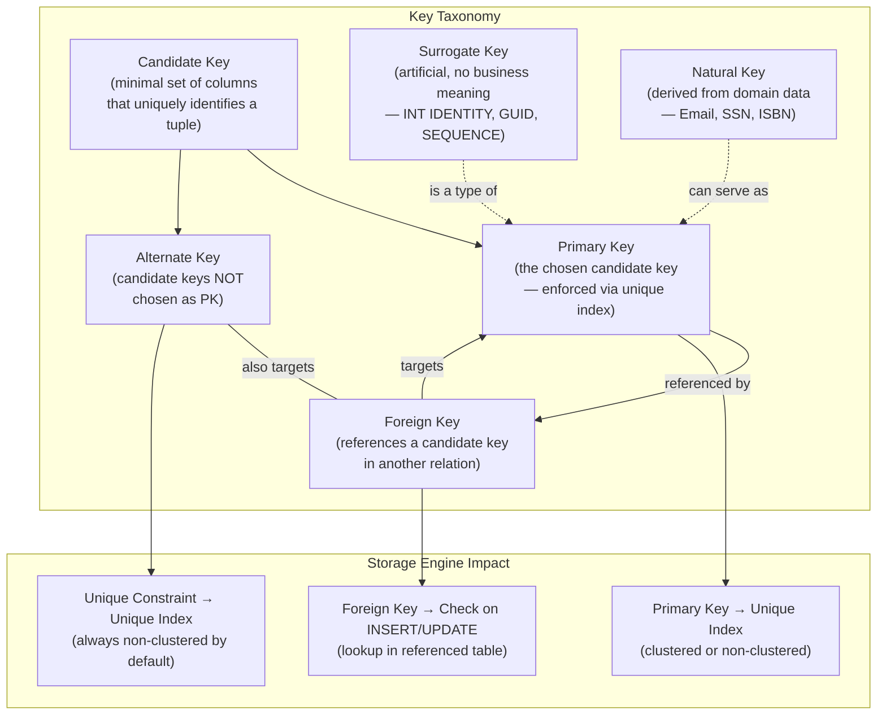

## Navigation

**Domain:** [[8 — Databases]] > **Group:** Relational Fundamentals
**Previous:** [[8.001 — The Relational Model — Relations, Tuples, Attributes]] | **Next:** [[8.003 — Referential Integrity — Cascade Behaviors]]

### Prerequisites

- [[8.001 — The Relational Model — Relations, Tuples, Attributes]] — defines the relation, tuple, and attribute vocabulary that keys enforce; without that foundation "a key uniquely identifies a tuple" has no precise meaning.

### Where This Fits

Keys are the enforcement mechanism of the relational model — they are what turns a bag of rows into a set of tuples. A primary key guarantees every row is uniquely addressable; a foreign key guarantees that relationships between tables mean something; a candidate key represents every alternative way to uniquely identify a tuple; and the choice between surrogate and natural keys is a recurring production debate that has burned teams with UUID fragmentation, sequential bottlenecking, and natural-key-rotation nightmares. A .NET backend engineer encounters keys in every `DbSet<T>` mapping, every `HasForeignKey()` call, every `UniqueConstraint` in EF Core migrations, and every `ON DELETE CASCADE` decision that can lock a table for hours during a bulk delete. In interviews, key questions test whether you understand the storage engine implications of your key choices — "why not make every primary key a GUID?" is asked at every senior level.

---

## Core Mental Model

A **key** is a set of columns whose values uniquely identify a tuple in a relation. The relational model distinguishes five roles: **primary key** (the one chosen canonical identifier), **candidate key** (every set of columns that *could* be the primary key — all minimal uniqueness constraints), **foreign key** (a column set in one relation that references a candidate key of another, enforcing referential integrity), **surrogate key** (an artificial, system-generated key with no business meaning — an `INT IDENTITY` or `GUID`), and **natural key** (a key derived from the domain — `SocialSecurityNumber`, `Email`, `ISBN`). The invariant: every tuple must have at least one candidate key; the primary key is the one you choose; every other relation that needs to reference this tuple does so via a foreign key that targets the referenced relation's primary key by convention.

### Classification

**For architecture topics:** Keys live in the relational-model layer above the storage engine and below the application ORM. The engine enforces them via unique indexes — every primary key or unique constraint creates a B-tree (unique index) that the engine maintainers on every write. A clustered primary key determines the physical sort order of the entire table. A non-clustered primary key stores the key values in a separate B-tree with row pointers. The abstraction leak: EF Core's conventions discover keys by naming — a property named `Id` or `{EntityName}Id` is automatically the primary key — and silently renaming it without updating the configuration breaks the mapping at runtime.



### Key Properties

|Property|Value|Notes|
|---|---|---|
|Uniqueness Enforcement|Unique index (B-tree) — O(log n) per INSERT/UPDATE||
|Time Complexity (PK lookup)|O(log n) via clustered or non-clustered index seek||
|Time Complexity (FK check)|O(log n) — engine probes the referenced table's index for the foreign key value||
|Write Cost|+1 B-tree modification per unique index per write operation||
|SARGable|Yes — direct equality on a key column is always SARGable|The optimizer can seek on any key column as a leading index column|
|Clustering Impact|A clustered PK defines the physical row order|See [[8.019 — Table Heap vs Clustered Table]]|
|NULL in Keys|Primary key columns must be NOT NULL; candidate key columns can be NULL per ANSI, but SQL Server enforces UNIQUE allows one NULL; see [[8.008 — NULL — Three-Valued Logic and Implications]]||

---

## Deep Mechanics

### How the Engine Executes This

**Primary key enforcement:**
1. **DDL phase** — `CREATE TABLE ... PRIMARY KEY` creates a unique index. If no clustered index exists, SQL Server makes this index clustered by default — the entire table becomes a B-tree ordered by the key columns, with leaf pages containing all columns.
2. **INSERT** — the engine traverses the unique index B-tree from root to leaf (typically 3–4 page reads for millions of rows). If it finds an existing entry with the same key value, it returns primary key violation error 2627 and rolls back the insert.
3. **UPDATE** — if a key column is updated, the engine must logically delete the old key entry and insert the new one, updating both the index and the clustered data page.
4. **FK check on INSERT/UPDATE** — the engine probes the referenced table's unique index for the foreign key value. If not found, error 547.

**Surrogate key generation:**
- `INT IDENTITY(1,1)` — the engine allocates ranges from the current identity value using a system-level counter. Each insert increments, but gaps appear on rollback or server restart (SQL Server avoids double-allocation by not caching across restarts).
- `SEQUENCE` (SQL Server 2012+) — a schema-scoped, cacheable counter independent of any table. Can be shared across tables. More flexible than IDENTITY but requires explicit `NEXT VALUE FOR` in INSERT statements.
- `NEWID()` / `NEWSEQUENTIALID()` — GUID generation. `NEWID()` produces random GUIDs causing index fragmentation. `NEWSEQUENTIALID()` (only usable as a column default) produces ordered GUIDs, reducing page splits.
- PostgreSQL `SERIAL` / `IDENTITY` / `uuid_generate_v4()` — equivalent mechanisms.

**Natural key considerations:**
The engine treats the natural key column identically to any key — it builds the same unique B-tree. The difference is at the application level: natural keys have business meaning, so they may change (customer changes their email), may be large (VARCHAR(255) instead of INT), and may be exposed to users in URLs, raising security and UX concerns.

### SQL Visibility

```sql
-- Primary key (clustered by default — the table IS the B-tree)
CREATE TABLE Customers (
    CustomerId INT IDENTITY(1,1) PRIMARY KEY,   -- surrogate PK
    Email NVARCHAR(200) NOT NULL,
    CompanyName NVARCHAR(200) NOT NULL,
    -- natural candidate key enforced separately
    CONSTRAINT UQ_Customers_Email UNIQUE (Email)
);

-- Foreign key referencing the primary key
CREATE TABLE Orders (
    OrderId INT IDENTITY(1,1) PRIMARY KEY,
    CustomerId INT NOT NULL,
    OrderDate DATETIME2 NOT NULL DEFAULT SYSUTCDATETIME(),
    CONSTRAINT FK_Orders_Customers
        FOREIGN KEY (CustomerId) REFERENCES Customers(CustomerId)
);

-- Composite primary key (natural key)
CREATE TABLE OrderItems (
    OrderId INT NOT NULL,
    ProductId INT NOT NULL,
    Quantity INT NOT NULL,
    UnitPrice DECIMAL(12,2) NOT NULL,
    CONSTRAINT PK_OrderItems PRIMARY KEY (OrderId, ProductId),
    CONSTRAINT FK_OrderItems_Orders
        FOREIGN KEY (OrderId) REFERENCES Orders(OrderId),
    CONSTRAINT FK_OrderItems_Products
        FOREIGN KEY (ProductId) REFERENCES Products(ProductId)
);

-- Query that uses the PK for a seek
SELECT o.OrderId, o.OrderDate, c.CompanyName
FROM Orders o
INNER JOIN Customers c ON o.CustomerId = c.CustomerId
WHERE o.OrderId = 728193;
```

```csharp
// EF Core equivalent
public class ApplicationDbContext : DbContext
{
    public DbSet<Customer> Customers => Set<Customer>();
    public DbSet<Order> Orders => Set<Order>();
    public DbSet<OrderItem> OrderItems => Set<OrderItem>();

    protected override void OnModelCreating(ModelBuilder modelBuilder)
    {
        modelBuilder.Entity<Customer>(entity =>
        {
            entity.HasKey(c => c.CustomerId);                     // PK
            entity.HasIndex(c => c.Email).IsUnique();              // candidate key
        });

        modelBuilder.Entity<Order>(entity =>
        {
            entity.HasKey(o => o.OrderId);
            entity.HasOne<Customer>()
                  .WithMany(c => c.Orders)
                  .HasForeignKey(o => o.CustomerId);               // FK
        });

        modelBuilder.Entity<OrderItem>(entity =>
        {
            entity.HasKey(oi => new { oi.OrderId, oi.ProductId }); // composite PK
            entity.HasOne<Order>().WithMany()
                  .HasForeignKey(oi => oi.OrderId);
            entity.HasOne<Product>().WithMany()
                  .HasForeignKey(oi => oi.ProductId);
        });
    }
}

public async Task<Order?> GetOrderAsync(
    int orderId,
    CancellationToken cancellationToken = default)
{
    return await _dbContext.Orders
        .Include(o => o.Customer)
        .FirstOrDefaultAsync(o => o.OrderId == orderId, cancellationToken);
}
```

**Generated SQL (from EF Core logs):**

```sql
SELECT TOP(1) [o].[OrderId], [o].[OrderDate], [o].[CustomerId],
       [c].[CustomerId], [c].[CompanyName], [c].[Email]
FROM [Orders] AS [o]
INNER JOIN [Customers] AS [c] ON [o].[CustomerId] = [c].[CustomerId]
WHERE [o].[OrderId] = @__orderId_0
```

### Execution Plan Analysis

For a key-based lookup (`WHERE OrderId = 728193`) on a clustered primary key:

```
Expected plan shape:
[Clustered Index Seek on PK_Orders] → [Nested Loops (Inner Join)] → 
    [Clustered Index Seek on PK_Customers] → [SELECT]
Estimated Cost: Clustered Index Seek ~1–2% (estimated rows = 1)
Logical Reads: ~3–4 per index seek (root + intermediate + leaf data page)
```

Because the primary key is clustered, the key lookup is a single B-tree traversal — the leaf pages **are** the data pages, so no additional key lookup is needed. Without the clustered index (heap table), the plan would include a `RID Lookup` operator after the non-clustered index seek to fetch the full row from the heap — that is the extra cost of a heap vs clustered table (see [[8.019 — Table Heap vs Clustered Table]]).

### Cost Visibility

```sql
SET STATISTICS IO ON;
SET STATISTICS TIME ON;

SELECT o.OrderId, o.OrderDate
FROM Orders o
WHERE o.OrderId = 728193;

-- Expected output (Orders table ~1M rows, clustered PK on OrderId):
-- Table 'Orders'. Scan count 0, logical reads 3, physical reads 0
-- SQL Server Execution Times: CPU time = 0ms, elapsed time = 0ms

-- Now compare: lookup by non-key column (no index)
SELECT o.OrderId, o.OrderDate
FROM Orders o
WHERE o.OrderDate = '2026-06-01';

-- Expected output:
-- Table 'Orders'. Scan count 1, logical reads 12,450, physical reads 0
-- SQL Server Execution Times: CPU time = 48ms, elapsed time = 52ms
```

### Failure Modes

**Primary key violation on concurrent insert:** Two sessions insert the same natural key simultaneously. The check happens at the unique index — the second insert hits error 2627. In .NET this surfaces as a `DbUpdateException` wrapping a `SqlException` with Number 2627. Application code must handle this gracefully with retry or "already exists" logic rather than crashing.

**Foreign key violation on delete:** `DELETE FROM Customers WHERE CustomerId = 5` is blocked by the engine because `Orders` has rows referencing `CustomerId = 5`. Error 547 is returned. The response is either (a) delete child rows first, (b) use `ON DELETE CASCADE`, or (c) use soft deletes. Cascading deletes can themselves fail or escalate locks — see [[8.003 — Referential Integrity — Cascade Behaviors]] for the tradeoffs.

**GUID fragmentation:** Using `NEWID()` as a clustered primary key causes page splits on every insert because random GUIDs do not sort sequentially, fragmenting the clustered index and wasting space.

```sql
-- Detect index fragmentation from a poor key choice
SELECT s.name AS SchemaName, t.name AS TableName,
       i.name AS IndexName, ips.avg_fragmentation_in_percent
FROM sys.dm_db_index_physical_stats(
    DB_ID(), NULL, NULL, NULL, 'LIMITED') ips
INNER JOIN sys.indexes i ON ips.object_id = i.object_id
    AND ips.index_id = i.index_id
INNER JOIN sys.tables t ON i.object_id = t.object_id
INNER JOIN sys.schemas s ON t.schema_id = s.schema_id
WHERE ips.avg_fragmentation_in_percent > 30
ORDER BY ips.avg_fragmentation_in_percent DESC;
```

---

## Production Patterns and Implementation

### Primary SQL Implementation

```sql
-- Complete schema demonstrating all key types
CREATE TABLE Products (
    ProductId INT IDENTITY(1,1) PRIMARY KEY,          -- surrogate PK
    SKU NVARCHAR(50) NOT NULL,                        -- natural candidate key
    ProductName NVARCHAR(200) NOT NULL,
    CategoryId INT NOT NULL,
    UnitPrice DECIMAL(12,2) NOT NULL,
    CreatedAt DATETIME2 NOT NULL DEFAULT SYSUTCDATETIME(),
    
    CONSTRAINT UQ_Products_SKU UNIQUE (SKU),           -- alternate key
    CONSTRAINT FK_Products_Categories
        FOREIGN KEY (CategoryId) REFERENCES Categories(CategoryId)
);

CREATE TABLE Categories (
    CategoryId INT IDENTITY(1,1) PRIMARY KEY,
    CategoryName NVARCHAR(100) NOT NULL,
    CONSTRAINT UQ_Categories_Name UNIQUE (CategoryName)  -- natural alternate key
);

-- Demonstrate key-based access patterns
-- SARGable — uses PK index seek
SELECT ProductId, ProductName, UnitPrice
FROM Products
WHERE ProductId = 4821;

-- SARGable — uses the unique index on SKU
SELECT ProductId, ProductName, UnitPrice
FROM Products
WHERE SKU = 'SKU-ACME-004821';

-- SARGable — composite key seek on compound PK
SELECT oi.OrderId, oi.ProductId, oi.Quantity
FROM OrderItems oi
WHERE oi.OrderId = 728193 AND oi.ProductId = 4821;

-- Non-SARGable — function wrapping the key column defeats the index
SELECT ProductId, ProductName
FROM Products
WHERE UPPER(SKU) = 'SKU-ACME-004821';   -- ❌ non-SARGable
```

### EF Core Implementation

```csharp
// Entity classes
public class Product
{
    public int ProductId { get; set; }                          // surrogate PK
    public string SKU { get; set; } = string.Empty;             // natural key
    public string ProductName { get; set; } = string.Empty;
    public int CategoryId { get; set; }
    public decimal UnitPrice { get; set; }
    public DateTime CreatedAt { get; set; }
    
    public Category Category { get; set; } = null!;
}

public class Category
{
    public int CategoryId { get; set; }
    public string CategoryName { get; set; } = string.Empty;
    public ICollection<Product> Products { get; set; } = new List<Product>();
}

// DbContext configuration
protected override void OnModelCreating(ModelBuilder modelBuilder)
{
    modelBuilder.Entity<Product>(entity =>
    {
        entity.HasKey(p => p.ProductId);
        entity.HasIndex(p => p.SKU).IsUnique();                      // natural key
        entity.Property(p => p.SKU).HasMaxLength(50).IsRequired();
        entity.Property(p => p.ProductName).HasMaxLength(200).IsRequired();
        entity.Property(p => p.UnitPrice).HasColumnType("decimal(12,2)");
        entity.HasOne(p => p.Category)
              .WithMany(c => c.Products)
              .HasForeignKey(p => p.CategoryId);                     // FK
    });

    modelBuilder.Entity<Category>(entity =>
    {
        entity.HasKey(c => c.CategoryId);
        entity.HasIndex(c => c.CategoryName).IsUnique();             // natural key
        entity.Property(c => c.CategoryName).HasMaxLength(100).IsRequired();
    });
}

// Repository method
public async Task<Product?> GetBySkuAsync(
    string sku,
    CancellationToken cancellationToken = default)
{
    // SARGable — EF Core generates a parameterized equality predicate
    return await _dbContext.Products
        .Include(p => p.Category)
        .FirstOrDefaultAsync(p => p.SKU == sku, cancellationToken);
}

// Handling key violations
public async Task<Either<Product, ProductAlreadyExists>> CreateProductAsync(
    Product product,
    CancellationToken cancellationToken = default)
{
    _dbContext.Products.Add(product);
    try
    {
        await _dbContext.SaveChangesAsync(cancellationToken);
        return Either<Product, ProductAlreadyExists>.Left(product);
    }
    catch (DbUpdateException ex)
        when (ex.InnerException is SqlException { Number: 2601 or 2627 })
    {
        // 2601 = unique constraint violation, 2627 = primary key violation
        return Either<Product, ProductAlreadyExists>.Right(
            new ProductAlreadyExists(product.SKU));
    }
}
```

### Dapper Implementation

```csharp
public async Task<Product?> GetBySkuAsync(
    string sku,
    CancellationToken cancellationToken = default)
{
    const string sql = @"
        SELECT p.ProductId, p.SKU, p.ProductName, p.UnitPrice, p.CreatedAt,
               c.CategoryId, c.CategoryName
        FROM Products p
        INNER JOIN Categories c ON p.CategoryId = c.CategoryId
        WHERE p.SKU = @SKU";    -- parameterized — SARGable

    await using var connection = _connectionFactory.Create();
    var product = await connection.QueryAsync<Product, Category, Product>(
        new CommandDefinition(sql, new { SKU = sku },
            cancellationToken: cancellationToken),
        (product, category) =>
        {
            product.Category = category;
            return product;
        },
        splitOn: "CategoryId");

    return product.FirstOrDefault();
}

// Insert with error handling
public async Task<int> CreateProductAsync(
    Product product,
    CancellationToken cancellationToken = default)
{
    const string sql = @"
        INSERT INTO Products (SKU, ProductName, CategoryId, UnitPrice)
        OUTPUT INSERTED.ProductId
        VALUES (@SKU, @ProductName, @CategoryId, @UnitPrice)";

    await using var connection = _connectionFactory.Create();
    try
    {
        var productId = await connection.ExecuteScalarAsync<int>(
            new CommandDefinition(sql, product, cancellationToken: cancellationToken));
        return productId;
    }
    catch (SqlException ex) when (ex.Number is 2601 or 2627)
    {
        throw new ProductAlreadyExistsException(product.SKU, ex);
    }
}
```

### Configuration and Wiring

```csharp
// Program.cs
builder.Services.AddDbContext<ApplicationDbContext>(options =>
    options.UseSqlServer(
        builder.Configuration.GetConnectionString("Default"),
        sqlOptions =>
        {
            sqlOptions.EnableRetryOnFailure(3);
            sqlOptions.UseQuerySplittingBehavior(QuerySplittingBehavior.SplitQuery);
        }));

builder.Services.AddSingleton<IDbConnectionFactory>(
    new SqlConnectionFactory(
        builder.Configuration.GetConnectionString("Default")!));
```

### SQL Server vs PostgreSQL Differences

```sql
-- PostgreSQL identity column (SQL-standard syntax, preferred over SERIAL)
CREATE TABLE products (
    product_id INT GENERATED ALWAYS AS IDENTITY PRIMARY KEY,
    sku VARCHAR(50) NOT NULL UNIQUE,
    product_name VARCHAR(200) NOT NULL,
    category_id INT NOT NULL REFERENCES categories(category_id),
    unit_price NUMERIC(12,2) NOT NULL,
    created_at TIMESTAMPTZ NOT NULL DEFAULT NOW()
);

-- PostgreSQL UUID primary key (with pgcrypto extension for uuid_generate_v4())
CREATE EXTENSION IF NOT EXISTS pgcrypto;

CREATE TABLE user_sessions (
    session_id UUID DEFAULT gen_random_uuid() PRIMARY KEY,
    user_id INT NOT NULL REFERENCES user_accounts(user_id),
    created_at TIMESTAMPTZ NOT NULL DEFAULT NOW()
);

-- PostgreSQL sequence (equivalent to SQL Server SEQUENCE)
CREATE SEQUENCE global_order_number_seq START 1000000;
CREATE TABLE orders (
    order_number INT DEFAULT NEXTVAL('global_order_number_seq') PRIMARY KEY,
    customer_id INT NOT NULL,
    order_date TIMESTAMPTZ NOT NULL DEFAULT NOW()
);

-- Key difference: PostgreSQL UNIQUE allows multiple NULLs for the same column
-- SQL Server UNIQUE allows only one NULL
-- See [[8.008 — NULL — Three-Valued Logic and Implications]]
```

---

## Gotchas and Production Pitfalls

### GUID Clustered Primary Key

**Pitfall:** Using `NEWID()` as the clustered primary key because "GUIDs are globally unique and we shard later."

```sql
-- ❌ Random GUID clustered key — causes page splits on every insert
CREATE TABLE Orders (
    OrderId UNIQUEIDENTIFIER DEFAULT NEWID() PRIMARY KEY,
    CustomerId INT NOT NULL,
    OrderDate DATETIME2 NOT NULL
);
```

**Symptom:** Clustered index fragmentation exceeding 90% within hours on a table with moderate insert volume. The clustered index requires 1.5x–2x the storage of the data because every insert goes to a random page instead of the end of the index. Page splits slow inserts by 3–5x and fragment the index, making scans 10x more expensive.

**Fix:**

```sql
-- ✅ Surrogate INT IDENTITY (sequential) or NEWSEQUENTIALID() if GUID required
CREATE TABLE Orders (
    OrderId INT IDENTITY(1,1) PRIMARY KEY,
    ...
);

-- Or if GUID is truly required (distributed system):
CREATE TABLE Orders (
    OrderId UNIQUEIDENTIFIER DEFAULT NEWSEQUENTIALID() PRIMARY KEY,
    ...
);
```

**Cost of not fixing:** At 500K inserts/day, the clustered index fragments to 95% within a week, overnight index rebuilds take 45+ minutes locking the table, and page-split-induced deadlocks appear under concurrent load. See [[8.018 — Table Heap vs Clustered Table]] for why clustering matters.

### Natural Key That Changes

**Pitfall:** Using a mutable natural key (Email, Username) as the primary key.

```sql
-- ❌ Natural key as PK — what happens when the customer changes email?
CREATE TABLE Customers (
    Email NVARCHAR(200) PRIMARY KEY,
    CompanyName NVARCHAR(200) NOT NULL
);

-- All FK references cascade or break
CREATE TABLE Orders (
    OrderId INT IDENTITY(1,1) PRIMARY KEY,
    CustomerEmail NVARCHAR(200) NOT NULL
        REFERENCES Customers(Email) ON UPDATE CASCADE
);
```

**Symptom:** Changing a customer's email requires updating the PK AND all FK references in every related table — millions of row modifications for a single email change. `ON UPDATE CASCADE` propagates the change but locks all affected tables and generates massive transaction log growth. If cascade is not configured, the update is blocked by FK violation.

**Fix:**

```sql
-- ✅ Surrogate PK, natural key has a unique constraint
CREATE TABLE Customers (
    CustomerId INT IDENTITY(1,1) PRIMARY KEY,
    Email NVARCHAR(200) NOT NULL,
    CompanyName NVARCHAR(200) NOT NULL,
    CONSTRAINT UQ_Customers_Email UNIQUE (Email)
);
-- Now changing email updates a single row with no cascade
```

**Cost of not fixing:** A user email change (common — corporate acquisitions, rebranding) requires hours of maintenance window and can fail partway through, leaving the database in an inconsistent state that requires manual reconciliation.

### Implicit Conversion in FK/Join Columns

**Pitfall:** Foreign key columns with mismatched data types — `INT` in the PK table and `VARCHAR` or `BIGINT` in the referencing table.

```sql
-- ❌ Type mismatch between PK (INT) and FK (VARCHAR)
CREATE TABLE Products (ProductId INT PRIMARY KEY, ...);
CREATE TABLE OrderItems (
    OrderItemId INT PRIMARY KEY,
    ProductId VARCHAR(20) NOT NULL,          -- should be INT
    FOREIGN KEY (ProductId) REFERENCES Products(ProductId)
);
```

**Symptom:** Every join between `OrderItems` and `Products` triggers an implicit conversion on the `VARCHAR` column — the optimizer must convert every `ProductId` value in `OrderItems` to `INT` before probing the `Products` index. This is non-SARGable and causes a full index/table scan. `SET STATISTICS IO` shows massive logical reads; the execution plan shows a `CONVERT_IMPLICIT` warning on the join predicate.

**Fix:**

```sql
-- ✅ Matching data types
ALTER TABLE OrderItems ALTER COLUMN ProductId INT NOT NULL;
```

**Cost of not fixing:** At 10M rows in `OrderItems`, every join scanning 10M rows and converting each one adds 200–500ms per query. With 50 queries/second, this saturates CPU and pushes query latency above the application timeout.

### Surrogate Key Visibility in Business Logic

**Pitfall:** Exposing the surrogate primary key as a business identifier in URLs, APIs, or customer-facing references without considering the implications.

```csharp
// ❌ Exposing sequential surrogate key in URL
[HttpGet("orders/{orderId:int}")]
public async Task<IActionResult> GetOrder(int orderId) { ... }
// https://example.com/orders/4821 — competitors can guess order volume
// https://example.com/orders/4822 — incrementing ID exposes business intelligence
```

**Symptom:** A competitor scrapes the website and infers daily order volume from the incrementing `OrderId` values. Or a security researcher demonstrates that incrementing IDs allow enumeration of all orders.

**Fix:**

```csharp
// ✅ Expose a public identifier (ULID, UUIDv7, or hashid) separate from the PK
public class Order
{
    public int OrderId { get; set; }              // internal surrogate PK
    public string OrderNumber { get; set; } =     // public-facing identifier
        Ulid.NewUlid().ToString();                // ULID — globally unique, sortable
}

// Or use UUIDv7 as the PK directly if the scale justifies it
// See [[7.016 — Distributed Unique ID Generation — Snowflake, ULID, UUIDv7]]
```

**Cost of not fixing:** Direct enumeration attack leaking business metrics — or a production incident where a customer's `OrderId` is accepted as proof of purchase in a different customer's support ticket, because the sequential ID is guessable.

### Running Out of Identity Values

**Pitfall:** Using `INT` IDENTITY without considering growth rate and reaching the 2.1 billion limit.

```sql
-- ❌ INT IDENTITY on a high-volume table
CREATE TABLE AuditLog (
    AuditLogId INT IDENTITY(1,1) PRIMARY KEY,
    EventType NVARCHAR(50) NOT NULL,
    EventData NVARCHAR(MAX) NOT NULL,
    CreatedAt DATETIME2 NOT NULL DEFAULT SYSUTCDATETIME()
);
-- 500M rows/year → identity exhausted in ~4 years
```

**Symptom:** `INSERT` fails with "Arithmetic overflow error converting IDENTITY to data type int" — error 8119 at the engine level, surfaced as a `SqlException` in .NET. The table becomes read-only until a schema change.

**Fix:**

```sql
-- ✅ Use BIGINT IDENTITY for high-volume tables
ALTER TABLE AuditLog ALTER COLUMN AuditLogId BIGINT;
-- IMPORTANT: ALTER COLUMN on an IDENTITY column requires rebuilding — 
-- in production this means a maintenance window and potentially 
-- creating a new table and switching.

-- Better: design from the start
CREATE TABLE AuditLog (
    AuditLogId BIGINT IDENTITY(1,1) PRIMARY KEY,
    ...
);
```

**Cost of not fixing:** Application-wide outage when the identity counter wraps. Recovery requires creating a new table with `BIGINT IDENTITY`, copying data, and switching — a multi-hour production event. At 1M rows/hour, even `INT` lasts only ~7 years, but the fix is far more expensive in production than planning ahead.

---

## Performance Implications

### Benchmark: Before and After

```sql
-- Baseline: GUID clustered PK with 85% fragmentation
SET STATISTICS IO ON;
SELECT OrderId, CustomerId, OrderDate
FROM Orders_Guid
WHERE OrderId = 'E7B2A1C4-3F8D-4A61-9C5E-0B1A2D3F4E5C';
-- Table 'Orders_Guid'. Scan count 0, logical reads 12

-- Optimized: INT IDENTITY clustered PK
SELECT OrderId, CustomerId, OrderDate
FROM Orders_Int
WHERE OrderId = 728193;
-- Table 'Orders_Int'. Scan count 0, logical reads 3
```

**Improvement:** 4x reduction in logical reads for a single row lookup (12 → 3) due to the GUID cluster requiring more page reads to navigate the fragmented B-tree.

### BenchmarkDotNet

```csharp
[MemoryDiagnoser]
[SimpleJob(RuntimeMoniker.Net90)]
public class PkTypeBenchmark
{
    private IDbConnection _connection = default!;

    [GlobalSetup]
    public void Setup()
    {
        _connection = new SqlConnection(TestConnectionString);
        // seed 1M rows into both Orders_Int (INT IDENTITY PK) 
        // and Orders_Guid (NEWID() PK, no rebuild)
    }

    [Benchmark(Baseline = true)]
    public async Task<Order?> Lookup_ByIntPk()
    {
        const string sql = "SELECT OrderId, CustomerId, OrderDate FROM Orders_Int WHERE OrderId = 728193";
        return await _connection.QueryFirstOrDefaultAsync<Order>(sql);
    }

    [Benchmark]
    public async Task<Order?> Lookup_ByGuidPk()
    {
        const string sql = "SELECT OrderId, CustomerId, OrderDate FROM Orders_Guid WHERE OrderId = 'E7B2A1C4-3F8D-4A61-9C5E-0B1A2D3F4E5C'";
        return await _connection.QueryFirstOrDefaultAsync<Order>(sql);
    }

    [Benchmark]
    public async Task<int> Insert_IntPk()
    {
        const string sql = "INSERT INTO Orders_Int (CustomerId, OrderDate) OUTPUT INSERTED.OrderId VALUES (4821, SYSUTCDATETIME())";
        return await _connection.ExecuteScalarAsync<int>(sql);
    }

    [Benchmark]
    public async Task<Guid> Insert_GuidPk()
    {
        const string sql = "INSERT INTO Orders_Guid (CustomerId, OrderDate) OUTPUT INSERTED.OrderId VALUES (4821, SYSUTCDATETIME())";
        return await _connection.ExecuteScalarAsync<Guid>(sql);
    }
}
```

**Expected results (approximate, SQL Server 2022, NVMe, 1M rows, GUID table 85% fragmented):**

|Method|Mean|Logical Reads|Allocated|
|---|---|---|---|
|Lookup_ByIntPk|~0.12 ms|~3|0.5 KB|
|Lookup_ByGuidPk|~0.45 ms|~12|0.8 KB|
|Insert_IntPk|~0.35 ms|~9|0.6 KB|
|Insert_GuidPk|~1.8 ms|~28|1.2 KB|

### Write Amplification

For a table with a clustered primary key and 3 non-clustered indexes (including unique constraints):

|Operation|Without PK|With INT Clustered PK|With GUID Clustered PK (fragmented)|
|---|---|---|---|
|INSERT 1 row|~1 page write (heap)|~1 page write (B-tree leaf) + 3 non-clustered index writes|~1 page write + page split (~2 writes) + 3 non-clustered writes|
|UPDATE PK column|N/A (no PK)|~1 data page + 1 index page (delete/insert on clustered index) + 3 non-clustered index updates|Same as INT but on a more fragmented tree|
|DELETE 1 row|~1 page write|~1 data page + 3 non-clustered index deletes|Same as INT but more page reads to locate|

**Key insight:** Each unique index beyond the PK adds a full B-tree modification per write. For a table with 5 unique constraints, every INSERT performs 6 B-tree operations (1 clustered + 5 non-clustered). This is the write cost of key enforcement.

---

## Interview Arsenal

### Question Bank

1. What is the difference between a primary key and a candidate key? Can a table have multiple candidate keys?
2. How does SQL Server enforce a primary key internally — what data structure, what happens on INSERT, and what error do you see on violation?
3. What are the performance implications of using a GUID vs INT as a clustered primary key at 10M rows?
4. What goes wrong when a natural key used as the primary key changes in production?
5. Surrogate key vs natural key — when would you choose each, and what specific problems does each avoid?
6. How does a foreign key constraint affect INSERT performance on the referencing table and DELETE performance on the referenced table?
7. What happens at the storage engine level when you insert a row into a table with a clustered GUID primary key?
8. How does EF Core discover primary keys by convention, and what happens when convention-based key discovery fails?

### Spoken Answers

**Q: What is the difference between a primary key and a candidate key?**

> **Average answer:** "A primary key is the main key that identifies a row. A candidate key is also a unique identifier but not chosen as the primary." This is technically correct but reveals no understanding of the relational model's key theory.

> **Great answer:** "A candidate key is any minimal set of attributes that uniquely identifies a tuple in a relation. 'Minimal' means you can't remove any column from it and still have uniqueness. For a Customers table, `CustomerId` might be one candidate key and `Email` might be another — both satisfy uniqueness and minimality. The primary key is simply the one candidate key you choose as the canonical identifier, usually because it's narrower (INT vs VARCHAR), never changes (surrogate), or matches the most common access pattern. The other candidate keys become alternate keys, enforced with UNIQUE constraints. The reason this distinction matters in production: if you only model the primary key and skip the UNIQUE constraint on the natural candidate key (like Email), you've created a table where the relational model's uniqueness requirement for that attribute is not enforced by the engine — and duplicate emails will silently appear the first time two concurrent 'check if exists' operations race past each other."

**Q: Surrogate key vs natural key — when would you choose each?**

> **Average answer:** "Always use surrogate keys because natural keys change." Correct but misses the nuanced production tradeoffs.

> **Great answer:** "I default to a surrogate key — an `INT IDENTITY` or `BIGINT IDENTITY` — for every table, because it decouples the physical identity of the row from any business meaning, and that decoupling eliminates cascading update problems, reduces index width (a 4-byte INT is much narrower than any natural string key), and makes foreign keys cheap. But I still enforce natural candidate keys with UNIQUE constraints — Email on Users, SKU on Products — because that's where the real-world uniqueness guarantee lives. I choose a natural key as the primary key only in very specific cases: dimension tables with a small, stable set of values where the natural key is meaningful to business users (like ISO country codes — 'US', 'DE', 'JP' — which are 2 bytes, never change, and make queries readable without joins), or in a reporting/data warehouse context where the natural key is the same key used across source systems. The trap people fall into is using a natural key that seems stable (Email, Username) but later changes — and by then it's the PK with 15 FK references, and a single email change requires updating millions of rows across a dozen tables."

**Q: What are the performance implications of using a GUID vs INT as a clustered primary key at 10M rows?**

> **Average answer:** "GUIDs are larger and slower." True but lacks specificity on what breaks.

> **Great answer:** "The clustered primary key determines the physical sort order of the entire table. With `NEWID()` — random GUIDs — every INSERT goes to a random page in the B-tree rather than the end, causing page splits. A page split splits a full page into two 50% full pages, which fragments the index, wastes ~50% storage, and makes scans read twice as many pages. At 10M rows with 95% fragmentation, a clustered index scan reads ~180,000 pages instead of ~90,000. Insert throughput drops 3–5x because each split acquires additional locks and writes more log. `NEWSEQUENTIALID()` mitigates this by generating ordered GUIDs, but the key is still 16 bytes vs INT's 4 bytes — that makes every non-clustered index wider by 12 bytes per row because the clustered key is included in every non-clustered index as the row locator. For a table with 10 non-clustered indexes, that's 120 extra bytes per row written. At 10M rows, that's 1.2 GB of additional index storage and proportionally more memory pressure on the buffer pool."

### Interview Trigger

Key questions surface in two common interview contexts. First, during a schema design question: "Design a database for an e-commerce platform" — the interviewer watches whether you name the PK strategy (surrogate vs natural) unprompted, whether you add UNIQUE constraints for natural keys, and whether you consider the write pattern when choosing the clustered key. Second, during a performance troubleshooting question: "A table that receives 500K inserts/hour has 90% index fragmentation" — the interviewer is testing whether you can trace the fragmention back to a poor clustered key choice (random GUID) rather than jumping to index maintenance. The follow-up that separates junior from senior: "We need globally unique identifiers for distributed inserts — how do you solve this without the fragmentation?" The senior answer names `NEWSEQUENTIALID()`, UUIDv7 (time-ordered UUIDs), or a distributed sequence like a Snowflake-style ID.

### Comparison Table

| | Surrogate Key (INT IDENTITY) | Natural Key (Email/VARCHAR) | GUID (NEWID) |
|---|---|---|---|
| What it does | System-generated sequential integer | Business-meaningful unique value | Globally unique random value |
| Performance profile | Fastest — narrow (4B), sequential, no page splits | Wide — slower joins and indexes; depends on string length | Fragmentation at scale — page splits, wider indexes |
| Write cost | ~1 B-tree insert + page append | ~1 B-tree insert + comparisons on string data | ~1 B-tree insert + page split overhead |
| .NET implementation | `int Id` — EF Core convention discovers it | `string Email` — must configure via `HasIndex().IsUnique()` | `Guid Id` — convention works, but add `HasDefaultValueSql("NEWSEQUENTIALID()")` |
| When to choose | Default — almost always | Dimension/lookup tables with stable, small values | Distributed systems where centralized identity is unavailable |

---

## Decision Framework

### When to Apply

```mermaid
flowchart TD
    A[Modeling a table —<br/>what key strategy?] --> B{Does a stable,<br/>narrow natural<br/>key exist?}
    B -->|Yes — e.g. ISO code,<br/>ISBN, immutable domain value| C[Use natural key as PK<br/>— it's the cheapest and<br/>most meaningful access path]
    B -->|No — Email changes,<br/>Username changes,<br/>no obvious natural key| D{Is this a high-volume<br/>distributed insert?}
    D -->|No — standard OLTP| E[Surrogate INT IDENTITY PK<br/>+ UNIQUE constraints<br/>on natural candidates]
    D -->|Yes — 10K+ inserts/sec<br/>across multiple nodes| F{Do we need globally<br/>unique IDs without<br/>a central sequencer?}
    F -->|Yes| G[Time-ordered UUID<br/>(UUIDv7, ULID) or<br/>distributed ID service]
    F -->|No — can use SEQUENCE</br>with caching| H[BIGINT SEQUENCE with<br/>large cache per node]
    E --> I[Apply UNIQUE constraints<br/>to every natural candidate<br/>key — Email, SKU, etc.]
```

### Application Checklist

- [ ] The primary key is the narrowest stable unique value available — default to `INT IDENTITY` unless justified otherwise
- [ ] Every natural candidate key has an explicit UNIQUE constraint — no duplicates will appear from race conditions
- [ ] Foreign keys reference the referenced table's primary key (or a candidate key with UNIQUE constraint)
- [ ] Data types match exactly between PK and FK columns — no implicit conversion
- [ ] The clustered PK choice accounts for insert pattern — sequential keys for high-volume inserts
- [ ] Surrogate PKs are not exposed as business identifiers in APIs/URLs without obfuscation (hashids, ULID)
- [ ] Identity range is sized appropriately — `BIGINT` for tables exceeding 100M expected rows
- [ ] EF Core `OnModelCreating` explicitly configures keys — never relies silently on conventions for production entities

### Tradeoff Summary

|What You Gain|What You Pay|
|---|---|
|Sequential INT PK — fastest writes, smallest indexes, no fragmentation|No distributed uniqueness — requires a central identity generator|
|GUID PK — globally unique, no central coordinator, merge-friendly|Index fragmentation (if random), wider indexes, slower lookups and joins|
|Natural key PK — no join needed for business lookups, self-documenting|Mutations cascade through all FKs, wider index, coupling with business domain|
|Composite PK — enforces the natural uniqueness of the relationship|Wider FK references, more complex joins, harder to change later|

### Scale Thresholds

- "PK choice matters when table exceeds ~100K rows" — below this, fragmentation differences are negligible; above this, a bad PK choice compounds on every write.
- "GUID fragmentation becomes critical at ~1M rows or ~10K inserts/hour" — page splits and fragmentation begin to measurably degrade both read and write performance.
- "INT → BIGINT conversion on a table of 100M+ rows requires hours of maintenance" — choose BIGINT upfront for any table that will exceed 100M rows.
- "FK check overhead becomes visible at 10K+ child inserts/second" — each INSERT probes the referenced table's unique index; at high volume, this adds measurable latency and index contention.

---

## Self-Check

### Conceptual Questions

1. What is a candidate key, and how does it differ from a primary key? Can a table have more than one of each?
2. What data structure does SQL Server use to enforce a primary key, and what happens at the page level when an INSERT violates it?
3. Which DMV shows the fragmentation caused by a poor clustered key choice?
4. What is the most common production mistake developers make when choosing a primary key type?
5. Does EF Core require an explicitly configured key for every entity, or can it infer one — and how does it handle composite keys?
6. How would you write a Dapper query to check whether a foreign key column has values that do not exist in the referenced table?
7. How does the write cost of a unique constraint compare to a primary key — are they enforced differently at the storage engine level?
8. At what insert volume and fragmentation percentage does a GUID clustered PK become a measurable production problem?
9. What index supports the foreign key check on INSERT — and what happens if that index does not exist on the referenced column?
10. In 60 seconds, explain to a senior interviewer why you would default to a surrogate INT IDENTITY as the primary key instead of a natural key.

<details> <summary>Answers</summary>

1. A candidate key is any minimal set of columns that uniquely identifies every tuple in a relation — minimal meaning dropping any column loses uniqueness. A primary key is one chosen candidate key. A table can have multiple candidate keys (e.g., `CustomerId` and `Email`) but exactly one primary key. The other candidate keys become alternate keys enforced by UNIQUE constraints.
2. SQL Server enforces a primary key by creating a unique index — clustered by default if none already exists. On INSERT, the engine traverses the B-tree (typically 3–4 page reads at millions of rows) checking for a duplicate key. If found, error 2627 (`Violation of PRIMARY KEY constraint`) is raised and the insert is rolled back. On the page level, the new key-value pair is inserted into the appropriate leaf page; if the page is full, a page split occurs (the page is split 50/50 and half the rows move to a new page).
3. `sys.dm_db_index_physical_stats` — specifically the `avg_fragmentation_in_percent` column for the clustered index. Values above 30% indicate significant fragmentation.
4. Using `NEWID()` (random GUID) as a clustered primary key without understanding that it causes page splits on every insert, leading to 90%+ fragmentation, wasted storage, and degraded query performance. A close second: using `INT` IDENTITY on a table that clearly will exceed 2.1 billion rows.
5. EF Core infers a key by convention: a property named `Id` or `{EntityName}Id` is automatically the primary key. For composite keys, explicit configuration is required via `entity.HasKey(e => new { e.OrderId, e.ProductId })`. If no key can be discovered, EF Core throws `InvalidOperationException` at model build time (unless `HasNoKey()` marks it as a keyless entity).
6. `SELECT o.OrderId, o.CustomerId FROM Orders o LEFT JOIN Customers c ON o.CustomerId = c.CustomerId WHERE c.CustomerId IS NULL;` — this finds rows in Orders whose CustomerId does not exist in Customers, indicating either a missing FK constraint or orphaned rows from a non-cascading delete.
7. They are enforced identically at the storage engine level — both create a unique B-tree index. The only difference is semantic: a primary key cannot contain NULLs, while a UNIQUE constraint can (one NULL in SQL Server, multiple NULLs in PostgreSQL per ANSI standard). The write cost is the same: one B-tree modification per INSERT/UPDATE on either.
8. At roughly 1M rows and 90%+ fragmentation, GUID fragmentation becomes a clear problem: scans read ~2x the pages, inserts are 3–5x slower due to page splits, and page-split-induced deadlocks become likely under concurrent load. Below 100K rows the effect is usually negligible.
9. The foreign key check on INSERT probes the unique index on the referenced table's PK or candidate key column. If no index exists on the referenced column (impossible for a PK — the PK index already exists — but possible for a UNIQUE constraint), the FK constraint itself cannot be created. For a FK on the referencing side, the engine does NOT require an index — but without one, deletes and updates on the referenced table will trigger a full table scan on the referencing table to checks for orphaned rows.
10. "I default to a surrogate INT IDENTITY primary key because it decouples the row's identity from any business domain, and that decoupling avoids three classes of production problems: first, if the business key changes — and business keys always change — I don't have to cascade that change through a dozen foreign keys. Second, INT is the narrowest possible key at 4 bytes, which means the clustered index stays compact, non-clustered indexes that include the clustered key as a row locator stay small, and joins between FKs are fast. Third, sequential INT inserts always go to the end of the clustered index, avoiding page splits entirely — unlike a random GUID which fragments the table on every write. I still enforce every natural candidate key as a UNIQUE constraint — Email is unique, SKU is unique — but the PK itself is the narrowest, most stable, most performant column available, which is almost always a surrogate integer."

</details>

---

### Query Challenges

**Challenge 1 — Write the SQL**

You are designing a `Shipments` table for a logistics system. Each shipment is identified by a globally unique tracking number (e.g., `1Z999AA10123456784`) that is generated by the carrier's system and must not have duplicates in your database. A shipment belongs to one order. An order can have multiple shipments (partial fulfillment). Design the table with the appropriate keys and write the `CREATE TABLE` statement.

<details> <summary>Solution</summary>

```sql
CREATE TABLE Shipments (
    ShipmentId INT IDENTITY(1,1) PRIMARY KEY,        -- surrogate PK
    OrderId INT NOT NULL,
    TrackingNumber NVARCHAR(50) NOT NULL,             -- natural key from carrier
    Carrier NVARCHAR(50) NOT NULL,
    ShippedAt DATETIME2 NOT NULL DEFAULT SYSUTCDATETIME(),
    DeliveredAt DATETIME2 NULL,
    
    CONSTRAINT FK_Shipments_Orders
        FOREIGN KEY (OrderId) REFERENCES Orders(OrderId),
    CONSTRAINT UQ_Shipments_TrackingNumber UNIQUE (TrackingNumber)
);

CREATE INDEX IX_Shipments_OrderId ON Shipments(OrderId)
    INCLUDE (TrackingNumber, Carrier, ShippedAt);
```

**Logical reads:** Lookup by `TrackingNumber` via the unique index seek: ~3–4 logical reads. Join to `Orders` on `OrderId` uses the non-clustered index on `Shipments.OrderId` and the clustered PK on `Orders.OrderId`. **Execution plan:** `[Index Seek on UQ_Shipments_TrackingNumber] → [Nested Loops] → [Clustered Index Seek on PK_Orders] → [SELECT]`. **EF Core equivalent:**

```csharp
modelBuilder.Entity<Shipment>(entity =>
{
    entity.HasKey(s => s.ShipmentId);
    entity.HasIndex(s => s.TrackingNumber).IsUnique();
    entity.HasOne<Order>().WithMany(o => o.Shipments)
          .HasForeignKey(s => s.OrderId);
    entity.HasIndex(s => s.OrderId);
});
```

</details>

---

**Challenge 2 — Fix the performance problem**

```sql
-- This query runs in 12 seconds on a 5M row table.
-- Identify why and fix it.
SELECT o.OrderId, o.OrderDate, SUM(oi.Quantity * oi.UnitPrice) AS Total
FROM Orders o
INNER JOIN OrderItems oi ON CAST(o.OrderId AS NVARCHAR(20)) = CAST(oi.OrderId AS NVARCHAR(20))
WHERE o.OrderDate >= '2026-01-01'
GROUP BY o.OrderId, o.OrderDate;
-- SET STATISTICS IO: logical reads = 890,000
```

<details> <summary>Solution</summary>

**Root cause:** The join predicate wraps both `OrderId` columns in `CAST(... AS NVARCHAR(20))`, making the join non-SARGable. The optimizer cannot seek on either table's clustered PK index — it must scan both tables, convert every row, and compare the converted values. This eliminates index seeks entirely.

```sql
-- Fixed query — use the native type, let the indexes work
SELECT o.OrderId, o.OrderDate, SUM(oi.Quantity * oi.UnitPrice) AS Total
FROM Orders o
INNER JOIN OrderItems oi ON o.OrderId = oi.OrderId
WHERE o.OrderDate >= '2026-01-01'
GROUP BY o.OrderId, o.OrderDate;
```

**Index to create:**

```sql
-- Cover the WHERE and GROUP BY with an index on OrderDate including the join key
CREATE INDEX IX_Orders_OrderDate ON Orders(OrderDate) INCLUDE (OrderId);
```

**After fix — logical reads:** ~120 (from 890,000 to 120) — the join now uses clustered index seeks on both tables, and the `OrderDate` filter can seek on the new covering index.

</details>

---

**Challenge 3 — Explain the execution plan**

```sql
-- Table A: Orders (clustered PK on OrderId, 2M rows)
-- Table B: OrderItems (composite clustered PK on (OrderId, OrderItemId), 8M rows)

-- Query:
SELECT o.OrderId, o.OrderDate, oi.ProductId, oi.Quantity
FROM Orders o
INNER JOIN OrderItems oi ON o.OrderId = oi.OrderId
WHERE o.OrderId = 728193;
```

The optimizer produces: `Clustered Index Seek (PK_Orders, Seek: OrderId=728193) → Nested Loops (Inner Join) → Clustered Index Seek (PK_OrderItems, Seek: OrderId=728193)`.

If you remove the `WHERE` clause (no filter), the plan changes to: `Clustered Index Scan (PK_Orders) → Merge Join → Clustered Index Scan (PK_OrderItems)`. Why does the optimizer choose a Merge Join for the unfiltered version instead of Nested Loops?

<details> <summary>Solution</summary>

**Why Merge Join:** Without the `WHERE` clause, the query must join every row in Orders (2M) to every matching row in OrderItems (8M). Nested Loops would require 2M outer-loop iterations, each probing the inner table's clustered index — that's 2M index seeks, each costing ~3 page reads, totaling ~6M page reads for the inner table alone. A Merge Join, by contrast, takes advantage of the fact that both tables are already sorted on the join key `OrderId` (both have clustered PKs on `OrderId` — `Orders.OrderId` alone, `OrderItems` on `OrderId, OrderItemId` where `OrderId` is the leading column). A Merge Join makes a single synchronized pass over both sorted inputs, reading each row exactly once — ~200,000 logical reads for the full Orders scan + ~800,000 for the OrderItems scan. At 10M+ combined rows, Nested Loops (2M × 3 reads = 6M logical reads) is far more expensive than Merge Join (~1M logical reads), so the optimizer correctly chooses Merge Join.

**With the WHERE clause**, the optimizer estimates a single row from Orders (the equality predicate) — one outer iteration, one inner seek. Nested Loops is optimal for this case: it performs the seek on Orders (3 reads), then a single range seek on OrderItems for `OrderId = 728193` (3–5 reads). Total: ~6–8 reads, orders of magnitude less than a full Merge Join with scans.

**What would you change to get a different plan?** If statistics were stale and the optimizer underestimated the rows from `Orders` with that `OrderId`, it could incorrectly choose Nested Loops for the filtered query — which would be catastrophic if the predicate matched 500K rows instead of 1. **Tradeoff:** The optimizer's choice between Nested Loops and Merge Join is correct when statistics are current and estimates are accurate — this is why `UPDATE STATISTICS` is critical for join-heavy workloads.

</details>

---

**Challenge 4 — Diagnose the concurrency problem**

A high-volume `AuditLog` table uses `INT IDENTITY(1,1)` as its primary key. At peak traffic (~3,000 inserts/second), the application experiences periodic deadlocks with error 1205. The deadlock graph shows two sessions both holding a page lock on the last page of the clustered index and waiting for the other's page lock. The clustered PK is on the `AuditLogId` identity column. What is causing these deadlocks, and how do you fix them?

<details> <summary>Solution</summary>

**Root cause:** With a sequential `INT IDENTITY(1,1)` clustered key, all inserts target the last page of the clustered index — the rightmost leaf page. Under high concurrency, multiple sessions try to insert into the same "hot" page simultaneously. The page-level locks required for the insert (IX lock on the page) conflict, causing blocking and, in some cases, deadlocks when the inserts also update secondary indexes in different orders.

**Detection query:**

```sql
SELECT wait_type, waiting_tasks_count, wait_time_ms, 
       wait_time_ms / NULLIF(waiting_tasks_count, 0) AS avg_wait_ms
FROM sys.dm_os_wait_stats
WHERE wait_type LIKE 'PAGELATCH%'
ORDER BY wait_time_ms DESC;
-- Look for PAGELATCH_EX waits on page 0:xxx of the AuditLog table
```

**Fix:**

1. Reduce contention by increasing the `IDENTITY` increment range — use `IDENTITY(1, 1000)` so sessions get different page ranges, or use a sequence with caching.
2. Use `OPTIMIZE_FOR_SEQUENTIAL_KEY` (SQL Server 2019+) for the clustered index to reduce last-page latch contention:

```sql
-- ✅ Reduce contention on the hot page
ALTER INDEX PK_AuditLog ON AuditLog SET (OPTIMIZE_FOR_SEQUENTIAL_KEY = ON);
```

3. If still problematic, use a hash-distribution scheme (memory-optimized table with a non-clustered hash index, or application-level batching).
4. In .NET, implement retry logic for deadlock victims:

```csharp
// EF Core retry on deadlock (error 1205)
builder.Services.AddDbContext<ApplicationDbContext>(options =>
    options.UseSqlServer(
        connectionString,
        sqlOptions => sqlOptions.EnableRetryOnFailure(
            maxRetryCount: 3,
            maxRetryDelay: TimeSpan.FromSeconds(1),
            errorNumbersToAdd: new[] { 1205 })));  // deadlock
```

</details>

---

**Challenge 5 — Design the key strategy**

**Scenario:** A new SaaS platform allows customers to define custom fields on their orders. Each customer has up to 500 custom field definitions, and each order _may_ have values for some of those custom fields. You need to store `(CustomerId, CustomFieldDefinitionId, OrderId, FieldValue)` efficiently. The system will serve 500 tenants, each with ~100K orders (50M total orders). Writes are ~500 field-value inserts/second across all tenants. Reads query all custom fields for a given `(CustomerId, OrderId)` in a single batch.

Design the schema for `CustomFieldValues`, explaining your key choices and justifying the data types.

<details> <summary>Solution</summary>

```sql
CREATE TABLE CustomFieldDefinitions (
    CustomFieldDefinitionId INT IDENTITY(1,1) PRIMARY KEY,
    CustomerId INT NOT NULL,
    FieldName NVARCHAR(100) NOT NULL,
    FieldType NVARCHAR(50) NOT NULL,      -- 'string', 'number', 'date', 'boolean'
    
    CONSTRAINT FK_CFD_Customers
        FOREIGN KEY (CustomerId) REFERENCES Customers(CustomerId),
    CONSTRAINT UQ_CFD_Customer_FieldName
        UNIQUE (CustomerId, FieldName)
);

CREATE TABLE CustomFieldValues (
    CustomFieldValueId BIGINT IDENTITY(1,1) PRIMARY KEY,  -- BIGINT: 50M+ orders × fields
    CustomFieldDefinitionId INT NOT NULL,
    OrderId INT NOT NULL,
    FieldValue NVARCHAR(4000) NOT NULL,
    
    CONSTRAINT FK_CFV_Definitions
        FOREIGN KEY (CustomFieldDefinitionId)
        REFERENCES CustomFieldDefinitions(CustomFieldDefinitionId),
    CONSTRAINT FK_CFV_Orders
        FOREIGN KEY (OrderId) REFERENCES Orders(OrderId),
    CONSTRAINT UQ_CFV_Order_Definition
        UNIQUE (OrderId, CustomFieldDefinitionId)
);

-- Covering index for the primary read pattern
CREATE INDEX IX_CFV_Order_Customer
    ON CustomFieldValues(OrderId, CustomFieldDefinitionId)
    INCLUDE (FieldValue);
```

**Key choices explained:**

1. **BIGINT surrogate PK** — `CustomFieldValueId BIGINT IDENTITY`. At 50M orders × up to 500 field definitions, the row count could reach 25B (at maximum fill). INT (2.1B) would overflow. BIGINT is the only safe choice.
2. **Composite UNIQUE constraint** on `(OrderId, CustomFieldDefinitionId)` — this is the natural candidate key: one value per (order, field definition). The UNIQUE constraint enforces this at the engine level — preventing duplicate field values from race conditions.
3. **Covering index** on `(OrderId, CustomFieldDefinitionId) INCLUDE (FieldValue)` — the primary read pattern is "get all custom fields for this order." The `INCLUDE` column makes this a covering index for that query — no key lookups needed.
4. **FK to `CustomFieldDefinitions`** — ensures no orphaned values when a definition is misconfigured. Production deletion of a definition must cascade or be handled with soft-delete.

**Tradeoffs:** The `UNIQUE` constraint on `(OrderId, CustomFieldDefinitionId)` adds write overhead (~1 additional B-tree modification per INSERT/UPDATE), but it is essential for data integrity — without it, concurrent writes could insert duplicate field values for the same (order, definition). The `NVARCHAR(4000)` for `FieldValue` is a pragmatic choice: it avoids the complexity of separate typed-value columns for each field type while being compatible with all SQL Server index size limits.

**What NOT to index:** Do not index `FieldValue` directly — the values are arbitrary and high-cardinality, making a B-tree index on them essentially useless (same cost as a scan). If tenant admins need to search across custom field values, use a full-text index or a dedicated search service instead.

</details>

---

_Domain 8 — Databases | Group: Relational Fundamentals | Topic 8.002 of 1,000_
