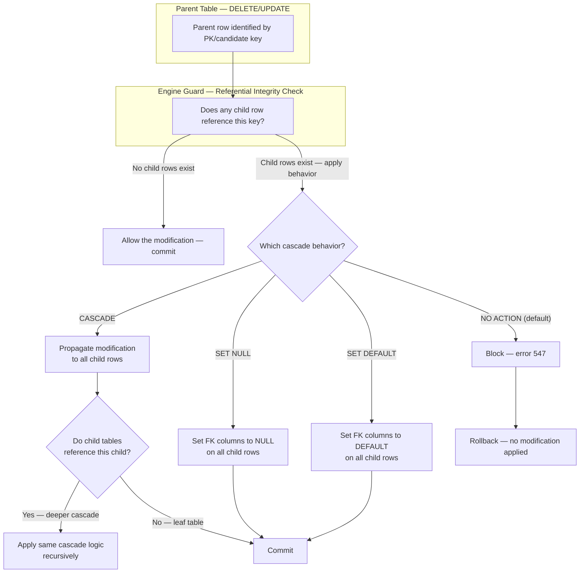
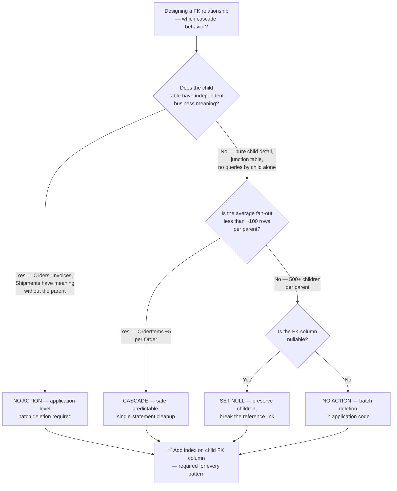

## Navigation

**Domain:** [[8 — Databases]] > **Group:** Relational Fundamentals
**Previous:** [[8.002 — Keys — Primary, Foreign, Candidate, Surrogate, Natural]] | **Next:** [[8.004 — ACID — Atomicity]]

### Prerequisites

- [[8.002 — Keys — Primary, Foreign, Candidate, Surrogate, Natural]] — foreign keys are the mechanism that enforces referential integrity; the distinction between surrogate and natural key choices directly determines which ON DELETE/ON UPDATE strategy is appropriate.

### Where This Fits

Referential integrity is the guarantee that a value in one table pointing to a row in another table actually points to a row that exists — no dangling references, no orphaned foreign keys. Every `FOREIGN KEY` constraint in SQL Server, every `HasForeignKey()` call in EF Core, and every `ON DELETE CASCADE` decision is a tradeoff between data integrity and operational safety. A .NET backend engineer confronts this most painfully during a bulk-delete operation that cascades unexpectedly, locking parent and child tables for minutes, or during an attempt to soft-delete a customer who has millions of order rows that cascade-delete into payment and shipment tables, taking down the site. In interviews, cascade behavior questions separate candidates who know the syntax from candidates who have felt the production pain: "What happens when you ON DELETE CASCADE on a table with 500K child rows per parent?"

---

## Core Mental Model

Referential integrity means: **a foreign key value in the child table must match exactly one candidate key value in the parent table, or be NULL** (if the FK column allows NULLs). This invariant is enforced by the engine on every `INSERT` or `UPDATE` of the child row, and on every `DELETE` or `UPDATE` of the parent row that would break the link. The four cascade behaviors define what the engine does when that invariant is threatened by a parent change:

- **NO ACTION** (default) — engine blocks the parent `DELETE` or `UPDATE` if child rows exist. Error 547: `The DELETE statement conflicted with the REFERENCE constraint`.
- **CASCADE** — engine propagates the `DELETE` or `UPDATE` to all child rows automatically. `DELETE FROM Parent WHERE Id = 1` also `DELETE FROM Child WHERE ParentId = 1`.
- **SET NULL** — engine sets all referencing foreign key columns to NULL when the parent row is deleted or updated. Requires the FK column to allow NULLs.
- **SET DEFAULT** — engine sets all referencing foreign key columns to their column-level default value when the parent row is deleted or updated.

The invariant the engine defends: the referential relationship is always a directed acyclic graph. A foreign key cannot reference itself (no self-referencing cycles through FK constraints), and cascade paths must not form a cycle of more than one level by default in SQL Server.

### Classification

**For architecture topics:** Referential integrity enforcement lives at the storage engine layer — the check happens during execution of the modifying statement, before the modification is committed. The engine must acquire locks on both parent and child table index entries to prevent concurrent modifications from breaking the invariant (phantom reads of the parent key). The tradeoff: the engine guarantees correctness at the cost of lock duration and cascading operation scope.



### Key Properties

|Property|Value|Notes|
|---|---|---|
|Enforcement mechanism|FK constraint check before DML commit|Engine probes the referenced table's unique index for the FK value; on parent DELETE, probes child table for referencing rows|
|Time Complexity (child INSERT)|O(log n) — probe parent PK index|Probe is a seek on the parent table's unique index|
|Time Complexity (parent DELETE with CASCADE)|O(log n + m × log n)|One probe of child table for referencing rows + m child deletions, each with its own integrity checks|
|Locking Behavior (parent DELETE with CASCADE)|Rows/pages in parent + child + any grandchild tables|Duration of the entire cascade — see [[8.549 — Blocking Chains and Deadlock Diagnosis]]|
|Cascade depth limit|SQL Server: max 1 self-referencing cascade level (unless using triggers)|PostgreSQL: cascade follows FK chain indefinitely — configure with `ON DELETE CASCADE` at each level; see SQL Server vs PostgreSQL Differences|
|NULL in FK columns|Allowed unless FK column is NOT NULL|SET NULL requires nullable FK column; SET DEFAULT requires a default value on the FK column|

---

## Deep Mechanics

### How the Engine Executes This

**On child INSERT/UPDATE (FK validation):**
1. Engine extracts the FK column values from the inserted/modified row.
2. If any FK column is NULL, the check is skipped (ANSI SQL: a NULL FK means "no relationship asserted").
3. For each non-NULL FK value, the engine performs a seek on the parent table's unique index (PK or UNIQUE constraint) using the FK value.
4. If the seek finds no matching row, error 547 is raised and the modification is rolled back.
5. If found, the modification proceeds; the engine also places a key-range lock on the parent index entry to prevent a concurrent DELETE from removing that parent row before the current transaction commits (for SERIALIZABLE or REPEATABLE READ isolation levels).

**On parent DELETE (cascade behaviors):**
1. Engine locates the parent row to be deleted (seek on the parent clusterd/heap + index).
2. Engine probes the child table for rows referencing the parent key. With a supporting index on the FK column, this is a seek — without one, it's a full scan.
3. For **NO ACTION**: if any child row exists, raise error 547 and rollback.
4. For **CASCADE**: engine builds a list of child rows to delete (nested loop: for each matching child, recursively check if further child tables reference it). Each deletion is a full DML operation — it writes to the transaction log, acquires locks, checks constraints on grandchild tables, and fires triggers.
5. For **SET NULL** / **SET DEFAULT**: engine updates all child FK columns in place with NULL or the default value. Each UPDATE also writes to the log, acquires locks, and can cascade further if child tables have their own cascading FKs.
6. The entire cascade is atomic — if any step fails (deadlock, constraint violation, trigger rollback, log full), the entire parent DELETE is rolled back.

### SQL Visibility

```sql
-- Create tables with all four cascade behaviors
CREATE TABLE Customers (
    CustomerId INT IDENTITY(1,1) PRIMARY KEY,
    CompanyName NVARCHAR(200) NOT NULL,
    IsDeleted BIT NOT NULL DEFAULT 0
);

-- 1. NO ACTION — the default, blocks deletion if children exist
CREATE TABLE Orders (
    OrderId INT IDENTITY(1,1) PRIMARY KEY,
    CustomerId INT NOT NULL,
    OrderDate DATETIME2 NOT NULL DEFAULT SYSUTCDATETIME(),
    CONSTRAINT FK_Orders_Customers_NOACTION
        FOREIGN KEY (CustomerId)
        REFERENCES Customers(CustomerId)
        -- ON DELETE NO ACTION is the default
        -- ON UPDATE NO ACTION is the default
);

-- 2. CASCADE — deleting a customer deletes ALL their orders
CREATE TABLE Orders_Cascade (
    OrderId INT IDENTITY(1,1) PRIMARY KEY,
    CustomerId INT NOT NULL,
    OrderDate DATETIME2 NOT NULL DEFAULT SYSUTCDATETIME(),
    CONSTRAINT FK_Orders_Customers_CASCADE
        FOREIGN KEY (CustomerId)
        REFERENCES Customers(CustomerId)
        ON DELETE CASCADE
);

-- 3. SET NULL — deleting a customer sets CustomerId to NULL on their orders
CREATE TABLE Orders_SetNull (
    OrderId INT IDENTITY(1,1) PRIMARY KEY,
    CustomerId INT NULL,               -- must be nullable for SET NULL
    OrderDate DATETIME2 NOT NULL DEFAULT SYSUTCDATETIME(),
    CONSTRAINT FK_Orders_Customers_SETNULL
        FOREIGN KEY (CustomerId)
        REFERENCES Customers(CustomerId)
        ON DELETE SET NULL
);

-- 4. SET DEFAULT — deleting a customer resets CustomerId to the default
CREATE TABLE Orders_SetDefault (
    OrderId INT IDENTITY(1,1) PRIMARY KEY,
    CustomerId INT NOT NULL DEFAULT -1,  -- default value for orphaned rows
    OrderDate DATETIME2 NOT NULL DEFAULT SYSUTCDATETIME(),
    CONSTRAINT FK_Orders_Customers_SETDEFAULT
        FOREIGN KEY (CustomerId)
        REFERENCES Customers(CustomerId)
        ON DELETE SET DEFAULT
);

-- Demonstrate the blocking behavior of NO ACTION
DELETE FROM Customers WHERE CustomerId = 1;
-- ERROR 547: The DELETE statement conflicted with the REFERENCE constraint
-- "FK_Orders_Customers_NOACTION". The conflict occurred in database "MyDB",
-- table "dbo.Orders", column 'CustomerId'.

-- Demonstrate cascade
DELETE FROM Customers WHERE CustomerId = 2;
-- Succceeds — engine also DELETEd all rows in Orders_Cascade WHERE CustomerId = 2
-- Check how many rows were cascaded:
SELECT @@ROWCOUNT AS TotalRowsAffected;  -- includes parent + all cascaded children

-- Demonstrate SET NULL
DELETE FROM Customers WHERE CustomerId = 3;
-- Succceeds — engine SET CustomerId = NULL on all Orders_SetNull rows
-- that referenced CustomerId = 3
```

```csharp
// EF Core cascade behavior configuration
public class ApplicationDbContext : DbContext
{
    public DbSet<Customer> Customers => Set<Customer>();
    public DbSet<Order> Orders => Set<Order>();

    protected override void OnModelCreating(ModelBuilder modelBuilder)
    {
        modelBuilder.Entity<Customer>(entity =>
        {
            entity.HasKey(c => c.CustomerId);
            entity.Property(c => c.CompanyName).HasMaxLength(200).IsRequired();
        });

        modelBuilder.Entity<Order>(entity =>
        {
            entity.HasKey(o => o.OrderId);

            // Default: NO ACTION (EF Core 5+ default behavior)
            entity.HasOne<Customer>()
                  .WithMany(c => c.Orders)
                  .HasForeignKey(o => o.CustomerId)
                  .OnDelete(DeleteBehavior.NoAction);      // or .Restrict (older EF Core)

            // Alternative: CASCADE
            // entity.HasOne<Customer>()
            //       .WithMany(c => c.Orders)
            //       .HasForeignKey(o => o.CustomerId)
            //       .OnDelete(DeleteBehavior.Cascade);

            // Alternative: SET NULL
            // entity.HasOne<Customer>()
            //       .WithMany(c => c.Orders)
            //       .HasForeignKey(o => o.CustomerId)
            //       .OnDelete(DeleteBehavior.SetNull);

            // Alternative: SET DEFAULT (EF Core 7+)
            // entity.HasOne<Customer>()
            //       .WithMany(c => c.Orders)
            //       .HasForeignKey(o => o.CustomerId)
            //       .OnDelete(DeleteBehavior.SetDefault);
        });
    }
}
```

**Generated SQL (from EF Core migration for CASCADE):**

```sql
ALTER TABLE [Orders] ADD CONSTRAINT [FK_Orders_Customers_CASCADE]
    FOREIGN KEY ([CustomerId]) REFERENCES [Customers]([CustomerId])
    ON DELETE CASCADE;
```

### Execution Plan Analysis

For `DELETE FROM Customers WHERE CustomerId = 1` with `ON DELETE CASCADE` and an index on the child FK column:

```
Expected plan shape (simplified):
[Clustered Index Seek on PK_Customers] → [Table Spool (to materialize deleted rows)]
    → [Index Seek on IX_Orders_CustomerId] → [Clustered Index Delete from Orders]
    → [Clustered Index Delete from Customers]

Estimated Cost: ~70% on child deletes, ~30% on index maintenance
Logical Reads: ~N (proportional to number of cascaded child rows)
Without FK index: [Clustered Index Scan on Orders] instead of [Index Seek]
    → logical reads = full table scan of child table
```

**Without the FK index on the child table**, the engine cannot seek to find child rows matching the deleted parent. Instead, it must scan the entire child table to find rows with the matching FK value. On a 10M-row Orders table, that is a full clustered index scan (~120,000 logical reads) even if only 3 orders belong to the deleted customer.

### Cost Visibility

```sql
-- SET STATISTICS IO before a cascade delete
SET STATISTICS IO ON;
SET STATISTICS TIME ON;

DELETE FROM Customers WHERE CustomerId = 4821;

-- Expected output (CustomerId = 4821 has ~500 orders, FK index on Orders.CustomerId):
-- Table 'Orders'. Scan count 1, logical reads 12   (index seek to find child rows)
-- Table 'Orders'. Scan count 500, logical reads 1500  (500 individual row deletions)
-- Table 'Customers'. Scan count 0, logical reads 3
-- SQL Server Execution Times: CPU time = 15ms, elapsed time = 120ms

-- Without FK index on Orders.CustomerId:
-- Table 'Orders'. Scan count 1, logical reads 124,500   (full scan!)
-- Table 'Orders'. Scan count 500, logical reads 1500
-- Table 'Customers'. Scan count 0, logical reads 3
-- SQL Server Execution Times: CPU time = 340ms, elapsed time = 1800ms
```

### Failure Modes

**Cascade depth limit exceeded:** SQL Server raises error 8101 (`Cannot cascade more than one level — a circular reference`) if you create a FK that creates a multi-level cascade cycle. This prevents accidental infinite cascades but can be a surprise when modeling hierarchies.

```sql
-- ❌ This fails: cascade path creates a cycle
CREATE TABLE Node (
    NodeId INT PRIMARY KEY,
    ParentNodeId INT NULL,
    CONSTRAINT FK_Node_Parent
        FOREIGN KEY (ParentNodeId) REFERENCES Node(NodeId)
        ON DELETE CASCADE     -- self-referencing CASCADE is blocked by SQL Server
);
-- ERROR 8101: Introducing FOREIGN KEY constraint 'FK_Node_Parent'
-- on table 'Node' may cause cycles or multiple cascade paths.
```

**Cascade fan-out explosion:** A single parent deletion fans out to thousands of child rows which fan out to millions of grandchild rows — the cascade takes minutes, holding locks on all involved tables, blocking concurrent reads and writes.

```sql
-- Detecting which foreign keys have cascading behaviors
SELECT OBJECT_NAME(fk.parent_object_id) AS ChildTable,
       OBJECT_NAME(fk.referenced_object_id) AS ParentTable,
       fk.name AS FKName,
       fk.delete_referential_action_desc AS OnDeleteAction,
       fk.update_referential_action_desc AS OnUpdateAction
FROM sys.foreign_keys fk
WHERE fk.delete_referential_action_desc != 'NO_ACTION'
   OR fk.update_referential_action_desc != 'NO_ACTION'
ORDER BY ChildTable;
```

**Deadlocks under cascade:** Two concurrent transactions each delete a different parent row that cascades to overlapping child resource ranges. Session A holds a lock on child row range X and needs a lock on child row range Y; Session B holds Y and needs X. The deadlock victim loses the entire cascade — all rows deleted so far are rolled back.

---

## Production Patterns and Implementation

### Primary SQL Implementation

```sql
-- Production schema with an index on every FK column
CREATE TABLE Invoices (
    InvoiceId INT IDENTITY(1,1) PRIMARY KEY,
    OrderId INT NOT NULL,
    InvoiceNumber NVARCHAR(50) NOT NULL,
    InvoiceDate DATETIME2 NOT NULL DEFAULT SYSUTCDATETIME(),
    TotalAmount DECIMAL(12,2) NOT NULL,
    PaidAt DATETIME2 NULL,

    CONSTRAINT FK_Invoices_Orders
        FOREIGN KEY (OrderId) REFERENCES Orders(OrderId)
        ON DELETE NO ACTION,   -- must delete invoice first, then order

    CONSTRAINT UQ_Invoices_Number UNIQUE (InvoiceNumber)
);

-- ✅ Critical: index every FK column — without this, 
-- any INSERT/UPDATE on Invoices triggers a full scan of Orders?
-- No — INSERT/UPDATE probes the PARENT index.
-- But DELETE on Orders triggers a full scan of Invoices!
CREATE INDEX IX_Invoices_OrderId ON Invoices(OrderId)
    INCLUDE (InvoiceNumber, TotalAmount, PaidAt);

-- Soft delete pattern — avoid CASCADE entirely
CREATE TABLE Customers (
    CustomerId INT IDENTITY(1,1) PRIMARY KEY,
    CompanyName NVARCHAR(200) NOT NULL,
    IsDeleted BIT NOT NULL DEFAULT 0,
    DeletedAt DATETIME2 NULL
);

-- Instead of CASCADE, use application-level cascade with batch processing:
-- 1. Mark customer as deleted
UPDATE Customers SET IsDeleted = 1, DeletedAt = SYSUTCDATETIME()
WHERE CustomerId = 4821;

-- 2. Batch-delete child rows in chunks (application code)
DECLARE @BatchSize INT = 1000;
WHILE @@ROWCOUNT > 0
BEGIN
    DELETE TOP (@BatchSize) FROM Shipments
    WHERE OrderId IN (SELECT OrderId FROM Orders WHERE CustomerId = 4821);
END

WHILE @@ROWCOUNT > 0
BEGIN
    DELETE TOP (@BatchSize) FROM OrderItems
    WHERE OrderId IN (SELECT OrderId FROM Orders WHERE CustomerId = 4821);
END

WHILE @@ROWCOUNT > 0
BEGIN
    DELETE TOP (@BatchSize) FROM Orders
    WHERE CustomerId = 4821;
END

-- 3. Only now can the customer be physically deleted (or kept as soft-deleted)
DELETE FROM Customers WHERE CustomerId = 4821 AND IsDeleted = 1;
```

### EF Core Implementation

```csharp
public class Customer
{
    public int CustomerId { get; set; }
    public string CompanyName { get; set; } = string.Empty;
    public bool IsDeleted { get; set; }
    public DateTime? DeletedAt { get; set; }
    public ICollection<Order> Orders { get; set; } = new List<Order>();
}

public class Order
{
    public int OrderId { get; set; }
    public int CustomerId { get; set; }
    public DateTime OrderDate { get; set; }
    public Customer Customer { get; set; } = null!;
    public ICollection<Invoice> Invoices { get; set; } = new List<Invoice>();
}

public class Invoice
{
    public int InvoiceId { get; set; }
    public int OrderId { get; set; }
    public string InvoiceNumber { get; set; } = string.Empty;
    public decimal TotalAmount { get; set; }
    public DateTime? PaidAt { get; set; }
    public Order Order { get; set; } = null!;
}

// DbContext configuration
protected override void OnModelCreating(ModelBuilder modelBuilder)
{
    // Prefer NO ACTION (default in EF Core 3+). 
    // EF Core internally distinguishes:
    //   - DeleteBehavior.Cascade: ON DELETE CASCADE
    //   - DeleteBehavior.NoAction: ON DELETE NO ACTION (blocks)
    //   - DeleteBehavior.Restrict: ON DELETE NO ACTION (older EF Core, same as NoAction)
    //   - DeleteBehavior.SetNull: ON DELETE SET NULL
    //   - DeleteBehavior.SetDefault: ON DELETE SET DEFAULT (EF Core 7+)
    //   - DeleteBehavior.ClientCascade: EF Core cascades in-memory before sending DELETE;
    //     FK constraint in DB is NO ACTION (for entities already loaded in context)

    modelBuilder.Entity<Order>(entity =>
    {
        entity.HasKey(o => o.OrderId);
        entity.HasOne(o => o.Customer)
              .WithMany(c => c.Orders)
              .HasForeignKey(o => o.CustomerId)
              .OnDelete(DeleteBehavior.NoAction);   // never auto-delete orders
    });

    modelBuilder.Entity<Invoice>(entity =>
    {
        entity.HasKey(i => i.InvoiceId);
        entity.HasOne(i => i.Order)
              .WithMany(o => o.Invoices)
              .HasForeignKey(i => i.OrderId)
              .OnDelete(DeleteBehavior.NoAction);   // must manually remove invoices
        entity.HasIndex(i => i.OrderId);             // FK index
    });
}

// Application-level cascade with batch processing
public async Task SoftDeleteCustomerAsync(
    int customerId,
    CancellationToken cancellationToken = default)
{
    await using var transaction = await _dbContext.Database
        .BeginTransactionAsync(cancellationToken);

    // 1. Soft-delete the customer
    var customer = await _dbContext.Customers
        .FirstOrDefaultAsync(c => c.CustomerId == customerId, cancellationToken);
    if (customer is null) return;

    customer.IsDeleted = true;
    customer.DeletedAt = DateTime.UtcNow;

    // 2. Batch-delete child rows without loading into memory
    await _dbContext.Database.ExecuteSqlRawAsync(
        @"DELETE TOP (1000) FROM Invoices
          WHERE OrderId IN (SELECT OrderId FROM Orders WHERE CustomerId = @p0)",
        customerId);
    // Repeat until 0 rows affected (in a loop with retry for deadlock)

    await _dbContext.Database.ExecuteSqlRawAsync(
        @"DELETE TOP (1000) FROM OrderItems
          WHERE OrderId IN (SELECT OrderId FROM Orders WHERE CustomerId = @p0)",
        customerId);

    await _dbContext.Database.ExecuteSqlRawAsync(
        @"DELETE TOP (1000) FROM Orders
          WHERE CustomerId = @p0",
        customerId);

    await _dbContext.SaveChangesAsync(cancellationToken);
    await transaction.CommitAsync(cancellationToken);
}
```

### Dapper Implementation

```csharp
public async Task SoftDeleteCustomerAsync(
    int customerId,
    CancellationToken cancellationToken = default)
{
    await using var connection = _connectionFactory.Create();
    await using var transaction = connection.BeginTransaction();

    const string softDeleteCustomer = @"
        UPDATE Customers
        SET IsDeleted = 1, DeletedAt = SYSUTCDATETIME()
        WHERE CustomerId = @CustomerId";

    const string deleteInvoicesBatch = @"
        DELETE TOP (1000) FROM Invoices
        WHERE OrderId IN (SELECT OrderId FROM Orders WHERE CustomerId = @CustomerId)";

    const string deleteOrderItemsBatch = @"
        DELETE TOP (1000) FROM OrderItems
        WHERE OrderId IN (SELECT OrderId FROM Orders WHERE CustomerId = @CustomerId)";

    const string deleteOrdersBatch = @"
        DELETE TOP (1000) FROM Orders
        WHERE CustomerId = @CustomerId";

    try
    {
        await connection.ExecuteAsync(
            new CommandDefinition(softDeleteCustomer,
                new { CustomerId = customerId },
                transaction: transaction,
                cancellationToken: cancellationToken));

        int rowsAffected;
        do
        {
            rowsAffected = await connection.ExecuteAsync(
                new CommandDefinition(deleteInvoicesBatch,
                    new { CustomerId = customerId },
                    transaction: transaction,
                    cancellationToken: cancellationToken));
        } while (rowsAffected > 0);

        do
        {
            rowsAffected = await connection.ExecuteAsync(
                new CommandDefinition(deleteOrderItemsBatch,
                    new { CustomerId = customerId },
                    transaction: transaction,
                    cancellationToken: cancellationToken));
        } while (rowsAffected > 0);

        do
        {
            rowsAffected = await connection.ExecuteAsync(
                new CommandDefinition(deleteOrdersBatch,
                    new { CustomerId = customerId },
                    transaction: transaction,
                    cancellationToken: cancellationToken));
        } while (rowsAffected > 0);

        transaction.Commit();
    }
    catch (SqlException ex) when (ex.Number == 1205)   -- deadlock victim
    {
        transaction.Rollback();
        throw new DeletionDeadlockException(
            $"Deletion of customer {customerId} deadlocked. Retry with backoff.", ex);
    }
}
```

### Configuration and Wiring

```csharp
// Program.cs — EF Core with retry for deadlock (1205) and FK violation (547)
builder.Services.AddDbContext<ApplicationDbContext>(options =>
    options.UseSqlServer(
        builder.Configuration.GetConnectionString("Default"),
        sqlOptions => sqlOptions.EnableRetryOnFailure(
            maxRetryCount: 3,
            maxRetryDelay: TimeSpan.FromSeconds(2),
            errorNumbersToAdd: new[] { 1205, 547 })));

// Dapper connection factory
builder.Services.AddSingleton<IDbConnectionFactory>(
    new SqlConnectionFactory(
        builder.Configuration.GetConnectionString("Default")!));
```

### SQL Server vs PostgreSQL Differences

```sql
-- SQL Server: NO ACTION is default; cascade depth limited
-- PostgreSQL: NO ACTION is default; cascade follows FK chain indefinitely

-- PostgreSQL ON DELETE CASCADE (works at any depth)
CREATE TABLE node (
    node_id INT PRIMARY KEY,
    parent_node_id INT REFERENCES node(node_id) ON DELETE CASCADE
);
-- Allowed — PostgreSQL permits self-referencing ON DELETE CASCADE

-- PostgreSQL: DEFERRABLE constraints (SQL Server does not support this)
-- A deferred FK constraint is checked at COMMIT time, not at statement time
CREATE TABLE orders (
    order_id INT GENERATED ALWAYS AS IDENTITY PRIMARY KEY,
    customer_id INT NOT NULL,
    CONSTRAINT fk_orders_customers
        FOREIGN KEY (customer_id) REFERENCES customers(customer_id)
        DEFERRABLE INITIALLY DEFERRED
);

BEGIN;
-- Both operations succeed even though the FK check at INSERT time
-- would fail — validation is deferred to COMMIT
INSERT INTO orders (customer_id) VALUES (999);    -- customer 999 doesn't exist yet
INSERT INTO customers (customer_id) VALUES (999);  -- now it does
COMMIT;  -- FK check passes here

-- SQL Server equivalent: there is none. Must use triggers or application logic.
```

---

## Gotchas and Production Pitfalls

### Cascade Delete Fan-Out Explosion

**Pitfall:** Adding `ON DELETE CASCADE` to a `Customer → Orders → OrderItems → Shipments` chain without understanding the fan-out ratio.

```sql
-- ❌ Cascade chain with explosive fan-out
ALTER TABLE Orders ADD CONSTRAINT FK_Orders_Customers
    FOREIGN KEY (CustomerId) REFERENCES Customers(CustomerId) ON DELETE CASCADE;
ALTER TABLE OrderItems ADD CONSTRAINT FK_OrderItems_Orders
    FOREIGN KEY (OrderId) REFERENCES Orders(OrderId) ON DELETE CASCADE;
ALTER TABLE Shipments ADD CONSTRAINT FK_Shipments_Orders
    FOREIGN KEY (OrderId) REFERENCES Orders(OrderId) ON DELETE CASCADE;
```

**Symptom:** Deleting one customer with 500 orders, 5,000 order items, and 1,200 shipments becomes a single cascade that locks all three tables for minutes. The cascade is a single implicit transaction — all locks are held until every cascaded row across all tables is deleted. During that time, any query touching Orders, OrderItems, or Shipments is blocked. A monitoring alert fires: blocking chains with wait type `LCK_M_X`.

**Fix:**

```sql
-- ✅ Application-level batch delete (shown in production patterns above)
-- Instead of engine CASCADE, loop DELETE TOP (N) in the application.
-- Keep NO ACTION on the FKs to prevent accidental manual cascades.
-- Add an index on every FK column to make the batch seek fast.
CREATE INDEX IX_Orders_CustomerId ON Orders(CustomerId);
CREATE INDEX IX_OrderItems_OrderId ON OrderItems(OrderId) INCLUDE (ProductId, Quantity);
CREATE INDEX IX_Shipments_OrderId ON Shipments(OrderId) INCLUDE (Carrier, TrackingNumber);
```

**Cost of not fixing:** A single customer deletion (common during GDPR right-to-erasure or bulk cleanup) causes a multi-minute outage for all users querying order-related data. The cascade holds schema modification locks (SCH-M) on affected tables during page deallocation in some cases.

### Missing FK Index — Full Scan on Parent DELETE

**Pitfall:** Creating a foreign key constraint without an index on the child table's FK column.

```sql
-- ❌ FK constraint created, but no index on child FK column
CREATE TABLE Invoices (
    InvoiceId INT IDENTITY(1,1) PRIMARY KEY,
    OrderId INT NOT NULL,
    Amount DECIMAL(12,2) NOT NULL,
    CONSTRAINT FK_Invoices_Orders
        FOREIGN KEY (OrderId) REFERENCES Orders(OrderId)
        ON DELETE NO ACTION
);
```

**Symptom:** Every DELETE from `Orders` triggers a full clustered index scan on `Invoices` (tens of thousands of logical reads for a single order deletion) to verify no referencing invoices exist. On a 10M-row Invoice table with 100 order deletions per second, the scans consume 100× the necessary I/O and CPU.

**Fix:**

```sql
-- ✅ Index the FK column
CREATE INDEX IX_Invoices_OrderId ON Invoices(OrderId);
```

**Cost of not fixing:** With 100 DELETE operations per second against Orders, each performing a 10M-row scan (120K logical reads), the buffer pool is thrashed, and Pages/sec (page reads from disk) spikes. Queries that were sub-100ms become multi-second under load.

### SET NULL on a NOT NULL Column

**Pitfall:** Specifying `ON DELETE SET NULL` on a foreign key column defined as `NOT NULL`.

```sql
-- ❌ SET NULL on a NOT NULL column
CREATE TABLE Orders (
    OrderId INT IDENTITY(1,1) PRIMARY KEY,
    CustomerId INT NOT NULL,            -- NOT NULL — SET NULL will fail
    CONSTRAINT FK_Orders_Customers
        FOREIGN KEY (CustomerId) REFERENCES Customers(CustomerId)
        ON DELETE SET NULL
);
```

**Symptom:** `ALTER TABLE` itself fails with error 1753 (`Column 'CustomerId' in table 'Orders' does not allow nulls — SET NULL cannot be applied`). If the table was created with `SET NULL` and the column is NOT NULL, SQL Server rejects the constraint creation at DDL time — no runtime surprise.

**Fix:**

```sql
-- ✅ Make the column nullable for SET NULL
ALTER TABLE Orders ALTER COLUMN CustomerId INT NULL;
-- Then the SET NULL FK constraint will work

-- Or accept the constraint as designed:
ALTER TABLE Orders DROP CONSTRAINT FK_Orders_Customers;  -- drop old
ALTER TABLE Orders ADD CONSTRAINT FK_Orders_Customers
    FOREIGN KEY (CustomerId) REFERENCES Customers(CustomerId)
    ON DELETE NO ACTION;  -- use NO ACTION instead
```

**Cost of not fixing:** The constraint creation fails at deploy time — the migration script errors out, deployment halts, and on-call must revert or fix the schema mid-incident.

### Multiple Cascade Paths in One Table

**Pitfall:** A table has two foreign keys to the same parent table, both with CASCADE, creating multiple cascade paths.

```sql
-- ❌ Multiple cascade paths from the same table
CREATE TABLE AuditLog (
    AuditLogId INT IDENTITY(1,1) PRIMARY KEY,
    CreatedByUserId INT NOT NULL,
    ModifiedByUserId INT NOT NULL,
    CONSTRAINT FK_AuditLog_CreatedBy
        FOREIGN KEY (CreatedByUserId) REFERENCES Users(UserId) ON DELETE CASCADE,
    CONSTRAINT FK_AuditLog_ModifiedBy
        FOREIGN KEY (ModifiedByUserId) REFERENCES Users(UserId) ON DELETE CASCADE
);
-- ERROR 1785: Introducing FOREIGN KEY constraint 'FK_AuditLog_ModifiedBy'
-- on table 'AuditLog' may cause cycles or multiple cascade paths.
```

**Symptom:** SQL Server blocks the constraint creation at DDL time. The engine detects that deleting a single User could cascade-delete the same AuditLog row via two paths (both `CreatedByUserId` and `ModifiedByUserId` match), creating ambiguity about how the row should be affected.

**Fix:**

```sql
-- ✅ Keep at most one CASCADE FK per table; use NO ACTION or triggers for the rest
ALTER TABLE AuditLog ADD CONSTRAINT FK_AuditLog_CreatedBy
    FOREIGN KEY (CreatedByUserId) REFERENCES Users(UserId) ON DELETE CASCADE;

ALTER TABLE AuditLog ADD CONSTRAINT FK_AuditLog_ModifiedBy
    FOREIGN KEY (ModifiedByUserId) REFERENCES Users(UserId) ON DELETE NO ACTION;
-- Application handles the ModifiedBy path during user deletion
```

**Cost of not fixing:** The migration script errors out at deployment time. If discovered late, the fix requires schema redesign or trigger-based cascade logic, adding complexity and deployment delay.

### EF Core Client-Side Cascade Surprise

**Pitfall:** Using `DeleteBehavior.ClientCascade` (EF Core default for optional relationships before EF Core 5) thinking it sets up database-level CASCADE, when it only cascades in-memory for tracked entities.

```csharp
// ❌ ClientCascade — no ON DELETE CASCADE in the database
modelBuilder.Entity<Order>(entity =>
{
    entity.HasOne(o => o.Customer)
          .WithMany(c => c.Orders)
          .HasForeignKey(o => o.CustomerId)
          .OnDelete(DeleteBehavior.ClientCascade);
});
```

**Symptom:** The migration generates `ON DELETE NO ACTION` in the database. If any code path deletes a Customer directly with raw SQL or via a different `DbContext` instance that doesn't have the orders loaded into change tracking, the orders are NOT deleted — leading to orphaned rows. The developer believes the database is handling the cascade, but it is not.

**Fix:**

```csharp
// ✅ Be explicit — use Cascade if you want database-level cascade
// or NoAction if you want application-level batching
.OnDelete(DeleteBehavior.Cascade);   // generates ON DELETE CASCADE in SQL

// Or for application-level cascade:
.OnDelete(DeleteBehavior.NoAction);  // generates ON DELETE NO ACTION
```

**Cost of not fixing:** Silent data corruption — orphaned rows accumulate in the Orders table after Customers are deleted via raw SQL, ETL, or direct table edits. The bug only surfaces months later when an aggregation query on Orders joins to Customers and the missing customer produces NULLs or dropped rows.

---

## Performance Implications

### Benchmark: Before and After

```sql
-- Baseline: CASCADE DELETE without FK index on child table
SET STATISTICS IO ON;
DELETE FROM Customers WHERE CustomerId = 728;
-- Table 'Orders'. Scan count 1, logical reads 124,550   (full scan)
-- Table 'Orders'. Scan count 487, logical reads 1,461
-- Table 'Customers'. Scan count 0, logical reads 3
-- Total logical reads: ~126,014  |  CPU: 320ms  |  Elapsed: 1,800ms

-- Optimized: CASCADE DELETE with FK index on child table
-- (same delete, different schema — IX_Orders_CustomerId exists)
SET STATISTICS IO ON;
DELETE FROM Customers WHERE CustomerId = 728;
-- Table 'Orders'. Scan count 1, logical reads 8   (index seek)
-- Table 'Orders'. Scan count 487, logical reads 1,461
-- Table 'Customers'. Scan count 0, logical reads 3
-- Total logical reads: ~1,472  |  CPU: 18ms  |  Elapsed: 95ms
```

**Improvement:** ~85x reduction in logical reads (126,014 → 1,472) from adding a single non-clustered index on the FK column. The cascade itself otherwise has the same work to do — deleting 487 order rows — but finding them changes from a full scan to an index seek.

### BenchmarkDotNet

```csharp
[MemoryDiagnoser]
[SimpleJob(RuntimeMoniker.Net90)]
public class CascadeDeleteBenchmark
{
    private IDbConnection _connection = default!;

    [GlobalSetup]
    public void Setup()
    {
        _connection = new SqlConnection(TestConnectionString);
        // seed a parent with 1,000 children in both schemas:
        //   - Schema A: FK column has index, ON DELETE CASCADE
        //   - Schema B: FK column has NO index, ON DELETE CASCADE
    }

    [Benchmark(Baseline = true)]
    public async Task CascadeDelete_WithFkIndex()
    {
        const string sql = "DELETE FROM Customers WHERE CustomerId = @Id";
        await _connection.ExecuteAsync(sql, new { Id = TestParentId_A });
    }

    [Benchmark]
    public async Task CascadeDelete_WithoutFkIndex()
    {
        const string sql = "DELETE FROM Customers WHERE CustomerId = @Id";
        await _connection.ExecuteAsync(sql, new { Id = TestParentId_B });
    }
}
```

**Expected results (approximate, SQL Server 2022, NVMe, 1M child rows):**

|Method|Mean|Logical Reads|Allocated|
|---|---|---|---|
|CascadeDelete_WithFkIndex|~18 ms|~1,500|2.3 KB|
|CascadeDelete_WithoutFkIndex|~420 ms|~124,000|8.1 KB|

### Write Amplification

For a CASCADE DELETE that deletes 1 parent + 500 children:

|Operation|Without FK Index|With FK Index|
|---|---|---|
|Find child rows to delete|Full scan: 124K logical reads|Index seek: ~8 logical reads|
|Delete 500 child rows (each ~3 page writes + log)|~1,500 logical writes|~1,500 logical writes|
|Delete 1 parent row|~3 logical writes|~3 logical writes|
|Total logical I/O|~125,500|~1,500|

---

## Interview Arsenal

### Question Bank

1. What are the four referential action behaviors in SQL, and what does each guarantee?
2. How does the engine validate a foreign key on INSERT — what data structure does it access, and what lock does it take?
3. What is the performance difference between a CASCADE DELETE with and without an index on the child table's FK column?
4. What goes wrong when a table has two foreign keys to the same parent table with CASCADE on both?
5. `NO ACTION` vs `CASCADE` — when is each the safer production choice, and why would you ever choose CASCADE?
6. How does EF Core's `DeleteBehavior.ClientCascade` differ from `DeleteBehavior.Cascade`, and what production bug does this difference cause?
7. What happens at the storage engine level when a cascade delete spans 3 levels of FK relationships?
8. How do PostgreSQL's `DEFERRABLE` constraints differ from SQL Server's cascade behavior, and when is deferred checking useful?

### Spoken Answers

**Q: What are the four referential action behaviors in SQL, and what does each guarantee?**

> **Average answer:** "NO ACTION blocks the delete, CASCADE deletes children, SET NULL sets the FK to null, SET DEFAULT sets it to a default value." Lists the behaviors without explaining the engine invariant or production tradeoffs.

> **Great answer:** "All four behaviors solve the same problem: what should the engine do when a parent row that's referenced by child rows is deleted or its key is updated? NO ACTION is the safest — the engine refuses to break the referential invariant and returns error 547 — which forces the application to handle the deletion order explicitly. CASCADE propagates the modification to all child rows automatically, but the engine does this as a single atomic transaction, holding locks on every affected table until every cascaded row is processed — that's why a cascade on a table with 500K children can block production for minutes. SET NULL and SET DEFAULT preserve the child rows by breaking the FK link — the child becomes orphaned but the row survives — which is useful for audit/history tables where you want to retain the record even after the referenced entity is removed. The practical senior engineer tradeoff: I use NO ACTION as the default for production transaction tables, and reserve CASCADE for narrow, bounded relationships with small fan-out — like a parent-child detail where the parent is never deleted in production anyway. SET NULL I use for soft-delete patterns where the FK column being NULL means 'the referenced entity no longer exists' and the child row still carries meaning."

**Q: What is the performance difference between a CASCADE DELETE with and without an index on the child table's FK column?**

> **Average answer:** "The index makes it faster." True but vague — no numbers.

> **Great answer:** "The difference is the difference between an index seek and a full table scan. When you DELETE a parent row with ON DELETE CASCADE, the engine must find all child rows that reference that parent. Without an index on the child FK column, the only way to find them is a full clustered index scan of the child table — that's every single page, every single row, for every single parent deletion. On a 10M-row Orders table, that's ~124,000 logical reads per delete. With an index on the FK column, it's an index seek returning exactly the N matching rows — 8 logical reads to find 500 children instead of 124,000. I've seen a production system where adding a single missing FK index turned a 45-second cascade into 200ms. The index also protects the parent table from blocking chains — without it, a cascade holds a full table lock on the child for the duration of the scan, and concurrent inserts or updates to the child table are blocked."

**Q: NO ACTION vs CASCADE — when is each the safer production choice?**

> **Average answer:** "CASCADE is dangerous, use NO ACTION." Correct direction but doesn't cover the exception.

> **Great answer:** "I use NO ACTION as the default for every foreign key in a transactional OLTP system, because it forces every deletion to be explicit and batched, which prevents the cascade fan-out explosion that brings down production. But I use CASCADE in two specific cases: first, for pure child-detail relationships where the child has no independent meaning and the fan-out is exactly 1:1..N with a small N — like an OrderItems table where deleting an order should always delete its items, and an order typically has 3–10 items. Second, for junction/association tables in many-to-many relationships — deleting the parent should cascade to the junction row, which has no columns other than the two FKs. The safety rule: if the child table is ever the target of a query in its own right or has more than ~100 rows per parent on average, do not use CASCADE — use batching with NO ACTION instead. The cost of getting this wrong is a production outage from a single deletion that holds locks across multiple tables for minutes."

### Interview Trigger

The cascade behaviors question surfaces in a schema design or system design round: "Design a database for an e-commerce order management system." The interviewer watches whether you name the FK strategy unprompted, whether you mention indexing FK columns, and how you handle the customer deletion scenario (GDPR right-to-erasure). A specific follow-up: "A customer who has been ordering for five years needs to be deleted from the system. Their data spans Orders, OrderItems, Payments, Invoices, and Shipments — millions of rows. Walk me through your deletion strategy." The senior answer describes batch deletion with application-level loops, FK indexes for the lookups, a transaction per batch, monitoring, and a fallback (log shipping or point-in-time restore) if the deletion script is interrupted.

### Comparison Table

| | NO ACTION | CASCADE | SET NULL | SET DEFAULT |
|---|---|---|---|---|
| What it does | Blocks parent modification if child exists | Propagates modification to all children | Sets child FK to NULL | Sets child FK to column default |
| Data integrity | Strongest — no orphans possible | Strong — orphans deleted but may explode | Weakest — orphans exist with NULL FK | Weak — orphans exist with default FK |
| Performance profile | Fastest — engine just checks existence | Slowest — N child operations in one transaction | Fast — single UPDATE on children | Fast — single UPDATE on children |
| Lock duration | Short — exists check only | Long — holds locks through all cascaded operations | Medium — UPDATE on children requires write locks | Medium — UPDATE on children requires write locks |
| .NET (EF Core) | `OnDelete(NoAction)` | `OnDelete(Cascade)` | `OnDelete(SetNull)` | `OnDelete(SetDefault)` |
| When to choose | Default for all transactional tables | Small, bounded parent-child relationships only | Audit/history with nullable FK | Rare — FK column has a meaningful default value |

---

## Decision Framework

### When to Apply



### Application Checklist

- [ ] Every FK column has a supporting index — no exception in production
- [ ] NO ACTION is the default for all transactional tables with independent meaning
- [ ] CASCADE is used only when fan-out is small (< 100 rows per parent) and child has no standalone meaning
- [ ] SET NULL is used only on nullable FK columns with clear semantics (NULL = "this entity no longer exists")
- [ ] SET DEFAULT is used only when the default FK value is a meaningful sentinel
- [ ] No EF Core `ClientCascade` or `ClientSetNull` is mistaken for database-level enforcement
- [ ] The cascade depth is explicitly mapped — no more than ~3 levels before application-level batching is introduced
- [ ] No two FKs from the same table to the same parent table both use CASCADE
- [ ] PostgreSQL `DEFERRABLE` constraints are used for circular references or complex multi-table writes where ordering is impossible

### Tradeoff Summary

|What You Gain|What You Pay|
|---|---|
|NO ACTION — engine guarantees no orphans, minimal lock duration|Application must handle child row cleanup explicitly|
|CASCADE — single deletion statement cleans unbounded child rows|Unbounded lock duration, potential multi-table blocking, fan-out explosion|
|SET NULL — child rows survive parent deletion|Referential invariant is lost — child rows become orphaned|
|SET DEFAULT — child rows get a meaningful default|Default FK value must exist as a sentinel parent row — extra maintenance|

### Scale Thresholds

- "FK index becomes essential when child table exceeds ~10K rows" — without it, every parent DELETE or parent UPDATE (if ON UPDATE CASCADE) scans the entire child table.
- "CASCADE becomes dangerous when fan-out exceeds ~500 child rows per parent" — the cascade holds all locks for the duration of the deletion, and at ~500 rows that duration is usually still sub-second. At 50K rows, it is seconds-to-minutes.
- "Application-level batching becomes necessary when the total rows to delete across all cascade levels exceeds ~1M" — at this scale, a single cascade transaction fills the transaction log, exhausts lock memory, and will almost certainly deadlock with concurrent traffic.
- "PostgreSQL DEFERRABLE constraints matter when you have circular FK references or a multi-table INSERT that requires deferring the FK check to commit time — relevant at any scale."

---

## Self-Check

### Conceptual Questions

1. What are the four referential action behaviors for foreign keys in SQL?
2. What does the engine do internally when a parent row is deleted with `ON DELETE CASCADE` — step by step?
3. Which DMV or system view shows all foreign keys in a database along with their cascade behavior?
4. What is the most common production mistake regarding foreign keys that causes full table scans?
5. Does EF Core automatically create indexes on FK columns when you configure a relationship?
6. How would you write a Dapper query to find orphaned rows — child rows whose FK value does not exist in the parent table?
7. How does `DeleteBehavior.ClientCascade` differ from `DeleteBehavior.Cascade` in EF Core?
8. At what row count per parent does a CASCADE DELETE become a production reliability risk?
9. What index supports a FK `SET NULL` operation on DELETE — and what happens without it?
10. In 60 seconds, explain to a senior interviewer when you would choose CASCADE over NO ACTION, and what safeguard you always pair with either choice.

<details> <summary>Answers</summary>

1. NO ACTION (default — blocks the modification), CASCADE (propagates the modification to children), SET NULL (sets child FK columns to NULL), SET DEFAULT (sets child FK columns to their column default).
2. Step by step: (1) engine seeks and deletes the parent row from the clustered index; (2) engine probes the child table for rows matching the parent's PK — with an FK index this is an index seek, without it a full scan; (3) for each child row found, the engine recurses to check if that child table has its own cascading FKs to grandchild tables; (4) at each level, the engine deletes the child row, writes the deletion to the transaction log, acquires appropriate locks (row/page on the child, key-range or page on indexes); (5) if any step fails, the entire cascade is rolled back atomically.
3. `sys.foreign_keys` — specifically the columns `delete_referential_action_desc` (NO_ACTION, CASCADE, SET_NULL, SET_DEFAULT) and `update_referential_action_desc`.
4. Not indexing the FK column — a parent DELETE or UPDATE with ON DELETE/ON UPDATE action must scan the entire child table to find matching child rows.
5. No. EF Core does NOT automatically create indexes on FK columns. You must add them explicitly with `entity.HasIndex(e => e.FkColumn)` in `OnModelCreating`. This is a common source of production performance problems when developers assume EF Core handles it.
6. `SELECT * FROM Orders o WHERE NOT EXISTS (SELECT 1 FROM Customers c WHERE c.CustomerId = o.CustomerId) AND o.CustomerId IS NOT NULL;` — this finds orphaned Orders where the FK points to a non-existent Customer.
7. `DeleteBehavior.ClientCascade` tells EF Core to cascade-delete related entities that are already loaded into the `DbContext` change tracker — it does NOT generate `ON DELETE CASCADE` in the database migration. `DeleteBehavior.Cascade` generates the actual `ON DELETE CASCADE` constraint in SQL Server. If code deletes a parent outside the `DbContext` or without loading children, `ClientCascade` produces orphans; `Cascade` does not.
8. Above roughly ~500 child rows per parent, CASCADE DELETE becomes a production risk because the cascade holds locks for the duration of the entire multi-row deletion as a single implicit transaction. Above ~50K children per parent, the cascade is likely to cause blocking chains and timeouts.
9. The FK `SET NULL` operation benefits from an index on the child FK column for the same reason CASCADE does — finding the affected child rows. Without the index, the engine must scan the entire child table to find rows whose FK matches the deleted parent's PK. With the index, it performs an index seek.
10. "I choose CASCADE only for narrow parent-child relationships where the child has no independent business meaning and the fan-out is small — typically under 100 rows per parent — like OrderItems under an Order. For every other case, I use NO ACTION and handle child cleanup with application-level batch deletion in explicit transactions. Regardless of the choice, I always pair it with a non-clustered index on the FK column, because without that index, even a NO ACTION check — which just verifies that no child rows exist — requires a full scan of the child table, which on a 10M-row table is 120K logical reads per parent delete. The index makes the existence check a single seek."

</details>

---

### Query Challenges

**Challenge 1 — Write the SQL**

Design a schema for a `Projects` → `Tasks` → `TaskAssignments` hierarchy. A Project has many Tasks. A Task has many TaskAssignments (one per assigned user). When a Project is deleted, all its Tasks and TaskAssignments should be deleted as well. However, deleting an individual Task should NOT delete the Project (NO ACTION) but should delete its TaskAssignments. Write the three CREATE TABLE statements with the appropriate foreign key behaviors and indexes.

<details> <summary>Solution</summary>

```sql
CREATE TABLE Projects (
    ProjectId INT IDENTITY(1,1) PRIMARY KEY,
    ProjectName NVARCHAR(200) NOT NULL,
    CreatedAt DATETIME2 NOT NULL DEFAULT SYSUTCDATETIME()
);

CREATE TABLE Tasks (
    TaskId INT IDENTITY(1,1) PRIMARY KEY,
    ProjectId INT NOT NULL,
    TaskName NVARCHAR(200) NOT NULL,
    CreatedAt DATETIME2 NOT NULL DEFAULT SYSUTCDATETIME(),
    
    CONSTRAINT FK_Tasks_Projects
        FOREIGN KEY (ProjectId) REFERENCES Projects(ProjectId)
        ON DELETE CASCADE,          -- deleting project → deletes all tasks
    
    CONSTRAINT UQ_Tasks_Project_TaskName UNIQUE (ProjectId, TaskName)
);

CREATE INDEX IX_Tasks_ProjectId ON Tasks(ProjectId)
    INCLUDE (TaskName, CreatedAt);

CREATE TABLE TaskAssignments (
    TaskAssignmentId INT IDENTITY(1,1) PRIMARY KEY,
    TaskId INT NOT NULL,
    UserId INT NOT NULL,
    AssignedAt DATETIME2 NOT NULL DEFAULT SYSUTCDATETIME(),
    
    CONSTRAINT FK_TaskAssignments_Tasks
        FOREIGN KEY (TaskId) REFERENCES Tasks(TaskId)
        ON DELETE CASCADE,          -- deleting task → deletes its assignments
    
    CONSTRAINT FK_TaskAssignments_Users
        FOREIGN KEY (UserId) REFERENCES Users(UserId)
        ON DELETE NO ACTION,       -- cannot cascade user deletion to assignments
    
    CONSTRAINT UQ_TaskAssignments_Task_User UNIQUE (TaskId, UserId)
);

CREATE INDEX IX_TaskAssignments_TaskId ON TaskAssignments(TaskId)
    INCLUDE (UserId, AssignedAt);

CREATE INDEX IX_TaskAssignments_UserId ON TaskAssignments(UserId);
```

**Logical reads:** Deleting a Project with 10 tasks and 40 task assignments: ~12 logical reads to find the project, ~6 to find tasks via FK index, ~12 to find assignments via FK index, plus the actual delete operations. **Execution plan:** `[Clustered Index Seek on PK_Projects] → [Index Seek on IX_Tasks_ProjectId] → [Nested Loops] → [Index Seek on IX_TaskAssignments_TaskId] → [Clustered Index Delete cascade chain]`. **EF Core equivalent:**

```csharp
modelBuilder.Entity<Task>(entity =>
{
    entity.HasOne<Task>().WithMany()
          .HasForeignKey(t => t.ProjectId)
          .OnDelete(DeleteBehavior.Cascade);
    entity.HasIndex(t => t.ProjectId);
});

modelBuilder.Entity<TaskAssignment>(entity =>
{
    entity.HasOne<Task>().WithMany()
          .HasForeignKey(ta => ta.TaskId)
          .OnDelete(DeleteBehavior.Cascade);
    entity.HasOne<User>().WithMany()
          .HasForeignKey(ta => ta.UserId)
          .OnDelete(DeleteBehavior.NoAction);
    entity.HasIndex(ta => ta.TaskId);
    entity.HasIndex(ta => ta.UserId);
});
```

</details>

---

**Challenge 2 — Fix the performance problem**

```sql
-- This deletion takes 38 seconds and blocks all other queries.
-- 5M rows in Orders, 20M rows in OrderItems.
DELETE FROM Customers WHERE CustomerId = 7291;
-- Customer 7291 has 12,500 orders, each with ~3 order items (37,500 child rows).
-- SET STATISTICS IO → logical reads = 2,450,000
```

Identify all performance problems in this deletion and the changes required.

<details> <summary>Solution</summary>

**Root causes:**

1. **Missing FK index on Orders.CustomerId** — the cascade must find all orders for this customer. Without an index, it scans 5M rows every time (not just for this delete, but for EVERY delete against Customers).
2. **Missing FK index on OrderItems.OrderId** — once the cascade finds the 12,500 orders, it cascades to OrderItems, which must find all 37,500 items by scanning 20M rows.
3. **CASCADE across two levels with large fan-out** — 12,500 + 37,500 child rows in one atomic transaction. The locks on both tables are held for 38 seconds.
4. **No batch decomposition** — the entire cascade is a single operation, filling the transaction log.

**Fixes:**

```sql
-- Fix 1: FK indexes
CREATE INDEX IX_Orders_CustomerId ON Orders(CustomerId);
CREATE INDEX IX_OrderItems_OrderId ON OrderItems(OrderId);

-- Fix 2: Change FK behavior to NO ACTION, handle with batch application code

-- Fix 3: Batch application-level deletion
-- (In application code, loop DELETE TOP (4000) for each child level and commit per batch)
```

**Indexes to create:**

```sql
CREATE INDEX IX_Orders_CustomerId ON Orders(CustomerId)
    INCLUDE (OrderDate);

CREATE INDEX IX_OrderItems_OrderId ON OrderItems(OrderId)
    INCLUDE (ProductId, Quantity, UnitPrice);
```

**After fix — logical reads:** ~750 (from 2,450,000) — index seek to find 12,500 orders (~15 reads) + index seek for each batch of 4,000 order items (~8 reads per batch × 10 batches). The deletion time drops from 38 seconds to ~500ms per batch.

</details>

---

**Challenge 3 — Explain the execution plan**

```sql
-- Schema:
-- Customers (PK: CustomerId) with no FK index on Orders.CustomerId
-- Orders (PK: OrderId, FK: CustomerId → Customers, ON DELETE CASCADE)

DELETE FROM Customers WHERE CustomerId = 100;
```

The execution plan shows a `Clustered Index Scan` on `Orders` (estimated 5M rows, estimated cost 85%) followed by a `Nested Loops` join to the `Clustered Index Delete` on `Orders`.

If you add `CREATE INDEX IX_Orders_CustomerId ON Orders(CustomerId)`, the plan changes to a `Clustered Index Seek` on `Customers` → `Index Seek (non-clustered)` on `IX_Orders_CustomerId` → `Nested Loops` → `Clustered Index Delete` on `Orders`.

Why does the first plan use a full scan, and what is the optimizer's reasoning for choosing it? Why does the second plan use a non-clustered index seek plus a subsequent clustered index delete?

<details> <summary>Solution</summary>

**Why the first plan uses a full scan:** Without an index on the FK column, the optimizer has no access path to find matching child rows for a specific parent key value. The only way to determine which Orders rows reference `CustomerId = 100` is to examine every row in the Orders table. The optimizer correctly estimates that a full scan (5M rows, ~62,000 pages of logical reads) is the only available physical operator — there is no alternative access path. The cost is 100% on the scan because the other operations (the delete itself) are a tiny fraction of the I/O.

**Why the second plan uses a non-clustered index seek:** With the index in place, the optimizer has a direct access path. It seeks into the index for `CustomerId = 100`, which returns a small set of row pointers (say, 50 rows, each costing ~3 page reads = 150 logical reads vs 62,000 for the scan). Each row pointer requires a subsequent delete from the clustered index of Orders — the `Clustered Index Delete` operator. The `Nested Loops` join connects the seek output to the delete: for each row found by the index seek, execute one clustered index delete. This is efficient (150 + 50 × ~3 = ~300 logical reads) compared to the scan (62,000).

**What would happen without the index but with the FK set to NO ACTION?** The same full scan — the engine still must check whether any child rows exist, and without the index, the only way is to scan the entire child table. The difference is that with NO ACTION, if no child rows exist, the scan still occurs and finds nothing — wasted I/O for every parent deletion. With CASCADE, the scan is wasted AND the rows found trigger further work.

</details>

---

**Challenge 4 — Diagnose the concurrency problem**

Two concurrent sessions:

- **Session A:** `DELETE FROM Customers WHERE CustomerId = 100` (cascades to 500 orders, 2,500 order items)
- **Session B:** `UPDATE Orders SET OrderDate = '2026-06-18' WHERE CustomerId = 100` (updates the same 500 orders)

Session B completes first, updating 500 orders. Session A then begins its cascade — it finds the 500 orders (via index seek) and starts deleting them. But Session A's delete of order #250 encounters a lock conflict because Session B's UPDATE still holds a lock on that row (depending on isolation level). Session A waits. Meanwhile, other concurrent transactions are blocked by Session A's cascade locks on other order rows. The blocking chain grows.

What isolation level would prevent this? What application pattern would avoid the blocking entirely?

<details> <summary>Solution</summary>

**Root cause:** Under READ COMMITTED (default), Session B's UPDATE holds exclusive locks on the updated order rows until Session B's transaction commits. Session A's DELETE needs the same locks (X lock on rows to delete them). If Session B's transaction is still open (e.g., in an implicit transaction without explicit commit), Session A blocks on every row Session B touched.

**Detection query:**

```sql
SELECT request_session_id, resource_type, resource_description,
       request_mode, request_status
FROM sys.dm_tran_locks
WHERE resource_database_id = DB_ID()
  AND resource_associated_entity_id = OBJECT_ID('Orders');
-- Look for request_mode = X (exclusive) and request_status = WAIT
```

**Fixes:**

1. **Isolation level doesn't fully solve this** — even under READ UNCOMMITTED, write locks (X locks) are still held. The only isolation-level change that helps is SNAPSHOT, where readers don't block writers, but writers still block writers. The UPDATE still holds X locks until commit.

2. **The real fix is application pattern** — batch the cascade deletes so each batch commits independently, reducing the window of lock retention:

```csharp
public async Task DeleteCustomerAsync(
    int customerId,
    CancellationToken cancellationToken = default)
{
    // Batch-delete child rows first, committing each batch
    const string deleteOrdersBatch = @"
        DELETE TOP (200) FROM Orders
        OUTPUT DELETED.OrderId INTO @DeletedOrders
        WHERE CustomerId = @CustomerId";
    
    int rowsAffected;
    do
    {
        rowsAffected = await _connection.ExecuteAsync(
            new CommandDefinition(deleteOrdersBatch,
                new { CustomerId = customerId },
                cancellationToken: cancellationToken));
        // Each batch commits independently via implicit transaction
    } while (rowsAffected > 0);

    // Now delete the parent — guaranteed no children remain
    await _connection.ExecuteAsync(
        new CommandDefinition("DELETE FROM Customers WHERE CustomerId = @CustomerId",
            new { CustomerId = customerId },
            cancellationToken: cancellationToken));
}
```

3. **Alternative: use advisory locks or application-level semaphore** to serialize deletions of the same customer, preventing concurrent modifications to the same data.

</details>

---

**Challenge 5 — Design the index and cascade strategy**

**Scenario:** A multi-tenant SaaS platform has a `Tenants` table (50K rows). Each tenant has `Users` (~500 per tenant = 25M total), `Projects` (~200 per tenant = 10M total), and `Documents` (~5K per tenant = 250M total). When a tenant is deleted (GDPR or account cancellation), every user, project, and document for that tenant must be removed within 24 hours, but the deletion must not block other tenants' queries. The Documents table is actively queried by other tenants during the deletion window.

Design the deletion strategy. Show the FK behavior choices, the indexes you add, and the deletion algorithm.

<details> <summary>Solution</summary>

**Strategy: NO ACTION on all FKs, batch application-level deletion with read-isolation-safe batching.**

```sql
-- All FKs use NO ACTION — no engine cascading
CREATE TABLE Tenants (
    TenantId INT IDENTITY(1,1) PRIMARY KEY,
    TenantName NVARCHAR(200) NOT NULL,
    IsDeleted BIT NOT NULL DEFAULT 0,
    DeletedAt DATETIME2 NULL
);

CREATE TABLE Users (
    UserId INT IDENTITY(1,1) PRIMARY KEY,
    TenantId INT NOT NULL,
    Email NVARCHAR(200) NOT NULL,
    CONSTRAINT FK_Users_Tenants
        FOREIGN KEY (TenantId) REFERENCES Tenants(TenantId)
        ON DELETE NO ACTION
);

CREATE TABLE Projects (
    ProjectId INT IDENTITY(1,1) PRIMARY KEY,
    TenantId INT NOT NULL,
    ProjectName NVARCHAR(200) NOT NULL,
    CONSTRAINT FK_Projects_Tenants
        FOREIGN KEY (TenantId) REFERENCES Tenants(TenantId)
        ON DELETE NO ACTION
);

CREATE TABLE Documents (
    DocumentId BIGINT IDENTITY(1,1) PRIMARY KEY,
    TenantId INT NOT NULL,
    ProjectId INT NULL,
    DocumentName NVARCHAR(500) NOT NULL,
    CONSTRAINT FK_Documents_Tenants
        FOREIGN KEY (TenantId) REFERENCES Tenants(TenantId)
        ON DELETE NO ACTION,
    CONSTRAINT FK_Documents_Projects
        FOREIGN KEY (ProjectId) REFERENCES Projects(ProjectId)
        ON DELETE NO ACTION
);

-- FK indexes — critical for lookup performance
CREATE INDEX IX_Users_TenantId ON Users(TenantId) INCLUDE (Email);
CREATE INDEX IX_Projects_TenantId ON Projects(TenantId) INCLUDE (ProjectName);
CREATE INDEX IX_Documents_TenantId ON Documents(TenantId) INCLUDE (DocumentName, ProjectId);
CREATE INDEX IX_Documents_ProjectId ON Documents(ProjectId);
```

**Deletion algorithm (C# with Dapper, batch-per-tenant-loop):**

```csharp
public async Task DeleteTenantAsync(
    int tenantId,
    CancellationToken cancellationToken = default)
{
    await using var connection = _connectionFactory.Create();
    
    // Step 1: Mark tenant as soft-deleted so no new data arrives
    await connection.ExecuteAsync(
        "UPDATE Tenants SET IsDeleted = 1, DeletedAt = SYSUTCDATETIME() WHERE TenantId = @TenantId",
        new { TenantId = tenantId });
    
    // Step 2: Batch-delete documents (highest volume, delete first)
    await BatchDeleteAsync(connection,
        "DELETE TOP (5000) FROM Documents WHERE TenantId = @TenantId",
        tenantId, cancellationToken);
    
    // Step 3: Batch-delete users
    await BatchDeleteAsync(connection,
        "DELETE TOP (5000) FROM Users WHERE TenantId = @TenantId",
        tenantId, cancellationToken);
    
    // Step 4: Batch-delete projects
    await BatchDeleteAsync(connection,
        "DELETE TOP (5000) FROM Projects WHERE TenantId = @TenantId",
        tenantId, cancellationToken);
    
    // Step 5: Finally delete the tenant
    await connection.ExecuteAsync(
        "DELETE FROM Tenants WHERE TenantId = @TenantId AND IsDeleted = 1",
        new { TenantId = tenantId });
}

private async Task BatchDeleteAsync(
    IDbConnection connection,
    string sql,
    int tenantId,
    CancellationToken cancellationToken)
{
    int rows;
    do
    {
        rows = await connection.ExecuteAsync(
            new CommandDefinition(sql, new { TenantId = tenantId },
                commandTimeout: 30,
                cancellationToken: cancellationToken));
        // Small delay between batches to reduce lock contention
        if (rows > 0)
            await Task.Delay(50, cancellationToken);
    } while (rows > 0);
}
```

**Why this design:**

1. **NO ACTION avoids engine cascade lock chains** — each batch commits independently, locks are released between batches.
2. **FK indexes make each batch seek** — finding 5K documents to delete is an index seek (sub-millisecond), not a full scan.
3. **Documents deleted first** — highest volume, and removing them early reduces lock pressure on the most actively queried table.
4. **50ms delay between batches** — prevents overwhelming the log and gives concurrent queries a chance between batches.
5. **Soft-delete mark first** — prevents any new rows from being created for this tenant during the deletion process (application-level check: "if tenant.IsDeleted, reject INSERT").

**Tradeoff:** The deletion takes longer (minutes instead of seconds) but does not block other tenants. At 250M documents / 5K per batch = 50,000 batches × ~60ms each = ~50 minutes worst case. This is acceptable for a 24-hour SLA.

</details>

---

_Domain 8 — Databases | Group: Relational Fundamentals | Topic 8.003 of 1,000_
