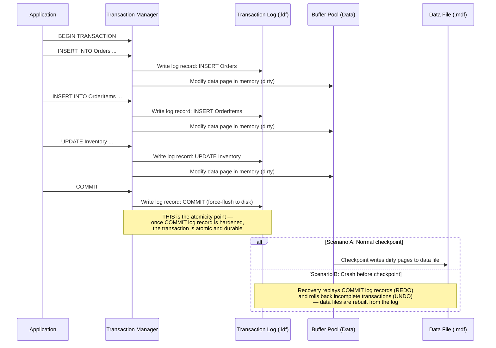

## Navigation

**Domain:** [[8 — Databases]] > **Group:** Relational Fundamentals
**Previous:** [[8.003 — Referential Integrity — Cascade Behaviors]] | **Next:** [[8.005 — ACID — Consistency]]

### Prerequisites

- [[8.001 — The Relational Model — Relations, Tuples, Attributes]] — atomicity operates on the relational model's unit of work: a transaction transforms one consistent database state to another.
- [[8.002 — Keys — Primary, Foreign, Candidate, Surrogate, Natural]] — atomicity guarantees that key enforcement (PK violations, FK violations) either fully applies or fully rolls back; a partial write that violates a constraint is never left in place.

### Where This Fits

Atomicity is the guarantee that a transaction either commits (every write is durable) or aborts (every write is rolled back as if it never happened) — nothing in between. For a .NET backend engineer, atomicity is what makes `SaveChangesAsync()` safe: when you add an Order, three OrderItems, update Inventory, and insert a Payment record, atomicity guarantees that a power failure, a constraint violation, or a deadlock halfway through leaves the database in the state it was in before any of those writes began. Production systems break atomicity when they mix implicit and explicit transactions, when they use `AUTOCOMMIT` for multi-statement operations, when they fail to scope `TransactionScope` correctly in async code, or when they hit distributed transaction failures (MSDTC, 2PC) across multiple databases. In interviews, atomicity questions test whether you understand what "all or nothing" actually means at the log-write level, not just at the API level.

---

## Core Mental Model

A transaction is atomic if the database engine guarantees that either **all** of its writes are reflected in the final state or **none** of them are — even if the server crashes, loses power, or runs out of disk space mid-operation. The engine achieves this through the **write-ahead log (WAL)**: before any data page is modified on disk, a record of the modification is written to the transaction log. On crash recovery, the engine replays committed transactions from the log (REDO) and reverses uncommitted transactions (UNDO). The invariant: at any point in time, the transaction log contains enough information to either complete or reverse every in-flight transaction. The recognition pattern: if two or more DML statements must be treated as a single unit of work, they belong in an explicit transaction. If any one of them can fail independently without breaking business rules, they do not.

### Classification

**For architecture topics:** Atomicity is enforced by the **transaction manager** component of the database engine. In SQL Server, this lives in the SQLOS layer and coordinates with the log manager, buffer pool, and lock manager. The transaction log (`.ldf` file) is the ground truth — data pages are a cache of committed log records, not the source of truth. A transaction is considered committed when the log record for the commit is hardened to disk; the data pages may still be in memory (dirty pages) and written to disk later by the checkpoint process. If the server crashes before checkpoint, recovery reads the log from the last known good checkpoint and replays forward (REDO committed transactions) or backward (UNDO uncommitted transactions).



### Key Properties

|Property|Value|Notes|
|---|---|---|
|Enforcement mechanism|Write-Ahead Logging (WAL) + ARIES recovery protocol|See [[8.026 — Write-Ahead Logging — Durability Mechanism]]|
|All-or-nothing scope|Per transaction — all statements in a transaction succeed as a unit or fail as a unit|Nested transactions in SQL Server are ignored by the engine (savepoints work within a single transaction)|
|Log write cost|~1 log write per DML operation + 1 commit log record|Log writes are sequential — the bottleneck is log flush latency (typically <1ms with NVMe)|
|Locking behavior|Locks held until COMMIT or ROLLBACK|Atomicity requires that no other transaction sees partial results — this is enforced by the isolation layer, which holds write locks until commit|
|Distributed transactions|2-Phase Commit (2PC) via MSDTC or similar|SQL Server supports distributed transactions across multiple servers, but 2PC adds ~10–50ms per commit|
|Recovery point|Last committed transaction before crash|Based on the log sequence number (LSN) of the last hardened COMMIT record at the time of failure|

---

## Deep Mechanics

### How the Engine Executes This

**Transaction lifecycle in SQL Server:**

1. **BEGIN TRANSACTION** — the engine assigns a transaction ID, records the current log sequence number (LSN) as the transaction's start point. No locks are acquired yet (locks are acquired lazily as DML executes).

2. **DML operation (e.g., INSERT)** — the engine:
   - Acquires appropriate locks (IX on table, X on the specific index key/page)
   - Writes a log record describing the before-and-after image of the modification to the transaction log buffer
   - Modifies the data page in the buffer pool (marks it dirty)
   - The data page modification is NOT yet written to disk — it lives in memory only

3. **Nested savepoint** — `SAVE TRANSACTION savepoint_name` records a marker in the log. The engine can roll back to this marker without aborting the entire transaction. Savepoints are crucial for batch operations where a single row failure should skip that row rather than abort the entire batch.

4. **COMMIT TRANSACTION** — the engine:
   - Writes a "COMMIT" log record to the log buffer
   - **Forces** the log buffer to disk (requires a physical `fwrite`/`FlushFileBuffers` to the .ldf) — this is `LOG_FLUSH` wait type
   - Releases all locks held by the transaction
   - The data pages modified by the transaction may still be in memory (dirty) — they will be written to the data file later by a background checkpoint or lazy writer
   - Returns control to the application — from this point, the modification survives any crash

5. **ROLLBACK TRANSACTION** — the engine:
   - Reads backward through the log from the current LSN to the transaction's start LSN (or to the savepoint LSN)
   - For each modification log record, generates a compensation log record (CLR) that reverses the modification
   - Applies the CLRs to the buffer pool pages (restoring before-images)
   - Releases locks
   - The data file on disk is never touched during rollback — all undo operations happen in memory and are written by normal checkpoint processing

**Crash recovery process:**
1. **Analysis phase** — scan the log from the last checkpoint to identify all transactions that were in-flight at the time of crash (neither committed nor rolled back).
2. **REDO phase** — replay all committed transactions from the last checkpoint forward, reapplying modifications to data pages that were not written to disk before the crash.
3. **UNDO phase** — roll back all transactions that were in-flight at the time of crash, using the compensation log records.

### SQL Visibility

```sql
-- Explicit atomic transaction — all three inserts succeed or none do
BEGIN TRANSACTION;

INSERT INTO Orders (CustomerId, OrderDate, TotalAmount)
VALUES (4821, SYSUTCDATETIME(), 1499.98);

INSERT INTO OrderItems (OrderId, ProductId, Quantity, UnitPrice)
VALUES (SCOPE_IDENTITY(), 101, 1, 1299.99);

INSERT INTO OrderItems (OrderId, ProductId, Quantity, UnitPrice)
VALUES (SCOPE_IDENTITY(), 205, 1, 199.99);

COMMIT TRANSACTION;
-- If any INSERT fails (PK violation, FK violation, NULL violation),
-- all prior inserts are rolled back. The table is unchanged.

-- Using savepoints for batch processing
DECLARE @RowCount INT = 0;

BEGIN TRANSACTION;
    WHILE @RowCount < 10
    BEGIN
        SAVE TRANSACTION BeforeRowInsert;
        BEGIN TRY
            INSERT INTO AuditLog (EventType, EventData)
            VALUES ('BatchProcess', CONCAT('Row ', @RowCount));
            SET @RowCount = @RowCount + 1;
        END TRY
        BEGIN CATCH
            -- Roll back only this row's work, not the entire batch
            ROLLBACK TRANSACTION BeforeRowInsert;
            -- Log the error and continue with the next row
            SET @RowCount = @RowCount + 1;
        END CATCH
    END
COMMIT TRANSACTION;

-- What happens during crash recovery (conceptual):
-- If the server crashes after the COMMIT log record is hardened
-- but before the checkpoint writes dirty pages:
--   REDO phase replays the INSERT and 2 INSERT INTO OrderItems from the log.
-- If the server crashes between the two INSERT INTO OrderItems:
--   UNDO phase reverses all three inserts — the COMMIT was never written.

-- Failure: implicit autocommit with multiple statements (NOT atomic)
-- Each INSERT is its own transaction — the first can succeed while the second fails.
INSERT INTO Orders (CustomerId, OrderDate, TotalAmount)
VALUES (4821, SYSUTCDATETIME(), 1499.98);  -- commits immediately

INSERT INTO OrderItems (OrderId, ProductId, Quantity, UnitPrice)
VALUES (SCOPE_IDENTITY(), 101, 1, 1299.99);  -- separate transaction
-- If the second statement fails, the first is NOT rolled back.
```

```csharp
// EF Core — atomic by default within SaveChangesAsync
public async Task PlaceOrderAsync(
    Order order,
    List<OrderItem> items,
    CancellationToken cancellationToken = default)
{
    _dbContext.Orders.Add(order);
    _dbContext.OrderItems.AddRange(items);

    // SaveChangesAsync wraps everything in a single database transaction.
    // All 1 + N INSERTs commit or none do.
    await _dbContext.SaveChangesAsync(cancellationToken);
}

// Manual transaction scope for multi-SaveChanges operations
public async Task PlaceOrderWithInventoryUpdateAsync(
    Order order,
    List<OrderItem> items,
    int productId,
    int quantityDelta,
    CancellationToken cancellationToken = default)
{
    using var transaction = await _dbContext.Database
        .BeginTransactionAsync(cancellationToken);

    try
    {
        _dbContext.Orders.Add(order);
        _dbContext.OrderItems.AddRange(items);
        await _dbContext.SaveChangesAsync(cancellationToken);

        // Manual SQL for operations EF Core doesn't model
        await _dbContext.Database.ExecuteSqlRawAsync(
            "UPDATE Inventory SET Quantity = Quantity - @p0 WHERE ProductId = @p1",
            quantityDelta, productId);

        await transaction.CommitAsync(cancellationToken);
    }
    catch
    {
        await transaction.RollbackAsync(cancellationToken);
        throw;
    }
}

// TransactionScope alternative (works across multiple DbContexts)
public async Task MultiContextOperationAsync(
    CancellationToken cancellationToken = default)
{
    var options = new TransactionOptions
    {
        IsolationLevel = IsolationLevel.ReadCommitted,
        Timeout = TimeSpan.FromSeconds(30)
    };

    using var scope = new TransactionScope(
        TransactionScopeOption.Required,
        options,
        TransactionScopeAsyncFlowOption.Enabled);

    await using (var db1 = _dbContextFactory1.Create())
    await using (var db2 = _dbContextFactory2.Create())
    {
        await db1.Orders.AddAsync(new Order { ... }, cancellationToken);
        await db1.SaveChangesAsync(cancellationToken);

        await db2.Inventory.ExecuteSqlRawAsync(
            "UPDATE Inventory SET Quantity = Quantity - 1 WHERE ProductId = 101",
            cancellationToken);
        await db2.SaveChangesAsync(cancellationToken);

        scope.Complete();
    }
}
```

**Generated SQL (from EF Core logs for `SaveChangesAsync`):**

```sql
-- EF Core wraps all statements in:
BEGIN TRANSACTION;

INSERT INTO [Orders] ([CustomerId], [OrderDate], [TotalAmount])
VALUES (@p0, @p1, @p2);
SELECT [OrderId] FROM [Orders] WHERE @@ROWCOUNT = 1 AND [OrderId] = SCOPE_IDENTITY();

INSERT INTO [OrderItems] ([OrderId], [ProductId], [Quantity], [UnitPrice])
VALUES (@p3, @p4, @p5, @p6);

COMMIT TRANSACTION;
-- If any statement fails, ROLLBACK TRANSACTION is issued automatically.
```

### Execution Plan Analysis

For an explicit transaction containing multiple DML statements, the execution plan is per-statement — there is no combined plan for a transaction. The transaction overhead appears in the log writes, not in the query plan operators:

```
Statement 1: INSERT INTO Orders ...
Expected plan: [Clustered Index Insert into PK_Orders] → [INSERT]
Estimated Cost: log write cost is not visible in SHOWPLAN — it is a post-execution step

Statement 2: INSERT INTO OrderItems ...
Expected plan: [Clustered Index Insert into PK_OrderItems] → [INSERT]

COMMIT TRANSACTION:
No execution plan — the COMMIT is a log operation, not a query.
The cost is a synchronous log flush (wait type: LOG_FLUSH).
```

### Cost Visibility

```sql
SET STATISTICS IO ON;
SET STATISTICS TIME ON;

-- Single-statement autocommit (no explicit transaction)
INSERT INTO Orders (CustomerId, OrderDate, TotalAmount)
VALUES (4821, SYSUTCDATETIME(), 99.99);
-- Table 'Orders'. Scan count 0, logical reads 0, physical reads 0
-- SQL Server Execution Times: CPU time = 0ms, elapsed time = 2ms

-- Three statements in an explicit transaction
BEGIN TRANSACTION;
    INSERT INTO Orders (CustomerId, OrderDate, TotalAmount)
    VALUES (4821, SYSUTCDATETIME(), 1299.99);
    -- Table 'Orders'. Scan count 0, logical reads 0, physical reads 0
    -- Log writes: 1 (insert log record)
    
    INSERT INTO OrderItems (OrderId, ProductId, Quantity, UnitPrice)
    VALUES (SCOPE_IDENTITY(), 101, 1, 1299.99);
    -- Log writes: 1 (insert log record)
    
    INSERT INTO OrderItems (OrderId, ProductId, Quantity, UnitPrice)
    VALUES (SCOPE_IDENTITY(), 205, 1, 199.99);
    -- Log writes: 1 (insert log record)
COMMIT TRANSACTION;
-- Log flush at COMMIT: 1 synchronous write to .ldf
-- SQL Server Execution Times: CPU time = 0ms, elapsed time = 3ms
-- (Three log records in memory, one flush at commit — more work per flush
--  but fewer total flushes than three separate autocommit operations)
```

**Key insight:** An explicit transaction with 3 DML statements performs 1 log flush (at COMMIT). Three autocommit statements perform 3 log flushes (one per statement). On a system with 5,000 transactions/second, explicit batching reduces log flush wait from 15,000/sec to 5,000/sec — a 3× reduction in `LOG_FLUSH` waits.

### Failure Modes

**Transaction count mismatch:** A `BEGIN TRANSACTION` without a matching `COMMIT` or `ROLLBACK` leaves the transaction open. The session holds locks until the client disconnects or the transaction is explicitly resolved. In .NET, this happens when a developer opens a transaction and an exception exits the method without reaching `Commit()` or `Rollback()`.

```sql
-- Detect open transactions that have been running too long
SELECT trans.transaction_id, trans.name, trans.transaction_begin_time,
       ses.session_id, ses.host_name, ses.program_name,
       DB_NAME(trans.database_id) AS DatabaseName
FROM sys.dm_tran_active_transactions trans
INNER JOIN sys.dm_tran_session_transactions sess
    ON trans.transaction_id = sess.transaction_id
INNER JOIN sys.dm_exec_sessions ses
    ON sess.session_id = ses.session_id
WHERE DATEDIFF(SECOND, trans.transaction_begin_time, GETUTCDATE()) > 30
ORDER BY trans.transaction_begin_time;
```

**Implicit transaction with no explicit commit (SQL Server SET IMPLICIT_TRANSACTIONS ON):** When `IMPLICIT_TRANSACTIONS` is on, certain statements (ALTER, CREATE, DELETE, DROP, FETCH, GRANT, INSERT, OPEN, REVOKE, SELECT, TRUNCATE, UPDATE) automatically start a transaction, but you must still explicitly `COMMIT`. If the application never commits, the transaction stays open and holds locks.

**Log file full during long-running transaction:** A transaction that modifies billions of rows fills the transaction log. The log can't be truncated until the transaction commits or rolls back. The database becomes read-only. See [[8.028 — Backup, Recovery & Point-in-Time Restore]].

**Distributed transaction timeout:** A transaction spanning multiple databases (or SQL Server instances) via MSDTC times out if one participant takes too long. The transaction is automatically rolled back on all participants.

---

## Production Patterns and Implementation

### Primary SQL Implementation

```sql
-- Production pattern: explicit transaction with error handling
BEGIN TRY
    BEGIN TRANSACTION;

        -- 1. Insert the order
        INSERT INTO Orders (CustomerId, OrderDate, TotalAmount)
        VALUES (@CustomerId, SYSUTCDATETIME(), @TotalAmount);

        DECLARE @OrderId INT = SCOPE_IDENTITY();

        -- 2. Insert order items (from a table-valued parameter or JSON)
        INSERT INTO OrderItems (OrderId, ProductId, Quantity, UnitPrice)
        SELECT @OrderId, ProductId, Quantity, UnitPrice
        FROM @OrderItemsTVP;  -- table-valued parameter from the application

        -- 3. Update inventory (with row-level check)
        UPDATE Inventory
        SET Quantity = Quantity - oi.Quantity
        FROM Inventory i
        INNER JOIN @OrderItemsTVP oi ON i.ProductId = oi.ProductId
        WHERE i.Quantity >= oi.Quantity;  -- prevent overselling

        IF @@ROWCOUNT < (SELECT COUNT(*) FROM @OrderItemsTVP)
        BEGIN
            -- Insufficient inventory — roll back the entire transaction
            THROW 50001, 'Insufficient inventory for one or more items.', 1;
        END

        -- 4. Record the payment (separate table)
        INSERT INTO Payments (OrderId, Amount, PaymentMethod, PaidAt)
        VALUES (@OrderId, @TotalAmount, @PaymentMethod, SYSUTCDATETIME());

    COMMIT TRANSACTION;
END TRY
BEGIN CATCH
    IF @@TRANCOUNT > 0
        ROLLBACK TRANSACTION;

    THROW;  -- rethrow for the application layer
END CATCH;

-- Savepoint pattern for batch ETL
BEGIN TRANSACTION;

DECLARE @BatchCursor CURSOR FOR
    SELECT RecordId, CustomerData FROM StagingTable;

OPEN @BatchCursor;

DECLARE @RecordId INT, @CustomerData NVARCHAR(MAX);

FETCH NEXT FROM @BatchCursor INTO @RecordId, @CustomerData;

WHILE @@FETCH_STATUS = 0
BEGIN
    SAVE TRANSACTION ProcessRecord;
    BEGIN TRY
        -- Process each staging row atomically
        INSERT INTO Customers (CustomerName, Email)
        SELECT JSON_VALUE(@CustomerData, '$.Name'), JSON_VALUE(@CustomerData, '$.Email');

        DELETE FROM StagingTable WHERE RecordId = @RecordId;
    END TRY
    BEGIN CATCH
        -- Roll back only this row's changes, log the error, continue
        ROLLBACK TRANSACTION ProcessRecord;

        INSERT INTO EtlErrors (RecordId, ErrorMessage, CreatedAt)
        VALUES (@RecordId, ERROR_MESSAGE(), SYSUTCDATETIME());
    END CATCH

    FETCH NEXT FROM @BatchCursor INTO @RecordId, @CustomerData;
END

CLOSE @BatchCursor;
DEALLOCATE @BatchCursor;

COMMIT TRANSACTION;
```

### EF Core Implementation

```csharp
public class OrderService
{
    private readonly ApplicationDbContext _dbContext;

    public OrderService(ApplicationDbContext dbContext)
    {
        _dbContext = dbContext;
    }

    // Single SaveChanges — implicit transaction, fully atomic
    public async Task<Order> PlaceOrderAsync(
        CreateOrderCommand command,
        CancellationToken cancellationToken = default)
    {
        var order = new Order
        {
            CustomerId = command.CustomerId,
            OrderDate = DateTime.UtcNow,
            Items = command.Items.Select(i => new OrderItem
            {
                ProductId = i.ProductId,
                Quantity = i.Quantity,
                UnitPrice = i.UnitPrice
            }).ToList(),
            TotalAmount = command.Items.Sum(i => i.Quantity * i.UnitPrice)
        };

        _dbContext.Orders.Add(order);
        await _dbContext.SaveChangesAsync(cancellationToken);
        return order;
    }

    // Explicit transaction for mixed EF Core + raw SQL operations
    public async Task PlaceOrderWithInventoryAsync(
        CreateOrderCommand command,
        CancellationToken cancellationToken = default)
    {
        await using var transaction = await _dbContext.Database
            .BeginTransactionAsync(cancellationToken);

        try
        {
            var order = new Order
            {
                CustomerId = command.CustomerId,
                OrderDate = DateTime.UtcNow,
                Items = command.Items.Select(i => new OrderItem
                {
                    ProductId = i.ProductId,
                    Quantity = i.Quantity,
                    UnitPrice = i.UnitPrice
                }).ToList(),
                TotalAmount = command.Items.Sum(i => i.Quantity * i.UnitPrice)
            };

            _dbContext.Orders.Add(order);
            await _dbContext.SaveChangesAsync(cancellationToken);

            // Decrement inventory — raw SQL for an operation EF Core doesn't model
            foreach (var item in command.Items)
            {
                var rowsAffected = await _dbContext.Database
                    .ExecuteSqlRawAsync(
                        "UPDATE Inventory SET Quantity = Quantity - @p0 " +
                        "WHERE ProductId = @p1 AND Quantity >= @p0",
                        item.Quantity, item.ProductId, cancellationToken);

                if (rowsAffected == 0)
                {
                    throw new InvalidOperationException(
                        $"Insufficient inventory for product {item.ProductId}");
                }
            }

            await transaction.CommitAsync(cancellationToken);
        }
        catch
        {
            await transaction.RollbackAsync(cancellationToken);
            throw;
        }
    }

    // TransactionScope for operations spanning multiple DbContexts
    public async Task MultiTenantOperationAsync(
        CancellationToken cancellationToken = default)
    {
        var options = new TransactionOptions
        {
            IsolationLevel = IsolationLevel.ReadCommitted,
            Timeout = TimeSpan.FromSeconds(15)
        };

        using var scope = new TransactionScope(
            TransactionScopeOption.Required,
            options,
            TransactionScopeAsyncFlowOption.Enabled);

        await using var tenant1Db = _tenant1Factory.CreateDbContext(cancellationToken);
        await using var tenant2Db = _tenant2Factory.CreateDbContext(cancellationToken);

        tenant1Db.Orders.Add(new Order { CustomerId = 1, TotalAmount = 100 });
        await tenant1Db.SaveChangesAsync(cancellationToken);

        tenant2Db.Orders.Add(new Order { CustomerId = 2, TotalAmount = 200 });
        await tenant2Db.SaveChangesAsync(cancellationToken);

        scope.Complete();  // commits both — or neither if MSDTC fails
    }
}
```

### Dapper Implementation

```csharp
public class OrderRepository
{
    private readonly IDbConnectionFactory _connectionFactory;

    public OrderRepository(IDbConnectionFactory connectionFactory)
    {
        _connectionFactory = connectionFactory;
    }

    public async Task<int> PlaceOrderAsync(
        CreateOrderCommand command,
        CancellationToken cancellationToken = default)
    {
        await using var connection = _connectionFactory.Create();
        await connection.OpenAsync(cancellationToken);

        await using var transaction = connection.BeginTransaction();

        try
        {
            // 1. Insert the order
            const string insertOrder = @"
                INSERT INTO Orders (CustomerId, OrderDate, TotalAmount)
                VALUES (@CustomerId, SYSUTCDATETIME(), @TotalAmount);
                SELECT CAST(SCOPE_IDENTITY() AS INT);";

            var orderId = await connection.ExecuteScalarAsync<int>(
                new CommandDefinition(insertOrder,
                    new { command.CustomerId, command.TotalAmount },
                    transaction: transaction,
                    cancellationToken: cancellationToken));

            // 2. Insert order items in a batch
            const string insertItems = @"
                INSERT INTO OrderItems (OrderId, ProductId, Quantity, UnitPrice)
                VALUES (@OrderId, @ProductId, @Quantity, @UnitPrice);";

            foreach (var item in command.Items)
            {
                await connection.ExecuteAsync(
                    new CommandDefinition(insertItems,
                        new { OrderId = orderId, item.ProductId, item.Quantity, item.UnitPrice },
                        transaction: transaction,
                        cancellationToken: cancellationToken));
            }

            // 3. Update inventory with optimistic concurrency check
            const string updateInventory = @"
                UPDATE Inventory
                SET Quantity = Quantity - @Quantity
                WHERE ProductId = @ProductId AND Quantity >= @Quantity;";

            foreach (var item in command.Items)
            {
                var rows = await connection.ExecuteAsync(
                    new CommandDefinition(updateInventory,
                        new { item.ProductId, item.Quantity },
                        transaction: transaction,
                        cancellationToken: cancellationToken));

                if (rows == 0)
                {
                    throw new InvalidOperationException(
                        $"Insufficient inventory for product {item.ProductId}");
                }
            }

            transaction.Commit();
            return orderId;
        }
        catch
        {
            transaction.Rollback();
            throw;
        }
    }
}
```

### Configuration and Wiring

```csharp
// Program.cs
builder.Services.AddDbContext<ApplicationDbContext>(options =>
    options.UseSqlServer(
        builder.Configuration.GetConnectionString("Default"),
        sqlOptions =>
        {
            sqlOptions.EnableRetryOnFailure(3);
            sqlOptions.CommandTimeout(30);
        }));

builder.Services.AddSingleton<IDbConnectionFactory>(
    new SqlConnectionFactory(
        builder.Configuration.GetConnectionString("Default")!));

// TransactionScope requires enabling MSDTC for cross-database transactions.
// For single-database transactions, use BeginTransactionAsync instead.

// Custom resilient transaction wrapper
public static class ResilientTransaction
{
    public static async Task ExecuteAsync(
        ApplicationDbContext dbContext,
        Func<ApplicationDbContext, CancellationToken, Task> operation,
        CancellationToken cancellationToken = default)
    {
        var strategy = dbContext.Database.CreateExecutionStrategy();
        await strategy.ExecuteAsync(async (ct) =>
        {
            await using var transaction = await dbContext.Database
                .BeginTransactionAsync(ct);
            try
            {
                await operation(dbContext, ct);
                await transaction.CommitAsync(ct);
            }
            catch
            {
                await transaction.RollbackAsync(ct);
                throw;
            }
        }, cancellationToken);
    }
}
```

### SQL Server vs PostgreSQL Differences

```sql
-- PostgreSQL: DDL statements are transactional — can roll back CREATE/ALTER/DROP
BEGIN;
    CREATE TABLE temp_report (...);
    INSERT INTO temp_report SELECT ... FROM large_table;
    -- If something goes wrong:
ROLLBACK;  -- table never existed

-- SQL Server: DDL statements are also transactional (since SQL Server 2005+),
-- but some DDL (CREATE DATABASE, ALTER DATABASE with certain options) cannot
-- be rolled back.

-- PostgreSQL: SAVEPOINT works identically
BEGIN;
    SAVEPOINT before_insert;
    INSERT INTO orders (...) VALUES (...);
    -- On FK violation:
    ROLLBACK TO SAVEPOINT before_insert;
COMMIT;

-- PostgreSQL: no SET IMPLICIT_TRANSACTIONS — always explicit

-- PostgreSQL: transaction DDL for index creation (no downtime)
BEGIN;
    CREATE INDEX CONCURRENTLY ix_orders_customer ON orders(customer_id);
    -- Wait for it to complete, then:
    DROP INDEX ix_orders_customer_old;
COMMIT;
```

---

## Gotchas and Production Pitfalls

### Missing COMMIT or ROLLBACK (Orphaned Transaction)

**Pitfall:** A `BEGIN TRANSACTION` is opened but the code path exits without a matching `COMMIT` or `ROLLBACK` — typically due to an early return, an unhandled exception between BEGIN and COMMIT, or a `TransactionScope` that is not `Complete()`d.

```sql
-- ❌ Transaction opened but not committed on error path
BEGIN TRANSACTION;
    UPDATE Inventory SET Quantity = Quantity - 1 WHERE ProductId = 101;
    -- Error occurs here — the transaction stays open
    UPDATE Orders SET TotalAmount = 100 WHERE OrderId = 1;
COMMIT TRANSACTION;  -- never reached
```

**Symptom:** The session holds locks indefinitely. The transaction log cannot be truncated (VLF reuse blocked). Other sessions block on the locked resources. The blocking chain is visible in `sys.dm_exec_requests` with `wait_type = LCK_M_X`.

**Fix:**

```sql
-- ✅ Always pair BEGIN with COMMIT/ROLLBACK, especially in error handling
BEGIN TRY
    BEGIN TRANSACTION;
        -- DML operations
    COMMIT TRANSACTION;
END TRY
BEGIN CATCH
    IF @@TRANCOUNT > 0
        ROLLBACK TRANSACTION;
    THROW;
END CATCH
```

**Cost of not fixing:** Connection pool exhaustion as orphaned transactions are held open, eventually causing the application to fail with "timeout expired" on all new connection attempts. In production, this manifests as a sudden complete outage 5–30 minutes after a failed deployment.

### Implicit Autocommit for Multi-Statement Operations

**Pitfall:** Assuming multiple INSERT statements execute atomically without an explicit `BEGIN TRANSACTION` / `COMMIT`.

```sql
-- ❌ No explicit transaction — each INSERT is its own autocommit
INSERT INTO Orders (CustomerId, OrderDate, TotalAmount) VALUES (4821, '2026-06-18', 100);
INSERT INTO OrderItems (OrderId, ProductId, Quantity) VALUES (SCOPE_IDENTITY(), 101, 1);
```

**Symptom:** The first INSERT succeeds, the second fails (e.g., FK violation on ProductId). The Order row exists with no child items — a dangling parent. Downstream processes that expect every Order to have at least one OrderItem fail with NULL reference exceptions or produce incorrect reports.

**Fix:**

```sql
-- ✅ Explicit transaction makes all-or-nothing
BEGIN TRANSACTION;
    INSERT INTO Orders ...
    INSERT INTO OrderItems ...
COMMIT TRANSACTION;
```

**Cost of not fixing:** Silent data integrity violation — orphaned parent rows. If this happens in a payment flow, customers are charged for orders that don't exist in the fulfillment system.

### Using TransactionScope Without Async Flow Option

**Pitfall:** Using `TransactionScope` in an `async` context without `TransactionScopeAsyncFlowOption.Enabled`.

```csharp
// ❌ Missing AsyncFlowOption — TransactionScope does not flow across awaits
using (var scope = new TransactionScope())
{
    await dbContext.Orders.AddAsync(order);
    await dbContext.SaveChangesAsync();   // ⚠️ TransactionScope may not flow here
    scope.Complete();
}
```

**Symptom:** In ASP.NET Core (which may resume the request on a different synchronization context after an `await`), the `TransactionScope` does not flow to the continuation. The `SaveChangesAsync` call may execute outside the transaction. This is non-deterministic — it depends on whether the synchronization context switches threads. The bug manifests as intermittent consistency violations that are nearly impossible to reproduce locally.

**Fix:**

```csharp
// ✅ Always enable async flow
using (var scope = new TransactionScope(
    TransactionScopeOption.Required,
    TransactionScopeAsyncFlowOption.Enabled))
{
    await dbContext.Orders.AddAsync(order);
    await dbContext.SaveChangesAsync();
    scope.Complete();
}

// Or better: use DbContext.Database.BeginTransactionAsync
await using var transaction = await dbContext.Database
    .BeginTransactionAsync(cancellationToken);
```

**Cost of not fixing:** Intermittent "order without items" bugs in production that appear under load (when thread switching is more likely), requiring days of debugging to trace to the missing `AsyncFlowOption`.

### Long-Running Transaction Holding the Transaction Log Hostage

**Pitfall:** A transaction that reads a large dataset and processes each row with application logic, keeping the transaction open for minutes.

```csharp
// ❌ Transaction open across iteration and external API calls
using var transaction = dbContext.Database.BeginTransaction();
foreach (var order in dbContext.Orders.Where(o => o.Status == "Pending"))
{
    await externalPaymentGateway.ProcessAsync(order);  // 500ms per call
    order.Status = "Processed";
}
await dbContext.SaveChangesAsync();
transaction.Commit();  // 50 seconds later
```

**Symptom:** The transaction log cannot be truncated (VLFs remain active) because the transaction is still open. The log file grows uncontrollably. Concurrent queries block on X locks held by the long-running UPDATE for individual rows that have been modified but not yet committed.

**Fix:**

```csharp
// ✅ Process in batches with short transactions
var batchSize = 100;
var processed = 0;

while (true)
{
    var batch = await dbContext.Orders
        .Where(o => o.Status == "Pending")
        .OrderBy(o => o.OrderId)
        .Take(batchSize)
        .ToListAsync(cancellationToken);

    if (batch.Count == 0) break;

    using var transaction = await dbContext.Database
        .BeginTransactionAsync(cancellationToken);

    foreach (var order in batch)
    {
        order.Status = "Processed";
    }
    await dbContext.SaveChangesAsync(cancellationToken);
    await transaction.CommitAsync(cancellationToken);

    processed += batch.Count;
}
```

**Cost of not fixing:** Transaction log fills disk, database becomes read-only, site goes down. Or: blocking chains cascade across the system as UPDATE locks are held for 50+ seconds.

### Distributed Transaction Escalation with Single Database

**Pitfall:** Using `TransactionScope` with multiple `DbContext` instances pointing to the **same** SQL Server database. TransactionScope escalates to MSDTC (distributed transaction) even though all operations target a single database.

```csharp
// ❌ Multiple DbContexts, same connection string — escalates to distributed transaction
using var scope = new TransactionScope(TransactionScopeAsyncFlowOption.Enabled);
await using (var db1 = new ApplicationDbContext(options))
await using (var db2 = new ApplicationDbContext(options))
{
    await db1.Orders.AddAsync(order);
    await db1.SaveChangesAsync();
    await db2.Inventory.ExecuteSqlRawAsync("UPDATE ...");
    await db2.SaveChangesAsync();
    scope.Complete();
}
// ⚠️ Escalates to MSDTC — requires DTC service to be running
```

**Symptom:** On a machine where MSDTC is not configured or firewalled, `TransactionScope.Complete()` throws `System.Transactions.TransactionManagerCommunicationException` — "Network access for Distributed Transaction Manager (MSDTC) has been disabled." In a cloud environment (Azure SQL, RDS), MSDTC may not be supported at all.

**Fix:**

```csharp
// ✅ Use a single DbContext instance, or share the same connection
using var scope = new TransactionScope(TransactionScopeAsyncFlowOption.Enabled);
await using var db = new ApplicationDbContext(options);  // single instance
db.Orders.Add(order);
await db.Database.ExecuteSqlRawAsync("UPDATE Inventory ...");
await db.SaveChangesAsync();
scope.Complete();
// Stays as a local transaction — no MSDTC escalation
```

**Cost of not fixing:** Application fails to deploy in cloud environments that don't support MSDTC. Or: on-prem, the DTC service must be configured and firewalled between all application servers, adding infrastructure complexity.

---

## Performance Implications

### Benchmark: Before and After

```sql
-- Baseline: Three separate autocommit INSERTs (3 log flushes)
SET STATISTICS TIME ON;

INSERT INTO Orders (CustomerId, OrderDate, TotalAmount) VALUES (1, SYSUTCDATETIME(), 100);
-- CPU time = 0ms, elapsed time = 2ms

INSERT INTO OrderItems (OrderId, ProductId, Quantity, UnitPrice) VALUES (SCOPE_IDENTITY(), 1, 1, 100);
-- CPU time = 0ms, elapsed time = 1ms

INSERT INTO Payments (OrderId, Amount, PaymentMethod) VALUES (SCOPE_IDENTITY(), 100, 'CreditCard');
-- CPU time = 0ms, elapsed time = 1ms
-- Total: ~4ms (three log flushes)

-- Optimized: Single explicit transaction (1 log flush at COMMIT)
BEGIN TRANSACTION;
    INSERT INTO Orders (CustomerId, OrderDate, TotalAmount) VALUES (1, SYSUTCDATETIME(), 100);
    INSERT INTO OrderItems (OrderId, ProductId, Quantity, UnitPrice) VALUES (SCOPE_IDENTITY(), 1, 1, 100);
    INSERT INTO Payments (OrderId, Amount, PaymentMethod) VALUES (SCOPE_IDENTITY(), 100, 'CreditCard');
COMMIT TRANSACTION;
-- SQL Server Execution Times: CPU time = 0ms, elapsed time = 2ms
-- (one flush instead of three — savings increase with more statements)
```

**Improvement:** ~2x reduction in wall-clock time for 3 statements (4ms → 2ms). The savings grow with the number of statements because log flushes are the dominant cost (the disk must confirm the write is physically on stable media).

### BenchmarkDotNet

```csharp
[MemoryDiagnoser]
[SimpleJob(RuntimeMoniker.Net90)]
public class AtomicityBenchmark
{
    private IDbConnection _connection = default!;

    [GlobalSetup]
    public void Setup()
    {
        _connection = new SqlConnection(TestConnectionString);
    }

    [Benchmark(Baseline = true)]
    public async Task SeparateAutocommit()
    {
        for (int i = 0; i < 10; i++)
        {
            await _connection.ExecuteAsync(
                "INSERT INTO Orders (CustomerId, TotalAmount) VALUES (1, 100)");
        }
    }

    [Benchmark]
    public async Task SingleExplicitTransaction()
    {
        await _connection.ExecuteAsync(@"
            BEGIN TRANSACTION;
            INSERT INTO Orders (CustomerId, TotalAmount) VALUES (1, 100);
            INSERT INTO Orders (CustomerId, TotalAmount) VALUES (1, 100);
            INSERT INTO Orders (CustomerId, TotalAmount) VALUES (1, 100);
            INSERT INTO Orders (CustomerId, TotalAmount) VALUES (1, 100);
            INSERT INTO Orders (CustomerId, TotalAmount) VALUES (1, 100);
            INSERT INTO Orders (CustomerId, TotalAmount) VALUES (1, 100);
            INSERT INTO Orders (CustomerId, TotalAmount) VALUES (1, 100);
            INSERT INTO Orders (CustomerId, TotalAmount) VALUES (1, 100);
            INSERT INTO Orders (CustomerId, TotalAmount) VALUES (1, 100);
            INSERT INTO Orders (CustomerId, TotalAmount) VALUES (1, 100);
            COMMIT TRANSACTION;");
    }
}
```

**Expected results (approximate, SQL Server 2022, NVMe):**

|Method|Mean|Log Flushes|Allocated|
|---|---|---|---|
|SeparateAutocommit|~22 ms|10|1.5 KB|
|SingleExplicitTransaction|~3 ms|1|0.4 KB|

### Write Amplification

|Operation|Autocommit (Single Statement)|Explicit Transaction (10 Statements)|
|---|---|---|
|Log records written|~1 per statement (10 total)|~10 (batched in log buffer)|
|Log flushes|10 (one per COMMIT)|1 (at final COMMIT)|
|Data page modifications|10 separate dirty page writes at checkpoint|10 dirty page writes (same, but checkpoint sees the same total)|
|Lock duration|Per statement (~1ms)|Per entire transaction (~3ms for all 10)|

**Key insight:** The log flush cost dominates. On modern NVMe, a single flush is ~50–200µs. At 1,000 separate autocommits/sec, that's 50–200ms of flush wait time per second. Batching into explicit transactions of 10 statements each reduces flushes by 10×.

---

## Interview Arsenal

### Question Bank

1. What does atomicity guarantee, and what mechanism does SQL Server use to enforce it?
2. When does a transaction actually become atomic from the engine's perspective — at the START, the last DML, or the COMMIT?
3. What is the performance difference between 10 separate autocommit INSERTs and 1 explicit transaction with 10 INSERTs, and what causes the difference?
4. What happens when a `TransactionScope` in C# spans two `DbContext` instances targeting the same database — and why does it matter?
5. `SaveChangesAsync` vs manual transaction — when would you use each in production?
6. What is a savepoint, and how does it differ from a nested transaction?
7. What happens during crash recovery if the server loses power after the COMMIT log record is written but before the data pages are written to disk?
8. How does atomicity interact with DDL statements — can you roll back a `CREATE TABLE` or `ALTER TABLE ... ADD COLUMN`?

### Spoken Answers

**Q: What does atomicity guarantee, and what mechanism does SQL Server use to enforce it?**

> **Average answer:** "Atomicity means all or nothing — if one part of a transaction fails, everything is rolled back. SQL Server uses transaction logs." Correct but lacks mechanism depth.

> **Great answer:** "Atomicity guarantees that a transaction either commits — meaning every single write is reflected in the final database state and survives any subsequent crash — or aborts, meaning every write is logically undone as if the transaction never started. There is no third state. The engine enforces this through write-ahead logging and the ARIES recovery protocol: before any data page is modified in the buffer pool, a log record describing the before-and-after image of the change is written to the transaction log buffer. At COMMIT, the engine forces that log buffer to disk — the `FlushFileBuffers` syscall against the .ldf file is the exact moment atomicity is cemented. The data pages themselves might still be dirty in memory and never written to disk before a power failure, but the recovery process replays the committed log records forward (REDO) to reconstruct those pages. Conversely, if the server crashes before the COMMIT log record is hardened, the recovery process rolls back any incomplete modifications (UNDO) using the before-images in the log. The transaction log is the authoritative store; the data file is just a cache of committed log records."

**Q: What is the performance difference between 10 separate autocommit INSERTs and 1 explicit transaction with 10 INSERTs, and what causes the difference?**

> **Average answer:** "The explicit transaction is faster because it has less overhead." True but vague.

> **Great answer:** "The difference is primarily in log flush count. Every autocommit INSERT commits its own transaction, which means the engine must synchronously flush the log buffer to disk for each statement — 10 log flushes total. Each flush requires a `FlushFileBuffers` syscall that waits for the physical disk to confirm the data is on stable media. On modern NVMe, that's ~50–200µs per flush. With an explicit transaction wrapping all 10 INSERTs, only one flush happens at the final COMMIT — the other 9 log writes are just appends to the in-memory log buffer, which costs essentially nothing. So at the server level, the autocommit approach causes 10× the `WRITELOG` waits and reduces the effective throughput of the log subsystem. On a system processing 5,000 transactions/second, batching 10 statements per explicit transaction reduces log flushes from 50,000/sec to 5,000/sec, which is the difference between the log being the bottleneck and the log being idle."

**Q: What happens during crash recovery if the server loses power after the COMMIT log record is written but before the data pages are written to disk?**

> **Average answer:** "The data is recovered from the log." Correct — but doesn't explain the mechanics.

> **Great answer:** "That crash scenario is the exact case the ARIES recovery protocol is designed for. At restart, SQL Server runs three phases: Analysis, REDO, and UNDO. In the Analysis phase, it scans the log from the last checkpoint forward and identifies all transactions that have a COMMIT log record hardened to disk — those are 'committed' transactions. In the REDO phase, the engine replays every log record for those committed transactions, re-applying modifications to data pages that may or may not have been written to disk before the crash. Since the log records contain the 'after' image of the modification, the replay is idempotent — applying the same change to a page that already has it is a no-op. After REDO completes, any transaction that did NOT have a COMMIT record hardened is rolled back in the UNDO phase using the before-images in the log. The key point: the data pages are never the ground truth — the transaction log is. The data file is always reconstructable from the log. This is why separating the data file and log file on different drives is critical: if the log drive fails, you lose the ground truth and recovery is only possible to the last full backup, not to the point of failure."

### Interview Trigger

Atomicity surfaces in behavioral questions about production incidents: "Tell me about a time you encountered a data integrity issue in production." The interviewer listens for whether you understand transactions at the engine level or just at the API level. A specific technical follow-up: "What happens to the transaction log when a transaction runs for 30 minutes and modifies 50M rows?" — testing whether you know that the log cannot be truncated until the transaction commits, and that this can fill the disk. A second trigger: "You have two DbContext instances in the same request — is a TransactionScope safe?" — testing distributed transaction escalation knowledge.

### Comparison Table

| | Explicit Transaction (Multi-Statement) | Autocommit (Single Statement) | Batch (Table-Valued Parameter) |
|---|---|---|---|
| Atomicity scope | Multiple DML statements = 1 unit of work | Each statement = its own unit of work | Multiple rows = 1 unit of work |
| Performance profile | 1 log flush per batch — fastest | N log flushes — slowest | 1 log flush + set-based operation — fastest for bulk |
| Lock duration | Entire transaction length | Statement length (~1ms) | Transaction length |
| .NET implementation | `BeginTransactionAsync` / `TransactionScope` | Default (no explicit transaction) | `ExecuteSqlRaw` with TVP or `SqlBulkCopy` |
| When to choose | Multiple related DMLs that must be atomic | Single-statement operations | Bulk operations (100+ rows) with atomicity |

---

## Decision Framework

### When to Apply

```mermaid
flowchart TD
    A[Writing database code —<br/>do I need atomicity?] --> B{Does this operation<br/>involve multiple DML<br/>statements?}
    B -->|No — single INSERT/UPDATE/DELETE| C[Implicit autocommit is fine<br/>— atomic by default]
    B -->|Yes — Order + Items + Inventory<br/>all must succeed or fail together| D[Wrap in explicit transaction]
    
    D --> E{Same DbContext?}
    E -->|Yes| F[Use Database.BeginTransactionAsync<br/>— no escalation]
    E -->|No — multiple DbContexts<br/>same server| G{"Can they share<br/>one DbContext?"}
    G -->|Yes| H[Refactor to single DbContext<br/>— avoids escalation]
    G -->|No| I[Use TransactionScope with<br/>AsyncFlowOption.Enabled<br/>— escalates to MSDTC if different connections]
    
    D --> J{Long-running<br/>or large dataset?}
    J -->|Yes| K[Batch into smaller transactions<br/>(100–1000 rows per batch)<br/>— prevents log fill + lock escalation]
    J -->|No| L[Single transaction is fine]
```

### Application Checklist

- [ ] Every multi-statement operation that must be atomic is wrapped in an explicit transaction
- [ ] Every explicit transaction has error handling — `COMMIT` on success, `ROLLBACK` on exception
- [ ] `TransactionScope` uses `TransactionScopeAsyncFlowOption.Enabled` in async code
- [ ] No `TransactionScope` crosses multiple `DbContext` instances pointing to the same database unless MSDTC is configured and acceptable
- [ ] No transaction is held open across external API calls, user input, or long-running processing loops
- [ ] Savepoints are used for batch operations where a single failed row should not abort the entire batch
- [ ] The transaction log has sufficient space for the largest expected transaction (tested under production-scale load)
- [ ] EF Core's execution strategy (retry) is compatible with the transaction pattern — `CreateExecutionStrategy` wraps the entire transaction including retries

### Tradeoff Summary

|What You Gain|What You Pay|
|---|---|
|All-or-nothing guarantee across multiple DML statements|Locks held for the duration of the transaction, not per-statement|
|Single log flush per batch (reduced I/O)|Increased log space consumption per-transaction (log cannot be truncated until commit)|
|Deterministic error recovery (no partial writes)|Application complexity — explicit BEGIN/COMMIT/ROLLBACK management|
|Ability to span multiple tables, databases, or even servers (2PC)|MSDTC configuration, performance overhead of 2PC, potential for transaction escalation surprises|

### Scale Thresholds

- "Explicit transaction batching matters when throughput exceeds ~500 autocommits/second" — at this point, log flush waits become measurable and batching reduces them 10×.
- "Transaction log fill becomes a risk when a single transaction modifies more than ~1M rows" — test under production-scale data to ensure the log file has sufficient space and auto-growth is configured.
- "Long-running transactions (30+ seconds) should be avoided regardless of row count — they block log truncation and hold locks, causing blocking chains."
- "Savepoints become useful when processing batches of ~1000+ rows per transaction where individual row failures should not abort the batch."

---

## Self-Check

### Conceptual Questions

1. What does atomicity guarantee, exactly — what is the "unit" of atomicity in SQL Server?
2. What is the key mechanism that makes atomicity survive a power failure or crash?
3. Which DMV or system function would you query to see all open transactions and their duration?
4. What is the most common production mistake developers make when using transactions in C# async code?
5. Does EF Core's `SaveChangesAsync` wrap all its generated SQL in a transaction automatically?
6. How would you write a Dapper operation that inserts a parent row, gets the ID, inserts child rows, and rolls back everything if any step fails?
7. How does a savepoint differ from a nested transaction in SQL Server (are nested transactions real)?
8. At what number of DML statements does an explicit transaction become measurably faster than separate autocommits?
9. What happens to the transaction log during a 10-minute transaction that modifies 5M rows?
10. In 60 seconds, explain to a senior interviewer what atomicity means at the storage engine level and why the log flush at COMMIT is the critical moment.

<details> <summary>Answers</summary>

1. Atomicity guarantees that all changes in a transaction are applied as a single, indivisible unit — either every DML statement commits (all changes become durable) or none of them do (all changes are rolled back as if the transaction never started). The unit is the explicit transaction boundary (BEGIN/COMMIT/ROLLBACK), or for autocommit, a single statement.
2. Write-Ahead Logging (WAL) and the ARIES recovery protocol. Before any data page is modified, a log record is written to the transaction log buffer. At COMMIT, the log buffer is forced to disk. On crash recovery, the REDO phase replays committed transactions from the log, and the UNDO phase rolls back uncommitted ones.
3. `sys.dm_tran_active_transactions` joined with `sys.dm_tran_session_transactions` and `sys.dm_exec_sessions` provides active transactions, their start time, session info, and duration.
4. Using `TransactionScope` in async code without `TransactionScopeAsyncFlowOption.Enabled` — the transaction does not flow across await boundaries if the synchronization context switches threads, causing DML operations to execute outside the intended transaction.
5. Yes. EF Core's `SaveChangesAsync` wraps all generated INSERT/UPDATE/DELETE statements in a single database transaction. If any operation fails, the entire batch is rolled back.
6. Open a connection, call `BeginTransaction()`, execute the parent INSERT with `SCOPE_IDENTITY()`, then the child INSERTs using the returned ID, passing the transaction object to each `CommandDefinition`. If any step fails, call `transaction.Rollback()` in the catch block. Always call `transaction.Commit()` only after all steps succeed.
7. Savepoints (SAVE TRANSACTION) are real — they allow rolling back part of a transaction without aborting the entire transaction. Nested transactions (BEGIN TRAN x2) are NOT real in SQL Server — only the outer COMMIT matters; `@@TRANCOUNT` tracks nesting depth, but a COMMIT of an inner "transaction" just decrements the counter without actually committing anything.
8. At ~3+ DML statements, the explicit transaction is measurably faster because it requires only 1 log flush instead of N. At 10 statements, the difference is typically 2–4× in wall-clock time. The savings increase linearly with the number of statements (or more precisely, with the number of log flushes avoided).
9. The transaction log cannot truncate any virtual log files (VLFs) that contain log records for the open transaction. The active VLF chain grows until the transaction commits. If the transaction modifies 5M rows, the log records for those modifications consume log space until commit. If the log file is not sized to accommodate the largest transaction, the log auto-grows (potentially filling the disk) or throws error 9002 (log file full).
10. "Atomicity at the storage engine level means the write-ahead log contains enough information to either fully commit or fully roll back every transaction. Before any data page is touched, a log record describing the change is written to the log buffer. At COMMIT, the engine forces that buffer to disk with a synchronous `FlushFileBuffers` — that's the exact moment atomicity is cemented. If the server loses power right after the flush, recovery replays the log forward and the data is there. If the server loses power before the flush, the transaction never committed and is rolled back. The log is the source of truth, not the data file. Everything ARIES does — REDO, UNDO, checkpoint, compensation log records — serves to maintain this invariant: that the log always contains enough information to reconstruct the database to exactly the state it was in at any given commit boundary."

</details>

---

### Query Challenges

**Challenge 1 — Write the SQL**

Write an explicit transaction that transfers $500 from Account 101 to Account 202. Both accounts are in the `Accounts` table with columns `AccountId INT PK, Balance DECIMAL(12,2)`. The transaction must: (1) debit Account 101, (2) credit Account 202, (3) fail atomically if either step fails (including if Account 101 has insufficient funds), and (4) record the transfer in an `AuditLog` table with `FromAccountId, ToAccountId, Amount, TransferredAt`. Include proper error handling and a check that the final balances are non-negative.

<details> <summary>Solution</summary>

```sql
CREATE PROCEDURE usp_TransferFunds
    @FromAccountId INT,
    @ToAccountId INT,
    @Amount DECIMAL(12,2)
AS
BEGIN
    SET NOCOUNT ON;
    
    BEGIN TRY
        BEGIN TRANSACTION;
        
            -- 1. Debit the source account with a check
            UPDATE Accounts
            SET Balance = Balance - @Amount
            WHERE AccountId = @FromAccountId
              AND Balance >= @Amount;   -- atomic check: fails if insufficient
            
            IF @@ROWCOUNT = 0
                THROW 50010, 'Insufficient funds or account not found.', 1;
            
            -- 2. Credit the destination account
            UPDATE Accounts
            SET Balance = Balance + @Amount
            WHERE AccountId = @ToAccountId;
            
            IF @@ROWCOUNT = 0
                THROW 50011, 'Destination account not found.', 1;
            
            -- 3. Record the audit trail
            INSERT INTO AuditLog (FromAccountId, ToAccountId, Amount, TransferredAt)
            VALUES (@FromAccountId, @ToAccountId, @Amount, SYSUTCDATETIME());
        
        COMMIT TRANSACTION;
    END TRY
    BEGIN CATCH
        IF @@TRANCOUNT > 0
            ROLLBACK TRANSACTION;
        
        THROW;
    END CATCH
END;
```

**Logical reads:** ~6–12 logical reads (2 account seeks + 2 updates + 1 audit insert). **Execution plan:** `[Clustered Index Seek on PK_Accounts (×2)] → [Clustered Index Update (×2)] → [Clustered Index Insert on PK_AuditLog]`. **EF Core equivalent:**

```csharp
public async Task TransferFundsAsync(
    int fromAccountId, int toAccountId, decimal amount,
    CancellationToken cancellationToken = default)
{
    var executionStrategy = _dbContext.Database.CreateExecutionStrategy();
    await executionStrategy.ExecuteAsync(async (ct) =>
    {
        await using var transaction = await _dbContext.Database
            .BeginTransactionAsync(ct);
        
        try
        {
            var fromAccount = await _dbContext.Accounts
                .FirstOrDefaultAsync(a => a.AccountId == fromAccountId, ct)
                ?? throw new InvalidOperationException("Source account not found");
            
            if (fromAccount.Balance < amount)
                throw new InvalidOperationException("Insufficient funds");
            
            fromAccount.Balance -= amount;
            
            var toAccount = await _dbContext.Accounts
                .FirstOrDefaultAsync(a => a.AccountId == toAccountId, ct)
                ?? throw new InvalidOperationException("Destination account not found");
            
            toAccount.Balance += amount;
            
            _dbContext.AuditLogs.Add(new AuditLog
            {
                FromAccountId = fromAccountId,
                ToAccountId = toAccountId,
                Amount = amount,
                TransferredAt = DateTime.UtcNow
            });
            
            await _dbContext.SaveChangesAsync(ct);
            await transaction.CommitAsync(ct);
        }
        catch
        {
            await transaction.RollbackAsync(ct);
            throw;
        }
    }, cancellationToken);
}
```

</details>

---

**Challenge 2 — Fix the performance problem**

```sql
-- This operation processes 10,000 staging records into the main tables.
-- It runs in 90 seconds and fills the transaction log, causing error 9002.
BEGIN TRANSACTION;
    DECLARE @RecordId INT;
    DECLARE record_cursor CURSOR FOR
        SELECT RecordId FROM Staging WHERE Processed = 0;
    
    OPEN record_cursor;
    FETCH NEXT FROM record_cursor INTO @RecordId;
    
    WHILE @@FETCH_STATUS = 0
    BEGIN
        INSERT INTO Customers (Name, Email)
        SELECT Name, Email FROM Staging WHERE RecordId = @RecordId;
        
        UPDATE Staging SET Processed = 1 WHERE RecordId = @RecordId;
        
        FETCH NEXT FROM record_cursor INTO @RecordId;
    END
    
    CLOSE record_cursor;
    DEALLOCATE record_cursor;
COMMIT TRANSACTION;
-- SET STATISTICS IO: 450,000 logical reads
-- Error 9002: The transaction log for database 'MyDB' is full.
```

Identify all problems and fix them.

<details> <summary>Solution</summary>

**Root causes:**

1. **Single transaction for all 10,000 rows** — the transaction log cannot be truncated for the entire 90-second duration. All 10,000 INSERTs + UPDATEs generate log records that accumulate until commit.
2. **Row-by-row cursor** — 10,000 separate INSERTs executed one at a time instead of a set-based operation. This is the worst possible approach for performance.
3. **No batch commit** — no log space is reclaimed during processing.

**Fixes:**

```sql
-- Option A: Set-based, batched (preferred)
DECLARE @BatchSize INT = 1000;

WHILE 1 = 1
BEGIN
    BEGIN TRANSACTION;
        
        INSERT INTO Customers (Name, Email)
        SELECT TOP (@BatchSize) s.Name, s.Email
        FROM Staging s
        WHERE s.Processed = 0;
        
        UPDATE Staging
        SET Processed = 1
        WHERE RecordId IN (
            SELECT TOP (@BatchSize) RecordId
            FROM Staging
            WHERE Processed = 0
        );
        
        IF @@ROWCOUNT = 0
        BEGIN
            COMMIT TRANSACTION;
            BREAK;
        END
        
    COMMIT TRANSACTION;
END;

-- Option B: Set-based with no cursor at all (single statement for moderate data)
INSERT INTO Customers (Name, Email)
SELECT Name, Email
FROM Staging
WHERE Processed = 0;

UPDATE Staging SET Processed = 1 WHERE Processed = 0;
```

**After fix — logical reads:** ~2,500 (from 450,000) — set-based operations scan each table once. **Log space:** ~1/10,000th of the original — each 1,000-row batch commits and allows log truncation.

</details>

---

**Challenge 3 — Explain the execution plan**

```sql
BEGIN TRANSACTION;
    UPDATE Inventory SET Quantity = Quantity - 1 WHERE ProductId = 101;
    
    INSERT INTO Orders (CustomerId, TotalAmount)
    VALUES (4821, 99.99);
    
    INSERT INTO OrderItems (OrderId, ProductId, Quantity, UnitPrice)
    VALUES (SCOPE_IDENTITY(), 101, 1, 99.99);
COMMIT TRANSACTION;
```

Why does the execution plan show three separate `[Clustered Index Update/Insert]` operators rather than a single combined plan? At what point in this sequence is the data visible to other transactions (under READ COMMITTED)?

<details> <summary>Solution</summary>

**Why three separate operators:** The optimizer does not produce a combined plan for a multi-statement transaction. Each DML statement is optimized independently based on the tables and indexes it touches. The transaction boundary is handled at the execution context level (by the transaction manager), not by the query optimizer. Each statement's plan is compiled and cached independently.

**When data becomes visible:** Under READ COMMITTED (default), the updated Inventory row and inserted Orders row are NOT visible to other transactions until the COMMIT releases the exclusive locks. However, the updates ARE visible within the same transaction — that's why `SCOPE_IDENTITY()` works. If a concurrent transaction runs `SELECT * FROM Inventory WHERE ProductId = 101` with READ COMMITTED, it cannot see the decremented quantity until after COMMIT, because the UPDATE holds an exclusive lock that blocks the reader (or, under READ COMMITTED SNAPSHOT, the reader sees the pre-update version from tempdb).

**Key detail about SCOPE_IDENTITY():** It reads the last identity value generated within the current session and scope — this does NOT require the transaction to be committed. It reads from the session's internal identity counter, not from a data page.

</details>

---

**Challenge 4 — Diagnose the concurrency problem**

Two concurrent requests, each running the same stored procedure:

```sql
CREATE PROCEDURE usp_AllocateReservation @ResourceId INT, @UserId INT AS
BEGIN
    IF NOT EXISTS (SELECT 1 FROM Reservations WHERE ResourceId = @ResourceId AND Status = 'Active')
    BEGIN
        INSERT INTO Reservations (ResourceId, UserId, Status)
        VALUES (@ResourceId, @UserId, 'Active');
    END
END;
```

Both requests check at the same time — both see no active reservation, both insert, creating two active reservations for the same resource. Why does atomicity alone not solve this, and what is the complete fix?

<details> <summary>Solution</summary>

**Why atomicity alone doesn't fix it:** The `IF NOT EXISTS` check and the `INSERT` are two separate statements. Even if wrapped in an explicit transaction, under READ COMMITTED, the `IF NOT EXISTS` read does not take a lock that prevents another session from also seeing "no rows" between the check and the insert. The check-then-insert race condition is a concurrency-control problem, not an atomicity problem — atomicity ensures both statements commit or roll back together, but it does not prevent the second session from seeing the same pre-insert state.

**Fix: Use a unique constraint on (ResourceId, Status) to enforce the invariant at the engine level:**

```sql
ALTER TABLE Reservations
    ADD CONSTRAINT UQ_Reservations_ActiveResource
    UNIQUE (ResourceId, Status)
    WHERE Status = 'Active';  -- filtered unique index

-- Now the race condition results in a 2627 violation on the second INSERT,
-- which the application handles as "already reserved":
BEGIN TRY
    BEGIN TRANSACTION;
        INSERT INTO Reservations (ResourceId, UserId, Status)
        VALUES (@ResourceId, @UserId, 'Active');
    COMMIT TRANSACTION;
END TRY
BEGIN CATCH
    IF @@TRANCOUNT > 0 ROLLBACK TRANSACTION;
    IF ERROR_NUMBER() = 2627
        -- "Already reserved" — expected outcome
    ELSE
        THROW;
END CATCH
```

**In .NET with EF Core:**

```csharp
try
{
    _dbContext.Reservations.Add(new Reservation
    {
        ResourceId = resourceId,
        UserId = userId,
        Status = "Active"
    });
    await _dbContext.SaveChangesAsync(cancellationToken);
}
catch (DbUpdateException ex) when (ex.InnerException is SqlException { Number: 2627 })
{
    // Already reserved — business as usual, not an error
}
```

</details>

---

**Challenge 5 — Design the transaction boundary**

**Scenario:** A SaaS platform allows customers to import 50,000 vendor records from a CSV file. Each record requires: (1) INSERT into Vendors, (2) INSERT into VendorContacts (1–3 per vendor, from nested rows), (3) UPDATE a spreadsheet ImportTracker row with the progress percentage.

The import must be resumable — if the server crashes at 30,000 records, the next run should skip already-imported records and continue from 30,001. Each vendor must be fully imported (Vendor + all its contacts) or not at all — but a failure on vendor 30,001 should not roll back vendor 30,000.

Design the transaction strategy. Show the table schema, the batching algorithm, and the resumability mechanism.

<details> <summary>Solution</summary>

```sql
CREATE TABLE ImportTracker (
    ImportId INT IDENTITY(1,1) PRIMARY KEY,
    FileName NVARCHAR(500) NOT NULL,
    TotalRecords INT NOT NULL,
    ProcessedRecords INT NOT NULL DEFAULT 0,
    Status NVARCHAR(20) NOT NULL DEFAULT 'InProgress',  -- InProgress, Completed, Failed
    CreatedAt DATETIME2 NOT NULL DEFAULT SYSUTCDATETIME()
);

CREATE TABLE Vendors (
    VendorId INT IDENTITY(1,1) PRIMARY KEY,
    ImportId INT NOT NULL,
    VendorName NVARCHAR(200) NOT NULL,
    CONSTRAINT FK_Vendors_Import FOREIGN KEY (ImportId) REFERENCES ImportTracker(ImportId)
);

CREATE TABLE VendorContacts (
    ContactId INT IDENTITY(1,1) PRIMARY KEY,
    VendorId INT NOT NULL,
    ContactName NVARCHAR(200) NOT NULL,
    Email NVARCHAR(200) NOT NULL,
    CONSTRAINT FK_Contacts_Vendors FOREIGN KEY (VendorId) REFERENCES Vendors(VendorId)
);

CREATE INDEX IX_Vendors_ImportId ON Vendors(ImportId);
CREATE INDEX IX_VendorContacts_VendorId ON VendorContacts(VendorId);
```

**C# batch algorithm with per-vendor atomicity and resumability:**

```csharp
public async Task ImportVendorsAsync(
    int importId,
    List<VendorCsvRow> allRows,
    CancellationToken cancellationToken = default)
{
    await using var connection = _connectionFactory.Create();
    await connection.OpenAsync(cancellationToken);

    // Step 1: Get the count of already-processed vendors from a prior run
    var processedCount = await connection.QuerySingleAsync<int>(
        "SELECT ProcessedRecords FROM ImportTracker WHERE ImportId = @ImportId",
        new { ImportId = importId });

    // Step 2: Skip already-imported rows
    var remainingRows = allRows.Skip(processedCount).ToList();

    foreach (var row in remainingRows)
    {
        await using var transaction = connection.BeginTransaction();

        try
        {
            // Insert vendor
            var vendorId = await connection.ExecuteScalarAsync<int>(
                @"INSERT INTO Vendors (ImportId, VendorName)
                  VALUES (@ImportId, @VendorName);
                  SELECT CAST(SCOPE_IDENTITY() AS INT);",
                new { ImportId = importId, row.VendorName },
                transaction: transaction);

            // Insert contacts
            foreach (var contact in row.Contacts)
            {
                await connection.ExecuteAsync(
                    @"INSERT INTO VendorContacts (VendorId, ContactName, Email)
                      VALUES (@VendorId, @ContactName, @Email);",
                    new { VendorId = vendorId, contact.ContactName, contact.Email },
                    transaction: transaction);
            }

            // Update progress
            await connection.ExecuteAsync(
                @"UPDATE ImportTracker
                  SET ProcessedRecords = ProcessedRecords + 1
                  WHERE ImportId = @ImportId",
                new { ImportId = importId },
                transaction: transaction);

            transaction.Commit();
        }
        catch
        {
            transaction.Rollback();
            // This vendor fails — continue to the next one
            // Log error with the row index
        }
    }

    // Mark import as completed
    await connection.ExecuteAsync(
        "UPDATE ImportTracker SET Status = 'Completed' WHERE ImportId = @ImportId",
        new { ImportId = importId });
}
```

**Why this design:**

1. **Per-vendor transaction** — each vendor + its contacts commits atomically. A single-vendor failure rolls back only that vendor, not the entire import.
2. **Resumable** — `ImportTracker.ProcessedRecords` tracks how many vendors have been committed. On restart, the code skips already-committed rows.
3. **Progress visibility** — `ProcessedRecords` is updated within each transaction, so in-progress runs are visible to monitoring.
4. **No lock escalation** — each transaction is small (1 vendor + 1–3 contacts), locks are held for milliseconds.
5. **Log space safety** — each commit truncates the VLF chain, preventing log file growth.

**Tradeoff:** Per-vendor commit is slower than a single large transaction (N log flushes instead of 1), but the resumability + no-log-fill tradeoff is correct for a 50,000-row import that is not latency-sensitive.

</details>

---

_Domain 8 — Databases | Group: Relational Fundamentals | Topic 8.004 of 1,000_
