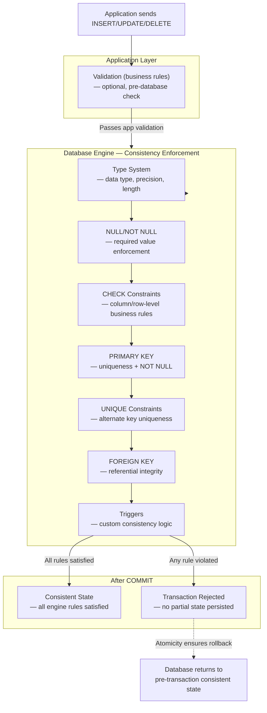

## Navigation

**Domain:** [[8 — Databases]] > **Group:** Relational Fundamentals
**Previous:** [[8.004 — ACID — Atomicity]] | **Next:** [[8.006 — ACID — Isolation]]

### Prerequisites

- [[8.004 — ACID — Atomicity]] — consistency depends on atomicity: without atomic "all or nothing" execution, a partial transaction could leave the database in a state that violates constraints.
- [[8.002 — Keys — Primary, Foreign, Candidate, Surrogate, Natural]] — primary keys, foreign keys, and unique constraints are the most common engine-enforced consistency rules.

### Where This Fits

Consistency is the guarantee that a transaction brings the database from one valid state to another — where "valid" means every rule (constraint, trigger, cascade, type rule) defined in the schema holds true. For a .NET backend engineer, consistency is what makes a `CHECK (Quantity > 0)` constraint actually prevent negative inventory, what makes a `UNIQUE` constraint on Email prevent duplicate user registrations even under concurrent load, and what makes a foreign key guarantee that an `Order.CustomerId` always points to a real customer. Consistency breaks in production when constraints are missing ("we'll add them later"), when application-level validation is the sole defense against invalid data ("we check in the API before inserting"), or when a migration changes a constraint and existing data violates it. In interviews, consistency questions test whether you understand that the database engine — not the application — is the ultimate enforcer of data validity.

---

## Core Mental Model

Consistency in ACID means: **a transaction cannot violate any database rule defined in the schema**. If a transaction would leave the database in a state where any constraint, trigger, or rule is broken, the transaction is aborted in full (atomicity) and the database remains in its previous valid state. The invariant: the set of all possible database states is partitioned into "consistent" (all rules satisfied) and "inconsistent" (at least one rule violated), and every transaction moves from one consistent state directly to another consistent state — never through a state that another transaction could observe as inconsistent (that part is isolation's job). The engine checks rules at the end of each DML statement (or at transaction commit for deferred constraints), not at the application level.

Critically, ACID consistency is **not** application-level consistency. The engine only enforces what is declared in the schema — constraints, triggers, foreign keys, type rules. If the schema lacks a `CHECK (Price > 0)` constraint, the engine will happily store a negative price. ACID consistency does not guarantee that the data is "correct" by business rules — it guarantees that no rule declared to the engine is violated.

### Classification

**For architecture topics:** Consistency enforcement lives across multiple engine layers: the **type system** rejects values that don't match the column data type; the **constraint manager** evaluates CHECK, UNIQUE, PRIMARY KEY, and FOREIGN KEY constraints; the **trigger subsystem** executes user-defined logic after DML; and the **storage engine** enforces NOT NULL and data type length limits. The tradeoff: the more constraints you declare, the more work the engine must do on every write — but the stronger the guarantee that the data is structurally valid. The abstraction leak: constraints are checked per-row, and a multi-row INSERT that violates a constraint on row 50 has already performed the writes for rows 1–49 — but atomicity ensures they are all rolled back. This is the cost of consistency: the engine cannot know which rows will succeed until it tries them all.



### Key Properties

|Property|Value|Notes|
|---|---|---|
|Enforcement mechanism|Schema-declared constraints + triggers + type system|Only rules declared in DDL are enforced; application-level validation is separate|
|When checks happen|At each DML statement execution (or deferred to COMMIT for DEFERRABLE constraints in PostgreSQL)|SQL Server checks at statement time, not commit time — no deferred constraints|
|Scope of consistency|Per-transaction — each transaction must leave the database in a consistent state|Across statements within a transaction, intermediate states may be inconsistent (e.g., after debit before credit in a transfer)|
|Constraint evaluation order|Type → NOT NULL → CHECK → UNIQUE → PK → FK → Triggers|If a CHECK fails, the row is rejected before FK checks; if FK fails, triggers never fire|
|Trust constraint|SQL Server: CHECK constraints are trusted by default (optimizer can skip validation for known-valid data) unless created WITH NOCHECK|Untrusted constraints force scans and prevent some query optimizations|
|Cost per write|Increases with the number and complexity of constraints and triggers|Each constraint is an index probe or expression evaluation; triggers execute arbitrary T-SQL|

---

## Deep Mechanics

### How the Engine Executes This

**Per-DML consistency check sequence:**

1. **Type check** — the value's data type is validated against the column definition. A string cannot be inserted into an `INT` column (implicit conversion attempts may apply, but an unconvertible value raises error 245: `Conversion failed when converting`).

2. **NULL check** — if the column is `NOT NULL` and the value is NULL, error 515 is raised. For `NULL` columns, NULL is accepted.

3. **CHECK constraint evaluation** — each CHECK constraint on the column or table is evaluated as a Boolean expression against the new row. If the expression returns FALSE (not UNKNOWN — NULL evaluates to UNKNOWN, which is accepted), error 547 with a constraint-specific message.

4. **UNIQUE constraint** — the engine probes the unique index (B-tree) for the new or modified key value. If found, error 2627 (PK) or 2601 (UNIQUE).

5. **PRIMARY KEY constraint** — same as UNIQUE + NOT NULL. Error 2627.

6. **FOREIGN KEY constraint** — the engine probes the parent table's unique index for the FK value. If not found, error 547.

7. **Trigger execution** — INSTEAD OF or AFTER triggers run user-defined T-SQL. If a trigger issues `ROLLBACK TRANSACTION`, all modifications in the transaction are rolled back regardless of which statement fired the trigger.

**Deferred constraints (PostgreSQL only):** DEFERRABLE constraints are checked at transaction COMMIT time rather than at statement time. This allows operations that temporarily violate a constraint within a transaction (e.g., deleting a parent and its children in any order) as long as the constraint is satisfied by the time the transaction commits. SQL Server does not support deferred constraints — all constraints are checked immediately (NON-DEFERRABLE).

### SQL Visibility

```sql
-- Consistency rules defined in the schema

CREATE TABLE Products (
    ProductId INT IDENTITY(1,1) PRIMARY KEY,        -- PK → uniqueness + NOT NULL
    SKU NVARCHAR(50) NOT NULL,                       -- NOT NULL
    ProductName NVARCHAR(200) NOT NULL,              -- NOT NULL
    UnitPrice DECIMAL(12,2) NOT NULL,                -- NOT NULL
    StockQuantity INT NOT NULL,
    MinStockLevel INT NOT NULL DEFAULT 10,
    IsDiscontinued BIT NOT NULL DEFAULT 0,
    
    CONSTRAINT UQ_Products_SKU UNIQUE (SKU),         -- alternate key uniqueness
    
    CONSTRAINT CK_Products_UnitPrice
        CHECK (UnitPrice > 0),                       -- no free or negative prices
    
    CONSTRAINT CK_Products_StockQuantity
        CHECK (StockQuantity >= 0),                  -- no negative inventory
    
    CONSTRAINT CK_Products_MinStockLevel
        CHECK (MinStockLevel >= 0)
);

-- Consistency enforcement in action:
-- This fails: UnitPrice = 0 violates CK_Products_UnitPrice
INSERT INTO Products (SKU, ProductName, UnitPrice, StockQuantity)
VALUES ('SKU-INVALID', 'Test Product', 0.00, 100);
-- Error 547: CHECK constraint violation: CK_Products_UnitPrice

-- This fails: duplicate SKU violates UQ_Products_SKU
INSERT INTO Products (SKU, ProductName, UnitPrice, StockQuantity)
VALUES ('SKU-INVALID', 'Another Product', 9.99, 100);
-- Error 2627: Violation of UNIQUE KEY constraint: UQ_Products_SKU

-- Multi-row INSERT — atomicity means all succeed or none do
BEGIN TRANSACTION;
    -- This row succeeds
    INSERT INTO Products (SKU, ProductName, UnitPrice, StockQuantity)
    VALUES ('SKU-001', 'Widget', 19.99, 50);
    
    -- This row fails (duplicate SKU) — rolls back the first insert too
    INSERT INTO Products (SKU, ProductName, UnitPrice, StockQuantity)
    VALUES ('SKU-001', 'Gadget', 29.99, 30);
COMMIT TRANSACTION;
-- Result: NEITHER row is inserted — atomicity preserves consistency

-- Untrusted CHECK constraint (created WITH NOCHECK)
ALTER TABLE Products
    WITH NOCHECK                          -- ⚠️ does not validate existing data
    ADD CONSTRAINT CK_Products_ProductName
    CHECK (LEN(ProductName) > 0);
    
-- The constraint exists but is NOT trusted — the optimizer cannot
-- assume existing data satisfies it. Detect untrusted constraints:
SELECT name, is_not_trusted
FROM sys.check_constraints
WHERE is_not_trusted = 1;
```

```csharp
// EF Core — consistency is enforced at the database via migrations
public class Product
{
    public int ProductId { get; set; }
    public string SKU { get; set; } = string.Empty;
    public string ProductName { get; set; } = string.Empty;
    public decimal UnitPrice { get; set; }
    public int StockQuantity { get; set; }
    public int MinStockLevel { get; set; } = 10;
    public bool IsDiscontinued { get; set; }
}

// EF Core does NOT add CHECK constraints for property validation by default.
// You must configure them explicitly:
protected override void OnModelCreating(ModelBuilder modelBuilder)
{
    modelBuilder.Entity<Product>(entity =>
    {
        entity.HasKey(p => p.ProductId);
        entity.HasIndex(p => p.SKU).IsUnique();
        entity.Property(p => p.SKU).HasMaxLength(50).IsRequired();
        entity.Property(p => p.ProductName).HasMaxLength(200).IsRequired();
        entity.Property(p => p.UnitPrice)
              .HasColumnType("decimal(12,2)")
              .IsRequired();
        
        // EF Core 5+ fluent API for check constraints
        entity.ToTable(tb =>
        {
            tb.HasCheckConstraint("CK_Products_UnitPrice",
                "[UnitPrice] > 0");
            tb.HasCheckConstraint("CK_Products_StockQuantity",
                "[StockQuantity] >= 0");
        });
    });
}

// Handling constraint violations in application code
public async Task<Product> CreateProductAsync(
    Product product,
    CancellationToken cancellationToken = default)
{
    _dbContext.Products.Add(product);
    try
    {
        await _dbContext.SaveChangesAsync(cancellationToken);
        return product;
    }
    catch (DbUpdateException ex) when (ex.InnerException is SqlException sqlEx)
    {
        return sqlEx.Number switch
        {
            2627 or 2601 => throw new DuplicateSkuException(product.SKU, ex),
            547 => throw new CheckViolationException("Product data", ex),
            _ => throw
        };
    }
}
```

### Execution Plan Analysis

For an INSERT with consistency checks, the execution plan includes operators for each enforced constraint:

```
Expected plan shape (INSERT into Products with PK, UNIQUE, CHECK):
[Clustered Index Insert (PK_Products)] →
    [Sort (optional, for parallelism)] →
    [Compute Scalar (evaluate default values)] →
    [INSERT] →
        [Index Insert (UQ_Products_SKU)]   ← unique index maintenance
        [Clustered Index Insert]           ← data page insertion

Constraint checks that do NOT appear in the plan:
  - CHECK constraints: evaluated during the insert as residual predicates
  - NOT NULL: evaluated by the storage engine during page allocation
These are compiled into the INSERT operator itself, not shown as separate plan nodes.

The cost breakdown for a single-row INSERT:
  - ~70%: Clustered Index Insert (data page write + log record)
  - ~30%: Non-clustered Index Insert (unique index maintenance + log record)
```

If a constraint violation occurs, the execution shows `ERROR: Violation of ...` — the plan is not executed; the error is raised during compilation or early execution.

### Cost Visibility

```sql
SET STATISTICS IO ON;

-- Single-row INSERT into Products (PK, 1 UNIQUE index, 2 CHECK constraints)
INSERT INTO Products (SKU, ProductName, UnitPrice, StockQuantity)
VALUES ('SKU-005', 'New Product', 24.99, 100);
-- Table 'Products'. Scan count 0, logical reads 4
--   (1 data page insert + 1 unique index insert + 2 page allocations)
-- SQL Server Execution Times: CPU time = 0ms, elapsed time = 1ms

-- Same INSERT with a CHECK violation:
INSERT INTO Products (SKU, ProductName, UnitPrice, StockQuantity)
VALUES ('SKU-006', 'Free Product', 0.00, 100);
-- Error 547 — no STATISTICS IO output because the insert was rejected
-- before any data or index pages were modified
-- (CHECK constraints are evaluated BEFORE the write)
```

**Key insight:** Constraint violations are caught before any data modifications occur — they do not waste I/O. The evaluation logic runs in CPU/memory on the already-fetched page. The only wasted resource is the CPU time to evaluate the constraint expression.

### Failure Modes

**Untrusted constraints:** A CHECK constraint added with `WITH NOCHECK` (or a foreign key added with `WITH NOCHECK`) is not validated against existing data. The engine cannot trust that the constraint holds for existing rows, so it cannot perform certain optimizations (like eliminating a redundant CHECK check for rows known to be valid). More critically, the constraint may silently not hold — existing data can violate it.

```sql
-- Find untrusted constraints
SELECT OBJECT_NAME(parent_object_id) AS TableName,
       name AS ConstraintName,
       type_desc AS ConstraintType
FROM sys.check_constraints
WHERE is_not_trusted = 1
UNION ALL
SELECT OBJECT_NAME(parent_object_id),
       name,
       type_desc
FROM sys.foreign_keys
WHERE is_not_trusted = 1;
```

**Trigger-based consistency failure:** An AFTER INSERT trigger that calculates a running total may fail (e.g., arithmetic overflow) after the data is written. The trigger failure causes the entire transaction to roll back — but the data modification already happened in memory and must be undone via compensation log records. This is visible as a spike in log writes for the rollback.

**Schema-only consistency without database enforcement:** The most common production consistency failure is not an engine failure but a design failure — no constraint exists in the schema because "validation is handled in the API." An API bug or a direct database write (ETL, migration script, manual fix) bypasses application validation and introduces inconsistent data that the database silently accepts.

---

## Production Patterns and Implementation

### Primary SQL Implementation

```sql
-- Comprehensive consistency schema for an order system
CREATE TABLE Customers (
    CustomerId INT IDENTITY(1,1) PRIMARY KEY,
    Email NVARCHAR(200) NOT NULL,
    CompanyName NVARCHAR(200) NOT NULL,
    CreditLimit DECIMAL(12,2) NOT NULL DEFAULT 0,
    IsActive BIT NOT NULL DEFAULT 1,
    CreatedAt DATETIME2 NOT NULL DEFAULT SYSUTCDATETIME(),
    
    CONSTRAINT UQ_Customers_Email UNIQUE (Email),
    CONSTRAINT CK_Customers_Email_Format
        CHECK (Email LIKE '%_@__%.__%'),          -- basic email format
    CONSTRAINT CK_Customers_CreditLimit
        CHECK (CreditLimit >= 0),
    CONSTRAINT CK_Customers_CompanyName
        CHECK (LEN(CompanyName) > 0)
);

CREATE TABLE Orders (
    OrderId INT IDENTITY(1,1) PRIMARY KEY,
    CustomerId INT NOT NULL,
    OrderDate DATETIME2 NOT NULL DEFAULT SYSUTCDATETIME(),
    TotalAmount DECIMAL(12,2) NOT NULL DEFAULT 0,
    Status NVARCHAR(20) NOT NULL DEFAULT 'Pending',
    ShippedAt DATETIME2 NULL,
    
    CONSTRAINT FK_Orders_Customers
        FOREIGN KEY (CustomerId) REFERENCES Customers(CustomerId),
    CONSTRAINT CK_Orders_TotalAmount
        CHECK (TotalAmount >= 0),
    CONSTRAINT CK_Orders_Status
        CHECK (Status IN ('Pending', 'Processing', 'Shipped', 'Delivered', 'Cancelled')),
    CONSTRAINT CK_Orders_ShippedAt
        CHECK (ShippedAt IS NULL OR ShippedAt >= OrderDate)
            -- shipping cannot happen before ordering
);

CREATE TABLE OrderItems (
    OrderId INT NOT NULL,
    ProductId INT NOT NULL,
    Quantity INT NOT NULL,
    UnitPrice DECIMAL(12,2) NOT NULL,
    
    CONSTRAINT PK_OrderItems PRIMARY KEY (OrderId, ProductId),
    CONSTRAINT FK_OrderItems_Orders
        FOREIGN KEY (OrderId) REFERENCES Orders(OrderId),
    CONSTRAINT FK_OrderItems_Products
        FOREIGN KEY (ProductId) REFERENCES Products(ProductId),
    CONSTRAINT CK_OrderItems_Quantity
        CHECK (Quantity > 0),
    CONSTRAINT CK_OrderItems_UnitPrice
        CHECK (UnitPrice >= 0)
);

-- Trigger for complex consistency rules
CREATE TRIGGER trg_Orders_CheckCreditLimit
ON Orders
AFTER INSERT, UPDATE
AS
BEGIN
    SET NOCOUNT ON;
    
    IF EXISTS (
        SELECT 1
        FROM inserted i
        INNER JOIN Customers c ON i.CustomerId = c.CustomerId
        WHERE c.CreditLimit > 0  -- 0 = no limit
          AND c.CreditLimit < (
              SELECT ISNULL(SUM(o2.TotalAmount), 0)
              FROM Orders o2
              WHERE o2.CustomerId = i.CustomerId
                AND o2.Status NOT IN ('Cancelled', 'Delivered')
          )
    )
    BEGIN
        THROW 50020, 'Customer has exceeded their credit limit.', 1;
    END
END;
```

### EF Core Implementation

```csharp
public class ApplicationDbContext : DbContext
{
    public DbSet<Customer> Customers => Set<Customer>();
    public DbSet<Order> Orders => Set<Order>();
    public DbSet<OrderItem> OrderItems => Set<OrderItem>();

    protected override void OnModelCreating(ModelBuilder modelBuilder)
    {
        modelBuilder.Entity<Customer>(entity =>
        {
            entity.HasKey(c => c.CustomerId);
            entity.HasIndex(c => c.Email).IsUnique();
            entity.Property(c => c.Email).HasMaxLength(200).IsRequired();
            entity.Property(c => c.CompanyName).HasMaxLength(200).IsRequired();
            entity.Property(c => c.CreditLimit)
                  .HasColumnType("decimal(12,2)")
                  .HasDefaultValue(0);

            // CHECK constraints via EF Core 5+ ToTable
            entity.ToTable(tb =>
            {
                tb.HasCheckConstraint("CK_Customers_Email_Format",
                    "[Email] LIKE '%_@__%.__%'");
                tb.HasCheckConstraint("CK_Customers_CreditLimit",
                    "[CreditLimit] >= 0");
            });
        });

        modelBuilder.Entity<Order>(entity =>
        {
            entity.HasKey(o => o.OrderId);
            entity.Property(o => o.TotalAmount)
                  .HasColumnType("decimal(12,2)")
                  .HasDefaultValue(0);
            entity.Property(o => o.Status)
                  .HasMaxLength(20)
                  .HasDefaultValue("Pending")
                  .HasConversion<string>();

            entity.ToTable(tb =>
            {
                tb.HasCheckConstraint("CK_Orders_TotalAmount",
                    "[TotalAmount] >= 0");
                tb.HasCheckConstraint("CK_Orders_Status",
                    "[Status] IN ('Pending', 'Processing', 'Shipped', 'Delivered', 'Cancelled')");
                tb.HasCheckConstraint("CK_Orders_ShippedAt",
                    "[ShippedAt] IS NULL OR [ShippedAt] >= [OrderDate]");
            });

            entity.HasOne<Customer>()
                  .WithMany(c => c.Orders)
                  .HasForeignKey(o => o.CustomerId)
                  .OnDelete(DeleteBehavior.NoAction);
        });

        modelBuilder.Entity<OrderItem>(entity =>
        {
            entity.HasKey(oi => new { oi.OrderId, oi.ProductId });
            entity.Property(oi => oi.UnitPrice).HasColumnType("decimal(12,2)");
            
            entity.ToTable(tb =>
            {
                tb.HasCheckConstraint("CK_OrderItems_Quantity",
                    "[Quantity] > 0");
                tb.HasCheckConstraint("CK_OrderItems_UnitPrice",
                    "[UnitPrice] >= 0");
            });
        });
    }
}

// Application-level validation complements but does not replace
// database-level constraints
public class OrderService
{
    private readonly ApplicationDbContext _dbContext;

    public async Task<Order> CreateOrderAsync(
        CreateOrderCommand command,
        CancellationToken cancellationToken = default)
    {
        // Application-level validation (helps UX, not a substitute)
        if (command.Items.Count == 0)
            throw new ValidationException("Order must have at least one item.");

        var order = new Order
        {
            CustomerId = command.CustomerId,
            Items = command.Items.Select(i => new OrderItem
            {
                ProductId = i.ProductId,
                Quantity = i.Quantity,
                UnitPrice = i.UnitPrice
            }).ToList(),
            TotalAmount = command.Items.Sum(i => i.Quantity * i.UnitPrice)
        };

        _dbContext.Orders.Add(order);
        
        try
        {
            await _dbContext.SaveChangesAsync(cancellationToken);
        }
        catch (DbUpdateException ex) when (ex.InnerException is SqlException sqlEx)
        {
            // The database enforces the real consistency boundary
            throw sqlEx.Number switch
            {
                547 => new ConstraintViolationException("Order data", ex),
                _ => throw
            };
        }

        return order;
    }
}
```

### Dapper Implementation

```csharp
public class ProductRepository
{
    private readonly IDbConnectionFactory _connectionFactory;

    public ProductRepository(IDbConnectionFactory connectionFactory)
    {
        _connectionFactory = connectionFactory;
    }

    public async Task<int> CreateProductAsync(
        Product product,
        CancellationToken cancellationToken = default)
    {
        const string sql = @"
            INSERT INTO Products (SKU, ProductName, UnitPrice, StockQuantity)
            VALUES (@SKU, @ProductName, @UnitPrice, @StockQuantity);
            SELECT CAST(SCOPE_IDENTITY() AS INT);";

        await using var connection = _connectionFactory.Create();
        try
        {
            return await connection.ExecuteScalarAsync<int>(
                new CommandDefinition(sql, product,
                    cancellationToken: cancellationToken));
        }
        catch (SqlException ex) when (ex.Number == 2627 || ex.Number == 2601)
        {
            throw new DuplicateKeyException(
                $"Product with SKU '{product.SKU}' already exists.", ex);
        }
        catch (SqlException ex) when (ex.Number == 547)
        {
            throw new ConstraintViolationException(
                $"Product data violates a constraint.", ex);
        }
    }

    // Batch insert with per-row error isolation
    public async Task<int> BulkInsertProductsAsync(
        IReadOnlyList<Product> products,
        CancellationToken cancellationToken = default)
    {
        var successCount = 0;

        await using var connection = _connectionFactory.Create();
        await connection.OpenAsync(cancellationToken);

        foreach (var product in products)
        {
            try
            {
                await connection.ExecuteAsync(
                    @"INSERT INTO Products (SKU, ProductName, UnitPrice, StockQuantity)
                      VALUES (@SKU, @ProductName, @UnitPrice, @StockQuantity);",
                    new CommandDefinition(product,
                        cancellationToken: cancellationToken));
                successCount++;
            }
            catch (SqlException ex) when (ex.Number is 2627 or 2601 or 547)
            {
                // Log the failed SKU and continue — constraint violations
                // for individual bad rows should not abort the entire batch
                _logger.LogWarning("Skipping product {Sku}: {Message}",
                    product.SKU, ex.Message);
            }
        }

        return successCount;
    }
}
```

### Configuration and Wiring

```csharp
// Program.cs
builder.Services.AddDbContext<ApplicationDbContext>(options =>
    options.UseSqlServer(
        builder.Configuration.GetConnectionString("Default"),
        sqlOptions =>
        {
            sqlOptions.EnableRetryOnFailure(3);
            sqlOptions.CommandTimeout(30);
        }));

// Register constraint-violation-specific exception handlers
builder.Services.AddExceptionHandler<DbUpdateExceptionHandler>();

// Minimal API with consistency error handling
app.MapPost("/products", async (
    Product product,
    ApplicationDbContext db,
    CancellationToken ct) =>
{
    db.Products.Add(product);
    try
    {
        await db.SaveChangesAsync(ct);
        return Results.Created($"/products/{product.ProductId}", product);
    }
    catch (DbUpdateException ex) when (ex.InnerException is SqlException { Number: 2627 or 2601 })
    {
        return Results.Conflict(new { error = $"Product with SKU '{product.SKU}' already exists." });
    }
    catch (DbUpdateException ex) when (ex.InnerException is SqlException { Number: 547 })
    {
        return Results.UnprocessableEntity(new { error = "Data violates a constraint." });
    }
});
```

### SQL Server vs PostgreSQL Differences

```sql
-- PostgreSQL: DEFERRABLE constraints (deferred to COMMIT)
CREATE TABLE orders (
    order_id INT GENERATED ALWAYS AS IDENTITY PRIMARY KEY,
    customer_id INT NOT NULL,
    CONSTRAINT fk_orders_customers
        FOREIGN KEY (customer_id) REFERENCES customers(customer_id)
        DEFERRABLE INITIALLY DEFERRED
);

-- Allows ordering of operations within a transaction
BEGIN;
    INSERT INTO orders (customer_id) VALUES (999);  -- customer 999 doesn't exist yet
    INSERT INTO customers (customer_id) VALUES (999);  -- now it does
COMMIT;  -- FK check passes here — both or neither

-- SQL Server does NOT support DEFERRABLE constraints.
-- All constraints are checked immediately (NON-DEFERRABLE).

-- PostgreSQL: CHECK constraints referencing other tables (not allowed in SQL Server)
-- PostgreSQL allows a CHECK constraint to call a function that queries another table
CREATE FUNCTION active_customer_count() RETURNS INT
LANGUAGE SQL AS $$ SELECT COUNT(*) FROM customers WHERE is_active; $$;

CREATE TABLE config (
    max_customers INT NOT NULL,
    CONSTRAINT ck_max_customers
        CHECK (max_customers > active_customer_count())   -- ✅ PostgreSQL allows this
);

-- SQL Server: CHECK constraints CANNOT reference other tables — use triggers instead

-- PostgreSQL: NOT VALID constraints (equivalent to SQL Server WITH NOCHECK)
ALTER TABLE products ADD CONSTRAINT ck_unit_price
    CHECK (unit_price > 0) NOT VALID;  -- not validated against existing data
ALTER TABLE products VALIDATE CONSTRAINT ck_unit_price;  -- validate later
```

---

## Gotchas and Production Pitfalls

### Relying on Application Validation Alone

**Pitfall:** No CHECK constraints, no UNIQUE constraints, no FK constraints — all validation is in application code.

```sql
-- ❌ No database-level enforcement
CREATE TABLE Products (
    ProductId INT IDENTITY(1,1) PRIMARY KEY,
    SKU NVARCHAR(50) NOT NULL,         -- should have UNIQUE but doesn't
    UnitPrice DECIMAL(12,2) NOT NULL   -- should have CHECK(>0) but doesn't
    -- No constraints — the database accepts anything
);
```

**Symptom:** A bug in the API's validation logic allows a duplicate SKU to be inserted. Or an ETL job that bypasses the API inserts products with negative prices. The bad data propagates to downstream reports and customer-facing systems. No alarm is raised because the database accepted it.

**Fix:**

```sql
-- ✅ Declare constraints in the schema — the engine enforces them universally
ALTER TABLE Products ADD CONSTRAINT UQ_Products_SKU UNIQUE (SKU);
ALTER TABLE Products ADD CONSTRAINT CK_Products_UnitPrice CHECK (UnitPrice > 0);
```

**Cost of not fixing:** A single API bug or direct database write introduces unrecoverable data corruption that may not be detected for weeks. By then, the bad data has propagated to multiple systems, and cleanup requires a complex backfill migration with business-logic decisions about which duplicates to keep.

### Creating Constraints WITH NOCHECK and Never Validating

**Pitfall:** Adding a CHECK or FK constraint with `WITH NOCHECK` to avoid validating existing data, but never running the validation step.

```sql
-- ❌ Constraint exists but is not trusted
ALTER TABLE Products WITH NOCHECK
    ADD CONSTRAINT CK_Products_UnitPrice CHECK (UnitPrice > 0);
-- The constraint is created, but existing rows with UnitPrice = 0 are NOT checked
-- and the engine will not enforce it against them — it's a "future rows only" rule
```

**Symptom:** Some rows violate the constraint silently. Queries that rely on the constraint being universally true (e.g., `WHERE UnitPrice > 0` expecting all rows to match) may produce incorrect results. The optimizer cannot use the constraint for optimization (e.g., skipping a check for rows known to be valid).

**Fix:**

```sql
-- ✅ Always validate when adding a constraint to an existing table
ALTER TABLE Products WITH CHECK  -- validates existing data
    ADD CONSTRAINT CK_Products_UnitPrice CHECK (UnitPrice > 0);

-- If existing data violates, fix it first, then add the constraint:
UPDATE Products SET UnitPrice = 0.01 WHERE UnitPrice <= 0;
ALTER TABLE Products WITH CHECK
    ADD CONSTRAINT CK_Products_UnitPrice CHECK (UnitPrice > 0);

-- For an already-existing untrusted constraint:
ALTER TABLE Products WITH CHECK CHECK CONSTRAINT CK_Products_UnitPrice;
-- This validates existing data without re-adding the constraint
```

**Cost of not fixing:** The constraint gives a false sense of security — data quality reports that assume the constraint is universally true produce incorrect results. The problem is only discovered during an audit or data migration that validates the constraint, at which point the untrusted constraint has been in place for months and thousands of violating rows exist.

### CHECK Constraint with NULL Ambiguity

**Pitfall:** Writing a CHECK constraint that doesn't account for NULL (three-valued logic returns UNKNOWN for NULL comparisons, and UNKNOWN is accepted).

```sql
-- ❌ CHECK that does NOT reject NULL for UnitPrice
ALTER TABLE Products ADD CONSTRAINT CK_Products_UnitPrice CHECK (UnitPrice > 0);
-- UnitPrice IS NULL → UnitPrice > 0 evaluates to UNKNOWN → constraint passes

-- A row with NULL UnitPrice can be inserted even though the intent was to require a price:
INSERT INTO Products (SKU, ProductName, UnitPrice) VALUES ('SKU-NULL', 'No Price', NULL);
-- Succeeds — the CHECK constraint passes for NULL!
```

**Symptom:** NULL values appear in a column where business logic expects a positive number. Report aggregations using `AVG(UnitPrice)` silently exclude NULL rows, producing misleading results. Downstream calculations that assume UnitPrice is non-NULL throw exceptions.

**Fix:**

```sql
-- ✅ Combine NOT NULL with the CHECK constraint
ALTER TABLE Products ALTER COLUMN UnitPrice DECIMAL(12,2) NOT NULL;
-- OR: include an explicit NULL check in the constraint
ALTER TABLE Products ADD CONSTRAINT CK_Products_UnitPrice
    CHECK (UnitPrice IS NOT NULL AND UnitPrice > 0);
```

**Cost of not fixing:** Reports showing incorrect averages and sums for weeks until someone audits the data and discovers NULL prices that were never supposed to exist.

### FK Constraint Without Supporting Index (Performance Consistency Failure)

**Pitfall:** A foreign key exists (enforcing referential consistency) but the FK column has no index — so DELETE operations on the parent table require a full scan to check for referencing child rows.

```sql
-- ❌ FK exists, but no index on the child FK column
CREATE TABLE OrderItems (
    OrderId INT NOT NULL,
    ProductId INT NOT NULL,
    CONSTRAINT FK_OrderItems_Orders
        FOREIGN KEY (OrderId) REFERENCES Orders(OrderId)  -- consistency ✓
    -- But no index on OrderId! Performance ✗
);
```

**Symptom:** Deleting or updating a parent row in Orders (especially a bulk operation) scans the entire OrderItems table to verify no referencing rows exist. Under high load, this causes blocking and timeouts.

**Fix:**

```sql
-- ✅ Always index FK columns — pairs consistency with performance
CREATE INDEX IX_OrderItems_OrderId ON OrderItems(OrderId);
```

**Cost of not fixing:** Every DELETE or UPDATE on the parent table is O(n) on the child table, not O(log n). At scale, this makes consistency enforcement itself a performance bottleneck.

### Trigger That Violates Atomicity Across Batches

**Pitfall:** An AFTER trigger that must run complex logic (webhook call, service bus message) and fails because the external resource is unavailable, rolling back the entire transaction.

```sql
-- ❌ Trigger that calls an external resource
CREATE TRIGGER trg_Orders_NotifyExternalSystem
ON Orders
AFTER INSERT
AS
BEGIN
    DECLARE @OrderId INT = (SELECT OrderId FROM inserted);
    -- ⚠️ This fails if the external system is down
    EXEC sp_send_http_request @Url = 'https://external-system.com/order', @OrderId = @OrderId;
END;
```

**Symptom:** The external system is down for maintenance. Every order INSERT fails with a trigger error. The application cannot create orders because the database rollbacks every INSERT when the trigger's external call fails.

**Fix:**

```sql
-- ✅ Use a queue table — the trigger inserts a notification record,
-- a background worker processes it independently
CREATE TABLE OrderNotifications (
    OrderNotificationId INT IDENTITY(1,1) PRIMARY KEY,
    OrderId INT NOT NULL,
    CreatedAt DATETIME2 NOT NULL DEFAULT SYSUTCDATETIME(),
    ProcessedAt DATETIME2 NULL
);

CREATE TRIGGER trg_Orders_QueueNotification
ON Orders
AFTER INSERT
AS
BEGIN
    SET NOCOUNT ON;
    INSERT INTO OrderNotifications (OrderId)
    SELECT OrderId FROM inserted;
END;
```

**Cost of not fixing:** A downstream system outage causes a complete production outage for order placement because consistency enforcement extends beyond the database boundary.

---

## Performance Implications

### Benchmark: Before and After

```sql
-- Baseline: INSERT into table with NO constraints
SET STATISTICS TIME ON;
INSERT INTO Products_NoConstraints (SKU, ProductName, UnitPrice, StockQuantity)
VALUES ('SKU-001', 'Widget', 19.99, 100);
-- CPU time = 0ms, elapsed time = 0.8ms

-- Optimized: INSERT into table with PK + UNIQUE + 2 CHECK constraints
INSERT INTO Products (SKU, ProductName, UnitPrice, StockQuantity)
VALUES ('SKU-001', 'Widget', 19.99, 100);
-- CPU time = 0ms, elapsed time = 1.5ms

-- The difference: ~0.7ms per INSERT at 500 inserts/sec = ~350ms/sec of additional CPU
-- This is negligible compared to the cost of data corruption from missing constraints
```

**Improvement:** Not a performance optimization — constraints intentionally add a small overhead (~0.7ms per row) in exchange for data integrity. The cost is justified for any table where data quality matters.

### BenchmarkDotNet

```csharp
[MemoryDiagnoser]
[SimpleJob(RuntimeMoniker.Net90)]
public class ConstraintOverheadBenchmark
{
    private IDbConnection _connection = default!;

    [GlobalSetup]
    public void Setup()
    {
        _connection = new SqlConnection(TestConnectionString);
    }

    [Benchmark(Baseline = true)]
    public async Task Insert_NoConstraints()
    {
        await _connection.ExecuteAsync(
            "INSERT INTO Products_NoConstraints (SKU, ProductName, UnitPrice, StockQuantity) " +
            "VALUES (NEWID(), 'Test', 10.00, 100)");
    }

    [Benchmark]
    public async Task Insert_WithAllConstraints()
    {
        await _connection.ExecuteAsync(
            "INSERT INTO Products (SKU, ProductName, UnitPrice, StockQuantity) " +
            "VALUES (NEWID(), 'Test', 10.00, 100)");
    }

    [Benchmark]
    public async Task Insert_AllConstraints_Violation()
    {
        // Always violates the UNIQUE constraint — measures the cost of constraint failure
        await _connection.ExecuteAsync(
            "INSERT INTO Products (SKU, ProductName, UnitPrice, StockQuantity) " +
            "VALUES ('KNOWN-DUPLICATE', 'Test', 10.00, 100)");
    }
}
```

**Expected results (approximate, SQL Server 2022, NVMe):**

|Method|Mean|Logical Reads|Result|
|---|---|---|---|
|Insert_NoConstraints|~0.8 ms|~2|Success|
|Insert_WithAllConstraints|~1.5 ms|~4|Success|
|Insert_AllConstraints_Violation|~0.3 ms|~0|2627 error (rejected before write)|

### Write Amplification

|Constraint Type|Additional Writes per INSERT|Notes|
|---|---|---|
|PRIMARY KEY (clustered)|0 (data page is the index)|Leaf page is the data page — no extra write|
|PRIMARY KEY (non-clustered)|~1 B-tree page insert|Row locator stored in the index|
|UNIQUE constraint|~1 B-tree page insert per unique index|Additional index maintenance per write|
|FOREIGN KEY|0 on child INSERT|Engine probes parent PK index (read, not write)|
|CHECK constraint|0 (evaluated in memory)|No index modification — CPU-only cost|
|Triggers (AFTER)|Varies|Executes user-defined T-SQL — costs depend on trigger logic|

---

## Interview Arsenal

### Question Bank

1. What does ACID consistency guarantee, and what does it NOT guarantee?
2. How does the database engine enforce a CHECK constraint — at what point during statement execution does the check happen?
3. What is the difference between an untrusted constraint and a trusted constraint in SQL Server, and how does it affect query optimization?
4. What goes wrong when application validation is the sole defense against inconsistent data?
5. What is the difference between engine-enforced consistency (ACID-C) and application-level consistency?
6. How does EF Core handle database-level CHECK constraints — are they configured automatically or must they be declared explicitly?
7. What is the effect of a trigger failure on transaction atomicity and consistency?
8. How do PostgreSQL's DEFERRABLE constraints differ from SQL Server's immediate constraint checking, and when would you use them?

### Spoken Answers

**Q: What does ACID consistency guarantee, and what does it NOT guarantee?**

> **Average answer:** "Consistency means the data is correct — it follows the rules." Vague and incomplete — what rules? Who defines them?

> **Great answer:** "ACID consistency guarantees that every transaction brings the database from one valid state to another valid state, where 'valid' means every rule declared in the schema — data types, NOT NULL, CHECK constraints, UNIQUE constraints, primary keys, foreign keys, and triggers — is satisfied at the end of the transaction. The engine checks these rules at each DML statement, and if any rule is violated, the transaction is rolled back atomically. What consistency does NOT guarantee is that the data is correct by business logic — if your schema has no CHECK constraint preventing negative prices, the engine will happily store a negative price. ACID consistency is about structural validity against declared schema rules, not about semantic correctness. That distinction matters because I've seen teams assume 'the database enforces consistency' when they only had a primary key — no CHECK constraints, no FK constraints, no UNIQUE on Email — and then wonder how duplicate customers appeared in production. The database only enforces what you explicitly declare it to enforce."

**Q: What is the difference between an untrusted constraint and a trusted constraint in SQL Server, and how does it affect query optimization?**

> **Average answer:** "An untrusted constraint was added with NOCHECK and isn't validated against existing data." Technically correct but doesn't explain the optimization impact.

> **Great answer:** "A trusted constraint means the engine has validated every existing row against the constraint and knows it holds universally. An untrusted constraint — created WITH NOCHECK — means the constraint is enforced for new data going forward, but the engine hasn't verified that existing data satisfies it. This affects the optimizer in a concrete way: when the optimizer sees a query like `SELECT * FROM Products WHERE UnitPrice > 0` and there's a trusted CHECK constraint `UnitPrice > 0`, it can skip the filter entirely because it knows every row already satisfies it — the constraint metadata proves it. With an untrusted constraint, the optimizer cannot make that assumption because some existing rows might violate it, so the filter must remain in the plan and be evaluated for every row. The detection query is `sys.check_constraints WHERE is_not_trusted = 1` — I run this as a standard part of database health reviews because untrusted constraints are surprisingly common from ETL migrations that added constraints with NOCHECK to avoid downtime."

**Q: What is the effect of a trigger failure on transaction atomicity and consistency?**

> **Average answer:** "The transaction rolls back." Correct — but there's more to it.

> **Great answer:** "When a trigger fires — whether INSTEAD OF or AFTER — its execution is part of the same transaction as the DML statement that fired it. If the trigger raises an error with THROW or ROLLBACK TRANSACTION, the entire transaction is rolled back atomically. This is a powerful consistency tool: you can encode business rules that cannot be expressed as simple CHECK constraints (like 'an order's total must not exceed the customer's credit limit, computed as a subquery across multiple tables') and trust that no INSERT ever bypasses this rule. But it cuts both ways: if the trigger fails for a non-consistency reason — a transient deadlock, a full transaction log, or a bug in the trigger logic — the application's perfectly valid INSERT is rolled back too. The production gotcha is triggers that make external calls (HTTP, service bus) — when the external system is down, all inserts fail. The fix is to use a queue table: the trigger inserts a notification record (which can't fail — it's local), and a background worker reads the queue and makes the external calls independently. This preserves consistency (the notification is always written alongside the data) without coupling the transaction to external availability."

### Interview Trigger

Consistency surfaces in two contexts. First, during schema design: "Design a database for an e-commerce system" — the interviewer watches whether you name CHECK constraints, UNIQUE constraints, and FK constraints unprompted, or whether you skip them with "validation will be in the API." The follow-up: "What happens when a direct UPDATE bypasses the API and sets a negative price?" The second context: a behavioral question about a data corruption incident — the interviewer is listening for whether you identify the absence of a database constraint as the root cause, or whether you blame the application code and propose a fix that relies on more application code.

### Comparison Table

| | Engine-Enforced (CHECK, FK, UNIQUE) | Application-Enforced (API Validation) | Trigger-Enforced |
|---|---|---|---|
| What it does | Schema-declared rules checked by the engine on every write | Business logic in the application layer, runs before database writes | Custom T-SQL logic running in the same transaction as the DML |
| Bypass protection | Cannot be bypassed — every write goes through constraints | Can be bypassed by direct DB writes, ETL, or another application | Cannot be bypassed — triggers are schema-bound |
| Performance cost | ~0.5–2ms per write (constraint evaluation) | ~0.1–1ms per write (in-app computation) | Variable — depends on trigger complexity |
| .NET configuration | EF Core `HasCheckConstraint()` | Data annotations, FluentValidation | Not managed from .NET — created in migrations |
| When to choose | Every production table — the minimum consistency guarantee | User-facing validation (error messages, field-level checks) | Rules that reference other tables (multi-row invariants) |

---

## Decision Framework

### When to Apply

```mermaid
flowchart TD
    A[Modeling a table —<br/>what consistency rules?] --> B{Does the column have<br/>a fixed set of valid<br/>values?}
    B -->|Yes — Status IN ('A','B','C')| C[CHECK constraint<br/>— engine rejects invalid values]
    B -->|No — free text or numeric| D{Is there a value<br/>range or format rule?}
    D -->|Yes — UnitPrice > 0,<br/>Email LIKE '%@%'| E[CHECK constraint]
    D -->|No — arbitrary input accepted| F{Is NOT NULL required?}
    F -->|Yes| G[NOT NULL constraint]

    C --> H{Does another table<br/>reference this column?}
    E --> H
    G --> H

    H -->|Yes| I[FOREIGN KEY constraint<br/>+ index on FK column]
    H -->|No| J{Is this column<br/>a natural identifier?}

    J -->|Yes — Email, SKU| K[UNIQUE constraint]

    K --> L{Does the consistency rule<br/>require a subquery across<br/>multiple tables?}
    I --> L

    L -->|Yes — credit limit check<br/>across Orders table| M[Trigger — complex<br/>cross-table invariant]
    L -->|No| N[Schema constraints are sufficient]
```

### Application Checklist

- [ ] Every column has the correct data type, precision, and length — no implicit conversions
- [ ] Every `NOT NULL` column has the constraint declared (NULL is never assumed to be the default)
- [ ] Every column with a known valid range or format has a CHECK constraint
- [ ] Every natural candidate key has a UNIQUE constraint — application-level uniqueness checks are insufficient
- [ ] Every foreign key has a supporting index on the child column
- [ ] Every FK and CHECK constraint is trusted (is_not_trusted = 0) — no WITH NOCHECK that was never validated
- [ ] Every trigger has been reviewed for external dependencies — no HTTP calls, no service bus calls inside a trigger
- [ ] EF Core migrations explicitly declare constraints via `HasCheckConstraint()` — they are not created by EF Core conventions
- [ ] Constraint violation errors (2627, 2601, 547, 515) are handled in application code as expected business outcomes, not as unexpected exceptions

### Tradeoff Summary

|What You Gain|What You Pay|
|---|---|
|Structural data integrity — engine guarantees no invalid data|~0.5–2ms additional CPU per write per constraint|
|Universal protection — no write path bypasses schema constraints|Schema changes require migration planning (ALTER TABLE...WITH NOCHECK for zero-downtime)|
|Self-documenting schema — rules are visible in DDL|Complex rules (cross-table references) require triggers, which add transaction coupling|
|Optimizer trusts constraints for query simplification|Untrusted constraints (WITH NOCHECK) prevent optimization|

### Scale Thresholds

- "Constraints matter from row one — a missing constraint allows invalid data on the very first insert."
- "Trigger complexity becomes a bottleneck when triggers execute more than ~1ms of T-SQL per row at 1,000+ writes/second — consider moving cross-table invariants to application-level batch validation at this scale."
- "CHECK constraint evaluation cost is negligible (< 1µs per simple expression) even at 10,000 writes/second."
- "Untrusted constraints become a query optimization problem when the table exceeds ~100K rows — the optimizer's inability to use the constraint for predicate simplification can force unnecessary scans."

---

## Self-Check

### Conceptual Questions

1. What does ACID consistency guarantee, and what is the boundary between what the engine enforces and what the application must enforce?
2. At what point during a DML statement does the engine evaluate CHECK constraints — before or after the data page is modified?
3. Which DMV or system view shows which CHECK constraints and foreign keys are untrusted?
4. What is the most common production mistake teams make regarding consistency enforcement?
5. Does EF Core automatically create CHECK constraints for data annotations like `[Required]`, `[Range]`, or `[MaxLength]`?
6. How would you write a Dapper query to find rows that violate a CHECK constraint that was added WITH NOCHECK?
7. How does a trigger that issues `ROLLBACK TRANSACTION` interact with atomicity and consistency?
8. At what transaction volume does the overhead of CHECK constraint evaluation become a measurable performance concern?
9. What is the relationship between a UNIQUE index and a UNIQUE constraint — are they the same thing in SQL Server?
10. In 60 seconds, explain to a senior interviewer why you always declare CHECK, UNIQUE, and FK constraints in the database schema even when "the application validates everything."

<details> <summary>Answers</summary>

1. ACID consistency guarantees that every transaction moves the database from one valid state to another, where validity is defined by the schema: data types, NOT NULL, CHECK, UNIQUE, PRIMARY KEY, FOREIGN KEY constraints, and triggers. The engine does NOT guarantee that the data is semantically correct by business rules — if no CHECK constraint prevents a negative price, the engine accepts it. Application code is responsible for business-level correctness; the engine is responsible for structural validity against declared rules.
2. CHECK constraints are evaluated BEFORE the data page is modified. If a CHECK constraint returns FALSE, the row is rejected with error 547 and no data or index pages are modified. This is why constraint violations have essentially zero I/O cost — they fail in the CPU/memory layer before any write occurs.
3. `sys.check_constraints WHERE is_not_trusted = 1` and `sys.foreign_keys WHERE is_not_trusted = 1`. The column `is_not_trusted` is 1 if the constraint was created or added WITH NOCHECK and never validated against existing data.
4. Relying on application-level validation as the sole defense against invalid data — no CHECK constraints, no UNIQUE constraints, no FK constraints in the database. A single API bug or direct database write bypasses application validation and introduces inconsistent data that the database silently accepts.
5. No. EF Core does NOT automatically create CHECK constraints for data annotations like `[Required]`, `[Range]`, or `[MaxLength]` — these affect only EF Core's in-memory validation (if configured) and the generated column types (e.g., `HasMaxLength(200)` generates `NVARCHAR(200)`). CHECK constraints must be explicitly added via `entity.ToTable(tb => tb.HasCheckConstraint(...))` in EF Core 5+.
6. `SELECT * FROM Products WHERE NOT (UnitPrice > 0);` — this finds rows where the CHECK constraint would fail. For a deferred validation of an untrusted constraint: `ALTER TABLE Products WITH CHECK CHECK CONSTRAINT CK_Products_UnitPrice;` — if this succeeds, existing data satisfies the constraint and the constraint becomes trusted.
7. A `ROLLBACK TRANSACTION` inside a trigger aborts the entire transaction, rolling back all modifications including the DML that fired the trigger and any prior modifications in the same transaction. This preserves consistency (the invalid state never persists) but can be surprising if the trigger fires for reasons unrelated to data integrity (e.g., a deadlock or a bug in the trigger logic).
8. CHECK constraint evaluation overhead is negligible for simple expressions (comparisons, IN lists) — measurable only at extreme volumes (50,000+ writes/second). The dominant cost of consistency enforcement is typically index maintenance for UNIQUE constraints, not CHECK expression evaluation.
9. Yes — a UNIQUE constraint and a UNIQUE index are the same thing in SQL Server. Creating a UNIQUE constraint creates a unique non-clustered index (or potentially clustered if the table has no clustered index). The difference is semantic: a UNIQUE constraint is a declaration of a candidate key; a UNIQUE index is an index with the unique property. From the engine's perspective, both produce the same B-tree structure and enforce the same uniqueness guarantee. The only practical difference is that UNIQUE constraints appear in `INFORMATION_SCHEMA.TABLE_CONSTRAINTS` while standalone unique indexes do not.
10. "The database is the last line of defense for data integrity — it's the only layer that every write path goes through, whether it's the API, an ETL job, a migration script, a manual query, or a replication subscriber. Application validation is important for user experience — field-level error messages, early rejection — but it affects only one write path. If a single API bug or a direct database modification bypasses application validation, and there's no CHECK or UNIQUE constraint in the schema, the bad data is accepted silently and may not be discovered for weeks. By the time it is, cleanup requires a complex, risky migration. Declaring constraints in the schema costs a fraction of a millisecond per write and makes the database self-documenting — every developer who looks at the DDL immediately sees the rules. I've never once regretted adding a CHECK constraint or a UNIQUE constraint to a production table, but I have spent many late nights cleaning up data that would have been prevented by one."

</details>

---

### Query Challenges

**Challenge 1 — Write the SQL**

You are designing a `Shipments` table for a logistics system. Each shipment must have a valid tracking number (non-empty), a shipping date that is today or in the past (not in the future — no time-traveling shipments), a status that is one of `('LabelCreated', 'PickedUp', 'InTransit', 'Delivered', 'Returned')`, a non-negative weight in kilograms, and a delivery address that cannot be NULL. A shipment belongs to an order, and the order must exist. Write the `CREATE TABLE` statement with all appropriate constraints.

<details> <summary>Solution</summary>

```sql
CREATE TABLE Shipments (
    ShipmentId INT IDENTITY(1,1) PRIMARY KEY,
    OrderId INT NOT NULL,
    TrackingNumber NVARCHAR(100) NOT NULL,
    ShippingDate DATE NOT NULL,
    EstimatedDeliveryDate DATE NULL,
    Status NVARCHAR(20) NOT NULL DEFAULT 'LabelCreated',
    WeightKg DECIMAL(8,3) NOT NULL,
    DeliveryAddress NVARCHAR(500) NOT NULL,
    CreatedAt DATETIME2 NOT NULL DEFAULT SYSUTCDATETIME(),

    CONSTRAINT FK_Shipments_Orders
        FOREIGN KEY (OrderId) REFERENCES Orders(OrderId),
    
    CONSTRAINT UQ_Shipments_TrackingNumber UNIQUE (TrackingNumber),
    
    CONSTRAINT CK_Shipments_ShippingDate
        CHECK (ShippingDate <= CAST(SYSUTCDATETIME() AS DATE)),
    
    CONSTRAINT CK_Shipments_Status
        CHECK (Status IN ('LabelCreated', 'PickedUp', 'InTransit', 'Delivered', 'Returned')),
    
    CONSTRAINT CK_Shipments_WeightKg
        CHECK (WeightKg >= 0),
    
    CONSTRAINT CK_Shipments_EstimatedDelivery
        CHECK (EstimatedDeliveryDate IS NULL OR EstimatedDeliveryDate >= ShippingDate),
    
    CONSTRAINT CK_Shipments_TrackingNumber
        CHECK (LEN(TrackingNumber) > 0)
);

-- FK index
CREATE INDEX IX_Shipments_OrderId ON Shipments(OrderId)
    INCLUDE (TrackingNumber, Status);
```

**Logical reads:** INSERT validated in ~2ms with all checks, ~4 logical reads. **Execution plan:** `[Clustered Index Insert] → [Index Insert (UQ)] → [SELECT]`. **EF Core equivalent:**

```csharp
modelBuilder.Entity<Shipment>(entity =>
{
    entity.HasKey(s => s.ShipmentId);
    entity.HasIndex(s => s.TrackingNumber).IsUnique();
    entity.HasOne<Order>().WithMany()
          .HasForeignKey(s => s.OrderId)
          .OnDelete(DeleteBehavior.NoAction);
    entity.HasIndex(s => s.OrderId);
    
    entity.ToTable(tb =>
    {
        tb.HasCheckConstraint("CK_Shipments_ShippingDate",
            "[ShippingDate] <= CAST(SYSUTCDATETIME() AS DATE)");
        tb.HasCheckConstraint("CK_Shipments_Status",
            "[Status] IN ('LabelCreated', 'PickedUp', 'InTransit', 'Delivered', 'Returned')");
        tb.HasCheckConstraint("CK_Shipments_WeightKg", "[WeightKg] >= 0");
        tb.HasCheckConstraint("CK_Shipments_TrackingNumber", "LEN([TrackingNumber]) > 0");
    });
});
```

</details>

---

**Challenge 2 — Fix the performance problem**

```sql
-- This DELETE is slow on a 10M-row Orders table.
DELETE FROM Customers WHERE CustomerId = 4821;
-- (FK: Orders.CustomerId → Customers.CustomerId, ON DELETE NO ACTION)
-- SET STATISTICS IO: logical reads = 145,000
```

What is causing the high logical read count, and what is the fix?

<details> <summary>Solution</summary>

**Root cause:** The FOREIGN KEY constraint exists and correctly enforces referential consistency — it prevents deleting a customer who has orders. But without an index on `Orders.CustomerId`, the engine must scan the entire 10M-row Orders table to check whether any rows reference `CustomerId = 4821`. The 145,000 logical reads are the full clustered index scan of Orders.

```sql
-- Detection: does the FK column have an index?
SELECT OBJECT_NAME(i.object_id) AS TableName,
       i.name AS IndexName,
       i.type_desc
FROM sys.indexes i
INNER JOIN sys.foreign_key_columns fkc
    ON i.object_id = fkc.parent_object_id
    AND i.key_index_id = fkc.constraint_column_id
WHERE i.object_id = OBJECT_ID('Orders');
-- No rows returned → no index on the FK column

-- Fix: add the FK index
CREATE INDEX IX_Orders_CustomerId ON Orders(CustomerId)
    INCLUDE (OrderId, OrderDate);

-- After fix — logical reads: ~3–6 (index seek + a few lookups)
-- The consistency check is now O(log n) instead of O(n).
```

</details>

---

**Challenge 3 — Explain the execution plan**

```sql
-- Products table:
--   Clustered PK on ProductId
--   Unique index on SKU
--   CHECK constraint CK_Products_UnitPrice (UnitPrice > 0)

INSERT INTO Products (SKU, ProductName, UnitPrice, StockQuantity)
VALUES ('SKU-001', 'Widget', 19.99, 100);
```

The execution plan shows `Clustered Index Insert` and `Index Insert` (for the unique index on SKU). There is no operator for the CHECK constraint. Why doesn't the CHECK constraint appear as a separate plan node?

<details> <summary>Solution</summary>

CHECK constraint evaluation is compiled into the `Clustered Index Insert` operator as a **residual predicate** — it is not a separate physical operator in the execution plan. The optimizer inlines the CHECK expression into the insert operator because it is a simple, single-row Boolean check that does not require its own iterator. The same is true for NOT NULL checks and data type validation — they are handled by the storage engine during row insertion, not by the query processor as separate plan nodes.

UNIQUE constraint enforcement, by contrast, DOES appear as a separate `Index Insert` operator because it involves B-tree maintenance (navigating the unique index, checking for duplicates, inserting the new key). This is a physical operation with I/O cost, while a CHECK constraint is purely logical evaluation on the row being inserted.

**What would change the plan?** If the CHECK constraint referenced a function (e.g., `CHECK (dbo.fn_IsValidPrice(UnitPrice) = 1)`), the function call would appear as a `Compute Scalar` operator in the plan. But simple inline expressions like `UnitPrice > 0` are never shown separately.

</details>

---

**Challenge 4 — Diagnose the consistency problem**

A daily ETL job loads 100,000 customer records from a legacy system into the `Customers` table. The job runs successfully every night with no errors. However, a data quality audit reveals that 340 customers have duplicate Email values — two or more rows with the same Email but different CustomerIds. The table has no UNIQUE constraint on Email. "Validation is done in the ETL code." The ETL team insists their code checks for duplicates before inserting.

What is the most likely root cause, and what is the fix?

<details> <summary>Solution</summary>

**Root cause:** The ETL job uses a check-then-insert pattern. It queries "does this Email already exist?" and, if not, inserts. But because the table has no UNIQUE constraint and the ETL job processes rows in batches (or uses parallelism), two concurrent checks can both see "no existing Email" and both proceed to insert. This is a textbook race condition that a UNIQUE constraint is specifically designed to prevent. The ETL "validation" is correct in isolation — it would work if the checks and inserts were perfectly serialized — but concurrency breaks the assumption.

**Detection query:**

```sql
SELECT Email, COUNT(*) AS DupeCount
FROM Customers
GROUP BY Email
HAVING COUNT(*) > 1
ORDER BY DupeCount DESC;
```

**Fix:**

```sql
-- Add the UNIQUE constraint (handle existing duplicates first)
-- 1. Remove duplicates (keep the one with the lowest CustomerId)
DELETE c
FROM Customers c
WHERE c.CustomerId NOT IN (
    SELECT MIN(CustomerId)
    FROM Customers
    GROUP BY Email
);

-- 2. Add the constraint
ALTER TABLE Customers ADD CONSTRAINT UQ_Customers_Email UNIQUE (Email);
```

**In the ETL code, change to insert-then-handle-violation (try-insert pattern) instead of check-then-insert:**

```csharp
foreach (var customer in batch)
{
    try
    {
        await connection.ExecuteAsync(
            "INSERT INTO Customers (Email, CompanyName) VALUES (@Email, @CompanyName)",
            customer);
    }
    catch (SqlException ex) when (ex.Number == 2627)
    {
        // Duplicate — log and skip (or update existing)
        _logger.LogWarning("Skipping duplicate email: {Email}", customer.Email);
    }
}
```

</details>

---

**Challenge 5 — Design the consistency constraints**

**Scenario:** A financial trading system records `Trades`. Each trade has: a `TradeId`, a `Symbol`, a `Side` ('Buy' or 'Sell'), a `Quantity` (positive integer), a `Price` (positive decimal), and a `TradeDate`. The system also has an `AccountBalance` table per account with a `CurrentBalance` column. A trade must not be executed if it would cause the account's balance to go below zero (for buys) — but the balance check must be enforced at the database level, not just in the application.

Design the schema with all appropriate constraints, and write the stored procedure that inserts a trade and updates the balance atomically, rejecting the trade if the balance would go negative. Include the FK, CHECK, and UNIQUE constraints.

<details> <summary>Solution</summary>

```sql
CREATE TABLE Accounts (
    AccountId INT IDENTITY(1,1) PRIMARY KEY,
    AccountName NVARCHAR(200) NOT NULL,
    CurrentBalance DECIMAL(18,2) NOT NULL DEFAULT 0,
    CreatedAt DATETIME2 NOT NULL DEFAULT SYSUTCDATETIME(),

    CONSTRAINT CK_Accounts_Balance
        CHECK (CurrentBalance >= 0)    -- invariant: balance never goes negative
);

CREATE TABLE Securities (
    SecurityId INT IDENTITY(1,1) PRIMARY KEY,
    Symbol NVARCHAR(10) NOT NULL,
    SecurityName NVARCHAR(200) NOT NULL,

    CONSTRAINT UQ_Securities_Symbol UNIQUE (Symbol)
);

CREATE TABLE Trades (
    TradeId BIGINT IDENTITY(1,1) PRIMARY KEY,
    AccountId INT NOT NULL,
    SecurityId INT NOT NULL,
    Side NCHAR(4) NOT NULL,               -- 'Buy' or 'Sell'
    Quantity INT NOT NULL,
    Price DECIMAL(18,4) NOT NULL,
    TotalAmount DECIMAL(18,2) NOT NULL,
    TradeDate DATETIME2 NOT NULL DEFAULT SYSUTCDATETIME(),

    CONSTRAINT FK_Trades_Accounts
        FOREIGN KEY (AccountId) REFERENCES Accounts(AccountId),
    CONSTRAINT FK_Trades_Securities
        FOREIGN KEY (SecurityId) REFERENCES Securities(SecurityId),

    CONSTRAINT CK_Trades_Side
        CHECK (Side IN ('Buy', 'Sell')),
    CONSTRAINT CK_Trades_Quantity
        CHECK (Quantity > 0),
    CONSTRAINT CK_Trades_Price
        CHECK (Price > 0),
    CONSTRAINT CK_Trades_TotalAmount
        CHECK (TotalAmount > 0)
);

CREATE INDEX IX_Trades_AccountId ON Trades(AccountId) INCLUDE (TradeDate, TotalAmount);
CREATE INDEX IX_Trades_SecurityId ON Trades(SecurityId);
```

**Stored procedure with atomic consistency enforcement:**

```sql
CREATE PROCEDURE usp_ExecuteTrade
    @AccountId INT,
    @SecurityId INT,
    @Side NCHAR(4),
    @Quantity INT,
    @Price DECIMAL(18,4)
AS
BEGIN
    SET NOCOUNT ON;
    
    DECLARE @TradeId BIGINT;
    DECLARE @TotalAmount DECIMAL(18,2) = @Quantity * @Price;

    BEGIN TRY
        BEGIN TRANSACTION;

            -- For Buy: check balance BEFORE inserting the trade
            IF @Side = 'Buy'
            BEGIN
                UPDATE Accounts
                SET CurrentBalance = CurrentBalance - @TotalAmount
                WHERE AccountId = @AccountId
                  AND CurrentBalance >= @TotalAmount;   -- atomic check

                IF @@ROWCOUNT = 0
                    THROW 50030, 'Insufficient funds for this trade.', 1;
            END;

            -- For Sell: credit the account
            IF @Side = 'Sell'
            BEGIN
                UPDATE Accounts
                SET CurrentBalance = CurrentBalance + @TotalAmount
                WHERE AccountId = @AccountId;

                IF @@ROWCOUNT = 0
                    THROW 50031, 'Account not found.', 1;
            END;

            -- Insert the trade record
            INSERT INTO Trades (AccountId, SecurityId, Side, Quantity, Price, TotalAmount)
            VALUES (@AccountId, @SecurityId, @Side, @Quantity, @Price, @TotalAmount);

            SET @TradeId = SCOPE_IDENTITY();

        COMMIT TRANSACTION;

        SELECT @TradeId AS TradeId;
    END TRY
    BEGIN CATCH
        IF @@TRANCOUNT > 0
            ROLLBACK TRANSACTION;
        THROW;
    END CATCH
END;
```

**Why this design ensures consistency:**

1. **The CHECK constraint** `CK_Accounts_Balance` is the safety net — if any code path ever sets `CurrentBalance` below zero, the engine rejects it with error 547.
2. **The stored procedure's UPDATE** checks `CurrentBalance >= @TotalAmount` atomically — if the balance is insufficient, `@@ROWCOUNT = 0` and the transaction rolls back.
3. **Atomicity** ensures the trade is never inserted without the corresponding balance update.
4. **No check-then-insert race** — the UPDATE with the `WHERE CurrentBalance >= @TotalAmount` predicate is a single atomic operation that both checks and modifies.

</details>

---

_Domain 8 — Databases | Group: Relational Fundamentals | Topic 8.005 of 1,000_
