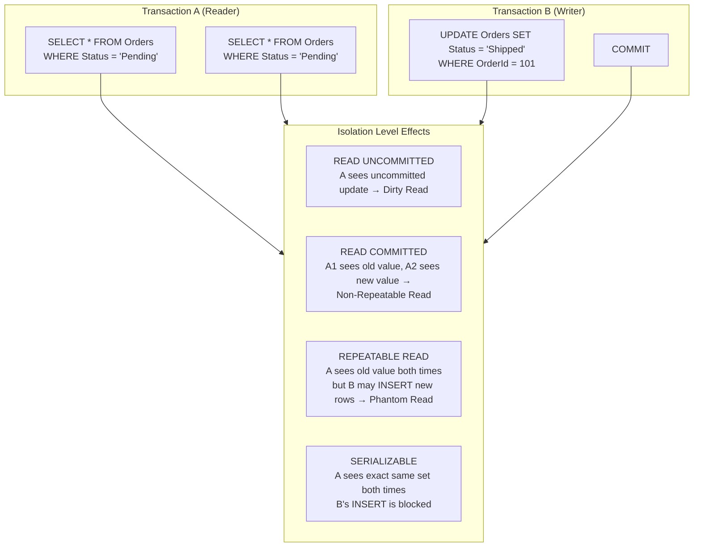
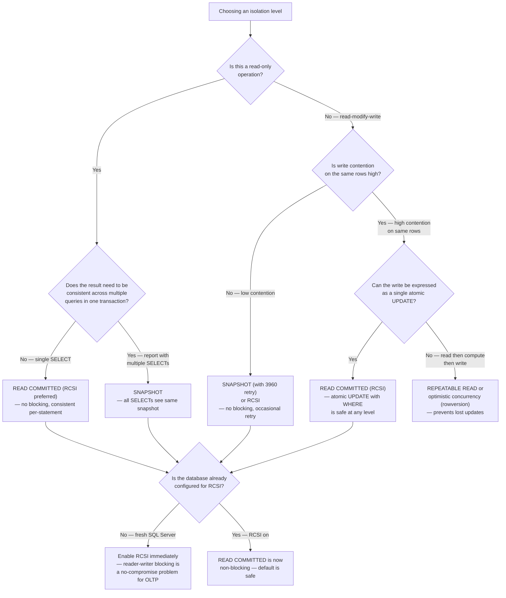

## Navigation

**Domain:** [[8 — Databases]] > **Group:** Relational Fundamentals
**Previous:** [[8.005 — ACID — Consistency]] | **Next:** [[8.007 — ACID — Durability]]

### Prerequisites

- [[8.004 — ACID — Atomicity]] — isolation depends on atomicity: each transaction is an all-or-nothing unit, and isolation controls what intermediate states (if any) are visible to other transactions.
- [[8.005 — ACID — Consistency]] — isolation prevents one transaction from seeing a state that violates consistency rules (e.g., seeing a debit before the matching credit).

### Where This Fits

Isolation is the guarantee that concurrent transactions do not interfere with each other — each transaction executes as if it were the only transaction running, even though the engine is processing hundreds or thousands of them simultaneously. For a .NET backend engineer, isolation is what makes a `SELECT` inside one request not return dirty data from another request's uncommitted transaction, what makes a read-you-then-write pattern safe (no lost updates), and what makes a paginated report return a consistent snapshot of data even while records are being inserted and deleted. Isolation breaks in production when the default isolation level is wrong for the workload — READ UNCOMMITTED causes dirty reads in financial reports, SERIALIZABLE causes deadlock storms under concurrency, or a transaction that reads then writes gets a different answer on the read and the write because a concurrent transaction modified the data between them. In interviews, isolation questions test whether you understand the tradeoff between consistency and concurrency — not just which phenomena each level prevents, but what specific production bugs each level causes when misapplied.

---

## Core Mental Model

Isolation controls **what data a transaction can see** when other transactions are simultaneously reading and writing. The ANSI SQL standard defines four isolation levels, each preventing a different set of read phenomena. Higher isolation means fewer anomalies but more blocking (or more rollbacks in optimistic concurrency). Lower isolation means higher throughput but more anomalies.

The three classic read phenomena:
- **Dirty Read:** Transaction A sees uncommitted changes from Transaction B. If B rolls back, A has read data that never existed.
- **Non-Repeatable Read:** Transaction A reads the same row twice and gets different values because Transaction B committed an update between the two reads.
- **Phantom Read:** Transaction A runs the same query twice and gets a different set of rows because Transaction B inserted (or deleted) rows matching the filter between the two executions.

The four isolation levels:

|Level|Dirty Read|Non-Repeatable Read|Phantom Read|Implementation|
|---|---|---|---|---|
|READ UNCOMMITTED|Possible|Possible|Possible|No shared locks — reads do not block|
|READ COMMITTED (default)|Prevented|Possible|Possible|Shared locks held only until the read completes|
|REPEATABLE READ|Prevented|Prevented|Possible|Shared locks held until transaction commits|
|SERIALIZABLE|Prevented|Prevented|Prevented|Range locks (key-range) prevent inserts in range|

SQL Server defaults to READ COMMITTED. PostgreSQL defaults to READ COMMITTED but uses MVCC (Multi-Version Concurrency Control) — readers never block writers, and writers never block readers, even at the default level. SQL Server offers the same behavior via READ COMMITTED SNAPSHOT (RCSI) or SNAPSHOT isolation, which use row versioning in tempdb instead of shared locks.

### Classification

**For architecture topics:** Isolation is implemented by the **concurrency control subsystem** of the database engine — either via locking (Pessimistic Concurrency Control) or via row versioning (Optimistic Concurrency Control / MVCC). In SQL Server, the default READ COMMITTED uses locking: readers acquire shared locks that block writers, and writers acquire exclusive locks that block both readers and writers. Under RCSI or SNAPSHOT, readers see a versioned snapshot of the data as of the start of the statement (RCSI) or the start of the transaction (SNAPSHOT), requiring no shared locks. The tradeoff: locking gives stronger guarantees at the cost of blocking; versioning eliminates reader-writer blocking at the cost of tempdb utilization and increased version store overhead.



### Key Properties

|Property|Value|Notes|
|---|---|---|
|Concurrency Control|Locking (2PL) or Row-Versioning (MVCC)|SQL Server defaults to 2PL for READ COMMITTED; PostgreSQL uses MVCC for all levels|
|Reader-Writer Blocking|READ COMMITTED (locking): readers block writers, writers block readers|RCSI/SNAPSHOT: readers never block writers, writers never block readers|
|Writer-Writer Blocking|Always blocks — regardless of isolation level|One writer modifies a row at a time; second writer waits|
|Space Overhead (versioning)|~14 bytes per row in tempdb per version|Each update creates a new version; versions are garbage-collected when no active transaction needs them|
|Update loss prevention|Not guaranteed at READ UNCOMMITTED or READ COMMITTED|REPEATABLE READ or higher, or optimistic concurrency (row version / timestamp), is required to prevent lost updates|
|Deadlock probability|Increases with isolation level|SERIALIZABLE has highest probability — more locks held longer, more lock conflicts|

---

## Deep Mechanics

### How the Engine Executes This

**READ COMMITTED (locking, SQL Server default):**

1. A SELECT statement acquires a shared (S) lock on each row or page it reads.
2. The S lock is released as soon as the read of that row/page completes — NOT at transaction commit.
3. A writer (UPDATE/DELETE) acquires an exclusive (X) lock on the row it modifies.
4. If a reader encounters a row with an X lock (held by a writer who hasn't committed), the reader waits until the X lock is released.
5. If a writer encounters a row with an S lock (held by a reader), the writer waits until the S lock is released.

```
Timeline — Non-Repeatable Read under READ COMMITTED:
Txn A: SELECT Balance FROM Accounts WHERE AccountId = 1; → 100
Txn B: UPDATE Accounts SET Balance = 200 WHERE AccountId = 1; COMMIT;
Txn A: SELECT Balance FROM Accounts WHERE AccountId = 1; → 200  (different!)
```

**REPEATABLE READ:**

1. A SELECT acquires S locks on rows and holds them until the transaction commits.
2. Another transaction cannot UPDATE or DELETE those rows until the first transaction releases the locks.
3. But another transaction CAN INSERT new rows that match the query's filter — phantoms are still possible.

```
Timeline — Phantom Read under REPEATABLE READ:
Txn A: SELECT COUNT(*) FROM Orders WHERE Status = 'Pending'; → 5
Txn B: INSERT INTO Orders (Status) VALUES ('Pending'); COMMIT;
Txn A: SELECT COUNT(*) FROM Orders WHERE Status = 'Pending'; → 6  (phantom!)
```

**SERIALIZABLE:**

1. A SELECT acquires range locks (key-range locks) that prevent any other transaction from inserting or updating rows that would match the query's predicate.
2. This prevents phantoms but dramatically increases blocking — a query with `WHERE Status = 'Pending'` blocks any INSERT or UPDATE that would produce a row matching that predicate, even if the new row is at the far end of the table.

**READ COMMITTED SNAPSHOT (RCSI) — database-level option:**

1. When RCSI is enabled, each statement within a READ COMMITTED transaction sees a snapshot of the data as of the moment the statement began.
2. Readers do not acquire shared locks — they read versioned rows from tempdb if the row was modified by another transaction.
3. Writers still acquire exclusive locks and block other writers.
4. Readers never block writers, writers never block readers.

**SNAPSHOT isolation — explicit transaction-level option:**

1. The entire transaction sees a snapshot of the data as of the moment the transaction began.
2. Unlike RCSI (per-statement snapshot), SNAPSHOT is per-transaction — all reads within the transaction see the same consistent state.
3. On write, SNAPSHOT uses an optimistic concurrency check: if a row was modified by another transaction after the snapshot was taken, the UPDATE/DELETE fails with error 3960 (`Snapshot isolation transaction aborted due to update conflict`).
4. Readers never block writers, writers never block readers. Writer-writer conflicts are detected at commit time.

### SQL Visibility

```sql
-- Set isolation level for a session
SET TRANSACTION ISOLATION LEVEL READ COMMITTED;
SET TRANSACTION ISOLATION LEVEL REPEATABLE READ;
SET TRANSACTION ISOLATION LEVEL SERIALIZABLE;
SET TRANSACTION ISOLATION LEVEL READ UNCOMMITTED;
SET TRANSACTION ISOLATION LEVEL SNAPSHOT;

-- Demonstrate dirty read (READ UNCOMMITTED)
-- Session 1:
BEGIN TRANSACTION;
    UPDATE Accounts SET Balance = Balance - 500 WHERE AccountId = 1;
    -- (not committed yet)

-- Session 2 (READ UNCOMMITTED):
SET TRANSACTION ISOLATION LEVEL READ UNCOMMITTED;
SELECT Balance FROM Accounts WHERE AccountId = 1;
-- Returns the decremented value even though Session 1 hasn't committed
-- If Session 1 rolls back, Session 2 read a value that never existed

-- Session 1:
ROLLBACK TRANSACTION;  -- Balance returns to original value
-- Session 2 now has a stale read

-- Demonstrate non-repeatable read (READ COMMITTED)
-- Session 1:
SET TRANSACTION ISOLATION LEVEL READ COMMITTED;
BEGIN TRANSACTION;
    SELECT Balance FROM Accounts WHERE AccountId = 1;  -- Returns 1000

-- Session 2:
    UPDATE Accounts SET Balance = 500 WHERE AccountId = 1;
    COMMIT TRANSACTION;

-- Session 1 (still in the same transaction):
    SELECT Balance FROM Accounts WHERE AccountId = 1;  -- Returns 500!
COMMIT TRANSACTION;

-- Demonstrate phantom prevention (SERIALIZABLE)
-- Session 1:
SET TRANSACTION ISOLATION LEVEL SERIALIZABLE;
BEGIN TRANSACTION;
    SELECT COUNT(*) FROM Orders WHERE Status = 'Pending';  -- Returns 5

-- Session 2:
    INSERT INTO Orders (CustomerId, Status, TotalAmount)
    VALUES (4821, 'Pending', 99.99);
    -- ⚠️ BLOCKED — Session 1 holds a range lock on Orders
    -- WHERE Status = 'Pending'

-- Session 1:
    SELECT COUNT(*) FROM Orders WHERE Status = 'Pending';  -- Still 5
COMMIT TRANSACTION;
-- Session 2's INSERT now completes

-- Enable RCSI at the database level
ALTER DATABASE MyDatabase SET READ_COMMITTED_SNAPSHOT ON;
-- Requires exclusive database access briefly; no application changes needed
-- After this, all READ COMMITTED transactions use row versioning
```

```csharp
// EF Core isolation level configuration
public class OrderService
{
    private readonly ApplicationDbContext _dbContext;

    // Set isolation level per transaction
    public async Task<IReadOnlyList<Order>> GetPendingOrdersSnapshotAsync(
        CancellationToken cancellationToken = default)
    {
        var isolationLevel = System.Data.IsolationLevel.Snapshot;

        await using var transaction = await _dbContext.Database
            .BeginTransactionAsync(isolationLevel, cancellationToken);

        var orders = await _dbContext.Orders
            .Where(o => o.Status == "Pending")
            .ToListAsync(cancellationToken);

        await transaction.CommitAsync(cancellationToken);
        return orders;
    }

    // Set isolation level via TransactionScope
    public async Task<IReadOnlyList<Order>> GetPendingOrdersRepeatableReadAsync(
        CancellationToken cancellationToken = default)
    {
        var options = new TransactionOptions
        {
            IsolationLevel = System.Transactions.IsolationLevel.RepeatableRead,
            Timeout = TimeSpan.FromSeconds(30)
        };

        using var scope = new TransactionScope(
            TransactionScopeOption.Required,
            options,
            TransactionScopeAsyncFlowOption.Enabled);

        var orders = await _dbContext.Orders
            .Where(o => o.Status == "Pending")
            .ToListAsync(cancellationToken);

        scope.Complete();
        return orders;
    }
}

// Handling snapshot update conflict (error 3960)
public async Task<bool> UpdateWithSnapshotAsync(
    int orderId,
    CancellationToken cancellationToken = default)
{
    using var transaction = await _dbContext.Database
        .BeginTransactionAsync(System.Data.IsolationLevel.Snapshot, cancellationToken);

    try
    {
        var order = await _dbContext.Orders
            .FirstOrDefaultAsync(o => o.OrderId == orderId, cancellationToken);

        if (order is null) return false;

        order.Status = "Shipped";
        await _dbContext.SaveChangesAsync(cancellationToken);
        await transaction.CommitAsync(cancellationToken);
        return true;
    }
    catch (DbUpdateException ex) when (ex.InnerException is SqlException { Number: 3960 })
    {
        // Snapshot update conflict — another transaction modified this row
        // Retry the entire transaction
        await transaction.RollbackAsync(cancellationToken);
        return false;  // caller will retry
    }
}
```

**Generated SQL (from EF Core logs for snapshot transaction):**

```sql
-- EF Core with Snapshot isolation:
SET TRANSACTION ISOLATION LEVEL SNAPSHOT;

BEGIN TRANSACTION;

SELECT TOP(1) [o].[OrderId], [o].[CustomerId], [o].[Status], ...
FROM [Orders] AS [o]
WHERE [o].[OrderId] = @__orderId_0;

UPDATE [Orders] SET [Status] = @p0
WHERE [OrderId] = @__orderId_0 AND [Status] IS NOT NULL;
SELECT @@ROWCOUNT;

COMMIT TRANSACTION;
-- If a concurrent transaction modified the same row between BEGIN and COMMIT:
-- Error 3960: Snapshot isolation transaction aborted due to update conflict.
```

### Execution Plan Analysis

The isolation level does NOT appear directly in execution plan operators — it affects **locking behavior**, not query processing. The execution plan is the same for `SELECT * FROM Orders WHERE Status = 'Pending'` regardless of whether the isolation level is READ COMMITTED or SERIALIZABLE:

```
Expected plan shape (all levels):
[Clustered Index Scan on PK_Orders] → [Filter: Status = 'Pending'] → [SELECT]
Estimated Cost: 100% scan | Logical Reads: ~N

The difference is invisible in the plan:
- READ COMMITTED: S locks acquired per-row, released after each row is read
- REPEATABLE READ: S locks acquired and held until COMMIT
- SERIALIZABLE: Range locks (Key-Range) on the scanned range of Status values
- RCSI/SNAPSHOT: No S locks — reads from version store if needed
```

To see locking behavior, use `sys.dm_tran_locks` or an extended event session — the execution plan does not show lock duration or lock type.

### Cost Visibility

```sql
-- Compare lock wait times under different isolation levels
SET STATISTICS TIME ON;

-- READ COMMITTED — typical latch-free reads
SELECT COUNT(*) FROM Orders WHERE Status = 'Pending';
-- SQL Server Execution Times: CPU time = 15ms, elapsed time = 18ms
-- (No lock waits — S locks are acquired and released quickly)

-- SERIALIZABLE — range locks cause blocking if concurrent writers exist
SET TRANSACTION ISOLATION LEVEL SERIALIZABLE;
SELECT COUNT(*) FROM Orders WHERE Status = 'Pending';
-- If a concurrent writer is inserting a 'Pending' order:
-- SQL Server Execution Times: CPU time = 15ms, elapsed time = 520ms
-- (500ms lock wait: the SERIALIZABLE range lock blocked the writer,
--  or the reader is waiting for a writer to commit)

-- Measure lock wait statistics
SELECT wait_type, waiting_tasks_count, wait_time_ms,
       max_wait_time_ms, signal_wait_time_ms
FROM sys.dm_os_wait_stats
WHERE wait_type LIKE 'LCK%'
ORDER BY wait_time_ms DESC;
-- LCK_M_S: shared lock wait (reader waiting for writer)
-- LCK_M_X: exclusive lock wait (writer waiting for reader or writer)
-- LCK_M_RX_S, LCK_M_S_RX: range lock waits (SERIALIZABLE)
```

### Failure Modes

**Snapshot update conflict (3960):** Under SNAPSHOT isolation, a transaction reads a row and later tries to update it, but another transaction modified and committed the row in between. The engine cannot resolve the conflict (both transactions read from the same snapshot, one committed, the other cannot write without overwriting). Error 3960 is raised.

```sql
-- Detect snapshot conflicts
SELECT COUNT(*) AS SnapshotConflictCount
FROM sys.dm_tran_version_store
WHERE DATEDIFF(SECOND, begin_time, GETUTCDATE()) > 300;
-- High version store counts indicate long-running snapshot transactions
-- that prevent version cleanup
```

**Lock escalation under REPEATABLE READ / SERIALIZABLE:** When a transaction holds thousands of row-level locks, the engine may escalate to a table lock. With REPEATABLE READ or SERIALIZABLE, these locks are held until COMMIT, increasing the blocking surface dramatically.

**READ UNCOMMITTED dirty reads in reporting:** A financial report running at READ UNCOMMITTED reads an uncommitted balance transfer — sees $500 debited from Account A but not yet credited to Account B. The report totals are wrong, and if the transfer rolls back, the report reflected a state that never existed in any committed version.

---

## Production Patterns and Implementation

### Primary SQL Implementation

```sql
-- Configure RCSI at the database level (one-time setup)
ALTER DATABASE CurrentDatabase SET READ_COMMITTED_SNAPSHOT ON;
-- Effect: every READ COMMITTED transaction uses row versioning
-- Readers never block writers, writers never block readers
-- Cost: tempdb version store overhead

-- Configure SNAPSHOT isolation (enables the SNAPSHOT level)
ALTER DATABASE CurrentDatabase SET ALLOW_SNAPSHOT_ISOLATION ON;
-- Effect: transactions can opt in to SNAPSHOT level
-- No change to default READ COMMITTED behavior

-- Serializable transaction for a critical financial reconciliation
SET TRANSACTION ISOLATION LEVEL SERIALIZABLE;
BEGIN TRANSACTION;

    -- This range lock prevents any new invoice from being added
    -- to the January 2026 batch during reconciliation
    SELECT COUNT(*), SUM(Amount)
    FROM Invoices
    WHERE InvoiceDate >= '2026-01-01'
      AND InvoiceDate < '2026-02-01';

    -- Perform reconciliation logic...
    -- (No other session can add/modify/delete January invoices)

COMMIT TRANSACTION;

-- READ UNCOMMITTED for a rough real-time dashboard
-- (where approximate numbers are acceptable)
SET TRANSACTION ISOLATION LEVEL READ UNCOMMITTED;
SELECT COUNT(*) AS ActiveOrders,
       AVG(DATEDIFF(MINUTE, OrderDate, GETUTCDATE())) AS AvgWaitMinutes
FROM Orders
WHERE Status = 'Pending';
```

### EF Core Implementation

```csharp
public class ApplicationDbContext : DbContext
{
    protected override void OnConfiguring(DbContextOptionsBuilder optionsBuilder)
    {
        // Ensure RCSI is enabled (run as migration script)
        // ALTER DATABASE ... SET READ_COMMITTED_SNAPSHOT ON;
    }
}

public class OrderService
{
    private readonly ApplicationDbContext _dbContext;

    // Read with snapshot — consistent report across multiple queries
    public async Task<ReportData> GenerateDailyReportAsync(
        DateOnly reportDate,
        CancellationToken cancellationToken = default)
    {
        var isolationLevel = System.Data.IsolationLevel.Snapshot;

        await using var transaction = await _dbContext.Database
            .BeginTransactionAsync(isolationLevel, cancellationToken);

        // Both queries see the same snapshot — consistent even if
        // data changes between them
        var totalOrders = await _dbContext.Orders
            .CountAsync(o => o.OrderDate >= reportDate.ToDateTime(TimeOnly.MinValue),
                cancellationToken);

        var totalRevenue = await _dbContext.Orders
            .Where(o => o.OrderDate >= reportDate.ToDateTime(TimeOnly.MinValue))
            .SumAsync(o => o.TotalAmount, cancellationToken);

        await transaction.CommitAsync(cancellationToken);

        return new ReportData(totalOrders, totalRevenue);
    }

    // Explicit locking for optimistic concurrency
    public async Task<bool> UpdateOrderStatusAsync(
        int orderId,
        string newStatus,
        byte[] rowVersion,        // from the client (concurrency token)
        CancellationToken cancellationToken = default)
    {
        var order = await _dbContext.Orders
            .FirstOrDefaultAsync(o => o.OrderId == orderId, cancellationToken);

        if (order is null) return false;

        // EF Core compares the row version in the WHERE clause
        order.Status = newStatus;
        order.RowVersion = rowVersion;

        try
        {
            await _dbContext.SaveChangesAsync(cancellationToken);
            return true;
        }
        catch (DbUpdateConcurrencyException)
        {
            // Row was modified by another transaction
            // The WHERE (RowVersion = @p0) matched 0 rows
            return false;
        }
    }
}

// Entity with row version for optimistic concurrency
public class Order
{
    public int OrderId { get; set; }
    public string Status { get; set; } = string.Empty;
    
    [Timestamp]                          // EF Core maps this to rowversion
    public byte[] RowVersion { get; set; } = Array.Empty<byte>();
}

// Configuration
protected override void OnModelCreating(ModelBuilder modelBuilder)
{
    modelBuilder.Entity<Order>(entity =>
    {
        entity.Property(o => o.RowVersion)
              .IsRowVersion();           // SQL Server TIMESTAMP / ROWVERSION
    });
}
```

### Dapper Implementation

```csharp
public class ReportRepository
{
    private readonly IDbConnectionFactory _connectionFactory;

    public ReportRepository(IDbConnectionFactory connectionFactory)
    {
        _connectionFactory = connectionFactory;
    }

    // Snapshot isolation for a consistent multi-query report
    public async Task<ReportData> GenerateDailyReportAsync(
        DateOnly reportDate,
        CancellationToken cancellationToken = default)
    {
        await using var connection = _connectionFactory.Create();
        await connection.OpenAsync(cancellationToken);

        await using var transaction = connection.BeginTransaction(
            System.Data.IsolationLevel.Snapshot);

        var totalOrders = await connection.QuerySingleAsync<int>(
            "SELECT COUNT(*) FROM Orders WHERE CAST(OrderDate AS DATE) >= @ReportDate",
            new { ReportDate = reportDate.ToDateTime(TimeOnly.MinValue) },
            transaction: transaction);

        var totalRevenue = await connection.QuerySingleAsync<decimal>(
            "SELECT ISNULL(SUM(TotalAmount), 0) FROM Orders WHERE CAST(OrderDate AS DATE) >= @ReportDate",
            new { ReportDate = reportDate.ToDateTime(TimeOnly.MinValue) },
            transaction: transaction);

        transaction.Commit();
        return new ReportData(totalOrders, totalRevenue);
    }

    // Optimistic concurrency with row version
    public async Task<bool> UpdateOrderWithVersionAsync(
        int orderId,
        string newStatus,
        byte[] expectedRowVersion,
        CancellationToken cancellationToken = default)
    {
        const string sql = @"
            UPDATE Orders
            SET Status = @NewStatus
            WHERE OrderId = @OrderId
              AND RowVersion = @ExpectedRowVersion";

        await using var connection = _connectionFactory.Create();

        var rows = await connection.ExecuteAsync(
            new CommandDefinition(sql,
                new { OrderId = orderId, NewStatus = newStatus,
                      ExpectedRowVersion = expectedRowVersion },
                cancellationToken: cancellationToken));

        return rows > 0;  // false = concurrency conflict
    }
}
```

### Configuration and Wiring

```csharp
// Program.cs — enable retry for snapshot conflicts
builder.Services.AddDbContext<ApplicationDbContext>(options =>
    options.UseSqlServer(
        builder.Configuration.GetConnectionString("Default"),
        sqlOptions =>
        {
            sqlOptions.EnableRetryOnFailure(
                maxRetryCount: 3,
                maxRetryDelay: TimeSpan.FromSeconds(2),
                errorNumbersToAdd: new[] { 3960, 1205 });  // snapshot conflict + deadlock
        }));

// Migration to enable RCSI
public partial class EnableRcsi : Migration
{
    protected override void Up(MigrationBuilder migrationBuilder)
    {
        migrationBuilder.Sql(
            "ALTER DATABASE CURRENT SET READ_COMMITTED_SNAPSHOT ON;");
    }

    protected override void Down(MigrationBuilder migrationBuilder)
    {
        migrationBuilder.Sql(
            "ALTER DATABASE CURRENT SET READ_COMMITTED_SNAPSHOT OFF;");
    }
}
```

### SQL Server vs PostgreSQL Differences

```sql
-- PostgreSQL: default isolation is READ COMMITTED (MVCC-based)
-- Readers NEVER block writers, writers NEVER block readers
-- This is equivalent to SQL Server's RCSI, not SQL Server's default locking RC

-- PostgreSQL: SERIALIZABLE uses Serializable Snapshot Isolation (SSI)
-- — detects serialization anomalies via predicate locks, not range locks
-- Higher concurrency than SQL Server's lock-based SERIALIZABLE

-- PostgreSQL: REPEATABLE READ in PostgreSQL is actually SNAPSHOT isolation
-- It prevents non-repeatable reads AND phantom reads (unlike SQL Server's RR)
-- But it can still get serialization anomalies that require SERIALIZABLE

-- PostgreSQL: no READ UNCOMMITTED — it maps to READ COMMITTED
-- (MVCC doesn't support dirty reads by design)

BEGIN TRANSACTION ISOLATION LEVEL REPEATABLE READ;
    SELECT balance FROM accounts WHERE account_id = 1;
    -- Returns 1000
    -- Meanwhile, another transaction updates balance to 500 and commits
    SELECT balance FROM accounts WHERE account_id = 1;
    -- Still 1000 — REPEATABLE READ in PostgreSQL prevents both
    -- non-repeatable reads AND phantoms (unlike SQL Server)
COMMIT;
```

---

## Gotchas and Production Pitfalls

### Default READ COMMITTED (Locking) Causes Reader-Writer Blocking

**Pitfall:** Running on SQL Server's default READ COMMITTED without realizing that readers block writers (and vice versa). A long-running SELECT holds shared locks that block an UPDATE, or an uncommitted UPDATE holds exclusive locks that block all SELECTs on those rows.

```sql
-- ❌ Long-running SELECT blocks UPDATEs
BEGIN TRANSACTION;
    SELECT COUNT(*), AVG(TotalAmount)
    FROM Orders
    WHERE CustomerId = 4821;
    -- S locks held on all scanned rows until COMMIT
    -- Meanwhile, any UPDATE to Orders is blocked
-- ...application processing... 30 seconds of lock holding...
COMMIT TRANSACTION;
```

**Symptom:** Blocking chains with wait type `LCK_M_S` (shared lock wait — writer waiting for reader) or `LCK_M_X` (exclusive lock wait — reader waiting for writer). `sys.dm_exec_requests` shows high `wait_time` on lock waits.

**Fix:**

```sql
-- Option A: Enable RCSI — readers never block writers
ALTER DATABASE CurrentDatabase SET READ_COMMITTED_SNAPSHOT ON;

-- Option B: Use snapshot isolation for the specific transaction
SET TRANSACTION ISOLATION LEVEL SNAPSHOT;
BEGIN TRANSACTION;
    SELECT ...  -- no shared locks held
COMMIT TRANSACTION;
```

**Cost of not fixing:** Production incidents where a monthly report SELECT blocks order placement for minutes. The report query holds shared locks on the entire Orders table; every new order INSERT waits for an X lock on the last page; the INSERT queue grows; connection pool exhausts; site goes down.

### Non-Repeatable Read in Read-Modify-Write Pattern

**Pitfall:** A read-modify-write pattern at READ COMMITTED that reads a value, computes a new value, and writes it back — but another transaction modifies the value between the read and the write.

```sql
-- ❌ Lost update under READ COMMITTED
-- Txn A: Read
SELECT Quantity FROM Inventory WHERE ProductId = 101;  -- 50

-- Txn B: Read + Write (commits)
SELECT Quantity FROM Inventory WHERE ProductId = 101;  -- 50
UPDATE Inventory SET Quantity = 30 WHERE ProductId = 101;  -- 50 - 20 = 30

-- Txn A: Write (based on stale read)
UPDATE Inventory SET Quantity = 40 WHERE ProductId = 101;  -- 50 - 10 = 40
-- ⚠️ Txn B's update is lost! Quantity should be 20 (50 - 20 - 10)
-- but is 40 (only Txn A's change applied)
```

**Symptom:** Inventory counts are wrong. Two concurrent orders for the same product both see 50 in stock, both reduce by 10 and 20, and the result is 40 instead of 20. The lost update is silent — no error is raised.

**Fix:**

```sql
-- Fix 1: Use REPEATABLE READ — holds S lock until COMMIT
-- Fix 2: Use UPDATE with an atomic expression (no separate read)
UPDATE Inventory SET Quantity = Quantity - 10 WHERE ProductId = 101;
-- This is always atomic regardless of isolation level

-- Fix 3: Use optimistic concurrency with a rowversion
UPDATE Inventory SET Quantity = @NewQuantity, RowVersion = @NewRowVersion
WHERE ProductId = 101 AND RowVersion = @OriginalRowVersion;
-- If @@ROWCOUNT = 0, another transaction modified it — retry
```

**Cost of not fixing:** A high-traffic e-commerce site silently oversells inventory. Orders are accepted for products that are actually out of stock. Customer cancellations and angry support calls follow.

### SERIALIZABLE Isolation Deadlock Storm Under Concurrency

**Pitfall:** Setting a read-only report query to SERIALIZABLE "to be safe" without understanding the locking implications.

```sql
-- ❌ Report query under SERIALIZABLE — blocks all inserts
SET TRANSACTION ISOLATION LEVEL SERIALIZABLE;
BEGIN TRANSACTION;
    SELECT COUNT(*), SUM(TotalAmount)
    FROM Orders
    WHERE OrderDate >= '2026-01-01';
    -- Range lock (Key-Range) on all Orders rows matching the predicate
    -- Blocks any INSERT of a new order with OrderDate >= '2026-01-01'
COMMIT TRANSACTION;
```

**Symptom:** Under moderate concurrency (50+ transactions/second), every SERIALIZABLE transaction acquires range locks that conflict with INSERTs from other transactions. The lock manager escalates to table locks. Deadlocks become frequent (error 1205). Throughput collapses.

**Fix:**

```sql
-- Option A: Use SNAPSHOT isolation for read-only reports
SET TRANSACTION ISOLATION LEVEL SNAPSHOT;

-- Option B: Use RCSI (database-wide, no application changes)
ALTER DATABASE CurrentDatabase SET READ_COMMITTED_SNAPSHOT ON;

-- Option C: Use REPEATABLE READ instead of SERIALIZABLE if phantoms are acceptable
SET TRANSACTION ISOLATION LEVEL REPEATABLE READ;
```

**Cost of not fixing:** The application becomes completely unresponsive under load during end-of-day reporting because SERIALIZABLE range locks escalate to table locks and every INSERT blocks until the report finishes.

### Snapshot Isolation Update Conflict Under High Write Contention

**Pitfall:** Using SNAPSHOT isolation in a high-write-contention scenario without handling error 3960.

```csharp
// ❌ No retry logic for snapshot conflicts
using var transaction = await db.Database
    .BeginTransactionAsync(IsolationLevel.Snapshot, ct);

var account = await db.Accounts.FirstAsync(a => a.AccountId == 1, ct);
account.Balance -= 100;
await db.SaveChangesAsync(ct);
await transaction.CommitAsync(ct);  // ⚠️ May throw 3960
```

**Symptom:** Under high contention (many concurrent updates to the same row), snapshot update conflicts (3960) are frequent. Without retry logic, these fail as unhandled exceptions, resulting in HTTP 500 errors. Users see random failures on operations that normally succeed.

**Fix:**

```csharp
// ✅ Retry on snapshot conflict
var strategy = _dbContext.Database.CreateExecutionStrategy();
await strategy.ExecuteAsync(async (ct) =>
{
    await using var transaction = await _dbContext.Database
        .BeginTransactionAsync(IsolationLevel.Snapshot, ct);

    var account = await _dbContext.Accounts
        .FirstAsync(a => a.AccountId == 1, ct);
    account.Balance -= 100;
    await _dbContext.SaveChangesAsync(ct);
    await transaction.CommitAsync(ct);
}, cancellationToken);
// EF Core's execution strategy retries automatically on 3960
```

**Cost of not fixing:** Intermittent "update conflict" exceptions in production, especially during peak hours. Users retry manually; some retries succeed, some fail again. The error rate spikes but is hard to reproduce in testing because it requires concurrent writes to the same row.

### READ UNCOMMITTED for Financial or Critical Operations

**Pitfall:** Using READ UNCOMMITTED for any query where the result consistency matters — reports, balances, counts.

```sql
-- ❌ Financial dashboard at READ UNCOMMITTED
SET TRANSACTION ISOLATION LEVEL READ UNCOMMITTED;
SELECT SUM(Amount) FROM Payments WHERE Status = 'Completed';
-- Reads uncommitted payments that may be rolled back
-- OR misses committed payments that were in-flight during the read
```

**Symptom:** The dashboard total jumps by $50K for a few seconds and then drops back down — a large transaction was rolling back but the dashboard already read the uncommitted data. Or the total is inexplicably low because a reader skipped rows that had exclusive locks (READ UNCOMMITTED can also skip locked rows in some scan patterns).

**Fix:**

```sql
-- ✅ Use READ COMMITTED (default) or SNAPSHOT for any numeric report
SET TRANSACTION ISOLATION LEVEL READ COMMITTED;
SELECT SUM(Amount) FROM Payments WHERE Status = 'Completed';
```

**Cost of not fixing:** Executives make business decisions based on a dashboard that shows a phantom $50K in payments. A quarterly finance report that is wrong by 5% requires hours of manual reconciliation to identify the READ UNCOMMITTED queries as the root cause.

---

## Performance Implications

### Benchmark: Before and After

```sql
-- Baseline: READ COMMITTED (locking) with concurrent writers
-- Session 1 (reader):
SET STATISTICS TIME ON;
SELECT COUNT(*) FROM Orders WHERE Status = 'Pending';
-- No concurrent writers: CPU = 15ms, elapsed = 18ms
-- With concurrent writer updating matching rows: CPU = 15ms, elapsed = 520ms
-- (Reader blocks on X locks held by the writer)

-- Optimized: READ COMMITTED with RCSI enabled
SELECT COUNT(*) FROM Orders WHERE Status = 'Pending';
-- With concurrent writer updating matching rows: CPU = 16ms, elapsed = 20ms
-- (Reader reads versioned rows from tempdb — no blocking)
```

**Improvement:** ~25x reduction in elapsed time under concurrency (520ms → 20ms) by switching from locking READ COMMITTED to RCSI. The reader no longer blocks on locks held by concurrent writers.

### BenchmarkDotNet

```csharp
[MemoryDiagnoser]
[SimpleJob(RuntimeMoniker.Net90)]
public class IsolationLevelBenchmark
{
    private IDbConnection _connection = default!;

    [GlobalSetup]
    public void Setup()
    {
        _connection = new SqlConnection(TestConnectionString);
    }

    [Benchmark(Baseline = true)]
    public async Task<int> ReadCommitted_Locking()
    {
        await using var connection = new SqlConnection(TestConnectionString);
        await connection.OpenAsync();
        using var tran = connection.BeginTransaction(IsolationLevel.ReadCommitted);
        var result = await connection.QuerySingleAsync<int>(
            "SELECT COUNT(*) FROM Orders WHERE Status = 'Pending'",
            transaction: tran);
        tran.Commit();
        return result;
    }

    [Benchmark]
    public async Task<int> ReadCommitted_Snapshot()
    {
        await using var connection = new SqlConnection(ConnectionStringRcsi);
        await connection.OpenAsync();
        using var tran = connection.BeginTransaction(IsolationLevel.ReadCommitted);
        var result = await connection.QuerySingleAsync<int>(
            "SELECT COUNT(*) FROM Orders WHERE Status = 'Pending'",
            transaction: tran);
        tran.Commit();
        return result;
    }

    [Benchmark]
    public async Task<int> Serializable()
    {
        await using var connection = new SqlConnection(TestConnectionString);
        await connection.OpenAsync();
        using var tran = connection.BeginTransaction(IsolationLevel.Serializable);
        var result = await connection.QuerySingleAsync<int>(
            "SELECT COUNT(*) FROM Orders WHERE Status = 'Pending'",
            transaction: tran);
        tran.Commit();
        return result;
    }
}
```

**Expected results (approximate, SQL Server 2022, NVMe, 2M rows, 10 concurrent writers):**

|Method|Mean|Lock Waits|Allocated|
|---|---|---|---|
|ReadCommitted_Locking|~420 ms|~400 ms (LCK_M_S)|2.3 KB|
|ReadCommitted_Snapshot|~22 ms|~0 ms|2.8 KB (+tempdb version access)|
|Serializable|~1,200 ms|~1,150 ms (LCK_M_RX_S)|3.1 KB|

### Write Amplification (Version Store)

|Isolation Level|Additional Tempdb Overhead per Write|Notes|
|---|---|---|
|READ COMMITTED (locking)|None|No version store usage|
|READ COMMITTED (RCSI)|~14 bytes per modified row + full row image|Version retained until the earliest active transaction no longer needs it|
|SNAPSHOT|~14 bytes per modified row + full row image|Same as RCSI; versions retained until no active snapshot transaction needs them|
|SERIALIZABLE|None (locking)|But lock escalation may cause table locks and blocking|

---

## Interview Arsenal

### Question Bank

1. What are the four ANSI isolation levels and which read phenomena does each prevent?
2. How does SQL Server's default READ COMMITTED differ from PostgreSQL's default READ COMMITTED?
3. What is the difference between RCSI and SNAPSHOT isolation in SQL Server?
4. What goes wrong in a read-modify-write pattern under READ COMMITTED, and how do you fix it?
5. When would you choose SERIALIZABLE over SNAPSHOT isolation?
6. How does the lock manager behave differently under READ COMMITTED vs REPEATABLE READ?
7. What is error 3960 in SQL Server, and how should the application handle it?
8. How does EF Core handle optimistic concurrency control via `[Timestamp]` / `IsRowVersion()`?

### Spoken Answers

**Q: What are the four ANSI isolation levels and which read phenomena does each prevent?**

> **Average answer:** "READ UNCOMMITTED has dirty reads, READ COMMITTED doesn't, REPEATABLE READ prevents non-repeatable reads, SERIALIZABLE prevents everything." Lists the levels but doesn't explain what each phenomenon means in production terms.

> **Great answer:** "READ UNCOMMITTED prevents nothing — a transaction can read uncommitted data from another transaction, including data that might be rolled back. I only use it for rough approximations like 'how many users are online right now' where being wrong by a few percent is acceptable. READ COMMITTED prevents dirty reads — a transaction never sees uncommitted data — but it allows non-repeatable reads: read the same row twice and get different answers if another transaction committed an update between them. This is SQL Server's default, and it's fine for most OLTP reads. REPEATABLE READ prevents both dirty and non-repeatable reads by holding shared locks until the transaction commits — but it does NOT prevent phantom reads: the same query can return different rows if another transaction inserts new rows matching the filter between executions. SERIALIZABLE prevents all three by acquiring range locks that prevent any insert or update that would affect the query's result set. The production tradeoff is severely increased blocking — SERIALIZABLE is almost never the right choice for OLTP. For most systems, I use READ COMMITTED with RCSI enabled, which gives you the consistency of READ COMMITTED with the non-blocking behavior of row versioning."

**Q: How does SQL Server's default READ COMMITTED differ from PostgreSQL's default READ COMMITTED?**

> **Average answer:** "SQL Server uses locking, PostgreSQL uses MVCC." Correct but too brief.

> **Great answer:** "SQL Server's default READ COMMITTED uses pessimistic locking — readers acquire shared locks on rows they read, which block writers, and writers acquire exclusive locks, which block readers. This means under concurrency, a long-running SELECT can block UPDATEs, and an uncommitted UPDATE can block SELECTs. PostgreSQL's default READ COMMITTED uses Multi-Version Concurrency Control — every read sees a snapshot of the row as of the start of the statement, so readers never acquire locks and never block writers, and writers never block readers. PostgreSQL's behavior is equivalent to SQL Server with READ_COMMITTED_SNAPSHOT enabled. The practical difference: on a fresh SQL Server installation without RCSI enabled, you can get reader-writer blocking on day one that simply cannot happen on PostgreSQL. This is one of the first things I configure on a new SQL Server — enable RCSI at the database level to get the same non-blocking behavior that PostgreSQL provides out of the box."

**Q: What is the difference between RCSI and SNAPSHOT isolation in SQL Server?**

> **Average answer:** "RCSI is per-statement, SNAPSHOT is per-transaction." Correct — but misses the write conflict handling.

> **Great answer:** "Both use row versioning in tempdb to provide consistent reads without shared locks. The difference is the time boundary of the snapshot and the write conflict behavior. RCSI gives each statement within a transaction a snapshot as of the moment that statement began — so statement 1 and statement 2 in the same transaction may see different data if another transaction commits between them. SNAPSHOT gives the entire transaction a snapshot as of the moment the transaction began — all statements see exactly the same data, regardless of what other transactions commit during the transaction's lifetime. The critical second difference: under SNAPSHOT, if you try to UPDATE a row that another transaction modified and committed after your snapshot was taken, you get error 3960 — 'Snapshot isolation transaction aborted due to update conflict.' This does NOT happen under RCSI, because each statement gets a fresh snapshot, so by the time you UPDATE, the new snapshot includes the other transaction's change. This means RCSI is safe for read-write transactions without additional retry logic, while SNAPSHOT requires handling 3960 conflicts. For read-only reports, both work equally well. For read-write transactions under contention, RCSI is safer."

### Interview Trigger

Isolation comes up in two main interview contexts. First, during a concurrency design question: "You have a banking application. Two concurrent transfers try to move money from the same account. How do you prevent both from succeeding when there's only enough balance for one?" The interviewer watches whether you name isolation levels, the lock types involved, and whether you understand that the UPDATE with a `WHERE Balance >= Amount` predicate is the correct atomic approach regardless of isolation level.

Second, during a troubleshooting question: "A report query runs for 30 seconds and blocks all order inserts during that time. What do you check?" The senior answer immediately suspects the default locking READ COMMITTED behavior and proposes enabling RCSI or using snapshot isolation.

### Comparison Table

| | READ UNCOMMITTED | READ COMMITTED (locking) | READ COMMITTED (RCSI) | REPEATABLE READ | SNAPSHOT | SERIALIZABLE |
|---|---|---|---|---|---|---|
| Dirty Reads | Possible | Prevented | Prevented | Prevented | Prevented | Prevented |
| Non-Repeatable Reads | Possible | Possible | Possible | Prevented | Prevented | Prevented |
| Phantom Reads | Possible | Possible | Possible | Possible | Prevented* | Prevented |
| Reader blocks Writer | No | Yes | No | Yes | No | Yes |
| Writer blocks Reader | No | Yes | No | Yes | No | Yes |
| Update conflicts | None | None | None | None | 3960 on conflict | None (blocking) |
| When to choose | Approximate dashboard | Default — change to RCSI | Default — preferred for OLTP | Inventory read-modify-write | Consistent multi-statement reports | Financial reconciliation, end-of-day |

*PostgreSQL's REPEATABLE READ prevents phantoms; SQL Server's REPEATABLE READ does not.

---

## Decision Framework

### When to Apply



### Application Checklist

- [ ] RCSI is enabled at the database level for all OLTP databases — eliminates reader-writer blocking
- [ ] No production query uses READ UNCOMMITTED for financial, inventory, or other numerically-sensitive operations
- [ ] Every read-modify-write pattern uses either (a) atomic `UPDATE ... WHERE` or (b) optimistic concurrency with row version
- [ ] Every SNAPSHOT isolation transaction has retry logic for error 3960
- [ ] No SERIALIZABLE transaction runs during peak OLTP hours — only during low-traffic maintenance windows
- [ ] Long-running reports use SNAPSHOT or RCSI — never hold shared locks for the duration of a multi-second report
- [ ] EF Core entities with concurrency-sensitive columns have a `[Timestamp]` or `IsRowVersion()` property
- [ ] `TransactionScope` in async code uses `TransactionScopeAsyncFlowOption.Enabled`
- [ ] Snapshot version store in tempdb is monitored — long-running SNAPSHOT transactions can fill tempdb

### Tradeoff Summary

|What You Gain|What You Pay|
|---|---|
|RCSI — non-blocking reads, no application changes|tempdb version store overhead (~14 bytes + row image per modified row)|
|SNAPSHOT — fully consistent multi-statement reads|Update conflicts (3960) under write contention; tempdb overhead|
|SERIALIZABLE — strongest consistency guarantee|Maximum blocking; rarely appropriate for OLTP|
|REPEATABLE READ — prevents non-repeatable reads|Holds S locks until COMMIT — increases blocking duration|
|Optimistic concurrency (rowversion) — no locks, detects conflicts|Application must handle retries; higher chance of conflict under high contention|

### Scale Thresholds

- "Reader-writer blocking becomes a production problem at roughly 50+ concurrent transactions/second on the default locking READ COMMITTED" — at this point, blocked readers or writers create observable latency spikes.
- "Snapshot update conflicts (3960) become frequent when the same row is updated more than ~5 times/second under SNAPSHOT isolation" — each update from another transaction invalidates the snapshot's version for that row.
- "Tempdb version store becomes a disk-space concern when long-running snapshot transactions prevent version cleanup, and the database has more than ~1M modifications/minute" — monitor tempdb size and `sys.dm_tran_version_store` for version store growth.
- "SERIALIZABLE isolation should not be used at any scale for OLTP" — the range locks cause blocking and deadlocks even at low concurrency. Reserve for batch jobs during maintenance windows.

---

## Self-Check

### Conceptual Questions

1. What are the four ANSI isolation levels, and which phenomena does each prevent?
2. How does SQL Server's default READ COMMITTED implementation differ from PostgreSQL's default READ COMMITTED at the engine level?
3. Which DMV shows current lock waits and their types?
4. What is the most common production mistake teams make regarding isolation levels?
5. What is the difference between RCSI and SNAPSHOT isolation — when does each use the version store?
6. How would you detect a lost update in a Dapper-based read-modify-write pattern?
7. What causes error 3960, and at what isolation level does it occur?
8. At what concurrency level does SERIALIZABLE become impractical for OLTP?
9. How does EF Core's `[Timestamp]` attribute implement optimistic concurrency at the isolation level?
10. In 60 seconds, explain to a senior interviewer why you enable RCSI on every new SQL Server OLTP database.

<details> <summary>Answers</summary>

1. READ UNCOMMITTED (no phenomena prevented), READ COMMITTED (prevents dirty reads), REPEATABLE READ (prevents dirty + non-repeatable reads), SERIALIZABLE (prevents dirty + non-repeatable + phantom reads).
2. SQL Server's default READ COMMITTED uses pessimistic locking — readers acquire shared locks that block writers; writers acquire exclusive locks that block readers. PostgreSQL's READ COMMITTED uses MVCC — readers see a snapshot as of the start of the statement, never acquire shared locks, and never block or are blocked by writers. SQL Server's RCSI enables the same behavior as PostgreSQL's default.
3. `sys.dm_tran_locks` shows current locks; `sys.dm_exec_requests` shows which sessions are waiting and their `wait_type` (e.g., `LCK_M_S` for shared lock wait, `LCK_M_X` for exclusive lock wait).
4. Not enabling RCSI on SQL Server, so reader-writer blocking becomes a production problem. Or using READ UNCOMMITTED for any query where the result consistency matters — reports, balances, counts — causing dirty reads that silently produce incorrect results.
5. RCSI gives each statement a snapshot as of the moment the statement began; SNAPSHOT gives the entire transaction a snapshot as of the moment the transaction began. Both use the version store in tempdb. The key difference: SNAPSHOT raises error 3960 on write conflicts (a row was modified by another transaction after the snapshot was taken); RCSI does not. RCSI is safer for read-write transactions.
6. Run `DBCC PAGE` or query the change tracking table, or — in application code — use optimistic concurrency with a row version: `UPDATE Inventory SET Quantity = @NewQty WHERE ProductId = @ProductId AND RowVersion = @OrigVersion`. If `@@ROWCOUNT = 0`, a lost update was detected.
7. Error 3960 ("Snapshot isolation transaction aborted due to update conflict") occurs under SNAPSHOT isolation when a transaction attempts to UPDATE or DELETE a row that was modified by another transaction after the snapshot was taken. The engine cannot resolve the conflict because both transactions read from the same consistent snapshot, so the second writer is aborted.
8. SERIALIZABLE becomes impractical at any appreciable OLTP concurrency — even 5–10 concurrent transactions touching overlapping ranges will cause blocking and deadlocks. It should only be used for batch jobs during low-traffic windows.
9. EF Core's `[Timestamp]` maps to a SQL Server `ROWVERSION` (formerly `TIMESTAMP`) column. On every UPDATE, EF Core includes `WHERE [RowVersion] = @originalValue` in the generated SQL. If another transaction modified the row first, the `ROWVERSION` column has changed, the `WHERE` matches 0 rows, EF Core's `SaveChangesAsync` returns 0 affected rows, and EF Core throws a `DbUpdateConcurrencyException`. This is an application-level concurrency control that works at any isolation level.
10. "SQL Server's default READ COMMITTED uses locking — readers take shared locks that block writers, and writers take exclusive locks that block readers. This means a 3-second report query can block all order inserts for 3 seconds, and an uncommitted UPDATE can block all reads on those rows. RCSI eliminates this entirely at the database level with zero application code changes: readers see a versioned snapshot of the row as of the start of the statement, never acquire shared locks, and never block or are blocked by writers. The cost is additional tempdb usage for the version store, which is typically a few hundred MB to a few GB depending on write volume. I enable it on every new OLTP database because reader-writer blocking is the single most common cause of avoidable production blocking chains, and RCSI is a one-line configuration change that eliminates it permanently."

</details>

---

### Query Challenges

**Challenge 1 — Write the SQL**

Your application needs to read an inventory quantity for a product, check whether enough stock exists, and decrement it if so. Write the SQL that guarantees no lost update under any isolation level, with a single statement.

<details> <summary>Solution</summary>

```sql
-- Atomic decrement with stock check — one statement, always correct
UPDATE Inventory
SET Quantity = Quantity - @Quantity
WHERE ProductId = @ProductId
  AND Quantity >= @Quantity;

IF @@ROWCOUNT = 1
    SELECT 'Stock decremented' AS Result;
ELSE
    THROW 50040, 'Insufficient stock or product not found.', 1;
```

**Why this is safe at any isolation level:** The `UPDATE` with `WHERE Quantity >= @Quantity` is a single atomic statement. The engine acquires an exclusive lock on the row (or page) for the duration of the statement. No other transaction can read or modify the row between the check and the decrement because they are the same operation. This is the pattern for any "read-modify-write" that can be expressed as a conditional UPDATE.

**Logical reads:** ~3–6 (index seek + data page modification). **Execution plan:** `[Clustered Index Seek] → [Clustered Index Update]`. **EF Core equivalent:**

```csharp
var rows = await _dbContext.Database.ExecuteSqlRawAsync(
    "UPDATE Inventory SET Quantity = Quantity - @p0 " +
    "WHERE ProductId = @p1 AND Quantity >= @p0",
    quantity, productId);
if (rows == 0) throw new InsufficientStockException(productId);
```

</details>

---

**Challenge 2 — Fix the performance problem**

A reporting application generates a daily sales summary. The report runs at READ COMMITTED (default locking). It executes three queries:

```sql
SELECT COUNT(*), SUM(TotalAmount) FROM Orders WHERE OrderDate >= '2026-01-01';

SELECT CustomerId, COUNT(*) FROM Orders GROUP BY CustomerId ORDER BY COUNT(*) DESC;

SELECT AVG(DATEDIFF(DAY, OrderDate, ShippedAt)) FROM Orders WHERE ShippedAt IS NOT NULL;
```

During the report's 45-second execution, the application's order placement API starts timing out. The blocking chain shows wait type `LCK_M_S` on Orders.

Identify the root cause and fix it without changing the application code if possible.

<details> <summary>Solution</summary>

**Root cause:** Under default locking READ COMMITTED, each SELECT acquires shared locks on the rows it scans. Over a 45-second report scanning millions of rows, these shared locks block INSERTs and UPDATEs from the order placement API (which need exclusive locks). The API sessions wait on `LCK_M_X` (exclusive lock wait) behind the report's `LCK_M_S` (shared locks).

**Fix — enable RCSI (no application code changes):**

```sql
ALTER DATABASE CurrentDatabase SET READ_COMMITTED_SNAPSHOT ON;
```

After RCSI is enabled, the report's SELECTs read versioned rows from tempdb instead of acquiring shared locks. The order placement API's INSERTs and UPDATEs proceed without waiting. The report still sees a consistent snapshot per-statement.

**Alternative fix (if RCSI cannot be enabled immediately):** Use `SET TRANSACTION ISOLATION LEVEL SNAPSHOT` for the report transaction only — requires adding this before the report's BEGIN TRANSACTION.

</details>

---

**Challenge 3 — Explain the execution plan**

```sql
-- Session A:
SET TRANSACTION ISOLATION LEVEL REPEATABLE READ;
BEGIN TRANSACTION;
    SELECT Balance FROM Accounts WHERE AccountId = 1;
-- Session B:
    UPDATE Accounts SET Balance = 100 WHERE AccountId = 1;
```

Session B's UPDATE is blocked. What lock is Session A holding, what type is it, and on what resource? Why does the execution plan not show this lock? What operator in Session B's plan causes the wait?

<details> <summary>Solution</summary>

**Lock held by Session A:** A shared (S) lock on the row (or key) for `AccountId = 1`. Under REPEATABLE READ, shared locks are held until the transaction commits (unlike READ COMMITTED, where they are released after the row is read). The lock resource is the key/hash of `AccountId = 1` in the clustered index (or the RID if the table is a heap).

**Why the execution plan does not show this:** Execution plans show query operators (scans, seeks, joins, updates), not locking behavior. Lock acquisition and release are handled by the Lock Manager, a separate subsystem from the Query Processor. The plan for Session A's SELECT would show `[Clustered Index Seek] → [SELECT]` — the S lock acquisition is invisible in the plan output. To see locks, query `sys.dm_tran_locks`.

**Session B's plan operator causing the wait:** Session B's UPDATE plan starts with a `Clustered Index Seek` to locate the row for `AccountId = 1`. At this point, the storage engine requests an exclusive (X) lock on the row. Because Session A holds an S lock, Session B's X lock request is incompatible and enters a wait state (wait type `LCK_M_X`). The `Clustered Index Seek` operator in Session B's plan is "executing" but stuck in the lock acquisition step. The plan cannot proceed until the S lock is released (Session A commits or rolls back).

</details>

---

**Challenge 4 — Diagnose the concurrency problem**

Two concurrent sessions each run the following code. The code reads the current discount percentage for a product, applies it to calculate a sale price, and writes the price. Under READ COMMITTED, the final sale price is sometimes wrong — it reflects only one of the two discounts instead of both.

```sql
-- Both sessions run this simultaneously:
BEGIN TRANSACTION;
    DECLARE @DiscountPercent DECIMAL(5,2);
    SELECT @DiscountPercent = DiscountPercent FROM Promotions WHERE ProductId = 101;
    
    WAITFOR DELAY '00:00:01';  -- simulate application processing time
    
    UPDATE Products
    SET SalePrice = ListPrice * (1 - @DiscountPercent / 100)
    WHERE ProductId = 101;
COMMIT TRANSACTION;
```

What phenomenon is causing the incorrect result, and what are three different fixes?

<details> <summary>Solution</summary>

**Root cause:** Non-repeatable read (and lost update) — the classic read-modify-write race condition under READ COMMITTED:

1. Session A reads DiscountPercent = 20.
2. Session B reads DiscountPercent = 30.
3. Session A writes SalePrice = ListPrice * 0.80.
4. Session B writes SalePrice = ListPrice * 0.70.
5. Result: Session A's work is lost. The correct combined discount (20 + 30 = 50% → SalePrice * 0.50) was never computed because each session only saw one discount.

**Fix 1 — Atomic UPDATE (one statement, no separate read):**

```sql
UPDATE Products
SET SalePrice = ListPrice * (
    1 - (SELECT SUM(DiscountPercent) FROM Promotions WHERE ProductId = 101) / 100
)
WHERE ProductId = 101;
```

**Fix 2 — REPEATABLE READ (holds S lock on the Promotion row):**

```sql
SET TRANSACTION ISOLATION LEVEL REPEATABLE READ;
BEGIN TRANSACTION;
    -- S lock held on the Promotion row until COMMIT
    -- Session B's UPDATE to DiscountPercent waits until Session A commits
    -- ...
COMMIT TRANSACTION;
```

**Fix 3 — Optimistic concurrency with row version:**

```csharp
// Read the current row version
var (listPrice, rowVersion) = await db.Products
    .Where(p => p.ProductId == 101)
    .Select(p => new { p.ListPrice, p.RowVersion })
    .FirstAsync();

// Compute sale price...
var salePrice = listPrice * (1 - totalDiscount / 100m);

// Update with version check
var rows = await db.Database.ExecuteSqlRawAsync(
    "UPDATE Products SET SalePrice = @p0 WHERE ProductId = @p1 AND RowVersion = @p2",
    salePrice, 101, rowVersion);

if (rows == 0) throw new ConcurrencyException();
```

</details>

---

**Challenge 5 — Design the concurrency strategy**

**Scenario:** A ticket booking system for a concert venue with 10,000 seats. 200 concurrent users may try to book seats simultaneously. A booking: (1) SELECTs available seats for a section, (2) lets the user choose (3 seconds of think time), (3) INSERTs a reservation, (4) UPDATEs the seat status to 'Reserved'. The system must never double-book a seat. Each seat can be booked only once.

Design the concurrency strategy — isolation level, locking approach, and error handling — that prevents double-booking while allowing maximum throughput.

<details> <summary>Solution</summary>

**Strategy:** Use READ COMMITTED with RCSI for reads, and atomic conditional UPDATE for the seat reservation. Avoid holding locks across user think time.

```sql
-- Schema
CREATE TABLE Seats (
    SeatId INT IDENTITY(1,1) PRIMARY KEY,
    Section NVARCHAR(10) NOT NULL,
    SeatRow INT NOT NULL,
    SeatNumber INT NOT NULL,
    Status NVARCHAR(20) NOT NULL DEFAULT 'Available',  -- Available, Reserved, Sold
    RowVersion ROWVERSION,
    
    CONSTRAINT CK_Seats_Status CHECK (Status IN ('Available', 'Reserved', 'Sold')),
    CONSTRAINT UQ_Seats_Section_Row_Number UNIQUE (Section, SeatRow, SeatNumber)
);

-- Step 1: Read available seats (no locks)
-- Under RCSI, this is non-blocking and sees only committed data
SELECT SeatId, Section, SeatRow, SeatNumber
FROM Seats
WHERE Section = @Section AND Status = 'Available';

-- Step 2: Application processes user choice (3 seconds of think time)
-- NO database transaction is open during this time

-- Step 3: Reserve the chosen seat atomically — this is the only critical section
UPDATE Seats
SET Status = 'Reserved'
WHERE SeatId = @SeatId
  AND Status = 'Available';   -- ⚠️ atomic condition — prevents double-booking

IF @@ROWCOUNT = 0
    THROW 50050, 'Seat is no longer available. Please refresh and try again.', 1;

-- Step 4: Insert reservation record
INSERT INTO Bookings (SeatId, UserId, BookedAt)
VALUES (@SeatId, @UserId, SYSUTCDATETIME());
```

**Why this prevents double-booking:**

1. **No locks across think time** — the available-seats read and the reservation are separate transactions. No database locks are held while waiting for the user.
2. **Atomic `UPDATE ... WHERE Status = 'Available'`** — the check (is the seat available?) and the write (set it to Reserved) are a single atomic statement. Only one session can succeed because the `WHERE Status = 'Available'` ensures the X lock on the seat row is the gatekeeper.
3. **RCSI for reads** — the initial seat list read is non-blocking and sees only committed data. No reader-writer blocking even during peak load.
4. **Optimistic check** — if two users simultaneously try to book the same seat (rare, but possible), the second UPDATE returns `@@ROWCOUNT = 0`, and the application shows "seat no longer available."

**Error handling:**

```csharp
public async Task<BookingResult> ReserveSeatAsync(
    int seatId, int userId,
    CancellationToken cancellationToken = default)
{
    await using var connection = _connectionFactory.Create();
    await connection.OpenAsync(cancellationToken);
    await using var transaction = connection.BeginTransaction();

    try
    {
        var rows = await connection.ExecuteAsync(
            @"UPDATE Seats SET Status = 'Reserved'
              WHERE SeatId = @SeatId AND Status = 'Available'",
            new { SeatId = seatId },
            transaction: transaction);

        if (rows == 0)
            return BookingResult.Failure("Seat is no longer available.");

        await connection.ExecuteAsync(
            @"INSERT INTO Bookings (SeatId, UserId, BookedAt)
              VALUES (@SeatId, @UserId, SYSUTCDATETIME())",
            new { SeatId = seatId, UserId = userId },
            transaction: transaction);

        transaction.Commit();
        return BookingResult.Success();
    }
    catch (SqlException ex) when (ex.Number == 1205)  -- deadlock
    {
        transaction.Rollback();
        return BookingResult.Failure("Conflict detected. Please retry.");
    }
}
```

</details>

---

_Domain 8 — Databases | Group: Relational Fundamentals | Topic 8.006 of 1,000_
