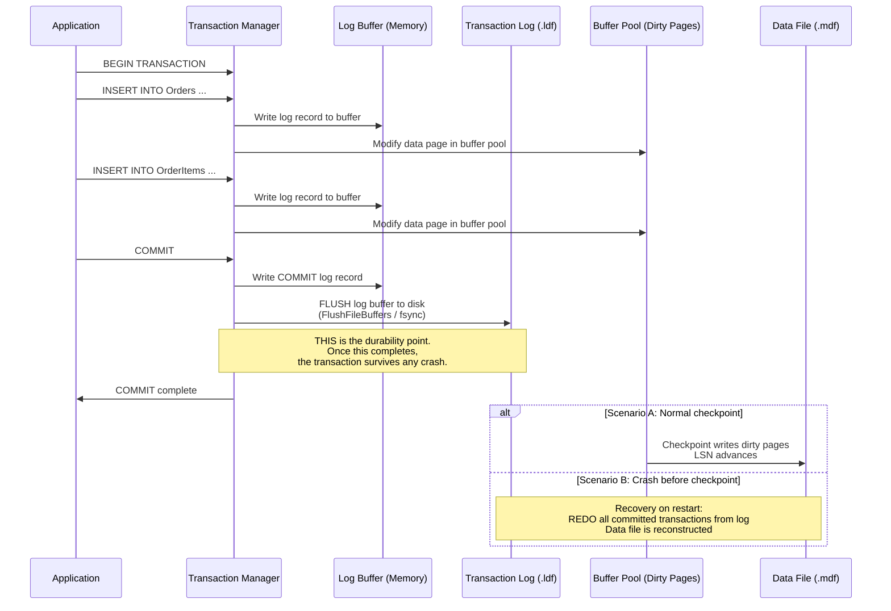

## Navigation

**Domain:** [[8 — Databases]] > **Group:** Relational Fundamentals
**Previous:** [[8.006 — ACID — Isolation]] | **Next:** [[8.008 — NULL — Three-Valued Logic and Implications]]

### Prerequisites

- [[8.004 — ACID — Atomicity]] — durability and atomicity share the same mechanism (WAL): atomicity ensures transactions are all-or-nothing, durability ensures that a committed transaction is never lost.
- [[8.006 — ACID — Isolation]] — isolation's locking/versioning behavior affects what needs to be durable. A committed transaction's writes must survive; an uncommitted transaction's writes must not.

### Where This Fits

Durability is the guarantee that once a transaction commits, its changes are permanent — even if the server loses power, the OS crashes, or the disk subsystem has a transient failure. For a .NET backend engineer, durability is what makes `SaveChangesAsync()` returning successfully mean the data is on stable storage, not just in memory. Durability breaks in production when lazy transaction commit (delayed durability) is misconfigured and a crash loses supposedly-committed data, when the transaction log and data file are on the same drive and a disk failure destroys both, or when a backup strategy does not produce a recovery point consistent with the durability guarantee. In interviews, durability questions test whether you understand the write path from application code to physical disk — what a "commit" actually means at the storage engine and hardware level.

---

## Core Mental Model

A transaction is durable if, after the COMMIT statement completes successfully, **all changes made by the transaction will survive any subsequent failure of the database server, operating system, or hardware**. The engine achieves this through **write-ahead logging (WAL)** : before any data page is modified in the buffer pool, a log record describing the change is written to the in-memory log buffer. At COMMIT, every log record for the transaction — including the commit record itself — is forced from the log buffer to the physical transaction log file on disk. The data pages themselves may still be dirty in memory (modified but not yet written to the data file), but the log is the authoritative source of truth. If the server crashes before the data pages are written, recovery replays the committed log records (REDO) to reconstruct the data pages.

The invariant: **a commit is not a commit until the log is on disk**. The data file is a cache of the log; the log is the ground truth.

### Classification

**For architecture topics:** Durability is enforced by the **log manager** and **recovery subsystem** of the storage engine. In SQL Server, the transaction log (.ldf) is a separate file from the data file (.mdf). Log writes are sequential (append-only), which makes them significantly faster than random data page writes. The bottleneck for transactional throughput is almost always the log write latency — measured in microseconds on modern NVMe, but still the synchronous point in every transaction. On COMMIT, the engine calls `FlushFileBuffers()` (Windows) or `fsync()` (Linux) to ensure the log buffer is physically on stable media. This is the `WRITELOG` wait type. The tradeoff between performance and durability is exposed through **delayed durability** (SQL Server 2014+), where the log buffer is not flushed immediately on COMMIT, accepting the risk of losing up to N transactions on a crash in exchange for eliminating the log flush bottleneck.



### Key Properties

|Property|Value|Notes|
|---|---|---|
|Enforcement mechanism|Write-Ahead Logging (WAL) + ARIES recovery|Log records written before data page modifications; COMMIT = log flush to disk|
|Log write pattern|Sequential append — fastest possible write pattern|Random writes are avoided; the log is written sequentially (no seeks on spinning disks)|
|Commit latency|~50–500µs (NVMe) to ~2–10ms (spinning disk)|Determined by `FlushFileBuffers`/`fsync` latency; the transaction's critical path|
|Recovery time|Proportional to log size since last checkpoint|Each checkpoint reduces recovery time by limiting how far REDO must scan|
|Delayed durability|Trade durability for performance — COMMIT returns before log flush|Risk: up to N unflushed transactions lost on crash|
|Durability boundary|Per SQL Server instance — cross-database transactions require MSDTC for distributed durability|Single-database transactions are always durable within that database's log|

---

## Deep Mechanics

### How the Engine Executes This

**Commit durability path:**

1. **Log buffer accumulation** — as DML executes, log records (each with a Log Sequence Number — LSN) are written to an in-memory log buffer. Each log record contains: LSN, transaction ID, page ID, before-image (for UNDO), after-image (for REDO), and operation type.

2. **COMMIT trigger** — when the application issues COMMIT, the engine writes a "COMMIT" log record to the log buffer and then initiates a **log flush**. The flush calls `FlushFileBuffers()` on the log file handle, which instructs the OS to write all buffered log data to physical storage and wait for the storage hardware to confirm the write is on stable media.

3. **Write confirmation** — the OS and storage subsystem confirm the write. On modern NVMe drives with power-loss protection, this takes ~50–200µs. On traditional spinning disks, ~2–10ms.

4. **Commit acknowledged** — control returns to the application. From this point, the transaction's modifications survive any crash because the log file contains the after-images needed to REDO them.

5. **Later checkpoint** — a background checkpoint process scans the buffer pool for dirty pages (pages modified but not yet written to disk) whose LSN is less than or equal to the last checkpoint LSN, and writes them to the data file. This does NOT affect durability — it only reduces recovery time by establishing a known-good starting point for REDO.

**Recovery path (after crash):**

1. **Analysis phase** — scan the log from the last checkpoint to identify committed (have COMMIT log record) and in-flight (no COMMIT log record) transactions.

2. **REDO phase** — scan forward from the last checkpoint LSN, reapplying every log record from committed transactions to the data pages. This is idempotent — reapplying a change to a page that already has it is a no-op.

3. **UNDO phase** — scan backward from the end of the log, rolling back all in-flight transactions using the before-images in their log records. The compensation log records (CLRs) generated during UNDO are also written to the log — ensuring that UNDO itself survives a crash during recovery.

**Delayed durability (SQL Server 2014+):**
- With `DELAYED_DURABILITY = FORCED` at the database level or `COMMIT WITH (DELAYED_DURABILITY = ON)` at the transaction level, the COMMIT returns to the application immediately after writing the log record to the in-memory buffer — WITHOUT waiting for the flush to disk.
- The log buffer is flushed asynchronously when it reaches a threshold (typically ~60KB) or when a transaction with full durability commits.
- Risk: if the server crashes before the async flush completes, the committing transactions (and potentially transactions that committed minutes ago if the buffer wasn't flushed) are lost.
- Use case: bulk load, telemetry ingestion, or any scenario where losing the last few seconds of data is acceptable.

### SQL Visibility

```sql
-- The COMMIT is the durability boundary
BEGIN TRANSACTION;
    INSERT INTO Orders (CustomerId, TotalAmount)
    VALUES (4821, 299.99);
COMMIT TRANSACTION;   -- ⚠️ This is the durability point.
                      -- If the server loses power now, the INSERT survives.
                      -- If it loses power before this, the INSERT does not exist.

-- Verify durability by checking the log
-- The log file records every transaction
SELECT COUNT(*) AS LogRecordCount
FROM fn_dblog(NULL, NULL)
WHERE [Transaction ID] IS NOT NULL;

-- Enable delayed durability at the database level
ALTER DATABASE CurrentDatabase
    SET DELAYED_DURABILITY = FORCED;
    
-- Use delayed durability for specific transactions
COMMIT WITH (DELAYED_DURABILITY = ON);

-- If the server crashed and you suspect data loss from delayed durability:
-- Query the last LSN from the log before the crash
SELECT MAX([Current LSN]) AS LastLsnBeforeCrash
FROM fn_dblog(NULL, NULL);

-- Detect delayed durability configuration
SELECT name, delayed_durability_description
FROM sys.databases
WHERE name = DB_NAME();

-- Force a checkpoint to write dirty pages to disk
CHECKPOINT;
-- (Does not affect durability of committed transactions —
--  they are already durable in the log. Checkpoint only
--  reduces recovery time.)
```

```csharp
// EF Core — COMMIT is handled by SaveChangesAsync
public async Task CreateOrderAndVerifyAsync(
    int customerId,
    CancellationToken cancellationToken = default)
{
    await using var transaction = await _dbContext.Database
        .BeginTransactionAsync(cancellationToken);

    _dbContext.Orders.Add(new Order
    {
        CustomerId = customerId,
        TotalAmount = 299.99
    });

    await _dbContext.SaveChangesAsync(cancellationToken);
    // ^^^ This issues COMMIT and waits for log flush on SQL Server.
    // After this line returns, the data is durable.

    await transaction.CommitAsync(cancellationToken);
    // ^^^ If we started a manual transaction, commit it too.
}

// EF Core does NOT expose delayed durability directly.
// To use it, execute raw SQL:
public async Task BulkInsertWithDelayedDurabilityAsync(
    IReadOnlyList<Order> orders,
    CancellationToken cancellationToken = default)
{
    const string sql = @"
        BEGIN TRANSACTION;
            INSERT INTO Orders (CustomerId, TotalAmount)
            VALUES (@CustomerId, @TotalAmount);
        COMMIT WITH (DELAYED_DURABILITY = ON);";

    await using var connection = _connectionFactory.Create();
    foreach (var order in orders)
    {
        await connection.ExecuteAsync(
            new CommandDefinition(sql,
                new { order.CustomerId, order.TotalAmount },
                cancellationToken: cancellationToken));
    }
}
```

**Generated SQL (from EF Core logs for a manual transaction):**

```sql
-- EF Core with manual transaction:
BEGIN TRANSACTION;

INSERT INTO [Orders] ([CustomerId], [TotalAmount])
VALUES (@p0, @p1);
SELECT [OrderId] FROM [Orders] WHERE @@ROWCOUNT = 1 AND [OrderId] = SCOPE_IDENTITY();

-- EF Core calls CommitAsync on the DbTransaction:
COMMIT TRANSACTION;
-- At this moment, SQL Server flushes the log.
```

### Execution Plan Analysis

The COMMIT operation does NOT generate a query execution plan — it is a transaction management operation, not a query. The execution plan for the INSERT within the transaction shows the data modification operators, but the log flush at COMMIT is invisible in SHOWPLAN output.

```
Expected plan shape:
[INSERT statement] → [Clustered Index Insert] → [INSERT]
  (plan does not include COMMIT — no query plan for COMMIT)

The cost of COMMIT is measured in log write latency, not in query cost:
- WRITELOG wait type: time spent waiting for the log flush to complete
- LOG_FLUSH wait: time spent flushing the log buffer to disk
- These appear in sys.dm_os_wait_stats, not in the query plan
```

### Cost Visibility

```sql
SET STATISTICS TIME ON;

-- Single-statement autocommit:
INSERT INTO Orders (CustomerId, TotalAmount) VALUES (4821, 99.99);
-- SQL Server Execution Times: CPU time = 0ms, elapsed time = 3ms
-- (1 async log write during DML + 1 sync log flush at autocommit)

-- Explicit transaction with 10 INSERTs:
BEGIN TRANSACTION;
    INSERT INTO Orders (CustomerId, TotalAmount) VALUES (4821, 10.00);
    INSERT INTO Orders (CustomerId, TotalAmount) VALUES (4822, 20.00);
    -- ... 8 more ...
COMMIT TRANSACTION;
-- SQL Server Execution Times: CPU time = 1ms, elapsed time = 4ms
-- (10 log record writes to buffer + 1 sync flush at COMMIT)

-- Measure log flush performance:
SELECT wait_type, waiting_tasks_count, wait_time_ms,
       wait_time_ms / NULLIF(waiting_tasks_count, 0) AS avg_wait_ms
FROM sys.dm_os_wait_stats
WHERE wait_type IN ('WRITELOG', 'LOG_FLUSH', 'LOGBUFFER')
ORDER BY wait_time_ms DESC;

-- WRITELOG: time waiting for log writes to complete
-- High avg_wait_ms indicates slow log I/O (disk bottleneck)
-- High waiting_tasks_count indicates many small transactions
```

### Failure Modes

**Disk full on log drive (error 9002):** The transaction log file cannot grow because the disk is full. New transactions cannot commit because the log buffer cannot be flushed. The database becomes read-only (or transactions are rolled back). Recovery: add space to the log drive, shrink the log (after backup), or add a new log file on a different drive.

**Log drive failure:** If the physical drive containing the `.ldf` file fails and there is no mirror (RAID 1, Availability Group, or log shipping), the database is unrecoverable to the point of failure. The most recent full backup can be restored (losing all transactions since that backup), and any transactions in the tail of the log after the last log backup are lost.

**Delayed durability data loss:** A power failure occurs after 10,000 transactions committed with delayed durability but before the async log flush completed. Those 10,000 transactions are lost. The database is recovered to the state of the last successful log flush, not to the state of the last COMMIT.

```sql
-- Detect how much committed data might be lost with delayed durability
SELECT COUNT(*) AS UnflushedTransactions
FROM fn_dblog(NULL, NULL)
WHERE Operation = 'LOP_COMMIT_XACT'
  AND [Log Record Fixed Length] > 0
  AND [Page ID] IS NULL;  -- approximate: log records not yet flushed
```

**Single-drive configuration:** Storing `.mdf`, `.ldf`, and `tempdb` on the same drive means a single disk failure loses everything. This violates the durability principle because the recovery strategy (restore from backup + replay log) cannot be executed without the log.

**Write caching without battery backup:** A storage controller with write caching enabled but WITHOUT battery-backed write cache (BBWC) or power-loss protection can acknowledge a write to the OS before the data is actually on stable media. If power is lost, the cached writes are lost, and the transaction log flush that the OS confirmed may not have physically reached the disk. This is the most common cause of "corruption that shouldn't have happened" — the engine believes the log is on disk when it is not.

---

## Production Patterns and Implementation

### Primary SQL Implementation

```sql
-- Best practices for durability configuration

-- 1. Verify log and data files are on separate drives
SELECT name, physical_name, type_desc, state_desc
FROM sys.master_files
WHERE database_id = DB_ID();
-- type_desc = ROWS → .mdf (data)
-- type_desc = LOG → .ldf (log)
-- They should be on different drive letters or mount points

-- 2. Size the log file appropriately to avoid auto-growth
-- Auto-growth causes log write stalls (zero-initialization of new space)
ALTER DATABASE CurrentDatabase
    MODIFY FILE (NAME = 'MyDB_Log', SIZE = 10GB, FILEGROWTH = 1GB);

-- 3. Perform regular log backups to allow log truncation
-- (Full recovery model requires log backups)
BACKUP LOG CurrentDatabase TO DISK = 'E:\Backups\MyDB_Log.bak';

-- 4. Checkpoint frequency (automatic, but can be forced)
CHECKPOINT;
-- Forces dirty pages to disk — reduces recovery time

-- 5. Use delayed durability for bulk/telemetry operations
-- Create a separate telemetry database or use transaction-level control
BEGIN TRANSACTION;
    INSERT INTO TelemetryEvents (EventType, EventData)
    VALUES ('PageView', '{"url":"/home"}');
COMMIT WITH (DELAYED_DURABILITY = ON);
```

### EF Core Implementation

```csharp
public class OrderService
{
    private readonly ApplicationDbContext _dbContext;

    // Standard durable commit
    public async Task<Order> CreateOrderAsync(
        CreateOrderCommand command,
        CancellationToken cancellationToken = default)
    {
        var order = new Order
        {
            CustomerId = command.CustomerId,
            TotalAmount = command.TotalAmount
        };

        _dbContext.Orders.Add(order);
        await _dbContext.SaveChangesAsync(cancellationToken);
        // ⚠️ At this point, the data is durable (log flushed to disk).

        return order;
    }

    // Bulk insert with explicit delayed durability
    public async Task BulkInsertTelemetryAsync(
        IReadOnlyList<TelemetryEvent> events,
        CancellationToken cancellationToken = default)
    {
        await using var connection = _connectionFactory.Create();
        await connection.OpenAsync(cancellationToken);

        foreach (var batch in events.Chunk(1000))
        {
            // Each batch commits with delayed durability
            using var transaction = connection.BeginTransaction();

            const string sql = @"
                INSERT INTO TelemetryEvents (EventType, EventData, CreatedAt)
                VALUES (@EventType, @EventData, SYSUTCDATETIME())";

            foreach (var evt in batch)
            {
                await connection.ExecuteAsync(
                    new CommandDefinition(sql,
                        new { evt.EventType, evt.EventData },
                        transaction: transaction,
                        cancellationToken: cancellationToken));
            }

            // Commit with delayed durability — fast, but risk of data loss
            await connection.ExecuteAsync(
                "COMMIT WITH (DELAYED_DURABILITY = ON)",
                transaction: transaction);
        }
    }
}

// Health check: verify the database can commit durably
public class DurabilityHealthCheck : IHealthCheck
{
    private readonly IDbConnectionFactory _connectionFactory;

    public DurabilityHealthCheck(IDbConnectionFactory connectionFactory)
    {
        _connectionFactory = connectionFactory;
    }

    public async Task<HealthCheckResult> CheckHealthAsync(
        HealthCheckContext context,
        CancellationToken cancellationToken = default)
    {
        try
        {
            await using var connection = _connectionFactory.Create();
            await connection.OpenAsync(cancellationToken);

            // A full-durability commit verifies the log flush path
            using var transaction = connection.BeginTransaction();
            await connection.ExecuteAsync(
                "SELECT 1", transaction: transaction);
            transaction.Commit();   // durability test point

            // Check log wait stats
            var logFlushMs = await connection.QuerySingleAsync<long>(
                @"SELECT wait_time_ms
                  FROM sys.dm_os_wait_stats
                  WHERE wait_type = 'WRITELOG'");

            if (logFlushMs > 5000)
            {
                return HealthCheckResult.Degraded(
                    $"High log flush wait time: {logFlushMs}ms");
            }

            return HealthCheckResult.Healthy();
        }
        catch (Exception ex)
        {
            return HealthCheckResult.Unhealthy(
                "Durability check failed — cannot commit a transaction.", ex);
        }
    }
}
```

### Dapper Implementation

```csharp
public class TelemetryIngestionService
{
    private readonly IDbConnectionFactory _connectionFactory;

    public TelemetryIngestionService(IDbConnectionFactory connectionFactory)
    {
        _connectionFactory = connectionFactory;
    }

    // High-throughput ingestion with delayed durability
    public async Task IngestTelemetryAsync(
        IReadOnlyList<TelemetryEvent> events,
        CancellationToken cancellationToken = default)
    {
        await using var connection = _connectionFactory.Create();
        await connection.OpenAsync(cancellationToken);

        const string insertSql = @"
            INSERT INTO TelemetryEvents (EventType, EventData, CreatedAt)
            VALUES (@EventType, @EventData, SYSUTCDATETIME())";

        foreach (var batch in events.Chunk(500))
        {
            // No explicit transaction — each INSERT commits individually
            // with delayed durability at the database level
            foreach (var evt in batch)
            {
                await connection.ExecuteAsync(
                    new CommandDefinition(insertSql,
                        new { evt.EventType, evt.EventData },
                        cancellationToken: cancellationToken));
            }
        }
    }

    // Full-durability transaction for critical data
    public async Task<int> CreatePaymentAsync(
        Payment payment,
        CancellationToken cancellationToken = default)
    {
        await using var connection = _connectionFactory.Create();
        await connection.OpenAsync(cancellationToken);
        using var transaction = connection.BeginTransaction();

        try
        {
            var paymentId = await connection.ExecuteScalarAsync<int>(
                @"INSERT INTO Payments (OrderId, Amount, PaymentMethod)
                  VALUES (@OrderId, @Amount, @PaymentMethod);
                  SELECT CAST(SCOPE_IDENTITY() AS INT);",
                new CommandDefinition(payment,
                    transaction: transaction,
                    cancellationToken: cancellationToken));

            transaction.Commit();   // full durability — log flush guaranteed
            return paymentId;
        }
        catch
        {
            transaction.Rollback();
            throw;
        }
    }
}
```

### Configuration and Wiring

```csharp
// Program.cs
builder.Services.AddDbContext<ApplicationDbContext>(options =>
    options.UseSqlServer(
        builder.Configuration.GetConnectionString("Default"),
        sqlOptions =>
        {
            sqlOptions.EnableRetryOnFailure(3);
            sqlOptions.CommandTimeout(30);
        }));

// Dapper connection factory with separate data and log drives
builder.Services.AddSingleton<IDbConnectionFactory>(
    new SqlConnectionFactory(
        builder.Configuration.GetConnectionString("Default")!));

// Register the durability health check
builder.Services.AddHealthChecks()
    .AddCheck<DurabilityHealthCheck>("database-durability");
```

### SQL Server vs PostgreSQL Differences

```sql
-- PostgreSQL: fsync at COMMIT (same principle as SQL Server)
-- PostgreSQL: synchronous_commit setting controls durability
--   on:     full sync at COMMIT (default, equivalent to SQL Server full durability)
--   off:    no sync at COMMIT (equivalent to delayed durability, data loss possible on crash)

-- PostgreSQL: commit_delay — introduce a small delay before fsync to batch
-- multiple commits into a single fsync (reduces fsync rate at the cost of latency)

-- Set synchronous commit per transaction:
SET synchronous_commit TO off;
INSERT INTO telemetry_events (event_type, event_data) VALUES ('page_view', '/home');
COMMIT;  -- returns immediately — no fsync

-- PostgreSQL: full_page_writes
-- Writing a full page image to the log on first modification after checkpoint
-- Prevents partial page writes from causing corruption during crash recovery
-- Should be ON (default) unless the filesystem guarantees atomic page writes

-- SQL Server: full_page_writes equivalent is always enabled for the transaction log
-- SQL Server does not have an equivalent setting — it always writes full page images
-- in the log after the last checkpoint
```

---

## Gotchas and Production Pitfalls

### Transaction Log and Data File on the Same Drive

**Pitfall:** Installing SQL Server with default settings and accepting the same drive for both `.mdf` and `.ldf`.

**Symptom:** When the drive fails, both the data file and the log file are lost simultaneously. Recovery is only possible to the last full backup — all transactions since that backup are lost. Additionally, log writes (sequential) compete with data file reads/writes (random) for I/O bandwidth, degrading both.

**Fix:**

```sql
-- Move the log file to a separate drive
ALTER DATABASE CurrentDatabase
    MODIFY FILE (NAME = 'MyDB_Log',
                 FILENAME = 'F:\Logs\MyDB_Log.ldf');
-- Then take the database offline, physically move the file, bring it online
```

**Cost of not fixing:** A single disk failure causes complete data loss for all transactions since the last full backup. In a typical OLTP system with hourly log backups, that is up to an hour of committed transactions — potentially millions of dollars in orders, gone.

### Delayed Durability Configured Without Understanding the Risk

**Pitfall:** Enabling delayed durability globally "for performance" without understanding that it sacrifices the D in ACID.

```sql
ALTER DATABASE CurrentDatabase SET DELAYED_DURABILITY = FORCED;
```

**Symptom:** A power failure occurs. After recovery, the database rolls back 15 seconds of "committed" transactions — the last 15 seconds of order confirmations, payment records, and user registrations are gone. The application shows orders as "placed" (the COMMIT returned successfully to the application) but the data does not exist in the database. Customers are charged or receive confirmation emails for orders that the database has no record of.

**Fix:**

```sql
-- Disable forced delayed durability
ALTER DATABASE CurrentDatabase SET DELAYED_DURABILITY = DISABLED;

-- Use per-transaction control only where acceptable:
COMMIT WITH (DELAYED_DURABILITY = ON);
-- Allowed ONLY for telemetry, audit logs, or other non-critical data
```

**Cost of not fixing:** Permanent data loss of committed transactions. The application believes the data was saved (COMMIT returned success), but the database has no record of it. Auditors, regulators, and customers will not accept "we lost the last 15 seconds of orders due to a power failure" as an explanation.

### No Regular Log Backups (Full Recovery Model)

**Pitfall:** Using the FULL recovery model without taking regular log backups. The transaction log never truncates, grows until it fills the disk, and then all transactions fail with error 9002.

```sql
-- Detect log file growth
SELECT name, size * 8 / 1024 AS SizeMB,
       CAST(FILEPROPERTY(name, 'SpaceUsed') AS INT) * 8 / 1024 AS UsedMB
FROM sys.database_files
WHERE type_desc = 'LOG';
-- If SizeMB == UsedMB, the log is full — no VLF available for new transactions
```

**Symptom:** Error 9002: "The transaction log for database 'MyDB' is full." All write operations fail. The application returns 500 errors for every request that modifies data. Recovery: `BACKUP LOG` to truncate, or add more log file space.

**Fix:**

```sql
-- Configure regular log backups (every 15 minutes in production)
-- Backup job:
BACKUP LOG CurrentDatabase TO DISK = 'E:\Backups\MyDB_Log_20260618_1200.trn';

-- Or switch to SIMPLE recovery model if point-in-time recovery is not needed
ALTER DATABASE CurrentDatabase SET RECOVERY SIMPLE;
-- Log is truncated automatically on checkpoint (no log backups needed)
```

**Cost of not fixing:** The application goes down when the log drive fills. Recovery requires emergency intervention to back up the log and free space — during which the application is unavailable for writes.

### Write Caching Without Power-Loss Protection

**Pitfall:** The storage controller has write caching enabled but no battery backup (BBWC) and no capacitor-backed write cache. The OS confirms a write, but the data is still in the controller's volatile cache. A power failure loses all cached data.

**Symptom:** After an unexpected power loss, SQL Server detects corruption during recovery (error 824 — "I/O error" or "log inconsistency") or, worse, recovers without error but silently loses the last N transactions that the OS and SQL Server believed were committed. This is insidious because no error is raised — the data simply disappears.

**Fix:**

- Ensure all storage controllers have battery-backed write cache (BBWC) or capacitor-backed NVRAM.
- Verify SQL Server's disk I/O path with `SQLIOSim` (SQL Server I/O simulator).
- On cloud VMs, use managed disks (Azure) or EBS (AWS) — their durability guarantees are equivalent to battery-backed cache.
- Check the Windows disk write cache setting:
  ```
  Disk Management → Right-click drive → Properties → Hardware → Properties → Policy
  → "Enable write caching on the device" → UNCHECK unless the device has battery backup
  ```

**Cost of not fixing:** Silent data corruption or data loss after any unexpected power loss. Recovery requires restoring from the last clean backup, losing all transactions since that backup.

### Partial Page Writes During Power Loss

**Pitfall:** A power failure occurs while the database engine is writing a data page. The page is only partially written — some sectors are the new data, some are the old data. The page is corrupt.

**Symptom:** On restart, recovery detects page checksum mismatches (error 823 or 824). The affected pages are marked as suspect. Queries that hit those pages fail.

**Fix:** This is the problem that **full-page writes** (a page image in the log) solves. Both SQL Server and PostgreSQL prevent this by writing a full before-image of the page to the log on the first modification after a checkpoint. If a partial page write occurs, recovery can detect the torn page (via checksum) and reconstruct it from the log. Ensure `PAGE_VERIFY = CHECKSUM` is enabled:

```sql
ALTER DATABASE CurrentDatabase SET PAGE_VERIFY CHECKSUM;
```

**Cost of not fixing:** Permanent page corruption on power loss. Recovery requires restoring the affected page(s) from backup or running `DBCC CHECKDB` with repair options (which may result in data loss for the affected page).

---

## Performance Implications

### Benchmark: Before and After

```sql
-- Baseline: 1,000 separate autocommit INSERTs (1,000 log flushes)
SET STATISTICS TIME ON;
DECLARE @i INT = 0;
WHILE @i < 1000
BEGIN
    INSERT INTO Orders (CustomerId, TotalAmount) VALUES (1, 10.00);
    SET @i = @i + 1;
END
-- Elapsed time: ~3,500ms (3.5ms per INSERT, dominated by log flush)

-- Optimized: 1,000 INSERTs in batches of 100 with explicit transactions
-- (100 log flushes instead of 1,000)
DECLARE @i INT = 0;
WHILE @i < 10
BEGIN
    BEGIN TRANSACTION;
        DECLARE @j INT = 0;
        WHILE @j < 100
        BEGIN
            INSERT INTO Orders (CustomerId, TotalAmount) VALUES (1, 10.00);
            SET @j = @j + 1;
        END
    COMMIT TRANSACTION;
    SET @i = @i + 1;
END
-- Elapsed time: ~450ms (0.45ms per INSERT — 7.7x faster)

-- With delayed durability (100 INSERTs per batch):
BEGIN TRANSACTION;
    INSERT INTO Orders (CustomerId, TotalAmount) VALUES (1, 10.00);  -- repeat 100x
COMMIT WITH (DELAYED_DURABILITY = ON);
-- Elapsed time: ~2ms (0.02ms per INSERT — 175x faster than autocommit)
-- ⚠️ Risk: these committed transactions may be lost on crash
```

**Improvement:** Batching 100 INSERTs per explicit transaction reduces log flushes by 10x and wall-clock time by ~7.7x (3,500ms → 450ms). Adding delayed durability reduces it further to ~2ms, but sacrifices the ACID durability guarantee.

### BenchmarkDotNet

```csharp
[MemoryDiagnoser]
[SimpleJob(RuntimeMoniker.Net90)]
public class DurabilityBenchmark
{
    private IDbConnection _connectionDurable = default!;
    private IDbConnection _connectionDelayed = default!;

    [GlobalSetup]
    public void Setup()
    {
        _connectionDurable = new SqlConnection(ConnectionStringDefault);
        _connectionDelayed = new SqlConnection(ConnectionStringDelayedDurability);
    }

    [Benchmark(Baseline = true)]
    public async Task Insert_Durable_Autocommit()
    {
        for (int i = 0; i < 100; i++)
        {
            await _connectionDurable.ExecuteAsync(
                "INSERT INTO Orders (CustomerId, TotalAmount) VALUES (1, 10.00)");
        }
    }

    [Benchmark]
    public async Task Insert_Durable_Batched()
    {
        await _connectionDurable.ExecuteAsync(@"
            BEGIN TRANSACTION;
            INSERT INTO Orders (CustomerId, TotalAmount) VALUES (1, 10.00);  -- ×100
            COMMIT TRANSACTION;");
    }

    [Benchmark]
    public async Task Insert_DelayedDurability_Batched()
    {
        await _connectionDelayed.ExecuteAsync(@"
            BEGIN TRANSACTION;
            INSERT INTO Orders (CustomerId, TotalAmount) VALUES (1, 10.00);  -- ×100
            COMMIT WITH (DELAYED_DURABILITY = ON);");
    }
}
```

**Expected results (approximate, SQL Server 2022, NVMe):**

|Method|Mean|Log Flushes|Data Loss Risk|
|---|---|---|---|
|Insert_Durable_Autocommit|~350 ms|100|None|
|Insert_Durable_Batched|~45 ms|1|None|
|Insert_DelayedDurability_Batched|~0.8 ms|1 (async)|Up to ~60KB of log buffer flushed asynchronously|

### Write Amplification

|Operation|Log Writes|Data File Writes|Durability Guarantee|
|---|---|---|---|
|INSERT 1 row (autocommit)|~1 log write + flush|0 (dirty in buffer pool, written later at checkpoint)|Full — durable on COMMIT|
|INSERT 100 rows (batched)|~100 log records + 1 flush|0 (written at checkpoint)|Full — durable on COMMIT|
|INSERT 100 rows (delayed durability)|~100 log records + 0 flush|0|None — lost on crash before async flush|
|CHECKPOINT|0|N dirty pages written to data file|Does not affect durability — only reduces recovery time|

---

## Interview Arsenal

### Question Bank

1. What does ACID durability guarantee at the storage engine level — what must physically happen for a transaction to be considered durable?
2. What is the difference between writing to the transaction log and writing to the data file, and why does the log have to be written first?
3. What is delayed durability, and what is the specific scenario in which it causes data loss?
4. What happens during crash recovery if the server loses power after the log flush at COMMIT but before the data pages are written to disk?
5. What is the relationship between log backups and durability under the FULL recovery model?
6. How does checkpoint interact with durability — does a checkpoint make uncommitted transactions durable?
7. What hardware configuration mistake silently violates the durability guarantee?
8. How does EF Core's `SaveChangesAsync` guarantee durability — what mechanism confirms the data is on stable storage?

### Spoken Answers

**Q: What does ACID durability guarantee at the storage engine level — what must physically happen for a transaction to be considered durable?**

> **Average answer:** "The data is saved to disk." True but meaningless — what does "saved" mean at the hardware level?

> **Great answer:** "Durability means that after COMMIT returns successfully to the application, every change made by that transaction will survive any subsequent failure of the server, OS, or hardware. At the engine level, this requires exactly one thing: every log record generated by the transaction — including the commit record itself — must be physically written to the transaction log file on stable storage. The engine calls `FlushFileBuffers()` on the .ldf file handle, which forces the OS to write the log buffer to the disk controller and waits for the controller to confirm the data is on a medium that survives power loss — either the physical disk platter or a battery-backed/NVMe cache. The data pages modified by the transaction can remain in memory as dirty pages — they don't need to be on disk yet — because the log is the source of truth. If the server crashes, recovery replays the log (REDO) to reconstruct the data pages. The critical distinction: logging is sequential and fast; data page writes are random and deferred. Durability requires the sequential log write to be complete; it does not require the random data page writes."

**Q: What is delayed durability, and what is the specific scenario in which it causes data loss?**

> **Average answer:** "It makes commits faster but you might lose data." Correct but vague.

> **Great answer:** "Delayed durability lets a COMMIT return to the application immediately after writing the commit record to the in-memory log buffer, without waiting for the synchronous flush to the physical log file. The log buffer is flushed asynchronously when it reaches a threshold — typically about 60KB — or when a full-durability transaction commits. The specific data-loss scenario: suppose 10,000 transactions commit with delayed durability over 2 seconds. The log buffer now holds 10,000 commit records. Then the server loses power. None of those 10,000 commit records have been flushed to the physical log file. On recovery, these transactions are treated as if they never committed — they are rolled back during UNDO. Every application that received a 'success' response from COMMIT is now wrong: the application believes the data is saved, but the database has no record of it. This is not corruption — it's logically consistent from the database's perspective — but from the application's perspective, committed data has disappeared. This is why delayed durability is only acceptable for non-critical data where losing the last few seconds is explicitly acceptable per the business requirements."

**Q: What hardware configuration mistake silently violates the durability guarantee?**

> **Average answer:** "Not having a backup." Wrong — that's a recovery problem, not a durability violation.

> **Great answer:** "The most common hardware mistake is a disk controller with write caching enabled but without battery-backed write cache. The OS and SQL Server issue a flush command and the controller acknowledges it — but the data is still sitting in the controller's volatile DRAM cache, not on the physical disk. If power is lost, that cache is emptied, and the transaction log write that SQL Server believed was on stable storage never actually reached the disk. When the server comes back up, recovery may not detect the missing log writes — it may appear to complete successfully — but the data pages and log may be inconsistent, leading to corruption that is only discovered later when a query hits a corrupt page (error 823/824). This is the most insidious durability failure because there is no error at the time of the loss — the database recovers cleanly with no indication that data is missing. The fix is to ensure either (a) the controller has battery-backed write cache, (b) write caching is disabled on the volume hosting the transaction log, or (c) NVMe drives with power-loss protection are used. In cloud environments, managed disks automatically provide equivalent guarantees."

### Interview Trigger

Durability surfaces in disaster recovery and database architecture questions. A common trigger: "You have a financial application processing $1M/hour in transactions. Design the storage architecture." The interviewer watches for whether you specify separate data and log drives, RAID 1 or 10 for the log, regular log backups, and a backup strategy that covers the durability RPO (Recovery Point Objective). A follow-up: "What happens if the log drive fails during peak trading hours?" The senior answer describes the failure mode, the recovery point, and the monitoring that would alert before the failure (disk latency, log file size, error log warnings).

### Comparison Table

| | Full Durability | Delayed Durability | No Durability (Memory-Optimized with SCHEMA_ONLY) |
|---|---|---|---|
| Commit behavior | Synchronous log flush — wait for disk confirmation | No flush — COMMIT returns after writing log buffer | No log writes at all |
| Data loss on crash | None — all committed data survives | Last N KB of log buffer (~60KB) lost — up to several seconds of transactions | All data lost on restart |
| Throughput (INSERTs/sec) | ~1,000–5,000 (NVMe) | ~50,000–200,000 | ~1,000,000+ |
| When to use | All transaction-critical data (orders, payments, accounts) | Telemetry, audit logs, non-critical counters | Session state, temp caches |
| .NET implementation | Default `SaveChangesAsync` / `Transaction.Commit` | `COMMIT WITH (DELAYED_DURABILITY = ON)` | Not available in standard tables (In-Memory OLTP only) |

---

## Decision Framework

### When to Apply

```mermaid
flowchart TD
    A[Choosing a durability strategy] --> B{Does this data have<br/>business-critical value?}
    B -->|Yes — orders, payments,<br/>accounts, compliance records| C[Full durability — required.<br/>Separate log drive, regular<br/>log backups, BBWC/NVMe]

    B -->|No — telemetry, page views,<br/>debug logs, counters| D{What is the acceptable<br/>data loss window?}
    D -->|"≤ 1 second"| E[Full durability with batched<br/>transactions — 100 INSERTs/COMMIT<br/>— 1 log flush per batch]
    D -->|"5–30 seconds"| F[Delayed durability —<br/>COMMIT WITH (DELAYED_DURABILITY = ON)<br/>— async flush ~60KB buffer]
    D -->|"Loss of entire data set<br/>on restart acceptable"| G["SCHEMA_ONLY (In-Memory OLTP)<br/>— no durability at all"]
    
    C --> H[Confirm hardware:<br/>• Log drive = separate from data drive<br/>• BBWC or NVMe with power-loss protection<br/>• Regular log backup schedule]
    
    E --> I[Monitor WRITELOG wait type —<br/>consolidate if exceeding 50% of commit time]
    F --> J[Monitor delayed_durability_loss —<br/>extended event for async flush failures]
```

### Application Checklist

- [ ] Transaction log (.ldf) is on a physically separate drive from data files (.mdf)
- [ ] The log drive uses storage with power-loss protection (BBWC, NVMe with capacitor, managed cloud disk)
- [ ] Write caching is disabled or battery-backed on the log drive
- [ ] Regular log backups are configured (every 15 minutes for FULL recovery model)
- [ ] The log file is sized to handle the peak transactional load without frequent auto-growth
- [ ] Delayed durability is used ONLY for non-critical data — never for financial, order, or user account data
- [ ] The database has `PAGE_VERIFY CHECKSUM` enabled to detect torn pages
- [ ] Recovery time objectives (RTO) and recovery point objectives (RPO) are documented and tested
- [ ] EF Core / Dapper code never assumes a COMMIT returns before the log is flushed (unless delayed durability is explicitly intentional)

### Tradeoff Summary

|What You Gain|What You Pay|
|---|---|
|Full durability — committed data survives any crash|Log flush latency (50µs–10ms) per transaction — the bottleneck for write throughput|
|Delayed durability — 10–100x more write throughput|Risk of losing up to ~60KB of committed log buffer on crash|
|Separate log drive — log writes don't compete with data reads|Additional storage cost; additional failure domain to manage|
|Regular log backups — allows log truncation, enables point-in-time recovery|Backup storage cost; backup scheduling complexity|

### Scale Thresholds

- "Log flush becomes the bottleneck when write throughput exceeds ~3,000 transactions/second on a single log file with NVMe" — the sequential log write speed of a single NVMe drive is ~1-2GB/s, but the latency of each fsync/FlushFileBuffers caps the transaction rate.
- "Delayed durability improves throughput by approximately 5–50× depending on log flush latency" — the improvement is inversely proportional to log flush time.
- "The log file should be sized to accommodate at least one full backup cycle's worth of log growth plus the largest expected single transaction" — for a system generating 10GB of log per hour with hourly log backups, the log should be at minimum 15GB.
- "Recovery time is approximately proportional to the log size since the last checkpoint" — a 100GB log since the last checkpoint may take 10–30 minutes to REDO during restart.

---

## Self-Check

### Conceptual Questions

1. What does ACID durability guarantee — precisely at what point is a transaction considered durable?
2. What is the Write-Ahead Logging protocol, and how does it enforce the durability invariant?
3. Which DMV or function shows log flush wait times and log buffer performance?
4. What is the most common production mistake that silently violates the durability guarantee?
5. How does EF Core's `SaveChangesAsync` relate to the COMMIT durability boundary?
6. How would you write a Dapper query to check whether the log file is at risk of filling?
7. What is the difference between a log write (log record) and a log flush — which makes a transaction durable?
8. At what transaction throughput does log flush latency become the bottleneck?
9. What does a checkpoint do, and why does it not affect durability?
10. In 60 seconds, explain to a senior interviewer how you would configure storage for a high-throughput OLTP system to guarantee durability without sacrificing performance.

<details> <summary>Answers</summary>

1. A transaction is durable when the engine has written the COMMIT log record to the log buffer and successfully flushed that buffer to the physical log file on stable storage (confirmed by `FlushFileBuffers`/`fsync`). At that point, every modification made by the transaction will survive any subsequent failure. If the COMMIT returned without error, the data is guaranteed to be on stable storage — the data pages themselves may still be in memory, but they can be reconstructed from the log during recovery.
2. The Write-Ahead Logging protocol requires that before any data page is modified in the buffer pool, a log record describing the modification is written to the log buffer. At COMMIT, the log buffer is flushed to the physical log file. This ensures that the log always contains enough information to REDO any committed transaction — even if the data pages were never written to disk before a crash. The invariant: log writes precede data page writes.
3. `sys.dm_os_wait_stats` for `WRITELOG` (time spent waiting for log writes to complete) and `LOGBUFFER` (time spent waiting for space in the log buffer). `sys.dm_io_virtual_file_stats` for actual I/O latency on the log file: `SELECT * FROM sys.dm_io_virtual_file_stats(DB_ID(), FILE_ID_EX('CurrentDatabase_log'))`.
4. A disk controller with write caching enabled but without battery-backed write cache (BBWC). The OS confirms the log write as "on stable media," but the data is actually in the controller's volatile DRAM cache. On power loss, the cached log writes are lost. The engine believes the data is durable when it is not.
5. `SaveChangesAsync` wraps all generated SQL in a database transaction (BEGIN/COMMIT). The COMMIT sent by EF Core is a full-durability COMMIT — SQL Server does not flush the log buffer until the COMMIT statement completes. When `SaveChangesAsync` returns successfully, the transaction's data is guaranteed to be on stable storage. If `SaveChangesAsync` throws, the transaction was rolled back — no data was committed, and no partial state persists.
6. `SELECT size * 8 / 1024 AS SizeMB, CAST(FILEPROPERTY(name, 'SpaceUsed') AS INT) * 8 / 1024 AS UsedMB, (size * 8 / 1024) - (CAST(FILEPROPERTY(name, 'SpaceUsed') AS INT) * 8 / 1024) AS FreeMB FROM sys.database_files WHERE type_desc = 'LOG';` — if FreeMB is near zero, the log is at risk of filling. The log can only be truncated by a log backup (FULL recovery) or a checkpoint (SIMPLE recovery).
7. A log write (appending a record to the in-memory log buffer) is fast (~1µs) but does not make data durable. A log flush (calling `FlushFileBuffers` to write the buffer to disk) is the synchronous operation that makes the data durable. A transaction is not durable until a log flush confirms the data is on stable storage. The log writes are the preparation; the log flush is the commitment.
8. Log flush latency becomes the bottleneck when the number of transactions per second multiplied by the flush latency approaches the available CPU time. On NVMe (~100µs flush), this is roughly 10,000 transactions/second. On spinning disks (~5ms flush), this is roughly 200 transactions/second. Batching can increase throughput significantly because N INSERTs + 1 flush has approximately the same cost as 1 INSERT + 1 flush.
9. A checkpoint writes all dirty pages (buffer pool pages modified since the last checkpoint) to the data file and records the LSN of the checkpoint in the log. It does NOT affect durability — committed transactions were already durable in the log before the checkpoint. Its purpose is to reduce recovery time: REDO only needs to process log records from the last checkpoint forward, not from the beginning of time.
10. "For a high-throughput OLTP system, durability requires three things: separate drives for the log and data, power-loss-protected storage for the log, and batched transactions. The log drive gets a dedicated NVMe or RAID 1 pair of SSDs with power-loss protection — never spinning disks, never shared with the data file. Transaction batching is the most important performance optimization: instead of 1,000 autocommit INSERTs doing 1,000 log flushes at 100µs each (100ms total), batch them into 10 transactions of 100 INSERTs each — 10 flushes instead of 1,000. This cuts log flush overhead from 100ms to 1ms. For truly high throughput (50,000+ writes/second), I separate critical data (full durability, batched) from non-critical data (delayed durability or separate telemetry database). And I monitor `WRITELOG` wait stats — if avg wait exceeds 1ms, the log I/O path is the bottleneck."

</details>

---

### Query Challenges

**Challenge 1 — Write the SQL**

Configure a database called `OrderProcessing` for maximum durability and recovery safety. Write the SQL statements to: (1) verify PAGE_VERIFY is CHECKSUM, (2) move the log file to a dedicated drive `L:\Logs\`, (3) size the log file for 50GB with 5GB auto-growth, (4) set the recovery model to FULL, and (5) force a checkpoint to reduce future recovery time.

<details> <summary>Solution</summary>

```sql
-- 1. Verify and set PAGE_VERIFY
SELECT name, page_verify_option_desc
FROM sys.databases
WHERE name = 'OrderProcessing';

ALTER DATABASE OrderProcessing SET PAGE_VERIFY CHECKSUM;

-- 2. Move log file to dedicated drive
ALTER DATABASE OrderProcessing
    MODIFY FILE (
        NAME = 'OrderProcessing_Log',
        FILENAME = 'L:\Logs\OrderProcessing_Log.ldf'
    );
-- Then take database offline, physically copy the .ldf file, bring online
-- ALTER DATABASE OrderProcessing SET OFFLINE;
-- (Copy file from old location to L:\Logs\)
-- ALTER DATABASE OrderProcessing SET ONLINE;

-- 3. Size log file
ALTER DATABASE OrderProcessing
    MODIFY FILE (
        NAME = 'OrderProcessing_Log',
        SIZE = 50GB,
        FILEGROWTH = 5GB
    );

-- 4. Set FULL recovery model
ALTER DATABASE OrderProcessing SET RECOVERY FULL;

-- 5. Force a checkpoint
CHECKPOINT;

-- Verify settings
SELECT name, recovery_model_desc, page_verify_option_desc
FROM sys.databases
WHERE name = 'OrderProcessing';

SELECT name, physical_name, size * 8 / 1024 / 1024 AS SizeGB,
       growth * 8 / 1024 / 1024 AS GrowthGB
FROM sys.master_files
WHERE database_id = DB_ID();
```

</details>

---

**Challenge 2 — Fix the performance problem**

```sql
-- A high-throughput telemetry system inserts 1,000 events/second as individual INSERTs.
-- Each INSERT is a separate autocommit transaction.
INSERT INTO TelemetryEvents (EventType, EventData, CreatedAt)
VALUES ('PageView', '{"url":"/home"}', SYSUTCDATETIME());

-- The system is experiencing high WRITELOG waits (avg 8ms),
-- CPU is low (15%), but the application's telemetry ingestion is
-- processing only 350 events/second — far below the required 1,000.
```

Identify the bottleneck and implement the fix. Is durability actually required for this telemetry data (product analytics, not customer billing)?

<details> <summary>Solution</summary>

**Root cause:** 1,000 autocommit INSERTs/second = 1,000 log flushes/second. Each flush takes ~8ms (WRITELOG avg wait). At 8ms per flush, the maximum throughput is 125 flushes/second (1000ms / 8ms). The system is bottlenecked on log flush latency, not on CPU or data I/O.

**First fix — batch transactions (reduces flushes from 1,000/sec to 10/sec):**

```csharp
// Batch 100 INSERTs per explicit COMMIT — 1 log flush per 100 rows
foreach (var batch in events.Chunk(100))
{
    await connection.ExecuteAsync(@"
        BEGIN TRANSACTION;
        INSERT INTO TelemetryEvents (EventType, EventData, CreatedAt) VALUES (@EventType, @EventData, SYSUTCDATETIME());
        -- ... 100 INSERTs ...
        COMMIT TRANSACTION;");
}
```

**Second fix — if data loss is acceptable, use delayed durability:**

```sql
-- Database level:
ALTER DATABASE TelemetryDb SET DELAYED_DURABILITY = FORCED;
-- Now every COMMIT returns without waiting for log flush.
-- On crash, up to ~60KB of log buffer may be lost.
```

**Is durability required?** For product analytics (page views, feature usage), the business typically accepts losing the last few seconds of data in exchange for 10–50× higher throughput. If so, delayed durability is the correct choice. If regulatory compliance requires every telemetry event to be durable (unusual), batched full-durability is the alternative.

**After fix — expected throughput:** ~5,000–10,000 events/second (batched full durability) or ~100,000+ events/second (delayed durability).

</details>

---

**Challenge 3 — Explain the execution plan**

```sql
-- The following query runs daily. It takes 8 minutes.
-- A COMMIT statement does not appear in the execution plan. Why?
BEGIN TRANSACTION;
    UPDATE Inventory SET Quantity = Quantity - 1
    FROM Inventory i
    INNER JOIN OrderItems oi ON i.ProductId = oi.ProductId
    WHERE oi.OrderId = 728193;
    
    UPDATE Orders SET Status = 'Shipped'
    WHERE OrderId = 728193;
COMMIT TRANSACTION;
```

The execution plan shows two `Clustered Index Update` operators joined by a `Nested Loops` for the first UPDATE, and a single `Clustered Index Update` for the second. There is no operator for COMMIT. Why does COMMIT not appear, and where does the log flush cost appear in the performance metrics?

<details> <summary>Solution</summary>

**Why COMMIT does not appear:** COMMIT TRANSACTION is a transaction management operation, not a query. It is executed by SQL Server's transaction manager component, which is separate from the query processor. The query processor compiles and executes plans for DML statements (SELECT, INSERT, UPDATE, DELETE). Transaction operations (BEGIN, COMMIT, ROLLBACK, SAVE) are handled outside the query execution pipeline — they interact directly with the log manager and lock manager. There is no execution plan for COMMIT because there is no data to process.

**Where the log flush cost appears:** The log flush cost at COMMIT is captured in the `WRITELOG` wait type in `sys.dm_os_wait_stats`. It is also reflected in the elapsed time of the batch that contains the COMMIT. In `SET STATISTICS TIME ON` output, the total elapsed time for the batch includes the COMMIT's log flush wait. DMV `sys.dm_tran_database_transactions` shows the amount of log space used by each transaction and can help estimate the log flush cost.

**How to measure the COMMIT cost specifically:**

```sql
-- Capture log flush duration for this transaction
DECLARE @StartLsn NVARCHAR(50);
SELECT @StartLsn = last_lsn
FROM sys.dm_tran_database_transactions
WHERE database_id = DB_ID() AND transaction_id = @@TRANCOUNT;

-- (run the transaction here)

-- After COMMIT, query the log flush wait
SELECT wait_type, wait_time_ms
FROM sys.dm_os_wait_stats
WHERE wait_type = 'WRITELOG';
```

</details>

---

**Challenge 4 — Diagnose the durability problem**

A financial application processes payment transactions. After an unexpected power failure, the application comes back online. Users report that some payments that were confirmed as "successful" (the application showed a confirmation page) do not appear in the database. The database recovered cleanly with no errors. The storage controller has write caching enabled. The transaction log and data file are on the same RAID 0 array (two SSDs striped).

What is the most likely cause of the data loss, and what specific changes must be made to prevent recurrence?

<details> <summary>Solution</summary>

**Most likely cause:** The storage controller's write cache acknowledged the log flushes before the data was physically on stable media. When power was lost, the cache contents were lost. The specific factors:

1. **Write caching without power-loss protection** — the controller acknowledged the flush, SQL Server marked the COMMIT as complete and returned success to the application, but the data was still in the controller's volatile cache.
2. **RAID 0** — no redundancy. If one drive had a latent error or if the power loss caused a write collision on the stripe, data could be further compromised. RAID 0 provides no fault tolerance.

**Fixes:**

1. **Enable battery-backed write cache or disable write caching on the log drive.** Go to Disk Management → drive Properties → Hardware → Properties → Policy → UNCHECK "Enable write caching on the device" OR verify the controller has BBWC.
2. **Move the log to a separate drive.** Use RAID 1 (mirrored) for the log drive — redundancy without the write penalty of RAID 5/6, and the log is append-only so reads are minimal.
3. **Replace RAID 0 with RAID 1 or RAID 10.** RAID 0 has no fault tolerance — a single drive failure destroys the entire array.
4. **Enable PAGE_VERIFY CHECKSUM** to detect any torn pages on future failures.
5. **Test recovery.** Perform a controlled power loss test in the staging environment to verify that after the fix, no committed transactions are lost.

</details>

---

**Challenge 5 — Design the durability strategy**

**Scenario:** You are designing the database storage architecture for a global e-commerce platform. The system processes:
- **Orders:** 500/second, each requiring full durability (financial records, cannot lose any)
- **Product page views:** 50,000/second, analytics data, acceptable to lose up to 30 seconds
- **Inventory updates:** 2,000/second, must be durable (overselling costs money)
- **User session data:** 100,000 reads + 20,000 writes/second, can be recreated on restart

Design the durability strategy for each workload. Specify the database configuration, storage layout, transaction batching approach, and recovery model.

<details> <summary>Solution</summary>

**Database separation:** Use three databases with different durability configurations.

```sql
-- 1. Orders database — full durability, financial-grade
CREATE DATABASE OrderProcessing;
ALTER DATABASE OrderProcessing SET RECOVERY FULL;
ALTER DATABASE OrderProcessing SET PAGE_VERIFY CHECKSUM;
-- Log file: L:\OrderLog\OrderProcessing_Log.ldf (dedicated drive, RAID 1, NVMe)
-- Data file: D:\OrderData\OrderProcessing.mdf (separate from log, RAID 10)
-- Log backup: every 5 minutes to minimize potential data loss

-- Application: batch 10 orders per transaction
BEGIN TRANSACTION;
    INSERT INTO Orders (CustomerId, TotalAmount) VALUES ... -- ×10
COMMIT TRANSACTION;  -- full durability — 1 log flush per 10 orders
-- Throughput: 500 orders/sec = 50 COMMITs/sec = 50 flushes/sec — safe for NVMe

-- 2. Analytics database — delayed durability for telemetry
CREATE DATABASE Analytics;
ALTER DATABASE Analytics SET RECOVERY SIMPLE;  -- no log backups needed
ALTER DATABASE Analytics SET DELAYED_DURABILITY = FORCED;
-- Log file: shared with data on same RAID 10 array (cheaper — data loss acceptable)
-- No log backups needed (SIMPLE recovery)

-- Application: batch 1,000 page views per transaction
COMMIT WITH (DELAYED_DURABILITY = ON);
-- Throughput: 50,000 events/sec = 50 COMMITs/sec with delayed durability
-- Data loss window: ~60KB of log buffer (~a few seconds at this rate)

-- 3. Inventory — full durability, but batching must be careful
-- (inventory updates are single-row, can't easily batch)
-- Solution: use atomic UPDATE with no explicit transaction (autocommit is fine)
UPDATE Inventory SET Quantity = Quantity - @Delta
WHERE ProductId = @ProductId AND Quantity >= @Delta;
-- Each UPDATE is a single-statement autocommit — 1 flush per 2,000 operations/sec
-- If WRITELOG becomes a bottleneck, consider splitting into batches or
-- using delayed durability with reconciliation (compare inventory counts hourly)

-- 4. Session data — In-Memory OLTP with SCHEMA_ONLY (no durability)
-- SQL Server In-Memory OLTP:
CREATE DATABASE Sessions;
ALTER DATABASE Sessions ADD FILEGROUP Sessions_InMemory
    CONTAINS MEMORY_OPTIMIZED_DATA;
-- Session state is recreated on restart — no durability needed
```

**Storage layout:**

```
Drive D: (RAID 10, 4 × NVMe) — Data files for OrderProcessing + Inventory
Drive L: (RAID 1, 2 × NVMe, BBWC) — Log file for OrderProcessing ONLY
Drive A: (RAID 10, 4 × SSD) — Data + log for Analytics (durability not critical)
Drive T: (managed by SQL Server) — In-Memory OLTP checkpoint files for Sessions
```

**Recovery model:**

|Database|Recovery|Log Backups|RPO|RTO|
|---|---|---|---|---|
|OrderProcessing|FULL|Every 5 min|5 min|30 min|
|Analytics|SIMPLE|None|~30 sec (delayed durability loss)|1 hour|
|Inventory|FULL|Every 15 min|15 min|1 hour|
|Sessions|SIMPLE (SCHEMA_ONLY)|None|Entire session store|Instant (empty)|

</details>

---

_Domain 8 — Databases | Group: Relational Fundamentals | Topic 8.007 of 1,000_
