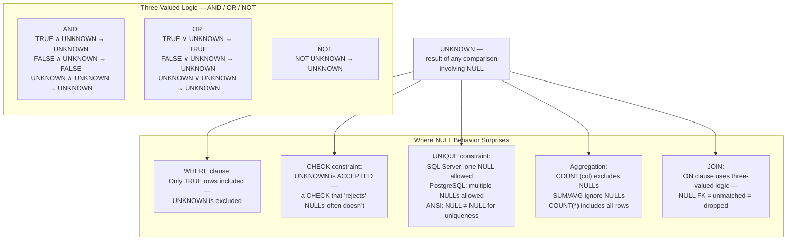
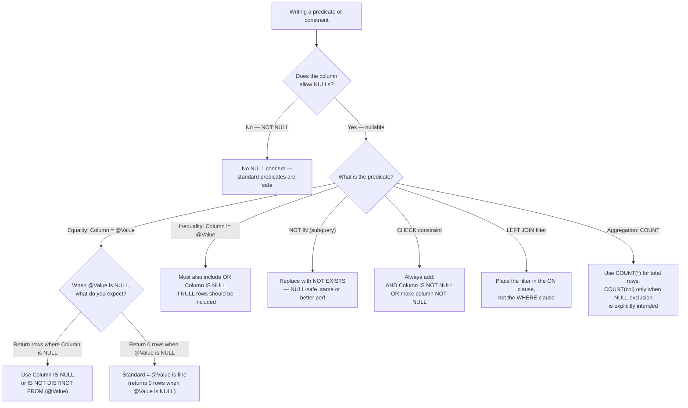

## Navigation

**Domain:** [[8 — Databases]] > **Group:** Relational Fundamentals
**Previous:** [[8.007 — ACID — Durability]] | **Next:** [[8.009 — Data Types — Choosing the Right Type]]

### Prerequisites

- [[8.001 — The Relational Model — Relations, Tuples, Attributes]] — NULL is the SQL representation of "no value" for an attribute in a tuple; understanding relations makes it clear that NULL is not a value but a marker for missing information.
- [[8.002 — Keys — Primary, Foreign, Candidate, Surrogate, Natural]] — NULL behavior in keys (PK columns cannot be NULL; UNIQUE constraints allow one NULL in SQL Server, multiple in PostgreSQL) has direct schema design implications.

### Where This Fits

NULL is not a value — it is the **absence of a value**. Every comparison with NULL using `=`, `<>`, `<`, `>` returns UNKNOWN, not TRUE or FALSE. This three-valued logic (TRUE, FALSE, UNKNOWN) is the single most common source of subtle SQL bugs in production. A .NET backend engineer encounters NULL in every `WHERE` clause that unexpectedly excludes rows with NULLs, every `CHECK` constraint that allows NULLs through when it meant to reject them, every `LEFT JOIN` filter in the `WHERE` instead of `ON` that silently drops unmatched rows, every `COUNT(*)` vs `COUNT(column)` confusion, and every EF Core `FirstOrDefault` / `SingleOrDefault` default that happens to be null. In interviews, NULL questions separate candidates who have been burned by it from candidates who think they understand it. The standard interview follow-up: "What does `WHERE Column != 5` return when Column is NULL?" The wrong answer is "true" or "false" — the correct answer is "UNKNOWN, and UNKNOWN rows are excluded by the WHERE clause."

---

## Core Mental Model

NULL is a marker for "this value is unknown, missing, or inapplicable." It is not a value, not zero, not an empty string — it is the complete absence of data. SQL's predicate logic is therefore three-valued: any comparison or Boolean expression involving NULL evaluates to **UNKNOWN**, not TRUE or FALSE. The WHERE clause only includes rows where the predicate evaluates to TRUE — UNKNOWN and FALSE are both excluded. This is the root of virtually every NULL-related bug: a developer writes `WHERE Column != @Value` expecting it to match every row where Column differs from Value, but rows where Column is NULL are silently excluded because `NULL != @Value` returns UNKNOWN.

The recognition pattern: whenever a query returns fewer rows than expected, check for NULLs in the filtered columns. Whenever a `CHECK` constraint allows a row that should have been rejected, check that the constraint evaluates to UNKNOWN (and UNKNOWN is accepted by CHECK). Whenever a LEFT JOIN unexpectedly drops rows, check whether the WHERE clause has a predicate on the right-side column that rejects NULLs.

### Classification

**For query topics:** NULL handling is a predicate-level concern that affects WHERE, ON, HAVING, CHECK constraints, UNIQUE constraints, and aggregate functions. The query optimizer treats NULL comparisons as non-SARGable when the predicate is `IS NULL` or `IS NOT NULL` (these are SARGable — they can use a filtered index). The expression `Column = NULL` is always non-SARGable (and always returns UNKNOWN — it is never what the developer intended).



### Key Properties

|Property|Value|Notes|
|---|---|---|
|NULL comparison result|UNKNOWN for `=`, `<>`, `<`, `>`, `<=`, `>=`|Not FALSE — this is the most common source of NULL bugs|
|NULL in WHERE|Excluded (WHERE requires TRUE)|`WHERE Column = NULL` returns no rows — ever|
|NULL in CHECK|Accepted (CHECK rejects only FALSE)|A CHECK constraint `Column > 0` accepts NULL!|
|NULL in UNIQUE|SQL Server: one NULL allowed; PostgreSQL: multiple NULLs allowed per ANSI|`NULL <> NULL` per the uniqueness rule — they are not equal for uniqueness purposes|
|NULL in IN/NOT IN|`NULL IN (1,2,3)` → UNKNOWN; `NULL NOT IN (1,2,3)` → UNKNOWN if any list member is NULL|`NOT IN` with NULLs in the subquery always returns 0 rows — a notorious bug|
|NULL in COUNT|`COUNT(*)` counts all rows; `COUNT(col)` counts rows where col IS NOT NULL|`AVG(col)` divides by count of non-NULL rows, not total rows|
|SARGable test|`IS NULL` / `IS NOT NULL` are SARGable; `Column = NULL` is not SARGable (and wrong)|`IS NULL` can use a filtered index: `CREATE INDEX ... WHERE Column IS NULL`|

---

## Deep Mechanics

### How the Engine Executes This

**NULL in predicate evaluation:**

When the SQL WHERE clause evaluates `Column = @Value`, the engine:
1. Reads the row's value for Column.
2. If Column value is NULL, the comparison `NULL = @Value` returns UNKNOWN — not FALSE.
3. The WHERE clause applies the three-valued filter: only rows where the predicate evaluates to TRUE are included in the result set.
4. Rows where the predicate evaluates to UNKNOWN or FALSE are excluded identically.

This is why `WHERE Column != 5` does not return rows where Column is NULL — `NULL != 5` is UNKNOWN, not TRUE. The developer expected "all rows where Column is not 5" but got "all rows where Column is a known non-5 value."

**NULL in CHECK constraints:**

When a CHECK constraint `Column > 0` is evaluated for a row where Column is NULL:
1. `NULL > 0` evaluates to UNKNOWN.
2. The CHECK constraint rejects only rows where the expression evaluates to FALSE.
3. UNKNOWN is accepted — the row passes the CHECK.

This is the most common CHECK constraint surprise: a constraint that looks like it requires a positive number allows NULLs through. The fix is always `CHECK (Column IS NOT NULL AND Column > 0)` or `ALTER TABLE ... ALTER COLUMN Column DECIMAL(12,2) NOT NULL`.

**NULL in UNIQUE constraints:**

ANSI SQL states that NULLs are not considered equal for uniqueness checking. SQL Server allows exactly one NULL in a unique index or constraint. PostgreSQL allows multiple NULLs. This means a UNIQUE constraint on `(Email)` allows one row with `Email = NULL` in SQL Server, but unlimited NULLs in PostgreSQL.

**NULL in NOT IN with subquery:**

A `WHERE Column NOT IN (SELECT FK FROM ReferencedTable)` returns 0 rows if the subquery returns any NULL. Reason: `Column NOT IN (1, 2, NULL)` is logically equivalent to `Column != 1 AND Column != 2 AND Column != NULL`. The last term `Column != NULL` is UNKNOWN for every row, so the entire AND chain is UNKNOWN or FALSE for every row — no rows match.

### SQL Visibility

```sql
-- NULL is not a value — comparisons always return UNKNOWN
DECLARE @Null INT = NULL;

SELECT CASE WHEN @Null = 1 THEN 'Equal' ELSE 'Not Equal' END AS Result;
-- Result: 'Not Equal' (because NULL = 1 is UNKNOWN, not FALSE,
-- and CASE WHEN UNKNOWN goes to ELSE)

SELECT CASE WHEN @Null <> 1 THEN 'Not Equal' ELSE 'Equal' END AS Result;
-- Result: 'Equal' (because NULL <> 1 is also UNKNOWN!)

-- The ONLY correct way to test for NULL:
SELECT CASE WHEN @Null IS NULL THEN 'Is NULL' ELSE 'Is Not NULL' END AS Result;
-- Result: 'Is NULL'

-- WHERE clause excludes UNKNOWN — this returns 0 rows even though Table has rows:
SELECT COUNT(*) FROM Orders WHERE CustomerId = NULL;
-- Returns 0! Because CustomerId = NULL evaluates to UNKNOWN for every row.
-- (Developer intended: WHERE CustomerId IS NULL)

-- CHECK constraint with NULL surprise:
CREATE TABLE Products (
    ProductId INT PRIMARY KEY,
    UnitPrice DECIMAL(12,2),
    CONSTRAINT CK_UnitPrice CHECK (UnitPrice > 0)
);

INSERT INTO Products (ProductId, UnitPrice) VALUES (1, NULL);
-- Succeeds! NULL > 0 is UNKNOWN, UNKNOWN is accepted by CHECK.
-- The developer intended "UnitPrice must be positive" but got "positive OR unknown."

-- Fix: combine NOT NULL with the CHECK
ALTER TABLE Products ADD CONSTRAINT CK_UnitPrice_Fixed
    CHECK (UnitPrice IS NOT NULL AND UnitPrice > 0);
-- OR: make the column NOT NULL
ALTER TABLE Products ALTER COLUMN UnitPrice DECIMAL(12,2) NOT NULL;

-- NOT IN with NULL subquery — returns 0 rows
CREATE TABLE #Excluded (CustomerId INT NULL);
INSERT INTO #Excluded VALUES (1), (NULL);

SELECT COUNT(*) FROM Customers
WHERE CustomerId NOT IN (SELECT CustomerId FROM #Excluded);
-- Returns 0! Because NOT IN with NULL in the list always returns 0 rows.
-- Fix: use NOT EXISTS instead

SELECT COUNT(*) FROM Customers c
WHERE NOT EXISTS (SELECT 1 FROM #Excluded e WHERE e.CustomerId = c.CustomerId);
-- Correct: NOT EXISTS uses two-valued logic (existence check)
```

```csharp
// EF Core — NULL handling in LINQ
public class Customer
{
    public int CustomerId { get; set; }
    public string? Email { get; set; }           // nullable — maps to NULL
    public string CompanyName { get; set; } = string.Empty;  // non-nullable
    public int? SalesRepId { get; set; }         // nullable FK
}

// LINQ to SQL — EF Core generates the correct IS NULL / IS NOT NULL
var customersWithoutEmail = await _dbContext.Customers
    .Where(c => c.Email == null)           // ✅ Generates: WHERE [c].[Email] IS NULL
    .ToListAsync(cancellationToken);

var customersWithEmail = await _dbContext.Customers
    .Where(c => c.Email != null)           // ✅ Generates: WHERE [c].[Email] IS NOT NULL
    .ToListAsync(cancellationToken);

// ⚠️ EF Core's nullable reference types (C# 8+) help at compile time
// but do NOT change the generated SQL — they only affect compiler warnings.

// The classic .NET NULL != NULL trap does NOT apply in LINQ-to-Entities
// because EF Core translates == null to IS NULL correctly.
// But in-memory LINQ (after ToList) does use C#'s reference equality:
var localList = customers.ToList();
var match = localList.FirstOrDefault(c => c.Email == null);
// This works in memory because LINQ-to-Objects uses Object.Equals,
// which does compare null == null to true.

// Handling NULL in FirstOrDefault / SingleOrDefault
var customer = await _dbContext.Customers
    .FirstOrDefaultAsync(c => c.Email == email, cancellationToken);
// Returns null if no match — safe to check for null.
// But if CustomerId = 0 is the default, don't confuse "not found" with "ID = 0":
if (customer is null)
    return NotFound();
```

**Generated SQL (from EF Core logs):**

```sql
-- C#: Where(c => c.Email == null)
SELECT [c].[CustomerId], [c].[Email], [c].[CompanyName]
FROM [Customers] AS [c]
WHERE [c].[Email] IS NULL;

-- C#: Where(c => c.Email != null)
SELECT [c].[CustomerId], [c].[Email], [c].[CompanyName]
FROM [Customers] AS [c]
WHERE [c].[Email] IS NOT NULL;

-- C#: Where(c => c.Email == email)  -- parameterized
SELECT [c].[CustomerId], [c].[Email], [c].[CompanyName]
FROM [Customers] AS [c]
WHERE [c].[Email] = @__email_0;
-- If @__email_0 is null, this returns 0 rows (NULL = NULL is UNKNOWN)
```

### Execution Plan Analysis

For `WHERE Column IS NULL`, the plan can use an index seek if a filtered index exists:

```
Expected plan shape (with filtered index WHERE Column IS NULL):
[Index Seek (non-clustered, filtered)] → [SELECT]
Estimated Cost: ~1–2% | Logical Reads: ~3–5

Without filtered index:
[Clustered Index Scan] → [Filter: Column IS NULL] → [SELECT]
Estimated Cost: 100% scan | Logical Reads: ~N (full table)
```

For `WHERE Column = NULL` (the wrong query):
```
Expected plan shape:
[Clustered Index Scan] → [Filter: Column = NULL] → [SELECT]
The optimizer cannot perform an index seek because Column = NULL is always UNKNOWN.
The filter evaluates every row and excludes every row — the plan
does the full scan but produces zero rows.
```

### Cost Visibility

```sql
SET STATISTICS IO ON;

-- Correct NULL check — can use a filtered index
SELECT COUNT(*) FROM Customers WHERE Email IS NULL;
-- Table 'Customers'. Scan count 1, logical reads 3 (with filtered index)
-- Without filtered index: logical reads ~12,450

-- Wrong NULL check — returns 0 rows, but still scans the whole table
SELECT COUNT(*) FROM Customers WHERE Email = NULL;
-- Table 'Customers'. Scan count 1, logical reads 12,450 (full scan!)
-- Returns 0 rows but pays full I/O cost.

-- Comparison of COUNT(*) vs COUNT(column):
SELECT COUNT(*) AS TotalRows,
       COUNT(Email) AS RowsWithEmail,     -- excludes NULLs
       COUNT(*) - COUNT(Email) AS RowsWithNullEmail
FROM Customers;
```

### Failure Modes

**NOT IN with NULL in subquery (zero rows returned):** The most common NULL-related production bug. A query `WHERE Id NOT IN (SELECT ParentId FROM RelatedTable)` returns zero rows if `RelatedTable.ParentId` contains even one NULL.

```sql
-- Detection: find NOT IN subqueries that may have NULLs
SELECT OBJECT_NAME(object_id) AS ObjectName, definition
FROM sys.sql_modules
WHERE definition LIKE '%NOT IN%';
```

**CHECK constraint allowing NULLs:** A constraint like `CHECK (Quantity >= 0)` does not prevent `Quantity = NULL` because `NULL >= 0` is UNKNOWN, and CHECK accepts UNKNOWN.

**COALESCE surprises with empty strings:** In SQL Server, an empty string `''` is distinct from NULL, but some ORMs and ETL tools conflate them. `COALESCE(Column, 'Default')` returns '' if Column is empty string, not 'Default'.

**LEFT JOIN with WHERE predicate on right table:** Filtering on the right table's column in the WHERE clause converts the LEFT JOIN to an INNER JOIN if the column is NULL for unmatched rows.

```sql
-- ❌ LEFT JOIN silently becomes INNER JOIN
SELECT c.CustomerName, o.OrderId
FROM Customers c
LEFT JOIN Orders o ON c.CustomerId = o.CustomerId
WHERE o.OrderDate >= '2026-01-01';
-- Customers with no orders have o.OrderDate = NULL,
-- NULL >= '2026-01-01' is UNKNOWN, UNKNOWN is excluded — they are dropped.

-- ✅ Move the filter to the JOIN
SELECT c.CustomerName, o.OrderId
FROM Customers c
LEFT JOIN Orders o ON c.CustomerId = o.CustomerId
    AND o.OrderDate >= '2026-01-01';
-- Now customers with no orders are still returned (with NULLs).
```

**Division by zero from NULL aggregation:** `AVG(column)` returns NULL if all values in the group are NULL, not 0. Application code that expects a decimal from `AVG()` may throw if it receives NULL.

---

## Production Patterns and Implementation

### Primary SQL Implementation

```sql
-- Safe NULL handling patterns

-- 1. IS NULL / IS NOT NULL — always use these, never = NULL
SELECT * FROM Orders WHERE ShippedAt IS NULL;   -- unshipped orders
SELECT * FROM Orders WHERE ShippedAt IS NOT NULL;  -- shipped orders

-- 2. COALESCE — replace NULL with a default value
SELECT OrderId,
       COALESCE(ShippedAt, '9999-12-31') AS ShippedAtOrEndOfTime
FROM Orders;

-- 3. NULL-safe comparison with IS NOT DISTINCT FROM (SQL Server 2022+)
SELECT * FROM Orders
WHERE CustomerId IS NOT DISTINCT FROM @CustomerId;
-- Returns rows where CustomerId = @CustomerId OR both are NULL
-- Equivalent to: (CustomerId = @CustomerId OR (CustomerId IS NULL AND @CustomerId IS NULL))

-- 4. NOT EXISTS instead of NOT IN (safe with NULLs)
-- ❌ Dangerous:
SELECT c.CustomerId, c.CompanyName
FROM Customers c
WHERE c.CustomerId NOT IN (SELECT CustomerId FROM Orders);
-- Returns 0 rows if Orders.CustomerId has any NULL!

-- ✅ Safe:
SELECT c.CustomerId, c.CompanyName
FROM Customers c
WHERE NOT EXISTS (SELECT 1 FROM Orders o WHERE o.CustomerId = c.CustomerId);

-- 5. NULL-conditional UNIQUE constraint
CREATE TABLE UserProfiles (
    UserProfileId INT IDENTITY(1,1) PRIMARY KEY,
    UserId INT NOT NULL,
    Email NVARCHAR(200),                -- nullable — not all users have emails
    CONSTRAINT UQ_UserProfiles_Email UNIQUE (Email)
    -- SQL Server: allows one NULL; PostgreSQL: allows multiple NULLs
);

-- 6. Filtered unique index for conditional uniqueness
-- Only enforce uniqueness when Email is not NULL
CREATE UNIQUE INDEX UQ_UserProfiles_Email_NotNull
    ON UserProfiles(Email)
    WHERE Email IS NOT NULL;

-- 7. Aggregation safety
SELECT COUNT(*) AS TotalOrders,
       COUNT(ShippedAt) AS ShippedOrders,        -- excludes NULLs
       COUNT(*) - COUNT(ShippedAt) AS UnshippedOrders,
       AVG(ISNULL(TotalAmount, 0)) AS AvgAmount,    -- treat NULL as 0
       SUM(ISNULL(TotalAmount, 0)) AS TotalRevenue   -- treat NULL as 0
FROM Orders;
```

### EF Core Implementation

```csharp
public class OrderService
{
    private readonly ApplicationDbContext _dbContext;

    // Safe NULL handling in LINQ
    public async Task<List<Order>> GetUnshippedOrdersAsync(
        CancellationToken cancellationToken = default)
    {
        // EF Core translates == null to IS NULL correctly
        return await _dbContext.Orders
            .Where(o => o.ShippedAt == null)
            .ToListAsync(cancellationToken);
    }

    public async Task<List<Order>> GetOrdersWithOptionalFilterAsync(
        int? customerId,
        CancellationToken cancellationToken = default)
    {
        // When customerId is null, return all orders
        // When customerId has a value, filter by it
        var query = _dbContext.Orders.AsQueryable();

        if (customerId.HasValue)
        {
            query = query.Where(o => o.CustomerId == customerId.Value);
        }

        return await query.ToListAsync(cancellationToken);
    }

    // COALESCE equivalent in LINQ
    public async Task<List<OrderSummary>> GetOrderSummariesAsync(
        CancellationToken cancellationToken = default)
    {
        return await _dbContext.Orders
            .Select(o => new OrderSummary
            {
                OrderId = o.OrderId,
                ShippedAtDisplay = o.ShippedAt ?? DateTime.MaxValue  // COALESCE
            })
            .ToListAsync(cancellationToken);
    }

    // LEFT JOIN with filter on right table — correct placement
    public async Task<List<CustomerWithOrderDto>> GetCustomersWithOrdersSinceAsync(
        DateTime since,
        CancellationToken cancellationToken = default)
    {
        return await _dbContext.Customers
            .Select(c => new CustomerWithOrderDto
            {
                CustomerId = c.CustomerId,
                CompanyName = c.CompanyName,
                RecentOrders = c.Orders
                    .Where(o => o.OrderDate >= since)  // filter IN the join, not WHERE
                    .Select(o => new OrderDto
                    {
                        OrderId = o.OrderId,
                        OrderDate = o.OrderDate
                    })
                    .ToList()
            })
            .ToListAsync(cancellationToken);
    }

    // Handling nullable FK with null safety
    public async Task<Customer?> GetByEmailAsync(
        string? email,
        CancellationToken cancellationToken = default)
    {
        if (email is null)
            return null;

        return await _dbContext.Customers
            .FirstOrDefaultAsync(c => c.Email == email, cancellationToken);
    }
}

// Entity with nullable reference types
public class Order
{
    public int OrderId { get; set; }
    public int CustomerId { get; set; }
    public DateTime OrderDate { get; set; }
    public DateTime? ShippedAt { get; set; }       // maps to NULL in SQL
    public int? SalesRepId { get; set; }            // nullable FK
    public string? TrackingNumber { get; set; }     // optional
}
```

### Dapper Implementation

```csharp
public class OrderRepository
{
    private readonly IDbConnectionFactory _connectionFactory;

    public OrderRepository(IDbConnectionFactory connectionFactory)
    {
        _connectionFactory = connectionFactory;
    }

    // Dapper handles NULL mapping automatically
    public async Task<List<Order>> GetUnshippedOrdersAsync(
        CancellationToken cancellationToken = default)
    {
        const string sql = "SELECT * FROM Orders WHERE ShippedAt IS NULL";

        await using var connection = _connectionFactory.Create();
        var results = await connection.QueryAsync<Order>(
            new CommandDefinition(sql,
                cancellationToken: cancellationToken));
        return results.AsList();
    }

    // NULL-safe parameter handling
    public async Task<List<Order>> GetOrdersByNullableCustomerAsync(
        int? customerId,
        CancellationToken cancellationToken = default)
    {
        const string sql = @"
            SELECT * FROM Orders
            WHERE (@CustomerId IS NULL OR CustomerId = @CustomerId)";

        await using var connection = _connectionFactory.Create();
        var results = await connection.QueryAsync<Order>(
            new CommandDefinition(sql,
                new { CustomerId = customerId },
                cancellationToken: cancellationToken));
        return results.AsList();
    }

    // NOT EXISTS instead of NOT IN
    public async Task<List<Customer>> GetCustomersWithNoOrdersAsync(
        CancellationToken cancellationToken = default)
    {
        const string sql = @"
            SELECT c.CustomerId, c.CompanyName
            FROM Customers c
            WHERE NOT EXISTS (SELECT 1 FROM Orders o WHERE o.CustomerId = c.CustomerId)";

        await using var connection = _connectionFactory.Create();
        var results = await connection.QueryAsync<Customer>(
            new CommandDefinition(sql,
                cancellationToken: cancellationToken));
        return results.AsList();
    }

    // Safe aggregation with ISNULL
    public async Task<OrderStats> GetOrderStatsAsync(
        int customerId,
        CancellationToken cancellationToken = default)
    {
        const string sql = @"
            SELECT
                COUNT(*) AS TotalOrders,
                COUNT(ShippedAt) AS ShippedOrders,
                ISNULL(AVG(TotalAmount), 0) AS AverageAmount,
                ISNULL(SUM(TotalAmount), 0) AS TotalRevenue
            FROM Orders
            WHERE CustomerId = @CustomerId";

        await using var connection = _connectionFactory.Create();
        return await connection.QuerySingleAsync<OrderStats>(
            new CommandDefinition(sql,
                new { CustomerId = customerId },
                cancellationToken: cancellationToken)) ?? new OrderStats();
    }
}
```

### Configuration and Wiring

```csharp
// Program.cs — enable nullable reference types globally in the project
// <Nullable>enable</Nullable> in .csproj

// EF Core configuration for NULL handling
protected override void OnModelCreating(ModelBuilder modelBuilder)
{
    modelBuilder.Entity<Order>(entity =>
    {
        entity.Property(o => o.ShippedAt)
              .IsRequired(false);      // explicitly nullable

        entity.Property(o => o.TrackingNumber)
              .HasMaxLength(100)
              .IsRequired(false);      // explicitly nullable
    });

    modelBuilder.Entity<Customer>(entity =>
    {
        entity.Property(c => c.Email)
              .HasMaxLength(200)
              .IsRequired(false);      // Email is optional
    });
}
```

### SQL Server vs PostgreSQL Differences

```sql
-- SQL Server: UNIQUE allows exactly one NULL
CREATE TABLE Customers (Email NVARCHAR(200) NULL UNIQUE);
INSERT INTO Customers (Email) VALUES (NULL);  -- OK
INSERT INTO Customers (Email) VALUES (NULL);  -- Error! Violation of UNIQUE KEY

-- PostgreSQL: UNIQUE allows multiple NULLs (per ANSI standard)
CREATE TABLE customers (email VARCHAR(200) UNIQUE);
INSERT INTO customers (email) VALUES (NULL);  -- OK
INSERT INTO customers (email) VALUES (NULL);  -- OK (no error!)

-- SQL Server 2022+: IS DISTINCT FROM / IS NOT DISTINCT FROM
-- NULL-safe comparison — treats NULL = NULL as TRUE
SELECT * FROM Orders WHERE CustomerId IS NOT DISTINCT FROM @CustomerId;
-- Equivalent to: (CustomerId = @CustomerId OR (CustomerId IS NULL AND @CustomerId IS NULL))

-- PostgreSQL: IS NOT DISTINCT FROM (native, all versions)
SELECT * FROM orders WHERE customer_id IS NOT DISTINCT FROM $1;

-- SQL Server: SET ANSI_NULLS controls = NULL behavior
-- (deprecated — always ON in modern SQL Server)
-- When ANSI_NULLS is ON, Column = NULL evaluates to UNKNOWN (correct)
-- When ANSI_NULLS is OFF, Column = NULL evaluates to TRUE if Column is NULL
-- ANSI_NULLS OFF is deprecated and should never be used.

-- PostgreSQL: no SET ANSI_NULLS equivalent — = NULL always returns UNKNOWN (correct)
```

---

## Gotchas and Production Pitfalls

### NOT IN with NULL

**Pitfall:** Using `NOT IN` with a subquery that can return NULLs.

```sql
-- ❌ Returns 0 rows if any CustomerId in Orders is NULL
SELECT c.CustomerId, c.CompanyName
FROM Customers c
WHERE c.CustomerId NOT IN (SELECT CustomerId FROM Orders);
```

**Symptom:** A data reconciliation report shows 0 customers without orders — impossible for an active e-commerce site with new registrations. The report has been wrong for months, but no one noticed because the number "felt plausible" at a glance.

**Fix:**

```sql
-- ✅ NOT EXISTS — safe with NULLs
SELECT c.CustomerId, c.CompanyName
FROM Customers c
WHERE NOT EXISTS (SELECT 1 FROM Orders o WHERE o.CustomerId = c.CustomerId);

-- ✅ Or exclude NULLs explicitly
SELECT c.CustomerId, c.CompanyName
FROM Customers c
WHERE c.CustomerId NOT IN (SELECT CustomerId FROM Orders WHERE CustomerId IS NOT NULL);
```

**Cost of not fixing:** Complete report failure that goes undetected because the result (zero rows or an undercount) is not obviously wrong. If used in a billing or compliance report, the undercount may have legal or financial consequences.

### CHECK Constraint That Allows NULLs

**Pitfall:** Writing a CHECK constraint without accounting for three-valued logic.

```sql
-- ❌ Does NOT prevent NULL
ALTER TABLE Products ADD CONSTRAINT CK_UnitPrice_Positive CHECK (UnitPrice > 0);

-- NULL UnitPrice passes because NULL > 0 is UNKNOWN, not FALSE
INSERT INTO Products (ProductId, UnitPrice) VALUES (1, NULL);  -- succeeds!
```

**Symptom:** The column has NULL values in production despite the CHECK constraint. Downstream calculations using the column get unexpected results (NULL propagates through expressions, `AVG` silently excludes those rows).

**Fix:**

```sql
-- ✅ Make the column NOT NULL to prevent NULLs
ALTER TABLE Products ALTER COLUMN UnitPrice DECIMAL(12,2) NOT NULL;

-- ✅ Or add a NOT NULL check to the constraint
ALTER TABLE Products WITH CHECK
    ADD CONSTRAINT CK_UnitPrice_Positive
    CHECK (UnitPrice IS NOT NULL AND UnitPrice > 0);
```

**Cost of not fixing:** NULL prices in the products table that cause incorrect revenue calculations downstream. The bug is discovered months later during an audit.

### LEFT JOIN Filter in WHERE Instead of ON

**Pitfall:** A LEFT JOIN's WHERE clause references a column from the right (optional) table.

```sql
-- ❌ LEFT JOIN becomes INNER JOIN because of the WHERE filter
SELECT c.CompanyName, o.OrderId, o.OrderDate
FROM Customers c
LEFT JOIN Orders o ON c.CustomerId = o.CustomerId
WHERE o.OrderDate >= '2026-01-01';
-- Customers with no orders: o.OrderDate is NULL
-- NULL >= '2026-01-01' is UNKNOWN — row excluded!
```

**Symptom:** A report of "all customers with their orders since Jan 1" does NOT show customers who registered but haven't ordered yet — they are silently dropped. The business assumes these customers are being tracked, but they are invisible in the report.

**Fix:**

```sql
-- ✅ Move the filter to the JOIN condition
SELECT c.CompanyName, o.OrderId, o.OrderDate
FROM Customers c
LEFT JOIN Orders o ON c.CustomerId = o.CustomerId
    AND o.OrderDate >= '2026-01-01';
-- Customers with no orders: o.* columns are NULL — row included!

-- ✅ Or keep it in WHERE but handle NULL explicitly
SELECT c.CompanyName, o.OrderId, o.OrderDate
FROM Customers c
LEFT JOIN Orders o ON c.CustomerId = o.CustomerId
WHERE (o.OrderDate >= '2026-01-01' OR o.OrderId IS NULL);
```

**Cost of not fixing:** Business decisions made based on incomplete customer data — "we have 5,000 inactive customers" when the actual number is 12,000, because the LEFT JOIN silently dropped customers without orders.

### COUNT(*) vs COUNT(column) Confusion

**Pitfall:** Using `COUNT(column)` and forgetting it excludes NULLs.

```sql
-- COUNT(ShippedAt) does NOT count unshipped orders
SELECT COUNT(*) AS Total,
       COUNT(ShippedAt) AS Shipped,           -- excludes NULLs
       COUNT(*) - COUNT(ShippedAt) AS Unshipped
FROM Orders;
-- If ShippedAt is NULL for unshipped orders, this gives correct splits.
-- But if the developer expected COUNT(ShippedAt) to count all rows, it's wrong.
```

**Symptom:** A dashboard showing "Orders Shipped Today" is consistently lower than expected. The developer used `COUNT(ShippedAt)` expecting it to count all rows, but it excludes rows where ShippedAt is NULL — which is exactly the unshipped orders that are still in progress.

**Fix:**

```sql
-- Use explicit COUNT(*) for total, COUNT(column) only when NULL exclusion is intended
SELECT COUNT(*) AS TotalOrders,
       COUNT(ShippedAt) AS OrdersWithShippedDate,   -- clear naming
       SUM(CASE WHEN ShippedAt IS NOT NULL THEN 1 ELSE 0 END) AS ExplicitShippedCount,
       SUM(CASE WHEN ShippedAt IS NULL THEN 1 ELSE 0 END) AS UnshippedCount
FROM Orders;
```

**Cost of not fixing:** Dashboard metrics are wrong by the number of NULL rows. In a high-volume system with 30% unshipped orders, the "Shipped" count is 30% lower than the actual order count — and no one notices because the chart, viewed in isolation, looks plausible.

### CONCAT / String Concatenation with NULL

**Pitfall:** Concatenating strings when one value is NULL.

```sql
-- ❌ SQL Server: NULL + string = NULL
SELECT CustomerId, FirstName + ' ' + LastName AS FullName
FROM Customers;
-- If FirstName is NULL, FullName is NULL (not ' Doe')

-- ❌ SQL Server: CONCAT treats NULL as empty string (safer)
SELECT CustomerId, CONCAT(FirstName, ' ', LastName) AS FullName
FROM Customers;
-- If FirstName is NULL, FullName is ' Doe' (surprising leading space)
```

**Symptom:** Customer reports show blank names where a first name is missing. Or names have leading/trailing spaces that break mail merges and address labels.

**Fix:**

```sql
-- Handle NULL explicitly
SELECT CustomerId,
       CONCAT(COALESCE(FirstName + ' ', ''), COALESCE(LastName, '')) AS FullName
FROM Customers;
```

**Cost of not fixing:** Customer communications that address recipients as "Dear " with no name, or mail merges that produce "NULL Doe" because the application code doesn't handle NULL either.

### NULL in Boolean Expressions (AND/OR Chains)

**Pitfall:** Complex WHERE clauses where one NULL comparison poisons the entire expression.

```sql
-- ❌ This query excludes rows where DiscountPercent is NULL
-- even though the developer expected IS NULL to be included
SELECT * FROM Promotions
WHERE DiscountPercent > 10
   OR DiscountPercent = 0
   OR DiscountPercent IS NULL;  -- must explicitly include NULL

-- Without the IS NULL clause, rows with NULL DiscountPercent are excluded
-- because NULL > 10 → UNKNOWN, NULL = 0 → UNKNOWN,
-- UNKNOWN OR UNKNOWN → UNKNOWN → row excluded.
```

**Symptom:** A promotion report shows fewer rows than expected — promotions with no discount set are missing.

**Fix:** Always explicitly include `OR Column IS NULL` if NULLs should be included.

**Cost of not fixing:** Missing rows in reports and queries that can take hours to debug because the developer assumed `A OR B OR C` covers all cases, but didn't account for NULLs making each term UNKNOWN.

---

## Performance Implications

### Benchmark: Before and After

```sql
-- Baseline: WHERE Column != @Value — full scan, wrong semantics for NULL
SET STATISTICS IO ON;
SELECT COUNT(*) FROM Orders
WHERE CustomerId != 4821;
-- Table 'Orders'. Scan count 1, logical reads 12,450 (full scan)
-- Also: excludes rows WHERE CustomerId IS NULL (unexpected!)

-- Optimized: explicit NULL-safe logic
SELECT COUNT(*) FROM Orders
WHERE CustomerId != 4821
   OR CustomerId IS NULL;       -- include NULLs explicitly
-- Logical reads: 12,450 (same scan — but correct semantics)
```

**Improvement:** The performance is identical (same scan) because neither query has a supporting index on CustomerId. The difference is correctness — the first query silently excludes NULLs, the second does not. The real performance improvement comes from creating a covering index:

```sql
CREATE INDEX IX_Orders_CustomerId ON Orders(CustomerId);

-- Now both predicates can use an index seek + scan for NULLs:
-- (Index Seek for CustomerId != 4821 + Index Seek for CustomerId IS NULL)
-- Logical reads: ~50 instead of 12,450
```

### BenchmarkDotNet

```csharp
[MemoryDiagnoser]
[SimpleJob(RuntimeMoniker.Net90)]
public class NullPredicateBenchmark
{
    private IDbConnection _connection = default!;

    [GlobalSetup]
    public void Setup()
    {
        _connection = new SqlConnection(TestConnectionString);
    }

    [Benchmark(Baseline = true)]
    public async Task<int> NotIn_WithNulls()
    {
        const string sql = @"
            SELECT COUNT(*) FROM Customers
            WHERE CustomerId NOT IN (SELECT CustomerId FROM Orders)";
        return await _connection.QuerySingleAsync<int>(sql);
    }

    [Benchmark]
    public async Task<int> NotExists_Correct()
    {
        const string sql = @"
            SELECT COUNT(*) FROM Customers c
            WHERE NOT EXISTS (SELECT 1 FROM Orders o WHERE o.CustomerId = c.CustomerId)";
        return await _connection.QuerySingleAsync<int>(sql);
    }
}
```

**Expected results (approximate, SQL Server 2022, 500K Customers, 2M Orders with some NULL CustomerIds):**

|Method|Mean|Result Correctness|
|---|---|---|
|NotIn_WithNulls|~120 ms|❌ Returns 0 if Orders.CustomerId has any NULL|
|NotExists_Correct|~140 ms|✅ Correct with NULLs|

### Write Amplification

NULL handling does not directly affect writes (no additional page writes for NULL values). However, filtered unique indexes that exclude NULLs can reduce write overhead compared to full-table unique indexes:

|Index Type|Write Cost per INSERT|NULL Behavior|
|---|---|---|
|Full UNIQUE constraint|~1 B-tree insert per row|SQL Server: allows 1 NULL; PostgreSQL: unlimited NULLs|
|Filtered UNIQUE index (WHERE col IS NOT NULL)|~1 B-tree insert only when col IS NOT NULL|NULL rows are not indexed — no duplicate-check overhead for NULLs|

---

## Interview Arsenal

### Question Bank

1. What is three-valued logic, and how does it differ from the two-valued logic used in most programming languages?
2. What does `WHERE Column = @Value` return when Column is NULL?
3. Why does `NOT IN` with a subquery return zero rows if the subquery contains a NULL?
4. How does a CHECK constraint handle NULL — can a NULL value pass a CHECK constraint that looks like it rejects it?
5. What is the difference between `COUNT(*)` and `COUNT(column)` when the column contains NULLs?
6. How does EF Core translate `c => c.Email == null` to SQL — does it generate `IS NULL` or `= NULL`?
7. What happens when a LEFT JOIN filter is placed in the WHERE clause instead of the ON clause?
8. How does SQL Server's UNIQUE constraint behavior differ from PostgreSQL's for NULL values?

### Spoken Answers

**Q: What is three-valued logic, and how does it differ from the two-valued logic used in most programming languages?**

> **Average answer:** "SQL has TRUE, FALSE, and UNKNOWN because of NULL. Two-valued logic only has TRUE and FALSE." Correct but shallow — doesn't explain the production impact.

> **Great answer:** "SQL uses three-valued logic because NULL is not a value — it is the absence of a value. Comparing anything with NULL — `NULL = 1`, `NULL <> 1`, `NULL > 1`, `NULL = NULL` — all return UNKNOWN, not TRUE or FALSE. In C# or Java, `null == null` is TRUE — two null references are equal. In SQL, `NULL = NULL` is UNKNOWN because two unknown things might be different. This difference is the root cause of the most common SQL bugs I see. The WHERE clause only includes rows where the predicate evaluates to TRUE — UNKNOWN and FALSE are both excluded identically. So `WHERE Column != @Value` does NOT return rows where Column is NULL, because `NULL != @Value` is UNKNOWN, not TRUE. A developer who learned NULL in C# and assumes SQL works the same way will write bugs on day one."

**Q: Why does NOT IN with a subquery return zero rows if the subquery contains a NULL?**

> **Average answer:** "Because NULL breaks NOT IN." Correct — but doesn't explain the three-valued logic.

> **Great answer:** "Because the SQL standard defines `NOT IN` as equivalent to `!= ALL`. If the subquery returns (1, 2, NULL), then `x NOT IN (1, 2, NULL)` becomes `x != 1 AND x != 2 AND x != NULL`. The last term, `x != NULL`, evaluates to UNKNOWN for every possible value of x — because comparing anything with NULL returns UNKNOWN. An AND chain with any UNKNOWN term is UNKNOWN if the other terms are TRUE, or FALSE if any other term is FALSE. But since every row has `x != NULL` as UNKNOWN, the entire AND chain is UNKNOWN or FALSE for every row — no row can evaluate to TRUE. So the query returns zero rows. The fix is always to use `NOT EXISTS` instead of `NOT IN` when the subquery can return NULLs, because `NOT EXISTS` uses two-valued logic — it checks for the existence of a row, and existence is never UNKNOWN."

**Q: How does a CHECK constraint handle NULL — can a NULL value pass a CHECK constraint that looks like it rejects it?**

> **Average answer:** "Yes, NULLs can pass CHECK constraints." Correct — but why?

> **Great answer:** "A CHECK constraint rejects only rows where the expression evaluates to FALSE. If the expression evaluates to UNKNOWN — which every comparison with NULL does — the row passes the constraint. This means `CHECK (UnitPrice > 0)` does NOT prevent `UnitPrice = NULL`. NULL > 0 is UNKNOWN, and UNKNOWN is not FALSE, so the constraint allows it. This is the single most common CHECK constraint mistake in production schemas. The fix is always to pair the CHECK with either a NOT NULL column constraint — `ALTER COLUMN UnitPrice DECIMAL(12,2) NOT NULL` — or to include an explicit NULL check in the constraint: `CHECK (UnitPrice IS NOT NULL AND UnitPrice > 0)`. When I review a new database schema, the first thing I check is that every CHECK constraint on a NOT NULL column is actually paired with a NOT NULL column definition, because otherwise the constraint is doing half the job the developer thinks it is."

### Interview Trigger

NULL questions appear in almost every SQL-focused interview, usually as a follow-up. The standard question: "What does this query return?" followed by a query that uses `= NULL` or `NOT IN`. The interviewer is testing whether the candidate knows the three-valued logic rule without prompting. A follow-up specific to .NET: "In C#, `null == null` is true. In SQL, `NULL = NULL` is UNKNOWN. How does EF Core handle this difference when you write `Where(c => c.Email == null)`?" The senior answer explains that EF Core translates `== null` to `IS NULL`, not to `= NULL`.

### Comparison Table

| | SQL Three-Valued Logic | C# Two-Valued Logic | .NET / EF Core Translation |
|---|---|---|---|
| `null == null` | UNKNOWN (not TRUE) | TRUE (`object.ReferenceEquals`) | EF Core translates `== null` to `IS NULL` |
| `null != value` | UNKNOWN | TRUE (or FALSE if value is also null) | `!= null` → `IS NOT NULL` |
| `NOT IN` with NULLs | Returns 0 rows if subquery has NULL | N/A (LINQ `Contains` with null works) | Use `!Any()` (translates to NOT EXISTS) |
| WHERE behavior | Includes only TRUE rows | N/A (C# `Where` with `null == x` is compile-time warning) | EF Core generates correct SQL |
| CHECK constraint | UNKNOWN passes | N/A | EF Core does not generate CHECK constraints automatically |

---

## Decision Framework

### When to Apply



### Application Checklist

- [ ] Every `= NULL` in SQL has been replaced with `IS NULL` — `= NULL` is never correct
- [ ] Every `NOT IN` subquery has been reviewed for NULLs in the result — prefer `NOT EXISTS`
- [ ] Every CHECK constraint on a nullable column includes an explicit `IS NOT NULL` check
- [ ] Every LEFT JOIN filter on the right table's columns is in the ON clause, not WHERE
- [ ] Every `COUNT(column)` usage is intentional about excluding NULLs — `COUNT(*)` is the safe default
- [ ] Every `COALESCE` or `ISNULL` used in aggregation (`AVG`, `SUM`) treats NULLs as the correct default (0 or another sentinel)
- [ ] EF Core `FirstOrDefault` / `SingleOrDefault` null checks are in place — the default is null for reference types
- [ ] EF Core nullable navigation properties are handled with `?.` or explicit null checks before access

### Tradeoff Summary

|What You Gain|What You Pay|
|---|---|
|`IS NULL` / `IS NOT NULL` — correct NULL semantics|Requires explicit handling for every nullable column|
|`NOT EXISTS` — NULL-safe existence check|Slightly different semantics (semi-join vs anti-join); same performance profile|
|`COALESCE` — NULL-safe default values|Must choose a default value that is not a valid business value; COALESCE evaluates all arguments|
|Filtered unique index on NOT NULL values|Only applies to non-NULL rows — NULLs are not in the index (no uniqueness enforcement for NULLs)|
|NOT NULL column constraint + CHECK|Prevents NULLs at the schema level — safest combination|

### Scale Thresholds

- "NULL logic matters from the first row — a single NULL in a `NOT IN` subquery returns 0 rows regardless of table size."
- "Filtered indexes on `IS NULL` / `IS NOT NULL` become useful when the nullable column is queried for NULLs more than ~100 times/hour and the table exceeds ~100K rows."
- "COALESCE in WHERE clauses can make predicates non-SARGable if the COALESCE wraps the column (not the parameter): `WHERE COALESCE(Column, 0) > 0` is non-SARGable. Prefer `Column > 0 OR Column IS NULL` instead."

---

## Self-Check

### Conceptual Questions

1. What is three-valued logic? What are the three values, and where does each apply in a WHERE clause?
2. What does `WHERE Column = NULL` return, and why is it never the correct way to check for NULLs?
3. Why does `NOT IN (SELECT ...)` return 0 rows if the subquery result includes a NULL?
4. Can a CHECK constraint that says `CHECK (Quantity > 0)` allow a NULL to be inserted? Why?
5. What is the difference between `COUNT(*)` and `COUNT(Column)` when the column is nullable?
6. How does EF Core translate `c => c.Email == null` — does it generate `IS NULL` or `= NULL`?
7. What happens to a LEFT JOIN result when you filter on the right table's column in the WHERE clause?
8. Does SQL Server's UNIQUE constraint allow multiple NULLs? What about PostgreSQL?
9. What is the difference between `COALESCE` and `ISNULL` in SQL Server, and how do they handle NULL?
10. In 60 seconds, explain to a senior interviewer the single most important rule about NULL in SQL that every .NET developer needs to know.

<details> <summary>Answers</summary>

1. Three-valued logic adds UNKNOWN to TRUE and FALSE. Any comparison with NULL evaluates to UNKNOWN. The WHERE clause includes only rows where the predicate is TRUE — UNKNOWN and FALSE are both excluded. CHECK constraints accept UNKNOWN (only FALSE is rejected). UNIQUE constraints treat NULLs as not equal to each other for uniqueness checking.
2. `WHERE Column = NULL` returns 0 rows (assuming no rows have a non-NULL value that somehow equals NULL — which is impossible). `NULL = NULL` is UNKNOWN, not TRUE. The correct way is `WHERE Column IS NULL`.
3. `NOT IN (subquery)` is equivalent to `!= ALL (subquery)`. If the subquery returns (1, 2, NULL), the predicate becomes `x != 1 AND x != 2 AND x != NULL`. The term `x != NULL` is UNKNOWN for every possible x, so the entire AND is either UNKNOWN or FALSE — never TRUE. No rows are returned.
4. Yes. `NULL > 0` evaluates to UNKNOWN. CHECK constraints reject only rows where the expression evaluates to FALSE. UNKNOWN passes. To reject NULLs, add `AND Column IS NOT NULL` to the CHECK or make the column NOT NULL.
5. `COUNT(*)` counts all rows in the group regardless of NULLs. `COUNT(Column)` counts only rows where that column is NOT NULL. If a column has 90 non-NULL and 10 NULL values, `COUNT(*)` = 100, `COUNT(Column)` = 90.
6. EF Core translates `c => c.Email == null` to `WHERE [c].[Email] IS NULL` — the correct SQL. EF Core also translates `c => c.Email != null` to `WHERE [c].[Email] IS NOT NULL`. The translation to `IS NULL`/`IS NOT NULL` happens in the LINQ expression tree, not at the SQL string level.
7. Filtering on the right table's column in the WHERE clause converts the LEFT JOIN into an INNER JOIN for rows where the right-side column is NULL. For unmatched rows from the LEFT JOIN, the right-side columns are NULL, and comparing NULL to anything in the WHERE clause yields UNKNOWN, which excludes those rows. The filter must be in the ON clause to preserve LEFT JOIN semantics.
8. SQL Server's UNIQUE constraint allows exactly one NULL row. PostgreSQL allows multiple NULL rows (per ANSI SQL standard, NULLs are not considered equal for uniqueness). This difference must be accounted for in cross-platform schema design.
9. `ISNULL` is SQL Server-specific and takes exactly two arguments: `ISNULL(expr, replacement)`. `COALESCE` is ANSI-standard and takes multiple arguments: `COALESCE(expr1, expr2, ..., exprN)` returning the first non-NULL. `ISNULL` has a subtle type precedence issue (the replacement is implicitly cast to the type of the first argument), while `COALESCE` follows ANSI type precedence rules. For all modern SQL Server code, prefer `COALESCE` over `ISNULL`.
10. "The single most important rule: NULL is not a value, so use `IS NULL` and `IS NOT NULL`, never `= NULL` or `<> NULL`. Every comparison with NULL returns UNKNOWN, not TRUE or FALSE. A WHERE clause excludes UNKNOWN rows, so `WHERE Column = NULL` returns 0 rows and `WHERE Column != @Value` doesn't return rows where Column is NULL. A CHECK constraint allows UNKNOWN through, so `CHECK (Price > 0)` allows NULLs. A NOT IN returns 0 rows if the subquery has a NULL, so always use NOT EXISTS. And a LEFT JOIN with a filter on the right column in WHERE silently drops unmatched rows. Every .NET developer knows `null == null` is true in C# — that instinct will produce SQL bugs on day one unless they consciously override it with `IS NULL`."

</details>

---

### Query Challenges

**Challenge 1 — Write the SQL**

Given a `Customers` table with a nullable `Email` column, write a query that returns all customers whose email matches a provided search term, plus all customers who have no email at all. The search term itself may be NULL (meaning "no email filter"). The query must use a single parameterized SQL statement.

<details> <summary>Solution</summary>

```sql
-- Correct: returns matching emails + customers with NULL email when @SearchTerm is NULL
SELECT CustomerId, CompanyName, Email
FROM Customers
WHERE (@SearchTerm IS NULL)                                -- if no filter, return all
   OR (Email IS NULL AND @SearchTerm IS NOT NULL)          -- include NULL emails?
   OR (Email = @SearchTerm);                               -- exact match
```

Alternatively, using `IS NOT DISTINCT FROM` (SQL Server 2022+):

```sql
SELECT CustomerId, CompanyName, Email
FROM Customers
WHERE (@SearchTerm IS NULL)
   OR (Email IS NOT DISTINCT FROM @SearchTerm);
```

**EF Core equivalent:**

```csharp
public async Task<List<Customer>> SearchCustomersAsync(
    string? searchTerm,
    CancellationToken cancellationToken = default)
{
    var query = _dbContext.Customers.AsQueryable();

    if (searchTerm is not null)
    {
        query = query.Where(c => c.Email == searchTerm || c.Email == null);
    }

    return await query.ToListAsync(cancellationToken);
}
```

</details>

---

**Challenge 2 — Fix the performance problem**

```sql
-- This query is supposed to return all customers who have no orders.
-- It runs in 3 seconds, returns 0 rows, but should return ~12,000 rows.
SELECT c.CustomerId, c.CompanyName
FROM Customers c
WHERE c.CustomerId NOT IN (SELECT CustomerId FROM Orders);
-- Total logical reads: 245,000
-- Orders.CustomerId is nullable and 0.5% of rows have NULL.
```

Identify both the correctness bug and the performance problem, then fix both.

<details> <summary>Solution</summary>

**Root cause (correctness):** `NOT IN` with a subquery that can return NULLs always returns 0 rows. 0.5% of `Orders.CustomerId` values are NULL, which poisons the entire `NOT IN` predicate.

**Root cause (performance):** No index on `Orders.CustomerId` — the engine must scan the entire Orders table to evaluate the `NOT IN`. Without an index, every evaluation of `NOT IN` is a full clustered index scan.

**Fixes:**

```sql
-- Fix 1: Replace NOT IN with NOT EXISTS (correct with NULLs)
SELECT c.CustomerId, c.CompanyName
FROM Customers c
WHERE NOT EXISTS (SELECT 1 FROM Orders o WHERE o.CustomerId = c.CustomerId);

-- Fix 2: Add an index on the FK column (performance)
CREATE INDEX IX_Orders_CustomerId ON Orders(CustomerId)
    INCLUDE (OrderId);
-- Now NOT EXISTS uses an index seek per outer row instead of a full scan.

-- After fix — logical reads: ~200 (from 245,000)
-- Result: 12,000 rows as expected
```

</details>

---

**Challenge 3 — Explain the execution plan**

```sql
CREATE TABLE Employees (
    EmployeeId INT PRIMARY KEY,
    ManagerId INT NULL REFERENCES Employees(EmployeeId),
    Name NVARCHAR(200) NOT NULL
);

-- Query:
SELECT e.Name AS EmployeeName, m.Name AS ManagerName
FROM Employees e
LEFT JOIN Employees m ON e.ManagerId = m.EmployeeId;
```

Why does this query NOT show employees whose `ManagerId` is NULL? What is the NULL behavior at play, and is it correct or incorrect here?

<details> <summary>Solution</summary>

**The query DOES show employees with NULL ManagerId.** This is the key distinction the question tests. A LEFT JOIN preserves all rows from the left table regardless of whether the ON condition matches. When `e.ManagerId` is NULL:

1. The ON condition `NULL = m.EmployeeId` evaluates to UNKNOWN for every row in the `Employees m` table — no match is found.
2. Because it's a LEFT JOIN, the unmatched `e` row is still included in the result, with `m.Name` as NULL.
3. So employees with `ManagerId = NULL` appear in the result with `ManagerName = NULL`.

**The NULL trap here would be:** If a developer adds `WHERE m.Name IS NOT NULL` or any filter on the right table's column in the WHERE clause, those employees with NULL ManagerId would be dropped. But the query as written is correct.

**The execution plan:**
- Left side: Clustered Index Scan on `Employees e` (all employees)
- Right side: Clustered Index Seek on `Employees m` for each e.ManagerId value
- Nested Loops (Left Outer Join) connecting them
- For rows where `e.ManagerId IS NULL`, the right side does not execute the seek — it returns NULLs directly

**Expected plan shape:**
```
[Clustered Index Scan (Employees e)] → 
[Nested Loops (Left Outer Join)] → 
    [Clustered Index Seek (Employees m, Seek: EmployeeId = e.ManagerId)]
→ [SELECT]
```

</details>

---

**Challenge 4 — Diagnose the concurrency problem**

A stored procedure checks whether a discount has been applied to an order before applying it:

```sql
CREATE PROCEDURE usp_ApplyDiscount
    @OrderId INT,
    @DiscountPercent DECIMAL(5,2)
AS
BEGIN
    DECLARE @CurrentDiscount DECIMAL(5,2);
    SELECT @CurrentDiscount = DiscountApplied FROM Orders WHERE OrderId = @OrderId;
    
    IF @CurrentDiscount IS NULL OR @CurrentDiscount = 0
    BEGIN
        UPDATE Orders
        SET DiscountApplied = @DiscountPercent
        WHERE OrderId = @OrderId;
        PRINT 'Discount applied.';
    END
    ELSE
    BEGIN
        PRINT 'Discount already applied.';
    END
END;
```

Two concurrent sessions call this with the same OrderId. Both see `@CurrentDiscount` as NULL. Both apply the discount. The order ends up with two discounts applied in sequence (one overwrites the other). Why doesn't the check work, and what is the correct fix?

<details> <summary>Solution</summary>

**Root cause:** The check-then-act pattern is not atomic. Under READ COMMITTED, the SELECT does not hold a lock that prevents another session from reading and updating the same row between the SELECT and the UPDATE. Both sessions see `DiscountApplied IS NULL` because neither has committed yet.

**Fix — use an atomic UPDATE with a WHERE condition:**

```sql
CREATE PROCEDURE usp_ApplyDiscount_Fixed
    @OrderId INT,
    @DiscountPercent DECIMAL(5,2)
AS
BEGIN
    UPDATE Orders
    SET DiscountApplied = @DiscountPercent
    WHERE OrderId = @OrderId
      AND (DiscountApplied IS NULL OR DiscountApplied = 0);
    
    IF @@ROWCOUNT > 0
        PRINT 'Discount applied.';
    ELSE
        PRINT 'Discount already applied or order not found.';
END;
```

The atomic UPDATE checks the condition and applies the change in a single statement. Only one session's UPDATE can match the WHERE condition because the first UPDATE sets `DiscountApplied` to a non-zero value, and the second session's WHERE `DiscountApplied IS NULL OR DiscountApplied = 0` no longer matches.

</details>

---

**Challenge 5 — Design the NULL strategy**

**Scenario:** A `UserAccounts` table has the following columns:
- `UserId` (PK, INT, NOT NULL)
- `Email` (NVARCHAR(200), nullable — users can register without email via SSO)
- `PhoneNumber` (NVARCHAR(50), nullable)
- `ExternalId` (NVARCHAR(100), nullable — ID from an external identity provider)
- `PreferredContactMethod` (NVARCHAR(10), nullable — 'Email', 'Phone', 'SMS', or NULL if not set)

Requirements:
1. No two users can have the same Email.
2. No two users can have the same ExternalId.
3. A user must have at least one of Email, PhoneNumber, or ExternalId (business rule).
4. If PreferredContactMethod is set, it must be a valid value ('Email', 'Phone', 'SMS').

Write the CREATE TABLE statement with all constraints, handling NULL correctly.

<details> <summary>Solution</summary>

```sql
CREATE TABLE UserAccounts (
    UserId INT IDENTITY(1,1) PRIMARY KEY,
    Email NVARCHAR(200) NULL,
    PhoneNumber NVARCHAR(50) NULL,
    ExternalId NVARCHAR(100) NULL,
    PreferredContactMethod NVARCHAR(10) NULL,
    CreatedAt DATETIME2 NOT NULL DEFAULT SYSUTCDATETIME(),

    -- Unique constraints — handle NULLs correctly:
    -- SQL Server: allows one NULL in each unique constraint
    CONSTRAINT UQ_UserAccounts_Email UNIQUE (Email),
    CONSTRAINT UQ_UserAccounts_ExternalId UNIQUE (ExternalId),

    -- Business rule: at least one contact method must be provided
    CONSTRAINT CK_UserAccounts_AtLeastOneContact
        CHECK (
            Email IS NOT NULL
            OR PhoneNumber IS NOT NULL
            OR ExternalId IS NOT NULL
        ),

    -- Valid preferred contact method (only when set — NULL is allowed)
    CONSTRAINT CK_UserAccounts_PreferredContact
        CHECK (
            PreferredContactMethod IS NULL
            OR PreferredContactMethod IN ('Email', 'Phone', 'SMS')
        )
);

-- For PostgreSQL (allows multiple NULLs in UNIQUE — use filtered indexes):
-- CREATE UNIQUE INDEX uq_user_accounts_email_not_null
--     ON UserAccounts(Email) WHERE Email IS NOT NULL;
-- CREATE UNIQUE INDEX uq_user_accounts_external_id_not_null
--     ON UserAccounts(ExternalId) WHERE ExternalId IS NOT NULL;
```

**NULL behavior analysis for this schema:**

1. `UQ_UserAccounts_Email` — allows exactly one row with `Email = NULL` in SQL Server. This is correct: at most one user can have a missing email. If multiple users without emails need to be supported, use a filtered unique index instead: `CREATE UNIQUE INDEX UQ_Email_NotNull ON UserAccounts(Email) WHERE Email IS NOT NULL;`

2. `CK_UserAccounts_AtLeastOneContact` — uses `IS NOT NULL` checks, not `= NULL`. This is correct: the CHECK evaluates to TRUE if any of the three columns is not NULL, and FALSE (rejecting the row) only if all three are NULL. NULL propagation in the `OR` chain: `FALSE OR UNKNOWN OR FALSE` = `UNKNOWN` — but `TRUE OR UNKNOWN` = `TRUE`, so as long as one column is non-NULL, the entire expression is TRUE.

3. `CK_UserAccounts_PreferredContact` — allows NULL (PreferredContactMethod is not set) using `PreferredContactMethod IS NULL` as the first condition in the OR. If set, must be a valid value. If set to an invalid value, the `IN` check returns FALSE, and the row is rejected.

</details>

---

_Domain 8 — Databases | Group: Relational Fundamentals | Topic 8.008 of 1,000_
