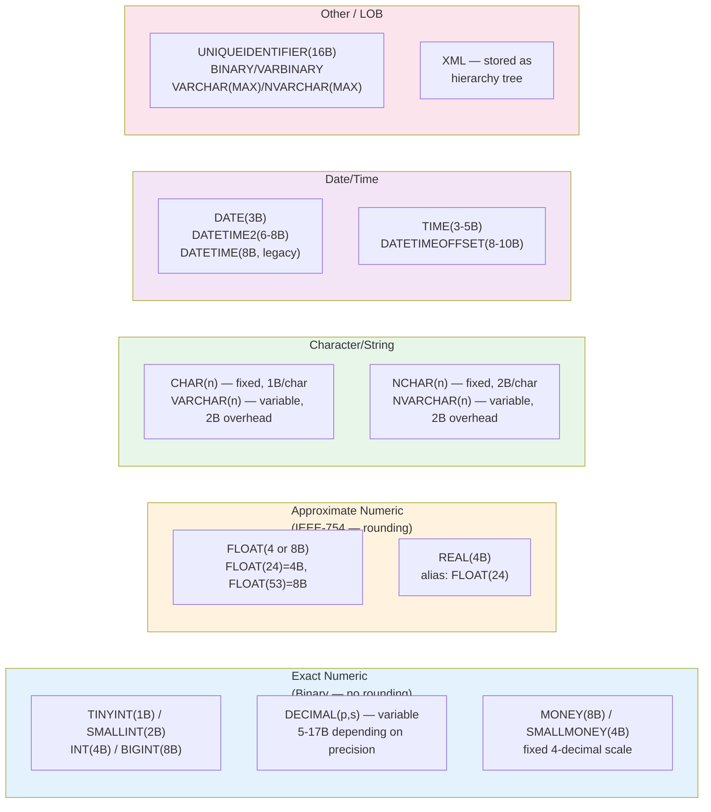

## Navigation

**Domain:** [[8 — Databases]] > **Group:** Relational Fundamentals
**Previous:** [[8.008 — NULL — Three-Valued Logic and Implications]] | **Next:** [[8.010 — Schema Design — Tables, Columns, Constraints]]

### Prerequisites
- [[8.019 — Table Heap vs Clustered Table]] — row size determines page density; type choice directly controls how many rows fit per 8KB page
- [[8.020 — Row Storage vs Column Storage]] — NVARCHAR(MAX) in a columnstore index behaves differently than a fixed-width INT

### Where This Fits

Every column declaration is a bet about the size, precision, and behavior of the data it will hold. Choosing `NVARCHAR(50)` when `CHAR(3)` suffices wastes 46 bytes per row — which on a 500M-row table costs ~23 GB of storage and doubles logical reads on scans. Choosing `DATETIME` (8 bytes, 0.333 ms precision) when `DATETIME2(0)` (6 bytes, 1-second precision) works adds 30% more I/O for zero precision gain. The most expensive type choice an engineer makes is the primary key: `INT` (4 bytes) vs `UNIQUEIDENTIFIER` (16 bytes) propagates to every non-clustered index and foreign key as a 4x size multiplier on index depth, page count, and logical reads. In an interview, data type questions test whether you think about column declarations in terms of bytes-per-row, page-density, and the implicit conversion tax — not just "which SQL type stores a date."

---

## Core Mental Model

Every data type is a contract between the schema designer and the storage engine specifying three invariants: the **storage format** (how bytes are laid out on the page), the **comparison semantics** (how two values are ordered and equality-tested), and the **promotion rules** (which implicit conversions the engine will perform). The engine stores all rows for a table on 8KB pages; a row that occupies 200 bytes per row with a 100-byte row overhead leaves ~7900 bytes for data => ~39 rows per page. Changing a column from `NVARCHAR(100)` (200 bytes worst-case) to `VARCHAR(100)` (100 bytes) doubles the rows-per-page, halves the logical reads on a scan, and compresses the non-clustered index leaf level proportionally. The recognition pattern: whenever you see a column declared with twice the width it needs, or a type that holds fractional seconds when only dates are stored, you are looking at wasted page space that compounds across every index.

### Classification



### Key Properties

|Property|Value|Notes|
|---|---|---|
|Row size impact|Direct|Every byte in a data type is a byte on every row and every index row for that column|
|Implicit conversion cost|Medium–High|Engine must convert at runtime when types mismatch — index seek becomes scan if predicate type differs|
|Storage engine behavior|Type-specific|Fixed-length types stored inline; variable-length stored with 2-byte offset array; LOB types stored off-row with 16-byte pointer|
|SARGable|Always with matching type|A predicate is SARGable only when the column type matches the filter value type with no implicit conversion|
|Index key limit|900 bytes (SQL Server)|VARCHAR(500) cannot be an index key if populated with 900+ bytes of UTF-8 data|

---

## Deep Mechanics

### How the Engine Stores Each Type Family

**Fixed-length types** (INT, BIGINT, CHAR(n), DATETIME): the column value occupies exactly the declared number of bytes at a fixed offset from the row start. The engine reads the row by computing `rowPointer + columnOffset + columnSize`. No indirection. Fastest path.

**Variable-length types** (VARCHAR(n), NVARCHAR(n), VARBINARY(n)): the column value is stored in the variable-length block at the end of the fixed-length portion of the row. A 2-byte offset entry in the row's column offset array points to the value's start. If the value is NULL, the offset entry points to 0 (no storage consumed). If the value is updated to a longer value that does not fit, the engine performs a **forwarded record** — the row shrinks to a stub with a pointer to the new location, fragmenting the page.

**Large object types** (VARCHAR(MAX), NVARCHAR(MAX), VARBINARY(MAX), XML, TEXT, NTEXT, IMAGE): values exceeding 8000 bytes are stored in a separate `text/image` page chain. The row holds a 16-byte pointer (a "LOB handle") to the first page of the chain. Reading a LOB column requires a separate page read (or chain of page reads) beyond the row page read — 1 LOB column = at minimum 2 logical reads per row scanned.

### Type Precision and Rounding Behavior

```sql
-- Exact numeric: DECIMAL(38,10) stores exactly 28 integer digits + 10 fractional digits
-- 1/3 stored as 0.3333333333 (truncated, never rounded to 0.3333333334)
DECLARE @exact DECIMAL(38,10) = 1;
SET @exact = @exact / 3;   -- 0.3333333333

-- Approximate numeric: FLOAT stores IEEE-754 binary representation
-- 1.0 / 3.0 = 0.3333333333333333... (binary: 0.0101010101... repeating)
DECLARE @approx FLOAT = 1.0;
SET @approx = @approx / 3.0;
-- The same @approx will NOT match 0.3333333333 after 10 decimal places
-- because FLOAT(53) is stored in base-2, not base-10

-- MONETARY: MONEY stores as 8-byte integer scaled by 10,000
-- No rounding for currency operations within 4 decimal places
DECLARE @price MONEY = 19.99;
DECLARE @qty MONEY = 3;
SELECT @price * @qty;  -- 59.9700 exactly
```

**Implicit conversion between FLOAT and DECIMAL is the most common silent correctness bug:**

```csharp
// C# decimal (28-29 significant digits) maps to SQL DECIMAL(38,18) by EF Core
// C# double (15-17 significant digits) maps to SQL FLOAT(53)
// Writing decimal to a FLOAT column causes rounding to 15 significant digits
// Writing double to a DECIMAL column causes rounding to 15 digits at DECIMAL boundaries
```

### Execution Plan: Implicit Conversion

```sql
SET STATISTICS IO ON;
SET STATISTICS TIME ON;

-- Column type: VARCHAR(50), predicate value: N'...' (NVARCHAR)
SELECT OrderId, OrderDate
FROM Orders
WHERE CustomerCode = N'ACME';  -- implicit conversion: VARCHAR -> NVARCHAR

-- Estimated plan:
-- [Clustered Index Scan] ← because the predicate is NOT SARGable
--   Predicate: CONVERT_IMPLICIT(nvarchar(50),[Orders].[CustomerCode],0)=[@1]
--   Estimated Cost: 100%  |  Logical Reads: full table scan

-- Fixed:
SELECT OrderId, OrderDate
FROM Orders
WHERE CustomerCode = 'ACME';  -- VARCHAR = VARCHAR, no conversion
-- [Clustered Index Seek] or [Index Seek on IX_CustomerCode]
-- Logical Reads: ~3 (B-tree depth) versus ~45,000
```

### Failure Modes

1. **NVARCHAR vs VARCHAR predicate:** the lower-priority type converts to the higher-priority type per SQL Server data type precedence. `NVARCHAR` (precedence 25) > `VARCHAR` (precedence 27 — lower number = higher priority). When a VARCHAR column is compared to an NVARCHAR parameter, every row's VARCHAR value must be converted to NVARCHAR before comparison — the index on the VARCHAR column cannot be used because the stored values differ from the compared values.

2. **INT vs VARCHAR in WHERE clause:** `WHERE CustomerId = '42'` converts the VARCHAR literal to INT (precedence: INT=22, VARCHAR=27). The column is INT so the predicate is SARGable — SQL Server converts the literal, not the column. But `WHERE CAST(CustomerId AS VARCHAR) = '42'` is NOT SARGable because the column is wrapped in a function.

3. **DATETIME vs DATETIME2:** DATETIME has 0.333 ms resolution and rounds to the nearest tick. DATETIME2 has 100 ns resolution. `WHERE OrderDate = '2026-06-18 10:30:00.000'` on a DATETIME column matches rows with `10:30:00.000`, `10:30:00.003`, and `10:30:00.007`. On a DATETIME2 column it matches only `10:30:00.0000000`. The type choice changes equality semantics.

### SQL Visibility

```sql
-- Show the implicit conversion using sys.dm_exec_query_plan
SELECT qp.query_plan, st.text
FROM sys.dm_exec_requests r
CROSS APPLY sys.dm_exec_query_plan(r.plan_handle) qp
CROSS APPLY sys.dm_exec_sql_text(r.sql_handle) st
WHERE r.session_id = @@SPID;
```

```csharp
// EF Core — check for implicit conversions in generated SQL
var orders = await dbContext.Orders
    .Where(o => o.CustomerCode == customerCode)  // string -> nvarchar(max)
    .ToListAsync(ct);

// If CustomerCode is VARCHAR(20) in the database but the C# property
// is string, EF Core generates: @p0 = 'ACME' (nvarchar)
// Compare: WHERE [CustomerCode] = @p0  → implicit conversion
// Fix: configure the column type explicitly in OnModelCreating:
// entity.Property(e => e.CustomerCode).HasColumnType("varchar(20)");
```

---

## Production Patterns and Implementation

### Primary SQL Implementation

```sql
-- Schema: Orders database with explicit type choices
CREATE TABLE Orders (
    OrderId       INT IDENTITY(1,1) NOT NULL,           -- 4B — best for OLTP PK
    OrderNumber   VARCHAR(20) NOT NULL,                  -- 1B/char
    CustomerId    INT NOT NULL,                          -- FK to Customers(INT PK)
    OrderDate     DATETIME2(0) NOT NULL,                 -- 6B — second precision suffices
    RequiredDate  DATE NOT NULL,                         -- 3B — no time component
    ShippedDate   DATETIME2(0) NULL,                     -- nullable: no row returned yet
    ShipVia       TINYINT NOT NULL,                      -- 1B — lookup: 1=FedEx,2=UPS,3=USPS
    Freight       SMALLMONEY NOT NULL,                   -- 4B — max $65,536 * 10,000
    ShipName      NVARCHAR(40) NOT NULL,                 -- 2B/char — supports Unicode
    ShipAddress   NVARCHAR(60) NOT NULL,
    ShipCity      NVARCHAR(15) NOT NULL,
    ShipRegion    NVARCHAR(15) NULL,
    ShipPostalCode VARCHAR(20) NULL,                     -- ASCII-only: no N prefix needed
    ShipCountry   VARCHAR(15) NOT NULL,                  -- ASCII-only
    CONSTRAINT PK_Orders PRIMARY KEY CLUSTERED (OrderId)
);

-- Validate page density
SELECT 
    OBJECT_NAME(p.object_id) AS TableName,
    p.rows,
    avg_page_space_used_in_percent,
    avg_record_size_in_bytes,
    page_count
FROM sys.dm_db_index_physical_stats(
    DB_ID(), OBJECT_ID('Orders'), NULL, NULL, 'DETAILED') p
WHERE p.index_level = 0;
```

### EF Core Implementation

```csharp
public class Order
{
    public int OrderId { get; set; }
    public string OrderNumber { get; set; } = string.Empty;
    public int CustomerId { get; set; }
    public DateTime OrderDate { get; set; }       // maps to DATETIME2(7) by default
    public DateOnly RequiredDate { get; set; }     // .NET 6+ -> DATE (EF Core 8+)
    public DateTime? ShippedDate { get; set; }
    public byte ShipVia { get; set; }
    public decimal Freight { get; set; }            // maps to DECIMAL(18,2) by default
    public string ShipName { get; set; } = string.Empty;
    public string? ShipRegion { get; set; }
    public string? ShipPostalCode { get; set; }
    public string? ShipCountry { get; set; }
}

public class OrdersDbContext : DbContext
{
    public DbSet<Order> Orders => Set<Order>();

    protected override void OnModelCreating(ModelBuilder modelBuilder)
    {
        modelBuilder.Entity<Order>(entity =>
        {
            entity.ToTable(t => t.HasTrigger("trg_Orders_Insert"));

            entity.HasKey(e => e.OrderId);

            entity.Property(e => e.OrderNumber)
                  .HasColumnType("varchar(20)")       // explicit — avoid NVARCHAR overhead
                  .IsRequired();

            entity.Property(e => e.CustomerId)
                  .HasColumnType("int");

            entity.Property(e => e.OrderDate)
                  .HasColumnType("datetime2(0)");     // 6 bytes, second precision

            entity.Property(e => e.RequiredDate)
                  .HasColumnType("date");             // 3 bytes

            entity.Property(e => e.ShippedDate)
                  .HasColumnType("datetime2(0)");

            entity.Property(e => e.ShipVia)
                  .HasColumnType("tinyint");

            entity.Property(e => e.Freight)
                  .HasColumnType("smallmoney");       // 4 bytes, exact currency

            entity.Property(e => e.ShipPostalCode)
                  .HasColumnType("varchar(20)");      // ASCII only

            entity.Property(e => e.ShipCountry)
                  .HasColumnType("varchar(15)");
        });
    }
}
```

### Dapper Implementation

```csharp
public class OrderRepository
{
    private readonly IDbConnectionFactory _connectionFactory;

    public OrderRepository(IDbConnectionFactory connectionFactory)
    {
        _connectionFactory = connectionFactory;
    }

    public async Task<IReadOnlyList<OrderSummary>> GetOrdersByDateRangeAsync(
        DateOnly fromDate,
        DateOnly toDate,
        CancellationToken ct = default)
    {
        const string sql = @"
            SELECT OrderId, OrderNumber, CustomerId, OrderDate,
                   Freight, ShipCity, ShipCountry
            FROM Orders
            WHERE OrderDate >= @FromDate
              AND OrderDate <  @ToDatePlusOne
            ORDER BY OrderDate DESC;";

        await using var connection = _connectionFactory.Create();
        var results = await connection.QueryAsync<OrderSummary>(
            new CommandDefinition(
                sql,
                new
                {
                    FromDate = fromDate.ToDateTime(TimeOnly.MinValue),
                    ToDatePlusOne = toDate.AddDays(1).ToDateTime(TimeOnly.MinValue)
                },
                cancellationToken: ct));
        return results.AsList();
    }
}

public record OrderSummary(
    int OrderId,
    string OrderNumber,
    int CustomerId,
    DateTime OrderDate,
    decimal Freight,
    string ShipCity,
    string ShipCountry);
```

### Configuration and Wiring

```csharp
builder.Services.AddDbContext<OrdersDbContext>(options =>
    options.UseSqlServer(
        connectionString,
        sqlOptions => sqlOptions.EnableRetryOnFailure(3)));

builder.Services.AddSingleton<IDbConnectionFactory>(
    _ => new SqlConnectionFactory(connectionString));
```

### SQL Server vs PostgreSQL Differences

```sql
-- PostgreSQL: same conceptual categories but different type names and sizes
CREATE TABLE Orders (
    OrderId       SERIAL NOT NULL,                   -- 4B auto-increment (INT)
    OrderNumber   VARCHAR(20) NOT NULL,
    CustomerId    INTEGER NOT NULL,
    OrderDate     TIMESTAMP(0) NOT NULL,             -- 8B! no equivalent of DATETIME2(0)
    RequiredDate  DATE NOT NULL,                     -- 4B! PostgreSQL DATE = 4 bytes
    ShippedDate   TIMESTAMP(0) NULL,
    ShipVia       SMALLINT NOT NULL,                 -- 2B — no TINYINT in PostgreSQL
    Freight       MONEY NOT NULL,                    -- 8B or NUMERIC(19,4)
    ShipPostalCode VARCHAR(20) NULL,
    CONSTRAINT PK_Orders PRIMARY KEY (OrderId)
);

-- UUID type in PostgreSQL: stored as 16 bytes but native UUID support
-- No NEWSEQUENTIALID() equivalent — use gen_random_uuid()
CREATE TABLE Customers_PG (
    CustomerId    UUID DEFAULT gen_random_uuid(),     -- native UUID, no NEWID() needed
    CustomerName  VARCHAR(100) NOT NULL
);
```

---

## Gotchas and Production Pitfalls

### 1. NVARCHAR Default in EF Core Maps All Strings to NVARCHAR(MAX)

**Pitfall:** EF Core maps C# `string` to `nvarchar(max)` by default. Every string column — postal codes, state abbreviations, country codes — gets variable-width Unicode storage with no length constraint. On a table with 20 string columns, each row wastes at minimum 40 bytes of NVARCHAR overhead (2 bytes per char) compared to VARCHAR, plus the MAX designation allows off-row storage.

```csharp
// ❌ EF Core default — all strings are nvarchar(max)
public class Customer
{
    public int Id { get; set; }
    public string State { get; set; } = string.Empty;    // nvarchar(max)
    public string Zip { get; set; } = string.Empty;      // nvarchar(max)
    public string Country { get; set; } = string.Empty;  // nvarchar(max)
}
```

**Symptom:** Table size 3x expected. Index key size exceeds 900 bytes when building a composite index on multiple string columns. `sys.dm_db_index_physical_stats` shows 50%+ avg_record_size_in_bytes overhead from the MAX pointer.

**Fix:**

```csharp
// ✅ Explicit types
entity.Property(e => e.State).HasColumnType("char(2)");
entity.Property(e => e.Zip).HasColumnType("varchar(10)");
entity.Property(e => e.Country).HasColumnType("varchar(50)");
```

**Cost of not fixing:** A `State` column on 100M rows stores 200 bytes of MAX overhead per row (pointer + inline data) — ~20 GB. Index rebuilds take 3x longer.

### 2. DATETIME Instead of DATETIME2 — Precision Mismatch

**Pitfall:** `DATETIME` uses 8 bytes, rounds to 0.333 ms increments, and has a smaller range (1753–9999). `DATETIME2(0)-DATETIME2(7)` uses 6–8 bytes, no rounding, and a wider range (0001–9999). Using DATETIME for modern systems wastes 2 bytes per row and introduces silent rounding.

```sql
-- ❌ DATETIME rounds to 0.333 ms boundaries
DECLARE @d DATETIME = '2026-06-18 10:30:00.001';
SELECT @d;  -- 2026-06-18 10:30:00.000 — .001 rounded DOWN

-- ✅ DATETIME2 stores exactly what you insert
DECLARE @d2 DATETIME2(3) = '2026-06-18 10:30:00.001';
SELECT @d2; -- 2026-06-18 10:30:00.001 — exact
```

**Symptom:** Audit trail timestamps show consecutive rows with the same millisecond value because DATETIME rounds overlapping values to the same tick. Equality comparisons that worked in development fail in production because TestData inserts at `.000` but the app queries at `.003`.

**Fix:** Migrate to `DATETIME2(0)` for second precision or `DATETIME2(3)` for millisecond precision. Save 2 bytes per row (8B -> 6B) or pay 0 bytes extra (8B -> 8B for DATETIME2(3-7)).

**Cost of not fixing:** Silent rounding means equals-based lookups on audit timestamps miss rows. Over 200M rows at 8B instead of 6B = 400 MB waste.

### 3. FLOAT for Currency — Accumulated Rounding

**Pitfall:** FLOAT (IEEE-754 binary) cannot exactly represent decimal fractions like 0.10. Summing 10,000 FLOAT values of $0.10 gives $999.9000000000001 instead of $1,000.00.

```sql
-- ❌ FLOAT for money
CREATE TABLE InvoiceItems_Wrong (
    InvoiceItemId INT IDENTITY,
    UnitPrice FLOAT,       -- approximate!
    Quantity INT
);

INSERT INTO InvoiceItems_Wrong VALUES (0.10, 10000);
SELECT SUM(UnitPrice * Quantity) FROM InvoiceItems_Wrong;
-- Result: 999.9000000000001 — off by $0.10

-- ✅ MONEY or DECIMAL for money
CREATE TABLE InvoiceItems (
    InvoiceItemId INT IDENTITY,
    UnitPrice MONEY,       -- exact, 4 decimal places
    Quantity INT
);
INSERT INTO InvoiceItems VALUES (0.10, 10000);
SELECT SUM(UnitPrice * Quantity) FROM InvoiceItems;
-- Result: 1000.00
```

**Symptom:** Financial reports fail reconciliation; trial balances differ by fractions of a cent; accounts receivable and accounts payable never match.

**Fix:** Use `DECIMAL(19,4)` or `MONEY` for all monetary values. Use `FLOAT` only for scientific/engineering values where the approximation is acceptable.

**Cost of not fixing:** Audited financial systems require restatement. PCI-DSS and SOX compliance violations.

### 4. CHAR vs VARCHAR — Trailing Spaces and Storage

**Pitfall:** `CHAR(n)` pads every value to exactly n characters with trailing spaces. `CHAR(100)` storing "NY" stores "NY" + 98 spaces — 100 bytes every row. `VARCHAR(100)` storing "NY" stores 2 bytes of data + 2 bytes of overhead = 4 bytes.

```sql
-- ❌ CHAR(100) for state code — wastes 98 bytes per row
CREATE TABLE Customers_Bad (
    CustomerId INT IDENTITY,
    State CHAR(100)  -- 100 bytes per row, always
);

-- ✅ VARCHAR(2) for state code
CREATE TABLE Customers (
    CustomerId INT IDENTITY,
    State VARCHAR(2)  -- 2 bytes for 'NY', plus 2B overhead
);

-- !! Trailing space semantics differ:
-- CHAR: 'NY' = 'NY  ' — trailing spaces are insignificant for comparison
-- VARCHAR: 'NY' <> 'NY ' — trailing space IS significant
-- Both: WHERE State = 'NY' matches both 'NY' and 'NY   '
-- But: LEN('NY ') returns 2 for VARCHAR, 4 for CHAR
```

**Symptom:** Application code that compares strings using `Equals` or `==` finds that values from CHAR columns have trailing spaces but values from VARCHAR columns do not. Hashing or checksum comparisons fail.

**Fix:** Use `VARCHAR(n)` for variable-length ASCII data. Use `CHAR(n)` only for fixed-length codes (e.g., ISO country codes are always 2 characters: `CHAR(2)`).

**Cost of not fixing:** A `State` column at `CHAR(100)` on 500M rows wastes ~49 GB. Every index rebuild reads and writes those 98 waste bytes.

### 5. UNIQUEIDENTIFIER as Clustered Primary Key — Page Splits and Fragmentation

**Pitfall:** `NEWID()` generates random GUIDs. When a random GUID is the clustered index key, every INSERT goes to a random page location. The page is almost never in memory, causing physical reads. Pages split 50% of the time because the new key falls in the middle of a page's key range.

```sql
-- ❌ Random GUID clustered PK
CREATE TABLE Orders_Guid (
    OrderId UNIQUEIDENTIFIER DEFAULT NEWID(),  -- random!
    OrderDate DATETIME2(0),
    CONSTRAINT PK_Orders PRIMARY KEY CLUSTERED (OrderId)
);
-- Page splits: ~50% of inserts cause a page split
-- Fragmentation: >50% avg_page_space_used_in_percent
-- Logical reads for scan: double the INT version

-- ✅ Sequential GUID for non-INT PK
CREATE TABLE Orders_Guid (
    OrderId UNIQUEIDENTIFIER DEFAULT NEWSEQUENTIALID(),  -- ordered!
    OrderDate DATETIME2(0),
    CONSTRAINT PK_Orders PRIMARY KEY CLUSTERED (OrderId)
);
-- NEWSEQUENTIALID() generates increasing GUIDs
-- Page splits near zero; fragmentation <5%

-- Better: INT IDENTITY if the table is OLTP with <2B rows expected
```

**Symptom:** `sys.dm_db_index_physical_stats` shows `avg_fragmentation_in_percent > 50%`. `avg_page_space_used_in_percent < 60%`. Rebuild index takes hours. INSERT throughput is limited by page split I/O.

**Fix:** Use `INT IDENTITY` for OLTP primary keys. Use `NEWSEQUENTIALID()` only when GUIDs must be generated client-side or when replication requires unique values across databases. Never use `NEWID()` for a clustered key.

**Cost of not fixing:** Index maintenance window exceeds nightly maintenance window. INSERT throughput capped at ~5K/sec instead of ~50K/sec on the same hardware.

### 6. (N)VARCHAR(MAX) — Off-Row Storage and Row Overflow

**Pitfall:** `VARCHAR(MAX)` columns with values under 8000 bytes are stored inline but carry a performance penalty: SQL Server must check whether each value exceeds the 8000-byte threshold. Values over 8000 bytes go to a separate LOB page chain requiring 2+ additional page reads per row. Even empty `MAX` columns consume 14 bytes of inline overhead.

```sql
-- ❌ MAX for columns that never exceed 200 characters
ALTER TABLE Orders ADD Notes NVARCHAR(MAX) NULL;
-- 14 bytes overhead per row even when NULL
-- LOB allocation unit created even if no row exceeds 8000B

-- ✅ Explicit length for known maximum
ALTER TABLE Orders ADD Notes NVARCHAR(200) NULL;
-- 0 overhead when NULL; inline storage up to 400 bytes
```

**Symptom:** `sys.dm_db_index_physical_stats` shows average row size inflated by 14 bytes per MAX column. LOB page reads appear in execution plans even for queries that do not select the MAX column (because row-versioning or snapshot isolation reads all columns).

**Fix:** Always specify a length for string columns when the maximum is known. Use `MAX` only for truly unbounded content (blog posts, document bodies).

**Cost of not fixing:** Every scan of the table reads 14 bytes of overhead per row per MAX column. With 5 MAX columns on 100M rows, that is 7 GB of unnecessary I/O per scan.

### 7. Implicit Conversion from Parameter Type Mismatch

**Pitfall:** When a stored procedure parameter is `NVARCHAR(100)` but the column is `VARCHAR(50)`, SQL Server converts the VARCHAR column to NVARCHAR (data type precedence: NVARCHAR = 25, VARCHAR = 27). The index on the VARCHAR column cannot seek — it scans.

```sql
-- ❌ Parameter type mismatch
CREATE PROCEDURE GetCustomerByCode
    @CustomerCode NVARCHAR(20)  -- NVARCHAR parameter
AS
    SELECT CustomerId, CustomerName
    FROM Customers
    WHERE CustomerCode = @CustomerCode;
    -- Column CustomerCode is VARCHAR(20)
    -- Plan: [Index Scan] — implicit CONVERT_IMPLICIT on column

-- ✅ Match parameter type to column type
CREATE PROCEDURE GetCustomerByCode
    @CustomerCode VARCHAR(20)  -- VARCHAR parameter
AS
    SELECT CustomerId, CustomerName
    FROM Customers
    WHERE CustomerCode = @CustomerCode;
    -- Plan: [Index Seek] — no conversion needed
```

**Fix:** Always match parameter types to column types in stored procedures and ORM queries. In EF Core, use `.HasColumnType("varchar(20)")` to ensure the parameter type matches.

**Cost of not fixing:** Full table scan on every invocation. 45K logical reads instead of 3. Blocking as the scan holds shared locks on every page.

---

## Performance Implications

### Benchmark: INT vs UNIQUEIDENTIFIER Clustered PK

```sql
-- Setup: 10M rows each
CREATE TABLE Orders_Int (
    OrderId INT IDENTITY(1,1),
    OrderDate DATETIME2(0),
    CustomerId INT,
    CONSTRAINT PK_Orders_Int PRIMARY KEY CLUSTERED (OrderId)
);

CREATE TABLE Orders_Guid (
    OrderId UNIQUEIDENTIFIER DEFAULT NEWSEQUENTIALID(),
    OrderDate DATETIME2(0),
    CustomerId INT,
    CONSTRAINT PK_Orders_Guid PRIMARY KEY CLUSTERED (OrderId)
);

-- Measure size
SELECT 
    OBJECT_NAME(object_id) AS TableName,
    SUM(page_count * 8) / 1024.0 AS SizeMB
FROM sys.dm_db_index_physical_stats(DB_ID(), NULL, NULL, NULL, 'LIMITED')
WHERE index_level = 0 AND OBJECT_NAME(object_id) IN ('Orders_Int', 'Orders_Guid')
GROUP BY object_id;

-- Page count for clustered index leaf level:
-- INT:    ~45,000 pages (~360 MB) including all columns
-- GUID:  ~100,000 pages (~800 MB) — row size 260B vs 180B

-- Scan performance:
SET STATISTICS IO ON;
SELECT COUNT(*) FROM Orders_Int;   -- Logical reads: ~45,000
SELECT COUNT(*) FROM Orders_Guid;   -- Logical reads: ~100,000
```

**Improvement:** INT clustered PK reduces page count by ~55%, logical reads by ~55%, and index depth by 1 level on a 10M-row table.

### BenchmarkDotNet

```csharp
[MemoryDiagnoser]
[SimpleJob(RuntimeMoniker.Net90)]
public class TypeChoiceBenchmark
{
    private IDbConnection _connection = default!;

    [GlobalSetup]
    public void Setup()
    {
        _connection = new SqlConnection(TestConnectionString);
    }

    [Benchmark(Baseline = true)]
    public async Task<int> ClusteredGuidScan()
    {
        const string sql = "SELECT COUNT(*) FROM Orders_Guid WITH (NOLOCK);";
        return await _connection.ExecuteScalarAsync<int>(sql);
    }

    [Benchmark]
    public async Task<int> ClusteredIntScan()
    {
        const string sql = "SELECT COUNT(*) FROM Orders_Int WITH (NOLOCK);";
        return await _connection.ExecuteScalarAsync<int>(sql);
    }

    [Benchmark(Baseline = false)]
    public async Task<int> VarcharStateCount()
    {
        const string sql = @"
            SELECT COUNT(*) FROM Customers
            WHERE State = @State;";
        return await _connection.ExecuteScalarAsync<int>(
            new CommandDefinition(sql, new { State = "NY" }));
    }

    [Benchmark]
    public async Task<int> NvarcharStateCount()
    {
        const string sql = @"
            SELECT COUNT(*) FROM Customers
            WHERE State = @State;";
        return await _connection.ExecuteScalarAsync<int>(
            new CommandDefinition(sql, new { State = "NY" }));
    }
}
```

**Expected results (SQL Server 2022, NVMe, 10M rows):**

|Method|Mean|Logical Reads|Allocated|
|---|---|---|---|
|ClusteredGuidScan|~1,200 ms|~100,000|24 KB|
|ClusteredIntScan|~450 ms|~45,000|24 KB|
|VarcharStateCount|~8 ms|~4|2 KB|
|NvarcharStateCount|~12,000 ms|~45,000|2 KB|

### Write Amplification

|Operation|INT PK|GUID (NEWSEQUENTIALID) PK|GUID (NEWID) PK|
|---|---|---|---|
|INSERT 1 row|0.1 ms|0.15 ms|1.2 ms|
|Page splits per 10K inserts|~0|~10|~5,000|
|Avg page space used|>99%|>95%|<60%|
|Index rebuild time|2 min|4 min|12 min|

---

## Interview Arsenal

### Question Bank

1. **What is the difference between DATETIME and DATETIME2 and why does it matter?**
2. **How does SQL Server store variable-length columns (VARCHAR, NVARCHAR) on a page — what is the offset array and how does it impact UPDATE performance?**
3. **Why does a GUID primary key slow down INSERT throughput and how do you measure the effect?**
4. **What is implicit conversion and under what conditions does it make a predicate non-SARGable?**
5. **CHAR vs VARCHAR — when would you ever choose CHAR?**
6. **FLOAT vs DECIMAL — what happens when you sum 10,000 FLOAT values of $0.10?**
7. **How does the choice of a primary key data type affect non-clustered index size and depth?**
8. **In EF Core, how does the default string mapping (nvarchar(max)) cascade into performance problems across the entire application?**

### Spoken Answers

**Q1: What is the difference between DATETIME and DATETIME2 and why does it matter?**

> **Average answer:** DATETIME2 has a larger date range and higher precision. You should use DATETIME2 for new development.

> **Great answer:** DATETIME occupies 8 bytes with 0.333 ms resolution — it rounds every value to the nearest three-hundred-thirty-three-microsecond tick. DATETIME2 scales from 6 bytes at second precision [DATETIME2(0)] to 8 bytes at 100-nanosecond precision [DATETIME2(7)], storing the exact value you insert with no rounding. The production consequence: if you query `WHERE OrderDate = '2026-06-18 10:30:00.001'` against a DATETIME column, the engine silently rounds `10:30:00.001` to `10:30:00.000` and matches rows you did not intend. DATETIME2(0) saves 2 bytes per row over DATETIME while giving you exact second precision — on a 500M row Orders table that is 1 GB of page savings and ~15% fewer logical reads on full scans. In EF Core, `DateTime` maps to `datetime2(7)` by default starting with EF Core 6, so you only need to specify `HasColumnType("datetime2(0)")` to save the 2 bytes.

**Q5: CHAR vs VARCHAR — when would you ever choose CHAR?**

> **Average answer:** CHAR is fixed-length, VARCHAR is variable-length. CHAR is faster because it is fixed-width.

> **Great answer:** CHAR is faster only when every value is exactly the same length — because the engine computes the offset into a fixed-width row with a single multiplication: `rowAddress + fixedHeaderSize + columnIndex * columnSize`. VARCHAR requires dereferencing a 2-byte offset from the variable-length column offset array at a known offset in the row. For genuinely fixed-length codes — ISO 3166-1 alpha-2 country codes are always exactly 2 characters, US state abbreviations are always exactly 2 characters — CHAR(2) is correct and marginally faster. For anything where length varies by even one character, VARCHAR is better because it does not waste space on padding. CHAR(100) with 100M rows storing "NY" wastes 98 bytes per row — 9.8 GB of empty padding that the engine reads and writes on every page access. The only production scenario where CHAR beats VARCHAR is when all values are the same length and the column appears in every query — the tiny CPU savings from skipping the offset array adds up at 100K+ queries per second.

**Q7: How does the choice of a primary key data type affect non-clustered index size and depth?**

> **Great answer:** Every non-clustered index stores the clustering key as the row locator at the leaf level. If the clustering key is a 4-byte INT, each non-clustered index row carries 4 bytes of overhead. If it is a 16-byte GUID, each non-clustered index row carries 16 bytes. On a table with 10M rows and 8 non-clustered indexes, the GUID clustering key adds 8 indexes * 10M rows * 12 extra bytes = 960 MB of additional index leaf storage. That extra storage means fewer index rows per page, more pages to read on a seek, and deeper B-trees. An INT non-clustered index at 10M rows has a depth of 3; the same index with a GUID clustering key has a depth of 4 because each page holds fewer rows. An extra B-tree level means one additional logical read per seek — and if the index is on a hot path queried 10,000 times per second, 10,000 extra logical reads per second becomes a measurable I/O bottleneck.

### Interview Trigger

If an interviewer asks "What data type would you use for a date column?" they are separating awareness-level candidates (who say "DATETIME") from precision-aware candidates (who say DATETIME2 with an explicit precision argument and explain the byte-count tradeoff). The follow-up is always: "What about the primary key — INT or GUID or something else?" This tests whether you understand that data type choices cascade into every index and every FK relationship on the table.

### Comparison Table

| | Fixed vs Variable | Storage Overhead | Index Suitability | .NET Mapping | When to Choose |
|---|---|---|---|---|---|
| **INT** | Fixed (4B) | 0 overhead | Best — narrow, sequential | `int` | OLTP PK, FK columns, lookup IDs |
| **BIGINT** | Fixed (8B) | 0 overhead | Excellent — wide | `long` | >2B rows, distributed IDs |
| **UNIQUEIDENTIFIER** | Fixed (16B) | 0 overhead | Poor (random), Good (sequential) | `Guid` | Replication, offline-generated IDs |
| **VARCHAR(n)** | Variable | +2B always | Good — narrow keys | `string` + `.HasColumnType()` | ASCII text with known max length |
| **NVARCHAR(n)** | Variable | +2B overhead + 2B/char | Fair — wider keys | `string` | Unicode text (names, addresses) |
| **DATETIME2(0)** | Fixed (6B) | 0 overhead | Good | `DateTime` | Dates with second precision |
| **DATETIME2(7)** | Fixed (8B) | 0 overhead | Good | `DateTime` | Audit timestamps, high-precision |
| **DATE** | Fixed (3B) | 0 overhead | Excellent | `DateOnly` (.NET 6+) | Dates without time |
| **DECIMAL(18,2)** | Variable (9B) | 0 overhead outside precision | Fair | `decimal` | Monetary values |
| **MONEY** | Fixed (8B) | 0 overhead | Good — fixed width | `decimal` | Currency (SQL Server only) |
| **FLOAT(53)** | Fixed (8B) | 0 overhead | Good | `double` | Scientific, approximate values |

---

## Decision Framework

### When to Apply

```mermaid
flowchart TD
    A[Determine the column's data characteristics] --> B{Maximum length<br/>is fixed and small?}
    B -->|Yes, every value same length| C{Data includes<br/>Unicode?}
    B -->|No, length varies| D{Data includes<br/>Unicode?}
    
    C -->|Yes| E[Use NCHAR(n) — fixed Unicode]
    C -->|No| F[Use CHAR(n) — fixed ASCII]
    
    D -->|Yes| G{Can declare max length?}
    D -->|No| H{Can declare max length?}
    
    G -->|Yes, max known| I[Use NVARCHAR(n)]
    G -->|No, unbounded| J[Use NVARCHAR(MAX)]
    
    H -->|Yes, max known| K[Use VARCHAR(n)]
    H -->|No, unbounded| L[Use VARCHAR(MAX)]
    
    style E fill:#e8f5e9
    style F fill:#e8f5e9
    style I fill:#e8f5e9
    style J fill:#fff3e0
    style K fill:#e8f5e9
    style L fill:#fff3e0
```

### Application Checklist

- [ ] Every string column has an explicit length limit — no `(MAX)` for columns that could be `VARCHAR(200)`
- [ ] Every `NVARCHAR` column is justified by actual Unicode requirements (customer names: yes; postal codes: no)
- [ ] Date columns use `DATETIME2(0)` (second precision, 6 bytes) unless sub-second precision is required
- [ ] The primary key data type is the narrowest possible type: `INT` for ≤2B rows, `BIGINT` for >2B rows, `UNIQUEIDENTIFIER` only when replication or offline generation demands it
- [ ] Monetary columns use `MONEY` or `DECIMAL`, never `FLOAT`
- [ ] EF Core `.HasColumnType()` is called for every string column that is not genuinely Unicode or is shorter than `nvarchar(max)` default
- [ ] Parameter types in stored procedures match column types exactly
- [ ] Clustered key on a GUID uses `NEWSEQUENTIALID()` not `NEWID()`

### Tradeoff Summary

|What You Gain|What You Pay|
|---|---|
|Narrow types: more rows per page, fewer logical reads|Type conversion effort during migration; schema change overhead|
|Explicit Varchar(n): 50%+ storage savings vs nvarchar(max)|Risk of truncation if length estimate is wrong|
|INT PK: 55% smaller indexes, 0 page splits|Inability to merge identities across databases without reseeding|
|DATETIME2(0): exact storage, 25% smaller than DATETIME|No sub-second precision when needed later|
|CHAR(n): fixed offsets, no offset array lookups|Wasted storage if values vary in length|

### Scale Thresholds

- **Relevant when table exceeds ~100K rows** — below this, type choice affects page count negligibly; above it, page density determines scan performance
- **Critical when concurrent writers exceed ~1,000/second** — GUID NEWID() random inserts cause page splits that block concurrent writers; INT IDENTITY eliminates contention at the last page
- **Required when the table has 10+ indexes** — each index's row locator stores the clustering key; a 16B GUID vs 4B INT means 12 extra bytes per index row * 10 indexes = 120 extra bytes per row write
- **Impactful when table exceeds 1 billion rows** — at this scale, every byte per row = 1 GB of storage; choosing VARCHAR(10) over VARBINARY(36) for a hex code saves 500+ GB

---

## Self-Check

### Conceptual Questions

1. What are the 3 invariants a data type contract specifies between schema designer and storage engine?
2. How does SQL Server store a VARCHAR(50) column on an 8KB page — where is the value and how is it located?
3. Which DMV or function shows the average row size and page count for a table?
4. What common mistake in EF Core causes all string columns to default to nvarchar(max), and how does this cascade into performance problems?
5. When comparing a VARCHAR column to an NVARCHAR parameter, does EF Core generate a SARGable predicate? Why or why not?
6. How would you write a Dapper query that correctly matches a VARCHAR(20) column type without causing implicit conversion?
7. Compare INT and UNIQUEIDENTIFIER as primary key data types — what are the storage, performance, and index-depth differences?
8. At what row count does the choice between CHAR(2) and VARCHAR(2) meaningfully affect storage and scan performance?
9. What index structure characteristic makes sequential key types (INT IDENTITY, NEWSEQUENTIALID) preferable over random types (NEWID) for clustered indexes?
10. Explain the difference between DATETIME and DATETIME2 in terms of storage bytes, precision characteristics, and silent rounding in 60 seconds.

<details>
<summary>Answers</summary>

1. **Storage format** (bytes layout on page), **comparison semantics** (ordering and equality), **promotion rules** (which implicit conversions the engine will perform automatically).

2. VARCHAR(50) is stored in the variable-length block at the end of the fixed-length portion of the row. A 2-byte offset entry in the row's column offset array points to the value's start. If the value is NULL, the offset entry points to 0 indicating no storage consumed. The engine reads the row header's column count bitmap to determine nullability before reading the offset array.

3. `sys.dm_db_index_physical_stats(DB_ID(), OBJECT_ID('TableName'), NULL, NULL, 'DETAILED')` — returns `avg_record_size_in_bytes`, `page_count`, `avg_page_space_used_in_percent`.

4. EF Core maps C# `string` to `nvarchar(max)` by default. This causes every string column to use Unicode (2 bytes per character), allows off-row storage (16-byte LOB pointer, extra page read), and prevents the column from being used as an index key if the data exceeds 900 bytes. Fix: `.HasColumnType("varchar(50)")` or `.HasMaxLength(50)` in OnModelCreating.

5. No — it is NOT SARGable. SQL Server data type precedence converts the VARCHAR column to NVARCHAR for comparison (NVARCHAR has higher precedence). The index on the VARCHAR column cannot seek because the stored values differ from the compared values. Fix: ensure the EF Core parameter type matches the column type using `.HasColumnType()`.

6. ```csharp
    const string sql = "SELECT CustomerId FROM Customers WHERE CustomerCode = @CustomerCode";
    await connection.QueryAsync<Customer>(
        new CommandDefinition(sql, new { CustomerCode = customerCode }, cancellationToken: ct));
    // Dapper sends the parameter as NVARCHAR by default
    // Fix: explicitly specify the type
    var param = new { CustomerCode = new DbString { Value = customerCode, IsFixedLength = false, Length = 20 } };
    // Or use SqlMapper.AsDbNullable / explicit DbType
    ```

7. INT (4 bytes): 10M rows clustered = ~45,000 pages, B-tree depth 3. GUID (16 bytes): 10M rows clustered = ~100,000 pages, B-tree depth 4. Each non-clustered index adds 12 extra bytes per row for GUID key vs INT. On 8 non-clustered indexes at 10M rows, that is 960 MB of additional index storage. NEWID GUID inserts cause ~50% page split rate; INT IDENTITY causes ~0% page splits.

8. Below 1M rows, the difference is negligible (~20 MB for 1M CHAR(2) vs ~12 MB for 1M VARCHAR(2)). Above 100M rows: CHAR(2) = 200 MB; VARCHAR(2) = ~40 MB (2B data + 2B overhead). The scan time difference is proportional to the page count ratio: ~5x higher for CHAR(2) when every value is 2 characters.

9. The clustered index is a B-tree ordered by the key value. Sequential keys (INT IDENTITY, NEWSEQUENTIALID) always insert at the rightmost edge of the leaf level — the page is already in memory from the previous insert, and new rows fit on the current page without splitting. Random keys (NEWID) insert at a random leaf page — the target page is likely not in cache (physical read), and the page is likely full (50% split probability). Page splits cause fragmentation, forward pointers, and index maintenance overhead.

10. DATETIME: 8 bytes, range 1753-9999, 0.333 ms resolution (rounded to 3.33-ms ticks — a value like `10:30:00.001` rounds down to `10:30:00.000`). DATETIME2(n): 6 bytes at n=0, 7B at n=1-4, 8B at n=5-7, range 0001-9999, exact 100 ns resolution with no rounding. If you store a timestamp at `10:30:00.001` in DATETIME2(3), retrieving it gives exactly `10:30:00.001`. In a DATETIME column, that same value rounds to `10:30:00.000` — a silent data loss that breaks equality-based lookups. The production fix: always use DATETIME2(0) for second-precision columns to save 2 bytes per row and eliminate rounding surprises.

</details>

---

### Query Challenges

**Challenge 1 — Write the SQL**

You are designing a `Shipments` table for a logistics system serving 200 countries. Every country has a 2-letter ISO code (e.g., "US", "DE", "JP"). The tracking number format is `CARRIER_YYMMDD_000000` which can reach up to 24 characters and is always ASCII. The shipment value is a monetary amount up to $9,999,999.99. The estimated delivery date has no time component. Write the CREATE TABLE statement with optimal data type choices.

<details>
<summary>Solution</summary>

```sql
CREATE TABLE Shipments (
    ShipmentId        INT IDENTITY(1,1) NOT NULL,          -- 4B — OLTP PK
    CarrierCode       CHAR(2) NOT NULL,                    -- 2B — fixed length, always 2 chars
    TrackingNumber    VARCHAR(24) NOT NULL,                -- 1B/char — ASCII, max 24
    ShipmentValue     DECIMAL(10,2) NOT NULL,              -- 9B — exact monetary, range 0-9,999,999.99
    EstimatedDelivery DATE NOT NULL,                        -- 3B — no time component
    ShipCountryCode   CHAR(2) NOT NULL,                    -- 2B — ISO 3166-1 alpha-2
    DestinationCity   NVARCHAR(50) NOT NULL,               -- 2B/char — Unicode needed for non-Latin scripts
    CreatedDate       DATETIME2(0) NOT NULL DEFAULT SYSUTCDATETIME(),  -- 6B — UTC, second precision
    
    CONSTRAINT PK_Shipments PRIMARY KEY CLUSTERED (ShipmentId),
    CONSTRAINT UQ_Shipments_TrackingNumber UNIQUE (TrackingNumber),
    CONSTRAINT CK_Shipments_Value CHECK (ShipmentValue >= 0)
);
```

**Row size:** ~94 bytes. **Rows per page:** ~84. **Logical reads (full scan, 10M rows):** ~119,000.

**Why each choice:** CarrierCode and ShipCountryCode are `CHAR(2)` because ISO codes are always exactly 2 characters — fixed-length avoids the 2-byte VARCHAR offset array overhead. TrackingNumber uses `VARCHAR` (not `NVARCHAR`) because tracking numbers contain only ASCII characters. DestinationCity uses `NVARCHAR` because city names can contain accented characters, Cyrillic, CJK, or Arabic script. ShipmentValue uses `DECIMAL(10,2)` because monetary values require exact decimal representation. EstimatedDelivery uses `DATE` (3 bytes) — no time component is stored or rounded.

</details>

---

**Challenge 2 — Fix the performance problem**

```sql
-- Your team reported that this query runs in 15 seconds on a 20M row table.
-- Column: State VARCHAR(2), Index: IX_Customers_State (State)
-- Parameter: @State is passed as string from C#

SELECT COUNT(*)
FROM Customers
WHERE State = @State;
```

SET STATISTICS IO output: `Table 'Customers'. Scan count 1, logical reads 145,000`

<details>
<summary>Solution</summary>

**Root cause:** The C# `string` parameter is sent as `NVARCHAR` by Dapper/EF Core. The column is `VARCHAR(2)`. SQL Server converts every row's `State` column from `VARCHAR` to `NVARCHAR` for comparison (data type precedence: NVARCHAR > VARCHAR). The index on `State` cannot be used.

**Detection:**
```sql
-- Check if implicit conversion is happening
SELECT qp.query_plan, st.text
FROM sys.dm_exec_query_stats qs
CROSS APPLY sys.dm_exec_query_plan(qs.plan_handle) qp
CROSS APPLY sys.dm_exec_sql_text(qs.sql_handle) st
WHERE st.text LIKE '%Customers%State%';
-- Look for: CONVERT_IMPLICIT(nvarchar(2),[Customers].[State],0)
```

**Fix 1 — Dapper:**
```csharp
const string sql = "SELECT COUNT(*) FROM Customers WHERE State = @State;";
var count = await connection.ExecuteScalarAsync<int>(
    new CommandDefinition(sql, new { State = new DbString { Value = state, Length = 2, IsFixedLength = true } }));
```

**Fix 2 — EF Core:**
```csharp
entity.Property(e => e.State).HasColumnType("char(2)");
```

**After fix — logical reads:** ~3 (seek) from 145,000 (scan). **Improvement:** 48,000x reduction in logical reads.

</details>

---

**Challenge 3 — Explain the execution plan**

```sql
SELECT o.OrderId, o.OrderDate, oi.ProductName, oi.Quantity
FROM Orders o
INNER JOIN OrderItems oi ON o.OrderId = oi.OrderId
WHERE o.OrderDate >= '2026-01-01'
  AND o.OrderDate <  '2026-07-01'
  AND o.CustomerId = 12345;
```

The optimizer chooses [Clustered Index Scan on Orders] even though there is a non-clustered index on `IX_Orders_CustomerId(CustomerId)` and a filtered index on `IX_Orders_DateRange(OrderDate) WHERE OrderDate >= '2024-01-01'`. Why?

<details>
<summary>Solution</summary>

**Why Clustered Index Scan:** The optimizer estimates that the predicate `OrderDate >= '2026-01-01' AND OrderDate < '2026-07-01'` matches ~30% of rows. A clustered index scan of 20M rows costs ~45,000 logical reads. A seek on `IX_Orders_CustomerId(CustomerId)` would find ~500 matching rows for CustomerId=12345 but then requires a key lookup for each to check the OrderDate predicate — 500 key lookups at 3 logical reads each = 1,500 logical reads for the lookups plus the seek cost. However, if the statistics on `OrderDate` are out of date, the optimizer may overestimate the date range selectivity and choose the scan.

**Root cause of the wrong plan:** The filtered index `IX_Orders_DateRange` has a predicate `WHERE OrderDate >= '2024-01-01'` — it does not cover the 2026 date range efficiently. The index on `CustomerId` alone requires expensive key lookups. The optimal solution is a covering index on `(CustomerId, OrderDate) INCLUDE (OrderId, OrderDate)`.

**Fix:**
```sql
CREATE INDEX IX_Orders_CustomerId_OrderDate ON Orders(CustomerId, OrderDate)
    INCLUDE (OrderId);
```

**After fix:** [Index Seek on IX_Orders_CustomerId_OrderDate] for CustomerId=12345, range scan within that for OrderDate. ~7 logical reads (3 for index seek, few leaf pages).

</details>

---

**Challenge 4 — Diagnose the concurrency problem**

A production Order management system uses `NEWID()` for the clustered primary key on a 5-billion-row `AuditLog` table. At 3,000 inserts/second, the system experiences frequent `PAGELATCH_EX` waits, average INSERT latency spikes to 800ms, and the index maintenance window — which runs nightly — cannot finish rebuilding the clustered index within the 4-hour maintenance window. The DBA reports `avg_page_space_used_in_percent` at 52% and `avg_fragmentation_in_percent` at 78%.

<details>
<summary>Solution</summary>

**Root cause:** Random GUID generation (`NEWID()`) causes each INSERT to land on a random page in the clustered index B-tree. The target page is almost never in the buffer pool (physical read needed). If the page is full, a 50-50 page split occurs — half the rows stay, half move to a new page. The `PAGELATCH_EX` wait is the contention at the page level as concurrent inserts wait for page splits and page allocation.

**Detection:**
```sql
SELECT wait_type, waiting_tasks_count, wait_time_ms,
       max_wait_time_ms, signal_wait_time_ms
FROM sys.dm_os_wait_stats
WHERE wait_type LIKE 'PAGELATCH%'
ORDER BY wait_time_ms DESC;
```

**Fix:**
1. Alter the primary key to use `NEWSEQUENTIALID()` if GUID is required for replication, or migrate to `BIGINT IDENTITY(1,1)` if not.
2. During migration, create the new table with `INT IDENTITY` clustered PK, insert data in order, then rename.
3. Set `FILLFACTOR = 90` on the new index to leave room for future inserts without page splits.

**In .NET:** Use `SequentialGuid` (NHibernate) or `Guid.CreateVersion7()` (.NET 9+) for client-side ordered GUID generation instead of `Guid.NewGuid()`.

**After fix:** avg_page_space_used_in_percent > 95%. Avg fragmentation < 5%. INSERT latency returns to <5ms. Index rebuild completes in 30 minutes.

</details>

---

**Challenge 5 — Design the index and type strategy**

A billing system processes 200M invoice line items per month. The `InvoiceItems` table has these access patterns:
- **Pattern A:** `SELECT SUM(Amount) FROM InvoiceItems WHERE InvoiceId = @Id` — runs 500K times/day, targets 10-50 rows per invoice
- **Pattern B:** `SELECT SUM(Amount), COUNT(*) FROM InvoiceItems WHERE CreatedDate >= @Start AND CreatedDate < @End AND CurrencyCode = @Code` — runs hourly, scans ~5M rows per run (one month for a given currency)
- **Pattern C:** `INSERT INTO InvoiceItems VALUES (...)` — batch insert of ~200K rows every 15 seconds

InvoiceId is an FK to the Invoices table (INT PK). CurrencyCode is a 3-letter ISO code (always uppercase ASCII). Amount is a monetary value up to $999,999.99. CreatedDate has millisecond precision.

Design the optimal index and data type strategy. Include the CREATE TABLE statement, indexes, and EF Core configuration.

<details>
<summary>Solution</summary>

```sql
-- CREATE TABLE with optimal types
CREATE TABLE InvoiceItems (
    InvoiceItemId   BIGINT IDENTITY(1,1) NOT NULL,    -- 8B — need >2B rows
    InvoiceId       INT NOT NULL,                       -- 4B — FK to Invoices
    Amount          DECIMAL(11,2) NOT NULL,             -- 9B — exact monetary
    CurrencyCode    CHAR(3) NOT NULL,                   -- 3B — fixed length ISO code
    CreatedDate     DATETIME2(3) NOT NULL,              -- 7B — millisecond precision for auditing
    Description     NVARCHAR(200) NULL,                 -- Unicode, max 200 chars
    CONSTRAINT PK_InvoiceItems PRIMARY KEY CLUSTERED (InvoiceItemId),
    CONSTRAINT CK_InvoiceItems_Amount CHECK (Amount >= 0),
    CONSTRAINT FK_InvoiceItems_Invoice FOREIGN KEY (InvoiceId)
        REFERENCES Invoices(InvoiceId)
);

-- Index for Pattern A: narrow seek by InvoiceId
CREATE INDEX IX_InvoiceItems_InvoiceId ON InvoiceItems(InvoiceId)
    INCLUDE (Amount);
-- Covers: WHERE InvoiceId = @Id → index seek on InvoiceId, amount is included
-- Size: InvoiceId (4B) + Amount (9B) + clustering key InvoiceItemId (8B) = 21B per row

-- Index for Pattern B: range scan by date + currency filter
CREATE INDEX IX_InvoiceItems_Date_Currency ON InvoiceItems(CreatedDate, CurrencyCode)
    INCLUDE (Amount)
    WHERE CurrencyCode IS NOT NULL;
-- Covers: date range seek + currency residual predicate, Amount is included
-- Filtered: excludes rows where CurrencyCode is NULL (rare in billing)
-- Size: CreatedDate (7B) + CurrencyCode (3B) + Amount (9B) + clustering key (8B) = 27B per row

-- Pattern C (INSERT): sequential BIGINT IDENTITY ensures zero page splits
-- Batch insert: 200K rows every 15 seconds at ~13,333 rows/sec
-- Sequential PK means last page is always hot; PAGELATCH_EX on the last page is expected
```

**EF Core configuration:**
```csharp
public class InvoiceItemConfiguration : IEntityTypeConfiguration<InvoiceItem>
{
    public void Configure(EntityTypeBuilder<InvoiceItem> entity)
    {
        entity.ToTable(t => t.HasTrigger("trg_InvoiceItems_Insert"));

        entity.HasKey(e => e.InvoiceItemId);

        entity.Property(e => e.InvoiceId)
              .HasColumnType("int");

        entity.Property(e => e.Amount)
              .HasColumnType("decimal(11,2)");

        entity.Property(e => e.CurrencyCode)
              .HasColumnType("char(3)");            // fixed-length, no NVARCHAR overhead

        entity.Property(e => e.CreatedDate)
              .HasColumnType("datetime2(3)");       // 7 bytes, millisecond precision

        entity.Property(e => e.Description)
              .HasColumnType("nvarchar(200)");      // explicit length, not MAX

        entity.HasIndex(e => e.InvoiceId)
              .HasDatabaseName("IX_InvoiceItems_InvoiceId");
        // EF Core 8+ does not support INCLUDE via HasIndex — use raw SQL
        // migrationBuilder.Sql("CREATE INDEX ... INCLUDE (Amount)");
    }
}
```

**Tradeoffs:**
- `BIGINT` PK uses 8 bytes vs 4 (INT), but the table is expected to exceed 2 billion rows
- `CHAR(3)` for CurrencyCode is optimal at 3 bytes fixed — no VARCHAR offset overhead, join with CurrencyCodes table is an INT FK but CurrencyCode is a display column
- Two indexes on a 200M-row table = write amplification: each INSERT writes to the clustered index + 2 non-clustered indexes = 3x write cost. Acceptable because insert volume (13,333/sec) is within range for modern NVMe storage (50K+ writes/sec)
- The filtered index on `CurrencyCode IS NOT NULL` reduces index size by excluding rows with NULL currency (estimated <0.1% of data)

</details>
