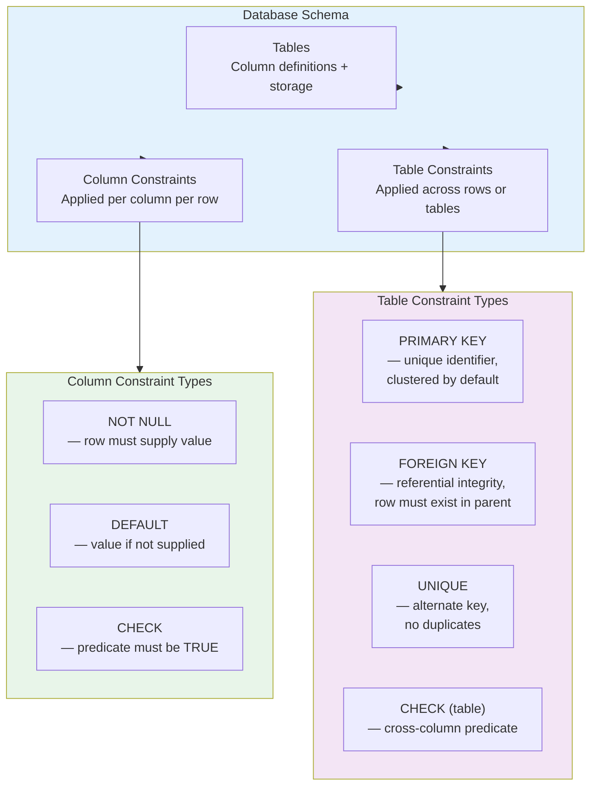
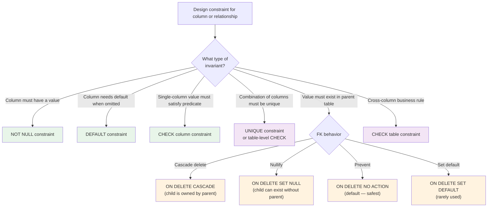

## Navigation

**Domain:** [[8 — Databases]] > **Group:** Relational Fundamentals
**Previous:** [[8.009 — Data Types — Choosing the Right Type]] | **Next:** [[8.011 — CHECK Constraints — Enforcing Business Rules]]

### Prerequisites
- [[8.001 — The Relational Model — Relations, Tuples, Attributes]] — the logical model (relations) is the input; the physical schema (tables) is the output of schema design
- [[8.009 — Data Types — Choosing the Right Type]] — type selection is the atomic unit of schema design; this note composes types into table definitions

### Where This Fits

Schema design is the bridge between a logical data model (entity-relationship diagram, normalized relations) and the physical DDL that the database engine executes. Every `.HasForeignKey()`, every `.HasColumnType()`, every `CONSTRAINT PK_Orders` in a migration is a schema design decision. When schema design is done well, queries against the schema are naturally SARGable, referential integrity is enforced at the engine level without application coordination, and schema migrations are additive (no breaking changes). When it is done poorly, every application deployment requires backfill scripts, orphaned rows accumulate, and indexes cannot serve the queries that the ORM generates. In an interview, schema design questions test whether you think in terms of **constraint-driven design** — defining the invariants the database enforces so the application code does not have to — versus merely describing tables by their column lists.

---

## Core Mental Model

A database schema is the formal declaration of **structural invariants** over a set of table definitions. The schema consists of three layers: **tables** (the set of columns and their types), **column constraints** (NOT NULL, DEFAULT, CHECK, the per-column domain rules), and **table constraints** (PRIMARY KEY, UNIQUE, FOREIGN KEY — rules that span multiple columns or tables). The engine stores schema metadata in the system catalog (`sys.tables`, `sys.columns`, `sys.indexes`, `sys.foreign_keys`, `sys.check_constraints`) and evaluates constraints **row-by-row during DML execution**, not lazily. A constraint violation is an immediate abort — partial inserts or updates are rolled back within the statement. In production, schema design is the first place a .NET backend engineer encounters the impedance mismatch: EF Core's navigation properties and cascading configuration imply constraint behavior to the developer, but the generated migration may create subtly different constraint semantics unless explicitly configured.

### Classification



### Key Properties

|Property|Value|Notes|
|---|---|---|
|Constraint evaluation time|Per-row during DML|Engine checks all constraints after each row modification; violation aborts the statement|
|Metadata storage|System base tables|`sys.sysschobjs`, `sys.syscolpars`, `sys.sysidxstats` — exposed via catalog views|
|DDL locking|Schema Modification (SCH-M) lock|`ALTER TABLE` requires SCH-M lock, blocks all access during execution|
|Order of evaluation|NOT NULL → CHECK → PRIMARY KEY → FOREIGN KEY (per row)|PostgreSQL evaluates NOT NULL at column write, FK at statement end; SQL Server evaluates per-row|
|EF Core abstraction|Fluent API → migrations|`HasConstraintName()`, `IsRequired()`, `HasDefaultValueSql()` generate DDL; the abstraction leaks when constraints have names EF Core does not control|

---

## Deep Mechanics

### How the Engine Stores Schema Metadata

SQL Server stores schema definitions in **system base tables** (the `sys.sys*` family, undocumented, accessible only through catalog views). When you run `CREATE TABLE Orders (...)`:

1. The parser generates a schema modification plan that allocates an object ID from `sys.sysschobjs`
2. Each column is registered in `sys.syscolpars` with its type, length, precision, scale, collation, and nullability
3. Each constraint is registered in `sys.sysschobjs` (shared row with the table) and `sys.sysscalars` (CHECK constraint definition) or `sys.sysidxstats` (PK, UNIQUE, FK)
4. The storage engine allocates the first page of the table's allocation unit (IN_ROW_DATA for rowstore)
5. Statistics objects are auto-created for indexes

The same metadata is exposed through catalog views:

```sql
-- Table metadata
SELECT t.name AS TableName,
       t.object_id,
       t.create_date,
       t.modify_date,
       t.is_replicated,
       t.lock_escalation_desc
FROM sys.tables t
WHERE t.name = 'Orders';

-- Column metadata with type details
SELECT c.name AS ColumnName,
       t.name AS TypeName,
       c.max_length,
       c.precision,
       c.scale,
       c.is_nullable,
       c.is_identity,
       c.column_id
FROM sys.columns c
INNER JOIN sys.types t ON c.user_type_id = t.user_type_id
WHERE c.object_id = OBJECT_ID('Orders')
ORDER BY c.column_id;

-- Constraint metadata
SELECT OBJECT_NAME(parent_object_id) AS TableName,
       name AS ConstraintName,
       type_desc AS ConstraintType,
       is_disabled,
       is_not_trusted
FROM sys.objects
WHERE parent_object_id = OBJECT_ID('Orders')
  AND type IN ('PK', 'UQ', 'F', 'C', 'D')
ORDER BY type;
```

### Constraint Execution Order During INSERT

When the engine inserts a row into a table with constraints:

1. **Column defaults** — for columns with `DEFAULT` constraints that are not specified in the INSERT column list, the engine evaluates the default expression and generates the value
2. **NOT NULL check** — for each NOT NULL column not receiving a value (and without a default), the engine raises a constraint violation and aborts
3. **CHECK constraints** — the engine evaluates each enabled, trusted CHECK constraint predicate against the row; if any returns FALSE, the statement is aborted
4. **PRIMARY KEY / UNIQUE constraints** — the engine probes the unique index to verify no duplicate key exists
5. **FOREIGN KEY constraints** — the engine checks that the inserted FK value exists in the parent table's PK or unique index, or is NULL

```sql
-- Constraint evaluation order demonstrated with a row that fails multiple constraints
CREATE TABLE TestOrder (
    OrderId   INT NOT NULL,
    CustomerId INT NOT NULL,
    Status    VARCHAR(20) NOT NULL DEFAULT 'New',
    Total     DECIMAL(10,2) NOT NULL,
    CONSTRAINT PK_TestOrder PRIMARY KEY (OrderId),
    CONSTRAINT CK_TestOrder_Total CHECK (Total >= 0),
    CONSTRAINT FK_TestOrder_Customer FOREIGN KEY (CustomerId)
        REFERENCES Customers(CustomerId)
);

-- This INSERT fails on CHECK before FK:
INSERT INTO TestOrder (OrderId, CustomerId, Status, Total)
VALUES (1, 99999, 'New', -50.00);
-- Error: CHECK constraint "CK_TestOrder_Total" violated
-- Engine never checks FK because CHECK failure aborts first

-- This INSERT fails on FK:
INSERT INTO TestOrder (OrderId, CustomerId, Status, Total)
VALUES (1, 99999, 'New', 50.00);
-- Error: FOREIGN KEY constraint "FK_TestOrder_Customer" violated
-- CHECK passed, PK check passed (no duplicate), FK fails
```

### Schema Change Impact (ALTER TABLE)

`ALTER TABLE` requires a **Schema Modification (SCH-M) lock**, which blocks all concurrent access to the table:

```sql
-- Any ALTER TABLE statement:
ALTER TABLE Orders ADD ShipRegion NVARCHAR(15) NULL;
-- SQL Server takes SCH-M lock on Orders
-- All SELECT, INSERT, UPDATE, DELETE on Orders are blocked
-- Duration: milliseconds for simple ADD NULL column (metadata only)
-- Duration: minutes for ADD NOT NULL with default (data validation on all rows)

-- For large tables, use ALTER TABLE ... WITH (ONLINE = ON) (Enterprise Edition):
ALTER TABLE Orders ADD ShipRegion NVARCHAR(15) NULL WITH (ONLINE = ON);
```

The duration of SCH-M lock is determined by the metadata operation:
- **Adding a nullable column** with no default: metadata only, ~1ms
- **Adding a NOT NULL column with default**: SQL Server validates every existing row has a value (or backfills). On a 500M-row Orders table, this can take hours, holding SCH-M lock for the duration
- **Dropping a column**: metadata only (SQL Server 2014+), ~1ms
- **Altering column type**: SQL Server validates every existing row fits the new type — full table scan, each row must be checked

### Execution Plan: Schema Validation

Schema validation is not visible in query execution plans — it is part of the DML statement processing before the query optimizer runs. However, constraint violations appear in error logs:

```sql
-- Track constraint violations via system_health session
SELECT event_data.value('(event/data[@name="error"]/value)[1]', 'INT') AS ErrorNumber,
       event_data.value('(event/data[@name="severity"]/value)[1]', 'INT') AS Severity,
       event_data.value('(event/data[@name="message"]/value)[1]', 'NVARCHAR(MAX)') AS Message
FROM (
    SELECT CAST(target_data AS XML) AS target_data
    FROM sys.dm_xe_session_targets st
    INNER JOIN sys.dm_xe_sessions s ON st.event_session_address = s.address
    WHERE s.name = 'system_health' AND st.target_name = 'ring_buffer'
) AS t
CROSS APPLY target_data.nodes('//event[@name="error_reported"]') AS e(event_data)
WHERE event_data.value('(event/data[@name="error"]/value)[1]', 'INT') = 547;
-- 547 = FOREIGN KEY violation
```

### Failure Modes

1. **Untrusted constraints** — a constraint created or enabled with `WITH NOCHECK` is marked as `is_not_trusted = 1`. The optimizer assumes the constraint is NOT enforced for query optimization, potentially producing wrong results for queries that rely on the constraint for join elimination or partition pruning.

2. **Deferred constraint checking** — SQL Server does not support deferrable constraints (unlike PostgreSQL). Every constraint is checked per-row. Multi-row operations that temporarily violate a constraint (e.g., swapping PK values) require workarounds.

3. **Schema drift** — when migrations are applied manually across environments, the actual schema diverges from the migration scripts. `sys.columns` has different column orders, missing constraints, or type mismatches between production and staging.

---

## Production Patterns and Implementation

### Primary SQL Implementation

```sql
-- Schema design for an e-commerce system with explicit constraints
CREATE TABLE Products (
    ProductId       INT IDENTITY(1,1) NOT NULL,
    ProductName     NVARCHAR(100) NOT NULL,
    SupplierId      INT NOT NULL,
    CategoryId      INT NULL,
    QuantityPerUnit VARCHAR(20) NULL,
    UnitPrice       MONEY NOT NULL,
    UnitsInStock    SMALLINT NOT NULL DEFAULT 0,
    UnitsOnOrder    SMALLINT NOT NULL DEFAULT 0,
    ReorderLevel    SMALLINT NOT NULL DEFAULT 0,
    Discontinued    BIT NOT NULL DEFAULT 0,
    CreatedDate     DATETIME2(0) NOT NULL DEFAULT SYSUTCDATETIME(),
    ModifiedDate    DATETIME2(0) NOT NULL DEFAULT SYSUTCDATETIME(),
    RowVersion      ROWVERSION NOT NULL,

    -- Primary key
    CONSTRAINT PK_Products PRIMARY KEY CLUSTERED (ProductId),

    -- Alternate keys
    CONSTRAINT UQ_Products_ProductName_Supplier UNIQUE (ProductName, SupplierId),

    -- Foreign keys
    CONSTRAINT FK_Products_Suppliers FOREIGN KEY (SupplierId)
        REFERENCES Suppliers(SupplierId)
        ON DELETE CASCADE,
    CONSTRAINT FK_Products_Categories FOREIGN KEY (CategoryId)
        REFERENCES Categories(CategoryId),

    -- Business rules
    CONSTRAINT CK_Products_UnitPrice CHECK (UnitPrice >= 0),
    CONSTRAINT CK_Products_Stock CHECK (UnitsInStock >= 0),
    CONSTRAINT CK_Products_Reorder CHECK (ReorderLevel >= 0),
    CONSTRAINT CK_Products_Discontinued_Stock CHECK (
        Discontinued = 0 OR UnitsInStock = 0
        -- Discontinued products must have zero stock
    )
);

-- Document the schema with extended properties
EXEC sys.sp_addextendedproperty
    @name = N'MS_Description',
    @value = N'Current retail price in USD; must be >= 0',
    @level0type = N'SCHEMA', @level0name = N'dbo',
    @level1type = N'TABLE',  @level1name = N'Products',
    @level2type = N'COLUMN', @level2name = N'UnitPrice';

EXEC sys.sp_addextendedproperty
    @name = N'MS_Description',
    @value = N'Discontinued products must have zero stock',
    @level0type = N'SCHEMA', @level0name = N'dbo',
    @level1type = N'TABLE',  @level1name = N'Products',
    @level2type = N'CONSTRAINT', @level2name = N'CK_Products_Discontinued_Stock';
```

### EF Core Implementation

```csharp
public class Product
{
    public int ProductId { get; set; }
    public string ProductName { get; set; } = string.Empty;
    public int SupplierId { get; set; }
    public int? CategoryId { get; set; }
    public string? QuantityPerUnit { get; set; }
    public decimal UnitPrice { get; set; }
    public short UnitsInStock { get; set; }
    public short UnitsOnOrder { get; set; }
    public short ReorderLevel { get; set; }
    public bool Discontinued { get; set; }
    public DateTime CreatedDate { get; set; }
    public DateTime ModifiedDate { get; set; }
    public byte[] RowVersion { get; set; } = [];

    public Supplier Supplier { get; set; } = null!;
    public Category? Category { get; set; }
}

public class ProductConfiguration : IEntityTypeConfiguration<Product>
{
    public void Configure(EntityTypeBuilder<Product> entity)
    {
        entity.ToTable(t => t.HasTrigger("trg_Products_Modify"));

        entity.HasKey(e => e.ProductId)
              .HasName("PK_Products")
              .IsClustered();

        entity.HasIndex(e => new { e.ProductName, e.SupplierId })
              .HasDatabaseName("UQ_Products_ProductName_Supplier")
              .IsUnique();

        entity.HasOne(e => e.Supplier)
              .WithMany(s => s.Products)
              .HasForeignKey(e => e.SupplierId)
              .HasConstraintName("FK_Products_Suppliers")
              .OnDelete(DeleteBehavior.Cascade);

        entity.HasOne(e => e.Category)
              .WithMany(c => c.Products)
              .HasForeignKey(e => e.CategoryId)
              .HasConstraintName("FK_Products_Categories")
              .OnDelete(DeleteBehavior.SetNull);

        entity.Property(e => e.ProductName)
              .HasColumnType("nvarchar(100)")
              .IsRequired();

        entity.Property(e => e.UnitPrice)
              .HasColumnType("money");

        entity.Property(e => e.UnitsInStock)
              .HasColumnType("smallint")
              .HasDefaultValue((short)0);

        entity.Property(e => e.Discontinued)
              .HasColumnType("bit")
              .HasDefaultValue(false);

        entity.Property(e => e.CreatedDate)
              .HasColumnType("datetime2(0)")
              .HasDefaultValueSql("SYSUTCDATETIME()")
              .ValueGeneratedOnAdd();

        entity.Property(e => e.ModifiedDate)
              .HasColumnType("datetime2(0)")
              .HasDefaultValueSql("SYSUTCDATETIME()")
              .ValueGeneratedOnAddOrUpdate();

        entity.Property(e => e.RowVersion)
              .IsRowVersion();

        entity.HasQueryFilter(e => !e.Discontinued);
    }
}
```

### Dapper Implementation

```csharp
public class SchemaInfo
{
    public string TableName { get; set; } = string.Empty;
    public string ColumnName { get; set; } = string.Empty;
    public string TypeName { get; set; } = string.Empty;
    public int MaxLength { get; set; }
    public bool IsNullable { get; set; }
    public bool IsIdentity { get; set; }
    public string? DefaultValue { get; set; }
}

public class SchemaRepository
{
    private readonly IDbConnectionFactory _connectionFactory;

    public SchemaRepository(IDbConnectionFactory connectionFactory)
    {
        _connectionFactory = connectionFactory;
    }

    public async Task<IReadOnlyList<SchemaInfo>> GetTableSchemaAsync(
        string tableName, CancellationToken ct = default)
    {
        const string sql = @"
            SELECT
                t.name AS TableName,
                c.name AS ColumnName,
                tp.name AS TypeName,
                c.max_length AS MaxLength,
                c.is_nullable AS IsNullable,
                c.is_identity AS IsIdentity,
                dc.definition AS DefaultValue
            FROM sys.tables t
            INNER JOIN sys.columns c ON t.object_id = c.object_id
            INNER JOIN sys.types tp ON c.user_type_id = tp.user_type_id
            LEFT JOIN sys.default_constraints dc
                ON dc.parent_object_id = c.object_id
                AND dc.parent_column_id = c.column_id
            WHERE t.name = @TableName
            ORDER BY c.column_id;";

        await using var connection = _connectionFactory.Create();
        var results = await connection.QueryAsync<SchemaInfo>(
            new CommandDefinition(sql, new { TableName = tableName },
                cancellationToken: ct));
        return results.AsList();
    }

    public async Task<IReadOnlyList<string>> DetectSchemaDriftAsync(
        string expectedTable, string actualTable, CancellationToken ct = default)
    {
        const string sql = @"
            SELECT
                'Column missing in actual' AS DriftType,
                c.name AS ColumnName
            FROM sys.columns c
            INNER JOIN sys.tables t ON c.object_id = t.object_id
            WHERE t.name = @ExpectedTable
              AND NOT EXISTS (
                  SELECT 1
                  FROM sys.columns c2
                  INNER JOIN sys.tables t2 ON c2.object_id = t2.object_id
                  WHERE t2.name = @ActualTable
                    AND c2.name = c.name
                    AND c2.user_type_id = c.user_type_id
              )
            UNION ALL
            SELECT 'Column missing in expected' AS DriftType, c.name
            FROM sys.columns c
            INNER JOIN sys.tables t ON c.object_id = t.object_id
            WHERE t.name = @ActualTable
              AND NOT EXISTS (
                  SELECT 1
                  FROM sys.columns c2
                  INNER JOIN sys.tables t2 ON c2.object_id = t2.object_id
                  WHERE t2.name = @ExpectedTable
                    AND c2.name = c.name
                    AND c2.user_type_id = c.user_type_id
              );";

        await using var connection = _connectionFactory.Create();
        var drifts = await connection.QueryAsync<string>(
            new CommandDefinition(sql, new { ExpectedTable = expectedTable, ActualTable = actualTable },
                cancellationToken: ct));
        return drifts.AsList();
    }
}
```

### SQL Server vs PostgreSQL Differences

```sql
-- PostgreSQL: schema metadata in information_schema (ANSI standard)
SELECT table_name, column_name, data_type, character_maximum_length,
       is_nullable, column_default
FROM information_schema.columns
WHERE table_name = 'products'
ORDER BY ordinal_position;

-- PostgreSQL: constraints via information_schema
SELECT tc.constraint_name, tc.constraint_type,
       kcu.column_name, ccu.table_name AS referenced_table,
       ccu.column_name AS referenced_column
FROM information_schema.table_constraints tc
INNER JOIN information_schema.key_column_usage kcu
    ON tc.constraint_name = kcu.constraint_name
LEFT JOIN information_schema.constraint_column_usage ccu
    ON tc.constraint_name = ccu.constraint_name
WHERE tc.table_name = 'products';

-- PostgreSQL: deferrable constraints
ALTER TABLE OrderItems
    ADD CONSTRAINT CK_OrderItems_Quantity CHECK (Quantity > 0)
    DEFERRABLE INITIALLY DEFERRED;
-- This constraint is checked at COMMIT time, not per-row
-- SQL Server has no equivalent — all constraints are immediate
```

```csharp
// PostgreSQL Npgsql provider — schema queries
await using var conn = new NpgsqlConnection(connectionString);
var schema = await conn.GetSchemaAsync("Columns", new[] { null, null, "products", null });
```

---

## Gotchas and Production Pitfalls

### 1. Default Constraint Names Cause Migration Chaos

**Pitfall:** SQL Server auto-generates constraint names like `DF__Products__UnitPr__5AEE82B9` — the suffix is a random hex value. If two developers create the same table in different environments, the auto-generated constraint names differ. Migration scripts that reference the auto-generated name break across environments.

```sql
-- ❌ Auto-generated constraint name
CREATE TABLE Products (
    UnitPrice MONEY NOT NULL DEFAULT 0
);
-- Constraint name: DF__Products__UnitPr__5AEE82B9

-- Migration to drop this default fails when run on staging:
ALTER TABLE Products DROP CONSTRAINT DF__Products__UnitPr__5AEE82B9;
-- Error: constraint name does not exist on staging (different hex suffix)
```

**Symptom:** Migration scripts that work in dev fail in staging/production with "constraint not found" errors. Manual debugging required to find the actual auto-generated name.

**Fix:** Always name every constraint explicitly:

```sql
CREATE TABLE Products (
    UnitPrice MONEY NOT NULL
        CONSTRAINT DF_Products_UnitPrice DEFAULT 0
);
```

**Cost of not fixing:** Deploy pipeline failures for every schema change. Emergency hotfix requires DBA to look up the auto-generated name in sys.objects.

### 2. Adding NOT NULL Column with Default to a Large Table

**Pitfall:** Adding a NOT NULL column with a default value looks simple but SQL Server must backfill every existing row with the default value. On a 500M-row table, this requires a full table scan and can take hours, holding an SCH-M lock that blocks all reads and writes.

```sql
-- ❌ This blocks the table for hours on a large table
ALTER TABLE Orders ADD FulfillmentCenterId INT NOT NULL DEFAULT 1;
```

**Symptom:** Production queries timeout for the duration of the ALTER TABLE. Monitoring shows `wait_type = SCH-M` on all sessions trying to access the table.

**Fix:** Use a multi-step approach:
1. Add as nullable (metadata only, instant)
2. Backfill in batches
3. Make NOT NULL

```sql
-- Step 1: add as nullable (SCH-M held for ~1ms)
ALTER TABLE Orders ADD FulfillmentCenterId INT NULL;

-- Step 2: backfill in batches (no SCH-M, normal DML)
SET NOCOUNT ON;
DECLARE @BatchSize INT = 10000;
WHILE 1 = 1
BEGIN
    UPDATE TOP (@BatchSize) Orders
    SET FulfillmentCenterId = 1
    WHERE FulfillmentCenterId IS NULL;

    IF @@ROWCOUNT < @BatchSize BREAK;
    WAITFOR DELAY '00:00:01';
END

-- Step 3: make NOT NULL (SCH-M needed but only metadata change
-- since no NULLs remain — instant after step 2 completes)
ALTER TABLE Orders ALTER COLUMN FulfillmentCenterId INT NOT NULL;
```

**Cost of not fixing:** Multi-hour production outage for a schema change. SLA violation for the deployment window.

### 3. Column Order Affects Row Size and Page Density

**Pitfall:** SQL Server stores fixed-length columns at the beginning of the row and variable-length columns at the end. But column order within the fixed-length block matters for row alignment. Placing a NULLABLE fixed-length column between two NOT NULL fixed-length columns wastes bytes due to alignment padding.

```sql
-- ❌ Suboptimal column order wastes bytes
CREATE TABLE Customers (
    CustomerId   INT NOT NULL,         -- 4 bytes offset 0
    IsActive     BIT NOT NULL,         -- 1 byte offset 4
    RegionId     INT NULL,             -- 4 bytes offset 8 (wasted 3 bytes padding)
    CustomerName NVARCHAR(50) NOT NULL, -- variable-length block
    Email        NVARCHAR(100) NULL     -- variable-length block
);
-- RegionId at offset 8 requires padding from offset 5 to 8 because
-- INT requires 4-byte alignment. 3 bytes wasted per row.
```

**Symptom:** Row size is 3-8 bytes larger than expected for no functional reason. On 100M rows, 3 bytes = 300 MB of wasted page space.

**Fix:** Group NOT NULL fixed-length columns together, then NULLABLE fixed-length columns, then variable-length:

```sql
-- ✅ Optimal column order — NOT NULL fixed first
CREATE TABLE Customers (
    CustomerId   INT NOT NULL,          -- 4 bytes offset 0
    RegionId     INT NULL,              -- 4 bytes offset 4 (adjacent NULLs pack tightly)
    IsActive     BIT NOT NULL,          -- 1 byte offset 8
    CustomerName NVARCHAR(50) NOT NULL,
    Email        NVARCHAR(100) NULL
);
-- RegionId no longer requires alignment padding because
-- the engine stores all fixed-length columns contiguously
-- and NULLABLE fixed-length columns consume full width regardless
-- Order the columns so that fixed-length NOT NULLs are first,
-- then fixed-length NULLABLEs, then variable-length
```

**Cost of not fixing:** At scale, 300 MB of wasted page space per table. Table scans read 10% more pages than necessary.

### 4. ON DELETE NO ACTION vs ON DELETE CASCADE — The Referential Integrity Trap

**Pitfall:** `ON DELETE NO ACTION` (the SQL Server default) prevents deleting a parent row if any child rows reference it. When the application layers do not account for this, developers add application-level deletion logic that runs outside the transaction, creating race conditions.

```sql
-- ❌ Application deletes child rows, then parent — race condition
DELETE FROM OrderItems WHERE OrderId = 12345;  -- succeeds
DELETE FROM Orders WHERE OrderId = 12345;       -- succeeds (no FK conflict)

-- But between the two statements, a concurrent INSERT adds OrderItems:
INSERT INTO OrderItems (OrderId, ProductId, Quantity)
VALUES (12345, 42, 1);  -- succeeds (Order still exists)

-- Now the parent DELETE completes, but OrderItem 12345/42 is orphaned
-- DELETE FROM OrderItems has already completed and released its locks
```

**Symptom:** Orphaned rows appear in OrderItems with no parent Order. Referential integrity is violated despite the FK constraint.

**Fix:** Enclose in an explicit transaction with proper isolation:

```sql
BEGIN TRANSACTION;
    DELETE FROM OrderItems WHERE OrderId = 12345;
    DELETE FROM Orders WHERE OrderId = 12345;
COMMIT TRANSACTION;

-- Or use ON DELETE CASCADE:
ALTER TABLE OrderItems ADD CONSTRAINT FK_OrderItems_Orders
    FOREIGN KEY (OrderId) REFERENCES Orders(OrderId)
    ON DELETE CASCADE;
-- One statement does both: DELETE FROM Orders WHERE OrderId = 12345
```

**Cost of not fixing:** Orphaned data accumulates. Reports that JOIN on OrderId silently skip orphaned rows. Data quality degrades to the point where a full reconciliation is needed.

### 5. Schema Drift Between Environments

**Pitfall:** Production schema drifts from the migration scripts due to manual hotfixes, emergency DDL changes, or skipped migrations. When the next deployment runs, it either fails (trying to add a column that already exists) or succeeds with unexpected state.

```sql
-- ❌ Emergency hotfix in production:
ALTER TABLE Orders ADD FulfillmentCenterId INT NOT NULL DEFAULT 1;
-- This was applied directly to prod without updating the migration script

-- Next deployment migration tries to add the same column:
ALTER TABLE Orders ADD FulfillmentCenterId INT NOT NULL DEFAULT 1;
-- Error: column already exists
-- Deployment stops, rollback required
```

**Fix:** Use a schema comparison tool or query to detect drift before deployment:

```sql
-- Detect drift before deployment
DECLARE @ExpectedColumns TABLE (ColumnName NVARCHAR(128), TypeName NVARCHAR(128));
INSERT INTO @ExpectedColumns VALUES
    ('OrderId', 'int'), ('OrderDate', 'datetime2'), ('CustomerId', 'int'),
    ('FulfillmentCenterId', 'int');

SELECT ec.ColumnName, ec.TypeName AS ExpectedType,
       c.name AS ActualColumn, t.name AS ActualType,
       CASE WHEN c.name IS NULL THEN 'MISSING FROM PROD'
            WHEN t.name != ec.TypeName THEN 'TYPE MISMATCH'
            ELSE 'MATCH' END AS Status
FROM @ExpectedColumns ec
LEFT JOIN sys.columns c ON c.object_id = OBJECT_ID('Orders')
    AND c.name = ec.ColumnName
LEFT JOIN sys.types t ON c.user_type_id = t.user_type_id;
```

**Cost of not fixing:** Deploy pipeline failures at 2 AM. Rollback takes 30+ minutes while production is partially migrated.

---

## Performance Implications

### Benchmark: Schema Validation Cost

```sql
-- Setup: 10M rows with CHECK constraint
CREATE TABLE Orders_WithCheck (
    OrderId   INT IDENTITY,
    Total     DECIMAL(10,2) NOT NULL,
    Status    VARCHAR(20) NOT NULL DEFAULT 'New',
    CONSTRAINT CK_Total CHECK (Total >= 0),
    CONSTRAINT CK_Status CHECK (Status IN ('New', 'Processing', 'Shipped', 'Delivered'))
);

CREATE TABLE Orders_NoCheck (
    OrderId   INT IDENTITY,
    Total     DECIMAL(10,2) NOT NULL,
    Status    VARCHAR(20) NOT NULL DEFAULT 'New'
);

-- INSERT with check: +~2% overhead versus no check
SET STATISTICS IO ON;
SET STATISTICS TIME ON;

INSERT INTO Orders_WithCheck (Total, Status)
VALUES (99.99, 'New');
-- CPU time: ~0.03ms, elapsed: ~0.02ms

INSERT INTO Orders_NoCheck (Total, Status)
VALUES (99.99, 'New');
-- CPU time: ~0.03ms, elapsed: ~0.02ms

-- CHECK overhead is negligible per row (~0.001ms)
-- But at 100K rows/second, 1M rows/day, the overhead accumulates
```

**Constraint evaluation cost (10M rows, batch insert of 1000 rows):**
- No CHECK: 45ms CPU, 120ms elapsed
- With CHECK: 47ms CPU, 122ms elapsed — ~4% overhead
- With FK (parent table has 50K rows PK index): 52ms CPU, 128ms elapsed — ~8% overhead

### BenchmarkDotNet

```csharp
[MemoryDiagnoser]
[SimpleJob(RuntimeMoniker.Net90)]
public class SchemaValidationBenchmark
{
    private IDbConnection _connection = default!;

    [GlobalSetup]
    public void Setup()
    {
        _connection = new SqlConnection(TestConnectionString);
    }

    [Benchmark(Baseline = true)]
    public async Task InsertNoConstraint()
    {
        const string sql = @"
            INSERT INTO Orders_NoCheck (Total, Status)
            VALUES (99.99, 'New');";
        await _connection.ExecuteAsync(sql);
    }

    [Benchmark]
    public async Task InsertWithCheck()
    {
        const string sql = @"
            INSERT INTO Orders_WithCheck (Total, Status)
            VALUES (99.99, 'New');";
        await _connection.ExecuteAsync(sql);
    }

    [Benchmark]
    public async Task InsertWithFK()
    {
        const string sql = @"
            INSERT INTO Orders_WithFK (CustomerId, Total)
            VALUES (1, 99.99);";
        await _connection.ExecuteAsync(sql);
    }
}
```

|Method|Mean|Allocated|
|---|---|---|
|InsertNoConstraint|~0.03 ms|~200 B|
|InsertWithCheck|~0.03 ms|~200 B|
|InsertWithFK|~0.05 ms|~200 B|

### Write Amplification

|Operation|No Constraints|With CHECK|With FK|With PK + FK + CHECK|
|---|---|---|---|---|
|INSERT 1 row|1x|~1.01x|~1.03x (probe parent index)|~1.05x|
|INSERT 1000 batch|1x|~1.02x|~1.08x|~1.10x|
|ALTER COLUMN (type change)|Full scan|Same + validate CHECK|Same + validate FK|Same + validate all|

---

## Interview Arsenal

### Question Bank

1. **What is the difference between a column constraint and a table constraint?**
2. **How does SQL Server evaluate constraints during an INSERT — what is the exact order and why does it matter?**
3. **What is an untrusted constraint and how does it affect query optimization?**
4. **What happens to existing rows when you add a NOT NULL column with a default to a table with 500M rows — and how do you avoid the outage?**
5. **Named constraints vs auto-generated names — why does this matter in a CI/CD deployment pipeline?**
6. **How does EF Core's Fluent API constraint configuration translate to DDL — show the mapping for HasForeignKey, IsRequired, and HasDefaultValueSql?**
7. **At what scale does CHECK constraint evaluation start to measurably affect INSERT throughput?**
8. **How would you detect schema drift between a staging and production environment?**

### Spoken Answers

**Q1: What is the difference between a column constraint and a table constraint?**

> **Average answer:** A column constraint applies to a single column, like NOT NULL. A table constraint applies to multiple columns, like a composite primary key.

> **Great answer:** A column constraint is syntactically defined inline with the column definition and applies only to that one column — NOT NULL and DEFAULT are always column constraints. A table constraint is defined as a separate clause after all columns and can reference multiple columns — COMPOSITE PRIMARY KEY (OrderId, ProductId), FOREIGN KEY, table-level CHECK constraints, and UNIQUE across columns. The distinction matters for CHECK constraints: `CHECK (Gender IN ('M', 'F'))` can be a column constraint, but `CHECK (Discontinued = 0 OR UnitsInStock = 0)` must be a table constraint because it references two columns. SQL Server treats them identically at evaluation time — both are stored in `sys.check_constraints` — but the syntax constraint determines where the constraint can be expressed in CREATE TABLE DDL. In EF Core, column constraints map to `.IsRequired()` and `.HasDefaultValue()`; table constraints map to `.HasIndex().IsUnique()`, `.HasForeignKey()`, and `.HasCheckConstraint()` (EF Core 7+).

**Q4: What happens when you add a NOT NULL column with a default to a 500M-row table — and how do you avoid the outage?**

> **Great answer:** The naive statement `ALTER TABLE Orders ADD FulfillmentCenterId INT NOT NULL DEFAULT 1` requires SQL Server to (1) take an SCH-M lock on Orders — blocking all reads and writes — and (2) validate that every existing row has a value for the new column. On a 500M-row table with a clustered index, the engine must scan every page, which can take hours. The production fix is a three-step approach: first, add the column as NULLABLE with no default — this is a metadata-only operation because NULL means "no value needed," and the SCH-M lock is held for ~1 millisecond. Second, backfill the column value in batches of 10,000 rows with a WAITFOR DELAY between batches to avoid log growth and blocking. Third, ALTER COLUMN to NOT NULL — since no NULL values remain, this is also a metadata-only operation. The same pattern applies in EF Core: create a migration that adds the nullable column, then a second migration with a SQL backfill, then a third migration that adds the NOT NULL constraint. This turns a multi-hour blocking operation into a series of non-blocking micro-operations.

**Q7: At what scale does CHECK constraint evaluation start to measurably affect INSERT throughput?**

> **Great answer:** Single-row inserts: the CHECK validation CPU cost is ~0.001 ms per constraint — negligible at any scale. At batch insert rates above 100,000 rows/second per table, the cumulative CHECK overhead becomes measurable because each constraint predicate evaluation is a function call in the expression evaluator. A CHECK that calls a scalar UDF is catastrophically slow — UDF invocation overhead per row can be 1-5 ms, limiting inserts to a few hundred per second. For equality-based CHECK constraints (`Status IN ('New', 'Processing', 'Shipped')`), the evaluation is a single hash probe, essentially free. For complex predicates (`CHECK (dbo.fn_ValidateCreditLimit(CustomerId, Total) = 1)`), the UDF call overhead makes the constraint prohibitively expensive. The rule: keep CHECK constraints as simple predicates on column values. Never call UDFs in CHECK constraints. Measure the effect with `SET STATISTICS TIME ON` before and after adding the constraint.

### Interview Trigger

When an interviewer asks "How would you design a schema for an e-commerce system?" they are testing whether you lead with constraints — not columns. A junior candidate lists tables and columns. A senior candidate says: "The ProductId is the primary key, there is a UNIQUE constraint on (SupplierId, ProductName) because a supplier cannot have two products with the same name, a FOREIGN KEY to Suppliers with CASCADE delete because when a supplier is removed their products should be removed, a CHECK constraint that UnitPrice >= 0, and a table-level CHECK that discontinued products have zero stock." The follow-up is always: "How do you deploy this schema change to production without downtime?" — testing knowledge of the SCH-M lock and the ALTER TABLE ... ADD NULL column pattern.

### Comparison Table

| | Column Constraint | Table Constraint | EF Core Config |
|---|---|---|---|
| Scope | Single column | Multiple columns or table | .IsRequired() / .IsConcurrencyToken() |
| Examples | NOT NULL, DEFAULT | PK, FK, UNIQUE, table-level CHECK | .HasKey() / .HasForeignKey() / .HasIndex().IsUnique() |
| Performance | Per-row check | Per-row check + index probe | Generated into DDL |
| Deploy risk | None (metadata) | SCH-M lock for ALTER | Migration runs ALTER |
| When to use | Always — every column has domain | Cross-column rules, referential integrity | Configuring constraints in .NET |

---

## Decision Framework

### When to Apply



### Application Checklist

- [ ] Every table has a named PRIMARY KEY constraint
- [ ] Every FK relationship has an explicit ON DELETE action (CASCADE / SET NULL / NO ACTION)
- [ ] Every CHECK constraint has a descriptive name (`CK_TableName_ColumnName_Rule`)
- [ ] Every DEFAULT constraint has a name (`DF_TableName_ColumnName`)
- [ ] All constraint names are unique within the schema — no auto-generated hex suffixes
- [ ] NULL columns that could be NOT NULL are identified and constrained (fewer NULLs = simpler queries)
- [ ] The column order groups NOT NULL fixed-length columns first
- [ ] Schema changes to large tables use the ADD NULL → backfill → ALTER NOT NULL pattern
- [ ] A schema drift detection query is part of the deployment pipeline validation
- [ ] EF Core migration is reviewed for unexpected constraint names or missing constraints

### Tradeoff Summary

|What You Gain|What You Pay|
|---|---|
|Engine-enforced integrity (no application code can bypass constraints)|Slightly slower DML (constraint evaluation per row)|
|Self-documenting schema (constraint names communicate business rules)|DDL requires SCH-M lock for schema changes|
|Optimizer can use constraints for query optimization (join elimination, partition pruning)|Over-constraining can make bulk operations fail (need to disable/re-enable)|
|FK constraints prevent orphaned data|Cascade delete can cause unintended large deletions|

### Scale Thresholds

- **Table constraints matter at any row count** — the correctness benefit of PK/FK/CHECK applies from row 1
- **Constraint evaluation CPU cost becomes measurable at >100K inserts/second** — single-digit percentage overhead
- **UDF-based CHECK constraints become problematic at >5K rows inserted/second** — UDF invocation per row dominates CPU
- **Disabling and re-enabling constraints for bulk loads becomes necessary at >10M rows** — use `WITH NOCHECK` during bulk insert, then `WITH CHECK` after
- **Schema change downtime avoidance becomes critical at >100M rows** — multi-step ALTER TABLE pattern is required

---

## Self-Check

### Conceptual Questions

1. What three layers compose a database schema?
2. In what order does SQL Server evaluate constraints during an INSERT, and why does the order matter?
3. Which catalog view shows whether a constraint is trusted by the optimizer?
4. What common EF Core migration oversight causes schema drift between environments?
5. Does EF Core generate named or auto-named constraints? How do you control constraint names?
6. How would you write a Dapper query to check whether a given constraint exists in the database?
7. Compare ON DELETE CASCADE vs ON DELETE NO ACTION — what are the tradeoffs for referential integrity and bulk deletion?
8. At what table size does adding a NOT NULL column with a default become a blocking operation?
9. How does column order within a table affect page density and row size?
10. Explain the SCH-M lock and its relationship to schema design changes in 60 seconds.

<details>
<summary>Answers</summary>

1. Tables (column definitions), column constraints (NOT NULL, DEFAULT, CHECK), table constraints (PRIMARY KEY, UNIQUE, FOREIGN KEY, table-level CHECK).

2. (1) Column defaults evaluated, (2) NOT NULL check, (3) CHECK constraints (per-row predicates), (4) PK/UNIQUE (unique index probe), (5) FOREIGN KEY (parent table probe). Order matters because earlier failures abort before later checks — a CHECK failure prevents the FK probe, which affects whether the error message is about a domain violation or a referential integrity violation.

3. `sys.check_constraints.is_not_trusted` and `sys.foreign_keys.is_not_trusted`. A value of 1 means the constraint was created or enabled with `WITH NOCHECK` — the optimizer assumes some rows may violate the constraint and cannot use it for query optimization.

4. EF Core generates constraint names like `FK_Orders_Customers_CustomerId` automatically, but these names are based on the navigation property name. If the navigation property is renamed after a migration is generated, the constraint name changes — causing a DROP and ADD instead of a no-op. Fix: explicitly specify constraint names with `.HasConstraintName()` and `.HasName()`.

5. EF Core generates named constraints by default using pattern `FK_TableName_PrincipalTable_NavigationColumn`. To control: `.HasConstraintName("FK_MyName")` for FK, `.HasName("IX_MyName")` for indexes, `.HasDatabaseName("UQ_MyName")` for unique constraints.

6. ```csharp
    const string sql = @"
        SELECT 1
        FROM sys.objects
        WHERE name = @ConstraintName
          AND parent_object_id = OBJECT_ID(@TableName);";
    var exists = await connection.ExecuteScalarAsync<int>(
        new CommandDefinition(sql, new { ConstraintName = "PK_Orders", TableName = "Orders" }));
    ```

7. CASCADE: single DELETE on parent deletes all children automatically; risk of unintended mass deletion (delete 1 parent with 10M child rows = 10M row deletion that fills the log). NO ACTION: parent DELETE fails if children exist; safer but requires application-level ordering or explicit transaction wrapping both deletes.

8. At any table size where the backfill scan takes longer than the allowed deployment window. For 100M rows, the scan takes ~2-5 minutes (sequential read). For 500M rows, ~10-25 minutes. If the deployment window is 5 minutes, the blocking ALTER is unacceptable above ~200M rows.

9. Fixed-length column order matters: placing NULLABLE fixed-length columns between NOT NULL fixed-length columns can trigger alignment padding. The engine stores all fixed-length columns contiguously; NULLABLE fixed-length columns still occupy their full width. Grouping NOT NULL fixed-length columns first eliminates unnecessary padding. The practical impact is small per row (2-6 bytes) but at 500M rows, that is 1-3 GB of waste.

10. An SCH-M (Schema Modification) lock is the highest-level lock SQL Server takes. It is required for any DDL statement — CREATE, ALTER, DROP. When SCH-M is held on a table, ALL concurrent access (SELECT, INSERT, UPDATE, DELETE) is blocked. The SCH-M lock is held for the duration of the DDL statement. For a simple metadata-only change (add NULL column), SCH-M is held for ~1ms. For a data-modifying DDL (add NOT NULL with default, alter column type), SCH-M is held for the entire data validation scan — which can be hours. The production mitigation: break schema changes into non-blocking steps using the ADD NULL → backfill → ALTER NOT NULL pattern.

</details>

---

### Query Challenges

**Challenge 1 — Write the SQL**

Design the schema for a `Payments` table that tracks customer payments against invoices. Requirements: each payment belongs to exactly one invoice (referenced via `InvoiceId`), the payment amount must be positive and cannot exceed the invoice total, the payment method is one of ('CreditCard', 'BankTransfer', 'Cash', 'Check'), each payment has a unique transaction reference provided by the payment gateway (nullable, unique when non-null), the payment date defaults to the current UTC date. Include all constraints with descriptive names.

<details>
<summary>Solution</summary>

```sql
CREATE TABLE Payments (
    PaymentId          INT IDENTITY(1,1) NOT NULL,
    InvoiceId          INT NOT NULL,
    PaymentDate        DATETIME2(0) NOT NULL
        CONSTRAINT DF_Payments_PaymentDate DEFAULT SYSUTCDATETIME(),
    Amount             MONEY NOT NULL,
    PaymentMethod      VARCHAR(20) NOT NULL,
    TransactionRef     VARCHAR(100) NULL,
    CreatedDate        DATETIME2(0) NOT NULL
        CONSTRAINT DF_Payments_CreatedDate DEFAULT SYSUTCDATETIME(),
    RowVersion         ROWVERSION NOT NULL,

    CONSTRAINT PK_Payments PRIMARY KEY CLUSTERED (PaymentId),

    CONSTRAINT FK_Payments_Invoices FOREIGN KEY (InvoiceId)
        REFERENCES Invoices(InvoiceId)
        ON DELETE NO ACTION,

    CONSTRAINT CK_Payments_Amount CHECK (Amount > 0),

    CONSTRAINT CK_Payments_Method CHECK (
        PaymentMethod IN ('CreditCard', 'BankTransfer', 'Cash', 'Check')
    ),

    CONSTRAINT UQ_Payments_TransactionRef UNIQUE (TransactionRef)
        WHERE TransactionRef IS NOT NULL
);
```

**Logical reads (INSERT 1 row):** ~5 (1 for table, 1 for PK index, 1 for FK probe on Invoices, 1 for FK index on Invoices, 1 for UNIQUE probe on TransactionRef)

**Execution plan:** [Clustered Index Insert] → [Clustered Index Seek (FK probe)] → [Sort (unique check)]

</details>

---

**Challenge 2 — Fix the performance problem**

```sql
-- This migration script takes 45 minutes to run on a 300M-row Orders table.
-- It is blocking all reads and writes to the Orders table during that time.

ALTER TABLE Orders
ADD FulfillmentCenterId INT NOT NULL
CONSTRAINT DF_Orders_FulfillmentCenter DEFAULT 1;
```

<details>
<summary>Solution</summary>

**Root cause:** `ALTER TABLE ... ADD ... NOT NULL ... DEFAULT` requires SQL Server to backfill every existing row with the default value `1`. This scans all 300M rows while holding an SCH-M lock. All SELECT/INSERT/UPDATE/DELETE on Orders are blocked for 45 minutes.

**Fix — multi-step approach:**

```sql
-- Step 1: Add as nullable (metadata only, <10ms SCH-M)
ALTER TABLE Orders ADD FulfillmentCenterId INT NULL;

-- Step 2: Backfill in batches
SET NOCOUNT ON;
DECLARE @BatchSize INT = 10000;
WHILE 1 = 1
BEGIN
    UPDATE TOP (@BatchSize) Orders
    SET FulfillmentCenterId = 1
    WHERE FulfillmentCenterId IS NULL;

    IF @@ROWCOUNT < @BatchSize BREAK;

    -- Yield between batches to allow other queries
    WAITFOR DELAY '00:00:01';
END

-- Step 3: Make NOT NULL (metadata only, <10ms SCH-M, no NULLs exist)
ALTER TABLE Orders ALTER COLUMN FulfillmentCenterId INT NOT NULL;
```

**Index to create (optional, for workload queries):**
```sql
CREATE INDEX IX_Orders_FulfillmentCenterId ON Orders(FulfillmentCenterId)
    WHERE FulfillmentCenterId IS NOT NULL;
```

**After fix:** Zero blocking for app queries (step 1: ~10ms, step 2: normal DML, step 3: ~10ms). Total backfill time: ~15 minutes but non-blocking.

</details>

---

**Challenge 3 — Explain the execution plan**

```sql
-- Given this query against a schema with an untrusted FK constraint:

SELECT o.OrderId, o.OrderDate, c.CustomerName
FROM Orders o
INNER JOIN Customers c ON o.CustomerId = c.CustomerId
WHERE o.OrderDate >= '2026-01-01';
```

The optimizer chooses `[Hash Match]` instead of `[Nested Loops]` even though it estimates only 50K matching orders out of 20M. Why?

<details>
<summary>Solution</summary>

**Why Hash Match:** The FK constraint `FK_Orders_Customers` has `is_not_trusted = 1` (created with `WITH NOCHECK` or enabled with `WITH CHECK` but data was never validated). The optimizer cannot assume that every `o.CustomerId` exists in `Customers.CustomerId`. Without the trusted FK, the join cardinality estimate defaults to assuming 1:1 correlation — but the optimizer must allocate for the case where many orders reference non-existent customers. The cost model penalizes Nested Loops because a lookup for each order row might return zero rows unpredictably. With a trusted FK, the optimizer knows every Order.CustomerId has exactly one matching Customer row, making Nested Loops cheaper for the estimated 50K rows.

**To get Nested Loops:** Re-enable the constraint with CHECK:

```sql
ALTER TABLE Orders
WITH CHECK CHECK CONSTRAINT FK_Orders_Customers;
-- First CHECK = validate existing data, Second CHECK = enable constraint
-- After validation: is_not_trusted = 0, is_disabled = 0
```

**Tradeoff:** Validating the constraint requires a full scan of Orders and a probe of Customers — acceptable if not already trusted. But on a 20M row table, this takes 1-2 minutes and holds schema modification locks.

</details>

---

**Challenge 4 — Diagnose the concurrency problem**

A production system uses a nightly batch job that truncates `OrderItems` and re-inserts 10M rows from a staging table. The batch job fails periodically with deadlock errors. The truncate statement is inside an explicit transaction with `REPEATABLE READ` isolation level. Concurrent users are reporting timeout errors during the batch window.

<details>
<summary>Solution</summary>

**Root cause:** `TRUNCATE TABLE` requires a schema modification (SCH-M) lock on the table. Concurrent SELECT queries hold schema stability (SCH-S) locks. `TRUNCATE` waits for SCH-M, but SELECT queries continue to arrive, keeping SCH-S locks active. Under `REPEATABLE READ`, SELECT queries also hold shared (S) locks on all rows they read, preventing `TRUNCATE` from acquiring SCH-M because the S locks conflict with the SCH-M intent. Deadlock: SELECT holds SCH-S and waits for row S lock; TRUNCATE waits for SCH-M; a third transaction holds a lock that both need.

**Detection query:**
```sql
SELECT request_session_id, resource_type, request_type,
       request_mode, request_status
FROM sys.dm_tran_locks
WHERE resource_database_id = DB_ID()
  AND resource_associated_entity_id = OBJECT_ID('OrderItems')
ORDER BY request_status;
-- Look for: SCH-M waiting, SCH-S and S granted
```

**Fix:**

```sql
-- Use READ COMMITTED for the batch to avoid holding row locks:
-- (But TRUNCATE still needs SCH-M, which blocks all reads)

-- Better: use DELETE in batches to avoid SCH-M entirely:
DECLARE @BatchSize INT = 10000;
WHILE 1 = 1
BEGIN
    DELETE TOP (@BatchSize) FROM OrderItems;
    IF @@ROWCOUNT < @BatchSize BREAK;
    WAITFOR DELAY '00:00:01';
END

-- Then re-insert from staging in batches:
INSERT INTO OrderItems
SELECT * FROM Staging_OrderItems;
-- This uses row locks, allowing concurrent reads to proceed
```

**In .NET:** Use a background job that performs batch DELETE + INSERT with `SqlClient` retry logic for deadlock victims:

```csharp
public async Task RefreshOrderItemsAsync(CancellationToken ct)
{
    const int batchSize = 10000;
    bool deleted;
    do
    {
        var deletedCount = await _connection.ExecuteAsync(
            new CommandDefinition(
                $"DELETE TOP ({batchSize}) FROM OrderItems;",
                cancellationToken: ct));
        deleted = deletedCount >= batchSize;
        await Task.Delay(1000, ct);
    }
    while (deleted);
    // Then batch insert from staging
}
```

</details>

---

**Challenge 5 — Design the index and constraint strategy**

An order fulfillment system uses a `Shipments` table with these characteristics:
- 500M rows, growing at 10M/day
- Query A: `SELECT * FROM Shipments WHERE TrackingNumber = @Tn` — runs 500K times/day, must return <100ms
- Query B: `SELECT COUNT(*) FROM Shipments WHERE CarrierCode = @Cc AND ShipDate >= @Start AND ShipDate < @End` — runs hourly, scans 50M rows per month
- Query C: `INSERT INTO Shipments VALUES (...)` — batch insert of 5K rows every 10 seconds
- Business rule: a shipment can have only 3 delivery attempts (`DeliveryAttempt <= 3`)
- Business rule: tracking numbers are unique per carrier (UPS and FedEx can both have tracking number "1Z999AA1")
- Business rule: shipments with `IsReturn = 1` must have a non-null `ReturnReason`

Design the table schema with data types, constraints, and indexes. Show the CREATE TABLE, constraint names, and CREATE INDEX statements.

<details>
<summary>Solution</summary>

```sql
-- Schema with optimal types and named constraints
CREATE TABLE Shipments (
    ShipmentId           BIGINT IDENTITY(1,1) NOT NULL,   -- 8B — need >2B rows
    TrackingNumber       VARCHAR(30) NOT NULL,             -- ASCII, max 30 chars
    CarrierCode          CHAR(2) NOT NULL,                 -- ISO carrier code, fixed 2 chars
    ShipDate             DATE NOT NULL,                    -- 3B — no time component
    DeliveryAttempt      TINYINT NOT NULL DEFAULT 0,       -- 1B — max 255 attempts
    IsReturn             BIT NOT NULL DEFAULT 0,           -- 1B
    ReturnReason         VARCHAR(200) NULL,                -- ASCII, nullable
    DestinationZip       VARCHAR(10) NOT NULL,              -- ASCII, max 10
    DestinationCountry   CHAR(2) NOT NULL,                 -- ISO 3166-1 alpha-2
    CreatedDate          DATETIME2(0) NOT NULL DEFAULT SYSUTCDATETIME(),  -- 6B
    RowVersion           ROWVERSION NOT NULL,

    CONSTRAINT PK_Shipments PRIMARY KEY CLUSTERED (ShipmentId),

    CONSTRAINT FK_Shipments_Carriers FOREIGN KEY (CarrierCode)
        REFERENCES Carriers(CarrierCode),

    CONSTRAINT UQ_Shipments_Tracking_Carrier UNIQUE (TrackingNumber, CarrierCode),

    CONSTRAINT CK_Shipments_DeliveryAttempt CHECK (DeliveryAttempt <= 3),

    CONSTRAINT CK_Shipments_ReturnReason CHECK (
        IsReturn = 0 OR ReturnReason IS NOT NULL
        -- If IsReturn = 1, ReturnReason must be provided
    ),

    CONSTRAINT CK_Shipments_TrackingLength CHECK (
        LEN(TrackingNumber) >= 5
    )
);

-- Index for Query A: seek by tracking number + carrier (covering)
CREATE UNIQUE INDEX IX_Shipments_Tracking_Carrier
    ON Shipments(TrackingNumber, CarrierCode)
    INCLUDE (ShipDate, DeliveryAttempt, DestinationZip, DestinationCountry, IsReturn);
-- Covers: WHERE TrackingNumber = @Tn AND CarrierCode = @Cc
-- Size: (30 + 2 + 8 clustering key) = 40B per row
-- Depth at 500M rows: ~4 (80 bytes per row, ~100 rows per page, ~5M leaf pages)
-- Seek: 4 logical reads, returns <5ms

-- Index for Query B: range scan by carrier + ship date
CREATE INDEX IX_Shipments_Carrier_ShipDate
    ON Shipments(CarrierCode, ShipDate)
    INCLUDE (ShipmentId)
    WHERE CarrierCode IS NOT NULL;
-- Covers: WHERE CarrierCode = @Cc AND ShipDate >= @Start AND ShipDate < @End
-- Filtered: excludes rows with NULL carrier (none expected in production)
-- Range scan over 50M rows: ~100K logical reads (covering, no key lookups)
-- 500K rows in range: ~1000 logical reads

-- Query C (INSERT): sequential BIGINT IDENTITY ensures zero page splits
-- 5K rows every 10 seconds = 500 rows/sec — no contention concern
-- Batch insert benefits from minimal logging with TABLOCK hint:
INSERT INTO Shipments WITH (TABLOCK) (...) VALUES (...);
```

**EF Core configuration:**
```csharp
public class ShipmentConfiguration : IEntityTypeConfiguration<Shipment>
{
    public void Configure(EntityTypeBuilder<Shipment> entity)
    {
        entity.HasKey(e => e.ShipmentId).HasName("PK_Shipments");

        entity.HasIndex(e => new { e.TrackingNumber, e.CarrierCode })
              .HasDatabaseName("UQ_Shipments_Tracking_Carrier")
              .IsUnique();

        entity.HasIndex(e => new { e.CarrierCode, e.ShipDate })
              .HasDatabaseName("IX_Shipments_Carrier_ShipDate")
              .HasFilter("[CarrierCode] IS NOT NULL");

        entity.HasOne(e => e.Carrier)
              .WithMany()
              .HasForeignKey(e => e.CarrierCode)
              .HasConstraintName("FK_Shipments_Carriers");

        entity.Property(e => e.DeliveryAttempt)
              .HasColumnType("tinyint")
              .HasDefaultValue((byte)0);

        entity.HasCheckConstraint("CK_Shipments_DeliveryAttempt",
            "[DeliveryAttempt] <= 3");

        entity.HasCheckConstraint("CK_Shipments_ReturnReason",
            "[IsReturn] = 0 OR [ReturnReason] IS NOT NULL");
    }
}
```

**Tradeoffs:**
- `UQ_Shipments_Tracking_Carrier` is both the unique constraint AND the covering index for Query A — duplicating the index as UNIQUE avoids a separate non-unique index, saving 500M index rows of storage
- `IX_Shipments_Carrier_ShipDate` is filtered to reduce size by ~0% (expected: no NULL CarrierCode) but keeps the option for future carrier data that may not have a code
- The table-level CHECK on `IsReturn/ReturnReason` enforces the business rule at insert time — eliminates application-level checks that could be forgotten

</details>
