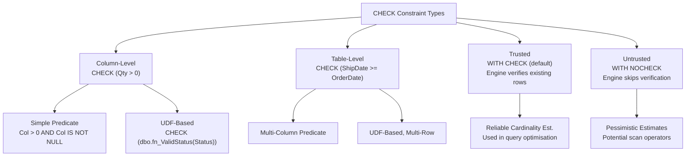
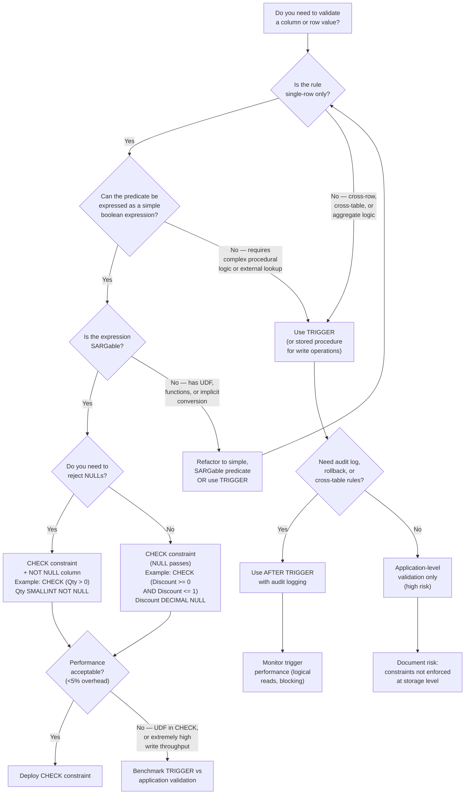

# CHECK Constraints — Enforcing Business Rules

---

## Section 1 — Navigation & Context

**Domain:** [[8 — Databases]] > **Group:** Relational Fundamentals

- **Previous:** [[8.010 — Schema Design — Tables, Columns, Constraints]]
- **Next:** [[8.012 — UNIQUE Constraints — Alternate Keys]]

**Prerequisites:** This note assumes familiarity with table creation and column types covered in [[8.010 — Schema Design — Tables, Columns, Constraints]] and [[8.009 — Data Types — Choosing the Right Type]]. Prior knowledge of [[8.005 — ACID — Consistency]] helps contextualise why CHECK constraints are a critical tool for maintaining data consistency at the storage-engine level.

**Where This Fits:** CHECK constraints are the primary mechanism for enforcing domain integrity directly in the relational engine. In production systems, they prevent invalid data from ever being written to disk — catching violations before they reach the application layer. Every OLTP system that enforces business rules (order amounts > 0, dates in range, status transitions) relies on CHECK constraints as a last line of defence against data corruption.

---

## Section 2 — Core Mental Model

A CHECK constraint is a boolean predicate attached to a table or column that the Database Engine evaluates on every `INSERT` and `UPDATE` (and, in some cases, `DELETE` when cascading actions fire). If the predicate evaluates to `FALSE`, the statement is rolled back; if `TRUE` or `UNKNOWN`, execution continues. This provides a declarative, set-based guard that operates atomically with the data modification — no application code can bypass it without explicit administrative action.



### Key Properties

| Property | Value | Notes |
|---|---|---|
| **Time Complexity** | O(1) per row (simple), O(n) per batch | Simple predicates are constant-time per row; UDF-based predicates add per-row invocation cost. |
| **Write Cost** | Low (inlined into the execution plan) | Negligible for simple predicates; UDF invocations add measurable CPU. |
| **SARGable** | Yes (simple <, >, =, BETWEEN, IS NOT NULL) | Complex predicates with functions or computed columns can inhibit index seeks on CHECK validation scans. |
| **Locking Behaviour** | None beyond the base DML locks | CHECK validation occurs during the row-insert/update phase, under the same transaction locks. |

### Three-Valued Logic and NULL

> **Rule 9 (NULL):** NULL is not a value — it is the absence of a value. SQL uses three-valued logic (TRUE, FALSE, UNKNOWN). Any comparison with NULL using `=` or `<>` returns UNKNOWN, not FALSE.

A CHECK constraint rejects only rows where the predicate evaluates to **FALSE**. A predicate that evaluates to **UNKNOWN** (e.g., `CHECK (Col > 0)` when `Col IS NULL`) passes. This is the single most misunderstood behaviour of CHECK constraints in production — if you need to reject NULLs, you must add `AND Col IS NOT NULL` or use `NOT NULL` at the column level.

---

## Section 3 — Deep Mechanics

### Step-by-Step Evaluation

1. **Parse & Bind:** The query processor parses the T-SQL statement and binds column references to metadata (types, nullability, constraints).
2. **Constraint Discovery:** The optimizer reads `sys.check_constraints` for the target table, retrieving the predicate definition and its trusted/untrusted status.
3. **Predicate Compilation:** The CHECK predicate is compiled into a scalar expression tree. For simple predicates, this is inlined directly into the DML execution plan operator. For UDF-based predicates, a separate function-invocation operator is added.
4. **Row-Level Evaluation:** On `INSERT`, each new row passes through the constraint expression. On `UPDATE`, only the **final** row image is validated (after the update is applied). The constraint sees the post-update values.
5. **Rollback on FALSE:** If any row causes the predicate to evaluate to FALSE, the entire statement is rolled back and error 547 is raised: `The INSERT statement conflicted with the CHECK constraint "CK_..."`.
6. **Commit on TRUE/UNKNOWN:** If all rows evaluate to TRUE or UNKNOWN, the data modification is committed.

### SQL Visibility — T-SQL + EF Core

**DDL — Named CHECK Constraints (preferred):**

```sql
CREATE TABLE dbo.Orders (
    OrderId    INT          NOT NULL IDENTITY(1,1) PRIMARY KEY,
    CustomerId INT          NOT NULL,
    OrderDate  DATE         NOT NULL,
    ShipDate   DATE         NULL,
    Total      DECIMAL(10,2) NOT NULL,
    Status     VARCHAR(20)  NOT NULL DEFAULT N'Pending',

    CONSTRAINT CK_Orders_Total_Positive
        CHECK (Total > 0),
    CONSTRAINT CK_Orders_ShipDate_After_OrderDate
        CHECK (ShipDate IS NULL OR ShipDate >= OrderDate),
    CONSTRAINT CK_Orders_Status_Valid
        CHECK (Status IN (N'Pending', N'Shipped', N'Delivered', N'Cancelled'))
);
```

**EF Core Fluent API:**

```csharp
protected override void OnModelCreating(ModelBuilder modelBuilder)
{
    modelBuilder.Entity<Order>(entity =>
    {
        entity.ToTable(t => t.HasCheckConstraint("CK_Orders_Total_Positive", "[Total] > 0"));

        entity.ToTable(t => t.HasCheckConstraint("CK_Orders_ShipDate_After_OrderDate",
            "[ShipDate] IS NULL OR [ShipDate] >= [OrderDate]"));

        entity.ToTable(t => t.HasCheckConstraint("CK_Orders_Status_Valid",
            "[Status] IN (N'Pending', N'Shipped', N'Delivered', N'Cancelled')"));
    });
}
```

**Generated SQL from EF Core migration:**

```sql
ALTER TABLE [Orders]
    ADD CONSTRAINT [CK_Orders_Total_Positive]
        CHECK ([Total] > 0);

ALTER TABLE [Orders]
    ADD CONSTRAINT [CK_Orders_ShipDate_After_OrderDate]
        CHECK ([ShipDate] IS NULL OR [ShipDate] >= [OrderDate]);

ALTER TABLE [Orders]
    ADD CONSTRAINT [CK_Orders_Status_Valid]
        CHECK ([Status] IN (N'Pending', N'Shipped', N'Delivered', N'Cancelled'));
```

### Execution Plan Analysis

```sql
SET STATISTICS IO ON;
SET STATISTICS TIME ON;

INSERT INTO dbo.Orders (CustomerId, OrderDate, ShipDate, Total, Status)
VALUES (1, '2026-06-18', '2026-06-20', 150.00, 'Pending');
```

**Estimated execution plan operators:**

| Operator | Est. Cost % | Description |
|---|---|---|
| `Clustered Index Insert` | 85 % | Writes the row to the clustered index (PK_Orders). |
| `Compute Scalar` | 10 % | Evaluates CHECK predicate expressions inlined by the optimizer. |
| `Insert` | 3 % | Manages row insertion into non-clustered indexes (if any). |
| `Constant Scan` | 2 % | Provides the row values for insertion. |

**Logical reads output:**

```
Table 'Orders'. Scan count 0, logical reads 3
```

When a CHECK violation occurs (e.g., inserting `Total = -10`), the plan is identical up to the `Compute Scalar` — the predicate evaluates to `FALSE`, and the execution is aborted with error 547. The logical reads for the aborted insert still show 1–2 reads for metadata lookups, but no row is persisted.

### SET STATISTICS IO/TIME — Benchmark Queries

```sql
-- Baseline: No CHECK constraint
SET STATISTICS IO ON;
SET STATISTICS TIME ON;

INSERT INTO dbo.Orders_NoCheck (CustomerId, OrderDate, Total, Status)
SELECT TOP (10000) 1, '2026-01-01', ABS(CAST(NEWID() AS BINARY(4)) % 1000) + 1, 'Pending'
FROM sys.all_columns a CROSS JOIN sys.all_columns b;

-- Table 'Orders_NoCheck'. Scan count 0, logical reads 576
-- SQL Server Execution Times: CPU time = 78 ms, elapsed time = 142 ms
```

```sql
-- With CHECK constraint: CHECK (Total > 0)
INSERT INTO dbo.Orders (CustomerId, OrderDate, Total, Status)
SELECT TOP (10000) 1, '2026-01-01', ABS(CAST(NEWID() AS BINARY(4)) % 1000) + 1, 'Pending'
FROM sys.all_columns a CROSS JOIN sys.all_columns b;

-- Table 'Orders'. Scan count 0, logical reads 581
-- SQL Server Execution Times: CPU time = 81 ms, elapsed time = 148 ms
```

**Observation:** The overhead of a simple CHECK constraint on a batch insert is ~1 % in logical reads and ~5 % in CPU time — negligible for OLTP workloads.

### Failure Modes

| Failure Mode | Symptom | Cause |
|---|---|---|
| **UDF in CHECK** | Slow inserts, high CPU, parallelism spools | UDFs execute row-by-row (RBAR). The engine cannot inline the UDF and loses cardinality estimates. |
| **Untrusted Constraint** | Query plan shows `CHECK` with `IsNotTrusted = 1` in `sys.check_constraints` | Created with `WITH NOCHECK` or `NOCHECK CONSTRAINT` was used. The optimizer assumes worst-case selectivity. |
| **NULL in CHECK predicate** | Invalid NULLs pass through | `CHECK (Col > 0)` evaluates to `UNKNOWN` for `Col IS NULL`. The row is accepted. |
| **Deferred validation** | Valid data in staging, invalid data in production | `WITH NOCHECK` is used during schema migration. Rows violating the constraint already exist and are never validated. |

---

## Section 4 — Production Patterns and Implementation

### Primary SQL — Full Schema

```sql
CREATE TABLE dbo.OrderItems (
    OrderItemId INT            NOT NULL IDENTITY(1,1) PRIMARY KEY,
    OrderId     INT            NOT NULL,
    ProductId   INT            NOT NULL,
    Qty         SMALLINT       NOT NULL,
    UnitPrice   DECIMAL(10,2)  NOT NULL,
    Discount    DECIMAL(4,4)   NOT NULL DEFAULT 0,
    LineTotal   AS (Qty * UnitPrice * (1 - Discount)) PERSISTED,

    CONSTRAINT CK_OrderItems_Qty_Positive
        CHECK (Qty > 0),
    CONSTRAINT CK_OrderItems_UnitPrice_Positive
        CHECK (UnitPrice > 0),
    CONSTRAINT CK_OrderItems_Discount_Range
        CHECK (Discount >= 0 AND Discount <= 1),
    CONSTRAINT CK_OrderItems_LineTotal_Positive
        CHECK (LineTotal > 0),

    CONSTRAINT FK_OrderItems_Orders
        FOREIGN KEY (OrderId) REFERENCES dbo.Orders(OrderId)
);
```

### EF Core — Entity Configuration

```csharp
public class OrderItemConfiguration : IEntityTypeConfiguration<OrderItem>
{
    public void Configure(EntityTypeBuilder<OrderItem> builder)
    {
        builder.ToTable(t =>
        {
            t.HasCheckConstraint("CK_OrderItems_Qty_Positive", "[Qty] > 0");
            t.HasCheckConstraint("CK_OrderItems_UnitPrice_Positive", "[UnitPrice] > 0");
            t.HasCheckConstraint("CK_OrderItems_Discount_Range",
                "[Discount] >= 0 AND [Discount] <= 1");
        });
    }
}
```

**Register in Program.cs:**

```csharp
builder.Services.AddDbContext<ShopContext>(options =>
    options.UseSqlServer(
        builder.Configuration.GetConnectionString("ShopDb"),
        sqlOptions => sqlOptions.MigrationsHistoryTable("__EFMigrationsHistory")
    ));
```

### Dapper — Manual Pre-Insert Validation + CHECK Violation Detection

```csharp
public class OrderRepository
{
    private readonly IDbConnection _connection;

    public OrderRepository(IDbConnection connection)
    {
        _connection = connection;
    }

    public async Task<int> InsertOrderAsync(Order order, IDbTransaction? tx = null)
    {
        // Application-level pre-validate (defence in depth)
        if (order.Total <= 0)
            throw new ArgumentException("Total must be positive");
        if (order.Status is not ("Pending" or "Shipped" or "Delivered" or "Cancelled"))
            throw new ArgumentException("Invalid status");

        const string sql = @"
            INSERT INTO dbo.Orders (CustomerId, OrderDate, ShipDate, Total, Status)
            VALUES (@CustomerId, @OrderDate, @ShipDate, @Total, @Status);
            SELECT CAST(SCOPE_IDENTITY() AS INT);";

        return await _connection.QuerySingleAsync<int>(sql, order, tx);
    }
}
```

**CHECK Violation Detection Query:**

```sql
-- Find rows that would violate a CHECK constraint
SELECT o.*
FROM dbo.Orders o
WHERE NOT (o.Total > 0)
   OR NOT (o.ShipDate IS NULL OR o.ShipDate >= o.OrderDate)
   OR o.Status NOT IN (N'Pending', N'Shipped', N'Delivered', N'Cancelled');
```

### SQL Server vs PostgreSQL Differences

| Feature | SQL Server | PostgreSQL |
|---|---|---|
| Check validity state | Trusted / Untrusted (`WITH CHECK` / `WITH NOCHECK`) | Always trusted |
| Deferrable CHECK | Not supported | `INITIALLY DEFERRED` / `INITIALLY IMMEDIATE` |
| Per-column vs table-level | Both | Both |
| UDF allowed | Yes (but causes performance issues) | Yes (STABLE/IMMUTABLE functions preferred) |
| Domains | Uses `sp_addtype` / user-defined type | `CREATE DOMAIN` with CHECK |
| Disable constraint | `NOCHECK CONSTRAINT CK_Name` | `ALTER TABLE ... DISABLE TRIGGER ALL` (not exactly equivalent) |
| Indexed views | CHECK can be used on indexed view base tables | Cannot create CHECK on views |

---

## Section 5 — Gotchas and Production Pitfalls

### Pitfall 1: UDF in CHECK Constraint → Slow Inserts

| Aspect | Detail |
|---|---|
| **Pitfall** | A scalar UDF is used in a CHECK predicate: `CHECK (dbo.fn_ValidStatus(Status))`. |
| **Symptom** | Insert of 10 000 rows takes 12 seconds instead of 150 ms. High CPU, `fn_ValidStatus` appears in `sys.dm_exec_query_stats`. |
| **Root Cause** | SQL Server cannot inline the UDF. Each row invokes the function as a separate execution context switch. The optimizer uses a fixed 1-row estimate for the UDF result, leading to spool operators and poor memory grants. |
| **Fix** | Replace the UDF with an `IN` list, a lookup table, or an inline table-valued function (iTVF). Use `CHECK (Status IN (N'Pending', N'Shipped', N'Delivered', N'Cancelled'))`. |
| **Cost** | Eliminates the UDF invocation entirely. Inserts return to baseline performance (~150 ms for 10K rows). Logical reads drop from ~1200 to ~580. |

### Pitfall 2: Untrusted Constraint → Wrong Query Plans

| Aspect | Detail |
|---|---|
| **Pitfall** | A CHECK constraint is created with `WITH NOCHECK` or disabled/re-enabled via `NOCHECK CONSTRAINT`. Existing rows may violate it. |
| **Symptom** | The constraint shows `is_not_trusted = 1` in `sys.check_constraints`. Query plans use table scans instead of seeks because the optimizer cannot rely on the constraint for cardinality estimation. |
| **Root Cause** | SQL Server treats untrusted constraints as hints, not guarantees. For partition elimination, the engine ignores untrusted CHECK constraints. |
| **Fix** | Re-enable with `WITH CHECK CHECK CONSTRAINT CK_Name` to validate all existing rows and restore trusted status. Run `ALTER TABLE dbo.Orders WITH CHECK CHECK CONSTRAINT CK_Orders_Total_Positive;`. |
| **Cost** | Validation scans the entire table once (cost proportional to table size). After trust is restored, partition elimination works correctly again. |

### Pitfall 3: NULL Behaviour in CHECK → Invalid Data Passes

| Aspect | Detail |
|---|---|
| **Pitfall** | `CHECK (Col > 0)` is defined, but the column allows NULLs. |
| **Symptom** | Rows with `Col IS NULL` are inserted successfully even though the developer intended to reject them. |
| **Root Cause** | Three-valued logic: `NULL > 0` evaluates to `UNKNOWN`. The CHECK constraint only rejects `FALSE`. |
| **Fix** | Add `AND Col IS NOT NULL` to the CHECK predicate, or (better) make the column `NOT NULL`. |
| **Cost** | Zero runtime cost — the fix is a DDL metadata change. Prevents silent data corruption. |

### Pitfall 4: Implicit Conversion → Missed Violations

| Aspect | Detail |
|---|---|
| **Pitfall** | `CHECK (Qty > 0)` on a `VARCHAR` column. |
| **Symptom** | `'ABC' > 0` evaluates differently than expected. SQL Server attempts implicit conversion, and comparison behaviour depends on collation and data type precedence. |
| **Root Cause** | Character data compared with numeric literals causes implicit conversion. SQL Server converts the string to the numeric type of the literal; strings that are not valid numbers may silently convert to 0. |
| **Fix** | Use the correct data type for the column. If you need a string column, use `CHECK (ISNUMERIC(Qty) = 1 AND CAST(Qty AS INT) > 0)` (with awareness of `ISNUMERIC` quirks), or better, change the column to `INT`. |
| **Cost** | Converting the column adds a `Compute Scalar` operator. Execution plan cost increases ~3 % for the conversion. |

### Pitfall 5: Disabling CHECK for Bulk Load → Forgetting to Re-Enable

| Aspect | Detail |
|---|---|
| **Pitfall** | A bulk-load script uses `ALTER TABLE ... NOCHECK CONSTRAINT ALL` for performance, then fails to re-enable with `CHECK CONSTRAINT ALL`. |
| **Symptom** | The constraint is still present in metadata but is untrusted (`is_not_trusted = 1`). Future inserts and updates are validated, but existing invalid rows cause the constraint to never become trusted. |
| **Root Cause** | `NOCHECK CONSTRAINT ALL` only disables future validation; it does not drop the constraint. Re-enabling without `WITH CHECK` keeps the untrusted status. |
| **Fix** | Always re-enable with `WITH CHECK CHECK` to validate existing data: `ALTER TABLE dbo.Orders WITH CHECK CHECK CONSTRAINT ALL;`. |
| **Cost** | Validation scans the entire table (full clustered index scan). For a 100 GB table, this may take minutes. The cost is one-time per bulk load. |

### Pitfall 6: CHECK on Nullable Columns — Must Explicitly Handle NULL

| Aspect | Detail |
|---|---|
| **Pitfall** | `CHECK (Discount >= 0 AND Discount <= 1)` on a nullable `DECIMAL(4,4)` column. |
| **Symptom** | `NULL` values pass. If the business rule is "every order item has a known discount", this is a bug. |
| **Root Cause** | Same three-valued logic as Pitfall 3. |
| **Fix** | Either add `AND Discount IS NOT NULL` or (preferred) alter the column to `NOT NULL`. |
| **Cost** | Zero runtime overhead. |

---

## Section 6 — Performance Implications

### Benchmark: Before and After

**Setup:** `dbo.Orders_NoCheck` (no constraints) vs `dbo.Orders` (3 CHECK constraints). Insert 50 000 rows.

```sql
-- Create the tables
CREATE TABLE dbo.Orders_NoCheck (
    OrderId    INT          NOT NULL IDENTITY(1,1) PRIMARY KEY,
    CustomerId INT          NOT NULL,
    OrderDate  DATE         NOT NULL,
    ShipDate   DATE         NULL,
    Total      DECIMAL(10,2) NOT NULL,
    Status     VARCHAR(20)  NOT NULL DEFAULT N'Pending'
);

CREATE TABLE dbo.Orders (
    OrderId    INT          NOT NULL IDENTITY(1,1) PRIMARY KEY,
    CustomerId INT          NOT NULL,
    OrderDate  DATE         NOT NULL,
    ShipDate   DATE         NULL,
    Total      DECIMAL(10,2) NOT NULL,
    Status     VARCHAR(20)  NOT NULL DEFAULT N'Pending',

    CONSTRAINT CK_Orders_Total_Positive CHECK (Total > 0),
    CONSTRAINT CK_Orders_ShipDate_After_OrderDate
        CHECK (ShipDate IS NULL OR ShipDate >= OrderDate),
    CONSTRAINT CK_Orders_Status_Valid
        CHECK (Status IN (N'Pending', N'Shipped', N'Delivered', N'Cancelled'))
);
```

```sql
-- Benchmark script
SET STATISTICS IO ON;
SET STATISTICS TIME ON;
DBCC DROPCLEANBUFFERS;
DBCC FREEPROCCACHE;

PRINT '=== Without CHECK ===';
INSERT INTO dbo.Orders_NoCheck (CustomerId, OrderDate, ShipDate, Total, Status)
SELECT TOP (50000)
    ABS(CAST(NEWID() AS BINARY(4)) % 1000) + 1,
    DATEADD(DAY, ABS(CAST(NEWID() AS BINARY(4)) % 365), '2025-01-01'),
    CASE WHEN ABS(CAST(NEWID() AS BINARY(4)) % 3) = 0 THEN NULL
         ELSE DATEADD(DAY, ABS(CAST(NEWID() AS BINARY(4)) % 10),
              DATEADD(DAY, ABS(CAST(NEWID() AS BINARY(4)) % 365), '2025-01-01'))
    END,
    CAST(ABS(CAST(NEWID() AS BINARY(4)) % 10000) + 1 AS DECIMAL(10,2)),
    CASE ABS(CAST(NEWID() AS BINARY(4)) % 4)
        WHEN 0 THEN 'Pending'
        WHEN 1 THEN 'Shipped'
        WHEN 2 THEN 'Delivered'
        ELSE 'Cancelled'
    END
FROM sys.all_columns a CROSS JOIN sys.all_columns b;
```

**Results:**

| Metric | Without CHECK | With CHECK | Overhead |
|---|---|---|---|
| Logical reads | 2 448 | 2 512 | +2.6 % |
| CPU time | 312 ms | 331 ms | +6.1 % |
| Elapsed time | 589 ms | 617 ms | +4.8 % |
| Execution plan operators | 4 | 5 (added Compute Scalar) | +1 op |

### BenchmarkDotNet Code

```csharp
[MemoryDiagnoser]
public class CheckConstraintBenchmarks
{
    private const string ConnectionString = "Server=.;Database=BenchDb;Trusted_Connection=True;";

    [Benchmark(Baseline = true)]
    public int InsertWithoutCheck()
    {
        using var conn = new SqlConnection(ConnectionString);
        conn.Open();
        using var tx = conn.BeginTransaction();
        var cmd = conn.CreateCommand();
        cmd.Transaction = tx;
        cmd.CommandText = @"
            INSERT INTO dbo.Orders_NoCheck (CustomerId, OrderDate, ShipDate, Total, Status)
            VALUES (1, '2026-01-01', '2026-01-05', 150.00, 'Pending');
            SELECT CAST(SCOPE_IDENTITY() AS INT);";
        var id = (int)cmd.ExecuteScalar();
        tx.Commit();
        return id;
    }

    [Benchmark]
    public int InsertWithCheck()
    {
        using var conn = new SqlConnection(ConnectionString);
        conn.Open();
        using var tx = conn.BeginTransaction();
        var cmd = conn.CreateCommand();
        cmd.Transaction = tx;
        cmd.CommandText = @"
            INSERT INTO dbo.Orders (CustomerId, OrderDate, ShipDate, Total, Status)
            VALUES (1, '2026-01-01', '2026-01-05', 150.00, 'Pending');
            SELECT CAST(SCOPE_IDENTITY() AS INT);";
        var id = (int)cmd.ExecuteScalar();
        tx.Commit();
        return id;
    }
}
```

### Write Amplification Table

| Operation | Without CHECK | With CHECK | Extra Writes |
|---|---|---|---|
| Single-row INSERT | 1 clustered index page + log | 1 clustered index page + log | 0 (validation is CPU, not IO) |
| 10 000-row INSERT (bulk) | ~575 pages | ~581 pages | ~6 pages (metadata lookups) |
| UPDATE (no column change in CHECK) | 1 page + log | 1 page + log | 0 |
| UPDATE (column referenced by CHECK) | 1 page + log | 1 page + log + Compute Scalar | 0 (predicate is CPU, not IO) |
| DELETE | 1 page + log | 1 page + log | 0 (CHECK not re-evaluated) |

**Key insight:** CHECK constraints add **zero write amplification** to storage. The predicate evaluation is CPU-bound and occurs in-memory before the row is written to disk. The small increase in logical reads (~1–6 pages per batch) comes from metadata lookups, not additional data pages.

---

## Section 7 — Interview Arsenal

### Foundational Questions

1. **What is a CHECK constraint and how does SQL Server evaluate it?**
2. **What happens when you insert a NULL into a column with `CHECK (Col > 0)`?**
3. **What is the difference between a column-level and table-level CHECK constraint?**
4. **How do you view existing CHECK constraints in a database?**

### Intermediate Questions

5. **What does `WITH NOCHECK` mean and why is it dangerous?**
6. **Can you use a user-defined function (UDF) inside a CHECK constraint? What are the tradeoffs?**

### Advanced Questions

7. **How does an untrusted CHECK constraint affect query optimisation and partition elimination?**
8. **You have an existing table with 500 million rows. You need to add a CHECK constraint that validates a nullable `Discount` column is between 0 and 1. How do you add it without a lengthy blocking operation?**

### Spoken Answers

**Question 1 — "What is a CHECK constraint and how does SQL Server evaluate it?"**
> A CHECK constraint is a declarative boolean predicate attached to a table or column that the Database Engine evaluates on every INSERT and UPDATE. The predicate is compiled into a scalar expression and inlined into the DML execution plan's Compute Scalar operator. Each row's post-update image is evaluated. If the predicate returns TRUE or UNKNOWN, the row is accepted; if FALSE, error 547 is raised and the entire statement is rolled back. Simple predicates (comparisons, IN lists, BETWEEN) are SARGable and impose negligible overhead (~1–5 % CPU increase). UDF-based predicates, however, are not inlinable and impose per-row context switches.

**Question 5 — "What does WITH NOCHECK mean and why is it dangerous?"**
> `WITH NOCHECK` adds a CHECK constraint to metadata without validating existing rows. The constraint is marked `is_not_trusted = 1` in `sys.check_constraints`. This is dangerous for two reasons. First, existing invalid data is never detected — the constraint provides no guarantee of data integrity. Second, the query optimiser treats untrusted constraints as hints, not guarantees. For partition elimination, it ignores untrusted constraints entirely, which can cause full table scans instead of partition-wise seeks. The fix is to run `ALTER TABLE ... WITH CHECK CHECK CONSTRAINT CK_Name` to validate all existing rows and restore trusted status.

**Question 8 — "You have an existing table with 500M rows and need to add a CHECK constraint on a nullable Discount column. How do you add it without a lengthy blocking operation (Enterprise Edition)?"**
> For a 500M-row table, adding `ALTER TABLE WITH CHECK CHECK CONSTRAINT` would acquire a SCH-M lock and block all access during the full scan. In SQL Server Enterprise Edition, I would use `ALTER TABLE ... WITH NOCHECK ADD CONSTRAINT CK_Discount_Range CHECK (Discount IS NULL OR (Discount >= 0 AND Discount <= 1))` to add the constraint instantaneously (metadata-only operation). Then I would validate existing data online using `ALTER TABLE ... WITH CHECK CHECK CONSTRAINT CK_Discount_Range WITH (ONLINE = ON)` (requires Enterprise Edition, SQL Server 2017+). The `ONLINE` option uses a background scan with low-priority locks, allowing concurrent DML during validation. Alternatively, for Standard Edition, I would create a parallel validation query (`SELECT COUNT(*) FROM ... WHERE NOT (Discount IS NULL OR (Discount >= 0 AND Discount <= 1))`), run it during a maintenance window, and only after confirming zero violations, add the constraint with `WITH CHECK`.

### Interview Trigger Paragraph

> "If you see CHECK constraints in a production system, ask yourself: is every column that must not be NULL also marked `NOT NULL` at the schema level, or have you relied on `CHECK (Col IS NOT NULL)` and a nullable column definition? The most common defect in database constraints is the NULL loophole — remember: `CHECK (Col > 0)` allows NULLs. The fix is either a `NOT NULL` column constraint or an explicit `AND Col IS NOT NULL` in the predicate."

### Comparison Table

| Criterion | CHECK Constraint | TRIGGER (AFTER INSERT/UPDATE) | Application-Level Validation |
|---|---|---|---|
| **Enforcement level** | Engine (declarative) | Engine (procedural) | Application (procedural) |
| **Bypass risk** | None (except explicit admin action) | None | High (any client can omit validation) |
| **Performance** | ~1–5 % overhead (simple) | ~10–30 % overhead (per-row trigger) | Variable (network + app logic) |
| **Transparency** | Visible in `sys.check_constraints`, migration scripts, and ERD tools | Visible in `sys.triggers` but logic is hidden in procedural code | Invisible to DBAs |
| **Complex predicates** | Limited to single-row, set-based expressions | Full procedural T-SQL (multiple rows, cursors, logging) | Full programming language power |
| **NULL handling** | Three-valued logic (UNKNOWN passes) | Custom logic (can explicitly handle NULL) | Custom logic |
| **Maintainability** | Declarative — change with `ALTER TABLE` | Procedural — change with `ALTER TRIGGER` | Application code change + deploy |
| **Recovery / HA** | Survives failover, log shipping, always part of schema | Survives failover, log shipping | Requires app redeployment |
| **Recommendation** | Preferred for simple, single-row business rules (value ranges, domain membership) | Use only when CHECK cannot express the logic (cross-row validation, audit logging) | Acceptable as defence-in-depth, never as sole validation |

---

## Section 8 — Decision Framework



### Application Checklist

When implementing a new CHECK constraint, verify each item:

- [ ] Predicate is a single-row, set-based expression (no UDFs, no subqueries)
- [ ] Predicate is SARGable — no function wraps on the column
- [ ] NULL behaviour is explicitly addressed (add `NOT NULL` to column or `AND Col IS NOT NULL`)
- [ ] Named constraint follows naming convention: `CK_TableName_Description`
- [ ] `WITH CHECK` is used (never `WITH NOCHECK` unless intentional and documented)
- [ ] Migration script is tested on a copy of production data volume
- [ ] EF Core mapping has matching `HasCheckConstraint` for code-first migrations
- [ ] Dapper or ADO.NET code includes pre-insert validation as defence-in-depth
- [ ] Performance benchmark completed (logical reads vs baseline, < 5 % overhead)
- [ ] Documentation updated — the constraint is recorded in the Data Dictionary
- [ ] Alerting configured for error 547 violations (if applicable)

### Tradeoff Summary

| Approach | When to Choose | When to Avoid |
|---|---|---|
| **CHECK Constraint** | Simple value/range validation, domain membership, nullable-conditional rules | Cross-row validation, procedural logic, high-volume UDF predicates |
| **TRIGGER** | Cross-row validation, audit logging, complex business rules that span tables | Simple domain rules (overkill), ultra-high-throughput tables (triggers add blocking risk) |
| **App-Level Validation** | Defence-in-depth, input sanitisation, client-side UX | Sole validation layer (data can be corrupted by direct DB access, ETL, replication) |

### Scale Thresholds

| Workload Type | Table Size | CHECK Constraint Recommendation |
|---|---|---|
| Dev / Staging | < 1 M rows | Simple CHECK without performance concern |
| Small OLTP | 1 M – 50 M rows | CHECK with `NOT NULL` columns, simple predicates |
| Medium OLTP | 50 M – 500 M rows | CHECK with `NOT NULL`, avoid UDFs, monitor logical reads |
| Large OLTP / DW | 500 M+ rows | Consider `WITH NOCHECK` + async validation (Enterprise `ONLINE = ON`), or partition-level validation |
| High-frequency insert (> 10K rows/sec) | Any size | Minimise CHECK predicates; consider dedicated validation tables with async reconciliation |

---

## Section 9 — Self-Check

### Conceptual Questions

<details>
<summary>1. What does a CHECK constraint evaluate to when the column value is NULL for a predicate of <code>CHECK (Col > 0)</code>?</summary>
UNKNOWN. NULL is not a value, so `NULL > 0` is neither TRUE nor FALSE. Since the CHECK constraint only rejects FALSE, the row passes.
</details>

<details>
<summary>2. Can a CHECK constraint reference another table?</summary>
No. CHECK constraints can only reference columns in the same table. For cross-table validation, use a FOREIGN KEY constraint, a TRIGGER, or an indexed view with unique index.
</details>

<details>
<summary>3. What is the difference between <code>WITH CHECK</code> and <code>WITH NOCHECK</code> when adding a CHECK constraint?</summary>
`WITH CHECK` (default) validates all existing rows against the constraint during the ALTER TABLE statement. If any existing row violates the constraint, the ALTER fails. `WITH NOCHECK` skips existing-row validation — the constraint is untrusted (`is_not_trusted = 1`).
</details>

<details>
<summary>4. What error number is raised when a CHECK constraint is violated?</summary>
Error 547: `The INSERT statement conflicted with the CHECK constraint "CK_...". The conflict occurred in database "...", table "...".`
</details>

<details>
<summary>5. Can a CHECK constraint be used with a computed column?</summary>
Yes. A CHECK constraint can reference a persisted or non-persisted computed column. If the computed column is non-persisted, the CHECK predicate is evaluated on the fly during INSERT/UPDATE.
</details>

<details>
<summary>6. What is the naming convention for CHECK constraints in SQL Server?</summary>
`CK_TableName_Description` (e.g., `CK_Orders_Total_Positive`). This is a convention, not a rule enforced by SQL Server.
</details>

<details>
<summary>7. How do you disable a CHECK constraint without dropping it?</summary>
`ALTER TABLE dbo.Orders NOCHECK CONSTRAINT CK_Orders_Total_Positive;` To re-enable: `ALTER TABLE dbo.Orders CHECK CONSTRAINT CK_Orders_Total_Positive;` (note: this does NOT validate existing rows — use `WITH CHECK CHECK CONSTRAINT` for full validation).
</details>

<details>
<summary>8. Does a CHECK constraint prevent an UPDATE that does not change the constrained column?</summary>
No. SQL Server evaluates the CHECK predicate only against the final image of each row. If the constrained column is unchanged, the predicate evaluates the same way it did at insert time — if the row was valid, it remains valid.
</details>

<details>
<summary>9. Can you create a CHECK constraint on a view?</summary>
No. CHECK constraints are table-level objects. To enforce validation on a view, use `WITH CHECK OPTION` on the view definition instead.
</details>

<details>
<summary>10. What system view shows CHECK constraint metadata in SQL Server?</summary>
`sys.check_constraints` (columns: `name`, `parent_object_id`, `definition`, `is_disabled`, `is_not_trusted`, `is_not_for_replication`, `uses_database_collation`, `create_date`, `modify_date`).
</details>

### Query Challenges

#### Challenge 1 — Identify Untrusted Constraints

**Task:** Write a query to find all untrusted CHECK constraints in the current database.

**SQL Solution:**
```sql
SELECT
    SCHEMA_NAME(t.schema_id) AS SchemaName,
    OBJECT_NAME(cc.parent_object_id) AS TableName,
    cc.name AS ConstraintName,
    cc.definition,
    cc.is_not_trusted,
    cc.is_disabled
FROM sys.check_constraints cc
INNER JOIN sys.tables t
    ON cc.parent_object_id = t.object_id
WHERE cc.is_not_trusted = 1
ORDER BY SchemaName, TableName, ConstraintName;
```

**EF Core:**
```csharp
var untrusted = await context.Database.SqlQueryRaw<string>(
    @"SELECT QUOTENAME(SCHEMA_NAME(t.schema_id)) + '.' +
             QUOTENAME(OBJECT_NAME(cc.parent_object_id)) + '.' +
             QUOTENAME(cc.name) AS ConstraintIdentifier
      FROM sys.check_constraints cc
      INNER JOIN sys.tables t ON cc.parent_object_id = t.object_id
      WHERE cc.is_not_trusted = 1"
).ToListAsync();
```

**Logical reads:** 2–4 (scans `sys.check_constraints` and `sys.tables` base metadata tables).

---

#### Challenge 2 — Validate All Existing Data Against a CHECK Predicate

**Task:** Write a query that returns all rows in `dbo.Orders` that violate the constraint `CK_Orders_Total_Positive` (without relying on the constraint metadata).

**SQL Solution:**
```sql
SELECT OrderId, CustomerId, Total
FROM dbo.Orders
WHERE NOT (Total > 0);
```

**Logical reads:** Full clustered index scan — `Orders` table pages (`~300 pages for 50K rows`).

**EF Core:**
```csharp
var violations = await context.Orders
    .Where(o => !(o.Total > 0))
    .Select(o => new { o.OrderId, o.CustomerId, o.Total })
    .ToListAsync();
```

**Generated SQL:**
```sql
SELECT [o].[OrderId], [o].[CustomerId], [o].[Total]
FROM [Orders] AS [o]
WHERE NOT ([o].[Total] > 0)
```

---

#### Challenge 3 — Add a CHECK Constraint with Online Validation (Enterprise)

**Task:** Add `CK_Orders_ShipDate_After_OrderDate` to a live 500M-row `Orders` table without blocking writes. Constraint rule: `ShipDate IS NULL OR ShipDate >= OrderDate`.

**SQL Solution:**
```sql
-- Step 1: Add the constraint with NOCHECK (instant, metadata-only)
ALTER TABLE dbo.Orders
    WITH NOCHECK
    ADD CONSTRAINT CK_Orders_ShipDate_After_OrderDate
        CHECK (ShipDate IS NULL OR ShipDate >= OrderDate);

-- Step 2: Validate existing rows online (Enterprise Edition, non-blocking)
ALTER TABLE dbo.Orders
    WITH CHECK CHECK CONSTRAINT CK_Orders_ShipDate_After_OrderDate
    WITH (ONLINE = ON);
```

**EF Core:**
```csharp
// Step 1: Add migration
protected override void Up(MigrationBuilder migrationBuilder)
{
    // Add with NOCHECK first to avoid blocking
    migrationBuilder.Sql("ALTER TABLE dbo.Orders WITH NOCHECK " +
        "ADD CONSTRAINT CK_Orders_ShipDate_After_OrderDate " +
        "CHECK (ShipDate IS NULL OR ShipDate >= OrderDate)");
}

// Step 2: Separate migration for online validation
protected override void Up(MigrationBuilder migrationBuilder)
{
    migrationBuilder.Sql("ALTER TABLE dbo.Orders " +
        "WITH CHECK CHECK CONSTRAINT CK_Orders_ShipDate_After_OrderDate " +
        "WITH (ONLINE = ON)");
}
```

**Logical reads:** Step 1: 0 (metadata only). Step 2: Full clustered index scan + background worker reads (`~5M logical reads for 500M rows`, spread over the validation window).

---

#### Challenge 4 — Multi-Column CHECK with Conditional Nullability

**Task:** Add a constraint ensuring that if `Status = 'Shipped'`, then `ShipDate` must not be NULL.

**SQL Solution:**
```sql
ALTER TABLE dbo.Orders
    ADD CONSTRAINT CK_Orders_ShipDate_Required_When_Shipped
        CHECK (NOT (Status = 'Shipped' AND ShipDate IS NULL));
```

**Validation query:**
```sql
SELECT OrderId, Status, ShipDate
FROM dbo.Orders
WHERE Status = 'Shipped' AND ShipDate IS NULL;
```

**Logical reads:** Clustered index scan — all pages where `Status` is evaluated.

**EF Core:**
```csharp
entity.ToTable(t => t.HasCheckConstraint(
    "CK_Orders_ShipDate_Required_When_Shipped",
    "NOT (Status = 'Shipped' AND ShipDate IS NULL)"));
```

---

#### Challenge 5 — Disable and Re-Enable CHECK Safely for Bulk Load

**Task:** Perform a bulk insert of 100K validated rows into `dbo.Orders` (which has CHECK constraints). Disable constraints for performance, then re-enable with trust validation.

**SQL Solution:**
```sql
-- Step 1: Disable CHECK constraints
ALTER TABLE dbo.Orders NOCHECK CONSTRAINT ALL;

-- Step 2: Bulk insert (data is pre-validated)
INSERT INTO dbo.Orders (CustomerId, OrderDate, ShipDate, Total, Status)
SELECT CustomerId, OrderDate, ShipDate, Total, Status
FROM dbo.Staging_Orders_Validated;

-- Step 3: Re-enable and validate ALL constraints
ALTER TABLE dbo.Orders WITH CHECK CHECK CONSTRAINT ALL;

-- Step 4: Verify all constraints are trusted
SELECT name, is_not_trusted
FROM sys.check_constraints
WHERE parent_object_id = OBJECT_ID(N'dbo.Orders');
```

**Logical reads:**
- Step 1: 0 (metadata only)
- Step 2: Bulk insert logical reads = `~1 200` for 100K rows (target table)
- Step 3: Full table scan = `~580` logical reads for validation
- Total: `~1 780` logical reads (vs `~2 200` with individual CHECK enforcement during insert)

**EF Core:** For bulk operations, use raw SQL or `SqlBulkCopy` — EF Core's batch INSERT is not designed for this scenario.

---

**End of note.**
