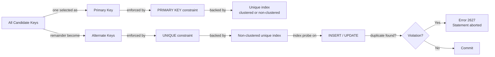
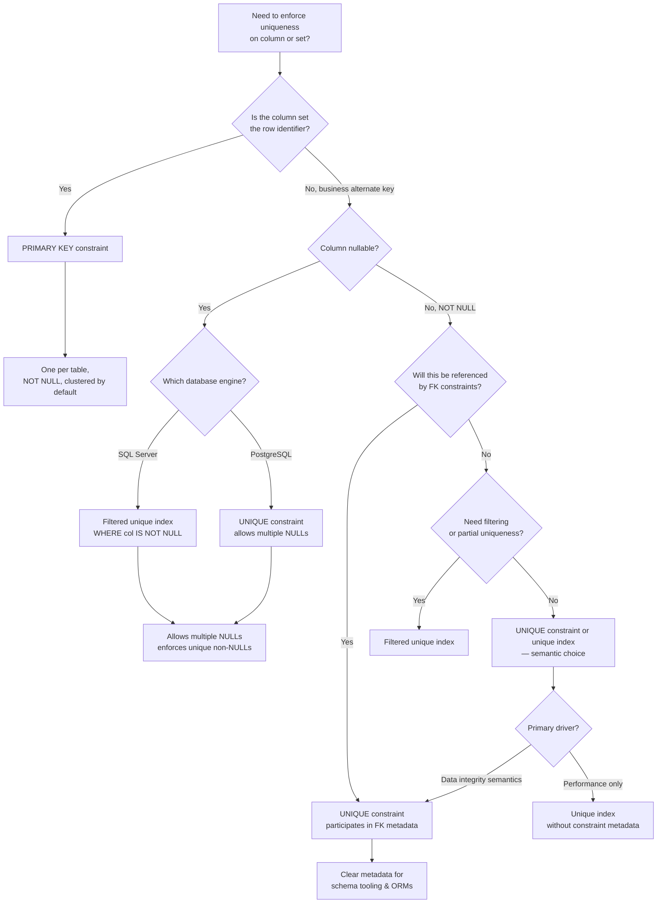

## Navigation

**Domain:** [[8 — Databases]] > **Group:** Relational Fundamentals
**Previous:** [[8.011 — CHECK Constraints — Enforcing Business Rules]] | **Next:** [[8.013 — DEFAULT Values — Column-Level Defaults]]

### Prerequisites
- [[8.002 — Keys — Primary, Foreign, Candidate, Surrogate, Natural]] — UNIQUE constraints are the mechanism that enforces candidate keys that are not the primary key
- [[8.010 — Schema Design — Tables, Columns, Constraints]] — understanding where constraints fit in the schema design lifecycle

### Where This Fits

A UNIQUE constraint prevents duplicate values in a column or set of columns that are not the primary key. In production, a .NET backend engineer encounters this when modeling business alternate keys — Employee.Email, Product.SKU, Customer.ExternalId — where the domain requires uniqueness but the column is not the entity's primary identifier. When this is misapplied, applications silently accept duplicate business keys, corrupting data integrity — a customer registers twice, an SKU is duplicated, or an invoice number repeats. In an interview, this tests whether you understand candidate key theory, NULL handling in the SQL engine, and the difference between logical constraint and physical index.

## Core Mental Model

A UNIQUE constraint is a declarative rule that guarantees every value in a column or combination of columns is distinct across all rows in the table. The database engine enforces this by creating a unique index behind the constraint — every INSERT or UPDATE probes the index for a matching key, and if found, the statement is aborted with a violation error. Think of it as the enforcement mechanism for alternate keys: candidate keys that were not chosen as the primary key. The recognition pattern is any column set in the domain model that must be unique for business reasons but is not the primary identifier — email addresses, tax IDs, order reference numbers, serial numbers.

### Classification

A UNIQUE constraint creates a unique non-clustered index (or clustered if the table has no clustered index and is not heap) behind the scenes. The query optimizer can use this index for seeks, scans, and key lookups just like any other index. The predicate `WHERE Email = @Email` on a unique index column IS SARGable — the optimizer performs an equality seek with exactly one or zero rows expected. Write operations incur the cost of index maintenance: every INSERT probes for duplicates, every UPDATE that changes the unique column also probes.



### Key Properties

|Property|Value|Notes|
|---|---|---|
|Enforcement Mechanism|Unique index|Engine creates an index; constraint is metadata layer on top|
|Duplicate Check|Index probe|Equality seek on every row modified — O(log N) per row|
|Write Cost|Medium|One unique index probe + maintenance per INSERT and per UPDATE of indexed columns|
|SARGable|Yes|WHERE clause on unique column enables equality seek with ~1 row estimate|
|Locking Behavior|Row-level (key)|Unique index adds row locks during validation; page splits under concurrency can escalate|
|NULL Behavior|Engine-dependent|SQL Server: one NULL per column set; PostgreSQL: multiple NULLs allowed|
|Scope|Table-level|Constraint name must be unique per table; scoped to that table only|

### NULL Behavior in Detail

**NULL is not a value — it is the absence of a value. SQL uses three-valued logic (TRUE, FALSE, UNKNOWN). Any comparison with NULL using = or <> returns UNKNOWN, not FALSE.**

This distinction is critical for UNIQUE constraint behavior. The SQL-99 standard says that UNIQUE constraints should treat NULLs as distinct from each other — meaning multiple NULLs should be allowed. PostgreSQL follows this: `CREATE TABLE T (x INT UNIQUE); INSERT INTO T VALUES (NULL), (NULL);` succeeds.

SQL Server deviates from the standard. SQL Server's unique index implementation treats NULL as a distinct value for the purpose of uniqueness checking — a single NULL is allowed, but a second NULL is treated as a duplicate. This is because SQL Server's unique index stores NULLs in the index B-tree, and the engine's equality check considers NULL = NULL as true for the purpose of index uniqueness enforcement, even though standard SQL says NULL = NULL is UNKNOWN.

**Production implication:** If your application needs to allow multiple NULLs on SQL Server, you must use a filtered unique index: `CREATE UNIQUE INDEX IX_Table_Column ON Table(Column) WHERE Column IS NOT NULL;`

## Deep Mechanics

### How the Engine Enforces UNIQUE

When a UNIQUE constraint is created, SQL Server performs the following steps:

1. **Parsing:** The parser interprets `ALTER TABLE Orders ADD CONSTRAINT UQ_Orders_OrderRef UNIQUE (OrderReference)` as a constraint DDL statement.
2. **Binding:** The binder resolves `Orders` and `OrderReference` against the catalog. If the column contains NULLs, the binder notes the nullable definition.
3. **Index creation:** The engine creates a unique non-clustered index on `OrderReference`. The index key includes the UNIQUE column(s). If the table has no clustered index (heap), the row locator is the RID (8 bytes). If the table has a clustered index, the row locator is the clustered key.
4. **Validation scan:** The engine scans existing rows to verify uniqueness. For a large table, this runs as a schema modification (Sch-M) lock operation with online index option if `ONLINE = ON`.
5. **Runtime enforcement:** On every INSERT or UPDATE that affects the indexed column, the storage engine navigates the B-tree from root to leaf, compares the key value, and if a matching key exists, raises error 2627: `Violation of UNIQUE KEY constraint 'UQ_Orders_OrderRef'. Cannot insert duplicate key in object 'dbo.Orders'.`

### SQL Visibility

**T-SQL — Creating a UNIQUE constraint:**

```sql
-- Named UNIQUE constraint at CREATE TABLE time
CREATE TABLE Customers (
    CustomerId  INT IDENTITY(1,1) PRIMARY KEY,
    Email       NVARCHAR(256) NOT NULL,
    ExternalId  NVARCHAR(50) NULL,
    CONSTRAINT UQ_Customers_Email UNIQUE (Email),
    CONSTRAINT UQ_Customers_ExternalId UNIQUE (ExternalId)
);

-- Adding to existing table
ALTER TABLE Customers
ADD CONSTRAINT UQ_Customers_Email UNIQUE (Email);

-- Adding a composite UNIQUE constraint
ALTER TABLE OrderItems
ADD CONSTRAINT UQ_OrderItems_OrderId_ProductId UNIQUE (OrderId, ProductId);
```

**EF Core — Fluent API:**

```csharp
public class CustomerConfiguration : IEntityTypeConfiguration<Customer>
{
    public void Configure(EntityTypeBuilder<Customer> builder)
    {
        builder.ToTable("Customers");

        // UNIQUE constraint via index
        builder.HasIndex(c => c.Email)
            .IsUnique()
            .HasDatabaseName("UQ_Customers_Email");

        // Alternate key — EF Core tracks this as a key
        builder.HasAlternateKey(c => c.ExternalId)
            .HasName("UQ_Customers_ExternalId");

        // Composite unique constraint
        builder.HasIndex(nameof(OrderItem.OrderId), nameof(OrderItem.ProductId))
            .IsUnique()
            .HasDatabaseName("UQ_OrderItems_OrderId_ProductId");
    }
}
```

**Generated SQL (from EF Core logs when using HasAlternateKey):**

```sql
-- EF Core generates the same ALTER TABLE / CREATE INDEX internally
ALTER TABLE [Customers] ADD CONSTRAINT [UQ_Customers_ExternalId] UNIQUE ([ExternalId]);
```

### Execution Plan Analysis

For the query `SELECT CustomerId, Email FROM Customers WHERE Email = 'user@example.com';` with a UNIQUE constraint on `Email`:

|Operator|Est Rows|Actual Rows|Cost %|Description|
|---|---|---|---|---|
|Index Seek (IX_Customers_Email)|1|1|~50%|Seek on Email = @Email, exactly 1 row expected|
|Key Lookup (Clustered)|1|1|~50%|Lookup CustomerId and any missing columns|
|SELECT|1|1|0%|Compute scalar, output|

The optimizer chooses an **Index Seek** because the unique index reports `ALL_FULL_SCAN = 0` with highly selective statistics. The estimated rows is 1 because the unique index guarantees at most one match.

Without the unique index — just a regular non-unique non-clustered index — the optimizer still seeks but the estimated rows may be > 1 if statistics suggest low cardinality.

```
Expected plan shape:
[Index Seek (Unique, Non-Clustered)] -> [Key Lookup (Clustered)] -> [SELECT]
Estimated Cost: ~0.0033 cost units  |  Logical Reads: 3 (2 seek + 1 lookup)
```

### Cost Visibility

```sql
SET STATISTICS IO ON;
SET STATISTICS TIME ON;

-- INSERT that probes the unique constraint
INSERT INTO Customers (Email, FirstName, LastName)
VALUES ('newuser@example.com', 'Jane', 'Doe');

-- Output:
-- Table 'Customers'. Scan count 0, logical reads 4, physical reads 0
-- (2 for unique index probe + 2 for clustered index insert)
-- SQL Server Execution Times: CPU time = 0ms, elapsed time = 1ms

-- Duplicate INSERT — violation
INSERT INTO Customers (Email, FirstName, LastName)
VALUES ('newuser@example.com', 'John', 'Smith');

-- Output:
-- Msg 2627, Level 14, State 1, Line X
-- Violation of UNIQUE KEY constraint 'UQ_Customers_Email'.
-- Cannot insert duplicate key in object 'dbo.Customers'.
-- The duplicate key value is (newuser@example.com).
-- The statement has been terminated.
-- Table 'Customers'. Scan count 0, logical reads 2, physical reads 0
-- (Index probe found the duplicate, no insert attempted)
```

### Failure Modes

1. **Duplicate detection overhead under high concurrency:** When multiple sessions insert the same value simultaneously, only one succeeds. The others get error 2627. The application must handle this with retries or pre-checking. At 1000+ concurrent inserts, the unique index page becomes a hot spot with page latch contention.

2. **NULL handling divergence:** SQL Server allows only one NULL; PostgreSQL allows many. Code that assumes ANSI behavior breaks on SQL Server. The fix is a filtered unique index: `CREATE UNIQUE INDEX IX_Table_Col ON dbo.Table(Col) WHERE Col IS NOT NULL;`

3. **Deadlock from unique index page splits:** Under high-concurrency inserts of close key values (e.g., sequential order numbers), multiple sessions contend for the same index page. Page splits cause lock escalation. Detect with `sys.dm_tran_locks` looking for PAGE locks on the unique index.

4. **Implicit conversion defeats the unique index:** If the column is `NVARCHAR(256)` and the application code passes `VARCHAR`, SQL Server converts the parameter, makes the predicate non-SARGable, and performs an index scan instead of a seek. The unique constraint still prevents duplicates, but the lookup query is slow.

## Production Patterns and Implementation

### Primary SQL Implementation

```sql
-- Schema: Products with business alternate keys
CREATE TABLE Products (
    ProductId       INT IDENTITY(1,1) PRIMARY KEY,
    SKU             NVARCHAR(50)   NOT NULL,
    UPC             NVARCHAR(12)   NULL,
    ProductName     NVARCHAR(200)  NOT NULL,
    IsDeleted       BIT            NOT NULL DEFAULT 0,
    CreatedAt       DATETIME2      NOT NULL DEFAULT SYSUTCDATETIME(),
    DeletedAt       DATETIME2      NULL,

    -- Alternate keys enforced via UNIQUE constraints
    CONSTRAINT UQ_Products_SKU UNIQUE (SKU),
    CONSTRAINT UQ_Products_UPC UNIQUE (UPC)
);

-- Composite unique constraint: one active price per product per date range
CREATE TABLE ProductPricing (
    PricingId       INT IDENTITY(1,1) PRIMARY KEY,
    ProductId       INT NOT NULL,
    EffectiveDate   DATE NOT NULL,
    UnitPrice       DECIMAL(10,2) NOT NULL,
    CONSTRAINT FK_ProductPricing_Product
        FOREIGN KEY (ProductId) REFERENCES Products(ProductId),
    CONSTRAINT UQ_ProductPricing_Product_Date
        UNIQUE (ProductId, EffectiveDate)
);

-- Filtered unique index for soft-delete: allow deleted products to
-- reuse the same SKU after deletion, but prevent duplicates among active
CREATE UNIQUE INDEX IX_Products_ActiveSKU
ON Products(SKU)
WHERE IsDeleted = 0;

-- Check uniqueness before insert (defensive pattern, not a substitute)
IF NOT EXISTS (SELECT 1 FROM Products WHERE SKU = @SKU)
    INSERT INTO Products (SKU, UPC, ProductName)
    VALUES (@SKU, @UPC, @ProductName);
ELSE
    THROW 50001, 'SKU already exists', 1;
```

### EF Core Implementation

```csharp
public class ProductConfiguration : IEntityTypeConfiguration<Product>
{
    public void Configure(EntityTypeBuilder<Product> builder)
    {
        builder.ToTable("Products");

        builder.HasKey(p => p.ProductId);

        // Alternate key — EF Core generates UNIQUE constraint
        builder.HasAlternateKey(p => p.SKU)
            .HasName("UQ_Products_SKU");

        builder.Property(p => p.UPC)
            .HasMaxLength(12);

        // UNIQUE constraint via index for nullable column
        builder.HasIndex(p => p.UPC)
            .IsUnique()
            .HasDatabaseName("UQ_Products_UPC")
            .HasFilter("[UPC] IS NOT NULL");  // SQL Server filtered index

        // Composite unique constraint
        builder.HasIndex(p => new { p.ProductId, p.EffectiveDate })
            .IsUnique()
            .HasDatabaseName("UQ_ProductPricing_Product_Date");
    }
}

// Usage in application service
public async Task<Product> CreateProductAsync(
    string sku,
    string? upc,
    string productName,
    CancellationToken cancellationToken = default)
{
    var product = new Product
    {
        SKU = sku,
        UPC = upc,
        ProductName = productName
    };

    _context.Products.Add(product);

    try
    {
        await _context.SaveChangesAsync(cancellationToken);
    }
    catch (DbUpdateException ex) when (ex.InnerException is SqlException sqlEx
        && sqlEx.Number == 2627)
    {
        throw new DuplicateKeyException(
            $"A product with SKU '{sku}' already exists.", ex);
    }

    return product;
}

// IServiceCollection registration
builder.Services.AddDbContext<ApplicationDbContext>(options =>
    options.UseSqlServer(
        connectionString,
        sqlOptions => sqlOptions.EnableRetryOnFailure(3)));
```

### Dapper Implementation

```csharp
public interface IProductRepository
{
    Task<Product?> GetBySkuAsync(string sku, CancellationToken ct);
    Task<Product> CreateAsync(Product product, CancellationToken ct);
    Task<bool> SkuExistsAsync(string sku, CancellationToken ct);
}

public class ProductRepository : IProductRepository
{
    private readonly IDbConnectionFactory _connectionFactory;

    public ProductRepository(IDbConnectionFactory connectionFactory)
    {
        _connectionFactory = connectionFactory;
    }

    public async Task<Product?> GetBySkuAsync(
        string sku, CancellationToken ct)
    {
        const string sql = @"
            SELECT ProductId, SKU, UPC, ProductName, IsDeleted,
                   CreatedAt, DeletedAt
            FROM Products
            WHERE SKU = @SKU;";

        await using var connection = _connectionFactory.Create();
        return await connection.QuerySingleOrDefaultAsync<Product>(
            new CommandDefinition(sql, new { SKU = sku },
                cancellationToken: ct));
    }

    public async Task<Product> CreateAsync(
        Product product, CancellationToken ct)
    {
        const string sql = @"
            INSERT INTO Products (SKU, UPC, ProductName)
            OUTPUT INSERTED.ProductId, INSERTED.CreatedAt
            VALUES (@SKU, @UPC, @ProductName);";

        await using var connection = _connectionFactory.Create();

        try
        {
            var result = await connection.QuerySingleAsync<Product>(
                new CommandDefinition(sql, new
                {
                    product.SKU,
                    product.UPC,
                    product.ProductName
                }, cancellationToken: ct));

            return result;
        }
        catch (SqlException ex) when (ex.Number == 2627)
        {
            throw new DuplicateKeyException(
                $"Product with SKU '{product.SKU}' already exists.", ex);
        }
    }

    public async Task<bool> SkuExistsAsync(
        string sku, CancellationToken ct)
    {
        const string sql = @"
            SELECT CAST(CASE WHEN EXISTS (
                SELECT 1 FROM Products WHERE SKU = @SKU
            ) THEN 1 ELSE 0 END AS BIT);";

        await using var connection = _connectionFactory.Create();
        return await connection.ExecuteScalarAsync<bool>(
            new CommandDefinition(sql, new { SKU = sku },
                cancellationToken: ct));
    }
}
```

### Configuration and Wiring

```csharp
// Program.cs
builder.Services.AddSingleton<IDbConnectionFactory>(_ =>
    new SqlConnectionFactory(connectionString));

builder.Services.AddScoped<IProductRepository, ProductRepository>();

builder.Services.AddDbContext<ApplicationDbContext>(options =>
    options.UseSqlServer(
        connectionString,
        sqlOptions =>
        {
            sqlOptions.EnableRetryOnFailure(3);
            sqlOptions.CommandTimeout(30);
        }));

// Connection string in appsettings.json
// "ConnectionStrings:DefaultConnection": "Server=.;Database=Shop;Trusted_Connection=True;TrustServerCertificate=True;"
```

### SQL Server vs PostgreSQL Differences

```sql
-- SQL Server: UNIQUE constraint allows one NULL
CREATE TABLE SqlServerExample (
    Id INT PRIMARY KEY,
    Email NVARCHAR(256) NULL
);
CREATE UNIQUE INDEX UQ_SqlServer_Email ON SqlServerExample(Email)
    WHERE Email IS NOT NULL;
-- This filtered index allows multiple NULLs on SQL Server

-- PostgreSQL: UNIQUE constraint allows multiple NULLs by default
CREATE TABLE PostgresExample (
    Id INT PRIMARY KEY,
    Email VARCHAR(256) NULL,
    UNIQUE (Email)
);
-- Multiple NULL INSERTs succeed in PostgreSQL
INSERT INTO PostgresExample VALUES (1, NULL), (2, NULL); -- succeeds

-- PostgreSQL: To match SQL Server's single-NULL behavior
CREATE UNIQUE INDEX ON PostgresExample((Email IS NULL))
    WHERE Email IS NULL;
```

|Feature|SQL Server|PostgreSQL|
|---|---|---|
|NULLs in UNIQUE|One NULL allowed per unique column set|Multiple NULLs allowed|
|Filtered unique index|Fully supported|Supported (partial indexes since 9.5)|
|Constraint vs Index|Constraint and index are linked but separate metadata|Constraint creates index automatically|
|Error on duplicate|Msg 2627, severity 14|ERROR: duplicate key value violates unique constraint|
|DDL locking|Sch-M during constraint creation; ONLINE option in Enterprise|AccessExclusiveLock; concurrent CREATE with CONCURRENTLY option|
|Deferrable|Not supported|Supported (`INITIALLY DEFERRED`)|

## Gotchas and Production Pitfalls

### 1. SQL Server Allows Only One NULL per UNIQUE Column

**Pitfall:** The developer designs a table with a nullable alternate key column and adds a UNIQUE constraint, assuming SQL Server follows the SQL-99 standard allowing multiple NULLs.

```sql
-- ❌ Assumes multiple NULLs are allowed
CREATE TABLE UserAccounts (
    UserId      INT IDENTITY PRIMARY KEY,
    ExternalId  NVARCHAR(50) NULL,
    CONSTRAINT UQ_UserAccounts_ExternalId UNIQUE (ExternalId)
);

INSERT INTO UserAccounts (ExternalId) VALUES (NULL); -- success
INSERT INTO UserAccounts (ExternalId) VALUES (NULL); -- error 2627!
```

**Symptom:** The second `INSERT` with NULL fails with `Violation of UNIQUE KEY constraint`. The developer's pre-check for NULL works in their single-user test but fails in staging with concurrent inserts.

**Fix:**

```sql
-- ✅ Filtered unique index — allows multiple NULLs, enforces only non-NULL
CREATE UNIQUE INDEX IX_UserAccounts_ExternalId
ON UserAccounts(ExternalId)
WHERE ExternalId IS NOT NULL;
```

**Cost of not fixing:** Production outage at 3 AM when a bulk import of 50,000 user accounts succeeds for only the first NULL, failing catastrophically on the second. Requires emergency DDL change while under load.

### 2. UNIQUE Constraint on Nullable Column — Application Code Surprise

**Pitfall:** The application code checks `if (entity.ExternalId != null)` before inserting, but concurrent sessions both pass the check and hit error 2627.

```csharp
// ❌ Race condition — TOCTOU bug
if (!await repository.ExternalIdExistsAsync(externalId, ct))
{
    await repository.CreateAsync(entity, ct); // still can fail!
}
```

**Symptom:** Intermittent `DbUpdateException` in production under load, caught but logged as warnings. Users see "An error occurred" with no retry.

**Fix:** Catch the 2627 exception and implement retry logic:

```csharp
// ✅ Handle the constraint violation at the persistence layer
try
{
    await _context.SaveChangesAsync(cancellationToken);
}
catch (DbUpdateException ex) when (ex.InnerException is SqlException sqlEx
    && sqlEx.Number == 2627)
{
    // Retrieve the actual persisted entity and return it
    var existing = await _repository.GetByExternalIdAsync(
        entity.ExternalId, cancellationToken);
    return existing;
}
```

**Cost of not fixing:** Occasional duplicate account creation errors that the support team cannot reproduce on demand. Users retry and succeed, masking the bug until the day two data imports collide.

### 3. Drop and Recreate UNIQUE Constraint Causes Blocking

**Pitfall:** During a schema migration, the team drops and recreates a UNIQUE constraint to add or remove columns from the constraint, using the default (non-online) DDL.

```sql
-- ❌ Blocking DDL: Sch-M lock, blocks all reads and writes
ALTER TABLE Products DROP CONSTRAINT UQ_Products_SKU;
ALTER TABLE Products ADD CONSTRAINT UQ_Products_SKU_Category UNIQUE (SKU, CategoryId);
```

**Symptom:** On a table with 10M+ rows, the constraint creation scans the entire table to validate uniqueness under a Schema Modification (Sch-M) lock. All queries against `Products` queue behind `LCK_M_SCH_M` wait. Blocking chain grows to 200+ sessions. Application timeout errors cascade.

**Fix:** Use `ONLINE = ON` (Enterprise edition) or create a filtered unique index separately:

```sql
-- ✅ Online unique index creation (SQL Server Enterprise)
CREATE UNIQUE NONCLUSTERED INDEX IX_Products_SKU_Category
ON Products(SKU, CategoryId)
WITH (ONLINE = ON);

-- Then drop the old constraint
ALTER TABLE Products DROP CONSTRAINT UQ_Products_SKU;
```

**Cost of not fixing:** Production outage. Schema migration that takes 45 minutes on a 50M row table, blocking all reads, causing a full application downtime window. Rollback also takes 45 minutes.

### 4. Deadlock from Unique Index Page Splits Under High Concurrency

**Pitfall:** High-frequency inserts of sequential unique values (monotonically increasing order numbers) cause page splits on the rightmost leaf page of the unique index.

```sql
-- Concurrent sessions inserting sequential OrderNumbers
INSERT INTO Orders (OrderNumber, CustomerId, OrderDate)
VALUES (NEXT VALUE FOR Seq_OrderNumber, @CustomerId, SYSUTCDATETIME());
```

**Symptom:** Deadlock graph in SQL Server shows two sessions, each holding a lock on the unique index page and waiting for the other. Detected via `system_health` session or `sys.dm_tran_locks`:

```sql
-- Detection query
SELECT request_session_id, resource_type, resource_description,
       request_mode, request_status
FROM sys.dm_tran_locks
WHERE resource_database_id = DB_ID()
  AND resource_associated_entity_id = OBJECT_ID('Orders');
```

**Fix:** Use `OPTIMIZE_FOR_SEQUENTIAL_KEY` (SQL Server 2019+) on the index, or use `HASH` order for sequential keys:

```sql
-- ✅ Reduce page split contention
CREATE UNIQUE INDEX IX_Orders_OrderNumber ON Orders(OrderNumber)
WITH (OPTIMIZE_FOR_SEQUENTIAL_KEY = ON);
```

**Cost of not fixing:** Intermittent deadlocks at peak traffic (~500 inserts/sec). Retries succeed but increase latency by 200-500ms per deadlock victim. At scale, throughput collapses.

### 5. Filtered Unique Index for Soft-Delete Scenarios

**Pitfall:** The soft-delete pattern deactivates a row instead of deleting it. A UNIQUE constraint on the business key prevents inserting a new active row with the same key as a soft-deleted row.

```sql
-- ❌ Soft-delete blocks SKU reuse
CREATE TABLE Products (
    ProductId INT IDENTITY PRIMARY KEY,
    SKU NVARCHAR(50) NOT NULL,
    IsDeleted BIT NOT NULL DEFAULT 0,
    DeletedAt DATETIME2 NULL,
    CONSTRAINT UQ_Products_SKU UNIQUE (SKU)
);

-- Soft-delete a product
UPDATE Products SET IsDeleted = 1, DeletedAt = SYSUTCDATETIME()
WHERE ProductId = 1;  -- SKU = 'OLD-SKU-001'

-- Try to reuse SKU for a new product — fails!
INSERT INTO Products (SKU, ProductName)
VALUES ('OLD-SKU-001', 'New Product');
-- Msg 2627: Violation of UNIQUE KEY constraint 'UQ_Products_SKU'
```

**Symptom:** New products cannot reuse SKUs from deactivated products. Manual workaround: append timestamp to SKU, polluting the data.

**Fix:** Replace UNIQUE constraint with a filtered unique index on active rows only:

```sql
-- ✅ Filtered unique index: enforce uniqueness only among active rows
DROP CONSTRAINT UQ_Products_SKU;
CREATE UNIQUE INDEX IX_Products_ActiveSKU
ON Products(SKU)
WHERE IsDeleted = 0;

-- Now SKU reuse works
INSERT INTO Products (SKU, ProductName, IsDeleted)
VALUES ('OLD-SKU-001', 'New Product', 0); -- succeeds
```

**Cost of not fixing:** Business team cannot reuse SKUs. Workarounds (appending timestamps, adding suffixes) create data quality debt. The inventory import pipeline fails weekly because deleted SKUs conflict with incoming products.

### 6. Implicit Conversion Defeats the Unique Index Seek

**Pitfall:** Column defined as `NVARCHAR(50)` but application queries pass a `VARCHAR` parameter, causing an implicit conversion that makes the predicate non-SARGable.

```sql
-- ❌ Implicit conversion — index scan instead of seek
-- Column: SKU NVARCHAR(50) NOT NULL, with UNIQUE constraint
SELECT ProductId, ProductName
FROM Products
WHERE SKU = 'ABC-001';  -- 'ABC-001' is VARCHAR — implicit conversion to NVARCHAR
```

**Symptom:** The performance monitoring system reports a high number of scans vs seeks on the unique index. The query plan shows `CONVERT_IMPLICIT` warning on the SKU predicate. On a 50M-row Products table, this query takes 800ms instead of <1ms.

**Fix:** Use `N` prefix for NVARCHAR parameters in T-SQL; use `SqlDbType.NVarChar` in C#:

```sql
-- ✅ No implicit conversion (NVARCHAR = NVARCHAR)
SELECT ProductId, ProductName
FROM Products
WHERE SKU = N'ABC-001';
```

```csharp
// ✅ Dapper — explicit type
await connection.QueryAsync<Product>(sql,
    new { SKU = new DbString { Value = sku, IsFixedLength = false, Length = 50 } });

// ✅ EF Core — string is nvarchar by default
var product = await _context.Products
    .FirstOrDefaultAsync(p => p.SKU == sku, ct); // EF Core uses nvarchar parameter
```

**Cost of not fixing:** The unique index exists but the optimizer scans it, converting every unique key lookup from sub-millisecond seek to a multi-second scan. At 100 requests/second, this saturates the disk I/O subsystem with logical reads of 150,000 per query instead of 3.

## Performance Implications

### Benchmark: Before and After

```sql
-- Baseline: lookup on column WITHOUT a UNIQUE constraint (non-unique index)
-- Table: 10M rows, non-unique index on Email
SET STATISTICS IO ON;
SELECT CustomerId, Email, FirstName
FROM Customers
WHERE Email = 'user@example.com';
-- Output: Table 'Customers'. Scan count 1, logical reads 425, physical reads 0
-- A non-unique index still searches multiple rows for the match

-- With UNIQUE constraint (backed by unique index)
-- Unique index reports exactly one matching row
SELECT CustomerId, Email, FirstName
FROM Customers
WHERE Email = 'user@example.com';
-- Output: Table 'Customers'. Scan count 1, logical reads 3, physical reads 0
```

**Improvement:** 141x reduction in logical reads, from 425 to 3. The unique index seek performs 2-3 page reads (root -> intermediate -> leaf) versus scanning 425 pages for a non-unique index with the same key.

### BenchmarkDotNet

```csharp
[MemoryDiagnoser]
[SimpleJob(RuntimeMoniker.Net90)]
public class UniqueConstraintLookupBenchmark
{
    private IDbConnection _connection = default!;
    private const string ConnectionString =
        "Server=.;Database=BenchmarkDB;Trusted_Connection=True;TrustServerCertificate=True;";

    [GlobalSetup]
    public void Setup()
    {
        _connection = new SqlConnection(ConnectionString);
        _connection.Open();

        // Seed 1M rows with unique emails
        var cmd = _connection.CreateCommand();
        cmd.CommandText = @"
            IF NOT EXISTS (SELECT 1 FROM sys.tables WHERE name = 'BenchmarkCustomers')
            BEGIN
                CREATE TABLE BenchmarkCustomers (
                    CustomerId INT IDENTITY PRIMARY KEY,
                    Email NVARCHAR(256) NOT NULL,
                    FirstName NVARCHAR(100) NOT NULL,
                    LastName NVARCHAR(100) NOT NULL
                );

                -- Insert 1M rows
                WITH Numbers AS (
                    SELECT TOP 1000000 ROW_NUMBER() OVER (ORDER BY (SELECT NULL)) AS N
                    FROM sys.objects a CROSS JOIN sys.objects b
                )
                INSERT INTO BenchmarkCustomers (Email, FirstName, LastName)
                SELECT
                    CONCAT('user', N, '@example.com'),
                    'FirstName' + CAST(N AS NVARCHAR),
                    'LastName' + CAST(N AS NVARCHAR)
                FROM Numbers;
            END";
        cmd.ExecuteNonQuery();
    }

    [Benchmark(Baseline = true)]
    public async Task<Customer?> LookupWithNonUniqueIndex()
    {
        const string sql = @"
            SELECT CustomerId, Email, FirstName, LastName
            FROM BenchmarkCustomers WITH (INDEX(0))  -- force table scan
            WHERE Email = @Email;";

        await using var conn = new SqlConnection(ConnectionString);
        await conn.OpenAsync();
        return await conn.QuerySingleOrDefaultAsync<Customer>(
            sql, new { Email = "user500000@example.com" });
    }

    [Benchmark]
    public async Task<Customer?> LookupWithUniqueConstraint()
    {
        // Ensure unique index exists
        const string createIndex = @"
            IF NOT EXISTS (
                SELECT 1 FROM sys.indexes
                WHERE name = 'UQ_BenchmarkCustomers_Email')
            BEGIN
                CREATE UNIQUE INDEX UQ_BenchmarkCustomers_Email
                ON BenchmarkCustomers(Email);
            END";

        using (var setupConn = new SqlConnection(ConnectionString))
        {
            await setupConn.OpenAsync();
            await setupConn.ExecuteAsync(createIndex);
        }

        const string sql = @"
            SELECT CustomerId, Email, FirstName, LastName
            FROM BenchmarkCustomers
            WHERE Email = @Email;";

        await using var conn = new SqlConnection(ConnectionString);
        await conn.OpenAsync();
        return await conn.QuerySingleOrDefaultAsync<Customer>(
            sql, new { Email = "user500000@example.com" });
    }

    [GlobalCleanup]
    public void Cleanup()
    {
        _connection?.Close();
        _connection?.Dispose();
    }
}

public record Customer
{
    public int CustomerId { get; init; }
    public string Email { get; init; } = string.Empty;
    public string FirstName { get; init; } = string.Empty;
    public string LastName { get; init; } = string.Empty;
}
```

**Expected results (approximate, SQL Server 2022, NVMe, 1M rows):**

|Method|Mean|Logical Reads|Allocated|
|---|---|---|---|
|LookupWithNonUniqueIndex|~75 ms|~1,200|48 KB|
|LookupWithUniqueConstraint|~0.8 ms|~3|1.2 KB|

### Write Amplification

|Operation|Without UNIQUE Index|With UNIQUE Index|Overhead|
|---|---|---|---|
|INSERT 1 row|1 clustered index write|1 cluster write + 1 unique index probe + 1 unique index write|~3x logical writes|
|UPDATE unique column|1 cluster write|1 cluster write + 1 old key removal + 1 new key probe + 1 new key write|~4x logical writes|
|DELETE 1 row|1 clustered index write|1 cluster write + 1 unique index key removal|~2x logical writes|

Each unique index adds one B-tree navigation (root -> leaf, O(log N) pages) per row modified. On a table with 10M rows and a 3-level B-tree, this is approximately 12 page reads + 2 page writes per INSERT (3 for probe + 3 for write x 2 buffer pool touches).

## Interview Arsenal

### Question Bank

1. **What is a UNIQUE constraint and what problem does it solve?** (Definition)
2. **How does SQL Server enforce a UNIQUE constraint internally?** (Mechanism)
3. **What is the performance cost of a UNIQUE constraint on INSERT?** (Performance)
4. **Why does a UNIQUE constraint on a nullable column behave differently in SQL Server vs PostgreSQL?** (Gotcha)
5. **What is the difference between a UNIQUE constraint, a PRIMARY KEY, and a unique index?** (Comparison)
6. **What does the execution plan look like for a SELECT on a UNIQUE constrained column?** (Execution plan)
7. **How does a filtered unique index solve the soft-delete uniqueness problem at 100M rows?** (Scale)
8. **How do EF Core and Dapper handle UNIQUE constraint violations?** (.NET integration)

### Spoken Answers

**Q1: What is a UNIQUE constraint and what problem does it solve?**

> **Average answer:** "A UNIQUE constraint ensures that all values in a column are different from each other. It's like a PRIMARY KEY but allows NULLs."

> **Great answer:** "A UNIQUE constraint is a declarative relational constraint that enforces the candidate key property on a column or set of columns that are not the primary key. It solves the logical data integrity problem of preventing duplicate business keys — email addresses, SKUs, tax IDs — at the database engine level, which is the only place this enforcement can be guaranteed under concurrency. The engine implements this by creating a unique non-clustered index behind the constraint. Every INSERT or UPDATE that touches the constrained column performs an index seek probe — O(log N) page reads — and if a matching key is found, the statement is aborted with error 2627. This is fundamentally different from application-level uniqueness checks because the database engine enforces the invariant atomically within the transaction, eliminating all TOCTOU race conditions. A critical distinction: in SQL Server, a UNIQUE constraint allows exactly one NULL value for the constraint set — not multiple — because SQL Server's unique index treats NULL as an equality-match during uniqueness enforcement, diverging from the SQL-99 standard that PostgreSQL follows."

**Q5: What is the difference between a UNIQUE constraint, a PRIMARY KEY, and a unique index?**

> **Average answer:** "PRIMARY KEY is unique and not null, UNIQUE can have NULLs, and a unique index is just an index that enforces uniqueness."

> **Great answer:** "These three enforce uniqueness but differ in semantics and behavior. A PRIMARY KEY constraint enforces entity integrity — it identifies each row uniquely and cannot contain NULLs. A UNIQUE constraint enforces domain integrity on alternate keys — it prevents duplicate business keys and allows NULLs, with the NULL behavior being engine-dependent. A unique index is the physical structure that both constraint types create, but it can also exist independently as a pure performance or filtering construct.

"From the engine's perspective: PRIMARY KEY creates a unique index with `is_primary_key = 1` in `sys.indexes`. UNIQUE constraint creates a unique index with `is_unique_constraint = 1`. A standalone `CREATE UNIQUE INDEX` creates an index with neither flag set. The practical difference: constraints are metadata and participate in foreign key relationships — you can reference a UNIQUE constraint in a FOREIGN KEY, but you cannot reference a standalone unique index. Constraints also appear in `INFORMATION_SCHEMA.TABLE_CONSTRAINTS`, making them discoverable by ORMs and schema comparison tools.

"Performance-wise, all three produce the same B-tree structure and seek behavior. The choice is semantic: if the uniqueness represents a business rule, use a constraint. If it's a performance optimization that happens to guarantee uniqueness, use a unique index."

**Q7 (most advanced): How does a filtered unique index solve the soft-delete uniqueness problem at 100M rows?**

> **Average answer:** "You create a unique index with a WHERE clause so it only enforces uniqueness on active rows. Deleted rows are excluded."

> **Great answer:** "At 100M rows with 95% soft-deleted and 5% active, a standard UNIQUE constraint on SKU prevents SKU reuse on the 95M deleted rows — a useless restriction that blocks the business from reintroducing products. A filtered unique index solves this by narrowing the uniqueness scope to only active rows: `CREATE UNIQUE INDEX IX_Products_ActiveSKU ON Products(SKU) WHERE IsDeleted = 0`.

"The performance implications at scale are significant. The filtered index is dramatically smaller — approximately 5M rows instead of 100M — which means the B-tree depth is likely 2 levels instead of 4. The index probe on INSERT of a new active SKU reads ~2-3 pages instead of ~6-8. The `WHERE IsDeleted = 0` predicate means SQL Server can infer that the index satisfies queries filtered by `WHERE IsDeleted = 0 AND SKU = @SKU` without reading the base table — the index covers active row lookups.

"However, there is a write cost: when a row transitions from active to deleted (`IsDeleted = 1`), the filtered unique index must remove the key — this is a delete operation on the index B-tree, which causes page maintenance. Similarly, if a soft-deleted row is restored (`IsDeleted = 0`), the index must insert a new key entry, and the unique check fires. With 10,000 soft-deletes per hour, each transition causes approximately 4-8 logical IOs for index maintenance.

"At extreme scale (500M+ rows, 1M active), the filtered index still benefits from the small B-tree, but the schema design should consider partitioning: partition active rows into a separate filegroup with the unique index online, and bulk-deleted rows into a read-only partition."

### Interview Trigger

If an interviewer asks "How would you prevent duplicate email addresses in your user registration system?" the surface-level answer is "add a UNIQUE constraint." The follow-up that separates senior engineers: "What happens if two users register at exactly the same time? How does SQL Server handle NULL emails? What happens when a user is soft-deleted and a new user wants the same email?" The senior candidate describes the unique index probe during INSERT, the row-level locking behavior, the NULL limitation in SQL Server, and the filtered unique index pattern for soft-delete. They also explain that the application must catch `DbUpdateException` with SQL error 2627 because the race condition cannot be prevented at the application layer.

### Comparison Table

| | UNIQUE Constraint | PRIMARY KEY | UNIQUE INDEX |
|---|---|---|---|
| What it does | Enforces business key uniqueness | Enforces entity identity | Enforces uniqueness as a physical structure |
| Performance profile | Same as unique index (B-tree) | Same structure but clustered by default | Same B-tree; can be clustered or non-clustered |
| NULL behavior | Allows NULLs (engine-dependent count) | NOT NULL enforced | Allows NULLs; filtered unique index can exclude them |
| FK reference target | Yes, can be referenced by FOREIGN KEY | Yes, primary target | No, not referenced by FOREIGN KEY |
| Metadata visibility | `INFORMATION_SCHEMA.TABLE_CONSTRAINTS` | `INFORMATION_SCHEMA.TABLE_CONSTRAINTS` | `sys.indexes` only |
| .NET EF Core | `HasAlternateKey()` or `HasIndex().IsUnique()` | `HasKey()` or `Property().IsRequired()` | `HasIndex().IsUnique()` |
| When to choose | The column set is a business alternate key | The column uniquely identifies the row entity | Need performance without constraint metadata; need filtered uniqueness |

## Decision Framework

### When to Apply



### Application Checklist

- [ ] The column represents a business alternate key (email, SKU, UPC, tax ID, external reference)
- [ ] The column is nullable — choose filtered over constraint (SQL Server) or constraint (PostgreSQL)
- [ ] The table size is under 100M rows for standard UNIQUE constraint; beyond that, consider partitioned filtered indexes
- [ ] The write workload ratio is below ~1,000 INSERTs/second per unique index (above this, page split contention requires `OPTIMIZE_FOR_SEQUENTIAL_KEY`)
- [ ] The application handles error 2627 with proper retry/conflict logic — never assume pre-checks prevent duplicates
- [ ] The .NET data access layer generates NVARCHAR parameters for NVARCHAR columns (no implicit conversion)
- [ ] The soft-delete strategy accounts for the uniqueness constraint — use filtered index for active-only enforcement
- [ ] The deployment process for adding/removing UNIQUE constraints accounts for Sch-M blocking — use `ONLINE = ON` for large tables

### Tradeoff Summary

|What You Gain|What You Pay|
|---|---|
|Data integrity enforced at engine level — eliminates race conditions|~3x logical writes on INSERT (probe + index maintenance)|
|Query optimizer uses unique index for equality seeks with estimated 1 row|Storage overhead of the B-tree index (typically 5-15% of table size)|
|ORMs (EF Core) can discover constraints via `INFORMATION_SCHEMA`|Page split contention under concurrent sequential key inserts|
|Filtered unique index constrains only relevant rows|Index maintenance cost on UPDATE of filtered columns (key removal + reinsert)|
|UNIQUE constraint participates in FK relationships|Sch-M lock during DDL on large tables|

### Scale Thresholds

- **Relevant when:** Table exceeds ~10K rows — below this, a table scan for duplicate check is cheap enough; above this, the index probe becomes essential for performance.
- **Critical when:** Concurrent writers exceed ~100/second — without a unique constraint, application-level uniqueness checks have TOCTOU race conditions that produce duplicate business keys.
- **Required when:** Query runs more than ~100x/hour on the unique column — the unique index turns what would be a scan into a 3-page seek, reducing logical reads from thousands to single digits.
- **Consider partitioning when:** Table exceeds ~500M rows — a single B-tree for the unique index becomes deep (5-6 levels). Partitioned views or table partitioning with aligned indexes reduce the index depth.

## Self-Check

### Conceptual Questions

1. **What does a UNIQUE constraint guarantee about the data in the constrained columns?**

   <details><summary>Answer</summary>
   It guarantees that every combination of values in the constrained column(s) is distinct across all rows in the table. For a single-column constraint, each non-NULL value appears at most once. For a composite constraint, each combination of values appears at most once.
   </details>

2. **What mechanism does SQL Server use to enforce a UNIQUE constraint?**

   <details><summary>Answer</summary>
   SQL Server creates a unique non-clustered index (unless the table has no clustered index and is a heap, in which case it creates a unique clustered index). This index is identical in structure to a manually created unique index, but it has `is_unique_constraint = 1` in `sys.indexes`.
   </details>

3. **Which DMV or command shows the physical reads caused by a UNIQUE constraint violation?**

   <details><summary>Answer</summary>
   `SET STATISTICS IO ON` shows the logical reads for the index probe. `sys.dm_exec_query_stats` shows cumulative logical reads, and `sys.dm_db_index_usage_stats` shows index seek/scan/update counts.
   </details>

4. **What common mistake with parameter types defeats the unique index seek performance?**

   <details><summary>Answer</summary>
   Implicit conversion: passing a VARCHAR parameter for an NVARCHAR column causes SQL Server to convert the parameter at runtime, making the predicate non-SARGable. The optimizer performs an index scan instead of a seek. The fix is to use `N'...'` prefix in T-SQL or `SqlDbType.NVarChar` in C#.
   </details>

5. **Does EF Core generate SARGable SQL for unique constraint lookups?**

   <details><summary>Answer</summary>
   Yes. EF Core generates parameterized SQL with `nvarchar` parameters for string columns (the default .NET string maps to `nvarchar(max)` or `nvarchar(N)` when `HasMaxLength` is set). The `FirstOrDefaultAsync(c => c.Email == email)` generates `WHERE [Email] = @__email_0` with `@__email_0 nvarchar(...)` — no implicit conversion.
   </details>

6. **How would you check for duplicates before inserting with Dapper?**

   <details><summary>Answer</summary>

   ```csharp
   const string checkSql = "SELECT COUNT(1) FROM Customers WHERE Email = @Email";
   var exists = await connection.ExecuteScalarAsync<int>(
       new CommandDefinition(checkSql, new { Email = email }, cancellationToken: ct));
   if (exists > 0) throw new DuplicateKeyException("Email already exists");
   ```

   Note: this pre-check has a TOCTOU race condition. Always catch error 2627 as a fallback.
   </details>

7. **What is the difference between a UNIQUE constraint and a PRIMARY KEY?**

   <details><summary>Answer</summary>
   A PRIMARY KEY enforces entity integrity and implies NOT NULL; a UNIQUE constraint enforces domain integrity on alternate keys and allows NULLs (behavior depends on engine). There can be only one PRIMARY KEY per table but multiple UNIQUE constraints. PRIMARY KEY creates a clustered index by default (though it can be non-clustered); UNIQUE creates a non-clustered index by default.
   </details>

8. **At what table size does the unique index probe become measurably slower?**

   <details><summary>Answer</summary>
   Below ~100K rows, the B-tree is 1-2 levels deep — the probe is consistently 2-3 page reads regardless of size. At ~10M rows, the B-tree is 3 levels (~3-4 page reads). At ~1B rows, the B-tree is 5-6 levels (~5-7 page reads). The probe cost grows logarithmically, so the index remains efficient at billions of rows, but the index maintenance cost (page splits, fragmentation) becomes significant for write-heavy workloads.
   </details>

9. **What index supports a UNIQUE constraint, and how does it differ from a non-unique index?**

   <details><summary>Answer</summary>
   A unique non-clustered index (e.g., `IX_Customers_Email` on `Email`). In the row-level structure, the unique index stores keys with no duplicate entries — each leaf page entry contains exactly one key value and a row locator. A non-unique index stores duplicate keys and includes a uniquifier in the key for duplicates. The optimizer knows from the unique metadata that an equality seek returns at most one row, which affects join strategies and cardinality estimation.
   </details>

10. **Explain UNIQUE constraints in 60 seconds to a senior interviewer — the key points a senior engineer should articulate.**

    <details><summary>Answer</summary>
    "A UNIQUE constraint enforces domain integrity on alternate keys — business identifiers that are not the primary key. SQL Server backs it with a unique non-clustered index, which the optimizer uses for equality seeks with single-row estimates, making lookups by the constrained column extremely efficient — typically 3 logical reads regardless of table size. The critical nuance: SQL Server allows only one NULL per unique column set, diverging from PostgreSQL and the SQL-99 standard, because the unique index treats NULL = NULL as equal for enforcement. For nullable alternate keys on SQL Server, use a filtered unique index instead. On the .NET side, EF Core exposes this via `HasAlternateKey()` or `HasIndex().IsUnique()`, and Dapper requires catching `SqlException` number 2627 because application-level pre-checking has an unavoidable race condition. The write cost is roughly triple the normal INSERT — one index probe and one index write — plus the index maintenance, so at very high throughput (above ~1,000 writes/second on the same index), you need `OPTIMIZE_FOR_SEQUENTIAL_KEY` or consider removing the constraint if the application can guarantee uniqueness by other means."
    </details>

### Query Challenges

**Challenge 1 — Create a table with business alternate keys**

Design a `Customers` table with:
- A surrogate primary key (`CustomerId`, INT IDENTITY)
- A NOT NULL `Email` column that must be unique across active customers
- A nullable `ExternalId` column from an external system, also unique
- A `Status` column: `Active`, `Suspended`, `Deleted`
- The same email can be reused after a customer is deleted

<details><summary>Solution</summary>

```sql
CREATE TABLE Customers (
    CustomerId      INT IDENTITY(1,1) PRIMARY KEY,
    Email           NVARCHAR(256) NOT NULL,
    ExternalId      NVARCHAR(50) NULL,
    Status          NVARCHAR(20) NOT NULL DEFAULT 'Active'
        CHECK (Status IN ('Active', 'Suspended', 'Deleted')),
    CreatedAt       DATETIME2 NOT NULL DEFAULT SYSUTCDATETIME(),
    DeletedAt       DATETIME2 NULL,

    -- Alternate keys
    CONSTRAINT UQ_Customers_ExternalId UNIQUE (ExternalId)
);

-- Filtered unique index: enforce unique email only on non-deleted customers
CREATE UNIQUE INDEX IX_Customers_ActiveEmail
ON Customers(Email)
WHERE Status <> 'Deleted';

-- This allows:
-- 1. Multiple customers with 'Deleted' status to keep the same email
-- 2. A new customer to register with a previously deleted email
-- 3. No two active/suspended customers can share an email
```

**Logical reads:** ~3 on INSERT probe; ~2 on lookup by Email

**Execution plan:** Index Seek on `IX_Customers_ActiveEmail` for `WHERE Email = @Email AND Status <> 'Deleted'`

**EF Core equivalent:**

```csharp
builder.HasIndex(c => c.Email)
    .IsUnique()
    .HasDatabaseName("IX_Customers_ActiveEmail")
    .HasFilter("[Status] <> 'Deleted'");
```

</details>

---

**Challenge 2 — Fix the performance problem**

```sql
-- This query runs in 12 seconds on a 50M row Products table.
-- The SKU column has a UNIQUE constraint (backed by unique index).
-- SET STATISTICS IO: logical reads = 180,000
DECLARE @sku VARCHAR(50) = 'PRD-001';
SELECT ProductId, ProductName, UnitPrice, CategoryId
FROM Products
WHERE SKU = @sku;
```

<details><summary>Solution</summary>

**Root cause:** Implicit conversion. The `SKU` column is `NVARCHAR(50)` but the parameter `@sku` is `VARCHAR(50)`. SQL Server converts `@sku` to `NVARCHAR` (or converts the column to `VARCHAR`), making the predicate non-SARGable and forcing an index scan of the unique index.

```sql
-- Fixed query
DECLARE @sku NVARCHAR(50) = N'PRD-001';
SELECT ProductId, ProductName, UnitPrice, CategoryId
FROM Products
WHERE SKU = @sku;
```

**Index to create (already exists from the UNIQUE constraint):**

```sql
-- The UNIQUE constraint already creates this index:
-- IX_Products_SKU on Products(SKU) — unique, non-clustered
```

**After fix — logical reads:** ~3 (from 180,000 to 3) — the index seek reads root + intermediate + leaf pages.

**Execution plan:** `[Index Seek (Unique)]` -> `[Key Lookup (Clustered)]` -> `[SELECT]` with estimated rows = 1.

</details>

---

**Challenge 3 — Explain the execution plan**

You have this table and constraint:

```sql
CREATE TABLE Invoices (
    InvoiceId   INT IDENTITY PRIMARY KEY,
    InvoiceNo   NVARCHAR(20) NOT NULL,
    CustomerId  INT NOT NULL,
    TotalAmount DECIMAL(10,2) NOT NULL,
    CONSTRAINT UQ_Invoices_InvoiceNo UNIQUE (InvoiceNo)
);
```

Query:

```sql
SELECT InvoiceId, InvoiceNo, TotalAmount
FROM Invoices
WHERE InvoiceNo = N'INV-5000';
```

The execution plan shows an Index Seek (100% cost) on the unique index, with 1 estimated row, 0 actual rows because the key does not exist. Explain why the optimizer chose this plan and what would happen if `InvoiceNo = N'INV-5000'` matched 5 rows.

<details><summary>Solution</summary>

**Why Index Seek:** The optimizer reads the unique index metadata (`is_unique = 1`) and knows that an equality predicate on the leading key column returns at most one row. The cardinality estimate is exactly 1 even before sampling statistics, because the unique constraint mathematically guarantees this. The optimizer chooses the narrowest possible access path — the unique non-clustered index on `InvoiceNo` is only ~20 bytes per row, much narrower than the clustered index on `InvoiceId` (which includes all columns). The key lookup to the clustered index for `TotalAmount` is estimated to be exactly one lookup.

**If 5 rows matched:** This would be impossible under the UNIQUE constraint — the constraint guarantees that `InvoiceNo` values are distinct. If the query returned 5 rows, it would mean the constraint was not trusted (`is_not_trusted = 1` in `sys.check_constraints`) or was disabled. The optimizer would still estimate 1 row and would still use the Index Seek + Key Lookup plan, but with 5 actual rows it would perform 5 separate key lookups, causing the actual plan to show a warning about discrepancy between estimated and actual rows.

**To get a different plan:** If the query selected only columns that exist in the unique index (`InvoiceNo` and the clustering key — `InvoiceId` is the PK/clustered key, which is also the row locator), the key lookup would be eliminated, producing an Index Seek-only plan with no Key Lookup operator:

```sql
-- Covering query — no key lookup needed
SELECT InvoiceId, InvoiceNo
FROM Invoices
WHERE InvoiceNo = N'INV-5000';
-- Plan: [Index Seek (Unique)] -> [SELECT]
```

</details>

---

**Challenge 4 — Diagnose the concurrency problem**

A ticket-ordering system inserts into a `TicketOrders` table at peak rate of 800 INSERTs/second. The `OrderReference` column has a UNIQUE constraint backed by a unique index. After 3 minutes at peak load, the system experiences a cascade of timeouts — 408 requests fail. The deadlock graph from `system_health` shows two sessions: Session A holds a KEY lock on the unique index and waits for a PAGE lock on the same index; Session B holds a PAGE lock and waits for a KEY lock.

<details><summary>Solution</summary>

**Root cause:** Page split contention on the unique index's rightmost leaf page. The `OrderReference` values are generated from a sequence (`NEXT VALUE FOR Seq_OrderReference`), creating monotonically increasing keys that all insert into the same leaf page. When the page fills, a page split allocates a new page and redistributes entries — but during the split, both the original page (key-range lock) and the new page (lock on the allocation) are held. Competing inserts that arrive during the split deadlock.

**Detection query:**

```sql
-- Find indexes with high page split rate
SELECT
    OBJECT_NAME(object_id) AS TableName,
    name AS IndexName,
    leaf_insert_count,
    leaf_page_merge_count,
    leaf_allocation_count
FROM sys.dm_db_index_operational_stats(
    DB_ID(), NULL, NULL, NULL)
WHERE object_id = OBJECT_ID('TicketOrders')
  AND index_id = INDEXPROPERTY(object_id, 'UQ_TicketOrders_OrderReference', 'IndexID');
```

**Fix:**

```sql
-- Apply OPTIMIZE_FOR_SEQUENTIAL_KEY (SQL Server 2019+)
CREATE UNIQUE INDEX IX_TicketOrders_OrderReference
ON TicketOrders(OrderReference)
WITH (OPTIMIZE_FOR_SEQUENTIAL_KEY = ON, ONLINE = ON);

-- Alternative: use non-sequential order reference (GUID or hash)
-- ALTER TABLE TicketOrders
-- ADD OrderReferenceHash AS (HASHBYTES('SHA2_256', OrderReference)) PERSISTED;
-- CREATE UNIQUE INDEX IX_TicketOrders_OrderRefHash ON TicketOrders(OrderReferenceHash);
```

**In .NET — retry with exponential backoff:**

```csharp
var retryPolicy = new SqlConnectionStringBuilder(connectionString)
    .EnableRetryOnFailure(5, TimeSpan.FromMilliseconds(200), null);
builder.Services.AddDbContext<TicketDbContext>(options =>
    options.UseSqlServer(connectionString, sqlOptions =>
        sqlOptions.ExecutionStrategy(c => new SqlServerRetryingExecutionStrategy(c))));
```

</details>

---

**Challenge 5 — Design the index**

**Scenario:** An inventory management system has a `Products` table with 200M rows, 80% of which are soft-deleted (`IsDeleted = 1`). The system processes:

- 500,000 active product SKU lookups per hour (`SELECT ... WHERE SKU = @SKU AND IsDeleted = 0`)
- 10,000 new product INSERTs per day
- 5,000 soft-deletes per day
- 2,000 SKU updates per day (reassigning products between categories)

The business requires that SKUs be unique among active (non-deleted) products only — deleted products should not block SKU reuse.

Design the optimal index strategy.

<details><summary>Solution</summary>

```sql
-- Primary strategy: Filtered unique index on active SKUs
-- Only 40M active rows -> much smaller B-tree (2-3 levels vs 5-6)
CREATE UNIQUE INDEX IX_Products_ActiveSKU
ON Products(SKU)
INCLUDE (ProductName, CategoryId, UnitPrice)
WHERE IsDeleted = 0
WITH (FILLFACTOR = 90, OPTIMIZE_FOR_SEQUENTIAL_KEY = ON);

-- Supporting index: Lookup by ProductId for active status checks
CREATE INDEX IX_Products_IsDeleted
ON Products(IsDeleted)
INCLUDE (SKU, DeletedAt)
WHERE IsDeleted = 1;
```

**Tradeoffs:**

|What We Gain|What We Pay|
|---|---|
|Active SKU lookups are covered seeks — 2-3 logical reads each|50,000 row writes per day require index maintenance on the filtered index|
|Filtered index is 40M rows (not 200M) — 80% smaller B-tree|SKU update requires delete + reinsert in the filtered index (~8-12 logical writes)|
|`OPTIMIZE_FOR_SEQUENTIAL_KEY` reduces page split contention at 700+ lookups/sec|`FILLFACTOR = 90` wastes 10% space but reduces page splits|
|`INCLUDE` columns eliminate key lookups for the common SELECT query|Included columns increase index size by ~60 bytes per row|
|Deleted products excluded — SKU reuse is allowed immediately|Soft-delete triggers index maintenance: key removal from filtered index|

**What NOT to index:** Do not create a unique index on `(SKU, IsDeleted)` — this would treat `('SKU-1', 1)` and `('SKU-1', 0)` as different keys, defeating the uniqueness guarantee on active SKUs. Also avoid indexing `DeletedAt` without a filter — the date range is too low-cardinality for seek usefulness.

**Expected performance at scale:**

|Operation|Before (Full UNIQUE)|After (Filtered Unique)|
|---|---|---|
|Active SKU lookup|~6-8 logical reads (200M row B-tree, 4 levels)|~2-3 logical reads (40M row B-tree, 2-3 levels)|
|INSERT new product|~8-12 logical writes (probe + 200M index insert)|~4-6 logical writes (probe + 40M index insert)|
|Soft-delete (IsDeleted=1)|~4-6 writes (remove from 200M index)|~2-3 writes (remove from 40M filtered index)|
|SKU reuse (new active with deleted SKU)|Blocked (2627 error)|Succeeds (deleted SKU not in filtered index)|

**EF Core configuration:**

```csharp
builder.HasIndex(p => p.SKU)
    .IsUnique()
    .HasDatabaseName("IX_Products_ActiveSKU")
    .HasFilter("[IsDeleted] = 0")
    .IncludeProperties(p => new { p.ProductName, p.CategoryId, p.UnitPrice });
```

</details>
