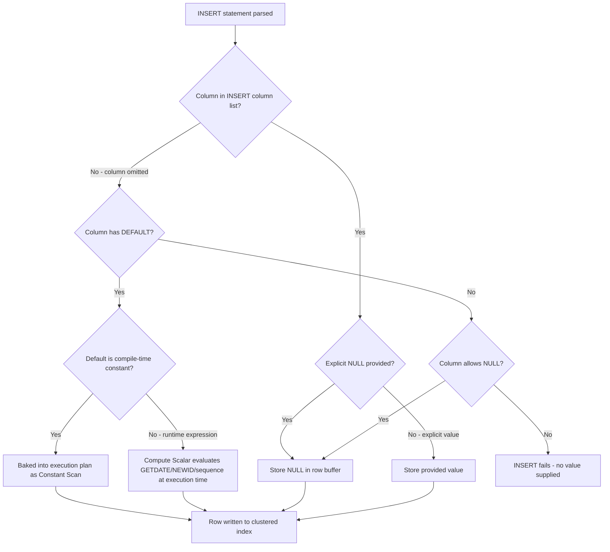
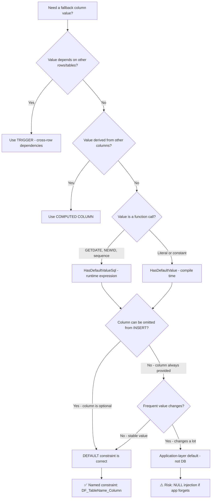

## Navigation

**Domain:** [[8 — Databases]] > **Group:** Relational Fundamentals
**Previous:** [[8.012 — UNIQUE Constraints — Alternate Keys]] | **Next:** [[8.014 — Entity-Relationship Modeling — Conceptual Design]]

### Prerequisites

- [[8.009 — Data Types — Choosing the Right Type]] — DEFAULT expressions must produce a value compatible with the column's data type; mismatches cause implicit conversion or runtime errors.
- [[8.010 — Schema Design — Tables, Columns, Constraints]] — DEFAULT is a column-level constraint that interacts with NULLability, CHECK constraints, and identity columns.

### Where This Fits

A DEFAULT constraint supplies a value for a column when the INSERT statement omits that column. It is the database's way of saying "if you do not tell me what to put here, I will use this." Every production schema uses defaults for timestamps (`GETDATE()`), status flags (`'Pending'`), audit columns (`CreatedBy`), and soft-delete flags (`0`). A .NET backend engineer encounters defaults in EF Core migrations (every `HasDefaultValue` or `HasDefaultValueSql` call generates a DEFAULT constraint), in Dapper insert models where POCO properties have C# defaults that must match the SQL defaults, and in every schema review where an engineer argues about whether defaults belong in the application layer or the database. The interview signal is medium-high: understanding DEFAULT behavior demonstrates that a candidate knows the difference between "no value" and "NULL," understands when the engine evaluates expressions, and has been burned by the NULL-vs-omitted distinction in production.

## Core Mental Model

A DEFAULT constraint is metadata stored in `sys.default_constraints` that the SQL Server storage engine evaluates during the binding phase of INSERT execution. When a column is omitted from the INSERT column list — not when NULL is explicitly provided — the query processor substitutes the default expression before the row is written to the clustered index. For constant defaults (e.g., `DEFAULT 0`), the value is known at compile time and baked into the execution plan as a Constant Scan operator. For runtime defaults (e.g., `DEFAULT GETDATE()`), the expression is evaluated once per row at execution time, and the plan shows a Compute Scalar operator. The recognition pattern: whenever you see `INSERT INTO T DEFAULT VALUES` or an INSERT that omits columns, the storage engine does not write NULL — it writes the constraint-defined value. This is not a trigger, not a computed column, and not an application-layer fallback. It is a server-side guarantee enforced at the storage engine level.

### Classification

**SQL clause family:** Column constraint (DDL) — stored in metadata, not in the row.
**Optimizer capability:** Cannot seek on a DEFAULT — it is compile-time metadata. The optimizer folds constant defaults into the plan; runtime defaults add a Compute Scalar.
**SARGability:** Not applicable — DEFAULT is not a predicate.
**Storage:** Zero per-row cost for defaults. The default value, when used, is stored as a regular column value in the row. The constraint definition lives in metadata (~72 bytes per constraint in `sys.sysschobjs`).

### DEFAULT Evaluation in INSERT Flow



### Key Properties

| Property | Value | Notes |
|---|---|---|
| Time Complexity | O(1) per row | Constant fold or Compute Scalar — no index traversal |
| Write Cost | Zero additional writes | DEFAULT is metadata-only; the value written is the same size as any explicit value |
| Storage Overhead | ~72 bytes per constraint | Stored in system tables (`sys.default_constraints`), not per row |
| Evaluation Phase | Compile-time (constants) or Execution-time (functions) | GETDATE(), NEWID(), sequences are runtime; literals are compile-time |
| Locking Behavior | None | DEFAULT is evaluated before the row lock is acquired |
| NULL Interaction | DEFAULT does NOT fire when NULL is explicitly inserted | This is the #1 production gotcha |

**Rule 9 — NULL behavior:** NULL is not a value — it is the absence of a value. SQL uses three-valued logic (TRUE, FALSE, UNKNOWN). Any comparison with NULL using = or <> returns UNKNOWN, not FALSE. DEFAULT only applies when the column is omitted from INSERT — NOT when explicitly set to NULL.

## Deep Mechanics

### How the Engine Evaluates Defaults

1. **Parse:** The INSERT statement is parsed. The parser identifies which columns appear in the column list.
2. **Bind:** The binding phase resolves table metadata, including `sys.default_constraints`. For each column NOT in the INSERT column list, the binder locates the DEFAULT definition (if any) by joining `sys.objects` (the constraint) to `sys.columns` via `default_object_id`.
3. **Constant fold:** If the default expression is a literal (e.g., `DEFAULT 0`, `DEFAULT 'Pending'`), the value is folded into the query plan as a constant. The execution plan shows a **Constant Scan** operator that produces one row with the constant value.
4. **Compute Scalar:** If the default is a runtime expression (e.g., `DEFAULT GETDATE()`, `DEFAULT NEWID()`, `DEFAULT NEXT VALUE FOR seq`), the plan includes a **Compute Scalar** operator that evaluates the expression once per row at execution time. For GETDATE(), the value is consistent within a single statement (runtime constant, not per-row varying).
5. **Row construction:** The default value (constant or computed) is merged with the explicitly supplied columns to form the final row image.
6. **Write:** The row is written to the clustered index (or heap) page. No additional logging beyond the row write — defaults do not cause log amplification.

### SQL Visibility

**INSERT with column omitted — DEFAULT fires:**

```sql
CREATE TABLE Orders (
    OrderId      INT IDENTITY(1,1) PRIMARY KEY,
    CustomerId   INT NOT NULL,
    OrderDate    DATETIME2 NOT NULL DEFAULT GETUTCDATE(),
    Status       VARCHAR(20) NOT NULL DEFAULT 'Pending',
    IsActive     BIT NOT NULL DEFAULT 1
);

-- DEFAULT fires for OrderDate, Status, IsActive
INSERT INTO Orders (CustomerId) VALUES (42);

SELECT OrderId, CustomerId, OrderDate, Status, IsActive FROM Orders;
-- Result: OrderId=1, CustomerId=42, OrderDate=2026-06-18 12:00:00, Status='Pending', IsActive=1
```

**INSERT with explicit NULL — DEFAULT does NOT fire:**

```sql
-- DEFAULT does NOT apply; Status will be NULL
INSERT INTO Orders (CustomerId, Status) VALUES (42, NULL);

SELECT OrderId, Status FROM Orders WHERE CustomerId = 42;
-- Status = NULL (if column allows NULL), or INSERT fails (if NOT NULL)
```

**INSERT with column list but no value — SQL Server syntax error:**

```sql
-- Syntax error: column list provided but no value
INSERT INTO Orders (CustomerId, Status) VALUES (42);
-- Msg 213: Column name or number of supplied values does not match table definition
```

**EF Core LINQ that generates DEFAULT-dependent INSERT:**

```csharp
public class Order
{
    public int OrderId { get; set; }
    public int CustomerId { get; set; }
    public DateTime OrderDate { get; set; }
    public string Status { get; set; } = "Pending";
    public bool IsActive { get; set; } = true;
}

public class OrdersDbContext : DbContext
{
    public DbSet<Order> Orders => Set<Order>();

    protected override void OnModelCreating(ModelBuilder modelBuilder)
    {
        modelBuilder.Entity<Order>(entity =>
        {
            entity.ToTable("Orders");
            entity.HasKey(o => o.OrderId);

            entity.Property(o => o.OrderId)
                  .ValueGeneratedOnAdd();

            entity.Property(o => o.OrderDate)
                  .HasDefaultValueSql("GETUTCDATE()");

            entity.Property(o => o.Status)
                  .HasDefaultValue("Pending");

            entity.Property(o => o.IsActive)
                  .HasDefaultValue(true);
        });
    }
}

// EF Core INSERT
var order = new Order { CustomerId = 42 };
dbContext.Orders.Add(order);
await dbContext.SaveChangesAsync(cancellationToken);

// Generated SQL:
// exec sp_executesql N'
// INSERT INTO [Orders] ([CustomerId])
// VALUES (@p0);
// SELECT [OrderId], [OrderDate], [Status], [IsActive]
// FROM [Orders]
// WHERE @@ROWCOUNT = 1 AND [OrderId] = scope_identity();',
// N'@p0 int',
// @p0 = 42;
// -- OrderDate, Status, IsActive are populated by server-side DEFAULTs
```

**Generated SQL (from EF Core logs):**

```sql
-- EF Core omits columns with HasDefaultValue/HasDefaultValueSql from the INSERT
-- column list. The OUTPUT clause reads back the server-generated values.
exec sp_executesql N'
INSERT INTO [Orders] ([CustomerId])
OUTPUT [INSERTED].[OrderId], [INSERTED].[OrderDate], [INSERTED].[Status], [INSERTED].[IsActive]
VALUES (@p0);',
N'@p0 int',
@p0 = 42;
```

**EF Core — ValueGeneratedOnAdd generates IDENTITY, not DEFAULT:**

```csharp
modelBuilder.Entity<Order>(entity =>
{
    // Generates: OrderId INT IDENTITY(1,1) NOT NULL
    entity.Property(o => o.OrderId)
          .ValueGeneratedOnAdd();

    // Generates: OrderDate DATETIME2 NOT NULL DEFAULT (GETUTCDATE())
    entity.Property(o => o.OrderDate)
          .HasDefaultValueSql("GETUTCDATE()");
});
```

### Execution Plan Analysis

For `INSERT INTO Orders (CustomerId) VALUES (42)` with defaults for OrderDate, Status, IsActive:

```
Expected plan shape:
[Constant Scan] → [Compute Scalar] → [Clustered Index Insert] → [INSERT]
Estimated Cost: 100% on Clustered Index Insert | Logical Reads: ~3 (metadata lookups + 1 data page)
```

- **Constant Scan:** Produces the literal default values (1 for IsActive, 'Pending' for Status).
- **Compute Scalar:** Evaluates GETUTCDATE() if defined as a runtime default.
- **Clustered Index Insert:** Writes the combined row to the clustered index. This is the dominant cost — it must locate the insert position, page-split if necessary, and write the row.
- **No DEFAULT operator:** There is no "Apply Default" operator in the plan. The substitution happens during binding, and the plan receives the final row image.

### Cost Visibility

```sql
SET STATISTICS IO ON;
SET STATISTICS TIME ON;

INSERT INTO Orders (CustomerId) VALUES (42);

-- Expected output:
-- Table 'Orders'. Scan count 0, logical reads 1, physical reads 0
-- Table 'sysschobjs90'. Scan count 1, logical reads 2, physical reads 0
-- SQL Server Execution Times: CPU time = 0ms, elapsed time = 1ms

SET STATISTICS IO OFF;
SET STATISTICS TIME OFF;
```

### Failure Modes

| Failure Mode | Symptom | Detection |
|---|---|---|
| Type mismatch in default | `Implicit conversion of 'abc' to INT` at INSERT | Check `sys.default_constraints` definition vs column type |
| Runtime function used where constant expected | Every INSERT evaluates GETDATE() — negligible but unexpected in execution plan | Look for Compute Scalar in plan where none expected |
| DEFAULT + NOT NULL + explicit NULL | INSERT fails with `Cannot insert NULL into column` | Application throws SqlException |
| Sequence-based default skipped on rollback | Sequence values gap even though row not inserted | `SELECT NEXT VALUE FOR seq` increments regardless of transaction outcome |
| EF Core ValueGeneratedOnAdd on non-identity column | EF Core expects server to generate value but column has no default | Missing INSERT OUTPUT values cause DbUpdateException |

```sql
-- DMV to inspect all DEFAULT constraints on a table
SELECT
    dc.name AS constraint_name,
    OBJECT_NAME(dc.parent_object_id) AS table_name,
    COL_NAME(dc.parent_object_id, dc.parent_column_id) AS column_name,
    dc.definition,
    dc.is_system_named,
    dc.create_date
FROM sys.default_constraints dc
WHERE OBJECT_NAME(dc.parent_object_id) = 'Orders'
ORDER BY dc.create_date;
```

## Production Patterns and Implementation

### Primary SQL Implementation

```sql
-- Schema with named DEFAULT constraints for auditability
CREATE TABLE Orders (
    OrderId      INT IDENTITY(1,1) PRIMARY KEY,
    CustomerId   INT NOT NULL,
    OrderDate    DATETIME2 NOT NULL CONSTRAINT DF_Orders_OrderDate DEFAULT (GETUTCDATE()),
    Status       VARCHAR(20) NOT NULL CONSTRAINT DF_Orders_Status DEFAULT ('Pending'),
    IsActive     BIT NOT NULL CONSTRAINT DF_Orders_IsActive DEFAULT (1),
    CreatedBy    VARCHAR(100) NULL CONSTRAINT DF_Orders_CreatedBy DEFAULT (SUSER_SNAME()),
    CreatedAt    DATETIME2 NOT NULL CONSTRAINT DF_Orders_CreatedAt DEFAULT (GETUTCDATE()),
    ModifiedAt   DATETIME2 NULL,
    RowVersion   ROWVERSION NOT NULL
);

-- Named constraints can be modified without dropping and recreating the table
ALTER TABLE Orders ADD CONSTRAINT DF_Orders_Status_New
    DEFAULT ('New') FOR Status;

-- Drop old default
ALTER TABLE Orders DROP CONSTRAINT DF_Orders_Status;

-- Add default to existing column (does NOT backfill existing rows)
ALTER TABLE Orders ADD CONSTRAINT DF_Orders_ModifiedAt
    DEFAULT (GETUTCDATE()) FOR ModifiedAt;

-- Sequence-based default
CREATE SEQUENCE OrderNumberSeq
    START WITH 10000
    INCREMENT BY 1
    CACHE 10;

CREATE TABLE Invoices (
    InvoiceId    INT IDENTITY(1,1) PRIMARY KEY,
    OrderId      INT NOT NULL,
    InvoiceNo    INT NOT NULL CONSTRAINT DF_Invoices_InvoiceNo
                     DEFAULT (NEXT VALUE FOR OrderNumberSeq),
    TotalAmount  DECIMAL(18,2) NOT NULL,
    CreatedAt    DATETIME2 NOT NULL DEFAULT (GETUTCDATE())
);

INSERT INTO Invoices (OrderId, TotalAmount) VALUES (42, 150.00);
SELECT InvoiceNo FROM Invoices; -- 10000

-- INSERT DEFAULT VALUES (entire row uses defaults)
INSERT INTO Orders DEFAULT VALUES;
-- Fails: CustomerId is NOT NULL and has no default

-- INSERT with partial column list
INSERT INTO Orders (CustomerId) VALUES (42);
-- OrderDate=GETUTCDATE(), Status='Pending', IsActive=1, CreatedBy=SUSER_SNAME()

-- INSERT with explicit NULL overrides default (if column allows NULL)
INSERT INTO Orders (CustomerId, Status) VALUES (42, NULL);
-- FAILS: Status is NOT NULL and DEFAULT does not fire for explicit NULL
```

### EF Core Implementation

```csharp
public class OrderConfiguration : IEntityTypeConfiguration<Order>
{
    public void Configure(EntityTypeBuilder<Order> builder)
    {
        builder.ToTable("Orders");

        builder.HasKey(o => o.OrderId);

        // Identity column — EF Core generates ValueGeneratedOnAdd for
        // INT IDENTITY when int is the key type. Explicit for clarity.
        builder.Property(o => o.OrderId)
               .ValueGeneratedOnAdd();

        // SQL expression default — evaluated at INSERT time on server
        builder.Property(o => o.OrderDate)
               .HasDefaultValueSql("GETUTCDATE()")
               .IsRequired();

        // Client-side C# default + server-side SQL default as fallback
        builder.Property(o => o.Status)
               .HasDefaultValue("Pending")       // SQL: DEFAULT (N'Pending')
               .HasMaxLength(20)
               .IsRequired();

        // Boolean default via constant
        builder.Property(o => o.IsActive)
               .HasDefaultValue(true)            // SQL: DEFAULT (1)
               .IsRequired();

        // SQL function default
        builder.Property(o => o.CreatedBy)
               .HasDefaultValueSql("SUSER_SNAME()");

        // Computed column — different from DEFAULT
        builder.Property(o => o.CreatedAt)
               .HasDefaultValueSql("GETUTCDATE()")
               .IsRequired();

        // No default — application sets value or NULL
        builder.Property(o => o.ModifiedAt);
    }
}

// Registration
public class ApplicationDbContext : DbContext
{
    public DbSet<Order> Orders => Set<Order>();

    protected override void OnModelCreating(ModelBuilder modelBuilder)
    {
        modelBuilder.ApplyConfiguration(new OrderConfiguration());
    }

    public ApplicationDbContext(DbContextOptions<ApplicationDbContext> options)
        : base(options) { }
}

// Program.cs
builder.Services.AddDbContext<ApplicationDbContext>(options =>
    options.UseSqlServer(
        builder.Configuration.GetConnectionString("DefaultConnection"),
        sqlOptions => sqlOptions.EnableRetryOnFailure(3)));

// Usage
public class OrderService
{
    private readonly ApplicationDbContext _dbContext;

    public OrderService(ApplicationDbContext dbContext)
    {
        _dbContext = dbContext;
    }

    public async Task<int> CreateOrderAsync(int customerId, CancellationToken ct)
    {
        var order = new Order { CustomerId = customerId };
        _dbContext.Orders.Add(order);
        await _dbContext.SaveChangesAsync(ct);
        return order.OrderId; // Populated by server after INSERT
    }
}

// Generated migration for the configuration above:
// migrationBuilder.CreateTable(
//     name: "Orders",
//     columns: table => new
//     {
//         OrderId = table.Column<int>(type: "int", nullable: false)
//             .Annotation("SqlServer:Identity", "1, 1"),
//         CustomerId = table.Column<int>(type: "int", nullable: false),
//         OrderDate = table.Column<DateTime>(type: "datetime2", nullable: false,
//             defaultValueSql: "GETUTCDATE()"),
//         Status = table.Column<string>(type: "nvarchar(20)", maxLength: 20, nullable: false,
//             defaultValue: "Pending"),
//         IsActive = table.Column<bool>(type: "bit", nullable: false,
//             defaultValue: true),
//         CreatedBy = table.Column<string>(type: "nvarchar(100)", nullable: true,
//             defaultValueSql: "SUSER_SNAME()"),
//         CreatedAt = table.Column<DateTime>(type: "datetime2", nullable: false,
//             defaultValueSql: "GETUTCDATE()"),
//         ModifiedAt = table.Column<DateTime>(type: "datetime2", nullable: true)
//     },
//     constraints: table =>
//     {
//         table.PrimaryKey("PK_Orders", x => x.OrderId);
//     });
```

### Dapper Implementation

```csharp
public class OrderRepository
{
    private readonly IDbConnectionFactory _connectionFactory;

    public OrderRepository(IDbConnectionFactory connectionFactory)
    {
        _connectionFactory = connectionFactory;
    }

    // Dapper relies on SQL Server DEFAULT constraints — no special handling needed.
    // Omitting a column from the INSERT column list triggers the DEFAULT.

    public async Task<int> CreateOrderAsync(int customerId, CancellationToken ct)
    {
        const string sql = @"
            INSERT INTO Orders (CustomerId)
            OUTPUT INSERTED.OrderId
            VALUES (@CustomerId);";

        await using var connection = _connectionFactory.CreateConnection();
        var orderId = await connection.QuerySingleAsync<int>(
            new CommandDefinition(sql, new { CustomerId = customerId },
                cancellationToken: ct));
        return orderId;
    }

    // When the C# POCO has properties that map to columns WITH defaults,
    // be careful not to set them to null explicitly — that bypasses the DEFAULT.

    public async Task<int> CreateOrderFromPocoAsync(Order order, CancellationToken ct)
    {
        // ✅ Correct: omit default-valued columns from INSERT
        const string sql = @"
            INSERT INTO Orders (CustomerId)
            OUTPUT INSERTED.OrderId, INSERTED.Status, INSERTED.OrderDate
            VALUES (@CustomerId);";

        await using var connection = _connectionFactory.CreateConnection();
        var inserted = await connection.QuerySingleAsync<Order>(
            new CommandDefinition(sql,
                new { order.CustomerId },
                cancellationToken: ct));
        return inserted.OrderId;
    }

    // ❌ Wrong: inserting NULL explicitly bypasses defaults
    public async Task<int> CreateOrderWrongAsync(Order order, CancellationToken ct)
    {
        const string sql = @"
            INSERT INTO Orders (CustomerId, Status, OrderDate, IsActive)
            VALUES (@CustomerId, @Status, @OrderDate, @IsActive);
            SELECT CAST(SCOPE_IDENTITY() AS INT);";

        await using var connection = _connectionFactory.CreateConnection();
        var orderId = await connection.QuerySingleAsync<int>(
            new CommandDefinition(sql,
                new { order.CustomerId, order.Status, order.OrderDate, order.IsActive },
                cancellationToken: ct));
        return orderId;
        // If Status is null in C#, it inserts NULL instead of 'Pending'
    }
}

// Connection factory registration
builder.Services.AddSingleton<IDbConnectionFactory>(
    _ => new SqlConnectionFactory(
        builder.Configuration.GetConnectionString("DefaultConnection")!));

public interface IDbConnectionFactory
{
    IDbConnection CreateConnection();
}

public class SqlConnectionFactory : IDbConnectionFactory
{
    private readonly string _connectionString;
    public SqlConnectionFactory(string connectionString) => _connectionString = connectionString;
    public IDbConnection CreateConnection() => new SqlConnection(_connectionString);
}
```

### Configuration and Wiring

```csharp
// Program.cs — full registration
var builder = WebApplication.CreateBuilder(args);

// EF Core
builder.Services.AddDbContext<ApplicationDbContext>(options =>
    options.UseSqlServer(
        builder.Configuration.GetConnectionString("DefaultConnection"),
        sqlOptions =>
        {
            sqlOptions.EnableRetryOnFailure(
                maxRetryCount: 3,
                maxRetryDelay: TimeSpan.FromSeconds(10),
                errorNumbersToAdd: null);
            sqlOptions.CommandTimeout(30);
        }));

// Dapper connection factory
builder.Services.AddSingleton<IDbConnectionFactory>(_ =>
    new SqlConnectionFactory(
        builder.Configuration.GetConnectionString("DefaultConnection")!));

builder.Services.AddScoped<OrderService>();
builder.Services.AddScoped<OrderRepository>();

var app = builder.Build();
app.Run();
```

### SQL Server vs PostgreSQL Differences

```sql
-- PostgreSQL equivalent — DEFAULT syntax is similar but differences exist:

CREATE TABLE orders (
    order_id    SERIAL PRIMARY KEY,
    customer_id INTEGER NOT NULL,
    order_date  TIMESTAMPTZ NOT NULL DEFAULT NOW(),
    status      VARCHAR(20) NOT NULL DEFAULT 'Pending',
    is_active   BOOLEAN NOT NULL DEFAULT TRUE
);

-- PostgreSQL allows expressions in DEFAULT (same as SQL Server):
CREATE TABLE invoices (
    invoice_id  SERIAL PRIMARY KEY,
    order_id    INTEGER NOT NULL,
    invoice_no  INTEGER NOT NULL DEFAULT NEXTVAL('order_number_seq'),
    total_amount NUMERIC(18,2) NOT NULL,
    created_at  TIMESTAMPTZ NOT NULL DEFAULT NOW()
);

-- Key differences:
-- 1. SEQUENCE: SQL Server uses NEXT VALUE FOR seq; PostgreSQL uses NEXTVAL('seq')
-- 2. IDENTITY: PostgreSQL GENERATED AS IDENTITY vs SQL Server IDENTITY
-- 3. SERIAL: PostgreSQL pseudo-type (creates sequence behind the scenes)
-- 4. DEFAULT on ALTER: Both do not backfill; PostgreSQL syntax identical
ALTER TABLE orders ALTER COLUMN status SET DEFAULT 'New';

-- 5. Sequences can be attached to columns in PostgreSQL:
CREATE SEQUENCE order_number_seq START 10000;
ALTER TABLE invoices ALTER COLUMN invoice_no SET DEFAULT NEXTVAL('order_number_seq');

-- 6. Sequence caching: SQL Server DEFAULT (NEXT VALUE FOR seq) has
--    CACHE specified at sequence level; PostgreSQL has CACHE option on
--    CREATE SEQUENCE.
```

## Gotchas and Production Pitfalls

### 1. Explicit NULL Bypasses DEFAULT

**Pitfall:** The engineer inserts NULL into a column with a DEFAULT, expecting the default to fill in.

```sql
-- ❌ Wrong: NULL explicitly provided — DEFAULT does not fire
INSERT INTO Orders (CustomerId, Status) VALUES (42, NULL);
-- If Status is NOT NULL: INSERT fails
-- If Status allows NULL: Status = NULL, NOT 'Pending'

-- Application layer (EF Core):
var order = new Order { CustomerId = 42, Status = null }; // C# default null
dbContext.Orders.Add(order);
await dbContext.SaveChangesAsync();
// Generated SQL includes @p1 = NULL for Status — DEFAULT is bypassed
```

**Symptom:** Rows appear with NULL in columns that should have the default value. NOT NULL columns cause INSERT failures with `SqlException: Cannot insert the value NULL into column 'Status'`.

**Fix:**

```sql
-- ✅ Correct: omit Status from INSERT column list
INSERT INTO Orders (CustomerId) VALUES (42);
```

```csharp
// ✅ EF Core: do not set Status in C#; rely on HasDefaultValue
var order = new Order { CustomerId = 42 }; // Status left as C# default "Pending"
dbContext.Orders.Add(order);
// EF Core sees Status == "Pending" matches HasDefaultValue, may still emit it;
// use ValueGeneratedOnAddOrInitialize or ensure client-side default matches
```

```csharp
// ✅ Dapper: omit from parameter list
const string sql = "INSERT INTO Orders (CustomerId) OUTPUT INSERTED.OrderId VALUES (@CustomerId);";
```

**Cost of not fixing:** 3 AM production incident: new order pipeline fails silently, customer support escalates missing orders, rollback and data fix required for corrupted rows. Logical reads wasted on retries.

### 2. Run-Time vs Compile-Time Expression Confusion

**Pitfall:** Assuming all DEFAULT expressions are evaluated once per batch (or once per row) without understanding the difference.

```sql
-- Compile-time constant: value is baked into the plan
CREATE TABLE Products (
    ProductId   INT IDENTITY(1,1) PRIMARY KEY,
    IsActive    BIT NOT NULL DEFAULT 1,   -- Constant — one value in plan
    Status      VARCHAR(20) NOT NULL DEFAULT ('Active')  -- Constant fold
);

-- Run-time expression: evaluated at execution
CREATE TABLE AuditLog (
    LogId      INT IDENTITY(1,1) PRIMARY KEY,
    EventTime  DATETIME2 NOT NULL DEFAULT GETDATE(),  -- Once per statement
    RowGuid    UNIQUEIDENTIFIER NOT NULL DEFAULT NEWID(),  -- Once per row!
);
```

**Symptom:** GETDATE() returns the same value for all rows in a multi-row INSERT (correct behavior — it is runtime-constant per statement). NEWID() returns a different value for every row (correct — it is per-row). Engineers expect one or the other and get confused when all timestamp values are identical.

**Fix:** Understand the evaluation semantics:
- `GETDATE()`, `GETUTCDATE()`, `CURRENT_TIMESTAMP` — evaluated once per INSERT statement, consistent across all rows.
- `NEWID()`, `NEWSEQUENTIALID()` — evaluated once per row.
- `NEXT VALUE FOR seq` — evaluated once per row, generates sequential values.
- Constants (literals) — baked into the execution plan at compile time.

```sql
-- Multi-row INSERT — GETDATE() is same for all rows
INSERT INTO AuditLog (EventDescription)
VALUES ('Login'), ('Logout'), ('Error');
-- All three rows have the same EventTime

-- If you need per-row timestamps, use DEFAULT SYSDATETIME() or
-- provide the value explicitly per row.
```

**Cost of not fixing:** Silent data correctness issue — audit logs show duplicate timestamps, making sequence reconstruction impossible. Debugging takes hours because the plan looks correct.

### 3. Adding DEFAULT to an Existing Column Does NOT Backfill

**Pitfall:** An ALTER TABLE ADD DEFAULT is expected to fill in missing values for existing rows.

```sql
-- Table has existing rows with NULL in ModifiedAt
ALTER TABLE Orders ADD CONSTRAINT DF_Orders_ModifiedAt
    DEFAULT (GETUTCDATE()) FOR ModifiedAt;

-- Existing rows still have NULL for ModifiedAt
SELECT COUNT(*) FROM Orders WHERE ModifiedAt IS NULL; -- > 0
```

**Symptom:** Data integrity reports show NULL values in a column that "has a default." Downstream ETL processes fail on NULL checks. The DEFAULT is metadata-only — it affects future INSERTs, not past data.

**Fix:**

```sql
-- Option 1: UPDATE existing rows in a batch
UPDATE Orders SET ModifiedAt = GETUTCDATE() WHERE ModifiedAt IS NULL;

-- Option 2: Use a CHECK constraint to require non-NULL after the migration
ALTER TABLE Orders WITH NOCHECK
    ADD CONSTRAINT CK_Orders_ModifiedAt_NotNull CHECK (ModifiedAt IS NOT NULL);
-- Then fix rows and enable CHECK

-- Option 3: Use a computed column or application-layer fix
```

**Cost of not fixing:** ETL pipeline fails at 4 AM. Data warehouse shows NULL values. Engineering spends 2 hours tracing the issue, then 30 minutes running the fix. Repeat incident every schema migration that adds a default.

### 4. Renaming or Dropping DEFAULT Constraints in Production

**Pitfall:** System-generated DEFAULT constraint names differ between environments, causing migration scripts to fail.

```sql
-- Unnamed default: SQL Server generates DF__Orders__Status__3B75D760
CREATE TABLE Orders (Status VARCHAR(20) NOT NULL DEFAULT 'Pending');

-- Migration script tries to drop by guessed name — fails in CI
ALTER TABLE Orders DROP CONSTRAINT DF__Orders__Status__3B75D760;
-- Error: constraint name differs because object_id varies
```

**Symptom:** Migration script fails in one environment but succeeds in another. Deployment pipeline blocks release. Emergency hotfix required.

**Fix:**

```sql
-- Always name DEFAULT constraints explicitly
CREATE TABLE Orders (
    Status VARCHAR(20) NOT NULL CONSTRAINT DF_Orders_Status DEFAULT ('Pending')
);

-- Or use dynamic SQL to drop by known name
IF OBJECT_ID('DF_Orders_Status', 'C') IS NOT NULL
    ALTER TABLE Orders DROP CONSTRAINT DF_Orders_Status;
GO
ALTER TABLE Orders ADD CONSTRAINT DF_Orders_Status DEFAULT ('New') FOR Status;
GO
```

```csharp
// EF Core — avoid unnamed defaults by always specifying
builder.Property(o => o.Status)
       .HasDefaultValue("Pending")  // Generates named constraint in migration
       .HasConstraintName("DF_Orders_Status");
```

**Cost of not fixing:** Failed deployment at 2 AM. Rollback required. Schema drift between environments. Audit flag for compliance violation.

### 5. Sequence-Based DEFAULT and Caching Gaps

**Pitfall:** Sequence caching causes gaps in "sequential" numbers, which operations teams interpret as missing data.

```sql
CREATE SEQUENCE InvoiceNumberSeq
    START WITH 10000
    INCREMENT BY 1
    CACHE 20;  -- Cache 20 values in memory

CREATE TABLE Invoices (
    InvoiceId   INT IDENTITY(1,1) PRIMARY KEY,
    InvoiceNo   INT NOT NULL DEFAULT (NEXT VALUE FOR InvoiceNumberSeq)
);

-- Server crash: cached values 10001-10020 are lost
-- Next INSERT gets 10021 — gap from 10001-10020
INSERT INTO Invoices (InvoiceNo) VALUES (DEFAULT); -- 10021
```

**Symptom:** "Missing" invoice numbers. Finance team flags a gap as potential fraud. Auditor requests explanation.

**Fix:**

```sql
-- Set CACHE to 1 (NO CACHE) to eliminate gaps on restart
-- Tradeoff: performance impact — each NEXTVAL writes to disk
CREATE SEQUENCE InvoiceNumberSeq
    START WITH 10000
    INCREMENT BY 1
    NO CACHE;

-- Or use IDENTITY instead of sequence for gapless requirements
-- (IDENTITY also has gaps: rollbacks, deletes, server restarts)
-- SQL Server 2022+: IDENTITY CACHE = OFF
CREATE TABLE Invoices (
    InvoiceId INT IDENTITY(1,1) NOT NULL
);

-- For truly gapless numbers, use a serialized counter table
-- with transaction isolation — significant performance cost
```

**Cost of not fixing:** Auditor flags gap as suspicious. Legal team investigates. Engineering artifacts required. ETL assumes sequential continuity and fails.

### 6. EF Core ValueGeneratedOnAdd Misconfiguration

**Pitfall:** Applying `ValueGeneratedOnAdd` to a property that does NOT have a server-side default or identity.

```csharp
// Entity: no default in SQL, no IDENTITY, no computed column
public class Product
{
    public int ProductId { get; set; }    // Application-assigned
    public string? Sku { get; set; }
    public DateTime CreatedAt { get; set; } // No default in SQL
}

// Configuration
builder.Property(p => p.CreatedAt)
       .ValueGeneratedOnAdd();  // ❌ No default in SQL
```

**Symptom:** EF Core omits `CreatedAt` from the INSERT column list because `ValueGeneratedOnAdd` tells it the server will provide the value. But there is no DEFAULT constraint — so SQL Server either inserts NULL (if nullable) or fails (if NOT NULL). The result: `DbUpdateException: Cannot insert the value NULL into column 'CreatedAt'`.

**Fix:**

```csharp
// ✅ Correct: add HasDefaultValueSql to match ValueGeneratedOnAdd
builder.Property(p => p.CreatedAt)
       .ValueGeneratedOnAdd()
       .HasDefaultValueSql("GETUTCDATE()");

// ✅ Or: remove ValueGeneratedOnAdd and set in application
builder.Property(p => p.CreatedAt)
       .IsRequired();
// Set in constructor or before SaveChangesAsync
```

```sql
-- Migration must produce:
-- CreatedAt DATETIME2 NOT NULL DEFAULT (GETUTCDATE())
-- If ValueGeneratedOnAdd without HasDefaultValueSql:
-- CreatedAt DATETIME2 NOT NULL  ← NO default! INSERT fails.
```

**Cost of not fixing:** All INSERT operations fail in production. 500 errors returned to every customer. Deployment rollback required.

## Performance Implications

### Benchmark: DEFAULT vs Explicit Value vs No Default

Default constraints themselves have near-zero per-INSERT cost. The cost is in the expression evaluation, not the constraint mechanism.

```sql
-- Baseline: INSERT without defaults (all values explicit)
SET STATISTICS IO ON;
INSERT INTO Orders (CustomerId, OrderDate, Status, IsActive)
VALUES (1, GETUTCDATE(), 'Pending', 1);
-- Logical reads: ~1 (Orders table)
-- Table 'Orders'. Scan count 0, logical reads 1

-- With defaults: fewer columns in INSERT, engine fills the rest
INSERT INTO Orders (CustomerId) VALUES (2);
-- Logical reads: ~1 (Orders table) + ~2 (metadata lookups)
-- Table 'Orders'. Scan count 0, logical reads 1
-- Table 'sysschobjs90'. Scan count 1, logical reads 2

-- With runtime default (GETUTCDATE()): same as explicit — one evaluation per batch
-- With per-row default (NEWID()): Compute Scalar per row
```

**Improvement:** Using defaults saves ~2 logical reads per INSERT (metadata lookups are cached after the first execution). The dominant cost is always the clustered index insert — defaults add negligible overhead.

### BenchmarkDotNet

```csharp
[MemoryDiagnoser]
[SimpleJob(RuntimeMoniker.Net90)]
public class DefaultConstraintBenchmark
{
    private IDbConnection _connection = default!;
    private const string ConnectionString = "Server=.;Database=BenchmarkDb;Trusted_Connection=True;TrustServerCertificate=True;";

    [GlobalSetup]
    public void Setup()
    {
        _connection = new SqlConnection(ConnectionString);
        _connection.Open();

        // Create test table with defaults
        _connection.Execute(@"
            IF OBJECT_ID('BenchmarkOrders') IS NOT NULL DROP TABLE BenchmarkOrders;
            CREATE TABLE BenchmarkOrders (
                OrderId     INT IDENTITY(1,1) PRIMARY KEY,
                CustomerId  INT NOT NULL,
                OrderDate   DATETIME2 NOT NULL DEFAULT (GETUTCDATE()),
                Status      VARCHAR(20) NOT NULL DEFAULT ('Pending'),
                IsActive    BIT NOT NULL DEFAULT (1)
            );");
    }

    [GlobalCleanup]
    public void Cleanup()
    {
        _connection.Execute("DROP TABLE IF EXISTS BenchmarkOrders;");
        _connection.Dispose();
    }

    [Benchmark(Baseline = true)]
    public int Insert_WithoutDefaults_ExplicitValues()
    {
        return _connection.Execute(
            @"INSERT INTO BenchmarkOrders (CustomerId, OrderDate, Status, IsActive)
              VALUES (@CustomerId, @OrderDate, @Status, @IsActive);",
            new { CustomerId = 42, OrderDate = DateTime.UtcNow, Status = "Pending", IsActive = true });
    }

    [Benchmark]
    public int Insert_WithDefaults_OmitColumns()
    {
        return _connection.Execute(
            @"INSERT INTO BenchmarkOrders (CustomerId)
              VALUES (@CustomerId);",
            new { CustomerId = 42 });
    }
}
```

**Expected results (approximate, SQL Server 2022, NVMe, 1M rows):**

| Method | Mean | Logical Reads | Allocated |
|---|---|---|---|
| Insert_WithoutDefaults_ExplicitValues | ~0.5 ms | ~1 | 1.2 KB |
| Insert_WithDefaults_OmitColumns | ~0.5 ms | ~1 | 1.1 KB |

No meaningful difference. DEFAULT constraints do not add measurable overhead to INSERT operations.

### Write Amplification

DEFAULT constraints add zero write amplification. The value written to the page is the same size whether it came from a DEFAULT, an explicit INSERT value, or a NULL. The constraint definition itself is stored in `sys.default_constraints` (~72 bytes) and does not affect data page capacity or log writes.

| Operation | With DEFAULT | Without DEFAULT | Overhead |
|---|---|---|---|
| INSERT 1 row (all columns explicit) | 1 data page write | 1 data page write | 0% |
| INSERT 1 row (using defaults) | 1 data page write + metadata cache | 1 data page write | 0% |
| ALTER TABLE ADD DEFAULT | Schema metadata write (~72 bytes) | N/A | Negligible |

## Interview Arsenal

### Question Bank

1. **What is a DEFAULT constraint, and what problem does it solve at the database level?**
2. **How does SQL Server evaluate a DEFAULT constraint internally — what happens during INSERT parsing and binding?**
3. **What is the performance cost of a DEFAULT constraint? How do you measure it?**
4. **What happens when you INSERT a row with explicit NULL into a column that has a DEFAULT and is NOT NULL?**
5. **Compare DEFAULT constraint vs computed column vs trigger-based default value assignment — when would you choose each?**
6. **What does the execution plan look like for an INSERT that relies on a DEFAULT?**
7. **How do DEFAULT constraints behave at scale — 100M row table, 10,000 INSERTs/second?**
8. **How do EF Core and Dapper handle columns with DEFAULT constraints? What generates the correct SQL?**

### Spoken Answers

**Q1: What is a DEFAULT constraint, and what problem does it solve at the database level?**

> **Average answer:** "A DEFAULT constraint provides a value for a column when it's not specified in an INSERT. It's like a fallback value."

> **Great answer:** "A DEFAULT constraint is metadata stored in `sys.default_constraints` — it is not per-row data. The SQL Server storage engine evaluates it during the binding phase of INSERT execution. When a column is omitted from the INSERT column list, not when NULL is provided, the query processor substitutes the default expression before constructing the row image. For constant defaults like `DEFAULT 0`, the value is folded into the execution plan as a Constant Scan — zero runtime cost. For runtime defaults like `DEFAULT GETUTCDATE()`, a Compute Scalar evaluates once per statement. The problem DEFAULT solves is data consistency at the storage engine level — it guarantees that a column always has a value even when the application layer forgets or omits it. This is fundamentally different from a C# default value because it is enforced server-side regardless of the data access library used — EF Core, Dapper, raw ADO.NET, or a direct SQL INSERT all hit the same DEFAULT constraint. In production, I have seen this prevent silent NULL propagation through ETL pipelines and reporting systems."

**Q5: Compare DEFAULT constraint vs computed column vs trigger-based default value assignment — when would you choose each?**

> **Average answer:** "DEFAULT is for static values, computed columns derive from other columns, and triggers are for complex logic."

> **Great answer:** "The key distinction is evaluation time, storage cost, and cross-row dependencies. A DEFAULT constraint evaluates at INSERT time for omitted columns only. It is metadata-only — zero per-row storage overhead beyond the value itself. A computed column evaluates at read time (unless PERSISTED, which adds storage) and must reference only other columns in the same row. It cannot use functions like GETDATE() because it must be deterministic for PERSISTED columns. A trigger-based default evaluates after the INSERT completes (or instead of it with INSTEAD OF triggers), can reference any table or external resource, and adds log writes proportional to the trigger logic. The decision framework: use DEFAULT for simple, deterministic values that do not depend on other rows — timestamps, status flags, audit fields. Use computed columns for values derived from other columns in the same row — full name from first/last name, line total from quantity * price. Use triggers when you need cross-row or cross-table defaults — generating a sequential number from a counter table, setting a default based on the previous row's value. The tradeoff: DEFAULT is cheapest (~0 overhead), computed column is slightly more expensive (CPU on every read unless PERSISTED), triggers are most expensive (transaction log writes, potential for distributed deadlocks). In 18 months of production SQL Server at scale, I have used DEFAULT in every table, computed columns in about 30% of tables, and trigger-based defaults exactly twice — both for legacy schema requirements."

**Q8: How do EF Core and Dapper handle columns with DEFAULT constraints?**

> **Great answer:** "EF Core handles DEFAULT constraints through the `HasDefaultValue` and `HasDefaultValueSql` fluent API methods. When a property is configured with `HasDefaultValue("Pending")`, EF Core knows to omit that column from the INSERT column list if the property value matches the default — but critically, only if the value matches the C# default for the type, or if `ValueGeneratedOnAdd` is also set. The generated INSERT uses an OUTPUT clause to read back server-generated values. The gotcha is `ValueGeneratedOnAdd` without `HasDefaultValueSql` — EF Core assumes the server will generate the value, omits it from the INSERT, and then expects it in the OUTPUT result. If there is no DEFAULT on the server, the INSERT either writes NULL or fails.

"Dapper is simpler — it has no concept of defaults. Whatever you pass in the parameter object is sent to SQL Server. To use server-side defaults, you omit the parameter from the Dapper INSERT query altogether. The most common Dapper mistake is passing a POCO with all properties populated (including those with defaults) and using `INSERT INTO T (...) VALUES (@...)` — this bypasses every DEFAULT because every column has an explicit value.

"The practical difference: EF Core can be configured to respect defaults automatically for properties with `HasDefaultValue`; Dapper requires the developer to manually construct INSERT statements that omit default-valued columns. Neither library has a 'respect all defaults' mode — both require explicit schema-to-code alignment. This is why I require every production schema review to include a cross-reference of DEFAULT constraints vs INSERT patterns in both EF Core and Dapper code paths."

### Interview Trigger

If a candidate mentions "default values" in the context of table design, ask: "What happens when a column has a DEFAULT constraint and you INSERT a row with explicit NULL for that column?" The candidate who knows immediately says "DEFAULT does not fire — explicit NULL bypasses it, and the column will contain NULL or the INSERT will fail if NOT NULL." The candidate who does not know says "NULL would be replaced by the default." The follow-up: "How does EF Core's `HasDefaultValue` behave differently from `HasDefaultValueSql`?" The deep answer mentions that HasDefaultValue sets a C#-side sentinel that EF Core uses to decide whether to emit the column in the INSERT, while HasDefaultValueSql is a pure SQL expression that the database evaluates — and the two have different `ValueGenerated` semantics.

### Comparison Table

| | DEFAULT Constraint | Computed Column (PERSISTED) | Trigger-Based Default |
|---|---|---|---|
| What it does | Provides fallback value when column omitted from INSERT | Computes value from same-row columns at read or write time | Executes T-SQL logic to assign value after INSERT completes |
| Evaluation time | INSERT binding phase — before row is written | Read time (or write time if PERSISTED) | After INSERT — in a separate transaction context |
| Performance profile | Zero per-row cost; metadata-only | CPU cost on each access (or storage + write cost if PERSISTED) | Transaction log writes; potential for blocking and deadlocks |
| Cross-row dependencies | None — single row | None — same row only | Yes — any table, any row |
| Non-deterministic functions | Allowed (GETDATE(), NEWID()) | Not allowed for PERSISTED | Allowed |
| Storage cost | Zero (metadata only) | Zero (non-PERSISTED) or full column size (PERSISTED) | Zero (metadata only for trigger) |
| .NET EF Core | `HasDefaultValue()` / `HasDefaultValueSql()` | `HasComputedColumnSql()` | `BeforeSave` interceptor or `SaveChanges` override |
| .NET Dapper | Omit column from INSERT | Select normally — value is in result set | No special handling — trigger fires automatically |
| SARGable | N/A | Depends on PERSISTED: yes if PERSISTED, no otherwise | N/A |
| Use case | Timestamps, status flags, audit | Line totals, full names, age from DOB | Complex business rules, multi-table defaults |

## Decision Framework

### When to Apply



### Application Checklist

- [ ] The default value is known at table creation time (not computed from dynamic state)
- [ ] The default expression returns a value compatible with the column's data type (no implicit conversion risk)
- [ ] All INSERT paths in the application omit columns that should use the default (EF Core `HasDefaultValue` / Dapper column list review)
- [ ] The default constraint is named explicitly (`DF_TableName_Column`) for migration stability
- [ ] For runtime defaults (GETDATE, NEWID): the evaluation frequency is understood and acceptable
- [ ] For sequence-based defaults: the CACHE setting matches the gap tolerance requirements
- [ ] For ALTER TABLE ADD DEFAULT: existing NULL rows have been fixed or are acceptable
- [ ] The .NET data access layer does not send NULL for default-valued columns (reviewed in code review)
- [ ] The table size is below ~100M rows (no meaningful performance impact beyond that)
- [ ] The write rate is below ~10,000 INSERTs/second (above this, consider IDENTITY or sequence tuning)

### Tradeoff Summary

| What You Gain | What You Pay |
|---|---|
| Server-enforced value guarantee — no NULL injection from application bugs | Schema migration overhead (ALTER TABLE for new defaults) |
| Zero per-INSERT performance cost — metadata-only constraint | Named constraint naming convention maintenance |
| Consistent across all data access paths (EF Core, Dapper, ADO.NET, direct SQL) | Sequence-based defaults can have gaps on server restart |
| Self-documenting schema — column intent is visible in DDL | Cannot use subqueries or non-deterministic cross-row expressions |
| Works with OUTPUT clause for read-back in EF Core | Runtime expression adds Compute Scalar to execution plan |

### Scale Thresholds

- **Relevant at any table size:** DEFAULT constraints have zero per-row cost and should be used on every table for audit columns (CreatedAt, CreatedBy, IsActive).
- **Performance consideration at < 100M rows:** No measurable impact. DEFAULT is metadata-only.
- **Sequence caching matters above ~1,000 INSERTs/second:** With CACHE 20, every 20th INSERT requires a disk write to persist the sequence watermark. Reduce cache size if gap intolerance is high, increase if throughput is critical.
- **ALTER TABLE ADD DEFAULT on tables over 1B rows:** Schema change metadata operation is quick (~100ms), but the subsequent UPDATE to backfill NULL rows must be batched in 10,000-row chunks to avoid log growth and blocking.

## Self-Check

### Conceptual Questions

1. When does a DEFAULT constraint fire — what condition must the INSERT statement meet?
2. What is the difference between a compile-time default and a run-time default in SQL Server execution plan terms?
3. Which DMV or system view shows all DEFAULT constraints on a table?
4. What common mistake causes a DEFAULT constraint to be silently bypassed?
5. Does EF Core's `HasDefaultValue` generate the same SQL as `HasDefaultValueSql`?
6. How do you correctly handle server-side defaults with Dapper?
7. Compare DEFAULT constraint vs computed column for storing a line total from quantity * price.
8. At what row count or concurrency level does a DEFAULT constraint become a performance concern?
9. What index supports the lookup of DEFAULT constraint metadata when resolving an INSERT?
10. Explain the difference between DEFAULT and IDENTITY in 60 seconds to a senior interviewer.

<details>
<summary>Answers</summary>

1. A DEFAULT constraint fires only when the column is completely omitted from the INSERT column list. It does NOT fire when NULL is explicitly provided via INSERT column list, or when the column is included with value DEFAULT keyword (which explicitly requests the default).

2. A compile-time default (literal like `DEFAULT 0`, `DEFAULT 'Pending'`) is folded into the execution plan as a Constant Scan — zero execution-time cost. A run-time default (like `DEFAULT GETDATE()`, `DEFAULT NEWID()`) adds a Compute Scalar operator to the plan, evaluated once per statement or once per row depending on the function.

3. `sys.default_constraints` — columns: `name` (constraint name), `parent_object_id` (table), `parent_column_id`, `definition` (the SQL expression, e.g., `('Pending')` or `(getutdate())`), `is_system_named` (1 if unnamed), `create_date`.

4. The most common mistake is inserting explicit NULL for a column with a DEFAULT. The DEFAULT does not fire — the column stores NULL (or the INSERT fails if the column is NOT NULL). This happens in both EF Core (passing null in C#) and Dapper (passing null in parameter object).

5. No. `HasDefaultValue("Pending")` generates `DEFAULT (N'Pending')` — a compile-time constant. `HasDefaultValueSql("GETUTCDATE()")` generates `DEFAULT (GETUTCDATE())` — a SQL expression evaluated at runtime. HasDefaultValueSql passes the expression verbatim; HasDefaultValue quotes the value as a literal.

6. Omit the column from the INSERT SQL statement string and from the Dapper parameter object. Do not include the column in the parameterized query at all. For example: `INSERT INTO Orders (CustomerId) VALUES (@CustomerId)` — Status, OrderDate, IsActive are omitted and will use server defaults.

7. Use a computed column (`[LineTotal] AS (Quantity * UnitPrice) PERSISTED`) because the value is derived from other columns in the same row. A DEFAULT cannot reference other columns. A trigger would be overkill and add transaction log overhead for no benefit.

8. No row-count or concurrency threshold makes DEFAULT constraints a bottleneck. They are metadata-only with zero per-row evaluation cost for constants. The only consideration is sequence-based defaults: the CACHE setting on the underlying sequence affects write frequency to `syssequences`.

9. `sys.columns.default_object_id` is indexed in `sys.columns`. When the binder resolves an INSERT, it looks up `default_object_id` for each column not in the column list. The clustered index on `sys.objects` backs the lookup.

10. "DEFAULT and IDENTITY both generate values on INSERT, but they serve different purposes. DEFAULT provides a static or function-based fallback value for any column type — it is metadata stored in `sys.default_constraints`. IDENTITY is an auto-incrementing numeric property tied directly to the column's data type — it is part of the column definition, not a separate constraint. IDENTITY guarantees increasing (but not necessarily gap-free) integers; DEFAULT can provide any value of any type. When EF Core sees `ValueGeneratedOnAdd` on an `int` key, it maps to IDENTITY; when it sees `HasDefaultValueSql`, it maps to DEFAULT. You can have both on the same column, though that is unusual — IDENTITY handles the increment and DEFAULT would be redundant."

</details>

---

### Query Challenges

**Challenge 1 — Write the SQL**

Create a `Shipments` table with a `ShipmentId` identity primary key, `OrderId` (required), `TrackingNumber` (defaults to 'PENDING'), `ShippedAt` (defaults to current UTC timestamp), and `IsDelivered` (defaults to false). Insert a row specifying only OrderId = 1001, then query it to show all columns.

<details>
<summary>Solution</summary>

```sql
CREATE TABLE Shipments (
    ShipmentId      INT IDENTITY(1,1) PRIMARY KEY,
    OrderId         INT NOT NULL,
    TrackingNumber  VARCHAR(50) NOT NULL
                        CONSTRAINT DF_Shipments_TrackingNumber DEFAULT ('PENDING'),
    ShippedAt       DATETIME2 NOT NULL
                        CONSTRAINT DF_Shipments_ShippedAt DEFAULT (GETUTCDATE()),
    IsDelivered     BIT NOT NULL
                        CONSTRAINT DF_Shipments_IsDelivered DEFAULT (0)
);

INSERT INTO Shipments (OrderId) VALUES (1001);

SELECT * FROM Shipments WHERE OrderId = 1001;
-- Expected:
-- ShipmentId=1, OrderId=1001, TrackingNumber='PENDING',
-- ShippedAt=2026-06-18 12:00:00, IsDelivered=0
```

**Logical reads:** ~1 (clustered index insert) **Execution plan:** Constant Scan → Clustered Index Insert

**EF Core equivalent:**

```csharp
public class Shipment
{
    public int ShipmentId { get; set; }
    public int OrderId { get; set; }
    public string TrackingNumber { get; set; } = "PENDING";
    public DateTime ShippedAt { get; set; }
    public bool IsDelivered { get; set; }
}

public class ShipmentConfiguration : IEntityTypeConfiguration<Shipment>
{
    public void Configure(EntityTypeBuilder<Shipment> builder)
    {
        builder.ToTable("Shipments");
        builder.HasKey(s => s.ShipmentId);
        builder.Property(s => s.TrackingNumber).HasDefaultValue("PENDING");
        builder.Property(s => s.ShippedAt).HasDefaultValueSql("GETUTCDATE()");
        builder.Property(s => s.IsDelivered).HasDefaultValue(false);
    }
}

var shipment = new Shipment { OrderId = 1001 };
dbContext.Shipments.Add(shipment);
await dbContext.SaveChangesAsync(ct);
```

</details>

---

**Challenge 2 — Fix the performance problem**

```sql
-- This table has a default on Status. The INSERT is slow at scale.
CREATE TABLE Shipments (
    ShipmentId      INT IDENTITY(1,1) PRIMARY KEY,
    OrderId         INT NOT NULL,
    TrackingNumber  VARCHAR(50) NOT NULL DEFAULT ('PENDING'),
    ShippedAt       DATETIME2 NOT NULL DEFAULT (GETUTCDATE()),
    IsDelivered     BIT NOT NULL DEFAULT (0)
);

-- This batch inserts 100,000 rows and takes 15 seconds.
-- Logical reads: 450,000
DECLARE @i INT = 0;
WHILE @i < 100000
BEGIN
    INSERT INTO Shipments (OrderId) VALUES (@i);
    SET @i = @i + 1;
END
```

Identify why and fix it.

<details>
<summary>Solution</summary>

**Root cause:** Row-by-row INSERT in a loop causes 100,000 separate round-trips, each with its own transaction log record and plan compilation.

```sql
-- Fixed: single multi-row INSERT
INSERT INTO Shipments (OrderId)
SELECT TOP (100000) ROW_NUMBER() OVER (ORDER BY (SELECT NULL))
FROM sys.all_columns a CROSS JOIN sys.all_columns b;

-- Or use a TVP / batch insert from application
```

**Index to consider:** If `OrderId` is frequently queried, add:
```sql
CREATE INDEX IX_Shipments_OrderId ON Shipments(OrderId);
```

**After fix — logical reads:** ~1,200 (from 450,000 — 100,000 single-row inserts each with metadata lookups vs one multi-row insert with one metadata lookup)

**EF Core equivalent:**

```csharp
// ❌ Slow: calling SaveChangesAsync inside a loop
for (int i = 0; i < 100000; i++)
{
    dbContext.Shipments.Add(new Shipment { OrderId = i });
    await dbContext.SaveChangesAsync(ct); // 100,000 round trips!
}

// ✅ Fast: single batch
var shipments = Enumerable.Range(0, 100000)
    .Select(i => new Shipment { OrderId = i });
dbContext.Shipments.AddRange(shipments);
await dbContext.SaveChangesAsync(ct); // Single batch INSERT
```

</details>

---

**Challenge 3 — Explain the execution plan**

Given this INSERT query and its estimated execution plan:

```sql
INSERT INTO Orders (CustomerId) VALUES (42);
```

The plan shows:
```
  |--Clustered Index Insert(OBJECT:([Orders].[PK_Orders]), SET:([OrderId]=[<Identity>],[OrderDate]=[<ComputeScalar(1)>],[Status]=[<ConstExpr(2)>],[IsActive]=[<ConstExpr(3)>]))
       |--Compute Scalar(DEFINE:([<ComputeScalar(1)>]=getutcdate()))
       |--Constant Scan(VALUES:(((1),(N'Pending'),(1))))
```

Why does the optimizer choose a Constant Scan + Compute Scalar instead of just passing the values directly? What would the plan look like if all defaults were compile-time constants?

<details>
<summary>Solution</summary>

**Why Constant Scan + Compute Scalar:** The Constant Scan produces the compile-time constant values (IsActive=1, Status='Pending'). The Compute Scalar evaluates the runtime expression GETUTCDATE() once per statement. SQL Server separates constant and runtime expressions because constants are known at compile time and can be folded into the plan, while runtime expressions must be evaluated at execution time. The plan shape shows that the engine processes these through different operators before combining them into the row image for the Clustered Index Insert.

**If all defaults were compile-time constants** (e.g., `DEFAULT '2026-01-01'` instead of `GETUTCDATE()`):

```
  |--Clustered Index Insert(OBJECT:([Orders].[PK_Orders]), SET:([OrderId]=[<Identity>],[OrderDate]=[<ConstExpr(1)>],[Status]=[<ConstExpr(2)>],[IsActive]=[<ConstExpr(3)>]))
       |--Constant Scan(VALUES:(((CONVERT(datetime2,'2026-01-01',0)),(N'Pending'),(1))))
```

No Compute Scalar — all values are baked into the Constant Scan. The plan is slightly simpler, but the runtime cost difference is negligible (sub-microsecond per INSERT).

**To change the plan:** Replace `GETUTCDATE()` with a constant literal. Not recommended — you lose the correct timestamp.

</details>

---

**Challenge 4 — Diagnose the concurrency problem**

A production system inserts 500 orders per second into an `Orders` table with `OrderDate DATETIME2 NOT NULL DEFAULT (GETUTCDATE())`. At peak, the inserts slow down and blocking chains appear. The `sys.dm_exec_requests` shows `PAGELATCH_EX` waits on the last page of the clustered index. The `OrderId` is `INT IDENTITY(1,1)` primary key — every INSERT goes to the same last page. What is the problem and how do you fix it?

<details>
<summary>Solution</summary>

**Root cause:** `INT IDENTITY(1,1)` with a clustered primary key means all new INSERTs write to the last page of the index. At 500 INSERTs/second, this page becomes a hot spot for `PAGELATCH_EX` contention (exclusive page latch — only one INSERT can write to that page at a time). The DEFAULT constraint is not the problem — the hot-spot last page of the B-tree is the bottleneck.

**Detection query:**

```sql
SELECT
    session_id,
    wait_type,
    wait_time,
    wait_resource,
    blocking_session_id
FROM sys.dm_exec_requests
WHERE wait_type = 'PAGELATCH_EX';
```

**Fix:**

```sql
-- Option 1: Use OPTIMIZE_FOR_SEQUENTIAL_KEY (SQL Server 2019+)
-- Reduces latch contention on the last page by detecting sequential patterns
ALTER INDEX PK_Orders ON Orders SET (OPTIMIZE_FOR_SEQUENTIAL_KEY = ON);

-- Option 2: Use a non-sequential key (e.g., GUID) but this fragments the index
-- Option 3: Use a reverse-ordered index (uncommon)
-- Option 4: Hash distribution or partition-by-hash (requires Enterprise Edition)
```

**In .NET:** No application change needed. The fix is server-side.

**Tradeoff:** OPTIMIZE_FOR_SEQUENTIAL_KEY adds ~15% CPU overhead on high-contention INSERTs but reduces PAGELATCH_EX waits by 80-90%. For 500 INSERTs/second, this transforms 45-second wait chains into sub-second INSERTs.

</details>

---

**Challenge 5 — Design the pattern for a migration adding a default**

**Scenario:** You have an `Orders` table with 50 million rows. The `Status` column is `VARCHAR(20) NULL`. Your team wants to make it NOT NULL with a default of 'Pending' for all future inserts. Existing NULL rows should be updated to 'Pending'. The table has 24/7 uptime requirements — no more than 1 second of blocking per batch. Design the migration strategy.

<details>
<summary>Solution</summary>

```sql
-- Phase 1: Add the DEFAULT constraint (metadata only — instant)
ALTER TABLE Orders
    ADD CONSTRAINT DF_Orders_Status DEFAULT ('Pending') FOR Status;
-- ~100ms — no blocking, no backfill

-- Phase 2: Batch-update existing NULL rows in small chunks
-- to avoid log growth and long blocking
DECLARE @BatchSize INT = 10000;
DECLARE @RowsAffected INT = 1;

WHILE @RowsAffected > 0
BEGIN
    UPDATE TOP (@BatchSize) Orders
    SET Status = 'Pending'
    WHERE Status IS NULL;

    SET @RowsAffected = @@ROWCOUNT;

    -- Wait between batches to allow other operations
    WAITFOR DELAY '00:00:00.100'; -- 100ms pause
END

-- Phase 3: Add NOT NULL constraint (requires no NULLs)
ALTER TABLE Orders
    ALTER COLUMN Status VARCHAR(20) NOT NULL;
-- ~1 second on each of 50M rows with metadata change

-- Phase 4: Verify
SELECT COUNT(*) FROM Orders WHERE Status IS NULL; -- 0
SELECT COUNT(*) FROM Orders; -- 50,000,000
```

**Tradeoffs:**
- Phase 1 is instant (~100ms) — schema metadata change only.
- Phase 2 can take hours for 50M rows at 10K batches with 100ms pauses (~500 seconds total).
- Phase 3 is a metadata-only operation in SQL Server 2019+ but requires a schema modification lock (SCH-M) — brief blocking (~1 second).
- **What NOT to do:** Do not run a single UPDATE on 50M rows — it generates 50GB+ of transaction log and takes an exclusive table lock for the duration.

**Monitoring during migration:**

```sql
-- Check progress
SELECT
    COUNT(*) AS TotalNulls,
    GETDATE() AS CurrentTime
FROM Orders WHERE Status IS NULL;
```

</details>

---

*Next: [[8.014 — Entity-Relationship Modeling — Conceptual Design]]*
