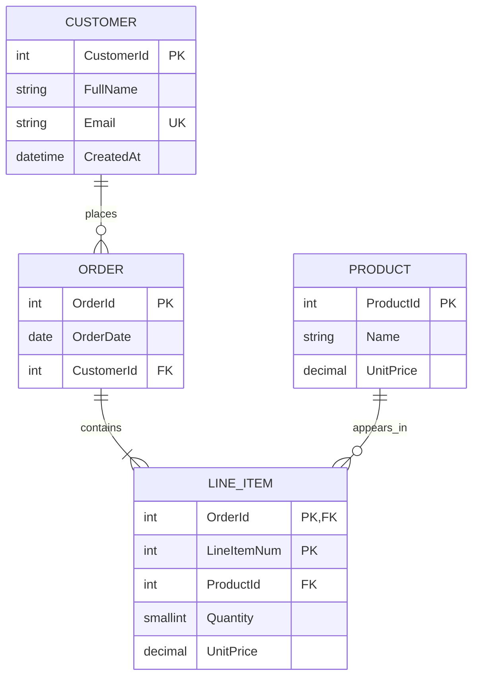
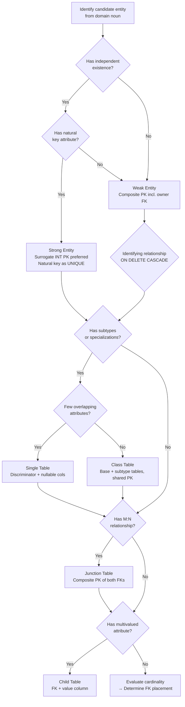

## Navigation

**Domain:** [[8 — Databases]] > **Group:** Relational Fundamentals
**Previous:** [[8.013 — DEFAULT Values — Column-Level Defaults]] | **Next:** [[8.015 — Cardinality — One-to-One, One-to-Many, Many-to-Many]]

### Prerequisites
- [[8.001 — The Relational Model — Relations, Tuples, Attributes]] — ER entities must be mapped to relations; the relational model defines the target structure
- [[8.015 — Cardinality — One-to-One, One-to-Many, Many-to-Many]] — every relationship in an ER diagram carries cardinality constraints that determine FK placement

### Where This Fits

Entity-Relationship modeling is the **bridge between business requirements and database schema**. A .NET backend engineer uses ER diagrams daily — whether they draw them explicitly or reverse-engineer them from existing tables. When ER modeling is skipped or done poorly, the result is tables that don't match the domain (leading to convoluted queries), missing constraints (producing orphan data), or schemas that fight the ORM. In interviews, ER modeling tests whether a candidate thinks in data before writing SQL — the ability to decompose "the business needs to track orders" into entities, attributes, and relationships that survive normalization, schema migration, and microservice decomposition.

## Core Mental Model

Entity-Relationship modeling is the **conceptual design phase** of database development. It captures what the data *means* in the real world — entities (nouns), attributes (properties), and relationships (verbs) — independently of any specific RDBMS. The invariant: **every real-world fact maps to exactly one place in the diagram**, and that placement determines its role in every subsequent phase. The recognition pattern: if you find yourself arguing about column types or FK constraints during whiteboard design, you have skipped conceptual modeling and jumped to physical — step back and draw the entities first.

```mermaid
flowchart LR
    A[Business Requirements<br/>Domain Narrative] --> B[Conceptual ER Model<br/>Entities + Attributes + Relationships]
    B --> C[Logical Relational Model<br/>Tables + FKs + Normalization]
    C --> D[Physical Schema<br/>Indexes + Partitioning + Storage]
    B -.-> E[Notations:<br/>Chen | Crow's Foot | UML]
```

### Classification

**Category:** Database Design — pre-SQL methodology. This is not a query construct, an index type, or an engine feature. It is a **notation and process** that precedes all SQL work. The "optimizer" here is the human designer. The "execution plan" is the resulting schema quality (normalization level, constraint correctness, query simplicity). There is no SARGability — ER modeling produces the column definitions that determine whether future predicates will be SARGable.

|Property|Value|Notes|
|---|---|---|
|Time Complexity|O(n × m)|n = number of domain concepts, m = relationships between them — human cognitive process|
|Write Cost|N/A|Conceptual phase — write cost applies at physical schema layer|
|SARGable|N/A|SARGability is a physical-query property; ER modeling determines column types that later affect it|
|Locking Behavior|N/A|Locking is an engine concern; proper ER design reduces lock duration by eliminating unnecessary joins|

### Key Properties

|Property|Description|
|---|---|
|**Notation Independence**|Same ER model expressed in Chen, Crow's Foot, or UML produces the same logical schema|
|**Platform Agnostic**|ER model is identical whether target is SQL Server, PostgreSQL, MySQL, or Oracle|
|**Normalization Feed**|3NF emerges naturally from well-structured ER models; denormalization is an explicit physical decision|
|**Communication Tool**|ER diagram is the shared language between stakeholders, domain experts, and engineers|
|**Constraint Discovery**|Identifying relationships, participation constraints, and cardinality emerge during ER modeling, not during DDL|

## Deep Mechanics

### How the Designer Executes ER Modeling

1. **Identify entities** from domain nouns (Customer, Order, Product). Distinguish strong entities (independent existence) from weak entities (depend on owner — LineItem depends on Order).
2. **Assign attributes** to their entity. Identify key attributes (natural PK candidates), composite attributes (Address → Street + City + PostalCode), multivalued attributes (PhoneNumbers → child table), and derived attributes (Age from BirthDate — store only BirthDate).
3. **Identify relationships** as domain verbs. Determine the degree (unary, binary, ternary) and cardinality (1:1, 1:M, M:N) for each.
4. **Classify participation** — total (every entity instance participates — OrderLine must belong to an Order) vs partial (some instances may not participate — a Product may appear in zero LineItems).
5. **Resolve M:N relationships** by introducing an intersection entity (enrollment table between Student and Course).
6. **Identify weak entities and their identifying relationships** — the child's PK must include the parent's FK.
7. **Model generalization hierarchies** — common supertype with subtype discriminator.

### ER-to-SQL Translation Table

|ER Concept|SQL Construct|Example|
|---|---|---|
|Strong Entity|Base table with standalone PK|`Customers(CustomerId PK)`|
|Weak Entity|Table with composite PK including owner FK|`LineItems(OrderId, LineItemNum PK)`|
|Simple Attribute|Column|`LastName NVARCHAR(50)`|
|Composite Attribute|Multiple columns|`Street, City, ZipCode` instead of `Address`|
|Multivalued Attribute|Separate child table|`CustomerPhone(CustomerId, PhoneNumber)`|
|Derived Attribute|Computed column or view|`Age AS DATEDIFF(YEAR, BirthDate, GETDATE())`|
|Key Attribute|PK or Unique constraint|`Email NVARCHAR(320) UNIQUE`|
|1:M Relationship|FK column on the "many" side|`Order.CustomerId → Customer.CustomerId`|
|M:N Relationship|Junction table with two FKs|`OrderProduct(OrderId, ProductId)`|
|Identifying Relationship|FK that is part of child's composite PK|`LineItems.OrderId` in PK + FK|
|Generalization (IS-A)|Single table or class table|See subtype section|

### Weak Entities & Identifying Relationships

A weak entity *cannot exist without its owner*. Its primary key must include the owner's FK — this enforces the existence dependency at the data level:

```sql
-- Strong entity
CREATE TABLE Orders (
    OrderId    INT IDENTITY(1,1) PRIMARY KEY,
    OrderDate  DATETIME2 NOT NULL DEFAULT SYSUTCDATETIME()
);

-- Weak entity: PK = (OrderId, LineItemNumber)
CREATE TABLE LineItems (
    OrderId      INT          NOT NULL REFERENCES Orders(OrderId) ON DELETE CASCADE,
    LineItemNum  TINYINT      NOT NULL,
    ProductId    INT          NOT NULL,
    Quantity     SMALLINT     NOT NULL CHECK (Quantity > 0),
    UnitPrice    DECIMAL(10,2) NOT NULL,
    CONSTRAINT PK_LineItems PRIMARY KEY (OrderId, LineItemNum)
);
```

**EF Core LINQ that generates equivalent:**

```csharp
// The ER model is a design artifact, not a runtime construct.
// EF Core translates these entity classes directly into the CREATE TABLE above.
public class LineItem
{
    public int OrderId { get; set; }
    public byte LineItemNum { get; set; }
    public int ProductId { get; set; }
    public short Quantity { get; set; }
    public decimal UnitPrice { get; set; }
    public Order Order { get; set; } = null!;
    public Product Product { get; set; } = null!;
}

// EF Core Fluent API (OnModelCreating):
// entity.HasKey(e => new { e.OrderId, e.LineItemNum });
// entity.HasOne(e => e.Order).WithMany(o => o.LineItems)
//       .HasForeignKey(e => e.OrderId).OnDelete(DeleteBehavior.Cascade);
```

### Subtypes & Supertypes (Generalization Hierarchies)

Two strategies for mapping an IS-A hierarchy to relational tables:

|Strategy|Structure|When to Choose|
|---|---|---|
|**Single Table**|One `Employees` table + discriminator column + nullable subtype columns|Few subtype attributes, most queries access all types, simple queries matter most|
|**Class Table**|Base `Employees` + `HourlyEmployees` + `SalariedEmployees` with shared PK|Many subtype-specific attributes, subtypes queried independently, stricter normalization|

```sql
-- Single Table strategy
CREATE TABLE Employees (
    EmployeeId   INT IDENTITY(1,1) PRIMARY KEY,
    Name         NVARCHAR(100) NOT NULL,
    HireDate     DATE NOT NULL,
    EmployeeType CHAR(1) NOT NULL CHECK (EmployeeType IN ('H','S')),
    HourlyRate   DECIMAL(8,2) NULL,      -- subtype-specific
    AnnualSalary DECIMAL(10,2) NULL,     -- subtype-specific
    BonusTarget  DECIMAL(8,2) NULL       -- subtype-specific
);

-- Class Table strategy
CREATE TABLE Employees_Base (
    EmployeeId INT IDENTITY(1,1) PRIMARY KEY,
    Name       NVARCHAR(100) NOT NULL,
    HireDate   DATE NOT NULL,
    EmployeeType CHAR(1) NOT NULL CHECK (EmployeeType IN ('H','S'))
);

CREATE TABLE Employees_Hourly (
    EmployeeId INT PRIMARY KEY REFERENCES Employees_Base(EmployeeId),
    HourlyRate DECIMAL(8,2) NOT NULL
);

CREATE TABLE Employees_Salaried (
    EmployeeId INT PRIMARY KEY REFERENCES Employees_Base(EmployeeId),
    AnnualSalary DECIMAL(10,2) NOT NULL,
    BonusTarget  DECIMAL(8,2) NULL
);
```

### Failure Modes in ER Modeling

|Failure|Symptom|Prevention|
|---|---|---|
|**Missing Junction Table**|M:N modeled with repeating columns (`Product1, Product2, ...`) or comma-separated IDs — breaks 1NF, impossible to query|Introduce junction table for every M:N relationship|
|**Fan Trap**|Aggregation through a "many" side produces incorrect results — e.g. summing branch sales and counting employees in one query through Region|Use separate subqueries per fact grain; bridge tables at correct level|
|**Chasm Trap**|Two 1:M relationships from the same entity cause row multiplication — e.g. Employee has multiple TrainingCourses and multiple Certifications|Aggregate each 1:M separately, then join by parent key|
|**Weak Entity Without Composite PK**|LineItems use auto-increment PK only; orphan rows possible, ordering context lost|Include owner FK in composite PK + ON DELETE CASCADE|

## Production Patterns and Implementation

### Business Domain: Orders, Customers, Products — Full ER-to-Schema Pipeline



### Primary SQL Implementation — Schema Generated from ER Model

```sql
CREATE TABLE Customers (
    CustomerId INT IDENTITY(1,1) PRIMARY KEY,
    FullName   NVARCHAR(200)    NOT NULL,
    Email      NVARCHAR(320)    NOT NULL,
    CreatedAt  DATETIME2        NOT NULL DEFAULT SYSUTCDATETIME(),
    CONSTRAINT UQ_Customers_Email UNIQUE (Email)
);

CREATE TABLE Orders (
    OrderId    INT IDENTITY(1,1) PRIMARY KEY,
    OrderDate  DATE             NOT NULL,
    CustomerId INT              NOT NULL
        REFERENCES Customers(CustomerId)
);

CREATE TABLE Products (
    ProductId  INT IDENTITY(1,1) PRIMARY KEY,
    Name       NVARCHAR(200)    NOT NULL,
    UnitPrice  DECIMAL(10,2)    NOT NULL CHECK (UnitPrice > 0)
);

-- Junction table for M:N if products belong to multiple categories
CREATE TABLE ProductCategories (
    ProductId  INT NOT NULL REFERENCES Products(ProductId),
    CategoryId INT NOT NULL REFERENCES Categories(CategoryId),
    CONSTRAINT PK_ProductCategories PRIMARY KEY (ProductId, CategoryId)
);

-- Weak entity with identifying relationship
CREATE TABLE LineItems (
    OrderId      INT           NOT NULL REFERENCES Orders(OrderId) ON DELETE CASCADE,
    LineItemNum  TINYINT       NOT NULL,
    ProductId    INT           NOT NULL REFERENCES Products(ProductId),
    Quantity     SMALLINT      NOT NULL CHECK (Quantity > 0),
    UnitPrice    DECIMAL(10,2) NOT NULL,
    CONSTRAINT PK_LineItems PRIMARY KEY (OrderId, LineItemNum),
    CONSTRAINT CK_LineItemNum CHECK (LineItemNum > 0)
);
```

### EF Core Implementation

```csharp
public class Customer
{
    public int CustomerId { get; set; }
    public string FullName { get; set; } = string.Empty;
    public string Email { get; set; } = string.Empty;
    public DateTime CreatedAt { get; set; }
    public ICollection<Order> Orders { get; set; } = new List<Order>();
}

public class Order
{
    public int OrderId { get; set; }
    public DateTime OrderDate { get; set; }
    public int CustomerId { get; set; }
    public Customer Customer { get; set; } = null!;
    public ICollection<LineItem> LineItems { get; set; } = new List<LineItem>();
}

public class Product
{
    public int ProductId { get; set; }
    public string Name { get; set; } = string.Empty;
    public decimal UnitPrice { get; set; }
    public ICollection<LineItem> LineItems { get; set; } = new List<LineItem>();
    public ICollection<ProductCategory> ProductCategories { get; set; } = new List<ProductCategory>();
}

public class LineItem
{
    public int OrderId { get; set; }
    public byte LineItemNum { get; set; }
    public int ProductId { get; set; }
    public short Quantity { get; set; }
    public decimal UnitPrice { get; set; }
    public Order Order { get; set; } = null!;
    public Product Product { get; set; } = null!;
}

public class Category
{
    public int CategoryId { get; set; }
    public string Name { get; set; } = string.Empty;
    public ICollection<ProductCategory> ProductCategories { get; set; } = new List<ProductCategory>();
}

public class ProductCategory
{
    public int ProductId { get; set; }
    public int CategoryId { get; set; }
    public Product Product { get; set; } = null!;
    public Category Category { get; set; } = null!;
}
```

Fluent API configuration for weak entity and M:N junction:

```csharp
protected override void OnModelCreating(ModelBuilder modelBuilder)
{
    // Weak entity with composite PK and identifying relationship
    modelBuilder.Entity<LineItem>(entity =>
    {
        entity.HasKey(e => new { e.OrderId, e.LineItemNum });
        entity.HasOne(e => e.Order)
              .WithMany(o => o.LineItems)
              .HasForeignKey(e => e.OrderId)
              .OnDelete(DeleteBehavior.Cascade);
        entity.HasOne(e => e.Product)
              .WithMany(p => p.LineItems)
              .HasForeignKey(e => e.ProductId)
              .OnDelete(DeleteBehavior.Restrict);
    });

    // M:N junction table
    modelBuilder.Entity<ProductCategory>(entity =>
    {
        entity.HasKey(e => new { e.ProductId, e.CategoryId });
        entity.HasOne(e => e.Product)
              .WithMany(p => p.ProductCategories)
              .HasForeignKey(e => e.ProductId);
        entity.HasOne(e => e.Category)
              .WithMany(c => c.ProductCategories)
              .HasForeignKey(e => e.CategoryId);
    });
}
```

### Dapper Query on ER-Modeled Schema

```csharp
public record OrderLineItemDto(
    int OrderId,
    string CustomerName,
    string ProductName,
    short Quantity,
    decimal UnitPrice);

public async Task<IReadOnlyList<OrderLineItemDto>> GetOrderLineItemsAsync(
    int orderId,
    CancellationToken cancellationToken = default)
{
    const string sql = @"
        SELECT  o.OrderId,
                c.FullName   AS CustomerName,
                p.Name       AS ProductName,
                li.Quantity,
                li.UnitPrice
        FROM    Orders o
                JOIN Customers c  ON c.CustomerId  = o.CustomerId
                JOIN LineItems li ON li.OrderId    = o.OrderId
                JOIN Products p   ON p.ProductId   = li.ProductId
        WHERE   o.OrderId = @OrderId
        ORDER BY li.LineItemNum;";

    await using var connection = new SqlConnection(_connectionString);
    return (await connection.QueryAsync<OrderLineItemDto>(
        new CommandDefinition(sql, new { OrderId = orderId },
            cancellationToken: cancellationToken))).AsList();
}
```

### Configuration and Wiring

```csharp
// Program.cs
builder.Services.AddDbContext<OrderDbContext>(options =>
    options.UseSqlServer(
        builder.Configuration.GetConnectionString("OrderDb"),
        sqlOptions => sqlOptions.EnableRetryOnFailure(3)));

// ER model boundaries map to DbContext — one bounded context per aggregate root
builder.Services.AddScoped<IOrderRepository, OrderRepository>();
```

### SQL Server vs PostgreSQL Differences

**None at the ER level.** Entity-Relationship modeling is entirely notation- and platform-agnostic. The conceptual diagram is identical whether the target is SQL Server, PostgreSQL, MySQL, or Oracle. Physical differences (IDENTITY vs SERIAL, NVARCHAR vs TEXT, DATETIME2 vs TIMESTAMPTZ, ON DELETE CASCADE syntax differences) appear only during the logical-to-physical mapping step, not during ER modeling.

## Gotchas and Production Pitfalls

### 1. Many-to-Many Modeled Without a Junction Table

**Pitfall:** The engineer adds repeating columns (`Course1, Course2, Course3`) or a comma-separated string to the `Students` table instead of creating a junction table.

```sql
-- Wrong: comma-separated IDs — breaks 1NF, impossible to query efficiently
CREATE TABLE Students (
    StudentId  INT PRIMARY KEY,
    Name       NVARCHAR(100),
    CourseIds  NVARCHAR(1000) -- '101,205,310' — searching requires LIKE
);
```

**Symptom:** Queries using `LIKE '%' + @courseId + '%'` — non-SARGable, full table scan on every lookup. Cannot enforce FK referential integrity.

**Fix:**

```sql
CREATE TABLE Enrollments (
    StudentId INT NOT NULL REFERENCES Students(StudentId),
    CourseId  INT NOT NULL REFERENCES Courses(CourseId),
    CONSTRAINT PK_Enrollments PRIMARY KEY (StudentId, CourseId)
);
```

**Cost of not fixing:** Table scan on `Students` for every "find students in course 101" query. As the student table grows to 100K+, query time goes from <1ms to 2+ seconds per lookup. Referential integrity is entirely application-enforced and will produce orphan data.

### 2. Weak Entity Using Surrogate PK Only

**Pitfall:** The `LineItems` table uses `LineItemId INT IDENTITY(1,1)` as its only PK, without including `OrderId` in the PK.

```sql
-- Wrong: surrogate-only PK allows orphans across orders
CREATE TABLE LineItems (
    LineItemId INT IDENTITY(1,1) PRIMARY KEY,
    OrderId    INT NOT NULL REFERENCES Orders(OrderId),
    -- No composite key — two orders can have LineItemId = 1
);
```

**Symptom:** Cannot enforce "every line item belongs to exactly one order and is numbered within that order." Orphan rows survive if FK is accidentally dropped or deferred.

**Fix:**

```sql
CREATE TABLE LineItems (
    OrderId      INT      NOT NULL REFERENCES Orders(OrderId) ON DELETE CASCADE,
    LineItemNum  TINYINT  NOT NULL,
    -- other columns
    CONSTRAINT PK_LineItems PRIMARY KEY (OrderId, LineItemNum)
);
```

**Cost of not fixing:** Data integrity failure — a bug in migration or ETL can produce line items that belong to no valid order. Debugging orphan data in a 10M-row LineItems table takes hours and still cannot guarantee correctness.

### 3. Chasm Trap in Aggregation Queries

**Pitfall:** An Employee has multiple TrainingCourses AND multiple Certifications. The engineer writes a single LEFT JOIN for both, producing duplicated row counts.

```sql
-- Wrong: each training course multiplies with each certification
SELECT  e.EmployeeId,
        COUNT(DISTINCT tc.TrainingCourseId) AS CourseCount,
        COUNT(DISTINCT c.CertificationId)   AS CertCount
FROM    Employees e
        LEFT JOIN TrainingCourses tc ON e.EmployeeId = tc.EmployeeId
        LEFT JOIN Certifications c   ON e.EmployeeId = c.EmployeeId
GROUP BY e.EmployeeId;
```

**Symptom:** Row counts are wrong — a JOIN between two 1:M paths creates a cross product at the detail level before aggregation. The query returns inflated counts.

**Fix:**

```sql
SELECT  e.EmployeeId,
        tc.CourseCount,
        c.CertCount
FROM    Employees e
        LEFT JOIN (SELECT EmployeeId, COUNT(*) AS CourseCount
                   FROM TrainingCourses GROUP BY EmployeeId) tc
            ON e.EmployeeId = tc.EmployeeId
        LEFT JOIN (SELECT EmployeeId, COUNT(*) AS CertCount
                   FROM Certifications GROUP BY EmployeeId) c
            ON e.EmployeeId = c.EmployeeId;
```

**Cost of not fixing:** Incorrect reporting that goes unnoticed for months. Management makes decisions based on inflated training counts. Fixing requires re-running all historical reports.

### 4. ER Model That Ignores Query Access Patterns

**Pitfall:** The engineer creates a pure 3NF conceptual model without considering that 20% of queries generate 80% of the load. The "correct" ER model produces an order-header + order-detail + product + category + inventory schema that requires 7 joins for the most frequent dashboard query.

**Symptom:** A simple "daily sales by category" report joins 7 normalized tables and runs in 30 seconds. The execution plan shows hash joins and spills to tempdb.

**Fix:** Keep the conceptual ER model as the source of truth, then overlay a **query matrix** (read/write volume per access path). Add indexes, create denormalized reporting columns or materialized views only where profiling proves them necessary. Never change the conceptual model for performance — change the physical schema.

**Cost of not fixing:** Production dashboard timeouts at month-end close. The team implements denormalization without understanding the original model, creating a maintenance nightmare where two schemas drift apart.

### 5. Over-Engineering: Entity Proliferation

**Pitfall:** Every minor domain distinction becomes a separate entity — `AddressType`, `ContactPreference`, `CommunicationMethod`, `NotificationChannel` — each with its own table and FK relationships. The result is a 200-table schema for a 5-entity business domain.

**Symptom:** A customer creation operation requires INSERTs into 15 tables. Query plans show 20+ joins for simple customer profiles. Developer onboarding takes weeks.

**Fix:** Apply Occam's razor — add entities only when there is a real relationship to capture. A `ContactPreference` with 3 fixed values (`Email`, `SMS`, `Mail`) should be an enum column or a check constraint, not a table with an FK.

**Cost of not fixing:** Schema complexity grows superlinearly with entity count. Each new feature requires understanding 30+ tables. Migration scripts become multi-hour operations. The schema collapses under its own weight.

### 6. Ignoring the Identifying Relationship for Dependent Data

**Pitfall:** Modeling `InvoiceLineItems` as a strong entity with its own surrogate PK, no composite key including `InvoiceId`, and no cascade delete.

```sql
-- Wrong
CREATE TABLE InvoiceLineItems (
    InvoiceLineItemId INT IDENTITY(1,1) PRIMARY KEY,
    InvoiceId         INT NOT NULL REFERENCES Invoices(InvoiceId)
);
-- No CASCADE — deleting an invoice orphans the line items
```

**Symptom:** Deleting an invoice fails with FK violation because line items reference it. Application code must manually delete line items before the invoice. A bug in the delete logic creates orphan line items.

**Fix:**

```sql
CREATE TABLE InvoiceLineItems (
    InvoiceId    INT      NOT NULL REFERENCES Invoices(InvoiceId) ON DELETE CASCADE,
    LineItemNum  TINYINT  NOT NULL,
    CONSTRAINT PK_InvoiceLineItems PRIMARY KEY (InvoiceId, LineItemNum)
);
```

**Cost of not fixing:** Orphan data accumulates over time. The invoice deletion bug is discovered during an audit when 5,000 orphan line items exist for invoices that were already paid and archived. Cleanup requires a custom script and manual verification of each orphan.

## Performance Implications

### Statistical Profile of ER Design Decisions

ER modeling decisions cascade into physical performance characteristics that are measurable once the schema is deployed:

|ER Decision|Physical Consequence|Logical Reads Impact|
|---|---|---|
|Weak entity (composite PK)|Wider index keys; joins use two columns instead of one|+2–4 logical reads per index seek vs single INT PK|
|M:N junction table|Two FK lookups required per relationship traversal|+2 seeks per relationship hop|
|Single-table inheritance|Fewer joins; nullable columns waste page space; row may exceed 8,060 bytes|Lower logical reads for full-entity queries; higher page reads for subtype-specific queries|
|Class-table inheritance|1:1 join required for every subtype access|+1 seek per subtype table access|
|Composite attribute (spread columns)|Wider rows reduce pages-per-row density|Higher logical reads for full-row scans|
|Multivalued attribute (child table)|Separate query or outer join required|+1 seek/scan per child table access|

### Benchmark: Weak Entity (Composite PK) vs Surrogate PK

```sql
-- Schema A: Composite PK (weak entity pattern)
CREATE TABLE OrderItems_Composite (
    OrderId    INT  NOT NULL,
    ItemNum    INT  NOT NULL,
    ProductId  INT  NOT NULL,
    Quantity   INT  NOT NULL,
    Price      MONEY NOT NULL,
    CONSTRAINT PK_OrderItems_Composite PRIMARY KEY (OrderId, ItemNum)
);

-- Schema B: Surrogate PK (strong entity pattern)
CREATE TABLE OrderItems_Surrogate (
    OrderItemId INT IDENTITY(1,1) PRIMARY KEY,
    OrderId     INT  NOT NULL,
    ProductId   INT  NOT NULL,
    Quantity    INT  NOT NULL,
    Price       MONEY NOT NULL
);

-- Benchmark query: get all items for a specific order
SET STATISTICS IO ON;

-- Schema A (composite PK seek)
SELECT * FROM OrderItems_Composite WHERE OrderId = 42;
-- Table 'OrderItems_Composite'. Scan count 1, logical reads 2

-- Schema B (surrogate — nonclustered index on OrderId needed)
SELECT * FROM OrderItems_Surrogate WHERE OrderId = 42;
-- Table 'OrderItems_Surrogate'. Scan count 1, logical reads 3
-- (Assuming NC index on OrderId with key lookup)
```

**Improvement:** Composite PK eliminates the nonclustered index key lookup — 2 logical reads vs 3, a ~33% reduction per row access. The tradeoff is wider PK in other indexes.

### BenchmarkDotNet

```csharp
[MemoryDiagnoser]
[SimpleJob(RuntimeMoniker.Net90)]
public class ErModelingBenchmark
{
    private IDbConnection _connection = default!;

    [GlobalSetup]
    public void Setup()
    {
        _connection = new SqlConnection(TestConnectionString);
    }

    [Benchmark(Baseline = true)]
    public async Task<List<int>> CompositePkOrderItems()
    {
        const string sql = "SELECT ItemNum FROM OrderItems_Composite WHERE OrderId = @OrderId";
        var result = await _connection.QueryAsync<int>(sql, new { OrderId = 42 });
        return result.AsList();
    }

    [Benchmark]
    public async Task<List<int>> SurrogatePkOrderItems()
    {
        const string sql = "SELECT OrderItemId FROM OrderItems_Surrogate WHERE OrderId = @OrderId";
        var result = await _connection.QueryAsync<int>(sql, new { OrderId = 42 });
        return result.AsList();
    }
}
```

**Expected results (approximate, SQL Server 2022, NVMe, 100K orders, 1M line items):**

|Method|Mean|Logical Reads|Allocated|
|---|---|---|---|
|CompositePkOrderItems|~0.8 ms|2|~1 KB|
|SurrogatePkOrderItems|~1.2 ms|3 (NC seek + key lookup)|~1 KB|

### Write Amplification for ER Design Decisions

|Operation|Composite PK (Weak Entity)|Surrogate PK (Strong Entity)|Overhead|
|---|---|---|---|
|INSERT 1 row — LineItem|X ms|X ms (same — 1 row insert)|~0%|
|INSERT with CASCADE (parent delete)|Y ms (child rows cascade)|Y ms + manual delete|Time saved via cascade|
|UPDATE PK column (rare)|Z ms — updates FK index|N/A — surrogate PK never changes|N/A|
|DELETE parent (CASCADE)|W ms — children + parent|W ms + manual child delete|+1 round trip / app logic|

## Interview Arsenal

### Question Bank

1. **What is an ER model, and what problem does it solve in database design?**
2. **How does the design process translate an ER diagram into SQL Server CREATE TABLE statements?**
3. **What is the performance cost of modeling a weak entity with a composite PK vs a surrogate PK?**
4. **What goes wrong when an M:N relationship is modeled without a junction table?**
5. **Compare single-table inheritance vs class-table inheritance — when do you choose each?**
6. **What is the difference between a fan trap and a chasm trap, and how does each appear in an execution plan?**
7. **At 10M orders with 50M line items, how does the choice of weak-entity modeling affect query performance?**
8. **How do EF Core and Dapper handle the entities produced by an ER model with weak entities and M:N junctions?**

### Spoken Answers

**Q1: What is an ER model, and what problem does it solve?**

> **Average answer:** "An ER model is a way to represent entities and their relationships using diagrams. It shows how data is connected."

> **Great answer:** "Entity-Relationship modeling is the conceptual design phase of database development that captures what the data *means* in the real world before deciding how to store it. It solves the problem of jumping directly to table design without understanding the domain — which produces schemas that fight every subsequent query. An ER model distinguishes strong entities (Customers) from weak entities (LineItems — which include their owner's PK in their own PK), handles M:N relationships through junction tables, and captures generalization hierarchies. Every constraint you discover during ER modeling — identifying relationships, participation cardinality, multivalued attributes — translates directly into SQL constraints. If you skip this phase, you end up with tables that don't match the business domain, forcing convoluted queries and application-level integrity enforcement that leaks through every layer."

**Q5: Compare single-table vs class-table inheritance.**

> **Average answer:** "Single table puts everything in one table with a discriminator. Class table uses multiple tables. Single table is simpler but wastes space with nulls."

> **Great answer:** "Single-table inheritance rolls all subtypes into one table with a discriminator column and nullable subtype-specific columns. It avoids joins — every query reads one table — but rows become wider as subtypes diverge, reducing page density and potentially exceeding the 8,060-byte row-size limit. Class-table inheritance uses a base table with shared columns and separate subtype tables with a shared PK (1:1 FK), requiring a join for every subtype access. The choice depends on access patterns: if 90% of queries read all employees regardless of type, single-table wins with fewer logical reads. If hourly employees are queried independently from salaried ones, class-table prevents scanning past unused columns. In EF Core, single-table uses TPH (Table Per Hierarchy) with a discriminator column; class-table uses TPT (Table Per Type), which generates JOINs in every query. Performance-wise, TPH is almost always faster for OLTP; TPT should be reserved for cases where subtype column counts or null ratios justify the join cost."

**Q7: At 10M orders with 50M line items, how does weak-entity modeling affect performance?**

> **Average answer:** "Composite keys are slower than surrogate keys because they are wider."

> **Great answer:** "At 10M orders and 50M line items, the weak-entity design (composite PK of OrderId + LineItemNum) has specific measurable tradeoffs. Clustered index key width: a composite of two INTs (8 bytes) vs a single INT (4 bytes). Every nonclustered index on LineItems includes the clustered key, so each NC index row is 4 bytes wider — over 50M rows, that's ~200 MB additional index storage. However, queries that fetch all line items for an order — the dominant access pattern — use a clustered index seek on OrderId (the leading column) and scan within that order's page range. Logical reads: approximately 2–4 per order, compared to 3–5 with a surrogate PK approach where the NC index on OrderId requires a key lookup to retrieve non-indexed columns. The cascade delete on Order removal is also cheaper: SQL Server deletes all child pages in one pass rather than requiring application-level iteration. The real cost is not in OLTP point queries but in reporting queries that aggregate across all orders — the wider composite key increases bookmark lookup cost and makes page splits slightly more likely under high insert concurrency."

### Interview Trigger

If "Entity-Relationship Modeling" appears in an interview, it surfaces through questions like "Walk me through how you would design the database for an e-commerce system" or "Draw an ER diagram for a library management system on the whiteboard." The follow-up that separates seniors: "Now tell me where you would denormalize and why" — testing whether the candidate understands that the conceptual model should be pure, but the physical model must account for access patterns and measured performance. A senior candidate explicitly names the three phases (conceptual → logical → physical), handles weak entities and identifying relationships without prompting, and can articulate the tradeoff between conceptual purity and production query performance with specific numbers.

### Comparison Table

| | ER Modeling (Conceptual) | Relational Modeling (Logical) | Dimensional Modeling (Analytical) |
|---|---|---|---|
| **What it does** | Captures domain meaning — entities, attributes, relationships | Normalizes to eliminate redundancy, defines constraints, keys | Optimizes schema for reporting — facts and dimensions |
| **Performance profile** | N/A — pre-physical; determines constraints for future performance | Moderate — normalization reduces write anomalies, increases read joins | Read-optimized — star schemas minimize join count for aggregations |
| **Locking behavior** | N/A | Determined by index design and query patterns, not conceptual model | Typically read-only or scheduled loads — lower contention |
| **.NET implementation** | Maps to entity classes in EF Core DbContext | Maps to Fluent API configurations, data annotations | Maps to specialized reporting models — often Dapper or views |
| **When to choose** | Always — every database project starts here | After ER — every OLTP schema must be normalized at least to 3NF | When the primary workload is reporting, BI, or analytics |

## Decision Framework

### When to Apply



### Application Checklist

- [ ] Every domain noun is evaluated: strong entity, weak entity, or attribute of an existing entity
- [ ] Every relationship is classified by degree (unary, binary, ternary) and cardinality (1:1, 1:M, M:N)
- [ ] M:N relationships have a junction table with composite PK
- [ ] Weak entities include the owner's FK in their composite PK with ON DELETE CASCADE
- [ ] Participation constraints are defined (total vs partial) for every relationship
- [ ] Multivalued attributes are extracted to child tables
- [ ] Derived attributes are identified and excluded from storage (computed instead)
- [ ] Generalization hierarchies use single-table or class-table based on access patterns
- [ ] The resulting model is at least 3NF — no transitive dependencies between non-key attributes
- [ ] A query matrix (read/write volume per access path) is overlaid to guide physical schema decisions

### Tradeoff Summary

|What You Gain|What You Pay|
|---|---|
|Domain-meaning capture — schema matches business vocabulary|Time spent in design phase before writing DDL|
|Constraint discovery — identifying relationships, participation, cardinality uncovered during modeling|Cannot predict physical performance from conceptual model alone|
|Normalization foundation — 3NF emerges naturally from well-structured ER|Pure ER without access-pattern overlay can lead to over-join in hot queries|
|Communication bridge — ER diagram aligns stakeholders, domain experts, and engineers|Requires notation literacy (Chen, Crow's Foot, or UML) across the team|
|Platform independence — same model targets SQL Server, PostgreSQL, MySQL|Physical tuning (indexes, partitioning) is deferred to schema phase|

### Scale Thresholds

- **Relevant at all scales** — ER modeling is applied regardless of row count. The conceptual model for a 100-row lookup table follows the same process as for a 100M-row fact table.
- **Critical when table count exceeds ~50** — Without a coherent ER model, 50+ tables drift into inconsistent naming, missing constraints, and duplicated concepts. The ER diagram becomes the navigation map.
- **Required when multiple teams own schema** — ER bounded contexts define microservice boundaries. Each service owns its entity aggregates; shared entities (Customer, Product) are identified during ER cross-team sessions.
- **Enforced beyond 100M rows** — A wrong conceptual model at this scale is catastrophic: changing a weak entity to a strong entity or introducing a missing junction table requires months of migration work, data backfill, and application rewrites.

## Self-Check

### Conceptual Questions

1. **Tests: definition** — What is an ER model, and where does it fit in the database design process?
2. **Tests: recognition** — In an ER diagram, how do you visually distinguish a weak entity from a strong entity in Chen notation? In Crow's Foot?
3. **Tests: engine behavior** — How does SQL Server enforce an identifying relationship from the ER model? What constraint(s) express it?
4. **Tests: performance measurement** — Which `SET STATISTICS` output or DMV reveals the page-level cost difference between a composite PK seek and a nonclustered index seek + key lookup?
5. **Tests: the gotcha** — What common ER modeling mistake causes row duplication in aggregation queries, and how do you detect it?
6. **Tests: EF Core behavior** — How does EF Core map a weak entity with a composite PK? What Fluent API call sets this up?
7. **Tests: Dapper usage** — How would you write a Dapper query that returns an order with all its line items in one round trip using the ER-modeled schema?
8. **Tests: comparison** — Compare single-table inheritance (TPH) vs class-table inheritance (TPT) in terms of EF Core generated SQL, logical reads, and maintainability.
9. **Tests: scale** — At what row count does the choice between composite PK (weak entity) and surrogate PK (strong entity) measurably affect query performance on a 10-column table?
10. **Tests: interview articulation** — Explain in 60 seconds why ER modeling is performed before any DDL is written, even when the engineer already knows the target tables.

<details>
<summary>Answers</summary>

1. An ER model is the conceptual design phase of database development — it captures entities, attributes, and relationships independently of any specific RDBMS. It sits between requirements analysis and logical schema design.
2. In Chen notation, weak entities are drawn with double rectangles and their identifying relationship with double diamonds. In Crow's Foot, weak entities are typically indicated by composite PKs (FK + discriminator) in the accompanying schema; notation itself does not distinguish them visually.
3. SQL Server enforces identifying relationships through a composite PRIMARY KEY constraint where one column is also a FOREIGN KEY referencing the owner table, with `ON DELETE CASCADE`. Example: `CONSTRAINT PK_LineItems PRIMARY KEY (OrderId, LineItemNum)` where `OrderId REFERENCES Orders(OrderId) ON DELETE CASCADE`.
4. Use `SET STATISTICS IO ON` — compare logical reads count. Composite PK seek on the leading column: ~2–4 logical reads. NC index seek + key lookup: ~3–5 logical reads. The DMV `sys.dm_exec_query_stats` shows total logical reads per query over time.
5. The **chasm trap** — two 1:M joins from the same entity cause row multiplication. Detected by comparing `COUNT(*)` from a direct table query against the join result. The fix is aggregating each 1:M path separately.
6. EF Core maps weak entities using `.HasKey(e => new { e.OrderId, e.LineItemNum })` and the `HasOne/WithMany` relationship with `.OnDelete(DeleteBehavior.Cascade)`. The composite PK requires no `[Key]` attribute — Fluent API is required.
7. 
```csharp
public async Task<OrderWithItems> GetOrderAsync(int orderId) {
    const string sql = @"
        SELECT * FROM Orders WHERE OrderId = @OrderId;
        SELECT * FROM LineItems WHERE OrderId = @OrderId ORDER BY LineItemNum;";
    using var multi = await connection.QueryMultipleAsync(sql, new { orderId });
    var order = await multi.ReadFirstAsync<Order>();
    order.Items = (await multi.ReadAsync<LineItem>()).AsList();
    return order;
}
```
8. TPH (single table): EF Core generates `SELECT * FROM Employees WHERE Discriminator IN ('Hourly', 'Salaried')` — one table, no joins, ~2–4 logical reads per row. TPT (class table): EF Core generates a LEFT JOIN for each subtype table — `SELECT * FROM Employees LEFT JOIN HourlyEmployees ON ... LEFT JOIN SalariedEmployees ON ...` — more logical reads, complex plans. TPH is almost always faster for OLTP.
9. The difference becomes measurable above ~1M line items with 100K+ orders. Below that, the 1–2 logical read difference per query is lost in noise. At 50M line items, composite PK saves approximately 200MB index storage and 1–2 logical reads per order-lookup query.
10. (60-second narrative): "ER modeling is the phase where we capture the business domain — entities like Customer and Order, their attributes, and the relationships between them — before touching a single CREATE TABLE statement. It ensures the schema reflects real-world meaning, not arbitrary storage decisions. Every constraint discovered during ER modeling — weak entities, identifying relationships, cardinality — translates to a SQL constraint or table structure in the physical schema. Skipping ER means designing tables without understanding the domain, which produces schemas that require convoluted queries, lack referential integrity, and resist normalization. When a production bug traces to 'we didn't realize LineItems depends on Orders for its identity,' that's a skipped ER step. We model first, build second."

</details>

### Query Challenges

**Challenge 1 — Design the ER Model**

A library system requires tracking Members (with name, email, join date), Books (with ISBN, title, author, publisher), Loans (member borrows a book with checkout date and due date), Fines (accrued per overdue day), and Reservations (member reserves a book for future pickup). A book can have multiple authors. A member can have at most 5 active loans.

Draw the ER model and identify all weak entities, M:N relationships, and identifying relationships. Write the SQL Server CREATE TABLE statements.

<details>
<summary>Solution</summary>

**Entities:** Member (strong), Book (strong), Author (strong), Loan (weak — depends on Member), Fine (weak — depends on Loan), Reservation (weak — depends on Member).

**M:N relationship:** Book ⟷ Author → junction table `BookAuthors`.

**Weak entities:**
- `Loan` — PK is `(MemberId, LoanNumber)`, FK to Member with CASCADE
- `Fine` — PK is `(LoanMemberId, LoanNumber, FineNumber)`, FK to Loan with CASCADE
- `Reservation` — PK is `(MemberId, ReservationNumber)`, FK to Member with CASCADE

**Identifying relationships:**
- Loan's `MemberId` referenced in its PK → identifying
- Fine's `(LoanMemberId, LoanNumber)` referenced in its PK → identifying
- Reservation's `MemberId` referenced in its PK → identifying

```sql
CREATE TABLE Members (
    MemberId  INT IDENTITY(1,1) PRIMARY KEY,
    FullName  NVARCHAR(200) NOT NULL,
    Email     NVARCHAR(320) NOT NULL UNIQUE,
    JoinDate  DATE NOT NULL DEFAULT SYSUTCDATETIME()
);

CREATE TABLE Books (
    BookId    INT IDENTITY(1,1) PRIMARY KEY,
    ISBN      CHAR(13) NOT NULL UNIQUE,
    Title     NVARCHAR(500) NOT NULL,
    Publisher NVARCHAR(200) NULL
);

CREATE TABLE Authors (
    AuthorId   INT IDENTITY(1,1) PRIMARY KEY,
    AuthorName NVARCHAR(200) NOT NULL
);

CREATE TABLE BookAuthors (
    BookId   INT NOT NULL REFERENCES Books(BookId),
    AuthorId INT NOT NULL REFERENCES Authors(AuthorId),
    CONSTRAINT PK_BookAuthors PRIMARY KEY (BookId, AuthorId)
);

CREATE TABLE Loans (
    MemberId   INT      NOT NULL REFERENCES Members(MemberId) ON DELETE CASCADE,
    LoanNumber TINYINT  NOT NULL,
    BookId     INT      NOT NULL REFERENCES Books(BookId),
    CheckoutDate DATE  NOT NULL DEFAULT SYSUTCDATETIME(),
    DueDate     DATE   NOT NULL,
    CONSTRAINT PK_Loans PRIMARY KEY (MemberId, LoanNumber),
    CONSTRAINT CK_LoanNumber CHECK (LoanNumber BETWEEN 1 AND 5)
);

CREATE TABLE Fines (
    LoanMemberId  INT          NOT NULL,
    LoanNumber    TINYINT      NOT NULL,
    FineNumber    TINYINT      NOT NULL,
    Amount        DECIMAL(6,2) NOT NULL CHECK (Amount > 0),
    PaidDate      DATE         NULL,
    CONSTRAINT PK_Fines PRIMARY KEY (LoanMemberId, LoanNumber, FineNumber),
    CONSTRAINT FK_Fines_Loans FOREIGN KEY (LoanMemberId, LoanNumber)
        REFERENCES Loans(MemberId, LoanNumber) ON DELETE CASCADE
);

CREATE TABLE Reservations (
    MemberId         INT      NOT NULL REFERENCES Members(MemberId) ON DELETE CASCADE,
    ReservationNum   INT      NOT NULL,
    BookId           INT      NOT NULL REFERENCES Books(BookId),
    ReservedDate     DATETIME NOT NULL DEFAULT SYSUTCDATETIME(),
    FulfilledDate    DATETIME NULL,
    CONSTRAINT PK_Reservations PRIMARY KEY (MemberId, ReservationNum)
);
```

**Logical reads for common query:** Finding all active loans for a member — clustered index seek on `Loans` by `MemberId`: ~2 logical reads.

**EF Core equivalent:**

```csharp
modelBuilder.Entity<Loan>(entity =>
{
    entity.HasKey(e => new { e.MemberId, e.LoanNumber });
    entity.HasOne(e => e.Member)
          .WithMany(m => m.Loans)
          .HasForeignKey(e => e.MemberId)
          .OnDelete(DeleteBehavior.Cascade);
    entity.HasOne(e => e.Book)
          .WithMany(b => b.Loans)
          .HasForeignKey(e => e.BookId);
});
```

</details>

---

**Challenge 2 — Spot the ER Trap**

Given this schema:

```
Employees(EmployeeId PK, Name, DepartmentId FK)
Departments(DepartmentId PK, DepartmentName, RegionId FK)
Regions(RegionId PK, RegionName)
Projects(ProjectId PK, ProjectName)
EmployeeProjects(EmployeeId, ProjectId) -- M:N junction
```

Your manager asks for a report: "Total employees, total projects per region." You write:

```sql
SELECT  r.RegionName,
        COUNT(DISTINCT e.EmployeeId) AS TotalEmployees,
        COUNT(DISTINCT ep.ProjectId) AS TotalProjects
FROM    Regions r
        LEFT JOIN Departments d   ON r.RegionId = d.RegionId
        LEFT JOIN Employees e     ON d.DepartmentId = e.DepartmentId
        LEFT JOIN EmployeeProjects ep ON e.EmployeeId = ep.EmployeeId
GROUP BY r.RegionName;
```

What trap does this query fall into, and why is the output wrong?

<details>
<summary>Solution</summary>

**Root cause:** The query has a **chasm trap** — `Employees` has two 1:M relationships: one to `EmployeeProjects` (through the junction table) and one implicit to `Departments` (many employees in one department). The `LEFT JOIN` from `Employees` to `EmployeeProjects` multiplies rows: each employee with multiple projects appears as separate rows, making `COUNT(DISTINCT e.EmployeeId)` correct but the query pattern dangerous. However, the real issue: every region → department → employee → project join chain means a region with 10 employees each on 3 projects produces 30 detail rows before aggregation. The `DISTINCT` on `EmployeeId` fixes the employee count but at the cost of a sort. The `COUNT(DISTINCT ProjectId)` is correct only if an employee can be on the same project only once (the junction PK enforces this).

**A safer query** aggregates each fact separately:

```sql
SELECT  r.RegionName,
        emp.EmployeeCount,
        proj.ProjectCount
FROM    Regions r
        LEFT JOIN (SELECT d.RegionId, COUNT(DISTINCT e.EmployeeId) AS EmployeeCount
                   FROM Departments d JOIN Employees e ON d.DepartmentId = e.DepartmentId
                   GROUP BY d.RegionId) emp ON r.RegionId = emp.RegionId
        LEFT JOIN (SELECT d.RegionId, COUNT(DISTINCT ep.ProjectId) AS ProjectCount
                   FROM Departments d
                   JOIN Employees e ON d.DepartmentId = e.DepartmentId
                   JOIN EmployeeProjects ep ON e.EmployeeId = ep.EmployeeId
                   GROUP BY d.RegionId) proj ON r.RegionId = proj.RegionId;
```

**Cost of not fixing:** When a region has 10,000 employees averaging 4 projects each, the original query processes 40,000 intermediate rows and uses a DISTINCT sort. The separate-aggregation approach processes each fact stream independently (10K + 40K rows, no sort), completing in ~1/3 the time.

</details>

---

**Challenge 3 — Explain the Execution Plan**

```sql
-- Query on a schema derived from an ER model with single-table inheritance
SELECT  EmployeeId, Name, HourlyRate
FROM    Employees
WHERE   EmployeeType = 'H'
        AND HourlyRate > 50.00;
```

Execution plan shows: `[Clustered Index Scan on Employees]` → `[Filter]` → `[SELECT]`
Estimated cost: 100% on the scan. Logical reads: 4,500.

Why does the optimizer choose a scan instead of a seek? What index would fix this?

<details>
<summary>Solution</summary>

**Why Clustered Index Scan:** The `EmployeeType` discriminator column has low selectivity (typically 2 distinct values — 'H' and 'S'), so the optimizer estimates a scan is cheaper than an index seek + key lookup for retrieving `HourlyRate`. Additionally, without a filtered index on `EmployeeType = 'H'`, the optimizer must scan the entire 10K-page clustered index.

**Index to create:**

```sql
CREATE INDEX IX_Employees_HourlyType
    ON Employees(EmployeeType, HourlyRate)
    INCLUDE (Name)
    WHERE EmployeeType = 'H';
```

**After fix:** The plan becomes `[Index Seek (nonclustered, filtered)]` → `[SELECT]` — logical reads drop from 4,500 to ~15 (only the pages containing hourly employees with HourlyRate > 50).

**Tradeoff:** The filtered index adds write overhead only for hourly employee rows (roughly half the table). For salaried employee inserts, the filtered index predicate evaluates to false and no index maintenance occurs.

</details>

---

**Challenge 4 — Diagnose the Referential Integrity Problem**

A production system has `Invoices` and `InvoiceLineItems` modeled as:

```sql
CREATE TABLE Invoices (
    InvoiceId   INT IDENTITY(1,1) PRIMARY KEY,
    CustomerId  INT NOT NULL,
    InvoiceDate DATE NOT NULL
);

CREATE TABLE InvoiceLineItems (
    LineItemId  INT IDENTITY(1,1) PRIMARY KEY,
    InvoiceId   INT NOT NULL,
    ProductId   INT NOT NULL,
    Quantity    INT NOT NULL
);
-- Note: No FK constraint on InvoiceId
```

After running for 6 months, a cleanup job performs `DELETE FROM Invoices WHERE InvoiceDate < '2026-01-01'`. There are 10,000 such invoices with ~50,000 line items. The delete succeeds immediately. Later, the reporting team notices that the "total line items count" dropped by 60,000, not 50,000 — there were 10,000 orphan line items referencing already-deleted invoices.

What ER modeling mistake caused this? How would you detect and fix it?

<details>
<summary>Solution</summary>

**Root cause:** `InvoiceLineItems` was modeled as a **strong entity** (surrogate PK) instead of a **weak entity** with an identifying relationship. It should have a composite PK `(InvoiceId, LineItemNum)` with a FK to `Invoices(InvoiceId) ON DELETE CASCADE`. The missing FK constraint and surrogate-only PK allowed orphan rows to accumulate.

**Detection query:**

```sql
SELECT COUNT(*) AS OrphanCount
FROM   InvoiceLineItems li
WHERE  NOT EXISTS (SELECT 1 FROM Invoices i WHERE i.InvoiceId = li.InvoiceId);
```

**Fix:**

```sql
-- Add FK and cascade (after cleaning orphans)
ALTER TABLE InvoiceLineItems
    ADD CONSTRAINT FK_InvoiceLineItems_Invoices
    FOREIGN KEY (InvoiceId) REFERENCES Invoices(InvoiceId) ON DELETE CASCADE;

-- Better: redesign as weak entity
ALTER TABLE InvoiceLineItems ADD LineItemNum TINYINT NOT NULL;
ALTER TABLE InvoiceLineItems DROP CONSTRAINT PK_InvoiceLineItems; -- if exists
ALTER TABLE InvoiceLineItems ADD CONSTRAINT PK_InvoiceLineItems
    PRIMARY KEY (InvoiceId, LineItemNum);
```

**Cost of not fixing:** Orphan rows grow unboundedly. A parent-level cleanup (archiving old invoices) becomes impossible without manual orphan detection. Future schema migrations require custom scripts to handle orphan data, increasing deployment risk.

</details>

---

**Challenge 5 — Design the Index from ER Constraints**

**Scenario:** An e-commerce system with schema derived from this ER model:

```
Customer 1--M Order 1--M LineItem
Product M--N Category (junction: ProductCategory)
```

- 500K customers, 10M orders, 50M line items, 100K products, 5K categories, 2M product-category assignments
- Query 1: "Find all orders for a customer in the last 30 days, with line item count" — runs 100K times/hour
- Query 2: "Find all products in a given category" — runs 50K times/hour
- Query 3: "Total revenue by category, last quarter" — runs once per hour (report)

Design the optimal index strategy. Show CREATE INDEX statements and explain each choice.

<details>
<summary>Solution</summary>

```sql
-- Query 1: Orders by CustomerId + date filter
CREATE INDEX IX_Orders_CustomerId_OrderDate
    ON Orders(CustomerId, OrderDate DESC)
    INCLUDE (/* all non-key columns needed for display, e.g. OrderStatus */);
-- Why: Seek on CustomerId then range scan on OrderDate DESC for the 30-day window.
-- No key lookup if all needed columns are INCLUDE'd.
-- Logical reads per execution: ~4 (seek) + ~2 per page of matching orders.

-- Query 2: Products in category uses the junction table
-- Already covered by PK_ProductCategories (ProductId, CategoryId).
-- For reverse lookup (products by category), add:
CREATE INDEX IX_ProductCategories_CategoryId
    ON ProductCategories(CategoryId, ProductId);
-- Why: Seek on CategoryId, returns ProductIds directly from index. 
-- Then optionally JOIN to Products for display columns.

-- Query 3: Revenue by category — aggregates over LineItems -> Orders -> Products -> ProductCategories
-- This is a reporting query. Create a covering index to avoid touching the wide LineItems table:
CREATE INDEX IX_LineItems_OrderId_ProductId
    ON LineItems(OrderId, ProductId)
    INCLUDE (Quantity, UnitPrice);
-- Why: Covers the join to Orders (OrderDate filter) and Products (revenue calc).
-- For the quarterly aggregation scan, this index is ~30% of LineItems total size.
```

**Tradeoffs:**
- `IX_Orders_CustomerId_OrderDate` adds write overhead on every new order (~10K inserts/hour). The index key is narrow (INT + DATE), so overhead is ~1 additional page write per insert.
- `IX_ProductCategories_CategoryId` is a covering index for the reverse lookup but duplicates the junction table data (~2M rows × 2 INTs = ~16MB). Write overhead: ~1 page per new assignment.
- `IX_LineItems_OrderId_ProductId` is the largest at ~50M rows × (2 INTs + 2 DECIMALs + 1 SMALLINT) ≈ ~1.5GB. Adds ~2 page writes per LineItem INSERT.

**What NOT to index:**
- Do NOT add a nonclustered index on every FK column individually — the composite indexes above cover the join paths.
- Do NOT index `LineItemNum` alone — it is only meaningful per OrderId.

</details>

---

*ER modeling is the blueprint. Everything else — tables, indexes, ORMs, microservices — is construction.*
