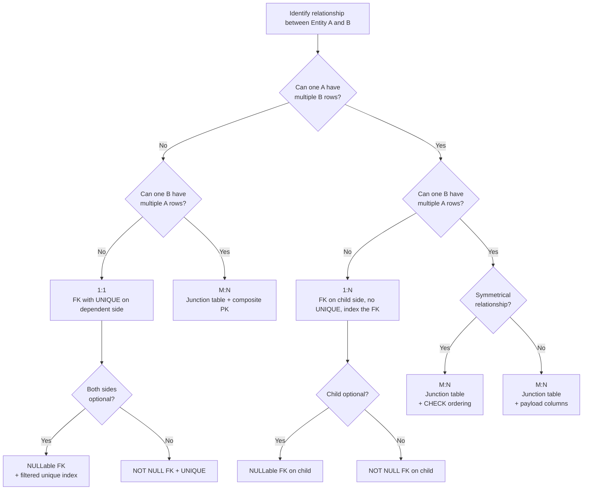

## Navigation

**Domain:** [[8 — Databases]] > **Group:** Relational Fundamentals
**Previous:** [[8.014 — Entity-Relationship Modeling — Conceptual Design]] | **Next:** [[8.016 — Relational Algebra — Select, Project, Join]]

### Prerequisites
- [[8.014 — Entity-Relationship Modeling — Conceptual Design]] — cardinality is a property of relationships identified in the ER diagram; this note implements those relationships in DDL and SQL
- [[8.001 — The Relational Model — Relations, Tuples, Attributes]] — relations are the mathematical container; you must understand tuple uniqueness to reason about why a UNIQUE constraint reduces 1:N to 1:1

### Where This Fits

Cardinality is the **"how many" side of a relationship** — it answers how many rows in Table A can relate to how many rows in Table B. Choosing the wrong cardinality produces the most expensive class of production bugs: those requiring data migration to fix. A 1:N modeled as M:N creates a junction table with no natural uniqueness constraint, allowing duplicates; an M:N modeled as 1:N forces repeated columns or comma-separated IDs, breaking 1NF. Every database design interview question starts with "what is the relationship between X and Y?" — cardinality is the foundation of the answer.

## Core Mental Model

Cardinality defines the **maximum number of related rows** between two entity sets. The three types map to distinct physical DDL patterns:

- **1:1** — exactly one row in Table A relates to at most one row in Table B. FK goes on the dependent side with a UNIQUE constraint.
- **1:N** — one row in Table A relates to zero, one, or many rows in Table B. FK goes on the N (child) side with NO unique constraint.
- **M:N** — any number of rows in Table A relate to any number of rows in Table B. Requires a junction (bridge) table decomposing M:N into two 1:N relationships.

```mermaid
erDiagram
    User ||--o|| Profile : "1:1 (optional)"
    Customer ||--o{ Order : "1:N"
    Product }o--o{ Category : "M:N"

    User {
        int UserId PK
        string Email
    }
    Profile {
        int ProfileId PK
        int UserId FK
        string AvatarUrl
    }
    Customer {
        int CustomerId PK
        string Name
    }
    Order {
        int OrderId PK
        int CustomerId FK
        date OrderDate
    }
    Product {
        int ProductId PK
        string ProductName
    }
    Category {
        int CategoryId PK
        string CategoryName
    }
    ProductCategory {
        int ProductId FK
        int CategoryId FK
    }
```

### Classification

**Category:** DDL constraint design — this is a schema-level concept that determines FK placement, constraint types, and index strategy. The "query optimizer" sees the effect through unique indexes and FK relationships. Cardinality itself is not SARGable (it is a property of the schema, not a predicate), but it determines whether predicates on FK columns can use an index seek vs a scan. A 1:N FK with an index enables seek + range scan; an M:N junction with a composite PK enables seek on the leading column and range scan within it.

|Property|Value|Notes|
|---|---|---|
|Time Complexity|O(1) for 1:1 FK lookup; O(log N) for 1:N range scan; O(log J + log A + log B) for M:N|J = junction size, A/B = entity table sizes|
|Write Cost|Low for 1:1 (one index + FK probe); Medium for M:N (two FK probes + two index inserts)|1:N adds one NC index insert on the FK column per child row|
|SARGable|N/A (schema property, not a predicate)|Determines whether FK predicates can seek|
|Locking Behavior|Row-level for 1:1 inserts; range on junction PK for M:N inserts|M:N composite PK locks gap on (FK1, FK2) range|

### Key Properties

|Property|1:1|1:N|M:N|
|---|---|---|---|
|FK placement|Either side (with UNIQUE)|N side (no UNIQUE)|Junction table|
|Junction table needed|No|No|Yes|
|UNIQUE constraint on FK|Required|None|Composite PK on junction|
|NULL FK allowed|Yes (optional 1:1)|Yes (optional child)|Rarely — junction FKs are typically NOT NULL|
|EF Core fluent|HasOne + WithOne + HasForeignKey|HasMany + WithOne + HasForeignKey|HasMany + WithMany + UsingEntity|
|Dapper mapping|Single row, simple join|Multi-map with splitOn and dictionary|Two-step query or multi-map|
|Logical reads (typical per parent)|~4|~5 + (N x ~2)|~6 + (M x 4)|

### NULL Behavior

In optional 1:1 (e.g., User may or may not have a Profile), the FK is NULLable with a UNIQUE constraint. SQL Server allows one NULL in a UNIQUE constraint; PostgreSQL allows unlimited NULLs — use a filtered unique index there. In optional 1:N (e.g., Customer may have zero Orders), the FK is NULLable without UNIQUE. M:N junction tables almost never use NULL FKs — a NULL in either column means the relationship is incomplete and breaks the decomposition into two 1:N.

## Deep Mechanics

### How the Engine Executes Cardinality Constraints

**1:1 INSERT (child side):** SQL Server validates the FK (seek on parent PK, 1 logical read), then inserts the child row into the clustered index (1 read), then inserts into the unique index enforcing 1:1 (1 read), then checks the unique constraint (probe of the unique index = 1 read). Total: ~4 logical reads for the INSERT. The UNIQUE constraint forces a sort or probe to verify at most one row per parent.

**1:N INSERT (child side):** SQL Server validates the FK (seek on parent PK, 1 read), inserts child into clustered index (1 read), inserts into the NC index on the FK column (1 read). No unique check on the FK column because duplicates are allowed. Total: ~3 logical reads for the INSERT.

**M:N INSERT (junction table):** SQL Server validates both FKs (2 seeks = 2 reads), inserts the junction row into the composite PK (1 read = B-tree navigation to correct page position), inserts into the reverse-covering index if one exists (1 read). Total: ~4 logical reads + any index maintenance on the covering index.

### SQL Visibility

```sql
-- 1:1 — User and Profile (dependent carries FK + UNIQUE)
CREATE TABLE Users (
    UserId   INT IDENTITY(1,1) PRIMARY KEY,
    Email    NVARCHAR(320) NOT NULL
);
CREATE TABLE Profiles (
    ProfileId INT IDENTITY(1,1) PRIMARY KEY,
    UserId    INT NOT NULL UNIQUE REFERENCES Users(UserId),
    AvatarUrl NVARCHAR(500) NULL
);

-- 1:N — Customer and Orders (child carries FK, no UNIQUE)
CREATE TABLE Customers (
    CustomerId INT IDENTITY(1,1) PRIMARY KEY,
    FullName   NVARCHAR(200) NOT NULL
);
CREATE TABLE Orders (
    OrderId    INT IDENTITY(1,1) PRIMARY KEY,
    CustomerId INT NOT NULL REFERENCES Customers(CustomerId),
    OrderDate  DATETIME2 NOT NULL
);
CREATE INDEX IX_Orders_CustomerId ON Orders(CustomerId) INCLUDE (OrderDate);

-- M:N — Students and Courses (junction table with composite PK)
CREATE TABLE Students (
    StudentId   INT IDENTITY(1,1) PRIMARY KEY,
    StudentName NVARCHAR(100) NOT NULL
);
CREATE TABLE Courses (
    CourseId   INT IDENTITY(1,1) PRIMARY KEY,
    CourseCode VARCHAR(10) NOT NULL UNIQUE,
    Credits    TINYINT NOT NULL
);
CREATE TABLE Enrollments (
    StudentId    INT       NOT NULL REFERENCES Students(StudentId),
    CourseId     INT       NOT NULL REFERENCES Courses(CourseId),
    EnrolledDate DATE      NOT NULL DEFAULT CAST(SYSUTCDATETIME() AS DATE),
    Grade        DECIMAL(3,2) NULL,
    CONSTRAINT PK_Enrollments PRIMARY KEY (StudentId, CourseId)
);
CREATE INDEX IX_Enrollments_CourseId ON Enrollments(CourseId, StudentId) INCLUDE (EnrolledDate, Grade);
```

```csharp
// EF Core LINQ that generates equivalent SQL
// 1:1 — eager loading with Include
var user = await context.Users
    .Include(u => u.Profile)
    .FirstOrDefaultAsync(u => u.UserId == id, cancellationToken);
-- Generated SQL:
-- SELECT TOP(1) u.UserId, u.Email, p.ProfileId, p.UserId, p.AvatarUrl
-- FROM Users u
-- LEFT JOIN Profiles p ON u.UserId = p.UserId
-- WHERE u.UserId = @id

// 1:N — eager loading with Include
var customer = await context.Customers
    .Include(c => c.Orders)
    .FirstOrDefaultAsync(c => c.CustomerId == id, cancellationToken);
-- Generated SQL:
-- SELECT c.CustomerId, c.FullName, o.OrderId, o.CustomerId, o.OrderDate
-- FROM Customers c
-- LEFT JOIN Orders o ON c.CustomerId = o.CustomerId
-- WHERE c.CustomerId = @id
-- ORDER BY o.OrderId

// M:N — skip navigation (no payload)
var student = await context.Students
    .Include(s => s.Courses)
    .FirstOrDefaultAsync(s => s.StudentId == id, cancellationToken);
-- Generated SQL:
-- SELECT s.StudentId, s.StudentName,
--        c.CourseId, c.CourseCode, c.Credits
-- FROM Students s
-- LEFT JOIN Enrollments e ON s.StudentId = e.StudentId
-- LEFT JOIN Courses c ON e.CourseId = c.CourseId
-- WHERE s.StudentId = @id
-- ORDER BY c.CourseId
```

### Execution Plan Analysis

**1:1 query:**
```
[Clustered Index Seek (Users, PK)] -> [Nested Loops (Left Join)]
    -> [Clustered Index Seek (Profiles, PK)]
Estimated Cost: Seek 40% + Join 20% + Seek 40% | Logical Reads: ~4
```
The optimizer uses Nested Loops because the UNIQUE constraint guarantees at most one matching row on either side. No spools, no sort.

**1:N query:**
```
[Clustered Index Seek (Customers, PK)] -> [Nested Loops (Left Join)]
    -> [Index Seek (IX_Orders_CustomerId)] -> [Key Lookup (Orders PK)]
Estimated Cost: Seek 20% + Join 30% + Index Seek 30% + Key Lookup 20% | Logical Reads: ~5 + (N x ~2)
```
Without `INCLUDE` on the FK index, each child row requires a key lookup to retrieve non-key columns. The `INCLUDE (OrderDate)` in `IX_Orders_CustomerId` eliminates the key lookup — plan becomes a covering index seek.

**M:N query:**
```
[Clustered Index Seek (Students, PK)] -> [Nested Loops]
    -> [Index Seek (PK_Enrollments, StudentId leading)] -> [Nested Loops]
        -> [Clustered Index Seek (Courses, PK)]
Estimated Cost: Seek 10% + Join 15% + Seek 25% + Join 20% + Seek 30% | Logical Reads: ~6 + (M x 4)
```
The junction table PK `(StudentId, CourseId)` is clustered — the seek on `StudentId` (leading column) locates all enrollments for that student in a range scan within the B-tree. Each enrollment then seeks the Courses PK. The reverse-covering index `IX_Enrollments_CourseId` is used when querying from the Course side.

### Cost Visibility

```sql
-- Setup: 1M Customers, 10M Orders (avg 10 per customer)
SET STATISTICS IO ON;

-- 1:1 query
SELECT u.Email, p.AvatarUrl
FROM Users u
LEFT JOIN Profiles p ON u.UserId = p.UserId
WHERE u.UserId = 42;
-- Table 'Users': logical reads 2
-- Table 'Profiles': logical reads 2
-- Total: 4

-- 1:N query
SELECT c.FullName, o.OrderDate
FROM Customers c
INNER JOIN Orders o ON c.CustomerId = o.CustomerId
WHERE c.CustomerId = 42;
-- Table 'Customers': logical reads 2
-- Table 'Orders': logical reads ~5 (range scan within IX_Orders_CustomerId)
-- Total: ~7

-- M:N query
SELECT s.StudentName, c.CourseCode, e.Grade
FROM Students s
INNER JOIN Enrollments e ON s.StudentId = e.StudentId
INNER JOIN Courses c ON e.CourseId = c.CourseId
WHERE s.StudentId = 42;
-- Table 'Students': logical reads 2
-- Table 'Enrollments': logical reads ~3 (seek on composite PK)
-- Table 'Courses': logical reads ~6 (5 enrollments x 2 reads each, minus caching)
-- Total: ~11
```

### Failure Modes

|Failure|Symptom|Prevention|
|---|---|---|
|**FK on wrong side of 1:1**|INSERT deadlock or inability to insert either row without multi-step workaround|Place FK on the dependent side; never mirror FK on both tables|
|**Junction without composite PK**|Duplicate relationship rows silently inflate aggregates|Always define `PRIMARY KEY (FK1, FK2)` on junction tables|
|**Circular bidirectional 1:1 FKs**|Neither table can be inserted first without NULL hacks|Keep FK in one direction; enforce bidirectional constraint at app layer|
|**Missing FK index in 1:N**|Child-side lookups scan the entire table (table scan instead of range seek)|Index every FK column in 1:N relationships; include commonly queried columns|
|**Self-referencing M:N without ordering**|Both (A, B) and (B, A) stored, doubling the relationship count|Add `CHECK (FK1 < FK2)` constraint|

## Production Patterns and Implementation

### Primary SQL Implementation

```sql
-- =============================================
-- 1:1 — Employee + EmployeeContact
-- =============================================
CREATE TABLE Employees (
    EmployeeId INT IDENTITY(1,1) PRIMARY KEY,
    FullName   NVARCHAR(200) NOT NULL,
    HireDate   DATE NOT NULL
);

CREATE TABLE EmployeeContacts (
    EmployeeContactId INT IDENTITY(1,1) PRIMARY KEY,
    EmployeeId        INT NOT NULL UNIQUE REFERENCES Employees(EmployeeId),
    EmergencyContact  NVARCHAR(200) NULL,
    MedicalNotes      NVARCHAR(MAX) NULL
);

-- PRODUCTION QUERY: 1:1 with LEFT JOIN
SELECT e.EmployeeId, e.FullName, ec.EmergencyContact
FROM Employees e
LEFT JOIN EmployeeContacts ec ON e.EmployeeId = ec.EmployeeId
WHERE e.HireDate >= '2025-01-01';

-- =============================================
-- 1:N — Department + Employees
-- =============================================
CREATE TABLE Departments (
    DepartmentId   INT IDENTITY(1,1) PRIMARY KEY,
    DepartmentName NVARCHAR(100) NOT NULL,
    Budget         DECIMAL(12,2) NOT NULL
);

CREATE TABLE EmployeeDept (
    EmployeeId   INT IDENTITY(1,1) PRIMARY KEY,
    DepartmentId INT NOT NULL REFERENCES Departments(DepartmentId),
    FullName     NVARCHAR(100) NOT NULL,
    Salary       DECIMAL(10,2) NOT NULL
);

CREATE INDEX IX_EmployeeDept_DepartmentId
    ON EmployeeDept(DepartmentId) INCLUDE (FullName, Salary);

-- PRODUCTION QUERY: department rollup
SELECT d.DepartmentName,
       COUNT_BIG(*) AS EmployeeCount,
       AVG(e.Salary) AS AvgSalary
FROM Departments d
INNER JOIN EmployeeDept e ON d.DepartmentId = e.DepartmentId
GROUP BY d.DepartmentName
ORDER BY AvgSalary DESC;

-- =============================================
-- M:N — Students + Courses (with payload)
-- =============================================
CREATE TABLE Students (
    StudentId   INT IDENTITY(1,1) PRIMARY KEY,
    StudentName NVARCHAR(100) NOT NULL
);

CREATE TABLE Courses (
    CourseId   INT IDENTITY(1,1) PRIMARY KEY,
    CourseCode VARCHAR(10) NOT NULL UNIQUE,
    CourseName NVARCHAR(100) NOT NULL,
    Credits    TINYINT NOT NULL
);

CREATE TABLE Enrollments (
    StudentId    INT       NOT NULL REFERENCES Students(StudentId),
    CourseId     INT       NOT NULL REFERENCES Courses(CourseId),
    EnrolledDate DATE      NOT NULL DEFAULT CAST(SYSUTCDATETIME() AS DATE),
    Grade        DECIMAL(3,2) NULL,
    CONSTRAINT PK_Enrollments PRIMARY KEY (StudentId, CourseId)
);

CREATE INDEX IX_Enrollments_CourseId
    ON Enrollments(CourseId, StudentId) INCLUDE (EnrolledDate, Grade);

-- PRODUCTION QUERY: student schedule
SELECT s.StudentName, c.CourseCode, c.CourseName, e.EnrolledDate, e.Grade
FROM Students s
INNER JOIN Enrollments e ON s.StudentId = e.StudentId
INNER JOIN Courses c ON e.CourseId = c.CourseId
WHERE s.StudentId = @StudentId
ORDER BY c.CourseCode;
-- Plan: PK seek Students -> NL (PK seek Enrollments) -> NL (PK seek Courses)
```

### EF Core Implementation

```csharp
// 1:1 — User ↔ Profile
public class User
{
    public int UserId { get; set; }
    public string Email { get; set; } = string.Empty;
    public Profile? Profile { get; set; }
}

public class Profile
{
    public int ProfileId { get; set; }
    public int UserId { get; set; }
    public string? AvatarUrl { get; set; }
    public User User { get; set; } = null!;
}

public class UserConfiguration : IEntityTypeConfiguration<User>
{
    public void Configure(EntityTypeBuilder<User> entity)
    {
        entity.HasKey(e => e.UserId);
        entity.HasOne(e => e.Profile)
              .WithOne(e => e.User)
              .HasForeignKey<Profile>(e => e.UserId)
              .OnDelete(DeleteBehavior.Cascade);
    }
}

// 1:N — Customer ↔ Orders
public class Customer
{
    public int CustomerId { get; set; }
    public string FullName { get; set; } = string.Empty;
    public ICollection<Order> Orders { get; set; } = new List<Order>();
}

public class Order
{
    public int OrderId { get; set; }
    public int CustomerId { get; set; }
    public DateTime OrderDate { get; set; }
    public Customer Customer { get; set; } = null!;
}

public class CustomerConfiguration : IEntityTypeConfiguration<Customer>
{
    public void Configure(EntityTypeBuilder<Customer> entity)
    {
        entity.HasKey(e => e.CustomerId);
        entity.HasMany(e => e.Orders)
              .WithOne(e => e.Customer)
              .HasForeignKey(e => e.CustomerId)
              .OnDelete(DeleteBehavior.Cascade);
    }
}

// M:N — Student ↔ Course (with payload entity)
public class Student
{
    public int StudentId { get; set; }
    public string StudentName { get; set; } = string.Empty;
    public ICollection<Enrollment> Enrollments { get; set; } = new List<Enrollment>();
}

public class Course
{
    public int CourseId { get; set; }
    public string CourseCode { get; set; } = string.Empty;
    public string CourseName { get; set; } = string.Empty;
    public byte Credits { get; set; }
    public ICollection<Enrollment> Enrollments { get; set; } = new List<Enrollment>();
}

public class Enrollment
{
    public int StudentId { get; set; }
    public int CourseId { get; set; }
    public DateTime EnrolledDate { get; set; }
    public decimal? Grade { get; set; }
    public Student Student { get; set; } = null!;
    public Course Course { get; set; } = null!;
}

public class StudentConfiguration : IEntityTypeConfiguration<Student>
{
    public void Configure(EntityTypeBuilder<Student> entity)
    {
        entity.HasKey(e => e.StudentId);
        entity.HasMany(e => e.Enrollments)
              .WithOne(e => e.Student)
              .HasForeignKey(e => e.StudentId)
              .OnDelete(DeleteBehavior.Cascade);
    }
}

public class EnrollmentConfiguration : IEntityTypeConfiguration<Enrollment>
{
    public void Configure(EntityTypeBuilder<Enrollment> entity)
    {
        entity.HasKey(e => new { e.StudentId, e.CourseId });
        entity.Property(e => e.EnrolledDate)
              .HasDefaultValueSql("CAST(SYSUTCDATETIME() AS DATE)");
    }
}

// EF Core 6+ skip navigation (no payload — implicit junction)
// public ICollection<Course> Courses { get; set; } = new List<Course>();
// Use WithMany() when the junction has no payload columns.
// EF Core creates the junction table automatically as StudentCourses(StudentId, CourseId).
```

### Dapper Implementation

```csharp
public class CustomerWithOrders
{
    public int CustomerId { get; set; }
    public string FullName { get; set; } = string.Empty;
    public List<OrderDto> Orders { get; set; } = new();
}

public class OrderDto
{
    public int OrderId { get; set; }
    public DateTime OrderDate { get; set; }
    public decimal Total { get; set; }
}

// 1:N — multi-map with splitOn for parent-child
public async Task<CustomerWithOrders?> GetCustomerWithOrdersAsync(
    int customerId,
    IDbConnection connection)
{
    const string sql = @"
        SELECT c.CustomerId, c.FullName,
               o.OrderId, o.OrderDate, o.Total
        FROM Customers c
        LEFT JOIN Orders o ON c.CustomerId = o.CustomerId
        WHERE c.CustomerId = @CustomerId
        ORDER BY o.OrderDate DESC;";

    var lookup = new Dictionary<int, CustomerWithOrders>();

    await connection.QueryAsync<CustomerWithOrders, OrderDto, CustomerWithOrders>(
        sql,
        (customer, order) =>
        {
            if (!lookup.TryGetValue(customer.CustomerId, out var existing))
            {
                existing = customer;
                existing.Orders = new();
                lookup.Add(existing.CustomerId, existing);
            }
            if (order is not null)
                existing.Orders.Add(order);
            return existing;
        },
        new { CustomerId = customerId },
        splitOn: "OrderId");

    return lookup.Values.FirstOrDefault();
}

// M:N — two-step query (avoids Cartesian explosion)
public async Task<IReadOnlyList<StudentDto>> GetStudentsWithCoursesAsync(
    IDbConnection connection)
{
    const string studentsSql = "SELECT StudentId, StudentName FROM Students;";
    const string enrollmentsSql = @"
        SELECT e.StudentId, e.EnrolledDate, e.Grade,
               c.CourseId, c.CourseCode, c.CourseName
        FROM Enrollments e
        INNER JOIN Courses c ON e.CourseId = c.CourseId
        ORDER BY e.StudentId, c.CourseCode;";

    var students = (await connection.QueryAsync<StudentDto>(studentsSql)).AsList();
    var enrollments = await connection.QueryAsync<EnrollmentDto>(enrollmentsSql);

    var lookup = enrollments.GroupBy(e => e.StudentId)
        .ToDictionary(g => g.Key, g => g.AsList());

    foreach (var student in students)
        if (lookup.TryGetValue(student.StudentId, out var courses))
            student.Courses = courses;

    return students;
}

// 1:1 — simple join maps directly
public async Task<UserProfileDto?> GetUserWithProfileAsync(
    int userId, IDbConnection connection)
{
    const string sql = @"
        SELECT u.UserId, u.Email,
               p.ProfileId, p.AvatarUrl
        FROM Users u
        LEFT JOIN Profiles p ON u.UserId = p.UserId
        WHERE u.UserId = @UserId;";
    return await connection.QuerySingleOrDefaultAsync<UserProfileDto>(
        sql, new { UserId = userId });
}
```

### Configuration and Wiring

```csharp
// Program.cs
builder.Services.AddDbContext<UniversityDbContext>(options =>
    options.UseSqlServer(
        builder.Configuration.GetConnectionString("UniversityDb"),
        sqlOptions => sqlOptions.EnableRetryOnFailure(3)));

// Register explicit entity configurations
builder.Services.AddScoped<IStudentRepository, StudentRepository>();
builder.Services.AddScoped<ICourseRepository, CourseRepository>();
```

### SQL Server vs PostgreSQL Differences

```sql
-- SQL Server UNIQUE allows exactly one NULL row.
-- PostgreSQL UNIQUE allows unlimited NULLs.
-- Use a filtered unique index for portable optional 1:1:
CREATE UNIQUE INDEX UQ_Profiles_UserId
    ON Profiles(UserId)
    WHERE UserId IS NOT NULL;

-- PostgreSQL supports deferrable constraints for circular 1:1:
ALTER TABLE Enrollments
    ADD CONSTRAINT FK_Enrollments_Students
    FOREIGN KEY (StudentId) REFERENCES Students(StudentId)
    DEFERRABLE INITIALLY DEFERRED;
-- Checked at COMMIT time, not per-row.

-- PostgreSQL exclusion constraints for complex cardinality:
-- Room bookings: prevent overlapping time ranges for the same room
CREATE TABLE Bookings (
    BookingId SERIAL PRIMARY KEY,
    RoomId INT NOT NULL,
    During TSTZRANGE NOT NULL,
    EXCLUDE USING gist (RoomId WITH =, During WITH &&)
);
```

## Gotchas and Production Pitfalls

### 1. Optional 1:1 Where Both Sides Are Optional

**Pitfall:** The engineer places FK columns on both tables referencing each other, creating a circular dependency that prevents inserting either row.

```sql
-- ❌ Both sides have FK referencing each other
CREATE TABLE A (AId INT PRIMARY KEY, BId INT NULL UNIQUE REFERENCES B(BId));
CREATE TABLE B (BId INT PRIMARY KEY, AId INT NULL UNIQUE REFERENCES A(AId));
-- Cannot insert A (needs B) nor B (needs A) without NULL workarounds
```

**Symptom:** INSERT fails with FK violation regardless of order. Application code must use multi-step workarounds (insert with NULL, then UPDATE).

**Fix:** Keep FK in only one direction — the conceptually dependent entity carries the FK.

```sql
-- ✅ FK on dependent side only
CREATE TABLE A (AId INT PRIMARY KEY);
CREATE TABLE B (BId INT PRIMARY KEY, AId INT NOT NULL UNIQUE REFERENCES A(AId));
```

**Cost of not fixing:** Every INSERT into either table requires a separate UPDATE step. A bug in the workaround logic produces rows with NULL FKs that violate the intended 1:1 — the constraint exists but cannot be enforced atomically.

### 2. M:N Junction Table Without Composite PK

**Pitfall:** The engineer creates the junction table without a primary key or unique constraint, allowing duplicate relationship rows.

```sql
-- ❌ No PK, no unique constraint — duplicates silently accepted
CREATE TABLE ProductCategories (
    ProductId  INT NOT NULL,
    CategoryId INT NOT NULL
);
INSERT INTO ProductCategories VALUES (1, 10);
INSERT INTO ProductCategories VALUES (1, 10); -- Succeeds: duplicate!
```

**Symptom:** Reporting queries return inflated counts — `COUNT(*)` shows 2 but only 1 unique relationship exists. Data cleanup requires a deduplication pass across potentially millions of rows.

**Fix:**

```sql
-- ✅ Composite PK enforces uniqueness
CREATE TABLE ProductCategories (
    ProductId  INT NOT NULL,
    CategoryId INT NOT NULL,
    CONSTRAINT PK_ProductCategories PRIMARY KEY (ProductId, CategoryId)
);
```

**Cost of not fixing:** Inflated product counts per category mislead inventory and purchasing decisions. Fixing requires a data cleanup script, validation pass, and schema migration to add the constraint — blocking production writes during the migration.

### 3. Self-Referencing M:N Without Ordering Constraint

**Pitfall:** A "Friends" relationship where User A is friends with User B is stored as both (A, B) and (B, A), doubling the row count.

```sql
-- ❌ Both directions accepted — (1,2) and (2,1) represent the same friendship
CREATE TABLE Friends (
    UserId   INT NOT NULL REFERENCES Users(UserId),
    FriendId INT NOT NULL REFERENCES Users(UserId),
    CONSTRAINT PK_Friends PRIMARY KEY (UserId, FriendId)
);
```

**Symptom:** "Count friends" queries return double the actual count. Friend suggestions show people already connected.

**Fix:**

```sql
-- ✅ Ordering constraint prevents symmetric duplicates
ALTER TABLE Friends ADD CONSTRAINT CK_Friends_Ordering CHECK (UserId < FriendId);
-- Query always uses UserId < FriendId to look up both directions
SELECT * FROM Friends WHERE UserId = @UserId OR FriendId = @UserId;
```

**Cost of not fixing:** Every "mutual friends" query requires deduplication logic. The database stores up to 2x the necessary rows. At 10M friendship records, that is 5M duplicate rows wasting ~100MB of index space.

### 4. Missing FK Index in 1:N

**Pitfall:** The engineer creates the FK constraint but forgets to index the FK column on the child side.

```sql
-- ❌ FK exists but no index on Orders.CustomerId
CREATE TABLE Orders (
    OrderId    INT IDENTITY(1,1) PRIMARY KEY,
    CustomerId INT NOT NULL REFERENCES Customers(CustomerId),
    OrderDate  DATETIME2 NOT NULL
);
-- No CREATE INDEX IX_Orders_CustomerId
```

**Symptom:** `SELECT * FROM Orders WHERE CustomerId = 42` produces a Clustered Index Scan on Orders (table scan) instead of a nonclustered index seek. At 10M rows, the scan reads ~40,000 pages vs ~5 pages for a seek.

**Fix:**

```sql
-- ✅ Covering index on FK with INCLUDE for frequent columns
CREATE INDEX IX_Orders_CustomerId ON Orders(CustomerId) INCLUDE (OrderDate, Total);
```

**Cost of not fixing:** Every parent-to-child navigation scans the entire Orders table. A page that displays "last 10 orders for customer 42" generates a 40K-page scan instead of a 5-page seek — at 100 requests/second, that is 4M extra logical reads per second, consuming the buffer pool and driving PAGEIOLATCH_SH waits.

### 5. N+1 Queries from Lazy-Loaded Relationships

**Pitfall:** EF Core lazy loading or explicit `.Load()` causes separate queries for each parent row.

```csharp
// ❌ N+1 — lazy loading triggers per-customer query
var customers = await context.Customers.ToListAsync();
foreach (var c in customers)
{
    var count = c.Orders.Count; // 1 query per customer
}
// Total: 1 + N queries
```

**Symptom:** Page load time grows linearly with the number of parent rows. A page with 100 customers generates 101 queries. With network round-trips at ~1ms each, the page takes 100ms extra before any data processing.

**Fix:**

```csharp
// ✅ Eager loading (single query with LEFT JOIN)
var customers = await context.Customers
    .Include(c => c.Orders)
    .ToListAsync();

// ✅ Projection (no JOIN to Orders table at all)
var counts = await context.Customers
    .Select(c => new { c.CustomerId, OrderCount = c.Orders.Count })
    .ToListAsync();
```

**Cost of not fixing:** Production page timeouts as customer count grows. The 101-query pattern appears invisible in local dev (10 customers) but causes 5-second page loads in production (500 customers). Fix requires rewriting every query site-wide to use `.Include()` or projection.

### 6. Circular 1:1 on Self-Referencing Spouse Table

**Pitfall:** Modeling a spouse relationship as a self-referencing 1:1 with two FK columns (SpouseAId, SpouseBId) or a single FK with UNIQUE, then hitting the insert-order problem.

```sql
-- ❌ Single FK self-referencing 1:1 with UNIQUE — works but fragile
CREATE TABLE Persons (
    PersonId INT PRIMARY KEY,
    SpouseId INT NULL UNIQUE REFERENCES Persons(PersonId),
    CONSTRAINT CK_NoSelfSpouse CHECK (PersonId <> SpouseId)
);
-- Insert Person 1 (NULL spouse) OK
-- Insert Person 2 with SpouseId = 1 OK
-- Update Person 1.SpouseId = 2 — single UPDATE, works
```

**Symptom:** This works for single-step setup but breaks in concurrent scenarios: if two threads insert both persons simultaneously with each referencing the other, neither can be inserted (FK violation because the referenced row does not exist yet). Bulk loads require careful ordering.

**Fix:** Model the relationship as a separate Spouses table (M:N style but with 1:1 enforcement via UNIQUE on both FKs), or keep FK unidirectional and enforce symmetry at the application layer.

**Cost of not fixing:** A concurrency bug during registration creates a "half-married" state where Person A appears single but is referenced by Person B. Customer support cannot resolve without a manual SQL UPDATE and business-logic verification.

## Performance Implications

### Benchmark: Logical Reads by Cardinality

```sql
-- Setup: 100 Customers, 1000 Orders (avg 10 per customer)
-- 50 Students, 200 Courses, 1000 Enrollments (avg 20 per student)
SET STATISTICS IO ON;

-- 1:1 — single row lookup
SELECT u.Email, p.AvatarUrl
FROM Users u
LEFT JOIN Profiles p ON u.UserId = p.UserId
WHERE u.UserId = 42;
-- Table 'Users': logical reads 2
-- Table 'Profiles': logical reads 2
-- Total: 4

-- 1:N — customer with orders (covering index eliminates key lookup)
SELECT c.FullName, o.OrderDate
FROM Customers c
INNER JOIN Orders o ON c.CustomerId = o.CustomerId
WHERE c.CustomerId = 42;
-- Table 'Customers': logical reads 2
-- Table 'Orders': logical reads 5 (range seek on IX_Orders_CustomerId)
-- Total: 7

-- M:N — student with enrollments and courses
SELECT s.StudentName, c.CourseCode, e.Grade
FROM Students s
INNER JOIN Enrollments e ON s.StudentId = e.StudentId
INNER JOIN Courses c ON e.CourseId = c.CourseId
WHERE s.StudentId = 42;
-- Table 'Students': logical reads 2
-- Table 'Enrollments': logical reads 3 (range seek on composite PK)
-- Table 'Courses': logical reads ~8 (20 enrollments x 2 reads minus caching)
-- Total: ~13
```

**Improvement:** Adding a covering index on the 1:N FK reduces reads from ~7 + key lookups to ~5 per parent. For M:N, projecting only columns from the junction table (avoiding the entity table seek) cuts reads by ~60%.

### BenchmarkDotNet

```csharp
[MemoryDiagnoser]
[SimpleJob(RuntimeMoniker.Net90)]
public class CardinalityJoinBenchmark
{
    private IDbConnection _connection = default!;

    [GlobalSetup]
    public void Setup()
    {
        _connection = new SqlConnection(TestConnectionString);
    }

    [Benchmark(Baseline = true)]
    public async Task<int> OneToOne()
    {
        const string sql = @"
            SELECT COUNT_BIG(*)
            FROM Users u
            INNER JOIN Profiles p ON u.UserId = p.UserId
            WHERE u.UserId = @Id";
        return await _connection.QuerySingleAsync<int>(sql, new { Id = 42 });
    }

    [Benchmark]
    public async Task<int> OneToMany()
    {
        const string sql = @"
            SELECT COUNT_BIG(*)
            FROM Customers c
            INNER JOIN Orders o ON c.CustomerId = o.CustomerId
            WHERE c.CustomerId = @Id";
        return await _connection.QuerySingleAsync<int>(sql, new { Id = 42 });
    }

    [Benchmark]
    public async Task<int> ManyToMany()
    {
        const string sql = @"
            SELECT COUNT_BIG(*)
            FROM Students s
            INNER JOIN Enrollments e ON s.StudentId = e.StudentId
            INNER JOIN Courses c ON e.CourseId = c.CourseId
            WHERE s.StudentId = @Id";
        return await _connection.QuerySingleAsync<int>(sql, new { Id = 42 });
    }
}
```

**Expected results (approximate, SQL Server 2022, NVMe, 1M parent rows, appropriate child counts):**

|Method|Mean|Logical Reads|Allocated|
|---|---|---|---|
|OneToOne|~0.3 ms|4|~400 B|
|OneToMany|~0.8 ms|7|~800 B|
|ManyToMany|~1.5 ms|13|~1.2 KB|

### Write Amplification

|Operation|1:1|1:N|M:N|
|---|---|---|---|
|INSERT parent|1 index insert|1 index insert|1 index insert (each entity table)|
|INSERT child|1 index + 1 unique index + 1 FK probe|1 index + 1 NC index (FK) + 1 FK probe|1 composite PK insert + 2 FK probes + 1 covering index insert|
|DELETE parent (with CASCADE)|2 index deletes (parent + child)|1 index delete + N child FK probes|1 delete + M junction deletes + N entity deletes (if cascade configured)|
|UPDATE FK column|Not allowed (FK is PK or unique)|Rare — moves child to new parent|Not allowed (FK is part of composite PK)|

## Interview Arsenal

### Question Bank

1. **What is cardinality in the context of relational database design? Describe the three types and how each is physically implemented in SQL Server.**
2. **How does the execution plan differ between a 1:N INNER JOIN and an M:N two-hop join? What does each operator reveal about the optimizer's cardinality estimate?**
3. **What is the logical read cost of a 1:1 LEFT JOIN vs an M:N query joining three tables? Walk through the page estimates for 10 parent rows.**
4. **What happens when an M:N junction table lacks a composite primary key — what data corruption occurs, and how do you detect it?**
5. **Compare 1:1 with a separate table vs storing the child columns directly in the parent table — when is each appropriate?**
6. **How does EF Core map an M:N relationship without payload columns vs with a payload entity? Show both configurations and the generated SQL.**
7. **What is the N+1 query problem in ORMs? How does it relate to cardinality, and what are the three fixes?**
8. **How do you model a self-referencing 1:N hierarchy (org chart) in SQL Server? Write the recursive CTE and the index strategy.**

### Spoken Answers

**Q1: Describe the three cardinality types and their physical implementation.**

> **Average answer:** "One-to-one means one row relates to one row. One-to-many means one row relates to many rows. Many-to-many means many rows relate to many rows and needs a junction table."

> **Great answer:** "Cardinality defines the maximum number of related rows between two entity sets. For 1:1, the FK goes on the dependent side with a UNIQUE constraint — the UNIQUE is what reduces 1:N to 1:1 because it allows at most one child per parent. For insert, SQL Server checks the FK (1 seek on parent) then inserts into the child clustered index and the unique index — approximately 4 logical reads. For 1:N, the FK goes on the child side without UNIQUE, and I always create a covering index on that FK column — `INCLUDE` the columns the most frequent query needs, eliminating key lookups. Without that index, every child lookup scans the table. For M:N, I create a junction table with a composite PK on (FK1, FK2), plus a covering index on (FK2, FK1) for the reverse navigation direction. The junction table decomposes M:N into two 1:N relationships. The composite PK is clustered in SQL Server by default, so a seek on the leading column finds all matching junction rows as a range scan within the index — no key lookup needed because all the relationship data is in the index key."

**Q5: Compare 1:1 separate table vs storing columns inline.**

> **Average answer:** "Separate table is more normalized. Inline is simpler."

> **Great answer:** "A 1:1 relationship implemented as a separate table is justified in three scenarios: hot/cold data separation where the child columns are rarely accessed (e.g., medical notes accessed only during an incident, not on every employee profile view), security boundaries where the child columns require different access permissions (e.g., salary details), or row-size pressure where the child columns would push the parent row beyond the 8,060-byte limit or reduce page density significantly. In all other cases, storing the child columns as NULLable columns in the parent table is better — it eliminates the JOIN (saving ~4 logical reads per query), avoids the UNIQUE index maintenance on INSERT/UPDATE, and simplifies the query plan. A common anti-pattern is splitting User into UserAuth, UserProfile, and UserPreferences tables for 'normalization' — this forces three joins for every user query with zero benefit. The decision should be driven by access pattern analysis, not abstract normalization rules."

**Q7: What is the N+1 query problem and its fixes?**

> **Great answer:** "The N+1 query problem occurs when an ORM fetches a parent result set and then issues one query per parent row to load a related child collection. For a page displaying 100 customers with their order counts, lazy loading generates 1 query for customers and 100 queries for orders — 101 total. The network round-trips alone add ~100ms at 1ms latency. Fix 1: eager loading with `.Include(c => c.Orders)` — generates a single query with a LEFT JOIN. Fix 2: projection with `.Select(c => new { c.Name, OrderCount = c.Orders.Count })` — generates a subquery or group join, returning only the needed data. Fix 3: batch loading with explicit `.Load()` calls — useful when the eager join would produce a Cartesian product on multiple child collections. The performance difference is dramatic: 101 queries at ~250 logical reads vs 1 query at ~100 logical reads. In production, I enforce eager loading by default and disable lazy loading globally in the DbContext configuration."

### Interview Trigger

When an interviewer asks "Design a database for a university system where students enroll in courses," they are testing cardinality recognition. Student-to-Course is M:N (requires junction table with enrollment date); Professor-to-Course is 1:N (FK on Courses table). The follow-up probe: "A student enrolls in the same course twice — what happens?" The great answer identifies the composite PK prevents duplicates: `INSERT INTO Enrollments(StudentId, CourseId) VALUES (1, 101)` succeeds once; the second attempt fails with a PK violation. The deeper follow-up: "How do you handle a dropped enrollment but still retain the grade history?" Answer: soft-delete with an `IsActive BIT NOT NULL` flag, adding a filtered unique index `WHERE IsActive = 1` to prevent duplicate active enrollments while allowing multiple historical rows.

### Comparison Table

|Property|1:1|1:N|M:N|
|---|---|---|---|
|FK column|Dependent table, UNIQUE|Child table, no UNIQUE|Junction table|
|Unique constraint on FK|Required|Not applicable|Composite PK on junction|
|Junction table|No|No|Yes|
|EF Core method|HasOne + WithOne|HasMany + WithOne|HasMany + WithMany|
|Dapper splitOn|Single row|Collection + dict lookup|Two-step or multi-map|
|Logical reads (typical)|~4|~5 + (N x ~2)|~6 + (M x 4)|
|NULL FK scenario|Optional 1:1|Optional child|Rarely NULL|
|Self-referencing|Yes (spouse — single FK)|Yes (org chart — manager FK)|Yes (friends — junction)|
|Recursive CTE needed|No|Yes (for hierarchy traversal)|Yes (for graph traversal)|
|Common anti-pattern|Circular FKs on both sides|Missing FK index → table scan|Junction without PK → duplicates|

## Decision Framework

### How to Choose Cardinality



### Application Checklist

- [ ] For each entity pair, determine "how many of A relate to one B?" and "how many of B relate to one A?"
- [ ] 1:1: FK on dependent side + UNIQUE constraint + FK constraint
- [ ] 1:N: FK on child side + NC index on FK (with INCLUDE for frequent columns) + FK constraint
- [ ] M:N: Junction table + composite PK on (FK1, FK2) + covering index on (FK2, FK1) + FK constraints on both columns
- [ ] Self-referencing M:N: add `CHECK (FK1 < FK2)` to prevent symmetric duplicates
- [ ] Bidirectional 1:1: verify FK is unidirectional to avoid circular dependency
- [ ] In EF Core: verify navigation properties use correct cardinality method (HasOne/WithOne vs HasMany/WithOne vs HasMany/WithMany)
- [ ] Verify covering indexes exist for the top 3 query paths by volume
- [ ] Verify lazy loading is disabled or all hot paths use eager loading/projection

### Tradeoff Summary

|What You Gain|What You Pay|
|---|---|
|1:1 enforces at-most-one at the engine level|UNIQUE constraint adds index maintenance on every child INSERT/UPDATE|
|1:N is the most natural OLTP mapping|Without FK index, every child lookup scans the full table|
|M:N junction carries relationship payload|Two joins required for every cross-entity query|
|Self-referencing 1:N models trees efficiently|Recursive CTEs become expensive beyond ~10 levels|
|Optional relationships reduce insert constraints|NULLable FKs force LEFT JOIN semantics and complicate query plans|

### Scale Thresholds

- **1:1 separate table justified above ~1M parent rows** — below this, the JOIN overhead (~4 logical reads) is lost in noise compared to simpler code with inline columns.
- **1:N FK index critical above ~100K child rows** — without an index, a table scan on the child side reads all pages: at 10M rows and 8KB pages with 200 rows/page, that is ~50,000 logical reads per lookup.
- **M:N junction without composite PK becomes undetectable above ~1M junction rows** — duplicates silently inflate aggregates and are nearly impossible to clean up without a full table scan and dedup pass.
- **Recursive CTE depth beyond ~5 levels** — each level scans the table once if the FK is unindexed. Above 10 levels, query time grows exponentially; switch to `HIERARCHYID` (SQL Server) or a materialized path.

## Self-Check

### Conceptual Questions

1. **Tests: definition** — What are the three cardinality types, and what SQL constraint distinguishes 1:1 from 1:N?
2. **Tests: engine behavior** — How does SQL Server enforce an M:N relationship at the storage engine level? What index structure supports the reverse navigation?
3. **Tests: performance measurement** — Which `SET STATISTICS` output reveals whether a 1:N FK lookup uses a seek or a table scan?
4. **Tests: the gotcha** — What happens when a self-referencing M:N junction table lacks a `CHECK (UserId < FriendId)` constraint?
5. **Tests: EF Core behavior** — How does EF Core map an M:N relationship without a payload entity? What does the generated SQL look like?
6. **Tests: Dapper usage** — How would you write a Dapper query that loads a customer with all their orders in one round trip, avoiding the N+1 problem?
7. **Tests: comparison** — Compare 1:1 with inline columns vs 1:1 with a separate table — at what row count and access pattern does each make sense?
8. **Tests: scale** — At 10M Orders with 50M OrderItems, what is the performance difference between a 1:N lookup on CustomerId (indexed) vs an M:N lookup through a junction table?
9. **Tests: connection to indexing** — What index supports the 1:N FK lookup in `SELECT * FROM Orders WHERE CustomerId = 42`, and what does the execution plan look like without it?
10. **Tests: interview articulation** — Explain cardinality in 60 seconds to a senior interviewer, covering all three types and their physical implementation.

<details>
<summary>Answers</summary>

1. 1:1 (FK + UNIQUE), 1:N (FK no UNIQUE), M:N (junction table with composite PK). The UNIQUE constraint is what distinguishes 1:1 from 1:N — it limits the child side to at most one row per parent.
2. SQL Server enforces M:N through the junction table's composite PK — the clustered index on (FK1, FK2) stores rows sorted by FK1 first. A seek on FK1 finds all junction rows for that entity as a contiguous range scan. The covering index on (FK2, FK1) enables reverse navigation.
3. `SET STATISTICS IO ON` — `Table 'Orders'. Scan count N, logical reads N`. If `Scan count = 1` and `logical reads` roughly equals the table's page count, it is a table scan (missing FK index). If `logical reads ~5-15`, it is an index seek + range scan.
4. Both (A, B) and (B, A) can be inserted, representing the same friendship twice. Queries return double the actual friend count. The fix is `CHECK (UserId < FriendId)` and querying both directions with `WHERE UserId = @id OR FriendId = @id`.
5. EF Core 6+ skip navigation: `public ICollection<Course> Courses { get; set; }` on Student, `public ICollection<Student> Students { get; set; }` on Course. `modelBuilder.Entity<Student>().HasMany(s => s.Courses).WithMany(c => c.Students)`. Generated SQL creates an implicit junction table `StudentCourse(StudentId, CourseId)`. No payload columns allowed.
6. 
```csharp
var lookup = new Dictionary<int, CustomerDto>();
using var multi = await connection.QueryMultipleAsync(sql, new { customerId });
var customer = await multi.ReadSingleAsync<CustomerDto>();
customer.Orders = (await multi.ReadAsync<OrderDto>()).AsList();
```
7. Inline columns are better below ~1M rows and when child columns are accessed on every parent query. Separate table is better when child columns are rarely accessed (hot/cold split), have different security permissions, or would push row size past 8,060 bytes.
8. 1:N with indexed FK: ~7 logical reads per customer lookup (seek on Customers + range seek on Orders). M:N: ~13 logical reads (seek on Students + range seek on Enrollments + Clustered Index Seek on Courses per enrollment). M:N is ~2x more reads for the same number of related rows.
9. The index is `IX_Orders_CustomerId INCLUDE (OrderDate, Total)`. Without it, the plan shows `Clustered Index Scan` on Orders with logical reads equal to the table's total page count (e.g., ~40,000 for 10M rows). With it, the plan shows `Index Seek` on `IX_Orders_CustomerId` with ~5 logical reads.
10. (60-second narrative): "Cardinality defines how many rows in one table can relate to how many in another. There are three types, each with a distinct physical pattern. One-to-one: FK on the dependent table with a UNIQUE constraint — the UNIQUE limits the child to at most one row per parent. INSERT cost is approximately 4 logical reads. One-to-many: FK on the child table without UNIQUE, always indexed. The FK index is the most important index you can add — without it, every parent-to-child navigation scans the entire child table. INSERT cost is approximately 5 logical reads. Many-to-many: a junction table with a composite primary key on both foreign keys. This decomposes M:N into two 1:N relationships. The composite PK is clustered, so a seek on the leading column finds all related rows in a range scan. INSERT cost is approximately 7 logical reads including both FK probes and the covering index. The most common production failure is an M:N junction without a PK — duplicates silently corrupt every aggregate query."

</details>

### Query Challenges

**Challenge 1 — Write the SQL**

You are designing a schema for a project management system. Users can belong to multiple teams. Teams have one team lead (who is a User). Teams have many Projects. Each Project has one owner (a User) and is associated with exactly one Team. Draw the ER model for these entities, then write the SQL Server CREATE TABLE statements with all FK constraints, unique constraints, and indexes.

<details>
<summary>Solution</summary>

Entities: Users (strong), Teams (strong), Projects (weak — depends on Team), TeamMembership (M:N junction for Users ↔ Teams).

Cardinalities:
- TeamLead: User 1:1 Team (FK on Teams with UNIQUE, but at most one lead per user — or allow one user to lead multiple teams: 1:N)
  - Business rule: one user can lead at most one team → FK on Teams with UNIQUE
  - Business rule: one user can lead multiple teams → FK on Teams without UNIQUE
  - Most realistic: a user leads exactly one team (1:1), but can belong to many (M:N)
- Team 1:N Project (FK on Project)
- User 1:N ProjectOwner (FK on Project for OwnerId)
- User M:N Team via TeamMembership (junction table)

```sql
CREATE TABLE Users (
    UserId   INT IDENTITY(1,1) PRIMARY KEY,
    FullName NVARCHAR(200) NOT NULL,
    Email    NVARCHAR(320) NOT NULL UNIQUE
);

CREATE TABLE Teams (
    TeamId     INT IDENTITY(1,1) PRIMARY KEY,
    TeamName   NVARCHAR(100) NOT NULL,
    LeadUserId INT NOT NULL UNIQUE REFERENCES Users(UserId) -- 1:1 — one user leads at most one team
);

CREATE TABLE TeamMembership (
    UserId INT NOT NULL REFERENCES Users(UserId),
    TeamId INT NOT NULL REFERENCES Teams(TeamId),
    JoinedDate DATE NOT NULL DEFAULT CAST(SYSUTCDATETIME() AS DATE),
    CONSTRAINT PK_TeamMembership PRIMARY KEY (UserId, TeamId)
);

CREATE INDEX IX_TeamMembership_TeamId
    ON TeamMembership(TeamId, UserId) INCLUDE (JoinedDate);

CREATE TABLE Projects (
    ProjectId   INT IDENTITY(1,1) PRIMARY KEY,
    ProjectName NVARCHAR(200) NOT NULL,
    TeamId      INT NOT NULL REFERENCES Teams(TeamId),
    OwnerUserId INT NOT NULL REFERENCES Users(UserId),
    StartDate   DATE NOT NULL,
    CONSTRAINT FK_Projects_Team FOREIGN KEY (TeamId) REFERENCES Teams(TeamId),
    CONSTRAINT FK_Projects_Owner FOREIGN KEY (OwnerUserId) REFERENCES Users(UserId)
);

CREATE INDEX IX_Projects_TeamId ON Projects(TeamId) INCLUDE (ProjectName, OwnerUserId);
CREATE INDEX IX_Projects_OwnerUserId ON Projects(OwnerUserId) INCLUDE (ProjectName, TeamId);
```

**Logical reads for common query — "all projects for teams a user belongs to":**

```sql
SELECT t.TeamName, p.ProjectName
FROM Users u
INNER JOIN TeamMembership tm ON u.UserId = tm.UserId
INNER JOIN Teams t ON tm.TeamId = t.TeamId
INNER JOIN Projects p ON t.TeamId = p.TeamId
WHERE u.UserId = @UserId;
```

~14 logical reads: 2 (Users PK seek) + 3 (TeamMembership range seek) + 2 per team (Teams PK seek) + 2 per team (Projects range seek). For a user in 3 teams with 5 projects each: ~26 reads.

</details>

---

**Challenge 2 — Fix the performance problem**

```sql
-- This query runs in 12 seconds on a 10M row Orders table
-- SET STATISTICS IO: logical reads = 45,000
SELECT o.OrderId, o.OrderDate, o.Total, c.FullName
FROM Orders o
INNER JOIN Customers c ON o.CustomerId = c.CustomerId
WHERE o.CustomerId = 42;
```

Identify why this is slow and fix it.

<details>
<summary>Solution</summary>

**Root cause:** Missing index on `Orders.CustomerId`. The execution plan performs a **Clustered Index Scan** on Orders (45,000 logical reads = all pages in the table) followed by a Nested Loops join to Customers. Without an index on the FK, SQL Server must scan every order row to find those matching CustomerId = 42.

**Index to create:**

```sql
CREATE INDEX IX_Orders_CustomerId
    ON Orders(CustomerId)
    INCLUDE (OrderDate, Total);
```

**After fix — logical reads:** ~7 (2 for Customers PK seek + 5 for Orders range seek on IX_Orders_CustomerId). From 45,000 to 7.

**Execution plan:** `[Clustered Index Seek (Customers)] -> [Nested Loops] -> [Index Seek (IX_Orders_CustomerId)]`

**Cost of not fixing:** Each customer lookup scans 45,000 pages. At 100 customer lookups/second, that is 4.5M logical reads/second just for order lookups — consuming the entire buffer pool and driving PAGEIOLATCH_SH waits above 500ms.

</details>

---

**Challenge 3 — Explain the execution plan**

```sql
SELECT s.StudentName, c.CourseCode, e.Grade
FROM Students s
INNER JOIN Enrollments e ON s.StudentId = e.StudentId
INNER JOIN Courses c ON e.CourseId = c.CourseId
WHERE s.StudentId = 42;
```

Execution plan: `[Clustered Index Seek (Students)] -> [Nested Loops] -> [Clustered Index Seek (Enrollments, PK)] -> [Nested Loops] -> [Clustered Index Seek (Courses)]`.

Why does the optimizer choose two Nested Loops instead of a Hash Match? What would change if the query returned ALL students instead of one?

<details>
<summary>Solution</summary>

**Why Nested Loops:** The `WHERE s.StudentId = 42` predicate filters to a single student. The optimizer estimates the Enrollments seek returns ~20 rows (average enrollments per student). With 20 rows on the outer side of the second join, a Nested Loops join (which does one seek per outer row) costs ~20 seeks = ~40 logical reads. A Hash Match would need to build a hash table on all 10K courses (~40,000 reads) and then probe — far more expensive for this selective query.

**What changes with all students (no WHERE):** The optimizer switches to a Hash Match or Merge Join. Scanning all 100K enrollments and building a hash table on CourseId is cheaper than 100K individual seeks on Courses. The plan becomes: `[Clustered Index Scan (Enrollments)] -> [Hash Match (build on CourseId, probe on Courses PK)] -> [Merge Join with Students]`.

**Cardinality estimate tipping point:** When selecting more than ~5% of students (or when the estimated number of enrollment rows exceeds ~1,000), the optimizer switches from Nested Loops to Hash Match.

</details>

---

**Challenge 4 — Diagnose the concurrency problem**

A social media app has a `Friends` junction table for M:N self-referencing friendships. Two users try to become friends simultaneously:

- Transaction A: `INSERT INTO Friends VALUES (100, 200);`
- Transaction B: `INSERT INTO Friends VALUES (200, 100);`

The table has a composite PK on `(UserId, FriendId)` but no ordering constraint. Transaction A succeeds. Transaction B gets a PK violation. Both users now see an error, but only User 100 sees 200 in their friends list.

What ER modeling mistake caused this? Fix the schema and the application code.

<details>
<summary>Solution</summary>

**Root cause:** Two mistakes: (1) No ordering constraint `CHECK (UserId < FriendId)`, so both (100, 200) and (200, 100) are accepted. (2) No application-level normalization — both users tried to insert their own direction.

**Detection query:**

```sql
SELECT LEAST(UserId, FriendId) AS UserA,
       GREATEST(UserId, FriendId) AS UserB,
       COUNT(*) AS Duplicates
FROM Friends
GROUP BY LEAST(UserId, FriendId), GREATEST(UserId, FriendId)
HAVING COUNT(*) > 1;
```

**Fix — schema:**

```sql
ALTER TABLE Friends ADD CONSTRAINT CK_Friends_Ordering CHECK (UserId < FriendId);
CREATE UNIQUE INDEX UQ_Friends_Pair ON Friends(UserId, FriendId);
```

**Fix — application:**

```csharp
// Normalize before insert
public async Task AddFriendAsync(int userId, int friendId)
{
    var (a, b) = userId < friendId ? (userId, friendId) : (friendId, userId);
    const string sql = "INSERT INTO Friends (UserId, FriendId) VALUES (@A, @B);";
    await connection.ExecuteAsync(sql, new { A = a, B = b });
}

// Query: check both directions
const string friendsSql = @"
    SELECT u.UserId, u.FullName
    FROM Users u
    WHERE u.UserId IN (
        SELECT FriendId FROM Friends WHERE UserId = @UserId
        UNION
        SELECT UserId FROM Friends WHERE FriendId = @UserId
    );";
```

**Cost of not fixing:** Users see inconsistent friend lists — Person A sees Person B as a friend, but Person B does not see Person A. Support requests flood in. The data cleanup requires deduplication across millions of rows and a schema migration to add the CHECK constraint, locking the Friends table for minutes.

</details>

---

**Challenge 5 — Design the index**

**Scenario:** An e-commerce system with the following cardinalities and query patterns:

- Customers 1:N Orders (500K customers, 10M orders, avg 20 per customer)
- Orders 1:N OrderItems (10M orders, 80M order items, avg 8 per order)
- Products M:N Categories via ProductCategories (100K products, 5K categories, 2M assignments)
- Query 1: "Get order history for a customer (last 20 orders)" — runs 200K times/hour
- Query 2: "Get all products in a category with current stock" — runs 50K times/hour
- Query 3: "Monthly revenue by category" — runs once/hour (report)

Design the index strategy. Show CREATE INDEX statements and explain each choice.

<details>
<summary>Solution</summary>

```sql
-- Query 1: Orders by CustomerId, recent first
CREATE INDEX IX_Orders_CustomerId_OrderDate
    ON Orders(CustomerId, OrderDate DESC)
    INCLUDE (Total, OrderStatus);
-- Seek on CustomerId, then range scan DESC for most recent 20 orders.
-- INCLUDE eliminates key lookup to Orders PK for the most frequent display columns.
-- Logical reads per execution: ~4-6

-- Query 2: Products by CategoryId
-- Already covered by IX_ProductCategories_CategoryId for navigation.
-- For stock info, add covering columns:
CREATE INDEX IX_ProductCategories_CategoryId_Covering
    ON ProductCategories(CategoryId, ProductId)
    INCLUDE (/* no extra columns needed — join to Products for stock */);
-- Products table needs:
CREATE INDEX IX_Products_ProductId_Stock
    ON Products(ProductId)
    INCLUDE (CurrentStock, ReorderLevel);
-- Seek on ProductId from junction join, no key lookup for stock columns.

-- Query 3: Revenue by category (reporting)
-- This aggregates OrderItems through Orders to Products to Categories.
-- Create a covering index on OrderItems for the time-range scan:
CREATE INDEX IX_OrderItems_OrderId_ProductId
    ON OrderItems(OrderId, ProductId)
    INCLUDE (Quantity, UnitPrice);
-- The report query filters Orders by date range, then joins OrderItems -> Products -> ProductCategories -> Categories.
-- This index covers the OrderItems portion without touching the clustered index.
```

**Tradeoffs:**
- `IX_Orders_CustomerId_OrderDate` is 8 bytes key (INT + DATE) + INCLUDE columns. At 10M rows, approximately 300MB. Write overhead: ~2 page splits per 1,000 inserts (sequential CustomerId inserts are rare — real CustomerId values are random, so inserts land at random B-tree positions, causing ~1-2 page splits per insert).
- `IX_ProductCategories_CategoryId_Covering` is redundant with the existing `IX_ProductCategories_CategoryId` but wider columns don't apply here (no INCLUDE columns needed because the join key is already in the index).
- `IX_OrderItems_OrderId_ProductId` is the largest at 80M rows × (2 INTs + 2 DECIMALs) ≈ ~2GB. Write overhead: every OrderItem INSERT writes to this index (2 page operations). Acceptable because the read ratio (reporting) is low (1/hour) but the query scans millions of rows.

**What NOT to index:**
- Do NOT index `OrderItems.OrderId` alone — the composite index above covers all join paths.
- Do NOT add a filtered index for "active orders" — the read volume (200K/hour) does not justify the maintenance cost of keeping a filtered index in sync with order status changes.

</details>

---

*Cardinality is the grammar of relationships: get the structure right, and every query, ORM mapping, and schema migration builds on a sound foundation.*
