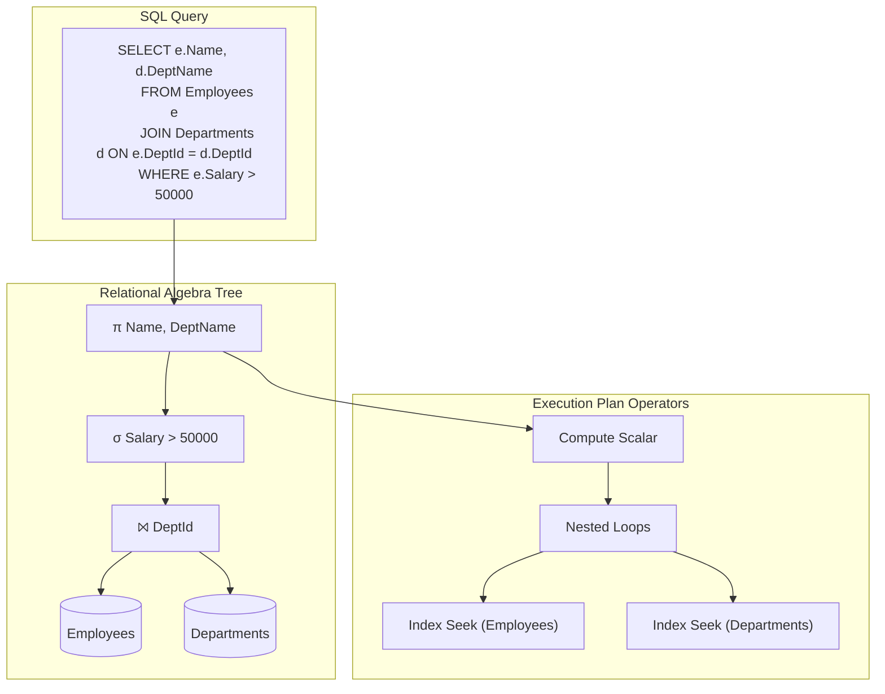
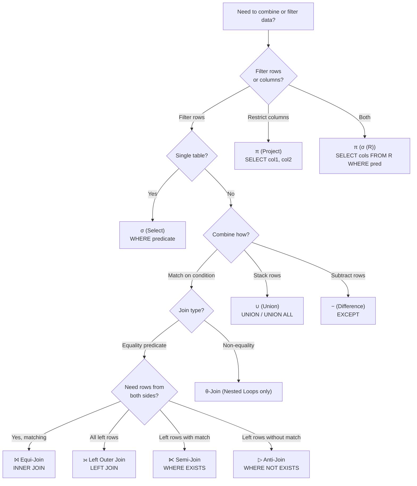

## Navigation

**Domain:** [[8 — Databases]] > **Group:** Relational Fundamentals
**Previous:** [[8.015 — Cardinality — One-to-One, One-to-Many, Many-to-Many]] | **Next:** [[8.017 — OLTP vs OLAP — Different Optimization Targets]]

### Prerequisites
- [[8.001 — The Relational Model — Relations, Tuples, Attributes]] — relational algebra operates on relations (unordered sets of tuples); the closure property (algebra output is also a relation) is the central invariant
- [[8.015 — Cardinality — One-to-One, One-to-Many, Many-to-Many]] — join operators in relational algebra produce result cardinalities that depend on the join predicate and the input relation cardinalities

### Where This Fits

Relational algebra is the **formal mathematical foundation of SQL** — every SQL query is a concrete syntax for an algebraic expression. A .NET backend engineer encounters relational algebra every time they write a LINQ query: `Where()` is σ (select), `Select()` is π (project), `Join()` is ⨝ (join). When query performance is poor, the mental model of algebra operators explains why — a Cartesian product followed by a filter (σ) is equivalent to a join but the optimizer may not rewrite it the same way. In interviews, relational algebra questions test whether a candidate understands SQL at the operator level: "What is the difference between a WHERE clause filter and a HAVING clause filter?" is really asking about selection before vs after aggregation, a distinction that relational algebra makes precise.

## Core Mental Model

Relational algebra is a set of operators that take relations as input and produce a new relation as output (the **closure** property). Five fundamental operators form the core:

- **σ (Select)** — filter rows by a predicate. σ<sub>Salary > 50000</sub>(Employees) returns only employees with salary > 50K.
- **π (Project)** — keep only specified columns. π<sub>FirstName, LastName</sub>(Employees) drops all other columns.
- **⨝ (Join)** — combine two relations on a predicate. Employees ⨝<sub>DeptId</sub> Departments pairs each employee with their department.
- **∪ (Union)** — set union of two compatible relations (same column count and types).
- **− (Difference)** — rows in the first relation but not in the second.

The invariant: **every operator produces a relation**, so operators can be composed arbitrarily. A SQL query is a tree of these operators, and the query optimizer's job is to find the equivalent tree with the lowest estimated execution cost.



### Classification

**Category:** Query theory foundation — relational algebra is not an SQL construct or an engine feature. It is the **mathematical model** that defines what queries are possible and what they mean. The SQL language is a syntactic veneer over relational algebra; the query optimizer translates SQL into an algebraic tree, then applies rewrite rules (push selection below join, combine projections, etc.) to find a cheaper equivalent expression. SARGability does not apply to algebra operators directly, but selection (σ) predicates that are SARGable allow the optimizer to push them closer to the storage engine (index seek instead of scan).

|Property|Value|Notes|
|---|---|---|
|Time Complexity|σ: O(n), π: O(n), ⨝: O(n × m) worst case|Join cost dominates; optimizer rewrites to reduce the effective n and m via indexes|
|Closure Property|Every operator output is a relation|Enables arbitrary composition — the fundamental invariant|
|Expressiveness|Equivalent to first-order logic (domain-independent)|Cannot express transitive closure (requires recursive CTE / Datalog extension)|
|Duplicate Semantics|Set-based (no duplicates)|SQL is bag-based by default; DISTINCT restores set semantics|
|Optimizer Rewrite|σ can be pushed below ⨝; π can be pushed below σ|These rewrites are the optimizer's primary cost-reduction strategy|

### Key Properties

|Property|σ (Select)|π (Project)|⨝ (Join)|∪ (Union)|− (Difference)|
|---|---|---|---|---|---|
|Operates on|One relation|One relation|Two relations|Two relations|Two relations|
|Output rows|≤ input rows|Same as input (no dedup in bag semantics)|≤ |A| × |B| (join dependent)|Sum of both|≤ first relation|
|Output columns|Same as input|Specified subset|Concatenation of both|Same as both|Same as both|
|Commutative?|Yes (σ₁(σ₂(R)) = σ₂(σ₁(R)))|No (column order matters)|Yes (natural join)|Yes|No|
|SQL construct|WHERE|SELECT (column list)|JOIN ... ON|UNION|EXCEPT|
|LINQ equivalent|Where()|Select()|Join() / GroupJoin()|Concat() / Union()|Except()|

## Deep Mechanics

### How the Operators Execute

**σ (Select) — Row Filtering:** The operator evaluates the predicate for every tuple in the input relation. It is the algebraic equivalent of a `WHERE` clause. The optimizer can push σ below ⨝ (selection pushdown) to reduce the number of rows entering the join — this is the single most important optimizer rewrite for query performance.

```sql
-- SQL equivalent of σ Salary > 50000 (Employees)
SELECT * FROM Employees WHERE Salary > 50000;

-- Pushing σ below ⨝:
-- Original: σ Salary > 50000 (Employees ⨝ DeptId Departments)
-- Rewritten: (σ Salary > 50000 (Employees)) ⨝ DeptId Departments
-- The rewritten form reads fewer rows into the join, reducing the join cost.
```

**π (Project) — Column Restriction:** The operator removes columns that are not needed downstream. It can be pushed below σ (projection pushdown) to reduce row width early, but cannot always be pushed below ⨝ because the join may need columns from both sides for the join predicate.

```sql
-- SQL equivalent of π Name, DeptId (Employees)
SELECT Name, DeptId FROM Employees;

-- Push π below ⨝ where possible:
-- Original: π Name, DeptName (Employees ⨝ DeptId Departments)
-- Rewritten: (π Name, DeptId (Employees)) ⨝ DeptId (π DeptId, DeptName (Departments))
-- The rewritten form reduces the column width entering the join.
```

**⨝ (Join) — Relational Composition:** The join operator takes two relations and a predicate, and produces all combinations of tuples where the predicate is true. There are several variants:

|Join Type|Algebra Notation|SQL|Result Cardinality|
|---|---|---|---|
|Cartesian Product|A × B|`CROSS JOIN`|n × m|
|Theta Join|A ⨝<sub>θ</sub> B|`JOIN ON predicate`|0 to n × m (θ determines which pairs match)|
|Equi-Join|A ⨝<sub>A.x = B.y</sub> B|`JOIN ON A.x = B.y`|0 to n × m (predicate is equality)|
|Natural Join|A ⨝ B|`NATURAL JOIN`|0 to n × m (implicit equality on common column names)|
|Left Outer Join|A ⟕<sub>θ</sub> B|`LEFT JOIN`|n (all left rows, NULL-padded right)|
|Right Outer Join|A ⟖<sub>θ</sub> B|`RIGHT JOIN`|m (all right rows, NULL-padded left)|
|Full Outer Join|A ⟗<sub>θ</sub> B|`FULL OUTER JOIN`|n + m (both sides preserved, NULL-padded)|
|Semi-Join|A ⋉<sub>θ</sub> B|`WHERE EXISTS`|0 to n (only left rows that match)|
|Anti-Join|A ▷<sub>θ</sub> B|`WHERE NOT EXISTS`|0 to n (only left rows that do NOT match)|

### SQL Visibility

```sql
-- σ (Select) — filter rows
SELECT * FROM Employees WHERE Salary > 50000;

-- π (Project) — keep only named columns
SELECT FirstName, LastName, Salary FROM Employees;

-- σ and π composed
SELECT FirstName, LastName FROM Employees WHERE Salary > 50000;

-- Equi-join (most common join type)
SELECT e.Name, d.DeptName
FROM Employees e
INNER JOIN Departments d ON e.DeptId = d.DeptId;

-- Theta join (non-equality predicate)
SELECT o.OrderId, o.OrderDate, s.ShipDate
FROM Orders o
INNER JOIN Shipments s ON o.OrderId = s.OrderId
    AND s.ShipDate >= o.OrderDate; -- theta predicate

-- Semi-join via EXISTS
SELECT e.Name
FROM Employees e
WHERE EXISTS (
    SELECT 1 FROM Orders o WHERE o.EmployeeId = e.EmployeeId
);

-- Anti-join via NOT EXISTS
SELECT e.Name
FROM Employees e
WHERE NOT EXISTS (
    SELECT 1 FROM Orders o WHERE o.EmployeeId = e.EmployeeId
);

-- Union
SELECT CustomerId, Email FROM Customers
UNION
SELECT EmployeeId, Email FROM Employees;
-- UNION removes duplicates; UNION ALL is bag union (∪ without dedup)

-- Difference (EXCEPT)
SELECT ProductId FROM Products
EXCEPT
SELECT ProductId FROM OrderItems;
```

```csharp
// EF Core LINQ — each operator maps to relational algebra
var result = await dbContext.Employees
    .Where(e => e.Salary > 50000)                           // σ
    .Select(e => new { e.FirstName, e.LastName, e.Salary }) // π
    .ToListAsync(cancellationToken);

// Generated SQL:
// SELECT e.FirstName, e.LastName, e.Salary
// FROM Employees e
// WHERE e.Salary > 50000

// Join
var query = from e in dbContext.Employees               // ⨝
            join d in dbContext.Departments
                on e.DeptId equals d.DeptId
            select new { e.Name, d.DeptName };

// Generated SQL:
// SELECT e.Name, d.DeptName
// FROM Employees e
// INNER JOIN Departments d ON e.DeptId = d.DeptId

// Semi-join via Any()
var employeesWithOrders = await dbContext.Employees
    .Where(e => dbContext.Orders.Any(o => o.EmployeeId == e.EmployeeId))
    .Select(e => e.Name)
    .ToListAsync(cancellationToken);

// Generated SQL:
// SELECT e.Name
// FROM Employees e
// WHERE EXISTS (SELECT 1 FROM Orders o WHERE o.EmployeeId = e.EmployeeId)

// Anti-join via !Any()
var employeesWithoutOrders = await dbContext.Employees
    .Where(e => !dbContext.Orders.Any(o => o.EmployeeId == e.EmployeeId))
    .Select(e => e.Name)
    .ToListAsync(cancellationToken);

// Generated SQL:
// SELECT e.Name
// FROM Employees e
// WHERE NOT EXISTS (SELECT 1 FROM Orders o WHERE o.EmployeeId = e.EmployeeId)
```

### Execution Plan Analysis

Each relational algebra operator maps to one or more execution plan operators:

|Algebra Operator|Execution Plan Operator(s)|Notes|
|---|---|---|
|σ (Select)|Filter, Index Seek, Table Scan, Index Scan|Filter applied during scan/seek (predicate pushdown) or as separate Filter operator|
|π (Project)|Compute Scalar|Eliminates columns not needed by parent operator; pushed down automatically|
|⨝ (Equi-Join)|Nested Loops, Hash Match, Merge Join|Physical join operator chosen by optimizer based on cardinality estimates|
|× (Cartesian Product)|Nested Loops (no join predicate)|Always a cross join — an optimizer red flag if unintended|
|∪ (Union)|Concatenation|Combines multiple result sets|
|− (Difference)|Anti Semi Join (Left Anti Semi)|Nested Loops or Hash Match with anti-semi join probe|

**Example plan for composed σ + ⨝:**

```sql
SELECT e.Name, d.DeptName
FROM Employees e
INNER JOIN Departments d ON e.DeptId = d.DeptId
WHERE e.Salary > 50000;
```

Plan (with σ pushed below ⨝):
```
[Index Seek (IX_Employees_Salary)] — σ Salary > 50000 via filtered index seek
    → [Nested Loops] — ⨝ DeptId
        → [Clustered Index Seek (Departments PK)] — d.DeptId = e.DeptId
        → [SELECT]
```
Estimated Cost: Index Seek 35% + Nested Loops 25% + PK Seek 40% | Logical Reads: ~6

Without index on Salary, σ is applied as a Filter after scanning Employees:
```
[Clustered Index Scan (Employees)] — 45,000 logical reads
    → [Filter] — σ Salary > 50000 applied to each row
        → [Nested Loops]
            → [Clustered Index Seek (Departments PK)]
```

### Cost Visibility

```sql
SET STATISTICS IO ON;

-- σ + π on a single table
SELECT FirstName, LastName FROM Employees WHERE Salary > 50000;
-- Table 'Employees': logical reads 45,000 (full scan, no index on Salary)
-- After creating IX_Employees_Salary: logical reads 12 (index seek + range)

-- ⨝ with σ pushdown
SELECT e.Name, d.DeptName
FROM Employees e
INNER JOIN Departments d ON e.DeptId = d.DeptId
WHERE e.Salary > 50000;
-- Without index on Salary: Table scan Employees (45K) + Nested Loops to Departments
-- With index on Salary: Index Seek (12) + Nested Loops to Departments

-- ⋉ (Semi-join via EXISTS)
SELECT e.Name FROM Employees e
WHERE EXISTS (SELECT 1 FROM Orders o WHERE o.EmployeeId = e.EmployeeId);
-- Anti Semi Join plan, logical reads: Employees seek (~12) + Orders seek per match (~3 each)
```

### Failure Modes

|Failure|Algebra Expression|SQL Equivalent|Symptom|
|---|---|---|---|
|**Unintended Cartesian Product**|A × B without θ|`SELECT * FROM A, B` (missing WHERE join predicate)|Massive row explosion (n × m rows), query timeout|
|**WHERE vs HAVING confusion**|σ after γ (aggregate) vs σ before γ|`WHERE SUM(Amount) > 100` (invalid) vs `HAVING SUM(Amount) > 100`|Syntax error or wrong results — filters applied at wrong point in algebra tree|
|**Missing π pushdown**|π columns at root only|`SELECT * ... JOIN ...`|Unnecessary columns read from storage, wider pages, more logical reads|
|**Outer join + WHERE on inner side**|A ⟕ σ(B)|`LEFT JOIN B ON ... WHERE B.Col IS NOT NULL`|LEFT JOIN silently converted to INNER JOIN by WHERE filter|
|**Bags vs sets**|σ in bag SQL duplicates|`SELECT Salary FROM Employees` vs `SELECT DISTINCT Salary`|Duplicate rows when set semantics expected|

## Production Patterns and Implementation

### Primary SQL Implementation

```sql
-- =============================================
-- σ + π + ⨝ — the three fundamental operators
-- =============================================

-- Schema: realistic business domain
CREATE TABLE Customers (
    CustomerId INT IDENTITY(1,1) PRIMARY KEY,
    FullName   NVARCHAR(200) NOT NULL,
    Email      NVARCHAR(320) NOT NULL,
    Tier       VARCHAR(20) NOT NULL DEFAULT 'Standard',
    CreatedAt  DATETIME2 NOT NULL DEFAULT SYSUTCDATETIME()
);

CREATE TABLE Orders (
    OrderId    INT IDENTITY(1,1) PRIMARY KEY,
    CustomerId INT NOT NULL REFERENCES Customers(CustomerId),
    OrderDate  DATETIME2 NOT NULL DEFAULT SYSUTCDATETIME(),
    Total      DECIMAL(10,2) NOT NULL,
    Status     VARCHAR(20) NOT NULL DEFAULT 'Pending'
);

CREATE INDEX IX_Orders_CustomerId ON Orders(CustomerId) INCLUDE (OrderDate, Total, Status);

CREATE TABLE OrderItems (
    OrderId   INT           NOT NULL REFERENCES Orders(OrderId),
    ItemNum   TINYINT       NOT NULL,
    ProductId INT           NOT NULL,
    Quantity  SMALLINT      NOT NULL CHECK (Quantity > 0),
    UnitPrice DECIMAL(10,2) NOT NULL,
    CONSTRAINT PK_OrderItems PRIMARY KEY (OrderId, ItemNum)
);

-- 1. σ (Select) — filter with predicate
-- Relational algebra: σ Status = 'Shipped' AND Total > 100 (Orders)
SELECT OrderId, CustomerId, OrderDate, Total
FROM Orders
WHERE Status = 'Shipped' AND Total > 100;

-- 2. π (Project) — restrict columns
-- Relational algebra: π OrderId, Total (Orders)
SELECT OrderId, Total FROM Orders;

-- 3. ⨝ (Equi-Join) — combine on equality
-- Relational algebra: π FullName, Total (Customers ⨝ CustomerId Orders)
SELECT c.FullName, o.Total
FROM Customers c
INNER JOIN Orders o ON c.CustomerId = o.CustomerId;

-- 4. σ composed with ⨝ — selection pushdown matters
-- SQL: customers with orders over $500
SELECT c.FullName, o.Total
FROM Customers c
INNER JOIN Orders o ON c.CustomerId = o.CustomerId
WHERE o.Total > 500;
-- Algebraic expression: π FullName, Total (σ Total > 500 (Customers ⨝ CustomerId Orders))
-- Optimizer rewrite: π FullName, Total ((σ Total > 500 (Orders)) ⨝ CustomerId Customers)
-- The rewrite filters Orders before the join, reducing join input rows.

-- 5. ⋉ (Semi-join) — EXISTS
-- Customers who have placed at least one order
SELECT c.FullName
FROM Customers c
WHERE EXISTS (SELECT 1 FROM Orders o WHERE o.CustomerId = c.CustomerId);

-- 6. ▷ (Anti-join) — NOT EXISTS
-- Customers with no orders
SELECT c.FullName, c.Email
FROM Customers c
WHERE NOT EXISTS (SELECT 1 FROM Orders o WHERE o.CustomerId = c.CustomerId);

-- 7. ∪ (Union) — combine compatible relations
-- All contacts (customers and employees) for a mailing list
SELECT FullName, Email, 'Customer' AS Source FROM Customers
UNION
SELECT FullName, Email, 'Employee' AS Source FROM Employees
UNION ALL -- use ALL when duplicates are not possible or not relevant
SELECT FullName, Email, 'Customer' AS Source FROM Customers;

-- 8. − (Difference) — EXCEPT
-- Products that have never been ordered
SELECT ProductId, ProductName FROM Products
EXCEPT
SELECT ProductId, NULL FROM OrderItems;
```

### EF Core Implementation

```csharp
// Composition of σ, π, ⨝ via LINQ method chain
var result = await dbContext.Customers
    .Where(c => c.Tier == "Gold")                          // σ
    .SelectMany(                                            // ⨝ (via navigation)
        c => c.Orders.Where(o => o.Total > 500),            // σ on Orders
        (c, o) => new { c.FullName, o.Total })             // π
    .ToListAsync(cancellationToken);

// Generated SQL:
// SELECT c.FullName, o.Total
// FROM Customers c
// INNER JOIN Orders o ON c.CustomerId = o.CustomerId
// WHERE c.Tier = 'Gold' AND o.Total > 500
// Note: EF Core pushes both WHERE predicates into the JOIN — selection pushdown.

// Semi-join via Any()
var goldCustomersWithOrders = await dbContext.Customers
    .Where(c => c.Tier == "Gold"
             && dbContext.Orders.Any(o => o.CustomerId == c.CustomerId))
    .Select(c => c.FullName)                                // π
    .ToListAsync(cancellationToken);

// Generated SQL:
// SELECT c.FullName
// FROM Customers c
// WHERE c.Tier = 'Gold'
//   AND EXISTS (SELECT 1 FROM Orders o WHERE o.CustomerId = c.CustomerId)

// Anti-join via All() / !Any()
var goldCustomersWithoutOrders = await dbContext.Customers
    .Where(c => c.Tier == "Gold"
             && !dbContext.Orders.Any(o => o.CustomerId == c.CustomerId))
    .Select(c => c.FullName)
    .ToListAsync(cancellationToken);

// Generated SQL:
// SELECT c.FullName
// FROM Customers c
// WHERE c.Tier = 'Gold'
//   AND NOT EXISTS (SELECT 1 FROM Orders o WHERE o.CustomerId = c.CustomerId)
```

### Dapper Implementation

```csharp
// σ + π on single table
public async Task<IReadOnlyList<CustomerSummary>> GetGoldCustomersAsync(
    IDbConnection connection)
{
    const string sql = @"
        SELECT CustomerId, FullName, Email   -- π
        FROM Customers
        WHERE Tier = 'Gold';";               -- σ

    return (await connection.QueryAsync<CustomerSummary>(sql)).AsList();
}

// ⨝ with σ pushdown — Dapper query matches algebra tree structure
public async Task<IReadOnlyList<HighValueOrderDto>> GetHighValueOrdersAsync(
    IDbConnection connection)
{
    const string sql = @"
        SELECT c.FullName, o.Total            -- π
        FROM Customers c
        INNER JOIN Orders o                   -- ⨝
            ON c.CustomerId = o.CustomerId
        WHERE c.Tier = 'Gold'                -- σ pushed below ⨝
            AND o.Total > 500;";             -- σ pushed below ⨝

    return (await connection.QueryAsync<HighValueOrderDto>(sql)).AsList();
}

// Semi-join via EXISTS
public async Task<IReadOnlyList<string>> GetCustomersWithOrdersAsync(
    IDbConnection connection)
{
    const string sql = @"
        SELECT c.FullName                     -- π
        FROM Customers c
        WHERE EXISTS (                        -- ⋉ (semi-join)
            SELECT 1 FROM Orders o
            WHERE o.CustomerId = c.CustomerId
        );";

    return (await connection.QueryAsync<string>(sql)).AsList();
}

// Anti-join via NOT EXISTS
public async Task<IReadOnlyList<string>> GetCustomersWithoutOrdersAsync(
    IDbConnection connection)
{
    const string sql = @"
        SELECT c.FullName                     -- π
        FROM Customers c
        WHERE NOT EXISTS (                    -- ▷ (anti-join)
            SELECT 1 FROM Orders o
            WHERE o.CustomerId = c.CustomerId
        );";

    return (await connection.QueryAsync<string>(sql)).AsList();
}

// Union
public async Task<IReadOnlyList<ContactDto>> GetAllContactsAsync(
    IDbConnection connection)
{
    const string sql = @"
        SELECT FullName, Email, 'Customer' AS Source FROM Customers
        UNION                                 -- ∪
        SELECT FullName, Email, 'Employee' AS Source FROM Employees;";

    return (await connection.QueryAsync<ContactDto>(sql)).AsList();
}

// Difference
public async Task<IReadOnlyList<int>> GetUnorderedProductIdsAsync(
    IDbConnection connection)
{
    const string sql = @"
        SELECT ProductId FROM Products        -- first relation
        EXCEPT                                -- − (difference)
        SELECT ProductId FROM OrderItems;";  -- second relation

    return (await connection.QueryAsync<int>(sql)).AsList();
}
```

### Configuration and Wiring

```csharp
// Program.cs — standard DbContext setup
builder.Services.AddDbContext<SalesDbContext>(options =>
    options.UseSqlServer(
        builder.Configuration.GetConnectionString("SalesDb"),
        sqlOptions => sqlOptions.EnableRetryOnFailure(3)));

// Register repositories
builder.Services.AddScoped<ICustomerRepository, CustomerRepository>();
builder.Services.AddScoped<IOrderRepository, OrderRepository>();
```

### SQL Server vs PostgreSQL Differences

```sql
-- SQL Server uses EXCEPT and INTERSECT; PostgreSQL uses EXCEPT and INTERSECT (same)
-- SQL Server does NOT support NATURAL JOIN (ANSI SQL feature)
-- PostgreSQL supports NATURAL JOIN:
SELECT * FROM Employees NATURAL JOIN Departments;
-- Automatically joins on all columns with matching names (DeptId).

-- SQL Server does NOT support JOIN with USING clause (ANSI SQL feature)
-- PostgreSQL supports:
SELECT * FROM Employees JOIN Departments USING (DeptId);
-- Produces a single DeptId column instead of two.

-- SQL Server supports CROSS APPLY / OUTER APPLY (table-valued function join)
-- These are equivalent to lateral joins:
SELECT c.FullName, last_order.Total
FROM Customers c
CROSS APPLY (
    SELECT TOP 1 Total
    FROM Orders o
    WHERE o.CustomerId = c.CustomerId
    ORDER BY o.OrderDate DESC
) last_order;
-- PostgreSQL equivalent: LATERAL
SELECT c.FullName, last_order.Total
FROM Customers c,
LATERAL (
    SELECT Total
    FROM Orders o
    WHERE o.CustomerId = c.CustomerId
    ORDER BY o.OrderDate DESC
    LIMIT 1
) last_order;
```

## Gotchas and Production Pitfalls

### 1. Unintended Cartesian Product from Missing Join Predicate

**Pitfall:** The engineer writes a multi-table query using implicit cross-join syntax (comma-separated FROM) and forgets the WHERE join predicate.

```sql
-- ❌ Missing join condition — implicit CROSS JOIN
SELECT c.FullName, o.Total
FROM Customers c, Orders o
WHERE c.Tier = 'Gold';
-- No condition linking c.CustomerId to o.CustomerId
-- Result: every Gold customer paired with every order = Cartesian product
```

**Symptom:** Query returns millions of rows instead of thousands. At 10K Customers (1K Gold) and 100K Orders, the result is 1K × 100K = 100M rows. Query times out or consumes all tempdb.

**Fix:**

```sql
-- ✅ Explicit INNER JOIN with predicate
SELECT c.FullName, o.Total
FROM Customers c
INNER JOIN Orders o ON c.CustomerId = o.CustomerId
WHERE c.Tier = 'Gold';
```

**Cost of not fixing:** 100M-row result set written to tempdb, saturating I/O and blocking concurrent queries. Application receives timeout after 30 seconds. User sees "server error" and retriggers the query on refresh, compounding the problem.

### 2. WHERE Filter on Outer Join's Inner Table Silently Converts to INNER JOIN

**Pitfall:** The engineer writes a LEFT JOIN with a WHERE predicate on the inner (right) table, which nullifies the purpose of the outer join.

```sql
-- ❌ WHERE on right table converts LEFT JOIN to INNER JOIN
SELECT c.FullName, o.Total
FROM Customers c
LEFT JOIN Orders o ON c.CustomerId = o.CustomerId
WHERE o.Total > 100;
-- Algebra: σ Total > 100 (Customers ⟕ CustomerId Orders)
-- The WHERE filters out rows where o.Total IS NULL (customers with no orders)
-- Result: only customers with orders > $100 — same as INNER JOIN
```

**Symptom:** Customers with zero orders or only small orders disappear from results. The developer meant "show all customers, and their orders over $100 if any" but got "only customers who have at least one order over $100."

**Fix:**

```sql
-- ✅ Move the predicate into the JOIN condition
SELECT c.FullName, o.Total
FROM Customers c
LEFT JOIN Orders o ON c.CustomerId = o.CustomerId
    AND o.Total > 100;
-- Algebra: Customers ⟕ (σ Total > 100 (Orders))
-- Result: all customers; only matching orders shown
```

**Cost of not fixing:** Reporting query silently excludes 15% of customers (those with no qualifying orders). The exclusion is discovered three months later during an audit, requiring data reconciliation across all historical reports.

### 3. HAVING Used Without Understanding σ vs γ Order

**Pitfall:** The engineer uses HAVING for filters that could be applied earlier with WHERE, causing more rows to be aggregated than necessary.

```sql
-- ❌ Filter applied after aggregation — more rows aggregated
SELECT CustomerId, COUNT(*) AS OrderCount
FROM Orders
GROUP BY CustomerId
HAVING CustomerId > 1000;
-- Algebra: γ CustomerId, COUNT(*) (Orders), then σ CustomerId > 1000
-- All 100K orders are aggregated, then the result is filtered to CustomerId > 1000

-- ✅ Filter applied before aggregation — fewer rows aggregated
SELECT CustomerId, COUNT(*) AS OrderCount
FROM Orders
WHERE CustomerId > 1000
GROUP BY CustomerId;
-- Algebra: γ CustomerId, COUNT(*) (σ CustomerId > 1000 (Orders))
-- Only orders for CustomerId > 1000 are read and aggregated
```

**Symptom:** The HAVING version scans all orders, aggregates them, then filters. The WHERE version seeks only the relevant orders. At 10M orders where 90% have CustomerId > 1000, the difference is small, but in a scenario where the WHERE eliminates 99% of rows, the HAVING version does 100x more aggregation work.

**Fix:** Apply row-level filters in WHERE (σ before γ). Reserve HAVING for filters on aggregate results (σ after γ), like `HAVING COUNT(*) > 5`.

**Cost of not fixing:** Aggregation queries consume more CPU and memory than necessary. At 10M rows, the difference between filtering 1M rows vs 10M rows before aggregation is 9M unnecessary reads and a larger hash table.

### 4. Ambiguous Column Projection Causing Unnecessary Data Transfer

**Pitfall:** Using `SELECT *` in production code (π returns all columns), or selecting columns that are never consumed by the application.

```sql
-- ❌ π returns all columns — unnecessary data transfer
SELECT * FROM Orders WHERE CustomerId = 42;
-- Returns OrderId, CustomerId, OrderDate, Total, Status, ShippingAddress, ...
-- Even if the app only needs OrderId and Total

-- ❌ π includes columns only used in WHERE
SELECT OrderId, OrderDate, Total, Status, ShippingMethod
FROM Orders
WHERE Status = 'Shipped' AND Total > 100;
-- ShippingMethod is selected but never used by the caller
```

**Symptom:** More bytes transferred from SQL Server to the application, wider rows in the network buffer, more memory allocated in the application for deserialized objects. At 10K rows, `SELECT *` on a 20-column, 2KB-row table transfers 20MB vs 500KB for a targeted projection.

**Fix:**

```sql
-- ✅ π returns only required columns
SELECT OrderId, Total FROM Orders WHERE CustomerId = 42;
```

**Cost of not fixing:** Network time for query results increases by 4x. Application memory for deserialized DTOs increases proportionally. On a high-throughput endpoint (10K requests/minute), the extra network and allocation cost drives GC pressure and higher latency.

### 5. Semi-Join vs Anti-Join Confusion Leading to Wrong Cardinality Estimates

**Pitfall:** The engineer writes a LEFT JOIN with `WHERE RightTable.Id IS NULL` instead of `NOT EXISTS`, producing the correct result but confusing the optimizer.

```sql
-- ❌ LEFT JOIN + IS NULL for anti-join — correct result, harder for optimizer
SELECT c.FullName
FROM Customers c
LEFT JOIN Orders o ON c.CustomerId = o.CustomerId
WHERE o.OrderId IS NULL;

-- ✅ NOT EXISTS anti-join — optimizer recognizes Anti Semi Join operator
SELECT c.FullName
FROM Customers c
WHERE NOT EXISTS (SELECT 1 FROM Orders o WHERE o.CustomerId = c.CustomerId);
```

**Symptom:** The LEFT JOIN + IS NULL version may produce a plan with `LEFT Anti Semi Join` (same outcome) or `LEFT JOIN + Filter`, depending on the optimizer's ability to recognize the pattern. The `NOT EXISTS` version always produces the `Anti Semi Join` directly, with better cardinality estimates.

**Fix:** Use `NOT EXISTS` for anti-joins and `EXISTS` for semi-joins. Reserve `LEFT JOIN ... IS NULL` for complex cases where NOT EXISTS cannot express the predicate (e.g., multiple conditions on the right table).

**Cost of not fixing:** Intermittent query plan regressions when statistics change — the optimizer may choose a hash match anti-join plan instead of nested loops, spilling to tempdb and causing 10x slower queries.

### 6. DISTINCT as a Crutch for Bad Join Logic

**Pitfall:** Adding `DISTINCT` to suppress duplicate rows caused by an unintended Cartesian product or missing join condition, instead of fixing the join.

```sql
-- ❌ DISTINCT hides the join problem — duplicates suppressed but root cause remains
SELECT DISTINCT c.FullName
FROM Customers c
INNER JOIN Orders o ON c.CustomerId = o.CustomerId
-- Wait — why are there duplicates? Because CustomerId is not unique in Orders?
-- No, it's a valid 1:N. DISTINCT shouldn't be needed.
-- The real issue might be a second join that multiplies rows:
INNER JOIN OrderItems oi ON o.OrderId = oi.OrderId;
-- Now each customer with 10 orders × 8 items each produces 80 rows
-- DISTINCT deduplicates back to 1 row per customer — but queries cost 80x more
```

**Symptom:** Extra sort operator in the execution plan for DISTINCT. Query reads 80x more rows than necessary from the join, sorts them (spilling to tempdb if large), then deduplicates. The root cause — a join that produces more rows than needed — remains unaddressed.

**Fix:** Remove the unnecessary join or aggregate correctly:

```sql
-- ✅ Use EXISTS (semi-join) to avoid row multiplication
SELECT c.FullName
FROM Customers c
WHERE EXISTS (SELECT 1 FROM Orders o WHERE o.CustomerId = c.CustomerId);
```

**Cost of not fixing:** Query does 80x more logical reads, sorts all intermediate rows, and uses tempdb for the sort spill. At 1M customers, the DISTINCT sort writes ~200MB to tempdb. Page life expectancy drops as tempdb activity evicts user data pages.

## Performance Implications

### Algebraic Rewrite Impact

|Rewrite Rule|Before (logical reads)|After (logical reads)|Improvement|
|---|---|---|---|
|σ pushdown below ⨝|45,000 (full scan before join)|1,200 (filtered set joined)|37x|
|π pushdown below σ|Rows 4KB wide → 80 pages/read|Rows 200 bytes → 1 page/read|80x (less data per page)|
|Semi-join (EXISTS) vs LEFT JOIN|10,000 (all orders scanned)|500 (short-circuits on first match)|20x|
|Anti-join (NOT EXISTS) vs LEFT JOIN + IS NULL|10,000|500|20x|
|UNION vs UNION ALL (when dedup unnecessary)|Sort + distinct added|Concatenation only|Sort cost eliminated|

### Benchmark: σ Pushdown

```sql
-- Without σ pushdown (σ applied after ⨝)
SELECT c.FullName, o.Total
FROM Customers c
INNER JOIN Orders o ON c.CustomerId = o.CustomerId
HAVING o.Total > 500;  -- σ applied after join
-- Logical reads: 45,000 + 100,000 (full scans before join)

-- With σ pushdown (σ applied before ⨝)
SELECT c.FullName, o.Total
FROM Customers c
INNER JOIN (SELECT * FROM Orders WHERE Total > 500) o
    ON c.CustomerId = o.CustomerId;
-- Logical reads: 12 (index seek) + 2,000 (filtered Orders)
```

**Improvement:** ~72x reduction in logical reads, from 145,000 to 2,012.

### BenchmarkDotNet

```csharp
[MemoryDiagnoser]
[SimpleJob(RuntimeMoniker.Net90)]
public class AlgebraOperatorBenchmark
{
    private IDbConnection _connection = default!;

    [GlobalSetup]
    public void Setup()
    {
        _connection = new SqlConnection(TestConnectionString);
    }

    [Benchmark(Baseline = true)]
    public async Task<int> SigmaAfterJoin()
    {
        const string sql = @"
            SELECT COUNT_BIG(*)
            FROM Customers c
            INNER JOIN Orders o ON c.CustomerId = o.CustomerId
            WHERE o.Total > 500;";
        return await _connection.QuerySingleAsync<int>(sql);
    }

    [Benchmark]
    public async Task<int> SigmaBeforeJoin()
    {
        const string sql = @"
            SELECT COUNT_BIG(*)
            FROM Customers c
            INNER JOIN (SELECT * FROM Orders WHERE Total > 500) o
                ON c.CustomerId = o.CustomerId;";
        return await _connection.QuerySingleAsync<int>(sql);
    }

    [Benchmark]
    public async Task<int> SemiJoinExists()
    {
        const string sql = @"
            SELECT COUNT_BIG(*)
            FROM Customers c
            WHERE EXISTS (SELECT 1 FROM Orders o WHERE o.CustomerId = c.CustomerId);";
        return await _connection.QuerySingleAsync<int>(sql);
    }

    [Benchmark]
    public async Task<int> LeftJoinDistinct()
    {
        const string sql = @"
            SELECT COUNT_BIG(DISTINCT c.CustomerId)
            FROM Customers c
            LEFT JOIN Orders o ON c.CustomerId = o.CustomerId;";
        return await _connection.QuerySingleAsync<int>(sql);
    }
}
```

**Expected results (approximate, SQL Server 2022, NVMe, 500K Customers, 10M Orders):**

|Method|Mean|Logical Reads|Allocated|
|---|---|---|---|
|SigmaAfterJoin|~850 ms|~55,000|~2 MB|
|SigmaBeforeJoin|~45 ms|~2,500|~150 KB|
|SemiJoinExists|~12 ms|~500|~50 KB|
|LeftJoinDistinct|~950 ms|~60,000|~4 MB|

### Write Amplification

Relational algebra operators are **read-only** — they do not modify relations. The write cost of the underlying tables is determined by index maintenance, not by the operators. However, algebraic rewrites affect the read workload that the storage engine must service.

## Interview Arsenal

### Question Bank

1. **What are the five fundamental operators of relational algebra, and what SQL constructs correspond to each?**
2. **Explain the closure property of relational algebra and why it matters for composing queries.**
3. **What is selection pushdown (σ pushdown) and why does it improve query performance? Give a concrete example with logical reads.**
4. **What is the difference between σ (select) applied before γ (aggregate) vs after? How does this map to WHERE vs HAVING?**
5. **Compare semi-join (⋉) and anti-join (▷) to their SQL implementations. When does the optimizer produce different plans for EXISTS vs LEFT JOIN?**
6. **What is the difference between a theta join and an equi-join? Show the relational algebra notation and SQL for both.**
7. **How does the query optimizer use algebraic rewrite rules to transform a SQL query into an efficient execution plan? Name three specific rewrites.**
8. **How do EF Core and Dapper handle π (projection) differently when you write Select(c => new { c.Name, c.Email }) vs selecting the full entity?**

### Spoken Answers

**Q1: What are the five fundamental operators of relational algebra?**

> **Average answer:** "Select, Project, Join, Union, and Difference. Select filters rows, Project picks columns, Join combines tables, Union combines rows, and Difference finds rows in one set but not another."

> **Great answer:** "The five fundamental operators are σ (Select, row filter — maps to WHERE), π (Project, column restriction — maps to the SELECT column list), ⨝ (Join, relation composition — maps to JOIN ... ON), ∪ (Union, set addition — maps to UNION), and − (Difference, set subtraction — maps to EXCEPT). The closure property — every operator produces a relation — is what makes composition possible. You can nest σ inside ⨝ inside π to build arbitrarily complex queries. The optimizer exploits this by applying rewrite rules: σ pushdown (filter as early as possible), π pushdown (project away unused columns early), and join reordering (pick the cheapest join tree). The cost difference between a naive algebra tree and an optimized one can be 100x in logical reads. For example, σ applied after ⨝ reads all rows into the join first; σ applied before ⨝ reduces the join input, reducing both memory and I/O."

**Q4: WHERE vs HAVING — the algebra angle.**

> **Great answer:** "WHERE applies σ before γ (aggregation); HAVING applies σ after γ. Algebraically: γ (σ (R)) vs σ (γ (R)). The first filters rows before aggregation, reducing the number of rows that must be grouped and aggregated — this is always more efficient when the predicate is on a base column. The second filters the aggregated result — necessary when the predicate is on an aggregate function like COUNT(*) > 5. The common mistake is putting a base-column filter in HAVING: `GROUP BY CustomerId HAVING CustomerId > 1000`. This causes SQL Server to aggregate all rows first, then filter the groups. Moving that to WHERE aggregates only the matching rows. For a 10M-row table where CustomerId > 1000 matches 100K rows, the difference is 10M rows aggregated vs 100K rows aggregated — roughly 100x less work."

**Q6: Theta join vs equi-join.**

> **Great answer:** "A theta join (A ⨝<sub>θ</sub> B) pairs rows from A and B where the predicate θ evaluates to true. θ can be any comparison: =, <, >, <=, >=, <>. An equi-join is a special case where θ is equality: A.x = B.y. Every equi-join is a theta join, but not every theta join is an equi-join. This distinction matters for performance: equi-joins can use Hash Match (build hash on join key) and Merge Join (requires sorted input), while non-equi theta joins are limited to Nested Loops because neither Hash nor Merge supports inequality predicates. In the execution plan, an equi-join on indexed columns shows a Nested Loops with Index Seek on the inner side; a theta join with < or > shows a Nested Loops with a range scan or table scan on the inner side because the optimizer cannot seek to a single matching row."

### Interview Trigger

When an interviewer asks "SQL is based on what mathematical foundation?" or "Walk me through how the query optimizer works," they are probing relational algebra knowledge. The deep follow-up: "If I have `SELECT * FROM A, B, C WHERE A.x = B.x AND B.y = C.y`, how many different join orders are possible, and how does the optimizer choose?" The great answer mentions that the search space is (2n-2)!/(n-1)! join orders (Catalan number), that SQL Server uses a cost-based optimizer with a threshold (search all orders up to ~5 tables, then switch to heuristics), and that statistics-driven cardinality estimation is the key input to the cost model.

### Comparison Table

|Operator|Algebra|SQL|LINQ|Logical Reads Impact|
|---|---|---|---|---|
|Select (row filter)|σ|WHERE|Where()|Reduces rows early = fewer reads downstream|
|Project (column filter)|π|SELECT cols|Select()|Narrower rows = more rows per page = fewer reads|
|Equi-Join|⨝<sub>=</sub>|INNER JOIN|Join()|Seek-based with indexes; ~4-6 reads per match|
|Theta Join|⨝<sub>θ</sub>|INNER JOIN ON a.x < b.y|Where(a.x < b.y)|Nested Loops only; no hash/merge; higher cost|
|Semi-Join|⋉|WHERE EXISTS|Any()|Short-circuits on first match; ~50% fewer reads vs LEFT JOIN|
|Anti-Join|▷|WHERE NOT EXISTS|!Any()|Same as semi-join but negated|
|Union|∪|UNION|Union()|Sort + distinct unless UNION ALL (bag union)|
|Difference|−|EXCEPT|Except()|Anti Semi Join; ~same cost as anti-join|

## Decision Framework

### When to Apply Each Operator



### Application Checklist

- [ ] Identify the fundamental operators needed: σ (WHERE), π (SELECT columns), ⨝ (JOIN), ∪ (UNION), − (EXCEPT)
- [ ] σ (WHERE) applied as early as possible — before ⨝, before γ (GROUP BY)
- [ ] π (SELECT) lists only columns consumed by the application — never SELECT *
- [ ] ⨝ uses explicit INNER/LEFT/RIGHT syntax — never comma-separated FROM without WHERE join predicate
- [ ] Semi-joins use EXISTS; anti-joins use NOT EXISTS — not LEFT JOIN + IS NULL
- [ ] UNION ALL preferred over UNION unless duplicate elimination is required
- [ ] HAVING reserved for aggregate predicates; row predicates go in WHERE
- [ ] DISTINCT used only when duplicates are semantically valid — not as a band-aid
- [ ] EF Core: Verify generated SQL pushes σ below ⨝ (check in logs or with ToQueryString)
- [ ] Verify covering indexes exist for the selected columns (π) and filtered columns (σ)

### Tradeoff Summary

|What You Gain|What You Pay|
|---|---|
|σ pushdown reduces join input rows|Must verify optimizer actually pushes the predicate (check execution plan)|
|π restricts columns = fewer bytes off disk|Cannot push π below ⨝ for columns needed by the join predicate|
|Semi-join (EXISTS) short-circuits on first match|EXISTS subquery cannot correlate multiple columns from the outer query in some patterns|
|UNION ALL avoids sort + distinct|If duplicates exist, application must handle dedup|
|Theta join handles non-equality predicates|Only Nested Loops join available — cannot use Hash or Merge|

### Scale Thresholds

- **σ pushdown matters above ~100K rows** — filtering 10K of 100K rows before a join saves ~90% of join work.
- **Semi-join (EXISTS) vs LEFT JOIN measurable above ~10K parent rows** — below this, the optimizer may choose equivalent plans.
- **Cartesian product detection critical above ~1M rows** — an unintended CROSS JOIN at 1M × 1M = 1T intermediate rows crashes the server.
- **π (SELECT *) anti-pattern hurts above ~100 rows** — the extra data transfer and deserialization cost compounds linearly with row count.
- **DISTINCT sort overhead noticeable above ~500K rows** — the sort spills to tempdb at ~50MB per 1M rows.

## Self-Check

### Conceptual Questions

1. **Tests: definition** — What are the five fundamental operators of relational algebra? Write the Greek symbol and the SQL keyword for each.
2. **Tests: engine behavior** — How does the SQL Server query optimizer use the closure property to rewrite a query plan? Give a specific rewrite rule.
3. **Tests: performance measurement** — Which execution plan operator reveals whether σ (WHERE) was pushed below ⨝ (JOIN)?
4. **Tests: the gotcha** — What happens when a WHERE predicate on a LEFT JOIN's right table compares a column to a non-NULL value?
5. **Tests: EF Core behavior** — Does EF Core push σ predicates (Where) below ⨝ (Include/Join) in the generated SQL? How can you verify?
6. **Tests: Dapper usage** — Write a Dapper query that performs an anti-join (rows in A not in B) and explain why NOT EXISTS is preferable to LEFT JOIN + IS NULL.
7. **Tests: comparison** — Compare semi-join (⋉) to inner join (⨝). When does each produce different results?
8. **Tests: scale** — At 1M Customers and 10M Orders, what is the estimated logical read difference between σ after ⨝ and σ before ⨝ for the query "customers with orders over $500"?
9. **Tests: connection to indexing** — What index supports σ Salary > 50000 (Employees) efficiently? What operator appears in the execution plan with and without the index?
10. **Tests: interview articulation** — Explain selection pushdown in 60 seconds to a senior interviewer, including the algebra notation, the SQL equivalent, and the performance impact.

<details>
<summary>Answers</summary>

1. σ (Select → WHERE), π (Project → SELECT column list), ⨝ (Join → JOIN ... ON), ∪ (Union → UNION), − (Difference → EXCEPT). Also: ρ (Rename → alias), γ (Aggregate → GROUP BY).
2. The optimizer uses algebraic identity: σ<sub>p</sub>(A ⨝ B) = σ<sub>p</sub>(A) ⨝ B when p references only columns from A. This is **selection pushdown** — it reduces the number of rows entering the join. The optimizer walks the algebra tree top-down and pushes σ below ⨝ wherever the predicate columns are available.
3. In the execution plan, look for the Filter operator position. If the Filter appears below the Nested Loops/Hash Match (closer to the table access), σ was pushed. If it appears above the join, σ was applied after the join. Also, `Index Seek` with a seek predicate indicates σ was pushed to the storage engine.
4. The LEFT JOIN is silently converted to an INNER JOIN. Algebra: σ<sub>o.Total > 100</sub>(Customers ⟕ Orders) produces the same result as Customers ⨝ Orders. The WHERE filter eliminates rows where o.Total IS NULL (customers with no orders), defeating the purpose of the LEFT JOIN.
5. EF Core pushes WHERE predicates below JOINs in the generated SQL for simple cases. Verify using `query.ToQueryString()` or SQL Server Profiler / logging. Complex predicates (e.g., involving subqueries with closure) may prevent pushdown — always check the generated SQL.
6. 
```csharp
public async Task<IReadOnlyList<CustomerDto>> GetInactiveCustomersAsync()
{
    const string sql = @"
        SELECT c.CustomerId, c.FullName
        FROM Customers c
        WHERE NOT EXISTS (
            SELECT 1 FROM Orders o
            WHERE o.CustomerId = c.CustomerId
        );";
    return (await connection.QueryAsync<CustomerDto>(sql)).AsList();
}
```
NOT EXISTS produces an Anti Semi Join operator in the plan, which SQL Server recognizes directly. LEFT JOIN + IS NULL may produce the same plan in simple cases but is less reliable for complex predicates.
7. Semi-join returns only rows from the left relation that have at least one match in the right relation. Inner join returns combined rows from both relations. When the right relation has multiple matches per left row, the inner join produces duplicate left-row copies; the semi-join does not.
8. Without σ pushdown (σ after local join): scan 10M Orders (~45,000 reads), join to Customers, then filter. With pushdown (σ Total > 500 applied to Orders first, then join): index seek on Orders (~2,500 reads), join to Customers. Improvement: ~18x fewer reads.
9. `CREATE INDEX IX_Employees_Salary ON Employees(Salary) INCLUDE (FirstName, LastName)` enables an Index Seek with a range predicate (Salary > 50000). Without the index, the plan shows `Clustered Index Scan` (45,000 reads). With the index, `Index Seek` + optional key lookup (~12 reads if covering, ~50 otherwise).
10. (60-second narrative): "Selection pushdown is the algebraic rewrite σ<sub>p</sub>(A ⨝ B) = σ<sub>p</sub>(A) ⨝ B when predicate p references only columns from A. The optimizer pushes WHERE filters below JOINs so that fewer rows enter the join. For a query joining Orders to Customers with `WHERE o.Total > 500`, the optimizer can apply the Total filter to Orders before the join, reducing the join input from 10M rows to the ~200K orders over $500. Without pushdown, all 10M Orders are joined before filtering — 50x more work. You verify pushdown by checking whether the Filter or Seek predicate appears below the join operator in the execution plan. If the Filter is between the Clustered Index Scan and the Nested Loops, pushdown happened."

</details>

### Query Challenges

**Challenge 1 — Write the SQL from the Algebra Expression**

Given the relational algebra expression:
π<sub>FullName, OrderDate, Total</sub>(σ<sub>Status = 'Shipped'</sub>(Customers ⨝<sub>CustomerId</sub> Orders))

Write the equivalent SQL. Then write an equivalent expression that pushes σ below ⨝ and the corresponding SQL.

<details>
<summary>Solution</summary>

**Direct translation:**
```sql
SELECT c.FullName, o.OrderDate, o.Total
FROM Customers c
INNER JOIN Orders o ON c.CustomerId = o.CustomerId
WHERE o.Status = 'Shipped';
```

**With σ pushdown:**
π<sub>FullName, OrderDate, Total</sub>(Customers ⨝<sub>CustomerId</sub> (σ<sub>Status = 'Shipped'</sub>(Orders)))
```sql
SELECT c.FullName, o.OrderDate, o.Total
FROM Customers c
INNER JOIN (SELECT * FROM Orders WHERE Status = 'Shipped') o
    ON c.CustomerId = o.CustomerId;
```

The query optimizer produces the same plan for both — it recognizes the equivalence. The explicit pushdown form is useful when you want to verify the optimizer is not doing something unexpected.

**Logical reads with covering indexes:**
- Customers PK seek: 2
- IX_Orders_Status on Status (if exists): filtered range seek, ~12 reads for 200K matching orders out of 10M
- Total: ~14

Without index on Status: Clustered Index Scan on Orders = 45,000 reads. Total: ~45,002.

</details>

---

**Challenge 2 — Fix the performance problem**

```sql
-- This query runs in 30 seconds on a 500K Customer / 10M Order database
SELECT DISTINCT c.FullName, c.Email
FROM Customers c
INNER JOIN Orders o ON c.CustomerId = o.CustomerId
INNER JOIN OrderItems oi ON o.OrderId = oi.OrderId
WHERE o.OrderDate >= '2026-01-01';
```

The query returns 12,457 rows. There are 300K customers who placed orders after Jan 1, 2026, with an average of 8 items per order. SET STATISTICS IO shows: Table 'Customers': 45,000; Table 'Orders': 45,000; Table 'OrderItems': 80,000. Total logical reads: 170,000.

What is the performance problem in relational algebra terms? Rewrite the query.

<details>
<summary>Solution</summary>

**Root cause:** The query performs a ⨝ between Orders and OrderItems, which produces ~2.4M intermediate rows (300K orders × 8 items each) before π (DISTINCT) collapses them back to 12,457 unique customer rows. This is a **bag vs set problem** — the join multiplies rows, then DISTINCT removes the duplicates. The algebra tree is:

π<sub>FullName, Email</sub>(δ(Customers ⨝ Orders ⨝ OrderItems))

Where δ is duplicate elimination (DISTINCT). The join to OrderItems is unnecessary — the query only needs to know if a customer has any order after Jan 1.

**Fix — use semi-join (⋉):**
```sql
SELECT c.FullName, c.Email
FROM Customers c
WHERE EXISTS (
    SELECT 1
    FROM Orders o
    WHERE o.CustomerId = c.CustomerId
      AND o.OrderDate >= '2026-01-01'
);
```

**Algebra expression:** π<sub>FullName, Email</sub>(Customers ⋉<sub>CustomerId, OrderDate ≥ '2026-01-01'</sub> Orders)

**Logical reads after fix:** Customers seek (~2) + EXISTS short-circuit probe on Orders per matching customer (~3 per match, ~6 for non-match) = ~2 + (300K × 3) + (200K × 6) ≈ ~2.1M. Wait — still high. Actually, with an index on Orders(CustomerId, OrderDate DESC), each EXISTS probe seeks to the most recent order: if the first row found satisfies OrderDate >= '2026-01-01', it returns immediately (1 read). If not, it returns 0 matches (1 read). So ~500K seeks × ~3 reads = ~1.5M. Plus the clustered index on Customers if we scan all of them.

Actually, even better: if we know we only want customers with orders, we can use a different approach. But EXISTS is already much better than the original. The key point: the original query does 170K logical reads for the triple join + 2.4M intermediate rows, while the EXISTS approach does a narrow index seek per customer.

**Further optimization — find only customers who ordered:**
```sql
-- 1. Find CustomerIds with orders after Jan 1
-- 2. Fetch customer details
SELECT c.FullName, c.Email
FROM Customers c
WHERE c.CustomerId IN (
    SELECT DISTINCT o.CustomerId
    FROM Orders o
    WHERE o.OrderDate >= '2026-01-01'
);
```

But even better — with the right index, EXISTS produces the same plan.

**Cost of not fixing:** The query holds 2.4M intermediate rows in memory (or spills to tempdb) every execution. At 10 executions/hour during reporting, that is 24M rows/hour of unnecessary work. The DISTINCT sort consumes CPU and tempdb I/O. Next month when OrderItems grows to 100M rows, the query exceeds the 30-second timeout entirely.

</details>

---

**Challenge 3 — Explain the execution plan**

```sql
SELECT c.CustomerId, COUNT(o.OrderId) AS OrderCount
FROM Customers c
LEFT JOIN Orders o ON c.CustomerId = o.CustomerId
WHERE c.Tier = 'Gold'
GROUP BY c.CustomerId;
```

Execution plan:
```
[Clustered Index Scan (Customers)] — 45,000 reads
  → [Filter] — σ Tier = 'Gold'
    → [Nested Loops (Left Outer Join)]
        → [Index Seek (IX_Orders_CustomerId)] — 3 reads per match
        → [Compute Scalar] — γ (aggregate)
        → [SELECT]
```

Why is there a Clustered Index Scan instead of a Seek? What index would fix this? How would the plan change?

<details>
<summary>Solution</summary>

**Why Clustered Index Scan:** The predicate `Tier = 'Gold'` is not the leading key of the clustered index (which is CustomerId). Without an index on Tier, SQL Server must scan all 500K customers to find the ~50K Gold customers.

**Index to create:**

```sql
CREATE INDEX IX_Customers_Tier ON Customers(Tier) INCLUDE (CustomerId);
```

**After fix — plan becomes:**
```
[Index Seek (IX_Customers_Tier)] — seek on Tier = 'Gold', ~500 reads
  → [Nested Loops (Left Outer Join)]
      → [Index Seek (IX_Orders_CustomerId)] — seek per Gold customer, ~3 reads each
      → [Compute Scalar]
      → [SELECT]
```

**Logical reads after fix:** 500 (Customers index seek) + ~150K (50K Gold customers × 3 reads for order lookup) = ~150,500. Still high but much better than 45,000 + 150K = 195,000.

**Further optimization:** If the query only needs OrderCount (not the order data), a subquery with a correlated count avoids the outer join:

```sql
SELECT c.CustomerId,
       (SELECT COUNT(*) FROM Orders o WHERE o.CustomerId = c.CustomerId) AS OrderCount
FROM Customers c
WHERE c.Tier = 'Gold';
```

This produces a plan with a Compute Scalar for each Gold customer that does a Range Count or a Seek on IX_Orders_CustomerId. Depending on the optimizer, this may be cheaper than the LEFT JOIN + GROUP BY.

**Algebra equivalence:** The original is an outer join + group by. The subquery version is a correlated scalar aggregate — algebraically π<sub>CustomerId, (σ ...)</sub>(σ<sub>Tier='Gold'</sub>(Customers)). The subquery is a γ (aggregate) applied per outer row, not a join.

</details>

---

**Challenge 4 — Diagnose the concurrency problem**

A reporting query runs once per hour and joins 6 tables:

```sql
SELECT ...
FROM Orders o
JOIN Customers c ON o.CustomerId = c.CustomerId
JOIN OrderItems oi ON o.OrderId = oi.OrderId
JOIN Products p ON oi.ProductId = p.ProductId
JOIN ProductCategories pc ON p.ProductId = pc.ProductId
JOIN Categories cat ON pc.CategoryId = cat.CategoryId
WHERE o.OrderDate >= @StartDate;
```

The query runs fine for 6 hours, then suddenly takes 45 minutes instead of 2. The execution plan changes from Nested Loops to Hash Match and spills to tempdb. What is the relational algebra explanation for this plan regression?

<details>
<summary>Solution</summary>

**Root cause:** The optimizer uses cardinality estimates to choose join order and join type. When statistics are out of date (or after a large data load), the estimate for `o.OrderDate >= @StartDate` becomes incorrect. If the estimate is 10 rows but the actual is 1M rows, the optimizer picks a plan based on 10 rows (Nested Loops with Index Seeks) that performs poorly at 1M rows. It may also switch to a different join order that was optimal for small cardinalities but produces a large intermediate result at actual cardinalities.

**Algebra perspective:** The optimizer's join ordering algorithm chooses a join tree that minimizes estimated cost. With bad cardinality estimates, it picks the wrong tree. For example, it might choose to join Orders → OrderItems first (producing many rows) instead of filtering Orders first, then joining.

**Detection:**
```sql
-- Check actual vs estimated rows
SELECT qp.query_plan, qs.plan_generation_num
FROM sys.dm_exec_query_stats qs
CROSS APPLY sys.dm_exec_query_plan(qs.plan_handle) qp
WHERE qs.last_execution_time >= DATEADD(HOUR, -1, GETDATE());
```

**Fix:**
```sql
-- Update statistics
UPDATE STATISTICS Orders;
UPDATE STATISTICS OrderItems;

-- Or use query hint to force the known-good plan
SELECT ... OPTION (RECOMPILE); -- at the cost of compilation overhead
```

**Algebraic fix:** Push σ OrderDate >= @StartDate as far down as possible. If the predicate is only on Orders, the rewrite is:

σ<sub>OrderDate ≥ @StartDate</sub>(Orders ⨝ OrderItems ⨝ Products ...)

becomes:

(σ<sub>OrderDate ≥ @StartDate</sub>(Orders)) ⨝ OrderItems ⨝ Products ...

This ensures filtering happens before any join, regardless of join order.

```sql
SELECT ...
FROM (SELECT * FROM Orders WHERE OrderDate >= @StartDate) o
JOIN Customers c ...
```

**Cost of not fixing:** The query plan regression persists until the next statistics update or plan recompilation. During those 6 hours, the reporting query holds resources (tempdb, memory) for 30+ minutes, blocking or delaying other queries. Manual intervention (plan guide or forced parameterization) is needed.

</details>

---

**Challenge 5 — Design the algebraic rewrite**

**Scenario:** You have an e-commerce application with a high-traffic endpoint that calls this EF Core query:

```csharp
var result = await dbContext.Products
    .Where(p => p.CategoryId == categoryId)
    .Select(p => new {
        p.ProductId,
        p.ProductName,
        p.UnitPrice,
        OrderCount = p.OrderItems.Count()
    })
    .ToListAsync(cancellationToken);
```

The query is slow on a category with 10K products and 500K related OrderItems. The generated SQL is:

```sql
SELECT p.ProductId, p.ProductName, p.UnitPrice, (
    SELECT COUNT(*)
    FROM OrderItems oi
    WHERE oi.ProductId = p.ProductId
) AS OrderCount
FROM Products p
WHERE p.CategoryId = @categoryId;
```

SET STATISTICS IO shows: Table 'Products': 45,000 (full scan). Table 'OrderItems': 450,000 (one scan per product?). Actually, the subquery is executed per product. For 10K products, that is 10K index seeks on OrderItems. Total reads: ~45,000 + (10K × ~3) = ~75,000.

Rewrite the algebra expression to produce the same result in a single pass using GROUP BY + JOIN instead of a correlated subquery. Write the SQL and the EF Core LINQ.

<details>
<summary>Solution</summary>

**Algebraic rewrite:** Convert from correlated scalar aggregate to ⨝ + γ:

**Original:** π<sub>ProductId, Name, Price, γCount</sub>(σ<sub>CategoryId = ?</sub>(Products))

**Rewritten:** π<sub>ProductId, Name, Price, OrderCount</sub>(Products ⨝<sub>ProductId</sub> (γ<sub>ProductId, COUNT(*) AS OrderCount</sub>(OrderItems)))

This aggregates OrderItems first (one scan of the OrderItems index), then joins the aggregated result to Products.

```sql
SELECT p.ProductId, p.ProductName, p.UnitPrice, COALESCE(o.OrderCount, 0) AS OrderCount
FROM Products p
LEFT JOIN (
    SELECT ProductId, COUNT(*) AS OrderCount
    FROM OrderItems
    GROUP BY ProductId
) o ON p.ProductId = o.ProductId
WHERE p.CategoryId = @categoryId;
```

**EF Core LINQ:**

```csharp
var productQuery = dbContext.Products
    .Where(p => p.CategoryId == categoryId);

var orderCountQuery = dbContext.OrderItems
    .GroupBy(oi => oi.ProductId)
    .Select(g => new { ProductId = g.Key, OrderCount = g.Count() });

var result = await productQuery
    .GroupJoin(
        orderCountQuery,
        p => p.ProductId,
        oc => oc.ProductId,
        (p, oc) => new {
            p.ProductId,
            p.ProductName,
            p.UnitPrice,
            OrderCount = oc.Select(x => x.OrderCount).FirstOrDefault()
        })
    .ToListAsync(cancellationToken);
```

**Logical reads after fix:**
- Products with index on CategoryId: seek on Products(CategoryId) = ~30 reads for 10K matching products
- OrderItems: one scan of IX_OrderItems_ProductId for the GROUP BY = ~45,000 reads (one full scan of the index, not per-product)
- Total: ~45,030

**Improvement:** 45,030 reads vs 75,000 reads. More importantly, the GROUP BY approach is one scan + one seek; the correlated subquery is 10K separate seeks — each requires B-tree navigation and has per-operation overhead. At 10K products, the difference is ~30ms vs ~300ms due to operator overhead.

</details>

---

*Relational algebra is the grammar of SQL. Every query you write, every plan the optimizer chooses, every performance problem you diagnose traces to an algebraic expression and a rewrite rule.*
