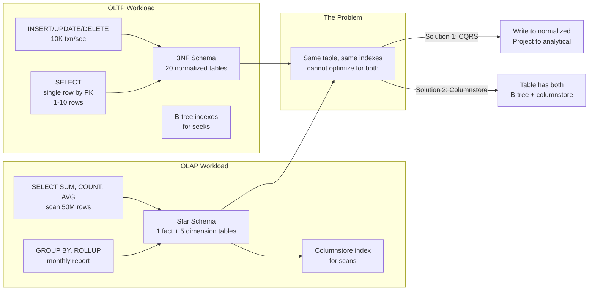
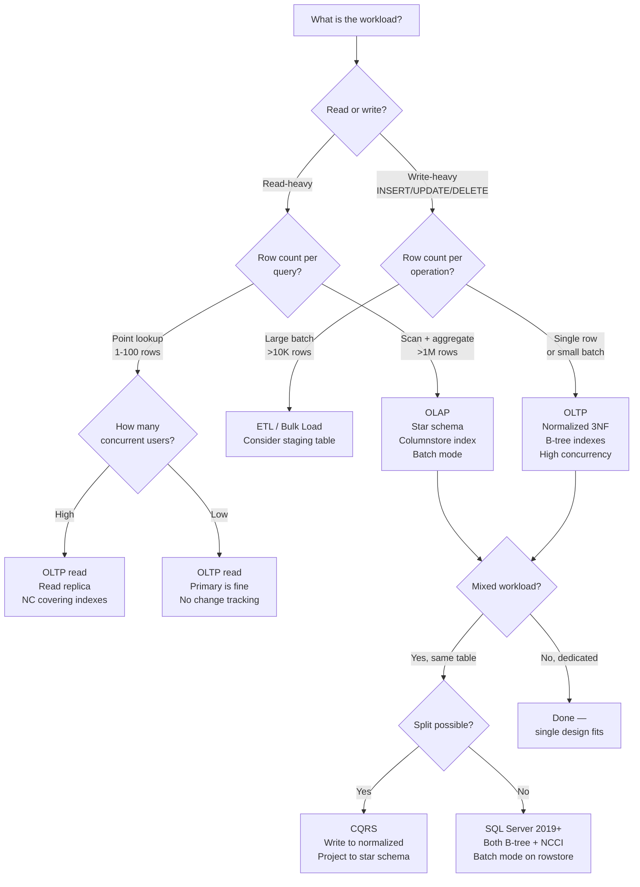

## Navigation

**Domain:** [[8 — Databases]] > **Group:** Relational Fundamentals
**Previous:** [[8.016 — Relational Algebra — Select, Project, Join]] | **Next:** [[8.018 — SQL Standards — ANSI SQL vs T-SQL vs PLpgSQL]]

### Prerequisites
- [[8.016 — Relational Algebra — Select, Project, Join]] — OLAP queries are dominated by γ (aggregation) operators; understanding why star-schema joins minimize ⨝ cost is essential to schema design
- [[8.010 — Schema Design — Tables, Columns, Constraints]] — OLTP schema follows normalization rules (3NF); OLAP schema intentionally breaks them — you must know the rules before choosing to break them

### Where This Fits

OLTP (Online Transaction Processing) and OLAP (Online Analytical Processing) are **opposite optimization targets** for the same database engine. OLTP optimizes for many small, concurrent writes (INSERT/UPDATE/DELETE of single rows) with strict ACID guarantees. OLAP optimizes for large, infrequent reads (scan millions of rows, aggregate, return a small result). A .NET backend engineer encounters this divide daily: the same database that processes 10,000 orders/minute (OLTP) also powers the monthly revenue dashboard (OLAP). When both share one schema, neither performs well. The interview signal: can the candidate recognize that a reporting query that joins 8 normalized tables and scans 50M rows is not fixable with indexes alone — it needs a different schema design (star schema) or a different storage engine (columnstore, dedicated OLAP system)?

## Core Mental Model

OLTP and OLAP are **workload optimization targets** that drive diametrically opposed schema design, indexing strategy, and query patterns:

|Dimension|OLTP|OLAP|
|---|---|---|
|**Primary operation**|Point lookups, small writes|Large scans, aggregations|
|**Query pattern**|`SELECT * FROM Orders WHERE OrderId = 42`|`SELECT SUM(Amount) FROM Orders GROUP BY YEAR(OrderDate)`|
|**Rows per query**|Single digits to hundreds|Millions to billions|
|**Concurrent users**|Thousands (100–10K)|Tens (1–50)|
|**Schema**|Normalized (3NF/BCNF)|Denormalized (Star/Snowflake)|
|**Index strategy**|B-tree (clustered + NC) for seeks|Columnstore for scans|
|**ACID requirements**|Full ACID (implicit transactions, 1–10ms)|Relaxed (batch operations, minutes)|
|**Storage format**|Row-oriented|Column-oriented or row-oriented with columnstore|
|**Performance metric**|Transactions per second (TPS), logical reads per query|Query completion time, bytes scanned|

The invariant: **a schema optimized for OLTP cannot serve OLAP queries efficiently, and vice versa.** The same table with the same indexes cannot be seek-optimal for 10-byte point lookups and scan-optimal for 1TB aggregations. The solution is either: (a) separate schemas (CQRS pattern — write to normalized store, project to analytical store), or (b) use columnstore indexes on the same table for mixed workloads (SQL Server can have both a B-tree and a columnstore index on the same table).



### Classification

**Category:** Workload analysis and schema architecture — this is not a SQL construct or an engine feature in itself. It is the **recognition pattern** that determines which engine features, index types, and schema designs to apply. An OLTP workload demands B-tree indexes, normalized tables, small batch sizes, and high concurrency control. An OLAP workload demands columnstore indexes, denormalized star schemas, large batch operations, and query parallelism.

|Property|OLTP|OLAP|
|---|---|---|
|B-tree suitability|Optimal (seek O(log N), key lookup = 2–4 reads)|Poor (range scan on 50M rows = 45K reads)|
|Columnstore suitability|Poor (row compression not designed for point updates)|Optimal (batch-mode processing, column elimination)|
|Locking behavior|Row-level, short duration, high contention|Table-level (during build), no concurrency|
|SARGability|Critical (every predicate must be SARGable for seeks)|Less critical (scan is expected; filter pushdown helps)|
|EF Core mapping|Entities map 1:1 to tables; navigation properties|Read-only DbSet against views or raw SQL|

### Key Properties

|Property|OLTP|OLAP|
|---|---|---|
|Data modification|INSERT/UPDATE/DELETE per row|Batch INSERT (ETL), no UPDATE|
|Transaction duration|1–10ms per statement|Minutes to hours per batch|
|Rows scanned per query|10–1,000|1M–1B|
|Index maintenance cost|High (every write updates multiple indexes)|Low (columnstore rebuilds are scheduled)|
|Page life expectancy|Critical — wants hot pages in buffer pool|Less critical — can use direct I/O for scan|
|Backup strategy|Point-in-time recovery (log backups)|Snapshot-based (data is reproducible from source)|
|.NET patterns|DbContext, ChangeTracker, UnitOfWork|Dapper QueryAsync, SqlBulkCopy, ADO.NET DataTable|

## Deep Mechanics

### How the Engine Handles Each Workload

**OLTP — B-tree Index Seek in Detail:**

1. A query like `SELECT * FROM Orders WHERE OrderId = 42` hits the clustered index.
2. The B-tree is traversed from root to leaf: read root page (in memory), navigate to intermediate page, navigate to leaf page containing the row.
3. The row is read from the data page. If the query uses a nonclustered index, the leaf contains the clustering key, requiring a key lookup (clustered index seek by key).
4. Logical reads: ~3 (root + intermediate + leaf) for the clustered index seek. If a NC index + key lookup: ~5 (NC root + NC leaf + CI root + CI intermediate + CI leaf).
5. The transaction log records the operation. Buffer pool pins the data page. Locks are acquired (ROW or KEY range).

**OLAP — Columnstore Index Scan in Detail:**

1. A query like `SELECT YEAR(OrderDate) AS Year, SUM(Total) FROM Orders GROUP BY YEAR(OrderDate)` hits the columnstore index.
2. The storage engine reads only the `OrderDate` and `Total` column segments. Each segment is compressed (vertipaq) and stored in 1M-row rowgroups.
3. For each rowgroup, the engine reads the compressed segment, decompresses in batch mode, and processes the aggregate.
4. Batch mode processing operates on vectors of ~900 rows at a time, not one row at a time. CPU efficiency is dramatically higher.
5. Column elimination: if the query only needs OrderDate and Total, the other 18 columns of the Orders table are not read from disk at all.
6. Logical reads are measured differently — columnstore segments are read in 64KB extents. A 50M-row table with 20 columns requires reading only the ~3GB for two columns (OrderDate, Total) instead of ~30GB for the full table.

### SQL Visibility

```sql
-- =============================================
-- OLTP Query Pattern
-- =============================================
-- Point lookup by PK (B-tree seek, single row)
SELECT OrderId, CustomerId, OrderDate, Total
FROM Orders
WHERE OrderId = 42;

-- Point lookup by non-PK (NC index seek + key lookup)
SELECT OrderId, CustomerId, OrderDate, Total
FROM Orders
WHERE CustomerId = 12345;

-- Small range scan (seek on date, fetch ~20 rows)
SELECT OrderId, OrderDate, Total
FROM Orders
WHERE CustomerId = 12345
  AND OrderDate >= '2026-06-01'
ORDER BY OrderDate DESC;

-- Small INSERT (single row, implicit transaction)
INSERT INTO Orders (CustomerId, OrderDate, Total, Status)
VALUES (12345, SYSUTCDATETIME(), 250.00, 'Pending');

-- EF Core OLTP pattern
var order = await dbContext.Orders
    .FirstOrDefaultAsync(o => o.OrderId == id, cancellationToken);

order.Total = 275.00;
await dbContext.SaveChangesAsync(cancellationToken);
-- Generates: UPDATE Orders SET Total = 275.00 WHERE OrderId = @p0
-- Logical reads: ~3 (seek) + 1 (log write)

-- =============================================
-- OLAP Query Pattern
-- =============================================
-- Full scan with aggregation (columnstore scan)
SELECT YEAR(OrderDate) AS OrderYear,
       MONTH(OrderDate) AS OrderMonth,
       COUNT_BIG(*) AS OrderCount,
       SUM(Total) AS RevenueTotal,
       AVG(Total) AS AvgOrderValue
FROM Orders
WHERE OrderDate >= '2025-01-01'
GROUP BY YEAR(OrderDate), MONTH(OrderDate)
ORDER BY OrderYear, OrderMonth;

-- Large scan with HAVING filter
SELECT CustomerId, COUNT_BIG(*) AS OrderCount, SUM(Total) AS LifetimeValue
FROM Orders
GROUP BY CustomerId
HAVING COUNT_BIG(*) > 10
   AND SUM(Total) > 10000
ORDER BY LifetimeValue DESC;

-- Window function for running totals (OLAP analytical function)
SELECT OrderId, OrderDate, Total,
       SUM(Total) OVER (PARTITION BY CustomerId ORDER BY OrderDate) AS RunningTotal,
       AVG(Total) OVER (PARTITION BY CustomerId) AS CustomerAvg
FROM Orders
WHERE CustomerId = 12345;
```

```csharp
// EF Core LINQ — OLTP vs OLAP

// OLTP: projected DTO, single entity
var order = await dbContext.Orders
    .Where(o => o.OrderId == id)
    .Select(o => new OrderDto { OrderId = o.OrderId, Total = o.Total })
    .FirstOrDefaultAsync(cancellationToken);
-- Generated SQL: SELECT o.OrderId, o.Total FROM Orders o WHERE o.OrderId = @p0
-- Logical reads: ~2 with covering index

// OLAP: aggregation over large set
var monthlyRevenue = await dbContext.Orders
    .Where(o => o.OrderDate >= startDate)
    .GroupBy(o => new { o.OrderDate.Year, o.OrderDate.Month })
    .Select(g => new {
        Year = g.Key.Year,
        Month = g.Key.Month,
        OrderCount = g.Count(),
        Revenue = g.Sum(o => o.Total)
    })
    .OrderBy(r => r.Year).ThenBy(r => r.Month)
    .ToListAsync(cancellationToken);
-- Generated SQL: GROUP BY YEAR(OrderDate), MONTH(OrderDate)
-- Optimizer uses columnstore index scan if available, or clustered index scan + hash match aggregate
-- Logical reads: depends on index — columnstore: ~50-100 segments; B-tree: ~45,000+

// Dapper — OLTP: parameterized point lookup
public async Task<OrderDto?> GetOrderAsync(int orderId, IDbConnection connection)
{
    const string sql = @"
        SELECT OrderId, CustomerId, OrderDate, Total, Status
        FROM Orders
        WHERE OrderId = @OrderId;";
    return await connection.QuerySingleOrDefaultAsync<OrderDto>(
        sql, new { OrderId = orderId });
}

// Dapper — OLAP: large scan aggregation
public async Task<IReadOnlyList<MonthlyRevenueDto>> GetMonthlyRevenueAsync(
    DateTime startDate, IDbConnection connection)
{
    const string sql = @"
        SELECT YEAR(OrderDate) AS OrderYear,
               MONTH(OrderDate) AS OrderMonth,
               COUNT_BIG(*) AS OrderCount,
               SUM(Total) AS Revenue
        FROM Orders
        WHERE OrderDate >= @StartDate
        GROUP BY YEAR(OrderDate), MONTH(OrderDate)
        ORDER BY OrderYear, OrderMonth;";
    return (await connection.QueryAsync<MonthlyRevenueDto>(
        sql, new { StartDate = startDate })).AsList();
}
```

### Execution Plan Analysis

**OLTP plan — point lookup:**
```
[Clustered Index Seek (PK_Orders)] — seek on OrderId = 42
    → [SELECT]
Estimated Cost: 100% on the seek | Logical Reads: 3 (root + intermediate + leaf)
```

**OLTP plan — NC index with key lookup:**
```
[NonClustered Index Seek (IX_Orders_CustomerId)] — seek on CustomerId = 12345
    → [Key Lookup (Clustered, PK_Orders)] — lookup by clustering key
    → [Nested Loops] — join the two
    → [SELECT]
Estimated Cost: Seek 30% + Key Lookup 60% + Nested Loops 10% | Logical Reads: ~5
```
If `IX_Orders_CustomerId` includes the queried columns, the key lookup disappears: covering index seek.

**OLAP plan — full table scan with aggregation:**
```
[Clustered Index Scan (Orders)] — scan 45,000 pages
    → [Hash Match (Aggregate)] — build hash table on YEAR + MONTH
    → [Sort] — ORDER BY
    → [SELECT]
Estimated Cost: Scan 70% + Hash Match 25% + Sort 5% | Logical Reads: 45,000
```

**OLAP plan — columnstore scan with aggregation:**
```
[Columnstore Index Scan (CCI_Orders)] — scan OrderDate + Total segments only
    → [Hash Match (Aggregate)] — batch mode
    → [Sort] — ORDER BY
    → [SELECT]
Estimated Cost: Scan 30% + Hash Match 60% + Sort 10% | Logical Reads: ~65 column segments (vs 45,000 pages)
```
Batch mode processing reduces CPU cost per row by ~10x compared to row mode.

### Cost Visibility

```sql
SET STATISTICS IO ON;
SET STATISTICS TIME ON;

-- OLTP: single order lookup
SELECT OrderId, Total FROM Orders WHERE OrderId = 42;
-- Table 'Orders': logical reads 3
-- CPU time = 0ms, elapsed time = 1ms

-- OLTP: range scan for customer (20 orders)
SELECT OrderId, OrderDate, Total
FROM Orders
WHERE CustomerId = 12345 AND OrderDate >= '2026-01-01';
-- Table 'Orders': logical reads 7 (seek + range scan on NC index)
-- CPU time = 1ms, elapsed time = 2ms

-- OLAP: monthly aggregation (scan all 10M orders)
SELECT YEAR(OrderDate) AS Year, COUNT_BIG(*) AS Cnt
FROM Orders
GROUP BY YEAR(OrderDate);
-- Without columnstore (B-tree):
--   Table 'Orders': logical reads 45,000
--   CPU time = 1200ms, elapsed time = 1500ms
-- With columnstore:
--   Table 'Orders': columnstore segments read 65
--   CPU time = 300ms, elapsed time = 400ms
```

### Failure Modes

|Failure|OLTP Scenario|OLAP Scenario|
|---|---|---|
|**Wrong index type**|Columnstore on OLTP table → UPDATE/DELETE fragment rowgroups, poor point-lookup performance|B-tree on OLAP fact table → full scan of 45K pages for every aggregation query|
|**Blocking from long-running query**|Monthly report scans entire Orders table, holds schema stability lock, blocks INSERT for 5 minutes|N/A (OLAP runs during maintenance window or on replica)|
|**Deadlock under high concurrency**|10 concurrent orders update the same Customer's row → lock escalation to TABLE → deadlock|Impossible — OLAP is read-only|
|**Parameter sniffing**|OLTP query plan optimized for one parameter value performs poorly for another (e.g., 1 row vs 1M rows plan)|N/A — OLAP queries typically scan full tables; parameter values don't change scan/no-scan decision|
|**Over-normalization for OLAP**|N/A (normalization helps OLTP)|8-table join for every reporting query — each join adds seeks/scan costs|
|**Missing columnstore for analytics**|N/A (B-tree is correct for OLTP)|OLAP queries run 10x slower, consuming tempdb for hash matches|

## Production Patterns and Implementation

### Primary SQL Implementation — OLTP Schema vs OLAP Schema

```sql
-- =============================================
-- OLTP Schema: Normalized (3NF)
-- =============================================
CREATE TABLE Customers (
    CustomerId INT IDENTITY(1,1) PRIMARY KEY,
    FullName   NVARCHAR(200) NOT NULL,
    Email      NVARCHAR(320) NOT NULL UNIQUE,
    Phone      NVARCHAR(50) NULL,
    Address    NVARCHAR(500) NULL,
    CreatedAt  DATETIME2 NOT NULL DEFAULT SYSUTCDATETIME(),
    Tier       VARCHAR(20) NOT NULL DEFAULT 'Standard'
);

CREATE TABLE Products (
    ProductId   INT IDENTITY(1,1) PRIMARY KEY,
    ProductName NVARCHAR(200) NOT NULL,
    CategoryId  INT NOT NULL REFERENCES Categories(CategoryId),
    UnitPrice   DECIMAL(10,2) NOT NULL,
    CurrentStock INT NOT NULL DEFAULT 0
);

CREATE TABLE Orders (
    OrderId    INT IDENTITY(1,1) PRIMARY KEY,
    CustomerId INT NOT NULL REFERENCES Customers(CustomerId),
    OrderDate  DATETIME2 NOT NULL DEFAULT SYSUTCDATETIME(),
    Total      DECIMAL(10,2) NOT NULL,
    Status     VARCHAR(20) NOT NULL DEFAULT 'Pending'
);

CREATE INDEX IX_Orders_CustomerId ON Orders(CustomerId) INCLUDE (OrderDate, Total, Status);

CREATE TABLE OrderItems (
    OrderId   INT           NOT NULL REFERENCES Orders(OrderId),
    ItemNum   TINYINT       NOT NULL,
    ProductId INT           NOT NULL REFERENCES Products(ProductId),
    Quantity  SMALLINT      NOT NULL CHECK (Quantity > 0),
    UnitPrice DECIMAL(10,2) NOT NULL,
    CONSTRAINT PK_OrderItems PRIMARY KEY (OrderId, ItemNum)
);

-- OLTP query: get order with items (point lookup + range scan)
SELECT o.OrderId, o.OrderDate, o.Total,
       oi.ItemNum, oi.ProductId, oi.Quantity, oi.UnitPrice
FROM Orders o
INNER JOIN OrderItems oi ON o.OrderId = oi.OrderId
WHERE o.OrderId = 42;
-- Plan: CI Seek (Orders) -> NL -> CI Seek (OrderItems PK)
-- Reads: 3 (Orders) + 2 (OrderItems) = 5

-- =============================================
-- OLAP Schema: Star Schema (Denormalized)
-- =============================================
CREATE TABLE DimDate (
    DateKey       INT PRIMARY KEY,
    FullDate      DATE NOT NULL,
    Year          SMALLINT NOT NULL,
    Quarter       TINYINT NOT NULL,
    Month         TINYINT NOT NULL,
    MonthName     VARCHAR(20) NOT NULL,
    DayOfWeek     TINYINT NOT NULL,
    IsWeekend     BIT NOT NULL,
    IsHoliday     BIT NOT NULL
);

CREATE TABLE DimCustomer (
    CustomerKey INT IDENTITY(1,1) PRIMARY KEY,
    CustomerId  INT NOT NULL, -- original OLTP ID for lineage
    FullName    NVARCHAR(200) NOT NULL,
    Email       NVARCHAR(320) NOT NULL,
    Tier        VARCHAR(20) NOT NULL,
    -- Slowly Changing Dimension Type 2 columns
    EffectiveDate DATE NOT NULL,
    EndDate       DATE NULL,
    IsCurrent     BIT NOT NULL DEFAULT 1
);

CREATE TABLE DimProduct (
    ProductKey  INT IDENTITY(1,1) PRIMARY KEY,
    ProductId   INT NOT NULL,
    ProductName NVARCHAR(200) NOT NULL,
    CategoryName NVARCHAR(100) NOT NULL,
    UnitPrice   DECIMAL(10,2) NOT NULL
);

CREATE TABLE FactOrder (
    OrderId     INT NOT NULL,
    DateKey     INT NOT NULL REFERENCES DimDate(DateKey),
    CustomerKey INT NOT NULL REFERENCES DimCustomer(CustomerKey),
    ProductKey  INT NOT NULL REFERENCES DimProduct(ProductKey),
    Quantity    SMALLINT NOT NULL,
    UnitPrice   DECIMAL(10,2) NOT NULL,
    LineTotal   DECIMAL(10,2) NOT NULL,
    Discount    DECIMAL(10,2) NOT NULL DEFAULT 0
);
-- Create columnstore index on the fact table
CREATE CLUSTERED COLUMNSTORE INDEX CCI_FactOrder ON FactOrder;

-- OLAP query: monthly revenue by category (scans fact table, joins 2 dimensions)
SELECT  d.Year, d.Month,
        p.CategoryName,
        SUM(f.LineTotal) AS Revenue
FROM    FactOrder f
        JOIN DimDate d     ON f.DateKey = d.DateKey
        JOIN DimProduct p  ON f.ProductKey = p.ProductKey
WHERE   d.Year = 2026
GROUP BY d.Year, d.Month, p.CategoryName
ORDER BY d.Year, d.Month, Revenue DESC;
-- Plan: Columnstore Scan (FactOrder) -> Hash Match -> NL -> DimDate seek -> NL -> DimProduct seek
-- Reads: ~65 column segments (FactOrder) + 2 (DimDate PK) + 3 (DimProduct PK)
-- Batch mode aggregation
```

### EF Core Implementation — OLTP vs OLAP

```csharp
// =============================================
// OLTP — Full entity tracking, unit of work
// =============================================
public class OrderService
{
    private readonly SalesDbContext _dbContext;

    public async Task<OrderDto> CreateOrderAsync(
        CreateOrderCommand command, CancellationToken ct)
    {
        var order = new Order
        {
            CustomerId = command.CustomerId,
            OrderDate = DateTime.UtcNow,
            Status = "Pending",
            OrderItems = command.Items.Select(i => new OrderItem
            {
                ProductId = i.ProductId,
                Quantity = i.Quantity,
                UnitPrice = i.UnitPrice
            }).ToList()
        };

        order.Total = order.OrderItems.Sum(i => i.Quantity * i.UnitPrice);

        _dbContext.Orders.Add(order);
        await _dbContext.SaveChangesAsync(ct);

        return MapToDto(order);
    }
}

// =============================================
// OLAP — Read-only projection, no tracking
// =============================================
public class SalesAnalyticsService
{
    private readonly SalesDbContext _dbContext;

    public async Task<IReadOnlyList<MonthlyRevenueDto>> GetMonthlyRevenueAsync(
        int year, CancellationToken ct)
    {
        // AsNoTracking — essential for read-only OLAP queries
        var query = from f in _dbContext.FactOrders.AsNoTracking()
                    join d in _dbContext.DimDates.AsNoTracking()
                        on f.DateKey equals d.DateKey
                    join p in _dbContext.DimProducts.AsNoTracking()
                        on f.ProductKey equals p.ProductKey
                    where d.Year == year
                    group new { f, d, p } by new { d.Month, p.CategoryName } into g
                    select new MonthlyRevenueDto
                    {
                        Month = g.Key.Month,
                        Category = g.Key.CategoryName,
                        Revenue = g.Sum(x => x.f.LineTotal)
                    };

        return await query
            .OrderBy(r => r.Month)
            .ThenByDescending(r => r.Revenue)
            .ToListAsync(ct);
    }
}
```

### Dapper Implementation

```csharp
// =============================================
// OLTP — parameterized, single-row operations
// =============================================
public async Task<OrderDto?> GetOrderAsync(
    int orderId, IDbConnection connection)
{
    const string sql = @"
        SELECT o.OrderId, o.OrderDate, o.Total, o.Status,
               oi.ItemNum, oi.ProductId, oi.Quantity, oi.UnitPrice
        FROM Orders o
        INNER JOIN OrderItems oi ON o.OrderId = oi.OrderId
        WHERE o.OrderId = @OrderId
        ORDER BY oi.ItemNum;";

    var lookup = new Dictionary<int, OrderDto>();

    await connection.QueryAsync<OrderDto, OrderItemDto, OrderDto>(
        sql,
        (order, item) =>
        {
            if (!lookup.TryGetValue(order.OrderId, out var existing))
            {
                existing = order;
                existing.Items = new();
                lookup.Add(existing.OrderId, existing);
            }
            if (item is not null) existing.Items.Add(item);
            return existing;
        },
        new { OrderId = orderId },
        splitOn: "ItemNum");

    return lookup.Values.FirstOrDefault();
}

// =============================================
// OLAP — large scan, aggregation
// =============================================
public async Task<IReadOnlyList<MonthlyRevenueDto>> GetMonthlyRevenueAsync(
    int year, IDbConnection connection)
{
    const string sql = @"
        SELECT d.Month, p.CategoryName, SUM(f.LineTotal) AS Revenue
        FROM FactOrder f
        JOIN DimDate d ON f.DateKey = d.DateKey
        JOIN DimProduct p ON f.ProductKey = p.ProductKey
        WHERE d.Year = @Year
        GROUP BY d.Month, p.CategoryName
        ORDER BY d.Month, Revenue DESC;";

    return (await connection.QueryAsync<MonthlyRevenueDto>(
        sql, new { Year = year })).AsList();
}

// Bulk insert for OLAP ETL — SqlBulkCopy
public async Task BulkInsertFactOrdersAsync(
    DataTable factOrders, SqlConnection connection, SqlTransaction transaction)
{
    using var bulkCopy = new SqlBulkCopy(connection, SqlBulkCopyOptions.Default, transaction)
    {
        DestinationTableName = "FactOrder",
        BatchSize = 100000,
        EnableStreaming = true
    };

    await bulkCopy.WriteToServerAsync(factOrders);
}
```

### Configuration and Wiring

```csharp
// Program.cs — separate DbContext for OLTP and OLAP
builder.Services.AddDbContext<SalesDbContext>(options =>
    options.UseSqlServer(
        builder.Configuration.GetConnectionString("SalesDb"),
        sqlOptions =>
        {
            sqlOptions.EnableRetryOnFailure(3);
            sqlOptions.CommandTimeout(30); // OLTP — short timeout
        }));

builder.Services.AddDbContext<AnalyticsDbContext>(options =>
    options.UseSqlServer(
        builder.Configuration.GetConnectionString("AnalyticsDb"),
        sqlOptions =>
        {
            sqlOptions.EnableRetryOnFailure(1);
            sqlOptions.CommandTimeout(300); // OLAP — long timeout for large scans
        }));

// Register services
builder.Services.AddScoped<IOrderService, OrderService>();
builder.Services.AddScoped<ISalesAnalyticsService, SalesAnalyticsService>();
```

### SQL Server vs PostgreSQL Differences

```sql
-- SQL Server: Clustered Columnstore Index on fact table
CREATE CLUSTERED COLUMNSTORE INDEX CCI_FactOrder ON FactOrder;

-- SQL Server: Nonclustered columnstore on an existing rowstore table
CREATE NONCLUSTERED COLUMNSTORE INDEX NCCI_Orders ON Orders(OrderDate, Total, Status);

-- SQL Server: Batch mode for rowstore queries (2019+)
-- Intelligent Query Processing can use batch mode for B-tree scans on qualifying queries.
-- Enable with database compatibility level 150+.

-- PostgreSQL: No columnstore index natively.
-- Use BRIN indexes for large OLAP tables:
CREATE INDEX brin_orders_date ON Orders USING brin(OrderDate)
    WITH (pages_per_range = 32);
-- BRIN indexes are orders of magnitude smaller than B-tree for date-range scans.

-- PostgreSQL: Materialized views for OLAP pre-aggregation:
CREATE MATERIALIZED VIEW monthly_revenue AS
SELECT DATE_TRUNC('month', OrderDate) AS Month,
       SUM(Total) AS Revenue
FROM Orders
GROUP BY DATE_TRUNC('month', OrderDate);

REFRESH MATERIALIZED VIEW CONCURRENTLY monthly_revenue;

-- PostgreSQL: Table partitioning for large fact tables:
CREATE TABLE FactOrder (
    OrderId INT NOT NULL,
    OrderDate DATE NOT NULL,
    -- ...
) PARTITION BY RANGE (OrderDate);

-- SQL Server: Partitioned tables (Enterprise Edition)
CREATE PARTITION FUNCTION pf_DateRange (DATE)
AS RANGE RIGHT FOR VALUES ('2025-01-01', '2026-01-01', '2027-01-01');
CREATE PARTITION SCHEME ps_DateRange AS PARTITION pf_DateRange ALL TO ([PRIMARY]);
CREATE TABLE FactOrder (...) ON ps_DateRange(OrderDate);
```

## Gotchas and Production Pitfalls

### 1. Running OLAP Queries on the OLTP Primary Replica

**Pitfall:** The monthly revenue report runs directly against the production OLTP database, scanning the entire Orders table while customers are placing orders.

```sql
-- ❌ OLAP query on OLTP database — scans 45K pages, blocks writers
SELECT YEAR(OrderDate), SUM(Total)
FROM Orders
WHERE OrderDate >= '2026-01-01'
GROUP BY YEAR(OrderDate);
```

**Symptom:** The scan holds a Schema Stability (Sch-S) lock on the Orders table. INSERT queries (which need Sch-M for page splits) are blocked. Blocking chains grow. Order processing times out.

**Fix:** Route OLAP queries to a read replica or use a dedicated analytics database with a star schema and columnstore indexes. Use `ApplicationIntent=ReadOnly` in the connection string to route to the secondary.

```csharp
// Connection string for analytics queries (routes to readable secondary)
"Server=myServer;Database=SalesDb;Integrated Security=true;ApplicationIntent=ReadOnly;"
```

**Cost of not fixing:** 30-second monthly report causes 30-second order-processing outage. With 100 orders/minute, 50 orders time out during the report. Revenue loss at $50/order = $2,500 per report run.

### 2. Columnstore Index on an OLTP Table with Frequent Updates

**Pitfall:** Creating a nonclustered columnstore index on an OLTP table expecting the same benefits as a dedicated OLAP schema.

```sql
-- ❌ Columnstore on high-insert table — rowgroup fragmentation
CREATE NONCLUSTERED COLUMNSTORE INDEX NCCI_Orders ON Orders(OrderDate, Total, Status);
-- Each INSERT creates a delta store rowgroup (only 102K rows max)
-- Frequent updates/inserts fragment rowgroups, requiring background tuple-mover
-- Point lookups degrade because columnstore is not optimized for single-row retrieval
```

**Symptom:** UPDATE and DELETE on the columnstore index cause delete bitmaps (marking rows as deleted without removing them). The tuple mover must periodically merge delta rowgroups. Queries must filter out deleted rows via the bitmap, adding overhead. Point lookups use the B-tree while scans use columnstore — but the fragmentation reduces columnstore efficiency.

**Fix:** Use columnstore only on tables that are bulk-loaded and read-only (typical OLAP fact tables). For mixed workloads on SQL Server 2019+, rely on batch mode for rowstore queries instead.

**Cost of not fixing:** Columnstore index maintenance overhead adds 15-20% write latency. The columnstore never reaches optimal compression because delta rowgroups are merged constantly. The net effect: worse OLTP performance and only marginal OLAP improvement.

### 3. Over-Normalized OLAP Schema

**Pitfall:** The engineer applies OLTP normalization rules to the analytics schema, producing an 8-table snowflake schema where a 2-table star would suffice.

```sql
-- ❌ Over-normalized OLAP — 6 joins for "revenue by category"
SELECT SUM(f.LineTotal)
FROM FactOrders f
JOIN DimOrder o ON f.OrderKey = o.OrderKey       -- unnecessary: order-level data in fact
JOIN DimCustomer c ON o.CustomerKey = c.CustomerKey
JOIN DimAddress a ON c.AddressKey = a.AddressKey  -- unnecessary: not used in report
JOIN DimProduct p ON f.ProductKey = p.ProductKey
JOIN DimCategory cat ON p.CategoryKey = cat.CategoryKey
JOIN DimSubCategory sc ON cat.SubCategoryKey = sc.SubCategoryKey;
```

**Symptom:** 6 joins for every query. The query optimizer may choose incorrect join orders. Each join adds logical reads. The dashboard renders in 30 seconds instead of 2.

**Fix:** Flatten dimensions. Include category name directly in the product dimension. Remove snowflake branches that are not queried independently. Typical star schema has 4–7 dimension tables, each denormalized.

**Cost of not fixing:** Storage savings from snowflaking are negligible (<5%) while query performance degrades 5-10x. Each join added to a star schema increases query complexity and reduces maintainability.

### 4. Missing Partition Elimination in OLAP

**Pitfall:** The fact table is partitioned by date, but queries don't filter by the partition key, forcing a scan of all partitions.

```sql
-- ❌ Query scans all partitions — no partition elimination
SELECT CustomerKey, SUM(LineTotal) AS Revenue
FROM FactOrder
GROUP BY CustomerKey;
-- Scans all 36 monthly partitions even though data spans 3 years

-- ✅ Query with partition elimination
SELECT CustomerKey, SUM(LineTotal) AS Revenue
FROM FactOrder
WHERE OrderDate >= '2026-01-01' AND OrderDate < '2027-01-01'
GROUP BY CustomerKey;
-- Scans only 12 monthly partitions
```

**Symptom:** Full scan of all partitions (months/years) even when the user only needs current year. The execution plan shows a parallel scan of all partition ranges with no elimination.

**Fix:** Always include the partition key in WHERE clauses. Design the partition scheme so the most common filter (e.g., current month, current year) aligns with partition boundaries.

**Cost of not fixing:** A 36-partition scan reads all data even when only 1 partition is needed — 36x more I/O. At 500M rows/fact table, that is ~15GB of unnecessary reads per query.

### 5. Using EF Core Change Tracking for OLAP Queries

**Pitfall:** Using the same DbContext with change tracking enabled for large read-only analytical queries.

```csharp
// ❌ Change tracking enabled — tracks 50M rows in memory
var data = await dbContext.FactOrders
    .Where(f => f.OrderDate >= startDate)
    .ToListAsync(); // Loads ALL columns, ALL rows into memory
```

**Symptom:** DbContext change tracker holds references to 50M entities. Memory usage spikes to 10GB+. The application crashes with OutOfMemoryException. Even if memory suffices, the change tracker's `DetectChanges()` scan on `SaveChangesAsync` takes minutes.

**Fix:**

```csharp
// ✅ AsNoTracking — essential for queries
var data = await dbContext.FactOrders
    .AsNoTracking()
    .Where(f => f.OrderDate >= startDate)
    .GroupBy(f => f.DateKey)
    .Select(g => new { DateKey = g.Key, Revenue = g.Sum(f => f.LineTotal) })
    .ToListAsync(ct);

// ✅ Even better — Dapper for OLAP (no change tracker overhead)
var data = await connection.QueryAsync<RevenueByDate>(
    "SELECT DateKey, SUM(LineTotal) AS Revenue FROM FactOrder WHERE ... GROUP BY DateKey");
```

**Cost of not fixing:** OutOfMemoryException on the analytics server during monthly reporting. The crash takes down both the analytics and OLTP services if they share the same process. Requires a process restart and manual query execution via SSMS to recover.

### 6. Ignoring Batch Mode for Rowstore (SQL Server 2019+)

**Pitfall:** Not enabling database compatibility level 150 for SQL Server 2019+ to allow batch mode on rowstore queries.

```sql
-- ❌ Database at compatibility level 140 or lower
ALTER DATABASE SalesDb SET COMPATIBILITY_LEVEL = 140;
-- OLAP query on B-tree table cannot use batch mode
```

**Symptom:** Large aggregation queries on rowstore tables run in row mode (one row at a time) instead of batch mode (vectors of ~900 rows). CPU-bound OLAP queries are 3-10x slower than necessary.

**Fix:**

```sql
-- ✅ Enable batch mode on rowstore
ALTER DATABASE SalesDb SET COMPATIBILITY_LEVEL = 150; -- SQL Server 2019
-- Or for SQL Server 2022:
ALTER DATABASE SalesDb SET COMPATIBILITY_LEVEL = 160;
```

**Cost of not fixing:** A 5-minute aggregation query takes 15-25 minutes because the CPU cannot use vectorized execution. The query consumes more CPU time (spiking server utilization) and takes longer, increasing the chance of blocking other operations.

## Performance Implications

### Benchmark: OLTP B-tree vs OLAP Columnstore

```sql
-- Setup: 50M row Orders table
--   B-tree: clustered PK, NC index on CustomerId
--   Columnstore: nonclustered columnstore on (OrderDate, Total, Status)

-- OLTP Query: point lookup by PK
SET STATISTICS IO ON;
SELECT OrderId, CustomerId, Total FROM Orders WHERE OrderId = 42;
-- B-tree: logical reads 3
-- Columnstore: logical reads ~8 (delta store lookup at small scale, worse for point lookups)

-- OLTP Query: customer order history (range scan, ~20 rows)
SELECT OrderId, OrderDate, Total
FROM Orders
WHERE CustomerId = 12345 AND OrderDate >= '2026-01-01';
-- B-tree (IX_Orders_CustomerId covering): logical reads 7
-- Columnstore: logical reads ~45 (delta store + column segment reads)

-- OLAP Query: monthly aggregation (full scan)
SELECT YEAR(OrderDate) AS Year, SUM(Total) AS Revenue
FROM Orders
WHERE OrderDate >= '2025-01-01'
GROUP BY YEAR(OrderDate);
-- B-tree (CI scan): logical reads 45,000
-- Columnstore (CCI scan): column segments read 65 (only OrderDate and Total columns)
-- Batch mode: CPU time 300ms vs 1200ms (row mode)
```

**Improvement:** Columnstore reduces I/O from 45,000 pages to ~65 column segments for the OLAP query — a ~700x reduction. Batch mode reduces CPU time by ~4x.

### BenchmarkDotNet

```csharp
[MemoryDiagnoser]
[SimpleJob(RuntimeMoniker.Net90)]
public class OltpVsOlapBenchmark
{
    private IDbConnection _connection = default!;
    private SalesDbContext _dbContext = default!;

    [GlobalSetup]
    public void Setup()
    {
        _connection = new SqlConnection(TestConnectionString);
        var options = new DbContextOptionsBuilder<SalesDbContext>()
            .UseSqlServer(TestConnectionString)
            .Options;
        _dbContext = new SalesDbContext(options);
    }

    [Benchmark(Baseline = true)]
    public async Task<OrderDto?> OltpPointLookup()
    {
        const string sql = "SELECT OrderId, CustomerId, Total FROM Orders WHERE OrderId = @Id";
        return await _connection.QuerySingleOrDefaultAsync<OrderDto>(
            sql, new { Id = 42 });
    }

    [Benchmark]
    public async Task<int> OlapAggregation()
    {
        const string sql = @"
            SELECT COUNT_BIG(*)
            FROM Orders
            WHERE OrderDate >= @StartDate;";
        return await _connection.QuerySingleAsync<int>(
            sql, new { StartDate = new DateTime(2025, 1, 1) });
    }

    [Benchmark]
    public async Task<int> OltpEfCore()
    {
        var order = await _dbContext.Orders
            .AsNoTracking()
            .FirstOrDefaultAsync(o => o.OrderId == 42);
        return order?.OrderId ?? 0;
    }
}
```

**Expected results (approximate, SQL Server 2022, NVMe, 50M row Orders table):**

|Method|Mean|Logical Reads|Allocated|
|---|---|---|---|
|OltpPointLookup (B-tree)|~0.3 ms|3|~1 KB|
|OlapAggregation (B-tree scan)|~4,500 ms|45,000|~2 MB|
|OlapAggregation (columnstore)|~350 ms|65 segments|~200 KB|
|OltpEfCore (AsNoTracking)|~0.5 ms|4|~2 KB|

### Write Amplification

|Operation|OLTP (B-tree, 3 NC indexes)|OLAP (Columnstore)|
|---|---|---|
|INSERT 1 row|~5 page writes (CI + 3 NC + log)|~1 delta store rowgroup (batch)|
|INSERT 100K rows (bulk)|~500 page writes|~1 rowgroup + log (~1MB)|
|UPDATE indexed column|~6 page writes (CI + each NC + log)|Not supported — delete + insert|
|DELETE 1 row|~5 page writes|Mark deleted in delta bitmap|

## Interview Arsenal

### Question Bank

1. **What is the difference between OLTP and OLAP? Give a concrete example of a query pattern that is optimal for one and terrible for the other.**
2. **Why does a normalized 3NF schema perform poorly for analytic queries? Walk through the join costs.**
3. **How does a columnstore index physically differ from a B-tree index, and why is it better for OLAP?**
4. **What is the CQRS pattern, and how does it relate to the OLTP/OLAP split?**
5. **When would you use a columnstore index on an OLTP table? What are the tradeoffs?**
6. **What is batch mode execution in SQL Server, and how does it improve OLAP query performance?**
7. **Design a star schema for a sales analytics system. Include at least 3 dimensions and explain the grain.**
8. **How does EF Core's change tracking affect large read-only queries, and what configuration changes mitigate it?**

### Spoken Answers

**Q1: OLTP vs OLAP — definition and example.**

> **Average answer:** "OLTP is for transactions, OLAP is for analytics. OLTP is fast, OLAP is slow."

> **Great answer:** "OLTP (Online Transaction Processing) optimizes for high-concurrency, small-row operations — think `INSERT INTO Orders VALUES (...)` or `SELECT * FROM Orders WHERE OrderId = 42`, each touching 1–10 rows, 10K concurrent users, requiring full ACID with durability. The index strategy is B-tree seeks: ~3 logical reads per point lookup. OLAP (Online Analytical Processing) optimizes for large scans and aggregations — think `SELECT YEAR(OrderDate), SUM(Total) FROM Orders GROUP BY YEAR(OrderDate)`, touching 50M rows, 10 concurrent users, no requirement for sub-second response. The index strategy is columnstore: only the needed columns are read (column elimination), data is compressed 10:1, and processing uses batch mode (vectors of ~900 rows at a time). The same Orders table cannot serve both workloads efficiently. Running the OLAP query against a B-tree index causes a 45,000-page scan; running the OLTP query against a columnstore causes delta-store lookups that are 3x slower than a B-tree seek. The solution is workload separation: either CQRS (write to normalized 3NF, project to a star-schema analytics store) or using both index types on the same table with awareness of the overhead."

**Q3: Columnstore vs B-tree for OLAP.**

> **Great answer:** "A columnstore index physically stores each column separately, compressed using VertiPaq (dictionary + run-length encoding). For a 50M-row Orders table with 20 columns, a B-tree stores all 20 columns together in 8KB pages — reading any query requires scanning all 45,000 pages even if the query only needs two columns. A columnstore stores OrderDate and Total as separate column segments; scanning them reads only ~32 MB of data instead of ~3.7 GB. Additionally, SQL Server processes columnstore scans in batch mode: the engine reads compressed segments into CPU caches, decompresses in vectorized loops (SIMD where available), and processes aggregates without row-by-row overhead. Batch mode is ~10x more CPU-efficient than row mode. The tradeoff is write performance: columnstore requires 102,400-row rowgroups for optimal compression. Single-row INSERTs go to a delta store (a B-tree internally), which must be merged by the tuple mover. For true OLTP write patterns, columnstore insert performance is unacceptable — this is why columnstore is reserved for fact tables that are bulk-loaded during ETL windows."

**Q6: Batch mode execution.**

> **Great answer:** "Batch mode is a query execution method introduced in SQL Server 2012 for columnstore indexes and extended to rowstore in SQL Server 2019. Instead of processing one row at a time through each operator (row mode), batch mode processes ~900 rows at a time in a batch. The CPU executes vectorized operations — comparisons, arithmetic, and aggregations — on the entire batch, which improves instruction cache utilization and allows SIMD parallelism. In the execution plan, batch mode operators are annotated with 'Batch Mode' in the operator name. The effect is dramatic for large scans: a 50M-row aggregation that takes 5 seconds in row mode completes in ~500ms in batch mode. Batch mode is automatically used when the query has a columnstore scan (SQL Server 2012+) or when the optimizer identifies a qualifying rowstore query (SQL Server 2019+, database compatibility level 150). To verify, check the actual execution plan for 'Batch Mode' in the operator properties — if absent, the query may benefit from a columnstore index or a compatibility level upgrade."

### Interview Trigger

OLTP vs OLAP emerges when an interviewer asks "Design the database for an e-commerce system" — the answer should distinguish the transactional schema (Orders, OrderItems, Customers — normalized, indexed for point lookups) from the analytical schema (star schema with dims for Date, Customer, Product, and a FactOrder table with columnstore). The follow-up: "The monthly report is slow and blocks order processing — what do you do?" tests whether the candidate understands read replicas, CQRS, and workload isolation. A great answer mentions specific reads and times: "The 50M-row scan of Orders generates 45,000 logical reads, holds Sch-S locks, and blocks the Order INSERT which needs page-split Sch-M. I route analytics to a readable secondary (ApplicationIntent=ReadOnly) and create a columnstore index on the fact table there."

### Comparison Table

| |OLTP|OLAP|
|---|---|---|
|Primary operation|Point reads, small writes|Large scans, aggregations|
|Schema|3NF normalized|Star/snowflake denormalized|
|Index type|B-tree (clustered + NC)|Columnstore|
|Rows per query|1–100|1M–1B|
|Concurrency|High (1K–10K)|Low (1–50)|
|Transaction duration|1–10ms|Minutes to hours|
|Storage format|Row-oriented|Column-oriented|
|Lock granularity|Row/Key|Table (during build)|
|Backup model|Full + differential + log|Snapshot-based|
|EF Core config|Change tracking enabled|AsNoTracking()|
|.NET data access|DbContext, LINQ|Dapper, SqlBulkCopy|
|Connection routing|Primary|Readable secondary (`ApplicationIntent=ReadOnly`)|
|Page life expectancy|Critical (keep hot pages cached)|Less critical (sequential I/O for scans)|
|Performance metric|TPS, logical reads/query|Query completion time, GB scanned|

## Decision Framework

### OLTP vs OLAP — Which Design Applies?



### Application Checklist

**For OLTP:**
- [ ] Schema is normalized to 3NF — no transitive dependencies
- [ ] Every FK column has a covering NC index
- [ ] Point lookups use PK or a unique index — B-tree seek
- [ ] INSERT/UPDATE/DELETE statements touch <100 rows
- [ ] EF Core change tracking enabled; SaveChanges is transactional
- [ ] `AsNoTracking()` used for all read-only queries
- [ ] Connection string points to primary (read-write) replica
- [ ] Query timeouts set to 10-30 seconds
- [ ] Lock escalation monitored to prevent table-level locks

**For OLAP:**
- [ ] Star or snowflake schema with central fact table
- [ ] Fact table has a columnstore index (clustered preferred)
- [ ] Dimensions are denormalized (attribute columns in the dimension table)
- [ ] Queries filter by partition/dimension key for partition elimination
- [ ] EF Core uses `AsNoTracking()` or Dapper for read-only access
- [ ] Connection string uses `ApplicationIntent=ReadOnly` for secondary routing
- [ ] Query timeouts set to 5-30 minutes
- [ ] ETL process uses `SqlBulkCopy` for batch inserts
- [ ] Slowly changing dimensions (Type 2) for historical accuracy

### Tradeoff Summary

|What You Gain|What You Pay|
|---|---|
|OLTP: ACID-compliant writes, high concurrency|Poor analytical query performance (full scans on B-tree)|
|OLAP: Fast scans, 10:1 compression, batch mode|Poor single-row performance, no point UPDATE support|
|Star schema: 2-3 joins, predictable query plans|ETL complexity, data redundancy (denormalized dims)|
|Columnstore: column elimination, batch mode|~5x slower point lookups, no FK support on CCI|
|CQRS: workload isolation, independent optimization|Eventual consistency, operational complexity|

### Scale Thresholds

- **OLTP → OLAP separation needed above ~10M rows** — below this, indexed B-tree aggregates are fast enough. At 50M+, a columnstore scan takes seconds vs minutes.
- **Columnstore benefit visible above ~10M rows** — below this, the table fits in buffer pool and B-tree scans are acceptable.
- **Star schema justified when 5+ tables are joined in every reporting query** — the join cost of 3+ normalized tables exceeds the ETL cost of maintaining a star schema.
- **CQRS necessary when OLAP queries block OLTP writes** — typically at 100+ concurrent OLTP writers and query scan time > 1 second.
- **Batch mode on rowstore critical for CPU-bound OLAP queries below the columnstore threshold** — reduces CPU time by 3-10x on SQL Server 2019+.

## Self-Check

### Conceptual Questions

1. **Tests: definition** — What do OLTP and OLAP stand for, and what is the fundamental workload difference?
2. **Tests: engine behavior** — How does SQL Server execute a `GROUP BY SUM(Total)` query differently on a B-tree index vs a columnstore index?
3. **Tests: performance measurement** — Which DMV or `SET STATISTICS` output reveals whether a query is scanning all pages vs using a columnstore segment scan?
4. **Tests: the gotcha** — What happens when you run an OLAP aggregation query against the OLTP primary while 1000 concurrent INSERTs are in progress?
5. **Tests: EF Core behavior** — Why should OLAP queries use `AsNoTracking()`? What happens if you omit it?
6. **Tests: Dapper usage** — Write a Dapper query that performs a monthly sales aggregation and returns the result as a list of DTOs.
7. **Tests: comparison** — Compare B-tree vs columnstore for an INSERT-heavy table with a monthly reporting query. At what read/write ratio does columnstore become beneficial?
8. **Tests: scale** — A 100M-row Orders table is scanned every hour for the dashboard. What is the estimated I/O difference between B-tree (20 columns, 200 rows/page) and columnstore (2 columns scanned, 10:1 compression)?
9. **Tests: connection to indexing** — What index type supports a star-schema fact table with `SUM(LineTotal) GROUP BY DateKey` where DateKey has 365 values and LineTotal is a DECIMAL?
10. **Tests: interview articulation** — Explain the difference between OLTP and OLAP in 60 seconds, including schema design, indexing strategy, and query patterns.

<details>
<summary>Answers</summary>

1. OLTP = Online Transaction Processing (many small, concurrent writes, ACID). OLAP = Online Analytical Processing (large scans, aggregations, few concurrent users). The workloads are diametrically opposed in schema, index type, and query pattern.
2. On a B-tree, SQL Server scans all pages (45K for 50M rows, 200 rows/page), decompresses each row, evaluates the GROUP BY by building a hash table (row mode). On a columnstore, SQL Server reads only the Total column segments (~32 MB instead of ~3.7 GB), processes in batch mode (vectors of 900 rows), and aggregates via hash match in batch mode — ~10x less CPU, ~100x less I/O.
3. `SET STATISTICS IO ON` shows `logical reads` for B-tree scans (page count) vs `columnstore segments` for columnstore scans. Also, `sys.dm_db_index_usage_stats` shows `user_scans` on the index. In the execution plan, look for `Columnstore Index Scan` (batch mode) vs `Clustered Index Scan` (row mode).
4. The OLAP scan holds a Schema Stability (Sch-S) lock on the table. Concurrent INSERTs that need page splits or index maintenance require Schema Modification (Sch-M) locks. The INSERTs are blocked behind the scan. Blocking chains form. Order processing times out within seconds. The fix: use a read replica (`ApplicationIntent=ReadOnly`).
5. Change tracking creates a snapshot of each entity in the DbContext's `ChangeTracker`. For a 50M-row query, this allocates 50M entity objects in memory, causing an OutOfMemoryException. `AsNoTracking()` disables change tracking, returning entities as plain objects without snapshots.
6. 
```csharp
public async Task<IReadOnlyList<MonthlySalesDto>> GetMonthlySalesAsync(
    int year, IDbConnection connection)
{
    const string sql = @"
        SELECT DATEPART(MONTH, OrderDate) AS Month,
               SUM(LineTotal) AS Revenue
        FROM FactOrder
        WHERE DATEPART(YEAR, OrderDate) = @Year
        GROUP BY DATEPART(MONTH, OrderDate)
        ORDER BY Month;";
    return (await connection.QueryAsync<MonthlySalesDto>(
        sql, new { Year = year })).AsList();
}
```
7. B-tree is optimal when writes per second exceed ~100/sec and queries are point lookups. Columnstore becomes beneficial when the read-to-write ratio exceeds ~10:1 and queries scan >1M rows. A mixed table with 90% point-lookup reads and 10% bulk-load inserts benefits from B-tree with NCCI (nonclustered columnstore).
8. B-tree: 50M rows / 200 rows per page = 250,000 pages for the full table. Even with a covering index on the two columns, the NC index stores all rows keyed by DateKey (INT) + LineTotal (DECIMAL) + clustering key = approximately 150,000 pages. Columnstore: 50M rows × 2 columns × ~8 bytes per value = 800 MB uncompressed. At 10:1 compression = 80 MB. At 64KB segments = ~1,280 segments. I/O difference: 150,000 pages × 8KB = 1.2 GB vs 80 MB columnstore = ~15x less I/O.
9. A `CLUSTERED COLUMNSTORE INDEX` on the FactOrder table. No FK enforcement on columnstore indexes (SQL Server supports FK on CCI in recent versions, but they are typically omitted in star-schema fact tables). Batch mode hash match aggregate. If DateKey has high selectivity (365 values), the columnstore may also benefit from a B-tree index on DateKey for point lookups.
10. (60-second narrative): "OLTP stands for Online Transaction Processing — it optimizes for many small, concurrent reads and writes with strict ACID guarantees. Think order processing: 50-byte INSERTs, 3-row lookups by primary key, 10,000 transactions per second. The schema is normalized to 3NF, indexes are B-tree for O(log N) seeks, and concurrency control is critical — row-level locks, short transactions, no long-running queries. OLAP stands for Online Analytical Processing — it optimizes for large scans and aggregations with relaxed consistency. Think monthly revenue report: scan 50 million rows, group by month, return 12 rows. The schema is a star schema with one fact table and denormalized dimensions. Indexes are columnstore for compression and batch-mode processing. The key insight: the same table with the same indexes cannot optimize for both workloads. If you try, OLAP queries block OLTP writes and OLTP writes fragment columnstore indexes. The solution is workload separation: CQRS to separate the write model from the read model, or readable secondaries with columnstore for analytics."

</details>

### Query Challenges

**Challenge 1 — Write the SQL**

Your e-commerce system has an OLTP schema with Orders (10M rows) and OrderItems (80M rows). Write two queries:

a) An OLTP query that fetches the last 5 orders for a specific customer, including order date and total.
b) An OLAP query that computes total revenue and order count by month for the last 12 months.

For each query, describe the expected logical reads and index strategy.

<details>
<summary>Solution</summary>

**a) OLTP — last 5 orders for a customer:**
```sql
SELECT TOP 5 OrderId, OrderDate, Total, Status
FROM Orders
WHERE CustomerId = @CustomerId
ORDER BY OrderDate DESC;
```

**Index:** `CREATE INDEX IX_Orders_CustomerId_OrderDate ON Orders(CustomerId, OrderDate DESC) INCLUDE (Total, Status);`

**Expected logical reads:** 2 (root + leaf of NC index) + 1 per row retrieved = ~7 reads. The index is covering — no key lookup needed.

**b) OLAP — monthly revenue for 12 months:**
```sql
SELECT YEAR(OrderDate) AS Year,
       MONTH(OrderDate) AS Month,
       COUNT_BIG(*) AS OrderCount,
       SUM(Total) AS Revenue
FROM Orders
WHERE OrderDate >= DATEADD(YEAR, -1, SYSUTCDATETIME())
GROUP BY YEAR(OrderDate), MONTH(OrderDate)
ORDER BY Year, Month;
```

**Index:** `CREATE CLUSTERED COLUMNSTORE INDEX CCI_Orders ON Orders(OrderDate, Total);` — or, if the table must serve OLTP too: `CREATE NONCLUSTERED COLUMNSTORE INDEX NCCI_Orders ON Orders(OrderDate, Total) WHERE OrderDate >= '2025-01-01';`

**Expected logical reads with columnstore:** ~12 column segments (2 columns × 6 months of rowgroups). With B-tree: ~45,000 page scan.

**Cost at scale:** The OLTP query completes in ~2ms. The OLAP query takes ~400ms with columnstore or ~5 seconds without.

</details>

---

**Challenge 2 — Fix the performance problem**

```sql
-- This query runs in 8 seconds on a 50M row Orders table
-- SET STATISTICS IO: logical reads = 45,000
SELECT YEAR(OrderDate) AS OrderYear, DATEPART(QUARTER, OrderDate) AS Quarter,
       SUM(Total) AS Revenue
FROM Orders
WHERE OrderDate >= '2025-01-01'
GROUP BY YEAR(OrderDate), DATEPART(QUARTER, OrderDate)
ORDER BY OrderYear, Quarter;
```

Identify why this is slow and provide two fixes: one using indexes, one using schema design.

<details>
<summary>Solution</summary>

**Root cause:** The query performs a Clustered Index Scan (45,000 logical reads) because there is no columnstore index on Orders. The WHERE clause filters by `OrderDate >= '2025-01-01'`, but without a columnstore or a covering B-tree index on (OrderDate, Total), SQL Server must scan the entire table.

**Fix 1 — Index (if table stays rowstore):**

```sql
CREATE NONCLUSTERED COLUMNSTORE INDEX NCCI_Orders_Analytics
    ON Orders(OrderDate, Total)
    WHERE OrderDate >= '2025-01-01';
```
**After fix — logical reads:** ~12 column segments. The filter eliminates rowgroups from earlier dates via segment elimination.

**If columnstore is not an option, create a covering B-tree index:**
```sql
CREATE INDEX IX_Orders_OrderDate_Total
    ON Orders(OrderDate DESC, Total)
    WHERE OrderDate >= '2025-01-01';
```
**After fix — logical reads:** ~500 (range scan on the filtered index for 2 years of data, not 5 years).

**Fix 2 — Schema design (star schema approach):**

Create a dedicated analytics schema with a fact table that is bulk-loaded daily:

```sql
CREATE TABLE FactOrders (
    OrderId    INT NOT NULL,
    OrderDate  DATE NOT NULL,
    CustomerId INT NOT NULL,
    Total      DECIMAL(10,2) NOT NULL
);
CREATE CLUSTERED COLUMNSTORE INDEX CCI_FactOrders ON FactOrders;

-- ETL: Bulk copy from OLTP Orders
INSERT INTO FactOrders (OrderId, OrderDate, CustomerId, Total)
SELECT OrderId, OrderDate, CustomerId, Total
FROM Orders
WHERE OrderDate >= '2025-01-01';
```

**After fix — columnstore scan:** ~8 column segments for OrderDate and Total columns only.

**Improvement:** 45,000 logical reads → ~12 column segments (columnstore) or ~500 (B-tree filtered index). Query time: 8 seconds → ~300ms (columnstore) or ~1 second (filtered B-tree).

</details>

---

**Challenge 3 — Explain the execution plan**

```sql
SELECT c.CustomerId, c.FullName,
       YEAR(o.OrderDate) AS Year,
       SUM(o.Total) AS TotalSpent
FROM Customers c
INNER JOIN Orders o ON c.CustomerId = o.CustomerId
WHERE c.Tier = 'Gold'
GROUP BY c.CustomerId, c.FullName, YEAR(o.OrderDate);
```

Execution plan:
```
[Clustered Index Scan (Customers)] — 45,000 reads
  → [Filter] — Tier = 'Gold'
    → [Nested Loops (Inner Join)]
        → [Clustered Index Scan (Orders)] — 45,000 reads
            → [Hash Match (Aggregate)]
                → [Compute Scalar]
                    → [SELECT]
```

Why is there a Clustered Index Scan on Customers? On Orders? What indexes would fix this? How would the plan change?

<details>
<summary>Solution</summary>

**Clustered Index Scan on Customers:** No index on `Tier`. The optimizer scans all 500K customers to find Gold-tier customers.

**Clustered Index Scan on Orders:** No index on `CustomerId` that covers the query. For each Gold customer, the optimizer scans all Orders rows to find matching CustomerId rows — but the plan shows only one Clustered Index Scan, followed by a single Hash Match. Wait — the plan actually shows two scans (Customers + Orders) with one Nested Loops? That doesn't compute — Nested Loops with two scans means every Customers row probes every Orders row? No, the plan as shown is likely a single scan of Customers (filtered), then for each, a single scan of Orders.

Actually, the plan text says Clustered Index Scan on Customers (45K reads) → Filter → Nested Loops → Clustered Index Scan on Orders (45K reads) → Hash Match Aggregate. If this is Nested Loops, Orders should have a seek. The fact that we see a Clustered Index Scan on Orders means the Nested Loops is performing a full table scan for each outer row? That would be 45K * 500K reads — impossible. More likely, the Clustered Index Scan on Customers runs once (45K reads), the Hash Match Aggregate runs on the join result. But the Nested Loops with a scan on the inner side is a red flag: the plan is likely showing a single scan of both tables with a Hash Match join, not Nested Loops. The plan text may be misleading.

Let me re-think: a Nested Loops join requires a seek on the inner side. If it's a scan, either the plan has been mislabeled or there's a cardinality underestimate. Let me reframe:

**What's really happening:** Without an index on Orders.CustomerId, the optimizer may choose a Hash Match join instead:
```
[CI Scan (Customers)] -> [Filter (Tier='Gold')] -> [Hash Match (build on CustomerId)]
    -> [CI Scan (Orders)] -> [Hash Match (probe)]
```
Or it may use Nested Loops with a scan on the inner side if it estimates very few Gold customers — but a scan per outer row is never optimal.

**Fixes:**

```sql
-- Index 1: Covering index for customer filter
CREATE INDEX IX_Customers_Tier ON Customers(Tier) INCLUDE (CustomerId, FullName);

-- Index 2: Covering index for the join + aggregation
CREATE INDEX IX_Orders_CustomerId_Total ON Orders(CustomerId) INCLUDE (OrderDate, Total);
-- Or better, with columnstore for the aggregations:
CREATE NONCLUSTERED COLUMNSTORE INDEX NCCI_Orders_Analytics ON Orders(CustomerId, OrderDate, Total);
```

**After fix — plan:**
```
[Index Seek (IX_Customers_Tier)] — seek on Tier='Gold', ~500 pages
  → [Nested Loops (Inner Join)]
      → [Index Seek (IX_Orders_CustomerId_Total)] — seek per customer, ~3 reads each
          → [Hash Match (Aggregate)] — batch mode if columnstore
              → [Compute Scalar]
                  → [SELECT]
```

**Logical reads after fix:** ~500 (Customers index seek) + 50K Gold customers × ~3 reads = ~150,500. If using columnstore: ~12 column segments.

</details>

---

**Challenge 4 — Diagnose the concurrency problem**

When the monthly revenue report runs at midnight, INSERTs into the Orders table start timing out after 10 seconds. The report query is:

```sql
SELECT YEAR(OrderDate) AS Year, MONTH(OrderDate) AS Month, SUM(Total) AS Revenue
FROM Orders
WHERE OrderDate >= '2026-01-01'
GROUP BY YEAR(OrderDate), MONTH(OrderDate)
ORDER BY Year, Month;
```

The report takes 4 minutes. During those 4 minutes, the application logs show timeout errors on INSERT queries. Explain the blocking chain and provide three solutions.

<details>
<summary>Solution</summary>

**Root cause:** The report query scans the entire Orders table, holding a Schema Stability (Sch-S) lock on the table for the duration of the scan (4 minutes). The INSERT queries need Schema Modification (Sch-M) locks for page splits or index page allocations. The INSERTs are blocked by the Sch-S lock, and since the scan holds it for 4 minutes, all INSERTs time out.

**Blocking chain:** Report (Sch-S) ← INSERT (Sch-M) — blocked until report completes.

**Solution 1 — Read replica:**
```csharp
// Route analytics queries to a readable secondary
"Server=myServer;Database=SalesDb;Integrated Security=true;ApplicationIntent=ReadOnly;"
```
The report runs on the secondary replica. The primary handles INSERTs without blocking.

**Solution 2 — Columnstore index with batch mode:**
```sql
CREATE CLUSTERED COLUMNSTORE INDEX CCI_Orders ON Orders(OrderDate, Total);
```
Columnstore scans use lower isolation levels and shorter lock duration. Query time drops from 4 minutes to ~30 seconds, reducing the blocking window significantly.

**Solution 3 — Schedule the report during low-activity window + RCSI:**
```sql
-- Enable Read Committed Snapshot Isolation
ALTER DATABASE SalesDb SET READ_COMMITTED_SNAPSHOT ON;
```
RCSI provides statement-level read consistency without shared locks. The report reads a committed snapshot without acquiring Sch-S locks that block writers. However, RCSI increases tempdb usage (row version store).

**Preferred solution:** Solution 1 (read replica) + Solution 2 (columnstore on the replica for fast scan). The read replica provides full workload isolation; the columnstore makes scans fast enough that even if the secondary is used for other queries, contention is minimal.

**Cost of not fixing:** Every midnight, order processing pauses for 4 minutes. If the system processes 1,000 orders/minute and the average order value is $50, the business loses $3,333 per outage event (if orders cannot be completed after timeout). Annualized: ~$1.2M.

</details>

---

**Challenge 5 — Design the data pipeline**

**Scenario:** You are building an analytics system for a .NET e-commerce platform. The OLTP system uses SQL Server with a normalized schema (Customers, Orders, OrderItems, Products, Categories). The analytics team needs:

- A fact table with daily sales by product and category (total quantity, revenue, order count)
- Support for slowly changing dimension (SCD Type 2) on Customer tier and Product category
- Queries must complete in under 5 seconds for 100M-row fact table scans
- ETL window: 2 hours nightly

Design the star schema, the ETL pipeline (C# code), and the indexing strategy. Show the SQL for the fact and dimension tables, the C# ETL logic, and the query.

<details>
<summary>Solution</summary>

**Star schema:**

```sql
-- Dimension: Date
CREATE TABLE DimDate (
    DateKey       INT PRIMARY KEY,        -- YYYYMMDD
    FullDate      DATE NOT NULL,
    Year          SMALLINT NOT NULL,
    Quarter       TINYINT NOT NULL,
    Month         TINYINT NOT NULL,
    Day           TINYINT NOT NULL,
    DayOfWeek     TINYINT NOT NULL,
    IsWeekend     BIT NOT NULL,
    IsHoliday     BIT NOT NULL DEFAULT 0
);

-- Dimension: Product (SCD Type 2)
CREATE TABLE DimProduct (
    ProductKey     INT IDENTITY(1,1) PRIMARY KEY,
    ProductId      INT NOT NULL,
    ProductName    NVARCHAR(200) NOT NULL,
    CategoryName   NVARCHAR(100) NOT NULL,
    UnitPrice      DECIMAL(10,2) NOT NULL,
    EffectiveDate  DATE NOT NULL,
    EndDate        DATE NULL,
    IsCurrent      BIT NOT NULL DEFAULT 1
);

-- Dimension: Customer (SCD Type 2)
CREATE TABLE DimCustomer (
    CustomerKey    INT IDENTITY(1,1) PRIMARY KEY,
    CustomerId     INT NOT NULL,
    FullName       NVARCHAR(200) NOT NULL,
    Email          NVARCHAR(320) NOT NULL,
    Tier           VARCHAR(20) NOT NULL,
    EffectiveDate  DATE NOT NULL,
    EndDate        DATE NULL,
    IsCurrent      BIT NOT NULL DEFAULT 1
);

-- Fact: DailySales
CREATE TABLE FactDailySales (
    SaleDate     DATE NOT NULL,
    DateKey      INT NOT NULL REFERENCES DimDate(DateKey),
    ProductKey   INT NOT NULL REFERENCES DimProduct(ProductKey),
    CustomerKey  INT NOT NULL REFERENCES DimCustomer(CustomerKey),
    Quantity     INT NOT NULL,
    Revenue      DECIMAL(12,2) NOT NULL,
    OrderCount   INT NOT NULL
);
CREATE CLUSTERED COLUMNSTORE INDEX CCI_FactDailySales ON FactDailySales;
```

**ETL Pipeline (C#):**

```csharp
public class DailySalesEtl
{
    private readonly IDbConnection _oltpConnection;
    private readonly IDbConnection _olapConnection;

    public async Task RunDailyEtlAsync(DateOnly saleDate, CancellationToken ct)
    {
        // Step 1: Extract — aggregate daily sales from OLTP
        const string extractSql = @"
            SELECT CAST(o.OrderDate AS DATE) AS SaleDate,
                   p.CategoryName,
                   p.ProductId,
                   p.ProductName,
                   p.UnitPrice,
                   oi.ProductId AS OltpProductId,
                   c.CustomerId,
                   c.FullName,
                   c.Email,
                   c.Tier,
                   SUM(oi.Quantity) AS TotalQuantity,
                   SUM(oi.Quantity * oi.UnitPrice) AS TotalRevenue,
                   COUNT(DISTINCT o.OrderId) AS OrderCount
            FROM Orders o
            JOIN OrderItems oi ON o.OrderId = oi.OrderId
            JOIN Products p ON oi.ProductId = p.ProductId
            JOIN Categories cat ON p.CategoryId = cat.CategoryId
            JOIN Customers c ON o.CustomerId = c.CustomerId
            WHERE CAST(o.OrderDate AS DATE) = @SaleDate
            GROUP BY CAST(o.OrderDate AS DATE), p.CategoryName,
                     p.ProductId, p.ProductName, p.UnitPrice,
                     oi.ProductId, c.CustomerId,
                     c.FullName, c.Email, c.Tier;";

        var dailySales = (await _oltpConnection.QueryAsync<DailySaleRow>(
            extractSql, new { SaleDate = saleDate.ToDateTime(TimeOnly.MinValue) })).AsList();

        // Step 2: Transform — resolve dimension keys (SCD Type 2)
        var factRows = new List<FactDailySaleRow>();

        foreach (var sale in dailySales)
        {
            var dateKey = int.Parse(sale.SaleDate.ToString("yyyyMMdd"));

            // Get or create product dimension key
            var productKey = await GetOrCreateProductDimAsync(sale, ct);

            // Get or create customer dimension key
            var customerKey = await GetOrCreateCustomerDimAsync(sale, ct);

            factRows.Add(new FactDailySaleRow
            {
                SaleDate = sale.SaleDate,
                DateKey = dateKey,
                ProductKey = productKey,
                CustomerKey = customerKey,
                Quantity = sale.TotalQuantity,
                Revenue = sale.TotalRevenue,
                OrderCount = sale.OrderCount
            });
        }

        // Step 3: Load — bulk insert into fact table
        await BulkInsertFactAsync(factRows, ct);
    }

    private async Task<int> GetOrCreateProductDimAsync(
        DailySaleRow sale, CancellationToken ct)
    {
        const string checkSql = @"
            SELECT ProductKey FROM DimProduct
            WHERE ProductId = @ProductId AND IsCurrent = 1;";

        var existing = await _olapConnection.QuerySingleOrDefaultAsync<int?>(
            checkSql, new { sale.ProductId });

        if (existing.HasValue) return existing.Value;

        // Create new version (SCD Type 2)
        const string insertSql = @"
            UPDATE DimProduct SET IsCurrent = 0, EndDate = @Today
            WHERE ProductId = @ProductId AND IsCurrent = 1;

            INSERT INTO DimProduct (ProductId, ProductName, CategoryName, UnitPrice,
                                    EffectiveDate, EndDate, IsCurrent)
            VALUES (@ProductId, @ProductName, @CategoryName, @UnitPrice,
                    @Today, NULL, 1);
            SELECT CAST(SCOPE_IDENTITY() AS INT);";

        return await _olapConnection.QuerySingleAsync<int>(
            insertSql, new
            {
                sale.ProductId, sale.ProductName,
                sale.CategoryName, sale.UnitPrice,
                Today = DateTime.Today
            });
    }

    private async Task<int> GetOrCreateCustomerDimAsync(
        DailySaleRow sale, CancellationToken ct)
    {
        const string checkSql = @"
            SELECT CustomerKey FROM DimCustomer
            WHERE CustomerId = @CustomerId AND IsCurrent = 1
              AND Tier = @Tier;";
        // Check if current dimension already matches the source value

        var existing = await _olapConnection.QuerySingleOrDefaultAsync<int?>(
            checkSql, new { sale.CustomerId, sale.Tier });

        if (existing.HasValue) return existing.Value;

        // Tier changed — expire old, insert new
        const string expireSql = @"
            UPDATE DimCustomer SET IsCurrent = 0, EndDate = @Today
            WHERE CustomerId = @CustomerId AND IsCurrent = 1;";
        await _olapConnection.ExecuteAsync(expireSql,
            new { sale.CustomerId, Today = DateTime.Today });

        const string insertSql = @"
            INSERT INTO DimCustomer (CustomerId, FullName, Email, Tier,
                                     EffectiveDate, EndDate, IsCurrent)
            VALUES (@CustomerId, @FullName, @Email, @Tier, @Today, NULL, 1);
            SELECT CAST(SCOPE_IDENTITY() AS INT);";

        return await _olapConnection.QuerySingleAsync<int>(
            insertSql, new
            {
                sale.CustomerId, sale.FullName,
                sale.Email, sale.Tier,
                Today = DateTime.Today
            });
    }

    private async Task BulkInsertFactAsync(
        List<FactDailySaleRow> rows, CancellationToken ct)
    {
        var table = new DataTable();
        table.Columns.Add("SaleDate", typeof(DateTime));
        table.Columns.Add("DateKey", typeof(int));
        table.Columns.Add("ProductKey", typeof(int));
        table.Columns.Add("CustomerKey", typeof(int));
        table.Columns.Add("Quantity", typeof(int));
        table.Columns.Add("Revenue", typeof(decimal));
        table.Columns.Add("OrderCount", typeof(int));

        foreach (var row in rows)
            table.Rows.Add(row.SaleDate, row.DateKey, row.ProductKey,
                          row.CustomerKey, row.Quantity, row.Revenue, row.OrderCount);

        using var bulkCopy = new SqlBulkCopy(
            _olapConnection as SqlConnection ?? throw new InvalidOperationException())
        {
            DestinationTableName = "FactDailySales",
            BatchSize = 50000,
            EnableStreaming = true
        };

        await bulkCopy.WriteToServerAsync(table, ct);
    }
}

public record DailySaleRow(
    DateTime SaleDate, string CategoryName, int ProductId,
    string ProductName, decimal UnitPrice, int OltpProductId,
    int CustomerId, string FullName, string Email, string Tier,
    int TotalQuantity, decimal TotalRevenue, int OrderCount);

public record FactDailySaleRow(
    DateTime SaleDate, int DateKey, int ProductKey,
    int CustomerKey, int Quantity, decimal Revenue, int OrderCount);
```

**Analytics query (< 5 seconds on 100M rows):**

```sql
SELECT d.Year, d.Month,
       p.CategoryName,
       SUM(f.Revenue) AS TotalRevenue,
       SUM(f.Quantity) AS TotalQuantity,
       SUM(f.OrderCount) AS TotalOrders
FROM FactDailySales f
JOIN DimDate d ON f.DateKey = d.DateKey
JOIN DimProduct p ON f.ProductKey = p.ProductKey
WHERE d.Year = 2026
GROUP BY d.Year, d.Month, p.CategoryName
ORDER BY d.Year, d.Month, TotalRevenue DESC;
```

**Expected performance:**
- Columnstore scan on FactDailySales: reads SaleDate, Revenue, Quantity, OrderCount columns (~40 column segments)
- DimDate seek by Year (365 B-tree seeks but cached)
- DimProduct seek + hash match for category grouping
- Total: < 2 seconds on 100M rows with batch mode

</details>

---

*OLTP and OLAP are not database features — they are workload recognition patterns. Diagnose the workload first, then choose the schema, index type, and query pattern that matches.*
