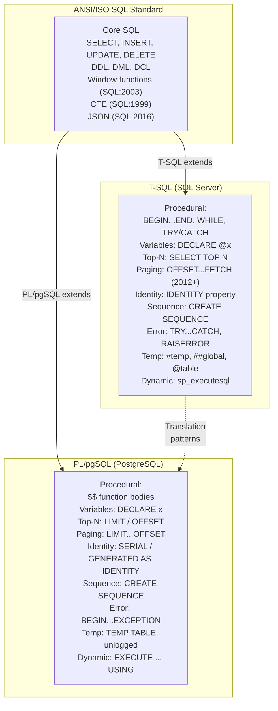

## Navigation

**Domain:** [[8 — Databases]] > **Group:** Relational Fundamentals
**Previous:** [[8.017 — OLTP vs OLAP — Different Optimization Targets]] | **Next:** [[8.019 — Table Heap vs Clustered Table]]

### Prerequisites
- [[8.016 — Relational Algebra — Select, Project, Join]] — all SQL dialects are syntactic wrappers over the same relational algebra; understanding the algebra means you can translate most constructs between dialects
- [[8.010 — Schema Design — Tables, Columns, Constraints]] — DDL syntax for constraints, defaults, and identity columns differs between T-SQL and PL/pgSQL; porting a schema requires knowing the ANSI baseline

### Where This Fits

SQL is standardized (ANSI/ISO SQL:2023), but every database vendor extends it with proprietary syntax, functions, and procedural languages. A .NET backend engineer who writes SQL for both SQL Server (T-SQL) and PostgreSQL (PL/pgSQL) must know which constructs are portable and which lock the application to one platform. This matters when: (a) the company migrates from SQL Server to PostgreSQL, (b) a microservice team chooses a different database, or (c) an ORM like EF Core abstracts the dialect but leaks platform-specific SQL in edge cases. In interviews, the question "What SQL differences have you encountered between SQL Server and PostgreSQL?" separates engineers who write SQL in one dialect from those who understand SQL as a language with dialects.

## Core Mental Model

ANSI/ISO SQL defines a **baseline standard** that all major databases implement to varying degrees. T-SQL (SQL Server) and PL/pgSQL (PostgreSQL) are **supersets** — they add procedural constructs, extra functions, and alternative syntax for the same operations.



### Classification

**Category:** Language fundamentals — this is not a query construct or engine feature. It is the **mapping layer** between the SQL standard and vendor-specific implementations. Knowing the differences determines whether a given SQL block is portable, requires conditional code, or must be replaced entirely when switching databases.

|Property|ANSI SQL|T-SQL|PL/pgSQL|
|---|---|---|---|
|Standard compliance level|Baseline (SQL:2023)|~80% (SQL:2016 core)|~90% (SQL:2016 core)|
|Procedural language|None (SQL is declarative)|Full procedural (IF/WHILE/CURSOR)|Full procedural (PL/pgSQL blocks)|
|Function return|Table functions (standard)|TVF, multi-statement TVF|RETURNS TABLE, RETURNS SETOF|
|Error handling|Not specified|TRY...CATCH|BEGIN...EXCEPTION...END|
|Temporary objects|Not specified|#temp, ##global, @table variables|TEMP TABLE, TEMP VIEW, unlogged|

### Key Properties

|Area|ANSI SQL|T-SQL (SQL Server)|PL/pgSQL (PostgreSQL)|
|---|---|---|---|
|String concatenation|`||`|`+` (requires SET CONCAT_NULL_YIELDS_NULL)|`||`|
|String quoting|Single quotes (`'text'`)|Single quotes; double quotes for identifiers|Single quotes; `$$` for function bodies|
|Identifier quoting|Double quotes (`"table"`)|Square brackets (`[table]`) or double quotes|Double quotes only|
|Top-N rows|`FETCH FIRST N ROWS ONLY` (SQL:2008)|`SELECT TOP N` or `OFFSET...FETCH`|`LIMIT N` or `OFFSET...FETCH` (SQL:2008)|
|Auto-increment|`GENERATED AS IDENTITY` (SQL:2003)|`IDENTITY(1,1)` or `SEQUENCE`|`SERIAL` / `BIGSERIAL` or `GENERATED AS IDENTITY`|
|NULL ordering|`NULLS FIRST` / `NULLS LAST` (SQL:2003)|NULLs are lower by default; no NULLS FIRST/LAST until 2022|NULLS LAST by default; `NULLS FIRST/LAST` supported|
|Merge/UPSERT|`MERGE` (SQL:2003)|`MERGE` (2008+)|`INSERT...ON CONFLICT DO UPDATE`|
|Paging|`OFFSET m ROWS FETCH NEXT n ROWS ONLY`|Same (2012+)|`LIMIT n OFFSET m`|
|Boolean type|`BOOLEAN` (SQL:1999)|`BIT` (0/1, not true Boolean)|`BOOLEAN` (TRUE/FALSE/NULL)|
|Array type|`ARRAY` (SQL:2003)|No native array|`INT[]`, `TEXT[]`, etc. with array functions|

## Deep Mechanics

### How the Dialects Differ at the Engine Level

**Parsing differences:** T-SQL and PL/pgSQL parsers handle the same ANSI SQL tokens differently. For example, `SELECT 1 + NULL;` returns `NULL` in both, but `SELECT 'A' + 'B';` concatenates in T-SQL and raises an error in PL/pgSQL (use `||` instead). The T-SQL parser is generally more lenient about implicit conversions; the PL/pgSQL parser is stricter about type coercion.

**Procedural execution model:** T-SQL procedures and functions are compiled into an execution plan once (first execution), then cached and reused. PL/pgSQL functions are also cached after first execution, but each call validates the function body and can re-plan if referenced schema objects change. PL/pgSQL's `LANGUAGE plpgsql` blocks execute as an interpreted procedural language wrapped around SQL statements — each SQL statement within a PL/pgSQL block is planned and executed individually.

**Error handling flow:**

```sql
-- T-SQL: TRY...CATCH
BEGIN TRY
    INSERT INTO Orders VALUES (1, GETDATE());
END TRY
BEGIN CATCH
    SELECT ERROR_MESSAGE(), ERROR_NUMBER(), ERROR_LINE();
    IF @@TRANCOUNT > 0 ROLLBACK;
END CATCH;

-- PL/pgSQL: BEGIN...EXCEPTION...END
-- (inside a function or DO block)
$$
BEGIN
    INSERT INTO Orders VALUES (1, NOW());
EXCEPTION
    WHEN unique_violation THEN
        RAISE NOTICE 'Duplicate order: %', SQLERRM;
        ROLLBACK;
END;
$$;
```

**The key difference:** T-SQL's TRY...CATCH catches all errors in a block; PL/pgSQL's EXCEPTION catches specific conditions by name. PL/pgSQL's EXCEPTION rolls back any changes made in the block (including sub-statements), while T-SQL's TRY...CATCH does not automatically roll back — you must check `@@TRANCOUNT` and roll back explicitly.

### SQL Visibility

```sql
-- =============================================
-- ANSI SQL-compatible (portable)
-- =============================================
SELECT OrderId, OrderDate, Total
FROM Orders
WHERE CustomerId = @CustomerId
ORDER BY OrderDate DESC
OFFSET 0 ROWS FETCH NEXT 20 ROWS ONLY;

-- =============================================
-- T-SQL specific
-- =============================================
-- Top-N with ties
SELECT TOP 10 WITH TIES
    ProductId, ProductName, UnitPrice
FROM Products
ORDER BY UnitPrice DESC;

-- OUTPUT clause (return inserted/deleted rows)
DELETE FROM Orders
OUTPUT deleted.OrderId, deleted.OrderDate, deleted.Total
WHERE OrderDate < '2024-01-01';

-- TRY_CAST (safe conversion, returns NULL on failure)
SELECT TRY_CAST('abc' AS INT); -- NULL, not error

-- FORMAT (CLR-based, slow for high-volume)
SELECT FORMAT(OrderDate, 'yyyy-MM-dd') FROM Orders;

-- PIVOT / UNPIVOT
SELECT * FROM (
    SELECT YEAR(OrderDate) AS Year, CategoryName, Total
    FROM Orders o
    JOIN OrderItems oi ON o.OrderId = oi.OrderId
    JOIN Products p ON oi.ProductId = p.ProductId
    JOIN Categories c ON p.CategoryId = c.CategoryId
) src
PIVOT (SUM(Total) FOR CategoryName IN ([Electronics], [Clothing], [Books])) pvt;

-- =============================================
-- PL/pgSQL specific
-- =============================================
-- LIMIT / OFFSET
SELECT ProductId, ProductName, UnitPrice
FROM Products
ORDER BY UnitPrice DESC
LIMIT 10 OFFSET 0;

-- RETURNING clause (like T-SQL OUTPUT)
DELETE FROM Orders
WHERE OrderDate < '2024-01-01'
RETURNING OrderId, OrderDate, Total;

-- Safe cast
SELECT CAST('abc' AS INTEGER); -- error
SELECT 'abc'::INTEGER;         -- error (same)
SELECT NULLIF('abc', 'abc')::INTEGER; -- NULL

-- TO_CHAR for formatting
SELECT TO_CHAR(OrderDate, 'YYYY-MM-DD') FROM Orders;

-- crosstab (tablefunc extension, equivalent to PIVOT)
SELECT * FROM crosstab(
    'SELECT Year, CategoryName, SUM(Total)::NUMERIC
     FROM ... GROUP BY Year, CategoryName ORDER BY 1, 2',
    'SELECT DISTINCT CategoryName FROM Categories ORDER BY 1'
) AS ct(Year INT, Electronics NUMERIC, Clothing NUMERIC, Books NUMERIC);

-- =============================================
-- Translation patterns (T-SQL → PL/pgSQL)
-- =============================================
-- TOP n → LIMIT n
-- T-SQL: SELECT TOP 10 * FROM Orders;
-- PL/pgSQL: SELECT * FROM Orders LIMIT 10;

-- OUTPUT → RETURNING
-- T-SQL: DELETE FROM Orders OUTPUT deleted.*;
-- PL/pgSQL: DELETE FROM Orders RETURNING *;

-- PIVOT → crosstab() OR conditional aggregation
-- (conditional aggregation works in both)
SELECT Year,
       SUM(CASE WHEN CategoryName = 'Electronics' THEN Total ELSE 0 END) AS Electronics,
       SUM(CASE WHEN CategoryName = 'Clothing' THEN Total ELSE 0 END) AS Clothing
FROM ... GROUP BY Year;

-- IDENTITY → GENERATED AS IDENTITY
-- T-SQL: OrderId INT IDENTITY(1,1) PRIMARY KEY
-- PL/pgSQL: OrderId INT GENERATED ALWAYS AS IDENTITY PRIMARY KEY

-- @@IDENTITY / SCOPE_IDENTITY() → RETURNING or lastval()
-- T-SQL: SELECT SCOPE_IDENTITY();
-- PL/pgSQL: INSERT INTO Orders (...) VALUES (...) RETURNING OrderId;

-- TRY...CATCH → BEGIN...EXCEPTION...END
-- T-SQL handles error globally; PL/pgSQL catches specific conditions
```

```csharp
// EF Core abstracts most dialect differences
// But some constructs leak through:

// 1. TOP/LIMIT — EF Core generates dialect-appropriate SQL
// SQL Server: SELECT TOP(10) ...
// PostgreSQL: SELECT ... LIMIT 10
var top10 = await dbContext.Orders
    .OrderByDescending(o => o.OrderDate)
    .Take(10)
    .ToListAsync(ct);

// 2. RETURNING/OUTPUT — EF Core uses them internally for SaveChanges
// to retrieve generated keys, but you cannot access OUTPUT directly
// in LINQ. Use raw SQL for OUTPUT/RETURNING.

// 3. Date/time functions differ
// T-SQL: DATEPART(YEAR, OrderDate), DATEADD(DAY, 7, OrderDate)
// PL/pgSQL: EXTRACT(YEAR FROM OrderDate), OrderDate + INTERVAL '7 days'
var year = await dbContext.Orders
    .Select(o => o.OrderDate.Year)  // EF Core translates to DATEPART or EXTRACT
    .FirstOrDefaultAsync(ct);

// 4. String concatenation
// T-SQL: FirstName + ' ' + LastName
// PL/pgSQL: FirstName || ' ' || LastName
// EF Core string concat generates dialect-appropriate SQL
var fullName = await dbContext.Customers
    .Select(c => c.FirstName + " " + c.LastName)
    .FirstOrDefaultAsync(ct);

// 5. Table-valued parameters (T-SQL only — no PL/pgSQL equivalent)
// Use DataTable + SqlDbType.Structured in T-SQL
// In PostgreSQL, use array parameters: ARRAY[...] or UNNEST()
```

```csharp
// Dapper — dialect differences in parameter handling

// T-SQL: named parameters with @ prefix
connection.Query<Order>("SELECT * FROM Orders WHERE CustomerId = @CustomerId",
    new { CustomerId = 42 });

// PL/pgSQL: named parameters with @ prefix (Npgsql driver normalizes)
// or positional parameters with $1, $2 (native)
connection.Query<Order>("SELECT * FROM Orders WHERE CustomerId = @CustomerId",
    new { CustomerId = 42 });
// Same code — the ADO.NET provider handles the translation.
// Npgsql converts @CustomerId to $1 internally.

// Bulk insert differences:
// T-SQL: SqlBulkCopy
using var bulk = new SqlBulkCopy(connection);
bulk.DestinationTableName = "Orders";
await bulk.WriteToServerAsync(dataTable);

// PL/pgSQL: NpgsqlBinaryImporter (or COPY)
using var importer = connection.BeginBinaryImport(
    "COPY Orders (CustomerId, OrderDate, Total) FROM STDIN (FORMAT BINARY)");
importer.StartRow();
importer.Write(42, NpgsqlDbType.Integer);
importer.Write(DateTime.UtcNow, NpgsqlDbType.TimestampTz);
importer.Write(250.00m, NpgsqlDbType.Numeric);
await importer.CompleteAsync();
```

### Execution Plan Analysis

Dialect differences do not change execution plan structure for equivalent queries — both SQL Server and PostgreSQL generate plans with the same physical operators (Seq Scan/Index Scan, Hash Join/Nested Loop, Aggregate). However, plan visibility tools differ:

```sql
-- T-SQL: Show actual execution plan
SET STATISTICS XML ON;
SELECT * FROM Orders WHERE CustomerId = 42;
-- Returns XML plan with per-operator costs, estimated vs actual rows

-- T-SQL: Text plan
SET SHOWPLAN_TEXT ON;
SELECT * FROM Orders WHERE CustomerId = 42;

-- T-SQL: Live Query Statistics (2016+)
SELECT * FROM sys.dm_exec_query_stats WHERE query_hash = 0x...;

-- PL/pgSQL: EXPLAIN (with options)
EXPLAIN (ANALYZE, BUFFERS, TIMING, COSTS) 
SELECT * FROM Orders WHERE CustomerId = 42;
-- Actual timing, buffer reads, row estimates, execution count

-- PL/pgSQL: EXPLAIN with JSON format
EXPLAIN (ANALYZE, FORMAT JSON)
SELECT * FROM Orders WHERE CustomerId = 42;
```

### Failure Modes

|Failure|T-SQL|PL/pgSQL|Portable Fix|
|---|---|---|---|
|**String concatenation**|`'A' + 'B'` works; `'A' + NULL` = `'A'` (depends on SET CONCAT_NULL_YIELDS_NULL)|`'A' + NULL` = error (type mismatch)|`CONCAT('A', 'B')` (ANSI SQL)|
|**Boolean handling**|`BIT` column: `WHERE IsActive = 1`|`BOOLEAN` column: `WHERE IsActive = TRUE`|Use `WHERE IsActive = 1` (INT) or abstract via ORM|
|**Date arithmetic**|`DATEADD(DAY, 7, OrderDate)`|`OrderDate + INTERVAL '7 days'`|`OrderDate + INTERVAL '7 days'` (standard in newer T-SQL via `DATETIME` + number, but differs for months)|
|**NULL sorting**|NULLs are lowest by default|NULLs are highest by default|Add `ORDER BY Col ASC NULLS LAST` (SQL:2003)|
|**Paging**|`OFFSET 10 FETCH NEXT 10 ROWS ONLY`|`LIMIT 10 OFFSET 10`|`OFFSET...FETCH` (SQL:2008, supported in both)|
|**MERGE concurrency**|High deadlock risk under load|More robust (INSERT...ON CONFLICT)|Prefer `INSERT...ON CONFLICT` where supported|
|**Temp table scope**|`#temp` visible in nested calls, `@table` limited to batch|`TEMP TABLE` visible in session; `UNLOGGED` for unlogged|Wrapper or named temp tables with cleanup|

## Production Patterns and Implementation

### Primary SQL Implementation — Same Operation in Both Dialects

```sql
-- =============================================
-- Operation: Insert order with items (transactional)
-- =============================================

-- T-SQL
BEGIN TRANSACTION;
BEGIN TRY
    INSERT INTO Orders (CustomerId, OrderDate, Total, Status)
    OUTPUT inserted.OrderId
    VALUES (@CustomerId, SYSUTCDATETIME(), @Total, 'Pending');

    -- SCOPE_IDENTITY() returns the last identity value
    DECLARE @OrderId INT = SCOPE_IDENTITY();

    INSERT INTO OrderItems (OrderId, ItemNum, ProductId, Quantity, UnitPrice)
    SELECT @OrderId, ROW_NUMBER() OVER (ORDER BY (SELECT NULL)),
           ProductId, Quantity, UnitPrice
    FROM @OrderItems;

    COMMIT;
END TRY
BEGIN CATCH
    IF @@TRANCOUNT > 0 ROLLBACK;
    THROW; -- re-throw the original error
END CATCH;

-- PL/pgSQL (inside a function or DO block)
$$
DECLARE
    v_order_id INT;
BEGIN
    INSERT INTO Orders (CustomerId, OrderDate, Total, Status)
    VALUES (v_customer_id, NOW(), v_total, 'Pending')
    RETURNING OrderId INTO v_order_id;

    INSERT INTO OrderItems (OrderId, ItemNum, ProductId, Quantity, UnitPrice)
    SELECT v_order_id, ROW_NUMBER() OVER (ORDER BY (SELECT NULL)),
           ProductId, Quantity, UnitPrice
    FROM UNNEST(v_items) AS item;

    -- No explicit COMMIT — the function call is atomic
EXCEPTION
    WHEN OTHERS THEN
        RAISE;
END;
$$;

-- =============================================
-- Operation: Upsert (MERGE vs INSERT...ON CONFLICT)
-- =============================================

-- T-SQL (MERGE — prone to deadlocks)
MERGE INTO Inventory AS target
USING (SELECT @ProductId AS ProductId, @Quantity AS Quantity) AS source
ON target.ProductId = source.ProductId
WHEN MATCHED THEN
    UPDATE SET Stock = Stock + source.Quantity
WHEN NOT MATCHED THEN
    INSERT (ProductId, Stock) VALUES (source.ProductId, source.Quantity)
OUTPUT inserted.ProductId, inserted.Stock;

-- PL/pgSQL (INSERT...ON CONFLICT — simpler, fewer deadlocks)
INSERT INTO Inventory (ProductId, Stock)
VALUES (v_product_id, v_quantity)
ON CONFLICT (ProductId) DO UPDATE
    SET Stock = Inventory.Stock + EXCLUDED.Stock
RETURNING ProductId, Stock;

-- ANSI portable conditional update:
IF EXISTS (SELECT 1 FROM Inventory WHERE ProductId = @ProductId)
    UPDATE Inventory SET Stock = Stock + @Quantity WHERE ProductId = @ProductId;
ELSE
    INSERT INTO Inventory (ProductId, Stock) VALUES (@ProductId, @Quantity);

-- =============================================
-- Operation: Paging with total count
-- =============================================

-- T-SQL (two queries — count + data)
SELECT COUNT_BIG(*) AS TotalCount FROM Orders WHERE CustomerId = @CustomerId;

SELECT OrderId, OrderDate, Total
FROM Orders
WHERE CustomerId = @CustomerId
ORDER BY OrderDate DESC
OFFSET @Offset ROWS FETCH NEXT @PageSize ROWS ONLY;

-- PL/pgSQL (same, with slightly different syntax)
SELECT COUNT(*) AS TotalCount FROM Orders WHERE CustomerId = v_customer_id;

SELECT OrderId, OrderDate, Total
FROM Orders
WHERE CustomerId = v_customer_id
ORDER BY OrderDate DESC
OFFSET v_offset LIMIT v_page_size;
-- OFFSET...LIMIT vs OFFSET...FETCH — functionally equivalent

-- =============================================
-- Operation: Recursive CTE (ANSI standard, both support)
-- =============================================
WITH OrgChart AS (
    SELECT EmployeeId, ManagerId, FullName, 0 AS Level
    FROM Employees
    WHERE ManagerId IS NULL

    UNION ALL

    SELECT e.EmployeeId, e.ManagerId, e.FullName, oc.Level + 1
    FROM Employees e
    INNER JOIN OrgChart oc ON e.ManagerId = oc.EmployeeId
)
SELECT * FROM OrgChart ORDER BY Level, FullName;
-- Identical in T-SQL and PL/pgSQL — this is ANSI SQL:1999
```

### EF Core Implementation

```csharp
// EF Core abstracts most dialect differences. The provider
// (Microsoft.EntityFrameworkCore.SqlServer vs Npgsql)
// translates LINQ to the appropriate dialect.

// Same LINQ — different generated SQL
var result = await dbContext.Orders
    .Where(o => o.CustomerId == customerId)
    .OrderByDescending(o => o.OrderDate)
    .Select(o => new { o.OrderId, o.OrderDate, o.Total })
    .Skip(0)
    .Take(20)
    .ToListAsync(ct);

// SQL Server generated:
// SELECT TOP(20) o.OrderId, o.OrderDate, o.Total
// FROM Orders o
// WHERE o.CustomerId = @__customerId_0
// ORDER BY o.OrderDate DESC

// PostgreSQL generated:
// SELECT o.OrderId, o.OrderDate, o.Total
// FROM Orders o
// WHERE o.CustomerId = @__customerId_0
// ORDER BY o.OrderDate DESC
// LIMIT @__p_1

// Provider-switching considerations:
// 1. Date functions: EF.Functions.DateDiffDay works only in SQL Server
// 2. Full-text search: EF.Functions.Contains (SQL Server) vs Npgsql EF.Functions.ToTsQuery
// 3. JSON: SqlServer.JsonEach (SQL Server 2016+) vs Npgsql.JsonEach
// 4. Raw SQL: provider-specific SQL must be identified and conditionalized

// Use conditional raw SQL or switch expressions:
if (databaseProvider == "SqlServer")
{
    orders = await dbContext.Orders
        .FromSqlRaw(@"
            SELECT * FROM Orders
            WHERE CustomerId = {0}
            ORDER BY OrderDate DESC
            OFFSET {1} ROWS FETCH NEXT {2} ROWS ONLY",
            customerId, offset, pageSize)
        .ToListAsync(ct);
}
else
{
    orders = await dbContext.Orders
        .FromSqlRaw(@"
            SELECT * FROM Orders
            WHERE CustomerId = @p0
            ORDER BY OrderDate DESC
            LIMIT @p2 OFFSET @p1",
            customerId, offset, pageSize)
        .ToListAsync(ct);
}
```

### Dapper Implementation

```csharp
// Dapper is database-agnostic — the SQL is hand-written.
// Provider handles parameter translation (Npgsql converts @p0 to $1).

// Same C# code — different SQL strings
public async Task<IReadOnlyList<Order>> GetOrdersPagedAsync(
    int customerId, int offset, int pageSize,
    IDbConnection connection, string dialect)
{
    string sql = dialect switch
    {
        "SqlServer" => @"
            SELECT OrderId, OrderDate, Total
            FROM Orders
            WHERE CustomerId = @CustomerId
            ORDER BY OrderDate DESC
            OFFSET @Offset ROWS FETCH NEXT @PageSize ROWS ONLY",

        "PostgreSql" => @"
            SELECT OrderId, OrderDate, Total
            FROM Orders
            WHERE CustomerId = @CustomerId
            ORDER BY OrderDate DESC
            LIMIT @PageSize OFFSET @Offset",

        _ => throw new NotSupportedException($"Dialect {dialect} not supported")
    };

    return (await connection.QueryAsync<Order>(sql,
        new { CustomerId = customerId, Offset = offset, PageSize = pageSize }))
        .AsList();
}

// Bulk insert abstraction
public async Task BulkInsertOrdersAsync(
    IReadOnlyList<Order> orders, IDbConnection connection, string dialect)
{
    if (connection is SqlConnection sqlConn)
    {
        using var bulk = new SqlBulkCopy(sqlConn);
        bulk.DestinationTableName = "Orders";
        var table = new DataTable();
        // ... populate DataTable
        await bulk.WriteToServerAsync(table);
    }
    else if (connection is NpgsqlConnection npgsqlConn)
    {
        using var importer = npgsqlConn.BeginBinaryImport(
            "COPY Orders (CustomerId, OrderDate, Total) FROM STDIN (FORMAT BINARY)");
        foreach (var order in orders)
        {
            importer.StartRow();
            importer.Write(order.CustomerId, NpgsqlTypes.NpgsqlDbType.Integer);
            importer.Write(order.OrderDate, NpgsqlTypes.NpgsqlDbType.TimestampTz);
            importer.Write(order.Total, NpgsqlTypes.NpgsqlDbType.Numeric);
        }
        await importer.CompleteAsync();
    }
}
```

### Configuration and Wiring

```csharp
// Program.cs — conditional provider registration based on config
var dbProvider = builder.Configuration.GetValue<string>("DatabaseProvider");

if (dbProvider == "SqlServer")
{
    builder.Services.AddDbContext<AppDbContext>(options =>
        options.UseSqlServer(
            builder.Configuration.GetConnectionString("SqlServer"),
            sqlOptions => sqlOptions.EnableRetryOnFailure(3)));
}
else if (dbProvider == "PostgreSql")
{
    builder.Services.AddDbContext<AppDbContext>(options =>
        options.UseNpgsql(
            builder.Configuration.GetConnectionString("PostgreSql"),
            npgsqlOptions => npgsqlOptions.EnableRetryOnFailure(3)));
}

// AppDbContext — provider-agnostic model configuration
public class AppDbContext : DbContext
{
    protected override void OnModelCreating(ModelBuilder modelBuilder)
    {
        modelBuilder.Entity<Order>(entity =>
        {
            entity.ToTable("Orders");
            entity.HasKey(e => e.OrderId);

            // Provider-agnostic — EF Core translates appropriately
            entity.Property(e => e.OrderId)
                  .ValueGeneratedOnAdd();

            entity.Property(e => e.OrderDate)
                  .HasDefaultValueSql("SYSUTCDATETIME()"); // T-SQL specific
            // For PostgreSQL: hasDefaultValueSql("NOW()")
            // Conditionally set in a provider-aware configuration
        });
    }
}
```

### SQL Server vs PostgreSQL Differences — Complete Cheat Sheet

```sql
-- =============================================
-- DDL Differences
-- =============================================

-- Identity / Auto-increment
-- T-SQL:
CREATE TABLE Orders (
    OrderId INT IDENTITY(1,1) PRIMARY KEY
);
-- PL/pgSQL (preferred, SQL:2003):
CREATE TABLE Orders (
    OrderId INT GENERATED ALWAYS AS IDENTITY PRIMARY KEY
);
-- PL/pgSQL (legacy):
CREATE TABLE Orders (
    OrderId SERIAL PRIMARY KEY
);

-- Sequences
-- T-SQL:
CREATE SEQUENCE seq_OrderNumber START WITH 1000 INCREMENT BY 1;
SELECT NEXT VALUE FOR seq_OrderNumber;
-- PL/pgSQL:
CREATE SEQUENCE seq_OrderNumber START 1000 INCREMENT 1;
SELECT NEXTVAL('seq_OrderNumber');

-- Computed / Generated columns
-- T-SQL:
CREATE TABLE Orders (
    Total DECIMAL(10,2),
    Tax AS Total * 0.08 PERSISTED
);
-- PL/pgSQL:
CREATE TABLE Orders (
    Total DECIMAL(10,2),
    Tax DECIMAL(10,2) GENERATED ALWAYS AS (Total * 0.08) STORED
);

-- =============================================
-- DML Differences
-- =============================================

-- UPDATE with JOIN
-- T-SQL:
UPDATE o SET o.Status = 'Shipped'
FROM Orders o
INNER JOIN Payments p ON o.OrderId = p.OrderId
WHERE p.PaidDate IS NOT NULL;
-- PL/pgSQL:
UPDATE Orders
SET Status = 'Shipped'
FROM Payments
WHERE Orders.OrderId = Payments.OrderId
  AND Payments.PaidDate IS NOT NULL;

-- DELETE with JOIN
-- T-SQL:
DELETE o
FROM Orders o
LEFT JOIN Payments p ON o.OrderId = p.OrderId
WHERE p.PaymentId IS NULL;
-- PL/pgSQL:
DELETE FROM Orders
USING Payments
WHERE Orders.OrderId = Payments.OrderId
  AND Payments.PaymentId IS NULL;
-- Or:
DELETE FROM Orders
WHERE OrderId NOT IN (SELECT OrderId FROM Payments);

-- =============================================
-- Functions and Operators
-- =============================================

-- String concatenation (use CONCAT for portability)
SELECT CONCAT(FirstName, ' ', LastName) AS FullName FROM Customers;
-- Works in both T-SQL (2012+) and PL/pgSQL

-- Date arithmetic (use INTERVAL for portability in PL/pgSQL)
-- T-SQL: DATEADD(DAY, 7, OrderDate)
-- PL/pgSQL: OrderDate + INTERVAL '7 days'
-- Portable approach: pass computed dates from application layer

-- TOP n with ties (T-SQL only)
SELECT TOP 3 WITH TIES * FROM Products ORDER BY UnitPrice DESC;
-- PL/pgSQL equivalent:
SELECT * FROM (
    SELECT *, DENSE_RANK() OVER (ORDER BY UnitPrice DESC) AS rnk
    FROM Products
) sub WHERE rnk <= 3;

-- String / JSON functions
-- T-SQL: STRING_AGG (2017+)
SELECT STRING_AGG(ProductName, ', ') WITHIN GROUP (ORDER BY ProductName)
FROM Products;
-- PL/pgSQL: STRING_AGG (9.0+)
SELECT STRING_AGG(ProductName, ', ' ORDER BY ProductName)
FROM Products;

-- JSON support
-- T-SQL (2016+): JSON_VALUE, JSON_QUERY, OPENJSON
SELECT JSON_VALUE(Attributes, '$.Color') FROM Products;
-- PL/pgSQL: ->, ->>, #>, #>>
SELECT Attributes->>'Color' FROM Products;
```

## Gotchas and Production Pitfalls

### 1. Implicit String Concatenation Differences

**Pitfall:** Using `+` for string concatenation in cross-database code — it works in T-SQL but raises an error in PL/pgSQL when concatenating strings with non-strings.

```sql
-- ❌ T-SQL: 'Order #' + OrderId works (implicit int→string conversion)
-- PL/pgSQL: raises error — cannot concatenate text and integer
SELECT 'Order #' + OrderId FROM Orders;
```

**Symptom:** Code that works in development (SQL Server) fails in production (PostgreSQL) with type mismatch errors.

**Fix:**
```sql
-- ✅ Portable: use CONCAT (ANSI SQL:2003) or explicit CAST
SELECT CONCAT('Order #', OrderId) FROM Orders;
SELECT 'Order #' || CAST(OrderId AS TEXT) FROM Orders;
```

**Cost of not fixing:** Runtime errors in production after database migration. Every SQL statement with `+` concatenation must be reviewed and replaced — potentially hundreds of queries in a large codebase.

### 2. NULL Ordering Differences

**Pitfall:** Relying on default NULL sorting behavior — T-SQL sorts NULLs lowest, PL/pgSQL sorts NULLs highest.

```sql
-- ❌ T-SQL: NULLs first; PL/pgSQL: NULLs last
SELECT ProductName, Discount FROM Products ORDER BY Discount;
-- T-SQL: ... NULL, NULL, 0.05, 0.10, ...
-- PL/pgSQL: ... 0.05, 0.10, NULL, NULL
```

**Symptom:** Paged results shift between databases. A "lowest discounts first" report shows NULL rows at inconsistent positions.

**Fix:**
```sql
-- ✅ Explicit NULLS FIRST / NULLS LAST (SQL:2003, both support)
SELECT ProductName, Discount FROM Products ORDER BY Discount ASC NULLS LAST;
```

**Cost of not fixing:** Inconsistent pagination or reporting output when switching databases. Users see different data on the same query between environments that use different databases.

### 3. MERGE Deadlock in T-SQL vs INSERT...ON CONFLICT

**Pitfall:** Using T-SQL MERGE under concurrent load — it is known for deadlocks due to its locking behavior. The equivalent in PL/pgSQL (`INSERT...ON CONFLICT`) has different locking characteristics.

```sql
-- ❌ T-SQL MERGE — deadlock-prone under concurrency
MERGE INTO Inventory AS target
USING (VALUES (@ProductId, @Quantity)) AS source(ProductId, Quantity)
ON target.ProductId = source.ProductId
WHEN MATCHED THEN UPDATE SET Stock = Stock + source.Quantity
WHEN NOT MATCHED THEN INSERT (ProductId, Stock) VALUES (source.ProductId, source.Quantity);
```

**Symptom:** Deadlock graphs show MERGE operations competing for the same key range. Deadlock victim retries cause transaction failures.

**Fix:**
```sql
-- ✅ Use separate UPDATE/INSERT with retry logic
BEGIN TRY
    UPDATE Inventory SET Stock = Stock + @Quantity WHERE ProductId = @ProductId;
    IF @@ROWCOUNT = 0
        INSERT INTO Inventory (ProductId, Stock) VALUES (@ProductId, @Quantity);
END TRY
BEGIN CATCH
    IF ERROR_NUMBER() = 2627 -- unique violation
        UPDATE Inventory SET Stock = Stock + @Quantity WHERE ProductId = @ProductId;
END CATCH;
```

**Cost of not fixing:** Unexplained deadlocks in high-concurrency UPSERT scenarios. Application retry logic masks the symptoms but increases latency. Production incidents at peak traffic times.

### 4. Boolean Column Differences

**Pitfall:** Using `BIT` (T-SQL) and `BOOLEAN` (PL/pgSQL) interchangeably without adjusting query syntax.

```sql
-- T-SQL: BIT column, comparison must be with 0/1
SELECT * FROM Customers WHERE IsActive = 1;

-- PL/pgSQL: BOOLEAN column, comparison is with TRUE/FALSE
SELECT * FROM Customers WHERE IsActive = TRUE;
-- Also valid: WHERE IsActive (without comparison)

-- Cross-database problem:
-- T-SQL: WHERE IsActive — invalid (BIT is not a boolean in WHERE)
-- PL/pgSQL: WHERE IsActive = 1 — works but odd
```

**Symptom:** Queries that work on one database fail on the other with type comparison errors.

**Fix:** Abstract boolean handling through the application layer or use `CHECK` constraints with same semantics. In EF Core, the provider handles this translation automatically. In raw SQL, prefer `WHERE IsActive = 1` for T-SQL and `WHERE IsActive IS TRUE` for PL/pgSQL — or use a provider abstraction.

**Cost of not fixing:** Every raw SQL query with boolean logic must be reviewed when switching databases. EF Core abstracts this, but Dapper and raw SQL do not.

### 5. Table-Valued Parameters vs Array Parameters

**Pitfall:** Using T-SQL table-valued parameters (TVP) for passing lists, which have no direct PL/pgSQL equivalent.

```sql
-- T-SQL: TVP (SQL Server only)
CREATE TYPE dbo.OrderItemList AS TABLE (
    ProductId INT, Quantity INT, UnitPrice DECIMAL(10,2)
);
CREATE PROCEDURE dbo.InsertOrderItems
    @OrderId INT, @Items dbo.OrderItemList READONLY
AS
    INSERT INTO OrderItems (OrderId, ItemNum, ProductId, Quantity, UnitPrice)
    SELECT @OrderId, ROW_NUMBER() OVER (ORDER BY (SELECT NULL)),
           ProductId, Quantity, UnitPrice
    FROM @Items;
```

**Symptom:** When migrating to PostgreSQL, the TVP approach has no direct equivalent. PostgreSQL uses array parameters or JSON arrays.

**Fix (PL/pgSQL):**

```sql
-- PL/pgSQL: array of composite type or JSON
CREATE TYPE order_item AS (
    product_id INT, quantity INT, unit_price DECIMAL(10,2)
);

CREATE FUNCTION insert_order_items(
    p_order_id INT, p_items order_item[]
) RETURNS VOID AS $$
BEGIN
    INSERT INTO OrderItems (OrderId, ItemNum, ProductId, Quantity, UnitPrice)
    SELECT p_order_id, ROW_NUMBER() OVER (ORDER BY (SELECT NULL)),
           item.product_id, item.quantity, item.unit_price
    FROM UNNEST(p_items) AS item;
END;
$$ LANGUAGE plpgsql;
```

**Cost of not fixing:** Migrating stored procedures from SQL Server to PostgreSQL requires rewriting every TVP-based procedure to use arrays or JSON. This is a significant migration effort for systems that rely heavily on TVPs for bulk operations.

### 6. Cursor Semantics and Performance

**Pitfall:** Using T-SQL cursors (which have `LOCAL STATIC READ_ONLY FORWARD_ONLY` as a common performant pattern) and porting them directly to PL/pgSQL cursors without understanding the performance difference.

```sql
-- T-SQL: Fast-forward cursor (optimized for read-only forward iteration)
DECLARE cur CURSOR LOCAL FAST_FORWARD FOR
    SELECT OrderId FROM Orders WHERE Status = 'Pending';
OPEN cur;
FETCH NEXT FROM cur INTO @OrderId;
WHILE @@FETCH_STATUS = 0
BEGIN
    EXEC ProcessOrder @OrderId;
    FETCH NEXT FROM cur INTO @OrderId;
END;
CLOSE cur;
DEALLOCATE cur;

-- PL/pgSQL: Cursor iteration (syntactically different, same performance profile)
DECLARE
    cur CURSOR FOR SELECT OrderId FROM Orders WHERE Status = 'Pending';
BEGIN
    FOR rec IN cur LOOP
        PERFORM process_order(rec.OrderId);
    END LOOP;
END;
```

**Symptom:** Both dialects handle cursors similarly — the issue is that cursor-based row-by-row processing is slow in both. The difference is in the syntax of the loop, not the performance.

**Fix:** Replace cursor loops with set-based operations in both dialects. Use `UPDATE ... WHERE ...` or window functions instead of iterative processing.

**Cost of not fixing:** Row-by-row processing in either dialect performs poorly on large datasets. The cursor loop is ~100x slower than the equivalent set-based operation at 100K rows.

## Performance Implications

### Dialect-Specific Performance Considerations

|Feature|T-SQL Performance|PL/pgSQL Performance|
|---|---|---|
|Cursors|FAST_FORWARD reduced overhead|Similar performance; FOR loop over query is optimized|
|Scalar functions (UDF)|Poor — row-by-row invocation, no inlining (pre-2019)|Poor — PL/pgSQL function overhead per row; SQL-language functions can inline|
|Table-valued parameters|Optimal for passing lists — avoids string parsing|Arrays or JSON — parsing overhead, no row estimates|
|MERGE vs INSERT...ON CONFLICT|MERGE deadlock-prone; prefer separate UPDATE/INSERT|INSERT...ON CONFLICT is atomic and deadlock-free|
|OUTPUT vs RETURNING|OUTPUT returns before triggers; less flexible|RETURNING returns after triggers; supports all columns|
|TOP vs LIMIT|TOP is a plan property; can affect cardinality estimates|LIMIT is a plan node; optimizer plans for it specifically|

### Benchmark: Same Operation, Different Dialect

```sql
-- Operation: Get top 10 customers by total spend
-- SQL Server (TOP)
SELECT TOP 10 c.CustomerId, c.FullName, SUM(o.Total) AS TotalSpend
FROM Customers c
INNER JOIN Orders o ON c.CustomerId = o.CustomerId
GROUP BY c.CustomerId, c.FullName
ORDER BY TotalSpend DESC;

-- PostgreSQL (LIMIT)
SELECT c.CustomerId, c.FullName, SUM(o.Total) AS TotalSpend
FROM Customers c
INNER JOIN Orders o ON c.CustomerId = o.CustomerId
GROUP BY c.CustomerId, c.FullName
ORDER BY TotalSpend DESC
LIMIT 10;
```

Both produce equivalent execution plans: Sort (TOP/LIMIT) + Hash Match Aggregate + Index Scan/Join. The logical reads depend on indexes, not dialect. Performance difference between T-SQL and PL/pgSQL for the same query plan shape is negligible — the engine internals differ, but the cost model (I/O, CPU, memory) is the same.

### BenchmarkDotNet

```csharp
[MemoryDiagnoser]
[SimpleJob(RuntimeMoniker.Net90)]
public class DialectBenchmark
{
    private IDbConnection _sqlServerConn = default!;
    private IDbConnection _postgreSqlConn = default!;

    [Benchmark(Baseline = true)]
    public async Task<int> TSqlSpecific()
    {
        // T-SQL specific — uses TOP
        const string sql = @"
            SELECT TOP 10 OrderId, Total
            FROM Orders
            WHERE CustomerId = @Id
            ORDER BY OrderDate DESC;";
        return (await _sqlServerConn.QueryAsync<int>(
            sql, new { Id = 42 })).Count();
    }

    [Benchmark]
    public async Task<int> PlPgsqlSpecific()
    {
        // PL/pgSQL specific — uses LIMIT
        const string sql = @"
            SELECT OrderId, Total
            FROM Orders
            WHERE CustomerId = @Id
            ORDER BY OrderDate DESC
            LIMIT 10;";
        return (await _postgreSqlConn.QueryAsync<int>(
            sql, new { Id = 42 })).Count();
    }

    [Benchmark]
    public async Task<int> AnsiPortable()
    {
        // ANSI SQL — works in both
        const string sql = @"
            SELECT OrderId, Total
            FROM Orders
            WHERE CustomerId = @Id
            ORDER BY OrderDate DESC
            OFFSET 0 ROWS FETCH NEXT 10 ROWS ONLY;";
        return (await _sqlServerConn.QueryAsync<int>(
            sql, new { Id = 42 })).Count();
    }
}
```

### Write Amplification

Dialect differences do not directly affect write amplification. Write amplification is a function of index structure (B-tree depth, NC index count) and storage engine (rowstore vs columnstore), not SQL dialect. However, procedural constructs (cursors, loops) that perform row-by-row writes cause exponentially more write operations than set-based alternatives — this applies equally to both T-SQL and PL/pgSQL.

## Interview Arsenal

### Question Bank

1. **What is the relationship between ANSI SQL, T-SQL, and PL/pgSQL? Which one is a superset of the others?**
2. **How do T-SQL and PL/pgSQL differ in their approach to error handling? Show both syntaxes.**
3. **What is the difference in TOP-N row retrieval between T-SQL and PL/pgSQL? How does each affect the execution plan?**
4. **When porting a stored procedure from SQL Server to PostgreSQL, what are the top 3 syntax changes you must make?**
5. **How does EF Core abstract dialect differences between SQL Server and PostgreSQL? Where does the abstraction leak?**
6. **Compare MERGE (T-SQL) and INSERT...ON CONFLICT (PL/pgSQL) for UPSERT operations. Which is safer under concurrency?**
7. **How do you handle bulk data operations in T-SQL vs PL/pgSQL? Compare SqlBulkCopy to COPY.**
8. **What ANSI SQL features does SQL Server support that PostgreSQL does not, and vice versa?**

### Spoken Answers

**Q1: ANSI SQL vs T-SQL vs PL/pgSQL.**

> **Average answer:** "ANSI SQL is the standard that both T-SQL and PL/pgSQL follow. T-SQL is Microsoft's version, PL/pgSQL is PostgreSQL's version."

> **Great answer:** "ANSI/ISO SQL is the formal standard that defines the syntax and semantics of SQL. Both T-SQL (SQL Server) and PL/pgSQL (PostgreSQL) are supersets that add procedural constructs and proprietary extensions on top of the ANSI baseline. The core query language — SELECT, INSERT, UPDATE, DELETE, JOIN, GROUP BY, window functions, CTEs — is standardized and works the same way. The differences are in the procedural layer: T-SQL uses BEGIN...END blocks with TRY...CATCH, variables with @ prefix, and SELECT TOP; PL/pgSQL uses dollar-quoted $$ function bodies, BEGIN...EXCEPTION...END for errors, variables without prefix, and LIMIT/OFFSET. EF Core hides about 90% of these differences, but the abstraction leaks at raw SQL, provider-specific functions (EF.Functions.DateDiffDay), and DDL defaults (SYSUTCDATETIME vs NOW()). When designing a multi-database application, I stick to ANSI SQL constructs — OFFSET...FETCH instead of TOP or LIMIT, CONCAT instead of +, and CASE expressions instead of PIVOT."

**Q4: Top 3 syntax changes for porting a stored procedure.**

> **Great answer:** "The top 3 changes when porting a stored procedure from T-SQL to PL/pgSQL are: (1) Variable declarations — T-SQL uses DECLARE @var INT, PL/pgSQL uses DECLARE var INT (inside a block) or $1/$2 for parameters. (2) Error handling — T-SQL wraps in TRY...CATCH with @@TRANCOUNT checks; PL/pgSQL uses BEGIN...EXCEPTION...END where the EXCEPTION block rolls back the entire block automatically. (3) RETURNING results — T-SQL stored procedures can return multiple result sets with SELECT statements; PL/pgSQL functions return a single type (TABLE, SETOF, or scalar). PL/pgSQL procedures can return multiple result sets but with different syntax. Additionally, string concatenation changes from + to || or CONCAT, and date functions change from DATEADD/DATEDIFF to INTERVAL arithmetic and EXTRACT. A practical approach is to write the core logic in ANSI SQL as much as possible, isolate procedural differences in thin wrappers, and use conditional compilation or provider selection in application code."

**Q6: MERGE vs INSERT...ON CONFLICT.**

> **Great answer:** "T-SQL MERGE is a single statement that can INSERT, UPDATE, and DELETE in one pass based on a source-target match condition. It is powerful but notoriously deadlock-prone under concurrency — the lock acquisition order is unpredictable and can escalate to key-range locks. A MERGE statement under 100+ concurrent sessions will trigger deadlocks within minutes. INSERT...ON CONFLICT (PostgreSQL) is simpler: it atomically attempts an INSERT, and if a unique constraint violation occurs, performs an UPDATE using the EXCLUDED pseudo-row. It acquires only a row-level lock on the conflicting index tuple, making it deadlock-free under normal concurrent UPSERT patterns. For T-SQL, the safe alternative to MERGE is a separate UPDATE (check @@ROWCOUNT) followed by INSERT, wrapped in a retry loop. For cross-database code, I use the separate-UPDATE-INSERT pattern because it works in both dialects with minimal syntax differences."

### Interview Trigger

The question "What SQL differences have you encountered between SQL Server and PostgreSQL?" tests practical multi-database experience. A strong answer cites specific syntax (TOP vs LIMIT, OUTPUT vs RETURNING, + vs ||) and specific performance behaviors (MERGE deadlocks, TVP vs arrays, NULL sorting). The follow-up probes deeper: "How would you design a data access layer that supports both?" — testing whether the candidate understands abstraction layers (EF Core provider pattern), raw SQL management (separate SQL files per dialect), or migration strategies (database-agnostic ANSI SQL subset).

### Comparison Table

|Feature|T-SQL (SQL Server)|PL/pgSQL (PostgreSQL)|
|---|---|---|
|Top-N rows|`SELECT TOP N`|`LIMIT N`|
|Paging|`OFFSET...FETCH` (2012+)|`OFFSET...LIMIT` or `OFFSET...FETCH`|
|Auto-increment|`IDENTITY(1,1)` / `SEQUENCE`|`SERIAL` / `GENERATED AS IDENTITY`|
|String concat|`+` or `CONCAT()`|`||` or `CONCAT()`|
|Error handling|`TRY...CATCH`|`BEGIN...EXCEPTION...END`|
|Merge/UPSERT|`MERGE` (deadlock-prone)|`INSERT...ON CONFLICT`|
|Return modified rows|`OUTPUT`|`RETURNING`|
|Boolean type|`BIT` (0/1)|`BOOLEAN` (TRUE/FALSE)|
|Array type|No native array|`INT[]`, `TEXT[]` with operators|
|Table-valued parameters|`CREATE TYPE ... AS TABLE`|Array of composite type or JSON|
|Temp tables|`#temp` (session), `##temp` (global), `@table` (batch)|`TEMP TABLE` (session)|
|Bulk insert|`SqlBulkCopy`|`COPY ... FROM STDIN`|
|Full-text search|`CONTAINS()`, `FREETEXT()`|`tsvector`/`tsquery`, `to_tsvector()`|
|JSON support|`JSON_VALUE()`, `OPENJSON` (2016+)|`->`, `->>`, `jsonb` operators|
|EXPLAIN output|`SET STATISTICS XML ON` (actual)|`EXPLAIN (ANALYZE, BUFFERS)`|
|Recursive CTE|`WITH ... UNION ALL ...`|Same (ANSI standard)|

## Decision Framework

### When to Use Which Dialect Feature

```mermaid
flowchart TD
    A[Writing SQL for<br/>a database operation] --> B{Target database<br/>known?}

    B -->|Single database| C{Is this a<br/>procedural construct?}
    B -->|Multiple databases| D[Must be portable]

    C -->|Yes, procedural| E[Use dialect-specific features:<br/>TRY...CATCH or EXCEPTION<br/>Variables: @ or DECLARE]
    C -->|No, declarative| F[Prefer ANSI SQL:<br/>OFFSET...FETCH over TOP/LIMIT<br/>CONCAT over + or ||]

    D --> G{Can use ORM?}
    G -->|Yes (EF Core)| H[Use LINQ — provider handles translation<br/>Avoid provider-specific EF.Functions]
    G -->|No (raw SQL)| I{Operation type?}

    I -->|Simple DML| J[Write ANSI SQL subset<br/>OFFSET...FETCH, CONCAT, CASE]
    I -->|Complex DML| K[Isolate dialect SQL files<br/>Conditional compilation / provider switch]
    I -->|DDL| L[Use provider-agnostic DDL in EF Core migrations<br/>Avoid IDENTITY/SERIAL — use GENERATED AS IDENTITY]
```

### Application Checklist

- [ ] ANSI SQL constructs used wherever possible (OFFSET...FETCH, CONCAT, CASE, COALESCE, NULLS FIRST/LAST)
- [ ] Dialect-specific constructs isolated in provider-specific code paths or configuration
- [ ] String concatenation uses CONCAT() or provider-appropriate operator
- [ ] Date/time operations use provider-translated EF Core LINQ or abstracted raw SQL
- [ ] Top-N queries use OFFSET...FETCH (portable) rather than TOP or LIMIT
- [ ] UPSERT operations use separate UPDATE/INSERT pattern (portable, deadlock-safe)
- [ ] NULL ordering explicitly specified with NULLS FIRST/LAST
- [ ] Boolean columns accessed through ORM abstraction where possible
- [ ] Bulk insert operations have provider-specific implementations (SqlBulkCopy vs COPY)
- [ ] EF Core: no provider-specific EF.Functions calls in shared LINQ queries
- [ ] Error handling abstracted in service layer (not relying on dialect-specific TRY...CATCH)

### Tradeoff Summary

|What You Gain|What You Pay|
|---|---|
|ANSI SQL portability across databases|Cannot use powerful dialect features (OUTPUT, PIVOT, arrays, TVPs)|
|T-SQL specific: OUTPUT clause, PIVOT, TVP|Locked to SQL Server; migration cost if switching|
|PL/pgSQL specific: RETURNING, array types, INSERT...ON CONFLICT|Locked to PostgreSQL; migration cost if switching|
|EF Core abstraction|Leaks at raw SQL, date functions, full-text search, JSON|

### Scale Thresholds

- **Dialect differences surface above ~10 concurrent developers** — without a standard SQL style guide, team members mix T-SQL and PL/pgSQL conventions in the same codebase.
- **Provider abstraction insufficient above ~50 stored procedures** — raw SQL maintenance cost grows linearly; consider a dedicated data access layer with provider-specific implementations.
- **MERGE deadlocks become statistically significant above ~50 concurrent UPSERT operations per second** — switch to separate UPDATE/INSERT with retry logic regardless of dialect.
- **Bulk insert performance gap between SqlBulkCopy and COPY is irrelevant below ~100K rows per batch** — for smaller batches, regular INSERT statements are sufficient in both dialects.

## Self-Check

### Conceptual Questions

1. **Tests: definition** — What is the relationship between ANSI SQL, T-SQL, and PL/pgSQL?
2. **Tests: engine behavior** — How does the T-SQL parser handle string concatenation with NULL differently from the PL/pgSQL parser?
3. **Tests: performance measurement** — How do you view an execution plan in SQL Server vs PostgreSQL? Name the commands.
4. **Tests: the gotcha** — What happens to a LEFT JOIN with a WHERE filter on the right table's column when ported from T-SQL to PL/pgSQL? Does the behavior differ?
5. **Tests: EF Core behavior** — How does EF Core abstract the TOP/LIMIT difference between SQL Server and PostgreSQL?
6. **Tests: Dapper usage** — Write a Dapper query that works in both SQL Server and PostgreSQL for paging. Use a portable SQL construct.
7. **Tests: comparison** — Compare MERGE (T-SQL) and INSERT...ON CONFLICT (PL/pgSQL) for concurrency handling.
8. **Tests: scale** — When porting a batch job that processes 100K rows using a cursor from T-SQL to PL/pgSQL, what is the expected performance difference?
9. **Tests: connection to indexing** — Does the choice between SQL Server and PostgreSQL affect index strategy? If so, how?
10. **Tests: interview articulation** — Explain the key differences between T-SQL and PL/pgSQL in 60 seconds.

<details>
<summary>Answers</summary>

1. ANSI/ISO SQL is the formal standard for SQL syntax and semantics. T-SQL (Microsoft SQL Server) and PL/pgSQL (PostgreSQL) are supersets that add procedural extensions, proprietary functions, and alternative syntax on top of the ANSI baseline. Both support the core ANSI SQL: SELECT, INSERT, UPDATE, DELETE, JOIN, GROUP BY, window functions, CTEs.
2. T-SQL: `'A' + NULL` returns `'A'` when `CONCAT_NULL_YIELDS_NULL` is OFF (default in some older versions) or `NULL` when ON. PL/pgSQL: `'A' + NULL` raises a type error — strings use `||` for concatenation, and `'A' || NULL` returns `NULL`. Portable: use `CONCAT('A', NULL)` which returns `'A'` in both (CONCAT treats NULL as empty string).
3. SQL Server: `SET STATISTICS XML ON` or `SET SHOWPLAN_TEXT ON` for actual/text plan; `sys.dm_exec_query_stats` for historical. PostgreSQL: `EXPLAIN (ANALYZE, BUFFERS, FORMAT JSON)` for actual plan with buffers. SQL Server shows page-level reads; PostgreSQL shows buffer hits/reads.
4. The behavior is the same — a WHERE filter on the right table's column (e.g., `WHERE o.Total > 100`) converts the LEFT JOIN to an INNER JOIN in both dialects. The issue is conceptual, not dialect-specific.
5. EF Core `Take(10)` generates `SELECT TOP(10)` for SQL Server and `LIMIT @__p_0` for PostgreSQL. `Skip(0).Take(10)` generates `OFFSET 0 FETCH NEXT 10 ROWS ONLY` for SQL Server (2012+) and `LIMIT @__p_1 OFFSET @__p_0` for PostgreSQL.
6. 
```csharp
public async Task<IReadOnlyList<Order>> GetPagedOrdersAsync(
    int customerId, int offset, int pageSize, IDbConnection connection)
{
    // ANSI SQL: OFFSET...FETCH — portable between SQL Server (2012+) and PostgreSQL (8.4+)
    const string sql = @"
        SELECT OrderId, OrderDate, Total
        FROM Orders
        WHERE CustomerId = @CustomerId
        ORDER BY OrderDate DESC
        OFFSET @Offset ROWS FETCH NEXT @PageSize ROWS ONLY;";
    return (await connection.QueryAsync<Order>(sql,
        new { CustomerId = customerId, Offset = offset, PageSize = pageSize })).AsList();
}
```
7. MERGE in T-SQL is deadlock-prone under 50+ concurrent UPSERTs because it acquires key-range locks in an unpredictable order. INSERT...ON CONFLICT in PL/pgSQL is atomic and deadlock-free — it attempts an INSERT first and falls back to UPDATE only on unique violation, acquiring only a row-level lock on the conflicting index tuple. The separate UPDATE/INSERT pattern is portable and deadlock-safe in both dialects.
8. No significant performance difference — both dialects process cursors row-by-row with similar overhead. The performance issue is the cursor pattern itself (row-by-row is ~100x slower than set-based at 100K rows), not the dialect. The fix is the same in both: rewrite to set-based operations.
9. No fundamental difference in index strategy — B-tree, covering indexes, and filtered indexes work the same way in both. Differences: SQL Server has clustered vs nonclustered as physical storage; PostgreSQL has no clustered index (heap-based with optional CLUSTER command). PostgreSQL supports partial indexes natively (equivalent to SQL Server filtered indexes). Columnstore indexes are SQL Server-only; PostgreSQL uses BRIN for large-table scans and has no direct columnstore equivalent.
10. (60-second narrative): "T-SQL and PL/pgSQL are both supersets of ANSI SQL, adding procedural programming constructs to the declarative SQL language. The key differences: variable declaration — T-SQL prefixes with @, PL/pgSQL declares without prefix. Top-N queries — T-SQL uses SELECT TOP, PL/pgSQL uses LIMIT. Error handling — T-SQL uses TRY...CATCH, PL/pgSQL uses BEGIN...EXCEPTION...END. Returning modified rows — T-SQL uses OUTPUT, PL/pgSQL uses RETURNING. String concatenation — T-SQL uses +, PL/pgSQL uses ||. The portable approach is to use ANSI SQL constructs: OFFSET...FETCH instead of TOP or LIMIT, CONCAT for strings, and CASE expressions for conditional logic. EF Core abstracts most of these differences in LINQ, but the abstraction leaks at raw SQL and provider-specific functions."

</details>

### Query Challenges

**Challenge 1 — Write the SQL in both dialects**

Write a query that finds the top 5 customers by total order value in the last quarter, including their total spend and order count. Write the ANSI SQL version, the T-SQL version, and the PL/pgSQL version.

<details>
<summary>Solution</summary>

**ANSI SQL (portable):**
```sql
SELECT c.CustomerId, c.FullName,
       SUM(o.Total) AS TotalSpend,
       COUNT(*) AS OrderCount
FROM Customers c
INNER JOIN Orders o ON c.CustomerId = o.CustomerId
WHERE o.OrderDate >= DATE '2026-04-01'
  AND o.OrderDate < DATE '2026-07-01'
GROUP BY c.CustomerId, c.FullName
ORDER BY TotalSpend DESC
OFFSET 0 ROWS FETCH NEXT 5 ROWS ONLY;
```

**T-SQL (SQL Server):**
```sql
SELECT TOP 5 c.CustomerId, c.FullName,
       SUM(o.Total) AS TotalSpend,
       COUNT(*) AS OrderCount
FROM Customers c
INNER JOIN Orders o ON c.CustomerId = o.CustomerId
WHERE o.OrderDate >= '2026-04-01'
  AND o.OrderDate < '2026-07-01'
GROUP BY c.CustomerId, c.FullName
ORDER BY TotalSpend DESC;
```

**PL/pgSQL (PostgreSQL):**
```sql
SELECT c.CustomerId, c.FullName,
       SUM(o.Total)::DECIMAL(12,2) AS TotalSpend,
       COUNT(*) AS OrderCount
FROM Customers c
INNER JOIN Orders o ON c.CustomerId = o.CustomerId
WHERE o.OrderDate >= '2026-04-01'::DATE
  AND o.OrderDate < '2026-07-01'::DATE
GROUP BY c.CustomerId, c.FullName
ORDER BY TotalSpend DESC
LIMIT 5;
```

**Logical reads (assuming covering indexes on CustomerId + OrderDate + Total):**
~8-12 per dialect — the execution plan is the same shape (Hash Match Aggregate + Sort + Top/Limit).

</details>

---

**Challenge 2 — Fix the portability problem**

The following T-SQL code is being ported to PostgreSQL. Identify all dialect-specific constructs and rewrite them to ANSI SQL or provide the PL/pgSQL equivalent:

```sql
DECLARE @OrderId INT = 42;
DECLARE @Discount DECIMAL(4,2) = 0.10;

SELECT TOP 1
    o.OrderId,
    o.OrderDate,
    o.Total * (1 - @Discount) AS DiscountedTotal,
    'Order #' + CAST(o.OrderId AS VARCHAR) AS OrderLabel,
    ISNULL(p.NickName, c.FullName) AS CustomerDisplay
FROM Orders o
INNER JOIN Customers c ON o.CustomerId = c.CustomerId
LEFT JOIN Profiles p ON c.CustomerId = p.CustomerId
WHERE o.OrderId = @OrderId
ORDER BY o.OrderDate DESC;
```

<details>
<summary>Solution</summary>

**Dialect-specific constructs and their fixes:**

|Construct|T-SQL|ANSI SQL / PL/pgSQL|
|---|---|---|
|Variable declaration|`DECLARE @OrderId INT = 42`|`DECLARE v_order_id INT := 42;` (PL/pgSQL) or pass as parameter|
|Top-N|`SELECT TOP 1`|`LIMIT 1` (PL/pgSQL) or `FETCH FIRST 1 ROW ONLY` (ANSI)|
|String concat|`'Order #' + CAST(...)`|`CONCAT('Order #', o.OrderId)` (ANSI) or `'Order #' || o.OrderId::TEXT` (PL/pgSQL)|
|NULL handling|`ISNULL(p.NickName, c.FullName)`|`COALESCE(p.NickName, c.FullName)` (ANSI — works in both dialects)|
|Variable reference|`@Discount`|`v_discount` (PL/pgSQL) or parameter `$3`|

**Fixed ANSI SQL (portable):**
```sql
SELECT
    o.OrderId,
    o.OrderDate,
    o.Total * (1 - 0.10) AS DiscountedTotal,
    CONCAT('Order #', o.OrderId) AS OrderLabel,
    COALESCE(p.NickName, c.FullName) AS CustomerDisplay
FROM Orders o
INNER JOIN Customers c ON o.CustomerId = c.CustomerId
LEFT JOIN Profiles p ON c.CustomerId = p.CustomerId
WHERE o.OrderId = 42
ORDER BY o.OrderDate DESC
FETCH FIRST 1 ROW ONLY;
```

**PL/pgSQL equivalent (function body):**
```sql
$$
DECLARE
    v_order_id INT := 42;
    v_discount DECIMAL(4,2) := 0.10;
BEGIN
    RETURN QUERY
    SELECT
        o.OrderId,
        o.OrderDate,
        o.Total * (1 - v_discount) AS DiscountedTotal,
        CONCAT('Order #', o.OrderId) AS OrderLabel,
        COALESCE(p.NickName, c.FullName) AS CustomerDisplay
    FROM Orders o
    INNER JOIN Customers c ON o.CustomerId = c.CustomerId
    LEFT JOIN Profiles p ON c.CustomerId = p.CustomerId
    WHERE o.OrderId = v_order_id
    ORDER BY o.OrderDate DESC
    LIMIT 1;
END;
$$;
```

</details>

---

**Challenge 3 — Explain the execution plan difference**

```sql
-- Query on a 50M row Orders table with clustered PK on OrderId
-- and NC index on CustomerId

-- T-SQL (TOP):
SELECT TOP 20 OrderId, OrderDate, Total
FROM Orders
WHERE CustomerId = 42
ORDER BY OrderDate DESC;

-- PL/pgSQL (LIMIT):
SELECT OrderId, OrderDate, Total
FROM Orders
WHERE CustomerId = 42
ORDER BY OrderDate DESC
LIMIT 20;
```

Explain the execution plan for each. Are they the same? What does the optimizer know about TOP vs LIMIT that affects cardinality estimation?

<details>
<summary>Solution</summary>

Both queries produce the same logical execution plan:

```
[Index Seek (IX_Orders_CustomerId)] — seek on CustomerId = 42
    → [Sort (OrderDate DESC)] — sort the matching rows
        → [Top/Limit] — stop after 20 rows
            → [SELECT]
```

**The plans are physically identical** — both use an Index Seek on CustomerId, sort by OrderDate DESC, then apply a top-N filter. The key difference is in **cardinality estimation**:

- **TOP (SQL Server):** The optimizer knows the query returns at most 20 rows. This can affect the choice of join type, memory grant, and sort strategy. TOP is a plan-wide property that the optimizer considers during optimization, potentially choosing a different join order or operator (e.g., Nested Loops instead of Hash Match) because the final result set is bounded.
- **LIMIT (PostgreSQL):** The optimizer also knows the limit at optimization time and uses it to reduce costs. PostgreSQL can use an Index Scan (instead of Index Seek + Sort) if an index on (CustomerId, OrderDate DESC) exists — it scans the index in order and stops after 20 matching rows, eliminating the sort entirely.

**If a covering index on (CustomerId, OrderDate DESC) exists:**

SQL Server: `[Index Seek (CustomerId = 42, then range scan in order)] → [Top] → [SELECT]` — the sort is eliminated because the index returns rows in OrderDate DESC order. Logical reads: ~4 (seek root + leaf, then scan 20 rows).

PostgreSQL: Same plan structure with the equivalent index — `[Index Scan Backward (CustomerId = 42)] → [Limit] → [SELECT]`. The sort is eliminated.

**Without the covering index:** Both dialects sort first, then apply the top-N filter. Logical reads: ~5 (seek on CustomerId) + sort of all matching rows (memory or disk).

**Key insight:** TOP and LIMIT are semantically equivalent. The performance difference comes from index design, not the keyword choice. A well-designed covering index eliminates the sort in both dialects.

</details>

---

**Challenge 4 — Diagnose the concurrency problem**

A T-SQL stored procedure uses MERGE to upsert inventory stock levels. Under 100 concurrent requests, the procedure experiences deadlocks every 2-3 minutes. The team ported the same logic to PostgreSQL using INSERT...ON CONFLICT and observed zero deadlocks.

Explain why MERGE deadlocks occur and why INSERT...ON CONFLICT does not. Write the safe T-SQL alternative that also avoids deadlocks.

<details>
<summary>Solution</summary>

**Why MERGE deadlocks:** T-SQL MERGE acquires key-range locks on both the target and source tables in a non-deterministic order. When concurrent sessions insert or update the same product's inventory, Session A locks ProductId=100 in one range and Session B locks ProductId=200 in another range, then each needs the other's lock — classic deadlock. The MERGE statement's internal lock acquisition (inserts, updates, deletes in one pass) is complex and the deadlock graph frequently shows key-range (serializable-range) locks.

**Why INSERT...ON CONFLICT is deadlock-free:** PostgreSQL's INSERT...ON CONFLICT first attempts an INSERT (acquiring a row-level lock on the target index tuple only if the insert fails due to unique violation). If a conflict occurs, it updates the existing row using a row-level lock on the single conflicting tuple. The lock order is deterministic: insert attempt first, update only on conflict. No key-range locks, no cross-page lock escalation.

**Safe T-SQL alternative (no deadlocks):**
```sql
CREATE PROCEDURE dbo.UpsertInventory
    @ProductId INT,
    @Quantity INT,
    @MaxRetries INT = 3
AS
BEGIN
    DECLARE @RetryCount INT = 0;

    WHILE @RetryCount < @MaxRetries
    BEGIN
        BEGIN TRY
            BEGIN TRANSACTION;

            UPDATE Inventory
            SET Stock = Stock + @Quantity,
                LastUpdated = SYSUTCDATETIME()
            WHERE ProductId = @ProductId;

            IF @@ROWCOUNT = 0
            BEGIN
                INSERT INTO Inventory (ProductId, Stock, LastUpdated)
                VALUES (@ProductId, @Quantity, SYSUTCDATETIME());
            END;

            COMMIT;
            RETURN 0; -- success
        END TRY
        BEGIN CATCH
            IF @@TRANCOUNT > 0 ROLLBACK;

            -- Retry on deadlock (1205) or serialization (1200)
            IF ERROR_NUMBER() IN (1205, 1200)
               AND @RetryCount < @MaxRetries - 1
            BEGIN
                SET @RetryCount = @RetryCount + 1;
                CONTINUE;
            END;

            THROW; -- non-retryable error
        END CATCH;
    END;
END;
```

**Cost of not fixing:** Repeated deadlocks cause transaction failures and application-level retries. Users see "server error" during peak inventory updates. At 100 concurrent users with a 5-second retry delay, the effective throughput drops by ~30%.

</details>

---

**Challenge 5 — Design the abstraction layer**

**Scenario:** Your company uses both SQL Server and PostgreSQL. You need a data access component that:

- Loads the top 10 orders for a customer with their items
- Works on both databases with minimal code duplication
- Uses raw SQL (not EF Core)
- Handles the TOP/LIMIT, OUTPUT/RETURNING, and string concatenation differences

Design the C# abstraction layer. Show the interface, provider implementations, and SQL strings.

<details>
<summary>Solution</summary>

```csharp
// Interface
public interface IOrderRepository
{
    Task<IReadOnlyList<OrderWithItems>> GetTopOrdersAsync(
        int customerId, int topN, CancellationToken ct);
}

// SQL provider — encapsulates dialect-specific SQL
public class SqlServerOrderRepository : IOrderRepository
{
    private readonly SqlConnection _connection;

    public async Task<IReadOnlyList<OrderWithItems>> GetTopOrdersAsync(
        int customerId, int topN, CancellationToken ct)
    {
        const string sql = @"
            SELECT TOP (@TopN) o.OrderId, o.OrderDate, o.Total,
                   oi.ItemNum, oi.ProductId, oi.Quantity, oi.UnitPrice
            FROM Orders o
            INNER JOIN OrderItems oi ON o.OrderId = oi.OrderId
            WHERE o.CustomerId = @CustomerId
            ORDER BY o.OrderDate DESC, oi.ItemNum;";

        var lookup = new Dictionary<int, OrderWithItems>();

        await _connection.QueryAsync<OrderWithItems, OrderItemDto, OrderWithItems>(
            sql,
            (order, item) =>
            {
                if (!lookup.TryGetValue(order.OrderId, out var existing))
                {
                    existing = order;
                    existing.Items = new();
                    lookup.Add(existing.OrderId, existing);
                }
                if (item is not null) existing.Items.Add(item);
                return existing;
            },
            new { CustomerId = customerId, TopN = topN },
            splitOn: "ItemNum");

        return lookup.Values.ToList();
    }
}

public class PostgreSqlOrderRepository : IOrderRepository
{
    private readonly NpgsqlConnection _connection;

    public async Task<IReadOnlyList<OrderWithItems>> GetTopOrdersAsync(
        int customerId, int topN, CancellationToken ct)
    {
        const string sql = @"
            SELECT o.OrderId, o.OrderDate, o.Total::DECIMAL(12,2),
                   oi.ItemNum, oi.ProductId, oi.Quantity, oi.UnitPrice
            FROM Orders o
            INNER JOIN OrderItems oi ON o.OrderId = oi.OrderId
            WHERE o.CustomerId = @CustomerId
            ORDER BY o.OrderDate DESC, oi.ItemNum
            LIMIT @TopN;";

        var lookup = new Dictionary<int, OrderWithItems>();

        await _connection.QueryAsync<OrderWithItems, OrderItemDto, OrderWithItems>(
            sql,
            (order, item) =>
            {
                if (!lookup.TryGetValue(order.OrderId, out var existing))
                {
                    existing = order;
                    existing.Items = new();
                    lookup.Add(existing.OrderId, existing);
                }
                if (item is not null) existing.Items.Add(item);
                return existing;
            },
            new { CustomerId = customerId, TopN = topN },
            splitOn: "ItemNum");

        return lookup.Values.ToList();
    }
}

// DTOs
public class OrderWithItems
{
    public int OrderId { get; set; }
    public DateTime OrderDate { get; set; }
    public decimal Total { get; set; }
    public List<OrderItemDto> Items { get; set; } = new();
}

public class OrderItemDto
{
    public int ItemNum { get; set; }
    public int ProductId { get; set; }
    public short Quantity { get; set; }
    public decimal UnitPrice { get; set; }
}

// DI Registration (Program.cs)
var provider = builder.Configuration.GetValue<string>("DatabaseProvider");
if (provider == "SqlServer")
    builder.Services.AddScoped<IOrderRepository, SqlServerOrderRepository>();
else if (provider == "PostgreSql")
    builder.Services.AddScoped<IOrderRepository, PostgreSqlOrderRepository>();
```

**Key design decisions:**
- Separate SQL files per provider — the DTOs and mapping logic are shared
- Dapper handles parameter translation (both @TopN and @CustomerId work in both via the ADO.NET provider)
- The splitOn and multi-map code is identical — only the SQL differs
- PostgreSQL version uses explicit CAST for DECIMAL because Npgsql has stricter type requirements

</details>

---

*SQL is one language with many dialects. Knowing the ANSI baseline means you can write SQL that works everywhere; knowing the dialect differences means you can optimize for your specific database.*
