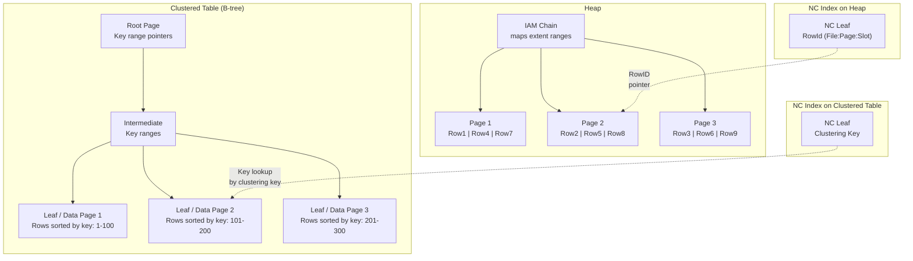
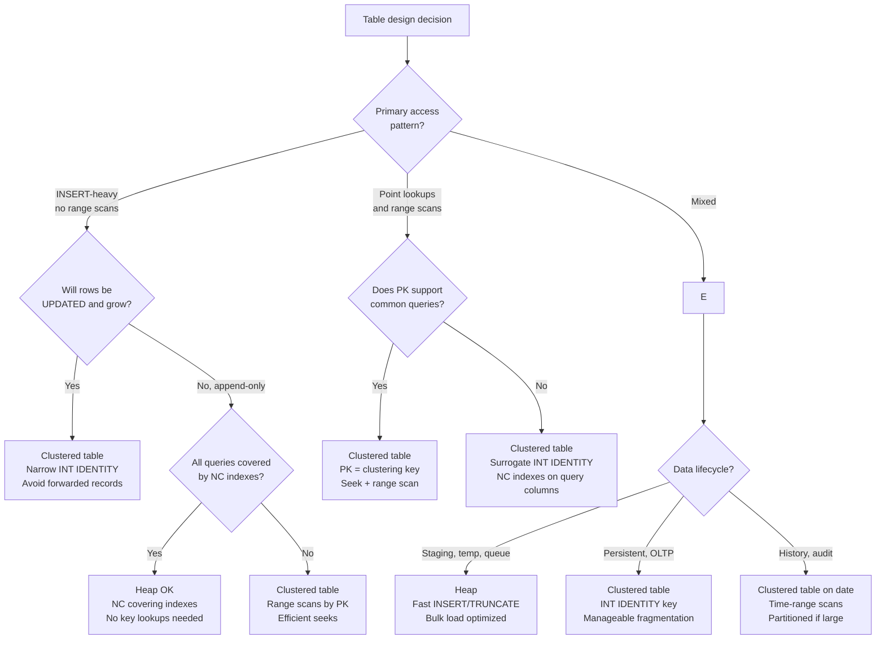

## Navigation

**Domain:** [[8 — Databases]] > **Group:** Relational Fundamentals
**Previous:** [[8.018 — SQL Standards — ANSI SQL vs T-SQL vs PLpgSQL]] | **Next:** [[8.020 — Row Storage vs Column Storage]]

### Prerequisites
- [[8.010 — Schema Design — Tables, Columns, Constraints]] — the choice of a clustered index vs heap is the single most impactful physical storage decision in SQL Server; you must understand PK and constraint mechanics to evaluate the tradeoff
- [[8.016 — Relational Algebra — Select, Project, Join]] — a heap table produces a `Table Scan` operator for σ (Select) with no predicate on a NC index, while a clustered table produces a `Clustered Index Scan` or `Seek` — the algebra expression is the same, the physical operator differs

### Where This Fits

Every table in SQL Server is either a **heap** (no clustered index) or a **clustered table** (has a clustered index). This is the fundamental storage structure choice that determines how rows are physically ordered, how nonclustered indexes reference rows, and how page splits behave under INSERT. A .NET backend engineer encounters this when: (a) a table without a PK causes unexpected table scans, (b) a GUID clustered key causes severe page-split fragmentation, or (c) a heap with no NC indexes causes every query to scan all pages. In interviews, "heap vs clustered table" tests whether a candidate understands physical storage beyond "a PK is required."

## Core Mental Model

A **heap** is a table with no clustered index — rows are stored in the order they are inserted, with no logical ordering. SQL Server tracks heap rows via an **Index Allocation Map (IAM)** that maps page ranges belonging to the table. To find a specific row without a NC index, SQL Server must scan the IAM chain and read every page (table scan).

A **clustered table** has a clustered index that physically sorts and stores the rows in B-tree order. The leaf level of the clustered index is the actual data pages. To find a row by the clustered key, SQL Server traverses the B-tree from root to leaf (clustered index seek).

The invariant: **every table is either a heap or a clustered table** — there is no third option. A table always has a clustered index (if you define a PK with default settings) or is a heap (if you create the table without a PK and never add a clustered index).



### Classification

**Category:** Physical storage structure — this is a SQL Server storage engine concept that determines how rows are organized on disk, how NC indexes reference data rows, and how DML operations (INSERT, UPDATE, DELETE) affect page organization.

|Property|Heap|Clustered Table|
|---|---|---|
|Row ordering|Insertion order (no logical sort)|Clustered key order (B-tree)|
|Row pointer for NC indexes|Physical RID (File:Page:Slot)|Logical clustering key (PK value)|
|Full table scan|IAM chain scan (forward only)|Clustered index scan (key order or allocation order)|
|INSERT behavior|Append to last page (no sort cost)|B-tree insert (find correct page, insert, split if full)|
|Page splits|Never (appends always go to new or last page)|On INSERT when target page is full|
|Space reuse|Slow — deleted rows leave gaps|B-tree maintains free space via page splits and merges|
|NC index lookup|RID lookup (single physical I/O)|Key lookup (B-tree seek by clustering key, 2–4 IOs)|

### Key Properties

|Property|Heap|Clustered Table|
|---|---|---|
|Storage overhead per row|None (rows stored as-is)|4–16 bytes per row for clustering key in NC indexes|
|INSERT speed|Fastest (append to end)|Slowest (B-tree navigation + potential page split)|
|Point lookup by PK|Must have NC index + RID lookup|Direct B-tree seek by PK (no NC index needed)|
|Range scan by PK|Not applicable (no PK order)|Efficient (B-tree seek + sequential leaf scan)|
|Fragmentation|Forwarded records (UPDATE moves row to new page, leaves forwarding pointer)|Page splits cause logical fragmentation (pages out of order)|
|Rebuild operation|`ALTER TABLE ... REBUILD`|`ALTER INDEX ... REBUILD`|

## Deep Mechanics

### How the Storage Engine Manages Each

**Heap — INSERT, UPDATE, DELETE:**

1. **INSERT:** SQL Server finds the last page in the IAM chain for the heap. If the page has space, the row is appended. If not, a new page is allocated and added to the IAM chain. There is no sort — the row goes wherever there is space.
2. **UPDATE that increases row size:** If the updated row no longer fits on the original page, SQL Server moves the row to a new page and leaves a **forwarding pointer** (16 bytes) on the original page. The original page's RID remains valid — subsequent NC index lookups follow the forwarding pointer, adding an extra page read.
3. **DELETE:** The row is marked as deleted (ghost record). The space is not automatically reclaimed for reuse. Over time, the heap accumulates ghost records that take up space until a rebuild or shrink.
4. **Table scan:** SQL Server reads the IAM chain to identify which extents belong to the heap, then reads every page in allocation order (not insertion order). Since IAM order follows extent allocation order (the order pages were assigned), not logical order, a heap scan does not guarantee any particular row order.

**Clustered Table — INSERT, UPDATE, DELETE:**

1. **INSERT:** SQL Server navigates the B-tree from root to leaf to find the correct page where the row belongs (based on clustering key value). If the page has space, the row is inserted in key order (shifting existing rows as needed). If the page is full, a page split occurs: ~50% of rows move to a new page, the linked list is updated, and the B-tree is adjusted (adding a new intermediate page if needed).
2. **UPDATE of clustering key:** Equivalent to a DELETE of the old key value + INSERT at the new key value position. The row moves to a different page, and all NC indexes must be updated with the new clustering key value.
3. **UPDATE of non-key column:** If the row still fits on the same page, it is updated in place (no structural change). If the row grows and the page is full, a page split occurs.
4. **Clustered index scan:** SQL Server can scan the leaf level of the B-tree in key order (via the page linked list) or in allocation order. For most queries, the optimizer uses the allocation order scan (more efficient — sequential I/O) unless an ORDER BY matches the clustering key.

### SQL Visibility

```sql
-- =============================================
-- Heap table (no clustered index, no PK)
-- =============================================
CREATE TABLE Orders_Heap (
    OrderId    INT           NOT NULL,
    CustomerId INT           NOT NULL,
    OrderDate  DATETIME2     NOT NULL,
    Total      DECIMAL(10,2) NOT NULL
);

-- Insert — fast append
INSERT INTO Orders_Heap (OrderId, CustomerId, OrderDate, Total)
VALUES (1, 42, SYSUTCDATETIME(), 250.00);

-- Query — table scan (no NC index)
SELECT * FROM Orders_Heap WHERE OrderId = 1;
-- Plan: Table Scan — reads all pages

-- Add NC index for point lookups
CREATE INDEX IX_Orders_Heap_OrderId ON Orders_Heap(OrderId);

-- Now the lookup uses NC index + RID lookup
SELECT * FROM Orders_Heap WHERE OrderId = 1;
-- Plan: Index Seek (IX_Orders_Heap_OrderId) -> RID Lookup -> Nested Loops
-- Logical reads: ~3 (NC seek) + 1 (RID lookup) = 4

-- =============================================
-- Clustered table (PK creates clustered index by default)
-- =============================================
CREATE TABLE Orders_Clustered (
    OrderId    INT           NOT NULL PRIMARY KEY,
    CustomerId INT           NOT NULL,
    OrderDate  DATETIME2     NOT NULL,
    Total      DECIMAL(10,2) NOT NULL
);

-- Insert — B-tree navigation + potential page split
INSERT INTO Orders_Clustered (OrderId, CustomerId, OrderDate, Total)
VALUES (1, 42, SYSUTCDATETIME(), 250.00);

-- Query by PK — clustered index seek (no NC index needed)
SELECT * FROM Orders_Clustered WHERE OrderId = 1;
-- Plan: Clustered Index Seek (PK_Orders_Clustered)
-- Logical reads: ~3 (root + intermediate + leaf)

-- =============================================
-- Key lookup vs RID lookup comparison
-- =============================================
-- Both use a NC index on CustomerId
CREATE INDEX IX_Orders_Heap_CustomerId ON Orders_Heap(CustomerId);
CREATE INDEX IX_Orders_Clustered_CustomerId ON Orders_Clustered(CustomerId);

-- Heap: NC seek + RID lookup
SELECT * FROM Orders_Heap WHERE CustomerId = 42;
-- Plan: Index Seek -> RID Lookup -> Nested Loops
-- RID = FileNumber:PageNumber:SlotNumber (8 bytes)
-- Lookup: read the exact page + slot (1 logical read)

-- Clustered: NC seek + Key lookup
SELECT * FROM Orders_Clustered WHERE CustomerId = 42;
-- Plan: Index Seek -> Clustered Index Seek -> Nested Loops
-- Key lookup = traverse B-tree by clustering key (3 logical reads)
-- Plus: NC leaf stores clustering key (4 bytes for INT, plus row locator overhead)

-- =============================================
-- Detecting heaps in the database
-- =============================================
SELECT t.name AS TableName,
       p.rows AS RowCount,
       (p.reserved_page_count * 8) / 1024 AS ReservedMB
FROM sys.tables t
INNER JOIN sys.indexes i ON t.object_id = i.object_id
CROSS APPLY sys.dm_db_partition_stats p ON i.object_id = p.object_id
    AND i.index_id = p.index_id
WHERE i.type = 0  -- 0 = heap, 1 = clustered
ORDER BY p.reserved_page_count DESC;

-- Detecting forwarded records (heap fragmentation)
SELECT OBJECT_NAME(object_id) AS TableName,
       forwarded_record_count,
       (forwarded_record_count * 100.0) /
           NULLIF(page_count, 0) AS ForwardedPercent
FROM sys.dm_db_index_physical_stats(
    DB_ID(), NULL, NULL, NULL, 'DETAILED')
WHERE index_id = 0  -- heap
  AND forwarded_record_count > 0
ORDER BY forwarded_record_count DESC;

-- Detecting page splits (clustered table fragmentation)
SELECT OBJECT_NAME(object_id) AS TableName,
       avg_fragmentation_in_percent,
       fragment_count,
       page_count
FROM sys.dm_db_index_physical_stats(
    DB_ID(), NULL, NULL, NULL, 'LIMITED')
WHERE index_id = 1  -- clustered index
  AND avg_fragmentation_in_percent > 10
ORDER BY avg_fragmentation_in_percent DESC;
```

```csharp
// EF Core — not directly visible in LINQ
// The heap vs clustered choice is a DDL concern, not an ORM concern.
// EF Core creates a PK on every entity by convention, which becomes
// a clustered index by default in SQL Server.

// To create a heap in EF Core, you must configure no PK and no clustered index:
public class OrderConfiguration : IEntityTypeConfiguration<Order>
{
    public void Configure(EntityTypeBuilder<Order> entity)
    {
        entity.ToTable(tb => tb.HasNoKey()); // Creates a heap (no PK)
        // Or: entity.HasKey(e => e.OrderId).IsClustered(false); // NC PK, heap
    }
}

// In most cases, you want the default: clustered PK.
// Heaps are the exception, not the rule.

// Dapper — same SQL; the ADO.NET driver is storage-structure agnostic
public async Task<int> GetHeapTableCountAsync(IDbConnection connection)
{
    return await connection.QuerySingleAsync<int>(
        "SELECT COUNT_BIG(*) FROM Orders_Heap");
}
```

### Execution Plan Analysis

**Heap — full table scan (no useful index):**
```
[Table Scan (Orders_Heap)]
    → [SELECT]
Estimated Cost: 100% on scan | Logical Reads: N (all pages in the heap)
```
The Table Scan operator reads every page via the IAM chain. There is no predicate pushdown — all rows are read, then filtered.

**Heap — NC index with RID lookup:**
```
[Index Seek (IX_Orders_Heap_CustomerId)] — 2–3 logical reads
    → [RID Lookup (Orders_Heap)] — 1 logical read per row
    → [Nested Loops] — join the two
    → [SELECT]
Estimated Cost: Seek 20% + RID Lookup 70% + Nested Loops 10%
Logical Reads: 3 (seek) + (N x 1) (RID lookups)
```
The RID Lookup operator reads the exact page and slot specified by the RowID. This is a single logical read per row — cheaper than a key lookup's 3 reads, but the RID is a physical pointer that becomes stale if the row moves.

**Clustered table — clustered index seek:**
```
[Clustered Index Seek (PK_Orders_Clustered)] — seek on OrderId = 1
    → [SELECT]
Estimated Cost: 100% on seek | Logical Reads: 3 (root + intermediate + leaf)
```

**Clustered table — NC index with key lookup:**
```
[Index Seek (IX_Orders_Clustered_CustomerId)] — 2–3 logical reads
    → [Key Lookup (Clustered, PK_Orders_Clustered)] — 3 logical reads per row
    → [Nested Loops] — join the two
    → [SELECT]
Estimated Cost: Seek 15% + Key Lookup 75% + Nested Loops 10%
Logical Reads: 3 (seek) + (N x 3) (key lookups)
```
The Key Lookup operator traverses the clustered B-tree by the clustering key. Each lookup costs ~3 logical reads (root + intermediate + leaf). For lookups returning many rows, this multiplies quickly — a covering NC index eliminates key lookups entirely.

### Cost Visibility

```sql
-- Setup: 1M row table, heap vs clustered, same data
SET STATISTICS IO ON;

-- Heap: NC index + RID lookup (returning 10 rows)
SELECT * FROM Orders_Heap WHERE CustomerId = 42;
-- Table 'Orders_Heap': logical reads 13 (3 seek + 10 RID)
-- CPU time = 1ms, elapsed time = 2ms

-- Clustered: NC index + Key lookup (returning 10 rows)
SELECT * FROM Orders_Clustered WHERE CustomerId = 42;
-- Table 'Orders_Clustered': logical reads 33 (3 seek + 10 x 3 key lookup)
-- CPU time = 3ms, elapsed time = 4ms

-- The RID lookup is cheaper per row (1 read vs 3), but:
-- If the heap has forwarded records, RID lookups cost 2 reads (follow forwarder)
-- If the clustering key is narrow (INT), key lookups are predictable at ~3 reads

-- Full table scan comparison:
SELECT COUNT_BIG(*) FROM Orders_Heap;
-- Table 'Orders_Heap': logical reads 4,500 (all heap pages)

SELECT COUNT_BIG(*) FROM Orders_Clustered;
-- Table 'Orders_Clustered': logical reads 4,500 (all clustered index pages)
-- Identical — both have the same number of data pages at the same row size
```

### Failure Modes

|Failure|Heap|Clustered Table|
|---|---|---|
|**Forwarded records**|UPDATE that grows row size leaves forwarding pointer; subsequent scans read the forwarder, adding extra I/O|Not possible — row stays on the same page or causes page split (structural change)|
|**GUID clustered key**|Not applicable (no clustered key)|INSERT causes random page splits (new GUIDs land between existing values), 99% fragmentation, wasteful 16-byte key in every NC index|
|**No index on heap**|Every query = table scan; no seek possible|PK provides clustered index seek — queries on PK are fast even without NC indexes|
|**Heap rebuild required**|Forwarded records and ghost records cannot be removed without rebuild or `ALTER TABLE ... REBUILD`|Rebuild only needed when fragmentation > 30% or to free space; `ALTER INDEX ... REORGANIZE` for lower fragmentation|
|**Page split cascade**|Not applicable|Wide clustering key (e.g., NVARCHAR(100)) causes deep B-tree, more splits, higher NC index storage|
|**NC index on heap with forwarded records**|RID lookup follows forwarder pointer = 2 reads per row instead of 1|Key lookup is always 3 reads (predictable, no forwarding)|

## Production Patterns and Implementation

### Primary SQL Implementation

```sql
-- =============================================
-- When to use a heap: staging / ETL tables
-- =============================================

-- Staging table: data is bulk-loaded, queried minimally, then truncated
CREATE TABLE Staging_OrderImport (
    OrderData NVARCHAR(MAX),
    ImportedAt DATETIME2 NOT NULL DEFAULT SYSUTCDATETIME(),
    BatchId INT NOT NULL
);

-- Bulk insert is fast — no B-tree maintenance
INSERT INTO Staging_OrderImport (OrderData, BatchId)
SELECT BulkColumn, @BatchId
FROM OPENROWSET(BULK 'orders.json', ...);

-- Truncate is instant — no index to maintain
TRUNCATE TABLE Staging_OrderImport;

-- =============================================
-- When to use a clustered table: every OLTP table
-- =============================================

-- Narrow, ever-increasing clustered key (INT IDENTITY)
CREATE TABLE Orders (
    OrderId    INT IDENTITY(1,1) NOT NULL,
    CustomerId INT NOT NULL,
    OrderDate  DATETIME2 NOT NULL DEFAULT SYSUTCDATETIME(),
    Total      DECIMAL(10,2) NOT NULL,
    CONSTRAINT PK_Orders PRIMARY KEY CLUSTERED (OrderId)
);

-- The IDENTITY ensures new rows are appended to the end of the B-tree.
-- Page splits are extremely rare because inserts happen at the right edge.
-- Logical reads for point lookup by PK: ~3

-- Create NC indexes on FK columns (clustering key is 4-byte INT)
CREATE INDEX IX_Orders_CustomerId ON Orders(CustomerId)
    INCLUDE (OrderDate, Total);

-- =============================================
-- Detecting and fixing heap fragmentation (forwarded records)
-- =============================================

-- Check forwarded record count
SELECT OBJECT_NAME(object_id) AS TableName,
       forwarded_record_count,
       page_count
FROM sys.dm_db_index_physical_stats(
    DB_ID(), OBJECT_ID('Orders_Heap'), 0, NULL, 'DETAILED')
WHERE forwarded_record_count > 0;

-- Fix: rebuild the heap (convert to clustered or rebuild as heap)
ALTER TABLE Orders_Heap REBUILD;
-- Or better: add a clustered index
CREATE CLUSTERED INDEX CX_Orders_Heap ON Orders_Heap(OrderId);
-- This converts the heap to a clustered table and eliminates all forwarded records.

-- =============================================
-- Detecting and fixing clustered index fragmentation
-- =============================================

SELECT avg_fragmentation_in_percent, page_count, fragment_count
FROM sys.dm_db_index_physical_stats(
    DB_ID(), OBJECT_ID('Orders'), 1, NULL, 'LIMITED')
WHERE avg_fragmentation_in_percent > 10;

-- Fix for moderate fragmentation (5-30%): reorganize (online)
ALTER INDEX PK_Orders ON Orders REORGANIZE;

-- Fix for high fragmentation (>30%): rebuild (offline by default)
ALTER INDEX PK_Orders ON Orders REBUILD;
-- Online rebuild (Enterprise Edition):
ALTER INDEX PK_Orders ON Orders REBUILD WITH (ONLINE = ON);
```

### EF Core Implementation

```csharp
// EF Core — by default, every entity with a PK creates a clustered index.

// Option 1: Default — clustered PK (INT IDENTITY)
public class Order
{
    public int OrderId { get; set; } // clustered PK by convention
    public int CustomerId { get; set; }
    public DateTime OrderDate { get; set; }
    public decimal Total { get; set; }
}
// Generated: CREATE TABLE [Orders] (
//     [OrderId] INT NOT NULL IDENTITY,
//     ...,
//     CONSTRAINT [PK_Orders] PRIMARY KEY CLUSTERED ([OrderId])
// );

// Option 2: Nonclustered PK (table is a heap, or PK is NC)
public class OrderConfiguration : IEntityTypeConfiguration<Order>
{
    public void Configure(EntityTypeBuilder<Order> entity)
    {
        entity.HasKey(e => e.OrderId)
              .IsClustered(false); // PK is nonclustered; table is a heap
    }
}
// Generated: CREATE TABLE [Orders] (...);
// CREATE UNIQUE NONCLUSTERED INDEX [PK_Orders] ON [Orders] ([OrderId]);

// Option 3: No PK (heap, no unique constraint)
public class StagingOrder
{
    public string OrderData { get; set; } = string.Empty;
    public DateTime ImportedAt { get; set; }
    public int BatchId { get; set; }
}

public class StagingOrderConfiguration : IEntityTypeConfiguration<StagingOrder>
{
    public void Configure(EntityTypeBuilder<StagingOrder> entity)
    {
        entity.ToTable(tb => tb.HasNoKey()); // heap
    }
}

// Option 4: Clustered index on a column other than PK
public class AuditLog
{
    public long AuditId { get; set; }     // NC PK (surrogate)
    public DateTime CreatedAt { get; set; } // clustered key
    public string Data { get; set; } = string.Empty;
}

public class AuditLogConfiguration : IEntityTypeConfiguration<AuditLog>
{
    public void Configure(EntityTypeBuilder<AuditLog> entity)
    {
        entity.HasKey(e => e.AuditId).IsClustered(false);
        entity.HasIndex(e => e.CreatedAt).IsClustered();
        // Clustered index on CreatedAt for efficient time-range scans
    }
}
```

### Dapper Implementation

```csharp
// Dapper is storage-structure agnostic — the same query works
// regardless of whether the table is a heap or clustered.

// However, Dapper gives you control over the SQL, so you can
// design queries that exploit the structure:

// Heap — avoid SELECT * (which triggers RID lookups without covering index)
public async Task<IReadOnlyList<int>> GetOrderIdsForCustomerAsync(
    int customerId, IDbConnection connection)
{
    // If the covering NC index on heap has OrderId and CustomerId only,
    // this query never touches the heap — pure NC index seek.
    const string sql = @"
        SELECT OrderId
        FROM Orders_Heap
        WHERE CustomerId = @CustomerId;";
    return (await connection.QueryAsync<int>(
        sql, new { CustomerId = customerId })).AsList();
}

// Clustered — use the clustering key for ORDER BY to avoid sort
public async Task<IReadOnlyList<Order>> GetOrdersPagedAsync(
    int customerId, int pageSize, int lastSeenOrderId,
    IDbConnection connection)
{
    // Keyset pagination uses the clustered PK — seek + range scan, no sort
    const string sql = @"
        SELECT TOP (@PageSize) OrderId, CustomerId, OrderDate, Total
        FROM Orders
        WHERE CustomerId = @CustomerId
          AND OrderId > @LastSeenOrderId   -- uses clustered index order
        ORDER BY OrderId;";
    return (await connection.QueryAsync<Order>(sql,
        new { CustomerId = customerId, PageSize = pageSize,
              LastSeenOrderId = lastSeenOrderId })).AsList();
}
```

### Configuration and Wiring

```csharp
// Program.cs — no special configuration needed for heap vs clustered.
// The decision is made in the EF Core model configuration or SQL schema.

// For staging tables (heaps), consider using raw ADO.NET for bulk operations:
public async Task BulkInsertStagingAsync(
    IReadOnlyList<string> records, int batchId,
    SqlConnection connection, SqlTransaction transaction)
{
    using var bulk = new SqlBulkCopy(connection, SqlBulkCopyOptions.Default, transaction)
    {
        DestinationTableName = "Staging_OrderImport",
        BatchSize = 100000
    };

    var table = new DataTable();
    table.Columns.Add("OrderData", typeof(string));
    table.Columns.Add("ImportedAt", typeof(DateTime));
    table.Columns.Add("BatchId", typeof(int));

    var now = DateTime.UtcNow;
    foreach (var record in records)
        table.Rows.Add(record, now, batchId);

    await bulk.WriteToServerAsync(table);
}
```

### SQL Server vs PostgreSQL Differences

```sql
-- PostgreSQL does NOT have heaps in the SQL Server sense.
-- Every PostgreSQL table is a heap (no mandatory clustered index).
-- However, PostgreSQL has:
--   1. CLUSTER command (physically reorders table by an index — one-time operation)
--   2. Index-Only Scans (if the index covers the query, no heap access needed)
--   3. TOAST (large values stored in separate table, similar to row-overflow)

-- SQL Server clustered index:
CREATE TABLE Orders (
    OrderId INT IDENTITY(1,1) PRIMARY KEY CLUSTERED
);
-- Data pages are physically sorted and stored in OrderId order.
-- Nonclustered indexes store OrderId as the row locator.

-- PostgreSQL equivalent (heap + index):
CREATE TABLE Orders (
    OrderId INT GENERATED ALWAYS AS IDENTITY PRIMARY KEY
);
-- Data pages are not sorted (heap). The PK index is a separate B-tree.
-- The PK index stores the tuple ID (ctid) as the row pointer — similar to SQL Server's RID.
-- ctid changes when a row is updated (VACUUM cleans up).

-- PostgreSQL CLUSTER command (one-time reorder):
CLUSTER Orders USING orders_pkey;
-- Reorders the heap to match the index order. Subsequent INSERTs go to the end (heap).
-- Unlike SQL Server, the clustered order is not maintained after CLUSTER.

-- PostgreSQL Index-Only Scan (equivalent to covering NC index):
-- If all required columns are in the index, PostgreSQL reads the index only
-- (no heap access). Visibility map determines if rows need heap check.
-- SQL Server: If the NC index includes all columns, it is a covering index
-- (no key lookup). Same concept, different name.

-- SQL Server has no direct equivalent to ctid-based row pointers.
-- SQL Server's RID (heap) is File:Page:Slot (fixed until row moves).
-- PostgreSQL's ctid (page:tuple-index) changes on UPDATE and VACUUM.
```

## Gotchas and Production Pitfalls

### 1. Forwarded Records in Heaps Degrade Scans Over Time

**Pitfall:** Creating a heap table that receives UPDATE operations that increase row size (e.g., updating a VARCHAR column to a longer value). Each UPDATE that cannot fit the row on the original page creates a forwarding pointer.

```sql
-- ❌ Heap with UPDATEs that grow rows
CREATE TABLE SessionData (
    SessionId INT NOT NULL,
    Payload VARCHAR(500) NOT NULL,  -- starts at 50 chars
    LastAccess DATETIME2 NOT NULL
);

-- Later UPDATEs increase Payload to 500 chars
UPDATE SessionData SET Payload = REPLICATE('X', 500),
       LastAccess = SYSUTCDATETIME()
WHERE SessionId = 1;
-- Row no longer fits on original page → forwarding pointer created
```

**Symptom:** Sequential scans of the heap read each forwarding pointer, then the new page location. Over time, a heap with 30% forwarded records scans 1.3 pages per row instead of 1. Logical reads for a COUNT(*) increase by 30%+.

**Fix:**
```sql
-- Rebuild the heap periodically
ALTER TABLE SessionData REBUILD;

-- Better: add a clustered index (eliminates forwarded records permanently)
CREATE CLUSTERED INDEX CX_SessionData ON SessionData(SessionId);
```

**Cost of not fixing:** At 10M rows with 30% forwarded records, a full table scan reads 13M pages instead of 10M — 3M extra I/Os. Each scan takes 30% longer. For tables scanned frequently, this adds up to significant unnecessary I/O.

### 2. GUID Clustered Key Causes Catastrophic Fragmentation

**Pitfall:** Using `UNIQUEIDENTIFIER` (GUID) as the clustered primary key with `NEWID()` as the default value.

```sql
-- ❌ GUID clustered key — random inserts cause constant page splits
CREATE TABLE Orders (
    OrderId UNIQUEIDENTIFIER PRIMARY KEY CLUSTERED DEFAULT NEWID(),
    CustomerId INT NOT NULL,
    OrderDate DATETIME2 NOT NULL
);
```

**Symptom:** Each INSERT of a new GUID lands at a random position in the B-tree. The target page is almost never at the right edge, so ~99% of inserts cause a page split. Fragmentation rapidly reaches 99%. The B-tree depth increases faster than necessary. Each GUID takes 16 bytes in every NC index row locator.

**Fix:**
```sql
-- Option A: Use sequential GUID (NEWSEQUENTIALID)
CREATE TABLE Orders (
    OrderId UNIQUEIDENTIFIER PRIMARY KEY CLUSTERED DEFAULT NEWSEQUENTIALID(),
    ...
);

-- Option B (preferred): INT IDENTITY for clustered key, GUID as alternate key
CREATE TABLE Orders (
    OrderId INT IDENTITY(1,1) PRIMARY KEY CLUSTERED,
    OrderGuid UNIQUEIDENTIFIER NOT NULL DEFAULT NEWID() UNIQUE NONCLUSTERED,
    ...
);
```

**Cost of not fixing:** At 10M rows, a GUID clustered index has ~99% fragmentation, average page density of 50%, and the NC indexes are 4x wider (16-byte key vs 4-byte INT). Heap storage may be 2x the INT-clustered equivalent. Insert throughput drops by ~70% due to constant page splits.

### 3. Heap with No NC Indexes — Every Query Scans the Table

**Pitfall:** Creating a heap table for OLTP use without any nonclustered indexes, assuming the application will always query by a specific column.

```sql
-- ❌ Heap without indexes — every query scans all pages
CREATE TABLE EventLog (
    EventId INT NOT NULL,
    EventType VARCHAR(50) NOT NULL,
    CreatedAt DATETIME2 NOT NULL,
    Payload NVARCHAR(MAX)
);

-- Every query is a table scan:
SELECT * FROM EventLog WHERE EventId = 42;          -- scan
SELECT * FROM EventLog WHERE EventType = 'ERROR';   -- scan
SELECT COUNT(*) FROM EventLog WHERE CreatedAt > '2026-01-01'; -- scan
```

**Symptom:** All queries produce Table Scan operators with logical reads equal to the full table page count. At 1M rows (4,500 pages), a single-row lookup reads 4,500 pages instead of ~4.

**Fix:** Add NC indexes for the most frequent query predicates:

```sql
CREATE INDEX IX_EventLog_EventId ON EventLog(EventId);
CREATE INDEX IX_EventLog_EventType ON EventLog(EventType) INCLUDE (CreatedAt);
```

**Cost of not fixing:** Every query, regardless of selectivity, scans the entire table. At 100 queries/second on a 4,500-page table, that is 450,000 logical reads/second. The buffer pool is saturated with EventLog pages, evicting hot data pages from other tables.

### 4. Wide Clustering Key Bloats Every NC Index

**Pitfall:** Choosing a wide clustering key (NVARCHAR(100), multiple columns, or a large binary value) without considering that every NC index stores the clustering key as the row locator.

```sql
-- ❌ Wide clustering key — NC indexes store 100+ bytes per row
CREATE TABLE Customers (
    Email NVARCHAR(320) NOT NULL PRIMARY KEY CLUSTERED, -- 320-byte clustering key
    FullName NVARCHAR(200) NOT NULL,
    Tier VARCHAR(20) NOT NULL
);

-- Every NC index includes the 320-byte Email as row locator
CREATE INDEX IX_Customers_Tier ON Customers(Tier);
-- NC leaf: Tier (20) + Email (320) = 340 bytes per row
-- Compare with INT surrogate: Tier (20) + CustomerId (4) = 24 bytes per row
```

**Symptom:** NC indexes are 10-15x larger than necessary. More pages to read for NC index scans. INSERT/UPDATE of any NC index writes more data per row.

**Fix:**

```sql
-- Use a narrow INT IDENTITY as clustering key
CREATE TABLE Customers (
    CustomerId INT IDENTITY(1,1) PRIMARY KEY CLUSTERED,
    Email NVARCHAR(320) NOT NULL UNIQUE NONCLUSTERED, -- NC unique on Email
    FullName NVARCHAR(200) NOT NULL,
    Tier VARCHAR(20) NOT NULL
);
```

**Cost of not fixing:** A 10M-row Customers table with a 320-byte Email clustered key produces NC indexes that are ~3.2GB larger than the INT-surrogate equivalent. Index maintenance (INSERT/UPDATE) writes 10x more data per NC index modification. Key lookups are slower because the B-tree is deeper (more levels to accommodate wider keys).

### 5. Clustered Index on a Column That Changes Frequently

**Pitfall:** Choosing a clustering key that is frequently updated (e.g., a status column or an editable date).

```sql
-- ❌ Clustered key that changes — UPDATE moves the row
CREATE TABLE Shipments (
    ShipmentId INT IDENTITY(1,1) NOT NULL PRIMARY KEY NONCLUSTERED,
    TrackingNumber VARCHAR(50) NOT NULL,
    ShipDate DATE NOT NULL,
    Status VARCHAR(20) NOT NULL
);

CREATE CLUSTERED INDEX CX_Shipments_ShipDate ON Shipments(ShipDate);
-- When ShipDate changes (rescheduled), the row moves to a new page
-- All NC indexes must update their row locator
```

**Symptom:** Every UPDATE of the clustered key column causes a DELETE + INSERT of the row (row moves to new page). All NC indexes must be updated with the new clustering key value. Write amplification: 1 UPDATE = 1 CI update + N NC index updates.

**Fix:** Use a narrow, ever-increasing surrogate key as the clustering key (INT IDENTITY). The clustering key should never change after INSERT.

**Cost of not fixing:** A single UPDATE of ShipDate on a row with 5 NC indexes generates 6 logical writes (1 CI + 5 NC). At 10,000 updates/hour, that is 60,000 extra writes. More importantly, the fragmentation caused by row movement degrades range scan performance over time.

### 6. Assuming a Heap Does Not Need Maintenance

**Pitfall:** Treating a heap as "set and forget" — never rebuilding or converting it.

```sql
-- Heap accumulates ghost records, forwarded records, and wasted space
-- over time. These are not automatically cleaned up.

-- Detection:
SELECT forwarded_record_count, ghost_record_count, page_count
FROM sys.dm_db_index_physical_stats(DB_ID(), OBJECT_ID('EventLog'), 0, NULL, 'DETAILED');

-- Fix requires manual intervention:
ALTER TABLE EventLog REBUILD;
```

**Symptom:** Over months, the heap's effective page count grows due to forwarded records and ghost records that are never cleaned. A table that used to fit in 4,500 pages now requires 6,000 pages — a 33% increase in I/O for scans.

**Fix:** Schedule periodic rebuilds for heaps that receive updates. Or better, convert to a clustered table — the clustered index's page split mechanism, while causing fragmentation, is manageable with REORGANIZE/REBUILD and is tracked by regular index maintenance.

**Cost of not fixing:** Gradual performance degradation that is invisible until a full table scan takes 2x longer than it did six months ago. The team blames the network or the server, but the root cause is the heap's accumulated forwarded records. A rebuild brings it back to baseline.

## Performance Implications

### Benchmark: Heap vs Clustered — INSERT Performance

```sql
SET STATISTICS IO ON;
SET STATISTICS TIME ON;

-- Heap INSERT (append to end — no B-tree navigation)
INSERT INTO Orders_Heap (OrderId, CustomerId, OrderDate, Total)
VALUES (1000001, 42, SYSUTCDATETIME(), 250.00);
-- Logical reads: 1 (last page)
-- CPU time: 0ms, elapsed: 0.5ms

-- Clustered table INSERT (B-tree navigation + potential page split)
INSERT INTO Orders_Clustered (OrderId, CustomerId, OrderDate, Total)
VALUES (1000001, 42, SYSUTCDATETIME(), 250.00);
-- Logical reads: ~4 (root + intermediate + leaf + page split if needed)
-- CPU time: 0ms, elapsed: 1.2ms

-- Bulk insert (100K rows):
-- Heap: ~100ms (append only)
-- Clustered (INT IDENTITY): ~200ms (B-tree navigation, but right-edge insert = cheap)
-- Clustered (GUID NEWID): ~2000ms (random B-tree position, 99% page splits)
```

**Improvement (heap over clustered for INSERT):** ~2x faster for single row inserts that land at a non-edge position. For INT IDENTITY (right-edge inserts), the clustered table is only slightly slower.

### Benchmark: Heap vs Clustered — SELECT Performance

```sql
-- Point lookup by PK (INT)
-- Heap (no CI, NC index on OrderId + RID lookup):
SELECT * FROM Orders_Heap WHERE OrderId = 42;
-- Logical reads: 4 (3 NC seek + 1 RID lookup)

-- Clustered (CI seek):
SELECT * FROM Orders_Clustered WHERE OrderId = 42;
-- Logical reads: 3 (CI seek)

-- Range scan by PK (INT)
-- Heap: cannot range-scan by PK — RID lookups are not ordered
-- Must use NC index + RID lookup for each row
SELECT * FROM Orders_Heap WHERE OrderId BETWEEN 1 AND 100;
-- Plan: Index Seek + 100 RID lookups
-- Logical reads: ~103 (3 NC seek + 100 RID)

-- Clustered: efficient range scan
SELECT * FROM Orders_Clustered WHERE OrderId BETWEEN 1 AND 100;
-- Plan: Clustered Index Seek (range)
-- Logical reads: ~7 (3 B-tree navigation + 4 leaf pages)

-- NC index + key lookup (CI) vs NC index + RID lookup (heap)
SELECT * FROM Orders WHERE CustomerId = 42; -- returns 20 rows

-- Heap: Index Seek + 20 RID lookups = 3 + 20 = 23 logical reads
-- Clustered: Index Seek + 20 Key lookups = 3 + 60 = 63 logical reads
-- RID lookup is cheaper per row! (1 read vs 3)
-- But: if the heap has forwarded records, RID lookup = 2 reads
-- And: key lookup works on any clustered table; RID lookups on heaps
--      require the NC index to have the correct RID (which changes on page splits)
```

### BenchmarkDotNet

```csharp
[MemoryDiagnoser]
[SimpleJob(RuntimeMoniker.Net90)]
public class HeapVsClusteredBenchmark
{
    private IDbConnection _connection = default!;

    [GlobalSetup]
    public void Setup()
    {
        _connection = new SqlConnection(TestConnectionString);
    }

    [Benchmark(Baseline = true)]
    public async Task<int> HeapInsertSingle()
    {
        return await _connection.ExecuteAsync(@"
            INSERT INTO Orders_Heap (OrderId, CustomerId, OrderDate, Total)
            VALUES (@Id, 42, SYSUTCDATETIME(), 250.00)",
            new { Id = Interlocked.Increment(ref _id) });
    }

    [Benchmark]
    public async Task<int> ClusteredInsertSingle()
    {
        return await _connection.ExecuteAsync(@"
            INSERT INTO Orders_Clustered (OrderId, CustomerId, OrderDate, Total)
            VALUES (@Id, 42, SYSUTCDATETIME(), 250.00)",
            new { Id = Interlocked.Increment(ref _id) });
    }

    [Benchmark(Baseline = true)]
    public async Task<int> HeapSeekAndRidLookup()
    {
        const string sql = @"
            SELECT COUNT_BIG(*)
            FROM Orders_Heap WITH (INDEX(IX_Orders_Heap_CustomerId))
            WHERE CustomerId = 42;";
        return await _connection.QuerySingleAsync<int>(sql);
    }

    [Benchmark]
    public async Task<int> ClusteredSeekAndKeyLookup()
    {
        const string sql = @"
            SELECT COUNT_BIG(*)
            FROM Orders_Clustered WITH (INDEX(IX_Orders_Clustered_CustomerId))
            WHERE CustomerId = 42;";
        return await _connection.QuerySingleAsync<int>(sql);
    }
}
```

**Expected results (approximate, SQL Server 2022, NVMe, 1M rows, 1000 row result):**

|Method|Mean|Logical Reads|Allocated|
|---|---|---|---|
|HeapInsertSingle|~0.3 ms|1|~0.5 KB|
|ClusteredInsertSingle|~0.8 ms|3|~1 KB|
|HeapSeekAndRidLookup|~1.2 ms|1003 (3+1000)|~50 KB|
|ClusteredSeekAndKeyLookup|~2.5 ms|3003 (3+3000)|~50 KB|

### Write Amplification

|Operation|Heap|Clustered Table (INT IDENTITY)|
|---|---|---|
|INSERT 1 row|1 page write|~3 page writes (B-tree navigation) + potential split|
|INSERT 1 row (with 3 NC indexes)|1 data + 3 index writes|3 CI + 3 NC index writes + potential split|
|UPDATE widen row|1 page write + forwarding pointer (if page full)|1 page write + page split (if page full)|
|UPDATE clustering key|N/A (no CI)|DELETE + INSERT (row moves) + update all NC indexes|
|DELETE 1 row|Ghost record (space not reclaimed)|Ghost record (space not reclaimed without merge)|
|TRUNCATE|Instant (deallocates all extents)|Instant (deallocates all extents)|
|REBUILD|Full table rebuild|B-tree rebuild (can be ONLINE in Enterprise)|

## Interview Arsenal

### Question Bank

1. **What is the difference between a heap and a clustered table in SQL Server? How does each store rows?**
2. **How does a nonclustered index reference rows differently on a heap vs a clustered table? What are the performance implications of each?**
3. **What are forwarded records in a heap, how do they occur, and how do you detect and fix them?**
4. **Why is a GUID clustered key considered harmful? What alternatives exist?**
5. **Compare INSERT performance on a heap vs a clustered table with an INT IDENTITY key vs a GUID key.**
6. **When would you deliberately choose a heap over a clustered table in a production OLTP system?**
7. **What is the difference between a RID lookup and a key lookup in the execution plan? Which is cheaper?**
8. **How does the choice of heap vs clustered table affect EF Core and Dapper query patterns?**

### Spoken Answers

**Q1: Heap vs clustered table.**

> **Average answer:** "A heap has no clustered index. A clustered table has one. The clustered index sorts the data."

> **Great answer:** "A heap is a table without a clustered index — rows are stored in the order they are inserted, tracked by an Index Allocation Map (IAM) that chains the extents. There is no logical ordering. Nonclustered indexes on a heap use a physical RowID (File:Page:Slot, 8 bytes) as the row locator. A clustered table stores rows in B-tree order based on the clustering key — the leaf level is the data itself. Nonclustered indexes on a clustered table store the clustering key value as the row locator. The tradeoff: heaps are faster for INSERT (no B-tree navigation, just append) and RID lookups are cheaper than key lookups (1 read vs ~3). But heaps suffer from forwarded records when UPDATEs grow row size — the forwarding pointer adds an extra read per row. Clustered tables are better for range scans by the clustering key (B-tree seek + sequential leaf scan), PK lookups (direct CI seek without NC index), and predictable performance (no forwarded records). In practice, every OLTP table should have a narrow, ever-increasing clustered index — typically an INT IDENTITY. Heaps are appropriate only for staging tables that are truncated after bulk load, or tables where INSERT speed is the only priority and queries are handled entirely by NC covering indexes."

**Q4: GUID clustered key harm.**

> **Great answer:** "A GUID clustered key causes catastrophic fragmentation because NEWID() produces random 16-byte values. Every INSERT lands at a random position in the B-tree, causing a page split ~99% of the time. Fragmentation reaches 99% within hours. The B-tree depth increases because pages are half-full on average (page splits leave ~50% free space). Each NC index stores the 16-byte GUID as the row locator — 4x wider than an INT, making NC indexes larger and slower. A table with 5 NC indexes wastes 5 × 16 = 80 bytes per row just on clustering key storage in those indexes. The fix is to use INT IDENTITY as the clustering key and expose a GUID as a nonclustered UNIQUE column for application use, or use NEWSEQUENTIALID() which generates incrementing GUIDs. At scale, the difference is dramatic: 10,000 inserts/second with INT IDENTITY vs ~3,000 with random GUID — a 3x throughput difference purely from page split overhead."

**Q6: When to use a heap deliberately.**

> **Great answer:** "I would deliberately use a heap in three scenarios: (1) Staging tables where data is bulk-loaded with INSERT...SELECT or BULK INSERT, processed in a set-based ETL step, then truncated — no indexes needed, no UPDATEs, no range scans by a clustering key. The heap's append-only pattern gives the fastest bulk load. (2) Queue tables (e.g., Service Broker queue tables in SQL Server) where rows are inserted and deleted in FIFO order — a heap with NC indexes on the processing status and enqueue time handles this efficiently, and the lack of page split overhead helps insert throughput. (3) History tables that are insert-only and always queried through NC covering indexes — if all queries can be satisfied by the NC index (no key lookups needed), the heap's lack of clustered index overhead is irrelevant. In every other case, I prefer a clustered table with a narrow, ever-increasing key. The key lookup cost is predictable and manageable; forwarded records and ghost record accumulation in heaps cause silent, gradual degradation that is harder to detect and fix than clustered index fragmentation."

### Interview Trigger

The question "What would happen if I use a GUID as my primary key in SQL Server?" tests physical storage knowledge. The great answer includes: (1) page split behavior, (2) fragmentation percentages, (3) NC index bloat, (4) insert throughput numbers, and (5) the alternatives (INT IDENTITY, SEQUENTIAL GUID, NEWSEQUENTIALID). The follow-up: "What if the table is a heap instead of a clustered table — does the GUID problem go away?" probes deeper — the answer: yes, because a heap doesn't sort rows, so the GUID randomness doesn't cause page splits. But now you have a heap with the downsides of forwarded records and NC indexes that use the GUID as the row locator.

### Comparison Table

|Property|Heap|Clustered Table|
|---|---|---|
|Row storage|Insertion order, IAM chain|B-tree key order|
|Row locator for NC indexes|RID (File:Page:Slot, 8 bytes)|Clustering key value (e.g., INT: 4 bytes)|
|Full table scan|IAM chain scan|CI scan (allocation order or key order)|
|PK lookup|NC index seek + RID lookup (4 reads)|CI seek (3 reads)|
|Range scan by PK|Not possible (no ordering)|Efficient (B-tree seek + sequential leaf)|
|INSERT speed|Fastest (append)|Fast with IDENTITY; slow with random key|
|UPDATE widening row|Forwarded record (extra I/O)|Page split (structural, tracked)|
|Fragmentation type|Forwarded records, ghost records|Page splits, logical fragmentation|
|Maintenance|ALTER TABLE REBUILD|ALTER INDEX REORGANIZE/REBUILD|
|Appropriate use case|Staging, ETL, queues|OLTP, most production tables|

## Decision Framework

### Heap vs Clustered — Which to Choose



### Application Checklist

- [ ] Every OLTP table has a clustered index (preferably INT IDENTITY)
- [ ] Clustering key is narrow (≤ 8 bytes), stable (never updated), ever-increasing (IDENTITY or SEQUENCE)
- [ ] Heaps are used only for staging, queue, or insert-only tables with full NC index coverage
- [ ] Heaps with UPDATEs are periodically rebuilt to eliminate forwarded records
- [ ] Clustered index fragmentation is monitored (sys.dm_db_index_physical_stats, avg_fragmentation < 10%)
- [ ] GUID clustered keys are avoided or replaced with INT IDENTITY + GUID as NC UNIQUE
- [ ] Covering NC indexes exist for all frequent query patterns to avoid key lookups on clustered tables
- [ ] NC indexes on heap tables are covering to avoid RID lookups (especially if forwarded records exist)
- [ ] NC indexes on clustered tables use INCLUDE columns to avoid key lookups on wide result sets
- [ ] `sys.dm_db_index_usage_stats` is checked to identify unused NC indexes (maintenance cost without benefit)

### Tradeoff Summary

|What You Gain|What You Pay|
|---|---|
|Heap: fastest INSERT (append to end)|No ordering; table scans for non-covered queries; forwarded records degrade scans|
|Heap: RID lookup cheaper than key lookup (1 read vs 3)|RID becomes stale on page splits; forwarded records add extra read per row|
|Clustered: efficient PK seeks and range scans|INSERT overhead from B-tree navigation + potential page splits|
|Clustered: narrow key in all NC indexes|Key lookup cost per row (~3 reads) when NC index is not covering|
|Heap: no page split overhead for random key inserts|No clustered table means PK lookup requires NC index + RID lookup|

### Scale Thresholds

- **Forwarded records become significant above ~10% of pages** — at this point, full table scans read 10% more pages.
- **Heap chosen over clustered when INSERT rate > 10K/sec** — above this, page split overhead from clustered index maintenance reduces effective insert throughput.
- **GUID clustering becomes catastrophic above ~1M rows** — below 1M, the B-tree fits in fewer levels and fragmentation is manageable with regular rebuilds. At 10M+, the 99% fragmentation and 50% page density double storage and halve throughput.
- **Cluster index rebuild needed when avg fragmentation > 30%** — REBUILD is offine (Enterprise has ONLINE option). REORGANIZE handles 10-30% fragmentation.

## Self-Check

### Conceptual Questions

1. **Tests: definition** — What is a heap in SQL Server? What is a clustered table?
2. **Tests: engine behavior** — How does SQL Server find a row by its primary key in a heap vs a clustered table?
3. **Tests: performance measurement** — Which DMV detects forwarded records in a heap? Which DMV detects page split fragmentation in a clustered index?
4. **Tests: the gotcha** — What happens to a heap table over time when rows are UPDATED with longer values? How does this affect scan performance?
5. **Tests: EF Core behavior** — How do you configure a nonclustered primary key in EF Core, leaving the table as a heap?
6. **Tests: Dapper usage** — Write a Dapper query that uses keyset pagination on a clustered table, exploiting the clustered key order.
7. **Tests: comparison** — Compare a RID lookup (heap) to a key lookup (clustered table) in terms of logical reads, predictability, and maintenance.
8. **Tests: scale** — At 100M rows with 5 NC indexes, what is the storage overhead difference between a 4-byte INT clustering key and a 16-byte GUID clustering key?
9. **Tests: connection to indexing** — Why does a covering NC index eliminate the need for both RID lookups and key lookups?
10. **Tests: interview articulation** — Explain heap vs clustered table in 60 seconds to a senior interviewer, including when to choose each.

<details>
<summary>Answers</summary>

1. A heap is a table without a clustered index. Rows are stored in insertion order, tracked by an IAM (Index Allocation Map) chain. A clustered table has a B-tree clustered index that physically sorts rows by the clustering key; the leaf level of the B-tree is the data page itself.
2. Heap: SQL Server must have a nonclustered index on the PK column. It seeks the NC index to find the RID (File:Page:Slot), then does a RID lookup to read the data page. Clustered table: SQL Server traverses the clustered B-tree from root to leaf using the PK value directly — no separate index needed.
3. `sys.dm_db_index_physical_stats` with `index_id = 0` (heap) shows `forwarded_record_count`. `sys.dm_db_index_physical_stats` with `index_id = 1` (clustered) shows `avg_fragmentation_in_percent`.
4. UPDATEs that increase row size cause the row to move to a new page. The original page gets a **forwarding pointer** (16 bytes) pointing to the new location. Future scans of the heap read the original page, then follow the pointer — adding an extra I/O per forwarded row. Over time, 30%+ forwarded records are common if the heap is not rebuilt.
5. 
```csharp
entity.HasKey(e => e.Id).IsClustered(false);
// This creates a unique nonclustered index as the PK. The table remains a heap.
```
6. 
```csharp
public async Task<IReadOnlyList<Order>> GetOrdersKeysetAsync(
    int customerId, int lastOrderId, int pageSize, IDbConnection connection)
{
    const string sql = @"
        SELECT TOP (@PageSize) OrderId, CustomerId, OrderDate, Total
        FROM Orders
        WHERE CustomerId = @CustomerId AND OrderId > @LastOrderId
        ORDER BY OrderId;"; -- uses clustered key order
    return (await connection.QueryAsync<Order>(sql,
        new { CustomerId = customerId, LastOrderId = lastOrderId,
              PageSize = pageSize })).AsList();
}
```
7. RID lookup (heap): reads 1 page (exact file:page:slot), cheaper per row (~1 read) but the RID is a physical pointer that becomes stale on forwarded records (adds 1 extra read). Key lookup (clustered): reads ~3 pages (B-tree traversal), more expensive per row but predictable and never degrades over time.
8. INT clustering key: 5 NC indexes × 4 bytes = 20 bytes per row for row locator. GUID clustering key: 5 × 16 = 80 bytes per row. At 100M rows: INT = 2GB, GUID = 8GB — a 6GB difference in NC index storage alone, plus the wider B-tree depth of the clustered index itself.
9. A covering NC index includes all columns the query needs. The query reads only the NC index pages (seek + range scan) and never needs to access the data page — avoiding both RID and key lookups entirely. This is true for both heaps and clustered tables.
10. (60-second narrative): "Every table in SQL Server is either a heap or a clustered table. A heap stores rows in insertion order with no logical ordering — row location is tracked by an IAM chain, and NC indexes use a physical RID (File:Page:Slot, 8 bytes) as the row pointer. A clustered table stores rows in B-tree order by the clustering key — the leaf level IS the data, and NC indexes store the clustering key value as the row pointer. The tradeoff: heaps have faster INSERT and cheaper RID lookups (1 read vs 3 for key lookups), but suffer from forwarded records when UPDATEs grow row size. Clustered tables provide efficient range scans and PK seeks, but have INSERT overhead from B-tree navigation. The rule of thumb: every OLTP table should have a narrow, ever-increasing clustered index — INT IDENTITY. Heaps are reserved for staging tables, queues, and tables where all queries are covered by NC indexes."

</details>

### Query Challenges

**Challenge 1 — Write the SQL**

Write a query to identify all heap tables in the current database that are larger than 1GB and have more than 1,000 forwarded records. Include the table name, row count, MB reserved, forwarded record count, and the percentage of forwarded records relative to total rows.

<details>
<summary>Solution</summary>

```sql
SELECT OBJECT_NAME(p.object_id) AS TableName,
       p.rows AS RowCount,
       (p.reserved_page_count * 8) / 1024 AS ReservedMB,
       ips.forwarded_record_count,
       (ips.forwarded_record_count * 100.0) /
           NULLIF(p.rows, 0) AS ForwardedPercent
FROM sys.dm_db_partition_stats p
INNER JOIN sys.indexes i ON p.object_id = i.object_id AND p.index_id = i.index_id
CROSS APPLY sys.dm_db_index_physical_stats(
    DB_ID(), p.object_id, 0, NULL, 'DETAILED') ips
WHERE i.type = 0  -- heap
  AND (p.reserved_page_count * 8) / 1024 > 1024 -- > 1GB
  AND ips.forwarded_record_count > 1000
ORDER BY ForwardedPercent DESC;
```

**Fix:** `ALTER TABLE [TableName] REBUILD;` or convert to a clustered table with `CREATE CLUSTERED INDEX ...`.

</details>

---

**Challenge 2 — Fix the performance problem**

```sql
-- This table stores audit logs. 50M rows, growing at 1M/month.
-- Most common query: "find all logs for a specific date range"
-- Current query runs in 30 seconds (table scan):
SELECT CreatedAt, UserId, Action, Details
FROM AuditLog
WHERE CreatedAt >= '2026-06-01' AND CreatedAt < '2026-07-01'
ORDER BY CreatedAt;
-- SET STATISTICS IO: logical reads = 225,000 (full table scan)
```

The current table is a heap with no clustered index. There is a NC index on (UserId, CreatedAt). The query does not filter by UserId, so the NC index is not used. Identify the problem and provide the fix.

<details>
<summary>Solution</summary>

**Root cause:** The table is a heap with no clustered index on `CreatedAt`. The existing NC index on (UserId, CreatedAt) cannot be used for a range scan on CreatedAt alone (UserId is the leading column). The query must scan the entire heap (225,000 logical reads for 50M rows).

**Fix — create a clustered index on CreatedAt:**

```sql
CREATE CLUSTERED INDEX CX_AuditLog_CreatedAt ON AuditLog(CreatedAt);
```

**After fix — plan:**
```
[Clustered Index Seek (CX_AuditLog_CreatedAt)] — seek on CreatedAt range
    → [SELECT]
Logical reads: ~150 (B-tree navigation + leaf pages in range)
```

**Improvement:** 225,000 → 150 logical reads. Query time: 30 seconds → ~200ms.

**Alternative — covering NC index (if table must remain a heap):**
```sql
CREATE INDEX IX_AuditLog_CreatedAt ON AuditLog(CreatedAt)
    INCLUDE (UserId, Action, Details);
```
**After fix — plan:**
```
[Index Seek (IX_AuditLog_CreatedAt)] + range scan
    → [RID Lookup] — only for columns not in INCLUDE
```
If the INCLUDE has all columns, no RID lookup needed — covering index. But the heap still has the same forwarded record risk. A clustered index on CreatedAt is the better solution.

**Cost of not fixing:** The monthly audit log query runs for 30 seconds, scanning 225,000 pages every time. At 10 executions/month, that is 2.25M unnecessary logical reads. As the table grows to 100M rows, the scan grows to 450,000 reads and 60+ seconds — eventually exceeding the application query timeout.

</details>

---

**Challenge 3 — Explain the execution plan**

```sql
-- Query on Orders (clustered table, PK on OrderId, NC on CustomerId)
SELECT OrderId, CustomerId, OrderDate, Total
FROM Orders
WHERE CustomerId = 42
ORDER BY OrderId;
```

Execution plan:
```
[Index Seek (IX_Orders_CustomerId)] — seek on CustomerId = 42
    → [Sort] — sort by OrderId
        → [Key Lookup (Clustered, PK_Orders)] — fetch OrderDate, Total
            → [Nested Loops]
                → [SELECT]
```

Why is there a Sort operator? How would you eliminate both the Sort and the Key Lookup?

<details>
<summary>Solution</summary>

**Why Sort:** The NC index `IX_Orders_CustomerId` is ordered by CustomerId (and possibly the clustering key as an included column). When the query requests `ORDER BY OrderId`, the NC index does not return rows in OrderId order — the optimizer must sort the results.

**Why Key Lookup:** The NC index on CustomerId does not include OrderDate and Total. SQL Server must fetch these columns from the clustered index via a key lookup.

**Fix — one index that covers both:**

```sql
CREATE INDEX IX_Orders_CustomerId_OrderDate ON Orders(CustomerId, OrderDate DESC)
    INCLUDE (Total);
```

Wait — the query needs `ORDER BY OrderId`, not OrderDate. If the user specifically needs ordering by PK (OrderId), and the rows for a given CustomerId are generally inserted in OrderId order, then the NC index on (CustomerId, OrderId) would return rows in the correct order without a Sort.

But the real fix for the key lookup is to INCLUDE all queried columns:

```sql
CREATE INDEX IX_Orders_CustomerId_Covering ON Orders(CustomerId)
    INCLUDE (OrderDate, Total);
```

With this, the execution plan becomes:
```
[Index Seek (IX_Orders_CustomerId_Covering)] — seek on CustomerId = 42
    → [Sort] — if ORDER BY OrderId is still required (NC not sorted by OrderId)
    → [SELECT]
```

The key lookup is eliminated. The Sort remains unless we also include OrderId as a key column:

```sql
CREATE INDEX IX_Orders_CustomerId_OrderId ON Orders(CustomerId, OrderId)
    INCLUDE (OrderDate, Total);
```

Now the NC index returns rows in CustomerId order, then OrderId order — the Index Seek produces rows already sorted by OrderId, and the Sort operator disappears.

**Final plan:**
```
[Index Seek (IX_Orders_CustomerId_OrderId)] — seek on CustomerId = 42
    → [SELECT]
Logical reads: ~4 (seek root + leaf, then range scan within CustomerId's partition)
```

No Sort, no Key Lookup. Sort eliminated by ordering the index to match ORDER BY. Key lookup eliminated by including all queried columns.

</details>

---

**Challenge 4 — Diagnose the concurrency problem**

A high-traffic web application inserts 10,000 orders per second into an Orders table. The table has a GUID clustered primary key:

```sql
CREATE TABLE Orders (
    OrderId UNIQUEIDENTIFIER PRIMARY KEY CLUSTERED DEFAULT NEWID(),
    CustomerId INT NOT NULL,
    OrderDate DATETIME2 NOT NULL,
    Total DECIMAL(10,2) NOT NULL
);
```

After 10 minutes of load, INSERT throughput drops from 10,000/sec to 2,000/sec. Explain why. Propose a fix and calculate the improvement.

<details>
<summary>Solution</summary>

**Root cause:** The GUID clustered key with NEWID() causes random-position page splits on every INSERT. When a page splits, SQL Server:
1. Allocates a new page (latches the allocation bitmap — contention)
2. Moves ~50% of rows to the new page (page latch on old and new page)
3. Updates the B-tree linked list (PAGELATCH_EX on adjacent pages)
4. Inserts the new key into the parent B-tree page (potential parent page split — cascading)

At 10,000 inserts/second, SQL Server spends most of its time handling page splits. The B-tree depth increases, making each INSERT slower. The page split rate is ~9,900/second (99% of inserts trigger a split). The allocation bitmap becomes a hot spot (latch contention on SGAM and PFS pages).

**Execution plan analysis:**
```
[Clustered Index Insert]
    Page splits: ~9,900/sec
    Avg split cost: ~2ms each
    Total split overhead: ~19,800ms per second of CPU time
```
SQL Server cannot keep up — inserts queue up, throughput drops to 2,000/sec.

**Fix — Option A: INT IDENTITY clustering key (best):**
```sql
CREATE TABLE Orders (
    OrderId INT IDENTITY(1,1) PRIMARY KEY CLUSTERED,
    OrderGuid UNIQUEIDENTIFIER NOT NULL DEFAULT NEWID() UNIQUE NONCLUSTERED,
    CustomerId INT NOT NULL,
    OrderDate DATETIME2 NOT NULL,
    Total DECIMAL(10,2) NOT NULL
);
```
INT IDENTITY inserts always go to the rightmost page. Page splits occur only when that page is full — approximately once every 200-400 inserts (depending on row size and page capacity). Split rate drops from 9,900/sec to ~25-50/sec.

**Fix — Option B: Sequential GUID (NEWSEQUENTIALID):**
```sql
CREATE TABLE Orders (
    OrderId UNIQUEIDENTIFIER PRIMARY KEY CLUSTERED DEFAULT NEWSEQUENTIALID(),
    ...
);
```
Sequential GUIDs are monotonically increasing. Inserts go to the right edge of the B-tree. Page splits are rare. However, the GUID is still 16 bytes in the clustering key and in every NC index (4x wider than INT).

**Improvement with INT IDENTITY:**
- Insert throughput: 10,000/sec (sustained, no degradation)
- Page splits: ~30/sec (negligible)
- NC index storage: 4 bytes per row vs 16 bytes per row
- No need for periodic index rebuilds (right-edge inserts produce no fragmentation)

**Cost of not fixing:** Insert throughput drops to 2,000/sec. If the application generates 10,000 orders/sec, 8,000 orders/second are queued and eventually timeout. At $50 average order value, the business loses $400,000 per second of downtime. The database server CPU is 100% utilized on page split management, not on actual work.

</details>

---

**Challenge 5 — Design the storage strategy**

**Scenario:** An e-commerce platform has three tables with different access patterns:

|Table|Size|Pattern|Queries|
|---|---|---|---|
|OrderProcessing|10M rows|INSERT 100/sec, UPDATE status, DELETE after 1 hour|Single-row lookup by OrderId|
|SalesAnalytics|500M rows|Bulk INSERT 5M/day (nightly), read-only|Aggregations by date range|
|UserSession|50M rows|INSERT 1,000/sec, UPDATE LastAccess every 30s, SELECT by UserId|Lookup by UserId for active sessions|

For each table, decide: heap or clustered? If clustered, what clustering key? Justify each choice with specific numbers.

<details>
<summary>Solution</summary>

**Table 1: OrderProcessing — Clustered table, INT IDENTITY key.**

- Point lookups by OrderId are the most frequent query (100/sec). A clustered index on OrderId gives direct CI seek (~3 reads) without needing a NC index.
- The table experiences INSERTs (100/sec) and UPDATEs of status (column update, no row growth). The INT IDENTITY ensures right-edge inserts with minimal page splits.
- DELETE after 1 hour is frequent — clustered index maintains ordering so page merges reclaim space efficiently.
- **Key: `OrderId INT IDENTITY(1,1) PRIMARY KEY CLUSTERED`**

**Table 2: SalesAnalytics — Columnstore index (not heap vs clustered).**

- 500M rows, read-only, aggregation-heavy. This is an OLAP table — the primary decision is rowstore vs columnstore, not heap vs clustered.
- A **clustered columnstore index (CCI)** is the correct choice. Column elimination, batch mode, 10:1 compression.
- No B-tree clustered index needed. The CCI is the primary storage.
- **Key: `CREATE CLUSTERED COLUMNSTORE INDEX CCI_SalesAnalytics ON SalesAnalytics;`**
- (If columnstore is unavailable: clustered index on the date column for range-scan efficiency + NC covering indexes for known query patterns.)

**Table 3: UserSession — Heap with NC covering indexes.**

- 1,000 INSERTs/second — highest write rate. A clustered index would cause B-tree contention and page splits.
- UPDATEs of LastAccess happen every 30 seconds per row (each row updated ~2,880 times/day). These UPDATEs do not change the key columns — just a DATETIME2 column (8 bytes). No row growth, so no forwarded records.
- Queries are single-row lookups by UserId. A covering NC index on UserId eliminates the need to access the heap at all.
- **Heap `UserSession` with:**
  ```sql
  CREATE TABLE UserSession (
      SessionId UNIQUEIDENTIFIER NOT NULL, -- application key
      UserId INT NOT NULL,
      LastAccess DATETIME2 NOT NULL,
      Payload VARBINARY(MAX) NULL      -- session data, rarely queried
  );
  CREATE UNIQUE INDEX IX_UserSession_SessionId ON UserSession(SessionId);
  CREATE INDEX IX_UserSession_UserId ON UserSession(UserId)
      INCLUDE (LastAccess, Payload);
  ```
  The unique NC index on SessionId is the row locator for application lookups. The NC index on UserId covers the most frequent query (lookup by UserId) without touching the heap. The heap itself is append-only for INSERTs (fast), and the UPDATE of LastAccess updates the NC index (or uses the heap RID directly, depending on whether the column is covered).

- **Tradeoff:** Forwarded records are a risk if Payload grows. Mitigate by allocating Payload with a generous initial size or using separate table for session data.
- **Alternative:** If forwarded records become an issue, convert to a clustered table on `(UserId, LastAccess)` — but this sacrifices INSERT speed (1,000/sec becomes ~600/sec due to B-tree contention).

**Summary:**

|Table|Structure|Key|Rationale|
|---|---|---|---|
|OrderProcessing|Clustered|INT IDENTITY|Point lookups, moderate INSERT, frequent UPDATE|
|SalesAnalytics|Columnstore|CCI (date)|500M rows, OLAP, batch mode processing|
|UserSession|Heap|NC covering indexes|1,000 INSERTs/sec, UPDATEs without row growth, covered queries|

</details>

---

*Every table is either a heap or a clustered table. Choosing the wrong one is not fatal — but it is the difference between a schema that degrades gracefully and one that silently gets slower every day.*
