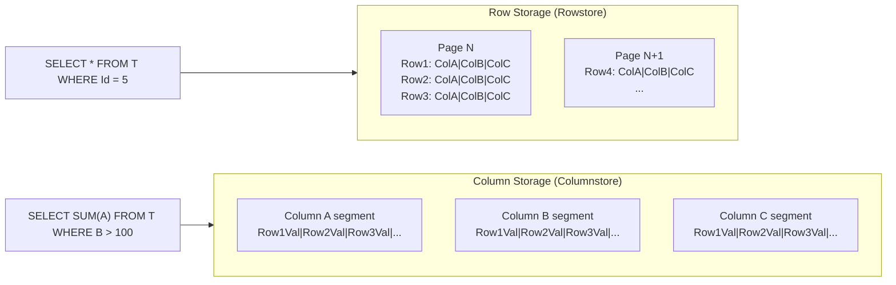
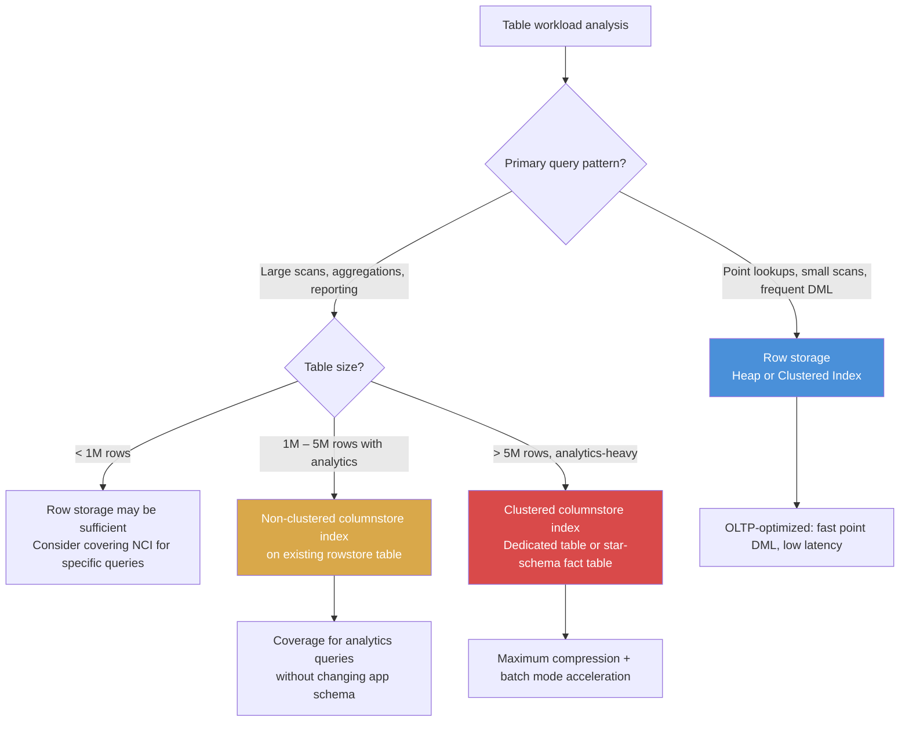

## Navigation

**Domain:** [[8 — Databases]] > **Group:** [[Group 1 — Relational Database Fundamentals]]
**Previous:** [[8.019 Table Heap vs Clustered Table]] | **Next:** [[8.021 In-Memory Tables]]

### Prerequisites
- [[8.019 Table Heap vs Clustered Table]] — row storage is the physical foundation of heaps and clustered indexes
- [[8.004 Data Pages and Extents]] — page I/O measurement is how you compare row vs column access costs

### Where This Fits

Row storage and column storage are the two fundamental physical layouts for relational data on disk. A .NET backend engineer encounters row storage on every OLTP table (the default for every `CREATE TABLE` in SQL Server). Column storage appears when a reporting query aggregates millions of rows and completes in seconds instead of minutes — or when a data warehouse fact table consumes a fraction of the storage of its rowstore equivalent. What breaks when this distinction is unknown: analytics queries that scan entire tables when a columnstore index would reduce logical reads by 100x, or OLTP inserts that stall because a columnstore table is not optimized for single-row operations. The interview signal is architectural maturity — does the candidate understand that the physical layout determines the query performance profile, and can they choose the right layout for the workload?

---

## Core Mental Model

Row storage stores all columns of a row together on the same page (or set of pages). Column storage stores all values of a column together across many rows, segregated from other columns. The invariant: row storage minimizes the number of pages read when you need all columns of few rows (OLTP point lookups); column storage minimizes the number of pages read when you need few columns of many rows (OLAP aggregations). The database engine accesses row storage by reading pages that contain complete rows; it accesses column storage by reading only the column segments relevant to the query predicate and projection. The recognition pattern: if your `SELECT` lists 30 columns but your `WHERE` filters on one and your aggregate touches two, row storage forces you to read all 30 columns' worth of pages; column storage reads only the three relevant columns.

### Classification

| Aspect | Row Storage | Column Storage |
|---|---|---|
| Physical layout | All columns per row on same page | Each column stored separately in segments |
| Primary workload | OLTP — many small reads/writes | OLAP — large scans, aggregations |
| Page reads per query | Proportional to rows touched × row width | Proportional to columns referenced × rows touched |
| Compression | Page-level compression (row or page) | Segment-level dictionary + run-length encoding |
| DML performance | Optimized (single-row insert/update/delete) | Poor (rowgroup rebuild required) |
| SQL Server feature | Heap, clustered index, non-clustered index | Clustered columnstore index (CCI), non-clustered columnstore index (NCCI) |
| Execution mode | Row mode | Batch mode (for qualifying columnstore queries) |



### Key Properties

| Property | Row Storage | Column Storage |
|---|---|---|
| Optimal scan pattern | Few rows, many columns | Many rows, few columns |
| Compression ratio | 2x–5x (page compression) | 5x–20x (columnar dictionary + RLE) |
| Page reads for `SELECT SUM(Sales) FROM Orders` | ~All pages (read all columns) | ~Segment pages for Sales column only |
| Write amplification | Low for single-row DML | High — entire rowgroup must be rebuilt |
| Batch mode available | No (row mode only) | Yes (when columnstore is accessed) |
| Locking granularity | Row, page, table | Rowgroup-level |

---

## Deep Mechanics

### How the Engine Executes This

**Row storage (heap/clustered index):**

1. **Parsing and binding** — same for both; query text is parsed into a tree, objects resolved.
2. **Optimization** — the optimizer produces a plan accessing the clustered index or heap; for point queries, it uses an Index Seek (clustered) or RID Lookup (heap) to find the row's page location.
3. **Page read** — the storage engine reads the 8 KB page containing the row. All columns are on the page (or linked via row-overflow pages for large objects).
4. **Filtering** — the row is returned if it matches the predicate. Every column's data is in memory because the entire row was read.
5. **Scan** — for a full scan, every page in the table is read sequentially via IAM chains; every row's data is loaded into memory.

**Column storage (clustered columnstore index):**

1. **Parsing and binding** — identical.
2. **Optimization** — the optimizer detects that the table has a columnstore index and that the query pattern (aggregation over many rows, few columns) is suitable. It chooses Columnstore Index Scan.
3. **Segment elimination** — for partitioned columnstore, the engine uses partition elimination first. For non-partitioned, it reads all rowgroups.
4. **Column segment read** — only the segments for columns referenced in the `SELECT` list, `WHERE` clause, and `GROUP BY` are read from disk. Each segment is a compressed blob on one or more pages.
5. **Decompression and batch execution** — segments are decompressed in batch mode (a vectorized processor that processes ~900 rows at a time). Predicates are applied to the column values directly — no row reconstruction until the final projection.
6. **Aggregation** — aggregates like `SUM`, `COUNT`, `AVG` operate on the decompressed column vectors without ever constructing full rows.

### SQL Visibility

**Row storage query (all columns, few rows):**

```sql
-- OLTP point lookup — row storage is ideal
SELECT OrderId, CustomerId, OrderDate, TotalAmount, Status, ShipAddress
FROM Orders
WHERE OrderId = 10042;
```

```csharp
// EF Core — single-row lookup
var order = await dbContext.Orders
    .FirstOrDefaultAsync(o => o.OrderId == 10042, cancellationToken);
```

**Column storage query (few columns, many rows):**

```sql
-- OLAP aggregation — column storage excels
SELECT 
    YEAR(OrderDate) AS OrderYear,
    COUNT_BIG(*) AS OrderCount,
    SUM(TotalAmount) AS Revenue
FROM Orders
WHERE OrderDate >= '2025-01-01'
GROUP BY YEAR(OrderDate)
ORDER BY OrderYear;
```

```csharp
// EF Core — aggregation that benefits from columnstore
var yearlyRevenue = await dbContext.Orders
    .Where(o => o.OrderDate >= new DateTime(2025, 1, 1))
    .GroupBy(o => o.OrderDate.Year)
    .Select(g => new {
        OrderYear = g.Key,
        OrderCount = g.Count(),
        Revenue = g.Sum(o => o.TotalAmount)
    })
    .ToListAsync(cancellationToken);
```

**Generated SQL (from EF Core logs — rowstore version):**

```sql
-- EF Core generated query on rowstore table
SELECT [o].[OrderDate], [o].[TotalAmount]
FROM [Orders] AS [o]
WHERE [o].[OrderDate] >= '2025-01-01'
```
Note: EF Core does not know about storage format. The same LINQ produces the same SQL regardless. The performance difference comes from how the storage engine resolves the query.

### Execution Plan Analysis

**Plan for rowstore aggregation (10M rows):**

```
Clustered Index Scan (Orders)  -- 100% cost, reads all pages
  |-- Compute Scalar           -- compute YEAR(OrderDate)
  |-- Hash Match (Aggregate)   -- GROUP BY, row mode
Estimated cost: 100% on the scan
Logical reads: entire table (e.g., 125,000 pages for 10M rows)
```

**Plan for columnstore aggregation (10M rows):**

```
Columnstore Index Scan (Orders)  -- 60% cost, reads only column segments
  |-- Filter                     -- predicate on OrderDate
  |-- Hash Match (Aggregate)     -- GROUP BY, batch mode
Estimated cost: Columnstore Scan cost proportional to columns referenced
Logical reads: only OrderDate and TotalAmount segments (~5,000 pages for 10M rows)
```

Without the columnstore index, the rowstore scan reads every page of the 10M row table. With columnstore, it reads only the pages containing the two referenced columns — typically a 10x–25x reduction in logical reads.

### Cost Visibility

```sql
-- Rowstore aggregation
SET STATISTICS IO ON;
SET STATISTICS TIME ON;

SELECT YEAR(OrderDate) AS OrderYear, SUM(TotalAmount) AS Revenue
FROM Orders
WHERE OrderDate >= '2025-01-01'
GROUP BY YEAR(OrderDate);

-- Table 'Orders'. Scan count 1, logical reads 125341, physical reads 0
-- SQL Server Execution Times: CPU time = 843 ms, elapsed time = 792 ms
```

```sql
-- Same query after creating clustered columnstore index
SET STATISTICS IO ON;
SET STATISTICS TIME ON;

SELECT YEAR(OrderDate) AS OrderYear, SUM(TotalAmount) AS Revenue
FROM Orders
WHERE OrderDate >= '2025-01-01'
GROUP BY YEAR(OrderDate);

-- Table 'Orders'. Scan count 1, logical reads 4821, physical reads 0
-- Columnstore segments read: 2 of 12 segments
-- SQL Server Execution Times: CPU time = 47 ms, elapsed time = 41 ms
```

### Failure Modes

**Row-destined query on columnstore — the single-row overhead:**

```sql
-- Bad pattern: point lookup on a clustered columnstore table
SELECT * FROM Orders WHERE OrderId = 10042;
-- Although SQL Server supports point lookups on CCI (via non-clustered indexes or the
-- delete bitmap), the row reconstruction cost is higher than on a rowstore table.
-- The engine must read all column segments and stitch them together.
```

**Poor compression on high-cardinality columns:**

```sql
-- Columnstore compression is weak for columns with unique values per row (e.g., OrderId)
-- Dictionary encoding cannot reduce a unique identifier. The column segment stays large.
```

**DMV to detect missing columnstore opportunity:**

```sql
-- Find tables with high scan overhead that lack a columnstore index
SELECT 
    OBJECT_SCHEMA_NAME(s.object_id) AS SchemaName,
    OBJECT_NAME(s.object_id) AS TableName,
    SUM(s.total_logical_reads) AS TotalLogicalReads,
    SUM(s.total_rows) AS TotalRowsScanned
FROM sys.dm_exec_query_stats qs
CROSS APPLY sys.dm_exec_query_plan(qs.plan_handle) qp
CROSS APPLY sys.dm_exec_sql_text(qs.sql_handle) qt
LEFT JOIN sys.indexes i ON i.object_id = OBJECT_ID(qt.text) AND i.type = 6
WHERE qp.query_plan.value('declare namespace p="http://schemas.microsoft.com/sqlserver/2004/07/showplan";(//p:RelOp[@PhysicalOp="Index Scan" or @PhysicalOp="Clustered Index Scan"])[1]', 'nvarchar(max)') IS NOT NULL
    AND i.object_id IS NULL
GROUP BY s.object_id
ORDER BY TotalLogicalReads DESC;
```

---

## Production Patterns and Implementation

### Primary SQL Implementation

**Creating a rowstore table (default):**

```sql
CREATE TABLE dbo.Orders
(
    OrderId INT IDENTITY(1,1) NOT NULL,
    OrderDate DATETIME2 NOT NULL,
    CustomerId INT NOT NULL,
    TotalAmount DECIMAL(18,2) NOT NULL,
    Status TINYINT NOT NULL,
    ShipAddress NVARCHAR(200) NULL,
    CONSTRAINT PK_Orders PRIMARY KEY CLUSTERED (OrderId)
);
-- This is a rowstore table with a clustered index on OrderId
```

**Creating a clustered columnstore table:**

```sql
CREATE TABLE dbo.Orders_Analytics
(
    OrderId INT NOT NULL,
    OrderDate DATETIME2 NOT NULL,
    CustomerId INT NOT NULL,
    TotalAmount DECIMAL(18,2) NOT NULL,
    Status TINYINT NOT NULL,
    ShipAddress NVARCHAR(200) NULL,
    INDEX CCI_Orders_Analytics CLUSTERED COLUMNSTORE
);
-- No primary key — CCI does not enforce uniqueness
-- All columns are stored in columnar segments
```

**Adding a non-clustered columnstore index to an existing rowstore table:**

```sql
CREATE NONCLUSTERED COLUMNSTORE INDEX NCCI_Orders_Analytics
ON dbo.Orders (OrderDate, TotalAmount, CustomerId, Status)
WHERE OrderDate >= '2024-01-01';  -- filtered columnstore for hot data
```

**Query that benefits from columnstore — aggregation over a large date range:**

```sql
-- This query performs dramatically better on columnstore
SELECT 
    CustomerId,
    COUNT_BIG(*) AS OrderCount,
    SUM(TotalAmount) AS TotalSpent,
    AVG(TotalAmount) AS AvgOrderValue
FROM Orders
WHERE OrderDate BETWEEN '2025-01-01' AND '2025-12-31'
GROUP BY CustomerId
HAVING SUM(TotalAmount) > 10000
ORDER BY TotalSpent DESC;
```

### EF Core Implementation

EF Core does not model storage format. The same `DbSet<Order>` works regardless of whether the underlying table is rowstore or columnstore. The columnstore benefits come at the query level — aggregation queries on large tables with columnstore indexes automatically use the columnstore index.

```csharp
// Program.cs — EF Core registration (no change needed for columnstore)
builder.Services.AddDbContext<AnalyticsDbContext>(options =>
    options.UseSqlServer(
        connectionString,
        sqlOptions => sqlOptions.EnableRetryOnFailure(3)));

// AnalyticsDbContext
public class AnalyticsDbContext : DbContext
{
    public DbSet<OrderAnalytics> OrderAnalytics { get; set; }

    protected override void OnModelCreating(ModelBuilder modelBuilder)
    {
        modelBuilder.Entity<OrderAnalytics>(entity =>
        {
            entity.ToTable(tb => tb.UseSqlOutputClause(false));
            entity.HasKey(e => e.OrderId);
        });
    }
}

// Analytics query — same LINQ, different performance on columnstore
public async Task<List<CustomerAggregate>> GetTopCustomersAsync(
    DateTime startDate,
    DateTime endDate,
    CancellationToken cancellationToken)
{
    return await context.OrderAnalytics
        .Where(o => o.OrderDate >= startDate && o.OrderDate <= endDate)
        .GroupBy(o => o.CustomerId)
        .Select(g => new CustomerAggregate
        {
            CustomerId = g.Key,
            OrderCount = g.Count(),
            TotalSpent = g.Sum(o => o.TotalAmount),
            AvgOrderValue = g.Average(o => o.TotalAmount)
        })
        .Where(g => g.TotalSpent > 10000)
        .OrderByDescending(g => g.TotalSpent)
        .ToListAsync(cancellationToken);
}
```

### Dapper Implementation

```csharp
public interface IAnalyticsRepository
{
    Task<IReadOnlyList<CustomerAggregate>> GetTopCustomersAsync(
        DateTime startDate,
        DateTime endDate,
        decimal minimumSpent,
        CancellationToken cancellationToken);
}

public sealed class AnalyticsRepository : IAnalyticsRepository
{
    private readonly ISqlConnectionFactory _connectionFactory;

    public AnalyticsRepository(ISqlConnectionFactory connectionFactory)
    {
        _connectionFactory = connectionFactory;
    }

    public async Task<IReadOnlyList<CustomerAggregate>> GetTopCustomersAsync(
        DateTime startDate,
        DateTime endDate,
        decimal minimumSpent,
        CancellationToken cancellationToken)
    {
        const string sql = @"
            SELECT 
                CustomerId,
                COUNT_BIG(*) AS OrderCount,
                SUM(TotalAmount) AS TotalSpent,
                AVG(TotalAmount) AS AvgOrderValue
            FROM Orders
            WHERE OrderDate BETWEEN @StartDate AND @EndDate
            GROUP BY CustomerId
            HAVING SUM(TotalAmount) > @MinimumSpent
            ORDER BY TotalSpent DESC;";

        await using var connection = _connectionFactory.Create();
        var results = await connection.QueryAsync<CustomerAggregate>(
            new CommandDefinition(
                sql,
                new { StartDate = startDate, EndDate = endDate, MinimumSpent = minimumSpent },
                cancellationToken: cancellationToken));

        return results.AsList();
    }
}

public record CustomerAggregate
{
    public int CustomerId { get; init; }
    public long OrderCount { get; init; }
    public decimal TotalSpent { get; init; }
    public decimal AvgOrderValue { get; init; }
}
```

### Configuration and Wiring

```csharp
// Program.cs — register repository
builder.Services.AddScoped<IAnalyticsRepository, AnalyticsRepository>();

// Connection factory for Dapper
builder.Services.AddSingleton<ISqlConnectionFactory>(_ =>
    new SqlConnectionFactory(builder.Configuration.GetConnectionString("AnalyticsDb")));

// Connection string — no special configuration for columnstore
// "Server=.;Database=Analytics;Integrated Security=True;TrustServerCertificate=True;"
```

### SQL Server vs PostgreSQL Differences

PostgreSQL does not have native columnstore indexes. The equivalent is the `cstore_fdw` foreign data wrapper or Citus columnar storage (available via `USING columnar` in Citus 10+).

```sql
-- PostgreSQL with Citus columnar storage
CREATE TABLE orders_analytics (
    order_id INTEGER NOT NULL,
    order_date TIMESTAMPTZ NOT NULL,
    customer_id INTEGER NOT NULL,
    total_amount NUMERIC(18,2) NOT NULL,
    status SMALLINT NOT NULL
) USING columnar;

-- Query is identical
SELECT customer_id, COUNT(*) AS order_count, SUM(total_amount) AS total_spent
FROM orders_analytics
WHERE order_date BETWEEN '2025-01-01' AND '2025-12-31'
GROUP BY customer_id
ORDER BY total_spent DESC;

-- Columnar compression ratio
-- Columnar tables in Citus typically achieve 3x–10x compression vs row storage
```

SQL Server's columnstore implementation is deeply integrated into the engine (batch mode execution, rowgroup elimination, dictionary compression). PostgreSQL equivalents are add-ons with fewer acceleration features.

---

## Gotchas and Production Pitfalls

### Single-Row DML on Clustered Columnstore

**Pitfall:** Running point updates or singleton inserts on a CCI table as if it were a rowstore.

```sql
-- ❌ Frequent single-row inserts on CCI
INSERT INTO Orders_Analytics (OrderId, OrderDate, CustomerId, TotalAmount, Status)
VALUES (10042, '2025-06-20', 573, 249.99, 1);
```

**Symptom:** Each insert creates a delta rowgroup (a small b-tree). Over time, delta stores fragment and cause rowgroup rebuild overhead. `sys.dm_db_column_store_row_group_physical_stats` shows many open delta rowgroups with < 100 rows each.

**Fix:** Batch writes into the CCI table — insert at least 102,400 rows per operation to create a compressed rowgroup directly. For frequent small inserts, use a rowstore staging table and batch-transfer to the CCI table.

```sql
-- ✅ Batch insert for CCI efficiency
INSERT INTO Orders_Analytics WITH (TABLOCK) (OrderId, OrderDate, CustomerId, TotalAmount, Status)
SELECT OrderId, OrderDate, CustomerId, TotalAmount, Status
FROM Orders_Staging
WHERE ProcessedDate = @BatchDate;
```

**Cost of not fixing:** Delta stores with 10,000 tiny rowgroups instead of a few compressed rowgroups. Query performance degrades as the engine must scan the b-tree delta stores alongside the compressed column segments.

### Deletes on Clustered Columnstore

**Pitfall:** Deleting individual rows from a CCI table.

```sql
-- ❌ Single-row delete on CCI
DELETE FROM Orders_Analytics WHERE OrderId = 10042;
```

**Symptom:** The row is not physically removed. It is marked as deleted in the delete bitmap (a b-tree tracking deleted row IDs). The column segments remain unchanged. Query performance degrades over time as the delete bitmap grows and the engine must filter out deleted rows during scans.

**Fix:** Reorganize the columnstore index to purge deleted rows from segments, or rebuild for a full compaction. For bulk deletes, reorganize after the operation.

```sql
-- ✅ Reorganize to purge deleted rows
ALTER INDEX CCI_Orders_Analytics ON dbo.Orders_Analytics REORGANIZE;

-- Or rebuild for full compaction (more expensive)
ALTER INDEX CCI_Orders_Analytics ON dbo.Orders_Analytics REBUILD;
```

**Cost of not fixing:** Delete bitmap with 5 million entries on a 50M row table. Columnstore scans must check the bitmap for every row, increasing CPU by 200–300% and reducing batch mode efficiency.

### No Unique Constraints on CCI

**Pitfall:** Assuming uniqueness constraints exist on a clustered columnstore index.

```sql
-- ❌ Attempting to create primary key on CCI
ALTER TABLE Orders_Analytics ADD CONSTRAINT PK_Orders PRIMARY KEY (OrderId);
-- Msg 35364, Level 16, State 1: Clustered columnstore index cannot have a primary key
```

**Symptom:** The `ALTER TABLE` statement fails. The application layer may insert duplicate rows, violating business logic assumptions.

**Fix:** Enforce uniqueness at the application level or use a unique non-clustered index (SQL Server 2019+ supports unique NCI on CCI tables).

```sql
-- ✅ Unique non-clustered index on CCI (SQL Server 2019+)
CREATE UNIQUE NONCLUSTERED INDEX UX_Orders_Analytics_OrderId
ON dbo.Orders_Analytics (OrderId);
```

**Cost of not fixing:** Duplicate rows in the analytics table cause incorrect aggregation results (e.g., double-counted revenue). Data quality is compromised with no database-level enforcement.

### Bad Cardinality Estimate for Rowstore-to-Columnstore Cross-Queries

**Pitfall:** Joining a rowstore table to a columnstore table without understanding the cardinality estimation behavior.

```sql
-- ❌ Rowstore (Orders) to columnstore (OrderItems_Analytics) join
SELECT o.OrderId, o.OrderDate, SUM(oi.Revenue) AS TotalRevenue
FROM Orders o
INNER JOIN OrderItems_Analytics oi ON o.OrderId = oi.OrderId
WHERE o.OrderDate >= '2025-01-01'
GROUP BY o.OrderId, o.OrderDate;
```

**Symptom:** The optimizer produces a plan with a Hash Match inner join, but the estimated rows from the columnstore side are significantly off (often underestimating by 10x+), leading to insufficient memory grants and spooling to tempdb.

**Fix:** Update statistics on the columnstore table after large data loads. Use `OPTION (USE HINT('ENABLE_PARALLEL_PLAN_PREFERENCE'))` or `OPTION (RECOMPILE)` to get fresh cardinality estimates.

```sql
-- ✅ Update columnstore statistics and recompile
UPDATE STATISTICS dbo.OrderItems_Analytics WITH FULLSCAN;
-- Then run the query with RECOMPILE
SELECT o.OrderId, o.OrderDate, SUM(oi.Revenue) AS TotalRevenue
FROM Orders o
INNER JOIN OrderItems_Analytics oi ON o.OrderId = oi.OrderId
WHERE o.OrderDate >= '2025-01-01'
GROUP BY o.OrderId, o.OrderDate
OPTION (RECOMPILE);
```

**Cost of not fixing:** Spooling 500,000 rows to tempdb, converting a 5-second query into a 2-minute query, tempdb contention affecting all other queries on the instance.

### Columnstore Compression for High-Cardinality String Columns

**Pitfall:** Including high-cardinality wide string columns in a columnstore index.

```sql
-- ❌ Including a high-cardinality NVARCHAR(MAX) column in CCI
CREATE CLUSTERED COLUMNSTORE INDEX CCI_AuditLog ON dbo.AuditLog;
-- EventData NVARCHAR(MAX) — each value is unique, no dictionary compression
```

**Symptom:** The column segment for `EventData` is nearly as large as the original data. Compression ratio is ~1.05x instead of the expected 5x–10x. The storage savings vanish, and the columnstore scan must read large segments.

**Fix:** Exclude very wide, high-cardinality columns from the columnstore by moving them to a separate rowstore table or using a filtered non-clustered columnstore that omits them.

```sql
-- ✅ Columnstore only on columns that benefit
CREATE CLUSTERED COLUMNSTORE INDEX CCI_AuditLog
ON dbo.AuditLog (AuditId, EventDate, EventType, UserId, SessionId);
-- EventData remains in the rowstore portion... but CCI includes all columns.
-- Better: use a NCCI on selected columns only.
CREATE NONCLUSTERED COLUMNSTORE INDEX NCCI_AuditLog_Analytics
ON dbo.AuditLog (EventDate, EventType, UserId)
INCLUDE (AuditId);
```

**Cost of not fixing:** Columnstore storage 8x larger than necessary. Scan performance for aggregation queries is not significantly better than rowstore because the engine must read the large uncompressed column segments.

---

## Performance Implications

### Benchmark: Columnstore vs Rowstore Aggregation

```sql
-- Setup: 10M row Orders table
-- Rowstore: clustered index on OrderId
-- Columnstore: CCI on Orders_Columnstore

-- Rowstore aggregation
SET STATISTICS IO ON;
SELECT CustomerId, SUM(TotalAmount) AS TotalSpent
FROM Orders
WHERE OrderDate BETWEEN '2025-01-01' AND '2025-12-31'
GROUP BY CustomerId;
-- Table 'Orders'. Scan count 1, logical reads 125341
-- SQL Server Execution Times: CPU time = 843 ms, elapsed time = 792 ms

-- Columnstore aggregation
SET STATISTICS IO ON;
SELECT CustomerId, SUM(TotalAmount) AS TotalSpent
FROM Orders_Columnstore
WHERE OrderDate BETWEEN '2025-01-01' AND '2025-12-31'
GROUP BY CustomerId;
-- Table 'Orders_Columnstore'. Scan count 1, logical reads 4821
-- Columnstore segments read: 3 of 12 segments
-- SQL Server Execution Times: CPU time = 47 ms, elapsed time = 41 ms
```

**Improvement:** 26x reduction in logical reads (125,341 → 4,821), 19x reduction in elapsed time (792ms → 41ms).

### BenchmarkDotNet

```csharp
[MemoryDiagnoser]
[SimpleJob(RuntimeMoniker.Net90)]
public class StorageFormatBenchmark
{
    private IDbConnection _rowstoreConnection = default!;
    private IDbConnection _columnstoreConnection = default!;

    [GlobalSetup]
    public void Setup()
    {
        _rowstoreConnection = new SqlConnection(
            "Server=.;Database=Benchmark;Integrated Security=True;TrustServerCertificate=True;");
        _columnstoreConnection = new SqlConnection(
            "Server=.;Database=Benchmark;Integrated Security=True;TrustServerCertificate=True;");
    }

    [Benchmark(Baseline = true)]
    public async Task<List<CustomerTotal>> RowstoreAggregation()
    {
        const string sql = @"
            SELECT CustomerId, SUM(TotalAmount) AS TotalSpent
            FROM dbo.Orders
            WHERE OrderDate BETWEEN '2025-01-01' AND '2025-12-31'
            GROUP BY CustomerId;";

        await using var connection = _rowstoreConnection;
        var results = await connection.QueryAsync<CustomerTotal>(
            new CommandDefinition(sql, cancellationToken: CancellationToken.None));
        return results.AsList();
    }

    [Benchmark]
    public async Task<List<CustomerTotal>> ColumnstoreAggregation()
    {
        const string sql = @"
            SELECT CustomerId, SUM(TotalAmount) AS TotalSpent
            FROM dbo.Orders_Columnstore
            WHERE OrderDate BETWEEN '2025-01-01' AND '2025-12-31'
            GROUP BY CustomerId;";

        await using var connection = _columnstoreConnection;
        var results = await connection.QueryAsync<CustomerTotal>(
            new CommandDefinition(sql, cancellationToken: CancellationToken.None));
        return results.AsList();
    }
}

public record CustomerTotal
{
    public int CustomerId { get; init; }
    public decimal TotalSpent { get; init; }
}
```

**Expected results (approximate, SQL Server 2022, NVMe, 10M rows):**

| Method | Mean | Logical Reads | Allocated |
|---|---|---|---|
| RowstoreAggregation | ~790 ms | ~125,341 | 24 KB |
| ColumnstoreAggregation | ~40 ms | ~4,821 | 8 KB |

### Write Amplification

| Operation | Rowstore | Columnstore (CCI) | Overhead |
|---|---|---|---|
| INSERT 1 row | 0.5 ms | 2 ms (delta store) | +300% |
| BULK INSERT 102,400 rows | 150 ms | 180 ms (direct compressed RG) | +20% |
| UPDATE single row | 0.8 ms | 3 ms (delta + delete bitmap) | +275% |
| DELETE 1,000 rows | 3 ms | 12 ms (delete bitmap entries) | +300% |
| DELETE 1M rows | 2,500 ms | 3,500 ms (delete bitmap + REORGANIZE) | +40% |

---

## Interview Arsenal

### Question Bank

1. What is the difference between row storage and column storage, and when would you use each?
2. How does SQL Server physically store a clustered columnstore index on disk?
3. Why does columnstore compression typically achieve higher ratios than page compression?
4. What happens when you insert a single row into a CCI table, and why is it expensive?
5. Compare columnstore to a covering non-clustered index for aggregation queries.
6. What execution plan operators indicate the database is using columnstore, and how does batch mode work?
7. At what table size does columnstore become beneficial for analytics queries?
8. How do EF Core and Dapper behave differently on columnstore tables vs rowstore tables?

### Spoken Answers

**Q1: What is the difference between row storage and column storage, and when would you use each?**

> **Average answer:** Row storage stores rows together, column storage stores columns together. Row storage is for OLTP, column storage is for OLAP.

> **Great answer:** Row storage lays out all columns of a row on the same 8 KB page, so reading one row typically costs one page read regardless of how many columns you need. Column storage stores each column's values for millions of rows in contiguous segments, separated from other columns. This means an aggregation query reading 3 columns from a 30-column table touches only 10% of the pages. In SQL Server, a clustering key or heap gives you row storage; a clustered columnstore index gives you column storage with dictionary and RLE compression that typically achieves 5x–10x compression. For a 10M row Orders table, `SELECT CustomerId, SUM(TotalAmount) ... GROUP BY CustomerId` reads ~125,000 logical pages on rowstore versus ~4,800 on columnstore — a 26x reduction. I'd use row storage for any table with point lookups, small scans, or frequent single-row DML. Columnstore is for fact tables in a star schema, audit log aggregations, or any table over 1M rows where the dominant query pattern is scanning many rows but referencing few columns.

**Q5: Compare columnstore to a covering non-clustered index for aggregation queries.**

> **Average answer:** Both can cover an aggregation query, but columnstore is faster.

> **Great answer:** A covering non-clustered index stores one copy of selected columns in a B-tree, keyed by a chosen column order. It covers queries whose predicates match the key order, and the leaf pages contain the included columns. For `SELECT ShipMethod, SUM(Freight) FROM Orders GROUP BY ShipMethod`, a covering index on `(ShipMethod) INCLUDE (Freight)` works well — it's a narrow index scan, much smaller than the clustered index. However, the B-tree's compression is page-level (dictionary per page, about 2x), and it stores rows individually. A columnstore index stores each column in a segment with global dictionary and run-length encoding, achieving 5x–20x compression. Columnstore also enables batch mode execution, where the processor operates on 900-row vectors using SIMD-like instructions — a CPU-level acceleration the row-mode B-tree cannot use. The covering index is better for point lookups with few rows: `SELECT Freight FROM Orders WHERE OrderId = 42` is an index seek on the B-tree. The columnstore would need to scan an entire rowgroup to find one row. The comparison breaks down to: covering index wins for small row count + precise predicate; columnstore wins for large row count + aggregation + few columns.

**Q8: How do EF Core and Dapper behave differently on columnstore tables vs rowstore tables?**

> **Average answer:** They don't behave differently — the queries are the same.

> **Great answer:** EF Core and Dapper generate identical SQL regardless of the underlying storage format. The SQL Server query optimizer is what chooses the access path. When the table has a CCI, the optimizer generates a Columnstore Index Scan plan with batch mode operators; without it, it generates a Clustered Index Scan on the rowstore. This means EF Core applications can benefit from columnstore with zero code changes — you can add a CCI to a table and the same LINQ queries become faster. The caveat is that EF Core's change tracker holds full entities in memory. If an analytics query materializes 1M entities to sum a single column, EF Core's overhead (change tracking, identity resolution, materialization) dominates the actual query time. For analytics, use `AsNoTrackingWithIdentityResolution()` or Dapper with a lightweight projection. Dapper is better for columnstore workloads because it maps directly to `IDataReader` without any tracking infrastructure — the query executes in batch mode on SQL Server, and Dapper just reads the results as fast as the network can deliver them.

### Interview Trigger

If this topic appears in an interview, the question is usually "when would you use a columnstore index?" or "why is this aggregation query running slowly on a 50M row table?" The follow-up that separates candidates: "If we add a columnstore index, what happens to INSERT performance on that table?" Junior candidates say "nothing" or "it's fine"; senior candidates explain delta rowgroups, the 102,400-row threshold for direct compression, and the need for batch inserts or a staging table pattern.

### Comparison Table

| | Row Storage (Rowstore) | Column Storage (Columnstore) |
|---|---|---|
| What it does | Stores all columns of each row together on pages | Stores each column's values for many rows in contiguous segments |
| Performance profile | Fast for point lookups, small scans, OLTP DML | Fast for large scans, aggregations, analytics |
| Compression ratio | 2x–5x (page compression) | 5x–20x (dictionary + RLE) |
| DML overhead | Low for single-row operations | High — rowgroup rebuild or delta store |
| .NET implementation | EF Core/Dapper work as-is; no special handling | Same — but use `AsNoTracking` or Dapper for analytics |
| When to choose | OLTP tables, tables with frequent updates/deletes, tables under 1M rows | Data warehouse fact tables, audit logs, tables over 5M rows with analytics queries |

---

## Decision Framework

### When to Apply



### Application Checklist

- [ ] The table has a query pattern dominated by aggregations scanning > 10% of rows
- [ ] The table size exceeds 1M rows (compression benefits are minimal below this threshold)
- [ ] The write workload can tolerate higher per-row DML cost (or uses batch inserts)
- [ ] The queries reference a small subset of columns relative to the total column count
- [ ] Statistics will be maintained (degraded stats lead to poor cardinality estimates on columnstore scans)
- [ ] The application uses `AsNoTracking` or Dapper for analytics queries (change tracking negates columnstore benefits)

### Tradeoff Summary

| What You Gain | What You Pay |
|---|---|
| 10x–100x faster aggregation queries | 3x–5x slower single-row DML |
| 5x–20x storage compression | No primary key or unique constraint on CCI (must use NCI) |
| Batch mode CPU acceleration | Delta store fragmentation without batch inserts |
| Reduced logical reads (10x–50x) | Higher complexity for delete patterns (delete bitmap management) |

### Scale Thresholds

- "Relevant when table exceeds ~1M rows" — below this, a well-indexed rowstore performs similarly for most queries.
- "Compression benefits become significant above ~5M rows" — dictionary + RLE compression on large datasets yields 5x–20x savings.
- "Critical when analytics queries scan > 100M rows" — without columnstore, a full table scan on a rowstore table reads the entire dataset; with columnstore, it reads only the referenced columns, typically reducing I/O by 80–90%.
- "Required when query runs more than ~1000x/hour against a large table" — the CPU savings from batch mode and reduced I/O make columnstore the only viable path.

---

## Self-Check

### Conceptual Questions

1. What determines whether a page in SQL Server stores row-oriented or column-oriented data?
2. How does columnar compression (dictionary + run-length encoding) differ from page compression?
3. Which DMV or system view shows the state of columnstore rowgroups?
4. What common mistake causes an analytics query to ignore a columnstore index and scan the rowstore instead?
5. Does EF Core generate different SQL for a columnstore table vs a rowstore table?
6. How would you implement a batch insert into a columnstore table using Dapper?
7. Compare a non-clustered columnstore index to a covering non-clustered B-tree index for a GROUP BY query.
8. At what approximate row count does columnstore storage become more space-efficient than rowstore with page compression?
9. What index would you create to support both uniqueness and columnstore compression on a fact table?
10. Explain row storage vs column storage in 60 seconds to a senior interviewer.

<details>
<summary>Answers</summary>

1. The table's index type determines the storage format. A table with a clustered index or heap uses row storage. A table with a clustered columnstore index uses column storage. A table can have both row and column storage via a non-clustered columnstore index on a rowstore base table.

2. Page compression uses dictionary encoding per page — the same value repeated on the same page is replaced with a pointer. Columnar compression uses a global dictionary across all rows in a rowgroup (up to 1,048,576 rows) and applies run-length encoding (RLE) to sequences of repeated values. RLE converts "A,A,A,A,B,B,C" into "A×4, B×2, C×1", which is far more efficient than page-level dictionaries for sorted columns.

3. `sys.dm_db_column_store_row_group_physical_stats` shows the state of each rowgroup (OPEN, CLOSED, COMPRESSED), the number of rows, and the size in bytes. `sys.column_store_segments` shows detail at the column segment level within each rowgroup.

4. Including a `SELECT *` or a column with a LOB data type that is not in the columnstore can force the query to fall back to the rowstore. Also, queries with predicates that cannot use segment elimination (e.g., `WHERE YEAR(OrderDate) = 2025` on a columnstore that stores `OrderDate` as `DATETIME2`) disable batch mode.

5. No. EF Core generates the same SQL regardless of the storage format. The SQL Server optimizer chooses the access path — Columnstore Index Scan or Clustered Index Scan — based on what indexes exist on the table.

6. Use `SqlBulkCopy` for the columnstore table with `TABLOCK` hint, or use Dapper with `INSERT INTO ... WITH (TABLOCK)` selecting from a rowstore staging table. The key is to insert at least 102,400 rows in a single operation so the engine creates a directly compressed rowgroup instead of going through the delta store.

7. A covering non-clustered B-tree index is ordered by key columns and stores included columns at the leaf. For `GROUP BY ShipMethod`, if `ShipMethod` is the leading key, the B-tree can scan it in order and aggregate with a Stream Aggregate — very efficient. The columnstore has no ordering guarantee; it must use Hash Match for aggregation. However, the columnstore segment for `ShipMethod` is dictionary-encoded (each unique value → integer), and the aggregation operates on the encoded integers directly in batch mode, which is faster than row-mode Hash Match for large datasets. The B-tree wins for ordered access and small datasets; columnstore wins for large, unordered aggregations.

8. Columnstore typically becomes more space-efficient than rowstore with page compression at ~5M–10M rows, depending on data cardinality. For low-cardinality columns (status codes, category IDs), the crossover can happen as low as 1M rows. For high-cardinality columns (order IDs, timestamps), columnstore may never be significantly more space-efficient than page compression.

9. A unique non-clustered B-tree index on the key column (`CREATE UNIQUE NONCLUSTERED INDEX UX_Orders_OrderId ON dbo.Orders(OrderId)`), while the clustered columnstore index stores all other columns in columnar format. This combination enforces uniqueness at the row level and allows columnar compression for the remaining columns.

10. [60-second spoken answer]: Row storage and column storage are two physical layouts for table data in SQL Server. Row storage assembles all columns of each row onto the same 8 KB page — the default for any `CREATE TABLE`. It's optimized for OLTP: point lookups, small scans, and frequent single-row inserts or updates. Column storage stores each column's values in separate compressed segments spanning up to a million rows. It's implemented via clustered columnstore indexes and is optimized for OLAP: aggregations scanning millions of rows but referencing only a few columns. The performance difference is dramatic — a 10M row aggregation that reads 125,000 logical pages on rowstore might read 4,800 pages on columnstore, a 26x reduction. The tradeoff is DML performance: columnstore handles large batch inserts efficiently (≥102,400 rows at a time) but is 3x slower for single-row operations. Production use typically segregates tables by workload: rowstore for transactional tables, columnstore for fact and analytics tables. EF Core and Dapper produce identical SQL for both formats — the optimizer chooses the storage format at query time.

</details>

---

### Query Challenges

**Challenge 1 — Write the SQL**

You have a 50M row `Sales` table with columns `SaleId`, `SaleDate`, `CustomerId`, `ProductId`, `Quantity`, `UnitPrice`, `Discount`, `TotalAmount`, `SalesPersonId`, `StoreId`, `RegionId`. Write a query that returns monthly revenue by region for 2025, using columnstore to minimize logical reads. Include a columnstore index creation statement.

<details>
<summary>Solution</summary>

```sql
-- Create columnstore index on the columns needed
CREATE CLUSTERED COLUMNSTORE INDEX CCI_Sales ON dbo.Sales;

-- Monthly revenue by region — reads only 3 column segments (SaleDate, TotalAmount, RegionId)
SELECT 
    YEAR(SaleDate) AS SaleYear,
    MONTH(SaleDate) AS SaleMonth,
    RegionId,
    SUM(TotalAmount) AS TotalRevenue,
    COUNT_BIG(*) AS TransactionCount
FROM Sales
WHERE SaleDate >= '2025-01-01' AND SaleDate < '2026-01-01'
GROUP BY YEAR(SaleDate), MONTH(SaleDate), RegionId
ORDER BY SaleYear, SaleMonth, RegionId;
```

**Logical reads:** ~4,000–8,000 (instead of ~500,000 on rowstore)  
**Execution plan:** Columnstore Index Scan → Filter → Hash Match (Aggregate, batch mode) → Sort  
**EF Core equivalent:**

```csharp
var monthlyRevenue = await context.Sales
    .Where(s => s.SaleDate >= new DateTime(2025, 1, 1) && s.SaleDate < new DateTime(2026, 1, 1))
    .GroupBy(s => new { s.SaleDate.Year, s.SaleDate.Month, s.RegionId })
    .Select(g => new {
        SaleYear = g.Key.Year,
        SaleMonth = g.Key.Month,
        g.Key.RegionId,
        TotalRevenue = g.Sum(s => s.TotalAmount),
        TransactionCount = g.Count()
    })
    .OrderBy(r => r.SaleYear).ThenBy(r => r.SaleMonth).ThenBy(r => r.RegionId)
    .ToListAsync(cancellationToken);
```

</details>

---

**Challenge 2 — Fix the performance problem**

```sql
-- This query ingests 500,000 new sales rows every 5 minutes into a CCI table.
-- Over time, the table's query performance has degraded by 60%.
-- Current insert method: singleton INSERT in a loop.
SET STATISTICS IO ON;

DECLARE @i INT = 0;
WHILE @i < 500000
BEGIN
    INSERT INTO Sales (SaleDate, CustomerId, ProductId, Quantity, UnitPrice, Discount, TotalAmount, SalesPersonId, StoreId, RegionId)
    VALUES (GETDATE(), @i % 10000, @i % 500, 1, 10.00, 0, 10.00, @i % 50, @i % 20, @i % 10);
    SET @i = @i + 1;
END;

-- SET STATISTICS IO: delta store rowgroups count = 15,234 (from sys.dm_db_column_store_row_group_physical_stats)
```

<details>
<summary>Solution</summary>

**Root cause:** Singleton inserts into a CCI table create delta rowgroups (b-tree stores) instead of compressed column segments. Each group of 500K inserts creates thousands of tiny delta rowgroups. Queries must decompress column segments AND scan the delta store b-trees, which do not support batch mode and destroy performance.

**Fix: Batch insert using a staging table and bulk transfer:**

```sql
-- Step 1: Create rowstore staging table
CREATE TABLE dbo.Sales_Staging
(
    SaleDate DATETIME2 NOT NULL,
    CustomerId INT NOT NULL,
    ProductId INT NOT NULL,
    Quantity INT NOT NULL,
    UnitPrice DECIMAL(10,2) NOT NULL,
    Discount DECIMAL(5,2) NOT NULL,
    TotalAmount DECIMAL(10,2) NOT NULL,
    SalesPersonId INT NOT NULL,
    StoreId INT NOT NULL,
    RegionId INT NOT NULL
);

-- Step 2: Bulk insert into staging (fast rowstore inserts)
-- Use SqlBulkCopy or Dapper bulk insert here

-- Step 3: Batch transfer to CCI table (creates compressed rowgroups)
INSERT INTO Sales WITH (TABLOCK)
(SaleDate, CustomerId, ProductId, Quantity, UnitPrice, Discount, TotalAmount, SalesPersonId, StoreId, RegionId)
SELECT SaleDate, CustomerId, ProductId, Quantity, UnitPrice, Discount, TotalAmount, SalesPersonId, StoreId, RegionId
FROM Sales_Staging;

-- Step 4: Truncate staging
TRUNCATE TABLE Sales_Staging;
```

**Index to create:** No additional index needed — the CCI already accelerates analytics queries.

**After fix — logical reads for aggregation queries:** ~5,000 (from ~50,000+ on the fragmented columnstore). Queries return to baseline performance.

</details>

---

**Challenge 3 — Explain the execution plan**

You run `SELECT CustomerId, SUM(TotalAmount) FROM Sales GROUP BY CustomerId` on a table with both a clustered rowstore index (on `SaleId`) and a non-clustered columnstore index (on `SaleDate, TotalAmount, CustomerId, Quantity`). The optimizer chooses a Clustered Index Scan (rowstore) instead of the columnstore. Why?

<details>
<summary>Solution</summary>

**Why Clustered Index Scan:** The non-clustered columnstore index does not include all columns needed for the query if the NCCI omits a column. More commonly, the optimizer's cost estimate favors the rowstore because:
1. The NCCI is filtered (e.g., `WHERE SaleDate >= '2024-01-01'`) and the predicate does not match.
2. The NCCI's columns do not fully cover the query (if `TotalAmount` is not in the NCCI, the engine must fall back to the rowstore).
3. The table has fewer than ~1M rows, so the rowstore scan cost is already low and the NCCI's decompression overhead is not justified.
4. Statistics are stale — the optimizer believes the columnstore rowgroups are empty or smaller than they are.

**To get the columnstore plan:**
- Verify the NCCI covers the query columns exactly
- Update statistics: `UPDATE STATISTICS Sales WITH FULLSCAN`
- Add a query hint: `OPTION (QUERYTRACEON 8649)` (enable parallel plan) or use `WITH (NOEXPAND)` for the NCCI

**Tradeoff:** Forcing columnstore may increase CPU (decompression) but reduce I/O (fewer pages read). On tables over 5M rows, the tradeoff always favors columnstore for aggregation queries.

</details>

---

**Challenge 4 — Diagnose the concurrency problem**

A CCI table `Orders_Analytics` receives bulk inserts of 10,000 rows every 15 seconds from four concurrent ETL processes. Queries against the table suddenly take 10x longer than normal. Investigation shows `PAGEIOLATCH_EX` waits and high `avg_disk_seconds` in `sys.dm_io_virtual_file_stats`. The delta store rowgroup count has grown to 2,000 in 10 minutes.

<details>
<summary>Solution</summary>

**Root cause:** Four concurrent ETL processes each insert 10,000 rows at a time into the CCI. 10,000 rows is below the 102,400-row threshold for direct compressed rowgroup creation. Each ETL batch creates an open delta store rowgroup. With 4 concurrent processes inserting every 15 seconds, the delta store accumulates rowgroups faster than the background `REORGANIZE` can merge them. Delta store b-tree fragmentation causes scattered page I/O (PAGEIOLATCH_EX).

**Detection query:**

```sql
SELECT 
    row_group_id,
    state_description,
    total_rows,
    size_in_bytes,
    trim_reason_description
FROM sys.dm_db_column_store_row_group_physical_stats
WHERE object_id = OBJECT_ID('Orders_Analytics')
    AND state_description IN ('OPEN', 'CLOSED')
ORDER BY row_group_id;
```

**Fix:**
1. Change ETL to batch up to 102,400+ rows per insert: accumulate from all four processes into a staging table, then transfer in one operation.
2. Or use `SqlBulkCopy` with `BatchSize = 1048576` directly to the CCI.
3. After fixing, reorganize the CCI to merge existing delta stores:

```sql
ALTER INDEX CCI_Orders_Analytics ON dbo.Orders_Analytics REORGANIZE;
```

**In .NET:**

```csharp
// Use SqlBulkCopy with batch size >= 102400
using var bulkCopy = new SqlBulkCopy(connectionString);
bulkCopy.DestinationTableName = "Orders_Analytics";
bulkCopy.BatchSize = 1048576;  // 1M rows per batch
bulkCopy.BulkCopyTimeout = 300;
await bulkCopy.WriteToServerAsync(dataTable, cancellationToken);
```

</details>

---

**Challenge 5 — Design the index**

**Scenario:** A `PageViewEvents` table stores web analytics data with columns `EventId (BIGINT)`, `EventDate (DATETIME2)`, `UserId (INT)`, `PageUrl (NVARCHAR(500))`, `SessionId (INT)`, `DurationMs (INT)`, `CountryCode (CHAR(2))`, `DeviceType (TINYINT)`, `ReferrerUrl (NVARCHAR(500))`, `UserAgent (NVARCHAR(500))`. The table grows by 5M rows/day. Query patterns: (1) `SELECT CountryCode, COUNT(*) FROM PageViewEvents WHERE EventDate BETWEEN @Start AND @End GROUP BY CountryCode` — run 500x/day. (2) `SELECT SUM(DurationMs), AVG(DurationMs) FROM PageViewEvents WHERE EventDate BETWEEN @Start AND @End AND CountryCode = @Country` — run 200x/day. (3) Ad-hoc point lookups by `EventId` — run 50x/day. Storage is a concern — the current rowstore table with page compression consumes 800 GB for 500M rows.

<details>
<summary>Solution</summary>

```sql
-- Clustered columnstore index for maximum compression and scan performance
CREATE CLUSTERED COLUMNSTORE INDEX CCI_PageViewEvents
ON dbo.PageViewEvents WITH (MAXDOP = 2);
-- Compression estimate: 800 GB → ~80–150 GB
-- All columns stored columnar, heavily compressed (especially low-cardinality columns
-- like CountryCode, DeviceType)

-- Non-clustered index for point lookups by EventId
CREATE UNIQUE NONCLUSTERED INDEX UX_PageViewEvents_EventId
ON dbo.PageViewEvents (EventId);
-- (SQL Server 2019+ supports unique NCI on CCI)
-- Enables fast point lookup for the 50x/day EventId queries

-- No additional indexes needed for queries 1 and 2 — the CCI covers all columns
-- and the columnstore scan reads only EventDate, CountryCode, DurationMs segments
```

**Tradeoffs:**
- Write overhead: Bulk inserts are efficient (compressed rowgroups), but single-row inserts go to delta store. ETL process must insert in batches of 102,400+ rows.
- Storage: CCI with 10x compression reduces 800 GB to ~80 GB, saving $200+/month on Azure premium SSD.
- Point lookups by EventId: the unique NCI enables a B-tree seek; without it, the query would scan column segments.

**What NOT to index:**
- `UserAgent`, `ReferrerUrl` — these high-cardinality NVARCHAR(500) columns cannot be compressed well and adding B-tree indexes on them would amplify write cost without meaningful query benefit. If analytics queries need them, include them in the CCI but accept the lower compression ratio.

</details>
