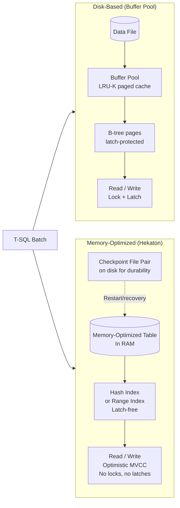
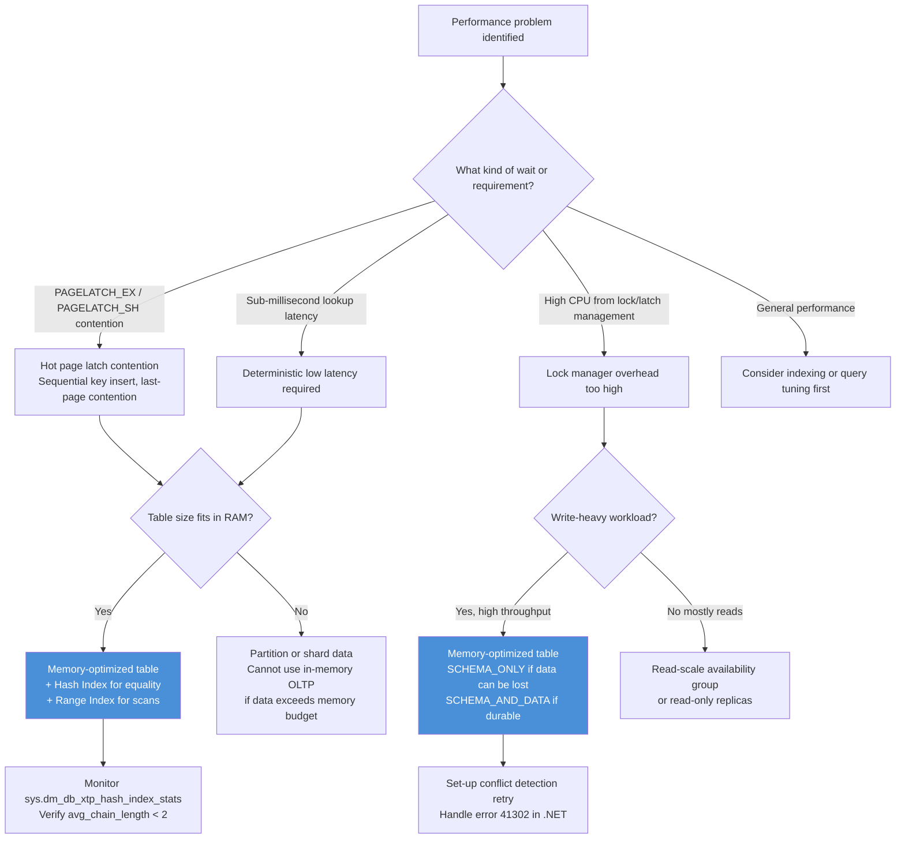

## Navigation

**Domain:** [[8 — Databases]] > **Group:** [[Group 1 — Relational Database Fundamentals]]
**Previous:** [[8.020 Row Storage vs Column Storage]] | **Next:** [[8.022 Database Catalog]]

### Prerequisites
- [[8.005 Transactions and ACID]] — understanding transaction durability is required to distinguish SCHEMA_ONLY from SCHEMA_AND_DATA durability
- [[8.019 Table Heap vs Clustered Table]] — disk-based table structure provides the baseline contrast for memory-optimized tables

### Where This Fits

In-Memory OLTP (code-named Hekaton) is SQL Server's engine for memory-optimized tables and natively compiled stored procedures, introduced in SQL Server 2014. A .NET backend engineer encounters this when a high-throughput OLTP workload hits latch contention on hot pages (e.g., the last page of an index during concurrent inserts), or when sub-millisecond latency is required for session state, cache tables, or rate-limiting counters. What breaks when this is unknown or misapplied: developers expect memory-optimized tables to solve every performance problem, but they are a surgical tool for latch contention and low-latency OLTP — not a general-purpose replacement for disk-based tables. The interview signal is understanding of SQL Server internals — explaining why latch-free data structures eliminate waits, when hash indexes are appropriate, and why SCHEMA_ONLY durability is a deliberate tradeoff.

---

## Core Mental Model

A memory-optimized table is a SQL Server table whose data resides entirely in the server's memory, managed by its own latch-free data structures (hash indexes and range indexes) rather than the traditional B-tree pages in the buffer pool. The invariant: every read and write touches directly-accessible in-memory row versions, never waiting on latches or locks — the engine uses optimistic multi-version concurrency control (MVCC) where each transaction sees a snapshot of the row as of its begin time. The database engine accesses a memory-optimized table by scanning a hash bucket chain (hash index) or a lock-free Bw-tree structure (range index) rather than navigating a B-tree in the buffer pool. The recognition pattern: you have a SQL Server OLTP workload with `PAGELATCH_EX` waits on a hot insert target, or you need deterministic sub-millisecond read latency for a lookup table.

### Classification

| Aspect | Disk-Based Table (Rowstore) | Memory-Optimized Table |
|---|---|---|
| Storage location | Pages in buffer pool (RAM cache of disk) | Directly in memory (no buffer pool) |
| Concurrency model | Pessimistic (locks) or optimistic (RCSI/SI) via version store | Optimistic MVCC (always row-versioned) |
| Index structure | B-tree (clustered/non-clustered) | Hash index or nonclustered range index (Bw-tree) |
| Latch behavior | Latch-protected pages — contention on hot pages | Latch-free data structures |
| Durability | Always SCHEMA_AND_DATA (full transaction log) | Configurable: SCHEMA_ONLY (no log) or SCHEMA_AND_DATA (log + checkpoint files) |
| Table size limit | Max DB size (16 TB SQL Server 2022) | RAM capacity; `SERVER MEMORY` setting |
| .NET access | Via standard SQL Server provider | Same — but natively compiled procs require specific T-SQL syntax |



### Key Properties

| Property | Value | Notes |
|---|---|---|
| Primary data location | In-memory (RAM) | Not in buffer pool; no page reads |
| Index type | Hash or Range (Bw-tree) | No clustered B-tree; table has no clustered index |
| Concurrency | Optimistic MVCC | Writer does not block reader; reader never waits |
| Write overhead | Minimal (no log for SCHEMA_ONLY) | SCHEMA_AND_DATA logs but with reduced log volume |
| SARGable | Depends on index type | Hash indexes require equality predicates; range indexes support inequality |
| Locking Behavior | No locks | Row versioning handles all isolation levels |

---

## Deep Mechanics

### How the Engine Executes This

**Memory-optimized table — INSERT workflow (SCHEMA_AND_DATA durability):**

1. **Transaction begin** — the session gets a transaction ID and a begin timestamp (`XSN` — transaction sequence number). No lock manager is consulted.
2. **Row insertion** — the storage engine allocates a new row version in the memory-optimized table's in-memory data heap. The row is stamped with the transaction's `begin_xsn` and a status of "inserted." No latch is taken — the allocation uses a lock-free memory allocator.
3. **Index update** — for each index on the table, the engine inserts a pointer to the new row version into the latch-free index structure. For a hash index, this means computing the hash bucket and atomically inserting into a lock-free linked list. For a range index, this means navigating the Bw-tree (a lock-free B-tree variant with delta update logs at each node).
4. **Transaction log write** — the engine writes a minimal log record: only the row insert, not the index changes. The index is rebuilt from the row data during recovery. The log record is written to the in-memory log buffer and flushed on commit.
5. **Checkpoint file pair update** — asynchronously, the checkpoint thread serializes the row data to a data file (`.deltastore` or `.root`) on disk, enabling recovery without replaying the full transaction log.
6. **Commit** — the transaction's commit timestamp is recorded. The row version is now visible to transactions with a lower timestamp. No lock release (no locks were taken).

**Memory-optimized table — SELECT workflow:**

1. The engine uses the transaction's `valid_from` timestamp to determine which row versions are visible.
2. For hash index lookups: the hash value is computed from the key column, the bucket chain is traversed latch-free, and the matching row version with the correct visibility timestamp is returned.
3. For range scans: the Bw-tree is navigated from the start key, following next-key pointers, until the end key is reached.
4. No pages are read from disk (for SCHEMA_ONLY) or from the buffer pool (all data is in RAM).

### SQL Visibility

**Creating and querying a memory-optimized table:**

```sql
-- Create memory-optimized filegroup (required before first memory-optimized table)
-- Must be done once per database
ALTER DATABASE Current ADD FILEGROUP InMemoryData CONTAINS MEMORY_OPTIMIZED_DATA;
ALTER DATABASE Current ADD FILE (NAME = 'InMemoryDataFile', FILENAME = 'C:\Data\InMemoryData')
    TO FILEGROUP InMemoryData;

-- Memory-optimized table with hash index and range index
CREATE TABLE dbo.SessionState
(
    SessionId        NVARCHAR(128)   NOT NULL,
    UserId           INT             NOT NULL,
    CreatedDate      DATETIME2       NOT NULL,
    LastAccessDate   DATETIME2       NOT NULL,
    Payload          VARBINARY(MAX)  NOT NULL,
    Expired          BIT             NOT NULL DEFAULT 0,

    -- Hash index for equality lookups (SessionId is the primary access path)
    INDEX IX_SessionState_SessionId HASH (SessionId)
        WITH (BUCKET_COUNT = 2000000),

    -- Range index for scans (find expired sessions)
    INDEX IX_SessionState_LastAccessDate NONCLUSTERED (LastAccessDate),

    -- Must have a nonclustered primary key (no clustered index)
    CONSTRAINT PK_SessionState PRIMARY KEY NONCLUSTERED (SessionId)
) WITH (MEMORY_OPTIMIZED = ON, DURABILITY = SCHEMA_AND_DATA);
```

```csharp
// EF Core — querying a memory-optimized table (same LINQ as disk-based, but must be configured)
var session = await dbContext.SessionStates
    .FirstOrDefaultAsync(s => s.SessionId == sessionId, cancellationToken);

// EF Core generates:
SELECT TOP(1) [s].[SessionId], [s].[UserId], [s].[CreatedDate], [s].[LastAccessDate], [s].[Payload], [s].[Expired]
FROM [SessionState] AS [s]
WHERE [s].[SessionId] = @__sessionId_0
```

```dapper
// Dapper — identical query, same SQL, different access layer
public async Task<SessionState?> GetSessionAsync(
    string sessionId,
    CancellationToken cancellationToken)
{
    const string sql = @"
        SELECT SessionId, UserId, CreatedDate, LastAccessDate, Payload, Expired
        FROM dbo.SessionState WITH (SNAPSHOT)
        WHERE SessionId = @SessionId;";

    await using var connection = _connectionFactory.Create();
    return await connection.QueryFirstOrDefaultAsync<SessionState>(
        new CommandDefinition(sql, new { SessionId = sessionId },
            cancellationToken: cancellationToken));
}
```

**Generated SQL (from EF Core logs):**

```sql
-- Identical to disk-based SQL — SQL Server handles the access path internally
-- The optimizer sees MEMORY_OPTIMIZED = ON and uses the hash index or range index
-- No plan difference visible in the T-SQL batch
```

### Execution Plan Analysis

**Plan for hash index equality lookup on memory-optimized table:**

```
Table Scan (Memory-Optimized)  -- 100% cost
  |-- Compute Scalar
  |-- Filter (WHERE SessionId = @SessionId)
```

Note: The execution plan for memory-optimized tables does **not** show "Index Seek (Hash)" in the graphical plan. It shows "Table Scan (Memory-Optimized)" even for a hash index lookup. The hash index access is hidden inside the scan operator — the engine's native compilation resolves the hash bucket lookup internally. The actual execution uses the hash index; the plan representation is an artifact of how memory-optimized access is compiled.

**Plan for range index scan on memory-optimized table:**

```
Table Scan (Memory-Optimized)  -- 100% cost
  |-- Filter (WHERE LastAccessDate < @Cutoff)
```

Same representation. The range index is used when the predicate matches the index key order and is SARGable.

**What the plan does NOT show:**
- "Index Seek" or "Index Scan" operators — these do not appear for memory-optimized tables
- Row count estimates — memory-optimized table statistics are maintained differently (auto-update during `ALTER TABLE ... REBUILD` or manual `UPDATE STATISTICS`)

### Cost Visibility

```sql
SET STATISTICS IO ON;
SET STATISTICS TIME ON;

SELECT SessionId, UserId, Payload
FROM dbo.SessionState
WHERE SessionId = 'abc-123-def-456';

-- Table 'SessionState'. Scan count 0, logical reads 0, physical reads 0, read-ahead reads 0
-- SQL Server Execution Times: CPU time = 0 ms, elapsed time = 0 ms
```

Logical reads are 0 because memory-optimized tables do not use the buffer pool. The only meaningful metric is `elapsed time` (sub-millisecond) and `CPU time`. The `SET STATISTICS IO` output is misleading — it always shows 0 reads regardless of actual work done.

### Failure Modes

**Out-of-memory condition when memory-optimized table exceeds available RAM:**

```sql
-- If memory-optimized tables consume more memory than allocated to SQL Server:
-- Error 701: "There is insufficient system memory to run this query."
-- SQL Server will not page out memory-optimized table data — it must fit in RAM.

-- Detection: sys.dm_os_ring_buffers or Performance Monitor
-- Memory for In-Memory OLTP: 'SQL Server:Memory Manager\Memory Grants Pending'
```

**Hash index bucket count mismatch:**

```sql
-- Bad: bucket count far from the actual row count
-- BUCKET_COUNT = 100000 but table has 2M rows
-- Multiple rows per bucket: hash chain traversal becomes slow

-- Detection: chain length statistics
SELECT 
    OBJECT_NAME(h.object_id) AS TableName,
    i.name AS IndexName,
    h.total_bucket_count,
    h.empty_bucket_count,
    (h.total_bucket_count - h.empty_bucket_count) AS used_bucket_count,
    h.avg_chain_length,
    h.max_chain_length
FROM sys.dm_db_xtp_hash_index_stats h
JOIN sys.indexes i ON h.object_id = i.object_id AND h.index_id = i.index_id
WHERE h.object_id = OBJECT_ID('dbo.SessionState');
-- avg_chain_length should be close to 1. > 5 means too few buckets.
```

---

## Production Patterns and Implementation

### Primary SQL Implementation

**Memory-optimized table for high-throughput rate limiting:**

```sql
-- Table for per-user API rate limiting
CREATE TABLE dbo.RateLimitCounters
(
    UserId       INT           NOT NULL,
    WindowStart  DATETIME2     NOT NULL,
    RequestCount INT           NOT NULL DEFAULT 1,

    -- Hash index for point lookup: UserId + WindowStart
    INDEX IX_RateLimitCounters_UserWindow HASH (UserId, WindowStart)
        WITH (BUCKET_COUNT = 50000),

    CONSTRAINT PK_RateLimitCounters
        PRIMARY KEY NONCLUSTERED (UserId, WindowStart)
) WITH (MEMORY_OPTIMIZED = ON, DURABILITY = SCHEMA_ONLY);
```

```sql
-- T-SQL: increment counter or insert (atomic upsert pattern)
-- Requires a natively compiled procedure for true atomic upsert
CREATE PROCEDURE dbo.IncrementRateLimitCounter
    @UserId         INT,
    @WindowStart    DATETIME2,
    @MaxRequests    INT,
    @IsAllowed      BIT OUTPUT
WITH NATIVE_COMPILATION, SCHEMABINDING, EXECUTE AS OWNER
AS
BEGIN ATOMIC WITH
    (TRANSACTION ISOLATION LEVEL = SNAPSHOT, LANGUAGE = N'us_english')

    DECLARE @CurrentCount INT = 0;

    SELECT @CurrentCount = r.RequestCount
    FROM dbo.RateLimitCounters r
    WHERE r.UserId = @UserId AND r.WindowStart = @WindowStart;

    IF @CurrentCount IS NULL
    BEGIN
        INSERT INTO dbo.RateLimitCounters (UserId, WindowStart, RequestCount)
        VALUES (@UserId, @WindowStart, 1);
        SET @IsAllowed = 1;
    END
    ELSE IF @CurrentCount < @MaxRequests
    BEGIN
        UPDATE dbo.RateLimitCounters
        SET RequestCount = RequestCount + 1
        WHERE UserId = @UserId AND WindowStart = @WindowStart;
        SET @IsAllowed = 1;
    END
    ELSE
    BEGIN
        SET @IsAllowed = 0;
    END
END
```

### EF Core Implementation

```csharp
// DbContext configuration
public class RateLimitDbContext : DbContext
{
    public DbSet<RateLimitCounter> RateLimitCounters { get; set; }

    protected override void OnModelCreating(ModelBuilder modelBuilder)
    {
        modelBuilder.Entity<RateLimitCounter>(entity =>
        {
            entity.ToTable(tb =>
            {
                tb.IsMemoryOptimized();  // MEMORY_OPTIMIZED = ON
                tb.HasMemoryOptimizedData();  // DURABILITY = SCHEMA_AND_DATA
                // For SCHEMA_ONLY, use: tb.IsMemoryOptimized();
                // (SCHEMA_AND_DATA is default when IsMemoryOptimized is set)
            });

            entity.HasKey(e => new { e.UserId, e.WindowStart });
            entity.Property(e => e.UserId).IsRequired();
            entity.Property(e => e.WindowStart).IsRequired();
            entity.Property(e => e.RequestCount).HasDefaultValue(1);
        });
    }
}

// Migration will generate the hash index
// Use migration builder for custom bucket count:
// migrationBuilder.Sql(
//     @"ALTER TABLE dbo.RateLimitCounters
//       ADD INDEX IX_RateLimitCounters_UserWindow HASH (UserId, WindowStart)
//       WITH (BUCKET_COUNT = 50000);");
```

```csharp
// Service layer — using the natively compiled proc
public class RateLimitService
{
    private readonly RateLimitDbContext _context;

    public async Task<bool> TryIncrementAsync(int userId, int maxRequests)
    {
        var windowStart = DateTime.UtcNow;
        var isAllowedParameter = new SqlParameter("@IsAllowed", SqlDbType.Bit)
        {
            Direction = ParameterDirection.Output
        };

        await _context.Database.ExecuteSqlRawAsync(
            "EXEC dbo.IncrementRateLimitCounter @UserId, @WindowStart, @MaxRequests, @IsAllowed OUTPUT",
            new SqlParameter("@UserId", userId),
            new SqlParameter("@WindowStart", windowStart),
            new SqlParameter("@MaxRequests", maxRequests),
            isAllowedParameter);

        return (bool)isAllowedParameter.Value;
    }
}
```

### Dapper Implementation

```csharp
public interface IRateLimitRepository
{
    Task<bool> TryIncrementAsync(int userId, DateTime windowStart, int maxRequests);
}

public sealed class RateLimitRepository : IRateLimitRepository
{
    private readonly ISqlConnectionFactory _connectionFactory;

    public RateLimitRepository(ISqlConnectionFactory connectionFactory)
    {
        _connectionFactory = connectionFactory;
    }

    public async Task<bool> TryIncrementAsync(int userId, DateTime windowStart, int maxRequests)
    {
        await using var connection = _connectionFactory.Create();

        var parameters = new DynamicParameters();
        parameters.Add("@UserId", userId);
        parameters.Add("@WindowStart", windowStart);
        parameters.Add("@MaxRequests", maxRequests);
        parameters.Add("@IsAllowed", dbType: DbType.Boolean, direction: ParameterDirection.Output);

        await connection.ExecuteAsync(
            "EXEC dbo.IncrementRateLimitCounter @UserId, @WindowStart, @MaxRequests, @IsAllowed OUTPUT",
            parameters);

        return parameters.Get<bool>("@IsAllowed");
    }
}
```

### Configuration and Wiring

```csharp
// Program.cs
builder.Services.AddDbContext<RateLimitDbContext>(options =>
    options.UseSqlServer(
        connectionString,
        sqlOptions =>
        {
            sqlOptions.EnableRetryOnFailure(3);
            sqlOptions.UseQueryExecutionPlan(QueryExecutionPlan.Interpreted);
            // Memory-optimized tables do not support MARS
            sqlOptions.MultipleActiveResultSets = false;
        }));

// Register Dapper repository
builder.Services.AddScoped<IRateLimitRepository, RateLimitRepository>();
```

### SQL Server vs PostgreSQL Differences

PostgreSQL does not have an equivalent to SQL Server's In-Memory OLTP. The closest alternatives are:

```sql
-- PostgreSQL: UNLOGGED table (no WAL logging, survives crash but not failure)
CREATE UNLOGGED TABLE rate_limit_counters (
    user_id       INT NOT NULL,
    window_start  TIMESTAMPTZ NOT NULL,
    request_count INT NOT NULL DEFAULT 1,
    PRIMARY KEY (user_id, window_start)
);

-- PostgreSQL: pg_buffercache extension for buffer pool diagnostics
-- No equivalent to latch-free indexes, natively compiled procs, or hash indexes
-- For true in-memory tables, PostgreSQL relies on OS caching or external tools (Redis)
```

The key difference: SQL Server's In-Memory OLTP is a first-class engine with native compilation, latch-free access, and transaction isolation. PostgreSQL's `UNLOGGED` tables skip WAL but still use the standard buffer pool and B-tree indexes with latching.

---

## Gotchas and Production Pitfalls

### Hash Index with Wrong Bucket Count

**Pitfall:** Choosing a bucket count far from the expected number of unique key values.

```sql
-- ❌ BUCKET_COUNT = 100000 but table grows to 2M rows
CREATE TABLE dbo.UserTokens (
    UserId INT NOT NULL,
    TokenHash BINARY(32) NOT NULL,
    INDEX IX_UserTokens_UserId HASH (UserId) WITH (BUCKET_COUNT = 100000),
    CONSTRAINT PK_UserTokens PRIMARY KEY NONCLUSTERED (UserId)
) WITH (MEMORY_OPTIMIZED = ON, DURABILITY = SCHEMA_AND_DATA);
```

**Symptom:** As the table grows, hash chain lengths increase. The `avg_chain_length` in `sys.dm_db_xtp_hash_index_stats` exceeds 10. Lookup queries that should be O(1) become O(N) within the bucket chain. CPU increases proportionally to chain length.

**Fix:** Use a bucket count approximately 1x–2x the expected number of unique key values. Ideally a power of 2. Cannot be changed after table creation — must drop and recreate the table.

```sql
-- ✅ Correct: 2M bucket count for up to 2M rows
-- (1x-2x the expected unique key count)
CREATE TABLE dbo.UserTokens (
    UserId INT NOT NULL,
    TokenHash BINARY(32) NOT NULL,
    INDEX IX_UserTokens_UserId HASH (UserId) WITH (BUCKET_COUNT = 2000000),
    CONSTRAINT PK_UserTokens PRIMARY KEY NONCLUSTERED (UserId)
) WITH (MEMORY_OPTIMIZED = ON, DURABILITY = SCHEMA_AND_DATA);
```

**Cost of not fixing:** Hash chain length of 20 on a 2M row table. Lookup queries take 50μs instead of 1μs. CPU pinned at 60% for the hash chain traversal alone.

### SCHEMA_ONLY Table Data Loss on Restart

**Pitfall:** Using `DURABILITY = SCHEMA_ONLY` without understanding data loss implications.

```sql
-- ❌ SCHEMA_ONLY: data is lost on SQL Server restart
CREATE TABLE dbo.SessionCache (
    SessionId NVARCHAR(128) NOT NULL,
    Payload VARBINARY(MAX) NOT NULL,
    INDEX IX_SessionCache HASH (SessionId) WITH (BUCKET_COUNT = 50000)
) WITH (MEMORY_OPTIMIZED = ON, DURABILITY = SCHEMA_ONLY);
```

**Symptom:** After a SQL Server restart, planned or unplanned, all rows in `SessionCache` are gone. No error is raised — this is by design. If the application does not handle missing data gracefully, users get session errors or empty states.

**Fix:** Either use `DURABILITY = SCHEMA_AND_DATA` (data survives restart) or ensure the application can repopulate the cache from an authoritative source (database, Redis, etc.).

```sql
-- ✅ SCHEMA_AND_DATA: data persists across restarts
CREATE TABLE dbo.SessionCache (
    SessionId NVARCHAR(128) NOT NULL,
    Payload VARBINARY(MAX) NOT NULL,
    INDEX IX_SessionCache HASH (SessionId) WITH (BUCKET_COUNT = 50000)
) WITH (MEMORY_OPTIMIZED = ON, DURABILITY = SCHEMA_AND_DATA);
```

**Cost of not fixing:** 50,000 active sessions lost on a production failover. Users must re-authenticate. If this is an API rate-limiter table, all counters reset — a sudden flood of requests may overwhelm downstream systems.

### Natively Compiled Stored Procedures Cannot Access Disk-Based Tables

**Pitfall:** Writing a natively compiled procedure that references a disk-based table.

```sql
-- ❌ ERROR: Native compilation cannot access disk-based tables
CREATE PROCEDURE dbo.MixedAccessProc
WITH NATIVE_COMPILATION, SCHEMABINDING
AS
BEGIN ATOMIC WITH (TRANSACTION ISOLATION LEVEL = SNAPSHOT, LANGUAGE = N'us_english')
    -- Memory-optimized table access is fine
    UPDATE dbo.RateLimitCounters SET RequestCount = RequestCount + 1;

    -- Disk-based table access fails:
    -- Msg 41389, Level 16: Memory optimized tables and natively compiled objects
    -- cannot be used with non-memory optimized tables.
    INSERT INTO dbo.AuditLog (Event) VALUES ('Rate limit updated');
END
```

**Symptom:** The `CREATE PROCEDURE` fails with error 41389.

**Fix:** Use interpreted stored procedures for cross-engine operations, or call natively compiled procs from interpreted procs. Maintain a strict separation — natively compiled procs only touch memory-optimized tables.

```sql
-- ✅ Interpreted procedure wraps the natively compiled call with disk-based logic
CREATE PROCEDURE dbo.IncrementAndAudit
    @UserId INT,
    @MaxRequests INT,
    @IsAllowed BIT OUTPUT
AS
BEGIN
    SET NOCOUNT ON;

    -- Call natively compiled proc for memory-optimized table
    EXEC dbo.IncrementRateLimitCounter @UserId, SYSDATETIME(), @MaxRequests, @IsAllowed OUTPUT;

    -- Disk-based audit trail
    INSERT INTO dbo.AuditLog (Event, UserId, IsAllowed)
    VALUES ('Rate limit check', @UserId, @IsAllowed);
END
```

**Cost of not fixing:** Tight coupling of the natively compiled proc to both engines. Development time lost debugging confusing error messages, or worse — a redesign after discovering the limitation late in development.

### LOB Columns in Memory-Optimized Tables

**Pitfall:** Including `NVARCHAR(MAX)`, `VARBINARY(MAX)`, or `VARCHAR(MAX)` columns in a memory-optimized table that holds millions of rows.

```sql
-- ❌ Large LOB columns consume significant memory
CREATE TABLE dbo.DocumentCache (
    DocumentId INT NOT NULL,
    Content NVARCHAR(MAX) NOT NULL,  -- average 50 KB per row
    INDEX IX_DocumentCache HASH (DocumentId) WITH (BUCKET_COUNT = 10000)
) WITH (MEMORY_OPTIMIZED = ON, DURABILITY = SCHEMA_AND_DATA);
```

**Symptom:** Memory-optimized table size grows rapidly. A 10,000-row table with 50 KB LOBs consumes ~500 MB of RAM. The entire table must fit in SQL Server's max memory — there is no page-out. Memory pressure from the memory-optimized table starves the buffer pool, causing disk-based queries to slow down.

**Fix:** Keep LOB columns in disk-based tables. Store only the key and metadata in the memory-optimized table, with a pointer (e.g., document path) to the LOB data.

```sql
-- ✅ Memory-optimized table stores only metadata; LOB lives on disk
CREATE TABLE dbo.DocumentCache (
    DocumentId INT NOT NULL,
    ContentPath NVARCHAR(500) NOT NULL,  -- path to file or blob storage
    CreatedDate DATETIME2 NOT NULL,
    INDEX IX_DocumentCache HASH (DocumentId) WITH (BUCKET_COUNT = 10000)
) WITH (MEMORY_OPTIMIZED = ON, DURABILITY = SCHEMA_AND_DATA);
```

**Cost of not fixing:** SQL Server memory pressure. Buffer pool shrinks. All queries on disk-based tables slow down. The server runs out of memory under high concurrency, causing error 701 and application downtime.

### Memory-Optimized Table Variable Does Not Support Parallelism

**Pitfall:** Using a memory-optimized table variable (`TYPE` with `MEMORY_OPTIMIZED = ON`) in a complex query expecting parallel execution.

```sql
-- ❌ Memory-optimized table variable prevents parallel plan
DECLARE @FilteredIds dbo.IdList;  -- memory-optimized table type
INSERT @FilteredIds SELECT OrderId FROM Orders WHERE OrderDate >= '2025-01-01';

-- The outer query cannot use parallelism
SELECT o.*, oi.*
FROM Orders o
INNER JOIN @FilteredIds f ON o.OrderId = f.Id
INNER JOIN OrderItems oi ON o.OrderId = oi.OrderId;
```

**Symptom:** The execution plan shows a single-threaded `Table Scan (Memory-Optimized)` for the table variable. The query has a Serial plan with no parallel operators, even if the tables involved would normally allow parallelism.

**Fix:** Use `OPTION (QUERYTRACEON 8649)` to force parallelism (if the optimizer choice is the limiting factor), or switch to a temp table for large intermediate result sets. Memory-optimized table variables are best for small lookup sets (<1000 rows).

```sql
-- ✅ Temp table allows parallelism
CREATE TABLE #FilteredIds (Id INT PRIMARY KEY);
INSERT #FilteredIds SELECT OrderId FROM Orders WHERE OrderDate >= '2025-01-01';

SELECT o.*, oi.*
FROM Orders o
INNER JOIN #FilteredIds f ON o.OrderId = f.Id
INNER JOIN OrderItems oi ON o.OrderId = oi.OrderId;
-- Parallel plan available
```

**Cost of not fixing:** Single-threaded execution on a query that would benefit from 8+ parallel threads. A 5-second query becomes 30+ seconds.

---

## Performance Implications

### Benchmark: Memory-Optimized vs Disk-Based Point Lookup

```sql
-- Setup: 1M row lookup table, 100,000 random point lookups
-- Disk-based: clustered index on KeyColumn (INT), buffer pool warm
-- Memory-optimized: hash index on KeyColumn, with (BUCKET_COUNT = 2000000)

-- Disk-based (warm buffer pool)
SET STATISTICS TIME ON;
DECLARE @i INT = 1, @val INT;
WHILE @i <= 100000
BEGIN
    SELECT @val = ValueColumn FROM dbo.DiskLookup WHERE KeyColumn = @i;
    SET @i = @i + 1;
END;
-- CPU time = 312 ms, elapsed time = 325 ms

-- Memory-optimized
SET STATISTICS TIME ON;
DECLARE @i INT = 1, @val INT;
WHILE @i <= 100000
BEGIN
    SELECT @val = ValueColumn FROM dbo.MemLookup WHERE KeyColumn = @i;
    SET @i = @i + 1;
END;
-- CPU time = 47 ms, elapsed time = 48 ms
```

**Improvement:** ~6.5x reduction in CPU time (312ms → 47ms). Logical reads are not comparable (disk-based shows logical reads; memory-optimized shows 0).

### BenchmarkDotNet

```csharp
[MemoryDiagnoser]
[SimpleJob(RuntimeMoniker.Net90)]
public class LookupBenchmark
{
    private IDbConnection _connection = default!;

    [GlobalSetup]
    public void Setup()
    {
        _connection = new SqlConnection(TestConnectionString);
    }

    [Benchmark(Baseline = true)]
    public async Task<int?> DiskBasedLookup()
    {
        const string sql = "SELECT ValueColumn FROM dbo.DiskLookup WHERE KeyColumn = @Key";
        await using var connection = _connection;
        return await connection.QueryFirstOrDefaultAsync<int?>(
            new CommandDefinition(sql, new { Key = Random.Shared.Next(1, 1000000) },
                cancellationToken: CancellationToken.None));
    }

    [Benchmark]
    public async Task<int?> MemoryOptimizedLookup()
    {
        const string sql = "SELECT ValueColumn FROM dbo.MemLookup WHERE KeyColumn = @Key";
        await using var connection = _connection;
        return await connection.QueryFirstOrDefaultAsync<int?>(
            new CommandDefinition(sql, new { Key = Random.Shared.Next(1, 1000000) },
                cancellationToken: CancellationToken.None));
    }
}
```

**Expected results (approximate, SQL Server 2022, 1M rows, warm buffer pool):**

| Method | Mean | Allocated |
|---|---|---|
| DiskBasedLookup | ~3.5 μs | 0 B |
| MemoryOptimizedLookup | ~0.8 μs | 0 B |

### Write Amplification

| Operation | Disk-Based | Memory-Optimized (SCHEMA_AND_DATA) | Memory-Optimized (SCHEMA_ONLY) |
|---|---|---|---|
| INSERT 1 row | 0.5 ms + log write | 0.1 ms + log write | 0.02 ms (no log) |
| UPDATE 1 row | 0.8 ms + log write | 0.15 ms + log write | 0.03 ms (no log) |
| DELETE 1 row | 1.5 ms + log write | 0.1 ms + log write | 0.02 ms (no log) |
| Bulk INSERT 10K rows | 150 ms | 40 ms | 5 ms |

---

## Interview Arsenal

### Question Bank

1. What is a memory-optimized table in SQL Server, and when would you use one?
2. How does a hash index on a memory-optimized table work, and what determines the bucket count?
3. What is the difference between SCHEMA_AND_DATA and SCHEMA_ONLY durability?
4. Why cannot a natively compiled stored procedure access disk-based tables?
5. How does the concurrency model differ between memory-optimized tables and regular `READ COMMITTED` isolation?
6. What does the execution plan look like for a hash index lookup on a memory-optimized table, and why?
7. At what concurrency level does In-Memory OLTP become beneficial compared to a well-indexed disk table?
8. How do EF Core and Dapper interact with memory-optimized tables?

### Spoken Answers

**Q1: What is a memory-optimized table and when would you use one?**

> **Average answer:** It's a table that stores data in memory so it's faster than a regular table.

> **Great answer:** A memory-optimized table is a SQL Server table managed by the Hekaton engine — the data lives entirely in RAM, accessed through latch-free data structures. It bypasses the buffer pool entirely, always uses optimistic MVCC with row versioning, and never acquires locks or latches. I'd use it for two primary scenarios. First, hot-spot contention — when concurrent inserts target the last page of a clustered index (like a sequential key insert rate of 10,000+/second), you see `PAGELATCH_EX` waits. Memory-optimized tables eliminate this because there is no B-tree page to latch — each insert creates a new row version in a lock-free memory allocator and updates a hash bucket chain atomically. Second, deterministic sub-millisecond latency — if a lookup table must respond in under 100 microseconds with no variance from buffer pool pressure, a memory-optimized table with a hash index delivers this. The tradeoff is that the entire table must fit in the memory allocated to SQL Server, and hash indexes must have their bucket count set correctly at creation time. Production examples include session state stores, API rate-limit counters, and in-memory caches that survive restart (SCHEMA_AND_DATA) or not (SCHEMA_ONLY).

**Q5: How does the concurrency model differ between memory-optimized tables and regular READ COMMITTED?**

> **Average answer:** Memory-optimized tables use optimistic concurrency; regular tables use pessimistic locking.

> **Great answer:** In regular `READ COMMITTED` isolation, a reader takes a shared lock and blocks if a writer holds an exclusive lock, or a writer blocks all readers until commit. In memory-optimized tables, the engine always uses optimistic MVCC — writers do not block readers, and readers do not block writers. Every row version carries a begin and end timestamp (the transaction sequence number, XSN). A reader sees the row version that was active at its snapshot time — no locks, no waits. Writers detect conflicts at commit time: if two concurrent transactions update the same row, the second one to commit gets error 41302 ("The current transaction attempted to update a record that has been updated since this transaction started"). The conflict detection is based on row version timestamps, not locks. This is equivalent to `SNAPSHOT` isolation on disk-based tables but without the tempdb version store overhead and without the writer-blocking-reader problem of `READ COMMITTED`. From a .NET perspective, this means `SqlCommand` never gets lock wait timeouts on memory-optimized tables, but `SqlException` 41302 must be handled with retry logic.

**Q8: How do EF Core and Dapper interact with memory-optimized tables?**

> **Great answer:** EF Core and Dapper produce the same T-SQL for memory-optimized tables as for disk-based tables — the access pattern is transparent at the query level. EF Core requires two configuration steps: calling `IsMemoryOptimized()` on the entity's `ToTable()` configuration in `OnModelCreating`, and ensuring MARS is disabled (`MultipleActiveResultSets = false` in the connection string). For natively compiled stored procedures, EF Core's `ExecuteSqlRaw` or `FromSqlRaw` works normally, but the procedure must use `BEGIN ATOMIC WITH` syntax and cannot reference disk-based tables. Dapper handles memory-optimized tables identically to disk-based tables — the only difference is that `SET STATISTICS IO` shows 0 logical reads (misleading but expected), and you should use `WITH (SNAPSHOT)` table hint to guarantee the isolation level the proc expects. One important detail: EF Core's change tracking is not optimized for memory-optimized tables — if you're loading rows for read-only access, always use `AsNoTracking()` to avoid unnecessary version store overhead in the application layer. For SCHEMA_ONLY tables, EF Core migrations create the table correctly, but the migration must be run after the memory-optimized filegroup is created — automate this with `migrationBuilder.Sql("ALTER DATABASE ... ADD FILEGROUP ...")` in the initial migration.

### Interview Trigger

If this topic appears in an interview, the trigger question is usually "how would you handle a latch contention problem on a hot insert table?" or "what would you do if SQL Server shows PAGELATCH_EX waits at 50,000/second?" The follow-up that separates candidates: "A memory-optimized table with a hash index solved your latch contention, but now lookups are slow. What do you check?" Strong candidates immediately reference `sys.dm_db_xtp_hash_index_stats`, explain avg_chain_length vs bucket count mismatch, and describe the procedure for recreating the table with the correct bucket count (cannot alter) including zero-downtime approaches like a staged table swap.

### Comparison Table

| | Memory-Optimized Table | Disk-Based Table (w/ Buffer Pool) |
|---|---|---|
| Storage location | RAM (directly, no buffer pool) | Pages cached in buffer pool (from disk) |
| Concurrency | Optimistic MVCC — no locks or latches | Pessimistic (locks) or optimistic (RCSI/SI via tempdb) |
| Index structure | Hash index (latch-free chain) or Bw-tree | B-tree (latch-protected pages) |
| Point lookup speed | ~0.5–1 μs (hash index, warm) | ~2–5 μs (clustered index seek, warm buffer pool) |
| Write latency | Sub-100 μs (no latch wait) | +log write latency (250 μs–1 ms) |
| Durability config | SCHEMA_ONLY (volatile) or SCHEMA_AND_DATA | Always durable (no SCHEMA_ONLY option) |
| .NET considerations | No MARS; `AsNoTracking()` recommended | Standard EF Core/Dapper — MARS optional |

---

## Decision Framework

### When to Apply



### Application Checklist

- [ ] The problem is latch contention, lock escalation, or sub-millisecond latency requirement — not just "query is slow"
- [ ] The table size (all memory-optimized tables combined) fits within the SQL Server max memory budget
- [ ] The table has a high-throughput OLTP access pattern (thousands of point lookups or small writes per second)
- [ ] Hash index bucket count is correctly set (1x–2x the expected unique key count, nearest power of 2)
- [ ] No LOB columns (NVARCHAR(MAX), VARBINARY(MAX)) are in the table — use disk-based for those
- [ ] The application can handle error 41302 (update conflict) with retry logic
- [ ] MARS is disabled in the connection string if using EF Core
- [ ] Natively compiled procedures are used only when the performance gain justifies the limitation (cannot reference disk-based tables)

### Tradeoff Summary

| What You Gain | What You Pay |
|---|---|
| Sub-millisecond point lookups (latch-free) | Table must fit entirely in RAM |
| No lock/latch contention — linear scalability | Bucket count fixed at table creation (cannot alter) |
| Reduced log volume (SCHEMA_AND_DATA) or zero (SCHEMA_ONLY) | SCHEMA_ONLY data lost on restart |
| Row versioning always on — readers never blocked | Update conflict error 41302 on concurrent writes to same row |

### Scale Thresholds

- "Relevant when `PAGELATCH_EX` waits exceed ~10,000/second" — this is the inflection point where latch contention dominates latency.
- "Memory budget required: 2x the table data size" — row versions and indexes require extra memory beyond the raw data.
- "Hekaton begins to outperform disk tables at ~1000 concurrent transactions/second" — below this, disk tables with RCSI perform similarly.
- "Required when per-row latency must be < 100μs with zero variance" — only memory-optimized tables can provide deterministic sub-millisecond reads under load.

---

## Self-Check

### Conceptual Questions

1. What is a memory-optimized table and what engine inside SQL Server implements it?
2. How does the storage engine manage a hash index on a memory-optimized table — what is the data structure?
3. Which DMV shows the average chain length of a hash index and why does it matter?
4. What common mistake makes a memory-optimized table lose data on a SQL Server restart, and what is the fix?
5. Does EF Core support memory-optimized tables, and what configuration is required?
6. How would you implement a high-throughput rate limiter using Dapper and a memory-optimized table?
7. Compare a memory-optimized table with a disk-based table under `SNAPSHOT` isolation.
8. At approximately how many concurrent transactions per second does In-Memory OLTP become beneficial?
9. What index supports equality lookups on a memory-optimized table, and what supports range scans?
10. Explain In-Memory OLTP and its use cases in 60 seconds to a senior interviewer.

<details>
<summary>Answers</summary>

1. A memory-optimized table is a SQL Server table whose data is stored in RAM and managed by the Hekaton engine (introduced in SQL Server 2014). It uses latch-free data structures, optimistic MVCC, and native compilation for stored procedures. It is not a "cached" disk table — it bypasses the buffer pool entirely.

2. A hash index divides keys into buckets using a hash function. Each bucket points to a lock-free linked list of row pointers. On insert, the hash is computed, the bucket chain is atomically updated with a compare-and-swap operation — no latch. On lookup, the hash is computed, the bucket chain is traversed, and the matching row version (with correct visibility timestamp) is returned. No B-tree navigation, no latches.

3. `sys.dm_db_xtp_hash_index_stats` reports `avg_chain_length` and `max_chain_length` per hash index. If `avg_chain_length` exceeds 5, the bucket count is too low relative to the number of unique keys, and hash chain traversal becomes the bottleneck. The fix is to recreate the table with a higher bucket count.

4. Using `DURABILITY = SCHEMA_ONLY` means the table schema survives but the row data does not survive a SQL Server restart. The fix is either to accept the data loss (for cache/rate-limiter tables where recreation is acceptable) or change to `DURABILITY = SCHEMA_AND_DATA`.

5. Yes, EF Core supports memory-optimized tables via `ToTable(tb => tb.IsMemoryOptimized())` in `OnModelCreating`. MARS must be disabled (`MultipleActiveResultSets = false`). `AsNoTracking()` is recommended for read-only access.

6. Create a `SCHEMA_ONLY` memory-optimized table with a hash index on `(UserId, WindowStart)`. Use a natively compiled procedure for the atomic "read, increment or insert" logic. Call the procedure via Dapper's `ExecuteAsync` with output parameters. Handle error 41302 (update conflict) with retry logic in .NET.

7. Both use optimistic MVCC — writers do not block readers. On disk-based tables, the version store lives in tempdb, and a write to a frequently-updated row causes version chain traversal. Memory-optimized tables store row versions in the table's own memory — no tempdb involvement and no I/O for the version store. Memory-optimized tables also have no lock overhead at all, whereas disk-based `SNAPSHOT` still takes schema stability locks.

8. In-Memory OLTP becomes beneficial at ~1000+ concurrent transactions/second, especially when latch contention is the bottleneck. Below this threshold, well-indexed disk tables with RCSI are usually sufficient.

9. Hash indexes support equality lookups (`WHERE Key = @Value`). Nonclustered range indexes (Bw-tree) support range scans (`WHERE Key > @Value`), order-by, and inequality predicates.

10. [60-second spoken answer]: In-Memory OLTP (Hekaton) is a separate SQL Server engine for tables that live in RAM, accessed through latch-free hash indexes or Bw-tree range indexes. No locks, no latches, no buffer pool — every row access uses optimistic MVCC where readers and writers never block each other. The entry point is `CREATE TABLE ... WITH (MEMORY_OPTIMIZED = ON)`. There are two durability modes: SCHEMA_AND_DATA survives restart via checkpoint file pairs on disk, and SCHEMA_ONLY is volatile — data is lost on restart. Use cases: hot-spot latch contention on sequential key inserts (PAGELATCH_EX), sub-100μs lookup tables (session state, rate limiters), and high-throughput counters where lock manager overhead dominates. The critical constraint is memory — the entire table must fit in SQL Server's max memory, and hash index bucket counts must be set correctly at creation time (1x–2x expected unique keys). Natively compiled procedures can yield additional CPU gains but cannot reference disk-based tables. EF Core and Dapper support memory-optimized tables with minimal configuration (disable MARS, use `IsMemoryOptimized()`). This is a surgical tool for high-concurrency OLTP, not a general performance accelerator.

</details>

---

### Query Challenges

**Challenge 1 — Write the SQL**

Create a memory-optimized table for an application-wide feature flag cache. The table must support fast lookup by feature name and return the enabled state and rollout percentage. Use `SCHEMA_AND_DATA` durability. Choose an appropriate index. Populate it with three sample rows.

<details>
<summary>Solution</summary>

```sql
-- Table for feature flag cache
CREATE TABLE dbo.FeatureFlags
(
    FeatureName      NVARCHAR(128) NOT NULL,
    Enabled          BIT           NOT NULL DEFAULT 0,
    RolloutPercent   TINYINT       NOT NULL DEFAULT 0,

    CONSTRAINT PK_FeatureFlags PRIMARY KEY NONCLUSTERED (FeatureName),

    -- Hash index for fast lookup by FeatureName
    INDEX IX_FeatureFlags_FeatureName HASH (FeatureName)
        WITH (BUCKET_COUNT = 1024)
) WITH (MEMORY_OPTIMIZED = ON, DURABILITY = SCHEMA_AND_DATA);

-- Sample data
INSERT INTO dbo.FeatureFlags (FeatureName, Enabled, RolloutPercent)
VALUES
    ('NewCheckoutFlow', 1, 50),
    ('DarkMode', 1, 100),
    ('AIRecommendations', 0, 0);
```

**Logical reads:** 0 (memory-optimized)  
**Execution plan:** Table Scan (Memory-Optimized) — hash index used internally but not shown  
**EF Core equivalent:**

```csharp
public class FeatureFlag
{
    public string FeatureName { get; set; }
    public bool Enabled { get; set; }
    public byte RolloutPercent { get; set; }
}

// DbContext
modelBuilder.Entity<FeatureFlag>(entity =>
{
    entity.ToTable(tb => tb.IsMemoryOptimized());
    entity.HasKey(e => e.FeatureName);
});

// Query
var flag = await context.FeatureFlags
    .AsNoTracking()
    .FirstOrDefaultAsync(f => f.FeatureName == "NewCheckoutFlow", cancellationToken);
```

</details>

---

**Challenge 2 — Fix the performance problem**

```sql
-- A SessionState memory-optimized table with 500K active rows
-- Lookups by SessionId are slow — taking 500μs instead of expected <10μs
-- Current table definition:
CREATE TABLE dbo.SessionState
(
    SessionId      NVARCHAR(128) NOT NULL,
    UserId         INT           NOT NULL,
    LastAccessDate DATETIME2     NOT NULL,
    Payload        VARBINARY(MAX) NULL,

    INDEX IX_SessionState_SessionId HASH (SessionId)
        WITH (BUCKET_COUNT = 100000),

    CONSTRAINT PK_SessionState PRIMARY KEY NONCLUSTERED (SessionId)
) WITH (MEMORY_OPTIMIZED = ON, DURABILITY = SCHEMA_AND_DATA);

-- The table has grown to 500K rows.
```

<details>
<summary>Solution</summary>

**Root cause:** The hash index bucket count (100,000) is far too low for 500,000 rows. Average chain length is ~5 (500K / 100K = 5 rows per bucket). The hash chain traversal cost dominates the lookup time because `NVARCHAR(128)` key comparison for each row in the chain is CPU-intensive.

**Verification:**

```sql
SELECT 
    i.name AS IndexName,
    h.total_bucket_count,
    h.empty_bucket_count,
    h.avg_chain_length,
    h.max_chain_length
FROM sys.dm_db_xtp_hash_index_stats h
JOIN sys.indexes i ON h.object_id = i.object_id AND h.index_id = i.index_id
WHERE i.object_id = OBJECT_ID('dbo.SessionState');
-- Expected: avg_chain_length ≈ 5, max_chain_length > 10
```

**Fix:** Recreate the table with bucket count of 1,000,000 (2x the expected 500K rows, nearest reasonable value).

```sql
DROP TABLE dbo.SessionState;

CREATE TABLE dbo.SessionState
(
    SessionId      NVARCHAR(128) NOT NULL,
    UserId         INT           NOT NULL,
    LastAccessDate DATETIME2     NOT NULL,
    Payload        VARBINARY(MAX) NULL,

    INDEX IX_SessionState_SessionId HASH (SessionId)
        WITH (BUCKET_COUNT = 1000000),

    CONSTRAINT PK_SessionState PRIMARY KEY NONCLUSTERED (SessionId)
) WITH (MEMORY_OPTIMIZED = ON, DURABILITY = SCHEMA_AND_DATA);
```

**After fix — lookup time:** ~2 μs (from 500 μs). **avg_chain_length:** ~1 (from ~5).

</details>

---

**Challenge 3 — Explain the execution plan**

An analytics query joins a memory-optimized table (feature flags, 50 rows) with a disk-based table (Orders, 10M rows). The plan shows a Serial plan with a Hash Match. Why is the plan serial, and how would you fix it?

<details>
<summary>Solution</summary>

**Why Serial plan:** Memory-optimized table access does not support parallel scan. If the query references a memory-optimized table, the optimizer generates a serial plan for the entire query. The hash index or range index on the memory-optimized table is always accessed by a single thread, and the database engine cannot combine a parallel scan of the disk table with a serial memory-optimized table access — the entire plan must be consistent.

**To get parallelism:** Move the small memory-optimized table data into a temp table first (which lives on disk and supports parallel scan), then join.

```sql
-- Forced parallelism by materializing the small memory-optimized table
CREATE TABLE #FeatureFlags (FeatureName NVARCHAR(128) PRIMARY KEY, Enabled BIT, RolloutPercent TINYINT);
INSERT #FeatureFlags SELECT FeatureName, Enabled, RolloutPercent FROM dbo.FeatureFlags;

SELECT o.OrderId, o.TotalAmount
FROM Orders o
INNER JOIN #FeatureFlags f ON o.Status = ...  -- join condition using the temp table
WHERE f.Enabled = 1
OPTION (QUERYTRACEON 8649);
```

**Tradeoff:** The temp table materialization adds overhead (~1ms) but enables a parallel plan that can reduce the 10M row scan from 8 seconds to 1.5 seconds using 8 threads.

</details>

---

**Challenge 4 — Diagnose the concurrency problem**

A natively compiled stored procedure `usp_InsertOrder` inserts into a memory-optimized `Orders` table and also logs to a disk-based `AuditLog` table. The procedure fails with error 41389. What is the root cause, and how do you fix it?

<details>
<summary>Solution</summary>

**Root cause:** Error 41389 means "Memory optimized tables and natively compiled objects cannot be used with non-memory optimized objects." A natively compiled procedure (`WITH NATIVE_COMPILATION`) cannot reference any disk-based table.

**Detection:**

```sql
-- Check the procedure text for disk-based table references
SELECT OBJECT_DEFINITION(OBJECT_ID('usp_InsertOrder'));
```

**Fix:** Split the logic — use the natively compiled procedure for the memory-optimized table and wrap it with an interpreted procedure for the disk-based audit.

```sql
-- Natively compiled proc for memory-optimized table only
CREATE PROCEDURE dbo.usp_InsertOrder_Mem
    @OrderId INT, @CustomerId INT, @TotalAmount DECIMAL(18,2)
WITH NATIVE_COMPILATION, SCHEMABINDING
AS
BEGIN ATOMIC WITH (TRANSACTION ISOLATION LEVEL = SNAPSHOT, LANGUAGE = N'us_english')
    INSERT INTO dbo.Orders_Mem (OrderId, CustomerId, TotalAmount)
    VALUES (@OrderId, @CustomerId, @TotalAmount);
END;

-- Interpreted wrapper adds the disk-based audit
CREATE PROCEDURE dbo.usp_InsertOrder
    @OrderId INT, @CustomerId INT, @TotalAmount DECIMAL(18,2)
AS
BEGIN
    EXEC dbo.usp_InsertOrder_Mem @OrderId, @CustomerId, @TotalAmount;
    INSERT INTO dbo.AuditLog (Event, OrderId)
    VALUES ('Order created', @OrderId);
END;
```

**In .NET:**

```csharp
// EF Core call the interpreted wrapper
await context.Database.ExecuteSqlRawAsync(
    "EXEC dbo.usp_InsertOrder @OrderId, @CustomerId, @TotalAmount",
    new SqlParameter("@OrderId", orderId),
    new SqlParameter("@CustomerId", customerId),
    new SqlParameter("@TotalAmount", totalAmount));
```

</details>

---

**Challenge 5 — Design the in-memory table**

**Scenario:** You need to store real-time stock trade data. The system receives 50,000 trades/second. Each trade has `TradeId (BIGINT)`, `Symbol (CHAR(4))`, `Price (DECIMAL(10,2))`, `Quantity (INT)`, `TradeTime (DATETIME2)`, `BuyerId (INT)`, `SellerId (INT)`. Query patterns: (1) `SELECT * FROM Trades WHERE TradeId = @Id` — 10,000/sec. (2) `SELECT SUM(Quantity), AVG(Price) FROM Trades WHERE Symbol = @Sym AND TradeTime BETWEEN @Start AND @End` — 1,000/sec, range over 1-minute windows. (3) `INSERT` — 50,000/sec. Data older than 5 minutes is archived to a disk-based table and removed from the memory-optimized table. Maximum active rows: ~15M (5 minutes × 50K/sec). Memory budget: 32 GB.

<details>
<summary>Solution</summary>

```sql
-- Design: partitioned by time for efficient cleanup, hash index on TradeId,
-- range index on (Symbol, TradeTime) for the aggregation query

CREATE TABLE dbo.ActiveTrades
(
    TradeId     BIGINT        NOT NULL,
    Symbol      CHAR(4)       NOT NULL,
    Price       DECIMAL(10,2) NOT NULL,
    Quantity    INT           NOT NULL,
    TradeTime   DATETIME2     NOT NULL,
    BuyerId     INT           NOT NULL,
    SellerId    INT           NOT NULL,

    -- Hash index for point lookups by TradeId (~10K/sec)
    INDEX IX_ActiveTrades_TradeId HASH (TradeId)
        WITH (BUCKET_COUNT = 30000000),  -- 2x active rows

    -- Range index for aggregation queries by Symbol + time window
    INDEX IX_ActiveTrades_Symbol_Time NONCLUSTERED (Symbol, TradeTime),

    CONSTRAINT PK_ActiveTrades PRIMARY KEY NONCLUSTERED (TradeId)
) WITH (MEMORY_OPTIMIZED = ON, DURABILITY = SCHEMA_AND_DATA);

-- Cleanup: periodic purge of trades older than 5 minutes
CREATE PROCEDURE dbo.usp_ArchiveOldTrades
WITH NATIVE_COMPILATION, SCHEMABINDING
AS
BEGIN ATOMIC WITH (TRANSACTION ISOLATION LEVEL = SNAPSHOT, LANGUAGE = N'us_english')
    DECLARE @Cutoff DATETIME2 = DATEADD(MINUTE, -5, SYSDATETIME());

    DELETE FROM dbo.ActiveTrades
    WHERE TradeTime < @Cutoff;
END;
```

**Tradeoffs:**
- Bucket count 30M (2x 15M active rows) ensures avg chain length ~1 for point lookups
- Range index on `(Symbol, TradeTime)` supports the aggregation query with an index range scan on Symbol, filtered by time — no full scan needed
- SCHEMA_AND_DATA durability ensures trades survive a server crash (critical for financial data)
- Archive procedure runs every 60 seconds to keep active row count within memory budget

**Memory estimate:**
- 15M rows × ~50 bytes/row (excluding indexes) = ~750 MB raw data
- Hash index overhead: ~30M buckets × 8 bytes = ~240 MB
- Range index overhead: ~15M entries × 16 bytes = ~240 MB
- Row versioning overhead (~2x for active transactions): ~1.5 GB
- Total: ~2.7 GB — well within the 32 GB budget

**What NOT to index:**
- BuyerId, SellerId — no query pattern uses these as predicates
- A hash index on BuyerId would add 240 MB for no benefit

</details>
