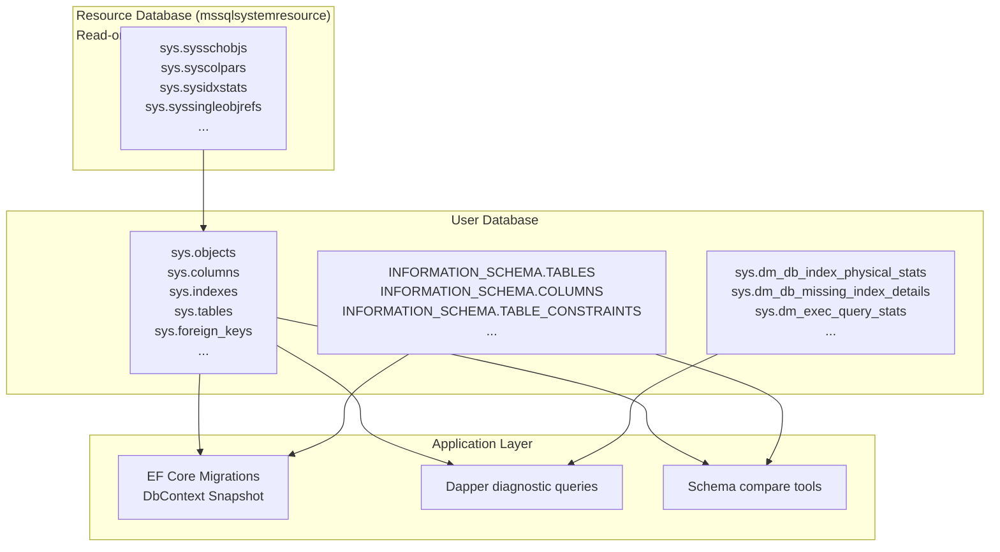
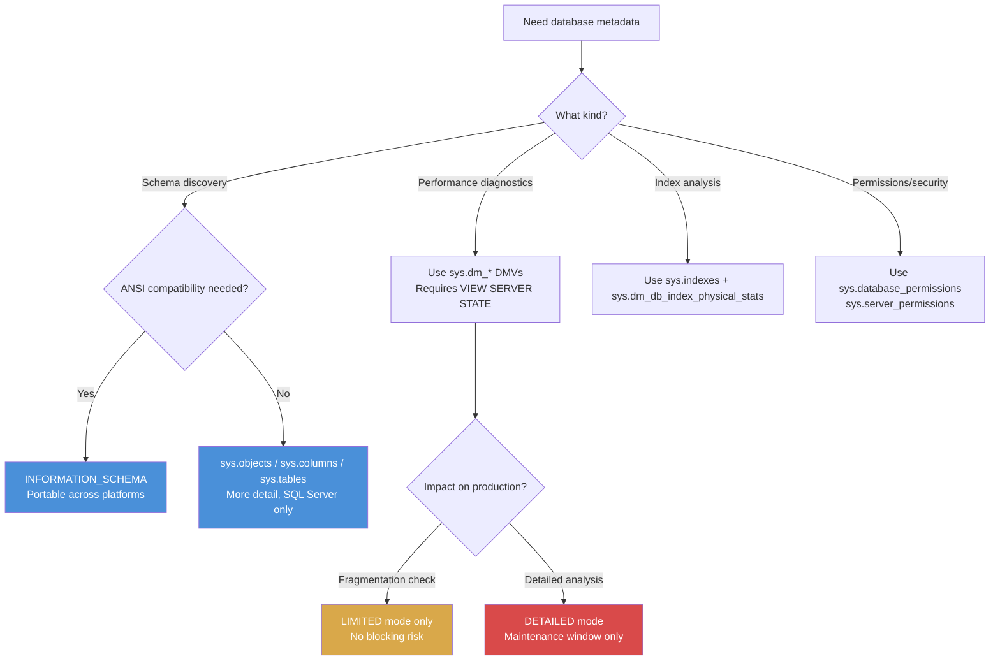

## Navigation

**Domain:** [[8 — Databases]] > **Group:** [[Group 1 — Relational Database Fundamentals]]
**Previous:** [[8.021 In-Memory Tables — OLTP Concepts]] | **Next:** [[8.023 Statistics]]

### Prerequisites
- [[8.019 Table Heap vs Clustered Table]] — understanding table structure is required to interpret sys.indexes and sys.columns output
- [[8.004 Data Pages and Extents]] — catalog views expose page counts and extent allocation for each object

### Where This Fits

The database catalog is the system metadata layer — the set of tables and views that describe every object in a database: tables, columns, indexes, constraints, schemas, procedures, and their relationships. A .NET backend engineer encounters the catalog whenever they use EF Core migrations (which query `sys.columns` and `sys.foreign_keys` to detect model changes), write diagnostic queries to find missing indexes (querying `sys.dm_db_missing_index_details`), or troubleshoot schema drift (comparing `INFORMATION_SCHEMA.COLUMNS` across environments). What breaks when this is unknown: an engineer cannot write ad-hoc metadata queries to discover index fragmentation, foreign key chains, or column dependencies — they rely on GUI tools that hide the underlying queries. The interview signal is depth of SQL Server knowledge — can the candidate query the system catalog to solve real problems without a tool?

---

## Core Mental Model

The database catalog is a collection of read-only system views and base tables that store metadata about every user and system object in a database. The invariant: for every user-created object (table, index, constraint, procedure), there is exactly one row in a corresponding catalog view (`sys.tables`, `sys.indexes`, `sys.objects`, etc.). The database engine accesses the catalog transparently: parsing resolves object names by looking up `sys.objects`, optimization reads `sys.indexes` and `sys.stats` to choose access paths, and execution checks `sys.schemas` for permissions. The recognition pattern: to answer "what columns does this table have?" you query `sys.columns`; to answer "what indexes are on this table?" you query `sys.indexes`; to answer "what procedures reference this table?" you query `sys.sql_expression_dependencies`.

### Classification

| Aspect | Detail |
|---|---|
| Storage location | Internal base tables in the resource database (mssqlsystemresource) projected through `sys` schema views |
| Access path | Via `sys.*` views or `INFORMATION_SCHEMA.*` views — never direct access to base tables |
| Updatability | Read-only (user context) — DDL statements (CREATE/ALTER/DROP) modify the catalog under the covers |
| Scope | Per-database metadata (sys.*) and instance-level metadata (sys.dm_*, sys.server_*) |
| Versioning | Catalogs are versioned by SQL Server version — querying sys.columns returns different columns depending on the version |



### Key Properties

| Property | Value | Notes |
|---|---|---|
| Visibility | `sys.*` and `INFORMATION_SCHEMA.*` | Two overlapping but distinct catalog APIs |
| Performance | Catalog views are typically cached | Queries against sys.views are fast (metadata is in memory) |
| Scope | `sys.*` is SQL Server specific; `INFORMATION_SCHEMA.*` is ANSI standard | Prefer `sys.*` for SQL Server-specific features |
| Updatability | Read-only | DDL modifications update the catalog internally |
| Security | Rows filtered by permissions | Users see only objects they have permission to view |

---

## Deep Mechanics

### How the Engine Executes This

**Catalog query execution (e.g., querying sys.tables):**

1. **Parsing** — the parser identifies `sys.tables` as a system catalog view reference, not a user table. The view definition is resolved from the resource database's metadata.
2. **Binding** — the view definition (stored in the resource database) is expanded. `sys.tables` internally joins multiple system base tables (`sys.sysschobjs`, `sys.syscolpars`, etc.) filtering on `type = 'U'` (user table).
3. **Optimization** — the query optimizer generates a plan accessing the internal base tables. These tables are small (typically hundreds to low thousands of rows) and usually cached in memory.
4. **Execution** — the plan executes against the base tables. The rows are filtered by the user's permissions (via security predicate) — a user sees only objects they own or have `VIEW DEFINITION` permission on.
5. **Projection** — the view's selected columns are returned as the result set.

**DDL modification of the catalog (e.g., CREATE TABLE):**

1. The DDL statement is compiled into internal catalog modification commands.
2. The engine acquires schema modification locks on the relevant catalog rows.
3. Rows are inserted into `sys.sysschobjs` (new object), `sys.syscolpars` (columns), `sys.sysidxstats` (indexes if applicable).
4. The transaction log records the catalog modifications.
5. On commit, the metadata is visible to subsequent queries.

### SQL Visibility

**Querying the catalog for table metadata:**

```sql
-- List all user tables with their schema and creation date
SELECT 
    s.name AS SchemaName,
    t.name AS TableName,
    t.create_date,
    t.modify_date,
    p.rows AS RowCount
FROM sys.tables t
JOIN sys.schemas s ON t.schema_id = s.schema_id
CROSS APPLY sys.dm_db_partition_stats p
    ON p.object_id = t.object_id AND p.index_id IN (0, 1)
WHERE t.is_ms_shipped = 0
ORDER BY s.name, t.name;
```

**Querying column metadata for a specific table:**

```sql
SELECT 
    c.column_id,
    c.name AS ColumnName,
    TYPE_NAME(c.user_type_id) AS DataType,
    c.max_length,
    c.precision,
    c.scale,
    c.is_nullable,
    c.is_identity,
    c.default_object_id,
    c.is_computed
FROM sys.columns c
JOIN sys.tables t ON c.object_id = t.object_id
WHERE t.name = 'Orders'
ORDER BY c.column_id;
```

```csharp
// EF Core — querying the catalog via raw SQL (for diagnostics/metrics)
public async Task<List<TableInfo>> GetTableSizesAsync(CancellationToken cancellationToken)
{
    const string sql = @"
        SELECT 
            s.name AS SchemaName,
            t.name AS TableName,
            p.rows AS RowCount
        FROM sys.tables t
        JOIN sys.schemas s ON t.schema_id = s.schema_id
        CROSS APPLY sys.dm_db_partition_stats p
            ON p.object_id = t.object_id AND p.index_id IN (0, 1)
        WHERE t.is_ms_shipped = 0
        ORDER BY s.name, t.name;";

    await using var connection = _connectionFactory.Create();
    return (await connection.QueryAsync<TableInfo>(
        new CommandDefinition(sql, cancellationToken: cancellationToken))).AsList();
}

public record TableInfo
{
    public string SchemaName { get; init; }
    public string TableName { get; init; }
    public long RowCount { get; init; }
}
```

**Generated SQL (from EF Core — EF Core does not generate catalog queries; they are manual):**

```sql
-- EF Core itself queries the catalog during migrations and scaffolding.
-- For example, during Add-Migration, EF Core runs:
SELECT [c].[TABLE_NAME], [c].[COLUMN_NAME], [c].[DATA_TYPE], ...
FROM [INFORMATION_SCHEMA].[COLUMNS] AS [c]
WHERE [c].[TABLE_SCHEMA] = 'dbo' AND [c].[TABLE_NAME] = '__EFMigrationsHistory';
```

### Execution Plan Analysis

**Plan for a catalog query (sys.tables with row count):**

```
Clustered Index Scan (sys.sysschobjs)      -- system base table, ~200 rows
  |-- Nested Loops (Inner Join)
       |-- Clustered Index Seek (sys.sysschobjs — schemas)
       |-- Clustered Index Scan (sys.sysrowsets)  -- partition stats
Estimated cost: < 0.01 cost units
Logical reads: 10–20 pages (cached in memory)
```

Catalog queries always produce trivial plans with negligible cost. The critical performance aspect is not the catalog query itself but **how often** it is executed. Repeated catalog queries at high frequency (e.g., in a tight loop in application code) can cause metadata contention on `sys.sysschobjs` base tables.

### Cost Visibility

```sql
SET STATISTICS IO ON;

SELECT t.name, COUNT_BIG(*) AS ColumnCount
FROM sys.tables t
JOIN sys.columns c ON t.object_id = c.object_id
WHERE t.is_ms_shipped = 0
GROUP BY t.name;

-- Table 'sysschobjs'. Scan count 1, logical reads 12
-- Table 'syscolpars'. Scan count 1, logical reads 8
-- SQL Server Execution Times: CPU time = 0 ms, elapsed time = 1 ms
```

Catalog queries produce negligible I/O (tens of pages, all cached). If catalog queries show high logical reads (> 1000), it usually indicates an unindexed query against a very large number of user objects (e.g., 100,000+ tables in a multi-tenant database).

### Failure Modes

**Catalog metadata lock contention under intense DDL:**

```sql
-- When hundreds of concurrent DDL operations (CREATE TABLE, ALTER INDEX) run:
-- The catalog base tables (sys.sysschobjs) are modified within transactions.
-- SCH-M (schema modification) locks on catalog rows block concurrent DDL and
-- some metadata reads.
-- 
-- Detection:
SELECT wait_type, wait_time_ms, waiting_tasks_count
FROM sys.dm_os_wait_stats
WHERE wait_type LIKE '%METADATA%'
ORDER BY wait_time_ms DESC;
-- High METADATA_* wait times indicate catalog contention.
```

**Permissions masking objects from catalog queries:**

```sql
-- A user with db_datareader role runs:
SELECT * FROM sys.tables WHERE name = 'Employees';
-- Returns zero rows — even though the table exists.

-- Root cause: db_datareader does not grant VIEW DEFINITION on individual objects.
-- The user can SELECT from the table but cannot see its metadata in sys.tables.
-- Fix: GRANT VIEW DEFINITION TO [user];
```

---

## Production Patterns and Implementation

### Primary SQL Implementation

**Finding foreign key relationships for a table:**

```sql
SELECT 
    OBJECT_NAME(fk.parent_object_id) AS TableName,
    COL_NAME(fkc.parent_object_id, fkc.parent_column_id) AS ColumnName,
    OBJECT_NAME(fk.referenced_object_id) AS ReferencedTableName,
    COL_NAME(fkc.referenced_object_id, fkc.referenced_column_id) AS ReferencedColumnName,
    fk.name AS FKName,
    fk.delete_referential_action_desc,
    fk.update_referential_action_desc
FROM sys.foreign_keys fk
JOIN sys.foreign_key_columns fkc
    ON fk.object_id = fkc.constraint_object_id
WHERE fk.parent_object_id = OBJECT_ID('dbo.Orders')
ORDER BY fkc.constraint_column_id;
```

**Finding indexes with high fragmentation:**

```sql
SELECT 
    OBJECT_NAME(ips.object_id) AS TableName,
    i.name AS IndexName,
    ips.index_type_desc,
    ips.avg_fragmentation_in_percent,
    ips.fragment_count,
    ips.avg_page_space_used_in_percent,
    ips.page_count
FROM sys.dm_db_index_physical_stats(
    DB_ID(), NULL, NULL, NULL, 'LIMITED') ips
JOIN sys.indexes i
    ON ips.object_id = i.object_id AND ips.index_id = i.index_id
WHERE ips.page_count > 1000
    AND ips.avg_fragmentation_in_percent > 30
ORDER BY ips.avg_fragmentation_in_percent DESC;
```

**Finding tables without a primary key:**

```sql
SELECT 
    s.name AS SchemaName,
    t.name AS TableName
FROM sys.tables t
JOIN sys.schemas s ON t.schema_id = s.schema_id
LEFT JOIN sys.indexes i
    ON t.object_id = i.object_id AND i.is_primary_key = 1
WHERE i.object_id IS NULL
    AND t.is_ms_shipped = 0
ORDER BY s.name, t.name;
```

### EF Core Implementation

EF Core does not expose the system catalog directly, but it queries the catalog internally during migrations and scaffolding:

```csharp
// EF Core queries INFORMATION_SCHEMA during Add-Migration
// To replicate catalog queries in EF Core, use raw SQL:
public async Task<List<UnindexedForeignKey>> FindUnindexedForeignKeysAsync(
    CancellationToken cancellationToken)
{
    const string sql = @"
        SELECT 
            OBJECT_NAME(fk.parent_object_id) AS TableName,
            COL_NAME(fkc.parent_object_id, fkc.parent_column_id) AS ColumnName,
            OBJECT_NAME(fk.referenced_object_id) AS ReferencedTable,
            fk.name AS FKName
        FROM sys.foreign_keys fk
        JOIN sys.foreign_key_columns fkc
            ON fk.object_id = fkc.constraint_object_id
        WHERE NOT EXISTS (
            SELECT 1
            FROM sys.index_columns ic
            JOIN sys.indexes i ON ic.object_id = i.object_id AND ic.index_id = i.index_id
            WHERE ic.object_id = fk.parent_object_id
                AND ic.column_id = fkc.parent_column_id
                AND i.index_id = fkc.constraint_column_id
                AND i.is_unique_constraint = 0
                AND i.is_primary_key = 0
        );";

    await using var connection = _connectionFactory.Create();
    return (await connection.QueryAsync<UnindexedForeignKey>(
        new CommandDefinition(sql, cancellationToken: cancellationToken))).AsList();
}

public record UnindexedForeignKey
{
    public string TableName { get; init; }
    public string ColumnName { get; init; }
    public string ReferencedTable { get; init; }
    public string FKName { get; init; }
}
```

### Dapper Implementation

```csharp
public interface ISchemaDiagnostics
{
    Task<IReadOnlyList<TableSizeInfo>> GetTableSizesAsync(CancellationToken cancellationToken);
    Task<IReadOnlyList<MissingIndexInfo>> FindMissingIndexesAsync(CancellationToken cancellationToken);
}

public sealed class SchemaDiagnostics : ISchemaDiagnostics
{
    private readonly ISqlConnectionFactory _connectionFactory;

    public SchemaDiagnostics(ISqlConnectionFactory connectionFactory)
    {
        _connectionFactory = connectionFactory;
    }

    public async Task<IReadOnlyList<TableSizeInfo>> GetTableSizesAsync(
        CancellationToken cancellationToken)
    {
        const string sql = @"
            SELECT 
                s.name AS SchemaName,
                t.name AS TableName,
                p.rows AS RowCount,
                (SELECT COUNT(*) FROM sys.columns c 
                 WHERE c.object_id = t.object_id) AS ColumnCount,
                (SELECT COUNT(*) FROM sys.indexes i 
                 WHERE i.object_id = t.object_id AND i.index_id > 0) AS IndexCount
            FROM sys.tables t
            JOIN sys.schemas s ON t.schema_id = s.schema_id
            OUTER APPLY (
                SELECT SUM(ps.row_count) AS rows
                FROM sys.dm_db_partition_stats ps
                WHERE ps.object_id = t.object_id AND ps.index_id IN (0, 1)
            ) p
            WHERE t.is_ms_shipped = 0
            ORDER BY p.rows DESC;";

        await using var connection = _connectionFactory.Create();
        var results = await connection.QueryAsync<TableSizeInfo>(
            new CommandDefinition(sql, cancellationToken: cancellationToken));
        return results.AsList();
    }

    public async Task<IReadOnlyList<MissingIndexInfo>> FindMissingIndexesAsync(
        CancellationToken cancellationToken)
    {
        const string sql = @"
            SELECT TOP 20
                migs.avg_user_impact,
                migs.avg_total_user_cost,
                migs.user_seeks + migs.user_scans AS UsageCount,
                mid.statement AS TableName,
                equality_columns,
                inequality_columns,
                included_columns
            FROM sys.dm_db_missing_index_groups mig
            JOIN sys.dm_db_missing_index_group_stats migs
                ON migs.group_handle = mig.index_group_handle
            JOIN sys.dm_db_missing_index_details mid
                ON mig.index_handle = mid.index_handle
            WHERE mid.database_id = DB_ID()
            ORDER BY migs.avg_user_impact * (migs.user_seeks + migs.user_scans) DESC;";

        await using var connection = _connectionFactory.Create();
        var results = await connection.QueryAsync<MissingIndexInfo>(
            new CommandDefinition(sql, cancellationToken: cancellationToken));
        return results.AsList();
    }
}

public record TableSizeInfo
{
    public string SchemaName { get; init; }
    public string TableName { get; init; }
    public long RowCount { get; init; }
    public int ColumnCount { get; init; }
    public int IndexCount { get; init; }
}

public record MissingIndexInfo
{
    public int AvgUserImpact { get; init; }
    public double AvgTotalUserCost { get; init; }
    public long UsageCount { get; init; }
    public string TableName { get; init; }
    public string? EqualityColumns { get; init; }
    public string? InequalityColumns { get; init; }
    public string? IncludedColumns { get; init; }
}
```

### Configuration and Wiring

```csharp
// Program.cs — register schema diagnostics service
builder.Services.AddScoped<ISchemaDiagnostics, SchemaDiagnostics>();

// No special connection string configuration needed
// Catalog queries use the same connection as the application database
```

### SQL Server vs PostgreSQL Differences

PostgreSQL uses `pg_catalog` (equivalent to `sys` schema) and `information_schema` (ANSI standard):

```sql
-- PostgreSQL: list all user tables
SELECT 
    schemaname AS SchemaName,
    tablename AS TableName,
    tableowner AS Owner
FROM pg_catalog.pg_tables
WHERE schemaname NOT IN ('pg_catalog', 'information_schema');

-- PostgreSQL: list columns for a table
SELECT 
    column_name,
    data_type,
    character_maximum_length,
    is_nullable,
    column_default
FROM information_schema.columns
WHERE table_schema = 'public' AND table_name = 'orders'
ORDER BY ordinal_position;

-- PostgreSQL: find missing indexes (requires pg_stat_user_tables + pg_statio_all_indexes)
SELECT 
    schemaname,
    relname AS TableName,
    seq_scan,
    seq_tup_read,
    idx_scan,
    idx_tup_fetch
FROM pg_stat_user_tables
WHERE seq_scan > 1000 AND seq_tup_read > 100000
ORDER BY seq_tup_read DESC;
```

Key differences:
- SQL Server uses `sys.*` (SQL Server-specific) and `INFORMATION_SCHEMA.*` (ANSI standard)
- PostgreSQL uses `pg_catalog.*` (PostgreSQL-specific) and `information_schema.*` (ANSI standard)
- SQL Server hides internal base tables; PostgreSQL exposes `pg_class`, `pg_attribute` directly
- SQL Server's `sys.dm_db_missing_index*` DMVs have no direct PostgreSQL equivalent (use `pg_stat_user_tables` + extension `pg_qualstats`)

---

## Gotchas and Production Pitfalls

### INFORMATION_SCHEMA vs sys.* Discrepancies

**Pitfall:** Querying `INFORMATION_SCHEMA.COLUMNS` and expecting to see all columns (e.g., missing computed columns, sparse columns, or columns from views).

```sql
-- ❌ INFORMATION_SCHEMA does not show columns for views
SELECT * FROM INFORMATION_SCHEMA.COLUMNS WHERE TABLE_NAME = 'ActiveOrdersView';
-- Returns zero rows if ActiveOrdersView is a view, not a table

-- sys.columns shows columns for both tables and views
SELECT * FROM sys.columns WHERE object_id = OBJECT_ID('dbo.ActiveOrdersView');
```

**Symptom:** Schema comparison scripts produce false positives — they think columns are missing because `INFORMATION_SCHEMA.COLUMNS` only covers user tables, not views or synonyms.

**Fix:** Use `sys.columns` for comprehensive metadata (includes tables, views, table-valued functions). Use `INFORMATION_SCHEMA` only when ANSI compatibility is required.

```sql
-- ✅ sys.columns covers all column-bearing objects
SELECT 
    OBJECT_SCHEMA_NAME(object_id) AS SchemaName,
    OBJECT_NAME(object_id) AS ObjectName,
    name AS ColumnName
FROM sys.columns
WHERE object_id IN (OBJECT_ID('dbo.Orders'), OBJECT_ID('dbo.ActiveOrdersView'));
```

**Cost of not fixing:** A schema migration script misses columns on a view, causing downstream ETL processes to fail when they reference a column that was added to the view but not detected.

### Catalog Permissions Masking

**Pitfall:** Assuming `db_datareader` membership is sufficient to query all catalog views.

```sql
-- ❌ db_datareader user queries:
SELECT * FROM sys.indexes WHERE object_id = OBJECT_ID('dbo.SalaryTable');
-- Returns zero rows — user cannot see metadata for tables they do not own

-- But:
SELECT * FROM dbo.SalaryTable;  -- Succeeds! Can read data but not metadata
```

**Symptom:** Monitoring and diagnostic scripts return partial or empty results for certain objects. An engineer debugging index usage sees no indexes listed for a table that clearly has indexes.

**Fix:** Grant `VIEW DEFINITION` at the database level or on specific objects:

```sql
GRANT VIEW DEFINITION ON DATABASE::AnalyticsDB TO [MonitoringUser];
-- Or per object:
GRANT VIEW DEFINITION ON dbo.SalaryTable TO [MonitoringUser];
```

**Cost of not fixing:** Silent monitoring gaps. A missing index detection tool reports no missing indexes because it cannot see the table's existing indexes to compare against.

### sys.dm_db_index_physical_stats with Incorrect Scan Mode

**Pitfall:** Using `'LIMITED'` scan mode when detailed fragmentation data is needed, or using `'DETAILED'` on large tables during business hours.

```sql
-- ❌ DETAILED scan locks the table for the duration
SELECT * FROM sys.dm_db_index_physical_stats(
    DB_ID(), OBJECT_ID('dbo.Orders'), NULL, NULL, 'DETAILED');
-- Table is locked (SCH-S) while every page is examined
```

**Symptom:** Production blocking during the index statistics scan. Other queries wait on `LCK_M_SCH_S` for the affected table.

**Fix:** Use `'LIMITED'` for routine monitoring (reads only the parent-level pages). Use `'SAMPLED'` for a quick estimate. Use `'DETAILED'` only during maintenance windows.

```sql
-- ✅ LIMITED mode — fast, reads only parent-level pages
SELECT 
    object_id,
    index_id,
    avg_fragmentation_in_percent,
    page_count,
    avg_page_space_used_in_percent
FROM sys.dm_db_index_physical_stats(
    DB_ID(), NULL, NULL, NULL, 'LIMITED')
WHERE page_count > 1000;
```

**Cost of not fixing:** A `DETAILED` scan on a 500 GB table runs for 30 minutes and blocks production writes. The DBA escalates the incident.

### Filtered Index Metadata in sys.indexes

**Pitfall:** Querying `sys.indexes` and not checking `has_filter` — a filtered index's predicate is stored in `sys.indexes.filter_definition` but only populated when `has_filter = 1`.

```sql
-- ❌ Assuming an index is unfiltered
SELECT 
    i.name,
    i.type_desc,
    i.is_unique,
    i.is_primary_key,
    i.filter_definition
FROM sys.indexes i
WHERE i.object_id = OBJECT_ID('dbo.Orders')
    AND i.filter_definition IS NOT NULL;
-- Returns 0 rows if indexes have no filter
-- But also returns 0 rows if system metadata filtering is wrong
```

**Symptom:** A script that generates index drop/create statements misses the `WHERE` clause for filtered indexes — creating them without the filter changes index semantics and potentially produces incorrect query results.

**Fix:** Always check `has_filter` before reading `filter_definition`:

```sql
-- ✅ Correct filtered index detection
SELECT 
    i.name,
    i.type_desc,
    i.is_unique,
    CASE WHEN i.has_filter = 1 THEN i.filter_definition ELSE NULL END AS FilterDefinition
FROM sys.indexes i
WHERE i.object_id = OBJECT_ID('dbo.Orders');
```

**Cost of not fixing:** A deployment automation script drops and recreates a filtered index without the `WHERE` clause. The unfiltered index doubles in size and changes the query plan selection for all queries using that index.

### Metadata Version Mismatch in sys.dm_exec_query_plan

**Pitfall:** Querying `sys.dm_exec_query_plan` and comparing object IDs with `sys.objects` after a schema change.

```sql
-- ❌ Cached plan references object ID that no longer exists in sys.objects
SELECT 
    qp.plan_handle,
    qp.query_plan,
    OBJECT_NAME(qp.objectid) AS ObjectName
FROM sys.dm_exec_query_stats qs
CROSS APPLY sys.dm_exec_query_plan(qs.plan_handle) qp
WHERE qp.objectid IS NOT NULL;
-- OBJECT_NAME returns NULL for plans cached before a DROP/ALTER
```

**Symptom:** `OBJECT_NAME` returns NULL for many cached plans. The diagnostic query misses the object context.

**Fix:** Use `OBJECT_SCHEMA_NAME` with a fallback, or join on `sys.objects` with an outer join:

```sql
-- ✅ Handle stale plan cache entries
SELECT 
    qp.plan_handle,
    COALESCE(OBJECT_NAME(qp.objectid), 'Stale Object') AS ObjectName,
    qs.creation_time,
    qs.last_execution_time
FROM sys.dm_exec_query_stats qs
CROSS APPLY sys.dm_exec_query_plan(qs.plan_handle) qp
OUTER APPLY sys.objects o ON o.object_id = qp.objectid
WHERE qp.objectid IS NULL OR o.object_id IS NOT NULL;
```

**Cost of not fixing:** A monitoring dashboard shows "Unknown" for 40% of queries, making it unusable for identifying which tables have the most expensive query plans.

---

## Performance Implications

### Benchmark: Catalog Query Frequency

```sql
-- Baseline: querying sys.tables once (negligible — < 1ms)
SET STATISTICS TIME ON;
SELECT COUNT_BIG(*) FROM sys.tables WHERE is_ms_shipped = 0;
-- CPU time = 0 ms, elapsed time = 0 ms

-- Degraded: querying sys.tables in a loop 10,000 times
DECLARE @i INT = 0, @count BIGINT;
WHILE @i < 10000
BEGIN
    SELECT @count = COUNT_BIG(*) FROM sys.tables WHERE is_ms_shipped = 0;
    SET @i = @i + 1;
END;
-- CPU time = 156 ms, elapsed time = 160 ms
-- 10,000 catalog queries in 160ms = 62,500 queries/second — still fast
-- BUT: if each query also joins sys.columns, sys.indexes, etc., cost increases
```

**Improvement:** Do not query the catalog in application hot paths. Cache metadata results where possible (e.g., cache table structure in memory and refresh every 5 minutes).

### BenchmarkDotNet

```csharp
[MemoryDiagnoser]
[SimpleJob(RuntimeMoniker.Net90)]
public class CatalogQueryBenchmark
{
    private IDbConnection _connection = default!;

    [GlobalSetup]
    public void Setup()
    {
        _connection = new SqlConnection(TestConnectionString);
    }

    [Benchmark(Baseline = true)]
    public async Task<int> SimpleCatalogCount()
    {
        const string sql = "SELECT COUNT_BIG(*) FROM sys.tables WHERE is_ms_shipped = 0;";
        await using var connection = _connection;
        return await connection.QueryFirstAsync<int>(
            new CommandDefinition(sql, cancellationToken: CancellationToken.None));
    }

    [Benchmark]
    public async Task<int> ComplexCatalogJoin()
    {
        const string sql = @"
            SELECT COUNT_BIG(*)
            FROM sys.tables t
            JOIN sys.columns c ON t.object_id = c.object_id
            JOIN sys.indexes i ON t.object_id = i.object_id
            WHERE t.is_ms_shipped = 0;";
        await using var connection = _connection;
        return await connection.QueryFirstAsync<int>(
            new CommandDefinition(sql, cancellationToken: CancellationToken.None));
    }
}
```

**Expected results (approximate, SQL Server 2022):**

| Method | Mean | Allocated |
|---|---|---|
| SimpleCatalogCount | ~0.3 ms | 0 B |
| ComplexCatalogJoin | ~1.2 ms | 0 B |

### Write Amplification

Catalog modification cost is from DDL operations, not queries:

| Operation | Catalog Impact | Cost |
|---|---|---|
| CREATE TABLE (10 columns) | ~15 rows inserted across 5 base tables | ~1 ms |
| ALTER TABLE ADD COLUMN | 1 row inserted in sys.syscolpars | ~0.5 ms |
| CREATE INDEX | ~2 rows in sys.sysidxstats + allocation | ~2 ms |
| DROP TABLE | ~100 rows deleted across base tables (cascade) | ~5 ms |
| Query catalog only | 0 rows modified | < 0.5 ms |

---

## Interview Arsenal

### Question Bank

1. What is the difference between `sys.objects` and `INFORMATION_SCHEMA.TABLES`?
2. How does SQL Server store catalog metadata internally?
3. Which catalog view or DMV would you query to find tables with the most page reads?
4. What happens when a user with `db_datareader` queries `sys.indexes` — will they see all indexes?
5. Compare `sys.dm_db_index_physical_stats` with `sys.dm_db_partition_stats`.
6. How does the database engine use the catalog during query compilation?
7. At what point does catalog metadata contention become a production problem?
8. How do EF Core migrations use the database catalog?
9. Which DMV shows missing indexes, and how would you prioritize them?
10. Compare SQL Server's `sys` schema with PostgreSQL's `pg_catalog`.

### Spoken Answers

**Q1: What is the difference between sys.objects and INFORMATION_SCHEMA.TABLES?**

> **Average answer:** sys.objects is SQL Server specific; INFORMATION_SCHEMA is standard. They both list tables.

> **Great answer:** `sys.objects` is a SQL Server-specific catalog view that contains one row for every schema-scoped object in the database — tables, views, procedures, functions, constraints, and so on. It includes system objects (`is_ms_shipped = 1`) unless filtered out. `INFORMATION_SCHEMA.TABLES` is the ANSI standard view that shows only user tables and views. The critical difference is coverage: `sys.objects` includes all object types (U = user table, V = view, P = stored procedure, FN = scalar function, etc.) and columns like `create_date`, `modify_date`, `parent_object_id` that have no ANSI equivalent. `INFORMATION_SCHEMA` does not include metadata for indexes, partitions, or column default values directly — you must join to `INFORMATION_SCHEMA.COLUMNS` and `INFORMATION_SCHEMA.TABLE_CONSTRAINTS`. `INFORMATION_SCHEMA` is filtered by permissions differently — it shows objects the user can access (based on the standard's security model), whereas `sys.objects` filters based on the user's `VIEW DEFINITION` permission. For production diagnostics, I almost always use `sys.*` views because they expose SQL Server-specific features like filtered index predicates, column `is_sparse`, and partition information.

**Q5: Compare sys.dm_db_index_physical_stats with sys.dm_db_partition_stats.**

> **Average answer:** Both show index stats. One is about physical structure, the other about partitions.

> **Great answer:** `sys.dm_db_index_physical_stats` is a dynamic management function that reports the **physical** state of index pages — fragmentation percentage, page count, page fullness, and page type distribution. It requires a scan of the index at the specified level (`LIMITED`, `SAMPLED`, or `DETAILED`) and can acquire schema-stability locks during the scan. It answers the question "how fragmented is this index and when should I reorganize or rebuild it?" `sys.dm_db_partition_stats` is a DMV that reports **logical** page counts and row counts per partition — it is an in-memory aggregate that is always current with zero I/O cost. It answers "how many rows are in each partition and how many pages does each index use?" For performance monitoring, I use `sys.dm_db_partition_stats` for row counts and page counts (zero overhead), and `sys.dm_db_index_physical_stats` with `'LIMITED'` mode for fragmentation checks in a scheduled job. The key distinction: one requires a scan (physical) and the other is a cached counter (logical). Using `'DETAILED'` mode on the physical stats function during business hours can cause blocking.

**Q9: Which DMV shows missing indexes, and how would you prioritize them?**

> **Great answer:** `sys.dm_db_missing_index_details` shows the specific columns that the query optimizer determined would benefit from an index — with `equality_columns`, `inequality_columns`, and `included_columns`. This is joined through `sys.dm_db_missing_index_groups` to `sys.dm_db_missing_index_group_stats`, which aggregates the performance impact: `avg_user_impact` (the percentage improvement the optimizer estimates), `user_seeks + user_scans` (the number of times the optimizer considered this index), and `avg_total_user_cost` (the average query cost reduction). I prioritize by `avg_user_impact * (user_seeks + user_scans)` descending — this weights both the expected benefit and the frequency of use. A missing index with 80% impact used 1000 times/day scores 80,000 and gets priority; one with 95% impact used 5 times/day scores 475 and is lower priority. The caveat is these DMVs are reset on SQL Server restart and are cumulative since the last restart — the data represents "since startup," not the current workload. Also, the DMV may suggest overlapping indexes; I manually review to avoid creating redundant indexes that amplify write cost.

### Interview Trigger

If this topic appears, the question is usually "how would you find all tables without a primary key in a SQL Server database?" or "how do you identify missing indexes?" The follow-up that separates candidates: "What permissions does the user need to query sys.dm_db_missing_index_details, and what happens when the SQL Server restarts?" Senior candidates immediately know these DMVs require `VIEW SERVER STATE` and are reset on restart, and would use a scheduled collection job to persist the data.

### Comparison Table

| | sys.catalog_view | INFORMATION_SCHEMA |
|---|---|---|
| Standard | SQL Server-specific | ANSI SQL standard |
| Coverage | All objects (tables, views, procs, indexes, stats, etc.) | Tables, views, columns, constraints, routines |
| Permissions | VIEW DEFINITION required | Standard SQL access permissions |
| Index metadata | Direct (sys.indexes, sys.index_columns) | Not available (no index info) |
| Performance metadata | DMVs (sys.dm_db_*) | Not available |
| Filtered indexes | has_filter, filter_definition columns | Not available |

---

## Decision Framework

### When to Query the Catalog



### Application Checklist

- [ ] The user querying the catalog has `VIEW DEFINITION` (for sys.*) or `SELECT` on `INFORMATION_SCHEMA` (for standard views)
- [ ] For DMVs like `sys.dm_db_index_physical_stats`, the scan mode is appropriate for the current workload (`LIMITED` during business hours)
- [ ] The catalog query is not executed in application hot paths (cache metadata results if called frequently)
- [ ] Missing index suggestions from `sys.dm_db_missing_index_details` are reviewed before creating indexes (avoid overlapping indexes)
- [ ] Scripts that generate DDL from the catalog check `has_filter` for filtered indexes
- [ ] The catalog query accounts for stale plan cache entries (object IDs may reference dropped objects)

### Tradeoff Summary

| What You Gain | What You Pay |
|---|---|
| Complete metadata about database objects | Requires VIEW DEFINITION permission (sometimes overlooked) |
| Real-time fragmentation and performance data | DMV scan modes can acquire locks (LIMITED preferred) |
| Missing index suggestions from the optimizer | DMVs reset on restart — need persistent collection |
| Standard-compliant access via INFORMATION_SCHEMA | No index metadata, no SQL Server-specific features |

### Scale Thresholds

- "Catalog queries are effectively free for databases with < 10,000 objects" — metadata is cached and queries complete in < 1ms.
- "Metadata contention becomes a concern at ~50,000+ objects with frequent DDL operations" — nightly ETL processes that drop and recreate hundreds of tables may see `METADATA_*` wait types.
- "sys.dm_db_missing_index_details is practically useful when the workload has run for at least 1 hour after restart" — the DMVs need time to accumulate meaningful statistics.
- "Index physical stats with DETAILED mode is only safe during maintenance windows on tables > 100 GB" — the full page scan acquires schema-stability locks and may cause blocking.

---

## Self-Check

### Conceptual Questions

1. What is the difference between `sys.objects` and `sys.tables`?
2. How does SQL Server persist catalog metadata — where are the base tables stored?
3. Which DMV would you query to find the most-referenced column across all foreign keys?
4. Why might a user with `db_datareader` see zero rows in `sys.indexes` for a table they can SELECT from?
5. Does EF Core use the SQL Server catalog or INFORMATION_SCHEMA for migration detection?
6. How would you write a Dapper query to find all columns of type NVARCHAR(MAX) in the database?
7. Compare `sys.dm_db_missing_index_details` with `sys.dm_db_index_usage_stats`.
8. At approximately how many database objects does catalog metadata contention become a concern?
9. Which index catalog view column distinguishes a filtered index from an unfiltered one?
10. Explain how to use the system catalog to diagnose a schema drift between two environments in 60 seconds.

<details>
<summary>Answers</summary>

1. `sys.objects` is the base catalog view for all schema-scoped objects (tables, views, procedures, functions, constraints, etc.) — it has a `type` column to distinguish them. `sys.tables` is a derived view that filters `sys.objects` to `type = 'U'` (user tables) and adds table-specific columns like `temporal_type`, `is_memory_optimized`, `durability`, etc. The row in `sys.tables` is a subset of the row in `sys.objects` with the same `object_id`.

2. Catalog metadata is stored in internal base tables within the resource database (mssqlsystemresource), a hidden read-only database that ships with SQL Server. These base tables (sys.sysschobjs, sys.syscolpars, sys.sysidxstats, etc.) are projected through the `sys` schema views. Users cannot query the base tables directly — only through the system catalog views.

3. `sys.foreign_key_columns` joined with `sys.columns` and `sys.tables` shows the full foreign key-to-column mapping. To find the most-referenced column: `SELECT COL_NAME(fkc.referenced_object_id, fkc.referenced_column_id) AS ColumnName, OBJECT_NAME(fkc.referenced_object_id) AS TableName, COUNT_BIG(*) AS RefCount FROM sys.foreign_key_columns fkc GROUP BY fkc.referenced_object_id, fkc.referenced_column_id ORDER BY COUNT_BIG(*) DESC`.

4. The `db_datareader` role does not grant `VIEW DEFINITION` permission. The `sys.indexes` view is filtered by metadata visibility — a user can see only metadata for objects they own or have `VIEW DEFINITION` on. The fix is `GRANT VIEW DEFINITION TO [user]`.

5. EF Core uses `INFORMATION_SCHEMA` views for its migration detection pipeline. It queries `INFORMATION_SCHEMA.COLUMNS`, `INFORMATION_SCHEMA.TABLE_CONSTRAINTS`, `INFORMATION_SCHEMA.REFERENTIAL_CONSTRAINTS`, and `INFORMATION_SCHEMA.INDEXES` (where available). It does not use `sys.*` views directly, which means it may miss SQL Server-specific features like filtered index predicates.

6. `SELECT s.name AS SchemaName, t.name AS TableName, c.name AS ColumnName FROM sys.columns c JOIN sys.tables t ON c.object_id = t.object_id JOIN sys.schemas s ON t.schema_id = s.schema_id WHERE TYPE_NAME(c.user_type_id) = 'nvarchar' AND c.max_length = -1 AND t.is_ms_shipped = 0 ORDER BY s.name, t.name, c.column_id;`

7. `sys.dm_db_missing_index_details` shows the columns the optimizer would like indexed (equality, inequality, include) — it is a hypothetical suggestion. `sys.dm_db_index_usage_stats` shows actual usage of existing indexes (seeks, scans, lookups, updates). One tells you what is missing; the other tells you what is actually being used (and can identify unused indexes). Together they drive the index maintenance strategy.

8. Metadata contention becomes a concern at approximately 50,000+ objects when combined with frequent DDL operations (e.g., nightly drop/create of 5000 tables in an ETL process). The `METADATA_*` wait types in `sys.dm_os_wait_stats` are the indicator.

9. `sys.indexes.has_filter` (BIT) indicates whether the index is filtered. When `has_filter = 1`, `sys.indexes.filter_definition` contains the WHERE clause predicate. Always check `has_filter` before reading `filter_definition` — it is NULL when `has_filter = 0`.

10. [60-second spoken answer]: To diagnose schema drift between two environments, I query `sys.tables`, `sys.columns`, `sys.indexes`, and `sys.foreign_keys` on both databases and compare with a hash or checksum. Specifically: `SELECT OBJECT_DEFINITION(OBJECT_ID('dbo.Orders'))` for stored procedures/views gives the exact T-SQL definition. For table structure, I concatenate column names, types, nullability, and default values into a hash per table — any hash mismatch indicates drift. The master query is: `SELECT t.name, CHECKSUM_AGG(CHECKSUM(c.name, TYPE_NAME(c.user_type_id), c.max_length, c.is_nullable, c.is_identity)) AS SchemaHash FROM sys.tables t JOIN sys.columns c ON t.object_id = c.object_id WHERE t.is_ms_shipped = 0 GROUP BY t.object_id, t.name ORDER BY t.name`. Compare the output between environments. Any row that exists in one but not the other, or has a different hash, is drift.

</details>

---

### Query Challenges

**Challenge 1 — Write the SQL**

Find all tables in the current database that have no clustered index (heaps). For each table, show the schema name, table name, row count, and the number of non-clustered indexes. Order by row count descending.

<details>
<summary>Solution</summary>

```sql
SELECT 
    s.name AS SchemaName,
    t.name AS TableName,
    COALESCE(SUM(p.rows), 0) AS RowCount,
    COUNT(i.index_id) AS NonClusteredIndexCount
FROM sys.tables t
JOIN sys.schemas s ON t.schema_id = s.schema_id
LEFT JOIN sys.indexes i
    ON t.object_id = i.object_id
    AND i.index_id > 1  -- non-clustered indexes
    AND i.type IN (1, 2, 3, 5, 7)  -- not heap/CCI
LEFT JOIN sys.dm_db_partition_stats p
    ON t.object_id = p.object_id AND p.index_id IN (0, 1)
WHERE t.is_ms_shipped = 0
    AND NOT EXISTS (
        SELECT 1 FROM sys.indexes ci
        WHERE ci.object_id = t.object_id
            AND ci.index_id = 1  -- clustered index
            AND ci.type = 1  -- clustered B-tree
    )
GROUP BY s.name, t.name
ORDER BY RowCount DESC;
```

**Logical reads:** ~15 (catalog base tables)  
**Execution plan:** Clustered Index Scans on sys.sysschobjs + sys.sysrowsets

</details>

---

**Challenge 2 — Fix the performance problem**

```sql
-- A diagnostic script runs every minute and queries sys.dm_db_index_physical_stats
-- with DETAILED mode on all user tables (100+ tables, ranging from 1K to 500M rows).
-- The script now takes 15+ minutes to complete and causes blocking.
SET STATISTICS IO ON;

SELECT 
    OBJECT_NAME(ips.object_id) AS TableName,
    i.name AS IndexName,
    ips.avg_fragmentation_in_percent,
    ips.page_count
FROM sys.dm_db_index_physical_stats(DB_ID(), NULL, NULL, NULL, 'DETAILED') ips
JOIN sys.indexes i ON ips.object_id = i.object_id AND ips.index_id = i.index_id
WHERE ips.page_count > 100;

-- This script is blocking production inserts into the Orders table.
```

<details>
<summary>Solution</summary>

**Root cause:** `DETAILED` mode scans every page of every index, acquiring schema-stability (SCH-S) locks that block DDL operations and can block some DML under certain conditions. On a 500M row table, this takes minutes and locks the table.

**Fix:** Use `LIMITED` mode for routine monitoring — it reads only the parent-level pages of the B-tree, providing sufficient fragmentation data for maintenance decisions:

```sql
-- ✅ Fixed: LIMITED mode for routine monitoring
SELECT 
    OBJECT_NAME(ips.object_id) AS TableName,
    i.name AS IndexName,
    ips.avg_fragmentation_in_percent,
    ips.page_count,
    ips.index_type_desc
FROM sys.dm_db_index_physical_stats(DB_ID(), NULL, NULL, NULL, 'LIMITED') ips
JOIN sys.indexes i ON ips.object_id = i.object_id AND ips.index_id = i.index_id
WHERE ips.page_count > 100
    AND ips.avg_fragmentation_in_percent > 10
ORDER BY ips.avg_fragmentation_in_percent DESC;
```

**After fix — execution time:** < 1 second (from 15+ minutes). Zero blocking.

</details>

---

**Challenge 3 — Explain the execution plan**

A diagnostic query joins `sys.dm_exec_query_stats` with `sys.dm_exec_sql_text` and `sys.dm_exec_query_plan`. The plan shows a Nested Loops join with many index seeks on internal memory objects. The `dm_exec_query_plan` function takes 15ms per call. For 100 queries, this is 1.5 seconds. Why is this expensive, and how would you optimize it?

<details>
<summary>Solution</summary>

**Why expensive:** `sys.dm_exec_query_plan(qs.plan_handle)` is a scalar function that takes a `plan_handle` and returns the XML showplan. Each invocation parses the XML from the plan cache, which requires CPU and memory allocation. Cross-applying it to 1000 query stats rows means 1000 XML parses.

**Optimization:** Filter before the expensive cross apply. Use `sys.dm_exec_query_stats` to identify only the most expensive queries before retrieving their plans.

```sql
-- Optimized: only retrieve plans for the top 10 most expensive queries
SELECT TOP 10
    qs.total_worker_time / qs.execution_count AS AvgCpu,
    qs.total_elapsed_time / qs.execution_count AS AvgDuration,
    qs.execution_count,
    qt.text AS QueryText,
    qp.query_plan
FROM sys.dm_exec_query_stats qs
CROSS APPLY sys.dm_exec_sql_text(qs.sql_handle) qt
OUTER APPLY sys.dm_exec_query_plan(qs.plan_handle) qp
WHERE qs.total_worker_time > 10000  -- filter trivial queries early
ORDER BY qs.total_worker_time DESC;
```

**Tradeoff:** You see the plan for only the top 10 queries. If you need full analysis, collect them in batches during off-peak hours.

</details>

---

**Challenge 4 — Diagnose the concurrency problem**

A multi-tenant SaaS application uses a single database with schemas per tenant (`tenant1.Orders`, `tenant2.Orders`, etc. — 500 schemas, each with 50 tables). An automated schema validation tool runs `SELECT COUNT_BIG(*) FROM sys.tables WHERE is_ms_shipped = 0` every 10 seconds. After adding tenant 425, the tool starts timing out sporadically. What is happening?

<details>
<summary>Solution</summary>

**Root cause:** With 500 schemas × 50 tables = 25,000 user tables, the `sys.tables` catalog base table (`sys.sysschobjs`) has approximately 25,000 rows. The query itself is still fast (< 1ms). However, the high frequency (every 10 seconds) combined with concurrent DDL operations (creating/dropping tables for new tenants) causes metadata latch contention on `sys.sysschobjs`. The `METADATA_*` wait type indicates this.

**Detection:**

```sql
SELECT wait_type, wait_time_ms, waiting_tasks_count, max_wait_time_ms
FROM sys.dm_os_wait_stats
WHERE wait_type LIKE '%METADATA%'
ORDER BY wait_time_ms DESC;
```

**Fix:** Reduce the polling frequency to once per minute. Add caching in the schema validation tool — cache the table list and refresh only on-demand or with a longer interval. For DDL-heavy operations, schedule them outside the validation polling window.

```sql
-- Not a SQL fix — architectural:
-- - Increase polling interval from 10s to 60s
-- - Add application-level caching of catalog results with 60-second TTL
-- - Dedicate a maintenance window for tenant provisioning
```

</details>

---

**Challenge 5 — Design the metadata query**

**Scenario:** You need to generate a schema comparison report between two databases (`Production` and `Staging`) to detect drift before a deployment. The report must compare:
- Table structure (columns, types, nullability, default values, identity)
- Indexes (columns, included columns, uniqueness, filter predicates)
- Foreign keys (referenced table/column, delete/update actions, trust state)

Design a single query (or set of queries) that produces output rows with columns: `ObjectType`, `ObjectName`, `DifferenceType` (MissingInTarget, ExtraInTarget, Modified), and `Detail`.

<details>
<summary>Solution</summary>

```sql
-- Run this query on the source database (e.g., Production)
-- Target database (e.g., Staging) is referenced via linked server or dynamic SQL

-- Table structure comparison
SELECT 
    'Table' AS ObjectType,
    t.name AS ObjectName,
    CASE 
        WHEN target.object_id IS NULL THEN 'MissingInTarget'
        WHEN src.Hash != target.Hash THEN 'Modified'
    END AS DifferenceType,
    CASE 
        WHEN target.object_id IS NULL THEN 'Table exists in source but not target'
        WHEN src.Hash != target.Hash THEN 'Column definition differs'
    END AS Detail
FROM (
    SELECT 
        t.object_id,
        t.name,
        CHECKSUM_AGG(CHECKSUM(
            c.name,
            TYPE_NAME(c.user_type_id),
            c.max_length,
            c.precision,
            c.scale,
            c.is_nullable,
            c.is_identity,
            c.default_object_id
        )) AS Hash
    FROM Production.sys.tables t
    JOIN Production.sys.columns c ON t.object_id = c.object_id
    WHERE t.is_ms_shipped = 0
    GROUP BY t.object_id, t.name
) src
LEFT JOIN (
    SELECT 
        t.object_id,
        t.name,
        CHECKSUM_AGG(CHECKSUM(
            c.name,
            TYPE_NAME(c.user_type_id),
            c.max_length,
            c.precision,
            c.scale,
            c.is_nullable,
            c.is_identity,
            c.default_object_id
        )) AS Hash
    FROM Staging.sys.tables t
    JOIN Staging.sys.columns c ON t.object_id = c.object_id
    WHERE t.is_ms_shipped = 0
    GROUP BY t.object_id, t.name
) target ON src.name = target.name

UNION ALL

-- Tables that exist in target but not source (ExtraInTarget)
SELECT 
    'Table',
    t.name,
    'ExtraInTarget',
    'Table exists in target but not source'
FROM Staging.sys.tables t
WHERE t.is_ms_shipped = 0
    AND NOT EXISTS (SELECT 1 FROM Production.sys.tables pt WHERE pt.name = t.name)

UNION ALL

-- Index comparison
SELECT 
    'Index',
    src.name,
    CASE 
        WHEN target.name IS NULL THEN 'MissingInTarget'
        WHEN src.Hash != target.Hash THEN 'Modified'
    END,
    CASE 
        WHEN target.name IS NULL THEN 'Index exists in source but not target'
        WHEN src.Hash != target.Hash THEN 'Index definition differs (columns, included columns, filter, or uniqueness)'
    END
FROM (
    SELECT 
        i.name,
        CHECKSUM_AGG(CHECKSUM(
            i.type,
            i.is_unique,
            i.is_primary_key,
            ISNULL(i.filter_definition, ''),
            ic.key_ordinal,
            ic.is_included_column,
            ic.column_id
        )) AS Hash
    FROM Production.sys.indexes i
    JOIN Production.sys.index_columns ic 
        ON i.object_id = ic.object_id AND i.index_id = ic.index_id
    JOIN Production.sys.tables t ON i.object_id = t.object_id
    WHERE t.is_ms_shipped = 0
    GROUP BY i.name
) src
LEFT JOIN (
    SELECT 
        i.name,
        CHECKSUM_AGG(CHECKSUM(
            i.type,
            i.is_unique,
            i.is_primary_key,
            ISNULL(i.filter_definition, ''),
            ic.key_ordinal,
            ic.is_included_column,
            ic.column_id
        )) AS Hash
    FROM Staging.sys.indexes i
    JOIN Staging.sys.index_columns ic 
        ON i.object_id = ic.object_id AND i.index_id = ic.index_id
    JOIN Staging.sys.tables t ON i.object_id = t.object_id
    WHERE t.is_ms_shipped = 0
    GROUP BY i.name
) target ON src.name = target.name

ORDER BY ObjectType, ObjectName;
```

This produces a complete drift report. For practical deployment, parameterize the source/target database names and use dynamic SQL or a linked server reference.

</details>
