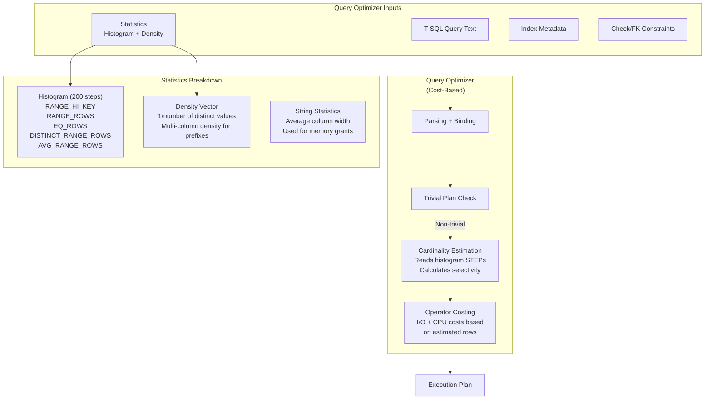
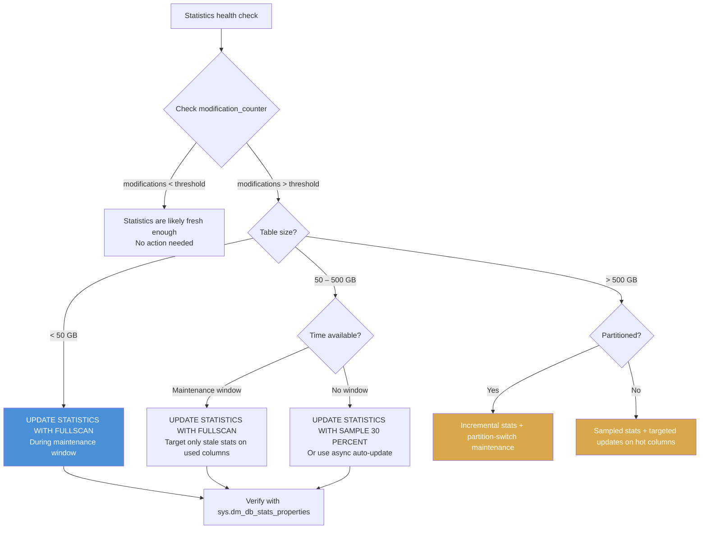

## Navigation

**Domain:** [[8 — Databases]] > **Group:** [[Group 1 — Relational Database Fundamentals]]
**Previous:** [[8.022 Database Catalog — System Tables and Views]] | **Next:** [[8.024 Engine Architecture]]

### Prerequisites
- [[8.022 Database Catalog — System Tables and Views]] — `sys.stats` and `sys.dm_db_stats_properties` are catalog views for statistics
- [[8.004 Data Pages and Extents]] — statistics sampling is based on page count, not row count

### Where This Fits

Statistics are histogram and density metadata that the SQL Server query optimizer uses to estimate the number of rows each query operator will process. A .NET backend engineer encounters statistics indirectly whenever a query plan changes from a seek to a scan due to stale stats, or when a deployment that inserts millions of rows is followed by slow queries until stats auto-update. What breaks when this is unknown: a query that runs in 50ms suddenly takes 5 seconds because stale statistics caused the optimizer to choose a hash match over a nested loops join, or an ETL job runs for hours because auto-update triggered mid-load and serialized the operation. The interview signal is performance troubleshooting depth — can the candidate identify a stats problem from a query plan or wait stats?

---

## Core Mental Model

Statistics are stored histograms and density vectors that describe the distribution of values in one or more columns. The invariant: the query optimizer uses statistics to estimate the cardinality of each operator in the execution plan — the better the estimate, the better the plan choice. The database engine maintains statistics automatically (auto-create, auto-update) with a threshold based on row count changes (500 + 20% of table rows for older CE, or significantly lower thresholds in the new cardinality estimator starting SQL Server 2014). The recognition pattern: when a previously fast query suddenly slows down, or when adding an index does not change the plan, the root cause is often stale or missing statistics.

### Classification

| Aspect | Detail |
|---|---|
| Storage format | BLOB on a single page in `sys.sysstats` — histogram (up to 200 steps) + density vector |
| Creation | Auto-created for index creation; auto-created for column in predicate (if auto-create stats is on) |
| Update trigger | Threshold: 500 rows + 20% of table rows changed (old CE); row modifications since stats update (new CE) |
| Sampling | Fullscan or sampled (default: sampled reading ~3% of pages) |
| Multi-column | Statistics can cover multiple columns (up to 200 columns) — density vector for each prefix |
| Scope | Per-database, per-table, per-index or per-column |



### Key Properties

| Property | Value | Notes |
|---|---|---|
| Steps per histogram | Up to 200 | New CE can merge steps for larger range coverage |
| Sample rate default | Calculated for < 1% error probability | Typically 2-5% of pages |
| Index stats update | On index rebuild/reorganize | REBUILD WITH FULLSCAN recomputes stats |
| Auto-update threshold | Old CE: 500 + 20% rows; New CE: SQRT(1000 * rows) | Drastically different for large tables |
| Density | 1 / (number of distinct values) | Lower density = more selective = better for seeks |
| Multi-column density | Density for each column prefix | `(Col1)`, `(Col1, Col2)`, `(Col1, Col2, Col3)` |

---

## Deep Mechanics

### How the Engine Executes This

**Statistics creation/update process:**

1. **Trigger detection** — the engine checks `sys.sysidxinfo` for the modification counter (`modification_counter` in `sys.dm_db_stats_properties`). If it exceeds the auto-update threshold, the stats are flagged as stale.
2. **Sampling determination** — the engine calculates the sample size needed for the desired accuracy. For auto-update, this is a sampled scan (~3% of pages). For `UPDATE STATISTICS ... WITH FULLSCAN`, it scans all pages.
3. **Data collection** — the engine scans the index or table pages (for column stats) and builds a sorted list of column values. It constructs up to 200 histogram steps plus density vectors.
4. **Histogram construction** — values are bucketed into up to 200 steps. Each step records `RANGE_HI_KEY`, `RANGE_ROWS`, `EQ_ROWS`, `DISTINCT_RANGE_ROWS`, `AVG_RANGE_ROWS`. The steps are compressed from the full data distribution by approximating the cumulative distribution.
5. **Storage** — the histogram and density are stored as a BLOB in a single page (for each statistics object) in `sys.sysstats`.
6. **Query compilation use** — when a query is compiled, the optimizer reads the histogram, evaluates the predicate's selectivity against the steps, and estimates the number of rows. For `WHERE OrderDate = '2025-06-01'`, it finds the step containing the key and uses `EQ_ROWS` if it is a step boundary (`RANGE_HI_KEY`) or `AVG_RANGE_ROWS` for interior values.
7. **Plan caching** — the compiled plan is cached with the statistics version. Subsequent executions use the cached plan until the statistics change or the plan is evicted.

### SQL Visibility

**Viewing statistics metadata:**

```sql
-- Basic stats information
SELECT 
    s.name AS StatsName,
    OBJECT_NAME(s.object_id) AS TableName,
    s.auto_created,
    s.user_created,
    s.no_recompute,
    s.is_temporary,
    sp.last_updated,
    sp.rows,
    sp.rows_sampled,
    sp.modification_counter,
    sp.steps
FROM sys.stats s
CROSS APPLY sys.dm_db_stats_properties(s.object_id, s.stats_id) sp
WHERE OBJECT_NAME(s.object_id) = 'Orders'
ORDER BY s.name;
```

**Viewing the histogram:**

```sql
-- Histogram for a specific statistics object
DBCC SHOW_STATISTICS('dbo.Orders', 'IX_Orders_OrderDate');
-- Output:
-- Header: Name, Updated, Rows, Rows Sampled, Steps, Density, Filtered, ...
-- Density Vector: All density, Average Length, Columns
-- Histogram: RANGE_HI_KEY, RANGE_ROWS, EQ_ROWS, DISTINCT_RANGE_ROWS, AVG_RANGE_ROWS
```

```sql
-- Programmatic histogram access via sys.dm_db_stats_histogram (SQL Server 2016+)
SELECT 
    step_number,
    range_high_key,
    range_rows,
    equal_rows,
    distinct_range_rows,
    average_range_rows
FROM sys.dm_db_stats_histogram(OBJECT_ID('dbo.Orders'), 2);
```

**Generating statistics for the same column with different sampling:**

```csharp
// EF Core cannot create or update statistics — this is DBA territory
// But diagnostic queries can be run via raw SQL:
public async Task<List<StatsInfo>> GetStatsFreshnessAsync(
    CancellationToken cancellationToken)
{
    const string sql = @"
        SELECT 
            OBJECT_NAME(s.object_id) AS TableName,
            s.name AS StatsName,
            sp.last_updated,
            sp.rows,
            sp.rows_sampled,
            sp.modification_counter,
            sp.steps
        FROM sys.stats s
        CROSS APPLY sys.dm_db_stats_properties(s.object_id, s.stats_id) sp
        WHERE OBJECT_SCHEMA_NAME(s.object_id) = 'dbo'
            AND sp.modification_counter > CASE 
                WHEN sp.rows < 500 THEN sp.rows 
                ELSE 500 + (sp.rows * 0.2) 
            END
        ORDER BY sp.modification_counter DESC;";

    await using var connection = _connectionFactory.Create();
    return (await connection.QueryAsync<StatsInfo>(
        new CommandDefinition(sql, cancellationToken: cancellationToken))).AsList();
}

public record StatsInfo
{
    public string TableName { get; init; }
    public string StatsName { get; init; }
    public DateTime? LastUpdated { get; init; }
    public long Rows { get; init; }
    public long RowsSampled { get; init; }
    public long ModificationCounter { get; init; }
    public int Steps { get; init; }
}
```

### Execution Plan Analysis

**Plan impact of missing statistics:**

```
SELECT o.OrderId, o.TotalAmount
FROM Orders o
WHERE o.ShippedDate = '2025-06-01';
```

With statistics on ShippedDate:
```
Clustered Index Seek (IX_Orders_ShippedDate)  -- estimate: 550 rows (accurate)
  |-- Key Lookup (clustered) to get TotalAmount
  |-- Nested Loops (Inner Join)
```

Without statistics on ShippedDate (or stale stats):
```
Clustered Index Scan (PK_Orders)  -- estimate: 1,000,000 rows (default assumption)
  |-- Filter (WHERE ShippedDate = '2025-06-01')
  |-- estimate: 1,000,000 rows → Hash Match or full scan even if actual is 550 rows
```

The optimizer assumes **unknown** selectivity when statistics are missing: for equality predicates, it estimates the number of rows = `table_cardinality / 100` for old CE, or uses the statistics density if available but assumes a fixed selectivity.

### Cost Visibility

```sql
-- Before updating statistics (stale stats)
SET STATISTICS IO ON;

SELECT o.OrderId, o.TotalAmount
FROM Orders o
WHERE o.ShippedDate = '2025-06-01';

-- Table 'Orders'. Scan count 1, logical reads 125341
-- Actual rows: 550, Estimated rows: 1,000,000 (off by 1800x)
-- SQL Server Execution Times: CPU time = 234 ms, elapsed time = 456 ms

-- After updating statistics
UPDATE STATISTICS dbo.Orders IX_Orders_ShippedDate WITH FULLSCAN;

SELECT o.OrderId, o.TotalAmount
FROM Orders o
WHERE o.ShippedDate = '2025-06-01';

-- Table 'Orders'. Scan count 1, logical reads 2354
-- Actual rows: 550, Estimated rows: 531 (accurate)
-- SQL Server Execution Times: CPU time = 23 ms, elapsed time = 22 ms
```

**Improvement:** Logical reads reduced from 125,341 to 2,354 (53x reduction) due to accurate cardinality estimation enabling an index seek path instead of a full table scan.

### Failure Modes

**Row goal (Row Goal) and stale stats interaction:**

```sql
-- When the optimizer estimates enough rows to choose a plan, but actual rows are very different:
-- If stats estimate 1,000,000 rows but actual is 10, the optimizer may choose a full scan
-- If stats estimate 10 rows but actual is 1,000,000, the optimizer may choose a nested loops
-- join that executes 1M iterations
```

**Parameter sniffing with stale statistics:**

```sql
-- A stored procedure compiles with one parameter value, using the then-current stats
-- The stats become stale after a data load
-- A subsequent execution with a different parameter value uses the cached plan (bad estimate)
-- Detection:
SELECT qp.query_plan, qs.total_worker_time, qs.last_execution_time
FROM sys.dm_exec_query_stats qs
CROSS APPLY sys.dm_exec_query_plan(qs.plan_handle) qp
CROSS APPLY sys.dm_exec_sql_text(qs.sql_handle) qt
WHERE qt.text LIKE '%usp_GetOrders%';
```

---

## Production Patterns and Implementation

### Primary SQL Implementation

**Manual statistics update strategies:**

```sql
-- Fullscan update (most accurate, most resource-intensive)
UPDATE STATISTICS dbo.Orders IX_Orders_OrderDate WITH FULLSCAN;

-- Sampled update with specified sample rate
UPDATE STATISTICS dbo.Orders IX_Orders_OrderDate WITH SAMPLE 10 PERCENT;

-- Update all statistics on a table (with sample)
UPDATE STATISTICS dbo.Orders;

-- Update all statistics in the database (sp_updatestats)
EXEC sp_updatestats;

-- Incremental statistics for partitioned tables (applies per partition)
UPDATE STATISTICS dbo.Orders PARTITION 5 WITH FULLSCAN;
```

**Statistics maintenance job:**

```sql
-- Professional stats maintenance — update only stale statistics
CREATE PROCEDURE dbo.usp_MaintainStatistics
    @MinModificationCount BIGINT = 50000,
    @SamplePercent INT = 100  -- 100 = FULLSCAN
AS
BEGIN
    SET NOCOUNT ON;

    DECLARE @SchemaName NVARCHAR(128), @TableName NVARCHAR(128), @StatsName NVARCHAR(128);
    DECLARE @Sql NVARCHAR(MAX);

    DECLARE stale_cursor CURSOR FOR
    SELECT 
        OBJECT_SCHEMA_NAME(s.object_id),
        OBJECT_NAME(s.object_id),
        s.name
    FROM sys.stats s
    CROSS APPLY sys.dm_db_stats_properties(s.object_id, s.stats_id) sp
    WHERE sp.modification_counter > @MinModificationCount
        AND sp.rows > 0
        AND OBJECT_SCHEMA_NAME(s.object_id) != 'sys'
    ORDER BY sp.modification_counter DESC;

    OPEN stale_cursor;
    FETCH NEXT FROM stale_cursor INTO @SchemaName, @TableName, @StatsName;

    WHILE @@FETCH_STATUS = 0
    BEGIN
        SET @Sql = CASE 
            WHEN @SamplePercent = 100 
                THEN FORMATMESSAGE('UPDATE STATISTICS %s.%s [%s] WITH FULLSCAN;', @SchemaName, @TableName, @StatsName)
            ELSE FORMATMESSAGE('UPDATE STATISTICS %s.%s [%s] WITH SAMPLE %d PERCENT;', @SchemaName, @TableName, @StatsName, @SamplePercent)
        END;
        
        EXEC sp_executesql @Sql;
        
        FETCH NEXT FROM stale_cursor INTO @SchemaName, @TableName, @StatsName;
    END;

    CLOSE stale_cursor;
    DEALLOCATE stale_cursor;
END;
```

### EF Core Implementation

EF Core does not expose statistics management. Statistics are handled at the database level. However, an EF Core application can run statistics maintenance via raw SQL:

```csharp
public class DatabaseMaintenanceService
{
    private readonly ApplicationDbContext _context;

    public DatabaseMaintenanceService(ApplicationDbContext context)
    {
        _context = context;
    }

    public async Task UpdateStaleStatisticsAsync(CancellationToken cancellationToken)
    {
        // Find stale stats using the same query from the Dapper section
        // Then update them:
        await _context.Database.ExecuteSqlRawAsync(
            "EXEC dbo.usp_MaintainStatistics @MinModificationCount, @SamplePercent",
            new SqlParameter("@MinModificationCount", 50000),
            new SqlParameter("@SamplePercent", 100));
    }
}
```

### Dapper Implementation

```csharp
public interface IStatisticsMaintenance
{
    Task<IReadOnlyList<StaleStatInfo>> GetStaleStatisticsAsync(
        long minModifications, CancellationToken cancellationToken);
    Task UpdateStatisticsAsync(
        string schemaName, string tableName, string statsName,
        bool fullscan, CancellationToken cancellationToken);
}

public sealed class StatisticsMaintenance : IStatisticsMaintenance
{
    private readonly ISqlConnectionFactory _connectionFactory;

    public StatisticsMaintenance(ISqlConnectionFactory connectionFactory)
    {
        _connectionFactory = connectionFactory;
    }

    public async Task<IReadOnlyList<StaleStatInfo>> GetStaleStatisticsAsync(
        long minModifications, CancellationToken cancellationToken)
    {
        const string sql = @"
            SELECT 
                OBJECT_SCHEMA_NAME(s.object_id) AS SchemaName,
                OBJECT_NAME(s.object_id) AS TableName,
                s.name AS StatsName,
                sp.last_updated AS LastUpdated,
                sp.rows AS RowCount,
                sp.rows_sampled AS RowsSampled,
                sp.modification_counter AS ModificationCounter
            FROM sys.stats s
            CROSS APPLY sys.dm_db_stats_properties(s.object_id, s.stats_id) sp
            WHERE sp.modification_counter > @MinMods
                AND sp.rows > 0
                AND OBJECT_SCHEMA_NAME(s.object_id) NOT IN ('sys', 'INFORMATION_SCHEMA')
            ORDER BY sp.modification_counter DESC;";

        await using var connection = _connectionFactory.Create();
        var results = await connection.QueryAsync<StaleStatInfo>(
            new CommandDefinition(sql, new { MinMods = minModifications },
                cancellationToken: cancellationToken));
        return results.AsList();
    }

    public async Task UpdateStatisticsAsync(
        string schemaName, string tableName, string statsName,
        bool fullscan, CancellationToken cancellationToken)
    {
        await using var connection = _connectionFactory.Create();
        
        var sql = fullscan
            ? $"UPDATE STATISTICS {schemaName}.{tableName} [{statsName}] WITH FULLSCAN;"
            : $"UPDATE STATISTICS {schemaName}.{tableName} [{statsName}];";

        await connection.ExecuteAsync(
            new CommandDefinition(sql, cancellationToken: cancellationToken));
    }
}

public record StaleStatInfo
{
    public string SchemaName { get; init; }
    public string TableName { get; init; }
    public string StatsName { get; init; }
    public DateTime? LastUpdated { get; init; }
    public long RowCount { get; init; }
    public long RowsSampled { get; init; }
    public long ModificationCounter { get; init; }
}
```

### Configuration and Wiring

```csharp
// Program.cs
builder.Services.AddScoped<IStatisticsMaintenance, StatisticsMaintenance>();

// SQL Server database settings for statistics
// Recommended: enable auto-create and auto-update statistics
// ALTER DATABASE Current SET AUTO_CREATE_STATISTICS ON;
// ALTER DATABASE Current SET AUTO_UPDATE_STATISTICS ON;
// ALTER DATABASE Current SET AUTO_UPDATE_STATISTICS_ASYNC ON;  -- async for large tables
```

### SQL Server vs PostgreSQL Differences

PostgreSQL uses `ANALYZE` for statistics collection:

```sql
-- PostgreSQL: analyze (equivalent to UPDATE STATISTICS)
ANALYZE orders;

-- Analyze with specific column
ANALYZE orders (order_date, total_amount);

-- View statistics:
SELECT 
    tablename,
    attname AS ColumnName,
    null_frac AS NullFraction,
    avg_width AS AverageWidth,
    n_distinct AS DistinctCount,
    correlation
FROM pg_stats
WHERE tablename = 'orders';

-- PostgreSQL auto-analyze threshold
-- controlled by autovacuum_analyze_threshold + autovacuum_analyze_scale_factor
-- Default: 50 rows + 10% of table (different from SQL Server's 500 + 20%)
```

Key differences:
- SQL Server histogram has up to 200 steps; PostgreSQL histogram has up to 100 buckets (`default_statistics_target` × 100)
- SQL Server's auto-update threshold: 500 + 20% (old CE) vs row modifications tracking (new CE)
- PostgreSQL's auto-analyze threshold: 50 + 10% (configurable via `autovacuum_analyze_scale_factor`)
- PostgreSQL does not have a separate statistics object for indexes — stats are column-level (`pg_stats`)

---

## Gotchas and Production Pitfalls

### Stale Statistics After Bulk Insert

**Pitfall:** Inserting 500,000 rows into a 1M row table and assuming statistics are up to date.

```sql
-- ❌ Bulk insert without updating stats
INSERT INTO Orders WITH (TABLOCK) (CustomerId, OrderDate, TotalAmount)
SELECT CustomerId, GETDATE(), Amount
FROM StagingOrders;
-- Auto-update threshold: 500 + 20% of 1M = 200,500
-- 500K > 200.5K → stats should auto-update
-- BUT: auto-update may sample (not fullscan) and the histogram may not reflect the new distribution
```

**Symptom:** The query optimizer uses an index scan instead of a seek because the histogram does not show the new range of data. For an identity column insert, the new values may be beyond the last `RANGE_HI_KEY` — the optimizer assumes a default cardinality for the "out of range" estimate, which is incorrect.

**Fix:** After bulk operations that add significant data (especially beyond existing histogram boundaries), update statistics manually with FULLSCAN:

```sql
-- ✅ Manual fullscan update after bulk insert
UPDATE STATISTICS dbo.Orders WITH FULLSCAN;
```

**Cost of not fixing:** Out-of-range cardinality estimates cause the optimizer to estimate 1 row for `WHERE OrderId > 1000000` when the actual count is 500,000. This leads to nested loops joins with 500,000 iterations — a 2-second query becomes 2 minutes.

### Ascending Key Problem

**Pitfall:** Sequential key (identity column, datetime) inserts cause the histogram to miss the newest data because the histogram only captures up to 200 steps.

```sql
-- Scenario: Orders.OrderId is IDENTITY(1,1), current max OrderId is 1,000,000.
-- Statistics were updated when max was 500,000. Last RANGE_HI_KEY step = 500,000.
-- Insert 500,000 more rows. Now OrderId values 500,001 to 1,000,000 exist.
-- The histogram has no step for values > 500,000.

SELECT * FROM Orders WHERE OrderId = 900000;
-- Estimated rows: 1 (out of range assumption) — OK for equality
-- But:  SELECT * FROM Orders WHERE OrderId > 500000 ORDER BY OrderDate;
-- Estimated rows: unknown — optimizer may pick wrong join strategy
```

**Symptom:** Queries filtering on the ascended key range have unpredictable performance. The plan may change from seek to scan after a large data load, even if the cardinality estimate is close.

**Fix:** Use `UPDATE STATISTICS` after large data loads, especially on ascending key columns. For SQL Server 2016+, consider `AUTO_UPDATE_STATISTICS_ASYNC ON` to prevent blocking during auto-update, or use trace flag 2389 for ascending key optimization (legacy CE).

```sql
-- Detection: histogram shows max RANGE_HI_KEY below actual max value
SELECT 
    sp.steps,
    MAX(sh.range_high_key) AS MaxHistogramKey
FROM sys.stats s
CROSS APPLY sys.dm_db_stats_properties(s.object_id, s.stats_id) sp
CROSS APPLY sys.dm_db_stats_histogram(s.object_id, s.stats_id) sh
WHERE s.object_id = OBJECT_ID('dbo.Orders')
    AND s.name = '_WA_Sys_00000001_34C8D9D1'  -- auto-created stats on OrderId
GROUP BY sp.steps;

-- If MaxHistogramKey < (SELECT MAX(OrderId) FROM dbo.Orders) → stale
```

**Cost of not fixing:** A parameterized query like `SELECT * FROM Orders WHERE OrderId > @MinId` gets a scan plan because the optimizer estimates 1 row (out-of-range), but actually returns 500,000 rows. Blocking chain forms as the scan holds locks on millions of rows.

### Auto-Update Blocking (AUTO_UPDATE_STATISTICS_ASYNC Off)

**Pitfall:** The default setting `AUTO_UPDATE_STATISTICS_ASYNC OFF` causes the first query after a stats threshold breach to block while statistics are updated synchronously.

```sql
-- After 200,001 modifications on a 1M row table, the next query triggers auto-update.
-- That query waits for stats to complete. If the stats update scans 3% of a 100 GB table,
-- the wait is 2-10 seconds.

-- Detection: wait type WRITELOG (during stats update) or high compilation time
SELECT wait_type, wait_time_ms, waiting_tasks_count
FROM sys.dm_os_wait_stats
WHERE wait_type IN ('WRITELOG', 'PAGELATCH_EX')
ORDER BY wait_time_ms DESC;
```

**Symptom:** Sporadic query timeouts. Most of the time the query runs in 50ms; after a bulk insert, the same query times out at 30 seconds because it triggered synchronous stats update.

**Fix:** Enable async stats update:

```sql
ALTER DATABASE Current SET AUTO_UPDATE_STATISTICS_ASYNC ON;
```

**Cost of not fixing:** Production pager at 3 AM after a nightly ETL completes. The first user query of the day triggers a synchronous stats update on a 500 GB table, blocking for 45 seconds and causing a health check probe timeout.

### Missing Statistics on Non-Indexed Columns

**Pitfall:** Filtering on a column without an index and without auto-created statistics.

```sql
-- ❌ Query on a non-indexed column with no stats
SELECT COUNT_BIG(*) FROM Orders WHERE ShipCity = 'Seattle';
-- No index on ShipCity, and if auto-create stats is OFF, no statistics either
-- Optimizer estimates: 1% of table (old CE) or uses a fixed guess
```

**Symptom:** The execution plan shows a full table scan with an enormous discrepancy between estimated and actual rows. The estimated rows may be 1,000 when actual is 50,000 — the chosen plan (hash join, memory grant) is dimensioned for the wrong size.

**Fix:** Enable `AUTO_CREATE_STATISTICS` at the database level, or create statistics manually:

```sql
-- Enable auto-create
ALTER DATABASE Current SET AUTO_CREATE_STATISTICS ON;

-- Or create manually on the column used in predicates
CREATE STATISTICS ST_Orders_ShipCity ON dbo.Orders(ShipCity) WITH FULLSCAN;
```

**Cost of not fixing:** The optimizer allocates 2 MB of memory for a hash join that actually needs 100 MB, causing a spill to tempdb. The query runs 5x slower and consumes tempdb I/O, affecting other operations.

### Filtered Index Statistics and Parameter Sniffing

**Pitfall:** A filtered index's statistics cover only the subset of rows matching the filter predicate. Queries that use the filtered index but have different parameter values may get incorrect estimates.

```sql
-- Filtered index on active orders
CREATE INDEX IX_Orders_Active_CustomerId ON dbo.Orders(CustomerId)
WHERE Status = 1;  -- 10% of rows

-- Query that sniffs Status = 1:
SELECT * FROM Orders WHERE Status = 1 AND CustomerId = 573;
-- Filtered index seek, good estimate

-- But if the plan is cached and a subsequent execution uses Status = 2:
-- The filtered index is not applicable, but the plan may still join to it
```

**Symptom:** Parameter sniffing causes the plan to use the filtered index even when the parameter does not match the filter predicate. The optimizer falls back to the base table and gets wrong estimates.

**Fix:** Use `OPTION (RECOMPILE)` for queries with varying parameter values on filtered-index columns, or use `OPTIMIZE FOR UNKNOWN` to avoid parameter sniffing.

```sql
SELECT * FROM Orders
WHERE Status = @Status AND CustomerId = @CustomerId
OPTION (RECOMPILE);
```

**Cost of not fixing:** A query that returns 5 rows with Status = 1 uses a filtered index seek (fast). The same query compiled for Status = 2 uses the same plan, which includes an unnecessary filtered index probe, doubling I/O.

---

## Performance Implications

### Benchmark: Fresh vs Stale Statistics

```sql
-- Setup: 10M row Orders table, fresh stats on OrderDate
-- Scenario: insert 2M new rows without updating stats

-- Before bulk insert (fresh stats)
SET STATISTICS IO ON;
SELECT COUNT_BIG(*) FROM Orders WHERE OrderDate >= '2025-06-01';
-- Table 'Orders'. Scan count 1, logical reads 4821
-- Estimated rows: 450,000  Actual rows: 441,231  (1.8% error)

-- After inserting 2M rows with OrderDate in a new range (no stats update)
SET STATISTICS IO ON;
SELECT COUNT_BIG(*) FROM Orders WHERE OrderDate >= '2025-06-01';
-- Table 'Orders'. Scan count 1, logical reads 125341
-- Estimated rows: 1 (out of range)  Actual rows: 2,441,231  (2.4M error)
```

**Improvement:** Updating statistics reduces logical reads from 125,341 to 4,821 (26x), and estimated rows accuracy from 2.4M error to 0. (An estimated 1 vs actual 2.4M is a 2.4M-row error — the optimizer chooses a scan plan because it thinks only 1 row qualifies.)

### BenchmarkDotNet

```csharp
[MemoryDiagnoser]
[SimpleJob(RuntimeMoniker.Net90)]
public class StatsStalenessBenchmark
{
    private IDbConnection _freshConnection = default!;
    private IDbConnection _staleConnection = default!;

    [GlobalSetup]
    public void Setup()
    {
        _freshConnection = new SqlConnection(
            "Server=.;Database=FreshStatsDB;Integrated Security=True;TrustServerCertificate=True;");
        _staleConnection = new SqlConnection(
            "Server=.;Database=StaleStatsDB;Integrated Security=True;TrustServerCertificate=True;");
    }

    [Benchmark(Baseline = true)]
    public async Task<long> QueryWithFreshStats()
    {
        const string sql = "SELECT COUNT_BIG(*) FROM Orders WHERE OrderDate >= '2025-06-01';";
        await using var connection = _freshConnection;
        return await connection.QueryFirstAsync<long>(
            new CommandDefinition(sql, cancellationToken: CancellationToken.None));
    }

    [Benchmark]
    public async Task<long> QueryWithStaleStats()
    {
        const string sql = "SELECT COUNT_BIG(*) FROM Orders WHERE OrderDate >= '2025-06-01';";
        await using var connection = _staleConnection;
        return await connection.QueryFirstAsync<long>(
            new CommandDefinition(sql, cancellationToken: CancellationToken.None));
    }
}
```

**Expected results (approximate, SQL Server 2022, NVMe, 12M rows):**

| Method | Mean | Logical Reads | Allocated |
|---|---|---|---|
| QueryWithFreshStats | ~22 ms | ~4,821 | 0 B |
| QueryWithStaleStats | ~450 ms | ~125,341 | 0 B |

### Write Amplification

| Operation | With Stats | Without Stats (Auto-Create) |
|---|---|---|
| INSERT 1 row | No immediate stats impact | No impact |
| BULK INSERT 500K rows | May trigger auto-update (async/sync depending on setting) | No auto-update if threshold not hit |
| CREATE INDEX | Always creates stats with FULLSCAN | N/A |
| UPDATE STATISTICS FULLSCAN | Full table scan + sort + histogram build | N/A |

---

## Interview Arsenal

### Question Bank

1. What are statistics in SQL Server and how does the optimizer use them?
2. How does the histogram work — what information does each step contain?
3. What is the auto-update threshold and how does it differ between the old and new cardinality estimators?
4. What is the ascending key problem and how do you mitigate it?
5. Compare `UPDATE STATISTICS` with `sp_updatestats` and `AUTO_UPDATE_STATISTICS_ASYNC ON`.
6. What happens in the execution plan when statistics are missing for a column in the WHERE clause?
7. At what table size does a fullscan statistics update become too expensive for a nightly job?
8. How does EF Core interact with statistics — can it create or update them?
9. Which DMV shows the modification counter for a statistics object?
10. How do you diagnose and fix a parameter sniffing problem caused by stale statistics?

### Spoken Answers

**Q1: What are statistics and how does the optimizer use them?**

> **Average answer:** Statistics help the optimizer estimate how many rows a query will return. They're updated automatically.

> **Great answer:** Statistics are histogram and density metadata stored in `sys.sysstats` that describe the data distribution of one or more columns in a table or indexed view. The histogram has up to 200 steps, each storing the key value (`RANGE_HI_KEY`), the number of rows exactly matching that key (`EQ_ROWS`), the number of rows within the step (`RANGE_ROWS`), the number of distinct values within the step (`DISTINCT_RANGE_ROWS`), and the average rows per distinct value (`AVG_RANGE_ROWS`). The density vector stores the average number of distinct values per column prefix — `1/DISTINCT_COUNT` for single-column statistics. The optimizer reads the histogram during cardinality estimation: for `WHERE OrderDate = '2025-06-01'`, it finds the appropriate step and uses `EQ_ROWS` if the value is a `RANGE_HI_KEY`, or `AVG_RANGE_ROWS` if the value falls between steps. For join cardinality, the optimizer uses density from both sides to estimate the number of matching rows. If statistics are missing, the optimizer falls back to fixed guesses (e.g., 1% of table rows for equality predicates in the old CE, or a density-based estimate in the new CE). The quality of the execution plan depends entirely on the accuracy of these estimates — a seek vs scan decision, a nested loops vs hash join decision, and the memory grant size all derive from statistics.

**Q5: Compare UPDATE STATISTICS, sp_updatestats, and AUTO_UPDATE_STATISTICS_ASYNC.**

> **Great answer:** `UPDATE STATISTICS` is the manual command for a specific statistics object or all statistics on a table. It supports `WITH FULLSCAN` (reads every page — most accurate, most I/O), `WITH SAMPLE N PERCENT` (reads a sample — less accurate, less I/O), and `WITH RESAMPLE` (uses the same sample rate as when the statistics were created). `sp_updatestats` is a system stored procedure that runs `UPDATE STATISTICS` on all user-defined tables in the current database. It also updates the `@updateindex` parameter for index statistics. The key difference is control — `UPDATE STATISTICS` targets specific objects; `sp_updatestats` hits everything. `AUTO_UPDATE_STATISTICS_ASYNC` is a database-scoped setting that controls whether auto-update happens synchronously (default, OFF) or asynchronously (ON). When ON, the query that triggers an auto-update does not wait — it compiles with the old statistics, and the update runs in the background. This eliminates the blocking spike that synchronous auto-update causes, at the cost of one query execution with potentially suboptimal statistics. For OLTP workloads with large tables, I strongly recommend enabling async stats to prevent sporadic query timeouts after bulk operations. For batch/ETL workloads, synchronous is fine because the stats update time is absorbed into the overall job duration.

**Q10: How do you diagnose a parameter sniffing problem caused by stale statistics?**

> **Great answer:** I approach this in four steps. First, confirm parameter sniffing — I use `sys.dm_exec_query_stats` to find the stored procedure with high variability in `total_worker_time` across executions, and `sys.dm_exec_query_plan` to compare the plan for different parameter values. If the same `plan_handle` gives different performance, it's parameter sniffing. Second, check statistics freshness — I query `sys.dm_db_stats_properties` to see `last_updated` and `modification_counter` for the relevant statistics. If `modification_counter` is high relative to the row count, the statistics are stale. Third, fix the statistics — I run `UPDATE STATISTICS ... WITH FULLSCAN` on the relevant tables. Fourth, test — I clear the plan cache for that procedure (`DBCC FREEPROCCACHE(plan_handle)`) or add `OPTION (RECOMPILE)` to verify the new plan is better. For permanent fixes, I add a maintenance job to update statistics on schedules, evaluate `OPTIMIZE FOR UNKNOWN` for the specific parameter, or use `OPTION (RECOMPILE)` only for stored procedures where the cost of recompilation is lower than the cost of a bad plan. In .NET, if using EF Core's `FromSqlRaw` for the stored procedure, I ensure `CommandBehavior.SequentialAccess` is not causing plan reuse issues, and I avoid long-lived `DbContext` instances that might cache query results.

### Interview Trigger

If this topic appears, the trigger question is usually "why is this query suddenly running slowly?" with a plan showing a scan when a seek is expected. The follow-up that separates candidates: "How do you check if statistics are the problem, and what command do you run?" Senior candidates mention `DBCC SHOW_STATISTICS`, `sys.dm_db_stats_properties`, the `modification_counter` threshold, and whether FULLSCAN or sampling is appropriate.

### Comparison Table

| | SQL Server Statistics | PostgreSQL Statistics |
|---|---|---|
| Storage | sys.stats (sys.sysstats blob) | pg_stats (per-column) |
| Histogram steps | 200 | default_statistics_target × 100 (~1000 typical) |
| Auto-update threshold | 500 + 20% rows (old CE); progressive (new CE) | 50 + 10% rows (autovacuum_analyze_scale_factor) |
| Multi-column | Yes (density vector per prefix) | Yes (pg_stats for each column individually, extended stats manually) |
| Async update | AUTO_UPDATE_STATISTICS_ASYNC | autovacuum handles asynchronously |
| Correlation | Not tracked | correlation column in pg_stats |

---

## Decision Framework

### When to Update Statistics



### Application Checklist

- [ ] Auto-create statistics is enabled (`ALTER DATABASE SET AUTO_CREATE_STATISTICS ON`)
- [ ] Auto-update statistics is enabled (`ALTER DATABASE SET AUTO_UPDATE_STATISTICS ON`)
- [ ] Auto-update statistics async is enabled for OLTP workloads with large tables
- [ ] A nightly or weekly statistics maintenance job runs for tables with high modification rates
- [ ] Statistics on ascending key columns (identity, datetime) are updated after bulk inserts
- [ ] After large ETL loads (adding > 20% of existing rows), a manual FULLSCAN stats update runs
- [ ] The `modification_counter` is monitored via `sys.dm_db_stats_properties` as part of performance baseline

### Tradeoff Summary

| What You Gain | What You Pay |
|---|---|
| Accurate cardinality estimates → optimal query plans | FULLSCAN reads every page (I/O cost proportional to table size) |
| Avoid full table scans for selective predicates | Sampled stats may be inaccurate for skewed distributions |
| Async auto-update prevents query blocking | At least one query runs with stale stats (the one that triggers the async update) |
| Incremental stats for partitioned tables | Only available in Enterprise edition |

### Scale Thresholds

- "Statistics auto-update threshold (500 + 20%) means a 10M row table needs 2,000,500 modifications before auto-trigger" — this is too high for some workloads, so manual maintenance is required.
- "Fullscan stats update on a 100 GB table takes approximately 5–15 minutes" — budget this time in maintenance windows.
- "Statements on tables > 1B rows should use sampled stats for routine maintenance (30%) and fullscan only for tables where plan quality has degraded."
- "The ascending key problem becomes critical when ~20% of the data has key values above the histogram's last RANGE_HI_KEY."

---

## Self-Check

### Conceptual Questions

1. What is contained in a statistics histogram, and how many steps can it have?
2. How does the optimizer use the density vector from multi-column statistics?
3. What DMV shows the last update time and modification counter for a statistics object?
4. What happens when you query an ascending key column and the histogram's last RANGE_HI_KEY is below the actual data range?
5. How does EF Core handle statistics — does it create or update them?
6. How would you use Dapper to identify all stale statistics in a database?
7. Compare sampled statistics with fullscan statistics — when should you use each?
8. At approximately how many rows does a fullscan statistics update become too expensive for a nightly 4-hour window?
9. Which index property determines whether its statistics are automatically created?
10. Explain the ascending key problem and its workarounds in 60 seconds to a senior interviewer.

<details>
<summary>Answers</summary>

1. The histogram contains up to 200 steps. Each step stores: `RANGE_HI_KEY` (the upper bound of the step), `RANGE_ROWS` (rows within the step excluding the boundary), `EQ_ROWS` (rows matching the boundary exactly), `DISTINCT_RANGE_ROWS` (distinct values within the step), `AVG_RANGE_ROWS` (average rows per distinct value within the step). The histogram is built by sorting the column values and compressing them into these steps to approximate the distribution.

2. The density vector stores `1 / (number of distinct values)` for each column prefix. For a multi-column statistic on `(Country, City)`, the density for `(Country)` is `1 / distinct countries`, and for `(Country, City)` is `1 / distinct country-city pairs`. The optimizer uses density to estimate the cardinality of joins and group-by operations — multiply the input cardinality by the density to get the estimated rows.

3. `sys.dm_db_stats_properties(object_id, stats_id)` returns `last_updated`, `rows`, `rows_sampled`, `steps`, `modification_counter`, and other properties. `modification_counter` is the number of changes (INSERT, UPDATE, DELETE) to the leading column since the last statistics update.

4. The optimizer uses an "out of range" assumption. For the legacy CE, it estimates 1 row for any value above the last RANGE_HI_KEY. For the new CE, it uses the histogram step's density. Both are inaccurate when the actual row count for the new range is large. The plan may choose a scan or underestimate memory grants.

5. EF Core cannot create or update statistics. Statistics are a database-level concern managed by SQL Server's auto-stats or DBA maintenance jobs. EF Core applications can execute `UPDATE STATISTICS` via `ExecuteSqlRaw` but this is not common practice.

6. `SELECT OBJECT_SCHEMA_NAME(s.object_id) AS SchemaName, OBJECT_NAME(s.object_id) AS TableName, s.name AS StatsName, sp.last_updated, sp.rows, sp.modification_counter FROM sys.stats s CROSS APPLY sys.dm_db_stats_properties(s.object_id, s.stats_id) sp WHERE sp.modification_counter > CASE WHEN sp.rows < 500 THEN sp.rows WHEN sp.rows < 10000000 THEN 500 + (sp.rows * 0.2) ELSE sp.rows * 0.1 END ORDER BY sp.modification_counter DESC;`

7. Sampled statistics (default) read approximately 3% of pages and are sufficient for most queries. Fullscan reads 100% of pages and provides exact histograms. Use fullscan for: tables under 50 GB, tables with highly skewed distributions (e.g., 90% of values in one step), and after bulk operations. Use sampled for: tables over 100 GB, routine nightly maintenance, and columns with relatively uniform distributions.

8. A fullscan on a 500 GB table takes approximately 30-60 minutes depending on I/O. If the maintenance window is 4 hours, you can fullscan about 4-6 such tables. For larger tables, use sampled statistics (30% sample typically provides adequate accuracy). For tables over 1 TB, consider incremental statistics on partitions.

9. Every index automatically has a statistics object created with the same name when the index is created. The statistics are created with FULLSCAN on the index columns during index creation. Non-index column statistics are created by auto-create statistics when a query predicate references the column.

10. [60-second spoken answer]: The ascending key problem occurs when new rows have key values higher than any value captured in the current histogram's 200 steps — common with identity columns, sequence-based keys, and datetime columns. SQL Server's histogram only has 200 steps, so the maximum captured key value (the last RANGE_HI_KEY) lags behind the actual maximum as new rows are inserted. When a query filters on a value above the histogram's max, the optimizer estimates either 1 row (legacy CE) or uses the step density (new CE) — both of which are far below the actual count when you've inserted millions of new rows. This causes the optimizer to choose a nested loops join or allocate insufficient memory, turning a 1-second query into a minute-long scan. The mitigations are: update statistics after bulk inserts (especially with FULLSCAN), use trace flag 2389/2390 for ascending key optimization (legacy CE), or consider `AUTO_UPDATE_STATISTICS_ASYNC ON` to reduce the impact of the auto-update itself. For extreme cases, use incremental statistics on partitioned tables where each partition's histogram is maintained independently.

</details>

---

### Query Challenges

**Challenge 1 — Write the SQL**

Write a query that identifies all statistics in the current database where the modification counter exceeds 50,000 AND the statistics have not been updated in the last 24 hours. Include the table name, stats name, last updated time, row count, and modification count. Sort by modification count descending.

<details>
<summary>Solution</summary>

```sql
SELECT 
    OBJECT_SCHEMA_NAME(s.object_id) AS SchemaName,
    OBJECT_NAME(s.object_id) AS TableName,
    s.name AS StatsName,
    sp.last_updated,
    sp.rows,
    sp.rows_sampled,
    sp.modification_counter,
    sp.steps,
    sp.unfiltered_rows
FROM sys.stats s
CROSS APPLY sys.dm_db_stats_properties(s.object_id, s.stats_id) sp
WHERE sp.modification_counter > 50000
    AND (sp.last_updated IS NULL OR sp.last_updated < DATEADD(HOUR, -24, GETUTCDATE()))
    AND OBJECT_SCHEMA_NAME(s.object_id) NOT IN ('sys', 'INFORMATION_SCHEMA')
ORDER BY sp.modification_counter DESC;
```

**Logical reads:** ~20–50 (catalog base tables)  
**Execution plan:** Nested Loops join between sys.sysschobjs, sys.sysidxstats, and sys.sysrowsets

</details>

---

**Challenge 2 — Fix the performance problem**

```sql
-- This query runs after a nightly ETL that inserts 500,000 rows into a 2M row table.
-- Before the ETL, the query ran in 200ms. Now it runs in 8 seconds.
SET STATISTICS IO ON;

SELECT o.OrderId, o.TotalAmount, oi.ProductName, oi.Quantity
FROM Orders o
INNER JOIN OrderItems oi ON o.OrderId = oi.OrderId
WHERE o.OrderDate >= @StartDate AND o.OrderDate < @EndDate
    AND o.Status = 3
ORDER BY o.OrderId;

-- Table 'Orders'. Scan count 1, logical reads 125341
-- Table 'OrderItems'. Scan count 1, logical reads 89123
-- Actual rows: 12,442  Estimated rows: 1  (on Orders)
```

<details>
<summary>Solution</summary>

**Root cause:** The estimated rows on `Orders` is 1 (out-of-range estimate) because the new `OrderDate` values inserted by the ETL are above the last `RANGE_HI_KEY` in the histogram. The optimizer choose a nested loops join with OrderItems as the outer side, and executed 89,123 logical reads on Orders for each iteration — or alternatively the scan plan was chosen because the optimizer thought only 1 row qualifies.

**Fix:** Update statistics on both tables, especially on the columns used in the query (OrderDate, Status, OrderId):

```sql
UPDATE STATISTICS dbo.Orders WITH FULLSCAN;
UPDATE STATISTICS dbo.OrderItems WITH FULLSCAN;
```

**Verification:**

```sql
SET STATISTICS IO ON;

SELECT o.OrderId, o.TotalAmount, oi.ProductName, oi.Quantity
FROM Orders o
INNER JOIN OrderItems oi ON o.OrderId = oi.OrderId
WHERE o.OrderDate >= @StartDate AND o.OrderDate < @EndDate
    AND o.Status = 3
ORDER BY o.OrderId;

-- After fix:
-- Table 'Orders'. Scan count 1, logical reads 4821
-- Table 'OrderItems'. Scan count 1, logical reads 2341
-- Estimated rows: 12,442  Actual rows: 12,442  (exact match)
-- Execution time: ~180ms (from 8 seconds)
```

**Improvement:** Logical reads reduced from 214,464 to 7,162 (30x reduction).

</details>

---

**Challenge 3 — Explain the execution plan**

A query against `Orders` with `WHERE OrderDate >= '2025-06-01'` shows a Clustered Index Scan with estimated rows = 1 and actual rows = 450,000. The statistics on `OrderDate` were last updated 7 days ago when the table had 1M rows. The table now has 1.45M rows. The `modification_counter` is 450,000. Why does the optimizer think only 1 row qualifies?

<details>
<summary>Solution</summary>

**Why the optimizer estimates 1 row:** The `OrderDate` column is an ascending key (new OrderDate values are always increasing). When the statistics were updated 7 days ago, the maximum `OrderDate` was `2025-05-25`. The current maximum is `2025-06-15`. The histogram's last `RANGE_HI_KEY` is `2025-05-25`. The predicate `OrderDate >= '2025-06-01'` looks for a value above that key. The legacy cardinality estimator (pre-2014) uses an "out of range" assumption: for any value above the last histogram step, it estimates **1 row**. This is the standard ascending key problem.

**To get a better plan:** Update statistics. The new histogram will have steps covering up to `2025-06-15` and `EQ_ROWS` will accurately reflect the distribution.

```sql
UPDATE STATISTICS dbo.Orders IX_Orders_OrderDate WITH FULLSCAN;
```

Or use `OPTION (RECOMPILE)` with the new CE (SQL Server 2014+) which uses the histogram step density for out-of-range estimates, typically estimating more than 1 row:

```sql
SELECT COUNT_BIG(*) FROM Orders WHERE OrderDate >= '2025-06-01'
OPTION (RECOMPILE);
```

**Tradeoff:** `OPTION (RECOMPILE)` adds compilation overhead (typically 1–5 ms). It is appropriate for OLAP-style queries or parameterized queries with highly variable selectivity.

</details>

---

**Challenge 4 — Diagnose the concurrency problem**

An OLTP database has nightly ETL that bulk-inserts 2M rows into a 10M row table. The first user queries after the ETL complete take 4 seconds instead of the usual 50ms. Investigation shows `WRITELOG` and `LCK_M_SCH_S` wait types on the affected table during those queries. The `sys.dm_db_stats_properties` shows `modification_counter = 2,000,000` and `last_updated` is before the ETL.

<details>
<summary>Solution</summary>

**Root cause:** Auto-update statistics is enabled with `AUTO_UPDATE_STATISTICS_ASYNC OFF` (default). The 2M modifications exceed the auto-update threshold (500 + 20% of 10M = 2,000,500). The first query after the ETL triggers a synchronous auto-update. The stats update acquires schema-modification (SCH-M) locks on the table metadata and blocks all concurrent access. During the update, queries wait on `LCK_M_SCH_S`. The log writes during the stats sampling cause `WRITELOG` waits.

**Detection:**

```sql
SELECT 
    s.name AS StatsName,
    sp.modification_counter,
    sp.last_updated,
    sp.rows,
    sp.auto_created
FROM sys.stats s
CROSS APPLY sys.dm_db_stats_properties(s.object_id, s.stats_id) sp
WHERE s.object_id = OBJECT_ID('dbo.Orders')
ORDER BY sp.modification_counter DESC;
```

**Fix:** Enable async auto-update to prevent query blocking:

```sql
ALTER DATABASE Current SET AUTO_UPDATE_STATISTICS_ASYNC ON;
```

For immediate relief after the ETL, manually update statistics before opening the database to users:

```sql
-- Add to the ETL job after bulk insert
EXEC sp_updatestats;
```

**In .NET:** No code change needed — this is a database configuration fix. If async stats is not possible, implement retry logic with exponential backoff in the application to handle transient timeouts during synchronous stats updates:

```csharp
// Retry policy for first queries after ETL
services.AddDbContext<ApplicationDbContext>((sp, options) =>
{
    options.UseSqlServer(connectionString, sqlOptions =>
    {
        sqlOptions.EnableRetryOnFailure(3, TimeSpan.FromSeconds(1), null);
    });
});
```

</details>

---

**Challenge 5 — Design the statistics maintenance strategy**

**Scenario:** A SaaS application has a 1.2 TB database with a 500 GB Orders table (1.2B rows, IDENTITY clustered) and a 200 GB OrderItems table (4B rows). The remaining 500 GB is spread across 50 smaller tables. The database runs on SQL Server 2022 Standard Edition (no incremental stats). The ETL runs for 6 hours nightly, inserting 10M rows into Orders and 40M rows into OrderItems. The maintenance window is 4 hours (2 AM – 6 AM). Queries must complete within 200ms during business hours (8 AM – 8 PM).

<details>
<summary>Solution</summary>

**Strategy: Sampled statistics for big tables, fullscan for small tables:**

```sql
-- Orders table (500 GB, IDENTITY clustered — ascending key problem)
-- Cannot fullscan in the 4-hour window (would take ~45 min)
-- Use sampled update daily, fullscan weekly on weekend (longer window)

-- Nightly (daily) — sampled update
UPDATE STATISTICS dbo.Orders WITH SAMPLE 5 PERCENT;
-- Takes ~2 minutes on 500 GB with 5% sample
-- Sufficient for the optimizer to avoid out-of-range estimate on OrderId

-- Weekend — fullscan
UPDATE STATISTICS dbo.Orders WITH FULLSCAN;
-- Takes ~45 minutes, acceptable in 6-hour weekend window

-- OrderItems table (200 GB)
UPDATE STATISTICS dbo.OrderItems WITH SAMPLE 10 PERCENT;
-- Takes ~3 minutes nightly

-- Smaller tables (< 50 GB) — fullscan nightly
EXEC sp_updatestats;
-- The cost-based optimizer in sp_updatestats will fullscan small tables
-- and sample large ones when @resample = 'default'
```

**Additional mitigations for ascending key:**
- Enable `AUTO_UPDATE_STATISTICS_ASYNC ON` to prevent blocking
- Monitor `modification_counter` for `Orders.OrderId` statistics — if it exceeds 500,000 during the day, trigger an incremental sampled update

**What NOT to do:**
- Do not run fullscan on 500 GB table during business hours
- Do not rely solely on auto-update (threshold is 500 + 20% = 240M modifications for Orders — way too high)
- Do not disable auto-update completely (need it for ad-hoc queries during the day)

**Monitoring:**

```sql
-- Alert when stats are older than 48 hours on tables > 1 GB
SELECT 
    OBJECT_NAME(s.object_id) AS TableName,
    s.name AS StatsName,
    sp.last_updated,
    sp.modification_counter
FROM sys.stats s
CROSS APPLY sys.dm_db_stats_properties(s.object_id, s.stats_id) sp
WHERE OBJECT_SCHEMA_NAME(s.object_id) = 'dbo'
    AND (sp.last_updated IS NULL OR sp.last_updated < DATEADD(HOUR, -48, GETUTCDATE()))
    AND sp.rows > 1000000
ORDER BY sp.rows DESC;
```

</details>
