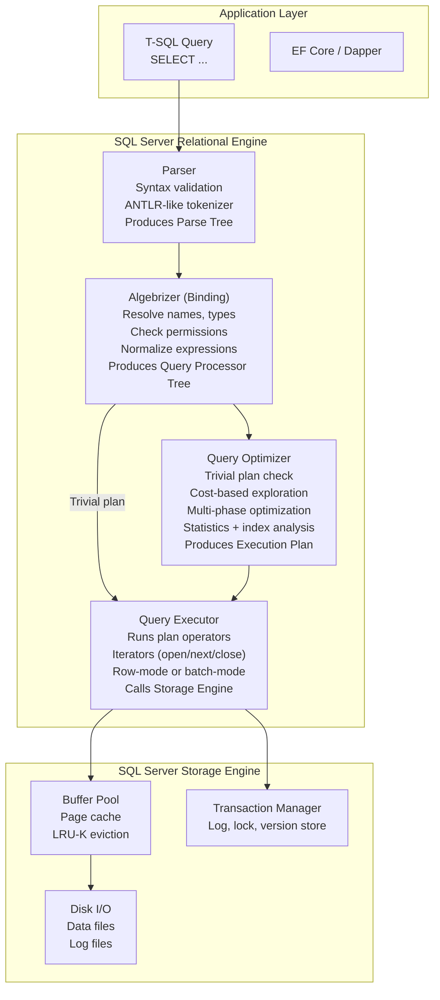
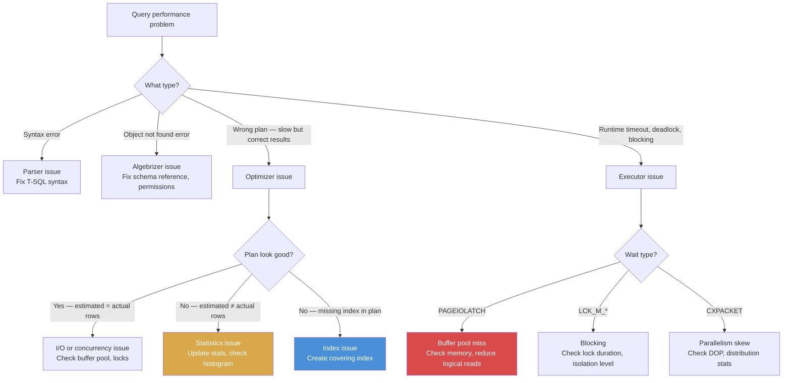

## Navigation

**Domain:** [[8 — Databases]] > **Group:** [[Group 1 — Relational Database Fundamentals]]
**Previous:** [[8.023 Statistics — How the Optimizer Uses Them]] | **Next:** [[8.025 Buffer Pool]]

### Prerequisites
- [[8.023 Statistics — How the Optimizer Uses Them]] — the optimizer consumes statistics during cost-based optimization to estimate cardinality and choose operators
- [[8.005 Transactions and ACID]] — the executor interacts with the transaction manager and lock manager during plan execution

### Where This Fits

The database engine architecture is the pipeline that turns a T-SQL string into a result set: parsing, binding, optimization, and execution. A .NET backend engineer encounters this architecture in every query they write — the parser catches syntax errors, the algebrizer resolves table and column names, the optimizer chooses whether to seek or scan, and the executor retrieves the data. What breaks when this is unknown: writing a query that the optimizer cannot optimize (non-SARGable predicates, missing statistics), or misunderstanding why adding a covering index did not change the plan (the plan was cached before the index was created). The interview signal is understanding of where errors originate, why query performance varies, and how to influence the optimizer without hints.

### Core Mental Model

The engine processes a query through four sequential phases: the **Parser** converts T-SQL text into a parse tree and validates syntax, the **Algebrizer** (binding) resolves all object references and produces a logical query tree (relational algebra), the **Optimizer** (cost-based) explores plan alternatives to find the lowest-cost execution plan using statistics and index metadata, and the **Executor** runs the selected plan by calling the storage engine to read pages from the buffer pool. The invariant: the parse tree is deterministic (same SQL, same parse tree), but the optimizer output is probabilistic — it depends on statistics, index availability, and compilation-time conditions. The recognition pattern: syntax errors come from the parser, "invalid object name" comes from the algebrizer, poor performance comes from the optimizer making wrong choices based on stale statistics, and execution errors (timeouts, deadlocks) come from the executor.

### Classification

| Aspect | Parser | Algebrizer | Optimizer | Executor |
|---|---|---|---|---|
| Input | T-SQL text | Parse tree + bind info | Query processor tree + stats + indexes | Execution plan |
| Output | Parse tree (logical) | Query processor tree (normalized) | Execution plan (physical operators) | Result set (rows) |
| Error type | Syntax error (156, 102) | Binding error (208, 207) | No errors — suboptimal plan | Runtime errors (1205, 1222) |
| Performance impact | Negligible | Negligible | High — plan quality | High — plan execution |
| Cache | SQL text cache (hash) | Schema metadata cache | Plan cache (sys.dm_exec_cached_plans) | Buffer pool (data pages) |



### Key Properties

| Property | Parser | Algebrizer | Optimizer | Executor |
|---|---|---|---|---|
| Time complexity | O(N) (text length) | O(N) (object count) | NP-hard (exploratory — limited by time) | O(rows × operators) |
| Cache | Not cached | Schema cache | Plan cache (keyed by SQL hash + SET options) | Buffer pool |
| Interception point | SET PARSEONLY | SET FMTONLY | SET SHOWPLAN_XML | SET STATISTICS IO, TIME, PROFILE |
| User influence | None | Schema changes (rename, drop) | Indexes, stats, hints, rewrites | Query execution (timeout, cancel) |

---

## Deep Mechanics

### How the Engine Executes This

**Step 1 — Parsing:**

1. The T-SQL text is tokenized: identifiers, keywords, operators, literals, and punctuation are separated.
2. An ANTLR-like recursive-descent parser validates the token stream against SQL Server's grammar. Syntax errors (e.g., `SELCET` instead of `SELECT`) are raised here.
3. A parse tree is built: a logical tree representing the query structure without any binding to actual objects.
4. The parse tree is normalized: `SELECT *` is expanded but NOT yet resolved to specific columns (that happens in the algebrizer).

**Step 2 — Algebrizing (Binding):**

1. The algebrizer walks the parse tree and resolves each object reference against the current database's metadata (`sys.objects`, `sys.columns`, etc.).
2. Schema and name resolution: `Orders` → `dbo.Orders` (uses the user's default schema and `sys.schemas`).
3. Column resolution: `SELECT o.OrderId` → checks that `OrderId` exists in the resolved table `dbo.Orders`. Error 207 ("Invalid column name") if not found.
4. Type checking and implicit conversion detection: `WHERE OrderId = '42'` → detects the INT/NVARCHAR mismatch but does not raise an error (the executor will convert).
5. Binding creates a **query processor tree** (also called the logical expression tree) — a tree of relational operators: `LogOp_Get`, `LogOp_Select`, `LogOp_Join`, `LogOp_Project`, etc.
6. Permission checking: if the user does not have SELECT on the resolved table, error 229 is raised here.

**Step 3 — Optimization:**

1. The query processor tree is passed to the optimizer.
2. **Trivial plan check**: if the query is simple enough (e.g., `SELECT * FROM sys.objects` or a single-table query with a covering index), the optimizer produces a trivial plan immediately without cost-based optimization.
3. **Simplification**: the optimizer applies algebraic transformations (predicate pushdown, constant folding, redundant join elimination).
4. **Multi-phase optimization** (SQL Server's cost-based optimizer):
   - Phase 0: Transaction Processing (TP) phase — quick exploration, about 0.1 seconds. Looks for simple, efficient plans.
   - Phase 1: Quick plan (QP) phase — further exploration if no good plan found. Uses cost-based heuristics.
   - Phase 2: Full optimization — exhaustive exploration of join orders, index choices, parallel vs serial. Limited by time (usually < 2 seconds total for OLTP queries).
   - The optimizer selects the plan with the lowest estimated cost.
5. The optimizer reads `sys.sysidxstats` (index metadata and statistics) and the histogram/density from `sys.sysstats` to make cardinality estimates.
6. The output is a physical execution plan tree with operators like `PhyOp_Range`, `PhyOp_HashJoin`, `PhyOp_StreamAggregate`, etc.

**Step 4 — Execution:**

1. The executor receives the compiled plan. For parallel plans, it allocates worker threads (`DOP` — degree of parallelism).
2. Each operator is an iterator with three methods: `Open()` (initialize, allocate memory), `GetNext()` (produce one row — returns NULL when done), and `Close()` (release resources).
3. The executor calls `Open()` on the root operator, then repeatedly calls `GetNext()` until NULL, then `Close()`.
4. The leaf operators (scans, seeks) call the storage engine to read rows from pages in the buffer pool.
5. Non-leaf operators process rows: joins match rows from children, aggregates compute running totals, sorts build in-memory or disk-based sort structures.
6. The result set is streamed back to the client connection — each result row is serialized through the TDS (Tabular Data Stream) protocol.

### SQL Visibility

**Observing each engine phase:**

```sql
-- Parser phase: SET PARSEONLY validates syntax without binding or optimization
SET PARSEONLY ON;
SELECT o.OrderId, o.TotalAmount FROM Orders o WHERE o.OrderDate >= '2025-01-01';
SET PARSEONLY OFF;
-- No output (no execution), no error = valid syntax

-- Algebrizer phase: SET FMTONLY returns metadata only (deprecated in newer versions)
SET FMTONLY ON;
SELECT o.OrderId, o.TotalAmount FROM Orders o WHERE o.OrderDate >= '2025-01-01';
SET FMTONLY OFF;
-- Returns column metadata: OrderId (INT), TotalAmount (DECIMAL)
-- No rows returned, no plan generated

-- Optimizer phase: SET SHOWPLAN_XML shows the plan without executing
SET SHOWPLAN_XML ON;
SELECT o.OrderId, o.TotalAmount FROM Orders o WHERE o.OrderDate >= '2025-01-01';
SET SHOWPLAN_XML OFF;
-- Returns the XML showplan — the plan the optimizer would choose
-- No rows returned

-- Executor phase: SET STATISTICS IO/TIME shows execution metrics
SET STATISTICS IO ON;
SET STATISTICS TIME ON;
SELECT o.OrderId, o.TotalAmount FROM Orders o WHERE o.OrderDate >= '2025-01-01';
SET STATISTICS IO OFF;
SET STATISTICS TIME OFF;
-- Returns rows PLUS:
-- Table 'Orders'. Scan count 1, logical reads 4821
-- SQL Server Execution Times: CPU time = 15 ms, elapsed time = 12 ms
```

```csharp
// EF Core — observing the phases via logging
public class EnginePhaseLogger
{
    private readonly ApplicationDbContext _context;

    public EnginePhaseLogger(ApplicationDbContext context)
    {
        _context = context;
    }

    public async Task ObserveEnginePhases(CancellationToken cancellationToken)
    {
        // Enable sensitive data logging to see SQL
        _context.Database.SetCommandTimeout(30);

        // See the generated SQL (EF Core logs the T-SQL that goes to the parser)
        var sql = _context.Orders
            .Where(o => o.OrderDate >= new DateTime(2025, 1, 1))
            .Select(o => new { o.OrderId, o.TotalAmount })
            .ToQueryString();

        Console.WriteLine($"Generated SQL (Parser input):{Environment.NewLine}{sql}");

        // Actual execution — goes through all four phases
        var results = await _context.Orders
            .Where(o => o.OrderDate >= new DateTime(2025, 1, 1))
            .Select(o => new { o.OrderId, o.TotalAmount })
            .AsNoTracking()
            .ToListAsync(cancellationToken);
    }
}
```

### Execution Plan Analysis

**Each phase's output visualized:**

```sql
-- Show the logical query tree (algebrizer output) using undocumented trace flags
-- TF 8605: show the query processor tree (algebrizer output)
-- TF 8612: show the optimized tree
DBCC TRACEON(3604, 8605, 8612);

SELECT o.OrderId, SUM(oi.Quantity * oi.UnitPrice) AS OrderTotal
FROM Orders o
INNER JOIN OrderItems oi ON o.OrderId = oi.OrderId
WHERE o.OrderDate >= '2025-01-01'
GROUP BY o.OrderId;

DBCC TRACEOFF(3604, 8605, 8612);

-- Output (abbreviated):
-- LogOp_Project
--     LogOp_GroupBy (col: OrderId, agg: SUM(Quantity * UnitPrice))
--         LogOp_Select (pred: OrderDate >= '2025-01-01')
--             LogOp_Join (inner)
--                 LogOp_Get (dbo.Orders)
--                 LogOp_Get (dbo.OrderItems)
```

The final execution plan (from SET SHOWPLAN_XML or the estimated plan in SSMS) shows the physical operators the optimizer chose:

```
SELECT (Compute Scalar: OrderTotal)
  |-- Hash Match (Aggregate: GROUP BY OrderId)
       |-- Nested Loops (Inner Join)
            |-- Clustered Index Scan (IX_Orders_OrderDate)
                 Seek predicate: OrderDate >= '2025-01-01'
            |-- Clustered Index Seek (PK_OrderItems)
                 Seek predicate: OrderItems.OrderId = Orders.OrderId
```

### Cost Visibility

```sql
SET STATISTICS IO ON;
SET STATISTICS TIME ON;

SELECT o.OrderId, SUM(oi.Quantity * oi.UnitPrice) AS OrderTotal
FROM Orders o
INNER JOIN OrderItems oi ON o.OrderId = oi.OrderId
WHERE o.OrderDate >= '2025-01-01'
GROUP BY o.OrderId;

-- Table 'OrderItems'. Scan count 1, logical reads 2341
-- Table 'Orders'. Scan count 1, logical reads 4821
-- SQL Server Execution Times: CPU time = 47 ms, elapsed time = 43 ms
```

The logical reads and execution times come from the **executor** phase. The optimizer phase cost (compilation) is not shown in STATISTICS TIME — it is captured separately:

```sql
-- See compilation time via query stats:
SELECT 
    qs.total_worker_time / qs.execution_count AS AvgCpu,
    qs.total_elapsed_time / qs.execution_count AS AvgElapsed,
    qs.execution_count,
    qs.total_rows,
    qs.plan_generation_num AS Compilations,
    qt.text
FROM sys.dm_exec_query_stats qs
CROSS APPLY sys.dm_exec_sql_text(qs.sql_handle) qt
WHERE qt.text LIKE '%Orders%';
```

### Failure Modes

**Optimizer timeout (long compilation):**

```sql
-- Complex queries (JOINs > 10 tables, many subqueries) may trigger optimizer timeout
-- The optimizer has a time budget (usually < 2 seconds for OLTP).
-- If exploration completes, the best plan found so far is used.
-- If it times out, the best plan from the current phase is used.

-- Detection: high compilation time
SELECT 
    qs.total_worker_time / qs.execution_count AS AvgWorkerTime,
    qs.total_elapsed_time / qs.execution_count AS AvgElapsedTime,
    qs.plan_generation_num,
    qs.execution_count,
    qt.text
FROM sys.dm_exec_query_stats qs
CROSS APPLY sys.dm_exec_sql_text(qs.sql_handle) qt
WHERE qs.plan_generation_num > 10  -- high recompilation count
ORDER BY (qs.total_worker_time / qs.execution_count) DESC;
```

**Parameter sniffing (compilation-time parameter value influences plan):**

```sql
-- The optimizer uses the first-execution parameter values for compilation.
-- If later values have different selectivity, the cached plan may be suboptimal.

-- Detection: same plan_handle, different actual rows
SELECT 
    qs.plan_handle,
    qs.execution_count,
    qs.total_rows,
    qs.last_rows,
    qs.min_rows,
    qs.max_rows,
    qt.text
FROM sys.dm_exec_query_stats qs
CROSS APPLY sys.dm_exec_sql_text(qs.sql_handle) qt
WHERE qs.max_rows > qs.min_rows * 10  -- 10x row count variation
ORDER BY (qs.max_rows - qs.min_rows) DESC;
```

---

## Production Patterns and Implementation

### Primary SQL Implementation

**Forcing optimizer behavior for specific query patterns:**

```sql
-- Influencing the optimizer without hints (preferred):
-- 1. Create the right indexes
-- 2. Keep statistics fresh
-- 3. Write SARGable predicates

-- When hints are necessary:
SELECT o.OrderId, o.TotalAmount
FROM Orders o
INNER LOOP JOIN OrderItems oi ON o.OrderId = oi.OrderId
WHERE o.OrderDate >= '2025-01-01'
OPTION (RECOMPILE, MAXDOP 1);
```

**Minimizing optimizer time for simple OLTP queries:**

```sql
-- Use OPTION (RECOMPILE) for queries with highly variable parameter values
-- to avoid plan caching and parameter sniffing
CREATE PROCEDURE dbo.usp_GetOrdersByStatus
    @Status TINYINT
AS
BEGIN
    SET NOCOUNT ON;
    SELECT OrderId, CustomerId, TotalAmount
    FROM Orders
    WHERE Status = @Status
    OPTION (RECOMPILE);
END;
```

### EF Core Implementation

EF Core does not expose engine architecture directly, but its logging reveals each phase:

```csharp
// Program.cs — enable EF Core logging to see all phases
builder.Services.AddDbContext<ApplicationDbContext>((sp, options) =>
{
    options.UseSqlServer(connectionString)
        .LogTo(
            (eventId, logLevel) => eventId.Id switch
            {
                RelationalEventId.CommandExecuting => true,  // Parser input (SQL text)
                RelationalEventId.CommandExecuted => true,   // Executor output (stats)
                CoreEventId.QueryCompilationStarting => true, // Optimizer entry
                _ => false
            },
            Console.WriteLine,
            LogLevel.Information);
});
```

```csharp
// Forcing a plan recompilation via EF Core
public async Task<List<Order>> GetOrdersByStatusAsync(
    byte status, CancellationToken cancellationToken)
{
    // Use OPTION (RECOMPILE) to avoid parameter sniffing
    return await _context.Orders
        .FromSqlRaw(@"
            SELECT * FROM Orders WHERE Status = {0}
            OPTION (RECOMPILE)", status)
        .AsNoTracking()
        .ToListAsync(cancellationToken);
}
```

### Dapper Implementation

```csharp
public interface IOrderRepository
{
    Task<IReadOnlyList<Order>> GetOrdersByStatusAsync(
        byte status, bool useRecompile, CancellationToken cancellationToken);
}

public sealed class OrderRepository : IOrderRepository
{
    private readonly ISqlConnectionFactory _connectionFactory;

    public OrderRepository(ISqlConnectionFactory connectionFactory)
    {
        _connectionFactory = connectionFactory;
    }

    public async Task<IReadOnlyList<Order>> GetOrdersByStatusAsync(
        byte status, bool useRecompile, CancellationToken cancellationToken)
    {
        var sql = useRecompile
            ? "SELECT OrderId, CustomerId, TotalAmount FROM Orders WHERE Status = @Status OPTION (RECOMPILE);"
            : "SELECT OrderId, CustomerId, TotalAmount FROM Orders WHERE Status = @Status;";

        await using var connection = _connectionFactory.Create();
        var results = await connection.QueryAsync<Order>(
            new CommandDefinition(sql, new { Status = status },
                cancellationToken: cancellationToken));
        return results.AsList();
    }
}
```

### Configuration and Wiring

```csharp
// Program.cs — connection string options that affect engine behavior
builder.Services.AddDbContext<ApplicationDbContext>(options =>
    options.UseSqlServer(
        connectionString,
        sqlOptions =>
        {
            // Command timeout affects the executor phase only
            sqlOptions.CommandTimeout(30);

            // No direct way to set optimizer/parser options from EF Core
            // These are set at the database or connection level:
            // - SET ARITHABORT ON (required for indexed view/non-clustered columnstore)
            // - SET QUOTED_IDENTIFIER ON (default for EF Core)
            // - SET CONCAT_NULL_YIELDS_NULL ON
        }));
```

### SQL Server vs PostgreSQL Differences

PostgreSQL's architecture follows a similar parse→analyze→plan→execute pipeline but with different internal naming:

```sql
-- PostgreSQL: show the parse tree
-- SET debug_print_parse = ON;

-- PostgreSQL: show the analyzed/bound query tree
-- SET debug_print_rewritten = ON;

-- PostgreSQL: show the execution plan (optimizer output)
EXPLAIN (ANALYZE, BUFFERS, TIMING)
SELECT o.order_id, SUM(oi.quantity * oi.unit_price) AS order_total
FROM orders o
INNER JOIN order_items oi ON o.order_id = oi.order_id
WHERE o.order_date >= '2025-01-01'
GROUP BY o.order_id;

-- Output:
-- HashAggregate  (cost=12345.67..13456.78 rows=1000 width=36)
--   Group Key: o.order_id
--   ->  Hash Join  (cost=6789.01..11234.56 rows=10000 width=16)
--         Hash Cond: (o.order_id = oi.order_id)
--         ->  Seq Scan on orders o  (cost=0.00..1234.56 rows=50000 width=8)
--               Filter: (order_date >= '2025-01-01')
--         ->  Hash  (cost=3456.78..3456.78 rows=100000 width=12)
--               ->  Seq Scan on order_items oi  (cost=0.00..3456.78 rows=100000 width=12)
```

Key differences:
- SQL Server's optimizer uses multiple phases (TP, QP, full optimization) with a time budget; PostgreSQL's planner uses a single cost-based model with genetic query optimization for large joins.
- SQL Server caches plans in the plan cache (keyed by SQL hash + SET options); PostgreSQL uses plan caching via prepared statements (`EXECUTE`/`PREPARE` or via the plan_cache GUC in PG18+).
- PostgreSQL's executor uses a pull model (similar to SQL Server's iterator model) but with different operator names.
- SQL Server supports batch mode execution for columnstore; PostgreSQL does not have an equivalent batch mode.

---

## Gotchas and Production Pitfalls

### Optimizer Timeout on Complex Queries

**Pitfall:** Joining 15+ tables in a single query causes the optimizer's time budget to expire before finding the optimal plan.

```sql
-- ❌ 15-table join — optimizer may time out
SELECT ...
FROM Orders o
JOIN OrderItems oi ON o.OrderId = oi.OrderId
JOIN Products p ON oi.ProductId = p.ProductId
JOIN Customers c ON o.CustomerId = c.CustomerId
JOIN Payments pm ON o.OrderId = pm.OrderId
-- ... 10 more joins
```

**Symptom:** The execution plan has suboptimal join orders — large tables joined before small ones, causing massive Nested Loops scans. The query compiles in < 2 seconds but runs in 5 minutes. `sys.dm_exec_query_stats` shows `plan_generation_num = 1` but poor performance.

**Fix:** Break the query into CTEs or temp tables to simplify optimization. Create views for common join patterns. Ensure indexes exist on all join columns.

```sql
-- ✅ Break into logical CTEs to reduce join complexity
WITH OrderDetails AS (
    SELECT o.OrderId, o.CustomerId, oi.ProductId, oi.Quantity, oi.UnitPrice
    FROM Orders o
    INNER JOIN OrderItems oi ON o.OrderId = oi.OrderId
    WHERE o.OrderDate >= '2025-01-01'
),
PaymentSummary AS (
    SELECT OrderId, SUM(Amount) AS PaidAmount
    FROM Payments
    GROUP BY OrderId
)
SELECT ...
FROM OrderDetails od
LEFT JOIN PaymentSummary ps ON od.OrderId = ps.OrderId;
```

**Cost of not fixing:** 15-table join compiles in 2 seconds (optimizer timeout) but executes in 5 minutes. A CTE-based version runs in 10 seconds. Production query timing out under heavy load.

### Parameter Sniffing and Plan Cache Bloat

**Pitfall:** A stored procedure with conditional logic gets different plans for different parameter values, and the plan cache accumulates multiple plans.

```sql
CREATE PROCEDURE dbo.usp_SearchOrders
    @SearchType NVARCHAR(20),
    @Value NVARCHAR(100)
AS
BEGIN
    IF @SearchType = 'Customer'
        SELECT * FROM Orders WHERE CustomerId = CAST(@Value AS INT);
    ELSE IF @SearchType = 'OrderId'
        SELECT * FROM Orders WHERE OrderId = CAST(@Value AS INT);
    ELSE IF @SearchType = 'Date'
        SELECT * FROM Orders WHERE OrderDate >= CAST(@Value AS DATETIME2);
END;
```

**Symptom:** The plan cache has 3+ plans for the same procedure (one per `@SearchType` path). Each execution may compile a new plan if the sniffed value produces a new path, increasing CPU and bloating the plan cache.

**Fix:** Use `OPTION (RECOMPILE)` or separate procedures per search path.

```sql
CREATE PROCEDURE dbo.usp_SearchOrdersByCustomer
    @CustomerId INT
AS
    SELECT * FROM Orders WHERE CustomerId = @CustomerId OPTION (RECOMPILE);

CREATE PROCEDURE dbo.usp_SearchOrdersById
    @OrderId INT
AS
    SELECT * FROM Orders WHERE OrderId = @OrderId OPTION (RECOMPILE);
```

**Cost of not fixing:** 50 different parameter combinations generate 50 cached plans. Plan cache uses 200 MB for a single procedure. CPU overhead from recompilations reaches 20%.

### Implicit Conversion in the Algebrizer

**Pitfall:** The algebrizer detects type mismatches and adds implicit conversion to the query tree, making predicates non-SARGable.

```sql
-- ❌ Column type is NVARCHAR(50), predicate uses NVARCHAR(MAX)
DECLARE @City NVARCHAR(MAX) = 'Seattle';
SELECT * FROM Customers WHERE City = @City;
-- The algebrizer adds: WHERE City = CONVERT_IMPLICIT(NVARCHAR(50), @City, 0)
```

**Symptom:** The execution plan shows an Index Scan instead of an Index Seek. The implicit conversion wraps the column or the parameter, depending on precedence. If the column is converted (City → NVARCHAR(MAX)), the index cannot be used.

**Fix:** Match the parameter type exactly to the column type.

```sql
-- ✅ Exact type match — algebrizer does not add conversion
DECLARE @City NVARCHAR(50) = 'Seattle';
SELECT * FROM Customers WHERE City = @City;
```

**Cost of not fixing:** An index on `City` is unused. Every query scans the entire table. On 10M rows, a 50ms query becomes 5 seconds.

### Statistics Auto-Create Blocking Compilation

**Pitfall:** When `AUTO_CREATE_STATISTICS` is enabled (default), the first query that references an unindexed column triggers a statistics creation during compilation. This blocks compilation until the stats create completes.

```sql
-- First query after database creation on a column without stats:
SELECT COUNT_BIG(*) FROM Orders WHERE ShipCity = 'Seattle';
-- Compiler triggers: CREATE STATISTICS _WA_Sys_... ON Orders(ShipCity) WITH SAMPLE N PERCENT
-- This happens synchronously during compilation — the query takes longer than expected
```

**Symptom:** The first execution of a query takes 3 seconds (compilation + stats creation). Subsequent executions take 20ms (plan cached). The `sql_handle` shows a different plan for the first execution.

**Fix:** Pre-create statistics on columns that will be used in predicates, or pre-warm the database after deployment.

```sql
-- Pre-create statistics during deployment
CREATE STATISTICS ST_Orders_ShipCity ON dbo.Orders(ShipCity) WITH FULLSCAN;
```

**Cost of not fixing:** A deployment health check query times out on its first execution because it triggers stats creation. The deployment pipeline fails, rolling back the release.

### SET Options Affecting Plan Cache Key

**Pitfall:** The optimizer includes SET options in the plan cache key. Different SET options across connections prevent plan reuse.

```sql
-- Connection 1: default SET options
SELECT * FROM Orders WHERE OrderId = 10042;
-- Plan cached for SET options = default

-- Connection 2: SET ANSI_NULLS OFF
SET ANSI_NULLS OFF;
SELECT * FROM Orders WHERE OrderId = 10042;
-- Different SET options → different plan cache key → new compilation
```

**Symptom:** The plan cache has multiple identical plans for the same query text. `sys.dm_exec_cached_plans` shows `usecounts = 1` for multiple entries of the same query. Compilation CPU is higher than expected.

**Fix:** Ensure all application connections use consistent SET options (EF Core and Dapper use defaults that match). Avoid changing SET options at the session level in application code.

**Cost of not fixing:** 20% CPU overhead from redundant compilations. Plan cache uses 2 GB for 10,000 queries that should produce 2,000 plans.

---

## Performance Implications

### Benchmark: Compilation Cost (Optimizer Phase)

```sql
-- Simple query compilation cost
SET STATISTICS TIME ON;
SELECT o.OrderId FROM Orders o WHERE o.CustomerId = 573;
-- SQL Server Execution Times: CPU time = 0 ms, elapsed time = 0 ms (already cached)

-- First-time compilation (or plan evicted)
DBCC FREEPROCCACHE;
SELECT o.OrderId FROM Orders o WHERE o.CustomerId = 573;
-- SQL Server Execution Times: CPU time = 2 ms, elapsed time = 2 ms (includes compilation)
```

**Compilation overhead:** For OLTP queries, compilation is 0–5ms. For complex analytic queries (> 10 joins), compilation can reach 500ms–2s.

### BenchmarkDotNet

```csharp
[MemoryDiagnoser]
[SimpleJob(RuntimeMoniker.Net90)]
public class CompilationBenchmark
{
    private IDbConnection _connection = default!;

    [GlobalSetup]
    public void Setup()
    {
        _connection = new SqlConnection(TestConnectionString);
        // Warm up: execute once to compile and cache
        using var warmup = _connection.QueryFirst<int>(
            "SELECT COUNT_BIG(*) FROM Orders WHERE CustomerId = @Id", new { Id = 1 });
    }

    [Benchmark(Baseline = true)]
    public async Task<int> CachedPlan()
    {
        // Plan already cached from setup
        const string sql = "SELECT COUNT_BIG(*) FROM Orders WHERE CustomerId = @Id";
        await using var connection = _connection;
        return await connection.QueryFirstAsync<int>(
            new CommandDefinition(sql, new { Id = Random.Shared.Next(1, 10000) },
                cancellationToken: CancellationToken.None));
    }

    [Benchmark]
    public async Task<int> ForcedRecompile()
    {
        const string sql = "SELECT COUNT_BIG(*) FROM Orders WHERE CustomerId = @Id OPTION (RECOMPILE);";
        await using var connection = _connection;
        return await connection.QueryFirstAsync<int>(
            new CommandDefinition(sql, new { Id = Random.Shared.Next(1, 10000) },
                cancellationToken: CancellationToken.None));
    }
}
```

**Expected results (approximate, SQL Server 2022, 10M rows):**

| Method | Mean | Allocated |
|---|---|---|
| CachedPlan | ~0.4 ms | 0 B |
| ForcedRecompile | ~0.7 ms | 0 B |

**Takeaway:** `OPTION (RECOMPILE)` adds ~0.3 ms for simple queries. For OLTP queries executing thousands of times per second, this overhead compounds.

---

## Interview Arsenal

### Question Bank

1. Walk through the four phases of SQL Server's query processing.
2. What does the algebrizer do that the parser does not?
3. How does the optimizer decide between a seek and a scan?
4. What happens when the optimizer's time budget expires — does it fail?
5. Compare the optimizer's role with the executor's role in producing query results.
6. What execution plan operator indicates the optimizer chose a bad access path?
7. How does plan caching interact with SET options?
8. How does EF Core influence the parser, optimizer, or executor?
9. What is the difference between estimated and actual execution plans?
10. How do you force the optimizer to recompile a plan without using hints?

### Spoken Answers

**Q1: Walk through the four phases of SQL Server's query processing.**

> **Average answer:** The parser checks syntax, the optimizer makes a plan, and the executor runs it.

> **Great answer:** SQL Server's relational engine processes a query through four sequential phases. The **Parser** takes the T-SQL text and tokenizes it into a parse tree, validating syntax — if you type `SELCET` instead of `SELECT`, the parser raises error 156 here. The parser does not care whether the tables or columns exist — it only validates grammar. Next, the **Algebrizer** (also called binding) walks the parse tree and resolves every object reference against `sys.objects` and `sys.columns`. This is where error 208 ("Invalid object name") or error 207 ("Invalid column name") come from. The algebrizer also checks permissions, applies schema resolution (user's default schema to find `Orders` when you write just `Orders`), and normalizes expressions. The output is a logical query processor tree — a tree of logical operators like `LogOp_Select` and `LogOp_Join`. Third, the **Optimizer** takes the query processor tree and performs cost-based optimization. It checks for a trivial plan first (simple queries get a plan immediately), then uses multiphase optimization — Phase 0 (TP) for quick plans, Phase 1 (quick plan), and Phase 2 (full optimization for complex queries). It reads statistics histograms and density vectors to estimate cardinality, explores join orders (up to 5 tables exhaustively, more tables use heuristics), and chooses the lowest-cost physical plan. Finally, the **Executor** runs the plan using an iterator model: each operator has `Open()` (initialize), `GetNext()` (yield next row), and `Close()` (clean up). Leaf operators call the storage engine to read pages from the buffer pool, and the result is streamed to the client via TDS. The key insight for a senior engineer: understanding which phase is responsible for which error and performance characteristic enables precise diagnosis — parse errors mean fix the SQL text, binding errors mean fix schema references, optimization problems mean fix indexes or statistics, and executor problems mean fix memory, I/O, or concurrency.

**Q5: Compare the optimizer's role with the executor's role.**

> **Average answer:** The optimizer creates the plan, the executor runs it.

> **Great answer:** The optimizer is a compiler — it transforms the logical query tree into a physical execution plan. It does not touch any data. It reads metadata (statistics, indexes, constraints) and applies cost formulas to estimate the cost of different access paths. The optimizer's output is a plan of physical operators — e.g., `Clustered Index Seek` vs `Index Scan`, `Hash Join` vs `Nested Loops`, `Batch Hash Aggregate` vs `Stream Aggregate`. The optimizer operates under a time budget (typically < 2 seconds for OLTP) and may stop exploration early if it finds a plan with cost below a threshold. The executor is an interpreter — it runs the plan that the optimizer produced. It does not re-optimize or make strategic decisions. It calls the storage engine to read pages from the buffer pool, feeds rows through the iterator pipeline, and handles runtime events like lock waits and page reads. The executor generates `SET STATISTICS IO` and `SET STATISTICS TIME` output. From a practical perspective: if the optimizer produces a bad plan (e.g., Hash Join on two small tables), the executor faithfully executes it slowly. If the executor runs slowly but the plan looks good, the problem is I/O (physical reads, page splits) or blocking (lock waits). The `sys.dm_exec_query_stats` view separates compilation CPU (`total_worker_time` includes both compilation and execution, but `plan_generation_num` reveals recompilations) and you can estimate compilation overhead by comparing the first execution time with subsequent cached executions.

**Q10: How do you force the optimizer to recompile a plan without using hints?**

> **Great answer:** There are several ways to force recompilation without changing the SQL text. The most common is to `EXEC sp_recompile N'dbo.usp_GetOrders'` — this marks the stored procedure for recompilation on the next execution. The procedure is recompiled when it runs next, and the new plan is cached. Other approaches: update statistics on the relevant tables (`UPDATE STATISTICS dbo.Orders` triggers recompilation for plans referencing that table), alter the table schema (adding a column or changing a column type invalidates all plans referencing that table), or make a schema change to the procedure (`ALTER PROCEDURE ... WITH RECOMPILE`). For ad-hoc queries, `DBCC FREEPROCCACHE` clears the entire plan cache (drastic — not recommended for production). For a specific query, `DBCC FREEPROCCACHE(plan_handle)` clears a single plan. The gentlest approach is to update statistics: it triggers recompilation only for plans that used the stale statistics and does not affect other cached plans. In .NET, you can add `OPTION (RECOMPILE)` or use `sp_recompile` via `ExecuteSqlRaw`. The most controlled approach for production is to use `sp_recompile` on the specific procedure, verify the new plan via `SET SHOWPLAN_XML`, and then the new plan is cached for subsequent executions.

### Interview Trigger

If this topic appears, the trigger question is "walk me through what happens when SQL Server executes a query." The follow-up that separates candidates: "Where does the optimizer get its cost estimates, and how accurate are they?" Senior candidates explain statistics, histogram steps, density, and the difference between estimated and actual rows. They also know that the optimizer's cost model has inaccuracies that cause parameter sniffing.

### Comparison Table

| | SQL Server | PostgreSQL |
|---|---|---|
| Parser output | Parse tree | Parse tree (raw_parse_tree) |
| Binding | Algebrizer (LogOp tree) | Analyzer (Query tree) |
| Optimizer phases | Multi-phase (TP, QP, Full) | Single cost-based + GEQO for large joins |
| Plan cache | Memory-based, keyed by query hash + SET options | Prepared statement cache (plan_cache_mode) |
| Executor model | Iterator (Open/GetNext/Close) | Pull model (next/exec) |
| Compilation observation | SET SHOWPLAN_XML | EXPLAIN |

---

## Decision Framework

### When to Influence Each Phase



### Application Checklist

- [ ] Queries are SARGable — the algebrizer does not add implicit conversions
- [ ] Statistics are fresh on columns used in WHERE, JOIN, and GROUP BY predicates
- [ ] Indexes exist on all join and filter columns used in frequent queries
- [ ] SET options are consistent across all application connections (EF Core defaults are fine)
- [ ] Parameter sniffing is handled with `OPTION (RECOMPILE)` or `OPTIMIZE FOR UNKNOWN` where appropriate
- [ ] The plan cache is not bloated by ad-hoc queries (consider `optimize for ad hoc workloads`)
- [ ] The executor has sufficient memory for query grants (check `sys.dm_exec_query_memory_grants`)

### Tradeoff Summary

| What You Gain | What You Pay |
|---|---|
| Plan caching: faster subsequent compilations | Stale plan may be suboptimal after data changes (parameter sniffing) |
| OPTION (RECOMPILE): always fresh plan | Compilation CPU overhead (~0.3–5 ms per execution) |
| Multi-phase optimizer: good plans found quickly | May timeout on very complex queries (> 15 joins) |
| Index: dramatically reduces executor I/O | Compilation cost increases (more access paths to evaluate) |

### Scale Thresholds

- "Plan caching is effective when queries execute > 10 times before statistics change" — below this, compilation overhead dominates.
- "Optimizer time budget is typically < 2 seconds for OLTP, but can extend for long-running queries in some editions."
- "Queries with > 10 tables may cause optimizer timeout, producing suboptimal plans with wrong join orders."
- "The algebrizer's permission check adds < 0.1ms per query — negligible for all workloads."

---

## Self-Check

### Conceptual Questions

1. What are the four phases of SQL Server query processing in order?
2. What type of error does the algebrizer raise, and what does it NOT check that the parser does?
3. How does the optimizer estimate the cost of an operator — what inputs does it use?
4. What is parameter sniffing, and which engine phase causes it?
5. How does EF Core interact with each phase of the engine?
6. How would you observe the optimizer's output without executing a query?
7. Compare the estimated execution plan with the actual execution plan.
8. What happens when the optimizer's time budget expires?
9. Which catalog view or DMV shows the number of recompilations for a query?
10. Explain the iterator model used by the executor in 60 seconds.

<details>
<summary>Answers</summary>

1. Parser (syntax → parse tree), Algebrizer (parse tree → logical query tree with bound references), Optimizer (logical tree → physical execution plan), Executor (plan → result set).

2. The algebrizer raises binding errors: error 208 (invalid object name), error 207 (invalid column name), error 229 (permissions). It does NOT check syntax — that is the parser's job. It also does not check data or runtime conditions — that is the executor's job.

3. The optimizer uses three inputs for cost estimation: (1) **cardinality estimates** from statistics histograms and density vectors — how many rows each operator will process, (2) **index metadata** — which indexes exist, their key columns, included columns, and filter predicates, (3) **hardware cost model** — estimated I/O cost per page read, CPU cost per row, and memory cost per operator. The cost is expressed in arbitrary "cost units" used only for relative comparison between plans.

4. Parameter sniffing occurs during the **optimizer** phase. The optimizer uses the actual parameter values from the first execution to estimate cardinality. If the cached plan's parameter values have different selectivity than subsequent values, the plan may be suboptimal. The plan is cached by the **executor** phase (plan cache), not the optimizer itself.

5. EF Core influences the **parser** by generating T-SQL text (the LINQ to SQL translation). It does not directly interact with the **algebrizer** or **optimizer** — these work on the T-SQL text as submitted. EF Core's logging shows the generated SQL (parser input) and the execution results (executor output). It can add query hints like `OPTION (RECOMPILE)` to influence the optimizer. It cannot create indexes or update statistics — these are database-level concerns.

6. `SET SHOWPLAN_XML ON;` shows the optimizer's output (the estimated execution plan) without executing the query. `SET STATISTICS PROFILE ON;` shows both the plan and the actual execution statistics. In SSMS, "Display Estimated Execution Plan" runs the optimizer without the executor.

7. The estimated plan shows what the optimizer expects to happen (estimated rows, estimated cost per operator). The actual plan shows what actually happened (actual rows, actual executions per operator). Discrepancy between estimated and actual rows indicates stale statistics or missing stats — the optimizer made decisions based on incorrect estimates.

8. The optimizer does not fail when its time budget expires. It uses the best plan found so far in the current optimization phase. The plan quality depends on how many alternatives were explored before the timeout. For very complex queries (15+ joins), the optimizer may time out in Phase 1 and never reach Phase 2, missing the optimal join order.

9. `sys.dm_exec_query_stats` has `plan_generation_num` which increments each time the plan is recompiled. High values (> 10) indicate frequent recompilations. Additional context: `sys.dm_exec_plan_attributes` shows the `set_options` key and other attributes that force a new plan generation.

10. [60-second spoken answer]: The executor uses an iterator model where each operator in the execution plan provides three methods. `Open()` initializes the operator — allocates memory for a hash table, opens a sort, or acquires a reference to the child operator's pages. `GetNext()` returns the next row from the operator — it pulls rows from child operators, processes them (joins, aggregates, filters), and yields one row at a time. When there are no more rows, `GetNext()` returns NULL. `Close()` releases resources — frees memory, closes sort runs, releases locks. The root operator (usually SELECT or Compute Scalar) drives the entire pipeline: Open, then GetNext in a loop until NULL, then Close. Each GetNext call cascades down the tree. For example, a Nested Loops Join calls GetNext on the outer input once, then calls GetNext on the inner input repeatedly until NULL, then calls GetNext on the outer input for the next row, and so on. The rows are streamed to the client in real time — the client does not wait for the entire result set before receiving the first row.

</details>

---

### Query Challenges

**Challenge 1 — Write the SQL**

Show the estimated execution plan for a query without executing it. Use both the XML format and the text format.

<details>
<summary>Solution</summary>

```sql
-- XML format (machine-readable)
SET SHOWPLAN_XML ON;
GO
SELECT o.CustomerId, COUNT_BIG(*) AS OrderCount, SUM(o.TotalAmount) AS TotalSpent
FROM Orders o
WHERE o.OrderDate >= '2025-01-01'
GROUP BY o.CustomerId
HAVING SUM(o.TotalAmount) > 1000
ORDER BY TotalSpent DESC;
GO
SET SHOWPLAN_XML OFF;
GO

-- Text format (human-readable, legacy)
SET SHOWPLAN_TEXT ON;
GO
SELECT o.CustomerId, COUNT_BIG(*) AS OrderCount, SUM(o.TotalAmount) AS TotalSpent
FROM Orders o
WHERE o.OrderDate >= '2025-01-01'
GROUP BY o.CustomerId
HAVING SUM(o.TotalAmount) > 1000
ORDER BY TotalSpent DESC;
GO
SET SHOWPLAN_TEXT OFF;
GO
```

**Expected plan output (text):**
```
  |--Sort(ORDER BY:([TotalSpent] DESC))
       |--Filter(WHERE:(SUM([o].[TotalAmount])>(1000)))
            |--Compute Scalar(DEFINE:([TotalSpent]=SUM([o].[TotalAmount]),[OrderCount]=COUNT_BIG(*)))
                 |--Hash Match(Aggregate, HASH:([o].[CustomerId]))
                      |--Clustered Index Scan(OBJECT:([Orders]))
                           WHERE:([o].[OrderDate] >= '2025-01-01')
```

</details>

---

**Challenge 2 — Fix the performance problem**

```sql
-- This query has a plan that shows a Key Lookup (clustered) for every row.
-- The estimated vs actual row count matches, but the query is slow.
SET STATISTICS IO ON;

SELECT o.OrderId, o.CustomerId, o.OrderDate, o.TotalAmount, o.Status, o.ShipAddress
FROM Orders o
WHERE o.OrderDate >= '2025-06-01' AND o.OrderDate < '2025-07-01';

-- Table 'Orders'. Scan count 1, logical reads 4821
-- Table 'Orders'. Scan count 1, logical reads 125341 (from Key Lookup)
-- Actual rows: 12,000  Estimated rows: 11,800
```

<details>
<summary>Solution</summary>

**Root cause:** The optimizer chose an index seek on a non-covering index for `OrderDate`, followed by a Key Lookup (clustered) to retrieve `Status` and `ShipAddress`. With 12,000 rows, this is 12,000 individual key lookups, each costing ~10 logical reads (125,341 total for lookups alone). The optimizer chose this plan because it estimated it would be cheaper than a full clustered index scan — but for 12,000 out of 100M rows, the lookup cost exceeds the scan cost.

**Fix:** Create a covering index on `OrderDate` that includes the other selected columns:

```sql
CREATE INDEX IX_Orders_OrderDate_Covering
ON dbo.Orders (OrderDate)
INCLUDE (CustomerId, TotalAmount, Status, ShipAddress);
```

After the index is created, the optimizer sees the covering non-clustered index and generates a plan with only an Index Seek (no Key Lookup).

**Logical reads after fix:** ~4,821 (all from Index Seek, zero Key Lookups).  
**Improvement:** From 130,162 to 4,821 (27x reduction).

</details>

---

**Challenge 3 — Explain the execution plan**

A query joins two tables. The estimated plan shows a Hash Match join, but the actual execution plan shows a Nested Loops join (with 10x more actual rows than estimated). Why did the optimizer's plan differ from the actual plan, and what phase is responsible for the discrepancy?

<details>
<summary>Solution</summary>

**Why the plans differ:** The estimated plan is the optimizer's output — it shows what the optimizer expects to happen based on compile-time statistics. The actual plan shows what the executor actually did. The discrepancy arises because statistics were stale: the optimizer estimated 100 rows from the first table (causing it to choose Nested Loops), but the actual query returned 10,000 rows, so the executor performed 10,000 iterations of the inner loop. The **optimizer** phase is responsible for the incorrect join type choice.

**What happened step by step:**
1. The optimizer read statistics for the first table's predicate column — histogram showed 100 qualifying rows.
2. Based on 100 rows, the optimizer estimated that a Nested Loops join (cost ~100 × inner seek cost) was cheaper than a Hash Match (cost ~full scan of both sides).
3. The plan was compiled with Nested Loops and cached.
4. At execution time, the actual number of rows from the first table was 10,000 — the statistics were stale.
5. The executor faithfully executed the Nested Loops plan, performing 10,000 index seeks on the inner table.

**Fix:** Update statistics and/or add `OPTION (RECOMPILE)`:

```sql
UPDATE STATISTICS dbo.Orders WITH FULLSCAN;
-- Then re-execute the query (or let it recompile automatically)
```

**Lesson:** The estimated plan = optimizer's best guess. The actual plan = truth. When they differ in operator selection (seek vs scan, nested loops vs hash), statistics are the root cause.

</details>

---

**Challenge 4 — Diagnose the concurrency problem**

A stored procedure that inserts into `Orders` and updates `Inventory` takes 30 seconds during peak hours (3x normal). The execution plan shows the same plan as always. `sys.dm_exec_query_stats` shows `total_worker_time` is 2 seconds (normal) but `total_elapsed_time` is 30 seconds. What engine phase is responsible for the 28-second discrepancy?

<details>
<summary>Solution</summary>

**Root cause:** The **executor** phase is responsible. The optimizer produced the same plan (same operators, same estimated rows). The executor is running the plan but spending 28 seconds waiting — not computing. The discrepancy between `total_worker_time` (CPU time) and `total_elapsed_time` (wall clock) indicates blocking or I/O waits.

**Detection:**

```sql
-- Find wait types during the stored procedure execution
SELECT 
    session_id,
    wait_type,
    wait_time,
    wait_resource,
    blocking_session_id
FROM sys.dm_exec_requests
WHERE session_id > 50  -- filter system sessions
    AND blocking_session_id > 0;
```

Likely root cause: The procedure holds a table-level lock on `Inventory` during the update, and another transaction holds a conflicting lock. The executor waits on `LCK_M_X` or `LCK_M_U` for the lock to be released. The optimizer cannot fix this — it is a runtime concurrency issue.

**Fix:**
- Reduce transaction duration (keep transactions short)
- Use `READ COMMITTED SNAPSHOT` isolation to reduce blocking
- Add indexes on the join/update columns to reduce lock duration
- Implement retry logic in .NET for deadlock-prone procedures

```csharp
// .NET: retry on deadlock
var retryPolicy = Policy
    .Handle<SqlException>(ex => ex.Number == 1205)  // deadlock victim
    .WaitAndRetryAsync(3, retryAttempt => TimeSpan.FromMilliseconds(100 * retryAttempt));

await retryPolicy.ExecuteAsync(async () =>
{
    await using var transaction = await context.Database
        .BeginTransactionAsync(IsolationLevel.ReadCommitted, cancellationToken);
    // ... execute the stored procedure
    await transaction.CommitAsync(cancellationToken);
});
```

</details>

---

**Challenge 5 — Design the query processing strategy**

**Scenario:** An e-commerce application queries `Orders`, `OrderItems`, `Products`, `Customers`, `Payments`, `Shipments`, `Reviews`, `Inventory`, `Discounts`, `Promotions`, `Categories`, `Suppliers`, `Vendors`, `Warehouses`, and `Couriers` — 15 tables in a single analytical query. The query takes 45 seconds to compile and 10 seconds to execute. The optimizer produces a plan with wrong join orders (large tables joined early, small tables joined late). Design a strategy to reduce compilation time and improve the plan.

<details>
<summary>Solution</summary>

**Root cause:** The optimizer times out during Phase 1 (quick plan) with 15 tables. The exhaustive join order exploration for 15 tables is astronomically large (15! = 1.3 trillion permutations) — the optimizer gives up early and uses a heuristic-based join order that is suboptimal.

**Strategy: Break the query into manageable pieces using temp tables:**

```sql
-- Step 1: Extract core order data with filters first (reduces cardinality early)
SELECT o.OrderId, o.CustomerId, o.OrderDate, o.TotalAmount, oi.ProductId, oi.Quantity
INTO #CoreOrders
FROM Orders o
INNER JOIN OrderItems oi ON o.OrderId = oi.OrderId
WHERE o.OrderDate >= '2025-01-01'  -- early filter reduces rows
    AND o.Status IN (3, 4, 5);      -- completed/shipped/delivered
-- Create index on temp table
CREATE INDEX IX_CoreOrders_ProductId ON #CoreOrders(ProductId);

-- Step 2: Enrich with product and customer details
SELECT 
    co.*,
    p.ProductName,
    p.CategoryId,
    c.CustomerName,
    c.RegionId
INTO #OrderDetails
FROM #CoreOrders co
JOIN Products p ON co.ProductId = p.ProductId
JOIN Customers c ON co.CustomerId = c.CustomerId;

-- Step 3: Add payment and shipment info
SELECT 
    od.*,
    pm.Amount AS PaymentAmount,
    pm.PaymentMethod,
    sh.TrackingNumber,
    sh.Status AS ShipmentStatus
FROM #OrderDetails od
LEFT JOIN Payments pm ON od.OrderId = pm.OrderId
LEFT JOIN Shipments sh ON od.OrderId = sh.OrderId
-- ... further enrichment with smaller tables
```

**Design principles:**
1. **Filter early** — apply WHERE predicates before joining (reduces rows early)
2. **Divide and conquer** — no single query > 8 tables (the optimizer handles up to 8 exhaustively)
3. **Temp tables with indexes** — each intermediate result is indexed for the next join
4. **Batch mode if columnstore** — if the underlying tables have columnstore indexes, the temp tables should also be created with columnstore for batch mode execution

**Expected improvement:** Compilation time: 45 seconds → < 1 second per step (total < 5 seconds). Execution time: 10 seconds → 3–5 seconds (due to better join orders and early filtering).

</details>
